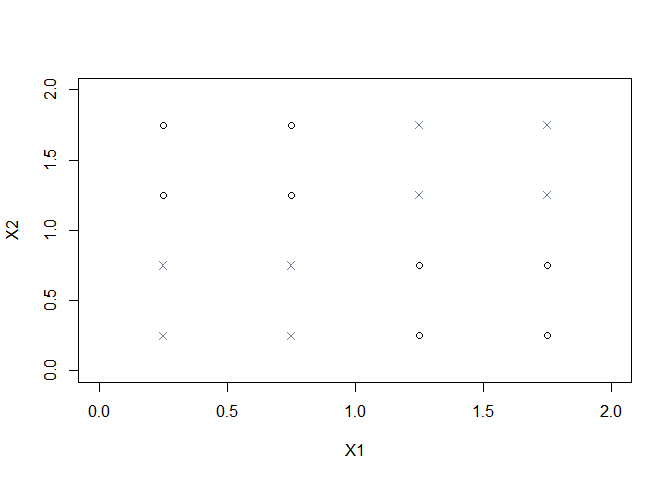
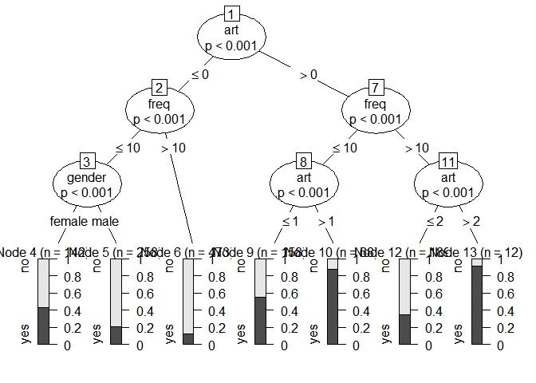

# Evtree

Take from [evtree: Evolutionary Learning of Globally Optimal Classification and Regression Trees in R](http://cran.r-project.org/web/packages/evtree/vignettes/evtree.pdf)


## Artificial Data

```r
## artificial data
X1 <- rep(seq(0.25, 1.75, 0.5), each = 4)
X2 <- rep(seq(0.25, 1.75, 0.5), 4)
Y <- rep(1, 16)
Y[(X1 < 1 & X2 < 1) | (X1 > 1 & X2 > 1)] <- 2
Y <- factor(Y, labels = c("O", "X"))
chess22 <- data.frame(Y, X1, X2)

plot(X2 ~ X1, data = chess22, xlim = c(0, 2), ylim = c(0, 2),
  pch = c(1, 4)[Y], col = c("black", "slategray")[Y])

## trees
library("evtree")
```

 

```r
set.seed(1090)
evtree(Y ~ ., data = chess22, minbucket = 1, minsplit = 2)
```

```
## 
## Model formula:
## Y ~ X1 + X2
## 
## Fitted party:
## [1] root
## |   [2] X1 < 1.25
## |   |   [3] X2 < 1.25: X (n = 4, err = 0.0%)
## |   |   [4] X2 >= 1.25: O (n = 4, err = 0.0%)
## |   [5] X1 >= 1.25
## |   |   [6] X2 < 1.25: O (n = 4, err = 0.0%)
## |   |   [7] X2 >= 1.25: X (n = 4, err = 0.0%)
## 
## Number of inner nodes:    3
## Number of terminal nodes: 4
```

```r
ctree(Y ~ ., data = chess22, minbucket = 1, minsplit = 2)
```

```
## 
## Model formula:
## Y ~ X1 + X2
## 
## Fitted party:
## [1] root: O (n = 16, err = 50.0%) 
## 
## Number of inner nodes:    0
## Number of terminal nodes: 1
```

```r
library("rpart")
as.party(rpart(Y ~ ., data = chess22, minbucket = 1, minsplit = 2))
```

```
## [1] root *
```

```r
library("RWeka")
as.party(J48(Y ~ ., data = chess22))
```

```
## 
## Model formula:
## Y ~ X1 + X2
## 
## Fitted party:
## [1] root: O (n = 16, err = 50.0%) 
## 
## Number of inner nodes:    0
## Number of terminal nodes: 1
```


## Real Data

```r
## trees
data("BBBClub", package = "evtree")
attach(BBBClub)
library("rpart")
rp  <- as.party(rpart(choice ~ ., data = BBBClub, minbucket = 10))
rp2 <- as.party(rpart(choice ~ ., data = BBBClub, minbucket = 10, maxdepth = 2))
plot(rp)
```

 

```r
ct  <- ctree(choice ~ ., data = BBBClub, minbucket = 10, mincrit = 0.99)
ct2 <- ctree(choice ~ ., data = BBBClub, minbucket = 10, mincrit = 0.99, maxdepth = 2)
plot(ct)
```

 

```r
set.seed(1090)
ev <- evtree(choice ~ ., data = BBBClub, minbucket = 10, maxdepth = 2)
plot(ev)
```

 

```r
ev
```

```
## 
## Model formula:
## choice ~ gender + amount + freq + last + first + child + youth + 
##     cook + diy + art
## 
## Fitted party:
## [1] root
## |   [2] first < 12
## |   |   [3] art < 1: no (n = 250, err = 30.8%)
## |   |   [4] art >= 1: yes (n = 69, err = 30.4%)
## |   [5] first >= 12
## |   |   [6] art < 2: no (n = 864, err = 21.8%)
## |   |   [7] art >= 2: yes (n = 117, err = 25.6%)
## 
## Number of inner nodes:    3
## Number of terminal nodes: 4
```

```r
## performance
mc <- function(obj) 1 - mean(predict(obj) == BBBClub$choice)

evalfun <- function(obj) 2 * nrow(BBBClub) * mc(obj) + width(obj) * log(nrow(BBBClub))

trees <- list("evtree" = ev, "rpart" = rp, "ctree" = ct, "rpart2" = rp2, "ctree2" = ct2)

library(plyr)
ldply(trees, function(obj){
  c("misclassification" = mc(obj),
    "evaluation function" = evalfun(obj))
})
```

```
##      .id misclassification evaluation function
## 1 evtree         0.2430769            660.6805
## 2  rpart         0.2384615            655.8506
## 3  ctree         0.2476923            694.1908
## 4 rpart2         0.2615385            701.5104
## 5 ctree2         0.2553846            692.6805
```

```r
ftable(tab <- table(evtree = predict(ev),
                    rpart  = predict(rp),
                    ctree  = predict(ct),
                    observed = BBBClub$choice))
```

```
##                    observed  no yes
## evtree rpart ctree                 
## no     no    no             799 223
##              yes             38  24
##        yes   no               0   0
##              yes             12  18
## yes    no    no               0   0
##              yes              0   0
##        yes   no              21  19
##              yes             30 116
```

```r
ldply(c("evtree"="evtree", "rpart"="rpart", "ctree" = "ctree"), function(nam) { # nam <- "evtree"
  mt <- margin.table(tab, c(match(nam, names(dimnames(tab))), 4))
  c(abs = as.vector(rowSums(mt))[2],
    rel = round(100 * prop.table(mt, 1)[2, 2], digits = 3))
})
```

```
##      .id abs    rel
## 1 evtree 186 72.581
## 2  rpart 216 70.833
## 3  ctree 238 66.387
```

```r
library(risk)
ldply(trees, function(t){
  round(conf_matrix(predict(t), BBBClub$choice)$indicators.t, 3)
})
```

```
##      .id    AC Recall    FP    TN    FN     P
## 1 evtree 0.757  0.338 0.057 0.943 0.662 0.726
## 2  rpart 0.762  0.382 0.070 0.930 0.618 0.708
## 3  ctree 0.752  0.395 0.089 0.911 0.605 0.664
## 4 rpart2 0.738  0.225 0.033 0.967 0.775 0.750
## 5 ctree2 0.745  0.368 0.088 0.912 0.632 0.650
```
