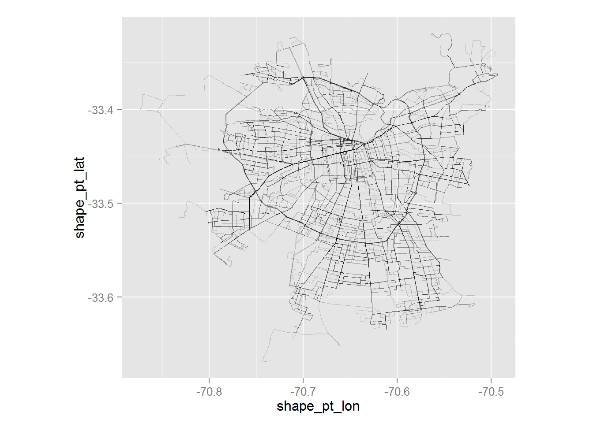
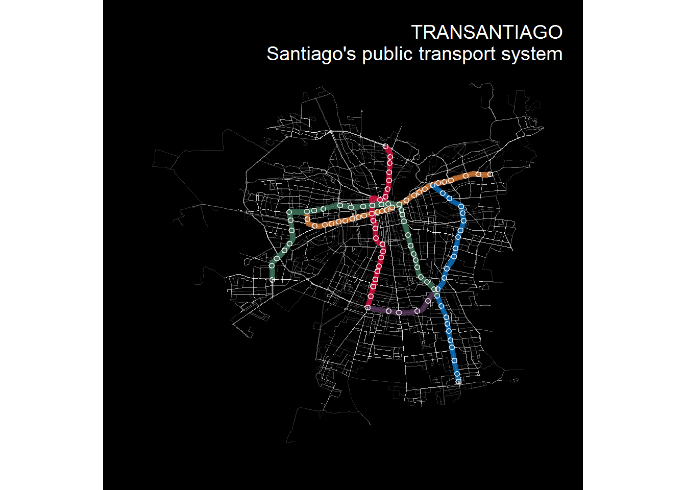

GTFS stands from *General Transit Feed Specification* and is a format for public transportation schedules and geographic data. And like data, is fun to use in R. 

Usually is a zip file with txt files: `routes.txt`, `shapes.txt`, `stations.txt`, etc. And define  


```r
library(ggplot2)
shapes <- read.csv("data/shapes.txt")
```

The content is the 


|shape_id   | shape_pt_lat| shape_pt_lon| shape_pt_sequence|
|:----------|------------:|------------:|-----------------:|
|225-I-BASE |       -33.39|       -70.55|                 0|
|225-I-BASE |       -33.39|       -70.55|                 1|
|225-I-BASE |       -33.39|       -70.54|                 2|
|225-I-BASE |       -33.39|       -70.54|                 3|
|225-I-BASE |       -33.39|       -70.54|                 4|
|225-I-BASE |       -33.39|       -70.54|                 5|

So, it's ultra simple plot with ggplot.


```r
p <- ggplot(shapes) +
  geom_path(aes(shape_pt_lon, shape_pt_lat, group=shape_id), size=.2, alpha=.1) +
  coord_equal()
p
```

 

You can also embed plots, for example: You can also embed plots, for example: You can also embed plots, for example: You can also embed plots, for example: You can also embed plots, for example: You can also embed plots, for example: You can also embed plots, for example: You can also embed plots, for example: 


```r
library(devtools)
library(plyr)
library(dplyr)
source_url("https://raw.githubusercontent.com/jbkunst/reuse/master/R/gg_themes.R")
```

You can also embed plots, for example: You can also embed plots, for example: You can also embed plots, for example: You can also embed plots, for example: You can also embed plots, for example: You can also embed plots, for example: You can also embed plots, for example: You can also embed plots, for example: 


```r
routes <- read.csv("data/routes.txt")
trips <- read.csv("data/trips.txt")
stops <- read.csv("data/stops.txt")

stops_metro <- stops %>% filter(!grepl("\\d", stop_id))

shapes_colors <- left_join(left_join(shapes %>% select(shape_id) %>% unique(),
                                     trips %>% select(shape_id, route_id) %>% unique(),
                                     by="shape_id"),
                           routes %>% select(route_id, route_color) %>% unique(),
                           by = "route_id")

shapes_colors <- shapes_colors  %>% mutate(route_color = paste0("#", route_color))

routes_metro <- routes %>% filter(grepl("^L\\d",route_id))

shapes_metro <- shapes %>% filter(shape_id %in% trips$shape_id[trips$route_id %in% routes_metro$route_id])

shapes_colors_metro <- shapes_colors %>% filter(shape_id %in% trips$shape_id[trips$route_id %in% routes_metro$route_id])
```

Note that the `echo = FALSE` parameter was added to the code chunk to prevent printing of the R code that generated the plot. Note that the `echo = FALSE` parameter was added to the code chunk to prevent printing of the R code that generated the plot. Note that the `echo = FALSE` parameter was added to the code chunk to prevent printing of the R code that generated the plot. Note that the `echo = FALSE` parameter was added to the code chunk to prevent printing of the R code that generated the plot. 


```r
p2 <- ggplot() +
  geom_path(data=shapes, aes(shape_pt_lon, shape_pt_lat, group=shape_id),
            color="white", size=.2, alpha=.1) +
  geom_path(data=shapes_metro, aes(shape_pt_lon, shape_pt_lat, group=shape_id, colour=shape_id),
            size = 2, alpha=.7) +
  scale_color_manual(values=shapes_colors_metro$route_color) +
  geom_point(data=stops_metro, aes(stop_lon, stop_lat),
             shape=21, colour="white", alpha =.8) +
  coord_equal() +
  theme_null() +
  theme(plot.background = element_rect(fill = "black", colour = "black"),
        title = element_text(hjust=1, colour="white")) +
  ggtitle("TRANSANTIAGO\nSantiago's public transport system")
p2
```

 

Note that the `echo = FALSE` parameter was added to the code chunk to prevent printing of the R code that generated the plot. Note that the `echo = FALSE` parameter was added to the code chunk to prevent printing of the R code that generated the plot. 

