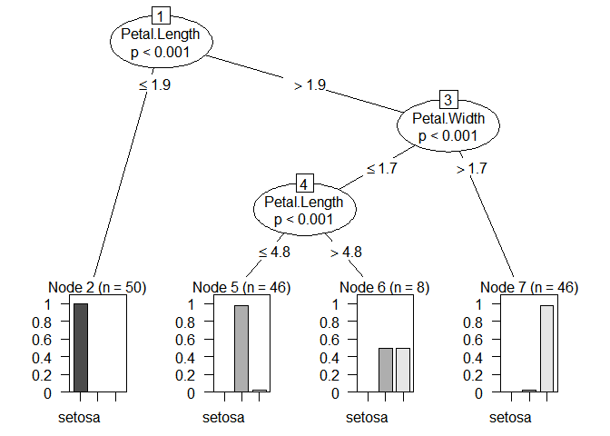
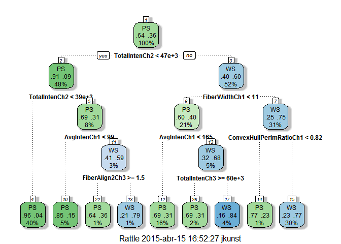
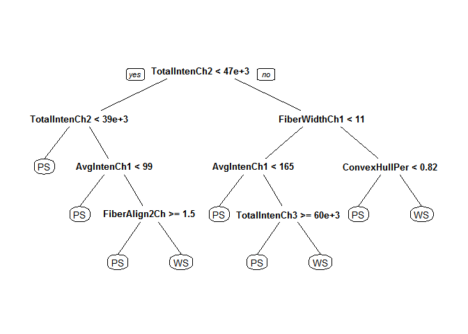

# Party!
Monday, April 13, 2015  

Ok don Mario! El ejemplo conversado. Cargamos librería `party`. Prefiero esta antes que `rpart` por un asunto de que el `plot` es mejor para visualizar el árbol.


```r
suppressPackageStartupMessages(library(party))
```

Cargamos datos de ejemplo. El bien conocido `iris`:


```
##   Sepal.Length Sepal.Width Petal.Length Petal.Width Species
## 1          5.1         3.5          1.4         0.2  setosa
## 2          4.9         3.0          1.4         0.2  setosa
## 3          4.7         3.2          1.3         0.2  setosa
## 4          4.6         3.1          1.5         0.2  setosa
## 5          5.0         3.6          1.4         0.2  setosa
## 6          5.4         3.9          1.7         0.4  setosa
```

```
## 'data.frame':	150 obs. of  5 variables:
##  $ Sepal.Length: num  5.1 4.9 4.7 4.6 5 5.4 4.6 5 4.4 4.9 ...
##  $ Sepal.Width : num  3.5 3 3.2 3.1 3.6 3.9 3.4 3.4 2.9 3.1 ...
##  $ Petal.Length: num  1.4 1.4 1.3 1.5 1.4 1.7 1.4 1.5 1.4 1.5 ...
##  $ Petal.Width : num  0.2 0.2 0.2 0.2 0.2 0.4 0.3 0.2 0.2 0.1 ...
##  $ Species     : Factor w/ 3 levels "setosa","versicolor",..: 1 1 1 1 1 1 1 1 1 1 ...
```

Un **arbolito simple** y lo miramos:


```r
tri <- ctree(Species ~ ., data = iris)

plot(tri)
```

 

Creamos una data **nueva** y vemos la prediccion y el nodo al cual pertenece.


```r
niudata <- data.frame(Sepal.Length = 1,
                      Sepal.Width = 2,
                      Petal.Length  = 2,
                      Petal.Width = 1)
str(niudata)
```

```
## 'data.frame':	1 obs. of  4 variables:
##  $ Sepal.Length: num 1
##  $ Sepal.Width : num 2
##  $ Petal.Length: num 2
##  $ Petal.Width : num 1
```

```r
predict(tri, niudata, type ="prob")
```

```
## [[1]]
## [1] 0.00000000 0.97826087 0.02173913
```

```r
where(tri, niudata)
```

```
## [1] 5
```


chantatachan

# Ahora, lo que se necesita

Librería que necesitamos:


```r
library("rpart")
library("caret")  
library("rattle")
library("rpart.plot")
library("dplyr")
```

Obtenemos datos y creamos un árbol y graficamos por si acaso:


```r
data(segmentationData)
segmentationData <- segmentationData[,-c(1,2)]

tree <- rpart(Class ~ ., data=segmentationData, control = rpart.control(minsplit=20, cp=0, maxdepth=4))

fancyRpartPlot(tree)
```

 

```r
prp(tree)    	
```

 


Al final, dado que tengo la clase original, los nodos y la prediccion del arbol (no en probabilidad, sino en clase). Puedo sacar por nodo la tasa de acierto y el porcentaje de casos que caen por nodo.


```r
rpart_summary <- function(tree){
  
  code <- data.frame(target = sort(unique(tree$y)),
                     target_f = factor(attr(tree, "ylevels")))
  
  cases <- data.frame(target = tree$y,
                      node = tree$where,
                      predict = predict(tree, type="class"))
  
  cases <- left_join(cases, code, by = "target")
  
  head(cases)
  
  summary <- cases %>%
    group_by(node) %>%
    summarise(count = n(),
              percent = count/nrow(.),
              node_accuracy = sum(predict == target_f)/count,
              node_prediction = unique(predict))
  
  summary
  
}
```


Y vemos el resultado: 

```r
resultado <- rpart_summary(tree)
resultado
```

```
## Source: local data frame [9 x 5]
## 
##   node count    percent node_accuracy node_prediction
## 1    3   814 0.40316989     0.9557740              PS
## 2    5    99 0.04903418     0.8484848              PS
## 3    7    25 0.01238237     0.6400000              PS
## 4    8    29 0.01436355     0.7931034              WS
## 5   11   323 0.15998019     0.6934985              PS
## 6   13    32 0.01584943     0.6875000              PS
## 7   14    79 0.03912828     0.8354430              WS
## 8   16    22 0.01089648     0.7727273              PS
## 9   17   596 0.29519564     0.7651007              WS
```

Y podemos agregar este resumen al árbol original.


```r
tree$summary <- resultado

tree$summary
```

```
## Source: local data frame [9 x 5]
## 
##   node count    percent node_accuracy node_prediction
## 1    3   814 0.40316989     0.9557740              PS
## 2    5    99 0.04903418     0.8484848              PS
## 3    7    25 0.01238237     0.6400000              PS
## 4    8    29 0.01436355     0.7931034              WS
## 5   11   323 0.15998019     0.6934985              PS
## 6   13    32 0.01584943     0.6875000              PS
## 7   14    79 0.03912828     0.8354430              WS
## 8   16    22 0.01089648     0.7727273              PS
## 9   17   596 0.29519564     0.7651007              WS
```


