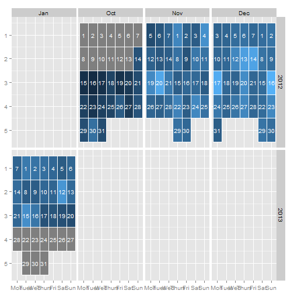

```r
# install.packages("lubridate")
library("lubridate")
rm(list = ls())

n <- 100

s <- seq(n)

values <- sin(s/pi/10) + s/n + rexp(n, rate = 2)

dates <- ymd(20121014) + days(s-1)


require("ggplot2")
```

```
## Loading required package: ggplot2
```

```r
require("dplyr")
```

```
## Loading required package: dplyr
## 
## Attaching package: 'dplyr'
## 
## The following objects are masked from 'package:lubridate':
## 
##     intersect, setdiff, union
## 
## The following object is masked from 'package:stats':
## 
##     filter
## 
## The following objects are masked from 'package:base':
## 
##     intersect, setdiff, setequal, union
```

```r
require("lubridate")
require("zoo")
```

```
## Loading required package: zoo
## 
## Attaching package: 'zoo'
## 
## The following objects are masked from 'package:base':
## 
##     as.Date, as.Date.numeric
```

```r
start <- min(dates) %>% {c(year(.), month(.), 1)} %>% paste0(collapse = "-") %>% ymd()
fnish <- max(dates) %>% {c(year(.), month(.), 1)} %>% paste0(collapse = "-") %>% ymd()
fnish <- fnish + months(1) - days(1) 

df <- left_join(data_frame(date = seq.Date(as.Date(start), as.Date(fnish), by=1)),
                data_frame(date = as.Date(dates), value = values),
                by = "date")

df <- df %>% 
  mutate(year = year(date),
         month = month(date),
         month_label = month(date, label=TRUE),
         day = day(date),
         day_label = wday(date, label=TRUE),
         day_label = factor(as.character(day_label), levels=c("Mon","Tues","Wed","Thurs","Fri","Sat","Sun"), ordered = TRUE),
         week = as.numeric(format(date,"%W")),
         monthweek = ceiling(mday(date)/7))

df <- df %>% 
  arrange(date) 

df %>% filter(year == 2015 & month == 2)
```

```
## Source: local data frame [0 x 9]
## 
## Variables not shown: date (date), value (dbl), year (dbl), month (dbl),
##   month_label (fctr), day (int), day_label (fctr), week (dbl), monthweek
##   (dbl)
```

```r
ggplot(df) +
  geom_tile(aes(day_label, monthweek, fill = value), colour = "white") +
  facet_grid(year ~ month_label, scales = "free_x") +
  scale_y_reverse() + 
  theme(legend.position = "none") +
  geom_text(aes(day_label, monthweek,label=day, size = 2), colour = "white") +
  xlab(NULL) + ylab(NULL)
```

 

```r
df <- transform(df,
                year = year(dates),
                month = month(dates),
                monthf = month(dates, label=TRUE),
                weekday = wday(dates),
                weekdayf = wday(dates, label=TRUE),
                yearmonth = as.yearmon(dates),
                yearmonthf = factor(as.yearmon(dates)),
                week = as.numeric(format(dates,"%W")), #week(dates),
                day = day(dates),
                monthday =  mday(dates),
                monthweek = ceiling(mday(dates)/7))
```

```
## Error in `[<-.data.frame`(`*tmp*`, inx[matched], value = structure(list(: replacement element 1 has 100 rows, need 123
```

```r
df <- ddply(df,  .(yearmonthf), transform, monthweek = 1 + week - min(week))
```

```
## Error in eval(expr, envir, enclos): could not find function "ddply"
```

```r
df$weekdayf <- factor(as.character(df$weekdayf), levels=c("Mon","Tues","Wed","Thurs","Fri","Sat","Sun"), ordered = TRUE)
```

```
## Error in `$<-.data.frame`(`*tmp*`, "weekdayf", value = structure(integer(0), .Label = c("Mon", : replacement has 0 rows, data has 123
```

```r
head(df)
```

```
## Source: local data frame [6 x 9]
## 
##         date value year month month_label day day_label week monthweek
## 1 2012-10-01    NA 2012    10         Oct   1       Mon   40         1
## 2 2012-10-02    NA 2012    10         Oct   2      Tues   40         1
## 3 2012-10-03    NA 2012    10         Oct   3       Wed   40         1
## 4 2012-10-04    NA 2012    10         Oct   4     Thurs   40         1
## 5 2012-10-05    NA 2012    10         Oct   5       Fri   40         1
## 6 2012-10-06    NA 2012    10         Oct   6       Sat   40         1
```

```r
df <- df[complete.cases(df),]
p <- ggplot(df, aes(weekdayf, monthweek, fill = values)) + 
  geom_tile(colour = "white") +
  facet_grid(year ~ monthf, scales = "free_x") +
  scale_y_reverse() + 
  theme(legend.position = "none") +
  geom_text(aes(label=day, size = 2), colour = "white") +
  xlab(NULL) + ylab(NULL)

print(p)
```

```
## Error in layout_base(data, cols, drop = drop): At least one layer must contain all variables used for facetting
```

