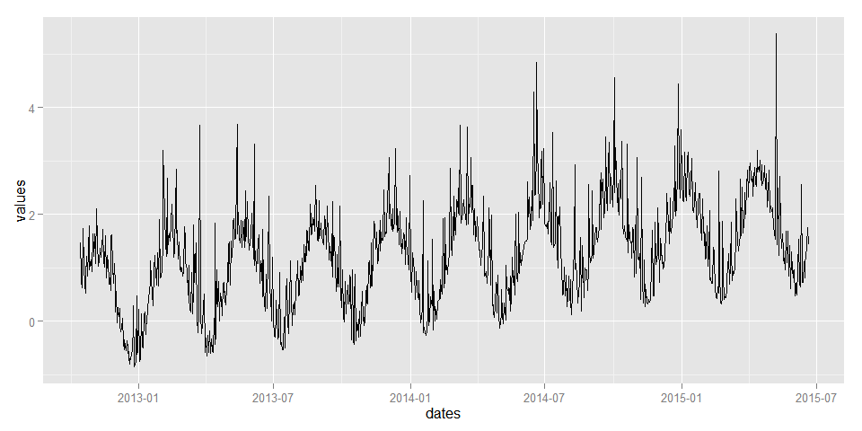
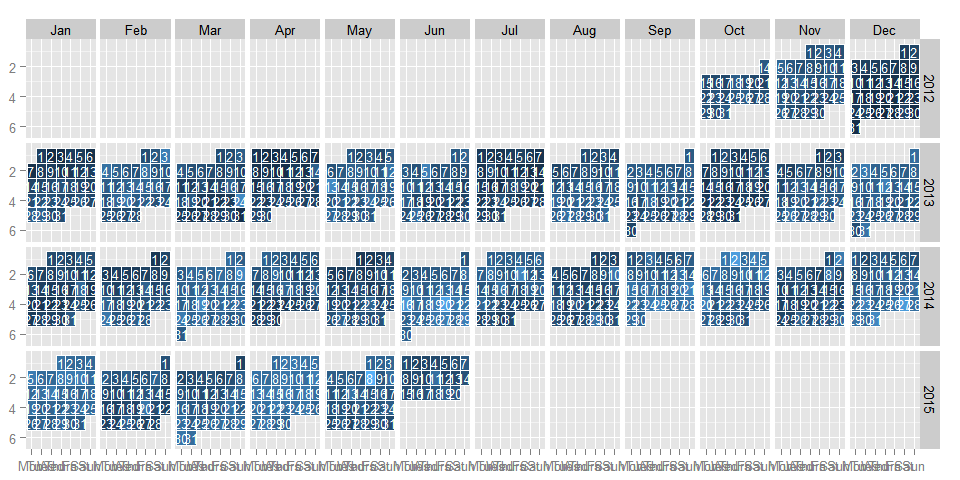

# Calendar
Joshua Kunst  


```r
library("lubridate")
library("ggplot2")
suppressPackageStartupMessages(library("dplyr"))
suppressPackageStartupMessages(library("zoo"))
library("lubridate")


rm(list = ls())

set.seed(2015)
n <- 980
s <- seq(n)
values <- sin(s/pi/5) + 1.5*s/n + rexp(n, rate = 2)
dates <- ymd(20121014) + days(s - 1)

df <- data_frame(values, dates)

gg <- ggplot(df) + geom_line(aes(dates, values))
gg
```

 

```r
start <- min(dates) %>% {c(year(.), month(.), 1)} %>% paste0(collapse = "-") %>% ymd()
fnish <- max(dates) %>% {c(year(.), month(.), 1)} %>% paste0(collapse = "-") %>% ymd()
fnish <- fnish + months(1) - days(1) 

df <- left_join(data_frame(date = seq.Date(as.Date(start), as.Date(fnish), by=1)),
                data_frame(date = as.Date(dates), value = values),
                by = "date")

df <- df %>% 
  mutate(year = year(date),
         month = month(date),
         month_label = month(date, label = TRUE),
         day = day(date),
         day_label = wday(date, label = TRUE),
         day_label = factor(as.character(day_label),
                            levels = c("Mon","Tues","Wed","Thurs","Fri","Sat","Sun"), ordered = TRUE),
         week = as.numeric(format(date,"%W")))

df_mw <- df %>% 
  group_by(year, month) %>% 
  summarise(minweek = min(week)) %>% 
  ungroup()

df <- df %>%
  left_join(df_mw, by = c("year", "month")) %>% 
  mutate(monthweek = week - minweek + 1)

df <- df %>% 
  arrange(date) %>% 
  filter(!is.na(value))

p <- ggplot(df) +
  geom_tile(aes(day_label, monthweek, fill = value), colour = "white") +
  facet_grid(year ~ month_label, scales = "free_x") +
  scale_y_reverse() + 
  theme(legend.position = "none") +
  geom_text(aes(day_label, monthweek, label = day, size = 2), colour = "white") +
  xlab(NULL) + ylab(NULL)

p
```

 

```r
sessionInfo()
```

```
## R version 3.2.0 (2015-04-16)
## Platform: i386-w64-mingw32/i386 (32-bit)
## Running under: Windows 7 (build 7601) Service Pack 1
## 
## locale:
## [1] LC_COLLATE=Spanish_Chile.1252  LC_CTYPE=Spanish_Chile.1252   
## [3] LC_MONETARY=Spanish_Chile.1252 LC_NUMERIC=C                  
## [5] LC_TIME=Spanish_Chile.1252    
## 
## attached base packages:
## [1] stats     graphics  grDevices utils     datasets  methods   base     
## 
## other attached packages:
## [1] zoo_1.7-12      dplyr_0.4.1     ggplot2_1.0.1   lubridate_1.3.3
## 
## loaded via a namespace (and not attached):
##  [1] Rcpp_0.11.6        knitr_1.10.5       magrittr_1.5      
##  [4] MASS_7.3-40        munsell_0.4.2      lattice_0.20-31   
##  [7] colorspace_1.2-6   stringr_1.0.0.9000 plyr_1.8.2        
## [10] tools_3.2.0        parallel_3.2.0     grid_3.2.0        
## [13] gtable_0.1.2       DBI_0.3.1          htmltools_0.2.6   
## [16] lazyeval_0.1.10    yaml_2.1.13        digest_0.6.8      
## [19] assertthat_0.1     reshape2_1.4.1     formatR_1.2       
## [22] memoise_0.2.1      evaluate_0.7       rmarkdown_0.6.1   
## [25] labeling_0.3       stringi_0.4-1      scales_0.2.4      
## [28] proto_0.3-10
```


---
title: "readme.R"
author: "jkunst"
date: "Wed May 20 18:09:18 2015"
---
