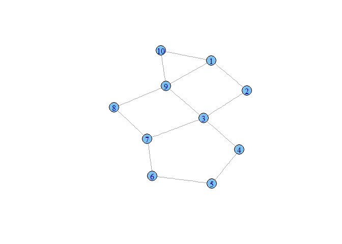
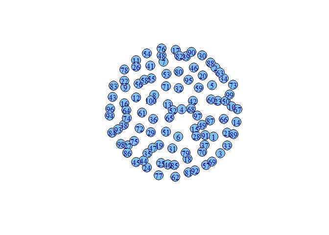

# Paths & Distances
Joshua Kunst  


```r
rm(list = ls())
suppressWarnings(library("igraph"))
suppressWarnings(library("magrittr"))
```

# `igraph` Package


```r
str <- "1 2 2 3 3 4 4 5 5 6 6 7 7 8 8 9 9 1 1 10 10 9 9 3 3 7"

edges <- str %>% 
  strsplit(" ") %>% 
  unlist() %>% 
  as.numeric() %>%
  matrix(nrow = 2, byrow = FALSE)

edges2 <- letters[edges] %>% 
  matrix(nrow = 2, byrow = FALSE)

g <- graph.empty(10, directed = FALSE)

g <- add.edges(g, edges)

plot(g)
```

 

```r
shortest.paths(g, mode = "out")
```

```
##       [,1] [,2] [,3] [,4] [,5] [,6] [,7] [,8] [,9] [,10]
##  [1,]    0    1    2    3    4    4    3    2    1     1
##  [2,]    1    0    1    2    3    3    2    3    2     2
##  [3,]    2    1    0    1    2    2    1    2    1     2
##  [4,]    3    2    1    0    1    2    2    3    2     3
##  [5,]    4    3    2    1    0    1    2    3    3     4
##  [6,]    4    3    2    2    1    0    1    2    3     4
##  [7,]    3    2    1    2    2    1    0    1    2     3
##  [8,]    2    3    2    3    3    2    1    0    1     2
##  [9,]    1    2    1    2    3    3    2    1    0     1
## [10,]    1    2    2    3    4    4    3    2    1     0
```

```r
get.all.shortest.paths(g, 1, 6:8)
```

```
## $res
## $res[[1]]
## [1] 1 9 3 7 6
## 
## $res[[2]]
## [1] 1 2 3 7 6
## 
## $res[[3]]
## [1] 1 9 8 7 6
## 
## $res[[4]]
## [1] 1 9 8 7
## 
## $res[[5]]
## [1] 1 2 3 7
## 
## $res[[6]]
## [1] 1 9 3 7
## 
## $res[[7]]
## [1] 1 9 8
## 
## 
## $nrgeo
##  [1] 1 1 2 2 2 3 3 1 1 1
```

```r
get.shortest.paths(g, 5)
```

```
## $vpath
## $vpath[[1]]
## [1] 5 4 3 2 1
## 
## $vpath[[2]]
## [1] 5 4 3 2
## 
## $vpath[[3]]
## [1] 5 4 3
## 
## $vpath[[4]]
## [1] 5 4
## 
## $vpath[[5]]
## [1] 5
## 
## $vpath[[6]]
## [1] 5 6
## 
## $vpath[[7]]
## [1] 5 6 7
## 
## $vpath[[8]]
## [1] 5 6 7 8
## 
## $vpath[[9]]
## [1] 5 4 3 9
## 
## $vpath[[10]]
## [1]  5  4  3  9 10
## 
## 
## $epath
## NULL
## 
## $predecessors
## NULL
## 
## $inbound_edges
## NULL
```

```r
g <- erdos.renyi.game(100, 1/100)

plot(g)
```

 

```r
degree.distribution(g)
```

```
## [1] 0.30 0.43 0.20 0.05 0.02
```


---
title: "readme.R"
author: "jkunst"
date: "Wed Jun 03 13:51:20 2015"
---
