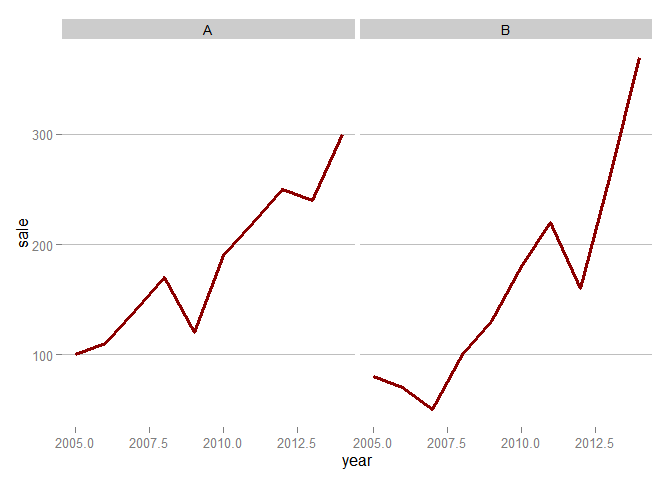
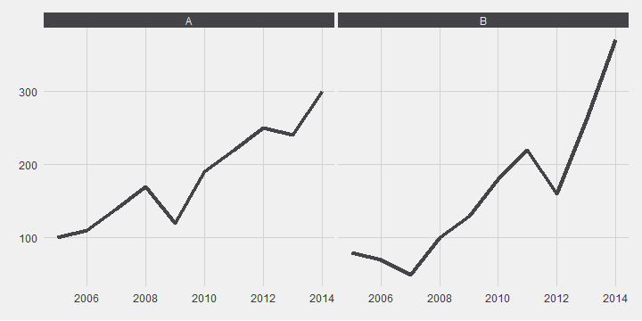
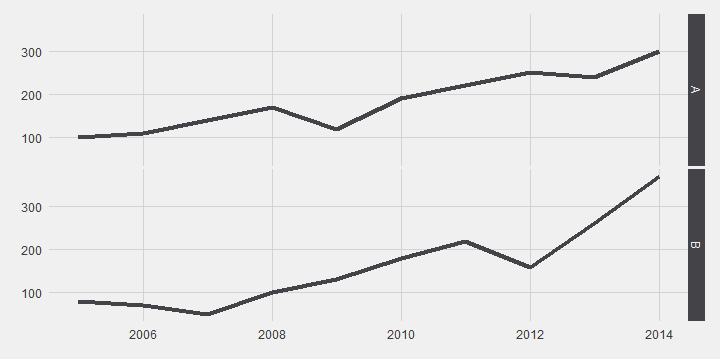
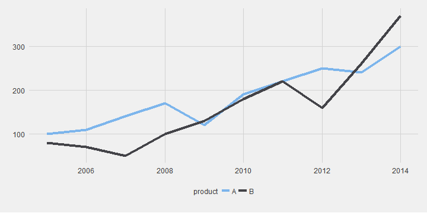
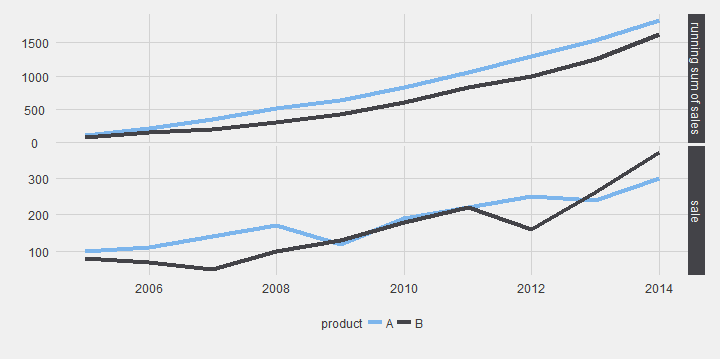
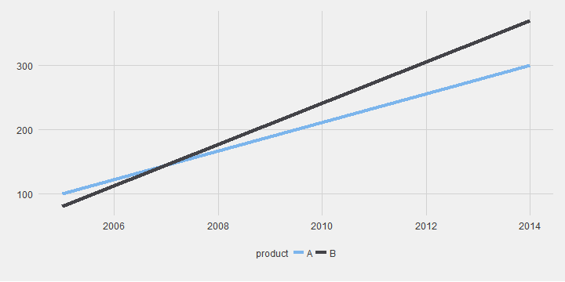
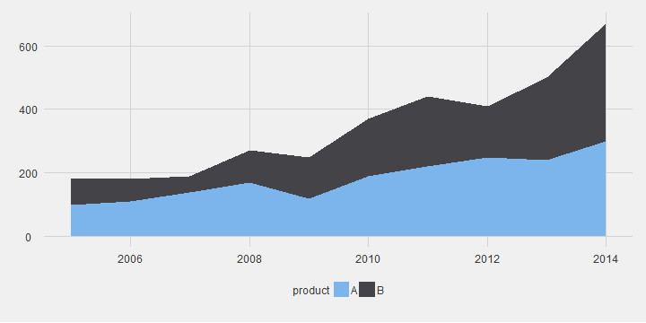
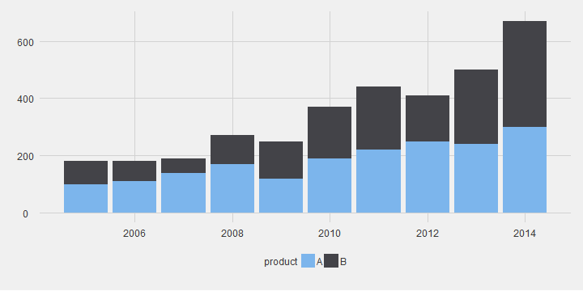
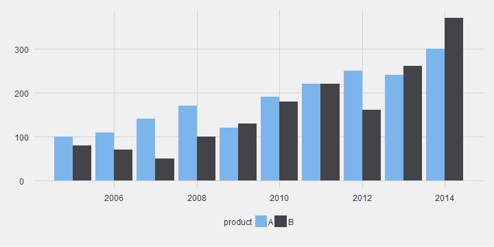

# ggplot2 version for 'Which chart should you use to show this data?'
Joshua Kunst  


[This post](http://gravyanecdote.com/visual-analytics/which-chart-should-you-use-to-show-this-data/) show
different ways to plot a *simple* data. The video uses tableau software and just for fun and learn we 
try to replicate all the plots in the ggplot's way.


```r
library("dplyr")
library("tidyr")
library("lubridate")
library("ggplot2")
library("ggthemes")
```


The theme for the ggplot:


```r
theme_set(theme_fivethirtyeight() +
theme(strip.background = element_rect(fill = "#434348"),
      strip.text = element_text(color = "#F0F0F0"),
      plot.title = element_text(face = "plain")))

update_geom_defaults("line", list(colour = "#434348", size = 1.5))
update_geom_defaults("point", list(colour = "#434348", size = 3))
update_geom_defaults("bar", list(fill = "#7cb5ec"))
update_geom_defaults("text", list(size = 4, colour = "gray30"))
```

# The data and other stuff


```r
data <- data_frame(year = 2005:2014,
                   A = c(100, 110, 140, 170, 120, 190, 220, 250, 240, 300),
                   B = c(80, 70, 50, 100, 130, 180, 220, 160, 260, 370))

data <- data %>%
  mutate(year = ymd(paste0(year, "-01-01")))

head(data)
```


year            A     B
-----------  ----  ----
2005-01-01    100    80
2006-01-01    110    70
2007-01-01    140    50
2008-01-01    170   100
2009-01-01    120   130
2010-01-01    190   180

The data will be easier to plot (this is a subjetive opinion) if we *tidier it a little bit*


```r
data2 <- data %>% gather(product, sale, -year)

head(data2)
```


year         product    sale
-----------  --------  -----
2005-01-01   A           100
2006-01-01   A           110
2007-01-01   A           140
2008-01-01   A           170
2009-01-01   A           120
2010-01-01   A           190

```r

data3 <- data2 %>%
  group_by(year) %>% 
  summarise(sale = sum(sale))


ggplot(data3) + 
  geom_line(aes(x = year, y = sale))
```



```r


ggplot(data2) +
  geom_line(aes(x = year, y = sale)) + 
  facet_grid(~product)
```



```r


ggplot(data2) +
  geom_line(aes(x = year, y = sale)) + 
  facet_grid(product ~ .)
```



```r


ggplot(data2) +
  geom_line(aes(x = year, y = sale, color = product)) +
  scale_color_hc()
```



```r


data5 <- data2 %>% 
  group_by(product) %>%
  arrange(product) %>% 
  mutate(sale = cumsum(sale))

data6 <- rbind(data2 %>% mutate(value = "sale"),
               data5 %>% mutate(value = "running sum of sales"))


ggplot(data6) + 
  geom_line(aes(x = year, y = sale, color = product)) +
  facet_grid(value ~ ., scales = "free_y") +
  scale_colour_hc() 
```



```r


data4 <- data2 %>% filter(year %in% c(max(year), min(year)))

ggplot(data4) +
  geom_line(aes(x = year, y = sale, color = product)) +
  scale_colour_hc() 
```



```r


ggplot(data2) +
  geom_area(aes(x = year, y = sale, fill = product)) +
  scale_fill_hc() 
```



```r


ggplot(data2) +
  geom_bar(aes(x = year, y = sale, fill = product),
           stat = "identity") +
  scale_fill_hc() 
```



```r


ggplot(data2) +
  geom_bar(aes(x = year, y = sale, fill = product),
           stat = "identity", position = "dodge") +
  scale_fill_hc() 
```




---
title: "readme.R"
author: "jkunst"
date: "Fri Jul 24 16:56:24 2015"
---
