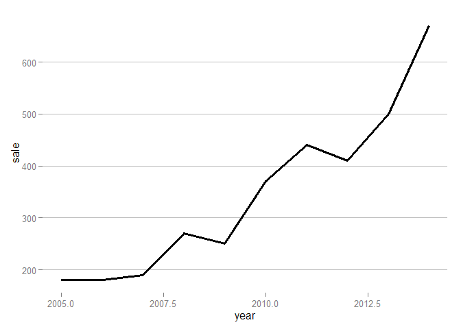
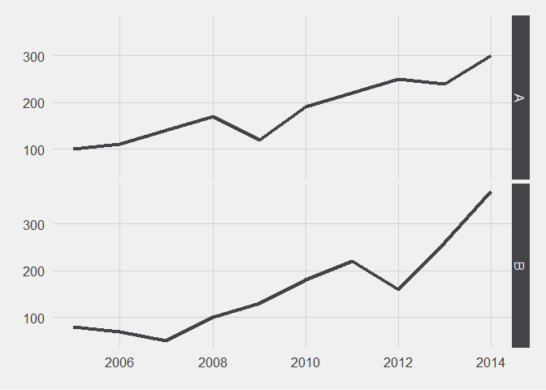
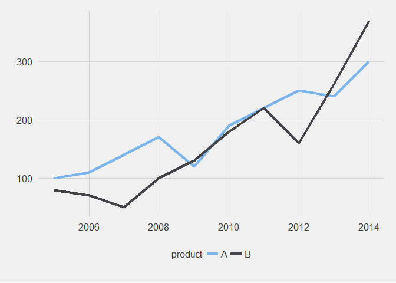
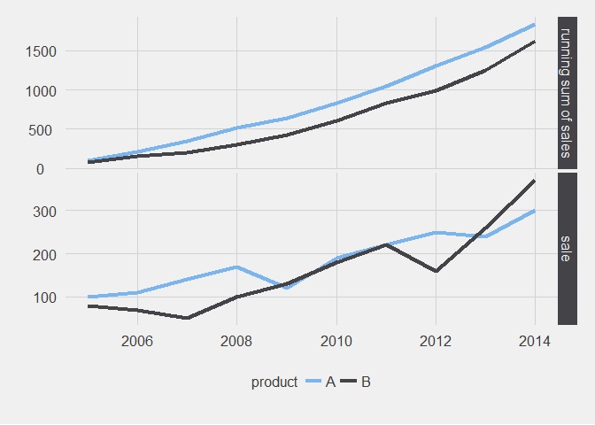
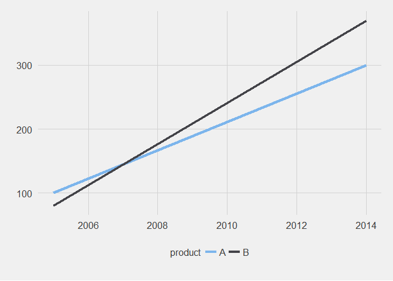
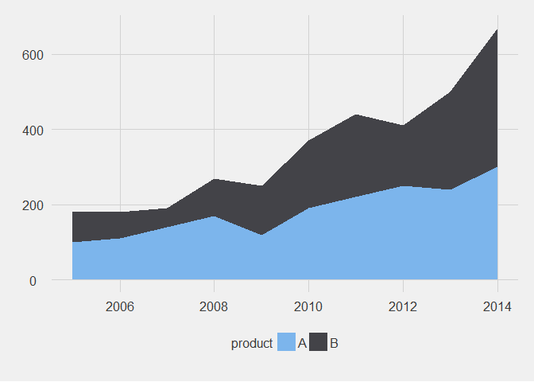
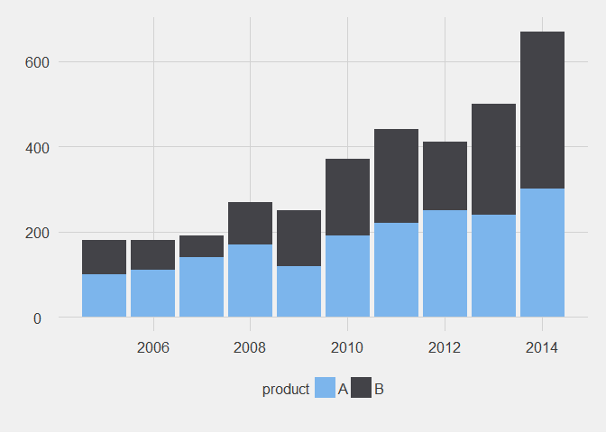
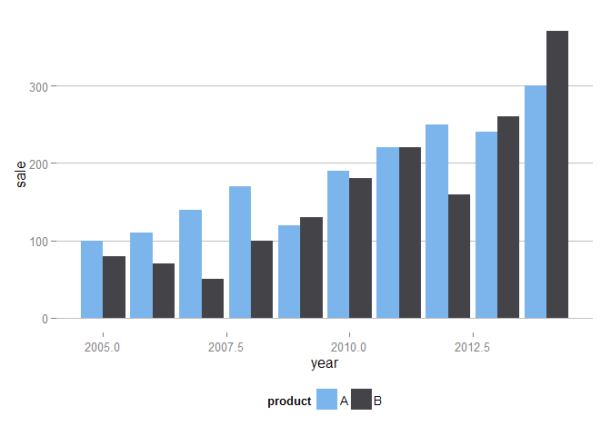

# ggplot2 version for 'Which chart should you use to show this data?'
Joshua Kunst  


[This post](http://gravyanecdote.com/visual-analytics/which-chart-should-you-use-to-show-this-data/) show
different ways to plot a *simple* data. The video uses tableau software and just for fun and learn we 
try to replicate all the plots in the ggplot's way.
In all this plots you can omit the themes (like this code: `theme_hc() + scale_colour_hc()`)


```r
library("dplyr")
library("tidyr")
library("ggplot2")
library("ggthemes")
library("lubridate")
```

# The data and other stuff


```r
data <- data_frame(year = 2005:2014,
                   A = c(100, 110, 140, 170, 120, 190, 220, 250, 240, 300),
                   B = c(80, 70, 50, 100, 130, 180, 220, 160, 260, 370))

head(data)
```

```
## Source: local data frame [6 x 3]
## 
##   year   A   B
## 1 2005 100  80
## 2 2006 110  70
## 3 2007 140  50
## 4 2008 170 100
## 5 2009 120 130
## 6 2010 190 180
```

The data will be easier to plot (this is a subjetive opinion) if we *tidier it a little bit*


```r
data2 <- data %>% gather(product, sale, -year)

head(data2)
```

```
## Source: local data frame [6 x 3]
## 
##   year product sale
## 1 2005       A  100
## 2 2006       A  110
## 3 2007       A  140
## 4 2008       A  170
## 5 2009       A  120
## 6 2010       A  190
```

# Plots


```r
data3 <- data2 %>%
  group_by(year) %>% 
  summarise(sale = sum(sale))

ggplot(data3) + 
  geom_line(aes(x = year, y = sale), size = 1.2) + 
  theme_hc() + scale_colour_hc() 
```

 

```r
ggplot(data2) +
  geom_line(aes(x = year, y = sale), size = 1.2, color = "darkred") + 
  facet_grid(~product) +
  theme_hc() + scale_colour_hc() 
```

 

```r
ggplot(data2) +
  geom_line(aes(x = year, y = sale), size = 1.2, color = "darkred") + 
  facet_grid(product ~ .) +
  theme_hc() + scale_colour_hc() 
```

 

```r
ggplot(data2) +
  geom_line(aes(x = year, y = sale, color = product), size = 1.2) +
  theme_hc() + scale_colour_hc() 
```

 

```r
data5 <- data2 %>% 
  group_by(product) %>%
  arrange(product) %>% 
  mutate(sale = cumsum(sale))

data6 <- rbind(data2 %>% mutate(value = "sale"),
               data5 %>% mutate(value = "running sum of sales"))

ggplot(data6) + 
  geom_line(aes(x = year, y = sale, color = product), size = 1.2) +
  facet_grid(value ~ ., scales = "free_y") +
  theme_hc() + scale_colour_hc() 
```

 

```r
data4 <- data2 %>% filter(year %in% c(max(year), min(year)))

ggplot(data4) +
  geom_line(aes(x = year, y = sale, color = product), size = 1.2) +
  theme_hc() + scale_colour_hc() 
```

 

```r
ggplot(data2) +
  geom_area(aes(x = year, y = sale, fill = product), size = 1.2) +
  theme_hc() + scale_fill_hc() 
```

 

```r
ggplot(data2) +
  geom_bar(aes(x = year, y = sale, fill = product), stat = "identity") +
  theme_hc() + scale_fill_hc() 
```

 

```r
ggplot(data2) +
  geom_bar(aes(x = year, y = sale, fill = product), stat = "identity", position = "dodge") +
  theme_hc() + scale_fill_hc() 
```

 


---
title: "readme.R"
author: "Joshua K"
date: "Sun Jun 07 03:11:46 2015"
---
