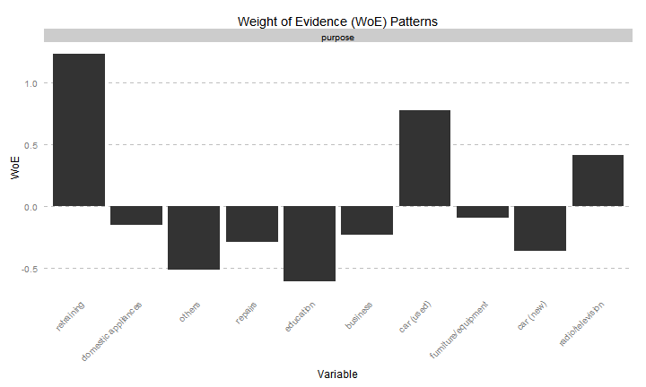
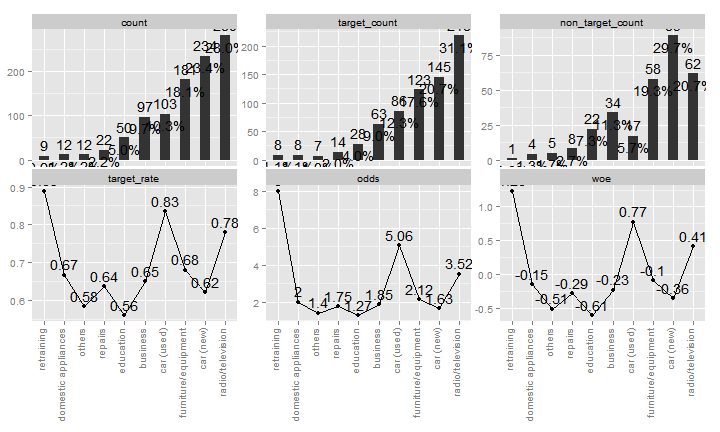

# RIV WOE Package
Joshua Kunst  


# Introducction

- woe is data frame oriented, the functions have always a data frame argument.
- riskr is variable oriented, the functions have always a variable (non dataframe) argument.
# Load packages and data


```r
# devtools::install_github("tomasgreif/woe")
library("woe")
library("riskr")

data("german_data")
```

Required for riskr


```r
german_data$gb2 <- ifelse(german_data$gb == "good", 1, 0)
```

# Bivariate analysis:

## 1 variable case


```r
lvls <- names(sort(table(german_data$purpose)))
german_data$purpose <- factor(as.character(german_data$purpose), levels = lvls)
```

### woe 


```r
iv.str(german_data,"purpose","gb", verbose = FALSE)
> Information Value 0.17
>    variable               class outcome_0 outcome_1  pct_0   pct_1  odds
> 1   purpose          retraining         8         1 0.0114 0.00333 3.429
> 2   purpose domestic appliances         8         4 0.0114 0.01333 0.857
> 3   purpose              others         7         5 0.0100 0.01667 0.600
> 4   purpose             repairs        14         8 0.0200 0.02667 0.750
> 5   purpose           education        28        22 0.0400 0.07333 0.545
> 6   purpose            business        63        34 0.0900 0.11333 0.794
> 7   purpose          car (used)        86        17 0.1229 0.05667 2.168
> 8   purpose furniture/equipment       123        58 0.1757 0.19333 0.909
> 9   purpose           car (new)       145        89 0.2071 0.29667 0.698
> 10  purpose    radio/television       218        62 0.3114 0.20667 1.507
>        woe      miv
> 1   1.2321 0.009974
> 2  -0.1542 0.000294
> 3  -0.5108 0.003406
> 4  -0.2877 0.001918
> 5  -0.6061 0.020205
> 6  -0.2305 0.005379
> 7   0.7738 0.051221
> 8  -0.0956 0.001684
> 9  -0.3592 0.032157
> 10  0.4101 0.042959
iv.plot.woe(iv.mult(german_data,"gb",vars = c("purpose"), summary = FALSE))
> Information Value 0.17
```



### riskr


```r
bt(german_data$purpose, german_data$gb2)
> Source: local data frame [10 x 11]
> 
>                  class count percent target_count target_rate
> 1           retraining     9   0.009            8       0.889
> 2  domestic appliances    12   0.012            8       0.667
> 3               others    12   0.012            7       0.583
> 4              repairs    22   0.022           14       0.636
> 5            education    50   0.050           28       0.560
> 6             business    97   0.097           63       0.649
> 7           car (used)   103   0.103           86       0.835
> 8  furniture/equipment   181   0.181          123       0.680
> 9            car (new)   234   0.234          145       0.620
> 10    radio/television   280   0.280          218       0.779
> Variables not shown: target_percent (dbl), non_target_count (dbl),
>   non_target_percent (dbl), odds (dbl), woe (dbl), iv (dbl)

plot_ba(german_data$purpose, german_data$gb2) +
  theme(axis.text.x = element_text(angle = 90, hjust = 1, vjust = 0))
```



## data frame case

### woe


```r
iv.mult(german_data, "gb", vars =  c("purpose", "ca_status", "credit_history", "status_sex"),
        verbose = FALSE)
> Information Value 0.17 
> Information Value 0.67 
> Information Value 0.29 
> Information Value NaN
> [[1]]
>    variable               class outcome_0 outcome_1  pct_0   pct_1  odds
> 1   purpose          retraining         8         1 0.0114 0.00333 3.429
> 2   purpose domestic appliances         8         4 0.0114 0.01333 0.857
> 3   purpose              others         7         5 0.0100 0.01667 0.600
> 4   purpose             repairs        14         8 0.0200 0.02667 0.750
> 5   purpose           education        28        22 0.0400 0.07333 0.545
> 6   purpose            business        63        34 0.0900 0.11333 0.794
> 7   purpose          car (used)        86        17 0.1229 0.05667 2.168
> 8   purpose furniture/equipment       123        58 0.1757 0.19333 0.909
> 9   purpose           car (new)       145        89 0.2071 0.29667 0.698
> 10  purpose    radio/television       218        62 0.3114 0.20667 1.507
>        woe      miv
> 1   1.2321 0.009974
> 2  -0.1542 0.000294
> 3  -0.5108 0.003406
> 4  -0.2877 0.001918
> 5  -0.6061 0.020205
> 6  -0.2305 0.005379
> 7   0.7738 0.051221
> 8  -0.0956 0.001684
> 9  -0.3592 0.032157
> 10  0.4101 0.042959
> 
> [[2]]
>    variable       class outcome_0 outcome_1 pct_0  pct_1  odds    woe
> 1 ca_status      (;0DM)       139       135 0.199 0.4500 0.441 -0.818
> 2 ca_status <0DM;200DM)       164       105 0.234 0.3500 0.669 -0.401
> 3 ca_status    <200DM;)        49        14 0.070 0.0467 1.500  0.405
> 4 ca_status     No Acc.       348        46 0.497 0.1533 3.242  1.176
>       miv
> 1 0.20569
> 2 0.04645
> 3 0.00946
> 4 0.40441
> 
> [[3]]
>         variable      class outcome_0 outcome_1  pct_0  pct_1  odds
> 1 credit_history no credits        15        25 0.0214 0.0833 0.257
> 2 credit_history   paid off        21        28 0.0300 0.0933 0.321
> 3 credit_history   all paid       361       169 0.5157 0.5633 0.915
> 4 credit_history      delay        60        28 0.0857 0.0933 0.918
> 5 credit_history   critical       243        50 0.3471 0.1667 2.083
>       woe      miv
> 1 -1.3581 0.084074
> 2 -1.1350 0.071882
> 3 -0.0883 0.004206
> 4 -0.0852 0.000649
> 5  0.7337 0.132423
> 
> [[4]]
>     variable                  class outcome_0 outcome_1  pct_0  pct_1
> 1 status_sex         male:div./sep.        30        20 0.0429 0.0667
> 2 status_sex female:div./sep./marr.       201       109 0.2871 0.3633
> 3 status_sex            male:single       402       146 0.5743 0.4867
> 4 status_sex         male:marr/wid.        67        25 0.0957 0.0833
> 5 status_sex          female:single         0         0 0.0000 0.0000
>    odds    woe     miv
> 1 0.643 -0.442 0.01052
> 2 0.790 -0.235 0.01793
> 3 1.180  0.166 0.01451
> 4 1.149  0.139 0.00171
> 5   NaN    NaN     NaN
```

### riskr


```r
library("tidyr")
library("dplyr")

german_data %>% 
  tbl_df() %>% 
  select(gb2, purpose, ca_status, credit_history, status_sex) %>% 
  gather(variable, value, -gb2) %>% 
  group_by(variable) %>% 
  do({ bt(.$value, .$gb2)  })
> Source: local data frame [23 x 12]
> Groups: variable
> 
>    variable               class count percent target_count target_rate
> 1   purpose            business    97   0.097           63       0.649
> 2   purpose           car (new)   234   0.234          145       0.620
> 3   purpose          car (used)   103   0.103           86       0.835
> 4   purpose domestic appliances    12   0.012            8       0.667
> 5   purpose           education    50   0.050           28       0.560
> 6   purpose furniture/equipment   181   0.181          123       0.680
> 7   purpose              others    12   0.012            7       0.583
> 8   purpose    radio/television   280   0.280          218       0.779
> 9   purpose             repairs    22   0.022           14       0.636
> 10  purpose          retraining     9   0.009            8       0.889
> ..      ...                 ...   ...     ...          ...         ...
> Variables not shown: target_percent (dbl), non_target_count (dbl),
>   non_target_percent (dbl), odds (dbl), woe (dbl), iv (dbl)


# iv.num(german_data,"duration","gb")
# iv.mult(german_data,"gb",TRUE, verbose = TRUE)
# iv.plot.summary(iv.mult(german_data,"gb",TRUE))
# head(german_data$credit_amount)
# iv.binning.simple(german_data,"credit_amount")
```


---
title: "readme.R"
author: "jkunst"
date: "Tue Jul 28 14:47:22 2015"
---
