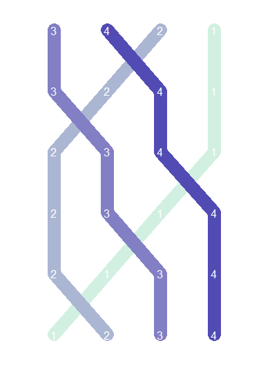
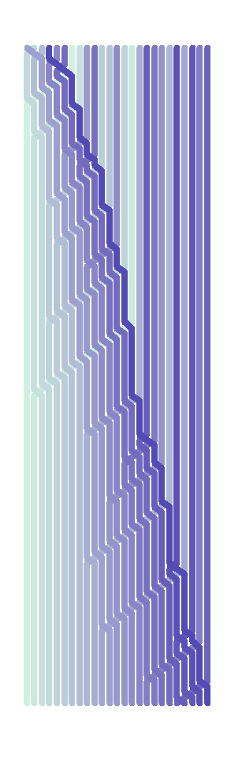
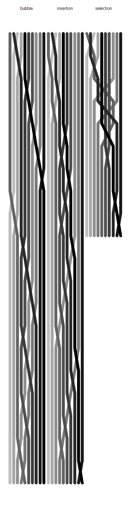

# Visualizing (Sort) Algorithms
Joshua Kunst  


Have you read [Visualizing Algorithms](http://bost.ocks.org/mike/algorithms/) by Mike Bostock? It's a *magic post*. 
We need a sort algorihms. In # http://faculty.cs.niu.edu/~hutchins/csci230/sorting.htm you can see some algorithm. 


```r
insertion_sort_steps <- function(x  = sample(1:15)){
  
  msteps <- matrix(data = x, ncol = length(x))
  
  for(i in 2:length(x)){
    
    j <- i
    
    while( (j > 1) && (x[j] < x[j-1])) {
      
      temp <- x[j]
      x[j] <- x[j-1]
      x[j-1] <- temp
      j <- j - 1
      
      msteps <- rbind(msteps, as.vector(x))
      
    }
  }
  
  msteps
  
}
```

Let's see what it does:


```r
set.seed(12345)

x <- sample(seq(4))

x
```

```
## [1] 3 4 2 1
```

```r
msteps <- insertion_sort_steps(x)

msteps
```


---  ---  ---  ---
  3    4    2    1
  3    2    4    1
  2    3    4    1
  2    3    1    4
  2    1    3    4
  1    2    3    4
---  ---  ---  ---

Every *row* is a step with the partial sort in the algorithm.
Now for plotting we need a nicer structure. So we can have a *data_frame* with the information of every *position* of every *element* in each *step*. 

The plot function:


```r
sort_matix_to_df <- function(msteps){
  
  df <- as.data.frame(msteps, row.names = NULL)
  
  names(df) <- seq(ncol(msteps))
  
  df_steps <- df %>%
    tbl_df() %>% 
    mutate(step = seq(nrow(.))) %>% 
    gather(position, element, -step) %>%
    # mutate(position = position %>% as.character() %>% as.numeric())
    arrange(step)
  
  df_steps
  
}
```

And we apply this function to the previous *step matrix*.


```r
df_steps <- sort_matix_to_df(msteps)

cbind(df_steps %>% head(nrow(.)/2), df_steps %>% tail(nrow(.)/2))
```


 step  position    element   step  position    element
-----  ---------  --------  -----  ---------  --------
    1  1                 3      4  1                 2
    1  2                 4      4  2                 3
    1  3                 2      4  3                 1
    1  4                 1      4  4                 4
    2  1                 3      5  1                 2
    2  2                 2      5  2                 1
    2  3                 4      5  3                 3
    2  4                 1      5  4                 4
    3  1                 2      6  1                 1
    3  2                 3      6  2                 2
    3  3                 4      6  3                 3
    3  4                 1      6  4                 4

The next step will be plot data frame.


```r
plot_sort <- function(df_steps, size = 5, color.low = "#D1F0E1", color.high = "#524BB4"){
  
  ggplot(df_steps, aes(step, position, group = element, color = element, label = element)) +  
    geom_path(size = size, alpha = 1, lineend = "round") +
    # geom_text(color = "gray") +
    scale_colour_gradient(low = color.low , high= color.high) +
    coord_flip() + 
    scale_x_reverse() + 
    ggthemes::theme_map() + theme(legend.position = "none")
  
}
```

```r
plot_sort(df_steps)
```

 

```r
# 
```

```r
sample(1:25) %>% 
  insertion_sort_steps() %>% 
  sort_matix_to_df() %>% 
  plot_sort(size = 4)
```

 

To order
Bubble sort


```r
bubble_sort_steps <- function(x = sample(1:15)){
  
  msteps <- matrix(data = x, ncol = length(x))
  
  for(i in 1:(length(x) - 1)){
    
    for(j in 1:(length(x) - 1)){
      
      if(x[j] > x[j+1]){
        
        temp <- x[j]
        x[j] <- x[j + 1]
        x[j + 1] <- temp
        
        msteps <- rbind(msteps, as.vector(x))
        
      }
    }
  }
  
  msteps
  
}

# selectopm
selection_sort_steps <- function(x = sample(1:15)){
  
  msteps <- matrix(data = x, ncol = length(x))
  
  for(i in 1:(length(x) - 1)){ # i <- 1
    
    smallsub <- i
    
    for(j in (i + 1):(length(x) - 1)){
      
      if (x[j] < x[smallsub]) {
        smallsub <- j
      }
    }
    
    temp <- x[i]
    x[i] <- x[smallsub]
    x[smallsub] <- temp
    
    msteps <- rbind(msteps, as.vector(x))
    
  }
  
  msteps
  
}
```

Insertion Sort


```r
insertion_sort_steps <- function(x  = sample(1:15)){
  
  msteps <- matrix(data = x, ncol = length(x))
  
  for(i in 2:length(x)){
    
    j <- i
    
    while( (j > 1) && (x[j] < x[j-1])) {
      
      temp <- x[j]
      x[j] <- x[j-1]
      x[j-1] <- temp
      j <- j - 1
      
      msteps <- rbind(msteps, as.vector(x))
      
    }
  }
  
  msteps
  
}


x <- sample(1:10)
```

```r
x %>% selection_sort_steps() %>% sort_matix_to_df() %>%  plot_sort()
```

 

```r
x %>% insertion_sort_steps() %>% sort_matix_to_df() %>%  plot_sort()
```

 

```r
x %>% bubble_sort_steps() %>% sort_matix_to_df() %>%  plot_sort()
```

 

```r
big_df <- rbind(
  x %>% selection_sort_steps() %>% sort_matix_to_df() %>% mutate(sort = "selection"),  
  x %>% insertion_sort_steps() %>% sort_matix_to_df() %>% mutate(sort = "insertion"),
  x %>% bubble_sort_steps() %>% sort_matix_to_df() %>% mutate(sort = "bubble")
)

head(big_df)
```


 step  position    element  sort      
-----  ---------  --------  ----------
    1  1                 5  selection 
    1  2                 8  selection 
    1  3                 1  selection 
    1  4                 2  selection 
    1  5                10  selection 
    1  6                 7  selection 

```r
str(big_df)
```

```
## Classes 'tbl_df', 'tbl' and 'data.frame':	520 obs. of  4 variables:
##  $ step    : int  1 1 1 1 1 1 1 1 1 1 ...
##  $ position: Factor w/ 10 levels "1","2","3","4",..: 1 2 3 4 5 6 7 8 9 10 ...
##  $ element : int  5 8 1 2 10 7 6 3 4 9 ...
##  $ sort    : chr  "selection" "selection" "selection" "selection" ...
```

```r
big_df %>%
  group_by(sort) %>% 
  summarise(steps = n())
```


sort         steps
----------  ------
bubble         210
insertion      210
selection      100

```r
ggplot(big_df, aes(step, position, group = element, color = element, label = element)) +  
  geom_path(size = 4, alpha = 1, lineend = "round") +
  # geom_text(color = "gray") +
  scale_colour_gradient(low = "gray" , high= "black") +
  facet_grid(. ~ sort) + 
  coord_flip() + 
  scale_x_reverse() + 
  ggthemes::theme_map() + theme(legend.position = "none") +
  theme(legend.position = "none",
        strip.background = element_rect(fill = "transparent",
                                        linetype = 0),
        strip.text = element_text(size = 12))
```

 

<iframe width="420" height="315" src="https://www.youtube.com/embed/M8xtOinmByo" frameborder="0"></iframe>

---
title: "readme.R"
author: "Joshua K"
date: "Sun Sep 20 23:36:06 2015"
---
