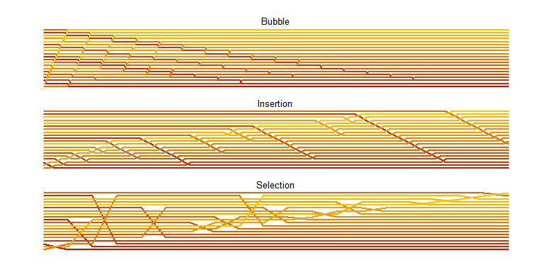
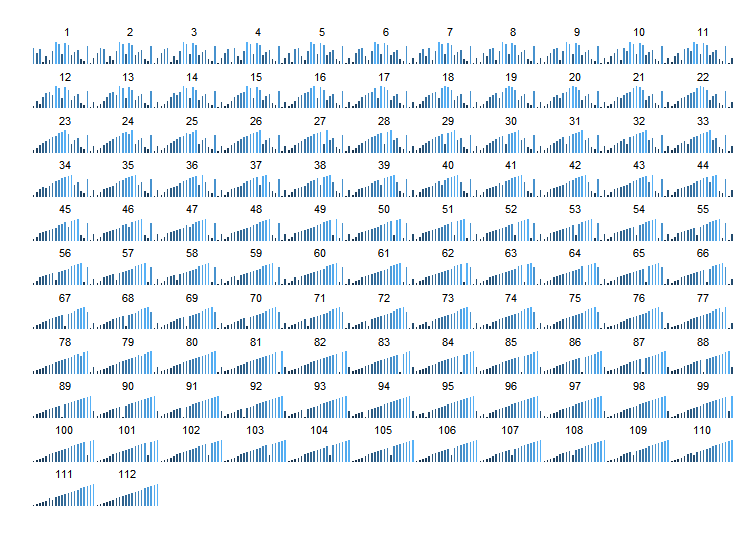

# Visualizing (Sort) Algorithms
Joshua Kunst  


Have you read [Visualizing Algorithms](http://bost.ocks.org/mike/algorithms/) by Mike Bostock? It's a *magic post*. 
We need some sorts algorihms. In # http://faculty.cs.niu.edu/~hutchins/csci230/sorting.htm you can
see some algorithms. 
 
Insertion Sort:


```r
insertion_sort_steps <- function(x  = sample(1:15)){
  
  msteps <- matrix(data = x, ncol = length(x))
  
  for (i in 2:length(x)) {
    
    j <- i
    
    while ((j > 1) && (x[j] < x[j - 1])) {
      
      temp <- x[j]
      x[j] <- x[j - 1]
      x[j - 1] <- temp
      j <- j - 1
      
      msteps <- rbind(msteps, as.vector(x))
      
    }
  }
  
  msteps
  
}
```

Let's do others algorithms:

Bubble sort:


```r
bubble_sort_steps <- function(x = sample(1:15)){
  
  msteps <- matrix(data = x, ncol = length(x))
  
  for (i in 1:(length(x) - 1)) {
    
    for (j in 1:(length(x) - 1)) {
      
      if (x[j] > x[j + 1]) {
        temp <- x[j]
        x[j] <- x[j + 1]
        x[j + 1] <- temp
      }
      
      msteps <- rbind(msteps, as.vector(x))
      
    }
  }
  
  msteps
  
}
```

Selection sort:


```r
selection_sort_steps <- function(x = sample(1:15)){
  
  msteps <- matrix(data = x, ncol = length(x))
  
  for (i in 1:(length(x) - 1)) {
    
    smallsub <- i
    
    for (j in (i + 1):(length(x) - 1)) {
      
      if (x[j] < x[smallsub]) {
        smallsub <- j
      }
    }
    
    temp <- x[i]
    x[i] <- x[smallsub]
    x[smallsub] <- temp
    
    msteps <- rbind(msteps, as.vector(x))
    
  }
  
  msteps
  
}
```

Let's see what these functions do:


```r
set.seed(12345)

x <- sample(seq(4))

x
```

```
## [1] 3 4 2 1
```

```r
msteps <- insertion_sort_steps(x)

msteps
```

```
##      [,1] [,2] [,3] [,4]
## [1,]    3    4    2    1
## [2,]    3    2    4    1
## [3,]    2    3    4    1
## [4,]    2    3    1    4
## [5,]    2    1    3    4
## [6,]    1    2    3    4
```

Every *row* is a step in sort the algorithm (a partial sort). This matrix is a hard to plot so 
we need a nicer structure. We can transform the matrix to a *data_frame* 
with the information of every *position* of every *element* in each *step*. 


```r
sort_matix_to_df <- function(msteps){
  
  df <- as.data.frame(msteps, row.names = NULL)
  
  names(df) <- seq(ncol(msteps))
  
  df_steps <- df %>%
    tbl_df() %>% 
    mutate(step = seq(nrow(.))) %>% 
    gather(position, element, -step) %>%
    arrange(step)
  
  df_steps
  
}
```

And we apply this function to the previous *steps matrix*.


```r
df_steps <- sort_matix_to_df(msteps)

head(df_steps, 10)
```

```
## Source: local data frame [10 x 3]
## 
##     step position element
##    (int)   (fctr)   (int)
## 1      1        1       3
## 2      1        2       4
## 3      1        3       2
## 4      1        4       1
## 5      2        1       3
## 6      2        2       2
## 7      2        3       4
## 8      2        4       1
## 9      3        1       2
## 10     3        2       3
```

The next step will be plot this data frame.


```r
plot_sort <- function(df_steps, size = 5, color.low = "#D1F0E1", color.high = "#524BB4"){
  
  ggplot(df_steps,
         aes(step, position, group = element, color = element, label = element)) +  
    geom_path(size = size, alpha = 1, lineend = "round") +
    scale_colour_gradient(low = color.low, high = color.high) +
    coord_flip() + 
    scale_x_reverse() + 
    ggthemes::theme_map() +
    theme(legend.position = "none")
  
}
```

Now compare this:


```r
msteps
```

```
##      [,1] [,2] [,3] [,4]
## [1,]    3    4    2    1
## [2,]    3    2    4    1
## [3,]    2    3    4    1
## [4,]    2    3    1    4
## [5,]    2    1    3    4
## [6,]    1    2    3    4
```

With:


```r
plot_sort(df_steps, size = 7) + geom_text(color = "white", size = 5)
```

 

The functions works, so we can now scroll. Are you ready?


```r
sample(seq(25)) %>% 
  insertion_sort_steps() %>% 
  sort_matix_to_df() %>% 
  plot_sort(size = 3)
```

 


Now to compare:


```r
x <- sample(seq(20))

big_df <- rbind(
  x %>% selection_sort_steps() %>% sort_matix_to_df() %>% mutate(sort = "Selection"),  
  x %>% insertion_sort_steps() %>% sort_matix_to_df() %>% mutate(sort = "Insertion"),
  x %>% bubble_sort_steps() %>% sort_matix_to_df() %>% mutate(sort = "Bubble")
)

head(big_df)
```


 step  position    element  sort      
-----  ---------  --------  ----------
    1  1                10  Selection 
    1  2                16  Selection 
    1  3                 1  Selection 
    1  4                 4  Selection 
    1  5                11  Selection 
    1  6                 6  Selection 

```r
big_df %>%
  group_by(sort) %>% 
  summarise(steps = n())
```


sort         steps
----------  ------
Bubble        7240
Insertion     1660
Selection      400

```r
ggplot(big_df,
       aes(step, position, group = element, color = element, label = element)) +  
  geom_path(size = 1, alpha = 1, lineend = "round") +
  scale_colour_gradient(low = "#c21500", high = "#ffc500") + # http://uigradients.com/#Kyoto
  facet_wrap(~sort, scales = "free_x", ncol = 1) +
  ggthemes::theme_map() +
  theme(legend.position = "none",
        strip.background = element_rect(fill = "transparent", linetype = 0),
        strip.text = element_text(size = 10))
```

 

Or like http://algs4.cs.princeton.edu/21elementary/ we can plot geom_ba


```r
df_steps <- sample(seq(20)) %>% 
  insertion_sort_steps() %>%
  sort_matix_to_df()

ggplot(df_steps) +
  geom_bar(aes(x = position, y = element, fill = element),
           stat = "identity",width = 0.5) +
  facet_wrap(~step) + 
  scale_colour_gradient(low = "#c21500", high = "#ffc500") + 
  ggthemes::theme_map() +
  theme(legend.position = "none",
        strip.background = element_rect(fill = "transparent", linetype = 0),
        plot.background = element_rect(fill = "transparent"),
        strip.text = element_text(size = 8),
        panel.border = element_rect(fill = "transparent", color = "gray"))
```

 

Some bonus content :D.

<iframe width="420" height="315" src="https://www.youtube.com/embed/M8xtOinmByo" frameborder="0"></iframe>
References:

1. http://bost.ocks.org/mike/algorithms/
1. http://faculty.cs.niu.edu/~hutchins/csci230/sorting.htm
1. http://corte.si/posts/code/visualisingsorting/
1. http://uigradients.com/#Kyoto
1. http://algs4.cs.princeton.edu/21elementary/


---
title: "readme.R"
author: "jkunst"
date: "Mon Sep 21 12:48:11 2015"
---
