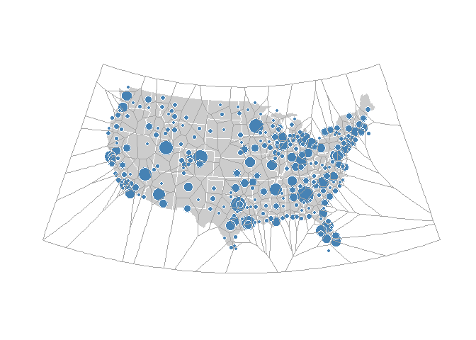

# Visualizing (Sort) Algorithms
Joshua Kunst  

[original source](http://rud.is/b/2015/07/26/making-staticinteractive-voronoi-map-layers-in-ggplotleaflet/)


```r
rm(list=ls())

library(sp)
library(rgdal)
library(deldir)
library(dplyr)
library(ggplot2)
library(ggthemes)


flights <- read.csv("http://bl.ocks.org/mbostock/raw/7608400/flights.csv", stringsAsFactors=FALSE)
airports <- read.csv("http://bl.ocks.org/mbostock/raw/7608400/airports.csv", stringsAsFactors=FALSE)


conus <- state.abb[!(state.abb %in% c("AK", "HI"))]
airports <- filter(airports,
                   state %in% conus,
                   iata %in% union(flights$origin, flights$destination))
orig <- select(count(flights, origin), iata=origin, n1=n)
dest <- select(count(flights, destination), iata=destination, n2=n)
airports <- left_join(airports,
                      select(mutate(left_join(orig, dest),
                                    tot=n1+n2),
                             iata, tot)) %>% 
  filter(!is.na(tot))


vor_pts <- SpatialPointsDataFrame(cbind(airports$longitude,
                                        airports$latitude),
                                  airports, match.ID=TRUE)


SPointsDF_to_voronoi_SPolysDF <- function(sp) {
  
  # tile.list extracts the polygon data from the deldir computation
  vor_desc <- tile.list(deldir(sp@coords[,1], sp@coords[,2]))
  
  lapply(1:(length(vor_desc)), function(i) {
    
    # tile.list gets us the points for the polygons but we
    # still have to close them, hence the need for the rbind
    tmp <- cbind(vor_desc[[i]]$x, vor_desc[[i]]$y)
    tmp <- rbind(tmp, tmp[1,])
    
    # now we can make the Polygon(s)
    Polygons(list(Polygon(tmp)), ID=i)
    
  }) -> vor_polygons
  
  # hopefully the caller passed in good metadata!
  sp_dat <- sp@data
  
  # this way the IDs _should_ match up w/the data & voronoi polys
  rownames(sp_dat) <- sapply(slot(SpatialPolygons(vor_polygons),
                                  'polygons'),
                             slot, 'ID')
  
  SpatialPolygonsDataFrame(SpatialPolygons(vor_polygons),
                           data=sp_dat)
  
}


vor <- SPointsDF_to_voronoi_SPolysDF(vor_pts)

vor_df <- fortify(vor)

states <- map_data("state")


gg <- ggplot()
# base map
gg <- gg + geom_map(data=states, map=states,
                    aes(x=long, y=lat, map_id=region),
                    color="white", fill="#cccccc", size=0.5)
# airports layer
gg <- gg + geom_point(data=arrange(airports, desc(tot)),
                      aes(x=longitude, y=latitude, size=sqrt(tot)),
                      shape=21, color="white", fill="steelblue")
# voronoi layer
gg <- gg + geom_map(data=vor_df, map=vor_df,
                    aes(x=long, y=lat, map_id=id),
                    color="#a5a5a5", fill="#FFFFFF00", size=0.25)
gg <- gg + scale_size(range=c(2, 9))
gg <- gg + coord_map("albers", lat0=30, lat1=40)
gg <- gg + theme_map()
gg <- gg + theme(legend.position="none")
gg
```

 

```r
library(leaflet)
library(rgeos)
library(htmltools)


url <- "http://eric.clst.org/wupl/Stuff/gz_2010_us_040_00_500k.json"
fil <- "gz_2010_us_040_00_500k.json"

if (!file.exists(fil)) download.file(url, fil, cacheOK=TRUE)

states_m <- readOGR("gz_2010_us_040_00_500k.json", 
                    "OGRGeoJSON", verbose=FALSE)
states_m <- subset(states_m, 
                   !NAME %in% c("Alaska", "Hawaii", "Puerto Rico"))
dat <- states_m@data # gSimplify whacks the data bits
states_m <- SpatialPolygonsDataFrame(gSimplify(states_m, 0.05,
                                               topologyPreserve=TRUE),
                                     dat, FALSE)


leaflet(width=900, height=650) %>%
  # base map
  addProviderTiles("Hydda.Base") %>%
  addPolygons(data=states_m,
              stroke=TRUE, color="white", weight=1, opacity=1,
              fill=TRUE, fillColor="#cccccc", smoothFactor=0.5) %>%
  # airports layer
  addCircles(data=arrange(airports, desc(tot)),
             lng=~longitude, lat=~latitude,
             radius=~sqrt(tot)*5000, # size is in m for addCircles O_o
             color="white", weight=1, opacity=1,
             fillColor="steelblue", fillOpacity=1) %>%
  # voronoi (click) layer
  addPolygons(data=vor,
              stroke=TRUE, color="#a5a5a5", weight=0.25,
              fill=TRUE, fillOpacity = 0.0,
              smoothFactor=0.5, 
              popup=sprintf("Total In/Out: %s",
                            as.character(vor@data$tot)))
```

<!--html_preserve--><div id="htmlwidget-4303" style="width:900px;height:650px;" class="leaflet"></div>
<script type="application/json" data-for="htmlwidget-4303">{"x":{"calls":[{"method":"addProviderTiles","args":["Hydda.Base",null,null,{"errorTileUrl":"","noWrap":false,"zIndex":null,"unloadInvisibleTiles":null,"updateWhenIdle":null,"detectRetina":false,"reuseTiles":false}]},{"method":"addPolygons","args":[[[{"lng":[-70.703819,-70.708896,-70.8268,-70.80964,-70.817865,-70.838678,-70.843302,-70.858207,-70.886504,-70.906005,-70.900386,-70.90231,-70.91246,-70.932735,-70.967229,-70.976408,-70.984335,-70.985205,-70.987649,-71.084334,-70.950824,-70.857042,-70.798028,-70.634661,-70.722845,-70.259117,-70.292736,-70.056433,-69.997086,-69.22442,-69.042702,-69.050334,-68.900985,-68.378678,-68.355171,-68.15515,-67.789761,-67.750422,-67.817892,-67.429716,-67.416462,-67.503771,-67.418747,-67.489333,-67.345585,-67.283619,-67.157919,-66.950569,-67.293403,-67.308538,-67.405492,-67.551133,-67.568159,-67.733986,-67.839896,-67.855108,-68.010719,-68.049334,-68.117746,-68.261708,-68.299063,-68.173608,-68.289409,-68.317588,-68.430946,-68.3791,-68.565161,-68.525302,-68.733004,-68.827197,-68.783679,-68.982449,-68.954465,-69.100863,-69.043403,-69.048917,-69.260862,-69.280498,-69.416165,-69.441596,-69.50329,-69.705838,-69.838689,-69.884066,-70.041351,-70.009869,-70.190014,-70.254144,-70.196911,-70.361214,-70.337884,-70.553854,-70.703819],"lat":[43.059825,43.074989,43.127086,43.225407,43.237911,43.242931,43.254321,43.256286,43.282783,43.291682,43.301358,43.304872,43.308289,43.33676,43.343777,43.367272,43.376128,43.386745,43.389521,45.305293,45.33453,45.22916,45.426706,45.383608,45.512772,45.890755,46.191599,46.415561,46.69523,47.459686,47.426651,47.256621,47.178519,47.287561,47.35707,47.32542,47.065744,45.917898,45.693705,45.583773,45.502147,45.488522,45.37726,45.281282,45.126392,45.192022,45.161004,44.814539,44.599265,44.707454,44.594236,44.621938,44.531117,44.496252,44.558771,44.419434,44.407464,44.33073,44.475038,44.484062,44.437893,44.328397,44.283858,44.225101,44.298624,44.430049,44.39907,44.227554,44.328388,44.31216,44.473879,44.426195,44.32405,44.104529,44.092164,44.062506,43.915405,43.95744,43.977267,43.964254,43.837673,43.823024,43.70514,43.778035,43.738053,43.859315,43.771866,43.676839,43.565146,43.52919,43.442051,43.321886,43.059825]},{"lng":[-68.785601,-68.874139,-68.944597,-68.825067,-68.785601],"lat":[44.053503,44.025359,44.11284,44.186338,44.053503]},{"lng":[-68.680773,-68.623554,-68.567249,-68.716474,-68.680773],"lat":[44.279242,44.255622,44.187258,44.162702,44.279242]},{"lng":[-68.942826,-68.90353,-68.868444,-68.916872,-68.95189,-68.942826],"lat":[44.281073,44.378613,44.38144,44.242866,44.218719,44.281073]},{"lng":[-68.618212,-68.661594,-68.6181,-68.584074,-68.618212],"lat":[44.012367,44.075837,44.096706,44.070578,44.012367]},{"lng":[-68.453236,-68.416434,-68.384903,-68.502096,-68.453236],"lat":[44.189998,44.187047,44.154955,44.152388,44.189998]},{"lng":[-67.619761,-67.582113,-67.571774,-67.588346,-67.619761],"lat":[44.519754,44.513459,44.453403,44.449754,44.519754]},{"lng":[-68.498637,-68.478785,-68.489641,-68.533481,-68.498637],"lat":[44.369686,44.319563,44.313705,44.329958,44.369686]},{"lng":[-68.45443,-68.45649,-68.421432,-68.415932,-68.45443],"lat":[44.298336,44.344395,44.374641,44.358143,44.298336]},{"lng":[-67.53537,-67.551186,-67.560646,-67.516029,-67.53537],"lat":[44.472355,44.480602,44.51379,44.506653,44.472355]},{"lng":[-68.792139,-68.780055,-68.839422,-68.827627,-68.792139],"lat":[44.237819,44.203129,44.236547,44.242838,44.237819]},{"lng":[-68.140549,-68.147774,-68.134094,-68.119926,-68.140549],"lat":[44.376804,44.392437,44.450733,44.411175,44.376804]},{"lng":[-68.707047,-68.746307,-68.738762,-68.682396,-68.707047],"lat":[44.272324,44.302662,44.311031,44.285595,44.272324]},{"lng":[-68.23638,-68.211329,-68.274427,-68.274719,-68.23638],"lat":[44.266254,44.257074,44.237099,44.258675,44.266254]},{"lng":[-69.043981,-69.0782,-69.096899,-69.07183,-69.043981],"lat":[44.005684,43.974132,43.981324,44.012557,44.005684]},{"lng":[-67.789024,-67.830269,-67.830269,-67.780777,-67.789024],"lat":[44.472355,44.515663,44.539722,44.477165,44.472355]},{"lng":[-68.880242,-68.876224,-68.898319,-68.902618,-68.880242],"lat":[43.863398,43.836597,43.820987,43.868855,43.863398]},{"lng":[-69.351875,-69.371506,-69.33403,-69.325111,-69.351875],"lat":[43.922543,43.931465,43.964779,43.9505,43.922543]},{"lng":[-68.355279,-68.333227,-68.314789,-68.347416,-68.355279],"lat":[44.199096,44.207308,44.197157,44.169459,44.199096]},{"lng":[-70.119671,-70.094986,-70.129383,-70.138711,-70.119671],"lat":[43.748621,43.753211,43.70832,43.727559,43.748621]},{"lng":[-68.358388,-68.346724,-68.331032,-68.365176,-68.358388],"lat":[44.125082,44.127749,44.10758,44.101464,44.125082]},{"lng":[-70.171245,-70.190323,-70.207165,-70.188047,-70.171245],"lat":[43.663498,43.642986,43.63369,43.673762,43.663498]},{"lng":[-67.51841,-67.541611,-67.481529,-67.517815,-67.51841],"lat":[44.554241,44.58934,44.580414,44.579823,44.554241]},{"lng":[-68.499465,-68.491521,-68.51706,-68.511266,-68.499465],"lat":[44.12419,44.109833,44.10341,44.125082,44.12419]},{"lng":[-68.472831,-68.460205,-68.454224,-68.48452,-68.472831],"lat":[44.219767,44.212498,44.199534,44.202886,44.219767]},{"lng":[-69.42792,-69.423324,-69.440913,-69.433762,-69.42792],"lat":[43.928798,43.915507,43.909767,43.949353,43.928798]},{"lng":[-70.152589,-70.145033,-70.128271,-70.14089,-70.152589],"lat":[43.746794,43.773668,43.774009,43.753204,43.746794]},{"lng":[-69.134735,-69.125107,-69.117546,-69.1203,-69.134735],"lat":[43.86031,43.89674,43.898117,43.873371,43.86031]},{"lng":[-70.087621,-70.093704,-70.118291,-70.095727,-70.087621],"lat":[43.699913,43.6918,43.683343,43.709278,43.699913]},{"lng":[-70.163884,-70.146115,-70.135563,-70.170284,-70.163884],"lat":[43.692404,43.701635,43.700658,43.675441,43.692404]},{"lng":[-70.607834,-70.617249,-70.599686,-70.601349,-70.607834],"lat":[42.977764,42.99202,43.006016,42.981083,42.977764]},{"lng":[-70.186213,-70.192574,-70.21313,-70.201893,-70.186213],"lat":[43.682655,43.673139,43.662973,43.685483,43.682655]},{"lng":[-68.459244,-68.486046,-68.491547,-68.45443,-68.459244],"lat":[44.255032,44.269466,44.283215,44.257778,44.255032]},{"lng":[-70.061325,-70.060928,-70.056541,-70.04377,-70.061325],"lat":[43.7421,43.760849,43.772022,43.763641,43.7421]},{"lng":[-69.319756,-69.318565,-69.313805,-69.306664,-69.319756],"lat":[43.854729,43.879711,43.881496,43.867817,43.854729]},{"lng":[-70.046562,-70.046165,-70.029808,-70.040184,-70.046562],"lat":[43.781998,43.79636,43.811123,43.784389,43.781998]},{"lng":[-69.307908,-69.300818,-69.322559,-69.321141,-69.307908],"lat":[43.773767,43.768599,43.755883,43.765763,43.773767]},{"lng":[-70.079285,-70.08886,-70.072098,-70.071304,-70.079285],"lat":[43.706989,43.714569,43.718956,43.713772,43.706989]},{"lng":[-70.096039,-70.101227,-70.087257,-70.088455,-70.096039],"lat":[43.672276,43.675468,43.691029,43.681454,43.672276]},{"lng":[-70.135957,-70.129721,-70.116176,-70.128198,-70.135957],"lat":[43.753219,43.76408,43.765189,43.755667,43.753219]},{"lng":[-70.228317,-70.245499,-70.224876,-70.228317],"lat":[43.538261,43.539635,43.547199,43.538261]},{"lng":[-70.10202,-70.113197,-70.089653,-70.10202],"lat":[43.77681,43.781197,43.785187,43.77681]}],[{"lng":[-73.264957,-72.809113,-72.285954,-72.124526,-71.981402,-71.745817,-71.351874,-71.330206,-71.294205,-71.181803,-71.165603,-71.064201,-71.031201,-70.9665,-70.914899,-70.902768,-70.886136,-70.848625,-70.830795,-70.817296,-70.778671,-70.591469,-70.871382,-70.835991,-70.982994,-71.0049,-70.92483,-70.882764,-70.722269,-70.597892,-70.710034,-70.412476,-70.259205,-70.008462,-70.095595,-70.245385,-70.082624,-69.968598,-69.933114,-69.998071,-70.007011,-70.351634,-70.485571,-70.948431,-70.658659,-70.626529,-70.726331,-70.853121,-70.929722,-70.953299,-71.12057,-71.131312,-71.140588,-71.14091,-71.140468,-71.132888,-71.135188,-71.14587,-71.17609,-71.17599,-71.18129,-71.191178,-71.19569,-71.208371,-71.225791,-71.261392,-71.327896,-71.329296,-71.332196,-71.339297,-71.340697,-71.3817,-71.381401,-71.381401,-71.499905,-71.527306,-71.527606,-71.799242,-71.80065,-72.590233,-72.607933,-72.755838,-72.816741,-72.813541,-72.863619,-73.053254,-73.432812,-73.496879,-73.264957],"lat":[42.74594,42.736581,42.721631,42.717636,42.713294,42.707287,42.698154,42.69719,42.69699,42.73759,42.808689,42.806289,42.859089,42.868989,42.886589,42.88653,42.88261,42.860939,42.868918,42.87229,42.693622,42.639821,42.546404,42.490496,42.423996,42.28272,42.263339,42.30886,42.207959,42.00455,41.999544,41.744397,41.713954,41.800786,42.032832,42.063733,42.054657,41.9117,41.670014,41.54365,41.671579,41.634687,41.554244,41.409193,41.543385,41.712995,41.732731,41.587321,41.609479,41.51501,41.497448,41.592308,41.605102,41.607405,41.623893,41.660102,41.660502,41.662795,41.668102,41.671402,41.672502,41.674216,41.675102,41.690598,41.711701,41.752301,41.780501,41.7868,41.7923,41.7963,41.7983,41.893199,41.964799,42.018798,42.017198,42.015098,42.014998,42.008065,42.023569,42.024695,42.030795,42.036195,41.997595,42.036494,42.037709,42.039861,42.050587,42.049675,42.74594]},{"lng":[-70.59628,-70.498959,-70.450431,-70.451084,-70.838777,-70.59628],"lat":[41.471905,41.384339,41.420703,41.348161,41.347209,41.471905]},{"lng":[-70.092142,-70.049053,-69.960181,-70.118669,-70.256164,-70.275526,-70.092142],"lat":[41.297741,41.391702,41.264546,41.242351,41.288123,41.310464,41.297741]},{"lng":[-70.95546,-70.977219,-70.977402,-70.957268,-70.95546],"lat":[42.309875,42.310249,42.312294,42.331661,42.309875]},{"lng":[-70.890594,-70.895477,-70.873749,-70.87822,-70.890594],"lat":[42.326504,42.343422,42.343346,42.330627,42.326504]},{"lng":[-70.832044,-70.823735,-70.82191,-70.838452,-70.832044],"lat":[41.606504,41.598569,41.582841,41.59646,41.606504]},{"lng":[-70.811417,-70.825508,-70.832039,-70.802139,-70.811417],"lat":[41.24987,41.252277,41.259495,41.258121,41.24987]},{"lng":[-70.937332,-70.95108,-70.928185,-70.927979,-70.937332],"lat":[42.284916,42.289726,42.302814,42.297405,42.284916]},{"lng":[-70.925308,-70.928055,-70.94249,-70.930458,-70.925308],"lat":[42.317223,42.317223,42.326847,42.334751,42.317223]},{"lng":[-70.290428,-70.305893,-70.309669,-70.289047,-70.290428],"lat":[41.331959,41.332302,41.335396,41.336773,41.331959]}],[{"lng":[-82.415937,-82.523337,-82.686417,-82.713042,-82.630851,-82.813518,-82.76959,-82.874416,-82.894013,-83.096521,-83.17089,-83.439612,-83.43436,-83.453832,-83.497733,-83.595235,-83.859541,-83.880539,-83.899764,-84.019373,-84.360546,-84.806082,-84.806134,-84.805883,-84.825196,-84.96086,-84.971551,-84.972803,-85.039436,-85.30814,-85.518251,-85.607548,-85.608312,-85.622608,-85.791363,-86.041027,-86.127844,-86.21759,-86.519318,-86.641186,-86.800611,-86.824828,-86.619442,-86.356218,-86.225613,-86.232707,-86.540916,-86.431043,-86.514702,-86.26871,-86.254996,-86.089186,-86.066745,-85.807403,-85.551072,-85.651435,-85.593571,-85.475204,-85.576566,-85.504775,-85.3958,-85.371593,-84.91585,-85.109252,-84.940526,-85.077313,-84.726192,-83.385104,-83.265896,-83.454168,-83.273393,-83.332533,-83.53771,-83.58409,-83.877694,-83.939297,-83.897078,-83.666052,-83.470053,-83.448416,-83.33227,-83.400985,-82.967439,-82.793205,-82.633641,-82.415937],"lat":[43.005555,42.607486,42.518597,42.597904,42.673341,42.640833,42.59338,42.523535,42.389437,42.290138,42.015185,41.813162,41.737058,41.732647,41.731847,41.729148,41.72125,41.720081,41.719961,41.716668,41.706621,41.696089,41.743115,41.760216,41.75999,41.759438,41.759527,41.759366,41.759985,41.760097,41.759513,41.759079,41.759193,41.759049,41.759051,41.760512,41.760592,41.760016,41.759447,41.759633,41.760251,41.76024,41.893827,42.254166,42.594765,43.015762,43.633158,43.815975,44.058119,44.345324,44.691935,44.741496,44.905685,44.949814,45.210742,44.831624,44.768783,44.991053,44.760208,44.768082,44.931018,45.270834,45.393115,45.521626,45.721832,45.765619,45.786905,45.274195,45.026844,45.03188,44.713901,44.340464,44.248171,44.056748,43.959235,43.715369,43.664022,43.591292,43.723418,43.861902,43.880522,43.916208,44.066138,44.023247,43.831224,43.005555]},{"lng":[-87.590208,-87.631535,-87.652512,-87.659952,-87.661296,-87.678209,-87.683902,-87.703492,-87.717945,-87.724601,-87.727768,-87.736509,-87.648126,-87.647729,-87.653568,-87.656632,-87.657349,-87.675017,-87.685934,-87.693956,-87.708329,-87.718891,-87.738352,-87.754104,-87.769172,-87.783076,-87.790324,-87.810076,-87.823028,-87.826918,-87.832612,-87.835303,-87.838141,-87.850133,-87.851475,-87.850418,-87.852784,-87.863489,-87.864873,-87.867037,-87.871204,-87.879835,-87.888052,-87.871485,-87.875692,-87.875424,-87.870905,-87.859418,-87.849322,-87.860432,-87.860127,-87.861697,-87.812976,-87.805773,-87.807388,-87.806891,-87.79896,-87.797824,-87.796409,-87.792769,-87.793215,-87.802267,-87.80339,-87.832296,-87.833591,-87.829346,-87.792372,-87.788798,-87.787534,-87.786767,-87.785647,-87.777199,-87.780845,-87.824676,-87.781623,-87.782226,-87.80188,-87.809075,-87.805076,-87.805081,-87.810144,-87.812338,-87.837343,-87.85548,-87.864141,-87.873339,-87.875813,-87.882261,-87.891905,-87.898363,-87.900005,-87.902707,-87.905873,-87.908933,-87.921999,-87.92913,-87.963452,-87.963996,-87.96697,-87.986429,-87.989656,-87.981789,-87.98087,-87.991447,-88.050634,-88.072091,-88.094047,-88.103247,-88.105355,-88.107506,-88.116024,-88.129461,-88.135067,-88.122947,-88.114267,-88.109089,-88.106622,-88.088825,-88.084985,-88.08259,-88.077534,-88.075146,-88.073134,-88.081781,-88.095841,-88.101814,-88.095354,-88.102908,-88.121864,-88.126382,-88.127594,-88.127428,-88.146352,-88.158704,-88.170096,-88.191991,-88.197627,-88.201852,-88.209585,-88.215025,-88.222167,-88.223773,-88.23314,-88.239672,-88.245752,-88.249117,-88.254816,-88.259343,-88.292381,-88.300965,-88.316894,-88.320531,-88.326953,-88.330296,-88.330137,-88.380183,-88.388847,-88.395308,-88.409864,-88.414849,-88.416914,-88.492495,-88.506205,-88.514601,-88.523131,-88.532414,-88.534876,-88.541078,-88.550756,-88.565485,-88.58067,-88.589,-88.592874,-88.59386,-88.60144,-88.662902,-88.815629,-88.820592,-88.831544,-88.837991,-88.840584,-88.843903,-88.848464,-88.85027,-89.09163,-89.125136,-89.194508,-89.218156,-89.495723,-89.533801,-89.638416,-89.667617,-89.90991,-89.918798,-90.120489,-90.12138,-90.119468,-90.118791,-90.120198,-90.120614,-90.119729,-90.116741,-90.118827,-90.119691,-90.122287,-90.133871,-90.13225,-90.144359,-90.146816,-90.152936,-90.157851,-90.158972,-90.158603,-90.163422,-90.166919,-90.17786,-90.180336,-90.193294,-90.189426,-90.188996,-90.193394,-90.204009,-90.211753,-90.216594,-90.220532,-90.228735,-90.230324,-90.229402,-90.231587,-90.243395,-90.246043,-90.25716,-90.263018,-90.265269,-90.266528,-90.27018,-90.270422,-90.274721,-90.271971,-90.277131,-90.316983,-90.331887,-90.350121,-90.353534,-90.3616,-90.369964,-90.387228,-90.39332,-90.395272,-90.400041,-90.400429,-90.402019,-90.407775,-90.414596,-90.418136,-89.790663,-89.415154,-88.972802,-88.217822,-87.801184,-87.712421,-87.957058,-88.349952,-88.462349,-88.143688,-88.175197,-87.680668,-87.351071,-87.008724,-86.850111,-86.698139,-86.678182,-86.586168,-86.161681,-84.954009,-85.027513,-85.015211,-84.63102,-84.551496,-84.128925,-84.097766,-84.251424,-84.026536,-84.071741,-83.896489,-84.376429,-84.656567,-84.746985,-85.01399,-85.5001,-85.697203,-86.278007,-86.351658,-86.580936,-86.613803,-86.718191,-86.541464,-86.78208,-86.838746,-86.964275,-87.031435,-87.059533,-87.196852,-87.590208],"lat":[45.095264,45.106224,45.108633,45.107512,45.112566,45.130084,45.144135,45.152206,45.161156,45.167452,45.169596,45.173389,45.339396,45.350721,45.354204,45.358617,45.368752,45.382454,45.388711,45.389893,45.381218,45.377462,45.358243,45.349442,45.351195,45.349725,45.353444,45.351269,45.35265,45.350538,45.352249,45.35098,45.345101,45.340435,45.342335,45.347492,45.349497,45.35302,45.354767,45.360137,45.360056,45.35149,45.354697,45.371546,45.377052,45.379373,45.383116,45.388227,45.403872,45.423504,45.429584,45.434473,45.464159,45.473139,45.477031,45.479092,45.485147,45.491468,45.494679,45.499967,45.505028,45.514233,45.538272,45.558767,45.562529,45.568776,45.563055,45.565947,45.581376,45.58283,45.58396,45.588499,45.614599,45.653211,45.67328,45.683053,45.693862,45.699717,45.703556,45.704974,45.71023,45.711303,45.716919,45.726943,45.745697,45.750439,45.753888,45.754779,45.754055,45.752503,45.753497,45.757932,45.759364,45.758297,45.756989,45.760364,45.75822,45.760794,45.764021,45.769596,45.772025,45.775081,45.776977,45.795393,45.780972,45.780261,45.785658,45.791361,45.800104,45.802668,45.804079,45.809288,45.821694,45.829565,45.837891,45.839492,45.841072,45.85586,45.862443,45.864944,45.863825,45.864832,45.871952,45.880516,45.880042,45.883504,45.913895,45.921869,45.92075,45.921499,45.922414,45.926153,45.935314,45.939064,45.93947,45.95274,45.953082,45.945173,45.94428,45.946976,45.948513,45.948712,45.947405,45.948982,45.954147,45.963663,45.963538,45.959494,45.951115,45.956168,45.960969,45.959963,45.955071,45.956625,45.965951,45.991654,45.982675,45.980391,45.979688,45.975483,45.975323,45.992157,46.017134,46.019926,46.019518,46.021212,46.018104,46.013763,46.012896,46.015708,46.006975,46.005077,46.01159,46.015132,46.017599,45.98873,46.02232,46.026261,46.02962,46.030176,46.031112,46.03305,46.038858,46.040274,46.138505,46.144531,46.157942,46.162988,46.216301,46.224119,46.243804,46.249797,46.296402,46.297741,46.336852,46.338131,46.3397,46.342253,46.345066,46.34642,46.348504,46.350652,46.359241,46.359755,46.360139,46.371828,46.381249,46.390255,46.397205,46.401293,46.409291,46.413769,46.422656,46.434605,46.439851,46.440548,46.456746,46.463143,46.467004,46.469015,46.472487,46.478175,46.490351,46.501759,46.503403,46.501573,46.501732,46.507992,46.509842,46.505245,46.504832,46.504716,46.502777,46.503829,46.507356,46.507356,46.51169,46.515416,46.519756,46.524487,46.517319,46.553278,46.537337,46.537553,46.541434,46.540549,46.533663,46.532615,46.533941,46.544384,46.544384,46.544384,46.552246,46.55732,46.566094,46.818469,46.843983,47.002096,47.448738,47.473301,47.4014,47.38726,47.076377,46.786711,46.966665,46.90458,46.842496,46.500749,46.532723,46.434114,46.438624,46.561039,46.463324,46.669475,46.771362,46.697451,46.479712,46.484868,46.418522,46.530119,46.256512,46.175888,46.131648,46.092441,45.989194,45.931962,46.052654,45.835597,46.010774,46.09694,45.960158,45.942057,45.798132,45.71192,45.599583,45.67732,45.890234,45.860195,45.722307,45.672761,45.837238,45.708497,45.636275,45.095264]},{"lng":[-88.684434,-88.418244,-88.962664,-88.911665,-89.157738,-89.255202,-88.684434],"lat":[48.115785,48.18037,47.923512,47.891344,47.824015,47.876102,48.115785]},{"lng":[-83.561836,-83.835503,-83.884827,-83.692146,-83.719788,-83.625557,-83.473946,-83.561836],"lat":[45.912563,45.941841,45.977165,46.039089,46.101032,46.102211,45.98856,45.912563]},{"lng":[-85.566441,-85.501267,-85.487026,-85.561634,-85.630016,-85.566441],"lat":[45.760222,45.754415,45.621211,45.572213,45.598166,45.760222]},{"lng":[-84.420113,-84.50042,-84.58905,-84.35408,-84.420113],"lat":[45.718815,45.736065,45.816372,45.770565,45.718815]},{"lng":[-86.033174,-85.976803,-85.95976,-86.058653,-86.033174],"lat":[45.15842,45.138363,45.058486,45.100776,45.15842]},{"lng":[-85.462578,-85.532013,-85.524445,-85.450203,-85.462578],"lat":[45.765865,45.798172,45.829792,45.796677,45.765865]},{"lng":[-86.093536,-86.133655,-86.156689,-86.117908,-86.093536],"lat":[45.007838,44.996874,45.010535,45.048478,45.007838]},{"lng":[-85.672188,-85.696869,-85.68885,-85.651863,-85.672188],"lat":[45.696632,45.69725,45.747238,45.743141,45.696632]},{"lng":[-85.833519,-85.87339,-85.883011,-85.834892,-85.833519],"lat":[45.378174,45.421482,45.443478,45.428356,45.378174]},{"lng":[-85.377129,-85.396172,-85.360954,-85.351433,-85.377129],"lat":[45.769012,45.774723,45.817554,45.795662,45.769012]},{"lng":[-83.761154,-83.821236,-83.828964,-83.787323,-83.761154],"lat":[46.086082,46.091438,46.102741,46.108093,46.086082]},{"lng":[-84.617607,-84.650917,-84.647346,-84.602142,-84.617607],"lat":[45.844925,45.859798,45.884186,45.852062,45.844925]},{"lng":[-86.636894,-86.648788,-86.658905,-86.620239,-86.636894],"lat":[45.542053,45.543243,45.586075,45.562279,45.542053]},{"lng":[-83.97345,-84.012634,-84.00576,-83.987885,-83.97345],"lat":[46.065285,46.08728,46.097591,46.103779,46.065285]},{"lng":[-83.749252,-83.77018,-83.764122,-83.733192,-83.749252],"lat":[46.034328,46.043228,46.065857,46.053364,46.034328]},{"lng":[-86.758385,-86.782448,-86.774193,-86.756325,-86.758385],"lat":[45.476204,45.487206,45.511951,45.50164,45.476204]},{"lng":[-83.853355,-83.871201,-83.85276,-83.839081,-83.853355],"lat":[46.050987,46.07597,46.085487,46.064072,46.050987]},{"lng":[-83.190582,-83.229767,-83.233894,-83.213959,-83.190582],"lat":[45.033356,45.039539,45.054665,45.056728,45.033356]},{"lng":[-84.638847,-84.634041,-84.60775,-84.619171,-84.638847],"lat":[45.955563,45.980309,45.967918,45.957447,45.955563]},{"lng":[-87.600342,-87.617531,-87.65052,-87.585907,-87.600342],"lat":[47.407711,47.407711,47.416649,47.419399,47.407711]},{"lng":[-85.770958,-85.792961,-85.782646,-85.770958,-85.770958],"lat":[45.461353,45.481976,45.491596,45.487473,45.461353]},{"lng":[-86.682877,-86.691704,-86.712326,-86.665749,-86.682877],"lat":[45.594818,45.595818,45.610939,45.606239,45.594818]},{"lng":[-84.568253,-84.582527,-84.579674,-84.563492,-84.568253],"lat":[45.950787,45.958874,45.968391,45.967442,45.950787]},{"lng":[-84.595001,-84.609871,-84.612846,-84.58905,-84.595001],"lat":[45.821129,45.82589,45.836002,45.827675,45.821129]},{"lng":[-85.84375,-85.84375,-85.835114,-85.83326,-85.84375],"lat":[45.69046,45.710209,45.711445,45.696632,45.69046]},{"lng":[-84.861969,-84.88121,-84.87915,-84.861969,-84.861969],"lat":[45.851276,45.860901,45.868462,45.860214,45.851276]},{"lng":[-83.322464,-83.338272,-83.334145,-83.31971,-83.322464],"lat":[45.186062,45.189499,45.199123,45.194313,45.186062]},{"lng":[-83.436745,-83.442245,-83.441551,-83.425743,-83.436745],"lat":[44.021656,44.02853,44.038841,44.02853,44.021656]},{"lng":[-85.582054,-85.581207,-85.569328,-85.569756,-85.582054],"lat":[44.859333,44.869938,44.873333,44.863152,44.859333]},{"lng":[-83.829224,-83.831284,-83.816162,-83.816162,-83.829224],"lat":[43.662632,43.669506,43.672943,43.666756,43.662632]},{"lng":[-86.66069,-86.669609,-86.667236,-86.6595,-86.66069],"lat":[45.520042,45.524208,45.53194,45.532536,45.520042]},{"lng":[-83.414047,-83.427109,-83.436729,-83.43261,-83.414047],"lat":[43.877026,43.877026,43.882526,43.885273,43.877026]},{"lng":[-86.71508,-86.728142,-86.715767,-86.71508],"lat":[45.497517,45.522949,45.509201,45.497517]},{"lng":[-85.590889,-85.593811,-85.581467,-85.584709,-85.590889],"lat":[45.833141,45.839809,45.841042,45.834095,45.833141]},{"lng":[-85.611832,-85.617538,-85.601837,-85.611832],"lat":[45.806015,45.814106,45.811253,45.806015]},{"lng":[-85.683296,-85.690704,-85.696259,-85.691933,-85.683296],"lat":[45.769455,45.769455,45.774391,45.777477,45.769455]}],[{"lng":[-104.057698,-104.665171,-104.72637,-105.01824,-105.913382,-106.263586,-109.08301,-109.103445,-110.110103,-110.199503,-110.362698,-110.552433,-110.785008,-111.055199,-111.048974,-111.131379,-111.143557,-111.15959,-111.175747,-111.189617,-111.23018,-111.224161,-111.29626,-111.355768,-111.385005,-111.398575,-111.414271,-111.489339,-111.525764,-111.469185,-111.471682,-111.821488,-111.870504,-111.980833,-112.032707,-112.035025,-112.036943,-112.069011,-112.093304,-112.106755,-112.125101,-112.136454,-112.164597,-112.183937,-112.221698,-112.230117,-112.242785,-112.286187,-112.312899,-112.315008,-112.319198,-112.35421,-112.358917,-112.358926,-112.387389,-112.781294,-112.81324,-112.855395,-112.886041,-113.003544,-113.083819,-113.07376,-113.05677,-113.053529,-113.049349,-113.051504,-113.068306,-113.07042,-113.06776,-113.131453,-113.341704,-113.354034,-113.354763,-113.3461,-113.356062,-113.377153,-113.455071,-113.474573,-113.498745,-113.45197,-113.513342,-113.57467,-113.594632,-113.599506,-113.657027,-113.678749,-113.684946,-113.692039,-113.688077,-113.689359,-113.738729,-113.7402,-113.733092,-113.750546,-113.765203,-113.768058,-113.764591,-113.78416,-113.766022,-113.796579,-113.809144,-113.834555,-113.819868,-113.803261,-113.806729,-113.861404,-113.904691,-113.986656,-114.019315,-114.02007,-114.014973,-114.033456,-114.067619,-114.08179,-114.086584,-114.122322,-114.131469,-114.128601,-114.129099,-114.135249,-114.192802,-114.227942,-114.248121,-114.333218,-114.360719,-114.36852,-114.415804,-114.460542,-114.498176,-114.517761,-114.526075,-114.559038,-114.538132,-114.553937,-114.563652,-114.495421,-114.504869,-114.566172,-114.544692,-114.512973,-114.509303,-114.409477,-114.388243,-114.395059,-114.431159,-114.404708,-114.403712,-114.470965,-114.47729,-114.480241,-114.493418,-114.468529,-114.460049,-114.5213,-114.527096,-114.514706,-114.445928,-114.449819,-114.468254,-114.470479,-114.465024,-114.441326,-114.425587,-114.433478,-114.413758,-114.410682,-114.422458,-114.376413,-114.400068,-114.403019,-114.395204,-114.375348,-114.35874,-114.342072,-114.348733,-114.33175,-114.331338,-114.334992,-114.322519,-114.320665,-114.360709,-114.466902,-114.593292,-114.620859,-114.696656,-114.699008,-114.713516,-114.740115,-114.76689,-114.788656,-114.765106,-114.829117,-114.856874,-114.861376,-114.864342,-114.920459,-114.927837,-114.92349,-114.928615,-114.947413,-114.931608,-114.936805,-114.929997,-115.326903,-115.410685,-115.423173,-115.428359,-115.51186,-115.551079,-115.578619,-115.639186,-115.644341,-115.657681,-115.69057,-115.718934,-115.728801,-115.718247,-115.653044,-115.686704,-115.747263,-115.734674,-115.706473,-115.689404,-115.694284,-115.72993,-115.73627,-115.72377,-115.752349,-115.77177,-115.776219,-115.780441,-115.797299,-115.824597,-115.831755,-116.04885,-116.048739,-116.049415,-116.048911,-116.049977,-116.049353,-116.048948,-116.049193,-104.048736,-104.048478,-104.048555,-104.0488,-104.048872,-104.048893,-104.048652,-104.0489,-104.048548,-104.047887,-104.047582,-104.047586,-104.048212,-104.048054,-104.044162,-104.043933,-104.041662,-104.042567,-104.043242,-104.044241,-104.045333,-104.045517,-104.044788,-104.045354,-104.045901,-104.045045,-104.046103,-104.045237,-104.046822,-104.042597,-104.040114,-104.039563,-104.040128,-104.039681,-104.057698],"lat":[44.997431,44.998618,44.999518,45.000437,45.000941,44.993788,44.99961,45.005904,45.003905,44.996188,45.000593,44.992237,45.002952,45.001321,44.474072,44.499925,44.535732,44.546376,44.552219,44.571062,44.587025,44.623402,44.702271,44.727602,44.755128,44.723343,44.710741,44.704946,44.604883,44.552044,44.540824,44.509286,44.564033,44.536682,44.546642,44.542691,44.530323,44.537104,44.530002,44.520829,44.528527,44.539911,44.541666,44.533067,44.543519,44.562759,44.568091,44.568472,44.553536,44.5419,44.53911,44.535638,44.528847,44.48628,44.448058,44.484888,44.378103,44.359975,44.395874,44.450814,44.60222,44.613928,44.618657,44.621187,44.62938,44.63695,44.656374,44.667844,44.679474,44.772837,44.784853,44.791745,44.795468,44.800611,44.819798,44.834858,44.865424,44.910846,44.942314,45.059247,45.115225,45.128411,45.166034,45.191114,45.241436,45.24927,45.253706,45.265191,45.276407,45.28355,45.329741,45.34559,45.390173,45.40272,45.410601,45.418147,45.431403,45.454946,45.520621,45.523462,45.519908,45.520729,45.566326,45.584193,45.602146,45.62366,45.622007,45.704564,45.692937,45.670332,45.654008,45.648629,45.627706,45.611329,45.59118,45.58426,45.574444,45.568996,45.565491,45.557465,45.536596,45.546423,45.545877,45.459316,45.474116,45.492716,45.509753,45.561283,45.555473,45.568129,45.570771,45.565706,45.606834,45.619299,45.637412,45.703321,45.722176,45.773864,45.791447,45.828825,45.845531,45.85164,45.88234,45.901458,45.935737,45.9559,45.967049,45.995742,46.000802,46.030325,46.03717,46.062484,46.097104,46.125287,46.146218,46.167726,46.173933,46.237119,46.248796,46.26732,46.273127,46.2738,46.287899,46.305502,46.335945,46.360673,46.387097,46.442983,46.47718,46.498675,46.503148,46.501855,46.505306,46.519679,46.533792,46.571914,46.577781,46.588154,46.611066,46.646963,46.669059,46.631695,46.632848,46.707415,46.740572,46.740223,46.715138,46.711771,46.696901,46.714033,46.758153,46.782503,46.801633,46.81196,46.813858,46.827697,46.83599,46.847594,46.854815,46.859324,46.876799,46.897378,46.919625,47.255912,47.264228,47.276222,47.278722,47.295219,47.349856,47.367007,47.378605,47.381826,47.400651,47.415059,47.420967,47.428925,47.45316,47.476035,47.485596,47.543197,47.567401,47.577299,47.595402,47.62346,47.642442,47.654762,47.696671,47.716743,47.717412,47.719818,47.743447,47.75752,47.752154,47.755785,47.977186,48.060093,48.07722,48.12493,48.237604,48.249936,48.309847,49.000912,48.999877,48.987007,48.963772,48.958997,48.94963,48.875739,48.865734,48.847387,48.751356,48.649911,48.633984,48.625644,48.599055,48.500025,47.992836,47.971515,47.862282,47.808237,47.747106,47.612288,47.343452,47.215666,47.12743,47.078574,46.83079,46.509788,46.383916,46.125002,46.000199,45.749998,45.374214,45.124039,44.999987,44.998041,44.997431]}],[{"lng":[-114.0506,-114.049995,-114.050562,-114.04966,-114.048476,-114.045829,-114.048515,-114.046743,-114.046838,-114.09987,-114.111011,-114.123144,-114.148191,-114.176824,-114.21369,-114.252651,-114.280202,-114.315557,-114.372106,-114.405475,-114.446605,-114.458369,-114.463637,-114.487034,-114.502172,-114.504631,-114.511721,-114.616694,-114.621883,-114.631716,-114.65995,-114.666538,-114.755618,-114.754099,-114.736253,-114.729707,-114.731162,-114.742779,-114.743756,-114.731159,-114.729356,-114.707526,-114.708516,-114.68112,-114.67742,-114.697767,-114.69571,-114.70371,-114.71211,-114.705409,-114.701208,-114.683208,-114.680607,-114.690008,-114.689407,-114.653406,-114.656905,-114.663105,-114.677205,-114.677643,-114.666377,-114.662125,-114.604314,-114.595931,-114.597503,-114.579963,-114.569238,-114.578524,-114.59912,-114.629934,-114.646759,-114.642831,-114.613132,-114.602908,-114.606694,-114.636893,-114.633013,-117.500117,-117.68061,-117.712358,-117.875927,-117.904625,-117.975776,-118.052189,-118.62159,-118.714312,-118.922518,-119.000975,-119.082358,-119.097161,-119.234966,-119.250988,-119.279262,-119.333423,-119.375994,-120.001014,-120.005746,-120.00174,-120.001319,-119.997634,-119.996183,-119.999358,-119.99828,-119.998855,-119.998287,-119.999168,-118.696409,-118.501002,-117.625973,-117.443062,-117.197798,-117.009255,-116.969156,-116.582217,-116.499777,-116.483094,-116.368478,-115.031783,-114.875877,-114.831077,-114.806384,-114.598267,-114.467581,-114.281855,-114.061763,-114.061774,-114.048257,-114.041723,-114.039648,-114.041152,-114.039901,-114.040942,-114.040231,-114.042553,-114.043176,-114.045218,-114.046178,-114.047783,-114.047728,-114.047079,-114.049104,-114.048054,-114.049465,-114.050485,-114.050423,-114.048473,-114.051785,-114.052962,-114.052827,-114.0506],"lat":[37.000396,36.957769,36.656259,36.621113,36.49998,36.442973,36.289598,36.245246,36.194069,36.121654,36.119875,36.111576,36.028013,36.027651,36.015613,36.020193,36.046362,36.059494,36.143114,36.147371,36.12597,36.138586,36.139695,36.129396,36.128796,36.145629,36.150956,36.130101,36.13213,36.142306,36.124145,36.117343,36.087166,36.07944,36.05847,36.028166,36.021862,36.009963,35.985095,35.943916,35.941413,35.92806,35.912313,35.885364,35.874728,35.854844,35.830601,35.814585,35.806185,35.708287,35.701187,35.689387,35.685488,35.664688,35.651412,35.610789,35.534391,35.524491,35.513491,35.489742,35.466856,35.444241,35.353584,35.325234,35.296954,35.20964,35.18348,35.12875,35.12105,35.118272,35.101872,35.096503,35.083097,35.068588,35.058941,35.028367,35.002085,37.22038,37.353399,37.374931,37.497267,37.515836,37.569293,37.62493,38.034389,38.102185,38.249919,38.303675,38.361267,38.372853,38.468997,38.48078,38.499914,38.538328,38.566793,38.999574,39.22521,39.538852,39.72242,39.956505,40.262461,40.873101,41.618765,41.624893,41.749892,41.99454,41.991794,41.995446,41.998102,41.999659,42.00038,41.998127,41.998991,41.997834,41.99674,41.996885,41.996281,41.996008,42.001319,42.002207,42.001822,41.994511,41.995492,41.994214,41.993939,41.993797,41.993814,41.99372,41.884816,41.850595,41.753781,41.499921,41.49169,41.210923,40.771675,40.430282,40.398313,39.79416,39.542742,39.499943,39.005509,38.878693,38.874949,38.499955,37.999961,37.809861,37.746249,37.592783,37.103961,37.000396]}],[{"lng":[-75.526844,-75.3544,-75.330433,-75.309674,-75.271159,-75.243431,-75.189323,-75.150721,-75.145421,-75.12792,-75.12692,-75.072017,-74.944412,-74.925311,-74.860909,-74.859809,-74.856509,-74.854409,-74.835108,-74.822307,-74.816307,-74.782106,-74.758882,-74.745905,-74.740605,-74.722604,-75.058848,-75.061489,-75.070568,-75.067302,-75.067776,-75.061937,-75.06509,-75.068615,-75.078503,-75.100325,-75.117292,-75.162871,-75.183151,-75.194046,-75.194656,-75.190146,-75.192291,-75.201812,-75.200452,-75.182756,-75.176803,-75.180564,-75.19058,-75.19692,-75.20392,-75.19442,-75.182084,-75.195349,-75.196533,-75.191796,-75.17904,-75.17562,-75.171587,-75.16365,-75.1344,-75.131465,-75.123088,-75.116842,-75.108505,-75.100277,-75.090518,-75.083929,-75.097006,-75.095784,-75.076684,-75.066014,-75.051029,-75.053664,-75.065438,-75.07534,-75.075957,-75.076092,-75.079279,-75.095526,-75.111683,-75.117764,-75.118904,-75.12065,-75.120435,-75.122603,-75.13378,-75.135521,-75.132106,-75.131619,-75.130575,-75.095556,-75.089787,-75.074999,-75.070532,-75.034496,-75.025777,-75.026376,-75.025702,-75.017239,-75.011133,-75.006376,-74.994847,-74.968389,-74.969434,-74.991718,-74.923169,-74.899701,-74.882139,-74.878492,-74.874034,-74.867287,-74.859632,-74.860837,-74.867405,-74.862049,-74.861678,-74.857151,-74.848987,-74.846932,-74.845031,-74.846319,-74.838366,-74.830057,-74.821884,-74.812033,-74.792558,-74.795822,-74.79504,-74.789095,-74.774887,-74.771588,-74.763499,-74.753239,-74.694914,-73.893979,-73.929006,-74.024543,-74.189106,-74.202223,-74.214788,-74.248641,-74.27269,-73.978282,-74.096906,-74.792723,-74.967274,-74.887167,-75.139136,-75.536431,-75.526844],"lat":[39.655713,39.839917,39.849012,39.850179,39.84944,39.854597,39.880713,39.882713,39.884213,39.911813,39.961112,39.980612,40.063211,40.07071,40.08371,40.08491,40.09131,40.09311,40.10391,40.12671,40.12761,40.12081,40.134036,40.13421,40.13521,40.15001,40.418065,40.422848,40.455165,40.464954,40.472827,40.486362,40.526148,40.542223,40.548296,40.567811,40.573211,40.564096,40.567354,40.576256,40.58194,40.590359,40.602676,40.617188,40.649219,40.665971,40.675715,40.679363,40.679379,40.681299,40.691498,40.714018,40.731522,40.745473,40.751631,40.75583,40.761897,40.772923,40.777745,40.778386,40.773765,40.77595,40.786746,40.78935,40.791094,40.807578,40.815913,40.824471,40.839336,40.847082,40.849875,40.847591,40.865662,40.87366,40.885682,40.894162,40.895694,40.907042,40.91389,40.924152,40.948111,40.953023,40.956361,40.964028,40.968302,40.970152,40.970973,40.976865,40.982566,40.9889,40.991093,41.008874,41.014549,41.01713,41.01862,41.036755,41.039806,41.04444,41.046482,41.055491,41.067521,41.067546,41.076556,41.087797,41.096074,41.092284,41.138146,41.166181,41.180836,41.187504,41.198543,41.208754,41.219077,41.222317,41.22777,41.237609,41.241575,41.248975,41.251192,41.253318,41.258055,41.263077,41.277286,41.2872,41.293838,41.298157,41.310628,41.318516,41.320407,41.323281,41.324326,41.325079,41.331568,41.346122,41.357423,40.997197,40.889578,40.709436,40.643832,40.631053,40.560604,40.549601,40.488405,40.440208,39.76303,38.991991,38.933413,39.158825,39.180021,39.460559,39.655713]}],[{"lng":[-73.657336,-73.781338,-73.782577,-73.81281,-73.781369,-73.485365,-73.229285,-73.118331,-72.585327,-72.278789,-72.317238,-72.10216,-71.856214,-73.054963,-73.940591,-74.042412,-74.018272,-74.024543,-74.013784,-73.893979,-74.738455,-74.758587,-74.790417,-74.893913,-74.896399,-74.889075,-74.890358,-74.895069,-74.906887,-74.912517,-74.924092,-74.941798,-74.983341,-74.985595,-74.984372,-74.987645,-74.999612,-75.003151,-75.003706,-75.000935,-75.000911,-75.00385,-75.014919,-75.023018,-75.024757,-75.016144,-75.018524,-75.04049,-75.04676,-75.074613,-75.10464,-75.101463,-75.092876,-75.081415,-75.076889,-75.072172,-75.115598,-75.118789,-75.130983,-75.140241,-75.152898,-75.161541,-75.168733,-75.170565,-75.176633,-75.182271,-75.185254,-75.188888,-75.191441,-75.194382,-75.204002,-75.223734,-75.241134,-75.243345,-75.251197,-75.260527,-75.257564,-75.271292,-75.272778,-75.267562,-75.279094,-75.289383,-75.29143,-75.293713,-75.301664,-75.312817,-75.341125,-75.346568,-75.359579,-75.742217,-76.343722,-76.462155,-76.749675,-76.815878,-76.920784,-76.921884,-77.007536,-77.063676,-77.124693,-77.83203,-78.12473,-78.59665,-78.874759,-79.061265,-79.472472,-79.761374,-79.761951,-79.148723,-78.853455,-79.074467,-79.070469,-78.488857,-77.760231,-77.534184,-76.794708,-76.417581,-76.217958,-76.213205,-76.295628,-76.064421,-76.200249,-76.120695,-76.207783,-76.280677,-76.300532,-76.366972,-76.312647,-75.912985,-75.283136,-74.826578,-73.343124,-73.350188,-73.354633,-73.350218,-73.338734,-73.338243,-73.339603,-73.338979,-73.381359,-73.335443,-73.333154,-73.335713,-73.347072,-73.354361,-73.363791,-73.365561,-73.36556,-73.361308,-73.370142,-73.367414,-73.367209,-73.37272,-73.369669,-73.37059,-73.374134,-73.379074,-73.383157,-73.378561,-73.386783,-73.385899,-73.386497,-73.387346,-73.390231,-73.382932,-73.376849,-73.376806,-73.38164,-73.381848,-73.374389,-73.360088,-73.356788,-73.350027,-73.342932,-73.338751,-73.322026,-73.321111,-73.320836,-73.312871,-73.306707,-73.300114,-73.293613,-73.296031,-73.315016,-73.330369,-73.333575,-73.334939,-73.334637,-73.323997,-73.324545,-73.324229,-73.312299,-73.312852,-73.323596,-73.324681,-73.3305,-73.34323,-73.390583,-73.415761,-73.41578,-73.411722,-73.411316,-73.429239,-73.43774,-73.392492,-73.390302,-73.380804,-73.37827,-73.376361,-73.357547,-73.350593,-73.369725,-73.370724,-73.370612,-73.395517,-73.402078,-73.404739,-73.426463,-73.42791,-73.417668,-73.423708,-73.423815,-73.421616,-73.431229,-73.395767,-73.371889,-73.368899,-73.365562,-73.358593,-73.347621,-73.342181,-73.323893,-73.317566,-73.310606,-73.306234,-73.300285,-73.292232,-73.296924,-73.292113,-73.294621,-73.284912,-73.281296,-73.279726,-73.258631,-73.250132,-73.246585,-73.241589,-73.241891,-73.246821,-73.247698,-73.256493,-73.278673,-73.285388,-73.290944,-73.264957,-73.508142,-73.550961,-73.482709,-73.727775,-73.722575,-73.662672,-73.654671,-73.657336],"lat":[40.985171,40.885447,40.837601,40.846737,40.794907,40.946397,40.905121,40.978071,40.997587,41.158722,41.088659,40.991509,41.070598,40.666371,40.542896,40.624847,40.659019,40.709436,40.756601,40.997197,41.430641,41.423287,41.42166,41.43893,41.442179,41.451245,41.455324,41.45819,41.461131,41.475605,41.477138,41.483542,41.480894,41.485863,41.506611,41.508738,41.5074,41.508101,41.511118,41.517638,41.519292,41.524052,41.531399,41.533147,41.535099,41.544246,41.551802,41.569688,41.583258,41.605711,41.774203,41.787941,41.796386,41.796483,41.798509,41.813732,41.844638,41.845819,41.845145,41.852078,41.848564,41.849836,41.859258,41.871608,41.872371,41.862198,41.85993,41.861264,41.865063,41.867287,41.869867,41.857456,41.867118,41.866875,41.86204,41.8638,41.877108,41.88736,41.897112,41.907054,41.938917,41.942891,41.952477,41.954593,41.94838,41.950182,41.992772,41.995324,41.999445,41.997864,41.998346,41.998934,42.001689,42.001673,42.001774,42.001674,42.000819,42.000461,41.999395,41.998524,42.000452,41.999877,41.997559,41.999259,41.998255,41.999067,42.26986,42.553672,42.783958,43.077855,43.262454,43.374763,43.341161,43.234569,43.309632,43.521285,43.545156,43.753513,43.854336,43.985134,43.967931,44.031296,44.071746,43.959683,44.057188,44.100409,44.199044,44.368084,44.849156,45.01585,45.01084,44.994304,44.987352,44.976222,44.965886,44.96475,44.94337,44.917681,44.845021,44.804602,44.788759,44.782086,44.772988,44.755296,44.745254,44.741786,44.700297,44.694523,44.684853,44.681292,44.678513,44.668739,44.663478,44.662518,44.66234,44.656772,44.645764,44.641475,44.636369,44.631044,44.626924,44.623672,44.618353,44.612184,44.599598,44.595455,44.590583,44.589316,44.575455,44.562546,44.557918,44.555392,44.551907,44.548046,44.525289,44.519857,44.513631,44.507246,44.500334,44.454711,44.440559,44.428339,44.388513,44.375987,44.372288,44.364441,44.356877,44.333842,44.319247,44.310023,44.280025,44.265346,44.243897,44.243614,44.244254,44.238049,44.190886,44.132826,44.131523,44.11754,44.112686,44.079414,44.045006,43.820779,43.817371,43.810951,43.805995,43.798766,43.785933,43.771939,43.744274,43.735571,43.725329,43.696831,43.693106,43.690213,43.642598,43.634428,43.621687,43.612356,43.610989,43.603023,43.588285,43.568087,43.624489,43.62471,43.62344,43.625065,43.622509,43.62607,43.627629,43.627355,43.624114,43.628018,43.610806,43.60255,43.587323,43.584509,43.57897,43.579272,43.577579,43.574241,43.564949,43.543429,43.541855,43.534973,43.529418,43.52578,43.523173,43.259249,42.83341,42.834093,42.80192,42.74594,42.086257,41.295422,41.21276,41.100696,41.093596,41.020497,41.011697,40.985171]},{"lng":[-74.144428,-74.254588,-74.210887,-74.1894,-74.075884,-74.144428],"lat":[40.53516,40.502303,40.560902,40.642121,40.648101,40.53516]},{"lng":[-72.132225,-72.084207,-72.086975,-72.141921,-72.132225],"lat":[41.104387,41.101524,41.058292,41.094371,41.104387]},{"lng":[-71.943563,-71.926802,-72.036846,-72.018926,-71.943563],"lat":[41.286675,41.290122,41.249794,41.274114,41.286675]},{"lng":[-76.444626,-76.406471,-76.377945,-76.388603,-76.444626],"lat":[43.887505,43.921188,43.921188,43.908127,43.887505]},{"lng":[-76.334297,-76.355949,-76.3013,-76.326393,-76.334297],"lat":[43.878567,43.878567,43.917751,43.880974,43.878567]},{"lng":[-76.361748,-76.379593,-76.342117,-76.346878,-76.361748],"lat":[44.032993,44.045486,44.053814,44.03894,44.032993]},{"lng":[-72.198601,-72.213036,-72.16217,-72.186729,-72.198601],"lat":[41.164951,41.178013,41.192448,41.17963,41.164951]},{"lng":[-76.321297,-76.336761,-76.317726,-76.323677,-76.321297],"lat":[44.031208,44.034184,44.051434,44.040726,44.031208]},{"lng":[-73.773361,-73.766333,-73.766032,-73.773038,-73.773361],"lat":[40.859449,40.857317,40.844961,40.848125,40.859449]},{"lng":[-73.767176,-73.766976,-73.775276,-73.770576,-73.767176],"lat":[40.886299,40.880099,40.882199,40.888399,40.886299]},{"lng":[-74.04086,-74.037998,-74.046359,-74.047313,-74.04086],"lat":[40.700117,40.698995,40.689175,40.690466,40.700117]}],[{"lng":[-82.602877,-82.557874,-82.549682,-82.460658,-82.355157,-82.289455,-82.247521,-82.213852,-82.127146,-82.033141,-82.02874,-81.908137,-81.879382,-81.863148,-81.857333,-81.841268,-81.800812,-81.795269,-81.766102,-81.747842,-81.7349,-81.730976,-81.707438,-81.707785,-81.721334,-81.722691,-81.726082,-81.732865,-81.729813,-81.739648,-81.71489,-81.695311,-81.707963,-81.69003,-81.689115,-81.692506,-81.690236,-81.677036,-81.677535,-80.122183,-75.867044,-75.533012,-75.723662,-75.907279,-76.031949,-75.923601,-75.793974,-75.922344,-75.904999,-76.184702,-76.064224,-76.274051,-76.216599,-76.447812,-76.303998,-76.580674,-76.689257,-76.693253,-76.7521,-76.691766,-76.062071,-76.029863,-75.9869,-75.84989,-75.727216,-75.729802,-75.895045,-76.149655,-76.485762,-76.586349,-76.476706,-76.471207,-76.634468,-76.571723,-77.024593,-76.467776,-76.60042,-76.801426,-77.048895,-76.977404,-76.762931,-76.463468,-76.395625,-76.326361,-76.364367,-76.24163,-76.524712,-76.620606,-76.674568,-76.519041,-76.322808,-76.035933,-76.535946,-76.676312,-76.990262,-77.556943,-77.829209,-77.959766,-78.17772,-78.541087,-79.675299,-80.797543,-80.782042,-80.93495,-81.041489,-81.058029,-81.032806,-81.043625,-82.39293,-83.108535,-84.321869,-84.29024,-84.28322,-84.27542,-84.243019,-84.223718,-84.052612,-84.02351,-84.02141,-84.038081,-84.020633,-83.911773,-83.880074,-83.771736,-83.608889,-83.485527,-83.297154,-83.258117,-83.251247,-83.240669,-83.185685,-83.170173,-83.164909,-83.159208,-83.078732,-83.07403,-83.063975,-83.052677,-83.044108,-83.036209,-83.006067,-83.001473,-82.995803,-82.992053,-82.98397,-82.969648,-82.964088,-82.918312,-82.899718,-82.898505,-82.804997,-82.776001,-82.637165,-82.602877],"lat":[36.039833,35.953901,35.964275,36.007809,36.115609,36.13571,36.130865,36.159112,36.104417,36.120422,36.124322,36.302013,36.313767,36.330209,36.334787,36.343321,36.358073,36.357849,36.338517,36.337356,36.340891,36.341187,36.335171,36.346007,36.353101,36.354797,36.368893,36.376502,36.388033,36.406686,36.45722,36.467912,36.536209,36.552154,36.555912,36.565748,36.568718,36.570718,36.588117,36.542646,36.550754,35.787377,36.003139,36.485809,36.482496,36.425788,36.07171,36.244122,36.164188,36.298166,36.143775,36.188949,36.095409,36.192514,36.092776,36.00722,36.061494,36.278357,36.147328,35.944566,35.993004,35.649443,35.888148,35.976156,35.822703,35.625985,35.573152,35.326411,35.371375,35.508957,35.511707,35.55742,35.510332,35.387764,35.515145,35.261213,35.067867,34.964369,35.132098,35.004926,34.920374,35.076411,34.975179,34.976245,35.034853,34.999116,34.681964,34.784389,34.69829,34.638141,34.86116,35.058987,34.588577,34.693151,34.669623,34.417218,34.162618,33.840324,33.914272,33.851112,34.804744,34.819786,34.935782,35.107409,35.044703,35.07319,35.108049,35.149877,35.215402,35.000771,34.988408,35.225572,35.226577,35.234777,35.253178,35.269078,35.269982,35.295783,35.301383,35.348363,35.409843,35.476028,35.518745,35.562118,35.579451,35.568204,35.65775,35.691924,35.719916,35.72676,35.72989,35.746107,35.759965,35.764892,35.789472,35.790016,35.786643,35.789548,35.785347,35.787405,35.778404,35.773752,35.773128,35.773948,35.77801,35.789663,35.78998,35.863977,35.874602,35.945101,35.927168,36.000103,36.065805,36.039833]},{"lng":[-75.528992,-75.458659,-75.527676,-76.013145,-75.535741,-75.47861,-75.528992],"lat":[35.776289,35.596597,35.215955,35.061855,35.272856,35.553069,35.776289]},{"lng":[-75.675245,-75.62767,-75.620454,-75.727251,-75.675245],"lat":[35.929024,35.883149,35.809253,35.93362,35.929024]}],[{"lng":[-82.093165,-82.144867,-82.16157,-82.20929,-82.221566,-82.220449,-82.198882,-82.188268,-82.177267,-82.291271,-82.295671,-82.303971,-82.304223,-82.330335,-82.404882,-82.434375,-82.529579,-82.540199,-82.549799,-82.588249,-82.593673,-82.596921,-82.604089,-82.610458,-82.613802,-82.618474,-82.637707,-82.657051,-82.700045,-82.800112,-82.844306,-82.871292,-82.879492,-82.889193,-82.979395,-83.011816,-83.021752,-83.027917,-83.030702,-83.112372,-83.128973,-83.142836,-83.294193,-83.356445,-83.384755,-83.446989,-83.468059,-83.520953,-83.626922,-83.679484,-83.769347,-83.787113,-83.836696,-83.873168,-84.212904,-84.304698,-84.346039,-84.42573,-84.432341,-84.435541,-84.445242,-84.449793,-84.455342,-84.470542,-84.476243,-84.480943,-84.487743,-84.496543,-84.509743,-84.607928,-84.620112,-84.632446,-84.684847,-84.744149,-84.750749,-84.754449,-84.766749,-84.78768,-84.820157,-84.814955,-84.814179,-84.811212,-84.806175,-84.803917,-84.802547,-84.803919,-84.806082,-84.360546,-83.880539,-83.595235,-83.453832,-82.934369,-82.834101,-82.481214,-82.011966,-81.738755,-81.286925,-80.519425,-80.519891,-80.518991,-80.532737,-80.551126,-80.576736,-80.627171,-80.667957,-80.667781,-80.666917,-80.627507,-80.618003,-80.595494,-80.599895,-80.614896,-80.619297,-80.652098,-80.704602,-80.710042,-80.709102,-80.738604,-80.756432,-80.762592,-80.806018,-80.869092,-80.831551,-80.829764,-80.831871,-80.833882,-80.839112,-80.852,-80.854599,-80.863698,-80.86633,-80.866647,-80.876002,-80.88036,-81.217315,-81.375961,-81.393794,-81.412706,-81.456143,-81.570247,-81.656138,-81.678331,-81.683627,-81.689483,-81.755754,-81.756254,-81.743565,-81.742153,-81.742953,-81.745453,-81.747253,-81.752353,-81.760753,-81.775554,-81.813855,-81.764253,-81.78182,-81.762659,-81.827354,-81.844486,-81.845312,-81.848653,-81.855971,-81.858921,-81.889233,-81.898541,-81.908645,-81.926967,-81.928,-81.928352,-81.926671,-81.917757,-81.90091,-81.89847,-81.918214,-81.933186,-81.941829,-81.951447,-81.973871,-81.977455,-81.979371,-81.981158,-81.982032,-81.983761,-81.987061,-81.991361,-82.002261,-82.007062,-82.035963,-82.093165],"lat":[38.97098,38.84048,38.824632,38.802672,38.787187,38.773739,38.757725,38.734082,38.603784,38.578983,38.538483,38.517683,38.496308,38.4445,38.439347,38.430082,38.405182,38.403666,38.403202,38.415489,38.421809,38.426705,38.459841,38.471457,38.474529,38.477089,38.484449,38.496816,38.544336,38.563183,38.590862,38.739376,38.751476,38.756076,38.725976,38.730057,38.72879,38.727143,38.72572,38.671685,38.640231,38.625076,38.596588,38.654009,38.663171,38.670143,38.67547,38.703045,38.679387,38.630036,38.65522,38.699489,38.717857,38.762418,38.805707,39.006455,39.036963,39.053059,39.067561,39.102261,39.114461,39.117754,39.12036,39.12146,39.11916,39.11676,39.11076,39.10026,39.09366,39.073238,39.073457,39.07676,39.100459,39.147458,39.147358,39.146658,39.138558,39.115297,39.10548,39.566251,39.814212,39.995331,40.197995,40.310115,40.50181,41.435531,41.696089,41.706621,41.720081,41.729148,41.732647,41.514353,41.587587,41.381342,41.515639,41.48855,41.760243,41.977523,40.906661,40.638801,40.63559,40.628847,40.614224,40.619936,40.582496,40.578096,40.573664,40.535793,40.502049,40.475266,40.317669,40.291969,40.26517,40.24497,40.154823,40.138311,40.101472,40.075672,39.91393,39.908906,39.91713,39.766364,39.719475,39.711839,39.705655,39.703497,39.701033,39.69856,39.697473,39.691724,39.683167,39.652616,39.627084,39.620706,39.38759,39.341697,39.351706,39.394618,39.409274,39.267675,39.277355,39.273755,39.270939,39.266043,39.180976,39.177276,39.141933,39.116777,39.106578,39.098078,39.095378,39.089878,39.084078,39.078378,39.079278,39.015279,38.964935,38.924121,38.945898,38.928746,38.910088,38.901407,38.892734,38.89019,38.874279,38.874582,38.87846,38.891602,38.893492,38.895371,38.901311,38.910604,38.924338,38.929603,38.966595,38.987659,38.993295,38.996032,38.992413,38.992679,38.993193,38.994351,38.995697,39.005478,39.011978,39.018378,39.027878,39.029578,39.025478,38.97098]},{"lng":[-82.700208,-82.686033,-82.735766,-82.718802,-82.700208],"lat":[41.61219,41.587246,41.600982,41.619629,41.61219]},{"lng":[-82.824731,-82.793069,-82.842099,-82.843602,-82.824731],"lat":[41.659428,41.664692,41.628323,41.647009,41.659428]},{"lng":[-82.803341,-82.782719,-82.813781,-82.826443,-82.803341],"lat":[41.693837,41.694003,41.670594,41.684774,41.693837]},{"lng":[-82.813489,-82.808869,-82.835118,-82.82572,-82.813489],"lat":[41.723468,41.708333,41.708971,41.72281,41.723468]}],[{"lng":[-75.415041,-75.617251,-75.701208,-75.788359,-76.990903,-77.058204,-77.534758,-77.874719,-78.537702,-78.723529,-80.519342,-80.519039,-80.51769,-80.51899,-80.519086,-80.518991,-80.518992,-80.519081,-80.519002,-80.519891,-80.519425,-79.761951,-79.761374,-79.061265,-78.874759,-78.12473,-77.124693,-77.063676,-76.937084,-76.920784,-76.835079,-76.749675,-76.343722,-75.359579,-75.346568,-75.260527,-75.072172,-75.074613,-75.04676,-75.018524,-75.024757,-75.003151,-74.987645,-74.984372,-74.983341,-74.893913,-74.738455,-74.689516,-74.753239,-74.79504,-74.792558,-74.821884,-74.830057,-74.846932,-74.857151,-74.859632,-74.882139,-74.991718,-74.968389,-75.025777,-75.070532,-75.089787,-75.130575,-75.13378,-75.120435,-75.117764,-75.095526,-75.079279,-75.076092,-75.07534,-75.051029,-75.108505,-75.1344,-75.171587,-75.196533,-75.20392,-75.19692,-75.180564,-75.176803,-75.200452,-75.188579,-75.201812,-75.192291,-75.195114,-75.194046,-75.192352,-75.183151,-75.168609,-75.162871,-75.158446,-75.141906,-75.117292,-75.100325,-75.068615,-75.070568,-75.058848,-74.721604,-74.722604,-74.725663,-74.740605,-74.782106,-74.822307,-74.835108,-74.860909,-74.944412,-75.12692,-75.145421,-75.243431,-75.271159,-75.293376,-75.309674,-75.323232,-75.330433,-75.341765,-75.3544,-75.415041],"lat":[39.801786,39.833999,39.802606,39.721811,39.7198,39.7202,39.720134,39.722219,39.72249,39.723043,39.721403,40.342101,40.462467,40.473667,40.590161,40.638801,40.801221,40.849157,40.877543,40.906661,41.977523,42.26986,41.999067,41.999259,41.997559,42.000452,41.999395,42.000461,42.001674,42.001774,42.001773,42.001689,41.998346,41.999445,41.995324,41.8638,41.813732,41.605711,41.583258,41.551802,41.535099,41.508101,41.508738,41.506611,41.480894,41.43893,41.430641,41.363843,41.346122,41.320407,41.310628,41.293838,41.2872,41.253318,41.248975,41.219077,41.180836,41.092284,41.087797,41.039806,41.01862,41.014549,40.991093,40.970973,40.968302,40.953023,40.924152,40.91389,40.907042,40.894162,40.865662,40.791094,40.773765,40.777745,40.751631,40.691498,40.681299,40.679363,40.675715,40.649219,40.624628,40.617188,40.602676,40.579689,40.576256,40.574257,40.567354,40.564111,40.564096,40.565286,40.575273,40.573211,40.567811,40.542223,40.455165,40.418065,40.15381,40.15001,40.145495,40.13521,40.12081,40.12671,40.10391,40.08371,40.063211,39.961112,39.884213,39.854597,39.84944,39.848782,39.850179,39.849812,39.849012,39.846082,39.839917,39.801786]}],[{"lng":[-71.224798,-71.25956,-71.31482,-71.449318,-71.40377,-71.479867,-71.862772,-71.829595,-71.835951,-71.831613,-71.842563,-71.797683,-71.799242,-71.499905,-71.381401,-71.340697,-71.261392,-71.224798],"lat":[41.710498,41.642595,41.723808,41.687401,41.589321,41.361125,41.309791,41.344544,41.353935,41.370899,41.409855,41.416709,42.008065,42.017198,42.018798,41.7983,41.752301,41.710498]},{"lng":[-71.12057,-71.196857,-71.21616,-71.24071,-71.362743,-71.271862,-71.19564,-71.17609,-71.14587,-71.132888,-71.12057],"lat":[41.497448,41.461116,41.62549,41.474872,41.460379,41.623986,41.67509,41.668102,41.662795,41.660102,41.497448]},{"lng":[-71.58955,-71.561093,-71.547051,-71.611706,-71.58955],"lat":[41.196557,41.224207,41.153684,41.153239,41.196557]},{"lng":[-71.383586,-71.399568,-71.370194,-71.354315,-71.383586],"lat":[41.464782,41.448596,41.573963,41.478891,41.464782]},{"lng":[-71.3312,-71.366165,-71.34657,-71.325877,-71.3312],"lat":[41.580318,41.66098,41.632229,41.623988,41.580318]},{"lng":[-71.326769,-71.327822,-71.343013,-71.341122,-71.326769],"lat":[41.491286,41.482985,41.495615,41.498598,41.491286]},{"lng":[-71.281571,-71.278171,-71.274315,-71.283791,-71.281571],"lat":[41.648207,41.647309,41.638125,41.637797,41.648207]}],[{"lng":[-81.677535,-81.677036,-81.690236,-81.692506,-81.692167,-81.689115,-81.69003,-81.699962,-81.707963,-81.697744,-81.700238,-81.699928,-81.695907,-81.697287,-81.694533,-81.695311,-81.699223,-81.71489,-81.720734,-81.739648,-81.737952,-81.729813,-81.730737,-81.732865,-81.726082,-81.724047,-81.722691,-81.721334,-81.718282,-81.707785,-81.707438,-81.713194,-81.730976,-81.7349,-81.744461,-81.747842,-81.75442,-81.766102,-81.787468,-81.791877,-81.795269,-81.800812,-81.812904,-81.841268,-81.857333,-81.863148,-81.876182,-81.879382,-81.887243,-81.908137,-81.960101,-82.02664,-82.02874,-82.033141,-82.043941,-82.054142,-82.127146,-82.137974,-82.147948,-82.172149,-82.178861,-82.182549,-82.213852,-82.222052,-82.224852,-82.241553,-82.247521,-82.26875,-82.274054,-82.280354,-82.289455,-82.302855,-82.321448,-82.336756,-82.349957,-82.355157,-82.460658,-82.505384,-82.549682,-82.557874,-82.57517,-82.577719,-82.581003,-82.60037,-82.610889,-82.637165,-82.804997,-82.852554,-82.874159,-82.898505,-82.901713,-82.902374,-82.910608,-82.911936,-82.911671,-82.906917,-82.901843,-82.901843,-82.903968,-82.899718,-82.901301,-82.918312,-82.920974,-82.920171,-82.964088,-82.969648,-82.98397,-82.992053,-83.001473,-83.036209,-83.052677,-83.061507,-83.063975,-83.07403,-83.097193,-83.100233,-83.104584,-83.104805,-83.120183,-83.127707,-83.159208,-83.164909,-83.16477,-83.170173,-83.185685,-83.198267,-83.203752,-83.214501,-83.240669,-83.251247,-83.255351,-83.258117,-83.289165,-83.291075,-83.297154,-83.312757,-83.334965,-83.337683,-83.349255,-83.35156,-83.445802,-83.447137,-83.455722,-83.471362,-83.472684,-83.479082,-83.485527,-83.498335,-83.520469,-83.56609,-83.582,-83.58559,-83.587827,-83.59427,-83.608889,-83.771736,-83.880074,-83.882563,-83.892074,-83.895669,-83.901381,-83.9002,-83.900338,-83.905612,-83.909265,-83.911773,-83.916801,-83.937015,-83.942987,-83.949389,-83.952882,-83.961053,-83.965229,-83.966656,-83.971439,-83.992568,-84.020633,-84.008207,-84.007586,-84.015121,-84.023456,-84.038081,-84.03571,-84.03501,-84.02651,-84.02141,-84.02351,-84.036011,-84.052612,-84.223718,-84.231818,-84.243019,-84.252819,-84.27542,-84.28322,-84.29024,-84.295238,-84.321869,-88.202959,-90.309297,-90.306897,-90.297296,-90.295596,-90.291996,-90.265296,-90.214382,-90.209397,-90.200124,-90.196095,-90.195133,-90.176843,-90.173603,-90.165328,-90.160058,-90.065392,-90.066958,-90.092944,-90.105525,-90.117393,-90.116182,-90.07682,-90.07875,-90.168794,-90.074992,-90.130475,-90.13551,-90.166246,-90.179265,-90.169002,-90.129448,-90.11839,-90.114412,-90.107723,-90.098719,-90.085009,-90.067798,-90.069283,-90.054585,-90.044856,-90.041563,-90.018842,-90.020386,-90.034976,-90.043517,-90.048519,-90.050277,-90.039744,-90.032938,-89.989363,-89.958498,-89.957715,-89.956347,-89.951248,-89.94801,-89.919331,-89.9154,-89.909022,-89.910789,-89.956749,-89.945405,-89.912172,-89.856619,-89.851825,-89.851176,-89.858935,-89.861277,-89.864782,-89.931036,-89.956254,-89.821216,-89.706085,-89.704351,-89.772467,-89.741241,-89.669553,-89.64727,-89.644838,-89.652279,-89.733095,-89.706932,-89.678821,-89.666598,-89.601936,-89.59307,-89.591605,-89.592206,-89.607004,-89.69263,-89.705328,-89.703511,-89.698568,-89.695235,-89.534745,-89.539487,-89.620255,-89.605668,-89.545006,-89.531822,-89.513178,-89.51038,-89.545255,-89.5391,-89.485106,-89.48671,-89.493495,-89.493198,-89.471718,-88.053205,-88.070532,-87.853204,-83.690714,-83.677114,-83.675413,-81.6469,-81.677535],"lat":[36.588117,36.570718,36.568718,36.565748,36.562695,36.555912,36.552154,36.536829,36.536209,36.508448,36.500475,36.498018,36.49158,36.484738,36.473283,36.467912,36.463959,36.45722,36.422537,36.406686,36.39719,36.388033,36.382943,36.376502,36.368893,36.364293,36.354797,36.353101,36.350388,36.346007,36.335171,36.334108,36.341187,36.340891,36.337778,36.337356,36.337044,36.338517,36.348692,36.354797,36.357849,36.358073,36.351066,36.343321,36.334787,36.330209,36.316075,36.313767,36.309193,36.302013,36.228131,36.130222,36.124322,36.120422,36.125421,36.126821,36.104417,36.119576,36.149516,36.146414,36.143296,36.143714,36.159112,36.156911,36.150011,36.137111,36.130865,36.12704,36.12941,36.12881,36.13571,36.13131,36.119551,36.114909,36.117109,36.115609,36.007809,35.97768,35.964275,35.953901,35.958384,35.964196,35.965557,35.964626,35.967409,36.065805,35.927168,35.949089,35.952698,35.945101,35.937713,35.929852,35.92693,35.921618,35.914711,35.907397,35.89293,35.890274,35.885492,35.874602,35.872593,35.863977,35.851073,35.841664,35.78998,35.789663,35.77801,35.773948,35.773752,35.787405,35.789548,35.786774,35.786643,35.790016,35.776067,35.774745,35.77423,35.77348,35.766234,35.768093,35.764892,35.759965,35.754618,35.746107,35.72989,35.725494,35.726553,35.724434,35.72676,35.719916,35.71623,35.691924,35.674509,35.667131,35.65775,35.654809,35.665471,35.663074,35.660854,35.659858,35.611803,35.608664,35.598045,35.590304,35.586552,35.583316,35.568204,35.562981,35.565602,35.565993,35.562684,35.562941,35.566963,35.572912,35.579451,35.562118,35.518745,35.517182,35.503089,35.501868,35.496553,35.494191,35.493095,35.48906,35.479714,35.476028,35.473612,35.471511,35.465084,35.461164,35.460635,35.464143,35.455399,35.454941,35.455145,35.438065,35.409843,35.390383,35.371661,35.364868,35.354217,35.348363,35.312883,35.311983,35.309283,35.301383,35.295783,35.288683,35.269982,35.269078,35.264778,35.253178,35.249477,35.234777,35.226577,35.225572,35.182442,34.988408,35.008028,34.995694,35.018194,35.037893,35.040093,35.041793,35.040293,35.025795,35.026546,35.032813,35.0374,35.061793,35.112088,35.118073,35.125228,35.12883,35.137691,35.151839,35.157228,35.170695,35.18789,35.198498,35.208817,35.227806,35.279088,35.384152,35.413745,35.376668,35.374745,35.385194,35.421853,35.441931,35.468791,35.472467,35.476935,35.478595,35.478835,35.466224,35.408306,35.389604,35.392964,35.39662,35.464816,35.470257,35.480705,35.492298,35.504357,35.515275,35.548041,35.55344,35.560043,35.541703,35.527192,35.525594,35.521866,35.52009,35.51387,35.515119,35.520548,35.547515,35.590511,35.601611,35.617055,35.634444,35.644262,35.657432,35.66906,35.670064,35.670385,35.660044,35.733386,35.756716,35.81826,35.835726,35.865098,35.906749,35.883281,35.89492,35.904351,35.921462,36.000608,36.000981,36.084636,36.095802,36.11947,36.129699,36.144096,36.15012,36.171179,36.224959,36.239898,36.243412,36.250591,36.252766,36.252576,36.277368,36.323006,36.342234,36.336809,36.339246,36.359897,36.378356,36.427079,36.498201,36.497692,36.494954,36.4787,36.470124,36.457001,36.497129,36.678118,36.633247,36.582581,36.596582,36.600814,36.611918,36.588117]}],[{"lng":[-95.016627,-94.86379,-95.148594,-95.136221,-94.810696,-94.72253,-95.38239,-96.379702,-95.978526,-96.228909,-96.222802,-96.487943,-96.584127,-96.648758,-96.611099,-96.403973,-96.672677,-96.840881,-96.800413,-96.962755,-96.928965,-96.942052,-96.9712,-97.037008,-97.214039,-97.137897,-97.022806,-97.187183,-97.225176,-97.250797,-97.273698,-97.480226,-97.253955,-97.401942,-97.544437,-97.498126,-97.493492,-97.609068,-97.699315,-97.628916,-97.42408,-97.563266,-97.471663,-97.441383,-97.391001,-97.330441,-97.295072,-97.199651,-97.216954,-97.152009,-97.145567,-97.422636,-97.649176,-98.197046,-98.450976,-98.669397,-98.807348,-99.085126,-99.268613,-99.446524,-99.441549,-99.537771,-99.512219,-99.841708,-99.931812,-100.293468,-100.333814,-100.500354,-100.797671,-101.254895,-101.242023,-101.415402,-102.115682,-102.320619,-102.386678,-102.677192,-102.883722,-102.866846,-102.994653,-103.115328,-103.427754,-104.038282,-104.507568,-104.924796,-105.394242,-105.953943,-106.205827,-106.381039,-106.489542,-106.523643,-106.527943,-106.533,-106.547144,-106.605267,-106.602045,-106.635926,-106.645646,-106.639529,-103.064423,-103.064625,-103.04395,-103.043531,-103.043261,-103.042339,-103.042186,-103.040824,-103.041924,-103.002434,-102.250453,-102.24499,-102.12545,-102.122066,-101.085156,-100.000406,-100.000381,-99.923211,-99.915771,-99.89376,-99.887147,-99.853066,-99.825325,-99.767234,-99.720259,-99.696462,-99.678283,-99.665992,-99.662705,-99.600026,-99.585442,-99.58448,-99.58006,-99.569696,-99.549242,-99.529786,-99.51428,-99.499875,-99.487219,-99.452648,-99.44076,-99.40296,-99.358795,-99.261321,-99.213135,-99.211648,-99.195605,-99.197153,-99.190146,-99.192683,-99.189511,-98.757037,-98.734287,-98.690072,-98.648073,-98.616733,-98.611829,-98.599789,-98.486328,-98.364023,-98.109462,-98.089755,-98.120208,-98.088203,-97.974173,-97.958325,-97.947572,-97.946473,-97.94573,-97.974173,-97.971175,-97.953395,-97.957155,-97.978804,-97.98454,-97.983769,-97.977859,-97.967777,-97.834333,-97.762768,-97.725289,-97.709684,-97.69311,-97.671772,-97.460376,-97.426493,-97.33294,-97.299245,-97.255636,-97.210921,-97.126102,-97.092112,-97.087999,-97.062632,-97.058623,-97.055148,-97.058623,-97.057554,-97.023899,-96.985567,-96.981337,-96.979415,-96.981031,-96.979818,-96.973807,-96.9163,-96.902434,-96.895728,-96.875281,-96.850593,-96.794276,-96.761588,-96.667187,-96.628294,-96.587934,-96.62929,-96.592926,-96.572937,-96.526655,-96.500268,-96.422643,-96.362198,-96.348306,-96.292482,-96.220521,-96.178059,-96.178964,-96.14807,-95.935198,-95.837516,-95.772067,-95.756367,-95.599678,-95.545197,-95.515302,-95.44737,-95.287865,-95.283445,-95.277846,-95.253095,-95.226393,-94.8693,-94.520725,-94.491503,-94.487514,-94.485875,-94.448637,-94.452961,-94.471974,-94.386086,-94.381667,-94.363297,-94.355945,-94.344023,-94.33494,-94.333203,-94.33059,-94.309582,-94.301023,-94.293258,-94.289129,-94.287025,-94.280605,-94.290901,-94.275601,-94.242777,-94.236836,-94.251108,-94.250197,-94.205634,-94.196395,-94.183913,-94.14216,-94.151456,-94.128658,-94.04345,-94.043009,-94.043279,-94.04305,-94.04273,-94.043185,-94.043026,-94.042747,-94.043147,-94.04278,-94.043142,-94.043089,-94.042752,-94.042337,-94.04272,-94.041833,-93.904766,-93.889197,-93.884117,-93.874822,-93.874761,-93.839951,-93.834649,-93.822598,-93.802452,-93.804479,-93.826462,-93.816838,-93.838057,-93.834924,-93.798087,-93.743376,-93.726736,-93.749476,-93.70093,-93.671644,-93.600308,-93.588503,-93.552649,-93.533307,-93.516407,-93.571906,-93.526245,-93.530936,-93.549244,-93.551942,-93.567788,-93.561666,-93.629904,-93.6831,-93.685121,-93.681235,-93.740253,-93.714322,-93.6978,-93.702665,-93.722314,-93.757654,-93.756352,-93.765822,-93.738699,-93.714319,-93.706608,-93.734085,-93.699396,-93.786935,-93.838374,-93.91636,-93.927992,-93.926504,-93.893862,-93.837971,-93.852868,-94.132577,-94.761491,-94.479899,-94.780938,-94.693154,-94.735271,-94.893107,-94.965963,-94.941336,-94.980113,-95.016627],"lat":[29.558487,29.368525,29.192564,29.084537,29.353435,29.331446,28.866348,28.386881,28.650594,28.580873,28.698431,28.569677,28.722859,28.709627,28.585962,28.44245,28.335579,28.428054,28.224128,28.123365,28.193507,28.248235,28.132831,28.185528,28.087494,28.030387,28.107588,27.824126,27.825723,27.876035,27.881633,27.855921,27.696696,27.335574,27.284175,27.308602,27.377947,27.285193,27.369024,27.242953,27.264073,26.842188,26.758727,26.455418,26.332262,26.350582,26.108342,26.077044,25.993838,26.062108,25.971132,25.840378,26.021499,26.056153,26.219904,26.23632,26.369421,26.398782,26.843213,27.023008,27.24992,27.316073,27.568094,27.766464,27.980967,28.278475,28.499252,28.66196,29.246943,29.520342,29.592512,29.756561,29.79239,29.87898,29.76688,29.738261,29.348059,29.225015,29.17962,28.98527,29.042334,29.320156,29.639624,30.604832,30.852979,31.364749,31.465976,31.73211,31.748408,31.776207,31.790507,31.791829,31.807305,31.827912,31.844405,31.866235,31.895649,31.980348,32.000518,32.999899,33.974629,34.018014,35.125058,35.181922,35.825217,36.055231,36.500439,36.500397,36.500369,36.500704,36.500324,36.500684,36.499244,36.499702,34.560509,34.574552,34.565975,34.554219,34.549047,34.511593,34.497596,34.430502,34.406295,34.381036,34.379799,34.374185,34.37368,34.374688,34.388914,34.407673,34.416653,34.418418,34.412715,34.411452,34.414035,34.409608,34.397955,34.388252,34.374123,34.373481,34.455863,34.403499,34.340369,34.292232,34.280839,34.244298,34.22966,34.218825,34.214312,34.124633,34.135758,34.133155,34.164441,34.156418,34.156558,34.160571,34.062598,34.157109,34.154111,34.128211,34.072127,34.005481,34.006716,33.990846,33.991053,33.990732,33.989839,33.942832,33.937129,33.936445,33.914454,33.912548,33.900703,33.8972,33.889929,33.88243,33.857671,33.934396,33.941045,33.954997,33.983699,33.99137,33.903948,33.819398,33.87444,33.880175,33.863698,33.916064,33.716941,33.804097,33.808747,33.816079,33.818752,33.825701,33.837728,33.840133,33.844213,33.886522,33.956378,33.956178,33.94916,33.941588,33.935697,33.957798,33.942018,33.896414,33.860505,33.847211,33.868886,33.824406,33.91694,33.894477,33.894784,33.845488,33.830916,33.819098,33.820891,33.772583,33.776041,33.691818,33.686379,33.766419,33.74739,33.760518,33.810553,33.837799,33.887101,33.83564,33.843817,33.892625,33.934247,33.880294,33.891142,33.86885,33.874946,33.877746,33.900877,33.905444,33.961954,33.745871,33.616567,33.625115,33.628939,33.637867,33.642766,33.616986,33.602665,33.544923,33.544035,33.544957,33.54318,33.567824,33.563592,33.555366,33.552692,33.551673,33.573022,33.580419,33.582144,33.58241,33.574908,33.558872,33.557964,33.589709,33.580914,33.56528,33.556765,33.567229,33.555123,33.594682,33.58139,33.568387,33.550952,33.552253,33.493039,33.49103,33.260904,33.241823,33.143476,32.797476,32.786973,32.693031,32.643466,32.559502,32.486561,32.125163,32.119914,31.999265,31.992402,31.890599,31.867693,31.847606,31.840611,31.821661,31.798597,31.783309,31.773559,31.693186,31.685664,31.666919,31.622509,31.606795,31.586211,31.534044,31.525196,31.5116,31.46869,31.437784,31.393352,31.176158,31.165581,31.185575,31.184463,31.02955,30.987614,30.939411,30.924534,30.921006,30.918646,30.888302,30.807739,30.67994,30.640763,30.625201,30.596102,30.539569,30.518562,30.440583,30.429947,30.420729,30.390423,30.356166,30.333318,30.303794,30.294282,30.281187,30.08613,30.05925,29.99058,29.882855,29.824968,29.80964,29.78956,29.767289,29.690619,29.675885,29.646217,29.361883,29.546043,29.531093,29.694453,29.785433,29.661336,29.70033,29.613798,29.679067,29.558487]},{"lng":[-96.849624,-97.166682,-97.363401,-97.364726,-97.194644,-97.161462,-97.387459,-97.361796,-97.134489,-97.056713,-96.879424,-96.388277,-96.849624],"lat":[28.064939,27.676583,27.210366,26.871693,26.306513,26.06764,26.820789,27.359988,27.825206,27.842294,28.131402,28.382254,28.064939]},{"lng":[-97.099533,-97.061462,-97.067413,-97.054329,-97.055984,-97.099533],"lat":[27.839664,27.890823,27.914618,27.902719,27.861799,27.839664]},{"lng":[-97.231522,-97.2463,-97.237366,-97.215538,-97.231522],"lat":[27.640894,27.675953,27.686951,27.682827,27.640894]},{"lng":[-97.230629,-97.238594,-97.268982,-97.252213,-97.230629],"lat":[27.828465,27.828674,27.873949,27.871223,27.828465]},{"lng":[-97.214279,-97.227692,-97.142387,-97.142799,-97.214279],"lat":[27.806458,27.808764,27.821758,27.81568,27.806458]},{"lng":[-97.473076,-97.466415,-97.454041,-97.452141,-97.473076],"lat":[26.970297,26.9979,27.000755,26.989809,26.970297]},{"lng":[-97.458328,-97.466415,-97.468796,-97.459755,-97.458328],"lat":[27.003611,27.010748,27.040255,27.037874,27.003611]},{"lng":[-97.463081,-97.475456,-97.47213,-97.466415,-97.463081],"lat":[27.04311,27.045488,27.069759,27.065952,27.04311]},{"lng":[-97.134356,-97.113127,-97.107588,-97.117779,-97.134356],"lat":[27.896329,27.893137,27.88888,27.882668,27.896329]},{"lng":[-97.453094,-97.457848,-97.45166,-97.450233,-97.453094],"lat":[27.054054,27.060242,27.085464,27.061193,27.054054]}],[{"lng":[-114.0506,-114.052962,-114.048473,-114.050485,-114.048054,-114.049104,-114.047079,-114.046178,-114.043176,-114.040231,-114.039648,-114.041723,-111.046689,-111.046723,-110.500718,-110.237848,-110.006495,-109.534926,-109.231985,-109.050076,-109.048044,-109.050946,-109.050765,-109.051512,-109.060062,-109.045223,-114.0506],"lat":[37.000396,37.592783,37.809861,38.499955,38.878693,39.005509,39.499943,40.398313,40.771675,41.49169,41.884816,41.99372,42.001567,40.997959,40.994746,40.995427,40.997815,40.998143,41.002059,41.000659,40.619231,40.444368,39.366677,39.126095,38.275489,36.999084,37.000396]}],[{"lng":[-116.915989,-118.987129,-119.12612,-119.487829,-119.600549,-119.669877,-120.210754,-120.40396,-120.482362,-120.634968,-120.895575,-121.06437,-121.084933,-121.117052,-121.131953,-121.145534,-121.167852,-121.183841,-121.196556,-121.215779,-121.533106,-121.867167,-121.983038,-122.044374,-122.101675,-122.183695,-122.266701,-122.294901,-122.331502,-122.380302,-122.438674,-122.675008,-122.774511,-122.761451,-122.795605,-122.813998,-123.004233,-123.115904,-123.166414,-123.371433,-123.430847,-123.427629,-123.447592,-123.474844,-123.700764,-124.082187,-124.06905,-124.026032,-123.943667,-123.894254,-123.960642,-123.84621,-124.092176,-124.138225,-124.073113,-123.86018,-124.122057,-124.180111,-124.182802,-124.425195,-124.672427,-124.733174,-124.65894,-124.731828,-123.981032,-123.332699,-123.100656,-123.143229,-122.917942,-122.871992,-122.876282,-122.760447,-122.748532,-122.733257,-122.68724,-122.718082,-122.610341,-122.811929,-122.790619,-122.820178,-123.15598,-122.967284,-122.754186,-122.573672,-122.617022,-122.549072,-122.470333,-122.554454,-122.479089,-122.543118,-122.494882,-122.575985,-122.547521,-122.692426,-122.671486,-122.75905,-122.832799,-122.795694,-122.813778,-122.863732,-122.85994,-122.67813,-122.590829,-122.527586,-122.547408,-122.4442,-122.324833,-122.421139,-122.339513,-122.429841,-122.224979,-122.396121,-122.479008,-122.358375,-122.512031,-122.530996,-122.371693,-122.557298,-122.712322,-122.606961,-122.471832,-122.560287,-122.425271,-122.535803,-122.615169,-122.673472,-122.646777,-122.793175,-122.746596,-122.821631,-122.75802,-117.032351,-117.034696,-117.062785,-117.062748,-117.06263,-117.060703,-117.055983,-117.023844,-116.986688,-116.92187,-116.955263,-116.976957,-116.978823,-116.981747,-116.982479,-116.981962,-116.978938,-116.942656,-116.923005,-116.91868,-116.91718,-116.915989],"lat":[45.995413,45.999855,45.932859,45.906307,45.919581,45.856867,45.725951,45.699249,45.694449,45.745847,45.642945,45.652549,45.647893,45.618117,45.609762,45.607886,45.606098,45.606441,45.616689,45.671238,45.726541,45.693277,45.622812,45.609516,45.583516,45.577696,45.543841,45.543541,45.548241,45.575941,45.563585,45.618039,45.680437,45.759163,45.81,45.960984,46.133823,46.185268,46.188973,46.146372,46.181827,46.229348,46.249832,46.267831,46.305278,46.269159,46.647258,46.462978,46.477197,46.537028,46.636364,46.716795,46.741624,46.905534,46.861493,46.948556,47.04165,46.926357,47.134041,47.738434,47.964414,48.163393,48.331057,48.381157,48.164761,48.11297,48.186058,48.156633,48.091535,47.993493,48.110877,48.14324,48.030138,48.091232,48.101662,47.987739,47.887343,47.679861,47.792597,47.835904,47.355745,47.585685,47.671612,47.857582,47.938987,47.919072,47.757109,47.745704,47.583654,47.556326,47.510265,47.32642,47.285344,47.280026,47.366876,47.166288,47.243412,47.305962,47.362593,47.270221,47.165574,47.103866,47.178107,47.291531,47.317734,47.266723,47.348521,47.57602,47.599113,47.658919,48.016626,48.229233,48.175703,48.056133,48.133931,48.249821,48.287839,48.444438,48.464143,48.522152,48.470724,48.583165,48.599522,48.776128,48.693839,48.733082,48.785011,48.892927,48.930731,48.941369,49.002357,48.999188,46.418318,46.365287,46.353624,46.352522,46.349015,46.345531,46.335976,46.296662,46.167808,46.102237,46.09667,46.095731,46.092881,46.089389,46.084915,46.080007,46.061,46.018293,45.999875,45.996575,45.995413]},{"lng":[-122.519535,-122.732326,-122.606406,-122.541525,-122.525422,-122.376259,-122.380497,-122.546824,-122.609568,-122.770045,-122.664659,-122.519535],"lat":[48.288314,48.229458,48.208262,48.017745,48.096537,48.034457,47.904023,47.967215,48.15186,48.224395,48.401508,48.288314]},{"lng":[-122.885674,-123.030342,-122.95182,-122.741951,-122.827141,-122.916603,-122.885674],"lat":[48.588013,48.62989,48.712219,48.662251,48.599911,48.689377,48.588013]},{"lng":[-122.964912,-123.142776,-123.195717,-122.969673,-122.964912],"lat":[48.449539,48.505455,48.607773,48.534603,48.449539]},{"lng":[-122.493126,-122.526733,-122.474686,-122.373627,-122.493126],"lat":[47.330254,47.398582,47.511066,47.388718,47.330254]},{"lng":[-122.872704,-122.945282,-122.885796,-122.848915,-122.82869,-122.769203,-122.872704],"lat":[48.418011,48.465599,48.573269,48.448349,48.5233,48.509617,48.418011]},{"lng":[-122.649405,-122.578856,-122.572967,-122.649256,-122.649405],"lat":[48.588457,48.54813,48.529028,48.528769,48.588457]},{"lng":[-122.695907,-122.618225,-122.609576,-122.718833,-122.695907],"lat":[48.737273,48.670721,48.645018,48.716818,48.737273]},{"lng":[-122.94944,-122.987038,-123.013214,-122.902802,-122.94944],"lat":[48.545658,48.557079,48.587536,48.580399,48.545658]},{"lng":[-122.701286,-122.742928,-122.705452,-122.672737,-122.701286],"lat":[47.124706,47.151474,47.187168,47.166348,47.124706]},{"lng":[-122.714512,-122.670638,-122.68944,-122.73944,-122.714512],"lat":[48.60878,48.568812,48.543903,48.573893,48.60878]},{"lng":[-122.807686,-122.830292,-122.810066,-122.76902,-122.807686],"lat":[48.531322,48.574745,48.587833,48.55928,48.531322]},{"lng":[-123.090546,-123.035393,-123.021459,-123.083834,-123.090546],"lat":[49.001976,49.002154,48.977299,48.976139,49.001976]},{"lng":[-123.130585,-123.200356,-123.237473,-123.172516,-123.130585],"lat":[48.65572,48.662594,48.689056,48.680809,48.65572]},{"lng":[-122.60849,-122.668571,-122.666786,-122.58886,-122.60849],"lat":[47.216911,47.270447,47.276993,47.237137,47.216911]},{"lng":[-123.025486,-123.021215,-123.070427,-123.040179,-123.025486],"lat":[48.717966,48.681416,48.699971,48.717296,48.717966]},{"lng":[-122.679276,-122.716164,-122.726868,-122.6418,-122.679276],"lat":[47.190144,47.197876,47.207394,47.205013,47.190144]},{"lng":[-122.896797,-122.923607,-122.918449,-122.875145,-122.896797],"lat":[48.746002,48.754597,48.766968,48.764217,48.746002]},{"lng":[-122.699266,-122.674173,-122.657016,-122.676796,-122.699266],"lat":[48.621115,48.629944,48.609891,48.610055,48.621115]},{"lng":[-122.950996,-122.9291,-122.908638,-122.908638,-122.950996],"lat":[48.117981,48.133686,48.127975,48.125595,48.117981]},{"lng":[-122.485474,-122.496773,-122.506294,-122.479523,-122.485474],"lat":[47.528774,47.53175,47.544243,47.541862,47.528774]},{"lng":[-123.105148,-123.138145,-123.163582,-123.127831,-123.105148],"lat":[48.633377,48.638535,48.649189,48.643688,48.633377]},{"lng":[-122.756889,-122.776825,-122.775452,-122.76445,-122.756889],"lat":[48.694714,48.6954,48.705025,48.708462,48.694714]},{"lng":[-122.948013,-122.967949,-122.971039,-122.939072,-122.948013],"lat":[48.781059,48.784153,48.789654,48.785873,48.781059]},{"lng":[-122.838051,-122.840431,-122.82663,-122.83329,-122.838051],"lat":[47.25528,47.268604,47.271935,47.255756,47.25528]},{"lng":[-122.580017,-122.592865,-122.586678,-122.577637,-122.580017],"lat":[48.64476,48.649998,48.660465,48.647617,48.64476]},{"lng":[-122.821754,-122.814537,-122.804573,-122.80423,-122.821754],"lat":[48.587814,48.601219,48.597782,48.594345,48.587814]},{"lng":[-122.321721,-122.303455,-122.334524,-122.321721],"lat":[48.019977,48.005603,48.018916,48.019977]},{"lng":[-122.639122,-122.638649,-122.631989,-122.629608,-122.639122],"lat":[47.146301,47.155342,47.16724,47.154388,47.146301]},{"lng":[-123.045097,-123.052231,-123.048424,-123.037956,-123.045097],"lat":[48.609428,48.612759,48.621799,48.615612,48.609428]},{"lng":[-122.60276,-122.610847,-122.613228,-122.600861,-122.60276],"lat":[48.605293,48.60672,48.614334,48.614334,48.605293]},{"lng":[-122.830803,-122.846619,-122.847305,-122.818436,-122.830803],"lat":[48.743252,48.746002,48.747723,48.744629,48.743252]},{"lng":[-122.547516,-122.552795,-122.552917,-122.54351,-122.547516],"lat":[48.519272,48.523026,48.527485,48.526058,48.519272]}],[{"lng":[-90.640927,-90.645627,-90.685487,-90.693999,-90.702671,-90.706303,-90.709204,-90.720209,-90.731132,-90.760389,-90.769495,-90.88743,-90.921155,-90.937045,-90.949213,-91.000128,-91.017239,-91.026786,-91.029692,-91.032013,-91.035418,-91.053733,-91.056297,-91.06468,-91.065783,-91.078665,-91.09406,-91.100565,-91.144706,-91.14556,-91.146177,-91.146182,-91.143878,-91.1438,-91.144315,-91.145517,-91.149784,-91.14988,-91.14543,-91.179457,-91.175193,-91.177728,-91.178251,-91.177932,-91.175253,-91.1462,-91.124428,-91.12217,-91.087456,-91.066398,-91.057918,-91.05975,-91.072649,-91.107237,-91.203964,-91.20662,-91.21477,-91.21499,-91.21336,-91.206072,-91.19767,-91.200359,-91.203144,-91.233367,-91.220399,-91.216035,-91.21827,-91.217706,-91.217353,-91.218292,-91.222613,-91.232941,-91.243183,-91.231865,-91.268748,-91.273252,-91.268455,-91.258756,-91.255932,-91.244135,-91.262436,-91.277695,-91.284138,-91.320605,-91.357426,-91.366642,-91.407395,-91.429878,-91.432522,-91.43738,-91.507121,-91.59207,-91.721552,-91.808064,-91.875158,-91.9636,-91.970266,-91.974922,-91.987289,-92.006179,-92.038147,-92.056486,-92.078605,-92.232472,-92.244884,-92.291005,-92.314071,-92.336114,-92.431101,-92.493808,-92.518358,-92.54806,-92.621456,-92.619779,-92.632105,-92.660988,-92.737259,-92.787906,-92.802402,-92.804035,-92.807317,-92.807988,-92.805287,-92.800313,-92.785206,-92.765278,-92.750645,-92.76206,-92.803079,-92.739584,-92.752404,-92.766808,-92.761868,-92.646602,-92.726082,-92.770223,-92.883749,-92.882529,-92.888035,-92.887929,-92.869193,-92.707702,-92.656125,-92.639116,-92.638824,-92.551933,-92.527052,-92.469354,-92.46126,-92.442259,-92.428555,-92.35176,-92.349281,-92.343745,-92.332912,-92.294033,-92.29353,-92.293619,-92.292782,-92.292847,-92.292371,-92.291976,-92.291647,-92.292192,-92.291292,-92.207092,-92.204092,-92.176091,-92.204691,-92.146291,-92.13789,-92.11659,-92.10819,-92.08949,-92.03399,-91.961889,-91.790132,-90.855874,-90.751031,-90.94193,-90.73726,-90.558141,-90.39332,-90.350121,-90.331887,-90.230363,-90.229402,-90.230324,-90.220532,-90.216594,-90.188996,-90.193294,-90.17786,-90.163422,-90.158603,-90.157851,-90.146816,-90.144359,-90.13225,-90.133871,-90.122923,-90.122287,-90.118827,-90.116844,-90.116741,-90.120614,-90.118791,-90.12138,-90.120489,-89.918798,-89.667617,-89.638416,-89.533801,-89.495723,-89.218156,-89.125136,-89.09163,-88.662902,-88.60144,-88.589,-88.565485,-88.550756,-88.532414,-88.514601,-88.492495,-88.380183,-88.330137,-88.326953,-88.292381,-88.254816,-88.249117,-88.239672,-88.23314,-88.222167,-88.209585,-88.197627,-88.191991,-88.102908,-88.101814,-88.081781,-88.073134,-88.075146,-88.08259,-88.135067,-88.129461,-88.107506,-88.103247,-88.094047,-88.072091,-87.991447,-87.875813,-87.864141,-87.85548,-87.837343,-87.810144,-87.782226,-87.824676,-87.777199,-87.786767,-87.788798,-87.792372,-87.833591,-87.80339,-87.802267,-87.792769,-87.861697,-87.888052,-87.879835,-87.867037,-87.863489,-87.850418,-87.850133,-87.754104,-87.718891,-87.693956,-87.657349,-87.736509,-87.659952,-87.587147,-87.630298,-87.839028,-87.983494,-88.005518,-87.756031,-87.610063,-87.384821,-87.238224,-86.97778,-87.048213,-87.468093,-87.512903,-87.646583,-87.736178,-87.702685,-87.911787,-87.895784,-87.75617,-87.800477,-90.640927],"lat":[42.508302,42.5441,42.589614,42.614509,42.630756,42.634169,42.636078,42.640758,42.643437,42.649131,42.651443,42.67247,42.685406,42.683399,42.685573,42.716189,42.719566,42.724228,42.726774,42.734484,42.73734,42.738238,42.747341,42.750914,42.753387,42.827678,42.830813,42.883078,42.905964,42.90798,42.90985,42.912338,42.920646,42.922877,42.926592,42.930378,42.940244,42.941955,42.958211,43.067427,43.103771,43.118733,43.124982,43.128875,43.134665,43.152405,43.187886,43.197255,43.221891,43.239293,43.255366,43.259074,43.262129,43.313645,43.349852,43.352524,43.365874,43.368006,43.370097,43.374976,43.395334,43.412701,43.419805,43.455168,43.471306,43.481142,43.497228,43.50055,43.512474,43.514434,43.517892,43.523967,43.540309,43.581822,43.615348,43.666623,43.709824,43.723426,43.729849,43.774667,43.792166,43.837741,43.847065,43.888491,43.917231,43.937463,43.965148,43.993888,43.996827,43.999962,44.01898,44.031372,44.130342,44.159262,44.200575,44.362112,44.365842,44.367516,44.369119,44.378825,44.388731,44.402729,44.404869,44.445434,44.456842,44.485464,44.538014,44.554004,44.565786,44.566063,44.575183,44.567792,44.615017,44.634195,44.649027,44.660884,44.717155,44.737432,44.745167,44.748433,44.750364,44.75147,44.768361,44.777379,44.792303,44.837186,44.937299,45.02432,45.060978,45.115598,45.173916,45.185466,45.287013,45.441635,45.541112,45.566939,45.575483,45.610216,45.624959,45.639006,45.717568,45.894901,45.924442,45.924555,45.934166,45.951651,45.983245,45.973811,45.979427,46.016177,46.024241,46.015685,46.023624,46.028525,46.062697,46.074377,46.113824,46.244043,46.319312,46.420876,46.495585,46.503997,46.604649,46.666042,46.668142,46.651941,46.666941,46.686341,46.704041,46.71594,46.73954,46.74864,46.74914,46.74924,46.708939,46.682539,46.694675,46.962232,46.887963,46.588419,46.692267,46.586384,46.532615,46.537337,46.553278,46.509705,46.507992,46.501732,46.503403,46.501759,46.469015,46.463143,46.440548,46.434605,46.422656,46.409291,46.397205,46.390255,46.381249,46.371828,46.363603,46.360139,46.359241,46.355153,46.350652,46.34642,46.342253,46.338131,46.336852,46.297741,46.249797,46.243804,46.224119,46.216301,46.162988,46.144531,46.138505,45.98873,46.017599,46.005077,46.015708,46.012896,46.021212,46.019926,45.992157,45.991654,45.965951,45.955071,45.951115,45.963538,45.963663,45.948982,45.947405,45.948513,45.94428,45.953082,45.95274,45.921869,45.883504,45.880516,45.871952,45.864832,45.864944,45.821694,45.809288,45.802668,45.791361,45.785658,45.780261,45.795393,45.753888,45.745697,45.726943,45.716919,45.71023,45.683053,45.653211,45.588499,45.58283,45.565947,45.563055,45.562529,45.538272,45.514233,45.499967,45.434473,45.354697,45.35149,45.360137,45.35302,45.347492,45.340435,45.349442,45.377462,45.389893,45.368752,45.173389,45.107512,45.089495,44.976865,44.931718,44.720196,44.539216,44.649129,44.838384,44.865532,45.167259,45.290684,45.089124,44.551925,44.192808,44.104694,43.880421,43.687596,43.250406,43.015814,42.780068,42.49192,42.508302]},{"lng":[-86.94751,-86.937393,-86.805868,-86.899891,-86.94751],"lat":[45.366434,45.420966,45.412903,45.295185,45.366434]},{"lng":[-90.783086,-90.622048,-90.568874,-90.657179,-90.783086],"lat":[46.772939,46.872872,46.847252,46.7888,46.772939]},{"lng":[-90.55328,-90.637124,-90.654805,-90.511623,-90.55328],"lat":[46.916674,46.906724,46.919259,46.961407,46.916674]},{"lng":[-90.455251,-90.449075,-90.39383,-90.413428,-90.455251],"lat":[47.024,47.066013,47.075941,47.01317,47.024]},{"lng":[-90.737106,-90.765289,-90.740547,-90.688988,-90.737106],"lat":[46.914711,46.947021,46.964207,46.917461,46.914711]},{"lng":[-87.327286,-87.376778,-87.375404,-87.33416,-87.327286],"lat":[45.157364,45.177299,45.199295,45.21167,45.157364]},{"lng":[-90.961876,-90.982101,-90.928566,-90.932129,-90.961876],"lat":[46.961464,46.985855,47.000725,46.962654,46.961464]},{"lng":[-90.563316,-90.574615,-90.564507,-90.544876,-90.563316],"lat":[46.996563,47.029873,47.040581,47.017384,46.996563]},{"lng":[-90.75605,-90.749481,-90.72274,-90.718544,-90.75605],"lat":[46.830593,46.862469,46.871639,46.864532,46.830593]},{"lng":[-90.494446,-90.516449,-90.447731,-90.475891,-90.494446],"lat":[46.870029,46.876904,46.89621,46.876217,46.870029]},{"lng":[-90.748734,-90.767982,-90.776924,-90.738426,-90.748734],"lat":[46.99889,47.002327,47.024323,47.014011,46.99889]},{"lng":[-90.671585,-90.668015,-90.633507,-90.65136,-90.671585],"lat":[46.948975,46.968605,46.978123,46.957302,46.948975]},{"lng":[-90.694778,-90.696564,-90.669205,-90.669205,-90.694778],"lat":[46.98288,47.008461,47.00013,46.998943,46.98288]},{"lng":[-90.679314,-90.68705,-90.648979,-90.670395,-90.679314],"lat":[47.018574,47.043556,47.053074,47.039986,47.018574]},{"lng":[-90.617447,-90.624588,-90.608528,-90.603172,-90.617447],"lat":[46.989426,47.0037,47.007271,46.995373,46.989426]},{"lng":[-90.689674,-90.702049,-90.667679,-90.67524,-90.689674],"lat":[46.878967,46.885155,46.889965,46.881027,46.878967]},{"lng":[-90.856346,-90.876335,-90.878235,-90.852539,-90.856346],"lat":[46.976395,46.984962,46.990196,46.985912,46.976395]},{"lng":[-90.641838,-90.652542,-90.643623,-90.636482,-90.641838],"lat":[47.025116,47.034039,47.041176,47.036419,47.025116]},{"lng":[-86.94416,-86.957222,-86.957909,-86.947601,-86.94416],"lat":[45.300632,45.304756,45.315067,45.312321,45.300632]},{"lng":[-90.79924,-90.804947,-90.784966,-90.789719,-90.79924],"lat":[46.967594,46.973305,46.979488,46.969971,46.967594]},{"lng":[-90.726738,-90.730179,-90.730865,-90.719177,-90.726738],"lat":[47.06213,47.068317,47.080006,47.066944,47.06213]},{"lng":[-90.588898,-90.591278,-90.586517,-90.582947,-90.588898],"lat":[47.060211,47.066757,47.07568,47.069138,47.060211]},{"lng":[-87.500105,-87.506184,-87.496415,-87.490151,-87.500105],"lat":[45.058167,45.059565,45.061072,45.055039,45.058167]}],[{"lng":[-75.669711,-75.898316,-75.827674,-75.959616,-75.846377,-75.919448,-75.866331,-75.946414,-76.002282,-76.032044,-76.166154,-76.151035,-76.33636,-76.2473,-76.285262,-76.147158,-76.238685,-76.340341,-76.300889,-76.19109,-76.232038,-76.375086,-76.361727,-76.301847,-76.277478,-76.163988,-76.145174,-76.231765,-76.274637,-76.170422,-76.002408,-75.970337,-76.096072,-76.060989,-76.281578,-76.341443,-76.425281,-76.535885,-76.39408,-76.557535,-76.322093,-76.590637,-76.920932,-77.016371,-77.250172,-77.237724,-77.129084,-77.12463,-77.1302,-77.132201,-77.131901,-77.135901,-77.132501,-77.122001,-77.1059,-77.079499,-77.053199,-77.045498,-76.909395,-77.040999,-77.0915,-77.1199,-77.127601,-77.137701,-77.146601,-77.148179,-77.249803,-77.293105,-77.314905,-77.340287,-77.38568,-77.42318,-77.452827,-77.458202,-77.46145,-77.519929,-77.527282,-77.516426,-77.510631,-77.485971,-77.478596,-77.477362,-77.457943,-77.45768,-77.46021,-77.566596,-77.615939,-77.675846,-77.692984,-77.707709,-77.715865,-77.719029,-77.727379,-77.759615,-77.761115,-77.760435,-77.743874,-77.753804,-77.753389,-77.752209,-77.749715,-77.740765,-77.738084,-77.736317,-77.735905,-77.736409,-77.740012,-77.747478,-77.75309,-77.754681,-77.763319,-77.792751,-77.803249,-77.796695,-77.788519,-77.769125,-77.765993,-77.781608,-77.80183,-77.831909,-77.845666,-77.82565,-77.825357,-77.833509,-77.836935,-77.84192,-77.86368,-77.866132,-77.866518,-77.865351,-77.886436,-77.888945,-77.888648,-77.887968,-77.878451,-77.83633,-77.838008,-77.946182,-78.009985,-78.08226,-78.107834,-78.143478,-78.154164,-78.162126,-78.171361,-78.176625,-78.43025,-78.425581,-78.395317,-78.457187,-78.454376,-78.418777,-78.468639,-78.471166,-78.474178,-78.484044,-78.5032,-78.521388,-78.565929,-78.593871,-78.623037,-78.655984,-78.675629,-78.689455,-78.694626,-78.72501,-78.733979,-78.760196,-78.778141,-78.77686,-78.768115,-78.760497,-78.747063,-78.73905,-78.733759,-78.733553,-78.76584,-78.956751,-79.096517,-79.25227,-79.290236,-79.33238,-79.35375,-79.387023,-79.42035,-79.43983,-79.476037,-79.486873,-79.487651,-79.484372,-79.482366,-79.478866,-79.476662,-78.723529,-78.546415,-78.537702,-78.461422,-77.874719,-77.534758,-77.469145,-77.216806,-77.058204,-76.990903,-75.788359,-75.693521,-75.048939,-75.242266,-75.624341,-75.669711],"lat":[37.950796,37.925114,38.133438,38.137141,38.210477,38.264056,38.351403,38.23889,38.374477,38.216684,38.290431,38.234215,38.492235,38.523818,38.626185,38.63684,38.735434,38.671245,38.82619,38.82966,38.942518,38.839474,38.939175,39.039651,38.982492,38.999541,39.092824,39.018518,39.16549,39.332094,39.367501,39.557637,39.536912,39.447722,39.302108,39.354217,39.205708,39.211008,39.011311,38.744687,38.036503,38.214212,38.291568,38.445572,38.382781,38.55187,38.614364,38.619778,38.635017,38.641217,38.644217,38.649817,38.673816,38.685816,38.696815,38.709515,38.709915,38.714315,38.892812,38.99511,38.95651,38.934311,38.94001,38.95531,38.96421,38.965002,38.985909,39.046508,39.052208,39.062991,39.061987,39.066878,39.072468,39.073723,39.075151,39.120925,39.146236,39.170891,39.178484,39.185665,39.189168,39.190495,39.222023,39.22502,39.228359,39.306121,39.302722,39.324192,39.31845,39.321559,39.320641,39.321125,39.321666,39.337331,39.339757,39.344171,39.359947,39.379624,39.382094,39.383328,39.384171,39.385409,39.386211,39.387744,39.389665,39.392684,39.401694,39.41093,39.423262,39.424658,39.428436,39.430593,39.437136,39.480498,39.485048,39.490281,39.495724,39.499067,39.489395,39.494744,39.498628,39.516895,39.529177,39.532628,39.53217,39.51847,39.515032,39.517661,39.520039,39.538381,39.551947,39.55595,39.558054,39.559198,39.563493,39.56637,39.606125,39.584814,39.602893,39.671166,39.682137,39.690412,39.690531,39.693643,39.695612,39.695967,39.62329,39.607599,39.584215,39.587379,39.574319,39.548953,39.516789,39.516103,39.51624,39.519507,39.518652,39.52479,39.519444,39.535158,39.539512,39.534695,39.540371,39.54577,39.553251,39.563973,39.586618,39.582154,39.601364,39.604027,39.608704,39.609984,39.60569,39.609697,39.613931,39.615533,39.648487,39.440264,39.472799,39.356663,39.299323,39.299919,39.278039,39.26554,39.23888,39.217074,39.203728,39.205961,39.279933,39.3443,39.531689,39.531689,39.721078,39.723043,39.722869,39.72249,39.722869,39.722219,39.720134,39.720018,39.719998,39.7202,39.7198,39.721811,38.460128,38.451263,38.027209,37.994211,37.950796]},{"lng":[-76.07147,-76.02217,-76.011544,-76.090872,-76.07147],"lat":[38.203502,38.177882,38.072312,38.11446,38.203502]},{"lng":[-75.993905,-76.04653,-76.041668,-75.970168,-75.993905],"lat":[37.953489,37.953586,38.032148,38.015685,37.953489]},{"lng":[-76.362511,-76.39035,-76.373848,-76.369728,-76.362511],"lat":[38.748409,38.757004,38.78278,38.777279,38.748409]},{"lng":[-76.373039,-76.386932,-76.343826,-76.347603,-76.373039],"lat":[39.236977,39.249214,39.257256,39.249008,39.236977]},{"lng":[-76.272255,-76.266411,-76.259712,-76.257988,-76.272255],"lat":[39.274555,39.290539,39.292427,39.287788,39.274555]}],[{"lng":[-85.002368,-85.024108,-85.057534,-85.243632,-85.998643,-87.039989,-87.237685,-87.598928,-87.589187,-87.634938,-87.627323,-87.396177,-87.393588,-87.39643,-87.395026,-87.397308,-87.418647,-87.43544,-87.446586,-87.444944,-87.447782,-87.447702,-87.425078,-87.370768,-87.366939,-87.366591,-87.371169,-87.403477,-87.408877,-87.422677,-87.429578,-87.451378,-87.459978,-87.464878,-87.49998,-87.504701,-87.50278,-87.452378,-87.80056,-88.028401,-87.755263,-87.906343,-87.919346,-88.008396,-88.136173,-88.395023,-88.41863,-88.464425,-88.465107,-88.473227,-88.413819,-88.403789,-88.330934,-88.243025,-88.118407,-88.097888,-88.202959,-86.862147,-86.83637,-86.820657,-86.676726,-86.67436,-86.65961,-86.641212,-86.600039,-86.571217,-86.555864,-86.528485,-86.397203,-85.605165,-85.42947,-85.1844,-85.161615,-85.132186,-85.138412,-85.138101,-85.114737,-85.088483,-85.076399,-85.067535,-85.0071,-84.995331,-84.96303,-84.979431,-84.978727,-84.986778,-85.004582,-85.007103,-84.9338,-84.890894,-84.892315,-84.912488,-84.922627,-84.925427,-84.958985,-84.966784,-84.966928,-84.964944,-84.966828,-85.011267,-85.061144,-85.06154,-85.047063,-85.047063,-85.053815,-85.07093,-85.065929,-85.067829,-85.07023,-85.08673,-85.11203,-85.134131,-85.140731,-85.11893,-85.12553,-85.058169,-85.041305,-85.044986,-85.071621,-85.092167,-85.089774,-85.114601,-85.111905,-85.112352,-85.102472,-85.098844,-85.096763,-85.107516,-85.035615,-85.029736,-85.026068,-85.028573,-85.008816,-85.002368],"lat":[31.000682,31.000681,31.000585,31.000884,30.99287,30.999594,30.996393,30.997457,30.964464,30.865886,30.847961,30.650454,30.63088,30.617734,30.615281,30.608728,30.561837,30.54914,30.527068,30.514943,30.511913,30.510458,30.465596,30.446865,30.44048,30.436648,30.43049,30.410198,30.408798,30.410098,30.406498,30.367199,30.3363,30.3333,30.328957,30.324039,30.307301,30.300201,30.229365,30.221132,30.277292,30.40938,30.63606,30.684956,30.320729,30.369425,30.866528,31.697881,31.722312,31.893856,32.373922,32.44977,33.073125,33.79568,34.724292,34.892202,35.008028,34.991956,34.991764,34.991764,34.99207,34.992001,34.991792,34.99174,34.99124,34.991011,34.990971,34.990677,34.99166,34.984678,34.125096,32.861317,32.849948,32.778897,32.764576,32.753836,32.685634,32.657758,32.594665,32.579546,32.523868,32.453243,32.424244,32.412244,32.376212,32.359058,32.345196,32.328362,32.29826,32.261504,32.258189,32.247463,32.231751,32.221551,32.215571,32.206895,32.204451,32.19892,32.193952,32.180493,32.134065,32.129673,32.090433,32.087389,32.013502,31.981658,31.971158,31.967358,31.965658,31.959158,31.89476,31.89216,31.857461,31.732664,31.694965,31.620227,31.540987,31.51823,31.468384,31.364576,31.295026,31.277333,31.272477,31.25958,31.23786,31.232524,31.225651,31.186451,31.108192,31.096163,31.08418,31.074583,31.045573,31.000682]},{"lng":[-88.124658,-88.075856,-88.313323,-88.141143,-88.124658],"lat":[30.28364,30.246139,30.230024,30.255024,30.28364]},{"lng":[-88.023987,-88.053375,-88.034988,-88.026222,-88.023987],"lat":[30.490316,30.506987,30.522453,30.516609,30.490316]}],[{"lng":[-109.045223,-109.045363,-109.047006,-109.046426,-109.04747,-109.047117,-109.047653,-109.047612,-109.049106,-109.049112,-109.050173,-109.050044,-111.074825,-114.813613,-114.701918,-114.688779,-114.667493,-114.632686,-114.618373,-114.615585,-114.612697,-114.581784,-114.581736,-114.564447,-114.539224,-114.526856,-114.528849,-114.522031,-114.519758,-114.515389,-114.510217,-114.468971,-114.511343,-114.571653,-114.578287,-114.589778,-114.618788,-114.628293,-114.64598,-114.649001,-114.657827,-114.662317,-114.673659,-114.674296,-114.68902,-114.692548,-114.701165,-114.706488,-114.703682,-114.696829,-114.687074,-114.679359,-114.680248,-114.675831,-114.67536,-114.67519,-114.678749,-114.673626,-114.682731,-114.689541,-114.674491,-114.672088,-114.680507,-114.694449,-114.72167,-114.731223,-114.723623,-114.707962,-114.698035,-114.707348,-114.70731,-114.713602,-114.722872,-114.725282,-114.701732,-114.695655,-114.687953,-114.658382,-114.643302,-114.62964,-114.591554,-114.569533,-114.560963,-114.560835,-114.558898,-114.524599,-114.535965,-114.5403,-114.524813,-114.529662,-114.529856,-114.526947,-114.527917,-114.53005,-114.530244,-114.525201,-114.531523,-114.496489,-114.494197,-114.512348,-114.52805,-114.522714,-114.51997,-114.529597,-114.528451,-114.514673,-114.503017,-114.50434,-114.518928,-114.508708,-114.50792,-114.533679,-114.535478,-114.522002,-114.51586,-114.509568,-114.499883,-114.46117,-114.460415,-114.463132,-114.46117,-114.438266,-114.434949,-114.435504,-114.439406,-114.43934,-114.437683,-114.434181,-114.428026,-114.415908,-114.390565,-114.379234,-114.366521,-114.360402,-114.353031,-114.336112,-114.320777,-114.312206,-114.287294,-114.229715,-114.224941,-114.225194,-114.161826,-114.139055,-114.134427,-114.176909,-114.226107,-114.234275,-114.264317,-114.280108,-114.288663,-114.291751,-114.294836,-114.32613,-114.335372,-114.373719,-114.386699,-114.381701,-114.383038,-114.382358,-114.378124,-114.380838,-114.470477,-114.473682,-114.486768,-114.495858,-114.510292,-114.516619,-114.521048,-114.525611,-114.529615,-114.552682,-114.57101,-114.586842,-114.600653,-114.619878,-114.623939,-114.635176,-114.602908,-114.613132,-114.646759,-114.569238,-114.579963,-114.595931,-114.604314,-114.677643,-114.656905,-114.653406,-114.71211,-114.697767,-114.67742,-114.708516,-114.707526,-114.731159,-114.729707,-114.736253,-114.755618,-114.631716,-114.511721,-114.502172,-114.446605,-114.405475,-114.372106,-114.252651,-114.21369,-114.148191,-114.046838,-114.045829,-114.048476,-114.050562,-114.0506,-110.50069,-109.045223],"lat":[36.999084,34.785406,34.00005,33.875052,33.250063,32.77757,32.686327,32.426377,31.843715,31.636598,31.480004,31.332502,31.332239,32.494277,32.745548,32.737675,32.734226,32.730846,32.728245,32.728446,32.734516,32.734946,32.742321,32.749554,32.749812,32.757094,32.796307,32.801675,32.805676,32.811439,32.816417,32.845155,33.023455,33.036624,33.035375,33.026228,33.027202,33.031052,33.048903,33.046763,33.033825,33.032671,33.041897,33.057171,33.084036,33.085786,33.086368,33.08816,33.113769,33.131209,33.142196,33.159519,33.169717,33.18152,33.185489,33.188179,33.203448,33.223121,33.234918,33.246428,33.255597,33.258499,33.273577,33.279786,33.286982,33.302434,33.31211,33.323421,33.352442,33.376628,33.382542,33.388257,33.398779,33.405048,33.408388,33.415127,33.417944,33.413036,33.416745,33.428138,33.499443,33.509219,33.516739,33.524334,33.531819,33.552231,33.569154,33.580615,33.611351,33.622794,33.627448,33.637534,33.641413,33.647619,33.65014,33.661583,33.675108,33.696901,33.707922,33.734214,33.814963,33.818979,33.825381,33.848063,33.854929,33.858638,33.867998,33.876882,33.891714,33.90064,33.903807,33.926072,33.934651,33.955623,33.958106,33.957264,33.961789,33.994687,33.999215,34.00661,34.010081,34.022609,34.037784,34.042615,34.05381,34.057893,34.071937,34.087379,34.092787,34.107636,34.110084,34.115988,34.118575,34.123577,34.133121,34.134035,34.138635,34.144776,34.170529,34.186928,34.193896,34.203642,34.257038,34.259538,34.266387,34.349306,34.365916,34.376662,34.401329,34.403147,34.406623,34.411104,34.421389,34.437251,34.450038,34.446938,34.457911,34.47604,34.488903,34.495757,34.507288,34.529724,34.711368,34.713964,34.7191,34.727956,34.733582,34.736745,34.741173,34.747005,34.750822,34.766871,34.794294,34.835672,34.847361,34.856873,34.859738,34.875003,35.068588,35.083097,35.101872,35.18348,35.20964,35.325234,35.353584,35.489742,35.534391,35.610789,35.806185,35.854844,35.874728,35.912313,35.92806,35.943916,36.028166,36.05847,36.087166,36.142306,36.150956,36.128796,36.12597,36.147371,36.143114,36.020193,36.015613,36.028013,36.194069,36.442973,36.49998,36.656259,37.000396,37.00426,36.999084]}],[{"lng":[-94.55929,-94.361203,-94.110673,-93.709956,-93.125969,-92.516836,-92.375159,-91.672343,-91.631439,-91.53687,-91.50014,-91.433298,-91.407137,-90.850434,-90.228943,-90.152481,-90.064514,-90.06398,-90.126366,-90.319168,-90.320746,-90.37789,-90.103842,-89.965327,-89.961075,-89.769973,-89.733095,-89.719168,-89.71997,-89.719679,-89.714565,-89.644838,-89.669553,-89.688141,-89.714934,-89.741241,-89.772467,-89.764343,-89.704351,-89.706085,-89.734044,-89.743025,-89.765442,-89.781793,-89.799249,-89.821216,-89.909996,-89.950278,-89.956254,-89.931036,-89.898916,-89.877158,-89.861277,-89.851825,-89.856619,-89.876548,-89.894346,-89.899789,-89.912172,-89.919619,-89.945405,-89.956749,-89.910789,-89.9154,-89.951248,-89.957715,-89.958498,-89.989363,-90.039744,-90.048519,-90.034976,-90.018842,-90.056644,-90.044856,-90.069283,-90.085009,-90.114412,-90.129448,-90.169002,-90.166246,-90.13551,-90.130475,-90.112504,-90.074992,-90.109093,-90.168794,-90.152094,-90.07875,-90.07682,-90.096466,-90.109076,-90.116182,-90.117393,-90.109177,-90.105525,-90.092944,-90.069402,-90.066958,-90.065392,-90.100593,-90.165328,-90.196095,-90.209397,-90.265296,-90.295596,-90.309297,-90.296422,-90.253969,-90.250056,-90.244476,-90.244725,-90.250095,-90.313476,-90.307384,-90.414864,-90.422355,-90.423879,-90.428754,-90.42898,-90.430096,-90.436561,-90.438313,-90.459819,-90.466154,-90.479872,-90.484558,-90.485038,-90.483876,-90.481955,-90.463795,-90.456935,-90.47459,-90.453038,-90.452479,-90.454968,-90.45795,-90.469897,-90.488865,-90.501667,-90.514735,-90.518317,-90.520556,-90.500994,-90.514706,-90.522892,-90.544067,-90.547612,-90.54817,-90.542631,-90.542695,-90.543811,-90.54582,-90.547606,-90.550284,-90.559895,-90.563544,-90.565437,-90.56724,-90.568081,-90.565646,-90.546053,-90.538974,-90.480041,-90.475194,-90.471185,-90.462552,-90.466041,-90.5081,-90.517168,-90.524481,-90.532188,-90.554129,-90.549856,-90.588419,-90.587224,-90.545891,-90.540736,-90.571145,-90.658542,-90.666862,-90.657488,-90.669343,-90.683222,-90.765764,-90.767732,-90.743082,-90.828267,-90.847808,-90.929015,-90.916048,-90.816572,-90.810884,-90.9543,-90.946323,-90.882628,-90.870528,-90.987948,-90.967632,-91.087921,-91.010318,-91.070883,-91.073011,-91.046849,-90.988466,-91.146618,-91.059891,-91.03146,-91.034565,-91.03684,-91.046412,-91.09404,-91.160866,-91.17573,-91.205377,-91.212077,-91.225279,-91.227857,-91.229015,-91.219048,-91.139209,-91.130445,-91.231418,-91.182901,-91.235181,-91.167403,-91.125109,-91.117975,-91.131885,-91.199354,-91.208702,-91.208113,-91.171968,-91.154017,-91.140938,-91.113764,-91.10717,-91.099277,-91.086498,-91.057621,-91.075293,-91.120409,-91.140192,-91.141793,-91.142219,-91.143667,-91.141615,-91.106142,-91.099093,-91.090342,-91.086137,-91.083694,-91.07853,-91.072567,-91.067035,-91.052369,-91.043624,-91.045191,-91.050407,-91.070697,-91.091711,-91.089862,-91.131659,-91.161651,-91.183662,-91.20178,-91.121195,-91.120293,-91.120379,-91.129088,-91.166073,-91.500118,-91.735531,-91.951958,-92.222825,-92.844286,-92.86751,-93.073167,-93.215653,-93.238607,-93.467042,-93.490893,-93.723273,-94.042964,-94.043185,-94.042719,-94.04273,-94.04305,-94.043128,-94.042887,-94.043009,-94.04345,-94.072156,-94.07172,-94.066685,-94.05985,-94.056442,-94.056096,-94.066846,-94.068559,-94.070395,-94.071713,-94.072231,-94.07267,-94.082641,-94.112843,-94.119902,-94.128658,-94.133048,-94.135142,-94.136864,-94.145239,-94.151456,-94.151257,-94.14216,-94.146048,-94.156782,-94.183913,-94.196536,-94.212997,-94.217198,-94.211329,-94.201106,-94.194399,-94.196395,-94.201237,-94.205634,-94.219221,-94.226392,-94.250197,-94.251108,-94.238868,-94.236836,-94.242777,-94.257801,-94.265669,-94.275601,-94.290901,-94.280605,-94.289129,-94.301023,-94.30641,-94.309582,-94.33059,-94.333203,-94.33438,-94.33494,-94.344023,-94.352433,-94.355945,-94.35897,-94.363297,-94.381667,-94.399393,-94.397398,-94.382534,-94.378561,-94.382887,-94.471974,-94.469451,-94.452961,-94.452711,-94.462736,-94.448637,-94.466075,-94.485875,-94.45753,-94.433915,-94.431215,-94.449696,-94.463318,-94.517571,-94.522634,-94.561165,-94.577899,-94.5862,-94.601984,-94.61383,-94.617919,-94.55929],"lat":[36.499496,36.4996,36.498587,36.499179,36.497851,36.498738,36.497199,36.499463,36.499198,36.499156,36.498812,36.497262,36.497112,36.498548,36.497771,36.497952,36.382085,36.303038,36.229367,36.089976,36.071326,35.995683,35.998143,35.998813,35.999135,36.000536,36.000608,35.985976,35.97462,35.970939,35.963034,35.904351,35.883281,35.896946,35.906247,35.906749,35.865098,35.858313,35.835726,35.81826,35.806174,35.805817,35.811214,35.805084,35.775439,35.756716,35.759396,35.738493,35.733386,35.660044,35.650904,35.666136,35.670064,35.644262,35.634444,35.626653,35.615535,35.615061,35.617055,35.612236,35.601611,35.590511,35.547515,35.515119,35.521866,35.527192,35.541703,35.560043,35.548041,35.504357,35.480705,35.464816,35.403786,35.392964,35.408306,35.478835,35.472467,35.441931,35.421853,35.374745,35.376668,35.413745,35.410153,35.384152,35.304987,35.279088,35.255989,35.227806,35.208817,35.194848,35.199105,35.198498,35.18789,35.178451,35.170695,35.157228,35.153646,35.151839,35.137691,35.116691,35.125228,35.0374,35.026546,35.040293,35.040093,34.995694,34.976346,34.954988,34.951196,34.937596,34.921031,34.90732,34.871698,34.846195,34.831846,34.833675,34.834606,34.8414,34.867168,34.871212,34.882731,34.884581,34.891946,34.890989,34.883264,34.875096,34.869252,34.861333,34.857805,34.834923,34.823383,34.7932,34.753352,34.739898,34.735557,34.732946,34.72703,34.723731,34.724236,34.729656,34.73279,34.753388,34.771187,34.801768,34.802265,34.791159,34.784589,34.78189,34.764396,34.752626,34.749277,34.745929,34.744367,34.742804,34.740788,34.738671,34.736536,34.733463,34.724802,34.721053,34.702076,34.698783,34.701515,34.700826,34.699066,34.687576,34.674312,34.636682,34.630928,34.628504,34.627487,34.640871,34.695478,34.670963,34.615732,34.563257,34.548085,34.420319,34.375705,34.348569,34.322231,34.31302,34.368817,34.362109,34.346872,34.302257,34.27365,34.20653,34.244541,34.196916,34.183023,34.155903,34.138498,34.109374,34.096615,34.080516,34.019038,33.963324,33.975335,33.929352,33.866714,33.857449,33.815365,33.78453,33.732456,33.714816,33.678142,33.673018,33.671316,33.668272,33.658351,33.707096,33.703116,33.700819,33.698249,33.687749,33.683073,33.677543,33.661503,33.625658,33.606034,33.560593,33.502379,33.438972,33.498304,33.472842,33.453807,33.430063,33.418321,33.408719,33.402007,33.38103,33.378914,33.380477,33.393124,33.399078,33.408244,33.451576,33.445341,33.405966,33.363809,33.351452,33.350076,33.348989,33.328398,33.299539,33.241799,33.238173,33.257325,33.273652,33.278557,33.283306,33.285885,33.28718,33.285415,33.274636,33.265404,33.251202,33.227302,33.220813,33.139655,33.129101,33.141781,33.141691,33.125121,33.059166,33.055921,33.05453,33.033554,33.004106,33.006784,33.007569,33.007428,33.00908,33.01607,33.016062,33.017898,33.018393,33.017992,33.018611,33.018442,33.019457,33.019219,33.143476,33.160291,33.241823,33.260904,33.358757,33.420225,33.493039,33.552253,33.553864,33.559682,33.560954,33.559249,33.560998,33.567252,33.568909,33.573563,33.574561,33.574601,33.572605,33.572234,33.575492,33.566991,33.566999,33.550952,33.557953,33.571033,33.571,33.564987,33.568387,33.571793,33.58139,33.581975,33.575749,33.594682,33.581719,33.583487,33.580737,33.573774,33.575851,33.573678,33.555123,33.557826,33.567229,33.556096,33.552912,33.556765,33.56528,33.576722,33.580914,33.589709,33.582508,33.573589,33.557964,33.558872,33.574908,33.582144,33.573022,33.555616,33.551673,33.552692,33.555366,33.562536,33.563592,33.567824,33.562172,33.54318,33.54323,33.544957,33.544035,33.557077,33.562314,33.567057,33.571329,33.583268,33.602665,33.607316,33.616986,33.622621,33.63091,33.642766,33.636262,33.637867,34.642961,35.387391,35.39429,35.496719,35.58266,35.901866,35.934892,36.15211,36.249548,36.299969,36.40212,36.476248,36.499414,36.499496]}],[{"lng":[-117.124862,-117.168866,-117.246069,-117.315278,-117.469794,-118.132698,-118.411211,-118.392107,-118.519514,-118.805114,-119.130169,-119.559459,-120.471376,-120.637805,-120.644311,-120.856047,-120.884757,-121.284731,-121.503112,-121.902729,-121.978592,-121.814462,-121.862266,-122.105976,-122.405073,-122.514483,-122.398139,-122.378545,-122.111344,-122.163049,-122.33079,-122.31557,-122.430087,-122.273006,-122.39638,-122.489974,-122.448413,-122.503064,-122.438268,-122.529452,-122.856573,-123.024066,-122.977082,-123.725367,-123.690095,-123.822085,-123.766475,-123.851714,-124.363414,-124.409591,-124.112165,-124.165414,-124.066057,-124.147412,-124.255994,-124.211605,-123.656998,-122.378193,-119.999168,-120.005746,-120.001014,-117.500117,-114.633013,-114.629015,-114.635237,-114.629769,-114.636725,-114.636768,-114.635176,-114.634382,-114.552682,-114.516619,-114.495858,-114.486768,-114.470477,-114.386699,-114.335372,-114.176909,-114.134427,-114.161826,-114.229715,-114.287294,-114.320777,-114.366521,-114.411681,-114.415908,-114.420499,-114.434181,-114.43934,-114.439406,-114.434949,-114.438266,-114.46117,-114.499883,-114.509568,-114.522002,-114.535478,-114.50792,-114.503017,-114.528451,-114.51997,-114.52805,-114.494197,-114.524599,-114.558898,-114.569533,-114.591554,-114.643302,-114.687953,-114.725282,-114.731223,-114.680507,-114.672088,-114.689541,-114.706488,-114.692548,-114.68902,-114.673659,-114.66506,-114.662317,-114.657827,-114.64598,-114.52013,-114.511343,-114.502871,-114.492938,-114.469039,-114.468971,-114.526856,-114.701918,-114.719633,-117.124862],"lat":[32.534156,32.671952,32.669352,33.093504,33.296417,33.753217,33.741985,33.840915,34.027509,34.001239,34.100102,34.413395,34.447846,34.56622,35.139616,35.206487,35.430196,35.662508,36.000299,36.306379,36.580488,36.682858,36.931552,36.955951,37.195791,37.780829,37.80563,37.605592,37.50758,37.667933,37.78383,37.896961,37.963115,38.07438,38.149976,38.112014,37.984713,37.928753,37.880974,37.81489,38.016717,37.994878,38.267902,38.917438,39.031157,39.343857,39.552803,39.832041,40.260974,40.438076,41.028173,41.129822,41.470258,41.717955,41.783014,41.99846,41.995137,42.009518,41.99454,39.22521,38.999574,37.22038,35.002085,34.986148,34.965149,34.94304,34.889107,34.885705,34.875003,34.87289,34.766871,34.736745,34.727956,34.7191,34.711368,34.457911,34.450038,34.349306,34.266387,34.257038,34.186928,34.170529,34.138635,34.118575,34.110031,34.107636,34.103466,34.087379,34.057893,34.05381,34.037784,34.022609,34.010081,33.961789,33.957264,33.955623,33.934651,33.903807,33.867998,33.854929,33.825381,33.814963,33.707922,33.552231,33.531819,33.509219,33.499443,33.416745,33.417944,33.405048,33.302434,33.273577,33.258499,33.246428,33.08816,33.085786,33.084036,33.041897,33.033908,33.032671,33.033825,33.048903,33.029984,33.023455,33.011153,32.971781,32.972295,32.845155,32.757094,32.745548,32.718763,32.534156]},{"lng":[-120.248484,-120.043259,-119.97026,-120.121817,-120.248484],"lat":[33.999329,34.035806,33.944359,33.895712,33.999329]},{"lng":[-118.500212,-118.370323,-118.305084,-118.465368,-118.60403,-118.500212],"lat":[33.449592,33.409285,33.310323,33.326056,33.47654,33.449592]},{"lng":[-119.789798,-119.637742,-119.52064,-119.758141,-119.923337,-119.789798],"lat":[34.05726,34.013178,34.034262,33.959212,34.069361,34.05726]},{"lng":[-118.524531,-118.605534,-118.353504,-118.425634,-118.524531],"lat":[32.895488,33.030999,32.821962,32.800595,32.895488]},{"lng":[-120.46258,-120.368278,-120.302122,-120.35793,-120.46258],"lat":[34.042627,34.076465,34.023574,34.015029,34.042627]},{"lng":[-119.543842,-119.465717,-119.429559,-119.545872,-119.543842],"lat":[33.280329,33.259239,33.228167,33.233406,33.280329]},{"lng":[-119.422972,-119.441226,-119.357462,-119.391551,-119.422972],"lat":[34.004368,34.014075,34.015919,34.002505,34.004368]},{"lng":[-119.050743,-119.048164,-119.029091,-119.032524,-119.050743],"lat":[33.463242,33.483692,33.488674,33.46513,33.463242]},{"lng":[-122.446316,-122.421341,-122.41847,-122.434403,-122.446316],"lat":[37.861046,37.869946,37.852721,37.852434,37.861046]},{"lng":[-122.3785,-122.369941,-122.362661,-122.372422,-122.3785],"lat":[37.826505,37.832137,37.807577,37.811301,37.826505]},{"lng":[-123.013916,-123.004489,-122.997189,-123.005543,-123.013916],"lat":[37.700355,37.706262,37.697909,37.689392,37.700355]}],[{"lng":[-102.04224,-102.814616,-103.734364,-104.338833,-105.029228,-106.877292,-108.249358,-108.250635,-108.954404,-109.045223,-109.060062,-109.059541,-109.051512,-109.050765,-109.051363,-109.050946,-109.048044,-109.048455,-109.050076,-108.526667,-108.181227,-108.046539,-107.625624,-107.000606,-105.730421,-104.497149,-104.053249,-104.023383,-103.906324,-103.497447,-103.396991,-103.362979,-103.002026,-102.981483,-102.943109,-102.906547,-102.865784,-102.621033,-102.575496,-102.487955,-102.379593,-102.364066,-102.291354,-102.2122,-102.19121,-102.051614,-102.052001,-102.051569,-102.04224],"lat":[36.993083,37.000783,36.998041,36.993535,36.992729,37.000139,36.999015,36.999561,36.998906,36.999084,38.275489,38.719888,39.126095,39.366677,39.497674,40.444368,40.619231,40.826081,41.000659,40.999608,41.000455,41.002064,41.002124,41.003444,40.996886,41.001828,41.001406,41.001887,41.001387,41.001635,41.002558,41.001844,41.002486,41.002112,41.002051,41.002276,41.001988,41.002597,41.0022,41.002445,41.002301,41.002174,41.002207,41.002462,41.002326,41.002377,40.148359,39.849805,36.993083]}],[{"lng":[-71.85957,-72.916827,-73.657336,-73.727775,-73.482709,-73.550961,-73.487314,-72.816741,-71.80065,-71.797683,-71.842563,-71.842131,-71.831613,-71.835951,-71.829595,-71.85957],"lat":[41.322399,41.282033,40.985171,41.100696,41.21276,41.295422,42.049638,41.997595,42.023569,41.416709,41.409855,41.395359,41.370899,41.353935,41.344544,41.322399]},{"lng":[-73.422165,-73.367859,-73.352051,-73.385735,-73.422165],"lat":[41.047562,41.08812,41.08812,41.05925,41.047562]}],[{"lng":[-75.509742,-75.613153,-75.589901,-75.402964,-75.402035,-75.304078,-75.089473,-75.048939,-75.693521,-75.788359,-75.773558,-75.701208,-75.617251,-75.405337,-75.509742],"lat":[39.686113,39.62096,39.462022,39.254626,39.066885,38.91316,38.797198,38.451263,38.460128,39.721811,39.722411,39.802606,39.833999,39.796213,39.686113]},{"lng":[-75.559446,-75.55587,-75.561934,-75.571759,-75.559446],"lat":[39.629812,39.605824,39.605216,39.623584,39.629812]},{"lng":[-75.564927,-75.576271,-75.579615,-75.565823,-75.564927],"lat":[39.583248,39.588144,39.598656,39.590608,39.583248]}],[{"lng":[-77.038598,-77.1199,-77.1007,-77.0915,-77.040999,-76.909395,-76.953696,-76.979497,-76.992697,-76.999997,-77.001397,-77.038598],"lat":[38.791513,38.934311,38.94891,38.95651,38.99511,38.892812,38.858512,38.837812,38.828213,38.821913,38.821513,38.791513]}],[{"lng":[-82.478063,-82.475273,-82.553946,-82.553918,-82.720522,-82.586519,-82.733076,-82.851126,-82.805462,-82.782724,-82.805097,-82.665055,-82.688864,-82.804736,-83.053207,-83.077265,-83.400252,-83.412768,-83.686423,-84.000716,-84.205589,-84.358923,-84.342046,-84.432958,-84.349066,-84.511996,-84.888031,-84.90413,-85.344768,-85.397871,-85.413575,-85.353885,-85.302591,-85.405052,-86.222561,-86.750906,-87.518324,-87.452378,-87.450078,-87.50278,-87.504701,-87.49998,-87.491879,-87.464878,-87.459978,-87.451378,-87.441823,-87.438678,-87.429578,-87.422677,-87.419177,-87.408877,-87.403477,-87.398776,-87.395676,-87.371169,-87.366939,-87.370768,-87.425078,-87.431178,-87.43969,-87.447702,-87.447782,-87.445182,-87.444944,-87.446586,-87.418647,-87.41666,-87.416951,-87.418354,-87.408736,-87.406558,-87.39927,-87.395026,-87.39643,-87.39643,-87.393775,-87.393588,-87.396177,-87.397262,-87.405874,-87.407118,-87.406958,-87.634938,-87.598928,-87.237685,-87.140755,-87.039989,-87.004359,-86.92781,-86.74524,-86.727293,-86.725379,-86.706261,-86.563436,-86.519938,-86.512834,-86.49995,-86.458319,-86.404912,-86.388647,-86.36927,-86.238335,-86.116918,-85.998643,-85.243632,-85.152085,-85.057534,-85.024108,-85.0019,-84.935413,-84.93557,-84.938401,-84.935256,-84.928335,-84.936042,-84.935413,-84.928323,-84.929023,-84.928323,-84.918023,-84.920123,-84.914322,-84.911122,-84.906322,-84.900222,-84.896122,-84.883821,-84.869752,-84.864693,-82.214839,-82.214385,-82.231916,-82.23582,-82.201416,-82.207708,-82.207522,-82.204823,-82.203975,-82.210291,-82.161757,-82.104834,-82.060034,-82.036825,-82.035871,-82.04199,-82.034005,-82.037209,-82.028212,-82.017779,-82.018222,-82.01477,-82.018361,-82.005477,-82.015708,-82.016503,-82.027338,-82.049507,-82.036426,-82.043795,-82.040026,-82.038967,-82.0284,-82.017917,-82.011597,-82.022866,-82.007865,-81.988605,-81.981273,-81.973856,-81.962175,-81.949787,-81.934655,-81.910926,-81.902337,-81.89572,-81.882725,-81.868608,-81.840375,-81.806652,-81.792769,-81.779171,-81.746312,-81.742736,-81.732227,-81.719927,-81.672824,-81.670124,-81.668275,-81.667336,-81.662173,-81.652123,-81.646137,-81.633266,-81.625098,-81.621929,-81.619613,-81.617663,-81.609495,-81.607667,-81.60401,-81.601206,-81.58682,-81.571419,-81.561706,-81.540923,-81.537668,-81.535539,-81.534037,-81.532785,-81.530531,-81.516116,-81.507216,-81.487332,-81.475754,-81.472597,-81.444124,-81.432725,-81.447087,-81.240924,-80.966176,-80.574868,-80.566432,-80.031362,-80.127987,-80.154972,-80.197674,-80.301464,-80.306801,-80.394469,-80.669236,-80.807481,-81.079859,-81.172044,-81.117265,-81.352731,-81.527665,-81.68954,-81.868983,-82.024604,-82.105672,-82.181565,-82.093023,-82.063126,-82.175241,-82.147068,-82.259867,-82.743017,-82.65072,-82.43198,-82.402615,-82.478063],"lat":[27.92768,27.820991,27.848462,27.966998,27.955798,27.816703,27.612972,27.8863,27.960201,28.055894,28.172181,28.484434,28.905609,29.146624,29.130839,29.255331,29.517242,29.668485,29.923735,30.096209,30.114323,30.058224,29.967101,29.981292,29.896812,29.916574,29.722406,29.786279,29.654793,29.740498,29.85294,29.684765,29.808094,29.938487,30.343585,30.391881,30.280435,30.300201,30.3111,30.307301,30.324039,30.328957,30.3309,30.3333,30.3363,30.367199,30.376304,30.380798,30.406498,30.410098,30.410198,30.408798,30.410198,30.415098,30.417597,30.43049,30.44048,30.446865,30.465596,30.495795,30.506649,30.510458,30.511913,30.51398,30.514943,30.527068,30.561837,30.566306,30.568003,30.570043,30.583701,30.599928,30.605611,30.615281,30.616909,30.617734,30.627006,30.63088,30.650454,30.654351,30.666616,30.671796,30.675165,30.865886,30.997457,30.996393,30.999532,30.999594,30.999316,30.997704,30.99629,30.996882,30.996872,30.994703,30.995223,30.993245,30.9937,30.99334,30.993998,30.994049,30.994181,30.994477,30.99437,30.992917,30.99287,31.000884,31.000888,31.000585,31.000681,31.000681,30.882481,30.878707,30.873045,30.854328,30.842532,30.820671,30.81721,30.80509,30.79729,30.79309,30.77809,30.76599,30.753591,30.751191,30.750591,30.751891,30.750591,30.732591,30.721897,30.711542,30.568591,30.566958,30.55627,30.537187,30.485164,30.460503,30.456928,30.45184,30.444507,30.42459,30.357851,30.368319,30.360328,30.377884,30.385287,30.403266,30.422357,30.434518,30.447396,30.475081,30.492085,30.513009,30.531184,30.563495,30.601704,30.602484,30.606726,30.655548,30.706585,30.729641,30.737548,30.749262,30.750981,30.755263,30.763122,30.787991,30.792937,30.780056,30.776767,30.778487,30.818001,30.827493,30.820424,30.815889,30.820817,30.821098,30.805124,30.792754,30.786384,30.789683,30.784432,30.768062,30.765891,30.759201,30.749634,30.744634,30.738935,30.740235,30.744643,30.74566,30.746521,30.742435,30.727591,30.729603,30.733017,30.731188,30.724849,30.722046,30.720705,30.721924,30.727287,30.728141,30.723735,30.721636,30.715597,30.713343,30.714345,30.716348,30.719853,30.721606,30.722858,30.722236,30.722936,30.726081,30.714754,30.713312,30.709714,30.703017,30.503679,29.739218,29.14796,28.585166,28.09563,26.796339,25.772245,25.66549,25.74437,25.613299,25.384369,25.253061,25.137837,25.181975,25.118797,25.222276,25.354953,25.822015,25.901531,25.85271,26.378648,26.512677,26.48393,26.681712,26.665614,26.950214,26.916867,26.789803,26.717398,27.531086,27.523115,27.768092,27.882602,27.92768]},{"lng":[-80.463986,-80.3498,-80.368186,-80.174544,-80.377084,-80.571668,-80.657543,-80.766965,-80.463986],"lat":[25.09321,25.210595,25.282359,25.518406,25.130487,24.953659,24.891204,24.836158,25.09321]},{"lng":[-81.582923,-81.425483,-81.298028,-81.49858,-81.602998,-81.81289,-81.582923],"lat":[24.658732,24.752989,24.656774,24.66498,24.586444,24.546468,24.658732]},{"lng":[-84.777208,-84.696726,-84.776954,-84.957779,-85.051033,-85.097082,-84.777208],"lat":[29.707398,29.76993,29.692191,29.612635,29.586928,29.625215,29.707398]},{"lng":[-82.255777,-82.166042,-82.013913,-82.177017,-82.255777],"lat":[26.703437,26.489679,26.452058,26.471558,26.703437]},{"lng":[-80.909954,-81.078439,-81.125371,-81.016918,-80.909954],"lat":[24.781154,24.692382,24.708291,24.734676,24.781154]},{"lng":[-82.158653,-82.141403,-82.105118,-82.106308,-82.158653],"lat":[24.547716,24.59828,24.591141,24.556639,24.547716]},{"lng":[-82.821585,-82.829801,-82.835425,-82.813435,-82.821585],"lat":[27.964443,27.968469,28.094841,28.03716,27.964443]},{"lng":[-84.670555,-84.674683,-84.573975,-84.579987,-84.670555],"lat":[29.777298,29.786234,29.830572,29.806856,29.777298]},{"lng":[-81.303253,-81.342278,-81.324638,-81.298492,-81.303253],"lat":[24.714029,24.7383,24.76721,24.747818,24.714029]},{"lng":[-80.788263,-80.796053,-80.850866,-80.79278,-80.788263],"lat":[24.824218,24.81194,24.803701,24.843918,24.824218]},{"lng":[-85.156415,-85.114268,-85.077237,-85.222546,-85.156415],"lat":[29.679628,29.688658,29.670862,29.678039,29.679628]},{"lng":[-82.840569,-82.852432,-82.83799,-82.844009,-82.840569],"lat":[28.163084,28.210173,28.235435,28.196596,28.163084]},{"lng":[-82.429779,-82.437683,-82.435448,-82.424454,-82.429779],"lat":[27.863234,27.865124,27.884199,27.884027,27.863234]},{"lng":[-81.249799,-81.243232,-81.281778,-81.260006,-81.249799],"lat":[24.673357,24.673998,24.65375,24.674848,24.673357]},{"lng":[-82.832405,-82.842743,-82.842201,-82.833786,-82.832405],"lat":[28.106716,28.111225,28.125402,28.13026,28.106716]},{"lng":[-82.43222,-82.441689,-82.438576,-82.431221,-82.43222],"lat":[27.822289,27.823534,27.839603,27.838608,27.822289]},{"lng":[-82.755928,-82.763145,-82.762283,-82.75885,-82.755928],"lat":[27.575552,27.580364,27.602533,27.60047,27.575552]},{"lng":[-80.699844,-80.704659,-80.698471,-80.693314,-80.699844],"lat":[24.896555,24.898619,24.909273,24.899305,24.896555]},{"lng":[-80.89054,-80.88402,-80.906874,-80.89054],"lat":[24.791678,24.790414,24.783744,24.791678]}],[{"lng":[-81.444124,-81.487332,-81.540923,-81.662173,-81.719927,-81.746312,-81.779171,-81.806652,-81.868608,-81.89572,-81.949787,-82.022866,-82.011597,-82.038967,-82.043795,-82.049507,-82.015708,-82.005477,-82.017779,-82.037209,-82.04199,-82.036825,-82.060034,-82.161757,-82.210291,-82.23582,-82.231916,-82.214839,-84.864693,-84.913522,-84.914322,-84.915022,-84.920123,-84.918023,-84.928323,-84.928323,-84.936042,-84.928335,-84.935413,-85.029736,-85.100207,-85.107516,-85.106963,-85.096763,-85.098844,-85.102472,-85.106182,-85.109149,-85.112352,-85.113261,-85.111905,-85.114548,-85.114601,-85.099107,-85.089774,-85.083776,-85.084152,-85.089411,-85.085918,-85.092167,-85.071621,-85.065687,-85.062105,-85.058923,-85.052951,-85.048445,-85.044986,-85.044556,-85.048263,-85.042983,-85.041305,-85.042547,-85.050838,-85.05796,-85.055284,-85.055976,-85.057314,-85.060552,-85.060418,-85.057527,-85.058169,-85.059534,-85.073829,-85.084503,-85.12553,-85.12653,-85.12223,-85.11893,-85.141931,-85.141831,-85.140731,-85.140131,-85.135831,-85.133731,-85.128431,-85.129331,-85.134131,-85.117031,-85.11203,-85.07893,-85.08243,-85.08673,-85.08323,-85.067829,-85.07093,-85.06803,-85.063441,-85.053815,-85.054768,-85.053214,-85.056253,-85.056464,-85.054839,-85.05803,-85.05883,-85.055813,-85.04774,-85.047063,-85.061144,-85.058749,-85.045593,-85.011267,-85.008531,-84.966828,-84.964944,-84.965032,-84.966928,-84.966784,-84.958985,-84.930127,-84.925427,-84.922927,-84.922627,-84.912488,-84.901549,-84.892315,-84.890894,-84.922872,-84.9338,-85.001874,-85.007103,-85.004582,-84.986778,-84.982949,-84.978727,-84.976767,-84.979431,-84.96303,-84.971831,-84.995331,-84.994831,-85.001532,-85.0071,-85.022509,-85.067535,-85.076399,-85.088483,-85.114737,-85.122738,-85.1202,-85.124092,-85.136077,-85.138101,-85.138412,-85.13312,-85.132186,-85.151913,-85.167939,-85.159474,-85.161615,-85.177127,-85.1844,-85.184131,-85.42947,-85.561416,-85.605165,-85.384967,-84.955623,-84.809184,-84.624933,-84.621483,-84.321869,-84.029954,-83.831097,-83.749893,-83.619985,-83.108535,-83.323866,-83.353238,-83.349975,-83.340383,-83.33869,-83.316401,-83.304641,-83.255281,-83.23178,-83.169994,-83.078113,-83.087189,-83.034712,-82.876864,-82.835004,-82.794054,-82.746656,-82.717507,-82.556835,-82.524515,-82.455105,-82.32448,-82.186154,-82.156288,-82.148816,-82.142872,-82.10624,-82.046335,-81.926336,-81.913356,-81.920121,-81.936961,-81.924837,-81.939737,-81.900301,-81.884137,-81.847296,-81.863236,-81.852136,-81.743835,-81.612725,-81.609476,-81.609837,-81.601655,-81.598165,-81.599248,-81.560502,-81.559179,-81.557013,-81.511245,-81.492253,-81.508436,-81.502427,-81.479445,-81.45392,-81.453949,-81.417984,-81.41866,-81.186829,-81.20513,-81.177231,-81.170126,-81.154433,-81.133632,-81.122333,-81.119633,-81.145834,-81.156587,-81.117234,-81.002297,-80.994333,-80.983133,-80.922794,-80.917845,-80.885517,-80.859111,-80.84313,-81.203572,-81.133493,-81.260076,-81.177254,-81.288403,-81.493651,-81.403409,-81.444124],"lat":[30.709714,30.726081,30.713343,30.746521,30.744634,30.765891,30.768062,30.789683,30.792754,30.821098,30.827493,30.787991,30.763122,30.749262,30.729641,30.655548,30.601704,30.563495,30.475081,30.434518,30.403266,30.377884,30.360328,30.357851,30.42459,30.537187,30.55627,30.568591,30.711542,30.752291,30.753591,30.761191,30.76599,30.77809,30.79309,30.80509,30.820671,30.842532,30.882481,31.096163,31.16549,31.186451,31.202693,31.225651,31.232524,31.23786,31.248077,31.254609,31.25958,31.264343,31.272477,31.276302,31.277333,31.284165,31.295026,31.31821,31.328313,31.336033,31.353146,31.364576,31.468384,31.484122,31.488017,31.495989,31.506518,31.513684,31.51823,31.520908,31.526012,31.5352,31.540987,31.545953,31.555551,31.57084,31.577092,31.605178,31.606713,31.608224,31.611271,31.616883,31.620227,31.621717,31.629567,31.639026,31.694965,31.716764,31.722764,31.732664,31.781963,31.839261,31.857461,31.858761,31.862461,31.870061,31.87756,31.88246,31.89216,31.89286,31.89476,31.940159,31.945358,31.959158,31.962458,31.967358,31.981658,31.993357,32.00414,32.013502,32.017407,32.024189,32.028336,32.031819,32.038814,32.043756,32.046656,32.074439,32.084908,32.090433,32.134065,32.136018,32.143758,32.180493,32.181903,32.193952,32.19892,32.200585,32.204451,32.206895,32.215571,32.219051,32.221551,32.224751,32.231751,32.247463,32.255584,32.258189,32.261504,32.285333,32.29826,32.322015,32.328362,32.345196,32.359058,32.371387,32.376212,32.392648,32.412244,32.424244,32.442843,32.453243,32.486042,32.514741,32.523868,32.542923,32.579546,32.594665,32.657758,32.685634,32.715727,32.737647,32.741694,32.749633,32.753836,32.764576,32.773449,32.778897,32.794104,32.811612,32.839735,32.849948,32.853895,32.861317,32.870525,34.125096,34.750079,34.984678,34.982987,34.98783,34.987569,34.987978,34.988329,34.988408,34.987321,34.987289,34.987691,34.986592,35.000771,34.789712,34.728648,34.699155,34.688998,34.682002,34.669316,34.669561,34.637696,34.611297,34.605444,34.524837,34.515939,34.483495,34.475303,34.366069,34.339772,34.266407,34.150504,33.945353,33.94336,33.88165,33.820033,33.62088,33.60863,33.598092,33.594278,33.595637,33.56383,33.462937,33.437418,33.410753,33.404197,33.37414,33.344941,33.331117,33.310443,33.306783,33.288844,33.247544,33.14145,33.093953,33.089862,33.082161,33.084688,33.081078,33.071813,33.055207,33.047386,33.0451,33.027786,33.009342,32.958349,32.935353,32.881082,32.874074,32.849761,32.818196,32.629392,32.464086,32.423788,32.39169,32.361318,32.346087,32.341293,32.305395,32.287596,32.263397,32.24391,32.117605,32.100048,32.094608,32.079609,32.039151,32.037575,32.0346,32.023693,32.024226,31.719448,31.623348,31.54828,31.517074,31.211065,30.977528,30.957914,30.709714]}],[{"lng":[-111.046689,-113.893261,-113.993903,-114.041723,-114.061774,-114.061763,-114.598267,-114.831077,-117.026222,-117.02659,-117.026129,-117.026551,-117.026253,-117.026683,-117.026586,-117.026825,-117.026651,-117.026634,-117.026871,-116.982347,-116.971436,-116.934485,-116.973185,-116.977351,-116.894083,-116.975905,-117.016921,-117.031862,-117.05303,-117.067284,-117.089503,-117.09457,-117.104208,-117.121037,-117.133984,-117.138523,-117.143394,-117.170342,-117.198147,-117.222647,-117.216795,-117.203323,-117.189769,-117.235117,-117.243027,-117.242675,-117.225076,-117.062273,-116.9347,-116.931099,-116.896249,-116.865338,-116.857038,-116.852427,-116.83199,-116.847944,-116.797329,-116.729607,-116.673793,-116.554829,-116.548676,-116.481943,-116.463635,-116.463504,-116.487894,-116.535396,-116.546643,-116.665344,-116.711822,-116.759787,-116.782676,-116.859795,-116.892935,-116.91718,-116.923005,-116.942656,-116.957372,-116.981962,-116.978823,-116.959548,-116.955263,-116.950276,-116.92187,-116.923958,-116.962966,-116.965841,-116.96613,-116.955264,-116.991134,-116.98491,-116.986688,-117.023844,-117.030672,-117.045469,-117.055983,-117.06263,-117.062785,-117.034696,-117.039813,-117.042657,-117.04236,-117.041107,-117.035178,-117.035289,-117.035254,-117.035425,-117.032351,-116.049193,-116.049977,-116.048911,-116.049415,-116.04885,-115.72377,-115.73627,-115.694284,-115.689404,-115.734674,-115.747263,-115.653044,-115.728801,-115.718934,-115.657681,-115.639186,-115.578619,-115.51186,-115.410685,-115.326903,-114.929997,-114.920459,-114.864342,-114.765106,-114.76689,-114.713516,-114.696656,-114.593292,-114.360709,-114.32456,-114.320665,-114.322519,-114.333931,-114.334992,-114.33175,-114.348733,-114.342072,-114.35874,-114.395204,-114.403019,-114.376413,-114.425587,-114.441326,-114.470479,-114.449819,-114.445928,-114.527096,-114.460049,-114.493418,-114.480241,-114.470965,-114.403712,-114.388243,-114.509303,-114.566172,-114.495421,-114.563652,-114.559038,-114.333218,-114.248121,-114.192802,-114.122322,-114.086584,-114.014973,-114.019315,-113.986656,-113.806729,-113.803261,-113.834555,-113.796579,-113.766022,-113.78416,-113.738729,-113.684946,-113.599506,-113.57467,-113.45197,-113.455071,-113.131453,-113.06776,-113.068306,-113.049349,-113.053529,-113.07376,-113.083819,-113.003544,-112.855395,-112.781294,-112.387389,-112.286187,-112.242785,-112.221698,-112.183937,-112.136454,-112.106755,-112.036943,-112.032707,-111.870504,-111.821488,-111.471682,-111.525764,-111.489339,-111.385005,-111.29626,-111.23018,-111.131379,-111.048974,-111.049077,-111.043564,-111.046801,-111.04708,-111.047109,-111.046689],"lat":[42.001567,41.988057,41.992698,41.99372,41.993797,41.993939,41.994511,42.002207,42.000252,42.133258,42.357193,42.378557,42.807447,43.024876,43.683001,43.706193,43.733935,43.808104,43.832479,43.86884,43.964998,44.021249,44.049425,44.085364,44.160191,44.242844,44.245391,44.248635,44.229076,44.24401,44.258234,44.270978,44.27994,44.277585,44.262972,44.25937,44.258262,44.25889,44.273828,44.297578,44.308236,44.313024,44.336585,44.373853,44.390974,44.396548,44.482346,44.727143,44.783881,44.804781,44.84833,44.870599,44.880769,44.887577,44.933007,45.022602,45.060267,45.142091,45.321511,45.46293,45.510385,45.577898,45.602785,45.615785,45.649769,45.691734,45.750972,45.781998,45.826267,45.816167,45.825376,45.907264,45.974396,45.996575,46.018293,46.061,46.075449,46.084915,46.095731,46.099058,46.102237,46.123464,46.167808,46.17092,46.19968,46.203417,46.209453,46.23088,46.276342,46.289738,46.296662,46.335976,46.340315,46.34249,46.345531,46.352522,46.365287,46.418318,46.425425,47.760857,47.966343,48.124904,48.370878,48.422732,48.423144,48.499914,48.999188,49.000912,48.237604,48.12493,48.07722,47.977186,47.696671,47.654762,47.62346,47.595402,47.567401,47.543197,47.476035,47.428925,47.420967,47.400651,47.378605,47.367007,47.295219,47.264228,47.255912,46.919625,46.827697,46.813858,46.758153,46.696901,46.715138,46.740572,46.632848,46.669059,46.653579,46.646963,46.611066,46.592162,46.588154,46.571914,46.533792,46.519679,46.505306,46.503148,46.498675,46.442983,46.287899,46.2738,46.26732,46.237119,46.173933,46.146218,46.097104,46.03717,46.030325,45.995742,45.967049,45.88234,45.845531,45.773864,45.703321,45.637412,45.565706,45.459316,45.545877,45.536596,45.58426,45.59118,45.654008,45.692937,45.704564,45.602146,45.584193,45.520729,45.523462,45.520621,45.454946,45.329741,45.253706,45.191114,45.128411,45.059247,44.865424,44.772837,44.679474,44.656374,44.62938,44.621187,44.613928,44.60222,44.450814,44.359975,44.484888,44.448058,44.568472,44.568091,44.543519,44.533067,44.539911,44.520829,44.530323,44.546642,44.564033,44.509286,44.540824,44.604883,44.704946,44.755128,44.702271,44.587025,44.499925,44.474072,44.020072,42.722624,42.504946,42.34942,42.142497,42.001567]}],[{"lng":[-87.532331,-87.533227,-87.531355,-87.531646,-87.544013,-87.5544,-87.589084,-87.574558,-87.640435,-87.64599,-87.572588,-87.569696,-87.578319,-87.512187,-87.518826,-87.544089,-87.553384,-87.496494,-87.516707,-87.531231,-87.62012,-87.62389,-87.660732,-87.657084,-87.838243,-87.982688,-87.975819,-87.92168,-87.945472,-87.999734,-87.998389,-87.986725,-87.984931,-88.020369,-88.02979,-88.058499,-88.051771,-88.029382,-88.02803,-88.035827,-88.059588,-88.072538,-88.085901,-88.101844,-88.122412,-88.134282,-88.151646,-88.160187,-88.15864,-88.158374,-88.156827,-88.142225,-88.140226,-88.139973,-88.133393,-88.064234,-88.072386,-88.084171,-88.087664,-88.091156,-88.095818,-88.135142,-88.157061,-88.171764,-88.188615,-88.255193,-88.281667,-88.312585,-88.317525,-88.333183,-88.348405,-88.365471,-88.470224,-88.484462,-88.500566,-88.505087,-88.511497,-88.515939,-88.506942,-88.508031,-88.500777,-88.487277,-88.47973,-88.471753,-88.447764,-88.424403,-88.443538,-88.444605,-88.458948,-88.545403,-88.966831,-89.000968,-89.029981,-89.041263,-89.111189,-89.14132,-89.146596,-89.151294,-89.154504,-89.168087,-89.132685,-89.185491,-89.192097,-89.195029,-89.200793,-89.25493,-89.259936,-89.280375,-89.283685,-89.307726,-89.30829,-89.260003,-89.278628,-89.29213,-89.322982,-89.362397,-89.378277,-89.385434,-89.385186,-89.375712,-89.37871,-89.38805,-89.42558,-89.435202,-89.438275,-89.461862,-89.467631,-89.4675,-89.458827,-89.489915,-89.51834,-89.489005,-89.447556,-89.432836,-89.421054,-89.439769,-89.450969,-89.475525,-89.492051,-89.497689,-89.502917,-89.5124,-89.517051,-89.519808,-89.513943,-89.486062,-89.475932,-89.506563,-89.515649,-89.517718,-89.516146,-89.51204,-89.514255,-89.52573,-89.531427,-89.566704,-89.583316,-89.615586,-89.615933,-89.617278,-89.663352,-89.667993,-89.66038,-89.663982,-89.669644,-89.786369,-89.80036,-89.799333,-89.813647,-89.842649,-89.862949,-89.901832,-89.950594,-89.974918,-89.932467,-89.925085,-90.359559,-90.368219,-90.349743,-90.343118,-90.322317,-90.295316,-90.285215,-90.260314,-90.224212,-90.18451,-90.18111,-90.20921,-90.21141,-90.123107,-90.113327,-90.440078,-90.472122,-90.545872,-90.625122,-90.628485,-90.639917,-90.663372,-90.71158,-90.713585,-90.702136,-90.700424,-90.682744,-90.681086,-90.686051,-90.707902,-90.709146,-90.71048,-90.717404,-90.717427,-90.716597,-90.717113,-90.721835,-90.72996,-90.793461,-90.816851,-90.840106,-90.8475,-90.893777,-90.900095,-90.902905,-90.904862,-90.907999,-90.920976,-90.928745,-90.934007,-90.940766,-90.96748,-90.993789,-91.03827,-91.059439,-91.100307,-91.153628,-91.168419,-91.181936,-91.367753,-91.369953,-91.363444,-91.377971,-91.436051,-91.446922,-91.420878,-91.41936,-91.425782,-91.43709,-91.44156,-91.465315,-91.494878,-91.489606,-91.509245,-91.508224,-91.513079,-91.511073,-91.505495,-91.504477,-91.507269,-91.504282,-91.506501,-91.505828,-91.498104,-91.490524,-91.492891,-91.492727,-91.446308,-91.439342,-91.426632,-91.415695,-91.396996,-91.381958,-91.372554,-91.373721,-91.381769,-91.379907,-91.368074,-91.364915,-91.364211,-91.404125,-91.405241,-91.379752,-91.359873,-91.339719,-91.18698,-91.123928,-91.12082,-91.115407,-91.11194,-91.115735,-91.110424,-91.098105,-91.091703,-91.092256,-91.097649,-91.092993,-91.090072,-91.067159,-91.05643,-91.047344,-91.044653,-91.039097,-91.027489,-91.021562,-91.009536,-90.9985,-90.965344,-90.962916,-90.952233,-90.952715,-90.958142,-90.942253,-90.94232,-90.944577,-90.945549,-90.949383,-90.946259,-90.946627,-90.965905,-90.99496,-91.113648,-91.074841,-91.071552,-91.06652,-91.05158,-91.050328,-91.04589,-90.930016,-90.919351,-90.900471,-90.890787,-90.867282,-90.857554,-90.846558,-90.837414,-90.807283,-90.777583,-90.750142,-90.676439,-90.655839,-90.461432,-90.343228,-90.343452,-90.334525,-90.330222,-90.317315,-90.313435,-90.312893,-90.317421,-90.317668,-90.310708,-90.278633,-90.263286,-90.216889,-90.187969,-90.180954,-90.153584,-90.1516,-90.164135,-90.146225,-90.146033,-90.140061,-90.141167,-90.148096,-90.149733,-90.151579,-90.163446,-90.164485,-90.168358,-90.162895,-90.17097,-90.201404,-90.216107,-90.282173,-90.317774,-90.328273,-90.356964,-90.375129,-90.391108,-90.394749,-90.400653,-90.410471,-90.419326,-90.424098,-90.430884,-90.443874,-90.452724,-90.462619,-90.470273,-90.477279,-90.480148,-90.487154,-90.555018,-90.558168,-90.560439,-90.567968,-90.570736,-90.590416,-90.606328,-90.646727,-90.655927,-87.800477,-87.828569,-87.524141,-87.524944,-87.524641,-87.52535,-87.526768,-87.525783,-87.526129,-87.526292,-87.526376,-87.531759,-87.531561,-87.532308,-87.532331],"lat":[39.997776,39.883127,39.437732,39.347888,39.352907,39.340488,39.333831,39.218404,39.166727,39.1449,39.057286,39.019413,38.988786,38.954417,38.923205,38.895093,38.863344,38.742728,38.716333,38.684036,38.639489,38.593984,38.541092,38.507169,38.29375,38.221527,38.197834,38.148407,38.126616,38.100857,38.090091,38.076185,38.069008,38.046578,38.025046,37.865349,37.813761,37.803601,37.799224,37.791917,37.742608,37.733286,37.728587,37.718036,37.709685,37.691498,37.675098,37.657592,37.649097,37.639948,37.632801,37.603737,37.595263,37.586451,37.574235,37.484548,37.483563,37.472699,37.471059,37.472699,37.473025,37.471626,37.466937,37.465612,37.461896,37.456748,37.452596,37.440591,37.436178,37.42721,37.410726,37.401663,37.396255,37.345609,37.317822,37.307858,37.298527,37.284043,37.266656,37.260261,37.253579,37.244077,37.229606,37.220155,37.203527,37.152428,37.109192,37.098601,37.073796,37.070003,37.229891,37.224401,37.211144,37.202881,37.119052,37.093865,37.090714,37.090487,37.088907,37.074218,36.9822,36.973518,36.979995,37.000051,37.016164,37.072014,37.064071,37.065224,37.066736,37.069654,37.068371,37.023288,36.98867,36.992189,37.01609,37.030156,37.039605,37.05513,37.057748,37.080505,37.094586,37.107481,37.138235,37.15209,37.161287,37.199517,37.2182,37.221844,37.248661,37.251315,37.285497,37.333368,37.340475,37.347056,37.387668,37.4372,37.450069,37.471388,37.494008,37.504948,37.51787,37.52981,37.537278,37.582748,37.584815,37.580853,37.592998,37.62505,37.636446,37.641217,37.667975,37.680985,37.689923,37.698441,37.700334,37.707189,37.713261,37.74235,37.748184,37.74972,37.750052,37.759484,37.786296,37.790801,37.799922,37.851734,37.868625,37.881517,37.88771,37.905196,37.896906,37.869822,37.881526,37.926719,37.947497,37.960021,38.224525,38.340254,38.377609,38.385453,38.401753,38.426753,38.443453,38.528352,38.575051,38.611551,38.65955,38.70275,38.72135,38.798048,38.849306,38.967364,38.958838,38.874008,38.888654,38.891617,38.908272,38.928042,39.046798,39.055567,39.065568,39.071787,39.088348,39.10059,39.117785,39.15086,39.155111,39.176366,39.197414,39.202791,39.210414,39.213912,39.224108,39.255894,39.309498,39.320496,39.340438,39.345272,39.367343,39.372354,39.377534,39.379403,39.380812,39.383687,39.387544,39.392127,39.403984,39.411948,39.422959,39.448436,39.46886,39.538695,39.548248,39.564928,39.602677,39.729029,39.745042,39.792804,39.811273,39.84551,39.883034,39.914865,39.927717,39.937765,39.946417,39.951299,39.983995,40.036453,40.057435,40.121876,40.157665,40.178537,40.188794,40.195606,40.198262,40.209338,40.224299,40.236304,40.238839,40.247422,40.259498,40.269923,40.278217,40.361823,40.366569,40.371988,40.381381,40.383127,40.387632,40.4012,40.417891,40.442555,40.45211,40.474642,40.484168,40.500043,40.539127,40.554641,40.57445,40.601805,40.613488,40.637297,40.669152,40.672777,40.691825,40.697018,40.725168,40.745528,40.763233,40.779708,40.792909,40.805575,40.821079,40.824638,40.841997,40.848387,40.864654,40.868356,40.873565,40.879173,40.884021,40.900565,40.90812,40.921633,40.924957,40.954047,40.962087,40.979767,41.034702,41.038472,41.052255,41.06173,41.072711,41.094734,41.096632,41.119559,41.160624,41.241401,41.305578,41.339651,41.365246,41.385283,41.400049,41.414085,41.421404,41.425589,41.431154,41.435432,41.448215,41.452751,41.455141,41.455623,41.454466,41.451261,41.449632,41.460832,41.462132,41.523533,41.587833,41.646959,41.679559,41.683954,41.69167,41.698082,41.707528,41.718333,41.72269,41.742214,41.767358,41.772112,41.795335,41.803163,41.809354,41.906614,41.931002,41.956178,41.981329,41.988139,42.003252,42.008931,42.020014,42.026564,42.030633,42.040407,42.042105,42.075779,42.116718,42.125198,42.130937,42.15673,42.178846,42.193789,42.201047,42.205445,42.214811,42.225473,42.229059,42.239293,42.247749,42.254467,42.266364,42.27823,42.355218,42.359303,42.367253,42.378355,42.383794,42.384616,42.385141,42.416138,42.420984,42.432897,42.440389,42.441701,42.447493,42.451505,42.471904,42.491703,42.49192,42.269922,41.72399,41.702635,41.563335,41.380851,41.298177,40.854357,40.73695,40.535409,40.491574,40.144273,40.133005,40.011587,39.997776]}],[{"lng":[-88.02803,-88.02979,-87.999734,-87.92168,-87.975819,-87.984234,-87.982688,-87.979548,-87.838243,-87.62012,-87.496494,-87.512187,-87.578319,-87.64599,-87.574558,-87.589084,-87.544013,-87.531646,-87.533227,-87.526376,-87.524044,-87.278437,-86.824828,-86.641186,-86.519318,-86.127844,-86.041027,-85.791363,-85.30814,-84.972803,-84.971551,-84.805883,-84.806134,-84.80621,-84.805812,-84.803919,-84.80217,-84.802538,-84.802547,-84.803917,-84.805627,-84.806175,-84.806766,-84.808291,-84.811212,-84.814179,-84.814619,-84.814323,-84.814955,-84.819451,-84.820159,-84.820157,-84.860689,-84.888873,-84.897364,-84.889065,-84.870168,-84.847094,-84.83712,-84.829857,-84.83516,-84.877762,-84.877029,-84.867778,-84.785234,-84.791002,-84.803247,-84.823363,-84.829958,-84.827098,-84.813939,-84.812877,-84.887919,-84.89393,-84.941071,-84.947644,-84.978723,-84.990006,-85.011772,-85.060264,-85.071928,-85.08218,-85.100963,-85.106902,-85.133049,-85.13868,-85.172528,-85.213257,-85.246505,-85.275454,-85.306049,-85.363827,-85.372284,-85.410925,-85.434065,-85.456978,-85.455486,-85.438742,-85.437738,-85.439351,-85.437446,-85.419883,-85.415821,-85.423077,-85.433136,-85.472221,-85.47767,-85.481246,-85.482897,-85.498866,-85.536542,-85.575254,-85.587758,-85.607629,-85.632937,-85.638777,-85.653641,-85.683561,-85.744862,-85.829364,-85.839664,-85.845464,-85.880264,-85.894764,-85.908764,-85.925418,-85.951467,-86.029509,-86.034355,-86.042354,-86.061731,-86.071644,-86.074915,-86.075393,-86.095766,-86.12757,-86.16731,-86.178983,-86.206439,-86.220371,-86.233057,-86.261273,-86.271802,-86.360377,-86.377434,-86.325941,-86.323453,-86.335145,-86.375324,-86.379775,-86.396215,-86.401653,-86.405068,-86.431749,-86.463248,-86.463858,-86.434046,-86.430091,-86.452192,-86.471903,-86.500051,-86.51176,-86.521825,-86.525174,-86.50939,-86.50662,-86.534156,-86.566256,-86.588581,-86.599848,-86.598151,-86.59939,-86.598108,-86.638265,-86.661637,-86.644754,-86.647081,-86.680929,-86.686015,-86.716138,-86.73146,-86.794985,-86.815267,-86.85595,-86.902413,-86.919329,-87.033444,-87.045101,-87.046237,-87.043854,-87.057836,-87.067836,-87.111133,-87.129629,-87.133149,-87.14195,-87.162319,-87.380247,-87.447786,-87.501131,-87.511499,-87.520284,-87.559342,-87.574715,-87.589816,-87.601416,-87.605216,-87.606216,-87.625616,-87.62896,-87.591582,-87.588426,-87.615399,-87.675538,-87.66282,-87.67573,-87.684018,-87.688338,-87.710675,-87.717971,-87.723635,-87.740148,-87.76226,-87.7909,-87.830578,-87.841193,-87.841693,-87.844691,-87.857243,-87.87254,-87.898062,-87.940839,-87.936228,-87.914892,-87.910276,-87.90681,-87.911087,-87.927543,-87.932554,-87.934936,-87.934698,-87.938598,-87.944506,-87.95259,-87.96003,-87.997102,-88.02803],"lat":[37.799224,38.025046,38.100857,38.148407,38.197834,38.20996,38.221527,38.228256,38.29375,38.639489,38.742728,38.954417,38.988786,39.1449,39.218404,39.333831,39.352907,39.347888,39.883127,40.491574,41.708335,41.619736,41.76024,41.759633,41.759447,41.760592,41.760512,41.759051,41.760097,41.759366,41.759527,41.760216,41.743115,41.67455,41.61304,41.435531,40.800601,40.765515,40.50181,40.310115,40.223659,40.197995,40.180128,40.129027,39.995331,39.814212,39.669174,39.655814,39.566251,39.305152,39.227225,39.10548,39.07814,39.066376,39.057378,39.04082,39.025551,38.997309,38.988059,38.969385,38.957961,38.920357,38.909016,38.899133,38.880439,38.860572,38.850723,38.839196,38.830632,38.818634,38.800209,38.786087,38.794652,38.793704,38.775627,38.775273,38.77928,38.778383,38.766712,38.744948,38.741567,38.735439,38.7268,38.720789,38.702375,38.699168,38.688082,38.695446,38.731821,38.741172,38.741649,38.730477,38.730576,38.73708,38.729455,38.689135,38.68209,38.659319,38.648898,38.610388,38.601724,38.573558,38.563558,38.531581,38.523914,38.506279,38.49832,38.488374,38.485701,38.468242,38.456083,38.453292,38.450495,38.439295,38.395666,38.361443,38.327108,38.295469,38.26717,38.276769,38.23977,38.23027,38.203369,38.188469,38.161169,38.023456,38.005608,37.99264,37.964621,37.958018,37.971326,37.9872,37.993345,37.996948,38.00893,38.016011,38.009879,38.011308,38.021876,38.027922,38.039305,38.052721,38.137874,38.198796,38.171379,38.154317,38.139032,38.129242,38.130629,38.129274,38.107789,38.105396,38.105801,38.126121,38.119278,38.101177,38.086763,38.078638,38.05049,38.046218,38.045757,38.044448,38.038327,37.968228,37.942492,37.930719,37.917007,37.922164,37.921159,37.906754,37.884553,37.874753,37.867382,37.842718,37.849714,37.894806,37.908621,37.91501,37.913084,37.894073,37.89434,37.988982,37.998877,37.987292,37.946161,37.936664,37.906593,37.893775,37.889866,37.870796,37.827457,37.806065,37.782512,37.786608,37.792208,37.816176,37.840159,37.935596,37.942427,37.909162,37.906426,37.912618,37.931146,37.967742,37.976042,37.972542,37.965142,37.949642,37.933442,37.926714,37.887194,37.868791,37.831974,37.831732,37.881449,37.90193,37.903498,37.902474,37.893898,37.89257,37.892058,37.89465,37.890906,37.875714,37.876516,37.882325,37.887685,37.892048,37.900649,37.920999,37.927514,37.883338,37.867937,37.849618,37.843416,37.807624,37.805158,37.799851,37.797672,37.79522,37.791827,37.787914,37.775256,37.771742,37.773223,37.797672,37.799224]}],[{"lng":[-95.765645,-95.776251,-95.842801,-95.852615,-95.883178,-95.888907,-95.879027,-95.869982,-95.84662,-95.835232,-95.809474,-95.829074,-95.838908,-95.860116,-95.867286,-95.869486,-95.859654,-95.882415,-95.841288,-95.856788,-95.864789,-95.90969,-95.91459,-95.91829,-95.92599,-95.927491,-95.924891,-95.910891,-95.927491,-95.90249,-95.871489,-95.874689,-95.883089,-95.88869,-95.89929,-95.92569,-95.956691,-95.92879,-95.93749,-95.920577,-95.920281,-95.922529,-95.936801,-96.011757,-95.992599,-96.005079,-96.09409,-96.093613,-96.082406,-96.081152,-96.109387,-96.117558,-96.095046,-96.120983,-96.121401,-96.111968,-96.082429,-96.073063,-96.064537,-96.064879,-96.067329,-96.075548,-96.09827,-96.107592,-96.11081,-96.110246,-96.161756,-96.159098,-96.136743,-96.129505,-96.194556,-96.225463,-96.236487,-96.240713,-96.242035,-96.241932,-96.238859,-96.223611,-96.22173,-96.221901,-96.223822,-96.238392,-96.256087,-96.263886,-96.271427,-96.275548,-96.278445,-96.279342,-96.279079,-96.276758,-96.267636,-96.2689,-96.279203,-96.310085,-96.319528,-96.349688,-96.328905,-96.417786,-96.386007,-96.409408,-96.456348,-96.46255,-96.476509,-96.473339,-96.477454,-96.479384,-96.490089,-96.49297,-96.476952,-96.498041,-96.509468,-96.517048,-96.525671,-96.527928,-96.531604,-96.528185,-96.518542,-96.516338,-96.542366,-96.546827,-96.559281,-96.578581,-96.575299,-96.59908,-96.630617,-96.639704,-96.630485,-96.620548,-96.619494,-96.621235,-96.632212,-96.632142,-96.581604,-96.565605,-96.563058,-96.560572,-96.556162,-96.551285,-96.549976,-96.554709,-96.553772,-96.545502,-96.54146,-96.542702,-96.543417,-96.545282,-96.546556,-96.550439,-96.549659,-96.540116,-96.52774,-96.526357,-96.528886,-96.542847,-96.542473,-96.536564,-96.541628,-96.541689,-96.525536,-96.519378,-96.516888,-96.500308,-96.49167,-96.510995,-96.512916,-96.509145,-96.511605,-96.518431,-96.436589,-96.475571,-96.519273,-96.56044,-96.571194,-96.553217,-96.554965,-96.564165,-96.576804,-96.58522,-96.530392,-96.534913,-96.524289,-96.527345,-96.521572,-96.525453,-96.529152,-96.530124,-96.531159,-96.537116,-96.557586,-96.573579,-96.570224,-96.575181,-96.594254,-96.580997,-96.598396,-96.598928,-95.514774,-95.244844,-95.154936,-94.447048,-93.97076,-93.617131,-93.472804,-93.399035,-93.2718,-92.408832,-92.279084,-92.178863,-92.103886,-91.949879,-91.77929,-91.738446,-91.634495,-91.491042,-91.441786,-91.397319,-91.37695,-91.261781,-91.217706,-91.215282,-91.216035,-91.220399,-91.232241,-91.233367,-91.22875,-91.200359,-91.21499,-91.20662,-91.181115,-91.154806,-91.132813,-91.129121,-91.107237,-91.072649,-91.069937,-91.05975,-91.057918,-91.066398,-91.079278,-91.087456,-91.119115,-91.12217,-91.124428,-91.138649,-91.1462,-91.175253,-91.178251,-91.179457,-91.174692,-91.156562,-91.155519,-91.148001,-91.14543,-91.14909,-91.14988,-91.145517,-91.1438,-91.143878,-91.146182,-91.14556,-91.117411,-91.112158,-91.100565,-91.098238,-91.097656,-91.095329,-91.091402,-91.09406,-91.08277,-91.078665,-91.060261,-91.065492,-91.06468,-91.053733,-91.049972,-91.035418,-91.032013,-91.030984,-91.029692,-91.026786,-91.017239,-91.009577,-91.000128,-90.988776,-90.977735,-90.965048,-90.949213,-90.937045,-90.923634,-90.921155,-90.900261,-90.88743,-90.867125,-90.84391,-90.788226,-90.769495,-90.731132,-90.706303,-90.654027,-90.646727,-90.624328,-90.606328,-90.567968,-90.560439,-90.555018,-90.477279,-90.462619,-90.443874,-90.391108,-90.356964,-90.328273,-90.216107,-90.201404,-90.17097,-90.162895,-90.161884,-90.164485,-90.151579,-90.141167,-90.140061,-90.164135,-90.180954,-90.187969,-90.216889,-90.278633,-90.310708,-90.313435,-90.343452,-90.343228,-91.04589,-91.06652,-91.074841,-91.113648,-90.946627,-90.949383,-90.942253,-90.958142,-90.952233,-90.965344,-91.009536,-91.021562,-91.039097,-91.044653,-91.05643,-91.092993,-91.091703,-91.110424,-91.11194,-91.12082,-91.123928,-91.339719,-91.359873,-91.405241,-91.364211,-91.364915,-91.379907,-91.381769,-91.373721,-91.37245,-91.372554,-91.372921,-91.375746,-91.381958,-91.38836,-91.396996,-91.413011,-91.415695,-91.419422,-91.441243,-91.452458,-91.463895,-91.465009,-91.465116,-91.482322,-91.484507,-91.490977,-91.488597,-91.487955,-91.487829,-91.488481,-91.489816,-91.498093,-91.505272,-91.522333,-91.524612,-91.526425,-91.533623,-91.523271,-91.52509,-91.552691,-91.574746,-91.621353,-91.618028,-91.620071,-91.729115,-95.765645],"lat":[40.585208,40.647463,40.677496,40.702262,40.717579,40.731855,40.753081,40.759645,40.768619,40.779151,40.891228,40.975688,40.986484,40.995242,41.001599,41.009399,41.035695,41.060411,41.174998,41.187098,41.188298,41.184398,41.185098,41.186698,41.195698,41.202198,41.211198,41.233998,41.298397,41.273398,41.295797,41.307097,41.316697,41.319097,41.321197,41.322197,41.345496,41.370096,41.393095,41.444302,41.451566,41.455766,41.46519,41.476212,41.514174,41.544004,41.539265,41.558271,41.571229,41.577289,41.596871,41.609999,41.647365,41.677861,41.688522,41.697773,41.698159,41.705004,41.793002,41.79623,41.800628,41.807811,41.814206,41.820685,41.828172,41.84885,41.90182,41.910057,41.920826,41.971673,42.008662,41.994734,41.996428,41.999351,42.000911,42.006965,42.012315,42.022652,42.026205,42.029558,42.033346,42.041088,42.03808,42.039858,42.044988,42.051976,42.060399,42.07028,42.074026,42.081416,42.096177,42.11359,42.12348,42.132523,42.146647,42.172043,42.254734,42.351449,42.474495,42.487595,42.492478,42.490788,42.493595,42.503537,42.509589,42.511138,42.512441,42.517282,42.556079,42.558153,42.61273,42.615343,42.609312,42.608986,42.615148,42.618447,42.62035,42.630435,42.660736,42.661491,42.657903,42.672079,42.682665,42.697296,42.70588,42.737071,42.750378,42.753534,42.754792,42.758084,42.761512,42.770863,42.837521,42.830434,42.831051,42.839373,42.836675,42.836606,42.840705,42.846142,42.847501,42.849956,42.857682,42.859717,42.859466,42.857158,42.857273,42.863171,42.870281,42.889678,42.890588,42.891852,42.89795,42.903737,42.90504,42.905656,42.920678,42.922576,42.935511,42.931987,42.932512,42.959391,43.009707,43.024701,43.029962,43.037297,43.039927,43.042068,43.120842,43.221054,43.21769,43.224219,43.238961,43.259141,43.259999,43.260239,43.268308,43.268878,43.300034,43.336473,43.347214,43.368109,43.38564,43.396317,43.397735,43.397553,43.39561,43.395063,43.406792,43.419228,43.428601,43.431756,43.434153,43.481384,43.495074,43.500457,43.499865,43.501196,43.500449,43.500639,43.499605,43.499548,43.4994,43.499485,43.499356,43.500614,43.500436,43.500713,43.500735,43.500485,43.500803,43.500525,43.500439,43.50069,43.500438,43.500887,43.500482,43.500993,43.50055,43.484798,43.481142,43.471306,43.460018,43.455168,43.445537,43.412701,43.368006,43.352524,43.345926,43.334826,43.32803,43.32635,43.313645,43.262129,43.260272,43.259074,43.255366,43.239293,43.228259,43.221891,43.200366,43.197255,43.187886,43.169993,43.152405,43.134665,43.124982,43.067427,43.038713,42.978226,42.975774,42.966155,42.958211,42.946554,42.941955,42.930378,42.922877,42.920646,42.912338,42.90798,42.895837,42.891149,42.883078,42.875798,42.859871,42.85532,42.84986,42.830813,42.829977,42.827678,42.761847,42.757081,42.750914,42.738238,42.736905,42.73734,42.734484,42.73255,42.726774,42.724228,42.719566,42.720123,42.716189,42.708724,42.696816,42.693233,42.685573,42.683399,42.6855,42.685406,42.676254,42.67247,42.668728,42.663071,42.653888,42.651443,42.643437,42.634169,42.478503,42.471904,42.458904,42.451505,42.440389,42.432897,42.416138,42.383794,42.367253,42.355218,42.225473,42.205445,42.201047,42.15673,42.130937,42.125198,42.116718,42.11378,42.042105,42.030633,42.008931,42.003252,41.956178,41.809354,41.803163,41.795335,41.767358,41.742214,41.698082,41.646959,41.587833,41.414085,41.365246,41.305578,41.241401,41.096632,41.072711,41.034702,40.979767,40.954047,40.921633,40.900565,40.884021,40.873565,40.868356,40.848387,40.821079,40.779708,40.745528,40.697018,40.672777,40.669152,40.613488,40.601805,40.554641,40.500043,40.484168,40.45211,40.442555,40.417891,40.411475,40.4012,40.399108,40.391879,40.387632,40.384929,40.383127,40.382277,40.381381,40.378264,40.386255,40.375501,40.375659,40.376223,40.385257,40.382057,40.3839,40.393484,40.400009,40.402465,40.403866,40.404317,40.404317,40.401926,40.403512,40.409648,40.410765,40.413404,40.43832,40.450061,40.457845,40.458769,40.465664,40.510072,40.53403,40.540817,40.61364,40.585208]}],[{"lng":[-94.61808,-94.625224,-95.049499,-98.219499,-100.115722,-102.04224,-102.041749,-102.041664,-102.041974,-102.042089,-102.041524,-102.041574,-102.042953,-102.043219,-102.044644,-102.044944,-102.044442,-102.045334,-102.04937,-102.051569,-102.051744,-101.904176,-101.409953,-100.75883,-100.66023,-100.645445,-100.196959,-99.772121,-99.756835,-99.423565,-99.282967,-99.169816,-99.018701,-98.690287,-98.250008,-98.193483,-97.838379,-97.369103,-97.24508,-97.137866,-96.610349,-96.467536,-96.154246,-96.125937,-96.051691,-96.02409,-95.30829,-95.201935,-95.149657,-95.143802,-95.142563,-95.143403,-95.142718,-95.140601,-95.137092,-95.128166,-95.090158,-95.037767,-95.027931,-95.025422,-95.025947,-95.02524,-95.024389,-95.018743,-95.013152,-95.00844,-95.003819,-94.986975,-94.959276,-94.95154,-94.943867,-94.934493,-94.929574,-94.927359,-94.939767,-94.886933,-94.875944,-94.884084,-94.935302,-94.869644,-94.862943,-94.899316,-94.965318,-94.971317,-95.027644,-95.049277,-95.064519,-95.103228,-95.109304,-94.885026,-94.910017,-94.905329,-94.887056,-94.84632,-94.831471,-94.825663,-94.834896,-94.835056,-94.831679,-94.823791,-94.811663,-94.781518,-94.763138,-94.752338,-94.741938,-94.736537,-94.714137,-94.680336,-94.662435,-94.589933,-94.605734,-94.607354,-94.607625,-94.611858,-94.611887,-94.612176,-94.612157,-94.612866,-94.613365,-94.613312,-94.612673,-94.612658,-94.614212,-94.614612,-94.617721,-94.616789,-94.617511,-94.618505,-94.61808],"lat":[36.998135,36.998672,36.99958,36.997824,37.002206,36.993083,37.034397,37.29765,37.352613,37.352819,37.375018,37.680436,37.803535,37.867929,38.045532,38.384419,38.415802,38.799463,39.41821,39.849805,40.003078,40.003162,40.002354,40.002302,40.002162,40.001883,40.001494,40.001804,40.001342,40.00227,40.001879,40.001925,40.002333,40.002548,40.002307,40.002614,40.00191,40.00206,40.001467,40.001814,40.000881,40.001035,40.00045,40.000432,40.000727,40.000719,39.999998,39.904053,39.905948,39.901918,39.897992,39.889356,39.885889,39.881688,39.878351,39.874165,39.86314,39.865542,39.871522,39.876711,39.886747,39.8897,39.891202,39.897372,39.899953,39.900596,39.900401,39.89667,39.901671,39.900533,39.89813,39.893366,39.888754,39.883966,39.85193,39.833098,39.813294,39.794234,39.77561,39.772894,39.742994,39.724042,39.739065,39.68641,39.665454,39.589583,39.577115,39.577783,39.542285,39.389801,39.352543,39.311952,39.28648,39.268481,39.256273,39.241729,39.223842,39.220658,39.215938,39.209874,39.206594,39.206146,39.179903,39.173203,39.170203,39.169203,39.170403,39.184303,39.157603,39.140403,39.122204,39.113444,38.82756,38.620485,38.580139,38.576546,38.549817,38.477571,38.403422,38.364407,38.314832,38.217649,37.992462,37.944362,37.77297,37.52151,37.410909,37.181184,36.998135]}],[{"lng":[-83.675413,-83.677114,-83.683014,-83.687514,-83.690714,-83.987842,-84.271176,-84.543138,-84.624939,-84.785341,-84.843091,-85.195372,-85.488353,-85.80149,-85.832172,-86.333051,-86.359073,-86.374991,-86.468497,-86.507771,-86.564143,-87.853204,-88.070532,-88.053205,-89.417293,-89.376367,-89.365548,-89.35651,-89.343753,-89.326731,-89.294637,-89.278935,-89.27171,-89.259994,-89.236542,-89.213563,-89.15908,-89.19948,-89.199798,-89.197808,-89.184523,-89.169106,-89.130399,-89.126134,-89.119198,-89.116563,-89.116067,-89.12353,-89.171069,-89.178888,-89.137969,-89.131944,-89.126702,-89.117567,-89.099007,-89.099594,-89.102879,-89.11503,-89.132685,-89.17112,-89.181369,-89.168087,-89.154504,-89.111189,-89.086526,-89.076221,-89.041263,-89.037568,-89.029981,-89.000968,-88.966831,-88.931745,-88.458948,-88.444605,-88.424403,-88.447764,-88.515939,-88.484462,-88.476592,-88.470224,-88.456,-88.413108,-88.365471,-88.348405,-88.333183,-88.312585,-88.281667,-88.087664,-88.072386,-88.064234,-88.139973,-88.156827,-88.15864,-88.160062,-88.160187,-88.159372,-88.151646,-88.122412,-88.059588,-88.02803,-87.90681,-87.910276,-87.936228,-87.941021,-87.940839,-87.940069,-87.938365,-87.904789,-87.898062,-87.892471,-87.87254,-87.844691,-87.841193,-87.830578,-87.7909,-87.76226,-87.740148,-87.717971,-87.710675,-87.684018,-87.67573,-87.679188,-87.675538,-87.672397,-87.666522,-87.635806,-87.625014,-87.615399,-87.612426,-87.588729,-87.588426,-87.591582,-87.62896,-87.606216,-87.601416,-87.592916,-87.589816,-87.585916,-87.574715,-87.559342,-87.511499,-87.380247,-87.162319,-87.111133,-87.067836,-87.043854,-87.045101,-87.033444,-86.919329,-86.85595,-86.820071,-86.815267,-86.810913,-86.794985,-86.73146,-86.716138,-86.680929,-86.647081,-86.661637,-86.638265,-86.598108,-86.588581,-86.50662,-86.521825,-86.51176,-86.471903,-86.452192,-86.430091,-86.463858,-86.463248,-86.431749,-86.401653,-86.379775,-86.335145,-86.323453,-86.377434,-86.360377,-86.271802,-86.261273,-86.095766,-86.080034,-86.075393,-86.07398,-86.074915,-86.071644,-86.064859,-86.061731,-86.053912,-86.045208,-86.042354,-86.038188,-86.034355,-86.033386,-86.035012,-86.029509,-85.925418,-85.908764,-85.845464,-85.829364,-85.683561,-85.653641,-85.632937,-85.607629,-85.587758,-85.536542,-85.498866,-85.423077,-85.415821,-85.437446,-85.439351,-85.438742,-85.456978,-85.434065,-85.172528,-84.812877,-84.813939,-84.829958,-84.823363,-84.791002,-84.785234,-84.877029,-84.877762,-84.829857,-84.83712,-84.897364,-84.78768,-84.766749,-84.750749,-84.684847,-84.666147,-84.657246,-84.632446,-84.620112,-84.550844,-84.524644,-84.509743,-84.496543,-84.487743,-84.480943,-84.470542,-84.449793,-84.435541,-84.432841,-84.432341,-84.42573,-84.406941,-84.346039,-84.304698,-84.234453,-84.212904,-84.155912,-84.108836,-84.071491,-83.873168,-83.852085,-83.841689,-83.836696,-83.821854,-83.787113,-83.78362,-83.769347,-83.720779,-83.679484,-83.649737,-83.642994,-83.639954,-83.636208,-83.626922,-83.520953,-83.468059,-83.446989,-83.420194,-83.384755,-83.356445,-83.327636,-83.294193,-83.264011,-83.254558,-83.245572,-83.232404,-83.202453,-83.142836,-83.128973,-83.122547,-83.112372,-83.102746,-83.064319,-83.053104,-83.035964,-83.027917,-82.979395,-82.879492,-82.877592,-82.874892,-82.859391,-82.844306,-82.800112,-82.730958,-82.724846,-82.700045,-82.689965,-82.657051,-82.637707,-82.613802,-82.604089,-82.597979,-82.574656,-82.611343,-82.644739,-82.637306,-82.620351,-82.606589,-82.587782,-82.584039,-82.559598,-82.551259,-82.525817,-82.517351,-82.507197,-82.487732,-82.464257,-82.483836,-82.471801,-82.496681,-82.501862,-82.303953,-82.21349,-82.187298,-82.175264,-82.177511,-82.172446,-82.18143,-82.156718,-82.131977,-82.127321,-82.144648,-82.133954,-82.134506,-82.133299,-82.046653,-81.964971,-81.968297,-82.062809,-82.309415,-82.324619,-82.341849,-82.350948,-82.491486,-82.498858,-82.507895,-82.520117,-82.528746,-82.531576,-82.550372,-82.592451,-82.633493,-82.653268,-82.722097,-82.722472,-82.742454,-82.782144,-82.797487,-82.828592,-82.867535,-82.857965,-82.860032,-82.877473,-82.878569,-83.07259,-83.101792,-83.131694,-83.136395,-83.675413],"lat":[36.600814,36.596582,36.592182,36.587182,36.582581,36.5896,36.591882,36.596277,36.599575,36.603372,36.605127,36.625498,36.614994,36.622418,36.622046,36.648778,36.649845,36.649803,36.651841,36.652445,36.633472,36.633247,36.678118,36.497129,36.499033,36.613868,36.625059,36.628439,36.630991,36.632186,36.593729,36.577699,36.571387,36.565149,36.566824,36.580119,36.666352,36.716045,36.734217,36.739412,36.753638,36.759473,36.751702,36.751735,36.759802,36.767557,36.772423,36.785309,36.798119,36.831368,36.847349,36.857437,36.872073,36.887356,36.961389,36.964543,36.9697,36.980335,36.9822,37.008072,37.046305,37.074218,37.088907,37.119052,37.165602,37.175125,37.202881,37.203932,37.211144,37.224401,37.229891,37.227593,37.073796,37.098601,37.152428,37.203527,37.284043,37.345609,37.386875,37.396255,37.408482,37.424468,37.401663,37.410726,37.42721,37.440591,37.452596,37.471059,37.483563,37.484548,37.586451,37.632801,37.649097,37.654332,37.657592,37.661847,37.675098,37.709685,37.742608,37.799224,37.807624,37.843416,37.867937,37.879168,37.883338,37.88767,37.890802,37.924892,37.927514,37.92793,37.920999,37.892048,37.882325,37.876516,37.875714,37.890906,37.89465,37.89257,37.893898,37.903498,37.90193,37.836321,37.831732,37.829127,37.827455,37.827015,37.829077,37.831974,37.83384,37.860984,37.868791,37.887194,37.926714,37.949642,37.972542,37.975842,37.976042,37.975442,37.967742,37.931146,37.906426,37.935596,37.840159,37.782512,37.806065,37.870796,37.893775,37.906593,37.936664,37.987292,37.999392,37.998877,37.99715,37.988982,37.89434,37.894073,37.91501,37.908621,37.849714,37.842718,37.867382,37.921159,37.930719,38.038327,38.044448,38.046218,38.05049,38.078638,38.101177,38.119278,38.126121,38.105396,38.129274,38.129242,38.139032,38.171379,38.198796,38.137874,38.052721,38.00893,38.000848,37.996948,37.995449,37.993345,37.9872,37.975618,37.971326,37.963571,37.958258,37.958018,37.95935,37.964621,37.970382,37.984814,37.99264,38.023456,38.161169,38.23027,38.276769,38.295469,38.327108,38.395666,38.439295,38.450495,38.456083,38.468242,38.531581,38.563558,38.601724,38.610388,38.659319,38.689135,38.729455,38.688082,38.786087,38.800209,38.830632,38.839196,38.860572,38.880439,38.909016,38.920357,38.969385,38.988059,39.057378,39.115297,39.138558,39.147358,39.100459,39.09796,39.09546,39.07676,39.073457,39.09936,39.09216,39.09366,39.10026,39.11076,39.11676,39.12146,39.117754,39.102261,39.094261,39.067561,39.053059,39.045662,39.036963,39.006455,38.893226,38.805707,38.794909,38.779247,38.770475,38.762418,38.751433,38.724264,38.717857,38.709575,38.699489,38.695641,38.65522,38.646704,38.630036,38.632753,38.643273,38.652468,38.670584,38.679387,38.703045,38.67547,38.670143,38.668428,38.663171,38.654009,38.637489,38.596588,38.621535,38.623403,38.627936,38.627569,38.616956,38.625076,38.640231,38.6592,38.671685,38.677316,38.688976,38.695831,38.720152,38.727143,38.725976,38.751476,38.690177,38.682827,38.660378,38.590862,38.563183,38.559264,38.5576,38.544336,38.53592,38.496816,38.484449,38.474529,38.459841,38.344909,38.263873,38.171548,38.165487,38.13905,38.121477,38.120843,38.108879,38.090663,38.072837,38.070799,38.026406,38.001204,38.001512,37.99833,37.983412,37.971566,37.959119,37.946405,37.9332,37.67576,37.625408,37.626935,37.647971,37.640417,37.632589,37.621842,37.59279,37.593537,37.586667,37.568315,37.562245,37.554439,37.552996,37.528193,37.543026,37.537798,37.470911,37.300066,37.28318,37.280886,37.267077,37.225086,37.227044,37.222727,37.212906,37.213742,37.209163,37.204458,37.182847,37.154264,37.151314,37.120168,37.045101,37.04298,37.008242,37.009654,37.005707,36.977518,36.929529,36.925241,36.90796,36.889585,36.854589,36.829089,36.781488,36.743088,36.600814]},{"lng":[-89.485106,-89.5391,-89.571241,-89.569807,-89.566817,-89.563185,-89.527583,-89.500076,-89.484836,-89.479093,-89.465888,-89.47246,-89.482474,-89.485106],"lat":[36.497692,36.498201,36.547343,36.558119,36.564216,36.568749,36.581147,36.576305,36.571821,36.568206,36.529946,36.513741,36.502131,36.497692]}],[{"lng":[-90.030764,-90.009678,-90.096038,-89.950756,-90.174273,-90.348768,-90.234235,-90.316093,-90.432912,-90.494928,-90.452186,-90.565436,-90.560889,-90.803699,-90.637495,-90.811473,-90.961278,-91.278792,-91.33275,-91.238515,-91.123491,-91.221166,-91.531021,-91.553537,-91.648941,-91.632829,-91.88075,-91.82561,-91.889118,-92.20097,-92.103867,-92.111787,-92.000003,-92.280392,-93.226934,-93.837971,-93.891637,-93.890821,-93.893862,-93.922407,-93.926504,-93.927992,-93.91636,-93.890679,-93.86357,-93.838374,-93.818998,-93.786935,-93.720805,-93.699396,-93.70218,-93.734085,-93.732485,-93.702436,-93.701252,-93.698276,-93.692868,-93.688212,-93.706608,-93.714319,-93.738699,-93.760328,-93.765822,-93.756352,-93.758554,-93.757654,-93.745333,-93.722314,-93.702665,-93.6978,-93.705845,-93.716678,-93.714322,-93.740253,-93.727844,-93.712454,-93.687282,-93.681235,-93.679828,-93.685121,-93.6831,-93.654971,-93.629904,-93.619129,-93.584265,-93.578395,-93.561666,-93.553626,-93.558617,-93.567788,-93.551942,-93.549244,-93.542489,-93.530936,-93.526245,-93.567972,-93.571906,-93.566017,-93.516407,-93.523248,-93.532069,-93.526044,-93.551034,-93.549717,-93.539619,-93.544702,-93.544888,-93.53683,-93.533307,-93.552649,-93.579215,-93.588503,-93.600308,-93.68688,-93.687851,-93.668439,-93.663698,-93.66892,-93.669693,-93.668533,-93.671644,-93.704879,-93.697603,-93.70093,-93.749476,-93.730998,-93.726736,-93.743376,-93.760062,-93.780835,-93.798087,-93.834924,-93.838057,-93.818717,-93.816838,-93.818037,-93.826462,-93.822051,-93.804479,-93.802452,-93.814587,-93.830647,-93.822598,-93.823443,-93.834649,-93.836868,-93.839951,-93.874761,-93.874822,-93.884117,-93.889197,-93.901888,-93.904766,-93.909557,-93.915949,-93.923929,-93.927672,-93.971712,-94.041833,-94.04272,-94.042337,-94.042752,-94.042591,-94.042539,-94.042739,-94.042901,-94.042899,-94.042986,-94.042908,-94.042875,-94.042955,-94.043089,-94.042885,-94.043142,-94.042926,-94.04278,-94.043147,-94.042747,-94.043026,-94.042785,-94.042964,-93.723273,-93.490893,-93.467042,-93.377134,-93.238607,-93.215653,-93.197402,-93.101443,-93.073167,-92.971137,-92.86751,-92.844286,-92.796533,-92.222825,-91.951958,-91.755068,-91.735531,-91.500118,-91.453369,-91.166073,-91.170235,-91.135517,-91.094265,-91.080355,-91.078904,-91.081913,-91.064804,-91.063875,-91.064854,-91.064449,-91.105631,-91.145002,-91.158336,-91.161669,-91.156918,-91.164968,-91.165328,-91.154461,-91.150244,-91.123152,-91.113652,-91.077176,-91.054749,-91.076061,-91.127723,-91.137638,-91.138712,-91.144347,-91.152699,-91.153556,-91.119854,-91.112764,-91.079506,-91.049796,-91.014286,-91.080398,-91.005468,-90.987831,-91.093741,-91.097878,-91.101304,-91.116708,-91.116008,-91.052907,-91.029606,-90.998974,-90.993863,-90.96959,-90.966255,-90.99408,-90.994686,-91.000606,-91.004506,-90.993625,-90.934897,-90.912363,-90.875631,-90.922231,-90.947834,-90.953008,-90.963079,-90.964149,-90.979475,-90.969403,-90.976139,-90.98029,-90.988672,-91.002469,-91.039007,-91.050307,-91.061408,-91.083708,-91.108509,-91.11727,-91.133587,-91.164171,-91.162822,-91.08163,-91.069081,-91.053175,-91.058907,-91.050207,-91.004106,-91.030907,-91.034707,-91.038607,-91.081508,-91.079108,-91.080208,-91.103708,-91.114309,-91.128609,-91.139309,-91.16031,-91.15141,-91.095508,-91.088108,-91.079928,-91.075908,-91.104108,-91.18481,-91.18061,-91.234899,-91.264412,-91.267712,-91.268112,-91.245624,-91.245047,-91.255611,-91.293413,-91.345714,-91.365529,-91.286045,-91.263406,-91.275545,-91.371804,-91.397915,-91.395715,-91.401015,-91.436716,-91.474318,-91.492748,-91.497665,-91.515462,-91.488618,-91.466317,-91.457517,-91.430716,-91.422716,-91.405415,-91.443916,-91.479718,-91.513963,-91.522536,-91.514917,-91.513366,-91.472065,-91.47887,-91.521836,-91.532336,-91.537137,-91.541626,-91.576265,-91.546207,-91.548967,-91.536061,-91.531657,-91.50866,-91.515614,-91.637672,-91.654027,-91.644356,-91.588939,-91.624217,-91.625994,-91.567648,-91.559907,-91.636942,-91.538727,-91.500116,-91.24649,-91.224839,-91.108114,-90.734473,-90.587373,-90.567195,-90.380536,-90.369371,-89.97543,-89.923119,-89.816429,-89.749189,-89.729616,-89.73554,-89.730501,-89.735912,-89.737149,-89.728382,-89.727072,-89.729327,-89.733933,-89.735686,-89.756333,-89.755835,-89.748897,-89.750073,-89.745161,-89.744789,-89.750073,-89.764202,-89.763622,-89.756671,-89.758719,-89.770269,-89.773099,-89.770027,-89.779194,-89.768237,-89.767955,-89.772587,-89.774739,-89.781643,-89.784073,-89.790121,-89.790432,-89.781168,-89.785894,-89.798654,-89.800422,-89.804065,-89.810143,-89.811479,-89.805107,-89.812096,-89.819164,-89.821078,-89.82113,-89.824395,-89.831537,-89.816075,-89.81748,-89.833818,-89.83687,-89.828061,-89.83006,-89.846576,-89.847201,-89.843816,-89.837894,-89.843355,-89.851889,-89.821868,-89.818081,-89.823261,-89.823278,-89.821286,-89.81392,-89.819696,-89.819838,-89.808027,-89.806182,-89.794495,-89.789695,-89.79243,-89.796697,-89.801494,-89.803887,-89.794532,-89.791664,-89.79196,-89.795335,-89.788542,-89.783994,-89.779565,-89.768133,-89.76057,-89.724614,-89.721181,-89.715886,-89.710164,-89.709551,-89.701799,-89.68341,-89.629727,-89.626221,-89.64344,-89.631789,-89.626922,-89.616156,-89.614156,-89.614056,-89.617056,-89.615856,-89.610655,-89.596655,-89.574454,-89.562253,-89.546953,-89.538652,-89.524504,-89.716377,-89.818561,-89.844202,-89.613159,-89.481926,-89.372375,-89.433411,-89.368019,-89.218071,-89.322289,-89.236298,-89.383789,-89.271034,-89.386063,-89.42421,-89.651237,-89.485367,-89.64975,-89.700501,-89.508551,-89.189354,-89.000674,-89.143364,-89.254726,-89.41148,-89.31992,-89.850305,-89.849642,-90.01251,-90.030764],"lat":[29.375008,29.294785,29.240673,29.260801,29.105301,29.057817,29.110268,29.264777,29.188132,29.216713,29.26625,29.285111,29.204261,29.063709,29.066608,29.03658,29.180817,29.247776,29.305816,29.371999,29.260448,29.436421,29.531543,29.632766,29.633635,29.742576,29.710839,29.80005,29.836023,29.745917,29.699145,29.62177,29.613013,29.533434,29.777519,29.690619,29.744618,29.761673,29.767289,29.785048,29.78956,29.80964,29.824968,29.843159,29.857177,29.882855,29.914822,29.99058,30.053043,30.05925,30.065474,30.08613,30.088914,30.112721,30.137376,30.138608,30.135217,30.141376,30.281187,30.294282,30.303794,30.329924,30.333318,30.356166,30.387077,30.390423,30.397022,30.420729,30.429947,30.440583,30.457748,30.494006,30.518562,30.539569,30.57407,30.588479,30.591601,30.596102,30.599758,30.625201,30.640763,30.670184,30.67994,30.742002,30.796663,30.802047,30.807739,30.83514,30.869424,30.888302,30.918646,30.921006,30.920064,30.924534,30.939411,30.977981,30.987614,31.004567,31.02955,31.037842,31.055264,31.070773,31.091111,31.10516,31.121844,31.135889,31.148844,31.15862,31.184463,31.185575,31.167422,31.165581,31.176158,31.305166,31.309835,31.353012,31.360019,31.3664,31.371815,31.379357,31.393352,31.410881,31.428409,31.437784,31.46869,31.492119,31.5116,31.525196,31.523933,31.525384,31.534044,31.586211,31.606795,31.614556,31.622509,31.647892,31.666919,31.673967,31.685664,31.693186,31.707444,31.745811,31.773559,31.775098,31.783309,31.794159,31.798597,31.821661,31.840611,31.847606,31.867693,31.880063,31.890599,31.893144,31.892861,31.88985,31.891497,31.920384,31.992402,31.999265,32.119914,32.125163,32.158097,32.166826,32.363559,32.392283,32.400659,32.435507,32.439891,32.471348,32.480261,32.486561,32.505145,32.559502,32.622015,32.643466,32.693031,32.786973,32.797476,32.871486,33.019219,33.019457,33.018442,33.018611,33.018234,33.017992,33.018393,33.017951,33.01774,33.017898,33.017192,33.016062,33.01607,33.014836,33.00908,33.007428,33.00701,33.007569,33.006784,33.005843,33.004106,32.899391,32.979657,32.984371,32.962794,32.951818,32.944768,32.926464,32.922692,32.91652,32.901064,32.858396,32.84287,32.822304,32.812465,32.780343,32.761984,32.751301,32.742339,32.741786,32.742798,32.73997,32.732534,32.719229,32.693751,32.665343,32.650621,32.649774,32.648029,32.640757,32.626181,32.584795,32.590186,32.60068,32.607188,32.640482,32.556442,32.513842,32.49419,32.549128,32.544752,32.525599,32.500139,32.48314,32.438442,32.433542,32.450165,32.45085,32.43949,32.421027,32.403862,32.392277,32.381644,32.368144,32.354047,32.344967,32.339454,32.372434,32.298639,32.283486,32.284043,32.296285,32.296872,32.293702,32.25252,32.248092,32.243601,32.215812,32.215812,32.242349,32.237949,32.21865,32.22645,32.20815,32.206668,32.213432,32.196888,32.132694,32.133992,32.131478,32.124237,32.171251,32.178451,32.146152,32.120552,32.101053,32.098254,32.077754,32.050255,32.048355,32.050255,32.058255,32.076554,32.081754,32.070354,32.049255,32.037455,32.034455,32.018316,32.016828,31.990357,31.965557,31.917959,31.876863,31.86546,31.86266,31.853061,31.833165,31.831447,31.812662,31.86016,31.842861,31.761628,31.772062,31.754468,31.745515,31.742948,31.709364,31.644165,31.620365,31.612665,31.625365,31.644279,31.645371,31.630372,31.587466,31.586066,31.587566,31.596465,31.597065,31.576466,31.542466,31.530366,31.532084,31.522078,31.510113,31.444396,31.395925,31.364955,31.37517,31.390275,31.424161,31.431706,31.410498,31.38248,31.347255,31.338355,31.331801,31.315131,31.27821,31.26768,31.255753,31.234414,31.188959,31.133729,31.116896,31.070186,31.054119,30.999416,30.999388,30.998691,30.999474,30.999183,30.998857,30.999214,30.999604,30.999733,30.999872,31.000335,31.001692,31.001446,31.002084,30.999555,31.003927,30.999715,30.979707,30.977865,30.976081,30.971141,30.967395,30.966242,30.966919,30.966573,30.943498,30.939543,30.933888,30.929815,30.922416,30.918933,30.91293,30.911906,30.907732,30.901069,30.897319,30.89939,30.898338,30.882254,30.875185,30.866392,30.863858,30.85366,30.853254,30.856613,30.85527,30.837983,30.830985,30.820123,30.815962,30.820855,30.810425,30.803247,30.799846,30.797996,30.790596,30.788437,30.795229,30.792523,30.788609,30.779629,30.76761,30.739366,30.737305,30.736972,30.734661,30.725018,30.71631,30.706209,30.670038,30.668761,30.672514,30.663699,30.661199,30.644024,30.634019,30.622803,30.60823,30.60713,30.607721,30.596785,30.59534,30.567998,30.567543,30.569653,30.56658,30.563087,30.561718,30.563703,30.560581,30.556554,30.551524,30.548788,30.546563,30.544464,30.544075,30.544345,30.51502,30.515761,30.491902,30.488608,30.477797,30.478308,30.477853,30.465115,30.451793,30.339287,30.314255,30.287682,30.256924,30.251745,30.247395,30.244595,30.241495,30.227495,30.223195,30.218096,30.211796,30.181697,30.182397,30.193097,30.195797,30.180753,30.026222,30.043328,29.955645,29.87216,30.079128,30.054729,29.991205,29.911491,29.97275,29.887333,29.877081,29.838928,29.756355,29.788815,29.697638,29.749479,29.624357,29.672941,29.515967,29.386168,29.345061,29.180091,28.976551,29.083261,28.925011,29.127409,29.311768,29.477996,29.462775,29.375008]},{"lng":[-91.821579,-91.969315,-92.035461,-91.898994,-91.711998,-91.821579],"lat":[29.473925,29.536894,29.57864,29.637011,29.564739,29.473925]},{"lng":[-89.215675,-89.342163,-89.190475,-89.173401,-89.215675],"lat":[29.993523,30.059172,30.16176,30.04336,29.993523]},{"lng":[-88.865067,-88.944435,-88.8312,-88.881454,-88.817017,-88.826538,-88.865067],"lat":[29.752714,29.658806,29.878839,30.053202,29.93425,29.847092,29.752714]},{"lng":[-90.442734,-90.529175,-90.550316,-90.42366,-90.442734],"lat":[29.056053,29.078049,29.092142,29.060863,29.056053]},{"lng":[-89.439003,-89.442093,-89.417694,-89.429031,-89.439003],"lat":[30.127527,30.144369,30.143682,30.128559,30.127527]},{"lng":[-89.944221,-89.950233,-89.904175,-89.928925,-89.944221],"lat":[29.271717,29.277044,29.293371,29.279623,29.271717]},{"lng":[-90.917458,-90.932823,-90.955673,-90.916672,-90.917458],"lat":[29.047464,29.051405,29.064995,29.049631,29.047464]}],[{"lng":[-91.371608,-91.37695,-91.441786,-91.491042,-91.625611,-91.634495,-91.738446,-91.77929,-91.807156,-91.949879,-92.103886,-92.178863,-92.198788,-92.279084,-92.408832,-92.752088,-92.790317,-93.2718,-93.399035,-93.472804,-93.617131,-93.795793,-93.97076,-94.092894,-94.447048,-95.014245,-95.054289,-95.114874,-95.122633,-95.154936,-95.167891,-95.244844,-96.453049,-96.451232,-96.452152,-96.452949,-96.453067,-96.521787,-96.545973,-96.562142,-96.60118,-96.617726,-96.692541,-96.72425,-96.732739,-96.76528,-96.857751,-96.852392,-96.844211,-96.835769,-96.827428,-96.760866,-96.745086,-96.711157,-96.672665,-96.662595,-96.641941,-96.627778,-96.625347,-96.612512,-96.607621,-96.596704,-96.583085,-96.57974,-96.577534,-96.574517,-96.574667,-96.571354,-96.568772,-96.568315,-96.56442,-96.561334,-96.57035,-96.57794,-96.554507,-96.599761,-96.619991,-96.618147,-96.629211,-96.644335,-96.667189,-96.680687,-96.688082,-96.688941,-96.69792,-96.701358,-96.702314,-96.701645,-96.718074,-96.718933,-96.715557,-96.736365,-96.737989,-96.733612,-96.746442,-96.798823,-96.802544,-96.80016,-96.779347,-96.780207,-96.777915,-96.782881,-96.779302,-96.781358,-96.768458,-96.767358,-96.768058,-96.773558,-96.776558,-96.759528,-96.791048,-96.79931,-96.834603,-96.817984,-96.838806,-96.832693,-96.838233,-96.834699,-96.840143,-96.840048,-96.841672,-96.840717,-96.842627,-96.838997,-96.844088,-96.832884,-96.835845,-96.844012,-96.852417,-96.848907,-96.853754,-96.846925,-96.841099,-96.840717,-96.84511,-96.858094,-96.864261,-96.864261,-96.858721,-96.85853,-96.851367,-96.863245,-96.863551,-96.866363,-96.866363,-96.864739,-96.860524,-96.85471,-96.853755,-96.858002,-96.859057,-96.859153,-96.856852,-96.859153,-96.852826,-96.856903,-96.854812,-96.855421,-96.857112,-96.888573,-96.882857,-96.885573,-96.900264,-96.909909,-96.907604,-96.915242,-96.914856,-96.923544,-96.918556,-96.932809,-96.928505,-96.934463,-96.932684,-96.937859,-96.939179,-96.980579,-96.979327,-96.986685,-96.998295,-96.998144,-97.005557,-97.005857,-97.001556,-97.002456,-97.005356,-97.017356,-97.023156,-97.142133,-97.138911,-97.144242,-97.146745,-97.146672,-97.141474,-97.146233,-97.138007,-97.138765,-97.134372,-97.136003,-97.140815,-97.141254,-97.138033,-97.127276,-97.129533,-97.127146,-97.131921,-97.131846,-97.12408,-97.11657,-97.163105,-97.160863,-97.152459,-97.137504,-97.125269,-97.111559,-97.108466,-97.111921,-97.097337,-97.229039,-95.153711,-95.153314,-94.957465,-94.816222,-94.645083,-93.840754,-93.794454,-93.254854,-92.954876,-92.634931,-92.712562,-92.456325,-92.369174,-92.269742,-92.26228,-92.055228,-91.957798,-91.559272,-91.567254,-91.26638,-90.88548,-90.751608,-90.143762,-89.897414,-89.489226,-90.735927,-92.094089,-92.01529,-92.08949,-92.11659,-92.146291,-92.167291,-92.189091,-92.191491,-92.197391,-92.204691,-92.205192,-92.176091,-92.181391,-92.204092,-92.201592,-92.207092,-92.291292,-92.292192,-92.291597,-92.291647,-92.291976,-92.292371,-92.292727,-92.292847,-92.292782,-92.29284,-92.293619,-92.293857,-92.29353,-92.294033,-92.306756,-92.319329,-92.332912,-92.343745,-92.349281,-92.349977,-92.35176,-92.410649,-92.428555,-92.442259,-92.464512,-92.464173,-92.461138,-92.46126,-92.469354,-92.519488,-92.527052,-92.537709,-92.549806,-92.551933,-92.614314,-92.62926,-92.638824,-92.640115,-92.639116,-92.656125,-92.676607,-92.698983,-92.707702,-92.739991,-92.759458,-92.765146,-92.765681,-92.757947,-92.757815,-92.761833,-92.776496,-92.779617,-92.784621,-92.80263,-92.809837,-92.828981,-92.835917,-92.843079,-92.848851,-92.850388,-92.850933,-92.869193,-92.868862,-92.871775,-92.870145,-92.875488,-92.878932,-92.887929,-92.886827,-92.888035,-92.88297,-92.882529,-92.883749,-92.871082,-92.823309,-92.785741,-92.770223,-92.756906,-92.726082,-92.728023,-92.726677,-92.724337,-92.71189,-92.702224,-92.680234,-92.646602,-92.646676,-92.650422,-92.664102,-92.676961,-92.678223,-92.679193,-92.70272,-92.704054,-92.698967,-92.709968,-92.737122,-92.75871,-92.761868,-92.760615,-92.752666,-92.751659,-92.751708,-92.754008,-92.762108,-92.763908,-92.766808,-92.752404,-92.756907,-92.757707,-92.749427,-92.745694,-92.739584,-92.791528,-92.803079,-92.793282,-92.76206,-92.771231,-92.769049,-92.769445,-92.760701,-92.754603,-92.750645,-92.765278,-92.772266,-92.771902,-92.772663,-92.78043,-92.782963,-92.785206,-92.788776,-92.800313,-92.805287,-92.807317,-92.737259,-92.700948,-92.696491,-92.686511,-92.660988,-92.632105,-92.619779,-92.623348,-92.621456,-92.601516,-92.590467,-92.586216,-92.577148,-92.569434,-92.549777,-92.54928,-92.551182,-92.55151,-92.54806,-92.540551,-92.518358,-92.493808,-92.455105,-92.440745,-92.431101,-92.425774,-92.415089,-92.399281,-92.336114,-92.314071,-92.302215,-92.291005,-92.276784,-92.262476,-92.244884,-92.237325,-92.232472,-92.124513,-92.121106,-92.111085,-92.078605,-92.061637,-92.056486,-91.970266,-91.875158,-91.864387,-91.844754,-91.829167,-91.808064,-91.721552,-91.710597,-91.708082,-91.707491,-91.68153,-91.667006,-91.659511,-91.652247,-91.647873,-91.59207,-91.507121,-91.48087,-91.432522,-91.366642,-91.363242,-91.357426,-91.338141,-91.320605,-91.284138,-91.277695,-91.275737,-91.272037,-91.262436,-91.244135,-91.255431,-91.255932,-91.258756,-91.266538,-91.268455,-91.262397,-91.268457,-91.268748,-91.261631,-91.231865,-91.232812,-91.243183,-91.218292,-91.217706,-91.261781,-91.371608],"lat":[43.500945,43.500482,43.500438,43.50069,43.500727,43.500439,43.500525,43.500803,43.500648,43.500485,43.500735,43.500713,43.500527,43.500436,43.500614,43.500084,43.499567,43.499356,43.499485,43.4994,43.499548,43.49952,43.499605,43.500302,43.500639,43.500872,43.50086,43.500667,43.500755,43.500449,43.500885,43.501196,43.500415,44.718375,45.204849,45.269059,45.298115,45.375645,45.38105,45.38609,45.403181,45.408092,45.417338,45.451482,45.458737,45.521414,45.605962,45.61484,45.639583,45.649648,45.653067,45.687518,45.701576,45.717561,45.732336,45.738682,45.759871,45.786239,45.787924,45.794442,45.79907,45.811801,45.820024,45.82582,45.83793,45.843098,45.866816,45.886673,45.888072,45.902902,45.909415,45.945655,45.963595,46.026874,46.083978,46.330386,46.340135,46.344295,46.352654,46.351908,46.375458,46.407383,46.40788,46.413134,46.42068,46.420584,46.422685,46.428607,46.438255,46.451054,46.463232,46.480138,46.487875,46.497224,46.574078,46.658071,46.811521,46.819664,46.842144,46.845392,46.850741,46.862585,46.872699,46.879363,46.879563,46.883663,46.884763,46.884763,46.895663,46.925769,46.929876,46.964118,47.007721,47.106007,47.197894,47.236196,47.241831,47.248135,47.253102,47.256159,47.258164,47.261221,47.263991,47.267716,47.289981,47.30449,47.335914,47.346182,47.366241,47.370565,47.373405,47.376891,47.38415,47.391314,47.400483,47.410317,47.419539,47.420972,47.426129,47.490889,47.509037,47.517266,47.520304,47.524893,47.525944,47.527663,47.529536,47.535973,47.552497,47.556578,47.558591,47.559741,47.563288,47.566355,47.597891,47.602329,47.606328,47.60875,47.61076,47.63845,47.641714,47.663443,47.690775,47.689522,47.695119,47.702369,47.707003,47.718201,47.723863,47.737139,47.748037,47.752956,47.756804,47.760195,47.768397,47.805614,47.824533,47.837639,47.841724,47.858882,47.863977,47.865277,47.867377,47.868677,47.870177,47.871578,47.873978,48.144981,48.157793,48.16249,48.168556,48.171484,48.179099,48.186054,48.197587,48.20465,48.210434,48.228082,48.232032,48.234668,48.246236,48.253323,48.257815,48.262889,48.266023,48.267589,48.27125,48.279661,48.543855,48.549236,48.552326,48.612268,48.629694,48.630266,48.632658,48.642918,48.685186,49.000687,48.998903,49.384358,49.370186,49.320987,48.744143,48.628548,48.516021,48.642784,48.631493,48.542873,48.463013,48.414204,48.220268,48.248241,48.354933,48.359213,48.232989,48.108268,48.043719,48.078713,48.245784,48.090968,48.112641,47.987599,48.014528,47.624343,46.787839,46.706469,46.74924,46.74864,46.71594,46.719941,46.717541,46.716241,46.707641,46.704041,46.698341,46.686341,46.680241,46.666941,46.656641,46.651941,46.668142,46.666042,46.624941,46.604649,46.503997,46.495585,46.431993,46.420876,46.319312,46.304319,46.244043,46.180073,46.113824,46.074377,46.07241,46.069289,46.062697,46.028525,46.023624,46.016982,46.015685,46.027259,46.024241,46.016177,45.985038,45.982423,45.980216,45.979427,45.973811,45.983917,45.983245,45.977818,45.967986,45.951651,45.934529,45.932404,45.934166,45.932478,45.924555,45.924442,45.90637,45.896451,45.894901,45.846283,45.835341,45.830183,45.827252,45.811216,45.806574,45.801258,45.790014,45.782563,45.764196,45.751888,45.744172,45.733714,45.732802,45.729163,45.728751,45.727576,45.723831,45.717568,45.711993,45.699774,45.696757,45.689014,45.665606,45.639006,45.633403,45.624959,45.613738,45.610216,45.575483,45.567581,45.560934,45.567888,45.566939,45.557499,45.541112,45.525652,45.514462,45.512223,45.503281,45.493046,45.464344,45.441635,45.413227,45.398507,45.393309,45.380137,45.373604,45.37271,45.358472,45.35366,45.336374,45.321302,45.300459,45.290965,45.287013,45.278827,45.269565,45.26591,45.218666,45.212766,45.207166,45.204866,45.185466,45.173916,45.165166,45.155466,45.138117,45.123112,45.115598,45.079647,45.060978,45.047178,45.02432,45.001378,44.988195,44.97215,44.964979,44.955767,44.937299,44.837186,44.828046,44.823067,44.821424,44.812589,44.798131,44.792303,44.787794,44.777379,44.768361,44.750364,44.717155,44.693751,44.689436,44.682096,44.660884,44.649027,44.634195,44.620713,44.615017,44.612052,44.605936,44.600088,44.605054,44.603539,44.58113,44.577704,44.573449,44.571607,44.567792,44.567258,44.575183,44.566063,44.561886,44.562833,44.565786,44.564602,44.560359,44.558292,44.554004,44.538014,44.500298,44.485464,44.473649,44.465149,44.456842,44.449417,44.445434,44.422115,44.420572,44.413948,44.404869,44.404124,44.402729,44.365842,44.200575,44.196574,44.184878,44.17835,44.159262,44.130342,44.12048,44.110929,44.103906,44.0974,44.086964,44.074203,44.068634,44.064109,44.031372,44.01898,44.008145,43.996827,43.937463,43.926563,43.917231,43.897664,43.888491,43.847065,43.837741,43.824866,43.813766,43.792166,43.774667,43.744876,43.729849,43.723426,43.713947,43.709824,43.64176,43.627352,43.615348,43.606175,43.581822,43.564842,43.540309,43.514434,43.50055,43.500993,43.500945]}],[{"lng":[-88.395023,-88.480117,-88.841328,-88.818411,-89.285744,-89.335942,-89.44791,-89.538652,-89.554653,-89.562253,-89.570154,-89.574454,-89.580754,-89.585754,-89.596655,-89.615856,-89.631789,-89.64344,-89.629727,-89.68341,-89.709551,-89.715886,-89.724614,-89.768133,-89.779565,-89.795335,-89.803887,-89.801494,-89.79243,-89.789695,-89.819838,-89.81392,-89.823278,-89.818081,-89.821868,-89.833261,-89.851889,-89.852263,-89.837894,-89.847201,-89.846576,-89.828061,-89.83687,-89.81748,-89.816075,-89.831537,-89.805107,-89.811479,-89.798654,-89.781168,-89.790121,-89.773099,-89.758719,-89.744789,-89.750073,-89.748897,-89.756333,-89.727072,-89.729616,-91.636942,-91.559907,-91.625994,-91.588939,-91.654027,-91.515614,-91.50866,-91.531657,-91.548967,-91.576265,-91.541626,-91.47887,-91.472065,-91.513366,-91.522536,-91.513963,-91.443916,-91.405415,-91.488618,-91.515462,-91.497665,-91.474318,-91.436716,-91.401015,-91.371804,-91.263406,-91.365529,-91.345714,-91.255611,-91.075908,-91.088108,-91.15141,-91.16031,-91.139309,-91.128609,-91.103708,-91.080208,-91.081508,-91.004106,-91.050207,-91.162822,-91.164171,-90.988672,-90.979475,-90.964149,-90.953008,-90.947834,-90.922231,-90.875631,-90.993625,-91.004506,-90.966255,-90.96959,-90.993863,-91.029606,-91.052907,-91.116008,-91.116708,-91.101304,-91.093741,-90.987831,-91.080398,-91.014286,-91.153556,-91.127723,-91.054749,-91.077176,-91.123152,-91.154461,-91.165328,-91.064449,-91.063875,-91.064804,-91.081913,-91.080355,-91.086802,-91.090887,-91.094265,-91.09693,-91.106581,-91.135517,-91.15169,-91.170235,-91.196785,-91.213972,-91.168973,-91.166195,-91.166073,-91.166282,-91.162363,-91.120293,-91.149823,-91.160656,-91.171514,-91.200167,-91.20178,-91.183662,-91.161651,-91.153015,-91.150362,-91.131659,-91.089862,-91.091711,-91.045191,-91.072567,-91.083694,-91.090342,-91.094748,-91.099093,-91.106142,-91.143667,-91.143353,-91.140968,-91.141793,-91.057621,-91.086498,-91.096723,-91.10717,-91.154017,-91.208702,-91.199354,-91.131885,-91.125109,-91.167403,-91.177148,-91.177293,-91.235181,-91.235928,-91.233422,-91.231661,-91.182901,-91.219297,-91.231418,-91.152148,-91.130445,-91.219048,-91.227857,-91.205377,-91.200712,-91.17573,-91.165846,-91.160866,-91.034565,-91.059891,-91.06829,-91.089873,-91.101101,-91.117733,-91.146618,-91.132185,-90.988466,-91.000107,-91.007767,-91.025173,-91.046849,-91.073011,-91.070883,-91.026382,-91.010318,-91.035961,-91.046725,-91.084095,-91.087921,-91.075378,-91.048367,-91.042751,-91.01889,-90.967632,-90.987948,-90.870528,-90.882628,-90.893526,-90.918395,-90.946323,-90.9543,-90.91001,-90.810884,-90.816572,-90.887884,-90.9118,-90.916048,-90.929015,-90.907082,-90.847808,-90.840009,-90.828267,-90.765165,-90.743082,-90.744713,-90.748942,-90.767732,-90.765764,-90.750107,-90.683222,-90.68162,-90.693129,-90.669343,-90.657488,-90.666862,-90.655346,-90.658542,-90.571145,-90.56733,-90.588942,-90.586525,-90.58353,-90.578493,-90.569347,-90.545728,-90.540736,-90.545891,-90.570133,-90.581693,-90.587224,-90.58302,-90.585031,-90.586336,-90.587323,-90.588419,-90.549856,-90.538061,-90.554129,-90.524481,-90.462552,-90.475194,-90.522084,-90.538974,-90.565646,-90.565437,-90.559895,-90.547606,-90.542695,-90.542631,-90.547612,-90.514706,-90.503679,-90.500994,-90.505494,-90.520556,-90.514735,-90.454968,-90.453038,-90.470411,-90.47459,-90.459024,-90.456935,-90.481955,-90.485038,-90.466154,-90.436561,-90.42898,-90.428754,-90.422355,-90.34038,-90.307384,-90.313476,-90.301957,-90.250095,-90.244476,-90.253969,-90.309297,-89.644282,-89.511153,-89.434954,-89.156827,-88.925241,-88.886979,-88.851037,-88.469877,-88.469801,-88.200064,-88.097888,-88.116418,-88.118407,-88.156292,-88.243025,-88.244142,-88.267148,-88.269532,-88.27005,-88.277421,-88.312535,-88.330934,-88.368349,-88.403789,-88.413819,-88.428278,-88.473227,-88.472642,-88.468669,-88.465107,-88.464425,-88.459478,-88.451045,-88.445209,-88.43878,-88.41863,-88.403547,-88.395023],"lat":[30.369425,30.318345,30.409598,30.360239,30.303097,30.374016,30.185352,30.195797,30.185797,30.182397,30.180297,30.181697,30.186197,30.192096,30.211796,30.223195,30.256924,30.287682,30.339287,30.451793,30.477853,30.477797,30.491902,30.51502,30.544345,30.546563,30.560581,30.563703,30.563087,30.56658,30.59534,30.607721,30.60823,30.634019,30.644024,30.657516,30.661199,30.662934,30.672514,30.670038,30.706209,30.725018,30.734661,30.737305,30.739366,30.76761,30.790596,30.797996,30.820855,30.820123,30.837983,30.898338,30.897319,30.918933,30.929815,30.933888,30.943498,30.967395,31.003927,30.999416,31.054119,31.116896,31.188959,31.255753,31.27821,31.315131,31.331801,31.347255,31.410498,31.431706,31.364955,31.395925,31.444396,31.522078,31.532084,31.542466,31.576466,31.587466,31.630372,31.645371,31.625365,31.612665,31.620365,31.742948,31.754468,31.761628,31.842861,31.812662,32.016828,32.034455,32.049255,32.070354,32.081754,32.076554,32.050255,32.048355,32.077754,32.146152,32.178451,32.132694,32.196888,32.215812,32.293702,32.296872,32.284043,32.283486,32.298639,32.372434,32.354047,32.368144,32.421027,32.43949,32.45085,32.433542,32.438442,32.48314,32.500139,32.525599,32.549128,32.49419,32.556442,32.640482,32.626181,32.665343,32.719229,32.732534,32.742798,32.742339,32.751301,32.901064,32.922692,32.926464,32.944768,32.962794,32.976266,32.981174,32.984371,32.986412,32.988938,32.979657,32.901935,32.899391,32.906784,32.927198,32.992132,33.002238,33.004106,33.011331,33.019684,33.055921,33.081603,33.085596,33.087818,33.10693,33.125121,33.141691,33.141781,33.135093,33.130695,33.129101,33.139655,33.220813,33.265404,33.285885,33.278557,33.257325,33.250499,33.238173,33.241799,33.328398,33.33052,33.336493,33.350076,33.445341,33.451576,33.437603,33.399078,33.378914,33.408719,33.418321,33.430063,33.472842,33.498304,33.48617,33.443638,33.438972,33.440611,33.444038,33.4571,33.502379,33.532364,33.560593,33.582721,33.606034,33.661503,33.683073,33.700819,33.701535,33.703116,33.705133,33.707096,33.673018,33.714816,33.716477,33.707364,33.705007,33.705342,33.732456,33.78342,33.78453,33.799549,33.802591,33.805953,33.815365,33.857449,33.866714,33.90798,33.929352,33.943758,33.947406,33.956179,33.975335,33.983586,33.985078,33.986811,34.003151,33.963324,34.019038,34.080516,34.096615,34.097795,34.093054,34.109374,34.138498,34.165508,34.155903,34.183023,34.18198,34.193897,34.196916,34.244541,34.244492,34.20653,34.223077,34.27365,34.280524,34.302257,34.324872,34.331045,34.346872,34.362109,34.367919,34.368817,34.35291,34.32257,34.31302,34.322231,34.348569,34.371846,34.375705,34.420319,34.440383,34.491097,34.500103,34.504085,34.516296,34.524867,34.53775,34.548085,34.563257,34.587457,34.604227,34.615732,34.642679,34.647072,34.651689,34.665407,34.670963,34.695478,34.673232,34.640871,34.628504,34.687576,34.700826,34.696605,34.698783,34.721053,34.736536,34.740788,34.744367,34.752626,34.764396,34.784589,34.801768,34.780136,34.771187,34.764568,34.753388,34.729656,34.735557,34.753352,34.780877,34.7932,34.81444,34.823383,34.857805,34.869252,34.890989,34.882731,34.867168,34.8414,34.833675,34.860357,34.846195,34.871698,34.880053,34.90732,34.937596,34.954988,34.995694,34.995293,34.994755,34.993754,34.993926,34.994842,34.995868,34.995085,34.996033,34.996052,34.995634,34.892202,34.746303,34.724292,34.463214,33.79568,33.781673,33.591989,33.572894,33.570819,33.512436,33.220923,33.073125,32.747656,32.44977,32.373922,32.250143,31.893856,31.875153,31.790722,31.722312,31.697881,31.621652,31.459448,31.355969,31.252654,30.866528,30.5331,30.369425]},{"lng":[-88.710719,-88.656804,-88.562067,-88.587424,-88.771991,-88.710719],"lat":[30.250799,30.233956,30.227476,30.219154,30.245523,30.250799]},{"lng":[-88.90037,-88.945498,-88.984249,-88.87366,-88.90037],"lat":[30.224576,30.209646,30.21032,30.241748,30.224576]},{"lng":[-89.095623,-89.156738,-89.063989,-89.095623],"lat":[30.231767,30.230699,30.246299,30.231767]},{"lng":[-88.506999,-88.453444,-88.401466,-88.453654,-88.506999],"lat":[30.214348,30.201236,30.210172,30.196584,30.214348]}],[{"lng":[-89.5391,-89.51972,-89.543406,-89.545255,-89.542337,-89.51038,-89.513178,-89.531822,-89.545006,-89.581636,-89.605668,-89.620255,-89.611819,-89.578492,-89.554289,-89.539487,-89.534745,-89.562206,-89.564997,-89.577544,-89.602374,-89.703511,-89.69263,-89.618228,-89.607004,-89.591605,-89.601936,-89.615128,-89.628305,-89.666598,-89.678821,-89.681946,-89.688577,-89.692437,-89.706932,-89.733095,-89.737564,-89.769973,-89.961075,-89.965327,-90.103842,-90.12635,-90.127331,-90.292376,-90.342616,-90.37789,-90.333261,-90.320746,-90.318378,-90.319168,-90.220425,-90.21574,-90.21128,-90.201655,-90.188189,-90.14224,-90.126366,-90.12466,-90.130565,-90.114922,-90.06398,-90.069266,-90.079981,-90.081961,-90.081425,-90.075572,-90.077185,-90.074074,-90.077695,-90.077723,-90.075376,-90.066297,-90.064514,-90.138512,-90.138653,-90.134915,-90.134231,-90.137771,-90.139499,-90.144139,-90.14272,-90.134136,-90.136029,-90.137323,-90.155804,-90.152888,-90.142269,-90.143683,-90.148329,-90.159376,-90.157136,-90.159462,-90.155997,-90.159048,-90.155012,-90.154409,-90.152481,-90.220702,-90.228943,-90.339892,-90.612554,-90.850434,-90.873775,-91.407137,-91.433298,-91.446284,-91.50014,-91.53687,-91.601317,-91.631439,-91.672343,-92.120306,-92.199396,-92.309424,-92.318415,-92.350277,-92.375159,-92.516836,-92.772333,-93.125969,-93.396079,-93.426989,-93.507408,-93.709956,-93.728022,-93.906128,-94.110673,-94.361203,-94.519478,-94.617919,-94.617997,-94.617868,-94.617814,-94.617865,-94.617815,-94.61838,-94.618658,-94.618243,-94.618207,-94.618295,-94.618109,-94.618026,-94.617875,-94.618072,-94.618505,-94.617511,-94.617132,-94.616789,-94.617081,-94.617315,-94.617428,-94.6173,-94.617885,-94.617975,-94.617721,-94.615921,-94.614835,-94.614612,-94.614557,-94.614465,-94.613981,-94.613856,-94.613422,-94.612658,-94.612849,-94.612673,-94.612673,-94.613312,-94.613265,-94.613365,-94.612866,-94.612696,-94.612157,-94.612176,-94.611887,-94.611858,-94.611465,-94.607625,-94.608033,-94.608334,-94.607354,-94.605734,-94.592533,-94.589933,-94.591933,-94.608834,-94.662435,-94.680336,-94.714137,-94.741938,-94.763138,-94.775538,-94.781518,-94.787343,-94.811663,-94.823791,-94.835056,-94.827791,-94.825663,-94.831471,-94.84632,-94.87832,-94.887056,-94.905329,-94.910017,-94.902497,-94.890928,-94.88136,-94.885026,-95.109304,-95.103228,-95.089515,-95.064519,-95.049277,-95.046445,-95.053012,-95.054925,-95.027644,-95.01531,-94.971317,-94.971206,-94.965318,-94.948726,-94.918324,-94.899316,-94.862943,-94.869644,-94.899156,-94.912293,-94.935302,-94.929654,-94.892965,-94.884084,-94.875944,-94.886933,-94.892677,-94.909942,-94.916918,-94.939767,-94.942407,-94.929574,-94.95154,-94.959276,-94.977749,-94.986975,-95.003819,-95.00844,-95.024389,-95.025947,-95.025422,-95.027931,-95.037767,-95.128166,-95.140601,-95.143403,-95.143802,-95.149657,-95.179453,-95.201935,-95.206196,-95.205745,-95.20069,-95.204428,-95.315271,-95.328501,-95.336242,-95.356876,-95.40726,-95.42164,-95.409856,-95.410643,-95.407591,-95.394216,-95.393347,-95.398667,-95.419186,-95.428749,-95.432165,-95.433822,-95.436348,-95.442818,-95.460746,-95.479193,-95.482319,-95.469718,-95.477501,-95.521925,-95.552473,-95.556275,-95.55162,-95.562157,-95.581787,-95.598657,-95.610439,-95.617931,-95.63631,-95.645329,-95.657328,-95.625204,-95.623728,-95.65819,-95.699969,-95.655848,-95.662097,-95.671754,-95.678718,-95.694147,-95.708591,-95.722444,-95.75711,-95.768693,-95.768412,-95.763366,-95.76503,-95.774704,-95.773549,-95.765645,-95.64184,-95.611069,-95.525392,-94.991661,-94.966491,-94.823758,-94.773988,-94.632032,-94.48928,-94.294813,-94.089194,-91.729115,-91.716769,-91.696359,-91.686357,-91.691557,-91.6887,-91.681714,-91.620071,-91.618028,-91.622196,-91.621353,-91.612821,-91.594644,-91.590817,-91.586884,-91.583315,-91.581528,-91.574746,-91.552691,-91.5286,-91.52509,-91.523271,-91.531912,-91.533623,-91.529132,-91.519935,-91.519134,-91.526555,-91.524612,-91.488481,-91.487955,-91.490816,-91.490977,-91.484507,-91.465116,-91.463895,-91.441243,-91.419422,-91.426632,-91.439342,-91.444833,-91.446308,-91.452237,-91.46214,-91.492727,-91.490524,-91.505828,-91.504282,-91.507269,-91.504477,-91.511073,-91.512974,-91.513079,-91.511956,-91.508224,-91.510322,-91.494878,-91.465315,-91.44156,-91.425782,-91.41936,-91.446922,-91.436051,-91.377971,-91.367966,-91.363444,-91.361571,-91.365694,-91.365125,-91.369953,-91.370009,-91.367753,-91.3453,-91.27614,-91.229317,-91.181936,-91.153628,-91.100307,-91.03827,-90.72996,-90.713629,-90.71158,-90.678193,-90.675949,-90.663372,-90.657254,-90.639917,-90.625122,-90.555693,-90.545872,-90.54403,-90.500117,-90.472122,-90.440078,-90.250248,-90.113327,-90.109407,-90.123107,-90.20991,-90.21141,-90.21191,-90.21201,-90.20921,-90.18111,-90.18451,-90.260314,-90.285215,-90.295316,-90.343118,-90.349743,-90.368219,-90.373929,-90.363926,-90.359559,-90.353902,-89.925085,-89.950594,-89.842649,-89.786369,-89.669644,-89.66038,-89.663352,-89.617278,-89.583316,-89.531427,-89.52573,-89.516685,-89.514255,-89.512009,-89.51204,-89.517718,-89.475932,-89.517051,-89.439769,-89.421054,-89.432836,-89.51834,-89.383937,-89.378277,-89.362397,-89.322982,-89.278628,-89.30829,-89.307726,-89.259936,-89.25493,-89.200793,-89.185491,-89.099594,-89.131944,-89.137969,-89.178888,-89.171069,-89.155891,-89.12353,-89.116563,-89.126134,-89.197808,-89.19948,-89.184356,-89.169522,-89.15908,-89.213563,-89.259994,-89.278935,-89.313405,-89.326731,-89.35651,-89.376367,-89.41977,-89.448468,-89.493198,-89.48671,-89.482474,-89.47246,-89.465888,-89.484836,-89.566817,-89.5391],"lat":[36.498201,36.467002,36.43877,36.427079,36.420103,36.378356,36.359897,36.339246,36.336809,36.342357,36.342234,36.323006,36.309088,36.288317,36.277751,36.277368,36.252576,36.250909,36.250067,36.242262,36.238106,36.243412,36.224959,36.179966,36.171179,36.144096,36.11947,36.113816,36.106853,36.095802,36.084636,36.072336,36.029238,36.020507,36.000981,36.000608,36.000522,36.000536,35.999135,35.998813,35.998143,35.997596,35.997635,35.996397,35.995895,35.995683,36.067504,36.071326,36.076658,36.089976,36.184764,36.184582,36.183392,36.19607,36.20536,36.227522,36.229367,36.235549,36.242092,36.265595,36.303038,36.313152,36.318619,36.322097,36.325644,36.33404,36.341339,36.342895,36.348478,36.349484,36.350148,36.3593,36.382085,36.413952,36.414547,36.416902,36.422827,36.421205,36.421457,36.425806,36.43116,36.436602,36.442941,36.455411,36.463555,36.47093,36.472138,36.476029,36.476168,36.480084,36.484317,36.487609,36.490385,36.493734,36.493648,36.496832,36.497952,36.497858,36.497771,36.498213,36.498559,36.498548,36.498074,36.497112,36.497262,36.497469,36.498812,36.499156,36.499343,36.499198,36.499463,36.498864,36.498351,36.497894,36.497711,36.497787,36.497199,36.498738,36.497772,36.497851,36.498669,36.498585,36.498911,36.499179,36.499037,36.498718,36.498587,36.4996,36.499214,36.499414,36.53428,36.53609,36.577732,36.606851,36.612604,36.84732,36.880064,36.897027,36.926236,36.929647,36.946564,36.950158,37.056798,37.132345,37.181184,37.410909,37.439818,37.52151,37.567013,37.571499,37.609522,37.610495,37.682214,37.722176,37.77297,37.878331,37.9367,37.944362,37.971037,37.987799,38.036949,38.149769,38.167908,38.217649,38.289914,38.302527,38.314832,38.364407,38.392426,38.403422,38.477571,38.483154,38.549817,38.576546,38.580139,38.620485,38.625011,38.82756,38.847207,38.981806,39.113444,39.122204,39.135903,39.140403,39.155003,39.160503,39.157603,39.184303,39.170403,39.170203,39.179903,39.200602,39.206146,39.207666,39.206594,39.209874,39.220658,39.234001,39.241729,39.256273,39.268481,39.281136,39.28648,39.311952,39.352543,39.360383,39.364031,39.370383,39.389801,39.542285,39.577783,39.581028,39.577115,39.589583,39.601606,39.613965,39.624995,39.665454,39.674262,39.68641,39.729305,39.739065,39.745593,39.728794,39.724042,39.742994,39.772894,39.761258,39.759338,39.77561,39.788282,39.791098,39.794234,39.813294,39.833098,39.834378,39.834426,39.836138,39.85193,39.861066,39.888754,39.900533,39.901671,39.897472,39.89667,39.900401,39.900596,39.891202,39.886747,39.876711,39.871522,39.865542,39.874165,39.881688,39.889356,39.901918,39.905948,39.900062,39.904053,39.909557,39.915169,39.928155,39.938949,40.01207,40.015657,40.019104,40.031522,40.033112,40.058952,40.07432,40.091531,40.09803,40.108263,40.119212,40.126419,40.130586,40.135577,40.141025,40.152935,40.15872,40.163261,40.169173,40.185652,40.200667,40.227908,40.24272,40.24947,40.261904,40.270761,40.288666,40.297359,40.29958,40.309809,40.31397,40.313728,40.307675,40.305693,40.310856,40.334288,40.346567,40.44188,40.505275,40.546609,40.549959,40.562626,40.56256,40.556942,40.521551,40.528118,40.52599,40.534106,40.540347,40.550797,40.556921,40.573574,40.578205,40.585208,40.584234,40.583495,40.58209,40.575692,40.575839,40.573942,40.572977,40.571186,40.570707,40.571341,40.572806,40.61364,40.59853,40.588148,40.580875,40.564867,40.55739,40.553035,40.540817,40.53403,40.51704,40.510072,40.502377,40.494997,40.492292,40.487233,40.479118,40.472876,40.465664,40.458769,40.459002,40.457845,40.450061,40.44273,40.43832,40.434272,40.433673,40.432822,40.419872,40.410765,40.404317,40.402465,40.395225,40.393484,40.3839,40.385257,40.375659,40.386255,40.378264,40.371988,40.366569,40.36317,40.361823,40.35367,40.342414,40.278217,40.259498,40.238839,40.224299,40.209338,40.198262,40.188794,40.181062,40.178537,40.170441,40.157665,40.127994,40.036453,39.983995,39.951299,39.937765,39.927717,39.883034,39.84551,39.811273,39.800403,39.792804,39.787548,39.77491,39.758723,39.745042,39.732524,39.729029,39.709402,39.665759,39.620853,39.602677,39.548248,39.538695,39.448436,39.255894,39.053977,39.046798,38.991851,38.96214,38.928042,38.92027,38.908272,38.888654,38.870785,38.874008,38.87505,38.910408,38.958838,38.967364,38.919344,38.849306,38.843548,38.798048,38.72605,38.72135,38.71795,38.71175,38.70275,38.65955,38.611551,38.528352,38.443453,38.426753,38.385453,38.377609,38.340254,38.281853,38.236355,38.224525,38.213855,37.960021,37.881526,37.905196,37.851734,37.799922,37.786296,37.750052,37.74972,37.713261,37.700334,37.698441,37.692762,37.689923,37.685525,37.680985,37.641217,37.592998,37.537278,37.4372,37.387668,37.347056,37.285497,37.046441,37.039605,37.030156,37.01609,36.98867,37.068371,37.069654,37.064071,37.072014,37.016164,36.973518,36.964543,36.857437,36.847349,36.831368,36.798119,36.789126,36.785309,36.767557,36.751735,36.739412,36.716045,36.701238,36.688878,36.666352,36.580119,36.565149,36.577699,36.62012,36.632186,36.628439,36.613868,36.493896,36.46442,36.470124,36.494954,36.502131,36.513741,36.529946,36.571821,36.564216,36.498201]}],[{"lng":[-95.765645,-95.75711,-95.708591,-95.678718,-95.671754,-95.655848,-95.65341,-95.699969,-95.657328,-95.645329,-95.617931,-95.610439,-95.562157,-95.477501,-95.393347,-95.394216,-95.410643,-95.409856,-95.42164,-95.413588,-95.40726,-95.402665,-95.391527,-95.363983,-95.356876,-95.348777,-95.315271,-95.30829,-96.02409,-96.051691,-96.089781,-96.125937,-96.154246,-96.223839,-96.467536,-96.570854,-96.610349,-97.049663,-97.137866,-97.24508,-97.245169,-97.369103,-97.777155,-97.819426,-97.838379,-98.099659,-98.172269,-98.193483,-98.250008,-98.652494,-98.672819,-98.690287,-99.018701,-99.11351,-99.169816,-99.282967,-99.412645,-99.423565,-99.746628,-99.756835,-99.772121,-99.813401,-100.196959,-100.229479,-100.594757,-100.645445,-100.66023,-100.721128,-100.752183,-100.75883,-101.324036,-101.342859,-101.409953,-101.841025,-101.904176,-102.051744,-102.051309,-102.051798,-102.05184,-102.051614,-102.070598,-102.19121,-102.2122,-102.267812,-102.291354,-102.364066,-102.379593,-102.470537,-102.487955,-102.575496,-102.621033,-102.830303,-102.865784,-102.867822,-102.906547,-102.925568,-102.943109,-102.94483,-102.981483,-103.000102,-103.002026,-103.362979,-103.396991,-103.421925,-103.497447,-103.750498,-104.023383,-104.053249,-104.053514,-104.052453,-104.052687,-104.05216,-104.05254,-104.052735,-104.052975,-104.053026,-104.052991,-104.052734,-104.05283,-104.052699,-104.05288,-104.052967,-104.0526,-104.053001,-104.052547,-104.053107,-104.052741,-104.052583,-104.053127,-101.625424,-100.631728,-100.472742,-98.49855,-98.467356,-98.444145,-98.437285,-98.42074,-98.325864,-98.189765,-98.167523,-98.163262,-98.146933,-98.067388,-98.059838,-98.051624,-98.035034,-97.936716,-97.875345,-97.84527,-97.774456,-97.686506,-97.657846,-97.620276,-97.611811,-97.504847,-97.442279,-97.431951,-97.42319,-97.417066,-97.408315,-97.376695,-97.359569,-97.336156,-97.330749,-97.326348,-97.324457,-97.318066,-97.308853,-97.306677,-97.289859,-97.267946,-97.237868,-97.218825,-97.218269,-97.21783,-97.213957,-97.213084,-97.210126,-97.166978,-97.150763,-97.138216,-97.131331,-97.096128,-97.085463,-97.071849,-97.065592,-97.02485,-96.99282,-96.97912,-96.96123,-96.965833,-96.961576,-96.948902,-96.924156,-96.906797,-96.860436,-96.843419,-96.819452,-96.806223,-96.802178,-96.793238,-96.76406,-96.728024,-96.691269,-96.687788,-96.7093,-96.681369,-96.658754,-96.643589,-96.63533,-96.633321,-96.632882,-96.628179,-96.611489,-96.591121,-96.548791,-96.528753,-96.515891,-96.501321,-96.478792,-96.459709,-96.443408,-96.423892,-96.386007,-96.380707,-96.417786,-96.347752,-96.33798,-96.319528,-96.313819,-96.310085,-96.301023,-96.279203,-96.2689,-96.279079,-96.275548,-96.263886,-96.256087,-96.238392,-96.221901,-96.238859,-96.240713,-96.225463,-96.194556,-96.183568,-96.184784,-96.192141,-96.186265,-96.177203,-96.168071,-96.156538,-96.129505,-96.133318,-96.142597,-96.144583,-96.136613,-96.136743,-96.142265,-96.159098,-96.161756,-96.158204,-96.148826,-96.14735,-96.146083,-96.142045,-96.116202,-96.110246,-96.107911,-96.11081,-96.107592,-96.09827,-96.081026,-96.075548,-96.064879,-96.077543,-96.0783,-96.079915,-96.084673,-96.097511,-96.102772,-96.106425,-96.079682,-96.073063,-96.082429,-96.105119,-96.111968,-96.121401,-96.120983,-96.099837,-96.095046,-96.116233,-96.117558,-96.109387,-96.101496,-96.085771,-96.081152,-96.082406,-96.09182,-96.093613,-96.09409,-96.040701,-96.034305,-96.028439,-96.027289,-96.005079,-95.992599,-95.997903,-96.015986,-96.019224,-96.011757,-96.004708,-95.982962,-95.973449,-95.962329,-95.946465,-95.936801,-95.920281,-95.921833,-95.930705,-95.933169,-95.93749,-95.92929,-95.92879,-95.954891,-95.956691,-95.92569,-95.89929,-95.88869,-95.874689,-95.90249,-95.90429,-95.927491,-95.913991,-95.910891,-95.924891,-95.927491,-95.91459,-95.864789,-95.841288,-95.846188,-95.852788,-95.871912,-95.883489,-95.882415,-95.879487,-95.859654,-95.859918,-95.869486,-95.867286,-95.860116,-95.844351,-95.838908,-95.829074,-95.837951,-95.839743,-95.836438,-95.830699,-95.814302,-95.809474,-95.815933,-95.824989,-95.842521,-95.84859,-95.847084,-95.837186,-95.838601,-95.845342,-95.843745,-95.834523,-95.835232,-95.84662,-95.852776,-95.869982,-95.879027,-95.888907,-95.883178,-95.859378,-95.852615,-95.847931,-95.842801,-95.795489,-95.776251,-95.765645],"lat":[40.585208,40.52599,40.521551,40.56256,40.562626,40.546609,40.541893,40.505275,40.310856,40.305693,40.313728,40.31397,40.297359,40.24272,40.119212,40.108263,40.091531,40.07432,40.058952,40.038424,40.033112,40.030567,40.027058,40.031498,40.031522,40.029297,40.01207,39.999998,40.000719,40.000727,40.000519,40.000432,40.00045,40.000729,40.001035,40.001091,40.000881,40.001323,40.001814,40.001467,40.001513,40.00206,40.002167,40.001958,40.00191,40.002227,40.002438,40.002614,40.002307,40.002245,40.002364,40.002548,40.002333,40.002193,40.001925,40.001879,40.001868,40.00227,40.00182,40.001342,40.001804,40.0014,40.001494,40.001693,40.001977,40.001883,40.002162,40.002069,40.002128,40.002302,40.002696,40.00258,40.002354,40.002784,40.003162,40.003078,40.338381,40.360069,40.396396,41.002377,41.002423,41.002326,41.002462,41.002383,41.002207,41.002174,41.002301,41.002382,41.002445,41.0022,41.002597,41.002351,41.001988,41.002183,41.002276,41.00228,41.002051,41.002303,41.002112,41.0024,41.002486,41.001844,41.002558,41.001969,41.001635,41.002054,41.001887,41.001406,41.157257,41.278202,41.330569,41.407662,41.564274,41.613676,41.622931,41.885464,41.914973,41.973007,41.9946,41.998673,42.021761,42.075004,42.124963,42.137254,42.166801,42.499964,42.633982,42.650062,43.000585,42.996238,42.998092,42.999288,42.99856,42.947556,42.929242,42.928393,42.931924,42.8865,42.841628,42.836925,42.837143,42.839823,42.784759,42.772772,42.768769,42.764205,42.775754,42.858724,42.867734,42.849774,42.842435,42.844626,42.856598,42.858367,42.858477,42.846224,42.851542,42.861168,42.865918,42.868334,42.865195,42.854816,42.856802,42.858406,42.861289,42.861998,42.863247,42.867307,42.867604,42.855499,42.852583,42.853139,42.845848,42.829561,42.827766,42.820143,42.813007,42.809296,42.802087,42.795566,42.783428,42.771929,42.76934,42.770061,42.772305,42.772189,42.76243,42.759481,42.76009,42.740623,42.727096,42.719841,42.719465,42.730327,42.7338,42.720797,42.712024,42.707774,42.704154,42.672237,42.666024,42.661985,42.666882,42.6562,42.645992,42.603753,42.574486,42.566426,42.557604,42.54764,42.540211,42.528987,42.516963,42.506088,42.50541,42.520547,42.513273,42.49427,42.482749,42.479635,42.486037,42.489495,42.48898,42.474495,42.446394,42.351449,42.166806,42.157197,42.146647,42.136338,42.132523,42.128042,42.12348,42.11359,42.074026,42.051976,42.039858,42.03808,42.041088,42.029558,42.012315,41.999351,41.994734,42.008662,41.999987,41.99546,41.984461,41.977417,41.976325,41.978996,41.980137,41.971673,41.955732,41.945908,41.941544,41.927167,41.920826,41.915379,41.910057,41.90182,41.897173,41.888132,41.884811,41.874988,41.868865,41.854869,41.84885,41.840339,41.828172,41.820685,41.814206,41.810144,41.807811,41.79623,41.777824,41.761598,41.757895,41.753314,41.749076,41.746339,41.73789,41.717962,41.705004,41.698159,41.699917,41.697773,41.688522,41.677861,41.66103,41.647365,41.621574,41.609999,41.596871,41.59158,41.585746,41.577289,41.571229,41.561086,41.558271,41.539265,41.507076,41.512853,41.539616,41.541081,41.544004,41.514174,41.504789,41.492659,41.489296,41.476212,41.472342,41.469778,41.467318,41.46281,41.466166,41.46519,41.451566,41.442062,41.433894,41.42943,41.393095,41.374896,41.370096,41.351796,41.345496,41.322197,41.321197,41.319097,41.307097,41.273398,41.299597,41.298397,41.271398,41.233998,41.211198,41.202198,41.185098,41.188298,41.174998,41.166698,41.165398,41.168122,41.154898,41.060411,41.053299,41.035695,41.025403,41.009399,41.001599,40.995242,40.989524,40.986484,40.975688,40.950618,40.93278,40.921642,40.915004,40.902936,40.891228,40.879846,40.875,40.870266,40.861061,40.854174,40.835347,40.826175,40.811324,40.803783,40.787778,40.779151,40.768619,40.765631,40.759645,40.753081,40.731855,40.717579,40.708055,40.702262,40.694197,40.677496,40.662384,40.647463,40.585208]}],[{"lng":[-72.458519,-72.516082,-72.508858,-72.556214,-72.552834,-72.540708,-72.532777,-72.530218,-72.52443,-72.532186,-72.473827,-72.46294,-72.443762,-72.462397,-72.460252,-72.467363,-72.435316,-72.443051,-72.433129,-72.432972,-72.440905,-72.45714,-72.437719,-72.438693,-72.395462,-72.415978,-72.403811,-72.380428,-72.398376,-72.395949,-72.328514,-72.334401,-72.329126,-72.314083,-72.31402,-72.305771,-72.303408,-72.302867,-72.292215,-72.284805,-72.276072,-72.27118,-72.20476,-72.184847,-72.090357,-72.105292,-72.098897,-72.090059,-72.0951,-72.09203,-72.082432,-72.078989,-72.06215,-72.06915,-72.067612,-72.056341,-72.051166,-72.031898,-72.03124,-72.054831,-72.052342,-72.033703,-72.066166,-72.047889,-72.067774,-72.065434,-72.05888,-72.053355,-72.033465,-72.032317,-72.033136,-72.009977,-71.988306,-71.98112,-71.872472,-71.852628,-71.814351,-71.812206,-71.816157,-71.812235,-71.815773,-71.814388,-71.793924,-71.761966,-71.743104,-71.735923,-71.699434,-71.64589,-71.577643,-71.536251,-71.553447,-71.558571,-71.586578,-71.585645,-71.581983,-71.596304,-71.598042,-71.594136,-71.617656,-71.624922,-71.625611,-71.62518,-71.631883,-71.495844,-71.516223,-71.538592,-71.53698,-71.530091,-71.514609,-71.507767,-71.464555,-71.443365,-71.284396,-71.13943,-71.084334,-70.987649,-70.985205,-70.985965,-70.984335,-70.976408,-70.974863,-70.967229,-70.932735,-70.912004,-70.91246,-70.90231,-70.900386,-70.907405,-70.906005,-70.886504,-70.882804,-70.858207,-70.852015,-70.843302,-70.839213,-70.838678,-70.83365,-70.825071,-70.817865,-70.80964,-70.816903,-70.819344,-70.820702,-70.827201,-70.828301,-70.8338,-70.83,-70.8268,-70.708896,-70.703799,-70.817296,-70.848625,-70.914899,-71.031201,-71.064201,-71.165603,-71.294205,-72.458519],"lat":[42.726853,42.765949,42.779919,42.86695,42.884968,42.889379,42.896076,42.911576,42.915575,42.954945,42.972045,42.996943,43.006245,43.02556,43.040671,43.052648,43.083536,43.100841,43.112637,43.119655,43.135793,43.148493,43.20275,43.252905,43.312994,43.376531,43.391935,43.488525,43.510829,43.52388,43.600805,43.61925,43.635563,43.64281,43.656158,43.666535,43.674055,43.702718,43.711333,43.72036,43.727054,43.734138,43.771263,43.804698,43.965409,44.012663,44.015477,44.009903,44.021831,44.024459,44.022154,44.042886,44.049931,44.054817,44.058034,44.059582,44.075826,44.076241,44.100101,44.110137,44.119891,44.131541,44.189773,44.238493,44.270976,44.277235,44.28624,44.290501,44.301878,44.306677,44.320365,44.321951,44.329768,44.3375,44.336628,44.340873,44.354541,44.357356,44.367559,44.371492,44.375464,44.381932,44.399271,44.407027,44.401657,44.410062,44.416069,44.475141,44.502692,44.588441,44.593451,44.644373,44.659478,44.669277,44.673533,44.679083,44.692818,44.696932,44.728918,44.729032,44.730312,44.743978,44.752463,44.90498,44.964569,44.988182,44.994177,44.999656,45.003957,45.00817,45.013637,45.237724,45.302434,45.242958,45.305293,43.389521,43.386745,43.380023,43.376128,43.367272,43.357969,43.343777,43.33676,43.319821,43.308289,43.304872,43.301358,43.293582,43.291682,43.282783,43.273183,43.256286,43.256808,43.254321,43.251224,43.242931,43.242868,43.24093,43.237911,43.225407,43.214604,43.193036,43.191663,43.189485,43.186685,43.146886,43.138386,43.127086,43.074989,43.059574,42.87229,42.860939,42.886589,42.859089,42.806289,42.808689,42.69699,42.726853]},{"lng":[-70.622337,-70.627556,-70.61203,-70.61216,-70.622337],"lat":[42.96682,42.977894,42.977512,42.972931,42.96682]}],[{"lng":[-109.050044,-109.050173,-109.049112,-109.048763,-109.049106,-109.04859,-109.047612,-109.047653,-109.047117,-109.046905,-109.047013,-109.04747,-109.046564,-109.046426,-109.047006,-109.045363,-109.045223,-108.954404,-108.620309,-108.619689,-108.288086,-108.250635,-108.249358,-106.877292,-106.869796,-105.029228,-104.338833,-103.002199,-103.041924,-103.040824,-103.042186,-103.041917,-103.041146,-103.042339,-103.04252,-103.043261,-103.042521,-103.043531,-103.04395,-103.050532,-103.051535,-103.05261,-103.05972,-103.060103,-103.064625,-103.064916,-103.064672,-103.064698,-103.064807,-103.064864,-103.064423,-106.125534,-106.18184,-106.205915,-106.394298,-106.595333,-106.598639,-106.618486,-106.619448,-106.631182,-106.639529,-106.630114,-106.623216,-106.619569,-106.619371,-106.625123,-106.622819,-106.614702,-106.616136,-106.623659,-106.629747,-106.628663,-106.611846,-106.635926,-106.602045,-106.605267,-106.602727,-106.577244,-106.547144,-106.535843,-106.535154,-106.533043,-106.533,-106.527943,-106.527623,-106.528543,-106.528543,-108.208394,-108.208573,-109.050044],"lat":[31.332502,31.480004,31.636598,31.810776,31.843715,31.870791,32.426377,32.686327,32.77757,33.091931,33.092917,33.250063,33.37506,33.875052,34.00005,34.785406,36.999084,36.998906,36.999287,36.999249,36.999555,36.999561,36.999015,37.000139,36.992426,36.992729,36.993535,37.000104,36.500439,36.055231,35.825217,35.796441,35.791583,35.181922,35.135596,35.125058,34.899546,34.018014,33.974629,33.672408,33.650487,33.570599,33.256262,33.219225,32.999899,32.85726,32.82847,32.783602,32.777303,32.682647,32.000518,32.002533,32.00205,32.001762,32.001484,32.000778,32.000754,32.000495,31.994733,31.989809,31.980348,31.971258,31.97291,31.971578,31.964777,31.954531,31.952891,31.956,31.948439,31.94551,31.92657,31.923614,31.920003,31.866235,31.844405,31.827912,31.825024,31.810406,31.807305,31.798607,31.797089,31.791907,31.791829,31.790507,31.789119,31.784407,31.783907,31.783599,31.333395,31.332502]}],[{"lng":[-96.56328,-96.701313,-96.791505,-96.998652,-97.000361,-97.103218,-97.144987,-97.228323,-97.318899,-97.491892,-97.784575,-98.414518,-99.005642,-99.092868,-99.213644,-99.257745,-99.490254,-99.58878,-99.718073,-99.750396,-99.880292,-99.965775,-100.06902,-100.14173,-100.170826,-100.294126,-100.430597,-100.720865,-100.750407,-101.146076,-101.203787,-101.271524,-101.287223,-101.365283,-101.373769,-101.41989,-101.680574,-101.681819,-102.65162,-104.045443,-104.041662,-104.048054,-104.048212,-104.047582,-104.0489,-104.048652,-104.048872,-104.048555,-104.048478,-104.048736,-97.229039,-97.231397,-97.230403,-97.230833,-97.238387,-97.238025,-97.238882,-97.232491,-97.23146,-97.230859,-97.232147,-97.224505,-97.217549,-97.219185,-97.219095,-97.217992,-97.211161,-97.210809,-97.212706,-97.210541,-97.198857,-97.197982,-97.199981,-97.197857,-97.197982,-97.190486,-97.186238,-97.175618,-97.173811,-97.180366,-97.181116,-97.177747,-97.180028,-97.177045,-97.174045,-97.165624,-97.164874,-97.165921,-97.165921,-97.162959,-97.158102,-97.157093,-97.153256,-97.153871,-97.155223,-97.154854,-97.152588,-97.147478,-97.151289,-97.151043,-97.135588,-97.118286,-97.108655,-97.097337,-97.100551,-97.10179,-97.10591,-97.107814,-97.111921,-97.108466,-97.111559,-97.120819,-97.125269,-97.125887,-97.124033,-97.124774,-97.130089,-97.137504,-97.158638,-97.158267,-97.152459,-97.153447,-97.160863,-97.163105,-97.147748,-97.137822,-97.138481,-97.137904,-97.131145,-97.127436,-97.127601,-97.13125,-97.131697,-97.131921,-97.130951,-97.126176,-97.126176,-97.122072,-97.123341,-97.128638,-97.128862,-97.11657,-97.12408,-97.13028,-97.131846,-97.131921,-97.128551,-97.127146,-97.127146,-97.129533,-97.129235,-97.127276,-97.129384,-97.138033,-97.138618,-97.135763,-97.141254,-97.140815,-97.136304,-97.136003,-97.134372,-97.134738,-97.138765,-97.138007,-97.141233,-97.146233,-97.14184,-97.141474,-97.142352,-97.146672,-97.146745,-97.144242,-97.139643,-97.138911,-97.142279,-97.142133,-97.023156,-97.005356,-97.001556,-97.005857,-97.005557,-97.000356,-96.998144,-96.998295,-96.986685,-96.982272,-96.979327,-96.977946,-96.980579,-96.965316,-96.956635,-96.939179,-96.936909,-96.937859,-96.932684,-96.932648,-96.934463,-96.929051,-96.928505,-96.933011,-96.932809,-96.925089,-96.918556,-96.92348,-96.923544,-96.920119,-96.914856,-96.914405,-96.915242,-96.907604,-96.910144,-96.909909,-96.907236,-96.900264,-96.896724,-96.885573,-96.887607,-96.88697,-96.882857,-96.888166,-96.888573,-96.879496,-96.873671,-96.855421,-96.856903,-96.853785,-96.852826,-96.851293,-96.853689,-96.858769,-96.856852,-96.859153,-96.858002,-96.853755,-96.85471,-96.864739,-96.866363,-96.853468,-96.853181,-96.851367,-96.851653,-96.85853,-96.85853,-96.855665,-96.856142,-96.85853,-96.85853,-96.854996,-96.85471,-96.85748,-96.858721,-96.859581,-96.864261,-96.864261,-96.861231,-96.858094,-96.853325,-96.84511,-96.840717,-96.841099,-96.846925,-96.852676,-96.853754,-96.848907,-96.849552,-96.852417,-96.844012,-96.836609,-96.835845,-96.83852,-96.838329,-96.835177,-96.836609,-96.836036,-96.836991,-96.841958,-96.842531,-96.832884,-96.844088,-96.8432,-96.839761,-96.838997,-96.839857,-96.842627,-96.842531,-96.840717,-96.841672,-96.840048,-96.840525,-96.840143,-96.834699,-96.83489,-96.838233,-96.832946,-96.832693,-96.83212,-96.83766,-96.838806,-96.8368,-96.83126,-96.831165,-96.832407,-96.826962,-96.826676,-96.829446,-96.829637,-96.825147,-96.824479,-96.822091,-96.817984,-96.817984,-96.819416,-96.829499,-96.833038,-96.832303,-96.833504,-96.834603,-96.821852,-96.809814,-96.79931,-96.79991,-96.799358,-96.791048,-96.763257,-96.760292,-96.759528,-96.759241,-96.765657,-96.776558,-96.773558,-96.771858,-96.768058,-96.767358,-96.768458,-96.771258,-96.781358,-96.779302,-96.782881,-96.782881,-96.782022,-96.780876,-96.777915,-96.777915,-96.780207,-96.779347,-96.787657,-96.80016,-96.802544,-96.798823,-96.791096,-96.78995,-96.784123,-96.784505,-96.783932,-96.779061,-96.778201,-96.778488,-96.774094,-96.775622,-96.772446,-96.766596,-96.762584,-96.76182,-96.76182,-96.756949,-96.752746,-96.752078,-96.746442,-96.74883,-96.744341,-96.738475,-96.738562,-96.735888,-96.737702,-96.733612,-96.737798,-96.737989,-96.736365,-96.726914,-96.72156,-96.720891,-96.720414,-96.715557,-96.718933,-96.718169,-96.716641,-96.716438,-96.718074,-96.709095,-96.701645,-96.701167,-96.702314,-96.701358,-96.69792,-96.696583,-96.688941,-96.688846,-96.688082,-96.684834,-96.680687,-96.667189,-96.658436,-96.646532,-96.644335,-96.631586,-96.629211,-96.628522,-96.618147,-96.619991,-96.608075,-96.599761,-96.590082,-96.59755,-96.59567,-96.591652,-96.586744,-96.584372,-96.584272,-96.588579,-96.587217,-96.587599,-96.584495,-96.583324,-96.582823,-96.57862,-96.577715,-96.579453,-96.571439,-96.563043,-96.56692,-96.563175,-96.557952,-96.556345,-96.554507,-96.558088,-96.559271,-96.566295,-96.57794,-96.574264,-96.57035,-96.564803,-96.561334,-96.56328],"lat":[45.935238,45.935807,45.935857,45.9357,45.935233,45.935991,45.935278,45.935141,45.935054,45.935111,45.935327,45.936504,45.939944,45.940184,45.940116,45.94006,45.940362,45.941104,45.940907,45.940935,45.941672,45.941822,45.94217,45.942506,45.942514,45.943269,45.943638,45.944024,45.943649,45.943842,45.943895,45.944209,45.944107,45.944092,45.944265,45.943763,45.944329,45.944444,45.94545,45.94531,47.862282,48.500025,48.599055,48.633984,48.847387,48.865734,48.94963,48.963772,48.987007,48.999877,49.000687,48.997212,48.993366,48.991303,48.982631,48.975143,48.966573,48.963897,48.962437,48.958229,48.948955,48.9341,48.929892,48.92486,48.922078,48.919735,48.916649,48.91395,48.908143,48.90439,48.899831,48.898332,48.891086,48.886838,48.880341,48.875594,48.87347,48.853105,48.838309,48.834365,48.832741,48.824815,48.81845,48.814124,48.812108,48.809627,48.808253,48.805273,48.803792,48.79293,48.791145,48.790024,48.781031,48.777712,48.775499,48.774515,48.772602,48.766033,48.757428,48.755707,48.726403,48.700573,48.691484,48.685186,48.658614,48.656294,48.652632,48.647728,48.642918,48.632658,48.630266,48.631053,48.629694,48.626975,48.623267,48.621537,48.621166,48.612268,48.564067,48.558753,48.552326,48.551214,48.549236,48.543855,48.359905,48.352003,48.34747,48.344585,48.339722,48.325709,48.323319,48.319543,48.318324,48.312728,48.311609,48.309147,48.303701,48.300865,48.298627,48.297657,48.292882,48.279661,48.27125,48.269305,48.267589,48.266023,48.264816,48.262889,48.260874,48.257815,48.256398,48.253323,48.250429,48.246236,48.242429,48.237596,48.234668,48.232032,48.228984,48.228082,48.210434,48.207506,48.20465,48.197587,48.193602,48.186054,48.181734,48.179099,48.176609,48.171484,48.168556,48.16249,48.159111,48.157793,48.148056,48.144981,47.873978,47.870177,47.867377,47.865277,47.863977,47.860915,47.858882,47.841724,47.837639,47.826668,47.824533,47.811619,47.805614,47.783474,47.776188,47.768397,47.764536,47.760195,47.756804,47.755315,47.752956,47.750331,47.748037,47.739949,47.737139,47.729051,47.723863,47.719809,47.718201,47.710383,47.707003,47.704814,47.702369,47.695119,47.691235,47.689522,47.688493,47.690775,47.674758,47.663443,47.658853,47.653049,47.641714,47.63973,47.63845,47.620576,47.613654,47.60875,47.602329,47.599808,47.597891,47.589264,47.570381,47.56741,47.563288,47.559741,47.556578,47.552497,47.535973,47.527663,47.524893,47.513813,47.511425,47.509037,47.497098,47.490889,47.489934,47.48726,47.48554,47.483917,47.482484,47.479618,47.478281,47.440457,47.426129,47.424028,47.420972,47.419539,47.41781,47.410317,47.408889,47.400483,47.391314,47.38415,47.376891,47.374973,47.373405,47.370565,47.368247,47.366241,47.346182,47.338684,47.335914,47.33238,47.331043,47.32856,47.323975,47.320059,47.318817,47.316907,47.312418,47.30449,47.289981,47.270486,47.268767,47.267716,47.265997,47.263991,47.262845,47.261221,47.258164,47.256159,47.253866,47.253102,47.248135,47.246416,47.241831,47.237588,47.236196,47.204866,47.201141,47.197894,47.195028,47.191781,47.190826,47.187483,47.182802,47.181561,47.177262,47.17497,47.172295,47.167042,47.165036,47.106007,47.026538,47.024914,47.021537,47.016029,47.015184,47.01011,47.007721,46.969372,46.9639,46.964118,46.959228,46.947355,46.929876,46.935063,46.93341,46.925769,46.918223,46.905063,46.895663,46.884763,46.884063,46.884763,46.883663,46.879563,46.877463,46.879363,46.872699,46.86459,46.862585,46.853415,46.852269,46.850741,46.849594,46.845392,46.842144,46.827817,46.819664,46.811521,46.658071,46.633155,46.631531,46.628666,46.625418,46.621598,46.620834,46.619305,46.616153,46.613288,46.609276,46.600129,46.597957,46.593946,46.592991,46.588501,46.583534,46.58277,46.582197,46.574078,46.558127,46.533006,46.525793,46.509366,46.50631,46.50077,46.497224,46.489785,46.487875,46.480138,46.476432,46.472115,46.471446,46.468008,46.463232,46.451054,46.448666,46.447233,46.444567,46.438255,46.435294,46.428607,46.426506,46.422685,46.420584,46.42068,46.415617,46.413134,46.409409,46.40788,46.407021,46.407383,46.375458,46.373391,46.36251,46.351908,46.353752,46.352654,46.349569,46.344295,46.340135,46.332576,46.330386,46.248655,46.227733,46.21985,46.218183,46.209912,46.204155,46.198053,46.189689,46.182749,46.178928,46.177123,46.174154,46.170905,46.168135,46.162797,46.147601,46.12572,46.119512,46.11475,46.107995,46.102442,46.08688,46.083978,46.072096,46.058272,46.051416,46.026874,46.016545,45.963595,45.950349,45.945655,45.935238]}],[{"lng":[-94.617919,-94.61383,-94.601984,-94.593397,-94.5862,-94.577899,-94.576003,-94.561165,-94.547871,-94.522634,-94.517571,-94.507631,-94.503011,-94.499647,-94.493362,-94.48821,-94.472647,-94.463318,-94.449696,-94.431215,-94.433915,-94.433415,-94.431515,-94.45753,-94.487514,-94.57962,-94.586641,-94.596895,-94.603047,-94.607442,-94.621211,-94.627656,-94.635273,-94.64289,-94.648457,-94.652265,-94.684792,-94.707858,-94.710725,-94.711043,-94.719006,-94.728243,-94.732384,-94.739391,-94.742576,-94.759139,-94.762961,-94.766465,-94.770924,-94.775064,-94.798634,-94.817427,-94.824753,-94.830804,-94.8693,-95.226393,-95.253095,-95.26385,-95.277846,-95.280351,-95.283445,-95.287865,-95.325572,-95.333452,-95.44737,-95.502304,-95.506234,-95.515302,-95.545197,-95.552085,-95.559414,-95.599678,-95.636978,-95.696962,-95.71354,-95.737508,-95.756367,-95.753513,-95.772067,-95.776255,-95.789867,-95.805149,-95.820596,-95.837516,-95.859469,-95.915961,-95.935198,-96.14807,-96.15163,-96.150765,-96.178964,-96.178059,-96.220521,-96.269896,-96.292482,-96.303009,-96.307035,-96.316925,-96.348306,-96.362198,-96.363253,-96.36959,-96.422643,-96.448045,-96.500268,-96.515912,-96.526655,-96.532865,-96.572937,-96.592926,-96.623155,-96.62929,-96.590112,-96.587934,-96.628294,-96.64405,-96.659896,-96.667187,-96.680947,-96.699574,-96.761588,-96.780569,-96.794276,-96.832157,-96.841592,-96.850593,-96.875281,-96.895728,-96.896469,-96.899442,-96.902434,-96.9163,-96.924268,-96.952313,-96.973807,-96.979818,-96.981031,-96.979347,-96.979415,-96.981337,-96.996183,-96.995023,-96.988745,-96.984939,-96.985567,-97.023899,-97.041245,-97.057554,-97.058623,-97.055683,-97.055148,-97.058623,-97.062632,-97.07859,-97.087999,-97.092112,-97.095236,-97.086195,-97.126102,-97.205431,-97.210921,-97.244946,-97.249209,-97.255636,-97.299245,-97.30749,-97.318243,-97.327563,-97.33294,-97.348338,-97.368744,-97.426493,-97.462857,-97.460376,-97.50096,-97.587441,-97.597115,-97.591514,-97.589598,-97.671772,-97.69311,-97.697921,-97.709684,-97.725289,-97.733723,-97.762768,-97.759834,-97.759399,-97.765446,-97.783717,-97.784657,-97.834333,-97.877387,-97.967777,-97.983769,-97.978804,-97.957155,-97.953395,-97.955511,-97.971175,-97.974173,-97.946473,-97.947572,-97.95585,-97.958325,-97.963028,-97.974173,-98.088203,-98.096177,-98.114587,-98.120208,-98.119417,-98.089755,-98.109462,-98.130816,-98.13677,-98.154354,-98.16912,-98.241013,-98.293901,-98.300209,-98.32258,-98.325445,-98.364023,-98.398441,-98.400967,-98.399777,-98.414426,-98.419995,-98.440092,-98.443724,-98.445585,-98.446379,-98.449034,-98.486328,-98.572451,-98.599789,-98.603978,-98.611829,-98.616733,-98.643223,-98.648073,-98.650583,-98.690072,-98.717537,-98.734287,-98.73682,-98.739461,-98.741966,-98.757037,-99.189511,-99.192683,-99.190036,-99.190146,-99.195553,-99.197153,-99.19457,-99.195605,-99.200222,-99.207561,-99.211648,-99.209724,-99.213135,-99.261321,-99.294648,-99.308274,-99.319606,-99.356713,-99.358795,-99.394956,-99.40296,-99.420432,-99.44076,-99.452648,-99.487219,-99.490426,-99.499875,-99.51428,-99.517624,-99.529786,-99.549242,-99.569696,-99.58006,-99.58448,-99.584531,-99.585442,-99.600026,-99.649662,-99.665992,-99.696462,-99.712682,-99.714838,-99.715089,-99.720259,-99.767234,-99.764882,-99.765599,-99.825325,-99.853066,-99.874403,-99.887147,-99.89376,-99.898943,-99.915771,-99.923211,-99.954567,-100.000381,-100.000406,-100.85084,-101.085156,-101.826498,-102.122066,-102.12545,-102.24499,-103.002434,-103.002199,-102.986976,-102.985807,-102.841989,-102.814616,-102.75986,-102.698142,-102.355288,-102.260789,-102.04224,-94.625224,-94.617919],"lat":[36.499414,36.476248,36.40212,36.345742,36.299969,36.249548,36.24007,36.15211,36.078281,35.934892,35.901866,35.845901,35.81721,35.79691,35.761892,35.72924,35.638556,35.58266,35.496719,35.39429,35.387391,35.376291,35.369591,34.642961,33.628939,33.677623,33.678968,33.671351,33.671351,33.67223,33.681018,33.677796,33.669886,33.668421,33.673401,33.690979,33.684353,33.686876,33.691654,33.705669,33.708217,33.699617,33.700254,33.72255,33.727009,33.729557,33.731787,33.750897,33.754401,33.755038,33.744527,33.752172,33.749305,33.740068,33.745871,33.961954,33.905444,33.899256,33.900877,33.896751,33.877746,33.874946,33.885704,33.886286,33.86885,33.874742,33.886306,33.891142,33.880294,33.888422,33.930179,33.934247,33.906613,33.885218,33.885124,33.895967,33.892625,33.856464,33.843817,33.845145,33.857686,33.861304,33.858465,33.83564,33.852456,33.881148,33.887101,33.837799,33.831946,33.816987,33.810553,33.760518,33.74739,33.768405,33.766419,33.750878,33.719987,33.698997,33.686379,33.691818,33.70105,33.716809,33.776041,33.781031,33.772583,33.787795,33.820891,33.823005,33.819098,33.830916,33.841483,33.845488,33.880665,33.894784,33.894477,33.905962,33.916666,33.91694,33.896204,33.839049,33.824406,33.860098,33.868886,33.874835,33.852894,33.847211,33.860505,33.896414,33.913318,33.933728,33.942018,33.957798,33.959159,33.944582,33.935697,33.941588,33.94916,33.95513,33.956178,33.956378,33.941728,33.932035,33.918468,33.904866,33.886522,33.844213,33.837761,33.840133,33.837728,33.830779,33.825701,33.818752,33.816079,33.812756,33.808747,33.804097,33.794136,33.743933,33.716941,33.801488,33.916064,33.903092,33.875101,33.863698,33.880175,33.878204,33.865121,33.873903,33.87444,33.843876,33.821471,33.819398,33.841772,33.903948,33.919643,33.902479,33.917868,33.9282,33.953554,33.99137,33.983699,33.977331,33.954997,33.941045,33.936392,33.934396,33.92521,33.91882,33.913532,33.91056,33.890632,33.857671,33.850236,33.88243,33.8972,33.912548,33.914454,33.936445,33.938186,33.937129,33.942832,33.990732,33.991053,33.990136,33.990846,33.994235,34.006716,34.005481,34.044625,34.06228,34.072127,34.084474,34.128211,34.154111,34.150532,34.144992,34.122734,34.114171,34.133103,34.13302,34.134579,34.14972,34.151025,34.157109,34.128456,34.122236,34.099973,34.085074,34.082488,34.084311,34.082152,34.079298,34.07543,34.073462,34.062598,34.145091,34.160571,34.160249,34.156558,34.156418,34.164531,34.164441,34.163113,34.133155,34.13645,34.135758,34.133374,34.127394,34.12553,34.124633,34.214312,34.218825,34.227186,34.22966,34.24006,34.244298,34.272424,34.280839,34.281152,34.283505,34.292232,34.324935,34.340369,34.403499,34.415373,34.410014,34.408869,34.442144,34.455863,34.442099,34.373481,34.380464,34.374123,34.388252,34.397955,34.399694,34.409608,34.414035,34.414494,34.411452,34.412715,34.418418,34.416653,34.407673,34.391205,34.388914,34.374688,34.379885,34.374185,34.381036,34.390928,34.394524,34.400754,34.406295,34.430502,34.435266,34.437488,34.497596,34.511593,34.537095,34.549047,34.554219,34.555804,34.565975,34.574552,34.578195,34.560509,36.499702,36.4997,36.499244,36.499535,36.500684,36.500324,36.500704,36.500397,37.000104,36.998524,36.998571,36.999598,37.000783,37.000019,36.995149,36.994506,36.994388,36.993083,36.998672,36.499414]}],[{"lng":[-117.220069,-117.170342,-117.138523,-117.104208,-117.09457,-117.090933,-117.089503,-117.067284,-117.05651,-117.05303,-117.047062,-117.031862,-117.025277,-117.016921,-116.975905,-116.971958,-116.971675,-116.947591,-116.925392,-116.894083,-116.895931,-116.927688,-116.933704,-116.943132,-116.977351,-116.973185,-116.956246,-116.943361,-116.934485,-116.942944,-116.957527,-116.971436,-116.963666,-116.96247,-116.977332,-116.982347,-117.01077,-117.026871,-117.026634,-117.026651,-117.026841,-117.026825,-117.026586,-117.026705,-117.027001,-117.026683,-117.026253,-117.026551,-117.026129,-117.02659,-117.026222,-122.378193,-123.145959,-123.347562,-123.656998,-123.728156,-124.211605,-124.356229,-124.433063,-124.401177,-124.565973,-124.150267,-123.939005,-123.993703,-123.92933,-124.011355,-123.854801,-123.864209,-123.636474,-123.501245,-123.447592,-123.430847,-123.371433,-123.301034,-123.280166,-123.115904,-122.813998,-122.785026,-122.785696,-122.795605,-122.761451,-122.760108,-122.774511,-122.76381,-122.713309,-122.675008,-122.643907,-122.438674,-122.410706,-122.380302,-122.331502,-122.294901,-122.183695,-122.14075,-122.101675,-122.044374,-122.00369,-121.983038,-121.908267,-121.867167,-121.811304,-121.533106,-121.33777,-121.287323,-121.215779,-121.167852,-121.139483,-121.131953,-121.120064,-121.084933,-121.06437,-120.983478,-120.953077,-120.943977,-120.895575,-120.855674,-120.634968,-120.559465,-120.482362,-120.40396,-119.965744,-119.802655,-119.669877,-119.600549,-119.571584,-119.487829,-119.450256,-119.364396,-119.25715,-119.12612,-118.987129,-118.639332,-117.996911,-117.216731,-117.070047,-117.051304,-116.985882,-116.915989,-116.892935,-116.875706,-116.859795,-116.84355,-116.814142,-116.796051,-116.789066,-116.782676,-116.759787,-116.750978,-116.740486,-116.736268,-116.711822,-116.697192,-116.665344,-116.632032,-116.593004,-116.559444,-116.546643,-116.535698,-116.535396,-116.523961,-116.487894,-116.463635,-116.729607,-116.774847,-116.78371,-116.797329,-116.841314,-116.847944,-116.858313,-116.850737,-116.835702,-116.83199,-116.838467,-116.857038,-116.896249,-116.931099,-116.9307,-116.9347,-116.949001,-116.970902,-116.998903,-117.03827,-117.062273,-117.225076,-117.225758,-117.221548,-117.215573,-117.215072,-117.22698,-117.243027,-117.235117,-117.189769,-117.203323,-117.220069],"lat":[44.301382,44.25889,44.25937,44.27994,44.270978,44.260311,44.258234,44.24401,44.230874,44.229076,44.229742,44.248635,44.248505,44.245391,44.242844,44.235677,44.197256,44.191264,44.191544,44.160191,44.154295,44.109438,44.100039,44.09406,44.085364,44.049425,44.042888,44.035645,44.021249,43.987512,43.972443,43.964998,43.952644,43.928336,43.905812,43.86884,43.862269,43.832479,43.808104,43.733935,43.732905,43.706193,43.683001,43.631659,43.621032,43.024876,42.807447,42.378557,42.357193,42.133258,42.000252,42.009518,42.009247,41.999108,41.995137,41.997007,41.99846,42.114952,42.323976,42.627192,42.835454,43.91085,45.661923,45.946431,46.041978,46.236223,46.157342,46.189527,46.214359,46.271004,46.249832,46.181827,46.146372,46.144632,46.144843,46.185268,45.960984,45.867699,45.844216,45.81,45.759163,45.734413,45.680437,45.657138,45.637438,45.618039,45.609739,45.563585,45.567633,45.575941,45.548241,45.543541,45.577696,45.584508,45.583516,45.609516,45.61593,45.622812,45.654399,45.693277,45.706761,45.726541,45.704949,45.687019,45.671238,45.606098,45.611962,45.609762,45.623134,45.647893,45.652549,45.648344,45.656745,45.656445,45.642945,45.671545,45.745847,45.738348,45.694449,45.699249,45.824365,45.84753,45.856867,45.919581,45.925456,45.906307,45.917354,45.921605,45.939926,45.932859,45.999855,46.000994,46.000787,45.998356,45.99751,45.996849,45.996974,45.995413,45.974396,45.945008,45.907264,45.892273,45.877551,45.858473,45.833471,45.825376,45.816167,45.818537,45.82446,45.826179,45.826267,45.820135,45.781998,45.784979,45.778541,45.755189,45.750972,45.734231,45.691734,45.677639,45.649769,45.602785,45.142091,45.105536,45.076972,45.060267,45.030907,45.022602,44.978761,44.958113,44.940633,44.933007,44.923601,44.880769,44.84833,44.804781,44.789881,44.783881,44.777981,44.773881,44.756382,44.748179,44.727143,44.482346,44.477223,44.470146,44.453746,44.427162,44.405583,44.390974,44.373853,44.336585,44.313024,44.301382]}],[{"lng":[-78.541087,-78.938076,-79.135441,-79.18787,-79.359961,-79.55756,-79.576006,-79.999374,-80.332438,-80.472068,-80.455192,-80.638857,-80.733637,-80.669166,-80.917845,-80.954482,-80.959402,-80.983133,-80.987733,-80.994333,-81.002297,-81.032674,-81.050234,-81.091498,-81.117234,-81.129634,-81.119434,-81.120434,-81.118234,-81.12315,-81.128283,-81.143139,-81.156587,-81.148334,-81.145834,-81.128034,-81.119633,-81.122333,-81.133632,-81.142532,-81.147632,-81.150589,-81.154433,-81.155032,-81.170126,-81.181072,-81.177231,-81.189731,-81.20513,-81.20843,-81.202588,-81.201595,-81.203046,-81.202359,-81.186829,-81.23466,-81.277131,-81.281324,-81.41866,-81.414761,-81.413411,-81.41026,-81.407271,-81.405109,-81.393033,-81.417984,-81.426475,-81.443595,-81.451199,-81.453949,-81.451351,-81.45392,-81.479445,-81.502427,-81.502716,-81.499446,-81.508436,-81.492253,-81.511245,-81.544258,-81.553643,-81.557013,-81.559179,-81.558938,-81.560502,-81.56327,-81.568925,-81.57288,-81.599248,-81.600211,-81.598165,-81.601655,-81.606836,-81.609837,-81.610078,-81.609476,-81.612725,-81.637232,-81.646433,-81.704634,-81.724334,-81.743835,-81.772435,-81.760635,-81.756935,-81.758235,-81.763535,-81.768935,-81.780135,-81.781035,-81.777535,-81.784535,-81.805236,-81.807936,-81.809636,-81.852136,-81.847336,-81.838257,-81.844036,-81.861336,-81.863236,-81.861536,-81.847296,-81.867936,-81.884137,-81.897329,-81.900301,-81.906444,-81.909285,-81.939737,-81.939837,-81.934837,-81.946337,-81.930634,-81.924837,-81.936961,-81.92306,-81.920121,-81.91933,-81.926789,-81.916236,-81.913356,-81.913532,-81.926336,-81.934136,-81.941737,-81.967037,-81.985938,-81.990938,-81.991938,-82.001338,-82.004338,-82.007638,-82.011538,-82.019838,-82.023438,-82.028238,-82.033023,-82.046335,-82.10624,-82.12908,-82.142872,-82.148816,-82.153357,-82.156288,-82.174351,-82.186154,-82.200718,-82.208411,-82.234576,-82.237192,-82.239098,-82.246161,-82.247472,-82.263206,-82.265019,-82.266127,-82.270445,-82.277681,-82.285804,-82.289762,-82.298286,-82.299601,-82.300213,-82.302885,-82.313339,-82.32448,-82.346933,-82.369107,-82.371775,-82.37975,-82.395736,-82.403881,-82.455105,-82.492929,-82.524515,-82.543128,-82.556835,-82.717507,-82.746656,-82.794054,-82.798198,-82.833702,-82.835004,-82.835203,-82.836611,-82.841524,-82.841326,-82.847446,-82.848651,-82.854434,-82.860874,-82.860707,-82.876864,-83.002924,-83.034712,-83.054463,-83.087189,-83.086861,-83.078113,-83.102179,-83.170278,-83.170978,-83.169994,-83.196979,-83.23178,-83.243381,-83.255281,-83.304641,-83.308917,-83.316401,-83.321463,-83.330284,-83.33869,-83.340383,-83.349411,-83.349975,-83.347831,-83.347718,-83.353238,-83.121112,-83.126761,-83.127035,-83.108535,-82.39293,-82.384029,-82.371298,-81.043625,-81.043407,-81.047826,-81.051037,-81.032806,-81.037369,-81.052078,-81.058029,-81.041489,-80.93495,-80.884887,-80.782042,-80.796997,-80.797543,-79.870693,-79.675299,-78.541087],"lat":[33.851112,33.639826,33.403867,33.173712,33.006672,33.021269,32.906235,32.611851,32.478104,32.496964,32.326458,32.255618,32.319469,32.216783,32.037575,32.068622,32.071259,32.079609,32.084209,32.094608,32.100048,32.08545,32.085308,32.110782,32.117605,32.165602,32.175402,32.178702,32.189201,32.201329,32.208634,32.221731,32.24391,32.255098,32.263397,32.276297,32.287596,32.305395,32.341293,32.350893,32.349393,32.34587,32.346087,32.350093,32.361318,32.380398,32.39169,32.407289,32.423788,32.435987,32.439833,32.44136,32.447164,32.450448,32.464086,32.51627,32.535417,32.556464,32.629392,32.63744,32.637368,32.631392,32.631737,32.64269,32.651543,32.818196,32.840773,32.850628,32.847925,32.849761,32.868583,32.874074,32.881082,32.935353,32.938688,32.944988,32.958349,33.009342,33.027786,33.046905,33.044137,33.0451,33.047386,33.052921,33.055207,33.055568,33.053523,33.05418,33.071813,33.075182,33.081078,33.084688,33.081717,33.082161,33.082883,33.089862,33.093953,33.092952,33.094552,33.116451,33.129451,33.14145,33.180449,33.189248,33.197848,33.200248,33.203648,33.217447,33.221147,33.219847,33.211347,33.208147,33.211447,33.213747,33.222647,33.247544,33.266345,33.272975,33.278644,33.286244,33.288844,33.297944,33.306783,33.314043,33.310443,33.322331,33.331117,33.324181,33.324181,33.344941,33.347741,33.356041,33.37064,33.368165,33.37414,33.404197,33.408266,33.410753,33.415613,33.426576,33.433114,33.437418,33.441274,33.462937,33.468337,33.470037,33.480636,33.486536,33.494235,33.504435,33.520135,33.521935,33.523335,33.531735,33.535035,33.540734,33.544934,33.546454,33.56383,33.595637,33.589925,33.594278,33.598092,33.606319,33.60863,33.613117,33.62088,33.66464,33.669872,33.700216,33.70788,33.730872,33.746347,33.752591,33.761962,33.765742,33.766745,33.767913,33.772032,33.780058,33.782032,33.783518,33.786483,33.800627,33.802907,33.809205,33.820033,33.834298,33.842375,33.843813,33.851086,33.859089,33.865477,33.88165,33.909754,33.94336,33.940949,33.945353,34.150504,34.266407,34.339772,34.341317,34.364242,34.366069,34.373899,34.382676,34.39013,34.397332,34.412049,34.423844,34.432275,34.451469,34.457428,34.475303,34.472132,34.483495,34.50289,34.515939,34.517798,34.524837,34.532179,34.592398,34.598798,34.605444,34.605998,34.611297,34.617997,34.637696,34.669561,34.670273,34.669316,34.677543,34.681342,34.682002,34.688998,34.697575,34.699155,34.703669,34.705474,34.728648,34.939129,34.948742,34.953778,35.000771,35.215402,35.210542,35.181449,35.149877,35.14839,35.143743,35.131654,35.108049,35.102541,35.096276,35.07319,35.044703,35.107409,35.05351,34.935782,34.823874,34.819786,34.805378,34.804744,33.851112]}],[{"lng":[-96.443408,-96.501321,-96.528753,-96.548791,-96.611489,-96.691269,-96.728024,-96.793238,-96.906797,-96.948902,-96.961576,-96.96123,-96.97912,-97.065592,-97.071849,-97.096128,-97.131331,-97.210126,-97.218825,-97.237868,-97.306677,-97.318066,-97.324457,-97.330749,-97.336156,-97.359569,-97.408315,-97.417066,-97.431951,-97.442279,-97.686506,-97.84527,-97.936716,-98.035034,-98.146933,-98.189765,-98.42074,-98.444145,-98.49855,-101.625424,-104.053127,-104.054766,-104.05484,-104.055488,-104.055914,-104.057698,-104.039681,-104.040128,-104.040114,-104.042597,-104.045443,-102.65162,-101.41989,-101.373769,-101.365283,-101.271524,-101.146076,-100.720865,-100.430597,-100.170826,-100.14173,-99.965775,-99.880292,-99.750396,-99.58878,-99.490254,-99.092868,-99.005642,-98.414518,-97.491892,-97.103218,-97.000361,-96.56328,-96.583085,-96.662595,-96.672665,-96.745086,-96.835769,-96.844211,-96.857751,-96.76528,-96.692541,-96.453067,-96.453049,-96.598928,-96.60286,-96.594254,-96.570224,-96.573579,-96.525453,-96.521572,-96.581052,-96.58522,-96.576804,-96.564165,-96.554965,-96.553217,-96.552591,-96.571194,-96.568505,-96.56044,-96.535741,-96.519273,-96.476697,-96.475571,-96.470626,-96.473834,-96.464896,-96.466537,-96.436589,-96.518431,-96.510995,-96.49167,-96.541689,-96.542847,-96.526357,-96.549659,-96.550439,-96.546556,-96.545282,-96.542702,-96.54146,-96.551285,-96.632142,-96.639704,-96.630617,-96.575299,-96.578581,-96.542366,-96.516338,-96.476952,-96.49297,-96.490089,-96.477454,-96.473339,-96.476909,-96.476509,-96.474409,-96.46255,-96.456348,-96.443408],"lat":[42.489495,42.482749,42.513273,42.520547,42.506088,42.6562,42.666882,42.666024,42.7338,42.719465,42.719841,42.740623,42.76009,42.772189,42.772305,42.76934,42.771929,42.809296,42.845848,42.853139,42.867604,42.863247,42.861998,42.858406,42.856802,42.854816,42.868334,42.865918,42.851542,42.846224,42.842435,42.867734,42.775754,42.764205,42.839823,42.841628,42.931924,42.929242,42.99856,42.996238,43.000585,43.428914,43.579368,43.853477,44.874986,44.997431,44.998041,44.999987,45.374214,45.749998,45.94531,45.94545,45.943763,45.944265,45.944092,45.944209,45.943842,45.944024,45.943638,45.942514,45.942506,45.941822,45.941672,45.940935,45.941104,45.940362,45.940184,45.939944,45.936504,45.935111,45.935991,45.935233,45.935238,45.820024,45.738682,45.732336,45.701576,45.649648,45.639583,45.605962,45.521414,45.417338,45.298115,43.500415,43.500457,43.450907,43.434153,43.428601,43.419228,43.396317,43.38564,43.297118,43.268878,43.268308,43.260239,43.259999,43.259141,43.257769,43.238961,43.231554,43.224219,43.22764,43.21769,43.222014,43.221054,43.207225,43.189804,43.182034,43.150281,43.120842,43.042068,43.024701,43.009707,42.922576,42.903737,42.891852,42.870281,42.863171,42.857273,42.857158,42.859717,42.857682,42.836606,42.770863,42.737071,42.70588,42.682665,42.672079,42.660736,42.630435,42.556079,42.517282,42.512441,42.509589,42.503537,42.497795,42.493595,42.491895,42.490788,42.492478,42.489495]}],[{"lng":[-72.040082,-72.033703,-72.037506,-72.052342,-72.054831,-72.048334,-72.043482,-72.042592,-72.039674,-72.03124,-72.03429,-72.046235,-72.048781,-72.033739,-72.031898,-72.036641,-72.051166,-72.051144,-72.048289,-72.056341,-72.058863,-72.067612,-72.06915,-72.062713,-72.06215,-72.078989,-72.079397,-72.075004,-72.075648,-72.081357,-72.081673,-72.082432,-72.084871,-72.09203,-72.0951,-72.095193,-72.090059,-72.093257,-72.098897,-72.102475,-72.105292,-72.103576,-72.103765,-72.116985,-72.116706,-72.111756,-72.114702,-72.114273,-72.110945,-72.104972,-72.090357,-72.100543,-72.105875,-72.110872,-72.117839,-72.118985,-72.116767,-72.121002,-72.135117,-72.151324,-72.158585,-72.160819,-72.170604,-72.167476,-72.182956,-72.184788,-72.187916,-72.182864,-72.182203,-72.183337,-72.188255,-72.18857,-72.183333,-72.190754,-72.195552,-72.20407,-72.2053,-72.20476,-72.232713,-72.27118,-72.276072,-72.284805,-72.292215,-72.299715,-72.302867,-72.30602,-72.303408,-72.305771,-72.312887,-72.31402,-72.315059,-72.314083,-72.315247,-72.329126,-72.329471,-72.327236,-72.33236,-72.334401,-72.328232,-72.328514,-72.349926,-72.373126,-72.37944,-72.395949,-72.395825,-72.398376,-72.384773,-72.380428,-72.3925,-72.403811,-72.413154,-72.415978,-72.390103,-72.395462,-72.407842,-72.41545,-72.421583,-72.438693,-72.433684,-72.437719,-72.45028,-72.45714,-72.451986,-72.448303,-72.440905,-72.432972,-72.433129,-72.440587,-72.443051,-72.435316,-72.445202,-72.467363,-72.465896,-72.460252,-72.46299,-72.462397,-72.444635,-72.443762,-72.448714,-72.46294,-72.465335,-72.461597,-72.461627,-72.473827,-72.532186,-72.534554,-72.52443,-72.525271,-72.530218,-72.531469,-72.532777,-72.540708,-72.552025,-72.552834,-72.555415,-72.556214,-72.557247,-72.542784,-72.5396,-72.515838,-72.508858,-72.508372,-72.516082,-72.507985,-72.497949,-72.491122,-72.487767,-72.484878,-72.477615,-72.475938,-72.473071,-72.458519,-72.809113,-73.022903,-73.264957,-73.276421,-73.290944,-73.278673,-73.241589,-73.294621,-73.296924,-73.292232,-73.306234,-73.310606,-73.323893,-73.347621,-73.358593,-73.365562,-73.371889,-73.395767,-73.431229,-73.421616,-73.417668,-73.426463,-73.370612,-73.350593,-73.43774,-73.411316,-73.411722,-73.415761,-73.390583,-73.323596,-73.312852,-73.293613,-73.306707,-73.320836,-73.338751,-73.356788,-73.374389,-73.376849,-73.390231,-73.386783,-73.378561,-73.379074,-73.374134,-73.369669,-73.37272,-73.370142,-73.361308,-73.365561,-73.354361,-73.347072,-73.333154,-73.381359,-73.338979,-73.354633,-73.343124,-72.310073,-71.464555,-71.466247,-71.476168,-71.479611,-71.487565,-71.501055,-71.507767,-71.514609,-71.525016,-71.530091,-71.53698,-71.516223,-71.514843,-71.515498,-71.516949,-71.515189,-71.495844,-71.573247,-71.592966,-71.596035,-71.604615,-71.611767,-71.617941,-71.631883,-71.631109,-71.62518,-71.625059,-71.625611,-71.624922,-71.622593,-71.617656,-71.617431,-71.618355,-71.600162,-71.594136,-71.596858,-71.598042,-71.594224,-71.594671,-71.596304,-71.590024,-71.581983,-71.585645,-71.584574,-71.586578,-71.566144,-71.558571,-71.551722,-71.553447,-71.536251,-71.5532,-71.5533,-71.548728,-71.55167,-71.556497,-71.557972,-71.558565,-71.559846,-71.59017,-71.596137,-71.596804,-71.573083,-71.582505,-71.592855,-71.594259,-71.586909,-71.584959,-71.583233,-71.577771,-71.577643,-71.59948,-71.64589,-71.699434,-71.715087,-71.735923,-71.739921,-71.743104,-71.749533,-71.761966,-71.767888,-71.775399,-71.778613,-71.793924,-71.800316,-71.808828,-71.814388,-71.815773,-71.812424,-71.812235,-71.81549,-71.816157,-71.814991,-71.812206,-71.814351,-71.852628,-71.861941,-71.872472,-71.875863,-71.902332,-71.906909,-71.98112,-71.984617,-71.988306,-72.009977,-72.029061,-72.033136,-72.033806,-72.032317,-72.033465,-72.039004,-72.053355,-72.05888,-72.067774,-72.066166,-72.053021,-72.042387,-72.040082],"lat":[44.155749,44.131541,44.124708,44.119891,44.110137,44.096905,44.096996,44.100744,44.103371,44.100101,44.090138,44.089538,44.087141,44.07883,44.076241,44.073999,44.075826,44.07385,44.069136,44.059582,44.057921,44.058034,44.054817,44.051618,44.049931,44.042886,44.039531,44.032789,44.031654,44.028529,44.023638,44.022154,44.021308,44.024459,44.021831,44.016666,44.009903,44.009376,44.015477,44.014882,44.012663,44.004231,44.002837,43.99448,43.991954,43.984943,43.969478,43.967513,43.966959,43.96995,43.965409,43.962478,43.94937,43.947654,43.946828,43.943225,43.933923,43.918956,43.910024,43.901704,43.892762,43.887223,43.886388,43.86915,43.865335,43.863393,43.856126,43.845109,43.834032,43.830699,43.822888,43.821153,43.808177,43.800807,43.791492,43.786097,43.784474,43.771263,43.748286,43.734138,43.727054,43.72036,43.711333,43.706558,43.702718,43.683061,43.674055,43.666535,43.658444,43.656158,43.649415,43.64281,43.641164,43.635563,43.632843,43.630534,43.62507,43.61925,43.606839,43.600805,43.587726,43.579419,43.574069,43.52388,43.52056,43.510829,43.500259,43.488525,43.467364,43.391935,43.384302,43.376531,43.356926,43.312994,43.282892,43.271374,43.263442,43.252905,43.233427,43.20275,43.192485,43.148493,43.138924,43.137187,43.135793,43.119655,43.112637,43.106145,43.100841,43.083536,43.071352,43.052648,43.047505,43.040671,43.028531,43.02556,43.010566,43.006245,43.001169,42.996943,42.989558,42.984049,42.982906,42.972045,42.954945,42.949894,42.915575,42.914363,42.911576,42.89795,42.896076,42.889379,42.885631,42.884968,42.875428,42.86695,42.853019,42.808482,42.804832,42.78856,42.779919,42.77461,42.765949,42.764414,42.772918,42.772465,42.76938,42.76554,42.761245,42.757702,42.745916,42.726853,42.736581,42.741133,42.74594,42.746019,42.80192,42.83341,43.534973,43.57897,43.587323,43.60255,43.628018,43.624114,43.627629,43.622509,43.625065,43.62344,43.624489,43.568087,43.588285,43.603023,43.621687,43.642598,43.725329,43.771939,44.045006,44.112686,44.11754,44.132826,44.190886,44.243897,44.265346,44.440559,44.500334,44.513631,44.548046,44.557918,44.575455,44.599598,44.618353,44.636369,44.641475,44.656772,44.66234,44.663478,44.668739,44.684853,44.694523,44.741786,44.755296,44.772988,44.788759,44.845021,44.917681,44.987352,45.01084,45.003822,45.013637,45.011959,45.009054,45.002905,45.000936,45.006742,45.00817,45.003957,45.001881,44.999656,44.994177,44.964569,44.958741,44.94352,44.939704,44.927317,44.90498,44.791882,44.782776,44.775422,44.767738,44.764345,44.755883,44.752463,44.748689,44.743978,44.737099,44.730312,44.729032,44.727773,44.728918,44.72805,44.72261,44.698919,44.696932,44.694921,44.692818,44.683815,44.681643,44.679083,44.675543,44.673533,44.669277,44.665351,44.659478,44.653863,44.644373,44.627598,44.593451,44.588441,44.580683,44.576924,44.571873,44.569657,44.570777,44.570451,44.565572,44.564119,44.565694,44.560898,44.553424,44.53798,44.524403,44.523006,44.52168,44.514666,44.510141,44.508268,44.504886,44.502692,44.486455,44.475141,44.416069,44.41049,44.410062,44.406778,44.401657,44.401955,44.407027,44.405445,44.401126,44.399799,44.399271,44.384276,44.383862,44.381932,44.375464,44.372532,44.371492,44.368836,44.367559,44.363686,44.357356,44.354541,44.340873,44.340109,44.336628,44.33737,44.347499,44.348284,44.3375,44.336243,44.329768,44.321951,44.322398,44.320365,44.317349,44.306677,44.301878,44.296463,44.290501,44.28624,44.270976,44.189773,44.167903,44.160817,44.155749]}],[{"lng":[-82.565329,-82.558178,-82.550372,-82.531576,-82.528746,-82.520117,-82.509431,-82.508062,-82.507895,-82.498858,-82.449164,-82.431022,-82.385663,-82.376595,-82.364535,-82.350948,-82.341849,-81.968297,-81.957379,-81.957693,-81.95663,-81.946022,-81.94401,-81.947545,-81.94766,-81.943693,-81.943865,-81.933088,-81.926736,-81.92787,-81.941151,-81.943912,-81.945957,-81.953147,-81.954364,-81.952735,-81.953264,-81.964986,-81.977593,-81.992916,-81.995649,-81.987006,-81.984891,-81.976176,-81.968795,-81.965582,-81.949367,-81.945765,-81.935621,-81.923481,-81.925643,-81.916678,-81.910875,-81.907322,-81.903795,-81.899495,-81.893773,-81.860267,-81.859928,-81.865683,-81.85446,-81.849949,-81.67821,-81.5536,-81.416663,-81.40506,-81.402195,-81.396817,-81.394287,-81.386727,-81.374455,-81.369379,-81.366315,-81.362156,-81.225104,-81.112596,-81.037191,-81.021937,-81.008457,-80.979589,-80.966556,-80.900535,-80.849451,-80.859556,-80.837678,-80.808769,-80.806129,-80.800447,-80.784188,-80.783382,-80.776766,-80.770082,-80.759886,-80.748722,-80.705203,-80.645893,-80.636947,-80.63439,-80.622664,-80.552036,-80.511391,-80.494867,-80.475601,-80.366838,-80.332038,-80.320627,-80.309331,-80.299789,-80.282385,-80.328504,-80.220984,-80.296138,-80.257411,-80.251622,-80.24979,-80.246902,-80.230458,-80.216899,-80.215658,-80.229489,-80.227092,-80.206482,-80.199633,-80.179391,-80.162202,-80.148951,-80.14613,-80.141947,-80.117747,-80.102931,-80.096563,-80.075441,-80.074514,-80.051043,-80.04841,-80.012193,-80.002507,-79.999384,-79.996134,-79.995901,-79.994985,-79.986142,-79.984842,-79.985619,-79.98029,-79.978427,-79.975269,-79.973701,-79.973895,-79.959844,-79.954369,-79.949113,-79.942364,-79.935101,-79.933911,-79.92633,-79.944843,-79.933751,-79.929031,-79.925512,-79.923125,-79.918662,-79.921196,-79.916174,-79.91441,-79.845207,-79.830882,-79.825283,-79.819623,-79.814865,-79.811987,-79.806333,-79.798295,-79.788945,-79.789791,-79.802778,-79.804026,-79.810154,-79.77309,-79.767263,-79.764432,-79.725597,-79.689675,-79.689544,-79.691478,-79.688365,-79.698929,-79.699622,-79.69418,-79.693424,-79.697572,-79.682974,-79.681574,-79.680374,-79.662074,-79.649075,-79.476638,-79.312276,-79.282971,-79.282762,-79.254435,-79.247342,-79.242641,-79.210591,-79.210959,-79.205859,-79.193458,-79.184058,-79.176658,-79.174512,-79.170958,-79.158657,-79.158257,-79.159158,-79.154357,-79.151257,-79.142657,-79.137557,-79.136374,-79.133557,-79.129757,-79.120256,-79.092955,-79.092755,-79.086555,-79.085455,-79.072555,-79.060954,-79.057554,-79.051554,-79.055654,-79.054954,-79.046554,-79.027253,-79.023053,-79.019553,-79.011952,-79.006552,-79.006352,-79.005152,-79.002352,-78.999014,-79.000252,-78.998171,-78.869276,-78.865905,-78.848187,-78.827262,-78.808181,-78.79161,-78.788031,-78.786025,-78.738921,-78.717076,-78.718647,-78.704323,-78.69738,-78.688266,-78.680456,-78.646589,-78.638423,-78.625672,-78.618676,-78.611184,-78.601655,-78.593261,-78.570462,-78.5594,-78.552321,-78.550467,-78.55964,-78.563294,-78.565837,-78.571901,-78.459869,-78.439429,-78.427294,-78.403697,-78.424905,-78.430846,-78.438651,-78.419422,-78.393371,-78.388785,-78.387242,-78.385888,-78.367242,-78.364686,-78.360035,-78.347409,-78.341308,-78.339284,-78.366867,-78.343214,-78.350014,-78.349436,-78.359918,-78.359352,-78.351236,-78.346718,-78.353227,-78.346546,-78.347333,-78.345823,-78.345143,-78.349476,-78.347087,-78.262785,-77.828157,-77.821413,-77.813206,-77.809125,-77.805099,-77.797943,-77.798478,-77.79819,-77.793631,-77.78364,-77.778068,-77.771415,-77.770669,-77.762844,-77.730047,-77.719029,-77.675846,-77.566596,-77.560854,-77.553114,-77.551054,-77.544258,-77.543228,-77.540581,-77.45768,-77.47361,-77.475013,-77.478596,-77.516426,-77.519929,-77.51532,-77.4858,-77.462617,-77.458202,-77.340287,-77.335511,-77.314905,-77.293105,-77.274706,-77.248403,-77.255703,-77.249803,-77.229992,-77.224969,-77.221502,-77.209302,-77.202502,-77.197502,-77.146601,-77.127601,-77.1199,-77.1179,-77.1063,-77.1034,-77.040599,-77.031698,-77.044999,-77.035798,-77.038598,-77.040098,-77.041898,-77.041398,-77.042298,-77.053199,-77.072807,-77.079499,-77.1059,-77.122001,-77.1302,-77.246704,-77.317288,-77.240072,-77.043526,-76.962311,-76.613939,-76.236725,-76.339892,-76.28037,-76.36232,-76.510187,-76.584289,-76.784618,-76.542666,-76.300144,-76.360474,-76.265056,-76.275552,-76.415167,-76.349489,-76.50364,-76.292344,-76.304272,-76.428869,-76.649869,-76.923763,-76.73032,-76.685614,-76.662558,-76.469914,-76.297663,-75.996252,-75.867044,-76.916048,-77.16966,-80.122183,-81.6469,-81.934144,-82.466613,-82.487238,-83.248933,-83.2763,-83.55681,-83.622624,-83.675413,-83.136395,-83.131694,-83.101792,-83.07519,-83.07559,-83.07259,-82.878569,-82.870068,-82.877473,-82.876215,-82.861943,-82.860032,-82.857965,-82.855705,-82.867535,-82.828592,-82.822684,-82.819715,-82.815748,-82.797487,-82.782144,-82.747981,-82.745562,-82.742454,-82.726279,-82.722472,-82.71674,-82.722097,-82.676765,-82.657468,-82.653268,-82.633493,-82.565329],"lat":[37.196118,37.199606,37.204458,37.209163,37.213742,37.212906,37.218924,37.220964,37.222727,37.227044,37.243908,37.246773,37.259631,37.2599,37.264415,37.267077,37.280886,37.537798,37.535198,37.529841,37.52849,37.531742,37.530964,37.52753,37.52508,37.521212,37.512879,37.518968,37.51304,37.512118,37.509483,37.502929,37.501901,37.501314,37.496084,37.494162,37.491763,37.493488,37.484603,37.482969,37.469833,37.454878,37.454315,37.457186,37.451496,37.446918,37.445687,37.440214,37.438397,37.411379,37.357316,37.349346,37.348729,37.343119,37.34305,37.341102,37.330105,37.315715,37.313965,37.309484,37.30657,37.285227,37.201483,37.208443,37.273214,37.298794,37.30166,37.304498,37.316411,37.320474,37.318614,37.331827,37.335927,37.337687,37.234874,37.278497,37.290251,37.294143,37.296073,37.302279,37.292158,37.315,37.346909,37.429568,37.425658,37.406271,37.398074,37.395738,37.394587,37.390649,37.384131,37.372363,37.374882,37.38005,37.394618,37.422147,37.427471,37.431227,37.433307,37.473563,37.481672,37.43507,37.422949,37.484879,37.493744,37.49888,37.50288,37.508271,37.533517,37.564315,37.627767,37.691783,37.756084,37.755866,37.757111,37.768309,37.778305,37.776056,37.777481,37.792331,37.798886,37.81597,37.827507,37.839751,37.875122,37.886892,37.884453,37.882616,37.89772,37.918911,37.918112,37.939629,37.942221,37.956852,37.957481,37.988633,37.992767,37.995842,38.000996,38.005791,38.007853,38.014182,38.01661,38.01916,38.027596,38.029082,38.030075,38.032556,38.040004,38.063697,38.080397,38.084238,38.091588,38.096541,38.099168,38.107151,38.131585,38.135508,38.139771,38.150237,38.150874,38.15479,38.180378,38.184386,38.188418,38.241082,38.249687,38.250488,38.248234,38.251568,38.260401,38.259193,38.265957,38.268703,38.281167,38.292073,38.298622,38.306707,38.335529,38.353395,38.356514,38.363828,38.431439,38.442511,38.446282,38.45687,38.469869,38.473967,38.478311,38.481011,38.487223,38.501317,38.508217,38.510617,38.515517,38.591515,38.457228,38.411876,38.418095,38.431647,38.455949,38.453294,38.454168,38.492913,38.507422,38.524521,38.542421,38.55152,38.56552,38.566531,38.56812,38.592319,38.593919,38.601219,38.606518,38.620618,38.634417,38.638017,38.6424,38.646017,38.655017,38.660216,38.659517,38.702315,38.716015,38.724614,38.747513,38.756713,38.760213,38.772613,38.783013,38.785713,38.792113,38.792113,38.798613,38.817912,38.820412,38.823712,38.826112,38.829912,38.836512,38.840074,38.845412,38.847353,38.762991,38.767034,38.794978,38.82161,38.856175,38.877593,38.885123,38.887187,38.927283,38.936028,38.904561,38.915231,38.915602,38.92478,38.925313,38.968138,38.966819,38.982575,38.974082,38.976134,38.964603,38.971918,39.001552,39.011877,39.016374,39.018065,39.024456,39.026328,39.026303,39.031995,39.113351,39.132146,39.152726,39.167451,39.193301,39.196227,39.198049,39.257476,39.282988,39.288572,39.29343,39.294888,39.310148,39.317312,39.317771,39.343402,39.345555,39.348605,39.35929,39.388807,39.392861,39.397252,39.409028,39.412534,39.420595,39.427618,39.436792,39.442616,39.447659,39.453499,39.459484,39.462205,39.466012,39.414323,39.132329,39.15241,39.165023,39.168567,39.174222,39.192826,39.199574,39.200658,39.210125,39.224081,39.229305,39.236776,39.255262,39.258445,39.315666,39.321125,39.324192,39.306121,39.286152,39.279268,39.275882,39.26966,39.266937,39.264947,39.22502,39.208407,39.194934,39.189168,39.170891,39.120925,39.118591,39.109303,39.076248,39.073723,39.062991,39.061771,39.052208,39.046508,39.034091,39.026909,39.002409,38.985909,38.979858,38.973349,38.97131,38.97041,38.96791,38.96681,38.96421,38.94001,38.934311,38.932411,38.919111,38.912911,38.871212,38.850512,38.838512,38.814913,38.791513,38.789913,38.741514,38.724515,38.718515,38.709915,38.711526,38.709515,38.696815,38.685816,38.635017,38.635217,38.383576,38.331598,38.400548,38.214075,38.148587,37.889174,37.655966,37.613715,37.610368,37.642324,37.76889,37.869569,37.616857,37.561734,37.51924,37.481365,37.309964,37.402133,37.273963,37.233856,37.126615,37.001378,36.969947,37.220914,37.216162,37.145395,37.198851,37.045748,36.882898,36.968147,36.922047,36.550754,36.543815,36.547315,36.542646,36.611918,36.594213,36.594481,36.595822,36.593827,36.598187,36.597384,36.598061,36.600814,36.743088,36.781488,36.829089,36.840889,36.850589,36.854589,36.889585,36.901735,36.90796,36.910218,36.924236,36.925241,36.929529,36.953808,36.977518,37.005707,37.004128,37.006212,37.007196,37.009654,37.008242,37.025214,37.029839,37.04298,37.042098,37.045101,37.07722,37.120168,37.134965,37.145024,37.151314,37.154264,37.196118]},{"lng":[-75.242266,-75.359036,-75.514921,-75.800755,-75.975536,-76.018645,-75.818125,-75.689837,-75.757694,-75.647606,-75.648229,-75.629532,-75.628855,-75.633833,-75.625612,-75.624341,-75.242266],"lat":[38.027209,37.864143,37.799149,37.197297,37.085669,37.31782,37.791698,37.861817,37.903912,37.947027,37.966775,37.975966,37.977798,37.984519,37.9898,37.994211,38.027209]},{"lng":[-75.973607,-75.982158,-75.9983,-75.999658,-75.973607],"lat":[37.835817,37.806226,37.812626,37.848198,37.835817]},{"lng":[-76.04653,-76.041402,-76.030122,-75.993905,-76.04653],"lat":[37.953586,37.954006,37.953655,37.953489,37.953586]}],[{"lng":[-81.968297,-82.046653,-82.048205,-82.049584,-82.054787,-82.061256,-82.064418,-82.07503,-82.089178,-82.102893,-82.105136,-82.103127,-82.116584,-82.133299,-82.134506,-82.133495,-82.133954,-82.143183,-82.144648,-82.141828,-82.127303,-82.127321,-82.131977,-82.148434,-82.156718,-82.18143,-82.181398,-82.172446,-82.172762,-82.177511,-82.174688,-82.175264,-82.191444,-82.191242,-82.187845,-82.187471,-82.187298,-82.201201,-82.21349,-82.216691,-82.226111,-82.23939,-82.252273,-82.257111,-82.282297,-82.284687,-82.288174,-82.294393,-82.294134,-82.294737,-82.302312,-82.303953,-82.303867,-82.296118,-82.296634,-82.300954,-82.307235,-82.316197,-82.318302,-82.318879,-82.326834,-82.333581,-82.321415,-82.319023,-82.311642,-82.327356,-82.331162,-82.333903,-82.323696,-82.32583,-82.332607,-82.337596,-82.338895,-82.338377,-82.339705,-82.348849,-82.363795,-82.365557,-82.36778,-82.369973,-82.377393,-82.386586,-82.389212,-82.396978,-82.401652,-82.398444,-82.39968,-82.412172,-82.417367,-82.420484,-82.424264,-82.422127,-82.407459,-82.419781,-82.421484,-82.432113,-82.438582,-82.459759,-82.461493,-82.462881,-82.468197,-82.474574,-82.475991,-82.475534,-82.47932,-82.488279,-82.487616,-82.480338,-82.501862,-82.500386,-82.48916,-82.489566,-82.496822,-82.496681,-82.471801,-82.484265,-82.483836,-82.464257,-82.471629,-82.483871,-82.485967,-82.487732,-82.499874,-82.507197,-82.517351,-82.525831,-82.525817,-82.530371,-82.534976,-82.538639,-82.539071,-82.537293,-82.543916,-82.54485,-82.549407,-82.551259,-82.559598,-82.565736,-82.584039,-82.585696,-82.587782,-82.593605,-82.606589,-82.620351,-82.621167,-82.622125,-82.637306,-82.644739,-82.639054,-82.611343,-82.598437,-82.61226,-82.605333,-82.59497,-82.584001,-82.574656,-82.597979,-82.593008,-82.595369,-82.599737,-82.595001,-82.596281,-82.593673,-82.540199,-82.529579,-82.486577,-82.459676,-82.434375,-82.404882,-82.330335,-82.304223,-82.303971,-82.295671,-82.293871,-82.291271,-82.26207,-82.177267,-82.190867,-82.188268,-82.193268,-82.198882,-82.216614,-82.220449,-82.221566,-82.20929,-82.191172,-82.16157,-82.144867,-82.139224,-82.143167,-82.091565,-82.035963,-82.002261,-81.987061,-81.982032,-81.979371,-81.951447,-81.933186,-81.89847,-81.90091,-81.908341,-81.917757,-81.926671,-81.928,-81.898541,-81.855971,-81.844486,-81.827354,-81.785647,-81.762659,-81.756975,-81.78182,-81.765153,-81.764253,-81.772854,-81.786554,-81.803355,-81.813855,-81.803055,-81.775554,-81.747253,-81.742953,-81.742153,-81.744838,-81.743565,-81.744621,-81.756254,-81.755754,-81.752754,-81.741533,-81.737085,-81.733357,-81.726973,-81.700908,-81.692395,-81.691067,-81.692203,-81.696636,-81.69638,-81.683627,-81.570247,-81.565247,-81.557547,-81.542346,-81.53447,-81.503189,-81.473188,-81.456143,-81.412706,-81.406689,-81.393794,-81.375961,-81.270716,-81.259788,-81.24184,-81.217315,-80.88036,-80.876002,-80.869802,-80.866647,-80.865575,-80.86633,-80.863698,-80.852,-80.833882,-80.829764,-80.865339,-80.869092,-80.863048,-80.826079,-80.790761,-80.793989,-80.809011,-80.806018,-80.795714,-80.782849,-80.762592,-80.756432,-80.761312,-80.764479,-80.738604,-80.730704,-80.709102,-80.706702,-80.710042,-80.707322,-80.704602,-80.686137,-80.683705,-80.6796,-80.6726,-80.6681,-80.652098,-80.644598,-80.619297,-80.616196,-80.614896,-80.599895,-80.602895,-80.612796,-80.609695,-80.63074,-80.633596,-80.632196,-80.615195,-80.612195,-80.611795,-80.612695,-80.612995,-80.612295,-80.604895,-80.604395,-80.596094,-80.595494,-80.599194,-80.618003,-80.622195,-80.627507,-80.652436,-80.655316,-80.666917,-80.667781,-80.627171,-80.603876,-80.598764,-80.583633,-80.576736,-80.56784,-80.551126,-80.532737,-80.52566,-80.518991,-80.51769,-80.519039,-80.518891,-80.519342,-80.075947,-79.853131,-79.610623,-79.476662,-79.476574,-79.478866,-79.482366,-79.482648,-79.484372,-79.486072,-79.487651,-79.486873,-79.43983,-79.424413,-79.42035,-79.387023,-79.376154,-79.35375,-79.344344,-79.33238,-79.314768,-79.290236,-79.253891,-79.25227,-79.229247,-79.213961,-79.16722,-79.166497,-79.159213,-79.153584,-79.149581,-79.143827,-79.129816,-79.128941,-79.129047,-79.119433,-79.116932,-79.11407,-79.104217,-79.095428,-79.096517,-79.08327,-79.068627,-79.056583,-79.046276,-78.956751,-78.816764,-78.76584,-78.76534,-78.76814,-78.77264,-78.778477,-78.748499,-78.733759,-78.747063,-78.768115,-78.778141,-78.733979,-78.731992,-78.72501,-78.689455,-78.668745,-78.655984,-78.630842,-78.623037,-78.605868,-78.600511,-78.593871,-78.565929,-78.471166,-78.461291,-78.449499,-78.438357,-78.433828,-78.430414,-78.424053,-78.418777,-78.426537,-78.454376,-78.457187,-78.408031,-78.395317,-78.397471,-78.41287,-78.425581,-78.43025,-78.420549,-78.383591,-78.374732,-78.372404,-78.382487,-78.373166,-78.35577,-78.353673,-78.358735,-78.359506,-78.355218,-78.283039,-78.265088,-78.171361,-78.154164,-78.143478,-78.107834,-78.089835,-78.08226,-78.077525,-78.047672,-78.035992,-78.023896,-78.009985,-77.976686,-77.957642,-77.950599,-77.946182,-77.936371,-77.93545,-77.94194,-77.923298,-77.888477,-77.838008,-77.83633,-77.842174,-77.855847,-77.865734,-77.878451,-77.888648,-77.886436,-77.865351,-77.864315,-77.866132,-77.84192,-77.833509,-77.82565,-77.845666,-77.831909,-77.820781,-77.80183,-77.791765,-77.786539,-77.781608,-77.765993,-77.769125,-77.771723,-77.788519,-77.796695,-77.795634,-77.778522,-77.777815,-77.780471,-77.798468,-77.798144,-77.78611,-77.78558,-77.80086,-77.803249,-77.792751,-77.763319,-77.75309,-77.740012,-77.735905,-77.738084,-77.749715,-77.753389,-77.744144,-77.743874,-77.74593,-77.761115,-77.719029,-77.828157,-78.347087,-78.349476,-78.345143,-78.346546,-78.353227,-78.346718,-78.359352,-78.359918,-78.350014,-78.343214,-78.366867,-78.339284,-78.438651,-78.403697,-78.427294,-78.459869,-78.571901,-78.601655,-78.611184,-78.625672,-78.646589,-78.680456,-78.717076,-78.786025,-78.79161,-78.808181,-78.827262,-78.848187,-78.869276,-78.998171,-78.999014,-79.006552,-79.019553,-79.027253,-79.054954,-79.051554,-79.072555,-79.085455,-79.092755,-79.092955,-79.129757,-79.136374,-79.137557,-79.151257,-79.159158,-79.158657,-79.170958,-79.176658,-79.184058,-79.205859,-79.210591,-79.242641,-79.282762,-79.282971,-79.649075,-79.810154,-79.789791,-79.788945,-79.819623,-79.845207,-79.898426,-79.91441,-79.916344,-79.921196,-79.918662,-79.925512,-79.933751,-79.944843,-79.92633,-79.954369,-79.973895,-79.973701,-79.975269,-79.98029,-79.985619,-79.986142,-79.994985,-79.996134,-79.999384,-80.296138,-80.220984,-80.328504,-80.299789,-80.366838,-80.46482,-80.475601,-80.494867,-80.511391,-80.515139,-80.552036,-80.561442,-80.770082,-80.859556,-80.900535,-80.966556,-81.112596,-81.225104,-81.362156,-81.374455,-81.394287,-81.396817,-81.416663,-81.5536,-81.67821,-81.849949,-81.925643,-81.935621,-81.949367,-81.965582,-81.976176,-81.987006,-81.995649,-81.992916,-81.964986,-81.953264,-81.954364,-81.953147,-81.941151,-81.926736,-81.943865,-81.968297],"lat":[37.537798,37.528193,37.528972,37.535222,37.536756,37.536001,37.53687,37.555824,37.556004,37.553046,37.554007,37.560097,37.559588,37.552996,37.554439,37.560711,37.562245,37.565773,37.568315,37.570946,37.572681,37.586667,37.593537,37.59091,37.59279,37.621842,37.626798,37.632589,37.634008,37.640417,37.646529,37.647971,37.644378,37.642867,37.63854,37.637029,37.626935,37.627895,37.625408,37.641329,37.653092,37.661465,37.656907,37.656749,37.675826,37.675277,37.668227,37.670448,37.673378,37.678277,37.675554,37.67576,37.678392,37.686174,37.702403,37.706135,37.707669,37.721541,37.733053,37.733763,37.736257,37.743283,37.751269,37.758892,37.764294,37.762233,37.763125,37.766306,37.775028,37.776172,37.774249,37.775369,37.776857,37.780428,37.785509,37.787178,37.795435,37.798318,37.800628,37.801749,37.803009,37.818212,37.817206,37.809014,37.810091,37.821648,37.829935,37.844793,37.845664,37.846809,37.861709,37.863952,37.867475,37.883821,37.885652,37.88991,37.900256,37.909569,37.913093,37.914832,37.913847,37.900295,37.9024,37.911945,37.914827,37.91812,37.919905,37.925836,37.9332,37.936518,37.937963,37.939107,37.942262,37.946405,37.959119,37.963646,37.971566,37.983412,37.986826,37.984505,37.995705,37.99833,37.999157,38.001512,38.001204,38.019564,38.026406,38.028792,38.03225,38.037381,38.039788,38.045204,38.052133,38.058521,38.063063,38.070799,38.072837,38.08064,38.090663,38.107003,38.108879,38.110869,38.120843,38.121477,38.131996,38.133414,38.13905,38.165487,38.171114,38.171548,38.217393,38.236087,38.247303,38.245453,38.246371,38.263873,38.344909,38.375082,38.382722,38.39037,38.40133,38.417681,38.421809,38.403666,38.405182,38.418082,38.424682,38.430082,38.439347,38.4445,38.496308,38.517683,38.538483,38.572683,38.578983,38.598183,38.603784,38.680383,38.734082,38.741182,38.757725,38.76835,38.773739,38.787187,38.802672,38.815137,38.824632,38.84048,38.86502,38.898079,38.973778,39.025478,39.027878,39.011978,38.995697,38.993193,38.996032,38.987659,38.929603,38.924338,38.917403,38.910604,38.901311,38.893492,38.874582,38.892734,38.928746,38.945898,38.926193,38.924121,38.937152,38.964935,39.002579,39.015279,39.026179,39.036579,39.047678,39.079278,39.083878,39.078378,39.095378,39.106578,39.116777,39.130898,39.141933,39.148413,39.177276,39.180976,39.184676,39.189596,39.193836,39.205868,39.215068,39.220844,39.226443,39.230139,39.236091,39.246123,39.257035,39.270939,39.267675,39.276175,39.338774,39.352874,39.358234,39.373242,39.40017,39.409274,39.394618,39.38809,39.351706,39.341697,39.385914,39.386698,39.390276,39.38759,39.620706,39.627084,39.646896,39.652616,39.662751,39.683167,39.691724,39.69856,39.703497,39.711839,39.753251,39.766364,39.775197,39.798584,39.86728,39.882787,39.903226,39.91713,39.91969,39.917162,39.908906,39.91393,39.929098,39.95025,40.075672,40.086472,40.101472,40.110872,40.138311,40.144999,40.154823,40.181607,40.184215,40.186371,40.192371,40.199671,40.24497,40.25127,40.26517,40.27227,40.291969,40.317669,40.327869,40.347668,40.374968,40.3849,40.390467,40.393667,40.399867,40.402667,40.403867,40.407667,40.429367,40.434867,40.446667,40.449767,40.463366,40.475266,40.482566,40.502049,40.520497,40.535793,40.562544,40.565184,40.573664,40.578096,40.619936,40.625064,40.625263,40.61552,40.614224,40.617552,40.628847,40.63559,40.636068,40.638801,40.462467,40.342101,39.890964,39.721403,39.72135,39.720713,39.721245,39.721078,39.644206,39.531689,39.531689,39.521364,39.3443,39.3443,39.279933,39.205961,39.217074,39.228171,39.23888,39.26554,39.273154,39.278039,39.293534,39.299919,39.304381,39.299323,39.337222,39.356663,39.363662,39.36532,39.393256,39.400888,39.413021,39.41202,39.407767,39.408517,39.419901,39.423279,39.429542,39.433161,39.435788,39.443321,39.448358,39.462548,39.472799,39.471379,39.474515,39.471014,39.483801,39.440264,39.561691,39.648487,39.643987,39.639287,39.636887,39.62265,39.626262,39.613931,39.60569,39.608704,39.601364,39.586618,39.575364,39.563973,39.54577,39.540164,39.534695,39.537109,39.539512,39.534304,39.533434,39.535158,39.519444,39.516103,39.534678,39.542281,39.538753,39.548953,39.549418,39.546315,39.548953,39.559155,39.574319,39.587379,39.578593,39.584215,39.590232,39.598311,39.607599,39.62329,39.624021,39.608912,39.608635,39.612297,39.628216,39.630459,39.626258,39.630787,39.635589,39.638081,39.640576,39.62047,39.619274,39.695612,39.690531,39.690412,39.682137,39.671668,39.671166,39.66888,39.643107,39.63572,39.621697,39.602893,39.599744,39.608614,39.603944,39.584814,39.594508,39.608076,39.61879,39.604852,39.597343,39.606125,39.56637,39.564333,39.564607,39.563547,39.563493,39.558054,39.551947,39.538381,39.534813,39.517661,39.51847,39.532628,39.516895,39.498628,39.494744,39.4939,39.489395,39.490789,39.496598,39.499067,39.495724,39.490281,39.489207,39.485048,39.480498,39.471259,39.463663,39.461924,39.459867,39.46067,39.455981,39.447197,39.445367,39.440841,39.437136,39.430593,39.428436,39.423262,39.401694,39.389665,39.386211,39.384171,39.382094,39.365139,39.359947,39.353221,39.339757,39.321125,39.132329,39.466012,39.462205,39.459484,39.442616,39.436792,39.427618,39.412534,39.409028,39.392861,39.388807,39.35929,39.348605,39.198049,39.167451,39.152726,39.113351,39.031995,38.964603,38.976134,38.982575,38.968138,38.925313,38.936028,38.887187,38.877593,38.856175,38.82161,38.794978,38.762991,38.847353,38.840074,38.823712,38.817912,38.792113,38.785713,38.772613,38.747513,38.724614,38.702315,38.659517,38.655017,38.6424,38.638017,38.620618,38.601219,38.592319,38.56812,38.56552,38.55152,38.524521,38.492913,38.454168,38.431647,38.418095,38.591515,38.306707,38.281167,38.268703,38.248234,38.241082,38.193045,38.188418,38.186278,38.180378,38.15479,38.150237,38.135508,38.131585,38.107151,38.080397,38.040004,38.032556,38.030075,38.027596,38.01916,38.014182,38.007853,38.000996,37.995842,37.691783,37.627767,37.564315,37.508271,37.484879,37.426144,37.422949,37.43507,37.481672,37.478566,37.473563,37.469775,37.372363,37.429568,37.315,37.292158,37.278497,37.234874,37.337687,37.318614,37.316411,37.304498,37.273214,37.208443,37.201483,37.285227,37.357316,37.438397,37.445687,37.446918,37.457186,37.454878,37.469833,37.482969,37.493488,37.491763,37.496084,37.501314,37.509483,37.51304,37.512879,37.537798]}],[{"lng":[-109.050076,-109.231985,-109.250735,-109.534926,-109.999838,-110.006495,-110.121639,-110.237848,-110.250709,-110.500718,-111.046723,-111.045789,-111.04708,-111.043564,-111.044168,-111.046515,-111.049077,-111.049695,-111.049148,-111.048974,-111.055199,-110.552433,-109.103445,-106.263586,-104.057698,-104.055914,-104.054487,-104.055488,-104.055138,-104.05484,-104.055032,-104.054766,-104.052583,-104.05216,-104.052453,-104.053514,-104.053249,-104.467672,-104.497149,-104.855273,-105.730421,-106.217573,-107.000606,-107.367443,-107.625624,-108.046539,-108.181227,-108.500659,-108.526667,-108.631108,-109.050076],"lat":[41.000659,41.002059,41.001009,40.998143,40.99733,40.997815,40.997101,40.995427,40.996089,40.994746,40.997959,41.565571,42.34942,42.722624,43.189244,43.908376,44.020072,44.353626,44.374925,44.474072,45.001321,44.992237,45.005904,44.993788,44.997431,44.874986,44.180381,43.853477,43.750421,43.579368,43.558603,43.428914,42.650062,41.407662,41.278202,41.157257,41.001406,41.001473,41.001828,40.998048,40.996886,40.997734,41.003444,41.003073,41.002124,41.002064,41.000455,41.000112,40.999608,41.000156,41.000659]}]],null,null,{"lineCap":null,"lineJoin":null,"clickable":true,"pointerEvents":null,"className":"","stroke":true,"color":"white","weight":1,"opacity":1,"fill":true,"fillColor":"#cccccc","fillOpacity":0.2,"dashArray":null,"smoothFactor":0.5,"noClip":false},null]},{"method":"addCircles","args":[[33.64044444,41.979595,32.89595056,44.88054694,39.85840806,42.21205889,39.04614278,29.98047222,40.78838778,40.69249722,36.08036111,33.94253611,28.42888889,33.43416667,35.21401111,35.04241667,41.41089417,37.61900194,38.94453194,40.63975111,42.3643475,39.17540167,40.77724306,27.97547222,39.87195278,26.07258333,47.44898194,32.73355611,38.85208333,41.7859825,30.19453278,42.94722222,39.29760528,38.74768694,36.12447667,25.79325,45.58872222,35.87763889,29.53369444,29.99338889,35.04022222,39.71732917,30.49405556,38.69542167,39.99798528,40.49146583,26.53616667,41.93887417,34.056,37.72129083,29.64541861,33.56294306,32.11608333,35.39308833,36.19837222,37.36186194,38.17438889,36.89461111,26.68316194,41.30251861,33.67565861,39.49857611,38.80580556,42.94052472,41.53493306,36.28186944,41.72399917,34.72939611,33.81772222,37.50516667,43.56444444,42.74811944,32.84711389,31.80666667,47.61985556,42.88081972,43.13985778,36.09774694,42.93451639,43.11886611,32.89864639,39.90237583,33.82921556,32.12758333,37.64995889,34.20061917,36.77619444,27.39533333,35.81248722,43.11118694,34.6404475,38.03697222,40.91631194,39.64256778,44.48507333,32.31116667,44.47300361,34.89566722,41.06695778,43.64616667,42.96550333,40.19349528,36.5869825,37.24432611,39.1224125,42.37422778,34.42621194,40.48118028,44.25740806,35.43359806,33.93884,41.88458833,33.67975,39.22316,45.77690139,41.44852639,40.65236278,30.53316083,43.58135111,40.7952425,30.47330556,44.12326,43.60732417,40.66424333,29.17991667,40.85097222,38.50886722,30.39652778,42.48180389,44.80744444,33.66363889,35.2193725,35.43619444,41.33814944,35.03526833,38.37315083,46.91934889,30.40728028,31.94252778,35.23705806,41.50409361,44.74144472,30.48325,38.03799139,48.31140472,37.32546833,43.51455556,37.13189556,44.25406722,32.4466275,40.47798556,40.97846583,47.48200194,42.7787,46.91630556,41.70895361,32.65658333,40.97811528,42.234875,45.8076625,44.77761917,38.53396333,26.22850611,30.69141667,44.04532139,42.90835556,32.30064417,37.09058333,27.77036083,34.27061111,37.62581722,30.21208333,42.91130556,36.47521417,33.369955,37.15151667,43.53291472,39.84395194,31.32737167,40.03925,35.33659028,44.34889806,31.06489778,46.60681806,30.20527972,26.17583333,43.16948806,32.51086556,40.50898361,42.19536389,41.5942175,43.90882639,41.58680556,41.25305194,46.77411111,37.70097028,38.13863889,42.15614361,43.41713889,46.26468028,39.45758333,41.78015722,39.79538278,30.58858944,44.52019417,46.84209028,24.55611111,34.99147222,32.83422028,35.65884306,34.56771444,27.54373861,43.87937972,46.37449806,28.10275,34.82916444,44.38267694,45.5709275,34.89924833,43.50484139,32.41132,48.79275,45.95479528,40.82492611,42.08202139,32.38486111,34.20080083,34.62938889,44.90952778,31.535515,31.61128833,42.55708139,42.20848278,47.50942417,29.95083333,31.25902778,25.90683333,47.16841722,32.51633333,42.40295944,31.32133917,42.15991361,35.07297222,35.13845472,34.18536111,47.949255,29.69005556,33.45033444,38.36666667,48.56618722,42.49102778,30.1260975,37.85830556,37.32668528,32.69284944,32.33313333,48.25937778,45.63119306,33.30155556,31.35775,33.98879611,42.40260333,37.95375861,34.26810833,33.45370806,32.35413889,30.7825,44.68839917,46.56816972],[-84.42694444,-87.90446417,-97.0372,-93.2169225,-104.6670019,-83.34883583,-84.6621725,-95.33972222,-111.9777731,-74.16866056,-115.1523333,-118.4080744,-81.31602778,-112.0080556,-80.94312583,-89.97666667,-81.84939667,-122.3748433,-77.45580972,-73.77892556,-71.00517917,-76.66819833,-73.87260917,-82.53325,-75.24114083,-80.15275,-122.3093131,-117.1896567,-77.03772222,-87.75242444,-97.66987194,-87.89658333,-94.71390556,-90.35998972,-86.67818222,-80.29055556,-122.5975,-78.78747222,-98.46977778,-90.25802778,-106.6091944,-86.29438417,-81.68786111,-121.5907669,-82.89188278,-80.23287083,-81.75516667,-72.68322833,-117.6011944,-122.2207167,-95.27888889,-86.75354972,-110.9410278,-97.60073389,-95.88824167,-121.9290089,-85.736,-76.20122222,-80.09559417,-95.89417306,-117.8682225,-119.7680647,-104.70025,-78.73216667,-93.66068222,-94.30681111,-71.42822111,-92.22424556,-118.1516111,-77.31966667,-116.2227778,-73.80297861,-96.85177222,-106.3778056,-117.5338425,-85.52276778,-89.33751361,-79.9372975,-71.43705583,-77.67238389,-80.04050583,-84.219375,-116.5062531,-81.20213889,-97.43304583,-118.3584969,-119.7181389,-82.55411111,-83.99285583,-76.10631056,-86.77310944,-84.60538889,-81.44246556,-106.9176953,-88.12959,-90.07588889,-73.1503125,-82.21885833,-73.70757444,-70.30875,-83.74345639,-76.76340361,-121.8429478,-93.38685806,-108.5267347,-122.8734978,-119.8403733,-107.2176597,-88.51947556,-119.0567681,-81.11953944,-91.71087222,-78.92833333,-106.868845,-111.1530072,-90.50753917,-75.44040167,-91.14963444,-96.74170028,-73.10021194,-87.18744444,-123.2186856,-110.7377389,-89.69330556,-81.05805556,-96.75925,-107.8938333,-84.35033333,-114.4877356,-68.82813889,-101.8227778,-101.7059272,-82.54180556,-75.7242675,-85.20378778,-81.59318972,-96.81498889,-89.07009278,-102.2019139,-120.6423931,-74.10483833,-85.582235,-86.5254,-87.53062667,-114.2550694,-79.97542833,-112.0701667,-76.4929875,-121.1499633,-93.82559833,-88.91595278,-85.19514639,-111.3706853,-84.58735806,-114.0905556,-86.31847417,-114.6059722,-124.1086189,-85.5520575,-108.5428611,-89.66677944,-106.9331817,-97.65439389,-88.24283333,-103.0573708,-106.4644661,-86.39397611,-113.5930556,-97.50121528,-77.90255556,-120.9544214,-85.68280556,-112.5958611,-82.40742056,-81.96449611,-107.7537692,-84.07964722,-89.67761861,-92.54855611,-88.27805556,-94.36744111,-105.5393614,-97.82779778,-111.9827503,-91.987655,-98.23861111,-86.23822306,-92.03768778,-122.2934019,-89.09721111,-109.0651928,-92.49798722,-83.80783333,-70.06018139,-100.7467222,-113.098575,-78.45286111,-121.7332081,-124.2460278,-119.1190292,-74.57716667,-124.2365333,-121.8584231,-96.36382417,-109.0237961,-92.19364861,-81.75955556,-78.88,-115.5787456,-117.8295122,-98.41663667,-99.46154361,-91.25653778,-117.0153944,-80.64580556,-77.61213778,-100.285965,-84.796715,-120.4575825,-114.2965903,-99.68189722,-122.5375278,-112.49746,-115.7916964,-80.17621556,-94.71171,-119.2072164,-118.0845528,-123.0025,-84.19447333,-97.23051917,-92.40034361,-75.97961361,-94.93372333,-94.02069444,-81.46630556,-97.42586111,-88.48906083,-84.93886111,-90.70916722,-85.44962889,-76.89144333,-77.04294444,-111.6712183,-79.72388889,-97.17611111,-82.27177778,-88.59136861,-82.55802778,-93.40306667,-76.45844444,-93.22340361,-80.39947222,-79.20043056,-83.64921083,-88.75120556,-101.2803339,-89.46745361,-104.5305556,-100.4963056,-98.49189333,-96.38436694,-107.90848,-88.769895,-93.99102,-95.40238611,-83.27672222,-111.1176375,-120.5440594],[93005.3761886914,86168.4396980704,81853.5277187245,79372.5393319377,78898.6691902975,76811.4574786861,75166.4818918645,75166.4818918645,75000,67638.7462923434,67453.6878161602,66895.4408012983,66520.6734782503,66332.495807108,64031.2423743285,62849.0254498827,61237.2435695794,60000,59160.7978309962,58736.7006223537,56789.0834580027,56789.0834580027,56347.1383479232,55901.6994374947,54543.5605731786,53851.648071345,52915.0262212918,52201.5325445528,51961.5242270663,51961.5242270663,50990.1951359278,50990.1951359278,50744.4578254611,50744.4578254611,49244.2890089805,49244.2890089805,47169.905660283,46904.1575982343,45825.7569495584,44721.3595499958,44440.9720865779,44440.9720865779,43588.9894354067,43011.6263352131,42426.4068711928,42130.7488658818,41533.1193145904,41231.0562561766,41231.0562561766,40926.7638593623,40620.1920231798,40311.2887414927,39370.0393700591,39051.2483795333,38405.728739343,38078.8655293195,37749.1721763538,36400.5494464026,36400.5494464026,36055.5127546399,35707.1421427142,34641.0161513775,33541.0196624968,33166.247903554,32787.19262151,32787.19262151,32403.7034920393,32015.6211871642,31622.7766016838,31622.7766016838,30822.0700148449,30000,30000,30000,30000,30000,30000,29580.3989154981,29580.3989154981,29154.7594742265,28722.8132326901,28722.8132326901,28722.8132326901,28722.8132326901,28284.2712474619,27838.8218141501,27838.8218141501,27838.8218141501,27838.8218141501,27386.1278752583,26925.8240356725,26457.5131106459,25495.0975679639,25495.0975679639,25495.0975679639,25495.0975679639,25000,25000,25000,25000,24494.8974278318,24494.8974278318,23979.1576165636,23979.1576165636,23452.0787991171,23452.0787991171,23452.0787991171,22912.8784747792,22360.6797749979,22360.6797749979,22360.6797749979,22360.6797749979,22360.6797749979,21794.4947177034,21794.4947177034,21794.4947177034,21213.2034355964,21213.2034355964,21213.2034355964,21213.2034355964,21213.2034355964,20615.5281280883,20615.5281280883,20615.5281280883,20000,20000,20000,20000,20000,19364.9167310371,19364.9167310371,18708.2869338697,18708.2869338697,18708.2869338697,18708.2869338697,18708.2869338697,18708.2869338697,18708.2869338697,18708.2869338697,18708.2869338697,18708.2869338697,18708.2869338697,18708.2869338697,18027.7563773199,18027.7563773199,18027.7563773199,17320.5080756888,17320.5080756888,17320.5080756888,17320.5080756888,16583.123951777,16583.123951777,16583.123951777,16583.123951777,16583.123951777,16583.123951777,16583.123951777,15811.3883008419,15811.3883008419,15811.3883008419,15811.3883008419,15811.3883008419,15811.3883008419,15811.3883008419,15811.3883008419,15000,15000,15000,14142.135623731,14142.135623731,14142.135623731,14142.135623731,14142.135623731,14142.135623731,13228.756555323,13228.756555323,13228.756555323,13228.756555323,12247.4487139159,12247.4487139159,12247.4487139159,12247.4487139159,12247.4487139159,12247.4487139159,12247.4487139159,12247.4487139159,12247.4487139159,12247.4487139159,12247.4487139159,12247.4487139159,12247.4487139159,12247.4487139159,12247.4487139159,11180.3398874989,11180.3398874989,11180.3398874989,11180.3398874989,11180.3398874989,11180.3398874989,11180.3398874989,10000,10000,10000,10000,10000,10000,10000,10000,10000,10000,10000,10000,10000,10000,10000,10000,10000,10000,10000,10000,8660.25403784439,8660.25403784439,8660.25403784439,8660.25403784439,8660.25403784439,8660.25403784439,8660.25403784439,8660.25403784439,8660.25403784439,7071.06781186548,7071.06781186548,7071.06781186548,7071.06781186548,7071.06781186548,7071.06781186548,7071.06781186548,7071.06781186548,7071.06781186548,7071.06781186548,7071.06781186548,7071.06781186548,7071.06781186548,7071.06781186548,7071.06781186548,7071.06781186548,7071.06781186548,7071.06781186548,7071.06781186548,7071.06781186548,7071.06781186548,7071.06781186548,7071.06781186548,7071.06781186548,7071.06781186548,7071.06781186548,7071.06781186548,7071.06781186548,7071.06781186548,7071.06781186548,7071.06781186548,7071.06781186548,7071.06781186548,7071.06781186548,7071.06781186548,7071.06781186548,7071.06781186548,7071.06781186548,7071.06781186548,7071.06781186548],null,null,{"lineCap":null,"lineJoin":null,"clickable":true,"pointerEvents":null,"className":"","stroke":true,"color":"white","weight":1,"opacity":1,"fill":true,"fillColor":"steelblue","fillOpacity":1,"dashArray":null},null]},{"method":"addPolygons","args":[[[{"lng":[-74.819666,-74.795973,-75.988757,-76.210259,-74.899862,-74.819666],"lat":[41.151999,40.40126,40.096709,40.735341,41.27775,41.151999]}],[{"lng":[-98.359067,-98.318926,-98.37438,-99.166442,-101.010245,-100.176446,-98.359067],"lat":[32.651004,32.431951,32.262034,31.17132,32.596578,34.021985,32.651004]}],[{"lng":[-104.183101,-106.176071,-108.570356,-109.15851,-109.141292,-105.727999,-105.600715,-104.196062,-104.183101],"lat":[35.828827,33.446159,33.274827,34.146122,35.033418,36.883831,36.895635,36.183553,35.828827]}],[{"lng":[-83.222298,-83.932146,-84.754402,-84.883035,-84.247942,-83.222298],"lat":[31.784601,30.91946,31.031979,31.785818,32.26782,31.784601]}],[{"lng":[-63.28635,-63.28635,-68.163815,-70.127042,-70.967614,-71.374432,-70.67591,-69.722566,-68.325954,-63.28635],"lat":[40.895795,26.564529,32.075491,34.841676,36.956361,39.657789,41.686904,42.497586,42.64265,40.895795]}],[{"lng":[-96.327773,-96.172764,-97.086777,-98.37438,-98.318926,-97.108243,-96.327773],"lat":[32.010572,31.629099,30.85451,32.262034,32.431951,32.249765,32.010572]}],[{"lng":[-123.05881,-123.592811,-123.672296,-129.787817,-129.787817,-123.310683,-123.05881],"lat":[41.293767,39.22755,39.076326,35.919856,40.483584,41.516596,41.293767]}],[{"lng":[-73.123156,-70.967614,-70.127042,-75.397247,-75.47851,-75.534466,-74.605166,-74.067464,-73.123156],"lat":[39.336369,36.956361,34.841676,38.1812,38.248142,38.662785,40.151869,39.973998,39.336369]}],[{"lng":[-91.485592,-91.81302,-92.632349,-93.769145,-92.921278,-91.485592],"lat":[31.57054,30.99381,30.584251,31.222876,32.190269,31.57054]}],[{"lng":[-81.887085,-81.122618,-82.473676,-83.153126,-83.146089,-81.887085],"lat":[34.16692,33.031469,32.202418,33.892967,33.957023,34.16692]}],[{"lng":[-72.6459,-73.482822,-74.858391,-74.973515,-74.770165,-72.656162,-72.6459],"lat":[43.169846,42.011799,42.345577,42.809935,44.100007,43.300105,43.169846]}],[{"lng":[-91.529191,-92.665327,-93.907694,-91.89199,-91.512394,-91.529191],"lat":[42.760543,41.595722,43.127597,43.273202,42.944846,42.760543]}],[{"lng":[-99.710741,-100.139771,-100.205973,-103.320521,-104.183101,-104.196062,-100.962396,-99.711658,-99.710741],"lat":[36.662926,34.497363,34.324456,34.558389,35.828827,36.183553,38.883349,36.684597,36.662926]}],[{"lng":[-105.717137,-105.829948,-107.424113,-107.707598,-107.707829,-105.774386,-105.717137],"lat":[39.364752,38.778577,38.927393,39.334185,39.337989,39.563185,39.364752]}],[{"lng":[-83.464938,-83.146089,-83.153126,-84.337346,-85.586523,-85.600209,-84.141987,-83.535142,-83.464938],"lat":[34.517915,33.957023,33.892967,32.921024,33.489895,33.900741,34.712893,34.591614,34.517915]}],[{"lng":[-88.755175,-87.947783,-88.565038,-89.330875,-88.856878,-88.755175],"lat":[45.108732,43.726042,43.432585,43.993172,45.038552,45.108732]}],[{"lng":[-97.122967,-96.647339,-96.675147,-97.354708,-98.578025,-97.122967],"lat":[30.743278,29.166872,29.045786,28.998507,30.47926,30.743278]}],[{"lng":[-81.708829,-83.464938,-83.535142,-83.158463,-81.669301,-81.708829],"lat":[35.567132,34.517915,34.591614,36.044152,35.851547,35.567132]}],[{"lng":[-74.976948,-74.899862,-76.210259,-76.705206,-76.405,-74.976948],"lat":[42.030029,41.27775,40.735341,41.184662,41.611055,42.030029]}],[{"lng":[-85.086978,-84.701323,-84.724443,-85.633893,-86.255057,-86.05949,-85.086978],"lat":[42.537423,41.853304,41.791078,41.532729,42.437941,42.58152,42.537423]}],[{"lng":[-71.971164,-72.179683,-73.164383,-73.401093,-73.482822,-72.6459,-71.971164],"lat":[42.325327,41.10744,41.466475,41.744567,42.011799,43.169846,42.325327]}],[{"lng":[-118.615472,-118.38898,-118.783139,-119.335627,-119.759092,-119.863047,-119.912887,-118.615472],"lat":[36.485179,35.251128,34.774626,34.842051,35.171447,35.443968,35.846065,36.485179]}],[{"lng":[-74.858391,-74.976948,-76.405,-76.425692,-76.035436,-74.973515,-74.858391],"lat":[42.345577,42.030029,41.611055,41.999523,42.660891,42.809935,42.345577]}],[{"lng":[-63.28635,-63.28635,-68.325954,-71.109245,-71.498078,-63.28635],"lat":[51.216414,40.895795,42.64265,46.191302,51.216414,51.216414]}],[{"lng":[-85.600209,-85.586523,-85.777604,-87.568019,-87.625615,-87.707085,-87.702577,-85.807605,-85.600209],"lat":[33.900741,33.489895,33.158584,32.648574,32.742131,34.071754,34.084645,34.119044,33.900741]}],[{"lng":[-105.395408,-107.273449,-109.845204,-109.85991,-107.249964,-106.323677,-105.395408],"lat":[48.466675,44.599912,45.560593,46.808427,51.216414,51.216414,48.466675]}],[{"lng":[-98.779454,-98.746599,-101.807471,-103.384431,-99.224041,-98.779454],"lat":[46.808801,45.91937,45.329633,46.66495,48.159653,46.808801]}],[{"lng":[-95.590414,-93.566177,-93.750959,-95.303116,-96.047591,-95.590414],"lat":[50.097514,47.16553,46.406813,45.39317,47.766691,50.097514]}],[{"lng":[-119.791501,-120.728013,-126.951599,-127.534652,-129.787817,-129.787817,-119.330097,-119.791501],"lat":[49.248019,48.4088,47.351837,47.421651,48.137761,51.216414,51.216414,49.248019]}],[{"lng":[-88.124567,-88.950379,-89.379185,-89.124171,-88.629458,-88.545347,-88.124567],"lat":[40.945515,39.74483,40.259955,41.324264,41.376478,41.31982,40.945515]}],[{"lng":[-85.276103,-86.115647,-87.959295,-88.479763,-88.600177,-86.573393,-85.335603,-85.255,-85.276103],"lat":[36.479883,35.343443,35.461374,36.047825,36.414888,37.317793,36.748879,36.66152,36.479883]}],[{"lng":[-115.205933,-115.271351,-115.857487,-118.335764,-118.822768,-118.884427,-118.700184,-117.976739,-115.310875,-115.205933],"lat":[45.271715,43.157591,42.21825,41.828276,42.252926,42.494189,43.810565,44.586525,45.338471,45.271715]}],[{"lng":[-69.722566,-70.67591,-71.64587,-70.711928,-69.722566],"lat":[42.497586,41.686904,42.327702,43.035119,42.497586]}],[{"lng":[-93.876299,-92.575684,-93.803684,-94.681077,-94.655037,-94.18525,-93.876299],"lat":[31.195068,25.278467,26.312479,29.927009,31.085848,31.219219,31.195068]}],[{"lng":[-82.50876,-79.759177,-79.102801,-80.097809,-82.39598,-82.604285,-82.50876],"lat":[32.050535,31.214264,30.643484,30.448106,31.113715,31.905104,32.050535]}],[{"lng":[-92.575684,-92.27306,-91.820498,-90.525153,-99.12598,-97.910643,-96.394137,-94.900313,-93.803684,-92.575684],"lat":[25.278467,24.977049,24.404487,22.132447,22.132447,25.804437,26.88184,26.942244,26.312479,25.278467]}],[{"lng":[-111.814756,-111.912357,-112.358174,-113.188032,-114.038976,-113.017174,-111.814756],"lat":[45.945034,45.207401,44.721655,44.576344,45.201237,46.894228,45.945034]}],[{"lng":[-90.165696,-91.203964,-91.81302,-91.485592,-91.125903,-90.165696],"lat":[31.152179,29.437145,30.99381,31.57054,31.732052,31.152179]}],[{"lng":[-71.498078,-71.109245,-71.612266,-72.656162,-74.770165,-76.86225,-77.633416,-71.498078],"lat":[51.216414,46.191302,44.462586,43.300105,44.100007,48.641146,51.216414,51.216414]}],[{"lng":[-79.346652,-78.033583,-78.437216,-78.694211,-81.167095,-81.131317,-79.346652],"lat":[49.830081,42.027254,41.075467,41.232946,45.392469,45.71543,49.830081]}],[{"lng":[-118.782734,-117.957331,-117.973551,-118.20348,-118.782868,-118.782734],"lat":[34.773565,34.246209,34.161272,34.037037,34.148337,34.773565]}],[{"lng":[-76.062942,-75.534466,-75.47851,-76.133922,-77.146944,-77.230936,-76.062942],"lat":[39.745499,38.662785,38.248142,38.191946,39.34974,39.636277,39.745499]}],[{"lng":[-109.85991,-109.845204,-110.017321,-111.912357,-111.814756,-111.110924,-109.85991],"lat":[46.808427,45.560593,45.268979,45.207401,45.945034,46.648719,46.808427]}],[{"lng":[-80.499568,-80.350187,-80.960485,-81.122618,-81.887085,-81.476995,-80.499568],"lat":[34.502858,33.65716,33.024075,33.031469,34.16692,34.638081,34.502858]}],[{"lng":[-80.627659,-81.21596,-81.657692,-82.282783,-80.994128,-80.627659],"lat":[41.301815,39.626841,39.653021,40.639616,41.699892,41.301815]}],[{"lng":[-110.885057,-110.516839,-112.240349,-115.029158,-113.89498,-110.885057],"lat":[38.64456,37.460247,36.500228,38.75947,39.73723,38.64456]}],[{"lng":[-123.783446,-123.310683,-129.787817,-129.787817,-123.783446],"lat":[42.601303,41.516596,40.483584,42.566478,42.601303]}],[{"lng":[-85.276103,-84.141987,-85.600209,-85.807605,-86.115647,-85.276103],"lat":[36.479883,34.712893,33.900741,34.119044,35.343443,36.479883]}],[{"lng":[-78.869172,-77.676267,-78.238739,-79.473678,-79.588957,-78.869172],"lat":[39.673421,38.197559,37.191373,38.328388,39.128874,39.673421]}],[{"lng":[-79.61596,-77.275021,-79.102801,-79.759177,-80.960485,-80.350187,-79.61596],"lat":[33.476492,30.143351,30.643484,31.214264,33.024075,33.65716,33.476492]}],[{"lng":[-120.633327,-120.839689,-123.021421,-123.148536,-123.672296,-123.592811,-120.810529,-120.633327],"lat":[40.914105,39.460728,38.929842,38.952046,39.076326,39.22755,40.923504,40.914105]}],[{"lng":[-91.049017,-91.7027,-92.335465,-92.665327,-91.529191,-91.049017],"lat":[41.832651,40.028784,39.756288,41.595722,42.760543,41.832651]}],[{"lng":[-80.994128,-82.282783,-82.867071,-82.841237,-81.707915,-80.994128],"lat":[41.699892,40.639616,41.070721,41.35833,43.479426,41.699892]}],[{"lng":[-95.326884,-96.231195,-96.647339,-97.122967,-97.086777,-96.172764,-95.326884],"lat":[31.168472,29.645564,29.166872,30.743278,30.85451,31.629099,31.168472]}],[{"lng":[-81.145974,-79.974234,-80.499568,-81.476995,-81.708829,-81.669301,-81.145974],"lat":[36.459145,35.125525,34.502858,34.638081,35.567132,35.851547,36.459145]}],[{"lng":[-82.282783,-81.657692,-82.081953,-83.489063,-83.605666,-82.867071,-82.282783],"lat":[40.639616,39.653021,39.313919,39.025949,40.644923,41.070721,40.639616]}],[{"lng":[-87.160124,-87.391396,-88.8049,-88.950379,-88.124567,-87.160124],"lat":[40.655293,39.230195,38.702281,39.74483,40.945515,40.655293]}],[{"lng":[-84.54595,-86.592895,-86.995751,-88.118125,-90.365815,-90.542321,-89.993422,-84.54595],"lat":[51.216414,46.485224,46.002717,45.852359,47.28294,49.286701,51.216414,51.216414]}],[{"lng":[-107.280822,-108.165776,-109.346942,-110.083554,-110.017321,-109.845204,-107.273449,-107.280822],"lat":[44.449932,43.044774,43.061485,44.444497,45.268979,45.560593,44.599912,44.449932]}],[{"lng":[-100.962396,-104.196062,-105.600715,-105.829948,-105.717137,-100.909979,-100.962396],"lat":[38.883349,36.183553,36.895635,38.778577,39.364752,39.21291,38.883349]}],[{"lng":[-104.486899,-104.3094,-105.659514,-107.603114,-108.165776,-107.280822,-104.486899],"lat":[42.655697,42.123793,41.328113,41.931245,43.044774,44.449932,42.655697]}],[{"lng":[-96.675147,-94.900313,-96.394137,-98.022365,-98.432382,-98.559927,-97.354708,-96.675147],"lat":[29.045786,26.942244,26.88184,27.043599,27.233213,28.336505,28.998507,29.045786]}],[{"lng":[-80.533588,-81.404781,-82.069452,-82.081953,-81.657692,-81.21596,-80.533588],"lat":[39.188642,37.168698,37.453847,39.313919,39.653021,39.626841,39.188642]}],[{"lng":[-84.337346,-84.247942,-84.883035,-85.620867,-85.777604,-85.586523,-84.337346],"lat":[32.921024,32.26782,31.785818,32.101184,33.158584,33.489895,32.921024]}],[{"lng":[-85.264962,-83.516495,-83.645374,-85.121049,-85.594982,-85.264962],"lat":[39.900485,38.996272,38.597173,38.51414,39.097931,39.900485]}],[{"lng":[-88.856878,-89.330875,-90.176172,-91.148021,-91.127222,-88.856878],"lat":[45.038552,43.993172,43.823228,45.543264,45.568721,45.038552]}],[{"lng":[-77.119562,-80.785887,-81.836231,-81.526977,-80.097809,-79.102801,-77.275021,-77.119562],"lat":[30.069774,28.666609,29.027394,29.763172,30.448106,30.643484,30.143351,30.069774]}],[{"lng":[-95.620579,-96.327773,-97.108243,-96.564365,-96.110837,-95.908396,-95.624082,-95.620579],"lat":[34.089777,32.010572,32.249765,34.314812,34.448228,34.390024,34.106298,34.089777]}],[{"lng":[-83.605666,-83.489063,-83.516495,-85.264962,-85.267786,-84.295788,-83.605666],"lat":[40.644923,39.025949,38.996272,39.900485,39.932151,40.813534,40.644923]}],[{"lng":[-90.348363,-89.877364,-89.932903,-91.049017,-91.529191,-91.512394,-90.348363],"lat":[43.376401,42.49969,42.068435,41.832651,42.760543,42.944846,43.376401]}],[{"lng":[-77.146944,-76.133922,-76.575025,-77.395853,-77.146944],"lat":[39.34974,38.191946,38.052261,38.224082,39.34974]}],[{"lng":[-100.721459,-100.668922,-100.909979,-105.717137,-105.774386,-105.863516,-105.659514,-104.3094,-101.275243,-100.721459],"lat":[40.42108,40.002515,39.21291,39.364752,39.563185,40.492592,41.328113,42.123793,40.957331,40.42108]}],[{"lng":[-96.564365,-97.108243,-98.318926,-98.359067,-97.253821,-97.19207,-96.564365],"lat":[34.314812,32.249765,32.431951,32.651004,34.122203,34.173157,34.314812]}],[{"lng":[-84.883035,-84.754402,-85.066022,-85.943707,-86.363567,-85.620867,-84.883035],"lat":[31.785818,31.031979,30.661565,30.846063,31.384996,32.101184,31.785818]}],[{"lng":[-90.365815,-91.127222,-91.148021,-91.737923,-93.750959,-93.566177,-90.542321,-90.365815],"lat":[47.28294,45.568721,45.543264,45.356677,46.406813,47.16553,49.286701,47.28294]}],[{"lng":[-105.727999,-109.141292,-110.200993,-107.09417,-105.727999],"lat":[36.883831,35.033418,37.095613,37.694758,36.883831]}],[{"lng":[-93.907694,-92.665327,-92.335465,-92.463425,-94.698137,-94.88092,-94.579627,-94.306234,-93.907694],"lat":[43.127597,41.595722,39.756288,39.604757,40.656749,42.413278,43.359058,43.322796,43.127597]}],[{"lng":[-81.707915,-82.841237,-84.074207,-84.044872,-81.704893,-81.707915],"lat":[43.479426,41.35833,42.263452,42.327571,43.553147,43.479426]}],[{"lng":[-105.863516,-105.774386,-107.707829,-107.851236,-105.863516],"lat":[40.492592,39.563185,39.337989,39.781602,40.492592]}],[{"lng":[-113.886075,-113.89498,-115.029158,-115.573531,-116.868,-117.189324,-118.335764,-115.857487,-113.886075],"lat":[40.666751,39.73723,38.75947,38.438964,38.264525,38.391274,41.828276,42.21825,40.666751]}],[{"lng":[-76.425692,-76.405,-76.705206,-78.435484,-78.437216,-78.033583,-77.055806,-76.425692],"lat":[41.999523,41.611055,41.184662,41.071999,41.075467,42.027254,42.823525,41.999523]}],[{"lng":[-104.264123,-104.153192,-107.56875,-109.325883,-108.570356,-106.176071,-104.264123],"lat":[31.083545,27.673918,22.132447,22.132447,33.274827,33.446159,31.083545]}],[{"lng":[-81.167095,-78.694211,-80.627659,-80.994128,-81.707915,-81.704893,-81.413617,-81.167095],"lat":[45.392469,41.232946,41.301815,41.699892,43.479426,43.553147,44.729233,45.392469]}],[{"lng":[-122.189025,-122.136247,-123.334784,-124.50963,-122.189025],"lat":[44.263007,43.42831,43.191768,44.901061,44.263007]}],[{"lng":[-86.678876,-86.573393,-88.600177,-89.298428,-88.89437,-88.8049,-87.391396,-86.678876],"lat":[38.705674,37.317793,36.414888,36.985046,38.595915,38.702281,39.230195,38.705674]}],[{"lng":[-77.030761,-68.163815,-63.28635,-63.28635,-71.546678,-76.983312,-77.726933,-77.559717,-77.381442,-77.030761],"lat":[36.172629,32.075491,26.564529,25.317345,28.322883,34.147431,35.883489,36.246016,36.266299,36.172629]}],[{"lng":[-73.982513,-74.067464,-74.605166,-74.795973,-74.819666,-74.124388,-73.982513],"lat":[40.601695,39.973998,40.151869,40.40126,41.151999,41.097323,40.601695]}],[{"lng":[-81.3371,-78.462996,-89.29881,-87.86126,-83.676681,-81.3371],"lat":[25.545207,22.132447,22.132447,24.37934,25.550393,25.545207]}],[{"lng":[-96.047591,-95.303116,-95.366478,-98.234301,-98.746599,-98.779454,-96.047591],"lat":[47.766691,45.39317,45.281349,45.218383,45.91937,46.808801,47.766691]}],[{"lng":[-117.614902,-118.615472,-119.912887,-120.750956,-120.770529,-119.69212,-117.614902],"lat":[38.176414,36.485179,35.846065,36.349327,36.569132,38.13832,38.176414]}],[{"lng":[-78.187594,-78.25883,-78.616961,-79.066158,-79.830346,-79.455836,-78.187594],"lat":[35.36709,34.810632,34.325028,34.34158,35.141582,35.499511,35.36709]}],[{"lng":[-111.858297,-112.826694,-112.889288,-115.699035,-115.818085,-116.580102,-111.858297],"lat":[51.216414,47.848653,47.765212,47.433879,47.603539,51.216414,51.216414]}],[{"lng":[-110.200993,-109.141292,-109.15851,-110.045759,-113.671796,-113.508566,-112.240349,-110.516839,-110.41176,-110.200993],"lat":[37.095613,35.033418,34.146122,33.931767,34.648421,35.25169,36.500228,37.460247,37.37731,37.095613]}],[{"lng":[-63.28635,-63.28635,-72.518061,-80.956537,-80.911377,-63.28635],"lat":[24.801696,22.132447,22.132447,26.295462,26.451562,24.801696]}],[{"lng":[-79.830346,-79.066158,-79.61596,-80.350187,-80.499568,-79.974234,-79.830346],"lat":[35.141582,34.34158,33.476492,33.65716,34.502858,35.125525,35.141582]}],[{"lng":[-81.704893,-84.044872,-84.20977,-81.413617,-81.704893],"lat":[43.553147,42.327571,43.072515,44.729233,43.553147]}],[{"lng":[-95.366478,-94.727712,-98.897685,-98.234301,-95.366478],"lat":[45.281349,43.548349,42.284236,45.218383,45.281349]}],[{"lng":[-93.098435,-93.434364,-95.624082,-95.908396,-95.077283,-93.098435],"lat":[35.72978,34.544061,34.106298,34.390024,35.856703,35.72978]}],[{"lng":[-84.724443,-84.295788,-85.267786,-86.165755,-85.633893,-84.724443],"lat":[41.791078,40.813534,39.932151,40.714843,41.532729,41.791078]}],[{"lng":[-103.966498,-104.486899,-107.280822,-107.273449,-105.395408,-103.966498],"lat":[46.910404,42.655697,44.449932,44.599912,48.466675,46.910404]}],[{"lng":[-116.580102,-115.818085,-118.084973,-119.441719,-119.791501,-119.330097,-116.580102],"lat":[51.216414,47.603539,46.659822,48.246846,49.248019,51.216414,51.216414]}],[{"lng":[-95.590414,-96.047591,-98.779454,-99.224041,-98.993067,-95.773366,-95.590414],"lat":[50.097514,47.766691,46.808801,48.159653,51.216414,51.216414,50.097514]}],[{"lng":[-94.301405,-94.18525,-94.655037,-95.004004,-95.104079,-94.301405],"lat":[32.885598,31.219219,31.085848,31.176996,33.426816,32.885598]}],[{"lng":[-107.707598,-108.754903,-110.41176,-110.516839,-110.885057,-110.206033,-108.513671,-107.851236,-107.707829,-107.707598],"lat":[39.334185,38.253839,37.37731,37.460247,38.64456,40.051145,40.41981,39.781602,39.337989,39.334185]}],[{"lng":[-81.526977,-81.836231,-82.144898,-83.657451,-83.459812,-82.51137,-81.526977],"lat":[29.763172,29.027394,28.793478,29.024141,29.605626,30.478102,29.763172]}],[{"lng":[-88.940074,-88.07302,-87.947576,-89.990909,-89.399103,-88.940074],"lat":[31.375079,28.85066,25.273747,31.138443,31.451086,31.375079]}],[{"lng":[-86.995751,-86.828267,-87.172633,-87.947783,-88.755175,-88.118125,-86.995751],"lat":[46.002717,44.33857,43.843489,43.726042,45.108732,45.852359,46.002717]}],[{"lng":[-98.37438,-97.086777,-97.122967,-98.578025,-99.213167,-99.166442,-98.37438],"lat":[32.262034,30.85451,30.743278,30.47926,30.745553,31.17132,32.262034]}],[{"lng":[-84.972507,-85.086978,-86.05949,-85.563515,-85.081062,-84.972507],"lat":[43.585963,42.537423,42.58152,43.81078,43.8262,43.585963]}],[{"lng":[-79.259231,-79.455836,-79.830346,-79.974234,-81.145974,-81.112883,-79.586983,-79.259231],"lat":[36.526561,35.499511,35.141582,35.125525,36.459145,36.675688,36.72308,36.526561]}],[{"lng":[-81.476995,-81.887085,-83.146089,-83.464938,-81.708829,-81.476995],"lat":[34.638081,34.16692,33.957023,34.517915,35.567132,34.638081]}],[{"lng":[-107.249964,-109.85991,-111.110924,-112.826694,-111.858297,-107.249964],"lat":[51.216414,46.808427,46.648719,47.848653,51.216414,51.216414]}],[{"lng":[-87.707085,-87.625615,-89.42478,-89.883043,-87.707085],"lat":[34.071754,32.742131,32.999535,33.596726,34.071754]}],[{"lng":[-105.829948,-105.600715,-105.727999,-107.09417,-107.405587,-107.424113,-105.829948],"lat":[38.778577,36.895635,36.883831,37.694758,38.218237,38.927393,38.778577]}],[{"lng":[-105.659514,-105.863516,-107.851236,-108.513671,-107.603114,-105.659514],"lat":[41.328113,40.492592,39.781602,40.41981,41.931245,41.328113]}],[{"lng":[-112.826694,-111.110924,-111.814756,-113.017174,-112.889288,-112.826694],"lat":[47.848653,46.648719,45.945034,46.894228,47.765212,47.848653]}],[{"lng":[-94.681077,-93.803684,-94.900313,-96.675147,-96.647339,-96.231195,-94.681077],"lat":[29.927009,26.312479,26.942244,29.045786,29.166872,29.645564,29.927009]}],[{"lng":[-73.164383,-73.45985,-73.638779,-74.107285,-73.401093,-73.164383],"lat":[41.466475,40.806022,40.835906,41.102788,41.744567,41.466475]}],[{"lng":[-96.394137,-97.910643,-98.022365,-96.394137],"lat":[26.88184,25.804437,27.043599,26.88184]}],[{"lng":[-86.115647,-85.807605,-87.702577,-87.959295,-86.115647],"lat":[35.343443,34.119044,34.084645,35.461374,35.343443]}],[{"lng":[-82.081953,-82.069452,-83.443639,-83.645374,-83.516495,-83.489063,-82.081953],"lat":[39.313919,37.453847,37.344427,38.597173,38.996272,39.025949,39.313919]}],[{"lng":[-77.146944,-77.395853,-77.676267,-78.869172,-78.498439,-77.230936,-77.146944],"lat":[39.34974,38.224082,38.197559,39.673421,40.338961,39.636277,39.34974]}],[{"lng":[-94.655037,-94.681077,-96.231195,-95.326884,-95.004004,-94.655037],"lat":[31.085848,29.927009,29.645564,31.168472,31.176996,31.085848]}],[{"lng":[-96.463396,-95.732813,-97.070178,-99.711658,-100.962396,-100.909979,-100.668922,-96.463396],"lat":[39.117275,37.91158,36.488332,36.684597,38.883349,39.21291,40.002515,39.117275]}],[{"lng":[-111.432466,-111.318148,-113.185324,-113.188032,-112.358174,-111.432466],"lat":[43.970478,42.328539,43.955665,44.576344,44.721655,43.970478]}],[{"lng":[-76.983312,-71.546678,-75.226931,-75.96023,-78.616961,-78.25883,-76.983312],"lat":[34.147431,28.322883,29.386605,29.712751,34.325028,34.810632,34.147431]}],[{"lng":[-85.264962,-85.594982,-86.678876,-87.391396,-87.160124,-87.091521,-86.165755,-85.267786,-85.264962],"lat":[39.900485,39.097931,38.705674,39.230195,40.655293,40.703645,40.714843,39.932151,39.900485]}],[{"lng":[-89.993422,-90.542321,-93.566177,-95.590414,-95.773366,-89.993422],"lat":[51.216414,49.286701,47.16553,50.097514,51.216414,51.216414]}],[{"lng":[-114.793475,-116.053047,-116.397741,-114.900552,-114.793475],"lat":[34.382144,27.484491,33.000571,34.39621,34.382144]}],[{"lng":[-72.179683,-71.374432,-70.967614,-73.123156,-73.45985,-73.164383,-72.179683],"lat":[41.10744,39.657789,36.956361,39.336369,40.806022,41.466475,41.10744]}],[{"lng":[-76.035436,-76.425692,-77.055806,-76.889197,-76.035436],"lat":[42.660891,41.999523,42.823525,43.145667,42.660891]}],[{"lng":[-116.868,-116.401027,-116.838374,-117.134045,-118.38898,-118.615472,-117.614902,-117.189324,-116.868],"lat":[38.264525,35.29865,34.982343,34.940226,35.251128,36.485179,38.176414,38.391274,38.264525]}],[{"lng":[-109.346942,-110.722675,-111.251726,-111.318148,-111.432466,-110.083554,-109.346942],"lat":[43.061485,41.918487,42.151214,42.328539,43.970478,44.444497,43.061485]}],[{"lng":[-89.42478,-89.399103,-89.990909,-90.165696,-91.125903,-90.924618,-90.001677,-89.883043,-89.42478],"lat":[32.999535,31.451086,31.138443,31.152179,31.732052,33.709427,33.675898,33.596726,32.999535]}],[{"lng":[-82.39598,-80.097809,-81.526977,-82.51137,-82.39598],"lat":[31.113715,30.448106,29.763172,30.478102,31.113715]}],[{"lng":[-73.45985,-73.123156,-74.067464,-73.982513,-73.638779,-73.45985],"lat":[40.806022,39.336369,39.973998,40.601695,40.835906,40.806022]}],[{"lng":[-84.20977,-84.044872,-84.074207,-84.701323,-85.086978,-84.972507,-84.20977],"lat":[43.072515,42.327571,42.263452,41.853304,42.537423,43.585963,43.072515]}],[{"lng":[-115.573531,-113.508566,-113.671796,-113.756645,-114.793475,-114.900552,-116.401027,-116.868,-115.573531],"lat":[38.438964,35.25169,34.648421,34.5476,34.382144,34.39621,35.29865,38.264525,38.438964]}],[{"lng":[-99.710741,-97.19207,-97.253821,-100.139771,-99.710741],"lat":[36.662926,34.173157,34.122203,34.497363,36.662926]}],[{"lng":[-118.20348,-119.260602,-119.646516,-118.782868,-118.20348],"lat":[34.037037,31.864899,31.475972,34.148337,34.037037]}],[{"lng":[-100.176446,-101.010245,-101.028149,-103.118382,-103.320521,-100.205973,-100.176446],"lat":[34.021985,32.596578,32.586279,33.046727,34.558389,34.324456,34.021985]}],[{"lng":[-92.632349,-92.27306,-92.575684,-93.876299,-93.769145,-92.632349],"lat":[30.584251,24.977049,25.278467,31.195068,31.222876,30.584251]}],[{"lng":[-83.645374,-83.443639,-83.606299,-85.255,-85.335603,-85.121049,-83.645374],"lat":[38.597173,37.344427,37.115505,36.66152,36.748879,38.51414,38.597173]}],[{"lng":[-91.203964,-91.820498,-92.27306,-92.632349,-91.81302,-91.203964],"lat":[29.437145,24.404487,24.977049,30.584251,30.99381,29.437145]}],[{"lng":[-74.107285,-73.638779,-73.982513,-74.124388,-74.107285],"lat":[41.102788,40.835906,40.601695,41.097323,41.102788]}],[{"lng":[-117.894095,-118.707047,-119.260602,-118.20348,-117.973551,-117.894095],"lat":[33.977731,32.356055,31.864899,34.037037,34.161272,33.977731]}],[{"lng":[-91.347649,-90.938141,-92.730824,-93.434364,-93.098435,-92.960025,-91.347649],"lat":[36.660826,33.720436,33.569688,34.544061,35.72978,35.915451,36.660826]}],[{"lng":[-118.822768,-120.633327,-120.810529,-122.453113,-122.089158,-118.884427,-118.822768],"lat":[42.252926,40.914105,40.923504,41.482141,43.385137,42.494189,42.252926]}],[{"lng":[-96.619881,-95.776215,-96.463396,-100.668922,-100.721459,-98.940859,-96.619881],"lat":[41.638402,40.022098,39.117275,40.002515,40.42108,42.199164,41.638402]}],[{"lng":[-98.432382,-104.137819,-107.56875,-104.153192,-102.321046,-100.507749,-98.559927,-98.432382],"lat":[27.233213,22.132447,22.132447,27.673918,28.815314,29.307271,28.336505,27.233213]}],[{"lng":[-91.148021,-90.176172,-90.348363,-91.512394,-91.89199,-91.847668,-91.737923,-91.148021],"lat":[45.543264,43.823228,43.376401,42.944846,43.273202,45.141786,45.356677,45.543264]}],[{"lng":[-79.473678,-79.589095,-81.162038,-81.404781,-80.533588,-79.588957,-79.473678],"lat":[38.328388,38.068072,36.816288,37.168698,39.188642,39.128874,38.328388]}],[{"lng":[-115.699035,-115.310875,-117.976739,-118.084973,-115.818085,-115.699035],"lat":[47.433879,45.338471,44.586525,46.659822,47.603539,47.433879]}],[{"lng":[-79.473678,-78.238739,-78.204183,-79.259231,-79.586983,-79.589095,-79.473678],"lat":[38.328388,37.191373,36.827235,36.526561,36.72308,38.068072,38.328388]}],[{"lng":[-101.028149,-102.321046,-104.153192,-104.264123,-103.118382,-101.028149],"lat":[32.586279,28.815314,27.673918,31.083545,33.046727,32.586279]}],[{"lng":[-81.413617,-84.20977,-84.972507,-85.081062,-84.520724,-81.131317,-81.167095,-81.413617],"lat":[44.729233,43.072515,43.585963,43.8262,44.522879,45.71543,45.392469,44.729233]}],[{"lng":[-92.505802,-94.870102,-95.17461,-95.732813,-96.463396,-95.776215,-94.698137,-92.463425,-92.505802],"lat":[39.269237,37.741176,37.70007,37.91158,39.117275,40.022098,40.656749,39.604757,39.269237]}],[{"lng":[-83.153126,-82.473676,-82.50876,-82.604285,-83.222298,-84.247942,-84.337346,-83.153126],"lat":[33.892967,32.202418,32.050535,31.905104,31.784601,32.26782,32.921024,33.892967]}],[{"lng":[-80.785887,-81.37968,-81.586266,-81.721121,-82.144898,-81.836231,-80.785887],"lat":[28.666609,27.446353,27.494284,27.655824,28.793478,29.027394,28.666609]}],[{"lng":[-76.210259,-75.988757,-76.062942,-77.230936,-78.498439,-78.435484,-76.705206,-76.210259],"lat":[40.735341,40.096709,39.745499,39.636277,40.338961,41.071999,41.184662,40.735341]}],[{"lng":[-86.99667,-87.091521,-87.160124,-88.124567,-88.545347,-87.097393,-86.99667],"lat":[42.469371,40.703645,40.655293,40.945515,41.31982,42.456868,42.469371]}],[{"lng":[-87.568019,-87.579766,-88.940074,-89.399103,-89.42478,-87.625615,-87.568019],"lat":[32.648574,31.796311,31.375079,31.451086,32.999535,32.742131,32.648574]}],[{"lng":[-88.479763,-90.001677,-90.924618,-90.938141,-91.347649,-91.270004,-89.298428,-88.600177,-88.479763],"lat":[36.047825,33.675898,33.709427,33.720436,36.660826,36.78108,36.985046,36.414888,36.047825]}],[{"lng":[-97.910643,-99.12598,-104.137819,-98.432382,-98.022365,-97.910643],"lat":[25.804437,22.132447,22.132447,27.233213,27.043599,25.804437]}],[{"lng":[-122.089158,-122.453113,-123.05881,-123.310683,-123.783446,-123.334784,-122.136247,-122.089158],"lat":[43.385137,41.482141,41.293767,41.516596,42.601303,43.191768,43.42831,43.385137]}],[{"lng":[-85.620867,-86.363567,-86.870593,-87.486422,-87.579766,-87.568019,-85.777604,-85.620867],"lat":[32.101184,31.384996,31.421661,31.689067,31.796311,32.648574,33.158584,32.101184]}],[{"lng":[-71.612266,-70.711928,-71.64587,-71.971164,-72.6459,-72.656162,-71.612266],"lat":[44.462586,43.035119,42.327702,42.325327,43.169846,43.300105,44.462586]}],[{"lng":[-80.956537,-72.518061,-78.462996,-81.3371,-80.956537],"lat":[26.295462,22.132447,22.132447,25.545207,26.295462]}],[{"lng":[-87.172633,-86.989661,-86.99667,-87.097393,-88.432049,-88.647938,-88.565038,-87.947783,-87.172633],"lat":[43.843489,42.478305,42.469371,42.456868,42.467738,42.812487,43.432585,43.726042,43.843489]}],[{"lng":[-85.563515,-86.05949,-86.255057,-86.989661,-87.172633,-86.828267,-85.563515],"lat":[43.81078,42.58152,42.437941,42.478305,43.843489,44.33857,43.81078]}],[{"lng":[-75.226931,-80.974047,-81.37968,-80.785887,-77.119562,-75.96023,-75.226931],"lat":[29.386605,27.159108,27.446353,28.666609,30.069774,29.712751,29.386605]}],[{"lng":[-89.646518,-90.895487,-91.237205,-91.7027,-91.049017,-89.932903,-89.646518],"lat":[41.527624,40.230958,40.054214,40.028784,41.832651,42.068435,41.527624]}],[{"lng":[-90.924618,-91.125903,-91.485592,-92.921278,-92.954212,-92.730824,-90.938141,-90.924618],"lat":[33.709427,31.732052,31.57054,32.190269,33.106887,33.569688,33.720436,33.709427]}],[{"lng":[-87.486422,-88.07302,-88.940074,-87.579766,-87.486422],"lat":[31.689067,28.85066,31.375079,31.796311,31.689067]}],[{"lng":[-119.69212,-120.770529,-121.318119,-121.566407,-121.563914,-120.475714,-119.69212],"lat":[38.13832,36.569132,37.037491,37.954232,37.987303,38.634712,38.13832]}],[{"lng":[-98.993067,-99.224041,-103.384431,-103.966498,-105.395408,-106.323677,-98.993067],"lat":[51.216414,48.159653,46.66495,46.910404,48.466675,51.216414,51.216414]}],[{"lng":[-120.750956,-124.815412,-129.787817,-129.787817,-122.488112,-121.318119,-120.770529,-120.750956],"lat":[36.349327,32.734604,28.653039,33.145331,36.907547,37.037491,36.569132,36.349327]}],[{"lng":[-88.565038,-88.647938,-89.877364,-90.348363,-90.176172,-89.330875,-88.565038],"lat":[43.432585,42.812487,42.49969,43.376401,43.823228,43.993172,43.432585]}],[{"lng":[-113.017174,-114.038976,-115.205933,-115.310875,-115.699035,-112.889288,-113.017174],"lat":[46.894228,45.201237,45.271715,45.338471,47.433879,47.765212,46.894228]}],[{"lng":[-91.847668,-94.306234,-94.579627,-94.727712,-95.366478,-95.303116,-93.750959,-91.737923,-91.847668],"lat":[45.141786,43.322796,43.359058,43.548349,45.281349,45.39317,46.406813,45.356677,45.141786]}],[{"lng":[-89.990909,-87.947576,-87.824719,-87.86126,-89.29881,-90.525153,-91.820498,-91.203964,-90.165696,-89.990909],"lat":[31.138443,25.273747,24.487692,24.37934,22.132447,22.132447,24.404487,29.437145,31.152179,31.138443]}],[{"lng":[-107.424113,-107.405587,-108.754903,-107.707598,-107.424113],"lat":[38.927393,38.218237,38.253839,39.334185,38.927393]}],[{"lng":[-78.616961,-75.96023,-77.119562,-77.275021,-79.61596,-79.066158,-78.616961],"lat":[34.325028,29.712751,30.069774,30.143351,33.476492,34.34158,34.325028]}],[{"lng":[-77.726933,-76.983312,-78.25883,-78.187594,-77.726933],"lat":[35.883489,34.147431,34.810632,35.36709,35.883489]}],[{"lng":[-123.021421,-121.563914,-121.566407,-122.164286,-123.148536,-123.021421],"lat":[38.929842,37.987303,37.954232,37.469001,38.952046,38.929842]}],[{"lng":[-97.070178,-96.110837,-96.564365,-97.19207,-99.710741,-99.711658,-97.070178],"lat":[36.488332,34.448228,34.314812,34.173157,36.662926,36.684597,36.488332]}],[{"lng":[-94.88092,-94.698137,-95.776215,-96.619881,-94.88092],"lat":[42.413278,40.656749,40.022098,41.638402,42.413278]}],[{"lng":[-116.838374,-117.151466,-117.165626,-117.894095,-117.973551,-117.957331,-117.134045,-116.838374],"lat":[34.982343,33.470697,33.466291,33.977731,34.161272,34.246209,34.940226,34.982343]}],[{"lng":[-87.097393,-88.545347,-88.629458,-88.432049,-87.097393],"lat":[42.456868,41.31982,41.376478,42.467738,42.456868]}],[{"lng":[-75.397247,-70.127042,-68.163815,-77.030761,-75.397247],"lat":[38.1812,34.841676,32.075491,36.172629,38.1812]}],[{"lng":[-124.50963,-123.334784,-123.783446,-129.787817,-129.787817,-127.534652,-124.50963],"lat":[44.901061,43.191768,42.601303,42.566478,48.137761,47.421651,44.901061]}],[{"lng":[-118.782868,-119.646516,-121.385091,-119.335627,-118.783139,-118.782734,-118.782868],"lat":[34.148337,31.475972,29.085316,34.842051,34.774626,34.773565,34.148337]}],[{"lng":[-71.546678,-63.28635,-63.28635,-80.911377,-80.974047,-75.226931,-71.546678],"lat":[28.322883,25.317345,24.801696,26.451562,27.159108,29.386605,28.322883]}],[{"lng":[-121.727182,-121.310343,-122.007352,-125.79839,-121.727182],"lat":[46.406347,45.532433,44.776473,47.037049,46.406347]}],[{"lng":[-85.066022,-84.728132,-85.04431,-87.319615,-86.821,-85.943707,-85.066022],"lat":[30.661565,28.220559,27.775322,25.248036,28.120057,30.846063,30.661565]}],[{"lng":[-75.397247,-77.030761,-77.381442,-76.575025,-76.133922,-75.47851,-75.397247],"lat":[38.1812,36.172629,36.266299,38.052261,38.191946,38.248142,38.1812]}],[{"lng":[-74.605166,-75.534466,-76.062942,-75.988757,-74.795973,-74.605166],"lat":[40.151869,38.662785,39.745499,40.096709,40.40126,40.151869]}],[{"lng":[-110.045759,-112.884493,-113.756645,-113.671796,-110.045759],"lat":[33.931767,31.633727,34.5476,34.648421,33.931767]}],[{"lng":[-89.124171,-89.379185,-90.895487,-89.646518,-89.124171],"lat":[41.324264,40.259955,40.230958,41.527624,41.324264]}],[{"lng":[-113.185324,-111.318148,-111.251726,-113.283684,-113.574488,-113.185324],"lat":[43.955665,42.328539,42.151214,41.559609,42.840548,43.955665]}],[{"lng":[-98.234301,-98.897685,-98.940859,-100.721459,-101.275243,-101.807471,-98.746599,-98.234301],"lat":[45.218383,42.284236,42.199164,40.42108,40.957331,45.329633,45.91937,45.218383]}],[{"lng":[-78.498439,-78.869172,-79.588957,-80.533588,-81.21596,-80.627659,-78.694211,-78.437216,-78.435484,-78.498439],"lat":[40.338961,39.673421,39.128874,39.188642,39.626841,41.301815,41.232946,41.075467,41.071999,40.338961]}],[{"lng":[-79.346652,-81.131317,-84.520724,-86.592895,-84.54595,-78.869502,-79.346652],"lat":[49.830081,45.71543,44.522879,46.485224,51.216414,51.216414,49.830081]}],[{"lng":[-117.134045,-117.957331,-118.782734,-118.783139,-118.38898,-117.134045],"lat":[34.940226,34.246209,34.773565,34.774626,35.251128,34.940226]}],[{"lng":[-86.821,-87.319615,-87.824719,-87.947576,-88.07302,-87.486422,-86.870593,-86.821],"lat":[28.120057,25.248036,24.487692,25.273747,28.85066,31.689067,31.421661,28.120057]}],[{"lng":[-118.084973,-117.976739,-118.700184,-120.087971,-119.441719,-118.084973],"lat":[46.659822,44.586525,43.810565,45.212378,48.246846,46.659822]}],[{"lng":[-114.900552,-116.397741,-117.151466,-116.838374,-116.401027,-114.900552],"lat":[34.39621,33.000571,33.470697,34.982343,35.29865,34.39621]}],[{"lng":[-70.67591,-71.374432,-72.179683,-71.971164,-71.64587,-70.67591],"lat":[41.686904,39.657789,41.10744,42.325327,42.327702,41.686904]}],[{"lng":[-71.109245,-68.325954,-69.722566,-70.711928,-71.612266,-71.109245],"lat":[46.191302,42.64265,42.497586,43.035119,44.462586,46.191302]}],[{"lng":[-101.807471,-101.275243,-104.3094,-104.486899,-103.966498,-103.384431,-101.807471],"lat":[45.329633,40.957331,42.123793,42.655697,46.910404,46.66495,45.329633]}],[{"lng":[-120.810529,-123.592811,-123.05881,-122.453113,-120.810529],"lat":[40.923504,39.22755,41.293767,41.482141,40.923504]}],[{"lng":[-120.087971,-118.700184,-118.884427,-122.089158,-122.136247,-122.189025,-122.007352,-121.310343,-120.087971],"lat":[45.212378,43.810565,42.494189,43.385137,43.42831,44.263007,44.776473,45.532433,45.212378]}],[{"lng":[-77.559717,-77.726933,-78.187594,-79.455836,-79.259231,-78.204183,-77.559717],"lat":[36.246016,35.883489,35.36709,35.499511,36.526561,36.827235,36.246016]}],[{"lng":[-88.432049,-88.629458,-89.124171,-89.646518,-89.932903,-89.877364,-88.647938,-88.432049],"lat":[42.467738,41.376478,41.324264,41.527624,42.068435,42.49969,42.812487,42.467738]}],[{"lng":[-88.118125,-88.755175,-88.856878,-91.127222,-90.365815,-88.118125],"lat":[45.852359,45.108732,45.038552,45.568721,47.28294,45.852359]}],[{"lng":[-76.575025,-77.381442,-77.559717,-78.204183,-78.238739,-77.676267,-77.395853,-76.575025],"lat":[38.052261,36.266299,36.246016,36.827235,37.191373,38.197559,38.224082,38.052261]}],[{"lng":[-107.603114,-108.513671,-110.206033,-110.722675,-109.346942,-108.165776,-107.603114],"lat":[41.931245,40.41981,40.051145,41.918487,43.061485,43.044774,41.931245]}],[{"lng":[-118.335764,-117.189324,-117.614902,-119.69212,-120.475714,-120.839689,-120.633327,-118.822768,-118.335764],"lat":[41.828276,38.391274,38.176414,38.13832,38.634712,39.460728,40.914105,42.252926,41.828276]}],[{"lng":[-79.589095,-79.586983,-81.112883,-81.162038,-79.589095],"lat":[38.068072,36.72308,36.675688,36.816288,38.068072]}],[{"lng":[-76.86225,-76.889197,-77.055806,-78.033583,-79.346652,-78.869502,-77.633416,-76.86225],"lat":[48.641146,43.145667,42.823525,42.027254,49.830081,51.216414,51.216414,48.641146]}],[{"lng":[-103.320521,-103.118382,-104.264123,-106.176071,-104.183101,-103.320521],"lat":[34.558389,33.046727,31.083545,33.446159,35.828827,34.558389]}],[{"lng":[-91.847668,-91.89199,-93.907694,-94.306234,-91.847668],"lat":[45.141786,43.273202,43.127597,43.322796,45.141786]}],[{"lng":[-80.974047,-80.911377,-80.956537,-81.3371,-83.676681,-81.586266,-81.37968,-80.974047],"lat":[27.159108,26.451562,26.295462,25.545207,25.550393,27.494284,27.446353,27.159108]}],[{"lng":[-116.397741,-116.053047,-116.212495,-125.824952,-121.385091,-119.646516,-119.260602,-118.707047,-117.165626,-117.151466,-116.397741],"lat":[33.000571,27.484491,22.132447,22.132447,29.085316,31.475972,31.864899,32.356055,33.466291,33.470697,33.000571]}],[{"lng":[-98.578025,-97.354708,-98.559927,-100.507749,-99.213167,-98.578025],"lat":[30.47926,28.998507,28.336505,29.307271,30.745553,30.47926]}],[{"lng":[-80.960485,-79.759177,-82.50876,-82.473676,-81.122618,-80.960485],"lat":[33.024075,31.214264,32.050535,32.202418,33.031469,33.024075]}],[{"lng":[-121.385091,-125.824952,-129.752334,-119.759092,-119.335627,-121.385091],"lat":[29.085316,22.132447,22.132447,35.171447,34.842051,29.085316]}],[{"lng":[-86.255057,-85.633893,-86.165755,-87.091521,-86.99667,-86.989661,-86.255057],"lat":[42.437941,41.532729,40.714843,40.703645,42.469371,42.478305,42.437941]}],[{"lng":[-119.863047,-124.815412,-120.750956,-119.912887,-119.863047],"lat":[35.443968,32.734604,36.349327,35.846065,35.443968]}],[{"lng":[-85.121049,-85.335603,-86.573393,-86.678876,-85.594982,-85.121049],"lat":[38.51414,36.748879,37.317793,38.705674,39.097931,38.51414]}],[{"lng":[-120.728013,-121.727182,-125.79839,-126.951599,-120.728013],"lat":[48.4088,46.406347,47.037049,47.351837,48.4088]}],[{"lng":[-122.164286,-122.488112,-129.787817,-129.787817,-123.672296,-123.148536,-122.164286],"lat":[37.469001,36.907547,33.145331,35.919856,39.076326,38.952046,37.469001]}],[{"lng":[-92.505802,-91.270004,-91.347649,-92.960025,-94.870102,-92.505802],"lat":[39.269237,36.78108,36.660826,35.915451,37.741176,39.269237]}],[{"lng":[-115.029158,-112.240349,-113.508566,-115.573531,-115.029158],"lat":[38.75947,36.500228,35.25169,38.438964,38.75947]}],[{"lng":[-92.921278,-93.769145,-93.876299,-94.18525,-94.301405,-92.954212,-92.921278],"lat":[32.190269,31.222876,31.195068,31.219219,32.885598,33.106887,32.190269]}],[{"lng":[-121.566407,-121.318119,-122.488112,-122.164286,-121.566407],"lat":[37.954232,37.037491,36.907547,37.469001,37.954232]}],[{"lng":[-99.166442,-99.213167,-100.507749,-102.321046,-101.028149,-101.010245,-99.166442],"lat":[31.17132,30.745553,29.307271,28.815314,32.586279,32.596578,31.17132]}],[{"lng":[-110.722675,-110.206033,-110.885057,-113.89498,-113.886075,-113.283684,-111.251726,-110.722675],"lat":[41.918487,40.051145,38.64456,39.73723,40.666751,41.559609,42.151214,41.918487]}],[{"lng":[-125.79839,-122.007352,-122.189025,-124.50963,-127.534652,-126.951599,-125.79839],"lat":[47.037049,44.776473,44.263007,44.901061,47.421651,47.351837,47.037049]}],[{"lng":[-120.839689,-120.475714,-121.563914,-123.021421,-120.839689],"lat":[39.460728,38.634712,37.987303,38.929842,39.460728]}],[{"lng":[-119.759092,-129.752334,-129.787817,-129.787817,-124.815412,-119.863047,-119.759092],"lat":[35.171447,22.132447,22.132447,28.653039,32.734604,35.443968,35.171447]}],[{"lng":[-117.165626,-118.707047,-117.894095,-117.165626],"lat":[33.466291,32.356055,33.977731,33.466291]}],[{"lng":[-88.950379,-88.8049,-88.89437,-91.237205,-90.895487,-89.379185,-88.950379],"lat":[39.74483,38.702281,38.595915,40.054214,40.230958,40.259955,39.74483]}],[{"lng":[-97.253821,-98.359067,-100.176446,-100.205973,-100.139771,-97.253821],"lat":[34.122203,32.651004,34.021985,34.324456,34.497363,34.122203]}],[{"lng":[-81.586266,-83.676681,-87.86126,-87.824719,-87.319615,-85.04431,-81.721121,-81.586266],"lat":[27.494284,25.550393,24.37934,24.487692,25.248036,27.775322,27.655824,27.494284]}],[{"lng":[-91.237205,-88.89437,-89.298428,-91.270004,-92.505802,-92.463425,-92.335465,-91.7027,-91.237205],"lat":[40.054214,38.595915,36.985046,36.78108,39.269237,39.604757,39.756288,40.028784,40.054214]}],[{"lng":[-113.188032,-113.185324,-113.574488,-115.271351,-115.205933,-114.038976,-113.188032],"lat":[44.576344,43.955665,42.840548,43.157591,45.271715,45.201237,44.576344]}],[{"lng":[-94.579627,-94.88092,-96.619881,-98.940859,-98.897685,-94.727712,-94.579627],"lat":[43.359058,42.413278,41.638402,42.199164,42.284236,43.548349,43.359058]}],[{"lng":[-73.401093,-74.107285,-74.124388,-74.819666,-74.899862,-74.976948,-74.858391,-73.482822,-73.401093],"lat":[41.744567,41.102788,41.097323,41.151999,41.27775,42.030029,42.345577,42.011799,41.744567]}],[{"lng":[-76.86225,-74.770165,-74.973515,-76.035436,-76.889197,-76.86225],"lat":[48.641146,44.100007,42.809935,42.660891,43.145667,48.641146]}],[{"lng":[-107.405587,-107.09417,-110.200993,-110.41176,-108.754903,-107.405587],"lat":[38.218237,37.694758,37.095613,37.37731,38.253839,38.218237]}],[{"lng":[-83.932146,-83.459812,-83.657451,-84.728132,-85.066022,-84.754402,-83.932146],"lat":[30.91946,29.605626,29.024141,28.220559,30.661565,31.031979,30.91946]}],[{"lng":[-84.074207,-82.841237,-82.867071,-83.605666,-84.295788,-84.724443,-84.701323,-84.074207],"lat":[42.263452,41.35833,41.070721,40.644923,40.813534,41.791078,41.853304,42.263452]}],[{"lng":[-82.144898,-81.721121,-85.04431,-84.728132,-83.657451,-82.144898],"lat":[28.793478,27.655824,27.775322,28.220559,29.024141,28.793478]}],[{"lng":[-81.162038,-81.112883,-81.145974,-81.669301,-83.158463,-83.606299,-83.443639,-82.069452,-81.404781,-81.162038],"lat":[36.816288,36.675688,36.459145,35.851547,36.044152,37.115505,37.344427,37.453847,37.168698,36.816288]}],[{"lng":[-95.17461,-95.077283,-95.908396,-96.110837,-97.070178,-95.732813,-95.17461],"lat":[37.70007,35.856703,34.390024,34.448228,36.488332,37.91158,37.70007]}],[{"lng":[-87.959295,-87.702577,-87.707085,-89.883043,-90.001677,-88.479763,-87.959295],"lat":[35.461374,34.084645,34.071754,33.596726,33.675898,36.047825,35.461374]}],[{"lng":[-108.570356,-109.325883,-114.285726,-112.884493,-110.045759,-109.15851,-108.570356],"lat":[33.274827,22.132447,22.132447,31.633727,33.931767,34.146122,33.274827]}],[{"lng":[-86.592895,-84.520724,-85.081062,-85.563515,-86.828267,-86.995751,-86.592895],"lat":[46.485224,44.522879,43.8262,43.81078,44.33857,46.002717,46.485224]}],[{"lng":[-113.574488,-113.283684,-113.886075,-115.857487,-115.271351,-113.574488],"lat":[42.840548,41.559609,40.666751,42.21825,43.157591,42.840548]}],[{"lng":[-93.434364,-92.730824,-92.954212,-94.301405,-95.104079,-95.620579,-95.624082,-93.434364],"lat":[34.544061,33.569688,33.106887,32.885598,33.426816,34.089777,34.106298,34.544061]}],[{"lng":[-95.104079,-95.004004,-95.326884,-96.172764,-96.327773,-95.620579,-95.104079],"lat":[33.426816,31.176996,31.168472,31.629099,32.010572,34.089777,33.426816]}],[{"lng":[-83.158463,-83.535142,-84.141987,-85.276103,-85.255,-83.606299,-83.158463],"lat":[36.044152,34.591614,34.712893,36.479883,36.66152,37.115505,36.044152]}],[{"lng":[-82.39598,-82.51137,-83.459812,-83.932146,-83.222298,-82.604285,-82.39598],"lat":[31.113715,30.478102,29.605626,30.91946,31.784601,31.905104,31.113715]}],[{"lng":[-85.943707,-86.821,-86.870593,-86.363567,-85.943707],"lat":[30.846063,28.120057,31.421661,31.384996,30.846063]}],[{"lng":[-110.017321,-110.083554,-111.432466,-112.358174,-111.912357,-110.017321],"lat":[45.268979,44.444497,43.970478,44.721655,45.207401,45.268979]}],[{"lng":[-94.870102,-92.960025,-93.098435,-95.077283,-95.17461,-94.870102],"lat":[37.741176,35.915451,35.72978,35.856703,37.70007,37.741176]}],[{"lng":[-119.441719,-120.087971,-121.310343,-121.727182,-120.728013,-119.791501,-119.441719],"lat":[48.246846,45.212378,45.532433,46.406347,48.4088,49.248019,48.246846]}],[{"lng":[-112.884493,-114.285726,-116.212495,-116.053047,-114.793475,-113.756645,-112.884493],"lat":[31.633727,22.132447,22.132447,27.484491,34.382144,34.5476,31.633727]}]],null,null,{"lineCap":null,"lineJoin":null,"clickable":true,"pointerEvents":null,"className":"","stroke":true,"color":"#a5a5a5","weight":0.25,"opacity":0.5,"fill":true,"fillColor":"#a5a5a5","fillOpacity":0,"dashArray":null,"smoothFactor":0.5,"noClip":false},["Total In/Out: 18","Total In/Out: 3","Total In/Out: 79","Total In/Out: 2","Total In/Out: 5","Total In/Out: 2","Total In/Out: 10","Total In/Out: 4","Total In/Out: 6","Total In/Out: 7","Total In/Out: 36","Total In/Out: 2","Total In/Out: 14","Total In/Out: 19","Total In/Out: 346","Total In/Out: 20","Total In/Out: 104","Total In/Out: 14","Total In/Out: 14","Total In/Out: 10","Total In/Out: 68","Total In/Out: 20","Total In/Out: 2","Total In/Out: 15","Total In/Out: 65","Total In/Out: 10","Total In/Out: 5","Total In/Out: 2","Total In/Out: 3","Total In/Out: 11","Total In/Out: 97","Total In/Out: 38","Total In/Out: 129","Total In/Out: 2","Total In/Out: 2","Total In/Out: 2","Total In/Out: 3","Total In/Out: 18","Total In/Out: 25","Total In/Out: 44","Total In/Out: 31","Total In/Out: 129","Total In/Out: 19","Total In/Out: 20","Total In/Out: 26","Total In/Out: 5","Total In/Out: 4","Total In/Out: 14","Total In/Out: 5","Total In/Out: 33","Total In/Out: 4","Total In/Out: 20","Total In/Out: 150","Total In/Out: 4","Total In/Out: 164","Total In/Out: 72","Total In/Out: 6","Total In/Out: 2","Total In/Out: 4","Total In/Out: 45","Total In/Out: 9","Total In/Out: 8","Total In/Out: 14","Total In/Out: 2","Total In/Out: 226","Total In/Out: 10","Total In/Out: 16","Total In/Out: 36","Total In/Out: 33","Total In/Out: 2","Total In/Out: 108","Total In/Out: 249","Total In/Out: 268","Total In/Out: 2","Total In/Out: 4","Total In/Out: 7","Total In/Out: 43","Total In/Out: 236","Total In/Out: 26","Total In/Out: 3","Total In/Out: 2","Total In/Out: 36","Total In/Out: 3","Total In/Out: 17","Total In/Out: 13","Total In/Out: 2","Total In/Out: 183","Total In/Out: 4","Total In/Out: 14","Total In/Out: 31","Total In/Out: 4","Total In/Out: 13","Total In/Out: 2","Total In/Out: 116","Total In/Out: 2","Total In/Out: 24","Total In/Out: 18","Total In/Out: 6","Total In/Out: 11","Total In/Out: 6","Total In/Out: 36","Total In/Out: 2","Total In/Out: 3","Total In/Out: 22","Total In/Out: 2","Total In/Out: 14","Total In/Out: 26","Total In/Out: 6","Total In/Out: 36","Total In/Out: 35","Total In/Out: 25","Total In/Out: 11","Total In/Out: 2","Total In/Out: 10","Total In/Out: 21","Total In/Out: 6","Total In/Out: 66","Total In/Out: 25","Total In/Out: 10","Total In/Out: 29","Total In/Out: 2","Total In/Out: 140","Total In/Out: 226","Total In/Out: 32","Total In/Out: 12","Total In/Out: 8","Total In/Out: 79","Total In/Out: 2","Total In/Out: 4","Total In/Out: 18","Total In/Out: 2","Total In/Out: 4","Total In/Out: 17","Total In/Out: 26","Total In/Out: 76","Total In/Out: 138","Total In/Out: 11","Total In/Out: 182","Total In/Out: 4","Total In/Out: 179","Total In/Out: 15","Total In/Out: 2","Total In/Out: 28","Total In/Out: 6","Total In/Out: 127","Total In/Out: 40","Total In/Out: 41","Total In/Out: 5","Total In/Out: 16","Total In/Out: 4","Total In/Out: 4","Total In/Out: 2","Total In/Out: 4","Total In/Out: 2","Total In/Out: 14","Total In/Out: 7","Total In/Out: 103","Total In/Out: 2","Total In/Out: 177","Total In/Out: 24","Total In/Out: 108","Total In/Out: 2","Total In/Out: 158","Total In/Out: 6","Total In/Out: 22","Total In/Out: 9","Total In/Out: 35","Total In/Out: 97","Total In/Out: 104","Total In/Out: 6","Total In/Out: 4","Total In/Out: 19","Total In/Out: 6","Total In/Out: 10","Total In/Out: 8","Total In/Out: 2","Total In/Out: 23","Total In/Out: 36","Total In/Out: 11","Total In/Out: 252","Total In/Out: 80","Total In/Out: 16","Total In/Out: 20","Total In/Out: 4","Total In/Out: 67","Total In/Out: 61","Total In/Out: 52","Total In/Out: 68","Total In/Out: 297","Total In/Out: 53","Total In/Out: 5","Total In/Out: 3","Total In/Out: 53","Total In/Out: 89","Total In/Out: 8","Total In/Out: 12","Total In/Out: 119","Total In/Out: 176","Total In/Out: 17","Total In/Out: 8","Total In/Out: 4","Total In/Out: 71","Total In/Out: 4","Total In/Out: 3","Total In/Out: 18","Total In/Out: 5","Total In/Out: 33","Total In/Out: 42","Total In/Out: 25","Total In/Out: 10","Total In/Out: 6","Total In/Out: 12","Total In/Out: 88","Total In/Out: 6","Total In/Out: 2","Total In/Out: 40","Total In/Out: 6","Total In/Out: 48","Total In/Out: 13","Total In/Out: 34","Total In/Out: 2","Total In/Out: 6","Total In/Out: 69","Total In/Out: 109","Total In/Out: 84","Total In/Out: 33","Total In/Out: 22","Total In/Out: 11","Total In/Out: 14","Total In/Out: 57","Total In/Out: 112","Total In/Out: 144","Total In/Out: 23","Total In/Out: 9","Total In/Out: 12","Total In/Out: 58","Total In/Out: 2","Total In/Out: 225","Total In/Out: 3","Total In/Out: 74","Total In/Out: 4","Total In/Out: 51","Total In/Out: 7","Total In/Out: 2","Total In/Out: 31","Total In/Out: 103","Total In/Out: 4","Total In/Out: 2","Total In/Out: 14","Total In/Out: 30","Total In/Out: 2","Total In/Out: 16","Total In/Out: 6","Total In/Out: 125","Total In/Out: 8","Total In/Out: 59","Total In/Out: 2","Total In/Out: 62","Total In/Out: 14","Total In/Out: 16","Total In/Out: 2","Total In/Out: 2","Total In/Out: 31","Total In/Out: 2","Total In/Out: 14","Total In/Out: 2","Total In/Out: 43","Total In/Out: 2","Total In/Out: 11"]]}],"limits":{"lat":[22.132447,51.216414],"lng":[-129.787817,-63.28635]}},"evals":[]}</script><!--/html_preserve-->


---
title: "readme.R"
author: "Joshua K"
date: "Wed Jul 29 00:30:59 2015"
---
