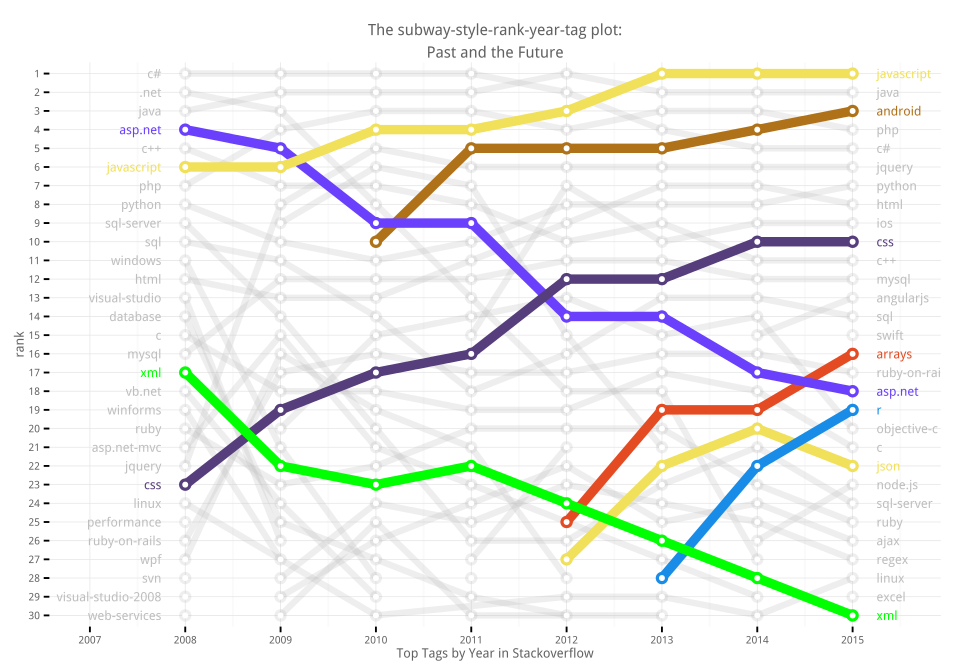
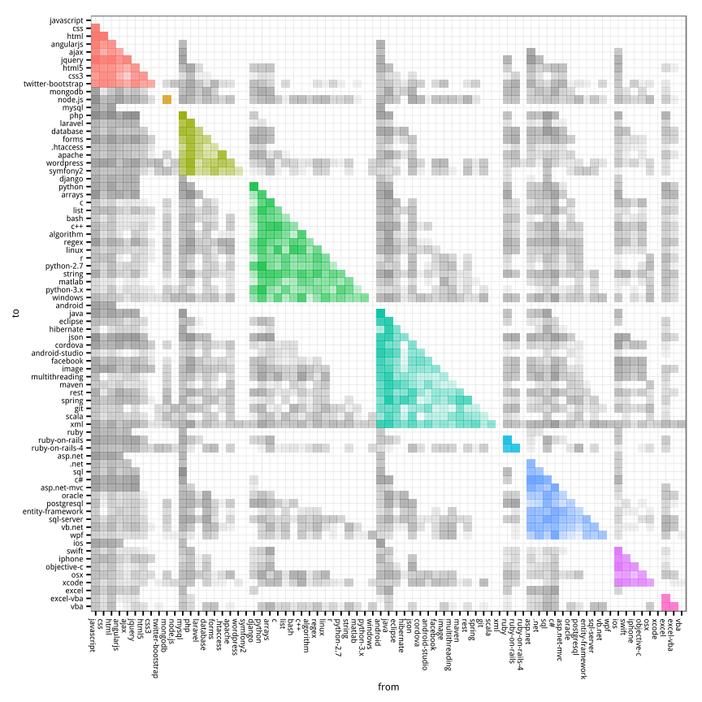
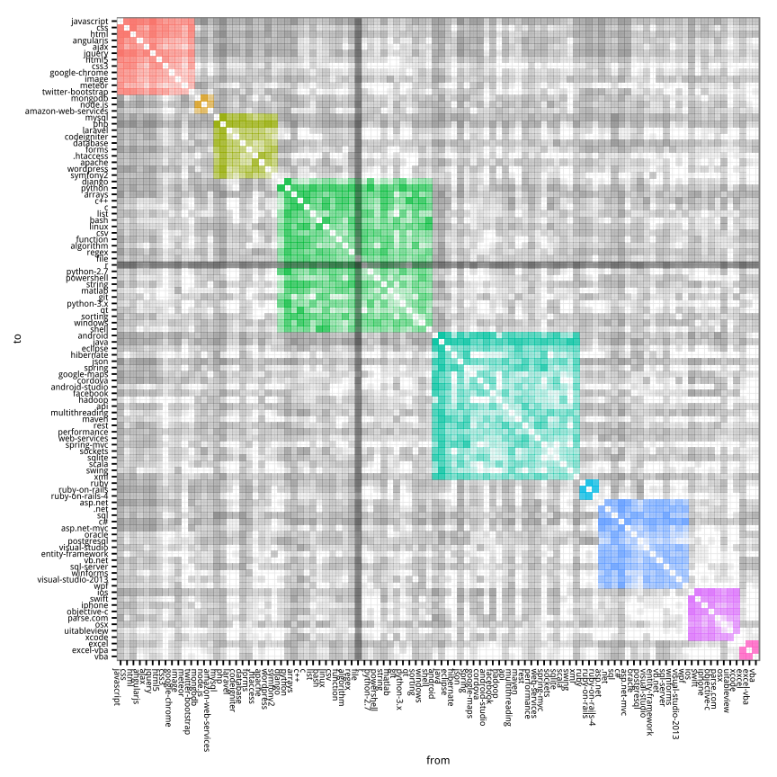

# What we question at Stackoverflow
Joshua Kunst  


How many times you have an error in your code, query, etc and you don't have the solution? How many
time in these cases you open your *favorite browser* and search in your *favorite search engine* and type
(I mean copy/paste) that error and you click in the first result you get and then you don't feel alone
in this planet: "other person had the same problem/question/error as you", and finally, a little bit down you
see the most voted answer and YES it was a so simple mistake/fix. Well, this happens to me several times a week.

Stackoverflow is the biggest site of Q&A that means have a lot of data and fortunately we can get it.

*Original* thoughts come to my mind and it come in verse form (not in a haiku way):

> When you're down and troubled <br/>
> And you need a **coding** hand <br/>
> And nothing, nothing is going right <br/>
> Open a **browser** and **type** about this <br/>
> And the first match will be there <br/>
> To brighten up even your darkest night.

Well, now to code.

1. [The Data](#the-data)
1. [Top Tags by Year](#top-tags-by-year)
1. [The Topics this Year](#the-topics-this-year)
1. [Bonus](#bonus)

### The Data ####

If you want the SO data you can found at least 2 options:

1. [The StackEchange Data explorer](https://data.stackexchange.com/stackoverflow/query/new).
2. [Stack Exchange Data Dump](https://archive.org/download/stackexchange).

The first case you can make any query but you are limited you obtain only 50,000 rows via csv file.
The second option you can download all the dump :) but it comes in xml format (:S?!). So I decided use the
second source and write a [script](https://github.com/jbkunst/r-posts/blob/master/025-stackoverflow/xml-to-sqlite.R)
to parse the 27GB xml file to extract only the questions and load the data into a sqlite data base.


```r
# db <- src_sqlite("~/so-db.sqlite")

dfqst <- tbl(db, "questions")

dftags <- tbl(db, "questions_tags")
```

### Top Tags by Year ####
Well, it's almost end of year and we can talk about summaries about what happened this year.
So, let's look about the changes in the top tags at stackoverflow.
We need count grouping by *creationyear* and *tag*, then use *row_number* function to make 
the rank by year and filter by the first 30 places.


```r
dfqst <- dfqst %>% mutate(creationyear = substr(creationdate, 0, 5))

dftags2 <- left_join(dftags, dfqst %>% select(id, creationyear), by = "id")
nrow(dftags2)

dftags3 <- dftags2 %>%
  group_by(creationyear, tag) %>%
  summarize(count = n()) %>%
  arrange(creationyear, -count) %>%
  collect()
```

In the previous code we need to collect becuase we can't use *row_number* via *tbl* source
(or at least I don't know how to do it yet).


```r
tops <- 30

dftags4 <- dftags3 %>%
  group_by(creationyear) %>%
  mutate(rank = row_number()) %>%
  ungroup() %>%
  filter(rank <= tops) %>%
  mutate(rank = factor(rank, levels = rev(seq(tops))),
         creationyear = as.numeric(creationyear))
```


Lets took the first 5 places this year. Nothing new.


```r
dftags4 %>% filter(creationyear == 2015) %>% head(5)
```


 creationyear  tag            count  rank 
-------------  -----------  -------  -----
         2015  javascript    177412  1    
         2015  java          153231  2    
         2015  android       123557  3    
         2015  php           123109  4    
         2015  c#            109692  5    

The next data frames is to get the name at the start and end of the lines for our first plot.


```r
dftags5 <- dftags4 %>%
  filter(creationyear == max(creationyear)) %>%
  mutate(creationyear = as.numeric(creationyear) + 0.25)

dftags6 <- dftags4 %>%
  filter(creationyear == min(creationyear)) %>%
  mutate(creationyear = as.numeric(creationyear) - 0.25)
```

Now, let's do a simply regresion model model *rank ~ year* to know if a tag's rank go
up or down across the years. Maybe this is a very simply and non correct approach but it's good to explore
the trends. Let's consider the top *tags* in this year with at least 3 appearances:


```r
tags_tags <- dftags4 %>%
  count(tag) %>%
  filter(n >= 3) %>% # have at least 3 appearances
  filter(tag %in% dftags5$tag) %>% # top tags in 2015
  .$tag

dflms <- dftags4 %>%
  filter(tag %in% tags_tags) %>%
  group_by(tag) %>%
  do(model = lm(as.numeric(rank) ~ creationyear, data = .)) %>%
  mutate(slope = coefficients(model)[2]) %>%
  arrange(slope) %>%
  select(-model) %>%
  mutate(trend = cut(slope, breaks = c(-Inf, -1, 1, Inf), labels = c("-", "=", "+")),
         slope = round(slope, 2)) %>%
  arrange(desc(slope))

dflms %>% filter(trend != "=")
```


tag           slope  trend 
-----------  ------  ------
r              4.50  +     
arrays         2.70  +     
css            1.85  +     
json           1.70  +     
jquery         1.42  +     
android        1.09  +     
xml           -1.57  -     
sql-server    -1.77  -     
asp.net       -2.12  -     

Yay! it's not coincidence (may be yes because I choose tag with 3 or more appearances): R have a
a big increase in the las 3 years, The reason can be probably the datascience boom and how the data
have become somethig more important in technologies. Today everything is being measured. Other reason
is becuase R it's awesome. 

I'm not sure why the *arrays* have a similiar trend. This tag is a generic one because all programing
lenguages  arrays. My first guess is this a *web*'s colaterlal effect. In javascript
you need to know how handle data (usually the response to an ajax request is a json object which is
parsed into dict, arrays and/or list) to make you web interactive.
 
What else we see? *asp.net* same as *xml*. Now let's
get some color to stand out the most interesting results.


```r
colors <- c("asp.net" = "#6a40fd", "r" = "#198ce7", "css" = "#563d7c", "javascript" = "#f1e05a",
            "json" = "#f1e05a", "android" = "#b07219", "arrays" = "#e44b23", "xml" = "green")

othertags <- dftags4 %>% distinct(tag) %>% filter(!tag %in% names(colors)) %>% .$tag

colors <- c(colors, setNames(rep("gray", length(othertags)), othertags))
```

Now the fun part! I call this  **The subway-style-rank-year-tag plot: the past and the future**.


```r
p <- ggplot(mapping = aes(creationyear, y = rank, group = tag, color = tag)) +
  geom_line(size = 1.7, alpha = 0.25, data = dftags4) +
  geom_line(size = 2.5, data = dftags4 %>% filter(tag %in% names(colors)[colors != "gray"])) +
  geom_point(size = 4, alpha = 0.25, data = dftags4) +
  geom_point(size = 4, data = dftags4 %>% filter(tag %in% names(colors)[colors != "gray"])) +
  geom_point(size = 1.75, color = "white", data = dftags4) +
  geom_text(data = dftags5, aes(label = tag), hjust = -0, size = 4.5) +
  geom_text(data = dftags6, aes(label = tag), hjust = 1, size = 4.5) +
  scale_color_manual(values = colors) +
  ggtitle("The subway-style-rank-year-tag plot:\nPast and the Future") +
  xlab("Top Tags by Year in Stackoverflow") +
  scale_x_continuous(breaks = seq(min(dftags4$creationyear) - 2,
                                 max(dftags4$creationyear) + 2),
                     limits = c(min(dftags4$creationyear) - 1.0,
                                max(dftags4$creationyear) + 0.5))
p
```

 

First of all: *javascript*, the language of the web, is the top tag nowadays. This is nothing new yet
so let's focus in the changes of places.We can see the web/mobile technologies like android, json are now
more "popular" this days, same as css, html, nodejs, swift, ios, objective-c, etc. By other hand
the *xml* and *asp.net* (and its friends like *.net*, *visual-studio*) tags aren't popular this year comparing
with the previous years, but hey! obviously a top 30 tag in SO means popular yet! but we need to remark
these tags are becoming less popular every year. In the same context is interesting see is how *xml* is 
going down and *json* s going up. It seems xml is being replaced by json format gradually. The same 
effect could be in *.net* with the rest of the webframeworks like ror, django, php frameworks. 

The new technoligies are replacing the old ones.

### The Topics this Year ####

We know, for example, some question are tag by *database*, other are tagged with *sql* or *mysql*
and maybe this questions belong to a family or group of questions. So let's find the
topics/cluster/families/communities in all 2015 questions.

The approach we'll test is inspired by [Tagoverflow](http://stared.github.io/tagoverflow/) a nice app by
[Piotr Migdal](http://migdal.wikidot.com/) and [Marta Czarnocka-Cieciura](http://martaczc.deviantart.com/). To
find the communiest we use/test the [igraph]() package and the [resolution](github.com/analyxcompany/resolution)
which is a R implementation of [Laplacian Dynamics and Multiscale Modular Structure in Networks](http://arxiv.org/pdf/0812.1770.pdf).

*Let the extraction/transformation data/game begin!*:


```r
suppressPackageStartupMessages(library("igraph"))
library("resolution")
library("networkD3")
```

```r
dftags20150 <- dftags2 %>%
  filter(creationyear == "2015") %>%
  select(id, tag)

dfedge <- dftags20150 %>%
  left_join(dftags20150 %>% select(tag2 = tag, id), by = "id") %>%
  filter(tag < tag2) %>%
  count(tag, tag2) %>%
  ungroup() %>%
  arrange(desc(n)) %>%
  collect()

dfvert <- dftags20150 %>%
  group_by(tag) %>%
  summarise(n = n()) %>%
  ungroup() %>%
  arrange(desc(n)) %>%
  collect()
```


```r
first_n <- 100
```

To reduce the calculation times and to talk generally we will use the fisrt 100 top tags.
Then made a igraph element via the edges (tag-tag count) to use the cluster_resolution
algorithm to find groups. Sounds relative easy.


```r
nodes <- dfvert %>%
  head(first_n) %>%
  mutate(id = seq(nrow(.))) %>%
  rename(label = tag) %>%
  select(id, label, n)

head(nodes)
```


 id  label              n
---  -----------  -------
  1  javascript    177412
  2  java          153231
  3  android       123557
  4  php           123109
  5  c#            109692
  6  jquery         92621

```r
edges <- dfedge %>%
  filter(tag %in% nodes$label, tag2 %in% nodes$label) %>%
  rename(from = tag, to = tag2)

head(edges)
```


from         to                n
-----------  -----------  ------
javascript   jquery        57970
css          html          37135
html         javascript    35404
html         jquery        24438
android      java          24134
mysql        php           22531

So, now create the igraph object and get the cluster via this method:


```r
g <- graph.data.frame(edges %>% rename(weight = n), directed = FALSE)
pr <- page.rank(g)$vector
c <- cluster_resolution(g, directed = FALSE)
V(g)$comm <- membership(c)
```

Add data to the nodes:


```r
nodes <- nodes %>%
  left_join(data_frame(label = names(membership(c)),
                       cluster = as.character(membership(c))),
            by = "label")
```

Let's view some tags and size of each cluster. 


```r
clusters <- nodes %>% 
  group_by(cluster) %>% 
  do({data_frame(top_tags = paste(head(.$label), collapse = ", "))}) %>%
  ungroup() %>% 
  left_join(nodes %>% 
              group_by(cluster) %>% 
              arrange(desc(n)) %>% 
              summarise(n_tags = n(), n_qst = sum(n)) %>%
              ungroup(),
            by = "cluster") %>% 
  arrange(desc(n_qst))

clusters
```


cluster   top_tags                                            n_tags    n_qst
--------  -------------------------------------------------  -------  -------
1         javascript, jquery, html, css, angularjs, ajax          12   534842
5         java, android, json, xml, spring, eclipse               23   468482
4         python, c++, arrays, r, c, regex                        24   413748
7         c#, sql, asp.net, sql-server, asp.net-mvc, .net         14   299278
3         php, mysql, wordpress, database, apache, laravel        10   255046
8         ios, swift, objective-c, xcode, iphone, osx              8   176160
6         ruby-on-rails, ruby, ruby-on-rails-4                     3    57126
2         node.js, mongodb, amazon-web-services                    3    43087
9         excel, vba, excel-vba                                    3    39925

Mmm! The results from the algorithm make sense (at least for me). Let's enumerate/name them:

- The big *just-frontend* group leading by the top one javascript: jquery, html, css.
- The *java-and-his-mobile-topic*.
- The *general-programming-rocks* :D cluster.
- The mmm... *prograWin*. I sometimes use windows, about 95% of the time. 
- The *php-biased-backend* cluster.
- The *imobile* programming group.
- Jst the *ror* cluster.
- Mmm I don't know how name this cluster: *nodo-monge*.
- And the *I-know-code-...-in-excel*.

Now let's name the cluster, plot them and check if it helps to
get an idea how the top tags in SO are related to each other.


```r
clusters <- clusters %>% 
  mutate(cluster_name = c("frontend", "Java-and-his-mobile-topic", "general-programming-rocks",
                          "prograWing-thing", "php-biased-backedn", "imoble", "ror",
                          "nodo-monge", "I-know-code-...-in-excel"))

nodes <- nodes %>% 
  mutate(nn2 = round(30*n ^ 2/max(n ^ 2)) + 1) %>% 
  left_join(clusters %>% select(cluster, cluster_name),
            by = "cluster") %>% 
  mutate(cluster_order = seq(nrow(.)))

edges <- edges %>% 
  left_join(nodes %>% select(from = label, id), by = "from") %>% 
  rename(source = id) %>%
  left_join(nodes %>% select(to = label, id), by = "to") %>% 
  rename(target = id) %>% 
  mutate(ne2 = round(30*n ^ 3/max(n ^ 3)) + 1,
         source = source - 1,
         target = target - 1) %>% 
  arrange(desc(n)) %>% 
  head(nrow(nodes)*1.5) # this is to reduce the edges to plot

colorrange <- viridisLite::viridis(nrow(clusters)) %>% 
  stringr::str_sub(1, 7) %>% 
  paste0("'", ., "'", collapse = ", ") %>% 
  paste0("[", ., "]")

colordomain <- clusters$cluster_name %>% 
  paste0("'", ., "'", collapse = ", ") %>% 
  paste0("[", ., "]")

color_scale <- "d3.scale.ordinal().domain(%s).range(%s)" %>% 
  sprintf(colordomain, colorrange)
```

<link href='https://fonts.googleapis.com/css?family=Lato' rel='stylesheet' type='text/css'>


```r
forceNetwork(Links = edges, Nodes = nodes,
             Source = "source", Target = "target",
             NodeID = "label", Group = "cluster_name",
             Value = "ne2", linkWidth = JS("function(d) { return Math.sqrt(d.value);}"),
             Nodesize = "nn2", radiusCalculation = JS("Math.sqrt(d.nodesize)+6"),
             colourScale = color_scale,
             opacity = 1, linkColour = "#BBB", legend = TRUE, 
             linkDistance = 50, charge = -100, bounded = TRUE,
             fontFamily = "Lato")
```

<!--html_preserve--><div id="htmlwidget-1232" style="width:768px;height:480px;" class="forceNetwork"></div>
<script type="application/json" data-for="htmlwidget-1232">{"x":{"links":{"source":[0,9,7,7,2,11,12,8,8,9,9,17,0,25,32,24,7,5,25,0,13,1,8,33,4,11,8,28,3,30,51,28,0,1,9,6,54,15,38,41,25,2,7,9,8,16,15,4,4,72,6,96,15,5,14,0,37,52,21,1,63,3,17,10,34,1,5,1,1,1,56,3,19,12,55,7,4,44,20,2,73,17,71,2,9,1,2,12,53,71,1,37,38,48,2,2,48,0,24,4,19,14,55,8,19,37,84,55,17,15,3,4,4,0,86,15,9,6,1,59,63,20,1,4,4,30,25,2,27,2,0,2,1,2,4,25,72,64,56,4,55,1,12,7,15,4,30,15,88,69],"target":[5,7,0,5,1,3,0,14,19,0,5,4,3,5,4,16,3,3,0,22,23,34,36,6,42,13,56,40,31,4,40,51,21,75,35,49,3,3,0,1,3,69,35,63,85,66,0,91,67,1,74,3,1,35,36,35,11,13,3,70,7,68,30,79,92,29,21,21,46,92,19,13,36,7,3,38,23,22,10,64,6,0,53,29,38,11,41,5,3,3,39,13,5,78,21,83,27,26,66,0,14,85,0,80,85,3,0,7,5,20,26,29,13,89,0,10,3,26,26,13,38,27,0,21,81,5,7,0,78,8,16,86,65,60,5,21,34,0,14,46,5,90,21,11,21,82,0,6,6,1],"value":[31,9,8,3,3,3,2,2,2,2,2,1,1,1,1,1,1,1,1,1,1,1,1,1,1,1,1,1,1,1,1,1,1,1,1,1,1,1,1,1,1,1,1,1,1,1,1,1,1,1,1,1,1,1,1,1,1,1,1,1,1,1,1,1,1,1,1,1,1,1,1,1,1,1,1,1,1,1,1,1,1,1,1,1,1,1,1,1,1,1,1,1,1,1,1,1,1,1,1,1,1,1,1,1,1,1,1,1,1,1,1,1,1,1,1,1,1,1,1,1,1,1,1,1,1,1,1,1,1,1,1,1,1,1,1,1,1,1,1,1,1,1,1,1,1,1,1,1,1,1]},"nodes":{"name":["javascript","java","android","php","c#","jquery","python","html","ios","css","c++","mysql","angularjs","sql","swift","arrays","ruby-on-rails","asp.net","r","objective-c","c","json","node.js","sql-server","ruby","ajax","regex","linux","excel","xml","asp.net-mvc","wordpress",".net","django","spring","twitter-bootstrap","xcode","database","html5","string","vba","eclipse","wpf","windows","mongodb","vb.net","multithreading","matlab","bash","python-2.7","git","excel-vba","oracle","apache","laravel","forms","iphone","osx","image","postgresql","facebook","scala","algorithm","css3","cordova","rest","ruby-on-rails-4","entity-framework","symfony2","android-studio","maven",".htaccess","hibernate","list","python-3.x","swing","performance","function","shell","qt","parse.com","visual-studio","visual-studio-2013","sqlite","google-chrome","uitableview","google-maps","api","csv","meteor","web-services","winforms","spring-mvc","powershell","hadoop","file","codeigniter","sockets","amazon-web-services","sorting"],"group":["frontend","Java-and-his-mobile-topic","Java-and-his-mobile-topic","php-biased-backedn","prograWing-thing","frontend","general-programming-rocks","frontend","imoble","frontend","general-programming-rocks","php-biased-backedn","frontend","prograWing-thing","imoble","general-programming-rocks","ror","prograWing-thing","general-programming-rocks","imoble","general-programming-rocks","Java-and-his-mobile-topic","nodo-monge","prograWing-thing","ror","frontend","general-programming-rocks","general-programming-rocks","I-know-code-...-in-excel","Java-and-his-mobile-topic","prograWing-thing","php-biased-backedn","prograWing-thing","general-programming-rocks","Java-and-his-mobile-topic","frontend","imoble","php-biased-backedn","frontend","general-programming-rocks","I-know-code-...-in-excel","Java-and-his-mobile-topic","prograWing-thing","general-programming-rocks","nodo-monge","prograWing-thing","Java-and-his-mobile-topic","general-programming-rocks","general-programming-rocks","general-programming-rocks","general-programming-rocks","I-know-code-...-in-excel","prograWing-thing","php-biased-backedn","php-biased-backedn","php-biased-backedn","imoble","imoble","frontend","prograWing-thing","Java-and-his-mobile-topic","Java-and-his-mobile-topic","general-programming-rocks","frontend","Java-and-his-mobile-topic","Java-and-his-mobile-topic","ror","prograWing-thing","php-biased-backedn","Java-and-his-mobile-topic","Java-and-his-mobile-topic","php-biased-backedn","Java-and-his-mobile-topic","general-programming-rocks","general-programming-rocks","Java-and-his-mobile-topic","Java-and-his-mobile-topic","general-programming-rocks","general-programming-rocks","general-programming-rocks","imoble","prograWing-thing","prograWing-thing","Java-and-his-mobile-topic","frontend","imoble","Java-and-his-mobile-topic","Java-and-his-mobile-topic","general-programming-rocks","frontend","Java-and-his-mobile-topic","prograWing-thing","Java-and-his-mobile-topic","general-programming-rocks","Java-and-his-mobile-topic","general-programming-rocks","php-biased-backedn","Java-and-his-mobile-topic","nodo-monge","general-programming-rocks"],"nodesize":[31,23,16,15,12,9,9,8,6,4,4,4,3,2,2,2,2,2,2,2,2,2,2,2,1,1,1,1,1,1,1,1,1,1,1,1,1,1,1,1,1,1,1,1,1,1,1,1,1,1,1,1,1,1,1,1,1,1,1,1,1,1,1,1,1,1,1,1,1,1,1,1,1,1,1,1,1,1,1,1,1,1,1,1,1,1,1,1,1,1,1,1,1,1,1,1,1,1,1,1]},"options":{"NodeID":"label","Group":"cluster_name","colourScale":"d3.scale.ordinal().domain(['frontend', 'Java-and-his-mobile-topic', 'general-programming-rocks', 'prograWing-thing', 'php-biased-backedn', 'imoble', 'ror', 'nodo-monge', 'I-know-code-...-in-excel']).range(['#440154', '#472D7B', '#3B528B', '#2C728E', '#21908C', '#28AE80', '#5DC963', '#ABDC32', '#FDE725'])","fontSize":7,"fontFamily":"Lato","clickTextSize":17.5,"linkDistance":50,"linkWidth":"function(d) { return Math.sqrt(d.value);}","charge":-100,"linkColour":"#BBB","opacity":1,"zoom":false,"legend":true,"nodesize":true,"radiusCalculation":"Math.sqrt(d.nodesize)+6","bounded":true,"opacityNoHover":0,"clickAction":null}},"evals":[]}</script><!--/html_preserve-->


Now let's try the adjacency matrix way.


```r
nodes
```


  id  label                       n  cluster    nn2  cluster_name                 cluster_order
----  --------------------  -------  --------  ----  --------------------------  --------------
   1  javascript             177412  1           31  frontend                                 1
   2  java                   153231  5           23  Java-and-his-mobile-topic                2
   3  android                123557  5           16  Java-and-his-mobile-topic                3
   4  php                    123109  3           15  php-biased-backedn                       4
   5  c#                     109692  7           12  prograWing-thing                         5
   6  jquery                  92621  1            9  frontend                                 6
   7  python                  91493  4            9  general-programming-rocks                7
   8  html                    82992  1            8  frontend                                 8
   9  ios                     71028  8            6  imoble                                   9
  10  css                     58763  1            4  frontend                                10
  11  c++                     54703  4            4  general-programming-rocks               11
  12  mysql                   52784  3            4  php-biased-backedn                      12
  13  angularjs               46261  1            3  frontend                                13
  14  sql                     37272  7            2  prograWing-thing                        14
  15  swift                   32902  8            2  imoble                                  15
  16  arrays                  29355  4            2  general-programming-rocks               16
  17  ruby-on-rails           29329  6            2  ror                                     17
  18  asp.net                 27624  7            2  prograWing-thing                        18
  19  r                       27532  4            2  general-programming-rocks               19
  20  objective-c             27045  8            2  imoble                                  20
  21  c                       26746  4            2  general-programming-rocks               21
  22  json                    26481  5            2  Java-and-his-mobile-topic               22
  23  node.js                 25531  2            2  nodo-monge                              23
  24  sql-server              22936  7            2  prograWing-thing                        24
  25  ruby                    20223  6            1  ror                                     25
  26  ajax                    19471  1            1  frontend                                26
  27  regex                   18731  4            1  general-programming-rocks               27
  28  linux                   18162  4            1  general-programming-rocks               28
  29  excel                   17559  9            1  I-know-code-...-in-excel                29
  30  xml                     17477  5            1  Java-and-his-mobile-topic               30
  31  asp.net-mvc             16743  7            1  prograWing-thing                        31
  32  wordpress               16568  3            1  php-biased-backedn                      32
  33  .net                    16388  7            1  prograWing-thing                        33
  34  django                  15927  4            1  general-programming-rocks               34
  35  spring                  15047  5            1  Java-and-his-mobile-topic               35
  36  twitter-bootstrap       14694  1            1  frontend                                36
  37  xcode                   13942  8            1  imoble                                  37
  38  database                13604  3            1  php-biased-backedn                      38
  39  html5                   13173  1            1  frontend                                39
  40  string                  12485  4            1  general-programming-rocks               40
  41  vba                     12474  9            1  I-know-code-...-in-excel                41
  42  eclipse                 12264  5            1  Java-and-his-mobile-topic               42
  43  wpf                     12177  7            1  prograWing-thing                        43
  44  windows                 12045  4            1  general-programming-rocks               44
  45  mongodb                 11843  2            1  nodo-monge                              45
  46  vb.net                  11621  7            1  prograWing-thing                        46
  47  multithreading          10588  5            1  Java-and-his-mobile-topic               47
  48  matlab                  10586  4            1  general-programming-rocks               48
  49  bash                    10369  4            1  general-programming-rocks               49
  50  python-2.7              10258  4            1  general-programming-rocks               50
  51  git                     10074  4            1  general-programming-rocks               51
  52  excel-vba                9892  9            1  I-know-code-...-in-excel                52
  53  oracle                   9794  7            1  prograWing-thing                        53
  54  apache                   9721  3            1  php-biased-backedn                      54
  55  laravel                  9485  3            1  php-biased-backedn                      55
  56  forms                    9452  3            1  php-biased-backedn                      56
  57  iphone                   9352  8            1  imoble                                  57
  58  osx                      9180  8            1  imoble                                  58
  59  image                    9076  1            1  frontend                                59
  60  postgresql               8873  7            1  prograWing-thing                        60
  61  facebook                 8472  5            1  Java-and-his-mobile-topic               61
  62  scala                    8319  5            1  Java-and-his-mobile-topic               62
  63  algorithm                8182  4            1  general-programming-rocks               63
  64  css3                     8102  1            1  frontend                                64
  65  cordova                  8057  5            1  Java-and-his-mobile-topic               65
  66  rest                     7805  5            1  Java-and-his-mobile-topic               66
  67  ruby-on-rails-4          7574  6            1  ror                                     67
  68  entity-framework         7570  7            1  prograWing-thing                        68
  69  symfony2                 7328  3            1  php-biased-backedn                      69
  70  android-studio           7318  5            1  Java-and-his-mobile-topic               70
  71  maven                    7204  5            1  Java-and-his-mobile-topic               71
  72  .htaccess                7203  3            1  php-biased-backedn                      72
  73  hibernate                7201  5            1  Java-and-his-mobile-topic               73
  74  list                     7145  4            1  general-programming-rocks               74
  75  python-3.x               6769  4            1  general-programming-rocks               75
  76  swing                    6677  5            1  Java-and-his-mobile-topic               76
  77  performance              6635  5            1  Java-and-his-mobile-topic               77
  78  function                 6601  4            1  general-programming-rocks               78
  79  shell                    6585  4            1  general-programming-rocks               79
  80  qt                       6525  4            1  general-programming-rocks               80
  81  parse.com                6523  8            1  imoble                                  81
  82  visual-studio            6322  7            1  prograWing-thing                        82
  83  visual-studio-2013       6291  7            1  prograWing-thing                        83
  84  sqlite                   6230  5            1  Java-and-his-mobile-topic               84
  85  google-chrome            6227  1            1  frontend                                85
  86  uitableview              6188  8            1  imoble                                  86
  87  google-maps              6182  5            1  Java-and-his-mobile-topic               87
  88  api                      6158  5            1  Java-and-his-mobile-topic               88
  89  csv                      6109  4            1  general-programming-rocks               89
  90  meteor                   6050  1            1  frontend                                90
  91  web-services             6021  5            1  Java-and-his-mobile-topic               91
  92  winforms                 5975  7            1  prograWing-thing                        92
  93  spring-mvc               5929  5            1  Java-and-his-mobile-topic               93
  94  powershell               5911  4            1  general-programming-rocks               94
  95  hadoop                   5850  5            1  Java-and-his-mobile-topic               95
  96  file                     5837  4            1  general-programming-rocks               96
  97  codeigniter              5792  3            1  php-biased-backedn                      97
  98  sockets                  5779  5            1  Java-and-his-mobile-topic               98
  99  amazon-web-services      5713  2            1  nodo-monge                              99
 100  sorting                  5618  4            1  general-programming-rocks              100

```r
edges
```


from             to                        n   source   target   ne2
---------------  -------------------  ------  -------  -------  ----
javascript       jquery                57970        0        5    31
css              html                  37135        9        7     9
html             javascript            35404        7        0     8
html             jquery                24438        7        5     3
android          java                  24134        2        1     3
mysql            php                   22531       11        3     3
angularjs        javascript            20881       12        0     2
ios              swift                 20546        8       14     2
ios              objective-c           20297        8       19     2
css              javascript            17239        9        0     2
css              jquery                14891        9        5     2
asp.net          c#                    14530       17        4     1
javascript       php                   12068        0        3     1
ajax             jquery                11383       25        5     1
.net             c#                    11133       32        4     1
ruby             ruby-on-rails         10572       24       16     1
html             php                   10519        7        3     1
jquery           php                    9658        5        3     1
ajax             javascript             9621       25        0     1
javascript       node.js                9509        0       22     1
sql              sql-server             9177       13       23     1
java             spring                 9030        1       34     1
ios              xcode                  8979        8       36     1
django           python                 8958       33        6     1
c#               wpf                    8738        4       42     1
mysql            sql                    8059       11       13     1
ios              iphone                 7991        8       56     1
excel            vba                    7690       28       40     1
php              wordpress              7553        3       31     1
asp.net-mvc      c#                     7477       30        4     1
excel-vba        vba                    6897       51       40     1
excel            excel-vba              6872       28       51     1
javascript       json                   6585        0       21     1
java             swing                  6581        1       75     1
css              twitter-bootstrap      6442        9       35     1
python           python-2.7             6428        6       49     1
laravel          php                    6222       54        3     1
arrays           php                    6181       15        3     1
html5            javascript             6135       38        0     1
eclipse          java                   6129       41        1     1
ajax             php                    6095       25        3     1
android          android-studio         5838        2       69     1
html             twitter-bootstrap      5309        7       35     1
css              css3                   5190        9       63     1
ios              uitableview            5173        8       85     1
ruby-on-rails    ruby-on-rails-4        5173       16       66     1
arrays           javascript             4988       15        0     1
c#               winforms               4958        4       91     1
c#               entity-framework       4851        4       67     1
hibernate        java                   4758       72        1     1
python           python-3.x             4504        6       74     1
codeigniter      php                    4474       96        3     1
arrays           java                   4419       15        1     1
jquery           twitter-bootstrap      4400        5       35     1
swift            xcode                  4284       14       36     1
javascript       twitter-bootstrap      4043        0       35     1
database         mysql                  4041       37       11     1
oracle           sql                    4036       52       13     1
json             php                    3960       21        3     1
java             maven                  3938        1       70     1
css3             html                   3893       63        7     1
php              symfony2               3885        3       68     1
asp.net          asp.net-mvc            3734       17       30     1
c++              qt                     3557       10       79     1
spring           spring-mvc             3541       34       92     1
java             xml                    3514        1       29     1
jquery           json                   3509        5       21     1
java             json                   3470        1       21     1
java             multithreading         3410        1       46     1
java             spring-mvc             3355        1       92     1
iphone           objective-c            3210       56       19     1
php              sql                    3205        3       13     1
objective-c      xcode                  3161       19       36     1
angularjs        html                   3153       12        7     1
forms            php                    3143       55        3     1
html             html5                  3142        7       38     1
c#               sql-server             3085        4       23     1
mongodb          node.js                3034       44       22     1
c                c++                    2980       20       10     1
android          cordova                2954        2       64     1
list             python                 2928       73        6     1
asp.net          javascript             2927       17        0     1
.htaccess        apache                 2898       71       53     1
android          xml                    2886        2       29     1
css              html5                  2885        9       38     1
java             mysql                  2881        1       11     1
android          eclipse                2860        2       41     1
angularjs        jquery                 2854       12        5     1
apache           php                    2816       53        3     1
.htaccess        php                    2791       71        3     1
java             string                 2777        1       39     1
database         sql                    2766       37       13     1
html5            jquery                 2741       38        5     1
bash             shell                  2733       48       78     1
android          json                   2654        2       21     1
android          sqlite                 2644        2       83     1
bash             linux                  2643       48       27     1
javascript       regex                  2631        0       26     1
ruby             ruby-on-rails-4        2524       24       66     1
c#               javascript             2509        4        0     1
objective-c      swift                  2498       19       14     1
swift            uitableview            2409       14       85     1
forms            javascript             2398       55        0     1
ios              parse.com              2381        8       80     1
objective-c      uitableview            2374       19       85     1
database         php                    2345       37        3     1
google-chrome    javascript             2335       84        0     1
forms            html                   2333       55        7     1
asp.net          jquery                 2308       17        5     1
arrays           c                      2287       15       20     1
php              regex                  2280        3       26     1
c#               xml                    2256        4       29     1
c#               sql                    2254        4       13     1
javascript       meteor                 2250        0       89     1
google-maps      javascript             2146       86        0     1
arrays           c++                    2108       15       10     1
css              php                    2094        9        3     1
python           regex                  2048        6       26     1
java             regex                  2031        1       26     1
postgresql       sql                    2027       59       13     1
css3             html5                  2024       63       38     1
c                linux                  2004       20       27     1
java             javascript             1982        1        0     1
c#               json                   1946        4       21     1
c#               visual-studio          1922        4       81     1
asp.net-mvc      jquery                 1916       30        5     1
ajax             html                   1901       25        7     1
android          javascript             1900        2        0     1
linux            shell                  1889       27       78     1
android          ios                    1846        2        8     1
javascript       ruby-on-rails          1835        0       16     1
android          google-maps            1825        2       86     1
java             rest                   1825        1       65     1
android          facebook               1813        2       60     1
c#               jquery                 1799        4        5     1
ajax             json                   1794       25       21     1
hibernate        spring                 1787       72       34     1
cordova          javascript             1779       64        0     1
iphone           swift                  1735       56       14     1
c#               multithreading         1727        4       46     1
forms            jquery                 1727       55        5     1
java             web-services           1723        1       90     1
angularjs        json                   1715       12       21     1
html             mysql                  1688        7       11     1
arrays           json                   1685       15       21     1
c#               visual-studio-2013     1650        4       82     1
asp.net-mvc      javascript             1640       30        0     1
arrays           python                 1638       15        6     1
csv              python                 1632       88        6     1
android-studio   java                   1597       69        1     1

```r
library("ggplot2")
node_list <- get.data.frame(g, what = "vertices") %>% 
  tbl_df()

# Determine a community for each edge. If two nodes belong to the
# same community, label the edge with that community. If not,
# the edge community value is 'NA'
edge_list <- get.data.frame(g, what = "edges") %>%
  tbl_df() %>% 
  inner_join(node_list %>% select(name, comm), by = c("from" = "name")) %>%
  inner_join(node_list %>% select(name, comm), by = c("to" = "name")) %>%
  mutate(group = ifelse(comm.x == comm.y, comm.x, NA) %>% factor())

# Create a character vector containing every node name
all_nodes <- sort(node_list$name)

name_order <- (node_list %>% arrange(comm))$name

# Adjust the 'to' and 'from' factor levels so they are equal
# to this complete list of node names
# Reorder edge_list "from" and "to" factor levels based on
# this new name_order
plot_data <- edge_list %>%
  rbind(edge_list %>% rename(from = to, to = from)) %>% 
  mutate(to = factor(to, levels = rev(name_order)),
         from = factor(from, levels = name_order))
```

```r
p2 <- ggplot(plot_data, aes(x = from, y = to, fill = group, alpha = log(weight))) +
  geom_tile() +
  scale_x_discrete(drop = FALSE) +
  scale_y_discrete(drop = FALSE) +
  coord_equal() + 
  theme_bw() +
  theme(axis.text.x = element_text(angle = 270, hjust = 0),
        legend.position = "none") 
p2
```

 

```r
p2 + 
  geom_hline(yintercept = length(name_order) - which(name_order=="r") + 1,
             size = 2, alpha = 0.4) +
  geom_vline(xintercept = which(name_order=="r") - 1,
             size = 2, alpha = 0.4) 
```

 

### Bonus ####
Some questions I readed for write this post:

* [Transposing a dataframe maintaining the first column as heading](http://stackoverflow.com/questions/7970179/transposing-a-dataframe-maintaining-the-first-column-as-heading).
* [Split a vector into chunks in R](http://stackoverflow.com/questions/3318333/split-a-vector-into-chunks-in-r)
* [What are the differences between community detection algorithms in igraph?](http://stackoverflow.com/questions/9471906/what-are-the-differences-between-community-detection-algorithms-in-igraph)
* [Capitalize the first letter of both words in a two word string](http://stackoverflow.com/questions/6364783/capitalize-the-first-letter-of-both-words-in-a-two-word-string)
* [R: simple multiplication causes integer overflow](http://stackoverflow.com/questions/17650803/r-simple-multiplication-causes-integer-overflow).

### References ####

* [Finding communities in networks with R and igraph](http://www.sixhat.net/finding-communities-in-networks-with-r-and-igraph.html)
* [Adjacency matrix plots with R and ggplot2](http://matthewlincoln.net/2014/12/20/adjacency-matrix-plots-with-r-and-ggplot2.html)

---
title: "readme.R"
author: "Joshua K"
date: "Mon Dec 07 21:50:02 2015"
---
