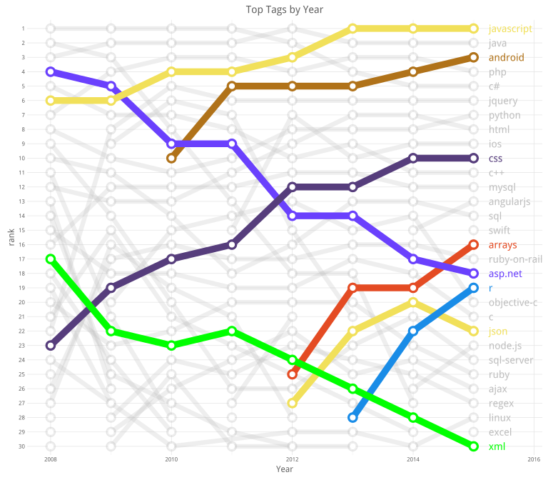

# What we ask in Stackoverflow
Joshua Kunst  


> When you're down and troubled <br/>
> And you need a **coding** hand <br/>
> And nothing, nothing is going right <br/>
> Open a **browser** and **type** of this <br/>
> And the first match will be there <br/>
> To brighten up even your darkest night.

### The Data ####

If you want the SO data you can found at least 2 options:

1. The StackEchange Data explorer. [link](https://data.stackexchange.com/stackoverflow/query/new)
2. Stack Exchange Data Dump. (link)(https://archive.org/download/stackexchange).

The first case you can make any query but you are limited you obtain only 50,000 rows via csv download file.
The second option you can download all the dump :) but it comes in xml format (?!). So I decided use the 
second source and write a [script](https://github.com/jbkunst/r-posts/blob/master/025-stackoverflow/xml-to-sqlite.R) 
to parse the 27GB xml file to load the data what I need into a sqlite data base.


```r
db <- src_sqlite("~/so-db.sqlite")

dfqst <- tbl(db, "questions")
head(dfqst)
```


id   creationdate              score   viewcount   title                                                                          tags                                      
---  ------------------------  ------  ----------  -----------------------------------------------------------------------------  ------------------------------------------
4    2008-07-31T21:42:52.667   358     24247       When setting a form's opacity should I use a decimal or double?                <c#><winforms><type-conversion><opacity>  
6    2008-07-31T22:08:08.620   156     11840       Why doesn't the percentage width child in absolutely positioned parent work?   <html><css><css3><internet-explorer-7>    
9    2008-07-31T23:40:59.743   1023    265083      How do I calculate someone's age in C#?                                        <c#><.net><datetime>                      
11   2008-07-31T23:55:37.967   890     96670       How do I calculate relative time?                                              <c#><datetime><datediff>                  
13   2008-08-01T00:42:38.903   357     99233       Determining a web user's time zone                                             <html><browser><timezone><timezoneoffset> 
14   2008-08-01T00:59:11.177   228     66007       Difference between Math.Floor() and Math.Truncate()                            <.net>                                    

```r
dftags <- tbl(db, "questions_tags")
head(dftags)
```


id     tag           
-----  --------------
1005   linux         
1005   unix          
1005   vi            
1010   c#            
1010   asp.net       
1024   ruby-on-rails 

### Top Tags by Year ####


```r
dfqst <- dfqst %>% mutate(creationyear = substr(creationdate, 0, 5))

dftags2 <- left_join(dftags, dfqst %>% select(id, creationyear), by = "id")

dftags3 <- dftags2 %>% 
  group_by(creationyear, tag) %>% 
  summarize(count = n()) %>% 
  arrange(creationyear, -count) %>% 
  collect()

tops <- 30
dftags4 <- dftags3 %>% 
  group_by(creationyear) %>% 
  mutate(rank = row_number()) %>% 
  ungroup() %>%
  filter(rank <= tops) %>% 
  mutate(rank = factor(rank, levels = rev(seq(tops))),
         creationyear = as.numeric(creationyear))

dftags5 <- dftags4 %>% 
  filter(creationyear == max(creationyear)) %>% 
  mutate(creationyear = as.numeric(creationyear) + 0.25)
  
tags_tags <- dftags4 %>%
  count(tag) %>%
  filter(n > 3) %>% # have at least 3 appearances
  filter(tag %in% dftags5$tag) %>% # top tags in 2015
  .$tag
```

Now, let's do a simply regresion model model *rank ~ year* to know if a tag's rank go 
up or down.


```r
dflms <- dftags4 %>% 
  filter(tag %in% tags_tags) %>% 
  group_by(tag) %>% 
  do(model = lm(as.numeric(rank) ~ creationyear, data = .)) %>% 
  mutate(slope = coefficients(model)[2]) %>% 
  filter(abs(slope) > 1) %>% 
  arrange(slope)

dflms
```


tag          model                                                                                                                                                                                                                                                                                                                                                                                                                                                                                                                                                                                                                                                                                                  slope
-----------  ------------------------------------------------------------------------------------------------------------------------------------------------------------------------------------------------------------------------------------------------------------------------------------------------------------------------------------------------------------------------------------------------------------------------------------------------------------------------------------------------------------------------------------------------------------------------------------------------------------------------------------------------------------------------------------------------  ----------
asp.net      4282.214, -2.119048, -0.1666667, 0.952381, -0.9285714, 1.190476, -1.690476, 0.4285714, -0.452381, 0.6666667, -55.86144, -13.733, -0.9573602, 1.28515, -1.47234, 0.7701706, 0.01268093, 1.255191, 2, 27.16667, 25.04762, 22.92857, 20.80952, 18.69048, 16.57143, 14.45238, 12.33333, 0, 1, -2.828427, 0.3535534, 0.3535534, 0.3535534, 0.3535534, 0.3535534, 0.3535534, 0.3535534, -5689.381, 6.480741, 0.09038881, -0.06391454, -0.2182179, -0.3725212, -0.5268246, -0.6811279, 1.353553, 1.244692, 1, 2, 1e-07, 2, 6, lm(formula = as.numeric(rank) ~ creationyear, data = .), as.numeric(rank) ~ creationyear, 27, 26, 22, 22, 17, 17, 14, 13, 2008, 2009, 2010, 2011, 2012, 2013, 2014, 2015    -2.119048
sql-server   3578.643, -1.77381, 5.166667, 1.940476, -2.285714, -6.511905, -4.738095, 0.03571429, 3.809524, 2.583333, -30.05204, -11.4956, -3.67818, -7.831114, -5.984049, -1.136983, 2.710083, 1.557148, 2, 16.83333, 15.05952, 13.28571, 11.5119, 9.738095, 7.964286, 6.190476, 4.416667, 0, 1, -2.828427, 0.3535534, 0.3535534, 0.3535534, 0.3535534, 0.3535534, 0.3535534, 0.3535534, -5689.381, 6.480741, 0.09038881, -0.06391454, -0.2182179, -0.3725212, -0.5268246, -0.6811279, 1.353553, 1.244692, 1, 2, 1e-07, 2, 6, lm(formula = as.numeric(rank) ~ creationyear, data = .), as.numeric(rank) ~ creationyear, 22, 17, 11, 5, 5, 8, 10, 7, 2008, 2009, 2010, 2011, 2012, 2013, 2014, 2015             -1.773810
xml          3167.929, -1.571429, 1.5, -1.928571, -1.357143, 1.214286, 0.7857143, 0.3571429, -0.07142857, -0.5, -19.79899, -10.18402, -1.580444, 0.7033293, -0.0128972, -0.7291237, -1.44535, -2.161577, 2, 12.5, 10.92857, 9.357143, 7.785714, 6.214286, 4.642857, 3.071429, 1.5, 0, 1, -2.828427, 0.3535534, 0.3535534, 0.3535534, 0.3535534, 0.3535534, 0.3535534, 0.3535534, -5689.381, 6.480741, 0.09038881, -0.06391454, -0.2182179, -0.3725212, -0.5268246, -0.6811279, 1.353553, 1.244692, 1, 2, 1e-07, 2, 6, lm(formula = as.numeric(rank) ~ creationyear, data = .), as.numeric(rank) ~ creationyear, 14, 9, 8, 9, 7, 5, 3, 1, 2008, 2009, 2010, 2011, 2012, 2013, 2014, 2015                         -1.571429
android      -2159.333, 1.085714, -1.952381, 1.961905, 0.8761905, -0.2095238, -0.2952381, -0.3809524, -62.87024, 4.541869, 1.556758, 0.9808484, 1.404939, 1.82903, 2, 22.95238, 24.0381, 25.12381, 26.20952, 27.29524, 28.38095, 0, 1, -2.44949, 0.4082483, 0.4082483, 0.4082483, 0.4082483, 0.4082483, -4929.598, 4.1833, -0.0537243, -0.29277, -0.5318157, -0.7708615, 1.408248, 1.185321, 1, 2, 1e-07, 2, 4, lm(formula = as.numeric(rank) ~ creationyear, data = .), as.numeric(rank) ~ creationyear, 21, 26, 26, 26, 27, 28, 2010, 2011, 2012, 2013, 2014, 2015                                                                                                                                             1.085714
jquery       -2826.75, 1.416667, -8.916667, 3.666667, 5.25, 2.833333, 1.416667, 2.769941e-13, -1.416667, -2.833333, -64.70027, 9.181049, 7.143661, 5.47028, 4.796899, 4.123518, 3.450137, 2.776757, 2, 17.91667, 19.33333, 20.75, 22.16667, 23.58333, 25, 26.41667, 27.83333, 0, 1, -2.828427, 0.3535534, 0.3535534, 0.3535534, 0.3535534, 0.3535534, 0.3535534, 0.3535534, -5689.381, 6.480741, 0.09038881, -0.06391454, -0.2182179, -0.3725212, -0.5268246, -0.6811279, 1.353553, 1.244692, 1, 2, 1e-07, 2, 6, lm(formula = as.numeric(rank) ~ creationyear, data = .), as.numeric(rank) ~ creationyear, 9, 23, 26, 25, 25, 25, 25, 25, 2008, 2009, 2010, 2011, 2012, 2013, 2014, 2015                         1.416667
json         -3414.7, 1.7, -1.7, 1.6, 1.9, -1.8, -16.5, -3.801316, 1.497704, -3.171259, 2, 5.7, 7.4, 9.1, 10.8, 0, 1, -2, 0.5, 0.5, 0.5, -4027, -2.236068, 0.4472136, 0.8944272, 1.5, 1, 1, 2, 1e-07, 2, 2, lm(formula = as.numeric(rank) ~ creationyear, data = .), as.numeric(rank) ~ creationyear, 4, 9, 11, 9, 2012, 2013, 2014, 2015                                                                                                                                                                                                                                                                                                                                                                        1.700000
css          -3695.571, 1.845238, -1.666667, 0.4880952, 0.6428571, -0.202381, 1.952381, 0.1071429, 0.2619048, -1.583333, -45.60839, 11.95851, 1.011138, 0.2803769, 2.549616, 0.8188555, 1.088095, -0.6426659, 2, 9.666667, 11.5119, 13.35714, 15.20238, 17.04762, 18.89286, 20.7381, 22.58333, 0, 1, -2.828427, 0.3535534, 0.3535534, 0.3535534, 0.3535534, 0.3535534, 0.3535534, 0.3535534, -5689.381, 6.480741, 0.09038881, -0.06391454, -0.2182179, -0.3725212, -0.5268246, -0.6811279, 1.353553, 1.244692, 1, 2, 1e-07, 2, 6, lm(formula = as.numeric(rank) ~ creationyear, data = .), as.numeric(rank) ~ creationyear, 8, 12, 14, 15, 19, 19, 21, 21, 2008, 2009, 2010, 2011, 2012, 2013, 2014, 2015        1.845238
arrays       -5425.2, 2.7, -1.2, 2.1, -0.6, -0.3, -22.5, -6.037384, -1.318034, -2.136068, 2, 7.2, 9.9, 12.6, 15.3, 0, 1, -2, 0.5, 0.5, 0.5, -4027, -2.236068, 0.4472136, 0.8944272, 1.5, 1, 1, 2, 1e-07, 2, 2, lm(formula = as.numeric(rank) ~ creationyear, data = .), as.numeric(rank) ~ creationyear, 6, 12, 12, 15, 2012, 2013, 2014, 2015                                                                                                                                                                                                                                                                                                                                                                   2.700000

What we see? *asp.net* is goind down in rank and arrays w


```r
colors <- c("asp.net" = "#6a40fd",
            "r" = "#198ce7", "css" = "#563d7c",
            "javascript" = "#f1e05a", "json" = "#f1e05a",
            "android" = "#b07219", "arrays" = "#e44b23", "xml" = "green")

othertags <- dftags4 %>% distinct(tag) %>% filter(!tag %in% names(colors)) %>% .$tag

colors <- c(colors, setNames(rep("gray", length(othertags)), othertags))

# I call this: *The metro-style-rank-tag plot*.
```

```r
ggplot(dftags4, aes(creationyear, y = rank, group = tag, color = tag)) + 
  geom_line(size = 1.7, alpha = 0.25) +
  geom_line(size = 2.5, data = dftags4 %>% filter(tag %in% names(colors)[colors != "gray"])) +
  geom_point(size = 4, alpha = 0.25) +
  geom_point(size = 4, data = dftags4 %>% filter(tag %in% names(colors)[colors != "gray"])) +
  geom_point(size = 1.75, color = "white") +
  geom_text(data = dftags5, aes(label = tag), hjust = -0, size = 5) + 
  scale_color_manual(values = colors) +
  ggtitle("Top Tags by Year") + xlab("Year") +
  xlim(NA, unique(dftags5$creationyear) + 0.5)
```

 

```r
# https://github.com/hadley/dplyr/issues/950
rm(db)
gc()
```

             used   (Mb)   gc trigger   (Mb)   max used   (Mb)
-------  --------  -----  -----------  -----  ---------  -----
Ncells     639784   17.1      1168576   31.3     940480   25.2
Vcells    1045854    8.0      1761831   13.5    1730925   13.3


---
title: "readme.R"
author: "jkunst"
date: "Wed Nov 11 17:44:26 2015"
---
