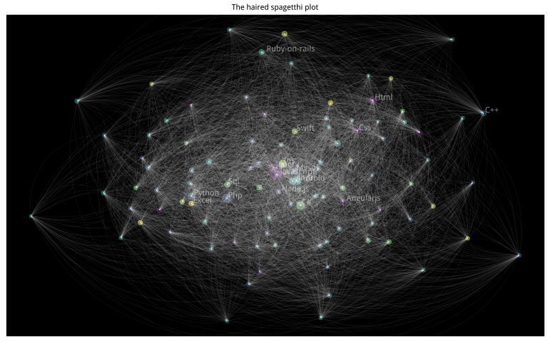

# What we ask in Stackoverflow
Joshua Kunst  


How many times you have an error in your code, query, etc and you don't have the solution? How many 
time in these cases you open your *favorite browser* and search in your *favorite search engine* and type 
(I mean copy/paste) that error and you click in the first result you get and then you don't feel alone
in this planet: "other person had the same problem/question/error as you", and finally, a little bit down you 
see the most voted answer and YES it was a so simple mistake/fix. Well, this happens to me several times a week.

Stackoverflow is the biggest site of Q&A that means have a lot of data and fortunately we can get it.

Aps! (original) thoughts come to my mind and it come in verse form (not in a haiku form):
 
> When you're down and troubled <br/>
> And you need a **coding** hand <br/>
> And nothing, nothing is going right <br/>
> Open a **browser** and **type** about this <br/>
> And the first match will be there <br/>
> To brighten up even your darkest night.

Well, now to code.

1. [The Data](#the-data)
1. [Top Tags by Year](#top-tags-by-year)
1. [The Topics this Year](#the-topics-this-year)
1. [Bonus](#bonus)

### The Data ####

If you want the SO data you can found at least 2 options:

1. [The StackEchange Data explorer](https://data.stackexchange.com/stackoverflow/query/new).
2. S[tack Exchange Data Dump](https://archive.org/download/stackexchange).

The first case you can make any query but you are limited you obtain only 50,000 rows via csv file.
The second option you can download all the dump :) but it comes in xml format (:S?!). So I decided use the 
second source and write a [script](https://github.com/jbkunst/r-posts/blob/master/025-stackoverflow/xml-to-sqlite.R) 
to parse the 27GB xml file to extrack only the questions and load the data into a sqlite data base.


```r
# db <- src_sqlite("~/so-db.sqlite")
# 
# dfqst <- tbl(db, "questions")
# nrow(dfqst) %>% prettyNum(big.mark = ",")
# head(dfqst)
# 
# dftags <- tbl(db, "questions_tags")
# nrow(dftags) %>% prettyNum(big.mark = ",")
# head(dftags)
```

### Top Tags by Year ####
Well, it's almost end of year and we can talk about summaries about what happened this year. 
So, let's look about the changes in the top tags at stackoverflow

We need count grouping by *creationyear* and *tag*, then use *row_number* function to make the rank by
year and filter by the first 30 places.


```r
dfqst <- dfqst %>% mutate(creationyear = substr(creationdate, 0, 5))
```

```
## Error in eval(expr, envir, enclos): object 'dfqst' not found
```

```r
dftags2 <- left_join(dftags, dfqst %>% select(id, creationyear), by = "id")
```

```
## Error in left_join(dftags, dfqst %>% select(id, creationyear), by = "id"): object 'dftags' not found
```

```r
dftags3 <- dftags2 %>% 
  group_by(creationyear, tag) %>% 
  summarize(count = n()) %>% 
  arrange(creationyear, -count) %>% 
  collect()
```

```
## Error in eval(expr, envir, enclos): object 'dftags2' not found
```

In the previous code we need to collect becuase we can't use *row_number* via *tbl* source
(or at least I don't know how to do it yet).


```r
tops <- 30

dftags4 <- dftags3 %>% 
  group_by(creationyear) %>% 
  mutate(rank = row_number()) %>% 
  ungroup() %>%
  filter(rank <= tops) %>% 
  mutate(rank = factor(rank, levels = rev(seq(tops))),
         creationyear = as.numeric(creationyear))
```

```
## Error in eval(expr, envir, enclos): object 'dftags3' not found
```

Lets took the first 5 places this year. Nothing new.


```r
dftags4 %>% filter(creationyear == 2015) %>% head(5)
```

```
## Error in eval(expr, envir, enclos): object 'dftags4' not found
```

The next data frames is to get the name at the start and end of the lines for our first plot.


```r
dftags5 <- dftags4 %>% 
  filter(creationyear == max(creationyear)) %>% 
  mutate(creationyear = as.numeric(creationyear) + 0.25)
```

```
## Error in eval(expr, envir, enclos): object 'dftags4' not found
```

```r
dftags6 <- dftags4 %>% 
  filter(creationyear == min(creationyear)) %>% 
  mutate(creationyear = as.numeric(creationyear) - 0.25)
```

```
## Error in eval(expr, envir, enclos): object 'dftags4' not found
```

Now, let's do a simply regresion model model *rank ~ year* to know if a tag's rank go 
up or down across the years. Maybe this is a very simply and non correct approach but it's good to explore
the trends. Let's consider the top *tags* in this year with at least 3 appearances:


```r
tags_tags <- dftags4 %>%
  count(tag) %>%
  filter(n > 3) %>% # have at least 3 appearances
  filter(tag %in% dftags5$tag) %>% # top tags in 2015
  .$tag
```

```
## Error in eval(expr, envir, enclos): object 'dftags4' not found
```

```r
dflms <- dftags4 %>% 
  filter(tag %in% tags_tags) %>% 
  group_by(tag) %>% 
  do(model = lm(as.numeric(rank) ~ creationyear, data = .)) %>% 
  mutate(slope = coefficients(model)[2]) %>% 
  arrange(slope) %>% 
  select(-model) %>% 
  mutate(trend = cut(slope, breaks = c(-Inf, -1, 1, Inf), labels = c("-", "=", "+")),
         slope = round(slope, 2)) %>% 
  arrange(desc(slope))
```

```
## Error in eval(expr, envir, enclos): object 'dftags4' not found
```

```r
dflms %>% filter(trend != "=")
```

```
## Error in eval(expr, envir, enclos): object 'dflms' not found
```

Mmm! What we see? *asp.net* is goind down and *arrays* is going up Now let's 
get some color for remark the most interesting results.


```r
colors <- c("asp.net" = "#6a40fd", "r" = "#198ce7", "css" = "#563d7c", "javascript" = "#f1e05a",
            "json" = "#f1e05a", "android" = "#b07219", "arrays" = "#e44b23", "xml" = "green")

othertags <- dftags4 %>% distinct(tag) %>% filter(!tag %in% names(colors)) %>% .$tag
```

```
## Error in eval(expr, envir, enclos): object 'dftags4' not found
```

```r
colors <- c(colors, setNames(rep("gray", length(othertags)), othertags))
```

```
## Error in setNames(rep("gray", length(othertags)), othertags): object 'othertags' not found
```

Now the fun part! I call this  **The subway-style-rank-year-tag plot: the past and the future**.


```r
p <- ggplot(mapping = aes(creationyear, y = rank, group = tag, color = tag)) + 
  geom_line(size = 1.7, alpha = 0.25, data = dftags4) +
  geom_line(size = 2.5, data = dftags4 %>% filter(tag %in% names(colors)[colors != "gray"])) +
  geom_point(size = 4, alpha = 0.25, data = dftags4) +
  geom_point(size = 4, data = dftags4 %>% filter(tag %in% names(colors)[colors != "gray"])) +
  geom_point(size = 1.75, color = "white", data = dftags4) +
  geom_text(data = dftags5, aes(label = tag), hjust = -0, size = 4.5) + 
  geom_text(data = dftags6, aes(label = tag), hjust = 1, size = 4.5) + 
  scale_color_manual(values = colors) +
  ggtitle("The subway-style-rank-year-tag plot:\nPast and the Future") +
  xlab("Top Tags by Year in Stackoverflow") +
  scale_x_continuous(breaks = seq(min(dftags4$creationyear) - 2,
                                 max(dftags4$creationyear) + 2),
                     limits = c(min(dftags4$creationyear) - 1.0,
                                max(dftags4$creationyear) + 0.5))
```

```
## Error in fortify(data): object 'dftags4' not found
```

```r
p
```

```
## Error in eval(expr, envir, enclos): object 'p' not found
```

First of all: *javascript*, the language of the web, is the top tag nowadays. This is nothing new yet 
so let's focus in the changes of places.We can see the web/mobile technologies like android, json are now  
more "popular" this days, same as css, html, nodejs, swift, ios, objective-c, etc. By other hand 
the *xml* and *asp.net* (and its friends like *.net*, *visual-studio*) tags aren't popular this year comparing 
with the previous years, but hey! obviously a top 30 tag in SO means popular yet! but we need to remark 
these tags are becoming less popular every year.

Other important fact to mention is the increased popularity of the *r* tag (yay!).

And finally is interesting see how xml is going down and json s going up. It seems xml is being replaced
by json format gradually.


### The Topics this Year ####

We know, for example, some question are tag by *database*, other are tagged with *sql* or *server* 
and maybe this questions belong to a family or group of questions. So let's find the 
topics/cluster/families/communities in all these questions.

The approach we'll test is inspired by [Tagoverflow](http://stared.github.io/tagoverflow/) a nice app by 
[Piotr Migdal](http://migdal.wikidot.com/) and [Marta Czarnocka-Cieciura](http://martaczc.deviantart.com/). To
find the communiest we use/test the [igraph]() package and the [resolution](github.com/analyxcompany/resolution)
which is a R implementation of [Laplacian Dynamics and Multiscale Modular Structure in Networks](http://arxiv.org/pdf/0812.1770.pdf). 

*Let the extraction/transformation data/game begin!*:
   


```r
library("igraph")
```

```
## 
## Attaching package: 'igraph'
## 
## The following objects are masked from 'package:dplyr':
## 
##     %>%, as_data_frame, groups, union
## 
## The following objects are masked from 'package:stats':
## 
##     decompose, spectrum
## 
## The following object is masked from 'package:base':
## 
##     union
```

```r
library("ForceAtlas2")
library("resolution")
library("viridis")

dftags20150 <- dftags2 %>%
  filter(creationyear == "2015") %>%
  select(id, tag)
```

```
## Error in eval(expr, envir, enclos): object 'dftags2' not found
```

```r
dfedge <- dftags20150 %>% 
  left_join(dftags20150 %>% select(tag2 = tag, id), by = "id") %>% 
  filter(tag < tag2) %>% 
  count(tag, tag2) %>% 
  ungroup() %>% 
  arrange(desc(n)) %>% 
  collect()
```

```
## Error in eval(expr, envir, enclos): object 'dftags20150' not found
```

```r
head(dfedge)
```

```
## Error in head(dfedge): object 'dfedge' not found
```

```r
dfvert <- dftags20150 %>%
  group_by(tag) %>%
  summarise(n = n()) %>% 
  ungroup() %>% 
  arrange(desc(n)) %>% 
  collect()
```

```
## Error in eval(expr, envir, enclos): object 'dftags20150' not found
```

```r
head(dfvert)
```

```
## Error in head(dfvert): object 'dfvert' not found
```

```r
# # a checkpoint!
# save(dfedge, dfvert, file = "nets_df.RData")
# rm(list=ls());
load("nets_df.RData")

first_n <- 100

nodes <- dfvert %>% 
  head(first_n) %>% 
  mutate(id = seq(nrow(.))) %>% 
  rename(label = tag, value = n) %>% 
  select(id, label, value)

edges <- dfedge %>%
  filter(tag %in% nodes$label, tag2 %in% nodes$label) %>% 
  rename(from = tag, to = tag2, width = n) 

# nodes %>% filter(label %in% c("r", "ggplot2"))

# The igraph part
g <- graph.data.frame(edges %>% rename(weight = width), directed = FALSE)
pr <- page.rank(g)$vector

set.seed(123)
# lout <- layout.fruchterman.reingold(g)
lout <- layout.forceatlas2(g, plotstep = 0, gravity = 10)
c <- cluster_resolution(g, directed = FALSE)
```

Add data


```r
nodes <- nodes %>%
  # add layout
  mutate(x = lout[, 1], y = lout[, 2]) %>% 
  # add cluster 
  left_join(data_frame(label = names(membership(c)),
                       cluster = membership(c)),
            by = "label") %>% 
  # add betweenness
  left_join(data_frame(label = names(betweenness(g)),
                       betweenness = betweenness(g) + 1),
            by = "label") %>% 
  left_join(data_frame(label = names(pr), pagerank = pr),
            by = "label") %>% 
  # title case
  mutate(labeltitle = gsub("(^|[[:space:]])([[:alpha:]])", "\\1\\U\\2", label, perl = TRUE))

# Show the firts 10 tag ordering by size to show the topics in the every group
groups <- nodes %>% 
  group_by(cluster) %>% 
  mutate(order_in_cluster = row_number(-value)) %>% 
  ungroup() %>%
  filter(order_in_cluster <= 10) %>% 
  {split(.$label, .$cluster)}

sizes <- purrr::map(groups, length) %>% unlist() %>% order(decreasing = TRUE)
groups <- groups[sizes]
groups
```

```
## $`1`
##  [1] "javascript"        "jquery"            "html"             
##  [4] "css"               "angularjs"         "ajax"             
##  [7] "twitter-bootstrap" "html5"             "image"            
## [10] "css3"             
## 
## $`3`
##  [1] "php"         "mysql"       "wordpress"   "database"    "apache"     
##  [6] "laravel"     "forms"       "symfony2"    ".htaccess"   "codeigniter"
## 
## $`4`
##  [1] "python"  "c++"     "arrays"  "r"       "c"       "regex"   "linux"  
##  [8] "django"  "string"  "windows"
## 
## $`5`
##  [1] "java"           "android"        "json"           "xml"           
##  [5] "spring"         "eclipse"        "multithreading" "facebook"      
##  [9] "scala"          "cordova"       
## 
## $`7`
##  [1] "c#"          "sql"         "asp.net"     "sql-server"  "asp.net-mvc"
##  [6] ".net"        "wpf"         "vb.net"      "oracle"      "postgresql" 
## 
## $`8`
## [1] "ios"         "swift"       "objective-c" "xcode"       "iphone"     
## [6] "osx"         "parse.com"   "uitableview"
## 
## $`2`
## [1] "node.js"             "mongodb"             "amazon-web-services"
## 
## $`6`
## [1] "ruby-on-rails"   "ruby"            "ruby-on-rails-4"
## 
## $`9`
## [1] "excel"     "vba"       "excel-vba"
```

```r
edges <- edges %>% 
  left_join(nodes %>% select(from = label, x.from = x, y.from = y), by = "from") %>% 
  left_join(nodes %>% select(to = label, x.to = x, y.to = y), by = "to")

clusters <- nodes %>%
  group_by(cluster) %>% 
  summarise(cluster_size = n(), value_max = max(value)) %>% 
  left_join(nodes %>% select(representer = label, value_max = value), by = "value_max") %>% 
  arrange(desc(cluster_size)) 

ggplot() +
  # nodes
  geom_point(data = nodes, aes(x, y, colour = factor(cluster), size = pagerank), alpha = 0.5) + 
  scale_size_area(max_size = 4) + 
  # edges
  geom_curve(data = edges, aes(x = x.from, y = y.from, xend = x.to, yend = y.to),
             alpha = 0.1, size = 0.1, color = "white") + 
  # text 
  geom_text(data = nodes %>% filter(label %in% c(head(nodes$label, 15), clusters$representer)),
            aes(x, y, label = labeltitle),
            size = 4, hjust = -0.1, vjust = -0.1, alpha = 0.5, color = "white") + 
  # theme
  scale_color_viridis(discrete = TRUE) +
  ggthemes::theme_map() + 
  theme(legend.position = "none", panel.background = element_rect(fill = "black")) + 
  ggtitle("The haired spagetthi plot")
```

 

I was expecting something like this Maybe the next picture is what I fell about this plot:


Let's try to made some changes:

### Bonus ####
Some questions I readed for write this post:

* [Transposing a dataframe maintaining the first column as heading](http://stackoverflow.com/questions/7970179/transposing-a-dataframe-maintaining-the-first-column-as-heading).
* [Split a vector into chunks in R](http://stackoverflow.com/questions/3318333/split-a-vector-into-chunks-in-r)
* [What are the differences between community detection algorithms in igraph?](http://stackoverflow.com/questions/9471906/what-are-the-differences-between-community-detection-algorithms-in-igraph)
* [Capitalize the first letter of both words in a two word string](http://stackoverflow.com/questions/6364783/capitalize-the-first-letter-of-both-words-in-a-two-word-string)
* http://stackoverflow.com/questions/17918330/how-to-directly-read-an-image-file-from-a-url-address-in-r

### References ####

* [Finding communities in networks with R and igraph](http://www.sixhat.net/finding-communities-in-networks-with-r-and-igraph.html)
* [Adjacency matrix plots with R and ggplot2](http://matthewlincoln.net/2014/12/20/adjacency-matrix-plots-with-r-and-ggplot2.html)

---
title: "readme.R"
author: "jkunst"
date: "Fri Nov 20 16:34:25 2015"
---
