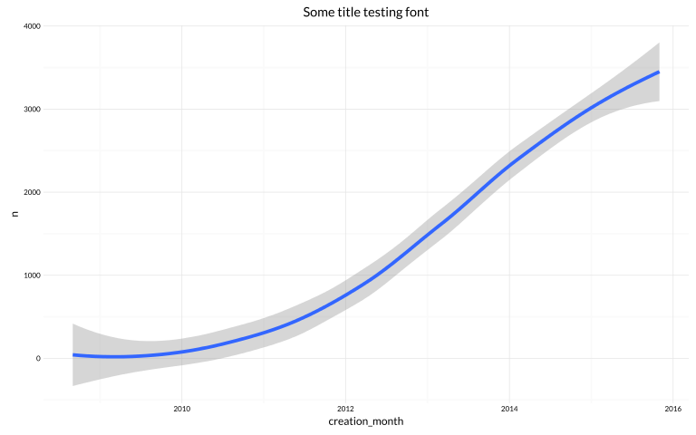
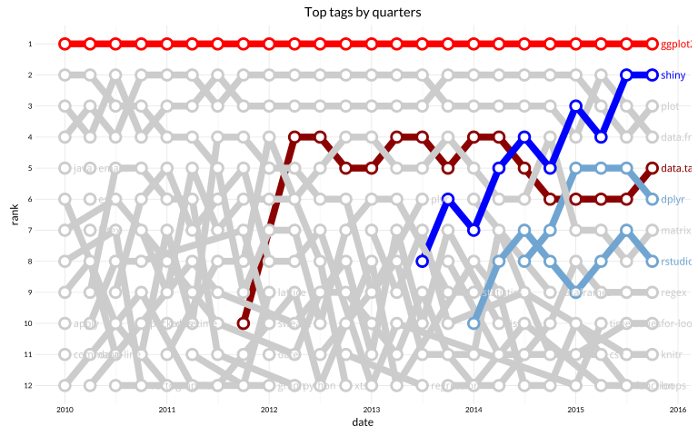

# What we ask about R in SO
Joshua Kunst  


> When you're down and troubled <br/>
> And you need a **coding** hand <br/>
> And nothing, nothing is going right <br/>
> Open a **browser** and **type** of this <br/>
> And the first match will be there <br/>
> To brighten up even your darkest night.


```r
##### Question List
question_donwload <- function(verbose = FALSE, tag = "r", site = "stackoverflow"){
  
  t0 <- Sys.time()
  
  api_url <- "https://api.stackexchange.com/2.2/questions"
  key <- "ifpYG3FCatEyPyX8AqkVCA(("
  qlist <- list()
  carry_on <- TRUE
  actual_page <- 1
  
  while (carry_on) {
    data <- api_url %>%
      GET(query = list(site = site, tagged = tag, page = actual_page, key = key,
                       sort = "creation", pagesize = 100, order = "desc")) %>% 
      content()
    
    if (verbose & actual_page %% 500 == 0)
      message("page: ",actual_page ," | quota remaining: ", data$quota_remaining)
    
    qlist[[actual_page]] <- data$items
    
    actual_page <- actual_page + 1
    
    carry_on <- data$has_more
    
  }
  
  qlist <- unlist(qlist, recursive = FALSE)
  
  t1 <- Sys.time() - t0
  message(length(qlist), " question downloaded in ",
          round(t1,2), " ", attr(t1, "units")) 
  
  qlist 
  
}
# qlist <- question_donwload()
qlist <- readRDS("qlist.Rds")

#### Questions Dataframe
# Examine a element in the list:
x <- sample(qlist, size = )[[1]]
str(x)
```

```
## List of 13
##  $ tags              :List of 2
##   ..$ : chr "r"
##   ..$ : chr "csv"
##  $ owner             :List of 7
##   ..$ reputation   : int 36
##   ..$ user_id      : int 3706726
##   ..$ user_type    : chr "registered"
##   ..$ accept_rate  : int 100
##   ..$ profile_image: chr "https://www.gravatar.com/avatar/63e01472024e94f365e53dc2e386ed78?s=128&d=identicon&r=PG&f=1"
##   ..$ display_name : chr "souravsarkar59"
##   ..$ link         : chr "http://stackoverflow.com/users/3706726/souravsarkar59"
##  $ is_answered       : logi TRUE
##  $ view_count        : int 71
##  $ accepted_answer_id: int 24241636
##  $ answer_count      : int 1
##  $ score             : int 2
##  $ last_activity_date: int 1402914735
##  $ creation_date     : int 1402914393
##  $ last_edit_date    : int 1402914735
##  $ question_id       : int 24241557
##  $ link              : chr "http://stackoverflow.com/questions/24241557/delete-csv-files-having-less-than-10-entries-from-a-particular-directory-in-r"
##  $ title             : chr "Delete csv files having less than 10 entries from a particular directory in R"
```

```r
namestoselc <- lapply(x, class) %>%
  dplyr::as_data_frame() %>% 
  gather(name, class) %>% 
  filter(class != "list" & name != "link") %>%
  .$name %>% 
  as.character()

df_qst <- ldply(qlist, function(x){
  # x <- sample(qlist, size = 1)[[1]]
  x[ which(names(x) %in% namestoselc)] %>% 
    as_data_frame()
}, .progress = "win")

df_qst <- tbl_df(df_qst) %>% 
  mutate(creation_date = as.POSIXct(creation_date, origin = "1970-01-01"),
         last_activity_date = as.POSIXct(last_activity_date, origin = "1970-01-01"),
         creation_month = format(creation_date, "%Y-%m-01") %>% as.Date())


df_qst %>% 
  count(creation_month) %>% 
  ggplot(aes(creation_month, n)) + 
  geom_smooth() +
  ggtitle("Some title testing font")
```

 

```r
# Dataframe with question_id, question_tag
df_qtag <- ldply(qlist, function(x){
  # x <- sample(qlist, size = 1)[[1]]
  tags <- x$tags %>% unlist()
  if (length(tags) > 1) {
    data_frame(question_tag = tags,
               question_id = x$question_id)  
  }
}, .progress = "win")

df_qtag <- tbl_df(df_qtag)
df_qtag <- df_qtag %>% filter(question_tag != "r")
df_qtag <- df_qtag %>% 
  left_join(df_qst %>% select(question_id, creation_date),
            by = "question_id")

as.yearhalf <- function(date){
  # inspired in as.yearqrt
  date <- as.Date(date)
  m <- ifelse(month(date) <= 6, 1, 7)
  month(date) <- m
  date
}

df_qtag2 <- df_qtag %>% 
  mutate(date = as.yearqtr(creation_date)) %>% 
  group_by(date, question_tag) %>% 
  summarize(tag_date_count = n()) %>% 
  ungroup() %>% 
  arrange(date, -tag_date_count) %>% 
  group_by(date) %>% 
  mutate(rank = row_number()) %>% 
  ungroup() %>%
  filter(rank <= 12) %>% 
  filter(year(date) >= 2010) %>% 
  mutate(date = as.Date(date), rank = factor(rank, levels = 12:1))
  

df_qtag22 <- df_qtag2 %>%
  filter(question_tag %in% df_qtag2$question_tag) %>% 
  group_by(question_tag) %>% 
  summarise(date = max(date)) %>% 
  left_join(df_qtag2 %>% select(question_tag, date, rank)) %>% 
  mutate(date = date + months(1))
```

```
## Joining by: c("question_tag", "date")
```

```r
pcks_cols <- c("ggplot2" = "red", "dplyr" = "#71a5d1",
               "shiny" = "blue", "rstudio" = "#71a5d1",
               "data.table" = "darkred")

other_pcks <- df_qtag22$question_tag[!df_qtag22$question_tag %in% names(pcks_cols)]

other_pcks_cols <- rep("gray80", length(other_pcks))
names(other_pcks_cols) <- other_pcks
cols <- c(pcks_cols, other_pcks_cols)

ggplot(df_qtag2, aes(date, y = rank, group = question_tag, color = question_tag)) + 
  geom_line(size = 2) +
  geom_point(size = 4) +
  geom_point(size = 2, color = "white") + 
  geom_text(data = df_qtag22, aes(label = question_tag), hjust = -0, size = 4) + 
  scale_color_manual(values = cols) +
  ggtitle("Top tags by quarters")
```

 

* http://stackoverflow.com/questions/21571703/format-date-as-year-quarter
* http://stackoverflow.com/questions/15170777/add-a-rank-column-to-a-data-frame

---
title: "readme.R"
author: "jkunst"
date: "Fri Nov 06 18:29:40 2015"
---
