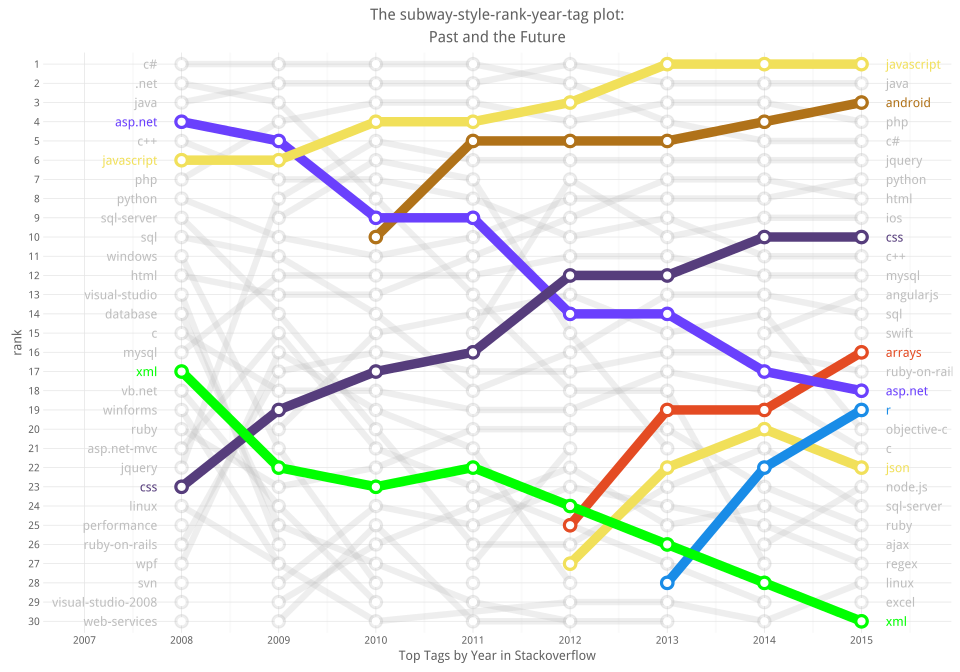

# What we ask in Stackoverflow
Joshua Kunst  


Have you

> When you're down and troubled <br/>
> And you need a **coding** hand <br/>
> And nothing, nothing is going right <br/>
> Open a **browser** and **type** of this <br/>
> And the first match will be there <br/>
> To brighten up even your darkest night.

1. [The Data](#the-data)
1. [Top Tags by Year](#top-tags-by-year)
1. [Bonus](#bonus)

### The Data ####

If you want the SO data you can found at least 2 options:

1. The StackEchange Data explorer. [link](https://data.stackexchange.com/stackoverflow/query/new)
2. Stack Exchange Data Dump. (link)(https://archive.org/download/stackexchange).

The first case you can make any query but you are limited you obtain only 50,000 rows via csv download file.
The second option you can download all the dump :) but it comes in xml format (?!). So I decided use the 
second source and write a [script](https://github.com/jbkunst/r-posts/blob/master/025-stackoverflow/xml-to-sqlite.R) 
to parse the 27GB xml file to load the data what I need into a sqlite data base.


```r
db <- src_sqlite("~/so-db.sqlite")

dfqst <- tbl(db, "questions")
head(dfqst)
```


id   creationdate              score   viewcount   title                                                                          tags                                      
---  ------------------------  ------  ----------  -----------------------------------------------------------------------------  ------------------------------------------
4    2008-07-31T21:42:52.667   358     24247       When setting a form's opacity should I use a decimal or double?                <c#><winforms><type-conversion><opacity>  
6    2008-07-31T22:08:08.620   156     11840       Why doesn't the percentage width child in absolutely positioned parent work?   <html><css><css3><internet-explorer-7>    
9    2008-07-31T23:40:59.743   1023    265083      How do I calculate someone's age in C#?                                        <c#><.net><datetime>                      
11   2008-07-31T23:55:37.967   890     96670       How do I calculate relative time?                                              <c#><datetime><datediff>                  
13   2008-08-01T00:42:38.903   357     99233       Determining a web user's time zone                                             <html><browser><timezone><timezoneoffset> 
14   2008-08-01T00:59:11.177   228     66007       Difference between Math.Floor() and Math.Truncate()                            <.net>                                    

```r
dftags <- tbl(db, "questions_tags")
head(dftags)
```


id     tag           
-----  --------------
1005   linux         
1005   unix          
1005   vi            
1010   c#            
1010   asp.net       
1024   ruby-on-rails 

### Top Tags by Year ####
Well, it's almost end of year and we can talk about all what happened in the year. So, let's
look about the change across the years (including this one!) in the top tags at stackoverflow.

We need to calculate the year and then make count grouping by *creationyear* and *tag*, then 
use *row_number* function to make the rank by year and filter by the first 30 places.


```r
dfqst <- dfqst %>% mutate(creationyear = substr(creationdate, 0, 5))

dftags2 <- left_join(dftags, dfqst %>% select(id, creationyear), by = "id")

dftags3 <- dftags2 %>% 
  group_by(creationyear, tag) %>% 
  summarize(count = n()) %>% 
  arrange(creationyear, -count) %>% 
  collect()
```

In the previous code we need to collect becuase we can't use *row_number* via *tbl* source.


```r
tops <- 30
dftags4 <- dftags3 %>% 
  group_by(creationyear) %>% 
  mutate(rank = row_number()) %>% 
  ungroup() %>%
  filter(rank <= tops) %>% 
  mutate(rank = factor(rank, levels = rev(seq(tops))),
         creationyear = as.numeric(creationyear))
```

Lets took the first 5 places this year. Nothing new.


```r
dftags4 %>% filter(creationyear == 2015) %>% head(5)
```


 creationyear  tag            count  rank 
-------------  -----------  -------  -----
         2015  javascript    177412  1    
         2015  java          153231  2    
         2015  android       123557  3    
         2015  php           123109  4    
         2015  c#            109692  5    

The next data frame is to get the name at the end of the lines for our first plot.


```r
dftags5 <- dftags4 %>% 
  filter(creationyear == max(creationyear)) %>% 
  mutate(creationyear = as.numeric(creationyear) + 0.25)

dftags6 <- dftags4 %>% 
  filter(creationyear == min(creationyear)) %>% 
  mutate(creationyear = as.numeric(creationyear) - 0.25)
```

Now, let's do a simply regresion model model *rank ~ year* to know if a tag's rank go 
up or down. First let's consider the top *tags* in this year with at least 3 appearances:


```r
tags_tags <- dftags4 %>%
  count(tag) %>%
  filter(n > 3) %>% # have at least 3 appearances
  filter(tag %in% dftags5$tag) %>% # top tags in 2015
  .$tag

dflms <- dftags4 %>% 
  filter(tag %in% tags_tags) %>% 
  group_by(tag) %>% 
  do(model = lm(as.numeric(rank) ~ creationyear, data = .)) %>% 
  mutate(slope = coefficients(model)[2]) %>% 
  filter(abs(slope) > 1) %>% 
  arrange(slope) %>% 
  select(-model)

dflms
```


tag               slope
-----------  ----------
asp.net       -2.119048
sql-server    -1.773810
xml           -1.571429
android        1.085714
jquery         1.416667
json           1.700000
css            1.845238
arrays         2.700000

Mmm! What we see? *asp.net* is goind down in rank and *arraystag* is going top. Now let's 
get some color for the hono


```r
colors <- c("asp.net" = "#6a40fd", "r" = "#198ce7", "css" = "#563d7c", "javascript" = "#f1e05a",
            "json" = "#f1e05a", "android" = "#b07219", "arrays" = "#e44b23", "xml" = "green")

othertags <- dftags4 %>% distinct(tag) %>% filter(!tag %in% names(colors)) %>% .$tag

colors <- c(colors, setNames(rep("gray", length(othertags)), othertags))
```

Now the fun part! I call this  **The subway-style-rank-year-tag plot: the past and the future**.


```r
ggplot(dftags4, aes(creationyear, y = rank, group = tag, color = tag)) + 
  geom_line(size = 1.7, alpha = 0.25) +
  geom_line(size = 2.5, data = dftags4 %>% filter(tag %in% names(colors)[colors != "gray"])) +
  geom_point(size = 4, alpha = 0.25) +
  geom_point(size = 4, data = dftags4 %>% filter(tag %in% names(colors)[colors != "gray"])) +
  geom_point(size = 1.75, color = "white") +
  geom_text(data = dftags5, aes(label = tag), hjust = -0, size = 4.5) + 
  geom_text(data = dftags6, aes(label = tag), hjust = 1, size = 4.5) + 
  scale_color_manual(values = colors) +
  ggtitle("The subway-style-rank-year-tag plot:\nPast and the Future") +
  xlab("Top Tags by Year in Stackoverflow") +
  scale_x_continuous(breaks= seq(min(dftags4$creationyear)-2,
                                 max(dftags4$creationyear) + 2),
                     limits = c(min(dftags4$creationyear) - 1.0,
                                max(dftags4$creationyear) + 0.5))
```

 

We can see the technologies like android, json are now more "popular" this days, same as all web/mobile 
technologies like java (via android), css, html, nodejs, swift, ios, objective-c, etc. 
By other hand the *xml* and *asp.net* (and *.net*, *visual-studio*) tags aren't popular in this 
days comparing previous years (obviously a top 30 tag in SO means popular yet!).

Other important fact to mention is the popularity of the *r* tag (yay!). The only tag besides python
with the datascience essence. 

And finally is interesting see how xml is going down and json s going up. It seems xml has been replaced
 by json gradually.


```r
# https://github.com/hadley/dplyr/issues/950
rm(db)
gc()
```

            used   (Mb)   gc trigger   (Mb)   max used   (Mb)
-------  -------  -----  -----------  -----  ---------  -----
Ncells    619407   16.6      1168576   31.3     940480   25.2
Vcells    998726    7.7      1761315   13.5    1756945   13.5

### Bonus ####
Some questions I readed for write this post


---
title: "readme.R"
author: "jkunst"
date: "Thu Nov 12 10:16:26 2015"
---
