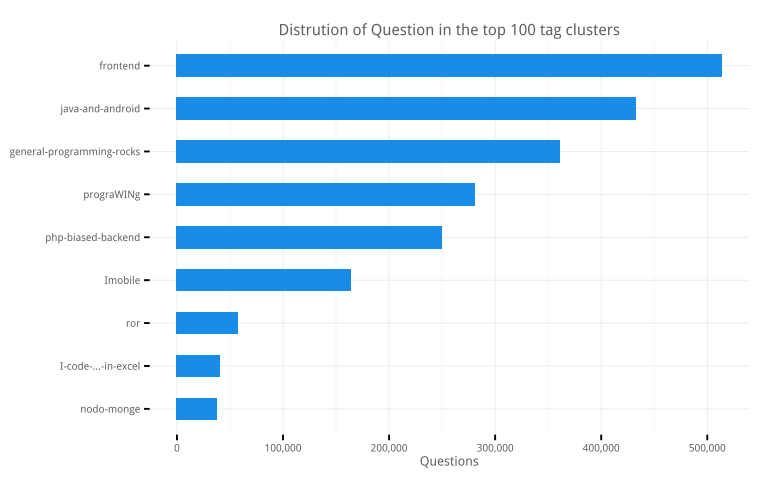

# What we question at Stackoverflow
Joshua Kunst  


How many times you have an error in your code, query, etc and you don't have the solution? How many
time in these cases you open your *favorite browser* and search in your *favorite search engine* and type
(I mean copy/paste) that error and you click in the first result you get and then you don't feel alone
in this planet: "other person had the same problem/question/error as you", and finally, a little bit down you
see the most voted answer and YES it was a so simple mistake/fix. Well, this happens to me several times a week.

Stackoverflow is the biggest site of Q&A that means have a lot of data and fortunately we can get it.

*Original* thoughts come to my mind and it come in verse form (not in a haiku way):

> When you're down and troubled <br/>
> And you need a **coding** hand <br/>
> And nothing, nothing is going right <br/>
> Open a **browser** and **type** about this <br/>
> And the first match will be there <br/>
> To brighten up even your darkest night.

Well, now to code.

1. [The Data](#the-data)
1. [Top Tags by Year](#top-tags-by-year)
1. [The Topics this Year](#the-topics-this-year)
1. [Bonus](#bonus)

### The Data ####

If you want the SO data you can found at least 2 options:

1. [The StackEchange Data explorer](https://data.stackexchange.com/stackoverflow/query/new).
2. [Stack Exchange Data Dump](https://archive.org/download/stackexchange).

The first case you can make any query but you are limited you obtain only 50,000 rows via csv file.
The second option you can download all the dump :) but it comes in xml format (:S?!). So I decided use the
second source and write a [script](https://github.com/jbkunst/r-posts/blob/master/025-stackoverflow/xml-to-sqlite.R)
to parse the 27GB xml file to extract only the questions and load the data into a sqlite data base.


```r
# db <- src_sqlite("~/so-db.sqlite")

dfqst <- tbl(db, "questions")

dftags <- tbl(db, "questions_tags")
```

### Top Tags by Year ####
Well, it's almost end of year and we can talk about summaries about what happened this year.
So, let's look about the changes in the top tags at stackoverflow.
We need count grouping by *creationyear* and *tag*, then use *row_number* function to make 
the rank by year and filter by the first 30 places.


```r
dfqst <- dfqst %>% mutate(creationyear = substr(creationdate, 0, 5))

dftags2 <- left_join(dftags, dfqst %>% select(id, creationyear), by = "id")
nrow(dftags2)

dftags3 <- dftags2 %>%
  group_by(creationyear, tag) %>%
  summarize(count = n()) %>%
  arrange(creationyear, -count) %>%
  collect()
```

In the previous code we need to collect becuase we can't use *row_number* via *tbl* source
(or at least I don't know how to do it yet).


```r
tops <- 30

dftags4 <- dftags3 %>%
  group_by(creationyear) %>%
  mutate(rank = row_number()) %>%
  ungroup() %>%
  filter(rank <= tops) %>%
  mutate(rank = factor(rank, levels = rev(seq(tops))),
         creationyear = as.numeric(creationyear))
```


Lets took the first 5 places this year. Nothing new.


```r
dftags4 %>% filter(creationyear == 2015) %>% head(5)
```


 creationyear  tag            count  rank 
-------------  -----------  -------  -----
         2015  javascript    177412  1    
         2015  java          153231  2    
         2015  android       123557  3    
         2015  php           123109  4    
         2015  c#            109692  5    

The next data frames is to get the name at the start and end of the lines for our first plot.


```r
dftags5 <- dftags4 %>%
  filter(creationyear == max(creationyear)) %>%
  mutate(creationyear = as.numeric(creationyear) + 0.25)

dftags6 <- dftags4 %>%
  filter(creationyear == min(creationyear)) %>%
  mutate(creationyear = as.numeric(creationyear) - 0.25)
```

Now, let's do a simply regresion model model *rank ~ year* to know if a tag's rank go
up or down across the years. Maybe this is a very simply and non correct approach but it's good to explore
the trends. Let's consider the top *tags* in this year with at least 3 appearances:


```r
tags_tags <- dftags4 %>%
  count(tag) %>%
  filter(n >= 3) %>% # have at least 3 appearances
  filter(tag %in% dftags5$tag) %>% # top tags in 2015
  .$tag

dflms <- dftags4 %>%
  filter(tag %in% tags_tags) %>%
  group_by(tag) %>%
  do(model = lm(as.numeric(rank) ~ creationyear, data = .)) %>%
  mutate(slope = coefficients(model)[2]) %>%
  arrange(slope) %>%
  select(-model) %>%
  mutate(trend = cut(slope, breaks = c(-Inf, -1, 1, Inf), labels = c("-", "=", "+")),
         slope = round(slope, 2)) %>%
  arrange(desc(slope))

dflms %>% filter(trend != "=")
```


tag           slope  trend 
-----------  ------  ------
r              4.50  +     
arrays         2.70  +     
css            1.85  +     
json           1.70  +     
jquery         1.42  +     
android        1.09  +     
xml           -1.57  -     
sql-server    -1.77  -     
asp.net       -2.12  -     

Yay! it's not coincidence (may be yes because I choose tag with 3 or more appearances): R have a
a big increase in the las 3 years, The reason can be probably the datascience boom and how the data
have become somethig more important in technologies. Today everything is being measured. Other reason
is because R it's awesome. 

I'm not sure why the *arrays* have a similiar trend. This tag is a generic one because all programing
lenguages  arrays. My first guess is this a *web*'s colaterlal effect. In javascript
you need to know how handle data (usually the response to an ajax request is a json object which is
parsed into dict, arrays and/or list) to make you web interactive.
 
What else we see? *asp.net* same as *xml* and *sql-serve* are going down. Now let's put some 
color to emphasize the most interesting results.


```r
colors <- c("asp.net" = "#6a40fd", "r" = "#198ce7", "css" = "#563d7c", "javascript" = "#f1e05a",
            "json" = "#f1e05a", "android" = "#b07219", "arrays" = "#e44b23", "xml" = "green")

othertags <- dftags4 %>% distinct(tag) %>% filter(!tag %in% names(colors)) %>% .$tag

colors <- c(colors, setNames(rep("gray", length(othertags)), othertags))
```

Now the fun part! I call this  **The subway-style-rank-year-tag plot: the past and the future**.


```r
p <- ggplot(mapping = aes(creationyear, y = rank, group = tag, color = tag)) +
  geom_line(size = 1.7, alpha = 0.25, data = dftags4) +
  geom_line(size = 2.5, data = dftags4 %>% filter(tag %in% names(colors)[colors != "gray"])) +
  geom_point(size = 4, alpha = 0.25, data = dftags4) +
  geom_point(size = 4, data = dftags4 %>% filter(tag %in% names(colors)[colors != "gray"])) +
  geom_point(size = 1.75, color = "white", data = dftags4) +
  geom_text(data = dftags5, aes(label = tag), hjust = -0, size = 4.5) +
  geom_text(data = dftags6, aes(label = tag), hjust = 1, size = 4.5) +
  scale_color_manual(values = colors) +
  ggtitle("The subway-style-rank-year-tag plot:\nPast and the Future") +
  xlab("Top Tags by Year in Stackoverflow") +
  scale_x_continuous(breaks = seq(min(dftags4$creationyear) - 2,
                                 max(dftags4$creationyear) + 2),
                     limits = c(min(dftags4$creationyear) - 1.0,
                                max(dftags4$creationyear) + 0.5))
p
```

 

First of all: *javascript*, the language of the web, is the top tag nowadays. This is nothing new yet
so let's focus in the changes of places. We can see the web/mobile technologies like android, json are now
more "popular" these days, same as css, html, nodejs, swift, ios, objective-c, etc. By other hand
the *xml* and *asp.net* (and its friends like *.net*, *visual-studio*) tags aren't popular this year comparing
with the previous years, but hey! obviously a top 30 tag in SO means popular yet!
In the same context is interesting see is how *xml* is 
going down and *json* s going up. It seems xml is being replaced by json format gradually. The same 
effect could be in *.net* with the rest of the webframeworks like ror, django, php frameworks. 

### The Topics this Year ####

We know, for example, some question are tagged by *database*, other are tagged with *sql* or *mysql*
and maybe this questions belong to a family or group of questions. So let's find the
topics/cluster/families/communities in all 2015 questions.

The approach we'll test is inspired by [Tagoverflow](http://stared.github.io/tagoverflow/) a nice app by
[Piotr Migdal](http://migdal.wikidot.com/) and [Marta Czarnocka-Cieciura](http://martaczc.deviantart.com/). To
find the communiest we use/test the [resolution package](github.com/analyxcompany/resoution) from the 
[analyxcompany](github.com/analyxcompany) team which is a R implementation of [Laplacian Dynamics and 
Multiscale Modular Structure in Networks](http://arxiv.org/pdf/0812.1770.pdf).

*Let the extraction/transformation data/game begin!*:


```r
suppressPackageStartupMessages(library("igraph"))
library("resolution")
library("networkD3")
```

```r
dftags20150 <- dftags2 %>%
  filter(creationyear == "2015") %>%
  select(id, tag)

dfedge <- dftags20150 %>%
  left_join(dftags20150 %>% select(tag2 = tag, id), by = "id") %>%
  filter(tag < tag2) %>%
  count(tag, tag2) %>%
  ungroup() %>%
  arrange(desc(n)) %>%
  collect()

dfvert <- dftags20150 %>%
  group_by(tag) %>%
  summarise(n = n()) %>%
  ungroup() %>%
  arrange(desc(n)) %>%
  collect()
```


```r
first_n <- 75
```

To reduce the calculation times and to talk generally we will use the fisrt 75 top tags.
Then made a igraph element via the edges (tag-tag count) to use the cluster_resolution
algorithm to find groups. Sounds relative easy.


```r
nodes <- dfvert %>%
  head(first_n) %>%
  mutate(id = seq(nrow(.))) %>%
  rename(label = tag) %>%
  select(id, label, n)

head(nodes)
```


 id  label              n
---  -----------  -------
  1  javascript    177412
  2  java          153231
  3  android       123557
  4  php           123109
  5  c#            109692
  6  jquery         92621

```r
edges <- dfedge %>%
  filter(tag %in% nodes$label, tag2 %in% nodes$label) %>%
  rename(from = tag, to = tag2)

head(edges)
```


from         to                n
-----------  -----------  ------
javascript   jquery        57970
css          html          37135
html         javascript    35404
html         jquery        24438
android      java          24134
mysql        php           22531

So, now create the igraph object and get the cluster via this method:


```r
g <- graph.data.frame(edges %>% rename(weight = n), directed = FALSE)
pr <- page.rank(g)$vector
c <- cluster_resolution(g, directed = FALSE)
V(g)$comm <- membership(c)
```

Add data to the nodes:


```r
nodes <- nodes %>%
  left_join(data_frame(label = names(membership(c)),
                       cluster = as.character(membership(c))),
            by = "label")
```

Let's view some tags and size of each cluster. 


```r
clusters <- nodes %>% 
  group_by(cluster) %>% 
  do({data_frame(top_tags = paste(head(.$label), collapse = ", "))}) %>%
  ungroup() %>% 
  left_join(nodes %>% 
              group_by(cluster) %>% 
              arrange(desc(n)) %>% 
              summarise(n_tags = n(), n_qst = sum(n)) %>%
              ungroup(),
            by = "cluster") %>% 
  arrange(desc(n_qst))

clusters
```


cluster   top_tags                                            n_tags    n_qst
--------  -------------------------------------------------  -------  -------
1         javascript, jquery, html, css, angularjs, ajax           9   513489
5         java, android, json, xml, spring, eclipse               16   432171
4         python, c++, arrays, r, c, regex                        16   360488
7         c#, sql, asp.net, sql-server, asp.net-mvc, .net         11   280690
3         php, mysql, wordpress, database, apache, laravel         9   249254
8         ios, swift, objective-c, xcode, iphone, osx              6   163449
6         ruby-on-rails, ruby, ruby-on-rails-4                     3    57126
9         excel, vba, excel-vba                                    3    39925
2         node.js, mongodb                                         2    37374

Mmm! The results from the algorithm make sense (at least for me). Let's enumerate/name them:

- The big *just-frontend* group leading by the top one javascript: jquery, html, css.
- The *java-and-android*.
- The *general-programming-rocks* :D cluster.
- The mmm... *prograWINg*. I sometimes use windows, about 95% of the time. 
- The *php-biased-backend* cluster.
- The *Imobile* programming group.
- Just the *ror* cluster.
- And the *I-code-...-in-excel*.
- Mmm I don't know how name this cluster: *nodo-monge*.

Now let's name the cluster, plot them and check if it helps to
get an idea how the top tags in SO are related to each other.


```r
clusters <- clusters %>% 
  mutate(cluster_name = c("frontend", "java-and-android", "general-programming-rocks",
                          "prograWINg", "php-biased-backend", "Imobile", "ror",
                          "I-code-...-in-excel", "nodo-monge"),
         cluster_name = factor(cluster_name, levels = rev(cluster_name)))

ggplot(clusters) +
  geom_bar(aes(cluster_name, n_qst),
           stat = "identity", width = 0.5, fill = "#198ce7") +
  scale_y_continuous("Questions", labels = scales::comma) + 
  xlab(NULL) +
  coord_flip() +
  ggtitle("Distrution of Question in the top 100 tag clusters")
```

 

```r
nodes <- nodes %>% 
  mutate(nn2 = round(30*n ^ 2/max(n ^ 2)) + 1) %>% 
  left_join(clusters %>% select(cluster, cluster_name),
            by = "cluster") %>% 
  mutate(cluster_order = seq(nrow(.)))

edges2 <- edges %>% 
  left_join(nodes %>% select(from = label, id), by = "from") %>% 
  rename(source = id) %>%
  left_join(nodes %>% select(to = label, id), by = "to") %>% 
  rename(target = id) %>% 
  mutate(ne2 = round(30*n ^ 3/max(n ^ 3)) + 1,
         source = source - 1,
         target = target - 1) %>% 
  arrange(desc(n)) %>% 
  head(nrow(nodes)*1.5) # this is to reduce the edges to plot

colorrange <- viridisLite::viridis(nrow(clusters)) %>% 
  stringr::str_sub(1, 7) %>% 
  paste0("'", ., "'", collapse = ", ") %>% 
  paste0("[", ., "]")

colordomain <- clusters$cluster_name %>% 
  paste0("'", ., "'", collapse = ", ") %>% 
  paste0("[", ., "]")

color_scale <- "d3.scale.ordinal().domain(%s).range(%s)" %>% 
  sprintf(colordomain, colorrange)
```

<link href='https://fonts.googleapis.com/css?family=Lato' rel='stylesheet' type='text/css'>


```r
forceNetwork(Links = edges2, Nodes = nodes,
             Source = "source", Target = "target",
             NodeID = "label", Group = "cluster_name",
             Value = "ne2", linkWidth = JS("function(d) { return Math.sqrt(d.value);}"),
             Nodesize = "nn2", radiusCalculation = JS("Math.sqrt(d.nodesize)+6"),
             colourScale = color_scale,
             opacity = 1, linkColour = "#BBB", legend = TRUE, 
             linkDistance = 50, charge = -100, bounded = TRUE,
             fontFamily = "Lato")
```

<!--html_preserve--><div id="htmlwidget-9696" style="width:768px;height:480px;" class="forceNetwork"></div>
<script type="application/json" data-for="htmlwidget-9696">{"x":{"links":{"source":[0,9,7,7,2,11,12,8,8,9,9,17,0,25,32,24,7,5,25,0,13,1,8,33,4,11,8,28,3,30,51,28,0,9,6,54,15,38,41,25,2,7,9,16,15,4,72,6,15,5,14,0,37,52,21,1,63,3,17,1,5,1,1,56,3,19,12,55,7,4,44,20,2,73,17,71,2,9,1,2,12,53,71,1,37,38,2,48,0,24,4,19,55,37,55,17,15,3,4,4,15,9,6,1,59,63,20,1,4,30,25,2],"target":[5,7,0,5,1,3,0,14,19,0,5,4,3,5,4,16,3,3,0,22,23,34,36,6,42,13,56,40,31,4,40,51,21,35,49,3,3,0,1,3,69,35,63,66,0,67,1,74,1,35,36,35,11,13,3,70,7,68,30,29,21,21,46,19,13,36,7,3,38,23,22,10,64,6,0,53,29,38,11,41,5,3,3,39,13,5,21,27,26,66,0,14,0,3,7,5,20,26,29,13,10,3,26,26,13,38,27,0,21,5,7,0],"value":[31,9,8,3,3,3,2,2,2,2,2,1,1,1,1,1,1,1,1,1,1,1,1,1,1,1,1,1,1,1,1,1,1,1,1,1,1,1,1,1,1,1,1,1,1,1,1,1,1,1,1,1,1,1,1,1,1,1,1,1,1,1,1,1,1,1,1,1,1,1,1,1,1,1,1,1,1,1,1,1,1,1,1,1,1,1,1,1,1,1,1,1,1,1,1,1,1,1,1,1,1,1,1,1,1,1,1,1,1,1,1,1]},"nodes":{"name":["javascript","java","android","php","c#","jquery","python","html","ios","css","c++","mysql","angularjs","sql","swift","arrays","ruby-on-rails","asp.net","r","objective-c","c","json","node.js","sql-server","ruby","ajax","regex","linux","excel","xml","asp.net-mvc","wordpress",".net","django","spring","twitter-bootstrap","xcode","database","html5","string","vba","eclipse","wpf","windows","mongodb","vb.net","multithreading","matlab","bash","python-2.7","git","excel-vba","oracle","apache","laravel","forms","iphone","osx","image","postgresql","facebook","scala","algorithm","css3","cordova","rest","ruby-on-rails-4","entity-framework","symfony2","android-studio","maven",".htaccess","hibernate","list","python-3.x"],"group":["frontend","java-and-android","java-and-android","php-biased-backend","prograWINg","frontend","general-programming-rocks","frontend","Imobile","frontend","general-programming-rocks","php-biased-backend","frontend","prograWINg","Imobile","general-programming-rocks","ror","prograWINg","general-programming-rocks","Imobile","general-programming-rocks","java-and-android","nodo-monge","prograWINg","ror","frontend","general-programming-rocks","general-programming-rocks","I-code-...-in-excel","java-and-android","prograWINg","php-biased-backend","prograWINg","general-programming-rocks","java-and-android","frontend","Imobile","php-biased-backend","frontend","general-programming-rocks","I-code-...-in-excel","java-and-android","prograWINg","general-programming-rocks","nodo-monge","prograWINg","java-and-android","general-programming-rocks","general-programming-rocks","general-programming-rocks","java-and-android","I-code-...-in-excel","prograWINg","php-biased-backend","php-biased-backend","php-biased-backend","Imobile","Imobile","java-and-android","prograWINg","java-and-android","java-and-android","general-programming-rocks","frontend","java-and-android","java-and-android","ror","prograWINg","php-biased-backend","java-and-android","java-and-android","php-biased-backend","java-and-android","general-programming-rocks","general-programming-rocks"],"nodesize":[31,23,16,15,12,9,9,8,6,4,4,4,3,2,2,2,2,2,2,2,2,2,2,2,1,1,1,1,1,1,1,1,1,1,1,1,1,1,1,1,1,1,1,1,1,1,1,1,1,1,1,1,1,1,1,1,1,1,1,1,1,1,1,1,1,1,1,1,1,1,1,1,1,1,1]},"options":{"NodeID":"label","Group":"cluster_name","colourScale":"d3.scale.ordinal().domain(['frontend', 'java-and-android', 'general-programming-rocks', 'prograWINg', 'php-biased-backend', 'Imobile', 'ror', 'I-code-...-in-excel', 'nodo-monge']).range(['#440154', '#472D7B', '#3B528B', '#2C728E', '#21908C', '#28AE80', '#5DC963', '#ABDC32', '#FDE725'])","fontSize":7,"fontFamily":"Lato","clickTextSize":17.5,"linkDistance":50,"linkWidth":"function(d) { return Math.sqrt(d.value);}","charge":-100,"linkColour":"#BBB","opacity":1,"zoom":false,"legend":true,"nodesize":true,"radiusCalculation":"Math.sqrt(d.nodesize)+6","bounded":true,"opacityNoHover":0,"clickAction":null}},"evals":[]}</script><!--/html_preserve-->


Now let's try the adjacency matrix way like.


```r
library("ggplot2")
library("beyonce")

name_order <- (nodes %>% arrange(desc(cluster_name), desc(n)))$label


edges2 <- edges %>% 
  inner_join(nodes %>% select(label, cluster_name), by = c("from" = "label")) %>% 
  inner_join(nodes %>% select(label, cluster_name), by = c("to" = "label")) %>% 
  purrr::map_if(is.factor, as.character) %>% 
  {rbind(.,rename(., from = to, to = from))} %>% 
  mutate(group = ifelse(cluster_name.x == cluster_name.y, cluster_name.x, NA),
         group = factor(group, levels = clusters$cluster_name),
         to = factor(to, levels = rev(name_order)),
         from = factor(from, levels = name_order))
```

```r
p2 <- ggplot(edges2, aes(x = from, y = to, fill = group, alpha = log(n))) +
  geom_tile() +
  scale_alpha_continuous(range = c(.0, 1)) + 
#   scale_fill_manual(values = c(setNames(viridisLite::viridis(nrow(clusters)),
#                                         clusters$cluster_name)),
#                     na.value = "gray") + 
  scale_fill_manual(values = c(setNames(beyonce_palette(18 ,nrow(clusters), type = "continuous"),
                                        clusters$cluster_name)),
                    na.value = "gray") + 
  scale_x_discrete(drop = FALSE) +
  scale_y_discrete(drop = FALSE) +
  coord_equal() + 
  theme(axis.text.x = element_text(angle = 270, hjust = 0, vjust = 0),
        legend.position = "right") 

p2 
```


Well, in this plot is easy to see the size of the cluster in terms of numbers of tags. Is a little easy to see
(if the plot is bigger) 

<script src="http://www.elevateweb.co.uk/wp-content/themes/radial/jquery.elevatezoom.min.js"></script>
<script>
(function() {
 $("img").elevateZoom({
   zoomType	: "lens",
   lensShape : "square",
   lensSize  : 400,
   scrollZoom : true
 });
})();
</script>

### Bonus ####
Some questions I readed for write this post:

* [Transposing a dataframe maintaining the first column as heading](http://stackoverflow.com/questions/7970179/transposing-a-dataframe-maintaining-the-first-column-as-heading).
* [Split a vector into chunks in R](http://stackoverflow.com/questions/3318333/split-a-vector-into-chunks-in-r)
* [What are the differences between community detection algorithms in igraph?](http://stackoverflow.com/questions/9471906/what-are-the-differences-between-community-detection-algorithms-in-igraph)
* [Capitalize the first letter of both words in a two word string](http://stackoverflow.com/questions/6364783/capitalize-the-first-letter-of-both-words-in-a-two-word-string)
* [R: simple multiplication causes integer overflow](http://stackoverflow.com/questions/17650803/r-simple-multiplication-causes-integer-overflow).

### References ####

* [Finding communities in networks with R and igraph](http://www.sixhat.net/finding-communities-in-networks-with-r-and-igraph.html)
* [Adjacency matrix plots with R and ggplot2](http://matthewlincoln.net/2014/12/20/adjacency-matrix-plots-with-r-and-ggplot2.html)

---
title: "readme.R"
author: "jkunst"
date: "Wed Dec 09 19:04:57 2015"
---
