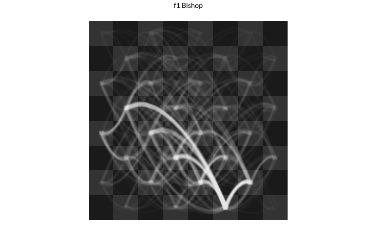
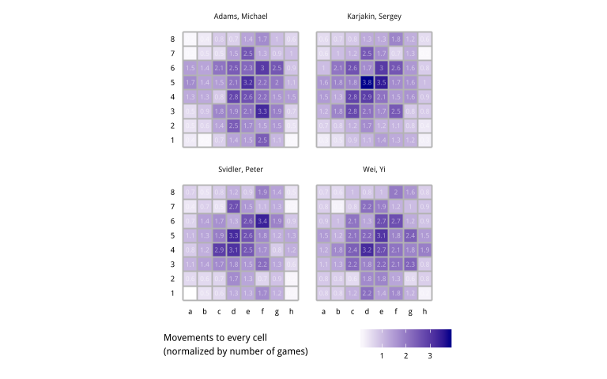

# Visualizing Chess Data With ggplot
Joshua Kunst  
There are nice visualizations from chess data:
[piece movement](http://www.visualnews.com/2015/06/15/visualizing-the-movements-of-chess-pieces-using-millions-of-games/),
[piece survaviliy](https://github.com/ojb500/SurvivingPieces),
[square usage by player](http://en.chessbase.com/post/seth-kadish-visualizing-chess).
Sadly not always the authors shows the code/data for replicate the final result.
So I write some code to show how to do some this great visualizations entirely in
R. Just for fun.

1. [The Data](#the-data)
1. [Piece Movements](#piece-movements)
1. [Survival rates](#survival-rates)
1. [Square usage by player](#square-usage-by-player)
1. [Distributions for the first movement](#distributions-for-the-first-movement)
1. [Who captures whom](#who-captures-whom)


### The Data ####
The original data come from [here](http://www.theweekinchess.com/chessnews/events/fide-world-cup-2015)
which was parsed and stored in the [rchess](http://github.com/jbkunst/rchess) package.


```r
library("rchess")
data(chesswc)
str(chesswc)
```

```
## Classes 'tbl_df', 'tbl' and 'data.frame':	1266 obs. of  11 variables:
##  $ event   : chr  "FIDE World Cup 2011" "FIDE World Cup 2011" "FIDE World Cup 2011" "FIDE World Cup 2011" ...
##  $ site    : chr  "Khanty-Mansiysk RUS" "Khanty-Mansiysk RUS" "Khanty-Mansiysk RUS" "Khanty-Mansiysk RUS" ...
##  $ date    : Date, format: "2011-08-28" "2011-08-28" ...
##  $ round   : num  1.1 1.1 1.1 1.1 1.1 1.1 1.1 1.1 1.1 1.1 ...
##  $ white   : chr  "Kaabi, Mejdi" "Ivanchuk, Vassily" "Ibrahim, Hatim" "Ponomariov, Ruslan" ...
##  $ black   : chr  "Karjakin, Sergey" "Steel, Henry Robert" "Mamedyarov, Shakhriyar" "Gwaze, Robert" ...
##  $ result  : chr  "0-1" "1-0" "0-1" "1-0" ...
##  $ whiteelo: int  2344 2768 2402 2764 2449 2746 2477 2741 2493 2736 ...
##  $ blackelo: int  2788 2362 2765 2434 2760 2452 2744 2480 2739 2493 ...
##  $ eco     : chr  "D15" "E68" "E67" "B40" ...
##  $ pgn     : chr  "1. d4 d5 2. Nf3 Nf6 3. c4 c6 4. Nc3 dxc4 5. e3 b5 6. a4 b4 7. Nb1 Ba6 8. Ne5 e6 9. Nxc4 c5 10. b3 cxd4 11. exd4 Nc6 12. Be3 Be7"| __truncated__ "1. c4 Nf6 2. Nc3 g6 3. g3 Bg7 4. Bg2 O-O 5. d4 d6 6. Nf3 Nbd7 7. O-O e5 8. e4 c6 9. Rb1 exd4 10. Nxd4 Re8 11. h3 Nc5 12. Re1 a5"| __truncated__ "1. Nf3 Nf6 2. c4 g6 3. Nc3 Bg7 4. g3 O-O 5. Bg2 d6 6. O-O Nbd7 7. d4 e5 8. b3 exd4 9. Nxd4 Re8 10. Bb2 Nc5 11. Qc2 h5 12. Rad1 "| __truncated__ "1. e4 c5 2. Nf3 e6 3. d3 Nc6 4. g3 e5 5. Bg2 d6 6. O-O Be7 7. c3 Nf6 8. Nbd2 O-O 9. a3 b5 10. Re1 Kh8 11. d4 Bd7 12. b4 cxd4 13"| __truncated__ ...
```

```r
chesswc %>% count(event)
```


event                    n
--------------------  ----
FIDE World Cup 2011    398
FIDE World Cup 2013    435
FIDE World Cup 2015    433

```r
chesswc <- chesswc %>% filter(event == "FIDE World Cup 2015")
```

The most important variable here is the [pgn](https://en.wikipedia.org/wiki/Portable_Game_Notation) game.
This pgn is a long string which represent the game. However this format is not so visualization
friendly. That's why I implemented the `history_detail()` method for a `Chess` object. Let's check.


```r
set.seed(123)
pgn <- sample(chesswc$pgn, size = 1)
str_sub(pgn, 0, 50)
```

```
## [1] "1. d4 Nf6 2. Nf3 d5 3. c4 e6 4. e3 Be7 5. Nbd2 O-O"
```

Compare the previous string with the first 10 rows of the `history_detail()`


```r
chss <- Chess$new()
chss$load_pgn(pgn)
```

```
## [1] TRUE
```

```r
chss$history_detail() %>%
  arrange(number_move) %>% 
  head(10)
```


piece        from   to    number_move   piece_number_move  status       number_move_capture  captured_by 
-----------  -----  ---  ------------  ------------------  ----------  --------------------  ------------
d2 Pawn      d2     d4              1                   1  NA                            NA  NA          
g8 Knight    g8     f6              2                   1  game over                     NA  NA          
g1 Knight    g1     f3              3                   1  NA                            NA  NA          
d7 Pawn      d7     d5              4                   1  NA                            NA  NA          
c2 Pawn      c2     c4              5                   1  captured                      14  d7 Pawn     
e7 Pawn      e7     e6              6                   1  game over                     NA  NA          
e2 Pawn      e2     e3              7                   1  game over                     NA  NA          
f8 Bishop    f8     e7              8                   1  NA                            NA  NA          
b1 Knight    b1     d2              9                   1  NA                            NA  NA          
Black King   e8     g8             10                   1  game over                     NA  NA          

The result is a dataframe where each row is a piece's movement showing explicitly the cells
where the travel in a particular number move. Now we apply this function over the 433
games in the FIDE World Cup 2015.


```r
library("foreach")
library("doParallel")
```

```
## Loading required package: iterators
## Loading required package: parallel
```

```r
workers <- makeCluster(parallel::detectCores())
registerDoParallel(workers)

chesswc <- chesswc %>% mutate(game_id = seq(nrow(.)))

dfmoves <- adply(chesswc %>% select(pgn, game_id), .margins = 1, function(x){
  chss <- Chess$new()
  chss$load_pgn(x$pgn)
  chss$history_detail()
  }, .parallel = TRUE, .paropts = list(.packages = c("rchess")))

dfmoves <- tbl_df(dfmoves) %>% select(-pgn)
dfmoves %>% filter(game_id == 1, piece == "g1 Knight")
```


 game_id  piece       from   to    number_move   piece_number_move  status       number_move_capture  captured_by 
--------  ----------  -----  ---  ------------  ------------------  ----------  --------------------  ------------
       1  g1 Knight   g1     f3              5                   1  NA                            NA  NA          
       1  g1 Knight   f3     h2             37                   2  NA                            NA  NA          
       1  g1 Knight   h2     g4             39                   3  NA                            NA  NA          
       1  g1 Knight   g4     f2             85                   4  game over                     NA  NA          

The `dfmoves` data frame will be the heart from all these plots due have a lot of information and 
it is easy to consume.

### Piece Movements #####
To try replicate the result it's necessary the data to represent (and then plot) the
board. In the rchess package there are some helper functions like `chessboardata()`.


```r
dfboard <- rchess:::.chessboarddata() %>%
  select(cell, col, row, x, y, cc)

head(dfboard)
```


cell   col    row    x    y  cc 
-----  ----  ----  ---  ---  ---
a1     a        1    1    1  b  
b1     b        1    2    1  w  
c1     c        1    3    1  b  
d1     d        1    4    1  w  
e1     e        1    5    1  b  
f1     f        1    6    1  w  

Now we add this information to the `dfmoves` data frame and calculates some field to 
to know how to draw the curves (see [here](http://rpubs.com/jbkunst/geom_curve) for more details).


```r
dfpaths <- dfmoves %>%
  left_join(dfboard %>% rename(from = cell, x.from = x, y.from = y),
            by = "from") %>%
  left_join(dfboard %>% rename(to = cell, x.to = x, y.to = y) %>% select(-cc, -col, -row),
            by = "to") %>%
  mutate(x_gt_y = abs(x.to - x.from) > abs(y.to - y.from),
         xy_sign = sign((x.to - x.from)*(y.to - y.from)) == 1,
         x_gt_y_equal_xy_sign = x_gt_y == xy_sign)
```

The data is ready! So we need now some `ggplot`, `geom_tile` for the board, the new `geom_curve`
to represent the piece's path and some `jitter` to make this more artistic. Let's
plot the f1 Bishop's movements.


```r
ggplot() +
  geom_tile(data = dfboard, aes(x, y, fill = cc)) +
  geom_curve(data = dfpaths %>% filter(piece == "f1 Bishop", x_gt_y_equal_xy_sign),
             aes(x = x.from, y = y.from, xend = x.to, yend = y.to),
             position = position_jitter(width = 0.2, height = 0.2),
             curvature = 0.50, angle = -45, alpha = 0.02, color = "white", size = 1.05) +
  geom_curve(data = dfpaths %>% filter(piece == "f1 Bishop", !x_gt_y_equal_xy_sign),
             aes(x = x.from, y = y.from, xend = x.to, yend = y.to),
             position = position_jitter(width = 0.2, height = 0.2),
             curvature = -0.50, angle = 45, alpha = 0.02, color = "white", size = 1.05) +
  scale_fill_manual(values =  c("gray10", "gray20")) +
  ggtitle("f1 Bishop") +
  coord_equal()
```

 

In the same way we can plot every piece.

 

I think it's look very similar to the original work made by [Steve Tung](https://twitter.com/_tungs_).

### Survival Rates #####
In this plot we need filter `dfmoves` by `!is.na(status)` so we can know what happend with
every piece in at the end of the game: if a piece was caputered of or not. Then get summary 
across all the games.


```r
dfsurvrates <- dfmoves %>%
  filter(!is.na(status)) %>%
  group_by(piece) %>%
  summarize(games = n(),
            was_captured = sum(status == "captured")) %>%
  mutate(surv_rate = 1 - was_captured/games)

dfsurvrates %>% arrange(desc(surv_rate)) %>% head()
```


piece         games   was_captured   surv_rate
-----------  ------  -------------  ----------
Black King      433              0   1.0000000
White King      433              0   1.0000000
h2 Pawn         433            121   0.7205543
h7 Pawn         433            148   0.6581986
g2 Pawn         433            150   0.6535797
g7 Pawn         433            160   0.6304850

This helps as validation because the kings are never captured. Now we use a helper function in the
rchess package `rchess:::.chesspiecedata()` to get the start position for every piece and then plot
the survival rates in the cell where the piece start in the game.


```r
dfsurvrates <- dfsurvrates %>%
  left_join(rchess:::.chesspiecedata() %>% select(start_position, piece = name, color, unicode),
            by = "piece") %>%
  full_join(dfboard %>% rename(start_position = cell),
            by = "start_position")

# Auxiliar data to plot the board
dfboard2 <- data_frame(x = 0:8 + 0.5, y = 0 + 0.5, xend = 0:8 + 0.5, yend = 8 + 0.5)

ggplot(dfsurvrates) +
  geom_tile(data = dfsurvrates %>% filter(!is.na(surv_rate)),
            aes(x, y, fill = surv_rate)) +
  scale_fill_gradient(low = "darkred",  high = "white") +
  geom_text(data = dfsurvrates %>% filter(!is.na(surv_rate)),
            aes(x, y, label = scales::percent(surv_rate)),
            color = "gray70", size = 5) +
  scale_x_continuous(breaks = 1:8, labels = letters[1:8]) +
  scale_y_continuous(breaks = 1:8, labels = 1:8)  +
  geom_segment(data = dfboard2, aes(x, y, xend = xend, yend = yend), color = "gray70") +
  geom_segment(data = dfboard2, aes(y, x, xend = yend, yend = xend), color = "gray70") +
  ggtitle("Survival Rates for each piece") + 
  coord_equal() + 
  theme_minimal() +
  theme(legend.position = "none")
```

 

Obviously the plot show same data in text and color, and there a lot of space without
information but the idea is use the chess board to represent the initial position in a chess game.

We can replace the texts with the piece's icons:


```r
ggplot(dfsurvrates) +
  geom_tile(data = dfsurvrates %>% filter(!is.na(surv_rate)),
            aes(x, y, fill = 100*surv_rate)) +
  scale_fill_gradient(NULL, low = "darkred",  high = "white") +
  geom_text(data = dfsurvrates %>% filter(!is.na(surv_rate)),
            aes(x, y, label = unicode), size = 11, color = "gray20", alpha = 0.7) +
  scale_x_continuous(breaks = 1:8, labels = letters[1:8]) +
  scale_y_continuous(breaks = 1:8, labels = 1:8)  +
  geom_segment(data = dfboard2, aes(x, y, xend = xend, yend = yend), color = "gray70") +
  geom_segment(data = dfboard2, aes(y, x, xend = yend, yend = xend), color = "gray70") +
  ggtitle("Survival Rates for each piece") + 
  coord_equal() +
  theme_minimal() +
  theme(legend.position = "bottom")
```

 

### Square Usage By Player #####
For this visualization we will use the `to` variable. First of all we select the player
who have more games in the table `chesswc`. Then for each of them get the `to` counts.


```r
players <- chesswc %>% count(white) %>% arrange(desc(n)) %>% .$white %>% head(4)
players
```

```
## [1] "Karjakin, Sergey" "Svidler, Peter"   "Wei, Yi"         
## [4] "Adams, Michael"
```

```r
dfmov_players <- ldply(players, function(p){ # p <- sample(players, size = 1)
  games <- chesswc %>% filter(white == p) %>% .$game_id
  dfres <- dfmoves %>%
    filter(game_id %in% games, !is.na(to)) %>%
    count(to) %>%
    mutate(player = p,
           p = n/length(games))
  dfres
})

dfmov_players <- dfmov_players %>%
  rename(cell = to) %>%
  left_join(dfboard, by = "cell")

ggplot(dfmov_players) +
  geom_tile(aes(x, row, fill = p)) +
  scale_fill_gradient("Movements to every cell\n(normalized by number of games)",
                      low = "white",  high = "darkblue") +
  geom_text(aes(x, row, label = round(p, 1)), size = 3, color = "white", alpha = 0.5) +
  facet_wrap(~player) +
  scale_x_continuous(breaks = 1:8, labels = letters[1:8]) +
  scale_y_continuous(breaks = 1:8, labels = 1:8)  +
  geom_segment(data = dfboard2, aes(x, y, xend = xend, yend = yend), color = "gray70") +
  geom_segment(data = dfboard2, aes(y, x, xend = yend, yend = xend), color = "gray70") +
  coord_equal() +
  theme_minimal() +
  theme(legend.position = "bottom")
```

 

### Distributions For The First Movement #####
Now, with the same data and using the `piece_number_move` and `number_move` we can obtain
the distribution for the first movement for each piece.


```r
piece_lvls <- rchess:::.chesspiecedata() %>%
  mutate(col = str_extract(start_position, "\\w{1}"),
         row = str_extract(start_position, "\\d{1}")) %>%
  arrange(desc(row), col) %>%
  .$name

dfmoves_first_mvm <- dfmoves %>%
  mutate(piece = factor(piece, levels = piece_lvls),
         number_move_2 = ifelse(number_move %% 2 == 0, number_move/2, (number_move + 1)/2 )) %>%
  filter(piece_number_move == 1)
```

```r
ggplot(dfmoves_first_mvm) +
  geom_density(aes(number_move_2), fill = "#B71C1C", alpha = 0.8, color = NA) +
  scale_y_continuous(breaks = NULL) +
  facet_wrap(~piece, nrow = 4, ncol = 8, scales = "free_y")  +
  xlab("Density") + ylab("Number Move") + 
  xlim(0, 40) +
  theme_gray() +
  theme(panel.background = element_rect(fill = "gray90"))
```

 

Notice the similarities between the White King and h1 Rook due the castling, the same
effect is present between the Black King and the h8 Rook.

### Who Captures Whom #####
For this plot we'll use the igraph package and [ForceAtlas2](https://github.com/analyxcompany/ForceAtlas2)
package an R implementation by [Adolfo Alvarez](http://adolfoalvarez.cl) of the Force Atlas 2 graph layout
designed for Gephi.

We get the rows with `status == "captured"` and summarize by `piece` and `captured_by` variables. The result data
frame will be the edges in our igraph  object using the `graph.data.frame` function.


```r
library("igraph")
```

```
## 
## Attaching package: 'igraph'
## 
## The following object is masked from 'package:stringr':
## 
##     %>%
## 
## The following objects are masked from 'package:dplyr':
## 
##     %>%, as_data_frame, groups, union
## 
## The following objects are masked from 'package:stats':
## 
##     decompose, spectrum
## 
## The following object is masked from 'package:base':
## 
##     union
```

```r
library("ForceAtlas2")

dfcaputures <- dfmoves %>%
  filter(status == "captured") %>%
  count(captured_by, piece) %>%
  ungroup() %>% 
  arrange(desc(n))

dfvertices <- rchess:::.chesspiecedata() %>%
  select(-fen, -start_position) %>%
  mutate(name2 = str_replace(name, " \\w+$", unicode),
         name2 = str_replace(name2, "White|Black", ""))

g <- graph.data.frame(dfcaputures %>% select(captured_by, piece, weight = n),
                      directed = TRUE,
                      vertices = dfvertices)

set.seed(123)
# lout <- layout.kamada.kawai(g)
lout <- layout.forceatlas2(g, iterations = 10000, plotstep = 0)

dfvertices <- dfvertices %>%
  mutate(x = lout[, 1],
         y = lout[, 2])

dfedges <- as_data_frame(g, "edges") %>%
  tbl_df() %>%
  left_join(dfvertices %>% select(from = name, x, y), by = "from") %>%
  left_join(dfvertices %>% select(to = name, xend = x, yend = y), by = "to")
```

To plot the the network I prefer use ggplot2 instead igraph just you get more control in the style
and colors.


```r
ggplot() +
  geom_curve(data = dfedges %>%
               filter((str_extract(from, "\\d+") %in% c(1, 2) |
                         str_detect(from, "White"))),
             aes(x, y, xend = xend, yend = yend, alpha = weight, size = weight),
             curvature = 0.1, color = "red") +
  geom_curve(data = dfedges %>%
               filter(!(str_extract(from, "\\d+") %in% c(1, 2) |
                          str_detect(from, "White"))),
             aes(x, y, xend = xend, yend = yend, alpha = weight, size = weight),
             curvature = 0.1, color = "blue") +
  scale_alpha(range = c(0.01, 0.5)) +
  scale_size(range = c(0.01, 2)) +
  geom_point(data = dfvertices, aes(x, y, color = color), size = 15, alpha = 0.9) +
  scale_color_manual(values = c("gray10", "gray90")) +
  geom_text(data = dfvertices %>% filter(str_length(name2) != 1),
            aes(x, y, label = name2), size = 5, color = "gray50") +
  geom_text(data = dfvertices %>% filter(str_length(name2) == 1),
            aes(x, y, label = name2), size = 9, color = "gray50") +
  ggtitle("Red: white captures black | Blue: black captures white")
```

 

It's know we usually exchange pieces with the same values: queen by queen, knight by bishop, etc. The interesting
fact we see here is the d2 pawn/c7 pawn/g1 knight relationship beacuse d2 pawn/c7 pawn is not so symmetrical and 
it's explained by the popular use the 
[Sicilian Opening](https://en.wikibooks.org/wiki/Chess_Opening_Theory/1._e4/1...c5/2._Nf3/2...d6/3._d4/3...cxd4/4._Nxd4) 
in a master level (`1.e4 c5 2.Nf3 d6 3.d4 cxd4 4.Nxd4`).

I hope you enjoyed this post in the same way I enjoyed doing it :D. If you notice a mistake please let me know.

---
title: "readme.R"
author: "jkunst"
date: "Fri Nov 06 16:12:10 2015"
---
