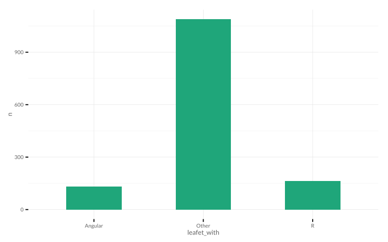

# Leaflet in SO
Joshua Kunst  


Data from http://data.stackexchange.com/stackoverflow/query/407411/leafet


```r
data <- read_csv("http://data.stackexchange.com/stackoverflow/csv/521113")
head(data)
```

       id  CreationDate           Score   ViewCount  Title                                                                 Tags                                                AnswerCount
---------  --------------------  ------  ----------  --------------------------------------------------------------------  -------------------------------------------------  ------------
 34106529  2015-12-05 14:19:51        0           7  Unable to render map on html page using tom tom map                   <javascript><html><image><leaflet>                            0
 34095499  2015-12-04 18:54:45        0          16  How can I pass info from Leaflet popup to Shiny output?               <r><shiny><leaflet>                                           0
 34095379  2015-12-04 18:47:01        0          19  D3 fisheye.js plugin on Leaflet map                                   <javascript><d3.js><leaflet><fisheye>                         0
 34093745  2015-12-04 17:08:34        2          17  D3 transition on bars inside a popup                                  <javascript><d3.js><leaflet>                                  1
 34091482  2015-12-04 15:14:38        0          12  Node+Jade+Express+Sqlite: How can I add a MiniMap to a Leaflet Map?   <javascript><node.js><express><sqlite3><leaflet>              1
 34080856  2015-12-04 04:20:02        0          16  R Leaflets does not work in tabsetpanel in Shiny                      <r><dictionary><shiny><leaflet>                               0

```r
data <- data %>%
  filter(str_detect(CreationDate, "^2015")) %>% 
  mutate(leafet_with_r = str_detect(Tags, "<r>|<shiny>|<rstudio>"),
         leafet_with_angular = str_detect(Tags, "<angular"),
         leafet_with = "Other",
         leafet_with = ifelse(leafet_with_r, "R", leafet_with),
         leafet_with = ifelse(leafet_with_angular, "Angular", leafet_with),
         leafet_with = ifelse(leafet_with_r + leafet_with_angular == 2, "Both", leafet_with))

data %>% count(leafet_with)
```


leafet_with       n
------------  -----
Angular         129
Other          1089
R               163

```r
ggplot(data %>% count(leafet_with)) + 
  geom_bar(aes(leafet_with, n), stat = "identity",
           fill = "#1FA67A", width = 0.5)
```

 


---
title: "readme.R"
author: "jkunst"
date: "Fri Dec 11 11:11:54 2015"
---
