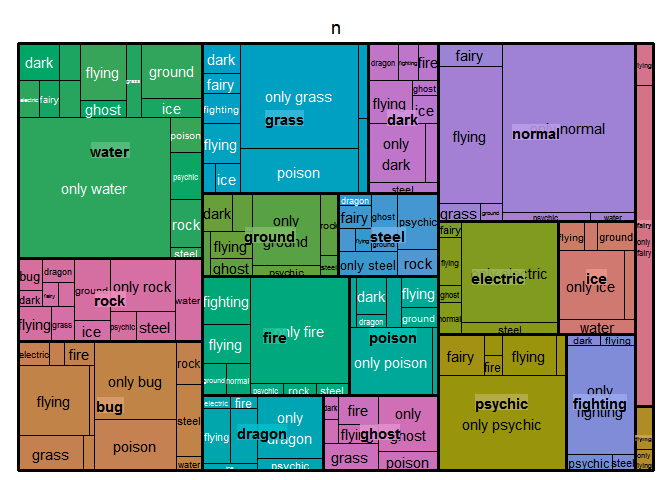
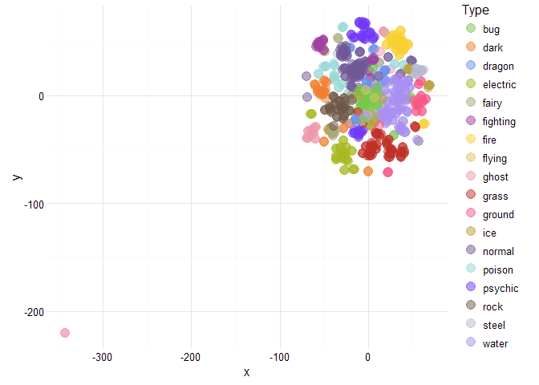

# pkmn visualize 'em all!
Joshua Kunst  


Time ago, when I was a younger man I know pokemon I konw the 150 pokemon then I 
And more than 10 year there are over 700 with new types new, new regions, etc. So
to know the status of all these monster I download the data and make some
chart to see 


## Data

There is a pokemon api http://pokeapi.co/. But we want all the pokemon data once so
we can go to the repository I found the raw data https://github.com/phalt/pokeapi/tree/master/data/v2/csv .
We'll need other type of data like type's colors, icon images. This data we founded here 
http://bulbapedia.bulbagarden.net/wiki/List_of_Pok%C3%A9mon_by_base_stats_(Generation_VI-present) and
http://pokemon-uranium.wikia.com/wiki/Template:fire_color.

Now to the script


```r
path <- function(x) paste0("https://raw.githubusercontent.com/phalt/pokeapi/master/data/v2/csv/", x)

dfpkmn <- read_csv(path("pokemon.csv")) %>% 
  select(-order, -is_default) %>% 
  rename(pokemon = identifier)

dfstat <- read_csv(path("stats.csv")) %>% 
  rename(stat_id = id) %>% 
  right_join(read_csv(path("pokemon_stats.csv")),
             by = "stat_id") %>% 
  mutate(identifier = str_replace(identifier, "-", "_")) %>% 
  select(pokemon_id, identifier, base_stat) %>% 
  spread(identifier, base_stat) %>% 
  rename(id = pokemon_id)

dftype <- read_csv(path("types.csv")) %>% 
  rename(type_id = id) %>% 
  right_join(read_csv(path("pokemon_types.csv")), by = "type_id") %>% 
  select(pokemon_id, identifier, slot) %>% 
  mutate(slot = paste0("type_", slot)) %>% 
  spread(slot, identifier) %>% 
  rename(id = pokemon_id)

dfegg <- read_csv(path("egg_groups.csv")) %>% 
  rename(egg_group_id = id) %>% 
  right_join(read_csv(path("pokemon_egg_groups.csv")), by = "egg_group_id") %>% 
  group_by(species_id) %>% 
  mutate(ranking = row_number(),
         ranking = paste0("egg_group_", ranking)) %>% 
  select(species_id, ranking, identifier) %>% 
  spread(ranking, identifier) 

dfimg <- "https://github.com/phalt/pokeapi/tree/master/data/Pokemon_XY_Sprites" %>% 
  read_html() %>% 
  html_nodes("tr.js-navigation-item > .content > .css-truncate a") %>% 
  map_df(function(x){
    url <- x %>% html_attr("href")
    data_frame(
      id = str_extract(basename(url), "\\d+"),
      url_image = basename(url)
    )
  }) %>%
  mutate(id = as.numeric(id))

url_bulbapedia_list <- "http://bulbapedia.bulbagarden.net/wiki/List_of_Pok%C3%A9mon_by_base_stats_(Generation_VI-present)" 

id <- url_bulbapedia_list %>% 
  read_html(encoding = "UTF-8") %>% 
  html_node("table.sortable") %>% 
  html_table() %>% 
  .[[1]] %>% 
  as.numeric()

url_icon <-  url_bulbapedia_list %>% 
  read_html() %>%
  html_nodes("table.sortable img") %>% 
  html_attr("src")

dficon <- data_frame(id, url_icon) %>% 
  filter(!is.na(id)) %>% 
  distinct(id)

dfcolor <- map_df(na.omit(unique(c(dftype$type_1, dftype$type_2))), function(t){
  # t <- "bug"
  col <- "http://pokemon-uranium.wikia.com/wiki/Template:%s_color" %>% 
    sprintf(t) %>%
    read_html() %>% 
    html_nodes("span > b") %>% 
    html_text()
  data_frame(type = t, color = paste0("#", col))
})

dfcolorf <- expand.grid(color_1 = dfcolor$color, color_2 = dfcolor$color,
                        stringsAsFactors = FALSE) %>% 
  tbl_df() %>% 
  group_by(color_1, color_2) %>% 
  do({
      n = 100;p = 0.25
      data_frame(color_f = colorRampPalette(c(.$color_1, .$color_2))(n)[round(n*p)])
    })

# THE join
df <- dfpkmn %>% 
  left_join(dftype, by = "id") %>% 
  left_join(dfstat, by = "id") %>% 
  left_join(dfcolor %>% rename(type_1 = type, color_1 = color), by = "type_1") %>% 
  left_join(dfcolor %>% rename(type_2 = type, color_2 = color), by = "type_2") %>% 
  left_join(dfcolorf, by =  c("color_1", "color_2")) %>% 
  left_join(dfegg, by = "species_id") %>% 
  left_join(dfimg, by = "id") %>% 
  left_join(dficon, by = "id")
```


Finally we remove the pokemon with no images (like the mega ones).


```r
df <- df %>% 
  mutate(color_f = ifelse(is.na(color_f), color_1, color_f)) %>% 
  filter(!is.na(url_image)) 

str(df)
```

```
## Classes 'tbl_df', 'tbl' and 'data.frame':	718 obs. of  21 variables:
##  $ id             : num  1 2 3 4 5 6 7 8 9 10 ...
##  $ pokemon        : chr  "bulbasaur" "ivysaur" "venusaur" "charmander" ...
##  $ species_id     : int  1 2 3 4 5 6 7 8 9 10 ...
##  $ height         : int  7 10 20 6 11 17 5 10 16 3 ...
##  $ weight         : int  69 130 1000 85 190 905 90 225 855 29 ...
##  $ base_experience: int  64 142 236 62 142 240 63 142 239 39 ...
##  $ type_1         : chr  "grass" "grass" "grass" "fire" ...
##  $ type_2         : chr  "poison" "poison" "poison" NA ...
##  $ attack         : int  49 62 82 52 64 84 48 63 83 30 ...
##  $ defense        : int  49 63 83 43 58 78 65 80 100 35 ...
##  $ hp             : int  45 60 80 39 58 78 44 59 79 45 ...
##  $ special_attack : int  65 80 100 60 80 109 50 65 85 20 ...
##  $ special_defense: int  65 80 100 50 65 85 64 80 105 20 ...
##  $ speed          : int  45 60 80 65 80 100 43 58 78 45 ...
##  $ color_1        : chr  "#78C850" "#78C850" "#78C850" "#F08030" ...
##  $ color_2        : chr  "#A040A0" "#A040A0" "#A040A0" NA ...
##  $ color_f        : chr  "#81A763" "#81A763" "#81A763" "#F08030" ...
##  $ egg_group_1    : chr  "monster" "monster" "monster" "monster" ...
##  $ egg_group_2    : chr  "plant" "plant" "plant" "dragon" ...
##  $ url_image      : chr  "1.png" "2.png" "3.png" "4.png" ...
##  $ url_icon       : chr  "http://cdn.bulbagarden.net/upload/e/ec/001MS.png" "http://cdn.bulbagarden.net/upload/6/6b/002MS.png" "http://cdn.bulbagarden.net/upload/d/df/003MS.png" "http://cdn.bulbagarden.net/upload/b/bb/004MS.png" ...
```

```r
head(df)
```

```
## Source: local data frame [6 x 21]
## 
##      id    pokemon species_id height weight base_experience type_1 type_2
##   (dbl)      (chr)      (int)  (int)  (int)           (int)  (chr)  (chr)
## 1     1  bulbasaur          1      7     69              64  grass poison
## 2     2    ivysaur          2     10    130             142  grass poison
## 3     3   venusaur          3     20   1000             236  grass poison
## 4     4 charmander          4      6     85              62   fire     NA
## 5     5 charmeleon          5     11    190             142   fire     NA
## 6     6  charizard          6     17    905             240   fire flying
## Variables not shown: attack (int), defense (int), hp (int), special_attack
##   (int), special_defense (int), speed (int), color_1 (chr), color_2 (chr),
##   color_f (chr), egg_group_1 (chr), egg_group_2 (chr), url_image (chr),
##   url_icon (chr)
```

### *bar chart* I choose you 


```r
dstype <- df %>% 
  count(type_1, color_1) %>% 
  ungroup() %>% 
  arrange(desc(n)) %>% 
  mutate(x = row_number()) %>% 
  rename(
    name = type_1,
    color = color_1,
    y = n
  ) %>% 
  select(y, name, color) %>% 
  list.parse3()
  
hcb <- highchart() %>% 
  hc_xAxis(categories = unlist(pluck(dstype, i = 2))) %>% 
  hc_yAxis(title = NULL) %>% 
  hc_add_series(data = dstype, type = "bar", showInLegend = FALSE,
                name = "Number of species")

hcb
```

<!--html_preserve--><div id="htmlwidget-8939" style="width:100%;height:500px;" class="highchart html-widget"></div>
<script type="application/json" data-for="htmlwidget-8939">{"x":{"hc_opts":{"title":{"text":null},"credits":{"enabled":false},"exporting":{"enabled":false},"plotOptions":{"series":{"turboThreshold":0}},"xAxis":{"categories":["water","normal","grass","bug","fire","psychic","rock","electric","ground","dark","poison","fighting","dragon","ghost","ice","steel","fairy","flying"]},"yAxis":{"title":null},"series":[{"data":[{"y":105,"name":"water","color":"#6890F0"},{"y":93,"name":"normal","color":"#A8A878"},{"y":66,"name":"grass","color":"#78C850"},{"y":63,"name":"bug","color":"#A8B820"},{"y":46,"name":"fire","color":"#F08030"},{"y":46,"name":"psychic","color":"#F85888"},{"y":40,"name":"rock","color":"#B8A038"},{"y":36,"name":"electric","color":"#F8D030"},{"y":30,"name":"ground","color":"#E0C068"},{"y":28,"name":"dark","color":"#705848"},{"y":28,"name":"poison","color":"#A040A0"},{"y":25,"name":"fighting","color":"#C03028"},{"y":24,"name":"dragon","color":"#7038F8"},{"y":23,"name":"ghost","color":"#705898"},{"y":23,"name":"ice","color":"#98D8D8"},{"y":22,"name":"steel","color":"#B8B8D0"},{"y":17,"name":"fairy","color":"#EE99AC"},{"y":3,"name":"flying","color":"#A890F0"}],"type":"bar","showInLegend":false,"name":"Number of species"}]},"theme":null,"conf_opts":{"global":{"Date":null,"VMLRadialGradientURL":"http =//code.highcharts.com/list(version)/gfx/vml-radial-gradient.png","canvasToolsURL":"http =//code.highcharts.com/list(version)/modules/canvas-tools.js","getTimezoneOffset":null,"timezoneOffset":0,"useUTC":true},"lang":{"contextButtonTitle":"Chart context menu","decimalPoint":".","downloadJPEG":"Download JPEG image","downloadPDF":"Download PDF document","downloadPNG":"Download PNG image","downloadSVG":"Download SVG vector image","drillUpText":"Back to {series.name}","invalidDate":null,"loading":"Loading...","months":["January","February","March","April","May","June","July","August","September","October","November","December"],"noData":"No data to display","numericSymbols":["k","M","G","T","P","E"],"printChart":"Print chart","resetZoom":"Reset zoom","resetZoomTitle":"Reset zoom level 1:1","shortMonths":["Jan","Feb","Mar","Apr","May","Jun","Jul","Aug","Sep","Oct","Nov","Dec"],"thousandsSep":" ","weekdays":["Sunday","Monday","Tuesday","Wednesday","Thursday","Friday","Saturday"]}},"type":"chart","fonts":[],"debug":false},"evals":[],"jsHooks":[]}</script><!--/html_preserve-->

```r
#### Oh! The *bar chat* has evolved into a *treemap*  ####
```

```r
dftm <- df %>% 
  mutate(type_2 = ifelse(is.na(type_2), paste("only", type_1), type_2),
         type_1 = type_1) %>% 
  group_by(type_1, type_2) %>%
  summarise(n = n()) %>% 
  ungroup()

set.seed(3514)

tm <- treemap::treemap(dftm, index = c("type_1", "type_2"), vSize = "n", vColor = "type_1")
```



```r
tm$tm <- tm$tm %>%
  tbl_df() %>% 
  left_join(df %>% select(type_1, type_2, color_f) %>% distinct(), by = c("type_1", "type_2")) %>%
  left_join(df %>% select(type_1, color_1) %>% distinct(), by = c("type_1")) %>% 
  mutate(type_1 = paste0("Main ", type_1),
         color = ifelse(is.na(color_f), color_1, color_f))

hctm <- highchart() %>% 
  hc_add_series_treemap(tm, allowDrillToNode = TRUE,
                        layoutAlgorithm = "squarified")

hctm
```

<!--html_preserve--><div id="htmlwidget-3262" style="width:100%;height:500px;" class="highchart html-widget"></div>
<script type="application/json" data-for="htmlwidget-3262">{"x":{"hc_opts":{"title":{"text":null},"credits":{"enabled":false},"exporting":{"enabled":false},"plotOptions":{"series":{"turboThreshold":0}},"series":[{"data":[{"name":"Main bug","type_2":null,"value":63,"valuecolor":63,"level":1,"color":"#A8B820","color_f":"#A8B820","color_1":"#A8B820","id":"main_bug","type_1":null},{"name":"Main dark","type_2":null,"value":28,"valuecolor":28,"level":1,"color":"#705848","color_f":"#705848","color_1":"#705848","id":"main_dark","type_1":null},{"name":"Main dragon","type_2":null,"value":24,"valuecolor":24,"level":1,"color":"#7038F8","color_f":"#7038F8","color_1":"#7038F8","id":"main_dragon","type_1":null},{"name":"Main electric","type_2":null,"value":36,"valuecolor":36,"level":1,"color":"#F8D030","color_f":"#F8D030","color_1":"#F8D030","id":"main_electric","type_1":null},{"name":"Main fairy","type_2":null,"value":17,"valuecolor":17,"level":1,"color":"#EE99AC","color_f":"#EE99AC","color_1":"#EE99AC","id":"main_fairy","type_1":null},{"name":"Main fighting","type_2":null,"value":25,"valuecolor":25,"level":1,"color":"#C03028","color_f":"#C03028","color_1":"#C03028","id":"main_fighting","type_1":null},{"name":"Main fire","type_2":null,"value":46,"valuecolor":46,"level":1,"color":"#F08030","color_f":"#F08030","color_1":"#F08030","id":"main_fire","type_1":null},{"name":"Main flying","type_2":null,"value":3,"valuecolor":3,"level":1,"color":"#A890F0","color_f":"#A890F0","color_1":"#A890F0","id":"main_flying","type_1":null},{"name":"Main ghost","type_2":null,"value":23,"valuecolor":23,"level":1,"color":"#705898","color_f":"#705898","color_1":"#705898","id":"main_ghost","type_1":null},{"name":"Main grass","type_2":null,"value":66,"valuecolor":66,"level":1,"color":"#78C850","color_f":"#78C850","color_1":"#78C850","id":"main_grass","type_1":null},{"name":"Main ground","type_2":null,"value":30,"valuecolor":30,"level":1,"color":"#E0C068","color_f":"#E0C068","color_1":"#E0C068","id":"main_ground","type_1":null},{"name":"Main ice","type_2":null,"value":23,"valuecolor":23,"level":1,"color":"#98D8D8","color_f":"#98D8D8","color_1":"#98D8D8","id":"main_ice","type_1":null},{"name":"Main normal","type_2":null,"value":93,"valuecolor":93,"level":1,"color":"#A8A878","color_f":"#A8A878","color_1":"#A8A878","id":"main_normal","type_1":null},{"name":"Main poison","type_2":null,"value":28,"valuecolor":28,"level":1,"color":"#A040A0","color_f":"#A040A0","color_1":"#A040A0","id":"main_poison","type_1":null},{"name":"Main psychic","type_2":null,"value":46,"valuecolor":46,"level":1,"color":"#F85888","color_f":"#F85888","color_1":"#F85888","id":"main_psychic","type_1":null},{"name":"Main rock","type_2":null,"value":40,"valuecolor":40,"level":1,"color":"#B8A038","color_f":"#B8A038","color_1":"#B8A038","id":"main_rock","type_1":null},{"name":"Main steel","type_2":null,"value":22,"valuecolor":22,"level":1,"color":"#B8B8D0","color_f":"#B8B8D0","color_1":"#B8B8D0","id":"main_steel","type_1":null},{"name":"Main water","type_2":null,"value":105,"valuecolor":105,"level":1,"color":"#6890F0","color_f":"#6890F0","color_1":"#6890F0","id":"main_water","type_1":null},{"name":"electric","type_2":null,"value":2,"valuecolor":2,"level":2,"color":"#BBBD23","color_f":"#BBBD23","color_1":"#A8B820","id":"electric","parent":"main_bug","type_1":"Main bug"},{"name":"fighting","type_2":null,"value":1,"valuecolor":1,"level":2,"color":"#AD9721","color_f":"#AD9721","color_1":"#A8B820","id":"fighting","parent":"main_bug","type_1":"Main bug"},{"name":"fire","type_2":null,"value":2,"valuecolor":2,"level":2,"color":"#B9AA23","color_f":"#B9AA23","color_1":"#A8B820","id":"fire","parent":"main_bug","type_1":"Main bug"},{"name":"flying","type_2":null,"value":13,"valuecolor":13,"level":2,"color":"#A8AE52","color_f":"#A8AE52","color_1":"#A8B820","id":"flying","parent":"main_bug","type_1":"Main bug"},{"name":"ghost","type_2":null,"value":1,"valuecolor":1,"level":2,"color":"#9AA03D","color_f":"#9AA03D","color_1":"#A8B820","id":"ghost","parent":"main_bug","type_1":"Main bug"},{"name":"grass","type_2":null,"value":6,"valuecolor":6,"level":2,"color":"#9CBB2B","color_f":"#9CBB2B","color_1":"#A8B820","id":"grass","parent":"main_bug","type_1":"Main bug"},{"name":"ground","type_2":null,"value":1,"valuecolor":1,"level":2,"color":"#B5B931","color_f":"#B5B931","color_1":"#A8B820","id":"ground","parent":"main_bug","type_1":"Main bug"},{"name":"only bug","type_2":null,"value":17,"valuecolor":17,"level":2,"color":"#A8B820","color_f":null,"color_1":"#A8B820","id":"only_bug","parent":"main_bug","type_1":"Main bug"},{"name":"poison","type_2":null,"value":11,"valuecolor":11,"level":2,"color":"#A69A3F","color_f":"#A69A3F","color_1":"#A8B820","id":"poison","parent":"main_bug","type_1":"Main bug"},{"name":"rock","type_2":null,"value":3,"valuecolor":3,"level":2,"color":"#ABB225","color_f":"#ABB225","color_1":"#A8B820","id":"rock","parent":"main_bug","type_1":"Main bug"},{"name":"steel","type_2":null,"value":5,"valuecolor":5,"level":2,"color":"#ABB84A","color_f":"#ABB84A","color_1":"#A8B820","id":"steel","parent":"main_bug","type_1":"Main bug"},{"name":"water","type_2":null,"value":1,"valuecolor":1,"level":2,"color":"#98AE52","color_f":"#98AE52","color_1":"#A8B820","id":"water","parent":"main_bug","type_1":"Main bug"},{"name":"dragon","type_2":null,"value":3,"valuecolor":3,"level":2,"color":"#705072","color_f":"#705072","color_1":"#705848","id":"dragon","parent":"main_dark","type_1":"Main dark"},{"name":"fighting","type_2":null,"value":2,"valuecolor":2,"level":2,"color":"#834E40","color_f":"#834E40","color_1":"#705848","id":"fighting","parent":"main_dark","type_1":"Main dark"},{"name":"fire","type_2":null,"value":2,"valuecolor":2,"level":2,"color":"#8F6142","color_f":"#8F6142","color_1":"#705848","id":"fire","parent":"main_dark","type_1":"Main dark"},{"name":"flying","type_2":null,"value":5,"valuecolor":5,"level":2,"color":"#7D6570","color_f":"#7D6570","color_1":"#705848","id":"flying","parent":"main_dark","type_1":"Main dark"},{"name":"ghost","type_2":null,"value":1,"valuecolor":1,"level":2,"color":"#70585B","color_f":"#70585B","color_1":"#705848","id":"ghost","parent":"main_dark","type_1":"Main dark"},{"name":"ice","type_2":null,"value":2,"valuecolor":2,"level":2,"color":"#79776A","color_f":"#79776A","color_1":"#705848","id":"ice","parent":"main_dark","type_1":"Main dark"},{"name":"only dark","type_2":null,"value":9,"valuecolor":9,"level":2,"color":"#705848","color_f":null,"color_1":"#705848","id":"only_dark","parent":"main_dark","type_1":"Main dark"},{"name":"psychic","type_2":null,"value":2,"valuecolor":2,"level":2,"color":"#905857","color_f":"#905857","color_1":"#705848","id":"psychic","parent":"main_dark","type_1":"Main dark"},{"name":"steel","type_2":null,"value":2,"valuecolor":2,"level":2,"color":"#816F68","color_f":"#816F68","color_1":"#705848","id":"steel","parent":"main_dark","type_1":"Main dark"},{"name":"electric","type_2":null,"value":1,"valuecolor":1,"level":2,"color":"#905CC7","color_f":"#905CC7","color_1":"#7038F8","id":"electric","parent":"main_dragon","type_1":"Main dragon"},{"name":"fire","type_2":null,"value":1,"valuecolor":1,"level":2,"color":"#8F49C7","color_f":"#8F49C7","color_1":"#7038F8","id":"fire","parent":"main_dragon","type_1":"Main dragon"},{"name":"flying","type_2":null,"value":4,"valuecolor":4,"level":2,"color":"#7D4DF6","color_f":"#7D4DF6","color_1":"#7038F8","id":"flying","parent":"main_dragon","type_1":"Main dragon"},{"name":"ground","type_2":null,"value":4,"valuecolor":4,"level":2,"color":"#8B58D5","color_f":"#8B58D5","color_1":"#7038F8","id":"ground","parent":"main_dragon","type_1":"Main dragon"},{"name":"ice","type_2":null,"value":1,"valuecolor":1,"level":2,"color":"#795EF0","color_f":"#795EF0","color_1":"#7038F8","id":"ice","parent":"main_dragon","type_1":"Main dragon"},{"name":"only dragon","type_2":null,"value":11,"valuecolor":11,"level":2,"color":"#7038F8","color_f":null,"color_1":"#7038F8","id":"only_dragon","parent":"main_dragon","type_1":"Main dragon"},{"name":"psychic","type_2":null,"value":2,"valuecolor":2,"level":2,"color":"#903FDC","color_f":"#903FDC","color_1":"#7038F8","id":"psychic","parent":"main_dragon","type_1":"Main dragon"},{"name":"fairy","type_2":null,"value":1,"valuecolor":1,"level":2,"color":"#F5C24E","color_f":"#F5C24E","color_1":"#F8D030","id":"fairy","parent":"main_electric","type_1":"Main electric"},{"name":"flying","type_2":null,"value":3,"valuecolor":3,"level":2,"color":"#E4C05E","color_f":"#E4C05E","color_1":"#F8D030","id":"flying","parent":"main_electric","type_1":"Main electric"},{"name":"ghost","type_2":null,"value":1,"valuecolor":1,"level":2,"color":"#D7B249","color_f":"#D7B249","color_1":"#F8D030","id":"ghost","parent":"main_electric","type_1":"Main electric"},{"name":"normal","type_2":null,"value":2,"valuecolor":2,"level":2,"color":"#E4C641","color_f":"#E4C641","color_1":"#F8D030","id":"normal","parent":"main_electric","type_1":"Main electric"},{"name":"only electric","type_2":null,"value":26,"valuecolor":26,"level":2,"color":"#F8D030","color_f":null,"color_1":"#F8D030","id":"only_electric","parent":"main_electric","type_1":"Main electric"},{"name":"steel","type_2":null,"value":3,"valuecolor":3,"level":2,"color":"#E8CA56","color_f":"#E8CA56","color_1":"#F8D030","id":"steel","parent":"main_electric","type_1":"Main electric"},{"name":"flying","type_2":null,"value":2,"valuecolor":2,"level":2,"color":"#DD96BC","color_f":"#DD96BC","color_1":"#EE99AC","id":"flying","parent":"main_fairy","type_1":"Main fairy"},{"name":"only fairy","type_2":null,"value":15,"valuecolor":15,"level":2,"color":"#EE99AC","color_f":null,"color_1":"#EE99AC","id":"only_fairy","parent":"main_fairy","type_1":"Main fairy"},{"name":"dark","type_2":null,"value":1,"valuecolor":1,"level":2,"color":"#AC392F","color_f":"#AC392F","color_1":"#C03028","id":"dark","parent":"main_fighting","type_1":"Main fighting"},{"name":"flying","type_2":null,"value":1,"valuecolor":1,"level":2,"color":"#BA4758","color_f":"#BA4758","color_1":"#C03028","id":"flying","parent":"main_fighting","type_1":"Main fighting"},{"name":"only fighting","type_2":null,"value":20,"valuecolor":20,"level":2,"color":"#C03028","color_f":null,"color_1":"#C03028","id":"only_fighting","parent":"main_fighting","type_1":"Main fighting"},{"name":"psychic","type_2":null,"value":2,"valuecolor":2,"level":2,"color":"#CD393F","color_f":"#CD393F","color_1":"#C03028","id":"psychic","parent":"main_fighting","type_1":"Main fighting"},{"name":"steel","type_2":null,"value":1,"valuecolor":1,"level":2,"color":"#BE5050","color_f":"#BE5050","color_1":"#C03028","id":"steel","parent":"main_fighting","type_1":"Main fighting"},{"name":"fighting","type_2":null,"value":6,"valuecolor":6,"level":2,"color":"#E46C2E","color_f":"#E46C2E","color_1":"#F08030","id":"fighting","parent":"main_fire","type_1":"Main fire"},{"name":"flying","type_2":null,"value":5,"valuecolor":5,"level":2,"color":"#DE835E","color_f":"#DE835E","color_1":"#F08030","id":"flying","parent":"main_fire","type_1":"Main fire"},{"name":"ground","type_2":null,"value":2,"valuecolor":2,"level":2,"color":"#EC8F3D","color_f":"#EC8F3D","color_1":"#F08030","id":"ground","parent":"main_fire","type_1":"Main fire"},{"name":"normal","type_2":null,"value":2,"valuecolor":2,"level":2,"color":"#DE8941","color_f":"#DE8941","color_1":"#F08030","id":"normal","parent":"main_fire","type_1":"Main fire"},{"name":"only fire","type_2":null,"value":28,"valuecolor":28,"level":2,"color":"#F08030","color_f":null,"color_1":"#F08030","id":"only_fire","parent":"main_fire","type_1":"Main fire"},{"name":"psychic","type_2":null,"value":1,"valuecolor":1,"level":2,"color":"#F17645","color_f":"#F17645","color_1":"#F08030","id":"psychic","parent":"main_fire","type_1":"Main fire"},{"name":"rock","type_2":null,"value":1,"valuecolor":1,"level":2,"color":"#E28731","color_f":"#E28731","color_1":"#F08030","id":"rock","parent":"main_fire","type_1":"Main fire"},{"name":"steel","type_2":null,"value":1,"valuecolor":1,"level":2,"color":"#E28D56","color_f":"#E28D56","color_1":"#F08030","id":"steel","parent":"main_fire","type_1":"Main fire"},{"name":"dragon","type_2":null,"value":2,"valuecolor":2,"level":2,"color":"#9A7AF1","color_f":"#9A7AF1","color_1":"#A890F0","id":"dragon","parent":"main_flying","type_1":"Main flying"},{"name":"only flying","type_2":null,"value":1,"valuecolor":1,"level":2,"color":"#A890F0","color_f":null,"color_1":"#A890F0","id":"only_flying","parent":"main_flying","type_1":"Main flying"},{"name":"dark","type_2":null,"value":1,"valuecolor":1,"level":2,"color":"#705884","color_f":"#705884","color_1":"#705898","id":"dark","parent":"main_ghost","type_1":"Main ghost"},{"name":"dragon","type_2":null,"value":1,"valuecolor":1,"level":2,"color":"#7050AF","color_f":"#7050AF","color_1":"#705898","id":"dragon","parent":"main_ghost","type_1":"Main ghost"},{"name":"fire","type_2":null,"value":3,"valuecolor":3,"level":2,"color":"#8F617E","color_f":"#8F617E","color_1":"#705898","id":"fire","parent":"main_ghost","type_1":"Main ghost"},{"name":"flying","type_2":null,"value":2,"valuecolor":2,"level":2,"color":"#7D65AD","color_f":"#7D65AD","color_1":"#705898","id":"flying","parent":"main_ghost","type_1":"Main ghost"},{"name":"grass","type_2":null,"value":4,"valuecolor":4,"level":2,"color":"#717386","color_f":"#717386","color_1":"#705898","id":"grass","parent":"main_ghost","type_1":"Main ghost"},{"name":"only ghost","type_2":null,"value":9,"valuecolor":9,"level":2,"color":"#705898","color_f":null,"color_1":"#705898","id":"only_ghost","parent":"main_ghost","type_1":"Main ghost"},{"name":"poison","type_2":null,"value":3,"valuecolor":3,"level":2,"color":"#7B5299","color_f":"#7B5299","color_1":"#705898","id":"poison","parent":"main_ghost","type_1":"Main ghost"},{"name":"dark","type_2":null,"value":3,"valuecolor":3,"level":2,"color":"#76AC4E","color_f":"#76AC4E","color_1":"#78C850","id":"dark","parent":"main_grass","type_1":"Main grass"},{"name":"fairy","type_2":null,"value":2,"valuecolor":2,"level":2,"color":"#94BC66","color_f":"#94BC66","color_1":"#78C850","id":"fairy","parent":"main_grass","type_1":"Main grass"},{"name":"fighting","type_2":null,"value":3,"valuecolor":3,"level":2,"color":"#89A346","color_f":"#89A346","color_1":"#78C850","id":"fighting","parent":"main_grass","type_1":"Main grass"},{"name":"flying","type_2":null,"value":4,"valuecolor":4,"level":2,"color":"#83BA76","color_f":"#83BA76","color_1":"#78C850","id":"flying","parent":"main_grass","type_1":"Main grass"},{"name":"ground","type_2":null,"value":1,"valuecolor":1,"level":2,"color":"#91C655","color_f":"#91C655","color_1":"#78C850","id":"ground","parent":"main_grass","type_1":"Main grass"},{"name":"ice","type_2":null,"value":2,"valuecolor":2,"level":2,"color":"#7FCB70","color_f":"#7FCB70","color_1":"#78C850","id":"ice","parent":"main_grass","type_1":"Main grass"},{"name":"only grass","type_2":null,"value":33,"valuecolor":33,"level":2,"color":"#78C850","color_f":null,"color_1":"#78C850","id":"only_grass","parent":"main_grass","type_1":"Main grass"},{"name":"poison","type_2":null,"value":14,"valuecolor":14,"level":2,"color":"#81A763","color_f":"#81A763","color_1":"#78C850","id":"poison","parent":"main_grass","type_1":"Main grass"},{"name":"psychic","type_2":null,"value":2,"valuecolor":2,"level":2,"color":"#97AC5D","color_f":"#97AC5D","color_1":"#78C850","id":"psychic","parent":"main_grass","type_1":"Main grass"},{"name":"steel","type_2":null,"value":2,"valuecolor":2,"level":2,"color":"#87C46F","color_f":"#87C46F","color_1":"#78C850","id":"steel","parent":"main_grass","type_1":"Main grass"},{"name":"dark","type_2":null,"value":3,"valuecolor":3,"level":2,"color":"#C4A660","color_f":"#C4A660","color_1":"#E0C068","id":"dark","parent":"main_ground","type_1":"Main ground"},{"name":"dragon","type_2":null,"value":2,"valuecolor":2,"level":2,"color":"#C49F8A","color_f":"#C49F8A","color_1":"#E0C068","id":"dragon","parent":"main_ground","type_1":"Main ground"},{"name":"electric","type_2":null,"value":1,"valuecolor":1,"level":2,"color":"#E5C35A","color_f":"#E5C35A","color_1":"#E0C068","id":"electric","parent":"main_ground","type_1":"Main ground"},{"name":"flying","type_2":null,"value":3,"valuecolor":3,"level":2,"color":"#D2B488","color_f":"#D2B488","color_1":"#E0C068","id":"flying","parent":"main_ground","type_1":"Main ground"},{"name":"ghost","type_2":null,"value":2,"valuecolor":2,"level":2,"color":"#C4A673","color_f":"#C4A673","color_1":"#E0C068","id":"ghost","parent":"main_ground","type_1":"Main ground"},{"name":"only ground","type_2":null,"value":13,"valuecolor":13,"level":2,"color":"#E0C068","color_f":null,"color_1":"#E0C068","id":"only_ground","parent":"main_ground","type_1":"Main ground"},{"name":"psychic","type_2":null,"value":2,"valuecolor":2,"level":2,"color":"#E5A66F","color_f":"#E5A66F","color_1":"#E0C068","id":"psychic","parent":"main_ground","type_1":"Main ground"},{"name":"rock","type_2":null,"value":3,"valuecolor":3,"level":2,"color":"#D6B85C","color_f":"#D6B85C","color_1":"#E0C068","id":"rock","parent":"main_ground","type_1":"Main ground"},{"name":"steel","type_2":null,"value":1,"valuecolor":1,"level":2,"color":"#D6BE81","color_f":"#D6BE81","color_1":"#E0C068","id":"steel","parent":"main_ground","type_1":"Main ground"},{"name":"flying","type_2":null,"value":2,"valuecolor":2,"level":2,"color":"#9BC6DD","color_f":"#9BC6DD","color_1":"#98D8D8","id":"flying","parent":"main_ice","type_1":"Main ice"},{"name":"ghost","type_2":null,"value":1,"valuecolor":1,"level":2,"color":"#8EB8C8","color_f":"#8EB8C8","color_1":"#98D8D8","id":"ghost","parent":"main_ice","type_1":"Main ice"},{"name":"ground","type_2":null,"value":3,"valuecolor":3,"level":2,"color":"#A9D2BC","color_f":"#A9D2BC","color_1":"#98D8D8","id":"ground","parent":"main_ice","type_1":"Main ice"},{"name":"only ice","type_2":null,"value":12,"valuecolor":12,"level":2,"color":"#98D8D8","color_f":null,"color_1":"#98D8D8","id":"only_ice","parent":"main_ice","type_1":"Main ice"},{"name":"psychic","type_2":null,"value":2,"valuecolor":2,"level":2,"color":"#AFB8C4","color_f":"#AFB8C4","color_1":"#98D8D8","id":"psychic","parent":"main_ice","type_1":"Main ice"},{"name":"water","type_2":null,"value":3,"valuecolor":3,"level":2,"color":"#8CC6DD","color_f":"#8CC6DD","color_1":"#98D8D8","id":"water","parent":"main_ice","type_1":"Main ice"},{"name":"fairy","type_2":null,"value":4,"valuecolor":4,"level":2,"color":"#B8A484","color_f":"#B8A484","color_1":"#A8A878","id":"fairy","parent":"main_normal","type_1":"Main normal"},{"name":"flying","type_2":null,"value":23,"valuecolor":23,"level":2,"color":"#A8A295","color_f":"#A8A295","color_1":"#A8A878","id":"flying","parent":"main_normal","type_1":"Main normal"},{"name":"grass","type_2":null,"value":2,"valuecolor":2,"level":2,"color":"#9CAF6E","color_f":"#9CAF6E","color_1":"#A8A878","id":"grass","parent":"main_normal","type_1":"Main normal"},{"name":"ground","type_2":null,"value":1,"valuecolor":1,"level":2,"color":"#B5AD74","color_f":"#B5AD74","color_1":"#A8A878","id":"ground","parent":"main_normal","type_1":"Main normal"},{"name":"only normal","type_2":null,"value":60,"valuecolor":60,"level":2,"color":"#A8A878","color_f":null,"color_1":"#A8A878","id":"only_normal","parent":"main_normal","type_1":"Main normal"},{"name":"psychic","type_2":null,"value":2,"valuecolor":2,"level":2,"color":"#BB947B","color_f":"#BB947B","color_1":"#A8A878","id":"psychic","parent":"main_normal","type_1":"Main normal"},{"name":"water","type_2":null,"value":1,"valuecolor":1,"level":2,"color":"#98A295","color_f":"#98A295","color_1":"#A8A878","id":"water","parent":"main_normal","type_1":"Main normal"},{"name":"bug","type_2":null,"value":1,"valuecolor":1,"level":2,"color":"#A15D80","color_f":"#A15D80","color_1":"#A040A0","id":"bug","parent":"main_poison","type_1":"Main poison"},{"name":"dark","type_2":null,"value":3,"valuecolor":3,"level":2,"color":"#94458A","color_f":"#94458A","color_1":"#A040A0","id":"dark","parent":"main_poison","type_1":"Main poison"},{"name":"dragon","type_2":null,"value":1,"valuecolor":1,"level":2,"color":"#943EB5","color_f":"#943EB5","color_1":"#A040A0","id":"dragon","parent":"main_poison","type_1":"Main poison"},{"name":"fighting","type_2":null,"value":2,"valuecolor":2,"level":2,"color":"#A73C82","color_f":"#A73C82","color_1":"#A040A0","id":"fighting","parent":"main_poison","type_1":"Main poison"},{"name":"flying","type_2":null,"value":3,"valuecolor":3,"level":2,"color":"#A153B3","color_f":"#A153B3","color_1":"#A040A0","id":"flying","parent":"main_poison","type_1":"Main poison"},{"name":"ground","type_2":null,"value":2,"valuecolor":2,"level":2,"color":"#AF5F92","color_f":"#AF5F92","color_1":"#A040A0","id":"ground","parent":"main_poison","type_1":"Main poison"},{"name":"only poison","type_2":null,"value":15,"valuecolor":15,"level":2,"color":"#A040A0","color_f":null,"color_1":"#A040A0","id":"only_poison","parent":"main_poison","type_1":"Main poison"},{"name":"water","type_2":null,"value":1,"valuecolor":1,"level":2,"color":"#9253B3","color_f":"#9253B3","color_1":"#A040A0","id":"water","parent":"main_poison","type_1":"Main poison"},{"name":"fairy","type_2":null,"value":5,"valuecolor":5,"level":2,"color":"#F56790","color_f":"#F56790","color_1":"#F85888","id":"fairy","parent":"main_psychic","type_1":"Main psychic"},{"name":"fighting","type_2":null,"value":1,"valuecolor":1,"level":2,"color":"#EA4E70","color_f":"#EA4E70","color_1":"#F85888","id":"fighting","parent":"main_psychic","type_1":"Main psychic"},{"name":"fire","type_2":null,"value":1,"valuecolor":1,"level":2,"color":"#F66172","color_f":"#F66172","color_1":"#F85888","id":"fire","parent":"main_psychic","type_1":"Main psychic"},{"name":"flying","type_2":null,"value":6,"valuecolor":6,"level":2,"color":"#E465A1","color_f":"#E465A1","color_1":"#F85888","id":"flying","parent":"main_psychic","type_1":"Main psychic"},{"name":"grass","type_2":null,"value":1,"valuecolor":1,"level":2,"color":"#D8737A","color_f":"#D8737A","color_1":"#F85888","id":"grass","parent":"main_psychic","type_1":"Main psychic"},{"name":"only psychic","type_2":null,"value":32,"valuecolor":32,"level":2,"color":"#F85888","color_f":null,"color_1":"#F85888","id":"only_psychic","parent":"main_psychic","type_1":"Main psychic"},{"name":"bug","type_2":null,"value":2,"valuecolor":2,"level":2,"color":"#B4A532","color_f":"#B4A532","color_1":"#B8A038","id":"bug","parent":"main_rock","type_1":"Main rock"},{"name":"dark","type_2":null,"value":1,"valuecolor":1,"level":2,"color":"#A68E3B","color_f":"#A68E3B","color_1":"#B8A038","id":"dark","parent":"main_rock","type_1":"Main rock"},{"name":"dragon","type_2":null,"value":2,"valuecolor":2,"level":2,"color":"#A68666","color_f":"#A68666","color_1":"#B8A038","id":"dragon","parent":"main_rock","type_1":"Main rock"},{"name":"fairy","type_2":null,"value":1,"valuecolor":1,"level":2,"color":"#C59E54","color_f":"#C59E54","color_1":"#B8A038","id":"fairy","parent":"main_rock","type_1":"Main rock"},{"name":"fighting","type_2":null,"value":1,"valuecolor":1,"level":2,"color":"#B98434","color_f":"#B98434","color_1":"#B8A038","id":"fighting","parent":"main_rock","type_1":"Main rock"},{"name":"flying","type_2":null,"value":3,"valuecolor":3,"level":2,"color":"#B49C64","color_f":"#B49C64","color_1":"#B8A038","id":"flying","parent":"main_rock","type_1":"Main rock"},{"name":"grass","type_2":null,"value":2,"valuecolor":2,"level":2,"color":"#A8A93D","color_f":"#A8A93D","color_1":"#B8A038","id":"grass","parent":"main_rock","type_1":"Main rock"},{"name":"ground","type_2":null,"value":6,"valuecolor":6,"level":2,"color":"#C1A743","color_f":"#C1A743","color_1":"#B8A038","id":"ground","parent":"main_rock","type_1":"Main rock"},{"name":"ice","type_2":null,"value":2,"valuecolor":2,"level":2,"color":"#B0AD5E","color_f":"#B0AD5E","color_1":"#B8A038","id":"ice","parent":"main_rock","type_1":"Main rock"},{"name":"only rock","type_2":null,"value":9,"valuecolor":9,"level":2,"color":"#B8A038","color_f":null,"color_1":"#B8A038","id":"only_rock","parent":"main_rock","type_1":"Main rock"},{"name":"psychic","type_2":null,"value":2,"valuecolor":2,"level":2,"color":"#C78E4B","color_f":"#C78E4B","color_1":"#B8A038","id":"psychic","parent":"main_rock","type_1":"Main rock"},{"name":"steel","type_2":null,"value":3,"valuecolor":3,"level":2,"color":"#B8A55C","color_f":"#B8A55C","color_1":"#B8A038","id":"steel","parent":"main_rock","type_1":"Main rock"},{"name":"water","type_2":null,"value":6,"valuecolor":6,"level":2,"color":"#A49C64","color_f":"#A49C64","color_1":"#B8A038","id":"water","parent":"main_rock","type_1":"Main rock"},{"name":"dragon","type_2":null,"value":1,"valuecolor":1,"level":2,"color":"#A698D9","color_f":"#A698D9","color_1":"#B8B8D0","id":"dragon","parent":"main_steel","type_1":"Main steel"},{"name":"fairy","type_2":null,"value":2,"valuecolor":2,"level":2,"color":"#C5B0C7","color_f":"#C5B0C7","color_1":"#B8B8D0","id":"fairy","parent":"main_steel","type_1":"Main steel"},{"name":"fighting","type_2":null,"value":1,"valuecolor":1,"level":2,"color":"#B997A7","color_f":"#B997A7","color_1":"#B8B8D0","id":"fighting","parent":"main_steel","type_1":"Main steel"},{"name":"flying","type_2":null,"value":1,"valuecolor":1,"level":2,"color":"#B4AED7","color_f":"#B4AED7","color_1":"#B8B8D0","id":"flying","parent":"main_steel","type_1":"Main steel"},{"name":"ghost","type_2":null,"value":3,"valuecolor":3,"level":2,"color":"#A6A0C2","color_f":"#A6A0C2","color_1":"#B8B8D0","id":"ghost","parent":"main_steel","type_1":"Main steel"},{"name":"ground","type_2":null,"value":1,"valuecolor":1,"level":2,"color":"#C1B9B6","color_f":"#C1B9B6","color_1":"#B8B8D0","id":"ground","parent":"main_steel","type_1":"Main steel"},{"name":"only steel","type_2":null,"value":4,"valuecolor":4,"level":2,"color":"#B8B8D0","color_f":null,"color_1":"#B8B8D0","id":"only_steel","parent":"main_steel","type_1":"Main steel"},{"name":"psychic","type_2":null,"value":6,"valuecolor":6,"level":2,"color":"#C7A0BE","color_f":"#C7A0BE","color_1":"#B8B8D0","id":"psychic","parent":"main_steel","type_1":"Main steel"},{"name":"rock","type_2":null,"value":3,"valuecolor":3,"level":2,"color":"#B8B2AB","color_f":"#B8B2AB","color_1":"#B8B8D0","id":"rock","parent":"main_steel","type_1":"Main steel"},{"name":"dark","type_2":null,"value":4,"valuecolor":4,"level":2,"color":"#6982C7","color_f":"#6982C7","color_1":"#6890F0","id":"dark","parent":"main_water","type_1":"Main water"},{"name":"dragon","type_2":null,"value":2,"valuecolor":2,"level":2,"color":"#697AF1","color_f":"#697AF1","color_1":"#6890F0","id":"dragon","parent":"main_water","type_1":"Main water"},{"name":"electric","type_2":null,"value":2,"valuecolor":2,"level":2,"color":"#8A9FC1","color_f":"#8A9FC1","color_1":"#6890F0","id":"electric","parent":"main_water","type_1":"Main water"},{"name":"fairy","type_2":null,"value":2,"valuecolor":2,"level":2,"color":"#8892DF","color_f":"#8892DF","color_1":"#6890F0","id":"fairy","parent":"main_water","type_1":"Main water"},{"name":"fighting","type_2":null,"value":2,"valuecolor":2,"level":2,"color":"#7D78BF","color_f":"#7D78BF","color_1":"#6890F0","id":"fighting","parent":"main_water","type_1":"Main water"},{"name":"flying","type_2":null,"value":7,"valuecolor":7,"level":2,"color":"#7790F0","color_f":"#7790F0","color_1":"#6890F0","id":"flying","parent":"main_water","type_1":"Main water"},{"name":"ghost","type_2":null,"value":2,"valuecolor":2,"level":2,"color":"#6982DA","color_f":"#6982DA","color_1":"#6890F0","id":"ghost","parent":"main_water","type_1":"Main water"},{"name":"grass","type_2":null,"value":3,"valuecolor":3,"level":2,"color":"#6B9DC9","color_f":"#6B9DC9","color_1":"#6890F0","id":"grass","parent":"main_water","type_1":"Main water"},{"name":"ground","type_2":null,"value":9,"valuecolor":9,"level":2,"color":"#859BCF","color_f":"#859BCF","color_1":"#6890F0","id":"ground","parent":"main_water","type_1":"Main water"},{"name":"ice","type_2":null,"value":3,"valuecolor":3,"level":2,"color":"#73A1EA","color_f":"#73A1EA","color_1":"#6890F0","id":"ice","parent":"main_water","type_1":"Main water"},{"name":"only water","type_2":null,"value":57,"valuecolor":57,"level":2,"color":"#6890F0","color_f":null,"color_1":"#6890F0","id":"only_water","parent":"main_water","type_1":"Main water"},{"name":"poison","type_2":null,"value":3,"valuecolor":3,"level":2,"color":"#757CDC","color_f":"#757CDC","color_1":"#6890F0","id":"poison","parent":"main_water","type_1":"Main water"},{"name":"psychic","type_2":null,"value":4,"valuecolor":4,"level":2,"color":"#8A82D6","color_f":"#8A82D6","color_1":"#6890F0","id":"psychic","parent":"main_water","type_1":"Main water"},{"name":"rock","type_2":null,"value":4,"valuecolor":4,"level":2,"color":"#7B93C3","color_f":"#7B93C3","color_1":"#6890F0","id":"rock","parent":"main_water","type_1":"Main water"},{"name":"steel","type_2":null,"value":1,"valuecolor":1,"level":2,"color":"#7B99E8","color_f":"#7B99E8","color_1":"#6890F0","id":"steel","parent":"main_water","type_1":"Main water"}],"type":"treemap","allowDrillToNode":true,"layoutAlgorithm":"squarified"}]},"theme":null,"conf_opts":{"global":{"Date":null,"VMLRadialGradientURL":"http =//code.highcharts.com/list(version)/gfx/vml-radial-gradient.png","canvasToolsURL":"http =//code.highcharts.com/list(version)/modules/canvas-tools.js","getTimezoneOffset":null,"timezoneOffset":0,"useUTC":true},"lang":{"contextButtonTitle":"Chart context menu","decimalPoint":".","downloadJPEG":"Download JPEG image","downloadPDF":"Download PDF document","downloadPNG":"Download PNG image","downloadSVG":"Download SVG vector image","drillUpText":"Back to {series.name}","invalidDate":null,"loading":"Loading...","months":["January","February","March","April","May","June","July","August","September","October","November","December"],"noData":"No data to display","numericSymbols":["k","M","G","T","P","E"],"printChart":"Print chart","resetZoom":"Reset zoom","resetZoomTitle":"Reset zoom level 1:1","shortMonths":["Jan","Feb","Mar","Apr","May","Jun","Jul","Aug","Sep","Oct","Nov","Dec"],"thousandsSep":" ","weekdays":["Sunday","Monday","Tuesday","Wednesday","Thursday","Friday","Saturday"]}},"type":"chart","fonts":[],"debug":false},"evals":[],"jsHooks":[]}</script><!--/html_preserve-->

```
## Source: local data frame [108 x 4]
## 
##    type_1 color_1            stat value
##     (chr)   (chr)          (fctr) (dbl)
## 1     bug #A8B820              hp  60.0
## 2     bug #A8B820          attack  63.0
## 3     bug #A8B820         defense  55.0
## 4     bug #A8B820  special_attack  50.0
## 5     bug #A8B820 special_defense  56.0
## 6     bug #A8B820           speed  57.0
## 7    dark #705848              hp  65.0
## 8    dark #705848          attack  86.5
## 9    dark #705848         defense  67.5
## 10   dark #705848  special_attack  62.5
## ..    ...     ...             ...   ...
```

<!--html_preserve--><div id="htmlwidget-2866" style="width:100%;height:500px;" class="highchart html-widget"></div>
<script type="application/json" data-for="htmlwidget-2866">{"x":{"hc_opts":{"title":{"text":null},"credits":{"enabled":false},"exporting":{"enabled":false},"plotOptions":{"series":{"turboThreshold":0},"line":{"marker":{"enabled":false}}},"chart":{"type":"line","polar":true},"xAxis":{"categories":["hp","attack","defense","special_attack","special_defense","speed"],"tickmarkPlacement":"on","lineWidth":0},"yAxis":{"gridLineInterpolation":"polygon","lineWidth":0,"min":0},"legend":{"align":"left","verticalAlign":"top","layout":"vertical"},"series":[{"name":"bug","data":[60,63,55,50,56,57],"color":"rgba(168,184,32,0.4)"},{"name":"dark","data":[65,86.5,67.5,62.5,65,70],"color":"rgba(112,88,72,0.4)"},{"name":"dragon","data":[76.5,97.5,85,75,87.5,80],"color":"rgba(112,56,248,0.4)"},{"name":"electric","data":[60,61.5,58.5,80.5,70,93],"color":"rgba(248,208,48,0.4)"},{"name":"fairy","data":[78,52,66,75,79,45],"color":"rgba(238,153,172,0.4)"},{"name":"fighting","data":[70,100,62,40,60,60],"color":"rgba(192,48,40,0.4)"},{"name":"fire","data":[65,82.5,59,80,65,78.5],"color":"rgba(240,128,48,0.4)"},{"name":"flying","data":[79,70,70,97,80,111],"color":"rgba(168,144,240,0.4)"},{"name":"ghost","data":[58,65,65,83,75,56],"color":"rgba(112,88,152,0.4)"},{"name":"grass","data":[65,68,65,74.5,65,56.5],"color":"rgba(120,200,80,0.4)"},{"name":"ground","data":[71.5,83.5,82,45,57.5,60],"color":"rgba(224,192,104,0.4)"},{"name":"ice","data":[70,65,70,75,70,59],"color":"rgba(152,216,216,0.4)"},{"name":"normal","data":[70,70,60,50,60,70],"color":"rgba(168,168,120,0.4)"},{"name":"poison","data":[67.5,74,67,60,60.5,62.5],"color":"rgba(160,64,160,0.4)"},{"name":"psychic","data":[66,52.5,62.5,90,80.5,71],"color":"rgba(248,88,136,0.4)"},{"name":"rock","data":[68.5,86.5,98.5,55,65,50],"color":"rgba(184,160,56,0.4)"},{"name":"steel","data":[60,82.5,115.5,55,76,50],"color":"rgba(184,184,208,0.4)"},{"name":"water","data":[69,70,68,70,65,65],"color":"rgba(104,144,240,0.4)"}]},"theme":null,"conf_opts":{"global":{"Date":null,"VMLRadialGradientURL":"http =//code.highcharts.com/list(version)/gfx/vml-radial-gradient.png","canvasToolsURL":"http =//code.highcharts.com/list(version)/modules/canvas-tools.js","getTimezoneOffset":null,"timezoneOffset":0,"useUTC":true},"lang":{"contextButtonTitle":"Chart context menu","decimalPoint":".","downloadJPEG":"Download JPEG image","downloadPDF":"Download PDF document","downloadPNG":"Download PNG image","downloadSVG":"Download SVG vector image","drillUpText":"Back to {series.name}","invalidDate":null,"loading":"Loading...","months":["January","February","March","April","May","June","July","August","September","October","November","December"],"noData":"No data to display","numericSymbols":["k","M","G","T","P","E"],"printChart":"Print chart","resetZoom":"Reset zoom","resetZoomTitle":"Reset zoom level 1:1","shortMonths":["Jan","Feb","Mar","Apr","May","Jun","Jul","Aug","Sep","Oct","Nov","Dec"],"thousandsSep":" ","weekdays":["Sunday","Monday","Tuesday","Wednesday","Thursday","Friday","Saturday"]}},"type":"chart","fonts":[],"debug":false},"evals":[],"jsHooks":[]}</script><!--/html_preserve--><!--html_preserve--><div id="htmlwidget-6125" style="width:100%;height:500px;" class="highchart html-widget"></div>
<script type="application/json" data-for="htmlwidget-6125">{"x":{"hc_opts":{"title":{"text":null},"credits":{"enabled":false},"exporting":{"enabled":false},"plotOptions":{"series":{"turboThreshold":0}},"chart":{"zoomType":"xy"},"xAxis":{"minRange":82.4830630445054},"yAxis":{"minRange":57.8526237738865},"series":[{"data":[{"color":"rgba(120,200,80,0.05)","x":24.531529226774,"y":-57.1191212929049},{"color":"rgba(120,200,80,0.05)","x":23.5821036552607,"y":-57.0636640060875},{"color":"rgba(120,200,80,0.05)","x":22.5380632279618,"y":-56.9051946045101},{"color":"rgba(240,128,48,0.05)","x":62.5340461832461,"y":-26.6713599113399},{"color":"rgba(240,128,48,0.05)","x":63.0497821433315,"y":-26.492101643094},{"color":"rgba(240,128,48,0.05)","x":64.4088494269419,"y":-25.9687615866418},{"color":"rgba(104,144,240,0.05)","x":37.5987931283977,"y":-31.5005425282398},{"color":"rgba(104,144,240,0.05)","x":37.0235147584822,"y":-29.9751756987575},{"color":"rgba(104,144,240,0.05)","x":36.4272063726194,"y":-28.5202069173371},{"color":"rgba(168,184,32,0.05)","x":-7.16704832245599,"y":5.44756544057055},{"color":"rgba(168,184,32,0.05)","x":-10.6346430321958,"y":5.20650663717867},{"color":"rgba(168,184,32,0.05)","x":9.08679225610337,"y":6.82484532696166},{"color":"rgba(168,184,32,0.05)","x":-8.31736494510381,"y":-7.53276922352215},{"color":"rgba(168,184,32,0.05)","x":-9.17573182791351,"y":-6.66098059436227},{"color":"rgba(168,184,32,0.05)","x":-4.60094501781944,"y":-12.1270093168097},{"color":"rgba(168,168,120,0.05)","x":-26.088575228008,"y":43.0096684005866},{"color":"rgba(168,168,120,0.05)","x":-28.7812803435641,"y":41.9946843437298},{"color":"rgba(168,168,120,0.05)","x":-31.0562134731385,"y":39.562637456579},{"color":"rgba(168,168,120,0.05)","x":-10.2126627358191,"y":20.8002757743062},{"color":"rgba(168,168,120,0.05)","x":-14.0904176406422,"y":24.7529931984804},{"color":"rgba(168,168,120,0.05)","x":-25.7399041648124,"y":40.5776001858226},{"color":"rgba(168,168,120,0.05)","x":-28.412682941104,"y":37.819913609238},{"color":"rgba(160,64,160,0.05)","x":-28.7183910180813,"y":62.9732649928517},{"color":"rgba(160,64,160,0.05)","x":-29.0462009378399,"y":63.4905016271454},{"color":"rgba(248,208,48,0.05)","x":-24.5071551488414,"y":-59.9983057272747},{"color":"rgba(248,208,48,0.05)","x":-25.0397100624696,"y":-60.5693299551644},{"color":"rgba(224,192,104,0.05)","x":56.8220012243839,"y":-7.94139599943059},{"color":"rgba(224,192,104,0.05)","x":56.5367713920939,"y":-9.21799913890962},{"color":"rgba(160,64,160,0.05)","x":-47.6121507737218,"y":26.706573502848},{"color":"rgba(160,64,160,0.05)","x":-21.1062882133414,"y":2.0361509828622},{"color":"rgba(160,64,160,0.05)","x":-22.3646779180545,"y":2.36016201786352},{"color":"rgba(160,64,160,0.05)","x":-47.9711682469377,"y":27.519297561474},{"color":"rgba(160,64,160,0.05)","x":-48.7716560257078,"y":27.0595796009252},{"color":"rgba(160,64,160,0.05)","x":-50.4359563021645,"y":26.9391942059587},{"color":"rgba(238,153,172,0.05)","x":-39.3983934820789,"y":-34.277558741323},{"color":"rgba(238,153,172,0.05)","x":-38.2397001222572,"y":-34.6882293552257},{"color":"rgba(240,128,48,0.05)","x":35.5138149111349,"y":46.277977453483},{"color":"rgba(240,128,48,0.05)","x":32.8314185430361,"y":50.6894793834726},{"color":"rgba(168,168,120,0.05)","x":-69.612674607483,"y":17.5066818259634},{"color":"rgba(168,168,120,0.05)","x":-68.8966933822827,"y":-1.22993942352714},{"color":"rgba(160,64,160,0.05)","x":-38.7585114139459,"y":29.3766024026259},{"color":"rgba(160,64,160,0.05)","x":-38.2524854716954,"y":28.5115843049266},{"color":"rgba(120,200,80,0.05)","x":1.16888242280282,"y":-53.4789718647633},{"color":"rgba(120,200,80,0.05)","x":2.51236715548516,"y":-53.5470456293591},{"color":"rgba(120,200,80,0.05)","x":3.88929926176277,"y":-53.2808324154596},{"color":"rgba(168,184,32,0.05)","x":29.1635236756098,"y":-37.2627641541077},{"color":"rgba(168,184,32,0.05)","x":28.8823161131188,"y":-36.9156105097642},{"color":"rgba(168,184,32,0.05)","x":-4.49153649061119,"y":-9.02924934620692},{"color":"rgba(168,184,32,0.05)","x":-2.43600543572283,"y":-9.64752021107569},{"color":"rgba(224,192,104,0.05)","x":65.4438756331245,"y":-3.45190388354199},{"color":"rgba(224,192,104,0.05)","x":65.2140151982994,"y":-2.9007834210869},{"color":"rgba(168,168,120,0.05)","x":-12.4289881702338,"y":19.3526190389592},{"color":"rgba(168,168,120,0.05)","x":-15.8246735904826,"y":22.9159141377394},{"color":"rgba(104,144,240,0.05)","x":32.3649976183688,"y":15.3063272759729},{"color":"rgba(104,144,240,0.05)","x":33.5922272921937,"y":14.0054653609597},{"color":"rgba(192,48,40,0.05)","x":1.72798168440194,"y":21.9464778175721},{"color":"rgba(192,48,40,0.05)","x":1.80016844502007,"y":22.4534104566135},{"color":"rgba(240,128,48,0.05)","x":32.1771785594162,"y":48.3163330827643},{"color":"rgba(240,128,48,0.05)","x":33.1581309492269,"y":53.0630779078725},{"color":"rgba(104,144,240,0.05)","x":38.70263821644,"y":-3.90124105659001},{"color":"rgba(104,144,240,0.05)","x":37.1667752731683,"y":-4.06552087257613},{"color":"rgba(104,144,240,0.05)","x":32.9551696984078,"y":-0.45268099582321},{"color":"rgba(248,88,136,0.05)","x":-9.64786493090568,"y":68.5240353345486},{"color":"rgba(248,88,136,0.05)","x":-9.75993331042759,"y":67.6723979249312},{"color":"rgba(248,88,136,0.05)","x":-9.76256280957041,"y":66.6390934130156},{"color":"rgba(192,48,40,0.05)","x":-55.3453146982012,"y":46.0424717319238},{"color":"rgba(192,48,40,0.05)","x":-54.88888345941,"y":47.8461135331887},{"color":"rgba(192,48,40,0.05)","x":-54.9119079868608,"y":49.9978591632241},{"color":"rgba(120,200,80,0.05)","x":2.04366269643936,"y":-55.930842384113},{"color":"rgba(120,200,80,0.05)","x":3.22161576450786,"y":-55.6091084891747},{"color":"rgba(120,200,80,0.05)","x":4.50855792627973,"y":-55.0409986903487},{"color":"rgba(104,144,240,0.05)","x":14.5235474548945,"y":-12.5603367896145},{"color":"rgba(104,144,240,0.05)","x":15.1416323455549,"y":-12.7657918210448},{"color":"rgba(184,160,56,0.05)","x":-39.5367822986067,"y":-0.791331374780804},{"color":"rgba(184,160,56,0.05)","x":-39.0761549568044,"y":-1.17620297882139},{"color":"rgba(184,160,56,0.05)","x":-38.2034721204064,"y":-2.21619263002816},{"color":"rgba(240,128,48,0.05)","x":30.7156920013725,"y":50.5559202433303},{"color":"rgba(240,128,48,0.05)","x":31.7965148416383,"y":52.0140435933887},{"color":"rgba(104,144,240,0.05)","x":40.7896622325023,"y":-34.2761711484177},{"color":"rgba(104,144,240,0.05)","x":41.992813898174,"y":-34.4637439471616},{"color":"rgba(248,208,48,0.05)","x":-63.2847494042878,"y":-17.2278183026595},{"color":"rgba(248,208,48,0.05)","x":-63.9759157781443,"y":-17.1215902002747},{"color":"rgba(168,168,120,0.05)","x":-29.67504179075,"y":45.5444161877108},{"color":"rgba(168,168,120,0.05)","x":-25.7867980580386,"y":38.4665397216131},{"color":"rgba(168,168,120,0.05)","x":-27.0135943185586,"y":37.1785457647365},{"color":"rgba(104,144,240,0.05)","x":30.6223454101539,"y":15.9275027641332},{"color":"rgba(104,144,240,0.05)","x":29.3655778537308,"y":14.3983185025562},{"color":"rgba(160,64,160,0.05)","x":-37.5024246459412,"y":18.5233949440625},{"color":"rgba(160,64,160,0.05)","x":-38.6647160695021,"y":18.8690475118979},{"color":"rgba(104,144,240,0.05)","x":21.0582697777166,"y":-24.529197251393},{"color":"rgba(104,144,240,0.05)","x":20.4834684006194,"y":-26.119873795086},{"color":"rgba(112,88,152,0.05)","x":-69.6427378956877,"y":-39.2421931969993},{"color":"rgba(112,88,152,0.05)","x":-68.8302919891005,"y":-39.4362490602026},{"color":"rgba(112,88,152,0.05)","x":-67.8652952255405,"y":-39.6388219843874},{"color":"rgba(184,160,56,0.05)","x":57.1634981780135,"y":-42.8681322173292},{"color":"rgba(248,88,136,0.05)","x":-2.7168682951726,"y":67.1733898070286},{"color":"rgba(248,88,136,0.05)","x":-3.31817065765497,"y":67.7462424117954},{"color":"rgba(104,144,240,0.05)","x":21.8809392019434,"y":-23.113450594541},{"color":"rgba(104,144,240,0.05)","x":21.9929609281082,"y":-22.4034055829846},{"color":"rgba(248,208,48,0.05)","x":-18.4583161690282,"y":-51.3785588618576},{"color":"rgba(248,208,48,0.05)","x":-18.0149201697645,"y":-51.3185793532705},{"color":"rgba(120,200,80,0.05)","x":8.92083154512166,"y":-50.0296484504457},{"color":"rgba(120,200,80,0.05)","x":7.94099229349795,"y":-49.877778054652},{"color":"rgba(224,192,104,0.05)","x":60.4979363948746,"y":-14.7557357611605},{"color":"rgba(224,192,104,0.05)","x":60.7164425981103,"y":-14.2934714786241},{"color":"rgba(192,48,40,0.05)","x":-50.8991440696742,"y":52.2439716034151},{"color":"rgba(192,48,40,0.05)","x":-50.7572536295363,"y":51.0866384851879},{"color":"rgba(168,168,120,0.05)","x":-27.2176818016152,"y":25.4753780440418},{"color":"rgba(160,64,160,0.05)","x":-37.3925378030973,"y":14.3962123186186},{"color":"rgba(160,64,160,0.05)","x":-37.8811499462958,"y":14.0189610321755},{"color":"rgba(224,192,104,0.05)","x":22.6650067342576,"y":-70.5182302985458},{"color":"rgba(224,192,104,0.05)","x":22.6876979427329,"y":-71.1996918407411},{"color":"rgba(168,168,120,0.05)","x":23.2348056829452,"y":35.8420800058955},{"color":"rgba(120,200,80,0.05)","x":9.92385027733718,"y":-45.6389162829101},{"color":"rgba(168,168,120,0.05)","x":-24.9484314767899,"y":25.0821209165182},{"color":"rgba(104,144,240,0.05)","x":28.7779955051527,"y":-5.11365750717436},{"color":"rgba(104,144,240,0.05)","x":28.4772136683564,"y":-4.6064188417661},{"color":"rgba(104,144,240,0.05)","x":22.9873255514069,"y":-16.6058189436926},{"color":"rgba(104,144,240,0.05)","x":21.8752112344872,"y":-17.8530484033446},{"color":"rgba(104,144,240,0.05)","x":21.4058036715962,"y":-13.8581482483173},{"color":"rgba(104,144,240,0.05)","x":19.5258025419725,"y":-13.0173152513107},{"color":"rgba(248,88,136,0.05)","x":-6.14200537628454,"y":68.22281696213},{"color":"rgba(168,184,32,0.05)","x":12.6727303503047,"y":1.68563632530671},{"color":"rgba(152,216,216,0.05)","x":-48.4539670502648,"y":40.9593695539556},{"color":"rgba(248,208,48,0.05)","x":-24.5634885837058,"y":-48.4545862701823},{"color":"rgba(240,128,48,0.05)","x":36.3907567049793,"y":60.2163494616321},{"color":"rgba(168,184,32,0.05)","x":-3.16320248356483,"y":-0.142991240762162},{"color":"rgba(168,168,120,0.05)","x":-19.7543786810898,"y":24.642562988002},{"color":"rgba(104,144,240,0.05)","x":25.4560552823504,"y":-10.6592922409669},{"color":"rgba(104,144,240,0.05)","x":22.1268846339935,"y":11.5807582226353},{"color":"rgba(104,144,240,0.05)","x":40.4519296566091,"y":-31.5814631836751},{"color":"rgba(168,168,120,0.05)","x":-6.41290384272772,"y":18.8259400269351},{"color":"rgba(168,168,120,0.05)","x":-9.90723608022695,"y":24.2223242052096},{"color":"rgba(104,144,240,0.05)","x":11.7041729900541,"y":-19.0116156250799},{"color":"rgba(248,208,48,0.05)","x":-25.4939383817321,"y":-53.3070624332865},{"color":"rgba(240,128,48,0.05)","x":31.831222165998,"y":55.4197336561216},{"color":"rgba(168,168,120,0.05)","x":48.0892408708965,"y":32.3498042249726},{"color":"rgba(184,160,56,0.05)","x":-27.7066047278614,"y":-21.3250912557193},{"color":"rgba(184,160,56,0.05)","x":-27.8150219073785,"y":-21.8972711056418},{"color":"rgba(184,160,56,0.05)","x":-27.2211718011338,"y":-19.0684659395751},{"color":"rgba(184,160,56,0.05)","x":-27.0819672197571,"y":-18.4048408302976},{"color":"rgba(184,160,56,0.05)","x":-26.4303992925639,"y":-5.57224805283467},{"color":"rgba(168,168,120,0.05)","x":-28.5460014003979,"y":23.5836914153116},{"color":"rgba(152,216,216,0.05)","x":3.08008399114554,"y":-13.6278263824162},{"color":"rgba(248,208,48,0.05)","x":-35.8342704365199,"y":-49.3887679389414},{"color":"rgba(240,128,48,0.05)","x":27.2872626507305,"y":55.3700749152166},{"color":"rgba(112,56,248,0.05)","x":19.1420920250088,"y":14.450676813567},{"color":"rgba(112,56,248,0.05)","x":19.7371781056622,"y":14.0930351391461},{"color":"rgba(112,56,248,0.05)","x":15.5149220638036,"y":13.0166033308412},{"color":"rgba(248,88,136,0.05)","x":-11.628448702694,"y":-36.1308655275707},{"color":"rgba(248,88,136,0.05)","x":-9.32449502132794,"y":-34.4058074531891},{"color":"rgba(120,200,80,0.05)","x":27.2791671716524,"y":-50.9081641449338},{"color":"rgba(120,200,80,0.05)","x":26.5690301335204,"y":-49.8443258796549},{"color":"rgba(120,200,80,0.05)","x":25.5967502593745,"y":-49.0986399297587},{"color":"rgba(240,128,48,0.05)","x":34.7960285860766,"y":47.8168242376559},{"color":"rgba(240,128,48,0.05)","x":35.5009991707198,"y":49.9216173751965},{"color":"rgba(240,128,48,0.05)","x":37.1604531352586,"y":51.1464898487466},{"color":"rgba(104,144,240,0.05)","x":36.3157598313875,"y":-32.052861092467},{"color":"rgba(104,144,240,0.05)","x":35.7110361117351,"y":-30.527224693899},{"color":"rgba(104,144,240,0.05)","x":35.0760303296612,"y":-28.927275442996},{"color":"rgba(168,168,120,0.05)","x":-5.86697248253227,"y":22.006577622953},{"color":"rgba(168,168,120,0.05)","x":-18.8769449795306,"y":20.7658007341527},{"color":"rgba(168,168,120,0.05)","x":-24.7284513521019,"y":44.5304485901924},{"color":"rgba(168,168,120,0.05)","x":-24.9251716878968,"y":46.236562941522},{"color":"rgba(168,184,32,0.05)","x":5.16255182965531,"y":7.10250724945506},{"color":"rgba(168,184,32,0.05)","x":5.7470743410239,"y":7.36329581859921},{"color":"rgba(168,184,32,0.05)","x":-5.69605621581234,"y":-7.84382413818615},{"color":"rgba(168,184,32,0.05)","x":-4.54950686994592,"y":-7.28952232746849},{"color":"rgba(160,64,160,0.05)","x":-37.8074651423728,"y":27.7541688259006},{"color":"rgba(104,144,240,0.05)","x":26.4702847831077,"y":-16.5593618328385},{"color":"rgba(104,144,240,0.05)","x":27.2552338566457,"y":-16.2197167554389},{"color":"rgba(248,208,48,0.05)","x":-30.9761974329952,"y":-47.8798354319283},{"color":"rgba(238,153,172,0.05)","x":-17.5601809483176,"y":1.23040428251685},{"color":"rgba(168,168,120,0.05)","x":-19.3557210306172,"y":9.08756493199427},{"color":"rgba(238,153,172,0.05)","x":-17.7479166465416,"y":0.670153824374321},{"color":"rgba(238,153,172,0.05)","x":-33.8080260788632,"y":53.0850052422472},{"color":"rgba(248,88,136,0.05)","x":-16.619329103523,"y":53.2504199775636},{"color":"rgba(248,88,136,0.05)","x":-15.5880807651998,"y":53.7603880611372},{"color":"rgba(248,208,48,0.05)","x":-16.7287393102785,"y":-68.4947886474193},{"color":"rgba(248,208,48,0.05)","x":-16.0281539434513,"y":-68.3707450390779},{"color":"rgba(248,208,48,0.05)","x":-15.0370160807431,"y":-68.1973856770198},{"color":"rgba(120,200,80,0.05)","x":2.57179113947604,"y":-47.0980029186159},{"color":"rgba(104,144,240,0.05)","x":47.2099909593599,"y":7.45876244862339},{"color":"rgba(104,144,240,0.05)","x":46.6225172445983,"y":7.5160178632042},{"color":"rgba(184,160,56,0.05)","x":-42.470214819641,"y":-12.4073845854536},{"color":"rgba(104,144,240,0.05)","x":34.8103612190496,"y":-0.422217479366693},{"color":"rgba(120,200,80,0.05)","x":36.5271426415671,"y":-55.9076142451631},{"color":"rgba(120,200,80,0.05)","x":37.1734475536572,"y":-56.5954081678486},{"color":"rgba(120,200,80,0.05)","x":37.7658108078599,"y":-57.4712742650085},{"color":"rgba(168,168,120,0.05)","x":-13.8558164301309,"y":22.4957198862072},{"color":"rgba(120,200,80,0.05)","x":3.94612602600784,"y":-44.0578489984413},{"color":"rgba(120,200,80,0.05)","x":3.33705869034213,"y":-48.6309232892352},{"color":"rgba(168,184,32,0.05)","x":10.9407345146727,"y":1.88406279051266},{"color":"rgba(104,144,240,0.05)","x":38.2584448151947,"y":-11.1722246226351},{"color":"rgba(104,144,240,0.05)","x":37.7579368873003,"y":-11.6507921291959},{"color":"rgba(248,88,136,0.05)","x":-7.7462754445634,"y":55.5429810193494},{"color":"rgba(112,88,72,0.05)","x":-48.0055918743937,"y":5.92952661178268},{"color":"rgba(112,88,72,0.05)","x":-49.2701297363325,"y":13.5696759944001},{"color":"rgba(104,144,240,0.05)","x":42.4065253268742,"y":-33.6240635171834},{"color":"rgba(112,88,152,0.05)","x":-67.6283307083771,"y":-32.6130286553353},{"color":"rgba(248,88,136,0.05)","x":-14.8098996696485,"y":-34.8613660347117},{"color":"rgba(248,88,136,0.05)","x":45.2353303263051,"y":13.8302191370321},{"color":"rgba(168,168,120,0.05)","x":-13.8860536070919,"y":16.0788136070349},{"color":"rgba(168,184,32,0.05)","x":-8.63556849536216,"y":0.102070248453453},{"color":"rgba(168,184,32,0.05)","x":10.8108738073781,"y":-5.89712596811546},{"color":"rgba(168,168,120,0.05)","x":-6.3930764988718,"y":26.1014267804353},{"color":"rgba(224,192,104,0.05)","x":54.1983262178145,"y":-14.8734750150133},{"color":"rgba(184,184,208,0.05)","x":57.3908293921212,"y":-42.6522110157888},{"color":"rgba(238,153,172,0.05)","x":12.7207335052904,"y":30.3755380328711},{"color":"rgba(238,153,172,0.05)","x":13.0522972868085,"y":30.6591910647233},{"color":"rgba(104,144,240,0.05)","x":25.159416226243,"y":-18.6409593549923},{"color":"rgba(168,184,32,0.05)","x":-3.03686231954195,"y":-3.64932170154062},{"color":"rgba(168,184,32,0.05)","x":-18.5611671877283,"y":-13.9710646507479},{"color":"rgba(168,184,32,0.05)","x":-2.61433853952456,"y":-2.51968739184601},{"color":"rgba(112,88,72,0.05)","x":-49.4634794368027,"y":-43.2860367433171},{"color":"rgba(168,168,120,0.05)","x":-8.7918744123009,"y":25.8878674893176},{"color":"rgba(168,168,120,0.05)","x":-9.2092005412913,"y":28.2006040554334},{"color":"rgba(240,128,48,0.05)","x":32.1888918341732,"y":43.444869292961},{"color":"rgba(240,128,48,0.05)","x":32.0976542175471,"y":41.9849926414155},{"color":"rgba(152,216,216,0.05)","x":2.03351121719554,"y":-26.8358430870117},{"color":"rgba(152,216,216,0.05)","x":2.18100973994898,"y":-27.5632971429749},{"color":"rgba(104,144,240,0.05)","x":40.4180645363599,"y":7.55265204583427},{"color":"rgba(104,144,240,0.05)","x":37.0608288141915,"y":4.08638239160163},{"color":"rgba(104,144,240,0.05)","x":36.2484663523715,"y":7.53349959841299},{"color":"rgba(152,216,216,0.05)","x":68.2460134162429,"y":7.51979507180235},{"color":"rgba(104,144,240,0.05)","x":21.9298777715415,"y":1.43659144237755},{"color":"rgba(184,184,208,0.05)","x":-34.5326003711432,"y":38.9552767237072},{"color":"rgba(112,88,72,0.05)","x":-53.8546662730563,"y":1.8913000480813},{"color":"rgba(112,88,72,0.05)","x":-53.962085934554,"y":0.906929212926032},{"color":"rgba(104,144,240,0.05)","x":29.7793997031747,"y":-2.90621420221006},{"color":"rgba(224,192,104,0.05)","x":54.8987199639056,"y":-6.28713637238499},{"color":"rgba(224,192,104,0.05)","x":55.0991575769823,"y":-9.12916462820527},{"color":"rgba(168,168,120,0.05)","x":48.7855903011848,"y":32.3206305786946},{"color":"rgba(168,168,120,0.05)","x":-11.9891576955453,"y":24.5162215043356},{"color":"rgba(168,168,120,0.05)","x":-9.74687799021741,"y":16.777542257381},{"color":"rgba(192,48,40,0.05)","x":2.54891395216029,"y":16.1682092075705},{"color":"rgba(192,48,40,0.05)","x":-50.4177629795279,"y":50.3015077446984},{"color":"rgba(152,216,216,0.05)","x":7.78680341754474,"y":17.228477237737},{"color":"rgba(248,208,48,0.05)","x":-31.3883216247409,"y":-48.795717145271},{"color":"rgba(240,128,48,0.05)","x":26.7374436946296,"y":52.341146659979},{"color":"rgba(168,168,120,0.05)","x":-20.8419830689983,"y":23.1185096147212},{"color":"rgba(168,168,120,0.05)","x":22.9133856865545,"y":35.6616870069975},{"color":"rgba(248,208,48,0.05)","x":-31.9968228308753,"y":-49.8908305568915},{"color":"rgba(240,128,48,0.05)","x":26.1588501175639,"y":53.303036860184},{"color":"rgba(104,144,240,0.05)","x":-1.53166804300552,"y":-18.9913481376525},{"color":"rgba(184,160,56,0.05)","x":-36.9088651630277,"y":-8.13408356016532},{"color":"rgba(184,160,56,0.05)","x":-36.747649079104,"y":-7.75831802153759},{"color":"rgba(184,160,56,0.05)","x":-31.283607511406,"y":-9.77376097545308},{"color":"rgba(248,88,136,0.05)","x":-5.13071958375293,"y":-32.4205993823989},{"color":"rgba(240,128,48,0.05)","x":28.1200409529454,"y":56.6712175717358},{"color":"rgba(248,88,136,0.05)","x":-10.3003927825756,"y":-32.0920039647992},{"color":"rgba(120,200,80,0.05)","x":52.9117773121407,"y":-28.6099782156984},{"color":"rgba(120,200,80,0.05)","x":53.3137587249767,"y":-29.3569215972057},{"color":"rgba(120,200,80,0.05)","x":53.7560175794967,"y":-30.1797351496172},{"color":"rgba(240,128,48,0.05)","x":32.6213757159584,"y":46.3731586470264},{"color":"rgba(240,128,48,0.05)","x":39.8955100450093,"y":43.5582977101341},{"color":"rgba(240,128,48,0.05)","x":41.0582894529848,"y":43.1225972978529},{"color":"rgba(104,144,240,0.05)","x":36.9149936537802,"y":-32.9773187292168},{"color":"rgba(104,144,240,0.05)","x":39.4873951044225,"y":-23.7109094855803},{"color":"rgba(104,144,240,0.05)","x":39.8939024980787,"y":-23.8554364582368},{"color":"rgba(112,88,72,0.05)","x":-51.4022431416022,"y":5.21311241421943},{"color":"rgba(112,88,72,0.05)","x":-49.4587301287499,"y":4.03558393300179},{"color":"rgba(168,168,120,0.05)","x":-9.47436214060699,"y":18.7407409465359},{"color":"rgba(168,168,120,0.05)","x":-16.6053555196373,"y":21.335101221132},{"color":"rgba(168,184,32,0.05)","x":-7.00818640523078,"y":2.94335923673634},{"color":"rgba(168,184,32,0.05)","x":-10.1539862262568,"y":3.77170311240715},{"color":"rgba(168,184,32,0.05)","x":10.2109890580456,"y":7.09710896945887},{"color":"rgba(168,184,32,0.05)","x":-8.9575727833413,"y":2.68390261295522},{"color":"rgba(168,184,32,0.05)","x":-5.43354710555911,"y":-10.4062777908519},{"color":"rgba(104,144,240,0.05)","x":44.6104456111119,"y":-15.9667300972988},{"color":"rgba(104,144,240,0.05)","x":44.3131258587708,"y":-15.192404922846},{"color":"rgba(104,144,240,0.05)","x":43.9533868484242,"y":-14.2759822528433},{"color":"rgba(120,200,80,0.05)","x":20.8069546958476,"y":-42.6591611825595},{"color":"rgba(120,200,80,0.05)","x":23.2834800517237,"y":-41.0067883849189},{"color":"rgba(120,200,80,0.05)","x":23.7476603957661,"y":-40.6891730213301},{"color":"rgba(168,168,120,0.05)","x":-24.2445795391209,"y":40.1610234117197},{"color":"rgba(168,168,120,0.05)","x":-28.4729923688027,"y":35.6936360088148},{"color":"rgba(104,144,240,0.05)","x":44.1468932248949,"y":-4.41950760018642},{"color":"rgba(104,144,240,0.05)","x":44.3126231379084,"y":-1.58423067836541},{"color":"rgba(248,88,136,0.05)","x":5.81704677015539,"y":52.3253573649514},{"color":"rgba(248,88,136,0.05)","x":5.89706710973324,"y":52.8941703786391},{"color":"rgba(248,88,136,0.05)","x":5.9426944196759,"y":54.5798618379551},{"color":"rgba(168,184,32,0.05)","x":48.1478896452823,"y":-0.575227959002245},{"color":"rgba(168,184,32,0.05)","x":47.0553319470858,"y":-2.20968731653741},{"color":"rgba(120,200,80,0.05)","x":37.2586306862727,"y":-52.9411722808359},{"color":"rgba(120,200,80,0.05)","x":41.2173349775587,"y":-51.1524934369992},{"color":"rgba(168,168,120,0.05)","x":-7.19099470703408,"y":24.1994462270596},{"color":"rgba(168,168,120,0.05)","x":-18.7640996511188,"y":22.1859117723039},{"color":"rgba(168,168,120,0.05)","x":-18.3964070143834,"y":28.8407903003596},{"color":"rgba(168,184,32,0.05)","x":1.17314053943258,"y":-24.581158954011},{"color":"rgba(168,184,32,0.05)","x":10.5403473081161,"y":-1.16600012888931},{"color":"rgba(168,184,32,0.05)","x":51.2882851951204,"y":20.884057383206},{"color":"rgba(168,168,120,0.05)","x":-8.43944225339231,"y":40.6295378775239},{"color":"rgba(168,168,120,0.05)","x":-9.24039118555403,"y":40.4671238714664},{"color":"rgba(168,168,120,0.05)","x":-10.1528899854152,"y":40.2790918168669},{"color":"rgba(192,48,40,0.05)","x":-56.4533654556972,"y":44.5851313394824},{"color":"rgba(192,48,40,0.05)","x":-58.9398391874209,"y":45.6050604011067},{"color":"rgba(168,168,120,0.05)","x":-18.8953379193497,"y":8.6678503655241},{"color":"rgba(184,160,56,0.05)","x":-42.2093026686181,"y":-14.4817720580753},{"color":"rgba(168,168,120,0.05)","x":-0.895225827375693,"y":28.6337221273258},{"color":"rgba(168,168,120,0.05)","x":-1.26019680019814,"y":29.4014009644929},{"color":"rgba(112,88,72,0.05)","x":-59.5113437352574,"y":9.10185574084861},{"color":"rgba(184,184,208,0.05)","x":11.5756117497163,"y":28.4094554213017},{"color":"rgba(184,184,208,0.05)","x":15.6643987105652,"y":-6.57415814745864},{"color":"rgba(184,184,208,0.05)","x":15.7665040164554,"y":-6.01060550603704},{"color":"rgba(184,184,208,0.05)","x":16.0610941479821,"y":-4.47678597980157},{"color":"rgba(192,48,40,0.05)","x":-50.429374830744,"y":41.8883355981263},{"color":"rgba(192,48,40,0.05)","x":-50.0603204368842,"y":42.2489208006601},{"color":"rgba(248,208,48,0.05)","x":-28.255322525128,"y":-55.3318469049373},{"color":"rgba(248,208,48,0.05)","x":-26.5834196579438,"y":-54.127131266424},{"color":"rgba(248,208,48,0.05)","x":-28.0273502843904,"y":-41.9653363785454},{"color":"rgba(248,208,48,0.05)","x":-27.6361154565795,"y":-41.9173169253665},{"color":"rgba(168,184,32,0.05)","x":6.0493510975642,"y":26.0049737493254},{"color":"rgba(168,184,32,0.05)","x":5.98827817054217,"y":26.4604342617103},{"color":"rgba(120,200,80,0.05)","x":39.5006362908847,"y":-48.1454329909042},{"color":"rgba(160,64,160,0.05)","x":-37.2379760135664,"y":17.1620756666374},{"color":"rgba(160,64,160,0.05)","x":-38.2295417322128,"y":17.1081212279772},{"color":"rgba(104,144,240,0.05)","x":27.986306382883,"y":-22.4249844224825},{"color":"rgba(104,144,240,0.05)","x":27.7148948201183,"y":-22.8807685755157},{"color":"rgba(104,144,240,0.05)","x":11.766086732011,"y":-17.2229745087899},{"color":"rgba(104,144,240,0.05)","x":55.7156046362974,"y":-40.995750167565},{"color":"rgba(240,128,48,0.05)","x":35.645553817664,"y":37.8787249073121},{"color":"rgba(240,128,48,0.05)","x":35.6228533046243,"y":37.1896342088583},{"color":"rgba(240,128,48,0.05)","x":37.7394908607242,"y":54.3412754601822},{"color":"rgba(248,88,136,0.05)","x":-6.07485899765687,"y":53.3380117986189},{"color":"rgba(248,88,136,0.05)","x":-6.95886944266818,"y":53.9970604455357},{"color":"rgba(168,168,120,0.05)","x":-0.512313000355574,"y":30.4224163996897},{"color":"rgba(224,192,104,0.05)","x":57.1448635961158,"y":-3.28328928676997},{"color":"rgba(224,192,104,0.05)","x":60.122387637145,"y":-0.65114465826814},{"color":"rgba(224,192,104,0.05)","x":60.3652388695826,"y":-0.0419669630134543},{"color":"rgba(120,200,80,0.05)","x":-2.18735855808761,"y":-47.3160080893915},{"color":"rgba(120,200,80,0.05)","x":-2.76645255425889,"y":-47.6013402087853},{"color":"rgba(168,168,120,0.05)","x":-20.9390531351618,"y":43.9969885299892},{"color":"rgba(112,56,248,0.05)","x":-19.5551461579359,"y":44.2438166328537},{"color":"rgba(168,168,120,0.05)","x":-14.1721346840095,"y":27.2878103202719},{"color":"rgba(160,64,160,0.05)","x":-27.9749194535546,"y":64.1320174567823},{"color":"rgba(184,160,56,0.05)","x":-49.0109196566696,"y":-13.6287051820737},{"color":"rgba(184,160,56,0.05)","x":-48.5315478711208,"y":-13.4153774076934},{"color":"rgba(104,144,240,0.05)","x":31.6840122374856,"y":-17.4431268809909},{"color":"rgba(104,144,240,0.05)","x":31.8205789991339,"y":-16.6746385735191},{"color":"rgba(104,144,240,0.05)","x":37.1292682403955,"y":5.62623145459917},{"color":"rgba(104,144,240,0.05)","x":38.1705776717924,"y":8.56689332736529},{"color":"rgba(224,192,104,0.05)","x":59.2969382948774,"y":13.075177606108},{"color":"rgba(224,192,104,0.05)","x":59.6476550395115,"y":13.5706142757802},{"color":"rgba(184,160,56,0.05)","x":-30.1610342308781,"y":-13.3076817261179},{"color":"rgba(184,160,56,0.05)","x":-30.0009826489354,"y":-12.464128328203},{"color":"rgba(184,160,56,0.05)","x":-27.227740648937,"y":-10.0014690098202},{"color":"rgba(184,160,56,0.05)","x":-29.5131991773481,"y":-10.4967351311471},{"color":"rgba(104,144,240,0.05)","x":31.9797776383898,"y":-5.10686869799051},{"color":"rgba(104,144,240,0.05)","x":21.4523137343714,"y":12.4324369728613},{"color":"rgba(168,168,120,0.05)","x":-42.3151900993089,"y":-29.5910717583104},{"color":"rgba(168,168,120,0.05)","x":-9.14895184726067,"y":30.8218673891774},{"color":"rgba(112,88,152,0.05)","x":-64.2916331066447,"y":-32.5772798980216},{"color":"rgba(112,88,152,0.05)","x":-64.3240767825362,"y":-31.8993703381261},{"color":"rgba(112,88,152,0.05)","x":-60.5310024804222,"y":-29.7351339550779},{"color":"rgba(112,88,152,0.05)","x":-59.5966937904889,"y":-29.3191338626447},{"color":"rgba(120,200,80,0.05)","x":27.9622338492665,"y":-53.5962911986227},{"color":"rgba(248,88,136,0.05)","x":3.02732812577825,"y":56.6164259675715},{"color":"rgba(112,88,72,0.05)","x":-48.4168367853256,"y":2.85383049368967},{"color":"rgba(248,88,136,0.05)","x":-15.2106408064978,"y":-32.411507197046},{"color":"rgba(152,216,216,0.05)","x":-43.6661318800533,"y":-31.8767476979919},{"color":"rgba(152,216,216,0.05)","x":-44.9253905440282,"y":-31.1876083834972},{"color":"rgba(152,216,216,0.05)","x":68.0594439368763,"y":9.51195827026305},{"color":"rgba(152,216,216,0.05)","x":68.898837668653,"y":9.45384662596419},{"color":"rgba(152,216,216,0.05)","x":69.8531910110685,"y":9.57641479917451},{"color":"rgba(104,144,240,0.05)","x":31.6066001708292,"y":2.62198480278687},{"color":"rgba(104,144,240,0.05)","x":29.6845395577929,"y":2.93490125068821},{"color":"rgba(104,144,240,0.05)","x":29.4017760892485,"y":3.52207343516881},{"color":"rgba(104,144,240,0.05)","x":42.5900316152602,"y":10.783187421714},{"color":"rgba(104,144,240,0.05)","x":23.6045727772416,"y":-13.119841479398},{"color":"rgba(112,56,248,0.05)","x":-0.259631565658198,"y":7.88274465127473},{"color":"rgba(112,56,248,0.05)","x":0.164581023032049,"y":7.45339001746719},{"color":"rgba(112,56,248,0.05)","x":12.2803309054468,"y":9.58452813212017},{"color":"rgba(184,184,208,0.05)","x":59.925418810211,"y":22.326915221507},{"color":"rgba(184,184,208,0.05)","x":60.6731771924795,"y":23.0458445767809},{"color":"rgba(184,184,208,0.05)","x":62.3717858319124,"y":23.8952014181278},{"color":"rgba(184,160,56,0.05)","x":-17.9687787601077,"y":-4.61632552888478},{"color":"rgba(152,216,216,0.05)","x":1.7372850991764,"y":-16.3959475711833},{"color":"rgba(184,184,208,0.05)","x":-0.490495282485548,"y":-18.3667722158004},{"color":"rgba(112,56,248,0.05)","x":9.77192022748133,"y":18.5659463239939},{"color":"rgba(112,56,248,0.05)","x":9.46234098839356,"y":18.1826188683049},{"color":"rgba(104,144,240,0.05)","x":19.1616264257347,"y":4.99685945798224},{"color":"rgba(224,192,104,0.05)","x":17.7034336455365,"y":59.6721826440316},{"color":"rgba(112,56,248,0.05)","x":-20.1828433753069,"y":-26.0384008563044},{"color":"rgba(184,184,208,0.05)","x":11.3692876939107,"y":19.677651956383},{"color":"rgba(248,88,136,0.05)","x":-10.9645412392546,"y":-38.6549757762796},{"color":"rgba(120,200,80,0.05)","x":26.2951901547295,"y":-51.8053461877493},{"color":"rgba(120,200,80,0.05)","x":25.1398246747967,"y":-51.3648038369084},{"color":"rgba(120,200,80,0.05)","x":22.7953251007865,"y":-52.2292274964154},{"color":"rgba(240,128,48,0.05)","x":43.469069859894,"y":48.5986072986534},{"color":"rgba(240,128,48,0.05)","x":45.1394647096298,"y":47.2991729783401},{"color":"rgba(240,128,48,0.05)","x":45.701987695896,"y":46.9096344076697},{"color":"rgba(104,144,240,0.05)","x":31.6849235211915,"y":14.57337606571},{"color":"rgba(104,144,240,0.05)","x":31.8199984325582,"y":13.2115270898713},{"color":"rgba(104,144,240,0.05)","x":30.1502251150039,"y":12.0631568529449},{"color":"rgba(168,168,120,0.05)","x":-25.0122614525772,"y":41.806041441126},{"color":"rgba(168,168,120,0.05)","x":-27.7455091304381,"y":39.8544513807596},{"color":"rgba(168,168,120,0.05)","x":-30.8197613713821,"y":36.3852166591653},{"color":"rgba(168,168,120,0.05)","x":36.6835894307263,"y":20.0190777356855},{"color":"rgba(168,168,120,0.05)","x":37.457605058323,"y":20.1278608535872},{"color":"rgba(168,184,32,0.05)","x":-5.70118479694134,"y":4.18711779259148},{"color":"rgba(168,184,32,0.05)","x":-3.64837519638708,"y":1.87297461119729},{"color":"rgba(248,208,48,0.05)","x":-30.0929745077089,"y":-56.0570953095331},{"color":"rgba(248,208,48,0.05)","x":-29.8586029109797,"y":-57.0518253481629},{"color":"rgba(248,208,48,0.05)","x":-30.2495590346726,"y":-58.4293896360494},{"color":"rgba(120,200,80,0.05)","x":-10.9401116359903,"y":-14.7322161804274},{"color":"rgba(120,200,80,0.05)","x":39.4780160900705,"y":-47.6343658208263},{"color":"rgba(184,160,56,0.05)","x":-31.9254147496512,"y":-5.43820586009202},{"color":"rgba(184,160,56,0.05)","x":-32.3721299589634,"y":-5.50526726460352},{"color":"rgba(184,160,56,0.05)","x":-21.5379467825051,"y":-13.8591929710625},{"color":"rgba(184,160,56,0.05)","x":-20.9217359261405,"y":-13.8881795000615},{"color":"rgba(168,184,32,0.05)","x":-5.86326582825664,"y":2.81874114809249},{"color":"rgba(168,184,32,0.05)","x":4.78949087566886,"y":-1.8471486398935},{"color":"rgba(168,184,32,0.05)","x":11.428460643914,"y":7.64267816059484},{"color":"rgba(168,184,32,0.05)","x":5.35808150469489,"y":5.04662631624806},{"color":"rgba(168,184,32,0.05)","x":3.60731973440162,"y":-11.3410925163477},{"color":"rgba(248,208,48,0.05)","x":-23.2690666564411,"y":-59.485601635717},{"color":"rgba(104,144,240,0.05)","x":33.9329800762245,"y":16.2456266373623},{"color":"rgba(104,144,240,0.05)","x":35.0979067139034,"y":15.6991606702129},{"color":"rgba(120,200,80,0.05)","x":36.7929548086266,"y":-52.2636140453573},{"color":"rgba(120,200,80,0.05)","x":38.3348592503317,"y":-52.0828212203516},{"color":"rgba(104,144,240,0.05)","x":34.5853822911844,"y":5.45077514149335},{"color":"rgba(104,144,240,0.05)","x":36.0662535247705,"y":-13.3547724079801},{"color":"rgba(168,168,120,0.05)","x":-17.39713995361,"y":25.9657419630598},{"color":"rgba(112,88,152,0.05)","x":-59.8210547105968,"y":-40.0949145197442},{"color":"rgba(112,88,152,0.05)","x":-59.4270755557449,"y":-40.586073949287},{"color":"rgba(168,168,120,0.05)","x":-2.84741573201181,"y":31.2128905217502},{"color":"rgba(168,168,120,0.05)","x":-3.00514397440287,"y":32.2951693382553},{"color":"rgba(112,88,152,0.05)","x":-67.6116311247557,"y":-33.2907920346452},{"color":"rgba(112,88,72,0.05)","x":-50.0336135660732,"y":13.9075896689983},{"color":"rgba(168,168,120,0.05)","x":-13.6748863917727,"y":20.4100781936614},{"color":"rgba(168,168,120,0.05)","x":-17.0563457617087,"y":23.0879906962016},{"color":"rgba(248,88,136,0.05)","x":-15.401480917088,"y":-34.163583718867},{"color":"rgba(160,64,160,0.05)","x":-32.7128982183562,"y":7.56678456530425},{"color":"rgba(160,64,160,0.05)","x":-33.1338543726979,"y":7.49239593844844},{"color":"rgba(184,184,208,0.05)","x":58.9868720128864,"y":21.6551423273736},{"color":"rgba(184,184,208,0.05)","x":59.606540234021,"y":23.9785312454133},{"color":"rgba(184,160,56,0.05)","x":-17.9399630415125,"y":-3.24757119041713},{"color":"rgba(248,88,136,0.05)","x":-17.0579473898897,"y":-34.9577205784047},{"color":"rgba(168,168,120,0.05)","x":-17.1813002958463,"y":7.25497467971516},{"color":"rgba(168,168,120,0.05)","x":-31.1352996606011,"y":42.4635910102787},{"color":"rgba(112,88,152,0.05)","x":-61.0781580931838,"y":-32.1475324146766},{"color":"rgba(112,56,248,0.05)","x":5.91839566406455,"y":42.7144956852588},{"color":"rgba(112,56,248,0.05)","x":6.788142539042,"y":42.7761207642308},{"color":"rgba(112,56,248,0.05)","x":7.69279802606294,"y":42.8388736443815},{"color":"rgba(168,168,120,0.05)","x":-20.8681796772592,"y":10.6459156323871},{"color":"rgba(192,48,40,0.05)","x":2.96975592748796,"y":16.4987785340307},{"color":"rgba(192,48,40,0.05)","x":5.81495568359414,"y":35.1511182579755},{"color":"rgba(224,192,104,0.05)","x":55.7473050136583,"y":-7.13047209448749},{"color":"rgba(224,192,104,0.05)","x":53.5025645384192,"y":-9.12781605246736},{"color":"rgba(160,64,160,0.05)","x":-29.0326493260573,"y":10.3729414709178},{"color":"rgba(160,64,160,0.05)","x":-29.4631065853072,"y":10.566383768112},{"color":"rgba(160,64,160,0.05)","x":-56.4724521290309,"y":20.0868067919422},{"color":"rgba(160,64,160,0.05)","x":-56.1373569907017,"y":20.3225422548108},{"color":"rgba(120,200,80,0.05)","x":4.42976829500904,"y":-48.2726809500058},{"color":"rgba(104,144,240,0.05)","x":22.747701590436,"y":-15.5270065949972},{"color":"rgba(104,144,240,0.05)","x":21.3541938995306,"y":-15.9122517261144},{"color":"rgba(104,144,240,0.05)","x":4.52475391477917,"y":9.17944329373919},{"color":"rgba(120,200,80,0.05)","x":25.8944289364668,"y":-54.6896110880584},{"color":"rgba(120,200,80,0.05)","x":25.0668880094614,"y":-54.2090966669868},{"color":"rgba(112,88,72,0.05)","x":-49.551804972565,"y":-42.779916682706},{"color":"rgba(248,208,48,0.05)","x":-65.051130761194,"y":-16.9490849200542},{"color":"rgba(168,168,120,0.05)","x":-27.14391540165,"y":24.8977205627494},{"color":"rgba(224,192,104,0.05)","x":21.8841501731749,"y":-71.8814925964114},{"color":"rgba(120,200,80,0.05)","x":9.22467231860411,"y":-46.0142249436547},{"color":"rgba(248,208,48,0.05)","x":-24.237849507772,"y":-47.9370692990712},{"color":"rgba(240,128,48,0.05)","x":36.9223570196275,"y":60.4003269676804},{"color":"rgba(238,153,172,0.05)","x":-34.0921039524598,"y":53.3648963505572},{"color":"rgba(168,184,32,0.05)","x":10.0865413886014,"y":3.07933485426957},{"color":"rgba(120,200,80,0.05)","x":12.993562211539,"y":-37.8526871391288},{"color":"rgba(152,216,216,0.05)","x":7.81167124722182,"y":-22.2063854150018},{"color":"rgba(224,192,104,0.05)","x":54.7007225150247,"y":-14.51592302798},{"color":"rgba(152,216,216,0.05)","x":3.23989758672688,"y":-28.3890961852197},{"color":"rgba(168,168,120,0.05)","x":50.0941807251057,"y":32.3097695975367},{"color":"rgba(248,88,136,0.05)","x":7.76918355029762,"y":54.6684816566192},{"color":"rgba(184,160,56,0.05)","x":-41.9214701754429,"y":-16.0074555320836},{"color":"rgba(112,88,152,0.05)","x":-58.8899998196614,"y":-28.854871807059},{"color":"rgba(152,216,216,0.05)","x":-44.2023384743686,"y":-33.0880534987383},{"color":"rgba(248,208,48,0.05)","x":-35.8117283040808,"y":-55.712874466068},{"color":"rgba(248,88,136,0.05)","x":-7.47703046017726,"y":-34.1849561125005},{"color":"rgba(248,88,136,0.05)","x":-9.42396043773123,"y":-35.4789794583162},{"color":"rgba(248,88,136,0.05)","x":-10.7115193551493,"y":-37.2616722290804},{"color":"rgba(184,184,208,0.05)","x":19.1824036842643,"y":57.8371922624318},{"color":"rgba(104,144,240,0.05)","x":18.7973713325528,"y":4.70093957344084},{"color":"rgba(240,128,48,0.05)","x":21.8411665794484,"y":55.9820972562934},{"color":"rgba(168,168,120,0.05)","x":-25.7443433425459,"y":17.665091335938},{"color":"rgba(112,88,152,0.05)","x":18.4930957096646,"y":58.6178778586552},{"color":"rgba(248,88,136,0.05)","x":-6.71164306377545,"y":-33.1601925389523},{"color":"rgba(104,144,240,0.05)","x":41.8786202110944,"y":3.57868051074591},{"color":"rgba(104,144,240,0.05)","x":42.5727533849963,"y":3.55038719949629},{"color":"rgba(112,88,72,0.05)","x":-48.6791091854353,"y":-1.99625271910541},{"color":"rgba(120,200,80,0.05)","x":-6.14251285019853,"y":-25.820821861303},{"color":"rgba(168,168,120,0.05)","x":-25.0684979118086,"y":17.8468910262684},{"color":"rgba(248,88,136,0.05)","x":-10.2961272385614,"y":-32.6753761692182},{"color":"rgba(120,200,80,0.05)","x":20.9691447145171,"y":-43.9720214273472},{"color":"rgba(120,200,80,0.05)","x":21.1896937514213,"y":-44.7536182085114},{"color":"rgba(120,200,80,0.05)","x":21.5126458031576,"y":-46.3001679759804},{"color":"rgba(240,128,48,0.05)","x":30.8303686496909,"y":47.299508371299},{"color":"rgba(240,128,48,0.05)","x":38.8707769030622,"y":42.4502540339391},{"color":"rgba(240,128,48,0.05)","x":39.7693978444385,"y":41.5791001776618},{"color":"rgba(104,144,240,0.05)","x":16.1190881650758,"y":-20.6076152266449},{"color":"rgba(104,144,240,0.05)","x":14.8281070057779,"y":-20.370182470597},{"color":"rgba(104,144,240,0.05)","x":13.9872444597645,"y":-21.2230325831029},{"color":"rgba(168,168,120,0.05)","x":-7.66482290561498,"y":22.2329136291491},{"color":"rgba(168,168,120,0.05)","x":-12.3495869847577,"y":25.9680223924616},{"color":"rgba(168,168,120,0.05)","x":-9.47699479776445,"y":22.4488183566811},{"color":"rgba(168,168,120,0.05)","x":-11.5602755551514,"y":27.4130622138366},{"color":"rgba(168,168,120,0.05)","x":-12.942869587094,"y":29.2122531956879},{"color":"rgba(112,88,72,0.05)","x":-51.2076587062789,"y":3.86332048678697},{"color":"rgba(112,88,72,0.05)","x":-50.2868021826321,"y":1.86913833573305},{"color":"rgba(120,200,80,0.05)","x":10.2312394756741,"y":-35.9183269580925},{"color":"rgba(120,200,80,0.05)","x":8.89054095094798,"y":-36.905412633893},{"color":"rgba(240,128,48,0.05)","x":33.6540895535538,"y":48.4736416969135},{"color":"rgba(240,128,48,0.05)","x":34.3840392643703,"y":51.7689107671969},{"color":"rgba(104,144,240,0.05)","x":16.8399410072541,"y":-19.9458724404317},{"color":"rgba(104,144,240,0.05)","x":15.1739645127216,"y":-18.7318317940396},{"color":"rgba(248,88,136,0.05)","x":-4.34816921164803,"y":52.678626306531},{"color":"rgba(248,88,136,0.05)","x":-3.48016648340836,"y":51.9408201558284},{"color":"rgba(168,168,120,0.05)","x":-27.6621552572033,"y":43.6084312622505},{"color":"rgba(168,168,120,0.05)","x":-29.2168552781247,"y":40.5695586376865},{"color":"rgba(168,168,120,0.05)","x":-30.865079750237,"y":37.6385897261709},{"color":"rgba(248,208,48,0.05)","x":-29.0936003670959,"y":-54.6891765390167},{"color":"rgba(248,208,48,0.05)","x":-27.4462732999909,"y":-53.1626252628011},{"color":"rgba(184,160,56,0.05)","x":-43.5735186391037,"y":-12.1716401617592},{"color":"rgba(184,160,56,0.05)","x":-43.4080267245639,"y":-11.2402817053333},{"color":"rgba(184,160,56,0.05)","x":-43.2876430113681,"y":-9.86243295427538},{"color":"rgba(248,88,136,0.05)","x":-19.2145556750638,"y":56.4053570758224},{"color":"rgba(248,88,136,0.05)","x":-19.2547869742472,"y":56.9014574793225},{"color":"rgba(224,192,104,0.05)","x":58.449127679742,"y":-5.65853401785885},{"color":"rgba(224,192,104,0.05)","x":60.4258742923945,"y":-7.16993551698598},{"color":"rgba(168,168,120,0.05)","x":-11.139833687224,"y":7.58014636699657},{"color":"rgba(192,48,40,0.05)","x":-56.2655992724956,"y":46.2865026923588},{"color":"rgba(192,48,40,0.05)","x":-56.1825344792557,"y":48.0448112520455},{"color":"rgba(192,48,40,0.05)","x":-56.3139315178702,"y":49.6991353122349},{"color":"rgba(104,144,240,0.05)","x":36.3851224072736,"y":-2.26495603166878},{"color":"rgba(104,144,240,0.05)","x":33.653427321241,"y":-13.2186814616249},{"color":"rgba(104,144,240,0.05)","x":34.0736632193616,"y":-12.9614785861862},{"color":"rgba(192,48,40,0.05)","x":-58.2243407102197,"y":47.502615044226},{"color":"rgba(192,48,40,0.05)","x":-52.5045121281837,"y":49.6373939489811},{"color":"rgba(168,184,32,0.05)","x":2.87254398297464,"y":-4.17193175736432},{"color":"rgba(168,184,32,0.05)","x":3.28075283016168,"y":-3.22508889624344},{"color":"rgba(168,184,32,0.05)","x":3.22010720572837,"y":-1.58940311174942},{"color":"rgba(168,184,32,0.05)","x":-7.4515999305295,"y":-8.73548135438767},{"color":"rgba(168,184,32,0.05)","x":-6.96155983525682,"y":-10.4923967693894},{"color":"rgba(168,184,32,0.05)","x":-9.19818800488292,"y":-10.5331625874503},{"color":"rgba(120,200,80,0.05)","x":40.3303984967158,"y":-53.808638880264},{"color":"rgba(120,200,80,0.05)","x":41.0787926008135,"y":-53.344631469888},{"color":"rgba(120,200,80,0.05)","x":4.46003033263985,"y":-45.4295237534276},{"color":"rgba(120,200,80,0.05)","x":6.52513989171598,"y":-46.6125652003836},{"color":"rgba(104,144,240,0.05)","x":20.4056233388788,"y":-16.9962704466014},{"color":"rgba(224,192,104,0.05)","x":60.9403724244949,"y":-4.16060662244286},{"color":"rgba(224,192,104,0.05)","x":61.677012999736,"y":-4.59420280560966},{"color":"rgba(224,192,104,0.05)","x":62.0599210742057,"y":-5.82613753414841},{"color":"rgba(240,128,48,0.05)","x":28.5736929075502,"y":47.2532386660506},{"color":"rgba(240,128,48,0.05)","x":27.326028001677,"y":47.0868467283032},{"color":"rgba(120,200,80,0.05)","x":5.06531596122881,"y":-47.3915084671963},{"color":"rgba(168,184,32,0.05)","x":10.5816841941277,"y":-8.86466774989553},{"color":"rgba(168,184,32,0.05)","x":10.8840302942649,"y":-8.14277923791696},{"color":"rgba(112,88,72,0.05)","x":-28.3288445582805,"y":-30.5391508890454},{"color":"rgba(112,88,72,0.05)","x":-28.0053399604386,"y":-30.8058849083082},{"color":"rgba(248,88,136,0.05)","x":-15.0355995867938,"y":54.0671119447649},{"color":"rgba(112,88,152,0.05)","x":13.7673881232284,"y":40.7021373846867},{"color":"rgba(112,88,152,0.05)","x":25.5454153391844,"y":24.328622890615},{"color":"rgba(104,144,240,0.05)","x":40.6384280752364,"y":9.82275998304871},{"color":"rgba(104,144,240,0.05)","x":39.9860243388124,"y":10.1691601012691},{"color":"rgba(184,160,56,0.05)","x":-26.9017353561586,"y":-2.38502679357412},{"color":"rgba(184,160,56,0.05)","x":-26.8245694766948,"y":-2.79602975038966},{"color":"rgba(160,64,160,0.05)","x":40.3367433076176,"y":27.952543973624},{"color":"rgba(160,64,160,0.05)","x":40.0558779722167,"y":28.3378319152873},{"color":"rgba(112,88,72,0.05)","x":-51.802214765576,"y":2.57456043211182},{"color":"rgba(112,88,72,0.05)","x":-51.0052190908579,"y":0.820844421625369},{"color":"rgba(168,168,120,0.05)","x":-12.4777834339349,"y":21.0941376220665},{"color":"rgba(168,168,120,0.05)","x":-17.4517267705269,"y":24.5962319629808},{"color":"rgba(248,88,136,0.05)","x":-4.22400198326019,"y":65.6085192273867},{"color":"rgba(248,88,136,0.05)","x":-5.27228274826136,"y":65.4744968679379},{"color":"rgba(248,88,136,0.05)","x":-6.42612925362203,"y":65.1998065341666},{"color":"rgba(248,88,136,0.05)","x":1.37561336137878,"y":57.7283154999792},{"color":"rgba(248,88,136,0.05)","x":1.94805849051662,"y":58.1141131982621},{"color":"rgba(248,88,136,0.05)","x":3.1903811372552,"y":58.5554224397673},{"color":"rgba(104,144,240,0.05)","x":44.8002963006815,"y":-3.49244885863835},{"color":"rgba(104,144,240,0.05)","x":43.7640448289791,"y":-2.93116170224969},{"color":"rgba(152,216,216,0.05)","x":46.023081988262,"y":23.7905040740434},{"color":"rgba(152,216,216,0.05)","x":46.3842504085459,"y":24.4760311602774},{"color":"rgba(152,216,216,0.05)","x":47.0368717668153,"y":25.2655922867499},{"color":"rgba(168,168,120,0.05)","x":-16.3329546643442,"y":16.9178953635075},{"color":"rgba(168,168,120,0.05)","x":-16.2925930324225,"y":18.0669968857813},{"color":"rgba(248,208,48,0.05)","x":-26.7844162712673,"y":-56.8346250233895},{"color":"rgba(168,184,32,0.05)","x":-4.18901750684071,"y":1.16148115577314},{"color":"rgba(168,184,32,0.05)","x":-1.79340542797661,"y":-4.74036894905153},{"color":"rgba(120,200,80,0.05)","x":0.339149227834224,"y":-54.7561733143733},{"color":"rgba(120,200,80,0.05)","x":-0.747333264496159,"y":-55.6646632829277},{"color":"rgba(104,144,240,0.05)","x":21.7660995059077,"y":-5.96478729264988},{"color":"rgba(104,144,240,0.05)","x":22.094226401377,"y":-5.6077333084229},{"color":"rgba(104,144,240,0.05)","x":44.1804456884389,"y":12.2507848186962},{"color":"rgba(168,184,32,0.05)","x":5.89402577704441,"y":-5.24475484216996},{"color":"rgba(168,184,32,0.05)","x":7.1998792871549,"y":-4.05911367829992},{"color":"rgba(120,200,80,0.05)","x":-6.03181729671812,"y":-53.6428707262321},{"color":"rgba(120,200,80,0.05)","x":-6.5061950850696,"y":-53.7544551291776},{"color":"rgba(184,184,208,0.05)","x":53.0586977831672,"y":22.8994461212285},{"color":"rgba(184,184,208,0.05)","x":53.5770914551248,"y":23.5382147863657},{"color":"rgba(184,184,208,0.05)","x":53.6354939779603,"y":24.8954861680401},{"color":"rgba(248,208,48,0.05)","x":-35.7413848358807,"y":-57.1630860867987},{"color":"rgba(248,208,48,0.05)","x":-36.1013429330216,"y":-58.6117850877927},{"color":"rgba(248,208,48,0.05)","x":-36.2702616491077,"y":-59.343158075477},{"color":"rgba(248,88,136,0.05)","x":-3.79131310771095,"y":63.6200324878794},{"color":"rgba(248,88,136,0.05)","x":-4.32785151367455,"y":62.766734421758},{"color":"rgba(112,88,152,0.05)","x":-63.9132066869962,"y":-36.1664749771472},{"color":"rgba(112,88,152,0.05)","x":-64.6295893774037,"y":-36.8664770057797},{"color":"rgba(112,88,152,0.05)","x":-65.6535695575546,"y":-37.8769249412199},{"color":"rgba(112,56,248,0.05)","x":18.2779476205523,"y":22.8884271275502},{"color":"rgba(112,56,248,0.05)","x":19.1029501505832,"y":23.3793616624567},{"color":"rgba(112,56,248,0.05)","x":19.8924443509075,"y":24.0764358380644},{"color":"rgba(152,216,216,0.05)","x":7.73117540149521,"y":-24.2658541375895},{"color":"rgba(152,216,216,0.05)","x":7.66787962248172,"y":-25.2394926904126},{"color":"rgba(152,216,216,0.05)","x":44.1777419410111,"y":24.5543466422343},{"color":"rgba(168,184,32,0.05)","x":-7.53693473051122,"y":0.396780836313271},{"color":"rgba(168,184,32,0.05)","x":9.32381036340014,"y":-2.8353291908787},{"color":"rgba(224,192,104,0.05)","x":51.5226970588183,"y":-4.17311026116191},{"color":"rgba(192,48,40,0.05)","x":5.92196140836083,"y":32.8715788619115},{"color":"rgba(192,48,40,0.05)","x":4.97232672221286,"y":33.6784916040055},{"color":"rgba(112,56,248,0.05)","x":19.5358509792388,"y":21.9280233343986},{"color":"rgba(224,192,104,0.05)","x":57.6227967981262,"y":10.7335097577188},{"color":"rgba(224,192,104,0.05)","x":57.2278335644254,"y":10.1150981113977},{"color":"rgba(112,88,72,0.05)","x":-59.8720677288675,"y":10.2605968978209},{"color":"rgba(112,88,72,0.05)","x":-60.5973362227432,"y":10.1435622731041},{"color":"rgba(168,168,120,0.05)","x":-11.1379861426569,"y":29.7788675852534},{"color":"rgba(168,168,120,0.05)","x":-23.7236986556491,"y":37.1858570498597},{"color":"rgba(168,168,120,0.05)","x":-24.4710263706288,"y":35.6839992935185},{"color":"rgba(112,88,72,0.05)","x":-47.3174057870231,"y":12.7291110246992},{"color":"rgba(112,88,72,0.05)","x":-46.6848307590816,"y":12.4225258044196},{"color":"rgba(240,128,48,0.05)","x":35.5450361020456,"y":53.1630267498747},{"color":"rgba(168,184,32,0.05)","x":7.81444147898994,"y":-9.2146662299473},{"color":"rgba(112,88,72,0.05)","x":-56.6705332458603,"y":5.62677553512612},{"color":"rgba(112,88,72,0.05)","x":-56.7825709405574,"y":4.95679348499654},{"color":"rgba(112,88,72,0.05)","x":-56.8772566553287,"y":3.15252822311374},{"color":"rgba(168,184,32,0.05)","x":1.89343294246337,"y":-6.83422008966313},{"color":"rgba(168,184,32,0.05)","x":4.89147596163948,"y":-2.67427949052378},{"color":"rgba(184,184,208,0.05)","x":-4.72687832318948,"y":-18.2853878515917},{"color":"rgba(184,160,56,0.05)","x":-24.9982183527058,"y":-9.9501397271855},{"color":"rgba(120,200,80,0.05)","x":-11.5723108618247,"y":-15.4024166404263},{"color":"rgba(168,144,240,0.05)","x":-7.01150957542886,"y":-22.7568014713107},{"color":"rgba(248,208,48,0.05)","x":-35.7636409370412,"y":-48.9281049162362},{"color":"rgba(112,56,248,0.05)","x":-14.6386236948217,"y":-21.7483291344812},{"color":"rgba(112,56,248,0.05)","x":-14.4082148595655,"y":-22.7101657766041},{"color":"rgba(224,192,104,0.05)","x":12.7616960851263,"y":-27.2877523384181},{"color":"rgba(112,56,248,0.05)","x":-13.6279570948197,"y":-22.1018866065384},{"color":"rgba(104,144,240,0.05)","x":-3.59828661122855,"y":-19.6692095680309},{"color":"rgba(168,168,120,0.05)","x":11.690516468401,"y":17.9919303840885},{"color":"rgba(168,184,32,0.05)","x":-6.20360264746228,"y":-22.0384943841568},{"color":"rgba(120,200,80,0.05)","x":11.3170777043765,"y":-35.3830256666532},{"color":"rgba(120,200,80,0.05)","x":12.6453282065255,"y":-36.3338722786643},{"color":"rgba(120,200,80,0.05)","x":14.2627004586928,"y":-35.7595113722623},{"color":"rgba(240,128,48,0.05)","x":34.2218935407895,"y":46.5712036921943},{"color":"rgba(240,128,48,0.05)","x":36.5915560051596,"y":49.5060748613858},{"color":"rgba(240,128,48,0.05)","x":39.5515727830161,"y":50.742971181788},{"color":"rgba(104,144,240,0.05)","x":35.6782286936171,"y":-2.27732591630914},{"color":"rgba(104,144,240,0.05)","x":34.812441728591,"y":-3.6431065922153},{"color":"rgba(104,144,240,0.05)","x":35.5397205405807,"y":-5.72307624910948},{"color":"rgba(168,168,120,0.05)","x":-8.71518915070142,"y":19.6212822016182},{"color":"rgba(168,168,120,0.05)","x":-18.8376320617582,"y":16.425297662638},{"color":"rgba(168,168,120,0.05)","x":-26.9198795242685,"y":42.0066829163787},{"color":"rgba(240,128,48,0.05)","x":21.3870009171307,"y":47.3971942058793},{"color":"rgba(240,128,48,0.05)","x":20.9261095090421,"y":47.0387352039105},{"color":"rgba(168,184,32,0.05)","x":-7.54819775182483,"y":4.34972725414557},{"color":"rgba(168,184,32,0.05)","x":-9.52828222293239,"y":5.40665205375995},{"color":"rgba(168,184,32,0.05)","x":9.64187379216096,"y":5.44304285474345},{"color":"rgba(240,128,48,0.05)","x":38.6080966186697,"y":46.9607383540986},{"color":"rgba(240,128,48,0.05)","x":39.3830428056363,"y":47.7589583229639},{"color":"rgba(238,153,172,0.05)","x":-40.9105809459207,"y":-35.2350235548694},{"color":"rgba(238,153,172,0.05)","x":-40.2345173060044,"y":-36.0828056159563},{"color":"rgba(238,153,172,0.05)","x":-39.603065598212,"y":-37.4855585288903},{"color":"rgba(120,200,80,0.05)","x":9.65909719739181,"y":-34.9668100093213},{"color":"rgba(120,200,80,0.05)","x":7.97807418507578,"y":-34.6600021819571},{"color":"rgba(192,48,40,0.05)","x":6.73374327881335,"y":32.608460784547},{"color":"rgba(192,48,40,0.05)","x":7.26429217326978,"y":34.4935737658498},{"color":"rgba(168,168,120,0.05)","x":-15.4824797109566,"y":25.553713755483},{"color":"rgba(248,88,136,0.05)","x":-5.30494981518377,"y":54.5421552146938},{"color":"rgba(248,88,136,0.05)","x":-6.09497840830024,"y":55.7683001886886},{"color":"rgba(184,184,208,0.05)","x":54.7285695584085,"y":20.0402492350706},{"color":"rgba(184,184,208,0.05)","x":54.8349497873084,"y":19.241455111657},{"color":"rgba(184,184,208,0.05)","x":56.4666292708617,"y":24.4938682197657},{"color":"rgba(238,153,172,0.05)","x":-38.3664071871187,"y":-32.0876608588178},{"color":"rgba(238,153,172,0.05)","x":-37.3630095178819,"y":-32.9927258288317},{"color":"rgba(238,153,172,0.05)","x":-39.6731721522245,"y":-31.6165324103405},{"color":"rgba(238,153,172,0.05)","x":-40.5013530462575,"y":-32.4262367772696},{"color":"rgba(112,88,72,0.05)","x":0.269144789070149,"y":-70.6958808724288},{"color":"rgba(112,88,72,0.05)","x":0.405109735612842,"y":-70.3086269575326},{"color":"rgba(184,160,56,0.05)","x":-27.428140408014,"y":-12.1180758674833},{"color":"rgba(184,160,56,0.05)","x":-28.1660627376851,"y":-11.2599752011305},{"color":"rgba(160,64,160,0.05)","x":29.7961222791685,"y":29.0257835997392},{"color":"rgba(160,64,160,0.05)","x":29.6900683911114,"y":29.4619406171207},{"color":"rgba(104,144,240,0.05)","x":35.6714548217269,"y":5.45443207118035},{"color":"rgba(104,144,240,0.05)","x":33.722571474259,"y":7.682369795321},{"color":"rgba(248,208,48,0.05)","x":-26.6347109207031,"y":-68.995261365673},{"color":"rgba(248,208,48,0.05)","x":-26.4788319157169,"y":-69.3818812553388},{"color":"rgba(184,160,56,0.05)","x":-35.1493291958758,"y":-19.7539618525671},{"color":"rgba(184,160,56,0.05)","x":-35.4183064326148,"y":-20.1320669125894},{"color":"rgba(184,160,56,0.05)","x":-32.882931712392,"y":-13.2167663384614},{"color":"rgba(184,160,56,0.05)","x":-33.893521971342,"y":-13.7122861752097},{"color":"rgba(238,153,172,0.05)","x":9.28578240249228,"y":-19.7696326259112},{"color":"rgba(192,48,40,0.05)","x":-52.5020874255163,"y":45.0865592390185},{"color":"rgba(248,208,48,0.05)","x":-22.8327324799633,"y":-61.262661237918},{"color":"rgba(184,160,56,0.05)","x":-39.1734628968521,"y":-28.66087427274},{"color":"rgba(112,56,248,0.05)","x":-1.65968652255036,"y":11.1275416881078},{"color":"rgba(112,56,248,0.05)","x":-1.70231324455525,"y":12.0208937876882},{"color":"rgba(112,56,248,0.05)","x":-1.68508596787133,"y":13.0765504808776},{"color":"rgba(184,184,208,0.05)","x":55.2159710721301,"y":22.0455344176449},{"color":"rgba(112,88,152,0.05)","x":-342.562124211459,"y":-220.739083534884},{"color":"rgba(112,88,152,0.05)","x":-342.291820599444,"y":-220.452289299144},{"color":"rgba(112,88,152,0.05)","x":-62.1399047129434,"y":-35.0820388773084},{"color":"rgba(112,88,152,0.05)","x":-61.110515328361,"y":-35.3518458238229},{"color":"rgba(152,216,216,0.05)","x":-10.745774817114,"y":-0.881070263162465},{"color":"rgba(152,216,216,0.05)","x":16.178507663372,"y":-3.04826736607156},{"color":"rgba(168,144,240,0.05)","x":-2.90917352483681,"y":5.18755757514215},{"color":"rgba(168,144,240,0.05)","x":7.62355730384731,"y":-2.53832420036286},{"color":"rgba(238,153,172,0.05)","x":-8.27199998602515,"y":-22.8336176941914},{"color":"rgba(112,88,72,0.05)","x":-20.7654859181734,"y":-25.9357639022811},{"color":"rgba(112,56,248,0.05)","x":-13.0034374393672,"y":-24.6210243534431}],"type":"scatter","marker":{"radius":100},"zIndex":-3,"enableMouseTracking":false},{"data":[{"pokemon":"bulbasaur","type_1":"grass","type_2":"poison","weight":69,"height":7,"attack":49,"defense":49,"special_attack":65,"special_defense":65,"url_image":"1.png","color":"#78C850","x":24.531529226774,"y":-57.1191212929049,"marker":{"symbol":"url(http://cdn.bulbagarden.net/upload/e/ec/001MS.png)","radius":2}},{"pokemon":"ivysaur","type_1":"grass","type_2":"poison","weight":130,"height":10,"attack":62,"defense":63,"special_attack":80,"special_defense":80,"url_image":"2.png","color":"#78C850","x":23.5821036552607,"y":-57.0636640060875,"marker":{"symbol":"url(http://cdn.bulbagarden.net/upload/6/6b/002MS.png)","radius":2}},{"pokemon":"venusaur","type_1":"grass","type_2":"poison","weight":1000,"height":20,"attack":82,"defense":83,"special_attack":100,"special_defense":100,"url_image":"3.png","color":"#78C850","x":22.5380632279618,"y":-56.9051946045101,"marker":{"symbol":"url(http://cdn.bulbagarden.net/upload/d/df/003MS.png)","radius":2}},{"pokemon":"charmander","type_1":"fire","type_2":null,"weight":85,"height":6,"attack":52,"defense":43,"special_attack":60,"special_defense":50,"url_image":"4.png","color":"#F08030","x":62.5340461832461,"y":-26.6713599113399,"marker":{"symbol":"url(http://cdn.bulbagarden.net/upload/b/bb/004MS.png)","radius":2}},{"pokemon":"charmeleon","type_1":"fire","type_2":null,"weight":190,"height":11,"attack":64,"defense":58,"special_attack":80,"special_defense":65,"url_image":"5.png","color":"#F08030","x":63.0497821433315,"y":-26.492101643094,"marker":{"symbol":"url(http://cdn.bulbagarden.net/upload/d/dc/005MS.png)","radius":2}},{"pokemon":"charizard","type_1":"fire","type_2":"flying","weight":905,"height":17,"attack":84,"defense":78,"special_attack":109,"special_defense":85,"url_image":"6.png","color":"#F08030","x":64.4088494269419,"y":-25.9687615866418,"marker":{"symbol":"url(http://cdn.bulbagarden.net/upload/0/01/006MS.png)","radius":2}},{"pokemon":"squirtle","type_1":"water","type_2":null,"weight":90,"height":5,"attack":48,"defense":65,"special_attack":50,"special_defense":64,"url_image":"7.png","color":"#6890F0","x":37.5987931283977,"y":-31.5005425282398,"marker":{"symbol":"url(http://cdn.bulbagarden.net/upload/9/92/007MS.png)","radius":2}},{"pokemon":"wartortle","type_1":"water","type_2":null,"weight":225,"height":10,"attack":63,"defense":80,"special_attack":65,"special_defense":80,"url_image":"8.png","color":"#6890F0","x":37.0235147584822,"y":-29.9751756987575,"marker":{"symbol":"url(http://cdn.bulbagarden.net/upload/f/f3/008MS.png)","radius":2}},{"pokemon":"blastoise","type_1":"water","type_2":null,"weight":855,"height":16,"attack":83,"defense":100,"special_attack":85,"special_defense":105,"url_image":"9.png","color":"#6890F0","x":36.4272063726194,"y":-28.5202069173371,"marker":{"symbol":"url(http://cdn.bulbagarden.net/upload/c/cb/009MS.png)","radius":2}},{"pokemon":"caterpie","type_1":"bug","type_2":null,"weight":29,"height":3,"attack":30,"defense":35,"special_attack":20,"special_defense":20,"url_image":"10.png","color":"#A8B820","x":-7.16704832245599,"y":5.44756544057055,"marker":{"symbol":"url(http://cdn.bulbagarden.net/upload/6/69/010MS.png)","radius":2}},{"pokemon":"metapod","type_1":"bug","type_2":null,"weight":99,"height":7,"attack":20,"defense":55,"special_attack":25,"special_defense":25,"url_image":"11.png","color":"#A8B820","x":-10.6346430321958,"y":5.20650663717867,"marker":{"symbol":"url(http://cdn.bulbagarden.net/upload/c/ce/011MS.png)","radius":2}},{"pokemon":"butterfree","type_1":"bug","type_2":"flying","weight":320,"height":11,"attack":45,"defense":50,"special_attack":90,"special_defense":80,"url_image":"12.png","color":"#A8B820","x":9.08679225610337,"y":6.82484532696166,"marker":{"symbol":"url(http://cdn.bulbagarden.net/upload/1/14/012MS.png)","radius":2}},{"pokemon":"weedle","type_1":"bug","type_2":"poison","weight":32,"height":3,"attack":35,"defense":30,"special_attack":20,"special_defense":20,"url_image":"13.png","color":"#A8B820","x":-8.31736494510381,"y":-7.53276922352215,"marker":{"symbol":"url(http://cdn.bulbagarden.net/upload/6/65/013MS.png)","radius":2}},{"pokemon":"kakuna","type_1":"bug","type_2":"poison","weight":100,"height":6,"attack":25,"defense":50,"special_attack":25,"special_defense":25,"url_image":"14.png","color":"#A8B820","x":-9.17573182791351,"y":-6.66098059436227,"marker":{"symbol":"url(http://cdn.bulbagarden.net/upload/8/81/014MS.png)","radius":2}},{"pokemon":"beedrill","type_1":"bug","type_2":"poison","weight":295,"height":10,"attack":90,"defense":40,"special_attack":45,"special_defense":80,"url_image":"15.png","color":"#A8B820","x":-4.60094501781944,"y":-12.1270093168097,"marker":{"symbol":"url(http://cdn.bulbagarden.net/upload/5/5a/015MS.png)","radius":2}},{"pokemon":"pidgey","type_1":"normal","type_2":"flying","weight":18,"height":3,"attack":45,"defense":40,"special_attack":35,"special_defense":35,"url_image":"16.png","color":"#A8A878","x":-26.088575228008,"y":43.0096684005866,"marker":{"symbol":"url(http://cdn.bulbagarden.net/upload/9/9c/016MS.png)","radius":2}},{"pokemon":"pidgeotto","type_1":"normal","type_2":"flying","weight":300,"height":11,"attack":60,"defense":55,"special_attack":50,"special_defense":50,"url_image":"17.png","color":"#A8A878","x":-28.7812803435641,"y":41.9946843437298,"marker":{"symbol":"url(http://cdn.bulbagarden.net/upload/a/a9/017MS.png)","radius":2}},{"pokemon":"pidgeot","type_1":"normal","type_2":"flying","weight":395,"height":15,"attack":80,"defense":75,"special_attack":70,"special_defense":70,"url_image":"18.png","color":"#A8A878","x":-31.0562134731385,"y":39.562637456579,"marker":{"symbol":"url(http://cdn.bulbagarden.net/upload/6/68/018MS.png)","radius":2}},{"pokemon":"rattata","type_1":"normal","type_2":null,"weight":35,"height":3,"attack":56,"defense":35,"special_attack":25,"special_defense":35,"url_image":"19.png","color":"#A8A878","x":-10.2126627358191,"y":20.8002757743062,"marker":{"symbol":"url(http://cdn.bulbagarden.net/upload/4/4d/019MS.png)","radius":2}},{"pokemon":"raticate","type_1":"normal","type_2":null,"weight":185,"height":7,"attack":81,"defense":60,"special_attack":50,"special_defense":70,"url_image":"20.png","color":"#A8A878","x":-14.0904176406422,"y":24.7529931984804,"marker":{"symbol":"url(http://cdn.bulbagarden.net/upload/4/4d/020MS.png)","radius":2}},{"pokemon":"spearow","type_1":"normal","type_2":"flying","weight":20,"height":3,"attack":60,"defense":30,"special_attack":31,"special_defense":31,"url_image":"21.png","color":"#A8A878","x":-25.7399041648124,"y":40.5776001858226,"marker":{"symbol":"url(http://cdn.bulbagarden.net/upload/5/5b/021MS.png)","radius":2}},{"pokemon":"fearow","type_1":"normal","type_2":"flying","weight":380,"height":12,"attack":90,"defense":65,"special_attack":61,"special_defense":61,"url_image":"22.png","color":"#A8A878","x":-28.412682941104,"y":37.819913609238,"marker":{"symbol":"url(http://cdn.bulbagarden.net/upload/3/35/022MS.png)","radius":2}},{"pokemon":"ekans","type_1":"poison","type_2":null,"weight":69,"height":20,"attack":60,"defense":44,"special_attack":40,"special_defense":54,"url_image":"23.png","color":"#A040A0","x":-28.7183910180813,"y":62.9732649928517,"marker":{"symbol":"url(http://cdn.bulbagarden.net/upload/0/0d/023MS.png)","radius":2}},{"pokemon":"arbok","type_1":"poison","type_2":null,"weight":650,"height":35,"attack":85,"defense":69,"special_attack":65,"special_defense":79,"url_image":"24.png","color":"#A040A0","x":-29.0462009378399,"y":63.4905016271454,"marker":{"symbol":"url(http://cdn.bulbagarden.net/upload/d/d3/024MS.png)","radius":2}},{"pokemon":"pikachu","type_1":"electric","type_2":null,"weight":60,"height":4,"attack":55,"defense":40,"special_attack":50,"special_defense":50,"url_image":"25.png","color":"#F8D030","x":-24.5071551488414,"y":-59.9983057272747,"marker":{"symbol":"url(http://cdn.bulbagarden.net/upload/0/0f/025MS.png)","radius":2}},{"pokemon":"raichu","type_1":"electric","type_2":null,"weight":300,"height":8,"attack":90,"defense":55,"special_attack":90,"special_defense":80,"url_image":"26.png","color":"#F8D030","x":-25.0397100624696,"y":-60.5693299551644,"marker":{"symbol":"url(http://cdn.bulbagarden.net/upload/d/da/026MS.png)","radius":2}},{"pokemon":"sandshrew","type_1":"ground","type_2":null,"weight":120,"height":6,"attack":75,"defense":85,"special_attack":20,"special_defense":30,"url_image":"27.png","color":"#E0C068","x":56.8220012243839,"y":-7.94139599943059,"marker":{"symbol":"url(http://cdn.bulbagarden.net/upload/c/c3/027MS.png)","radius":2}},{"pokemon":"sandslash","type_1":"ground","type_2":null,"weight":295,"height":10,"attack":100,"defense":110,"special_attack":45,"special_defense":55,"url_image":"28.png","color":"#E0C068","x":56.5367713920939,"y":-9.21799913890962,"marker":{"symbol":"url(http://cdn.bulbagarden.net/upload/e/e0/028MS.png)","radius":2}},{"pokemon":"nidoran-f","type_1":"poison","type_2":null,"weight":70,"height":4,"attack":47,"defense":52,"special_attack":40,"special_defense":40,"url_image":"29.png","color":"#A040A0","x":-47.6121507737218,"y":26.706573502848,"marker":{"symbol":"url(http://cdn.bulbagarden.net/upload/a/ab/029MS.png)","radius":2}},{"pokemon":"nidorina","type_1":"poison","type_2":null,"weight":200,"height":8,"attack":62,"defense":67,"special_attack":55,"special_defense":55,"url_image":"30.png","color":"#A040A0","x":-21.1062882133414,"y":2.0361509828622,"marker":{"symbol":"url(http://cdn.bulbagarden.net/upload/d/d0/030MS.png)","radius":2}},{"pokemon":"nidoqueen","type_1":"poison","type_2":"ground","weight":600,"height":13,"attack":92,"defense":87,"special_attack":75,"special_defense":85,"url_image":"31.png","color":"#A040A0","x":-22.3646779180545,"y":2.36016201786352,"marker":{"symbol":"url(http://cdn.bulbagarden.net/upload/3/31/031MS.png)","radius":2}},{"pokemon":"nidoran-m","type_1":"poison","type_2":null,"weight":90,"height":5,"attack":57,"defense":40,"special_attack":40,"special_defense":40,"url_image":"32.png","color":"#A040A0","x":-47.9711682469377,"y":27.519297561474,"marker":{"symbol":"url(http://cdn.bulbagarden.net/upload/f/fb/032MS.png)","radius":2}},{"pokemon":"nidorino","type_1":"poison","type_2":null,"weight":195,"height":9,"attack":72,"defense":57,"special_attack":55,"special_defense":55,"url_image":"33.png","color":"#A040A0","x":-48.7716560257078,"y":27.0595796009252,"marker":{"symbol":"url(http://cdn.bulbagarden.net/upload/0/0e/033MS.png)","radius":2}},{"pokemon":"nidoking","type_1":"poison","type_2":"ground","weight":620,"height":14,"attack":102,"defense":77,"special_attack":85,"special_defense":75,"url_image":"34.png","color":"#A040A0","x":-50.4359563021645,"y":26.9391942059587,"marker":{"symbol":"url(http://cdn.bulbagarden.net/upload/1/18/034MS.png)","radius":2}},{"pokemon":"clefairy","type_1":"fairy","type_2":null,"weight":75,"height":6,"attack":45,"defense":48,"special_attack":60,"special_defense":65,"url_image":"35.png","color":"#EE99AC","x":-39.3983934820789,"y":-34.277558741323,"marker":{"symbol":"url(http://cdn.bulbagarden.net/upload/f/f9/035MS.png)","radius":2}},{"pokemon":"clefable","type_1":"fairy","type_2":null,"weight":400,"height":13,"attack":70,"defense":73,"special_attack":95,"special_defense":90,"url_image":"36.png","color":"#EE99AC","x":-38.2397001222572,"y":-34.6882293552257,"marker":{"symbol":"url(http://cdn.bulbagarden.net/upload/7/75/036MS.png)","radius":2}},{"pokemon":"vulpix","type_1":"fire","type_2":null,"weight":99,"height":6,"attack":41,"defense":40,"special_attack":50,"special_defense":65,"url_image":"37.png","color":"#F08030","x":35.5138149111349,"y":46.277977453483,"marker":{"symbol":"url(http://cdn.bulbagarden.net/upload/8/85/037MS.png)","radius":2}},{"pokemon":"ninetales","type_1":"fire","type_2":null,"weight":199,"height":11,"attack":76,"defense":75,"special_attack":81,"special_defense":100,"url_image":"38.png","color":"#F08030","x":32.8314185430361,"y":50.6894793834726,"marker":{"symbol":"url(http://cdn.bulbagarden.net/upload/1/10/038MS.png)","radius":2}},{"pokemon":"jigglypuff","type_1":"normal","type_2":"fairy","weight":55,"height":5,"attack":45,"defense":20,"special_attack":45,"special_defense":25,"url_image":"39.png","color":"#A8A878","x":-69.612674607483,"y":17.5066818259634,"marker":{"symbol":"url(http://cdn.bulbagarden.net/upload/9/9c/039MS.png)","radius":2}},{"pokemon":"wigglytuff","type_1":"normal","type_2":"fairy","weight":120,"height":10,"attack":70,"defense":45,"special_attack":85,"special_defense":50,"url_image":"40.png","color":"#A8A878","x":-68.8966933822827,"y":-1.22993942352714,"marker":{"symbol":"url(http://cdn.bulbagarden.net/upload/f/f1/040MS.png)","radius":2}},{"pokemon":"zubat","type_1":"poison","type_2":"flying","weight":75,"height":8,"attack":45,"defense":35,"special_attack":30,"special_defense":40,"url_image":"41.png","color":"#A040A0","x":-38.7585114139459,"y":29.3766024026259,"marker":{"symbol":"url(http://cdn.bulbagarden.net/upload/9/96/041MS.png)","radius":2}},{"pokemon":"golbat","type_1":"poison","type_2":"flying","weight":550,"height":16,"attack":80,"defense":70,"special_attack":65,"special_defense":75,"url_image":"42.png","color":"#A040A0","x":-38.2524854716954,"y":28.5115843049266,"marker":{"symbol":"url(http://cdn.bulbagarden.net/upload/d/d0/042MS.png)","radius":2}},{"pokemon":"oddish","type_1":"grass","type_2":"poison","weight":54,"height":5,"attack":50,"defense":55,"special_attack":75,"special_defense":65,"url_image":"43.png","color":"#78C850","x":1.16888242280282,"y":-53.4789718647633,"marker":{"symbol":"url(http://cdn.bulbagarden.net/upload/a/a5/043MS.png)","radius":2}},{"pokemon":"gloom","type_1":"grass","type_2":"poison","weight":86,"height":8,"attack":65,"defense":70,"special_attack":85,"special_defense":75,"url_image":"44.png","color":"#78C850","x":2.51236715548516,"y":-53.5470456293591,"marker":{"symbol":"url(http://cdn.bulbagarden.net/upload/d/d9/044MS.png)","radius":2}},{"pokemon":"vileplume","type_1":"grass","type_2":"poison","weight":186,"height":12,"attack":80,"defense":85,"special_attack":110,"special_defense":90,"url_image":"45.png","color":"#78C850","x":3.88929926176277,"y":-53.2808324154596,"marker":{"symbol":"url(http://cdn.bulbagarden.net/upload/3/3e/045MS.png)","radius":2}},{"pokemon":"paras","type_1":"bug","type_2":"grass","weight":54,"height":3,"attack":70,"defense":55,"special_attack":45,"special_defense":55,"url_image":"46.png","color":"#A8B820","x":29.1635236756098,"y":-37.2627641541077,"marker":{"symbol":"url(http://cdn.bulbagarden.net/upload/7/7a/046MS.png)","radius":2}},{"pokemon":"parasect","type_1":"bug","type_2":"grass","weight":295,"height":10,"attack":95,"defense":80,"special_attack":60,"special_defense":80,"url_image":"47.png","color":"#A8B820","x":28.8823161131188,"y":-36.9156105097642,"marker":{"symbol":"url(http://cdn.bulbagarden.net/upload/4/41/047MS.png)","radius":2}},{"pokemon":"venonat","type_1":"bug","type_2":"poison","weight":300,"height":10,"attack":55,"defense":50,"special_attack":40,"special_defense":55,"url_image":"48.png","color":"#A8B820","x":-4.49153649061119,"y":-9.02924934620692,"marker":{"symbol":"url(http://cdn.bulbagarden.net/upload/1/1e/048MS.png)","radius":2}},{"pokemon":"venomoth","type_1":"bug","type_2":"poison","weight":125,"height":15,"attack":65,"defense":60,"special_attack":90,"special_defense":75,"url_image":"49.png","color":"#A8B820","x":-2.43600543572283,"y":-9.64752021107569,"marker":{"symbol":"url(http://cdn.bulbagarden.net/upload/3/31/049MS.png)","radius":2}},{"pokemon":"diglett","type_1":"ground","type_2":null,"weight":8,"height":2,"attack":55,"defense":25,"special_attack":35,"special_defense":45,"url_image":"50.png","color":"#E0C068","x":65.4438756331245,"y":-3.45190388354199,"marker":{"symbol":"url(http://cdn.bulbagarden.net/upload/8/8b/050MS.png)","radius":2}},{"pokemon":"dugtrio","type_1":"ground","type_2":null,"weight":333,"height":7,"attack":80,"defense":50,"special_attack":50,"special_defense":70,"url_image":"51.png","color":"#E0C068","x":65.2140151982994,"y":-2.9007834210869,"marker":{"symbol":"url(http://cdn.bulbagarden.net/upload/8/86/051MS.png)","radius":2}},{"pokemon":"meowth","type_1":"normal","type_2":null,"weight":42,"height":4,"attack":45,"defense":35,"special_attack":40,"special_defense":40,"url_image":"52.png","color":"#A8A878","x":-12.4289881702338,"y":19.3526190389592,"marker":{"symbol":"url(http://cdn.bulbagarden.net/upload/5/50/052MS.png)","radius":2}},{"pokemon":"persian","type_1":"normal","type_2":null,"weight":320,"height":10,"attack":70,"defense":60,"special_attack":65,"special_defense":65,"url_image":"53.png","color":"#A8A878","x":-15.8246735904826,"y":22.9159141377394,"marker":{"symbol":"url(http://cdn.bulbagarden.net/upload/a/a7/053MS.png)","radius":2}},{"pokemon":"psyduck","type_1":"water","type_2":null,"weight":196,"height":8,"attack":52,"defense":48,"special_attack":65,"special_defense":50,"url_image":"54.png","color":"#6890F0","x":32.3649976183688,"y":15.3063272759729,"marker":{"symbol":"url(http://cdn.bulbagarden.net/upload/6/6b/054MS.png)","radius":2}},{"pokemon":"golduck","type_1":"water","type_2":null,"weight":766,"height":17,"attack":82,"defense":78,"special_attack":95,"special_defense":80,"url_image":"55.png","color":"#6890F0","x":33.5922272921937,"y":14.0054653609597,"marker":{"symbol":"url(http://cdn.bulbagarden.net/upload/6/64/055MS.png)","radius":2}},{"pokemon":"mankey","type_1":"fighting","type_2":null,"weight":280,"height":5,"attack":80,"defense":35,"special_attack":35,"special_defense":45,"url_image":"56.png","color":"#C03028","x":1.72798168440194,"y":21.9464778175721,"marker":{"symbol":"url(http://cdn.bulbagarden.net/upload/a/ad/056MS.png)","radius":2}},{"pokemon":"primeape","type_1":"fighting","type_2":null,"weight":320,"height":10,"attack":105,"defense":60,"special_attack":60,"special_defense":70,"url_image":"57.png","color":"#C03028","x":1.80016844502007,"y":22.4534104566135,"marker":{"symbol":"url(http://cdn.bulbagarden.net/upload/f/f1/057MS.png)","radius":2}},{"pokemon":"growlithe","type_1":"fire","type_2":null,"weight":190,"height":7,"attack":70,"defense":45,"special_attack":70,"special_defense":50,"url_image":"58.png","color":"#F08030","x":32.1771785594162,"y":48.3163330827643,"marker":{"symbol":"url(http://cdn.bulbagarden.net/upload/6/69/058MS.png)","radius":2}},{"pokemon":"arcanine","type_1":"fire","type_2":null,"weight":1550,"height":19,"attack":110,"defense":80,"special_attack":100,"special_defense":80,"url_image":"59.png","color":"#F08030","x":33.1581309492269,"y":53.0630779078725,"marker":{"symbol":"url(http://cdn.bulbagarden.net/upload/3/35/059MS.png)","radius":2}},{"pokemon":"poliwag","type_1":"water","type_2":null,"weight":124,"height":6,"attack":50,"defense":40,"special_attack":40,"special_defense":40,"url_image":"60.png","color":"#6890F0","x":38.70263821644,"y":-3.90124105659001,"marker":{"symbol":"url(http://cdn.bulbagarden.net/upload/1/17/060MS.png)","radius":2}},{"pokemon":"poliwhirl","type_1":"water","type_2":null,"weight":200,"height":10,"attack":65,"defense":65,"special_attack":50,"special_defense":50,"url_image":"61.png","color":"#6890F0","x":37.1667752731683,"y":-4.06552087257613,"marker":{"symbol":"url(http://cdn.bulbagarden.net/upload/3/36/061MS.png)","radius":2}},{"pokemon":"poliwrath","type_1":"water","type_2":"fighting","weight":540,"height":13,"attack":95,"defense":95,"special_attack":70,"special_defense":90,"url_image":"62.png","color":"#6890F0","x":32.9551696984078,"y":-0.45268099582321,"marker":{"symbol":"url(http://cdn.bulbagarden.net/upload/5/5e/062MS.png)","radius":2}},{"pokemon":"abra","type_1":"psychic","type_2":null,"weight":195,"height":9,"attack":20,"defense":15,"special_attack":105,"special_defense":55,"url_image":"63.png","color":"#F85888","x":-9.64786493090568,"y":68.5240353345486,"marker":{"symbol":"url(http://cdn.bulbagarden.net/upload/c/cf/063MS.png)","radius":2}},{"pokemon":"kadabra","type_1":"psychic","type_2":null,"weight":565,"height":13,"attack":35,"defense":30,"special_attack":120,"special_defense":70,"url_image":"64.png","color":"#F85888","x":-9.75993331042759,"y":67.6723979249312,"marker":{"symbol":"url(http://cdn.bulbagarden.net/upload/b/b6/064MS.png)","radius":2}},{"pokemon":"alakazam","type_1":"psychic","type_2":null,"weight":480,"height":15,"attack":50,"defense":45,"special_attack":135,"special_defense":95,"url_image":"65.png","color":"#F85888","x":-9.76256280957041,"y":66.6390934130156,"marker":{"symbol":"url(http://cdn.bulbagarden.net/upload/c/ca/065MS.png)","radius":2}},{"pokemon":"machop","type_1":"fighting","type_2":null,"weight":195,"height":8,"attack":80,"defense":50,"special_attack":35,"special_defense":35,"url_image":"66.png","color":"#C03028","x":-55.3453146982012,"y":46.0424717319238,"marker":{"symbol":"url(http://cdn.bulbagarden.net/upload/6/6c/066MS.png)","radius":2}},{"pokemon":"machoke","type_1":"fighting","type_2":null,"weight":705,"height":15,"attack":100,"defense":70,"special_attack":50,"special_defense":60,"url_image":"67.png","color":"#C03028","x":-54.88888345941,"y":47.8461135331887,"marker":{"symbol":"url(http://cdn.bulbagarden.net/upload/0/0f/067MS.png)","radius":2}},{"pokemon":"machamp","type_1":"fighting","type_2":null,"weight":1300,"height":16,"attack":130,"defense":80,"special_attack":65,"special_defense":85,"url_image":"68.png","color":"#C03028","x":-54.9119079868608,"y":49.9978591632241,"marker":{"symbol":"url(http://cdn.bulbagarden.net/upload/1/1e/068MS.png)","radius":2}},{"pokemon":"bellsprout","type_1":"grass","type_2":"poison","weight":40,"height":7,"attack":75,"defense":35,"special_attack":70,"special_defense":30,"url_image":"69.png","color":"#78C850","x":2.04366269643936,"y":-55.930842384113,"marker":{"symbol":"url(http://cdn.bulbagarden.net/upload/7/7b/069MS.png)","radius":2}},{"pokemon":"weepinbell","type_1":"grass","type_2":"poison","weight":64,"height":10,"attack":90,"defense":50,"special_attack":85,"special_defense":45,"url_image":"70.png","color":"#78C850","x":3.22161576450786,"y":-55.6091084891747,"marker":{"symbol":"url(http://cdn.bulbagarden.net/upload/d/d5/070MS.png)","radius":2}},{"pokemon":"victreebel","type_1":"grass","type_2":"poison","weight":155,"height":17,"attack":105,"defense":65,"special_attack":100,"special_defense":70,"url_image":"71.png","color":"#78C850","x":4.50855792627973,"y":-55.0409986903487,"marker":{"symbol":"url(http://cdn.bulbagarden.net/upload/9/9b/071MS.png)","radius":2}},{"pokemon":"tentacool","type_1":"water","type_2":"poison","weight":455,"height":9,"attack":40,"defense":35,"special_attack":50,"special_defense":100,"url_image":"72.png","color":"#6890F0","x":14.5235474548945,"y":-12.5603367896145,"marker":{"symbol":"url(http://cdn.bulbagarden.net/upload/4/42/072MS.png)","radius":2}},{"pokemon":"tentacruel","type_1":"water","type_2":"poison","weight":550,"height":16,"attack":70,"defense":65,"special_attack":80,"special_defense":120,"url_image":"73.png","color":"#6890F0","x":15.1416323455549,"y":-12.7657918210448,"marker":{"symbol":"url(http://cdn.bulbagarden.net/upload/f/fc/073MS.png)","radius":2}},{"pokemon":"geodude","type_1":"rock","type_2":"ground","weight":200,"height":4,"attack":80,"defense":100,"special_attack":30,"special_defense":30,"url_image":"74.png","color":"#B8A038","x":-39.5367822986067,"y":-0.791331374780804,"marker":{"symbol":"url(http://cdn.bulbagarden.net/upload/0/04/074MS.png)","radius":2}},{"pokemon":"graveler","type_1":"rock","type_2":"ground","weight":1050,"height":10,"attack":95,"defense":115,"special_attack":45,"special_defense":45,"url_image":"75.png","color":"#B8A038","x":-39.0761549568044,"y":-1.17620297882139,"marker":{"symbol":"url(http://cdn.bulbagarden.net/upload/5/5c/075MS.png)","radius":2}},{"pokemon":"golem","type_1":"rock","type_2":"ground","weight":3000,"height":14,"attack":120,"defense":130,"special_attack":55,"special_defense":65,"url_image":"76.png","color":"#B8A038","x":-38.2034721204064,"y":-2.21619263002816,"marker":{"symbol":"url(http://cdn.bulbagarden.net/upload/3/34/076MS.png)","radius":2}},{"pokemon":"ponyta","type_1":"fire","type_2":null,"weight":300,"height":10,"attack":85,"defense":55,"special_attack":65,"special_defense":65,"url_image":"77.png","color":"#F08030","x":30.7156920013725,"y":50.5559202433303,"marker":{"symbol":"url(http://cdn.bulbagarden.net/upload/5/55/077MS.png)","radius":2}},{"pokemon":"rapidash","type_1":"fire","type_2":null,"weight":950,"height":17,"attack":100,"defense":70,"special_attack":80,"special_defense":80,"url_image":"78.png","color":"#F08030","x":31.7965148416383,"y":52.0140435933887,"marker":{"symbol":"url(http://cdn.bulbagarden.net/upload/6/66/078MS.png)","radius":2}},{"pokemon":"slowpoke","type_1":"water","type_2":"psychic","weight":360,"height":12,"attack":65,"defense":65,"special_attack":40,"special_defense":40,"url_image":"79.png","color":"#6890F0","x":40.7896622325023,"y":-34.2761711484177,"marker":{"symbol":"url(http://cdn.bulbagarden.net/upload/6/6a/079MS.png)","radius":2}},{"pokemon":"slowbro","type_1":"water","type_2":"psychic","weight":785,"height":16,"attack":75,"defense":110,"special_attack":100,"special_defense":80,"url_image":"80.png","color":"#6890F0","x":41.992813898174,"y":-34.4637439471616,"marker":{"symbol":"url(http://cdn.bulbagarden.net/upload/b/b6/080MS.png)","radius":2}},{"pokemon":"magnemite","type_1":"electric","type_2":"steel","weight":60,"height":3,"attack":35,"defense":70,"special_attack":95,"special_defense":55,"url_image":"81.png","color":"#F8D030","x":-63.2847494042878,"y":-17.2278183026595,"marker":{"symbol":"url(http://cdn.bulbagarden.net/upload/0/0f/081MS.png)","radius":2}},{"pokemon":"magneton","type_1":"electric","type_2":"steel","weight":600,"height":10,"attack":60,"defense":95,"special_attack":120,"special_defense":70,"url_image":"82.png","color":"#F8D030","x":-63.9759157781443,"y":-17.1215902002747,"marker":{"symbol":"url(http://cdn.bulbagarden.net/upload/0/0c/082MS.png)","radius":2}},{"pokemon":"farfetchd","type_1":"normal","type_2":"flying","weight":150,"height":8,"attack":65,"defense":55,"special_attack":58,"special_defense":62,"url_image":"83.png","color":"#A8A878","x":-29.67504179075,"y":45.5444161877108,"marker":{"symbol":"url(http://cdn.bulbagarden.net/upload/5/57/083MS.png)","radius":2}},{"pokemon":"doduo","type_1":"normal","type_2":"flying","weight":392,"height":14,"attack":85,"defense":45,"special_attack":35,"special_defense":35,"url_image":"84.png","color":"#A8A878","x":-25.7867980580386,"y":38.4665397216131,"marker":{"symbol":"url(http://cdn.bulbagarden.net/upload/f/fc/084MS.png)","radius":2}},{"pokemon":"dodrio","type_1":"normal","type_2":"flying","weight":852,"height":18,"attack":110,"defense":70,"special_attack":60,"special_defense":60,"url_image":"85.png","color":"#A8A878","x":-27.0135943185586,"y":37.1785457647365,"marker":{"symbol":"url(http://cdn.bulbagarden.net/upload/1/19/085MS.png)","radius":2}},{"pokemon":"seel","type_1":"water","type_2":null,"weight":900,"height":11,"attack":45,"defense":55,"special_attack":45,"special_defense":70,"url_image":"86.png","color":"#6890F0","x":30.6223454101539,"y":15.9275027641332,"marker":{"symbol":"url(http://cdn.bulbagarden.net/upload/9/9b/086MS.png)","radius":2}},{"pokemon":"dewgong","type_1":"water","type_2":"ice","weight":1200,"height":17,"attack":70,"defense":80,"special_attack":70,"special_defense":95,"url_image":"87.png","color":"#6890F0","x":29.3655778537308,"y":14.3983185025562,"marker":{"symbol":"url(http://cdn.bulbagarden.net/upload/2/20/087MS.png)","radius":2}},{"pokemon":"grimer","type_1":"poison","type_2":null,"weight":300,"height":9,"attack":80,"defense":50,"special_attack":40,"special_defense":50,"url_image":"88.png","color":"#A040A0","x":-37.5024246459412,"y":18.5233949440625,"marker":{"symbol":"url(http://cdn.bulbagarden.net/upload/5/50/088MS.png)","radius":2}},{"pokemon":"muk","type_1":"poison","type_2":null,"weight":300,"height":12,"attack":105,"defense":75,"special_attack":65,"special_defense":100,"url_image":"89.png","color":"#A040A0","x":-38.6647160695021,"y":18.8690475118979,"marker":{"symbol":"url(http://cdn.bulbagarden.net/upload/b/b4/089MS.png)","radius":2}},{"pokemon":"shellder","type_1":"water","type_2":null,"weight":40,"height":3,"attack":65,"defense":100,"special_attack":45,"special_defense":25,"url_image":"90.png","color":"#6890F0","x":21.0582697777166,"y":-24.529197251393,"marker":{"symbol":"url(http://cdn.bulbagarden.net/upload/4/41/090MS.png)","radius":2}},{"pokemon":"cloyster","type_1":"water","type_2":"ice","weight":1325,"height":15,"attack":95,"defense":180,"special_attack":85,"special_defense":45,"url_image":"91.png","color":"#6890F0","x":20.4834684006194,"y":-26.119873795086,"marker":{"symbol":"url(http://cdn.bulbagarden.net/upload/b/bc/091MS.png)","radius":2}},{"pokemon":"gastly","type_1":"ghost","type_2":"poison","weight":1,"height":13,"attack":35,"defense":30,"special_attack":100,"special_defense":35,"url_image":"92.png","color":"#705898","x":-69.6427378956877,"y":-39.2421931969993,"marker":{"symbol":"url(http://cdn.bulbagarden.net/upload/c/cf/092MS.png)","radius":2}},{"pokemon":"haunter","type_1":"ghost","type_2":"poison","weight":1,"height":16,"attack":50,"defense":45,"special_attack":115,"special_defense":55,"url_image":"93.png","color":"#705898","x":-68.8302919891005,"y":-39.4362490602026,"marker":{"symbol":"url(http://cdn.bulbagarden.net/upload/7/71/093MS.png)","radius":2}},{"pokemon":"gengar","type_1":"ghost","type_2":"poison","weight":405,"height":15,"attack":65,"defense":60,"special_attack":130,"special_defense":75,"url_image":"94.png","color":"#705898","x":-67.8652952255405,"y":-39.6388219843874,"marker":{"symbol":"url(http://cdn.bulbagarden.net/upload/a/a4/094MS.png)","radius":2}},{"pokemon":"onix","type_1":"rock","type_2":"ground","weight":2100,"height":88,"attack":45,"defense":160,"special_attack":30,"special_defense":45,"url_image":"95.png","color":"#B8A038","x":57.1634981780135,"y":-42.8681322173292,"marker":{"symbol":"url(http://cdn.bulbagarden.net/upload/c/cd/095MS.png)","radius":2}},{"pokemon":"drowzee","type_1":"psychic","type_2":null,"weight":324,"height":10,"attack":48,"defense":45,"special_attack":43,"special_defense":90,"url_image":"96.png","color":"#F85888","x":-2.7168682951726,"y":67.1733898070286,"marker":{"symbol":"url(http://cdn.bulbagarden.net/upload/8/8e/096MS.png)","radius":2}},{"pokemon":"hypno","type_1":"psychic","type_2":null,"weight":756,"height":16,"attack":73,"defense":70,"special_attack":73,"special_defense":115,"url_image":"97.png","color":"#F85888","x":-3.31817065765497,"y":67.7462424117954,"marker":{"symbol":"url(http://cdn.bulbagarden.net/upload/9/98/097MS.png)","radius":2}},{"pokemon":"krabby","type_1":"water","type_2":null,"weight":65,"height":4,"attack":105,"defense":90,"special_attack":25,"special_defense":25,"url_image":"98.png","color":"#6890F0","x":21.8809392019434,"y":-23.113450594541,"marker":{"symbol":"url(http://cdn.bulbagarden.net/upload/4/40/098MS.png)","radius":2}},{"pokemon":"kingler","type_1":"water","type_2":null,"weight":600,"height":13,"attack":130,"defense":115,"special_attack":50,"special_defense":50,"url_image":"99.png","color":"#6890F0","x":21.9929609281082,"y":-22.4034055829846,"marker":{"symbol":"url(http://cdn.bulbagarden.net/upload/5/5c/099MS.png)","radius":2}},{"pokemon":"voltorb","type_1":"electric","type_2":null,"weight":104,"height":5,"attack":30,"defense":50,"special_attack":55,"special_defense":55,"url_image":"100.png","color":"#F8D030","x":-18.4583161690282,"y":-51.3785588618576,"marker":{"symbol":"url(http://cdn.bulbagarden.net/upload/c/c1/100MS.png)","radius":2}},{"pokemon":"electrode","type_1":"electric","type_2":null,"weight":666,"height":12,"attack":50,"defense":70,"special_attack":80,"special_defense":80,"url_image":"101.png","color":"#F8D030","x":-18.0149201697645,"y":-51.3185793532705,"marker":{"symbol":"url(http://cdn.bulbagarden.net/upload/6/69/101MS.png)","radius":2}},{"pokemon":"exeggcute","type_1":"grass","type_2":"psychic","weight":25,"height":4,"attack":40,"defense":80,"special_attack":60,"special_defense":45,"url_image":"102.png","color":"#78C850","x":8.92083154512166,"y":-50.0296484504457,"marker":{"symbol":"url(http://cdn.bulbagarden.net/upload/a/a6/102MS.png)","radius":2}},{"pokemon":"exeggutor","type_1":"grass","type_2":"psychic","weight":1200,"height":20,"attack":95,"defense":85,"special_attack":125,"special_defense":65,"url_image":"103.png","color":"#78C850","x":7.94099229349795,"y":-49.877778054652,"marker":{"symbol":"url(http://cdn.bulbagarden.net/upload/d/db/103MS.png)","radius":2}},{"pokemon":"cubone","type_1":"ground","type_2":null,"weight":65,"height":4,"attack":50,"defense":95,"special_attack":40,"special_defense":50,"url_image":"104.png","color":"#E0C068","x":60.4979363948746,"y":-14.7557357611605,"marker":{"symbol":"url(http://cdn.bulbagarden.net/upload/2/2e/104MS.png)","radius":2}},{"pokemon":"marowak","type_1":"ground","type_2":null,"weight":450,"height":10,"attack":80,"defense":110,"special_attack":50,"special_defense":80,"url_image":"105.png","color":"#E0C068","x":60.7164425981103,"y":-14.2934714786241,"marker":{"symbol":"url(http://cdn.bulbagarden.net/upload/6/6f/105MS.png)","radius":2}},{"pokemon":"hitmonlee","type_1":"fighting","type_2":null,"weight":498,"height":15,"attack":120,"defense":53,"special_attack":35,"special_defense":110,"url_image":"106.png","color":"#C03028","x":-50.8991440696742,"y":52.2439716034151,"marker":{"symbol":"url(http://cdn.bulbagarden.net/upload/6/60/106MS.png)","radius":2}},{"pokemon":"hitmonchan","type_1":"fighting","type_2":null,"weight":502,"height":14,"attack":105,"defense":79,"special_attack":35,"special_defense":110,"url_image":"107.png","color":"#C03028","x":-50.7572536295363,"y":51.0866384851879,"marker":{"symbol":"url(http://cdn.bulbagarden.net/upload/1/1a/107MS.png)","radius":2}},{"pokemon":"lickitung","type_1":"normal","type_2":null,"weight":655,"height":12,"attack":55,"defense":75,"special_attack":60,"special_defense":75,"url_image":"108.png","color":"#A8A878","x":-27.2176818016152,"y":25.4753780440418,"marker":{"symbol":"url(http://cdn.bulbagarden.net/upload/2/25/108MS.png)","radius":2}},{"pokemon":"koffing","type_1":"poison","type_2":null,"weight":10,"height":6,"attack":65,"defense":95,"special_attack":60,"special_defense":45,"url_image":"109.png","color":"#A040A0","x":-37.3925378030973,"y":14.3962123186186,"marker":{"symbol":"url(http://cdn.bulbagarden.net/upload/3/3f/109MS.png)","radius":2}},{"pokemon":"weezing","type_1":"poison","type_2":null,"weight":95,"height":12,"attack":90,"defense":120,"special_attack":85,"special_defense":70,"url_image":"110.png","color":"#A040A0","x":-37.8811499462958,"y":14.0189610321755,"marker":{"symbol":"url(http://cdn.bulbagarden.net/upload/2/22/110MS.png)","radius":2}},{"pokemon":"rhyhorn","type_1":"ground","type_2":"rock","weight":1150,"height":10,"attack":85,"defense":95,"special_attack":30,"special_defense":30,"url_image":"111.png","color":"#E0C068","x":22.6650067342576,"y":-70.5182302985458,"marker":{"symbol":"url(http://cdn.bulbagarden.net/upload/6/67/111MS.png)","radius":2}},{"pokemon":"rhydon","type_1":"ground","type_2":"rock","weight":1200,"height":19,"attack":130,"defense":120,"special_attack":45,"special_defense":45,"url_image":"112.png","color":"#E0C068","x":22.6876979427329,"y":-71.1996918407411,"marker":{"symbol":"url(http://cdn.bulbagarden.net/upload/c/ce/112MS.png)","radius":2}},{"pokemon":"chansey","type_1":"normal","type_2":null,"weight":346,"height":11,"attack":5,"defense":5,"special_attack":35,"special_defense":105,"url_image":"113.png","color":"#A8A878","x":23.2348056829452,"y":35.8420800058955,"marker":{"symbol":"url(http://cdn.bulbagarden.net/upload/e/ea/113MS.png)","radius":2}},{"pokemon":"tangela","type_1":"grass","type_2":null,"weight":350,"height":10,"attack":55,"defense":115,"special_attack":100,"special_defense":40,"url_image":"114.png","color":"#78C850","x":9.92385027733718,"y":-45.6389162829101,"marker":{"symbol":"url(http://cdn.bulbagarden.net/upload/4/45/114MS.png)","radius":2}},{"pokemon":"kangaskhan","type_1":"normal","type_2":null,"weight":800,"height":22,"attack":95,"defense":80,"special_attack":40,"special_defense":80,"url_image":"115.png","color":"#A8A878","x":-24.9484314767899,"y":25.0821209165182,"marker":{"symbol":"url(http://cdn.bulbagarden.net/upload/6/68/115MS.png)","radius":2}},{"pokemon":"horsea","type_1":"water","type_2":null,"weight":80,"height":4,"attack":40,"defense":70,"special_attack":70,"special_defense":25,"url_image":"116.png","color":"#6890F0","x":28.7779955051527,"y":-5.11365750717436,"marker":{"symbol":"url(http://cdn.bulbagarden.net/upload/2/23/116MS.png)","radius":2}},{"pokemon":"seadra","type_1":"water","type_2":null,"weight":250,"height":12,"attack":65,"defense":95,"special_attack":95,"special_defense":45,"url_image":"117.png","color":"#6890F0","x":28.4772136683564,"y":-4.6064188417661,"marker":{"symbol":"url(http://cdn.bulbagarden.net/upload/8/81/117MS.png)","radius":2}},{"pokemon":"goldeen","type_1":"water","type_2":null,"weight":150,"height":6,"attack":67,"defense":60,"special_attack":35,"special_defense":50,"url_image":"118.png","color":"#6890F0","x":22.9873255514069,"y":-16.6058189436926,"marker":{"symbol":"url(http://cdn.bulbagarden.net/upload/9/9b/118MS.png)","radius":2}},{"pokemon":"seaking","type_1":"water","type_2":null,"weight":390,"height":13,"attack":92,"defense":65,"special_attack":65,"special_defense":80,"url_image":"119.png","color":"#6890F0","x":21.8752112344872,"y":-17.8530484033446,"marker":{"symbol":"url(http://cdn.bulbagarden.net/upload/8/88/119MS.png)","radius":2}},{"pokemon":"staryu","type_1":"water","type_2":null,"weight":345,"height":8,"attack":45,"defense":55,"special_attack":70,"special_defense":55,"url_image":"120.png","color":"#6890F0","x":21.4058036715962,"y":-13.8581482483173,"marker":{"symbol":"url(http://cdn.bulbagarden.net/upload/6/60/120MS.png)","radius":2}},{"pokemon":"starmie","type_1":"water","type_2":"psychic","weight":800,"height":11,"attack":75,"defense":85,"special_attack":100,"special_defense":85,"url_image":"121.png","color":"#6890F0","x":19.5258025419725,"y":-13.0173152513107,"marker":{"symbol":"url(http://cdn.bulbagarden.net/upload/5/55/121MS.png)","radius":2}},{"pokemon":"mr-mime","type_1":"psychic","type_2":"fairy","weight":545,"height":13,"attack":45,"defense":65,"special_attack":100,"special_defense":120,"url_image":"122.png","color":"#F85888","x":-6.14200537628454,"y":68.22281696213,"marker":{"symbol":"url(http://cdn.bulbagarden.net/upload/5/58/122MS.png)","radius":2}},{"pokemon":"scyther","type_1":"bug","type_2":"flying","weight":560,"height":15,"attack":110,"defense":80,"special_attack":55,"special_defense":80,"url_image":"123.png","color":"#A8B820","x":12.6727303503047,"y":1.68563632530671,"marker":{"symbol":"url(http://cdn.bulbagarden.net/upload/5/54/123MS.png)","radius":2}},{"pokemon":"jynx","type_1":"ice","type_2":"psychic","weight":406,"height":14,"attack":50,"defense":35,"special_attack":115,"special_defense":95,"url_image":"124.png","color":"#98D8D8","x":-48.4539670502648,"y":40.9593695539556,"marker":{"symbol":"url(http://cdn.bulbagarden.net/upload/f/f5/124MS.png)","radius":2}},{"pokemon":"electabuzz","type_1":"electric","type_2":null,"weight":300,"height":11,"attack":83,"defense":57,"special_attack":95,"special_defense":85,"url_image":"125.png","color":"#F8D030","x":-24.5634885837058,"y":-48.4545862701823,"marker":{"symbol":"url(http://cdn.bulbagarden.net/upload/7/72/125MS.png)","radius":2}},{"pokemon":"magmar","type_1":"fire","type_2":null,"weight":445,"height":13,"attack":95,"defense":57,"special_attack":100,"special_defense":85,"url_image":"126.png","color":"#F08030","x":36.3907567049793,"y":60.2163494616321,"marker":{"symbol":"url(http://cdn.bulbagarden.net/upload/e/e7/126MS.png)","radius":2}},{"pokemon":"pinsir","type_1":"bug","type_2":null,"weight":550,"height":15,"attack":125,"defense":100,"special_attack":55,"special_defense":70,"url_image":"127.png","color":"#A8B820","x":-3.16320248356483,"y":-0.142991240762162,"marker":{"symbol":"url(http://cdn.bulbagarden.net/upload/5/5c/127MS.png)","radius":2}},{"pokemon":"tauros","type_1":"normal","type_2":null,"weight":884,"height":14,"attack":100,"defense":95,"special_attack":40,"special_defense":70,"url_image":"128.png","color":"#A8A878","x":-19.7543786810898,"y":24.642562988002,"marker":{"symbol":"url(http://cdn.bulbagarden.net/upload/9/95/128MS.png)","radius":2}},{"pokemon":"magikarp","type_1":"water","type_2":null,"weight":100,"height":9,"attack":10,"defense":55,"special_attack":15,"special_defense":20,"url_image":"129.png","color":"#6890F0","x":25.4560552823504,"y":-10.6592922409669,"marker":{"symbol":"url(http://cdn.bulbagarden.net/upload/7/7c/129MS.png)","radius":2}},{"pokemon":"gyarados","type_1":"water","type_2":"flying","weight":2350,"height":65,"attack":125,"defense":79,"special_attack":60,"special_defense":100,"url_image":"130.png","color":"#6890F0","x":22.1268846339935,"y":11.5807582226353,"marker":{"symbol":"url(http://cdn.bulbagarden.net/upload/a/a0/130MS.png)","radius":2}},{"pokemon":"lapras","type_1":"water","type_2":"ice","weight":2200,"height":25,"attack":85,"defense":80,"special_attack":85,"special_defense":95,"url_image":"131.png","color":"#6890F0","x":40.4519296566091,"y":-31.5814631836751,"marker":{"symbol":"url(http://cdn.bulbagarden.net/upload/4/4b/131MS.png)","radius":2}},{"pokemon":"ditto","type_1":"normal","type_2":null,"weight":40,"height":3,"attack":48,"defense":48,"special_attack":48,"special_defense":48,"url_image":"132.png","color":"#A8A878","x":-6.41290384272772,"y":18.8259400269351,"marker":{"symbol":"url(http://cdn.bulbagarden.net/upload/5/53/132MS.png)","radius":2}},{"pokemon":"eevee","type_1":"normal","type_2":null,"weight":65,"height":3,"attack":55,"defense":50,"special_attack":45,"special_defense":65,"url_image":"133.png","color":"#A8A878","x":-9.90723608022695,"y":24.2223242052096,"marker":{"symbol":"url(http://cdn.bulbagarden.net/upload/d/de/133MS.png)","radius":2}},{"pokemon":"vaporeon","type_1":"water","type_2":null,"weight":290,"height":10,"attack":65,"defense":60,"special_attack":110,"special_defense":95,"url_image":"134.png","color":"#6890F0","x":11.7041729900541,"y":-19.0116156250799,"marker":{"symbol":"url(http://cdn.bulbagarden.net/upload/b/be/134MS.png)","radius":2}},{"pokemon":"jolteon","type_1":"electric","type_2":null,"weight":245,"height":8,"attack":65,"defense":60,"special_attack":110,"special_defense":95,"url_image":"135.png","color":"#F8D030","x":-25.4939383817321,"y":-53.3070624332865,"marker":{"symbol":"url(http://cdn.bulbagarden.net/upload/1/16/135MS.png)","radius":2}},{"pokemon":"flareon","type_1":"fire","type_2":null,"weight":250,"height":9,"attack":130,"defense":60,"special_attack":95,"special_defense":110,"url_image":"136.png","color":"#F08030","x":31.831222165998,"y":55.4197336561216,"marker":{"symbol":"url(http://cdn.bulbagarden.net/upload/3/30/136MS.png)","radius":2}},{"pokemon":"porygon","type_1":"normal","type_2":null,"weight":365,"height":8,"attack":60,"defense":70,"special_attack":85,"special_defense":75,"url_image":"137.png","color":"#A8A878","x":48.0892408708965,"y":32.3498042249726,"marker":{"symbol":"url(http://cdn.bulbagarden.net/upload/f/f7/137MS.png)","radius":2}},{"pokemon":"omanyte","type_1":"rock","type_2":"water","weight":75,"height":4,"attack":40,"defense":100,"special_attack":90,"special_defense":55,"url_image":"138.png","color":"#B8A038","x":-27.7066047278614,"y":-21.3250912557193,"marker":{"symbol":"url(http://cdn.bulbagarden.net/upload/9/97/138MS.png)","radius":2}},{"pokemon":"omastar","type_1":"rock","type_2":"water","weight":350,"height":10,"attack":60,"defense":125,"special_attack":115,"special_defense":70,"url_image":"139.png","color":"#B8A038","x":-27.8150219073785,"y":-21.8972711056418,"marker":{"symbol":"url(http://cdn.bulbagarden.net/upload/2/2a/139MS.png)","radius":2}},{"pokemon":"kabuto","type_1":"rock","type_2":"water","weight":115,"height":5,"attack":80,"defense":90,"special_attack":55,"special_defense":45,"url_image":"140.png","color":"#B8A038","x":-27.2211718011338,"y":-19.0684659395751,"marker":{"symbol":"url(http://cdn.bulbagarden.net/upload/1/1e/140MS.png)","radius":2}},{"pokemon":"kabutops","type_1":"rock","type_2":"water","weight":405,"height":13,"attack":115,"defense":105,"special_attack":65,"special_defense":70,"url_image":"141.png","color":"#B8A038","x":-27.0819672197571,"y":-18.4048408302976,"marker":{"symbol":"url(http://cdn.bulbagarden.net/upload/0/08/141MS.png)","radius":2}},{"pokemon":"aerodactyl","type_1":"rock","type_2":"flying","weight":590,"height":18,"attack":105,"defense":65,"special_attack":60,"special_defense":75,"url_image":"142.png","color":"#B8A038","x":-26.4303992925639,"y":-5.57224805283467,"marker":{"symbol":"url(http://cdn.bulbagarden.net/upload/d/d1/142MS.png)","radius":2}},{"pokemon":"snorlax","type_1":"normal","type_2":null,"weight":4600,"height":21,"attack":110,"defense":65,"special_attack":65,"special_defense":110,"url_image":"143.png","color":"#A8A878","x":-28.5460014003979,"y":23.5836914153116,"marker":{"symbol":"url(http://cdn.bulbagarden.net/upload/d/d6/143MS.png)","radius":2}},{"pokemon":"articuno","type_1":"ice","type_2":"flying","weight":554,"height":17,"attack":85,"defense":100,"special_attack":95,"special_defense":125,"url_image":"144.png","color":"#98D8D8","x":3.08008399114554,"y":-13.6278263824162,"marker":{"symbol":"url(http://cdn.bulbagarden.net/upload/0/04/144MS.png)","radius":2}},{"pokemon":"zapdos","type_1":"electric","type_2":"flying","weight":526,"height":16,"attack":90,"defense":85,"special_attack":125,"special_defense":90,"url_image":"145.png","color":"#F8D030","x":-35.8342704365199,"y":-49.3887679389414,"marker":{"symbol":"url(http://cdn.bulbagarden.net/upload/3/3f/145MS.png)","radius":2}},{"pokemon":"moltres","type_1":"fire","type_2":"flying","weight":600,"height":20,"attack":100,"defense":90,"special_attack":125,"special_defense":85,"url_image":"146.png","color":"#F08030","x":27.2872626507305,"y":55.3700749152166,"marker":{"symbol":"url(http://cdn.bulbagarden.net/upload/f/fe/146MS.png)","radius":2}},{"pokemon":"dratini","type_1":"dragon","type_2":null,"weight":33,"height":18,"attack":64,"defense":45,"special_attack":50,"special_defense":50,"url_image":"147.png","color":"#7038F8","x":19.1420920250088,"y":14.450676813567,"marker":{"symbol":"url(http://cdn.bulbagarden.net/upload/2/26/147MS.png)","radius":2}},{"pokemon":"dragonair","type_1":"dragon","type_2":null,"weight":165,"height":40,"attack":84,"defense":65,"special_attack":70,"special_defense":70,"url_image":"148.png","color":"#7038F8","x":19.7371781056622,"y":14.0930351391461,"marker":{"symbol":"url(http://cdn.bulbagarden.net/upload/4/4e/148MS.png)","radius":2}},{"pokemon":"dragonite","type_1":"dragon","type_2":"flying","weight":2100,"height":22,"attack":134,"defense":95,"special_attack":100,"special_defense":100,"url_image":"149.png","color":"#7038F8","x":15.5149220638036,"y":13.0166033308412,"marker":{"symbol":"url(http://cdn.bulbagarden.net/upload/c/cc/149MS.png)","radius":2}},{"pokemon":"mewtwo","type_1":"psychic","type_2":null,"weight":1220,"height":20,"attack":110,"defense":90,"special_attack":154,"special_defense":90,"url_image":"150.png","color":"#F85888","x":-11.628448702694,"y":-36.1308655275707,"marker":{"symbol":"url(http://cdn.bulbagarden.net/upload/1/1a/150MS.png)","radius":2}},{"pokemon":"mew","type_1":"psychic","type_2":null,"weight":40,"height":4,"attack":100,"defense":100,"special_attack":100,"special_defense":100,"url_image":"151.png","color":"#F85888","x":-9.32449502132794,"y":-34.4058074531891,"marker":{"symbol":"url(http://cdn.bulbagarden.net/upload/a/a7/151MS.png)","radius":2}},{"pokemon":"chikorita","type_1":"grass","type_2":null,"weight":64,"height":9,"attack":49,"defense":65,"special_attack":49,"special_defense":65,"url_image":"152.png","color":"#78C850","x":27.2791671716524,"y":-50.9081641449338,"marker":{"symbol":"url(http://cdn.bulbagarden.net/upload/7/79/152MS.png)","radius":2}},{"pokemon":"bayleef","type_1":"grass","type_2":null,"weight":158,"height":12,"attack":62,"defense":80,"special_attack":63,"special_defense":80,"url_image":"153.png","color":"#78C850","x":26.5690301335204,"y":-49.8443258796549,"marker":{"symbol":"url(http://cdn.bulbagarden.net/upload/3/31/153MS.png)","radius":2}},{"pokemon":"meganium","type_1":"grass","type_2":null,"weight":1005,"height":18,"attack":82,"defense":100,"special_attack":83,"special_defense":100,"url_image":"154.png","color":"#78C850","x":25.5967502593745,"y":-49.0986399297587,"marker":{"symbol":"url(http://cdn.bulbagarden.net/upload/8/89/154MS.png)","radius":2}},{"pokemon":"cyndaquil","type_1":"fire","type_2":null,"weight":79,"height":5,"attack":52,"defense":43,"special_attack":60,"special_defense":50,"url_image":"155.png","color":"#F08030","x":34.7960285860766,"y":47.8168242376559,"marker":{"symbol":"url(http://cdn.bulbagarden.net/upload/3/39/155MS.png)","radius":2}},{"pokemon":"quilava","type_1":"fire","type_2":null,"weight":190,"height":9,"attack":64,"defense":58,"special_attack":80,"special_defense":65,"url_image":"156.png","color":"#F08030","x":35.5009991707198,"y":49.9216173751965,"marker":{"symbol":"url(http://cdn.bulbagarden.net/upload/3/36/156MS.png)","radius":2}},{"pokemon":"typhlosion","type_1":"fire","type_2":null,"weight":795,"height":17,"attack":84,"defense":78,"special_attack":109,"special_defense":85,"url_image":"157.png","color":"#F08030","x":37.1604531352586,"y":51.1464898487466,"marker":{"symbol":"url(http://cdn.bulbagarden.net/upload/5/56/157MS.png)","radius":2}},{"pokemon":"totodile","type_1":"water","type_2":null,"weight":95,"height":6,"attack":65,"defense":64,"special_attack":44,"special_defense":48,"url_image":"158.png","color":"#6890F0","x":36.3157598313875,"y":-32.052861092467,"marker":{"symbol":"url(http://cdn.bulbagarden.net/upload/f/f5/158MS.png)","radius":2}},{"pokemon":"croconaw","type_1":"water","type_2":null,"weight":250,"height":11,"attack":80,"defense":80,"special_attack":59,"special_defense":63,"url_image":"159.png","color":"#6890F0","x":35.7110361117351,"y":-30.527224693899,"marker":{"symbol":"url(http://cdn.bulbagarden.net/upload/e/ea/159MS.png)","radius":2}},{"pokemon":"feraligatr","type_1":"water","type_2":null,"weight":888,"height":23,"attack":105,"defense":100,"special_attack":79,"special_defense":83,"url_image":"160.png","color":"#6890F0","x":35.0760303296612,"y":-28.927275442996,"marker":{"symbol":"url(http://cdn.bulbagarden.net/upload/6/6d/160MS.png)","radius":2}},{"pokemon":"sentret","type_1":"normal","type_2":null,"weight":60,"height":8,"attack":46,"defense":34,"special_attack":35,"special_defense":45,"url_image":"161.png","color":"#A8A878","x":-5.86697248253227,"y":22.006577622953,"marker":{"symbol":"url(http://cdn.bulbagarden.net/upload/5/5c/161MS.png)","radius":2}},{"pokemon":"furret","type_1":"normal","type_2":null,"weight":325,"height":18,"attack":76,"defense":64,"special_attack":45,"special_defense":55,"url_image":"162.png","color":"#A8A878","x":-18.8769449795306,"y":20.7658007341527,"marker":{"symbol":"url(http://cdn.bulbagarden.net/upload/c/c1/162MS.png)","radius":2}},{"pokemon":"hoothoot","type_1":"normal","type_2":"flying","weight":212,"height":7,"attack":30,"defense":30,"special_attack":36,"special_defense":56,"url_image":"163.png","color":"#A8A878","x":-24.7284513521019,"y":44.5304485901924,"marker":{"symbol":"url(http://cdn.bulbagarden.net/upload/c/c0/163MS.png)","radius":2}},{"pokemon":"noctowl","type_1":"normal","type_2":"flying","weight":408,"height":16,"attack":50,"defense":50,"special_attack":76,"special_defense":96,"url_image":"164.png","color":"#A8A878","x":-24.9251716878968,"y":46.236562941522,"marker":{"symbol":"url(http://cdn.bulbagarden.net/upload/7/7a/164MS.png)","radius":2}},{"pokemon":"ledyba","type_1":"bug","type_2":"flying","weight":108,"height":10,"attack":20,"defense":30,"special_attack":40,"special_defense":80,"url_image":"165.png","color":"#A8B820","x":5.16255182965531,"y":7.10250724945506,"marker":{"symbol":"url(http://cdn.bulbagarden.net/upload/e/e1/165MS.png)","radius":2}},{"pokemon":"ledian","type_1":"bug","type_2":"flying","weight":356,"height":14,"attack":35,"defense":50,"special_attack":55,"special_defense":110,"url_image":"166.png","color":"#A8B820","x":5.7470743410239,"y":7.36329581859921,"marker":{"symbol":"url(http://cdn.bulbagarden.net/upload/4/44/166MS.png)","radius":2}},{"pokemon":"spinarak","type_1":"bug","type_2":"poison","weight":85,"height":5,"attack":60,"defense":40,"special_attack":40,"special_defense":40,"url_image":"167.png","color":"#A8B820","x":-5.69605621581234,"y":-7.84382413818615,"marker":{"symbol":"url(http://cdn.bulbagarden.net/upload/0/08/167MS.png)","radius":2}},{"pokemon":"ariados","type_1":"bug","type_2":"poison","weight":335,"height":11,"attack":90,"defense":70,"special_attack":60,"special_defense":60,"url_image":"168.png","color":"#A8B820","x":-4.54950686994592,"y":-7.28952232746849,"marker":{"symbol":"url(http://cdn.bulbagarden.net/upload/a/ae/168MS.png)","radius":2}},{"pokemon":"crobat","type_1":"poison","type_2":"flying","weight":750,"height":18,"attack":90,"defense":80,"special_attack":70,"special_defense":80,"url_image":"169.png","color":"#A040A0","x":-37.8074651423728,"y":27.7541688259006,"marker":{"symbol":"url(http://cdn.bulbagarden.net/upload/9/96/169MS.png)","radius":2}},{"pokemon":"chinchou","type_1":"water","type_2":"electric","weight":120,"height":5,"attack":38,"defense":38,"special_attack":56,"special_defense":56,"url_image":"170.png","color":"#6890F0","x":26.4702847831077,"y":-16.5593618328385,"marker":{"symbol":"url(http://cdn.bulbagarden.net/upload/2/22/170MS.png)","radius":2}},{"pokemon":"lanturn","type_1":"water","type_2":"electric","weight":225,"height":12,"attack":58,"defense":58,"special_attack":76,"special_defense":76,"url_image":"171.png","color":"#6890F0","x":27.2552338566457,"y":-16.2197167554389,"marker":{"symbol":"url(http://cdn.bulbagarden.net/upload/4/43/171MS.png)","radius":2}},{"pokemon":"pichu","type_1":"electric","type_2":null,"weight":20,"height":3,"attack":40,"defense":15,"special_attack":35,"special_defense":35,"url_image":"172.png","color":"#F8D030","x":-30.9761974329952,"y":-47.8798354319283,"marker":{"symbol":"url(http://cdn.bulbagarden.net/upload/5/50/172MS.png)","radius":2}},{"pokemon":"cleffa","type_1":"fairy","type_2":null,"weight":30,"height":3,"attack":25,"defense":28,"special_attack":45,"special_defense":55,"url_image":"173.png","color":"#EE99AC","x":-17.5601809483176,"y":1.23040428251685,"marker":{"symbol":"url(http://cdn.bulbagarden.net/upload/9/90/173MS.png)","radius":2}},{"pokemon":"igglybuff","type_1":"normal","type_2":"fairy","weight":10,"height":3,"attack":30,"defense":15,"special_attack":40,"special_defense":20,"url_image":"174.png","color":"#A8A878","x":-19.3557210306172,"y":9.08756493199427,"marker":{"symbol":"url(http://cdn.bulbagarden.net/upload/4/44/174MS.png)","radius":2}},{"pokemon":"togepi","type_1":"fairy","type_2":null,"weight":15,"height":3,"attack":20,"defense":65,"special_attack":40,"special_defense":65,"url_image":"175.png","color":"#EE99AC","x":-17.7479166465416,"y":0.670153824374321,"marker":{"symbol":"url(http://cdn.bulbagarden.net/upload/e/ef/175MS.png)","radius":2}},{"pokemon":"togetic","type_1":"fairy","type_2":"flying","weight":32,"height":6,"attack":40,"defense":85,"special_attack":80,"special_defense":105,"url_image":"176.png","color":"#EE99AC","x":-33.8080260788632,"y":53.0850052422472,"marker":{"symbol":"url(http://cdn.bulbagarden.net/upload/8/82/176MS.png)","radius":2}},{"pokemon":"natu","type_1":"psychic","type_2":"flying","weight":20,"height":2,"attack":50,"defense":45,"special_attack":70,"special_defense":45,"url_image":"177.png","color":"#F85888","x":-16.619329103523,"y":53.2504199775636,"marker":{"symbol":"url(http://cdn.bulbagarden.net/upload/0/07/177MS.png)","radius":2}},{"pokemon":"xatu","type_1":"psychic","type_2":"flying","weight":150,"height":15,"attack":75,"defense":70,"special_attack":95,"special_defense":70,"url_image":"178.png","color":"#F85888","x":-15.5880807651998,"y":53.7603880611372,"marker":{"symbol":"url(http://cdn.bulbagarden.net/upload/1/12/178MS.png)","radius":2}},{"pokemon":"mareep","type_1":"electric","type_2":null,"weight":78,"height":6,"attack":40,"defense":40,"special_attack":65,"special_defense":45,"url_image":"179.png","color":"#F8D030","x":-16.7287393102785,"y":-68.4947886474193,"marker":{"symbol":"url(http://cdn.bulbagarden.net/upload/7/75/179MS.png)","radius":2}},{"pokemon":"flaaffy","type_1":"electric","type_2":null,"weight":133,"height":8,"attack":55,"defense":55,"special_attack":80,"special_defense":60,"url_image":"180.png","color":"#F8D030","x":-16.0281539434513,"y":-68.3707450390779,"marker":{"symbol":"url(http://cdn.bulbagarden.net/upload/2/2a/180MS.png)","radius":2}},{"pokemon":"ampharos","type_1":"electric","type_2":null,"weight":615,"height":14,"attack":75,"defense":85,"special_attack":115,"special_defense":90,"url_image":"181.png","color":"#F8D030","x":-15.0370160807431,"y":-68.1973856770198,"marker":{"symbol":"url(http://cdn.bulbagarden.net/upload/9/91/181MS.png)","radius":2}},{"pokemon":"bellossom","type_1":"grass","type_2":null,"weight":58,"height":4,"attack":80,"defense":95,"special_attack":90,"special_defense":100,"url_image":"182.png","color":"#78C850","x":2.57179113947604,"y":-47.0980029186159,"marker":{"symbol":"url(http://cdn.bulbagarden.net/upload/8/85/182MS.png)","radius":2}},{"pokemon":"marill","type_1":"water","type_2":"fairy","weight":85,"height":4,"attack":20,"defense":50,"special_attack":20,"special_defense":50,"url_image":"183.png","color":"#6890F0","x":47.2099909593599,"y":7.45876244862339,"marker":{"symbol":"url(http://cdn.bulbagarden.net/upload/3/36/183MS.png)","radius":2}},{"pokemon":"azumarill","type_1":"water","type_2":"fairy","weight":285,"height":8,"attack":50,"defense":80,"special_attack":60,"special_defense":80,"url_image":"184.png","color":"#6890F0","x":46.6225172445983,"y":7.5160178632042,"marker":{"symbol":"url(http://cdn.bulbagarden.net/upload/8/89/184MS.png)","radius":2}},{"pokemon":"sudowoodo","type_1":"rock","type_2":null,"weight":380,"height":12,"attack":100,"defense":115,"special_attack":30,"special_defense":65,"url_image":"185.png","color":"#B8A038","x":-42.470214819641,"y":-12.4073845854536,"marker":{"symbol":"url(http://cdn.bulbagarden.net/upload/3/3b/185MS.png)","radius":2}},{"pokemon":"politoed","type_1":"water","type_2":null,"weight":339,"height":11,"attack":75,"defense":75,"special_attack":90,"special_defense":100,"url_image":"186.png","color":"#6890F0","x":34.8103612190496,"y":-0.422217479366693,"marker":{"symbol":"url(http://cdn.bulbagarden.net/upload/e/e9/186MS.png)","radius":2}},{"pokemon":"hoppip","type_1":"grass","type_2":"flying","weight":5,"height":4,"attack":35,"defense":40,"special_attack":35,"special_defense":55,"url_image":"187.png","color":"#78C850","x":36.5271426415671,"y":-55.9076142451631,"marker":{"symbol":"url(http://cdn.bulbagarden.net/upload/4/43/187MS.png)","radius":2}},{"pokemon":"skiploom","type_1":"grass","type_2":"flying","weight":10,"height":6,"attack":45,"defense":50,"special_attack":45,"special_defense":65,"url_image":"188.png","color":"#78C850","x":37.1734475536572,"y":-56.5954081678486,"marker":{"symbol":"url(http://cdn.bulbagarden.net/upload/8/88/188MS.png)","radius":2}},{"pokemon":"jumpluff","type_1":"grass","type_2":"flying","weight":30,"height":8,"attack":55,"defense":70,"special_attack":55,"special_defense":95,"url_image":"189.png","color":"#78C850","x":37.7658108078599,"y":-57.4712742650085,"marker":{"symbol":"url(http://cdn.bulbagarden.net/upload/b/ba/189MS.png)","radius":2}},{"pokemon":"aipom","type_1":"normal","type_2":null,"weight":115,"height":8,"attack":70,"defense":55,"special_attack":40,"special_defense":55,"url_image":"190.png","color":"#A8A878","x":-13.8558164301309,"y":22.4957198862072,"marker":{"symbol":"url(http://cdn.bulbagarden.net/upload/0/00/190MS.png)","radius":2}},{"pokemon":"sunkern","type_1":"grass","type_2":null,"weight":18,"height":3,"attack":30,"defense":30,"special_attack":30,"special_defense":30,"url_image":"191.png","color":"#78C850","x":3.94612602600784,"y":-44.0578489984413,"marker":{"symbol":"url(http://cdn.bulbagarden.net/upload/e/e5/191MS.png)","radius":2}},{"pokemon":"sunflora","type_1":"grass","type_2":null,"weight":85,"height":8,"attack":75,"defense":55,"special_attack":105,"special_defense":85,"url_image":"192.png","color":"#78C850","x":3.33705869034213,"y":-48.6309232892352,"marker":{"symbol":"url(http://cdn.bulbagarden.net/upload/5/5a/192MS.png)","radius":2}},{"pokemon":"yanma","type_1":"bug","type_2":"flying","weight":380,"height":12,"attack":65,"defense":45,"special_attack":75,"special_defense":45,"url_image":"193.png","color":"#A8B820","x":10.9407345146727,"y":1.88406279051266,"marker":{"symbol":"url(http://cdn.bulbagarden.net/upload/9/97/193MS.png)","radius":2}},{"pokemon":"wooper","type_1":"water","type_2":"ground","weight":85,"height":4,"attack":45,"defense":45,"special_attack":25,"special_defense":25,"url_image":"194.png","color":"#6890F0","x":38.2584448151947,"y":-11.1722246226351,"marker":{"symbol":"url(http://cdn.bulbagarden.net/upload/0/0d/194MS.png)","radius":2}},{"pokemon":"quagsire","type_1":"water","type_2":"ground","weight":750,"height":14,"attack":85,"defense":85,"special_attack":65,"special_defense":65,"url_image":"195.png","color":"#6890F0","x":37.7579368873003,"y":-11.6507921291959,"marker":{"symbol":"url(http://cdn.bulbagarden.net/upload/8/8b/195MS.png)","radius":2}},{"pokemon":"espeon","type_1":"psychic","type_2":null,"weight":265,"height":9,"attack":65,"defense":60,"special_attack":130,"special_defense":95,"url_image":"196.png","color":"#F85888","x":-7.7462754445634,"y":55.5429810193494,"marker":{"symbol":"url(http://cdn.bulbagarden.net/upload/a/a7/196MS.png)","radius":2}},{"pokemon":"umbreon","type_1":"dark","type_2":null,"weight":270,"height":10,"attack":65,"defense":110,"special_attack":60,"special_defense":130,"url_image":"197.png","color":"#705848","x":-48.0055918743937,"y":5.92952661178268,"marker":{"symbol":"url(http://cdn.bulbagarden.net/upload/7/76/197MS.png)","radius":2}},{"pokemon":"murkrow","type_1":"dark","type_2":"flying","weight":21,"height":5,"attack":85,"defense":42,"special_attack":85,"special_defense":42,"url_image":"198.png","color":"#705848","x":-49.2701297363325,"y":13.5696759944001,"marker":{"symbol":"url(http://cdn.bulbagarden.net/upload/7/71/198MS.png)","radius":2}},{"pokemon":"slowking","type_1":"water","type_2":"psychic","weight":795,"height":20,"attack":75,"defense":80,"special_attack":100,"special_defense":110,"url_image":"199.png","color":"#6890F0","x":42.4065253268742,"y":-33.6240635171834,"marker":{"symbol":"url(http://cdn.bulbagarden.net/upload/8/80/199MS.png)","radius":2}},{"pokemon":"misdreavus","type_1":"ghost","type_2":null,"weight":10,"height":7,"attack":60,"defense":60,"special_attack":85,"special_defense":85,"url_image":"200.png","color":"#705898","x":-67.6283307083771,"y":-32.6130286553353,"marker":{"symbol":"url(http://cdn.bulbagarden.net/upload/8/89/200MS.png)","radius":2}},{"pokemon":"unown","type_1":"psychic","type_2":null,"weight":50,"height":5,"attack":72,"defense":48,"special_attack":72,"special_defense":48,"url_image":"201.png","color":"#F85888","x":-14.8098996696485,"y":-34.8613660347117,"marker":{"symbol":"url(http://cdn.bulbagarden.net/upload/a/a4/201MS.png)","radius":2}},{"pokemon":"wobbuffet","type_1":"psychic","type_2":null,"weight":285,"height":13,"attack":33,"defense":58,"special_attack":33,"special_defense":58,"url_image":"202.png","color":"#F85888","x":45.2353303263051,"y":13.8302191370321,"marker":{"symbol":"url(http://cdn.bulbagarden.net/upload/f/fa/202MS.png)","radius":2}},{"pokemon":"girafarig","type_1":"normal","type_2":"psychic","weight":415,"height":15,"attack":80,"defense":65,"special_attack":90,"special_defense":65,"url_image":"203.png","color":"#A8A878","x":-13.8860536070919,"y":16.0788136070349,"marker":{"symbol":"url(http://cdn.bulbagarden.net/upload/6/6a/203MS.png)","radius":2}},{"pokemon":"pineco","type_1":"bug","type_2":null,"weight":72,"height":6,"attack":65,"defense":90,"special_attack":35,"special_defense":35,"url_image":"204.png","color":"#A8B820","x":-8.63556849536216,"y":0.102070248453453,"marker":{"symbol":"url(http://cdn.bulbagarden.net/upload/5/52/204MS.png)","radius":2}},{"pokemon":"forretress","type_1":"bug","type_2":"steel","weight":1258,"height":12,"attack":90,"defense":140,"special_attack":60,"special_defense":60,"url_image":"205.png","color":"#A8B820","x":10.8108738073781,"y":-5.89712596811546,"marker":{"symbol":"url(http://cdn.bulbagarden.net/upload/5/5f/205MS.png)","radius":2}},{"pokemon":"dunsparce","type_1":"normal","type_2":null,"weight":140,"height":15,"attack":70,"defense":70,"special_attack":65,"special_defense":65,"url_image":"206.png","color":"#A8A878","x":-6.3930764988718,"y":26.1014267804353,"marker":{"symbol":"url(http://cdn.bulbagarden.net/upload/b/b0/206MS.png)","radius":2}},{"pokemon":"gligar","type_1":"ground","type_2":"flying","weight":648,"height":11,"attack":75,"defense":105,"special_attack":35,"special_defense":65,"url_image":"207.png","color":"#E0C068","x":54.1983262178145,"y":-14.8734750150133,"marker":{"symbol":"url(http://cdn.bulbagarden.net/upload/6/67/207MS.png)","radius":2}},{"pokemon":"steelix","type_1":"steel","type_2":"ground","weight":4000,"height":92,"attack":85,"defense":200,"special_attack":55,"special_defense":65,"url_image":"208.png","color":"#B8B8D0","x":57.3908293921212,"y":-42.6522110157888,"marker":{"symbol":"url(http://cdn.bulbagarden.net/upload/b/bf/208MS.png)","radius":2}},{"pokemon":"snubbull","type_1":"fairy","type_2":null,"weight":78,"height":6,"attack":80,"defense":50,"special_attack":40,"special_defense":40,"url_image":"209.png","color":"#EE99AC","x":12.7207335052904,"y":30.3755380328711,"marker":{"symbol":"url(http://cdn.bulbagarden.net/upload/6/6c/209MS.png)","radius":2}},{"pokemon":"granbull","type_1":"fairy","type_2":null,"weight":487,"height":14,"attack":120,"defense":75,"special_attack":60,"special_defense":60,"url_image":"210.png","color":"#EE99AC","x":13.0522972868085,"y":30.6591910647233,"marker":{"symbol":"url(http://cdn.bulbagarden.net/upload/c/cd/210MS.png)","radius":2}},{"pokemon":"qwilfish","type_1":"water","type_2":"poison","weight":39,"height":5,"attack":95,"defense":75,"special_attack":55,"special_defense":55,"url_image":"211.png","color":"#6890F0","x":25.159416226243,"y":-18.6409593549923,"marker":{"symbol":"url(http://cdn.bulbagarden.net/upload/9/93/211MS.png)","radius":2}},{"pokemon":"scizor","type_1":"bug","type_2":"steel","weight":1180,"height":18,"attack":130,"defense":100,"special_attack":55,"special_defense":80,"url_image":"212.png","color":"#A8B820","x":-3.03686231954195,"y":-3.64932170154062,"marker":{"symbol":"url(http://cdn.bulbagarden.net/upload/f/f2/212MS.png)","radius":2}},{"pokemon":"shuckle","type_1":"bug","type_2":"rock","weight":205,"height":6,"attack":10,"defense":230,"special_attack":10,"special_defense":230,"url_image":"213.png","color":"#A8B820","x":-18.5611671877283,"y":-13.9710646507479,"marker":{"symbol":"url(http://cdn.bulbagarden.net/upload/0/0a/213MS.png)","radius":2}},{"pokemon":"heracross","type_1":"bug","type_2":"fighting","weight":540,"height":15,"attack":125,"defense":75,"special_attack":40,"special_defense":95,"url_image":"214.png","color":"#A8B820","x":-2.61433853952456,"y":-2.51968739184601,"marker":{"symbol":"url(http://cdn.bulbagarden.net/upload/4/4c/214MS.png)","radius":2}},{"pokemon":"sneasel","type_1":"dark","type_2":"ice","weight":280,"height":9,"attack":95,"defense":55,"special_attack":35,"special_defense":75,"url_image":"215.png","color":"#705848","x":-49.4634794368027,"y":-43.2860367433171,"marker":{"symbol":"url(http://cdn.bulbagarden.net/upload/6/67/215MS.png)","radius":2}},{"pokemon":"teddiursa","type_1":"normal","type_2":null,"weight":88,"height":6,"attack":80,"defense":50,"special_attack":50,"special_defense":50,"url_image":"216.png","color":"#A8A878","x":-8.7918744123009,"y":25.8878674893176,"marker":{"symbol":"url(http://cdn.bulbagarden.net/upload/5/5e/216MS.png)","radius":2}},{"pokemon":"ursaring","type_1":"normal","type_2":null,"weight":1258,"height":18,"attack":130,"defense":75,"special_attack":75,"special_defense":75,"url_image":"217.png","color":"#A8A878","x":-9.2092005412913,"y":28.2006040554334,"marker":{"symbol":"url(http://cdn.bulbagarden.net/upload/5/50/217MS.png)","radius":2}},{"pokemon":"slugma","type_1":"fire","type_2":null,"weight":350,"height":7,"attack":40,"defense":40,"special_attack":70,"special_defense":40,"url_image":"218.png","color":"#F08030","x":32.1888918341732,"y":43.444869292961,"marker":{"symbol":"url(http://cdn.bulbagarden.net/upload/d/dc/218MS.png)","radius":2}},{"pokemon":"magcargo","type_1":"fire","type_2":"rock","weight":550,"height":8,"attack":50,"defense":120,"special_attack":80,"special_defense":80,"url_image":"219.png","color":"#F08030","x":32.0976542175471,"y":41.9849926414155,"marker":{"symbol":"url(http://cdn.bulbagarden.net/upload/6/6b/219MS.png)","radius":2}},{"pokemon":"swinub","type_1":"ice","type_2":"ground","weight":65,"height":4,"attack":50,"defense":40,"special_attack":30,"special_defense":30,"url_image":"220.png","color":"#98D8D8","x":2.03351121719554,"y":-26.8358430870117,"marker":{"symbol":"url(http://cdn.bulbagarden.net/upload/1/10/220MS.png)","radius":2}},{"pokemon":"piloswine","type_1":"ice","type_2":"ground","weight":558,"height":11,"attack":100,"defense":80,"special_attack":60,"special_defense":60,"url_image":"221.png","color":"#98D8D8","x":2.18100973994898,"y":-27.5632971429749,"marker":{"symbol":"url(http://cdn.bulbagarden.net/upload/6/6d/221MS.png)","radius":2}},{"pokemon":"corsola","type_1":"water","type_2":"rock","weight":50,"height":6,"attack":55,"defense":85,"special_attack":65,"special_defense":85,"url_image":"222.png","color":"#6890F0","x":40.4180645363599,"y":7.55265204583427,"marker":{"symbol":"url(http://cdn.bulbagarden.net/upload/9/97/222MS.png)","radius":2}},{"pokemon":"remoraid","type_1":"water","type_2":null,"weight":120,"height":6,"attack":65,"defense":35,"special_attack":65,"special_defense":35,"url_image":"223.png","color":"#6890F0","x":37.0608288141915,"y":4.08638239160163,"marker":{"symbol":"url(http://cdn.bulbagarden.net/upload/4/4f/223MS.png)","radius":2}},{"pokemon":"octillery","type_1":"water","type_2":null,"weight":285,"height":9,"attack":105,"defense":75,"special_attack":105,"special_defense":75,"url_image":"224.png","color":"#6890F0","x":36.2484663523715,"y":7.53349959841299,"marker":{"symbol":"url(http://cdn.bulbagarden.net/upload/b/b5/224MS.png)","radius":2}},{"pokemon":"delibird","type_1":"ice","type_2":"flying","weight":160,"height":9,"attack":55,"defense":45,"special_attack":65,"special_defense":45,"url_image":"225.png","color":"#98D8D8","x":68.2460134162429,"y":7.51979507180235,"marker":{"symbol":"url(http://cdn.bulbagarden.net/upload/0/0b/225MS.png)","radius":2}},{"pokemon":"mantine","type_1":"water","type_2":"flying","weight":2200,"height":21,"attack":40,"defense":70,"special_attack":80,"special_defense":140,"url_image":"226.png","color":"#6890F0","x":21.9298777715415,"y":1.43659144237755,"marker":{"symbol":"url(http://cdn.bulbagarden.net/upload/1/11/226MS.png)","radius":2}},{"pokemon":"skarmory","type_1":"steel","type_2":"flying","weight":505,"height":17,"attack":80,"defense":140,"special_attack":40,"special_defense":70,"url_image":"227.png","color":"#B8B8D0","x":-34.5326003711432,"y":38.9552767237072,"marker":{"symbol":"url(http://cdn.bulbagarden.net/upload/c/c9/227MS.png)","radius":2}},{"pokemon":"houndour","type_1":"dark","type_2":"fire","weight":108,"height":6,"attack":60,"defense":30,"special_attack":80,"special_defense":50,"url_image":"228.png","color":"#705848","x":-53.8546662730563,"y":1.8913000480813,"marker":{"symbol":"url(http://cdn.bulbagarden.net/upload/3/3b/228MS.png)","radius":2}},{"pokemon":"houndoom","type_1":"dark","type_2":"fire","weight":350,"height":14,"attack":90,"defense":50,"special_attack":110,"special_defense":80,"url_image":"229.png","color":"#705848","x":-53.962085934554,"y":0.906929212926032,"marker":{"symbol":"url(http://cdn.bulbagarden.net/upload/6/6b/229MS.png)","radius":2}},{"pokemon":"kingdra","type_1":"water","type_2":"dragon","weight":1520,"height":18,"attack":95,"defense":95,"special_attack":95,"special_defense":95,"url_image":"230.png","color":"#6890F0","x":29.7793997031747,"y":-2.90621420221006,"marker":{"symbol":"url(http://cdn.bulbagarden.net/upload/8/8e/230MS.png)","radius":2}},{"pokemon":"phanpy","type_1":"ground","type_2":null,"weight":335,"height":5,"attack":60,"defense":60,"special_attack":40,"special_defense":40,"url_image":"231.png","color":"#E0C068","x":54.8987199639056,"y":-6.28713637238499,"marker":{"symbol":"url(http://cdn.bulbagarden.net/upload/9/90/231MS.png)","radius":2}},{"pokemon":"donphan","type_1":"ground","type_2":null,"weight":1200,"height":11,"attack":120,"defense":120,"special_attack":60,"special_defense":60,"url_image":"232.png","color":"#E0C068","x":55.0991575769823,"y":-9.12916462820527,"marker":{"symbol":"url(http://cdn.bulbagarden.net/upload/2/2c/232MS.png)","radius":2}},{"pokemon":"porygon2","type_1":"normal","type_2":null,"weight":325,"height":6,"attack":80,"defense":90,"special_attack":105,"special_defense":95,"url_image":"233.png","color":"#A8A878","x":48.7855903011848,"y":32.3206305786946,"marker":{"symbol":"url(http://cdn.bulbagarden.net/upload/7/78/233MS.png)","radius":2}},{"pokemon":"stantler","type_1":"normal","type_2":null,"weight":712,"height":14,"attack":95,"defense":62,"special_attack":85,"special_defense":65,"url_image":"234.png","color":"#A8A878","x":-11.9891576955453,"y":24.5162215043356,"marker":{"symbol":"url(http://cdn.bulbagarden.net/upload/4/40/234MS.png)","radius":2}},{"pokemon":"smeargle","type_1":"normal","type_2":null,"weight":580,"height":12,"attack":20,"defense":35,"special_attack":20,"special_defense":45,"url_image":"235.png","color":"#A8A878","x":-9.74687799021741,"y":16.777542257381,"marker":{"symbol":"url(http://cdn.bulbagarden.net/upload/7/7c/235MS.png)","radius":2}},{"pokemon":"tyrogue","type_1":"fighting","type_2":null,"weight":210,"height":7,"attack":35,"defense":35,"special_attack":35,"special_defense":35,"url_image":"236.png","color":"#C03028","x":2.54891395216029,"y":16.1682092075705,"marker":{"symbol":"url(http://cdn.bulbagarden.net/upload/e/ed/236MS.png)","radius":2}},{"pokemon":"hitmontop","type_1":"fighting","type_2":null,"weight":480,"height":14,"attack":95,"defense":95,"special_attack":35,"special_defense":110,"url_image":"237.png","color":"#C03028","x":-50.4177629795279,"y":50.3015077446984,"marker":{"symbol":"url(http://cdn.bulbagarden.net/upload/e/ed/237MS.png)","radius":2}},{"pokemon":"smoochum","type_1":"ice","type_2":"psychic","weight":60,"height":4,"attack":30,"defense":15,"special_attack":85,"special_defense":65,"url_image":"238.png","color":"#98D8D8","x":7.78680341754474,"y":17.228477237737,"marker":{"symbol":"url(http://cdn.bulbagarden.net/upload/0/00/238MS.png)","radius":2}},{"pokemon":"elekid","type_1":"electric","type_2":null,"weight":235,"height":6,"attack":63,"defense":37,"special_attack":65,"special_defense":55,"url_image":"239.png","color":"#F8D030","x":-31.3883216247409,"y":-48.795717145271,"marker":{"symbol":"url(http://cdn.bulbagarden.net/upload/b/b5/239MS.png)","radius":2}},{"pokemon":"magby","type_1":"fire","type_2":null,"weight":214,"height":7,"attack":75,"defense":37,"special_attack":70,"special_defense":55,"url_image":"240.png","color":"#F08030","x":26.7374436946296,"y":52.341146659979,"marker":{"symbol":"url(http://cdn.bulbagarden.net/upload/e/e4/240MS.png)","radius":2}},{"pokemon":"miltank","type_1":"normal","type_2":null,"weight":755,"height":12,"attack":80,"defense":105,"special_attack":40,"special_defense":70,"url_image":"241.png","color":"#A8A878","x":-20.8419830689983,"y":23.1185096147212,"marker":{"symbol":"url(http://cdn.bulbagarden.net/upload/c/ce/241MS.png)","radius":2}},{"pokemon":"blissey","type_1":"normal","type_2":null,"weight":468,"height":15,"attack":10,"defense":10,"special_attack":75,"special_defense":135,"url_image":"242.png","color":"#A8A878","x":22.9133856865545,"y":35.6616870069975,"marker":{"symbol":"url(http://cdn.bulbagarden.net/upload/f/f8/242MS.png)","radius":2}},{"pokemon":"raikou","type_1":"electric","type_2":null,"weight":1780,"height":19,"attack":85,"defense":75,"special_attack":115,"special_defense":100,"url_image":"243.png","color":"#F8D030","x":-31.9968228308753,"y":-49.8908305568915,"marker":{"symbol":"url(http://cdn.bulbagarden.net/upload/8/80/243MS.png)","radius":2}},{"pokemon":"entei","type_1":"fire","type_2":null,"weight":1980,"height":21,"attack":115,"defense":85,"special_attack":90,"special_defense":75,"url_image":"244.png","color":"#F08030","x":26.1588501175639,"y":53.303036860184,"marker":{"symbol":"url(http://cdn.bulbagarden.net/upload/4/4e/244MS.png)","radius":2}},{"pokemon":"suicune","type_1":"water","type_2":null,"weight":1870,"height":20,"attack":75,"defense":115,"special_attack":90,"special_defense":115,"url_image":"245.png","color":"#6890F0","x":-1.53166804300552,"y":-18.9913481376525,"marker":{"symbol":"url(http://cdn.bulbagarden.net/upload/e/ea/245MS.png)","radius":2}},{"pokemon":"larvitar","type_1":"rock","type_2":"ground","weight":720,"height":6,"attack":64,"defense":50,"special_attack":45,"special_defense":50,"url_image":"246.png","color":"#B8A038","x":-36.9088651630277,"y":-8.13408356016532,"marker":{"symbol":"url(http://cdn.bulbagarden.net/upload/8/85/246MS.png)","radius":2}},{"pokemon":"pupitar","type_1":"rock","type_2":"ground","weight":1520,"height":12,"attack":84,"defense":70,"special_attack":65,"special_defense":70,"url_image":"247.png","color":"#B8A038","x":-36.747649079104,"y":-7.75831802153759,"marker":{"symbol":"url(http://cdn.bulbagarden.net/upload/f/f9/247MS.png)","radius":2}},{"pokemon":"tyranitar","type_1":"rock","type_2":"dark","weight":2020,"height":20,"attack":134,"defense":110,"special_attack":95,"special_defense":100,"url_image":"248.png","color":"#B8A038","x":-31.283607511406,"y":-9.77376097545308,"marker":{"symbol":"url(http://cdn.bulbagarden.net/upload/0/0f/248MS.png)","radius":2}},{"pokemon":"lugia","type_1":"psychic","type_2":"flying","weight":2160,"height":52,"attack":90,"defense":130,"special_attack":90,"special_defense":154,"url_image":"249.png","color":"#F85888","x":-5.13071958375293,"y":-32.4205993823989,"marker":{"symbol":"url(http://cdn.bulbagarden.net/upload/c/c8/249MS.png)","radius":2}},{"pokemon":"ho-oh","type_1":"fire","type_2":"flying","weight":1990,"height":38,"attack":130,"defense":90,"special_attack":110,"special_defense":154,"url_image":"250.png","color":"#F08030","x":28.1200409529454,"y":56.6712175717358,"marker":{"symbol":"url(http://cdn.bulbagarden.net/upload/e/ee/250MS.png)","radius":2}},{"pokemon":"celebi","type_1":"psychic","type_2":"grass","weight":50,"height":6,"attack":100,"defense":100,"special_attack":100,"special_defense":100,"url_image":"251.png","color":"#F85888","x":-10.3003927825756,"y":-32.0920039647992,"marker":{"symbol":"url(http://cdn.bulbagarden.net/upload/5/5a/251MS.png)","radius":2}},{"pokemon":"treecko","type_1":"grass","type_2":null,"weight":50,"height":5,"attack":45,"defense":35,"special_attack":65,"special_defense":55,"url_image":"252.png","color":"#78C850","x":52.9117773121407,"y":-28.6099782156984,"marker":{"symbol":"url(http://cdn.bulbagarden.net/upload/c/cf/252MS.png)","radius":2}},{"pokemon":"grovyle","type_1":"grass","type_2":null,"weight":216,"height":9,"attack":65,"defense":45,"special_attack":85,"special_defense":65,"url_image":"253.png","color":"#78C850","x":53.3137587249767,"y":-29.3569215972057,"marker":{"symbol":"url(http://cdn.bulbagarden.net/upload/a/a5/253MS.png)","radius":2}},{"pokemon":"sceptile","type_1":"grass","type_2":null,"weight":522,"height":17,"attack":85,"defense":65,"special_attack":105,"special_defense":85,"url_image":"254.png","color":"#78C850","x":53.7560175794967,"y":-30.1797351496172,"marker":{"symbol":"url(http://cdn.bulbagarden.net/upload/f/ff/254MS.png)","radius":2}},{"pokemon":"torchic","type_1":"fire","type_2":null,"weight":25,"height":4,"attack":60,"defense":40,"special_attack":70,"special_defense":50,"url_image":"255.png","color":"#F08030","x":32.6213757159584,"y":46.3731586470264,"marker":{"symbol":"url(http://cdn.bulbagarden.net/upload/d/d5/255MS.png)","radius":2}},{"pokemon":"combusken","type_1":"fire","type_2":"fighting","weight":195,"height":9,"attack":85,"defense":60,"special_attack":85,"special_defense":60,"url_image":"256.png","color":"#F08030","x":39.8955100450093,"y":43.5582977101341,"marker":{"symbol":"url(http://cdn.bulbagarden.net/upload/4/4d/256MS.png)","radius":2}},{"pokemon":"blaziken","type_1":"fire","type_2":"fighting","weight":520,"height":19,"attack":120,"defense":70,"special_attack":110,"special_defense":70,"url_image":"257.png","color":"#F08030","x":41.0582894529848,"y":43.1225972978529,"marker":{"symbol":"url(http://cdn.bulbagarden.net/upload/3/3e/257MS.png)","radius":2}},{"pokemon":"mudkip","type_1":"water","type_2":null,"weight":76,"height":4,"attack":70,"defense":50,"special_attack":50,"special_defense":50,"url_image":"258.png","color":"#6890F0","x":36.9149936537802,"y":-32.9773187292168,"marker":{"symbol":"url(http://cdn.bulbagarden.net/upload/1/19/258MS.png)","radius":2}},{"pokemon":"marshtomp","type_1":"water","type_2":"ground","weight":280,"height":7,"attack":85,"defense":70,"special_attack":60,"special_defense":70,"url_image":"259.png","color":"#6890F0","x":39.4873951044225,"y":-23.7109094855803,"marker":{"symbol":"url(http://cdn.bulbagarden.net/upload/2/21/259MS.png)","radius":2}},{"pokemon":"swampert","type_1":"water","type_2":"ground","weight":819,"height":15,"attack":110,"defense":90,"special_attack":85,"special_defense":90,"url_image":"260.png","color":"#6890F0","x":39.8939024980787,"y":-23.8554364582368,"marker":{"symbol":"url(http://cdn.bulbagarden.net/upload/a/a6/260MS.png)","radius":2}},{"pokemon":"poochyena","type_1":"dark","type_2":null,"weight":136,"height":5,"attack":55,"defense":35,"special_attack":30,"special_defense":30,"url_image":"261.png","color":"#705848","x":-51.4022431416022,"y":5.21311241421943,"marker":{"symbol":"url(http://cdn.bulbagarden.net/upload/5/5c/261MS.png)","radius":2}},{"pokemon":"mightyena","type_1":"dark","type_2":null,"weight":370,"height":10,"attack":90,"defense":70,"special_attack":60,"special_defense":60,"url_image":"262.png","color":"#705848","x":-49.4587301287499,"y":4.03558393300179,"marker":{"symbol":"url(http://cdn.bulbagarden.net/upload/4/4d/262MS.png)","radius":2}},{"pokemon":"zigzagoon","type_1":"normal","type_2":null,"weight":175,"height":4,"attack":30,"defense":41,"special_attack":30,"special_defense":41,"url_image":"263.png","color":"#A8A878","x":-9.47436214060699,"y":18.7407409465359,"marker":{"symbol":"url(http://cdn.bulbagarden.net/upload/a/a5/263MS.png)","radius":2}},{"pokemon":"linoone","type_1":"normal","type_2":null,"weight":325,"height":5,"attack":70,"defense":61,"special_attack":50,"special_defense":61,"url_image":"264.png","color":"#A8A878","x":-16.6053555196373,"y":21.335101221132,"marker":{"symbol":"url(http://cdn.bulbagarden.net/upload/7/71/264MS.png)","radius":2}},{"pokemon":"wurmple","type_1":"bug","type_2":null,"weight":36,"height":3,"attack":45,"defense":35,"special_attack":20,"special_defense":30,"url_image":"265.png","color":"#A8B820","x":-7.00818640523078,"y":2.94335923673634,"marker":{"symbol":"url(http://cdn.bulbagarden.net/upload/7/78/265MS.png)","radius":2}},{"pokemon":"silcoon","type_1":"bug","type_2":null,"weight":100,"height":6,"attack":35,"defense":55,"special_attack":25,"special_defense":25,"url_image":"266.png","color":"#A8B820","x":-10.1539862262568,"y":3.77170311240715,"marker":{"symbol":"url(http://cdn.bulbagarden.net/upload/4/41/266MS.png)","radius":2}},{"pokemon":"beautifly","type_1":"bug","type_2":"flying","weight":284,"height":10,"attack":70,"defense":50,"special_attack":100,"special_defense":50,"url_image":"267.png","color":"#A8B820","x":10.2109890580456,"y":7.09710896945887,"marker":{"symbol":"url(http://cdn.bulbagarden.net/upload/e/e9/267MS.png)","radius":2}},{"pokemon":"cascoon","type_1":"bug","type_2":null,"weight":115,"height":7,"attack":35,"defense":55,"special_attack":25,"special_defense":25,"url_image":"268.png","color":"#A8B820","x":-8.9575727833413,"y":2.68390261295522,"marker":{"symbol":"url(http://cdn.bulbagarden.net/upload/6/64/268MS.png)","radius":2}},{"pokemon":"dustox","type_1":"bug","type_2":"poison","weight":316,"height":12,"attack":50,"defense":70,"special_attack":50,"special_defense":90,"url_image":"269.png","color":"#A8B820","x":-5.43354710555911,"y":-10.4062777908519,"marker":{"symbol":"url(http://cdn.bulbagarden.net/upload/a/ad/269MS.png)","radius":2}},{"pokemon":"lotad","type_1":"water","type_2":"grass","weight":26,"height":5,"attack":30,"defense":30,"special_attack":40,"special_defense":50,"url_image":"270.png","color":"#6890F0","x":44.6104456111119,"y":-15.9667300972988,"marker":{"symbol":"url(http://cdn.bulbagarden.net/upload/1/12/270MS.png)","radius":2}},{"pokemon":"lombre","type_1":"water","type_2":"grass","weight":325,"height":12,"attack":50,"defense":50,"special_attack":60,"special_defense":70,"url_image":"271.png","color":"#6890F0","x":44.3131258587708,"y":-15.192404922846,"marker":{"symbol":"url(http://cdn.bulbagarden.net/upload/e/e1/271MS.png)","radius":2}},{"pokemon":"ludicolo","type_1":"water","type_2":"grass","weight":550,"height":15,"attack":70,"defense":70,"special_attack":90,"special_defense":100,"url_image":"272.png","color":"#6890F0","x":43.9533868484242,"y":-14.2759822528433,"marker":{"symbol":"url(http://cdn.bulbagarden.net/upload/a/a0/272MS.png)","radius":2}},{"pokemon":"seedot","type_1":"grass","type_2":null,"weight":40,"height":5,"attack":40,"defense":50,"special_attack":30,"special_defense":30,"url_image":"273.png","color":"#78C850","x":20.8069546958476,"y":-42.6591611825595,"marker":{"symbol":"url(http://cdn.bulbagarden.net/upload/c/cb/273MS.png)","radius":2}},{"pokemon":"nuzleaf","type_1":"grass","type_2":"dark","weight":280,"height":10,"attack":70,"defense":40,"special_attack":60,"special_defense":40,"url_image":"274.png","color":"#78C850","x":23.2834800517237,"y":-41.0067883849189,"marker":{"symbol":"url(http://cdn.bulbagarden.net/upload/c/c6/274MS.png)","radius":2}},{"pokemon":"shiftry","type_1":"grass","type_2":"dark","weight":596,"height":13,"attack":100,"defense":60,"special_attack":90,"special_defense":60,"url_image":"275.png","color":"#78C850","x":23.7476603957661,"y":-40.6891730213301,"marker":{"symbol":"url(http://cdn.bulbagarden.net/upload/3/34/275MS.png)","radius":2}},{"pokemon":"taillow","type_1":"normal","type_2":"flying","weight":23,"height":3,"attack":55,"defense":30,"special_attack":30,"special_defense":30,"url_image":"276.png","color":"#A8A878","x":-24.2445795391209,"y":40.1610234117197,"marker":{"symbol":"url(http://cdn.bulbagarden.net/upload/f/f3/276MS.png)","radius":2}},{"pokemon":"swellow","type_1":"normal","type_2":"flying","weight":198,"height":7,"attack":85,"defense":60,"special_attack":50,"special_defense":50,"url_image":"277.png","color":"#A8A878","x":-28.4729923688027,"y":35.6936360088148,"marker":{"symbol":"url(http://cdn.bulbagarden.net/upload/1/1a/277MS.png)","radius":2}},{"pokemon":"wingull","type_1":"water","type_2":"flying","weight":95,"height":6,"attack":30,"defense":30,"special_attack":55,"special_defense":30,"url_image":"278.png","color":"#6890F0","x":44.1468932248949,"y":-4.41950760018642,"marker":{"symbol":"url(http://cdn.bulbagarden.net/upload/b/b4/278MS.png)","radius":2}},{"pokemon":"pelipper","type_1":"water","type_2":"flying","weight":280,"height":12,"attack":50,"defense":100,"special_attack":85,"special_defense":70,"url_image":"279.png","color":"#6890F0","x":44.3126231379084,"y":-1.58423067836541,"marker":{"symbol":"url(http://cdn.bulbagarden.net/upload/9/96/279MS.png)","radius":2}},{"pokemon":"ralts","type_1":"psychic","type_2":"fairy","weight":66,"height":4,"attack":25,"defense":25,"special_attack":45,"special_defense":35,"url_image":"280.png","color":"#F85888","x":5.81704677015539,"y":52.3253573649514,"marker":{"symbol":"url(http://cdn.bulbagarden.net/upload/3/32/280MS.png)","radius":2}},{"pokemon":"kirlia","type_1":"psychic","type_2":"fairy","weight":202,"height":8,"attack":35,"defense":35,"special_attack":65,"special_defense":55,"url_image":"281.png","color":"#F85888","x":5.89706710973324,"y":52.8941703786391,"marker":{"symbol":"url(http://cdn.bulbagarden.net/upload/7/77/281MS.png)","radius":2}},{"pokemon":"gardevoir","type_1":"psychic","type_2":"fairy","weight":484,"height":16,"attack":65,"defense":65,"special_attack":125,"special_defense":115,"url_image":"282.png","color":"#F85888","x":5.9426944196759,"y":54.5798618379551,"marker":{"symbol":"url(http://cdn.bulbagarden.net/upload/4/4a/282MS.png)","radius":2}},{"pokemon":"surskit","type_1":"bug","type_2":"water","weight":17,"height":5,"attack":30,"defense":32,"special_attack":50,"special_defense":52,"url_image":"283.png","color":"#A8B820","x":48.1478896452823,"y":-0.575227959002245,"marker":{"symbol":"url(http://cdn.bulbagarden.net/upload/1/1f/283MS.png)","radius":2}},{"pokemon":"masquerain","type_1":"bug","type_2":"flying","weight":36,"height":8,"attack":60,"defense":62,"special_attack":80,"special_defense":82,"url_image":"284.png","color":"#A8B820","x":47.0553319470858,"y":-2.20968731653741,"marker":{"symbol":"url(http://cdn.bulbagarden.net/upload/a/af/284MS.png)","radius":2}},{"pokemon":"shroomish","type_1":"grass","type_2":null,"weight":45,"height":4,"attack":40,"defense":60,"special_attack":40,"special_defense":60,"url_image":"285.png","color":"#78C850","x":37.2586306862727,"y":-52.9411722808359,"marker":{"symbol":"url(http://cdn.bulbagarden.net/upload/8/8e/285MS.png)","radius":2}},{"pokemon":"breloom","type_1":"grass","type_2":"fighting","weight":392,"height":12,"attack":130,"defense":80,"special_attack":60,"special_defense":60,"url_image":"286.png","color":"#78C850","x":41.2173349775587,"y":-51.1524934369992,"marker":{"symbol":"url(http://cdn.bulbagarden.net/upload/e/ed/286MS.png)","radius":2}},{"pokemon":"slakoth","type_1":"normal","type_2":null,"weight":240,"height":8,"attack":60,"defense":60,"special_attack":35,"special_defense":35,"url_image":"287.png","color":"#A8A878","x":-7.19099470703408,"y":24.1994462270596,"marker":{"symbol":"url(http://cdn.bulbagarden.net/upload/6/62/287MS.png)","radius":2}},{"pokemon":"vigoroth","type_1":"normal","type_2":null,"weight":465,"height":14,"attack":80,"defense":80,"special_attack":55,"special_defense":55,"url_image":"288.png","color":"#A8A878","x":-18.7640996511188,"y":22.1859117723039,"marker":{"symbol":"url(http://cdn.bulbagarden.net/upload/3/38/288MS.png)","radius":2}},{"pokemon":"slaking","type_1":"normal","type_2":null,"weight":1305,"height":20,"attack":160,"defense":100,"special_attack":95,"special_defense":65,"url_image":"289.png","color":"#A8A878","x":-18.3964070143834,"y":28.8407903003596,"marker":{"symbol":"url(http://cdn.bulbagarden.net/upload/0/0d/289MS.png)","radius":2}},{"pokemon":"nincada","type_1":"bug","type_2":"ground","weight":55,"height":5,"attack":45,"defense":90,"special_attack":30,"special_defense":30,"url_image":"290.png","color":"#A8B820","x":1.17314053943258,"y":-24.581158954011,"marker":{"symbol":"url(http://cdn.bulbagarden.net/upload/9/9f/290MS.png)","radius":2}},{"pokemon":"ninjask","type_1":"bug","type_2":"flying","weight":120,"height":8,"attack":90,"defense":45,"special_attack":50,"special_defense":50,"url_image":"291.png","color":"#A8B820","x":10.5403473081161,"y":-1.16600012888931,"marker":{"symbol":"url(http://cdn.bulbagarden.net/upload/5/54/291MS.png)","radius":2}},{"pokemon":"shedinja","type_1":"bug","type_2":"ghost","weight":12,"height":8,"attack":90,"defense":45,"special_attack":30,"special_defense":30,"url_image":"292.png","color":"#A8B820","x":51.2882851951204,"y":20.884057383206,"marker":{"symbol":"url(http://cdn.bulbagarden.net/upload/3/30/292MS.png)","radius":2}},{"pokemon":"whismur","type_1":"normal","type_2":null,"weight":163,"height":6,"attack":51,"defense":23,"special_attack":51,"special_defense":23,"url_image":"293.png","color":"#A8A878","x":-8.43944225339231,"y":40.6295378775239,"marker":{"symbol":"url(http://cdn.bulbagarden.net/upload/5/54/293MS.png)","radius":2}},{"pokemon":"loudred","type_1":"normal","type_2":null,"weight":405,"height":10,"attack":71,"defense":43,"special_attack":71,"special_defense":43,"url_image":"294.png","color":"#A8A878","x":-9.24039118555403,"y":40.4671238714664,"marker":{"symbol":"url(http://cdn.bulbagarden.net/upload/7/73/294MS.png)","radius":2}},{"pokemon":"exploud","type_1":"normal","type_2":null,"weight":840,"height":15,"attack":91,"defense":63,"special_attack":91,"special_defense":73,"url_image":"295.png","color":"#A8A878","x":-10.1528899854152,"y":40.2790918168669,"marker":{"symbol":"url(http://cdn.bulbagarden.net/upload/c/c2/295MS.png)","radius":2}},{"pokemon":"makuhita","type_1":"fighting","type_2":null,"weight":864,"height":10,"attack":60,"defense":30,"special_attack":20,"special_defense":30,"url_image":"296.png","color":"#C03028","x":-56.4533654556972,"y":44.5851313394824,"marker":{"symbol":"url(http://cdn.bulbagarden.net/upload/7/7e/296MS.png)","radius":2}},{"pokemon":"hariyama","type_1":"fighting","type_2":null,"weight":2538,"height":23,"attack":120,"defense":60,"special_attack":40,"special_defense":60,"url_image":"297.png","color":"#C03028","x":-58.9398391874209,"y":45.6050604011067,"marker":{"symbol":"url(http://cdn.bulbagarden.net/upload/d/dd/297MS.png)","radius":2}},{"pokemon":"azurill","type_1":"normal","type_2":"fairy","weight":20,"height":2,"attack":20,"defense":40,"special_attack":20,"special_defense":40,"url_image":"298.png","color":"#A8A878","x":-18.8953379193497,"y":8.6678503655241,"marker":{"symbol":"url(http://cdn.bulbagarden.net/upload/5/52/298MS.png)","radius":2}},{"pokemon":"nosepass","type_1":"rock","type_2":null,"weight":970,"height":10,"attack":45,"defense":135,"special_attack":45,"special_defense":90,"url_image":"299.png","color":"#B8A038","x":-42.2093026686181,"y":-14.4817720580753,"marker":{"symbol":"url(http://cdn.bulbagarden.net/upload/a/a6/299MS.png)","radius":2}},{"pokemon":"skitty","type_1":"normal","type_2":null,"weight":110,"height":6,"attack":45,"defense":45,"special_attack":35,"special_defense":35,"url_image":"300.png","color":"#A8A878","x":-0.895225827375693,"y":28.6337221273258,"marker":{"symbol":"url(http://cdn.bulbagarden.net/upload/e/e4/300MS.png)","radius":2}},{"pokemon":"delcatty","type_1":"normal","type_2":null,"weight":326,"height":11,"attack":65,"defense":65,"special_attack":55,"special_defense":55,"url_image":"301.png","color":"#A8A878","x":-1.26019680019814,"y":29.4014009644929,"marker":{"symbol":"url(http://cdn.bulbagarden.net/upload/0/0a/301MS.png)","radius":2}},{"pokemon":"sableye","type_1":"dark","type_2":"ghost","weight":110,"height":5,"attack":75,"defense":75,"special_attack":65,"special_defense":65,"url_image":"302.png","color":"#705848","x":-59.5113437352574,"y":9.10185574084861,"marker":{"symbol":"url(http://cdn.bulbagarden.net/upload/6/60/302MS.png)","radius":2}},{"pokemon":"mawile","type_1":"steel","type_2":"fairy","weight":115,"height":6,"attack":85,"defense":85,"special_attack":55,"special_defense":55,"url_image":"303.png","color":"#B8B8D0","x":11.5756117497163,"y":28.4094554213017,"marker":{"symbol":"url(http://cdn.bulbagarden.net/upload/5/53/303MS.png)","radius":2}},{"pokemon":"aron","type_1":"steel","type_2":"rock","weight":600,"height":4,"attack":70,"defense":100,"special_attack":40,"special_defense":40,"url_image":"304.png","color":"#B8B8D0","x":15.6643987105652,"y":-6.57415814745864,"marker":{"symbol":"url(http://cdn.bulbagarden.net/upload/c/c5/304MS.png)","radius":2}},{"pokemon":"lairon","type_1":"steel","type_2":"rock","weight":1200,"height":9,"attack":90,"defense":140,"special_attack":50,"special_defense":50,"url_image":"305.png","color":"#B8B8D0","x":15.7665040164554,"y":-6.01060550603704,"marker":{"symbol":"url(http://cdn.bulbagarden.net/upload/3/3e/305MS.png)","radius":2}},{"pokemon":"aggron","type_1":"steel","type_2":"rock","weight":3600,"height":21,"attack":110,"defense":180,"special_attack":60,"special_defense":60,"url_image":"306.png","color":"#B8B8D0","x":16.0610941479821,"y":-4.47678597980157,"marker":{"symbol":"url(http://cdn.bulbagarden.net/upload/d/d5/306MS.png)","radius":2}},{"pokemon":"meditite","type_1":"fighting","type_2":"psychic","weight":112,"height":6,"attack":40,"defense":55,"special_attack":40,"special_defense":55,"url_image":"307.png","color":"#C03028","x":-50.429374830744,"y":41.8883355981263,"marker":{"symbol":"url(http://cdn.bulbagarden.net/upload/6/67/307MS.png)","radius":2}},{"pokemon":"medicham","type_1":"fighting","type_2":"psychic","weight":315,"height":13,"attack":60,"defense":75,"special_attack":60,"special_defense":75,"url_image":"308.png","color":"#C03028","x":-50.0603204368842,"y":42.2489208006601,"marker":{"symbol":"url(http://cdn.bulbagarden.net/upload/0/0b/308MS.png)","radius":2}},{"pokemon":"electrike","type_1":"electric","type_2":null,"weight":152,"height":6,"attack":45,"defense":40,"special_attack":65,"special_defense":40,"url_image":"309.png","color":"#F8D030","x":-28.255322525128,"y":-55.3318469049373,"marker":{"symbol":"url(http://cdn.bulbagarden.net/upload/6/62/309MS.png)","radius":2}},{"pokemon":"manectric","type_1":"electric","type_2":null,"weight":402,"height":15,"attack":75,"defense":60,"special_attack":105,"special_defense":60,"url_image":"310.png","color":"#F8D030","x":-26.5834196579438,"y":-54.127131266424,"marker":{"symbol":"url(http://cdn.bulbagarden.net/upload/0/04/310MS.png)","radius":2}},{"pokemon":"plusle","type_1":"electric","type_2":null,"weight":42,"height":4,"attack":50,"defense":40,"special_attack":85,"special_defense":75,"url_image":"311.png","color":"#F8D030","x":-28.0273502843904,"y":-41.9653363785454,"marker":{"symbol":"url(http://cdn.bulbagarden.net/upload/e/e7/311MS.png)","radius":2}},{"pokemon":"minun","type_1":"electric","type_2":null,"weight":42,"height":4,"attack":40,"defense":50,"special_attack":75,"special_defense":85,"url_image":"312.png","color":"#F8D030","x":-27.6361154565795,"y":-41.9173169253665,"marker":{"symbol":"url(http://cdn.bulbagarden.net/upload/9/94/312MS.png)","radius":2}},{"pokemon":"volbeat","type_1":"bug","type_2":null,"weight":177,"height":7,"attack":73,"defense":55,"special_attack":47,"special_defense":75,"url_image":"313.png","color":"#A8B820","x":6.0493510975642,"y":26.0049737493254,"marker":{"symbol":"url(http://cdn.bulbagarden.net/upload/b/bd/313MS.png)","radius":2}},{"pokemon":"illumise","type_1":"bug","type_2":null,"weight":177,"height":6,"attack":47,"defense":55,"special_attack":73,"special_defense":75,"url_image":"314.png","color":"#A8B820","x":5.98827817054217,"y":26.4604342617103,"marker":{"symbol":"url(http://cdn.bulbagarden.net/upload/4/41/314MS.png)","radius":2}},{"pokemon":"roselia","type_1":"grass","type_2":"poison","weight":20,"height":3,"attack":60,"defense":45,"special_attack":100,"special_defense":80,"url_image":"315.png","color":"#78C850","x":39.5006362908847,"y":-48.1454329909042,"marker":{"symbol":"url(http://cdn.bulbagarden.net/upload/b/bf/315MS.png)","radius":2}},{"pokemon":"gulpin","type_1":"poison","type_2":null,"weight":103,"height":4,"attack":43,"defense":53,"special_attack":43,"special_defense":53,"url_image":"316.png","color":"#A040A0","x":-37.2379760135664,"y":17.1620756666374,"marker":{"symbol":"url(http://cdn.bulbagarden.net/upload/0/03/316MS.png)","radius":2}},{"pokemon":"swalot","type_1":"poison","type_2":null,"weight":800,"height":17,"attack":73,"defense":83,"special_attack":73,"special_defense":83,"url_image":"317.png","color":"#A040A0","x":-38.2295417322128,"y":17.1081212279772,"marker":{"symbol":"url(http://cdn.bulbagarden.net/upload/a/a3/317MS.png)","radius":2}},{"pokemon":"carvanha","type_1":"water","type_2":"dark","weight":208,"height":8,"attack":90,"defense":20,"special_attack":65,"special_defense":20,"url_image":"318.png","color":"#6890F0","x":27.986306382883,"y":-22.4249844224825,"marker":{"symbol":"url(http://cdn.bulbagarden.net/upload/c/ca/318MS.png)","radius":2}},{"pokemon":"sharpedo","type_1":"water","type_2":"dark","weight":888,"height":18,"attack":120,"defense":40,"special_attack":95,"special_defense":40,"url_image":"319.png","color":"#6890F0","x":27.7148948201183,"y":-22.8807685755157,"marker":{"symbol":"url(http://cdn.bulbagarden.net/upload/e/e2/319MS.png)","radius":2}},{"pokemon":"wailmer","type_1":"water","type_2":null,"weight":1300,"height":20,"attack":70,"defense":35,"special_attack":70,"special_defense":35,"url_image":"320.png","color":"#6890F0","x":11.766086732011,"y":-17.2229745087899,"marker":{"symbol":"url(http://cdn.bulbagarden.net/upload/5/55/320MS.png)","radius":2}},{"pokemon":"wailord","type_1":"water","type_2":null,"weight":3980,"height":145,"attack":90,"defense":45,"special_attack":90,"special_defense":45,"url_image":"321.png","color":"#6890F0","x":55.7156046362974,"y":-40.995750167565,"marker":{"symbol":"url(http://cdn.bulbagarden.net/upload/e/ec/321MS.png)","radius":2}},{"pokemon":"numel","type_1":"fire","type_2":"ground","weight":240,"height":7,"attack":60,"defense":40,"special_attack":65,"special_defense":45,"url_image":"322.png","color":"#F08030","x":35.645553817664,"y":37.8787249073121,"marker":{"symbol":"url(http://cdn.bulbagarden.net/upload/5/5c/322MS.png)","radius":2}},{"pokemon":"camerupt","type_1":"fire","type_2":"ground","weight":2200,"height":19,"attack":100,"defense":70,"special_attack":105,"special_defense":75,"url_image":"323.png","color":"#F08030","x":35.6228533046243,"y":37.1896342088583,"marker":{"symbol":"url(http://cdn.bulbagarden.net/upload/6/6f/323MS.png)","radius":2}},{"pokemon":"torkoal","type_1":"fire","type_2":null,"weight":804,"height":5,"attack":85,"defense":140,"special_attack":85,"special_defense":70,"url_image":"324.png","color":"#F08030","x":37.7394908607242,"y":54.3412754601822,"marker":{"symbol":"url(http://cdn.bulbagarden.net/upload/3/39/324MS.png)","radius":2}},{"pokemon":"spoink","type_1":"psychic","type_2":null,"weight":306,"height":7,"attack":25,"defense":35,"special_attack":70,"special_defense":80,"url_image":"325.png","color":"#F85888","x":-6.07485899765687,"y":53.3380117986189,"marker":{"symbol":"url(http://cdn.bulbagarden.net/upload/a/a7/325MS.png)","radius":2}},{"pokemon":"grumpig","type_1":"psychic","type_2":null,"weight":715,"height":9,"attack":45,"defense":65,"special_attack":90,"special_defense":110,"url_image":"326.png","color":"#F85888","x":-6.95886944266818,"y":53.9970604455357,"marker":{"symbol":"url(http://cdn.bulbagarden.net/upload/b/b8/326MS.png)","radius":2}},{"pokemon":"spinda","type_1":"normal","type_2":null,"weight":50,"height":11,"attack":60,"defense":60,"special_attack":60,"special_defense":60,"url_image":"327.png","color":"#A8A878","x":-0.512313000355574,"y":30.4224163996897,"marker":{"symbol":"url(http://cdn.bulbagarden.net/upload/c/c2/327MS.png)","radius":2}},{"pokemon":"trapinch","type_1":"ground","type_2":null,"weight":150,"height":7,"attack":100,"defense":45,"special_attack":45,"special_defense":45,"url_image":"328.png","color":"#E0C068","x":57.1448635961158,"y":-3.28328928676997,"marker":{"symbol":"url(http://cdn.bulbagarden.net/upload/f/f8/328MS.png)","radius":2}},{"pokemon":"vibrava","type_1":"ground","type_2":"dragon","weight":153,"height":11,"attack":70,"defense":50,"special_attack":50,"special_defense":50,"url_image":"329.png","color":"#E0C068","x":60.122387637145,"y":-0.65114465826814,"marker":{"symbol":"url(http://cdn.bulbagarden.net/upload/6/6c/329MS.png)","radius":2}},{"pokemon":"flygon","type_1":"ground","type_2":"dragon","weight":820,"height":20,"attack":100,"defense":80,"special_attack":80,"special_defense":80,"url_image":"330.png","color":"#E0C068","x":60.3652388695826,"y":-0.0419669630134543,"marker":{"symbol":"url(http://cdn.bulbagarden.net/upload/e/eb/330MS.png)","radius":2}},{"pokemon":"cacnea","type_1":"grass","type_2":null,"weight":513,"height":4,"attack":85,"defense":40,"special_attack":85,"special_defense":40,"url_image":"331.png","color":"#78C850","x":-2.18735855808761,"y":-47.3160080893915,"marker":{"symbol":"url(http://cdn.bulbagarden.net/upload/3/3a/331MS.png)","radius":2}},{"pokemon":"cacturne","type_1":"grass","type_2":"dark","weight":774,"height":13,"attack":115,"defense":60,"special_attack":115,"special_defense":60,"url_image":"332.png","color":"#78C850","x":-2.76645255425889,"y":-47.6013402087853,"marker":{"symbol":"url(http://cdn.bulbagarden.net/upload/9/95/332MS.png)","radius":2}},{"pokemon":"swablu","type_1":"normal","type_2":"flying","weight":12,"height":4,"attack":40,"defense":60,"special_attack":40,"special_defense":75,"url_image":"333.png","color":"#A8A878","x":-20.9390531351618,"y":43.9969885299892,"marker":{"symbol":"url(http://cdn.bulbagarden.net/upload/6/61/333MS.png)","radius":2}},{"pokemon":"altaria","type_1":"dragon","type_2":"flying","weight":206,"height":11,"attack":70,"defense":90,"special_attack":70,"special_defense":105,"url_image":"334.png","color":"#7038F8","x":-19.5551461579359,"y":44.2438166328537,"marker":{"symbol":"url(http://cdn.bulbagarden.net/upload/a/a2/334MS.png)","radius":2}},{"pokemon":"zangoose","type_1":"normal","type_2":null,"weight":403,"height":13,"attack":115,"defense":60,"special_attack":60,"special_defense":60,"url_image":"335.png","color":"#A8A878","x":-14.1721346840095,"y":27.2878103202719,"marker":{"symbol":"url(http://cdn.bulbagarden.net/upload/2/2c/335MS.png)","radius":2}},{"pokemon":"seviper","type_1":"poison","type_2":null,"weight":525,"height":27,"attack":100,"defense":60,"special_attack":100,"special_defense":60,"url_image":"336.png","color":"#A040A0","x":-27.9749194535546,"y":64.1320174567823,"marker":{"symbol":"url(http://cdn.bulbagarden.net/upload/b/b4/336MS.png)","radius":2}},{"pokemon":"lunatone","type_1":"rock","type_2":"psychic","weight":1680,"height":10,"attack":55,"defense":65,"special_attack":95,"special_defense":85,"url_image":"337.png","color":"#B8A038","x":-49.0109196566696,"y":-13.6287051820737,"marker":{"symbol":"url(http://cdn.bulbagarden.net/upload/d/d5/337MS.png)","radius":2}},{"pokemon":"solrock","type_1":"rock","type_2":"psychic","weight":1540,"height":12,"attack":95,"defense":85,"special_attack":55,"special_defense":65,"url_image":"338.png","color":"#B8A038","x":-48.5315478711208,"y":-13.4153774076934,"marker":{"symbol":"url(http://cdn.bulbagarden.net/upload/1/1e/338MS.png)","radius":2}},{"pokemon":"barboach","type_1":"water","type_2":"ground","weight":19,"height":4,"attack":48,"defense":43,"special_attack":46,"special_defense":41,"url_image":"339.png","color":"#6890F0","x":31.6840122374856,"y":-17.4431268809909,"marker":{"symbol":"url(http://cdn.bulbagarden.net/upload/9/9c/339MS.png)","radius":2}},{"pokemon":"whiscash","type_1":"water","type_2":"ground","weight":236,"height":9,"attack":78,"defense":73,"special_attack":76,"special_defense":71,"url_image":"340.png","color":"#6890F0","x":31.8205789991339,"y":-16.6746385735191,"marker":{"symbol":"url(http://cdn.bulbagarden.net/upload/7/76/340MS.png)","radius":2}},{"pokemon":"corphish","type_1":"water","type_2":null,"weight":115,"height":6,"attack":80,"defense":65,"special_attack":50,"special_defense":35,"url_image":"341.png","color":"#6890F0","x":37.1292682403955,"y":5.62623145459917,"marker":{"symbol":"url(http://cdn.bulbagarden.net/upload/5/5a/341MS.png)","radius":2}},{"pokemon":"crawdaunt","type_1":"water","type_2":"dark","weight":328,"height":11,"attack":120,"defense":85,"special_attack":90,"special_defense":55,"url_image":"342.png","color":"#6890F0","x":38.1705776717924,"y":8.56689332736529,"marker":{"symbol":"url(http://cdn.bulbagarden.net/upload/e/e4/342MS.png)","radius":2}},{"pokemon":"baltoy","type_1":"ground","type_2":"psychic","weight":215,"height":5,"attack":40,"defense":55,"special_attack":40,"special_defense":70,"url_image":"343.png","color":"#E0C068","x":59.2969382948774,"y":13.075177606108,"marker":{"symbol":"url(http://cdn.bulbagarden.net/upload/6/6e/343MS.png)","radius":2}},{"pokemon":"claydol","type_1":"ground","type_2":"psychic","weight":1080,"height":15,"attack":70,"defense":105,"special_attack":70,"special_defense":120,"url_image":"344.png","color":"#E0C068","x":59.6476550395115,"y":13.5706142757802,"marker":{"symbol":"url(http://cdn.bulbagarden.net/upload/7/75/344MS.png)","radius":2}},{"pokemon":"lileep","type_1":"rock","type_2":"grass","weight":238,"height":10,"attack":41,"defense":77,"special_attack":61,"special_defense":87,"url_image":"345.png","color":"#B8A038","x":-30.1610342308781,"y":-13.3076817261179,"marker":{"symbol":"url(http://cdn.bulbagarden.net/upload/8/88/345MS.png)","radius":2}},{"pokemon":"cradily","type_1":"rock","type_2":"grass","weight":604,"height":15,"attack":81,"defense":97,"special_attack":81,"special_defense":107,"url_image":"346.png","color":"#B8A038","x":-30.0009826489354,"y":-12.464128328203,"marker":{"symbol":"url(http://cdn.bulbagarden.net/upload/1/16/346MS.png)","radius":2}},{"pokemon":"anorith","type_1":"rock","type_2":"bug","weight":125,"height":7,"attack":95,"defense":50,"special_attack":40,"special_defense":50,"url_image":"347.png","color":"#B8A038","x":-27.227740648937,"y":-10.0014690098202,"marker":{"symbol":"url(http://cdn.bulbagarden.net/upload/b/b2/347MS.png)","radius":2}},{"pokemon":"armaldo","type_1":"rock","type_2":"bug","weight":682,"height":15,"attack":125,"defense":100,"special_attack":70,"special_defense":80,"url_image":"348.png","color":"#B8A038","x":-29.5131991773481,"y":-10.4967351311471,"marker":{"symbol":"url(http://cdn.bulbagarden.net/upload/6/69/348MS.png)","radius":2}},{"pokemon":"feebas","type_1":"water","type_2":null,"weight":74,"height":6,"attack":15,"defense":20,"special_attack":10,"special_defense":55,"url_image":"349.png","color":"#6890F0","x":31.9797776383898,"y":-5.10686869799051,"marker":{"symbol":"url(http://cdn.bulbagarden.net/upload/7/7d/349MS.png)","radius":2}},{"pokemon":"milotic","type_1":"water","type_2":null,"weight":1620,"height":62,"attack":60,"defense":79,"special_attack":100,"special_defense":125,"url_image":"350.png","color":"#6890F0","x":21.4523137343714,"y":12.4324369728613,"marker":{"symbol":"url(http://cdn.bulbagarden.net/upload/5/5a/350MS.png)","radius":2}},{"pokemon":"castform","type_1":"normal","type_2":null,"weight":8,"height":3,"attack":70,"defense":70,"special_attack":70,"special_defense":70,"url_image":"351.png","color":"#A8A878","x":-42.3151900993089,"y":-29.5910717583104,"marker":{"symbol":"url(http://cdn.bulbagarden.net/upload/f/fc/351MS.png)","radius":2}},{"pokemon":"kecleon","type_1":"normal","type_2":null,"weight":220,"height":10,"attack":90,"defense":70,"special_attack":60,"special_defense":120,"url_image":"352.png","color":"#A8A878","x":-9.14895184726067,"y":30.8218673891774,"marker":{"symbol":"url(http://cdn.bulbagarden.net/upload/3/39/352MS.png)","radius":2}},{"pokemon":"shuppet","type_1":"ghost","type_2":null,"weight":23,"height":6,"attack":75,"defense":35,"special_attack":63,"special_defense":33,"url_image":"353.png","color":"#705898","x":-64.2916331066447,"y":-32.5772798980216,"marker":{"symbol":"url(http://cdn.bulbagarden.net/upload/f/fd/353MS.png)","radius":2}},{"pokemon":"banette","type_1":"ghost","type_2":null,"weight":125,"height":11,"attack":115,"defense":65,"special_attack":83,"special_defense":63,"url_image":"354.png","color":"#705898","x":-64.3240767825362,"y":-31.8993703381261,"marker":{"symbol":"url(http://cdn.bulbagarden.net/upload/c/c8/354MS.png)","radius":2}},{"pokemon":"duskull","type_1":"ghost","type_2":null,"weight":150,"height":8,"attack":40,"defense":90,"special_attack":30,"special_defense":90,"url_image":"355.png","color":"#705898","x":-60.5310024804222,"y":-29.7351339550779,"marker":{"symbol":"url(http://cdn.bulbagarden.net/upload/2/2d/355MS.png)","radius":2}},{"pokemon":"dusclops","type_1":"ghost","type_2":null,"weight":306,"height":16,"attack":70,"defense":130,"special_attack":60,"special_defense":130,"url_image":"356.png","color":"#705898","x":-59.5966937904889,"y":-29.3191338626447,"marker":{"symbol":"url(http://cdn.bulbagarden.net/upload/c/cd/356MS.png)","radius":2}},{"pokemon":"tropius","type_1":"grass","type_2":"flying","weight":1000,"height":20,"attack":68,"defense":83,"special_attack":72,"special_defense":87,"url_image":"357.png","color":"#78C850","x":27.9622338492665,"y":-53.5962911986227,"marker":{"symbol":"url(http://cdn.bulbagarden.net/upload/0/0b/357MS.png)","radius":2}},{"pokemon":"chimecho","type_1":"psychic","type_2":null,"weight":10,"height":6,"attack":50,"defense":70,"special_attack":95,"special_defense":80,"url_image":"358.png","color":"#F85888","x":3.02732812577825,"y":56.6164259675715,"marker":{"symbol":"url(http://cdn.bulbagarden.net/upload/7/78/358MS.png)","radius":2}},{"pokemon":"absol","type_1":"dark","type_2":null,"weight":470,"height":12,"attack":130,"defense":60,"special_attack":75,"special_defense":60,"url_image":"359.png","color":"#705848","x":-48.4168367853256,"y":2.85383049368967,"marker":{"symbol":"url(http://cdn.bulbagarden.net/upload/7/7c/359MS.png)","radius":2}},{"pokemon":"wynaut","type_1":"psychic","type_2":null,"weight":140,"height":6,"attack":23,"defense":48,"special_attack":23,"special_defense":48,"url_image":"360.png","color":"#F85888","x":-15.2106408064978,"y":-32.411507197046,"marker":{"symbol":"url(http://cdn.bulbagarden.net/upload/4/44/360MS.png)","radius":2}},{"pokemon":"snorunt","type_1":"ice","type_2":null,"weight":168,"height":7,"attack":50,"defense":50,"special_attack":50,"special_defense":50,"url_image":"361.png","color":"#98D8D8","x":-43.6661318800533,"y":-31.8767476979919,"marker":{"symbol":"url(http://cdn.bulbagarden.net/upload/6/66/361MS.png)","radius":2}},{"pokemon":"glalie","type_1":"ice","type_2":null,"weight":2565,"height":15,"attack":80,"defense":80,"special_attack":80,"special_defense":80,"url_image":"362.png","color":"#98D8D8","x":-44.9253905440282,"y":-31.1876083834972,"marker":{"symbol":"url(http://cdn.bulbagarden.net/upload/d/d0/362MS.png)","radius":2}},{"pokemon":"spheal","type_1":"ice","type_2":"water","weight":395,"height":8,"attack":40,"defense":50,"special_attack":55,"special_defense":50,"url_image":"363.png","color":"#98D8D8","x":68.0594439368763,"y":9.51195827026305,"marker":{"symbol":"url(http://cdn.bulbagarden.net/upload/4/43/363MS.png)","radius":2}},{"pokemon":"sealeo","type_1":"ice","type_2":"water","weight":876,"height":11,"attack":60,"defense":70,"special_attack":75,"special_defense":70,"url_image":"364.png","color":"#98D8D8","x":68.898837668653,"y":9.45384662596419,"marker":{"symbol":"url(http://cdn.bulbagarden.net/upload/9/92/364MS.png)","radius":2}},{"pokemon":"walrein","type_1":"ice","type_2":"water","weight":1506,"height":14,"attack":80,"defense":90,"special_attack":95,"special_defense":90,"url_image":"365.png","color":"#98D8D8","x":69.8531910110685,"y":9.57641479917451,"marker":{"symbol":"url(http://cdn.bulbagarden.net/upload/6/66/365MS.png)","radius":2}},{"pokemon":"clamperl","type_1":"water","type_2":null,"weight":525,"height":4,"attack":64,"defense":85,"special_attack":74,"special_defense":55,"url_image":"366.png","color":"#6890F0","x":31.6066001708292,"y":2.62198480278687,"marker":{"symbol":"url(http://cdn.bulbagarden.net/upload/b/bb/366MS.png)","radius":2}},{"pokemon":"huntail","type_1":"water","type_2":null,"weight":270,"height":17,"attack":104,"defense":105,"special_attack":94,"special_defense":75,"url_image":"367.png","color":"#6890F0","x":29.6845395577929,"y":2.93490125068821,"marker":{"symbol":"url(http://cdn.bulbagarden.net/upload/2/2e/367MS.png)","radius":2}},{"pokemon":"gorebyss","type_1":"water","type_2":null,"weight":226,"height":18,"attack":84,"defense":105,"special_attack":114,"special_defense":75,"url_image":"368.png","color":"#6890F0","x":29.4017760892485,"y":3.52207343516881,"marker":{"symbol":"url(http://cdn.bulbagarden.net/upload/d/dc/368MS.png)","radius":2}},{"pokemon":"relicanth","type_1":"water","type_2":"rock","weight":234,"height":10,"attack":90,"defense":130,"special_attack":45,"special_defense":65,"url_image":"369.png","color":"#6890F0","x":42.5900316152602,"y":10.783187421714,"marker":{"symbol":"url(http://cdn.bulbagarden.net/upload/6/6a/369MS.png)","radius":2}},{"pokemon":"luvdisc","type_1":"water","type_2":null,"weight":87,"height":6,"attack":30,"defense":55,"special_attack":40,"special_defense":65,"url_image":"370.png","color":"#6890F0","x":23.6045727772416,"y":-13.119841479398,"marker":{"symbol":"url(http://cdn.bulbagarden.net/upload/d/d1/370MS.png)","radius":2}},{"pokemon":"bagon","type_1":"dragon","type_2":null,"weight":421,"height":6,"attack":75,"defense":60,"special_attack":40,"special_defense":30,"url_image":"371.png","color":"#7038F8","x":-0.259631565658198,"y":7.88274465127473,"marker":{"symbol":"url(http://cdn.bulbagarden.net/upload/f/fe/371MS.png)","radius":2}},{"pokemon":"shelgon","type_1":"dragon","type_2":null,"weight":1105,"height":11,"attack":95,"defense":100,"special_attack":60,"special_defense":50,"url_image":"372.png","color":"#7038F8","x":0.164581023032049,"y":7.45339001746719,"marker":{"symbol":"url(http://cdn.bulbagarden.net/upload/2/25/372MS.png)","radius":2}},{"pokemon":"salamence","type_1":"dragon","type_2":"flying","weight":1026,"height":15,"attack":135,"defense":80,"special_attack":110,"special_defense":80,"url_image":"373.png","color":"#7038F8","x":12.2803309054468,"y":9.58452813212017,"marker":{"symbol":"url(http://cdn.bulbagarden.net/upload/8/8c/373MS.png)","radius":2}},{"pokemon":"beldum","type_1":"steel","type_2":"psychic","weight":952,"height":6,"attack":55,"defense":80,"special_attack":35,"special_defense":60,"url_image":"374.png","color":"#B8B8D0","x":59.925418810211,"y":22.326915221507,"marker":{"symbol":"url(http://cdn.bulbagarden.net/upload/c/c8/374MS.png)","radius":2}},{"pokemon":"metang","type_1":"steel","type_2":"psychic","weight":2025,"height":12,"attack":75,"defense":100,"special_attack":55,"special_defense":80,"url_image":"375.png","color":"#B8B8D0","x":60.6731771924795,"y":23.0458445767809,"marker":{"symbol":"url(http://cdn.bulbagarden.net/upload/2/22/375MS.png)","radius":2}},{"pokemon":"metagross","type_1":"steel","type_2":"psychic","weight":5500,"height":16,"attack":135,"defense":130,"special_attack":95,"special_defense":90,"url_image":"376.png","color":"#B8B8D0","x":62.3717858319124,"y":23.8952014181278,"marker":{"symbol":"url(http://cdn.bulbagarden.net/upload/2/2d/376MS.png)","radius":2}},{"pokemon":"regirock","type_1":"rock","type_2":null,"weight":2300,"height":17,"attack":100,"defense":200,"special_attack":50,"special_defense":100,"url_image":"377.png","color":"#B8A038","x":-17.9687787601077,"y":-4.61632552888478,"marker":{"symbol":"url(http://cdn.bulbagarden.net/upload/6/6c/377MS.png)","radius":2}},{"pokemon":"regice","type_1":"ice","type_2":null,"weight":1750,"height":18,"attack":50,"defense":100,"special_attack":100,"special_defense":200,"url_image":"378.png","color":"#98D8D8","x":1.7372850991764,"y":-16.3959475711833,"marker":{"symbol":"url(http://cdn.bulbagarden.net/upload/9/99/378MS.png)","radius":2}},{"pokemon":"registeel","type_1":"steel","type_2":null,"weight":2050,"height":19,"attack":75,"defense":150,"special_attack":75,"special_defense":150,"url_image":"379.png","color":"#B8B8D0","x":-0.490495282485548,"y":-18.3667722158004,"marker":{"symbol":"url(http://cdn.bulbagarden.net/upload/2/2e/379MS.png)","radius":2}},{"pokemon":"latias","type_1":"dragon","type_2":"psychic","weight":400,"height":14,"attack":80,"defense":90,"special_attack":110,"special_defense":130,"url_image":"380.png","color":"#7038F8","x":9.77192022748133,"y":18.5659463239939,"marker":{"symbol":"url(http://cdn.bulbagarden.net/upload/8/84/380MS.png)","radius":2}},{"pokemon":"latios","type_1":"dragon","type_2":"psychic","weight":600,"height":20,"attack":90,"defense":80,"special_attack":130,"special_defense":110,"url_image":"381.png","color":"#7038F8","x":9.46234098839356,"y":18.1826188683049,"marker":{"symbol":"url(http://cdn.bulbagarden.net/upload/a/a4/381MS.png)","radius":2}},{"pokemon":"kyogre","type_1":"water","type_2":null,"weight":3520,"height":45,"attack":100,"defense":90,"special_attack":150,"special_defense":140,"url_image":"382.png","color":"#6890F0","x":19.1616264257347,"y":4.99685945798224,"marker":{"symbol":"url(http://cdn.bulbagarden.net/upload/1/11/382MS.png)","radius":2}},{"pokemon":"groudon","type_1":"ground","type_2":null,"weight":9500,"height":35,"attack":150,"defense":140,"special_attack":100,"special_defense":90,"url_image":"383.png","color":"#E0C068","x":17.7034336455365,"y":59.6721826440316,"marker":{"symbol":"url(http://cdn.bulbagarden.net/upload/b/bc/383MS.png)","radius":2}},{"pokemon":"rayquaza","type_1":"dragon","type_2":"flying","weight":2065,"height":70,"attack":150,"defense":90,"special_attack":150,"special_defense":90,"url_image":"384.png","color":"#7038F8","x":-20.1828433753069,"y":-26.0384008563044,"marker":{"symbol":"url(http://cdn.bulbagarden.net/upload/9/90/384MS.png)","radius":2}},{"pokemon":"jirachi","type_1":"steel","type_2":"psychic","weight":11,"height":3,"attack":100,"defense":100,"special_attack":100,"special_defense":100,"url_image":"385.png","color":"#B8B8D0","x":11.3692876939107,"y":19.677651956383,"marker":{"symbol":"url(http://cdn.bulbagarden.net/upload/9/9e/385MS.png)","radius":2}},{"pokemon":"deoxys-normal","type_1":"psychic","type_2":null,"weight":608,"height":17,"attack":150,"defense":50,"special_attack":150,"special_defense":50,"url_image":"386.png","color":"#F85888","x":-10.9645412392546,"y":-38.6549757762796,"marker":{"symbol":"url(http://cdn.bulbagarden.net/upload/8/86/386MS.png)","radius":2}},{"pokemon":"turtwig","type_1":"grass","type_2":null,"weight":102,"height":4,"attack":68,"defense":64,"special_attack":45,"special_defense":55,"url_image":"387.png","color":"#78C850","x":26.2951901547295,"y":-51.8053461877493,"marker":{"symbol":"url(http://cdn.bulbagarden.net/upload/2/27/387MS.png)","radius":2}},{"pokemon":"grotle","type_1":"grass","type_2":null,"weight":970,"height":11,"attack":89,"defense":85,"special_attack":55,"special_defense":65,"url_image":"388.png","color":"#78C850","x":25.1398246747967,"y":-51.3648038369084,"marker":{"symbol":"url(http://cdn.bulbagarden.net/upload/4/40/388MS.png)","radius":2}},{"pokemon":"torterra","type_1":"grass","type_2":"ground","weight":3100,"height":22,"attack":109,"defense":105,"special_attack":75,"special_defense":85,"url_image":"389.png","color":"#78C850","x":22.7953251007865,"y":-52.2292274964154,"marker":{"symbol":"url(http://cdn.bulbagarden.net/upload/1/1f/389MS.png)","radius":2}},{"pokemon":"chimchar","type_1":"fire","type_2":null,"weight":62,"height":5,"attack":58,"defense":44,"special_attack":58,"special_defense":44,"url_image":"390.png","color":"#F08030","x":43.469069859894,"y":48.5986072986534,"marker":{"symbol":"url(http://cdn.bulbagarden.net/upload/9/93/390MS.png)","radius":2}},{"pokemon":"monferno","type_1":"fire","type_2":"fighting","weight":220,"height":9,"attack":78,"defense":52,"special_attack":78,"special_defense":52,"url_image":"391.png","color":"#F08030","x":45.1394647096298,"y":47.2991729783401,"marker":{"symbol":"url(http://cdn.bulbagarden.net/upload/7/70/391MS.png)","radius":2}},{"pokemon":"infernape","type_1":"fire","type_2":"fighting","weight":550,"height":12,"attack":104,"defense":71,"special_attack":104,"special_defense":71,"url_image":"392.png","color":"#F08030","x":45.701987695896,"y":46.9096344076697,"marker":{"symbol":"url(http://cdn.bulbagarden.net/upload/f/f5/392MS.png)","radius":2}},{"pokemon":"piplup","type_1":"water","type_2":null,"weight":52,"height":4,"attack":51,"defense":53,"special_attack":61,"special_defense":56,"url_image":"393.png","color":"#6890F0","x":31.6849235211915,"y":14.57337606571,"marker":{"symbol":"url(http://cdn.bulbagarden.net/upload/8/85/393MS.png)","radius":2}},{"pokemon":"prinplup","type_1":"water","type_2":null,"weight":230,"height":8,"attack":66,"defense":68,"special_attack":81,"special_defense":76,"url_image":"394.png","color":"#6890F0","x":31.8199984325582,"y":13.2115270898713,"marker":{"symbol":"url(http://cdn.bulbagarden.net/upload/a/a3/394MS.png)","radius":2}},{"pokemon":"empoleon","type_1":"water","type_2":"steel","weight":845,"height":17,"attack":86,"defense":88,"special_attack":111,"special_defense":101,"url_image":"395.png","color":"#6890F0","x":30.1502251150039,"y":12.0631568529449,"marker":{"symbol":"url(http://cdn.bulbagarden.net/upload/f/ff/395MS.png)","radius":2}},{"pokemon":"starly","type_1":"normal","type_2":"flying","weight":20,"height":3,"attack":55,"defense":30,"special_attack":30,"special_defense":30,"url_image":"396.png","color":"#A8A878","x":-25.0122614525772,"y":41.806041441126,"marker":{"symbol":"url(http://cdn.bulbagarden.net/upload/1/16/396MS.png)","radius":2}},{"pokemon":"staravia","type_1":"normal","type_2":"flying","weight":155,"height":6,"attack":75,"defense":50,"special_attack":40,"special_defense":40,"url_image":"397.png","color":"#A8A878","x":-27.7455091304381,"y":39.8544513807596,"marker":{"symbol":"url(http://cdn.bulbagarden.net/upload/e/e2/397MS.png)","radius":2}},{"pokemon":"staraptor","type_1":"normal","type_2":"flying","weight":249,"height":12,"attack":120,"defense":70,"special_attack":50,"special_defense":60,"url_image":"398.png","color":"#A8A878","x":-30.8197613713821,"y":36.3852166591653,"marker":{"symbol":"url(http://cdn.bulbagarden.net/upload/5/5f/398MS.png)","radius":2}},{"pokemon":"bidoof","type_1":"normal","type_2":null,"weight":200,"height":5,"attack":45,"defense":40,"special_attack":35,"special_defense":40,"url_image":"399.png","color":"#A8A878","x":36.6835894307263,"y":20.0190777356855,"marker":{"symbol":"url(http://cdn.bulbagarden.net/upload/b/bc/399MS.png)","radius":2}},{"pokemon":"bibarel","type_1":"normal","type_2":"water","weight":315,"height":10,"attack":85,"defense":60,"special_attack":55,"special_defense":60,"url_image":"400.png","color":"#A8A878","x":37.457605058323,"y":20.1278608535872,"marker":{"symbol":"url(http://cdn.bulbagarden.net/upload/b/b1/400MS.png)","radius":2}},{"pokemon":"kricketot","type_1":"bug","type_2":null,"weight":22,"height":3,"attack":25,"defense":41,"special_attack":25,"special_defense":41,"url_image":"401.png","color":"#A8B820","x":-5.70118479694134,"y":4.18711779259148,"marker":{"symbol":"url(http://cdn.bulbagarden.net/upload/f/f9/401MS.png)","radius":2}},{"pokemon":"kricketune","type_1":"bug","type_2":null,"weight":255,"height":10,"attack":85,"defense":51,"special_attack":55,"special_defense":51,"url_image":"402.png","color":"#A8B820","x":-3.64837519638708,"y":1.87297461119729,"marker":{"symbol":"url(http://cdn.bulbagarden.net/upload/1/18/402MS.png)","radius":2}},{"pokemon":"shinx","type_1":"electric","type_2":null,"weight":95,"height":5,"attack":65,"defense":34,"special_attack":40,"special_defense":34,"url_image":"403.png","color":"#F8D030","x":-30.0929745077089,"y":-56.0570953095331,"marker":{"symbol":"url(http://cdn.bulbagarden.net/upload/a/a0/403MS.png)","radius":2}},{"pokemon":"luxio","type_1":"electric","type_2":null,"weight":305,"height":9,"attack":85,"defense":49,"special_attack":60,"special_defense":49,"url_image":"404.png","color":"#F8D030","x":-29.8586029109797,"y":-57.0518253481629,"marker":{"symbol":"url(http://cdn.bulbagarden.net/upload/e/e3/404MS.png)","radius":2}},{"pokemon":"luxray","type_1":"electric","type_2":null,"weight":420,"height":14,"attack":120,"defense":79,"special_attack":95,"special_defense":79,"url_image":"405.png","color":"#F8D030","x":-30.2495590346726,"y":-58.4293896360494,"marker":{"symbol":"url(http://cdn.bulbagarden.net/upload/8/8a/405MS.png)","radius":2}},{"pokemon":"budew","type_1":"grass","type_2":"poison","weight":12,"height":2,"attack":30,"defense":35,"special_attack":50,"special_defense":70,"url_image":"406.png","color":"#78C850","x":-10.9401116359903,"y":-14.7322161804274,"marker":{"symbol":"url(http://cdn.bulbagarden.net/upload/e/ef/406MS.png)","radius":2}},{"pokemon":"roserade","type_1":"grass","type_2":"poison","weight":145,"height":9,"attack":70,"defense":65,"special_attack":125,"special_defense":105,"url_image":"407.png","color":"#78C850","x":39.4780160900705,"y":-47.6343658208263,"marker":{"symbol":"url(http://cdn.bulbagarden.net/upload/f/fe/407MS.png)","radius":2}},{"pokemon":"cranidos","type_1":"rock","type_2":null,"weight":315,"height":9,"attack":125,"defense":40,"special_attack":30,"special_defense":30,"url_image":"408.png","color":"#B8A038","x":-31.9254147496512,"y":-5.43820586009202,"marker":{"symbol":"url(http://cdn.bulbagarden.net/upload/9/98/408MS.png)","radius":2}},{"pokemon":"rampardos","type_1":"rock","type_2":null,"weight":1025,"height":16,"attack":165,"defense":60,"special_attack":65,"special_defense":50,"url_image":"409.png","color":"#B8A038","x":-32.3721299589634,"y":-5.50526726460352,"marker":{"symbol":"url(http://cdn.bulbagarden.net/upload/9/91/409MS.png)","radius":2}},{"pokemon":"shieldon","type_1":"rock","type_2":"steel","weight":570,"height":5,"attack":42,"defense":118,"special_attack":42,"special_defense":88,"url_image":"410.png","color":"#B8A038","x":-21.5379467825051,"y":-13.8591929710625,"marker":{"symbol":"url(http://cdn.bulbagarden.net/upload/9/9e/410MS.png)","radius":2}},{"pokemon":"bastiodon","type_1":"rock","type_2":"steel","weight":1495,"height":13,"attack":52,"defense":168,"special_attack":47,"special_defense":138,"url_image":"411.png","color":"#B8A038","x":-20.9217359261405,"y":-13.8881795000615,"marker":{"symbol":"url(http://cdn.bulbagarden.net/upload/e/ef/411MS.png)","radius":2}},{"pokemon":"burmy","type_1":"bug","type_2":null,"weight":34,"height":2,"attack":29,"defense":45,"special_attack":29,"special_defense":45,"url_image":"412.png","color":"#A8B820","x":-5.86326582825664,"y":2.81874114809249,"marker":{"symbol":"url(http://cdn.bulbagarden.net/upload/8/87/412MS.png)","radius":2}},{"pokemon":"wormadam-plant","type_1":"bug","type_2":"grass","weight":65,"height":5,"attack":59,"defense":85,"special_attack":79,"special_defense":105,"url_image":"413.png","color":"#A8B820","x":4.78949087566886,"y":-1.8471486398935,"marker":{"symbol":"url(http://cdn.bulbagarden.net/upload/f/fa/413MS.png)","radius":2}},{"pokemon":"mothim","type_1":"bug","type_2":"flying","weight":233,"height":9,"attack":94,"defense":50,"special_attack":94,"special_defense":50,"url_image":"414.png","color":"#A8B820","x":11.428460643914,"y":7.64267816059484,"marker":{"symbol":"url(http://cdn.bulbagarden.net/upload/8/8e/414MS.png)","radius":2}},{"pokemon":"combee","type_1":"bug","type_2":"flying","weight":55,"height":3,"attack":30,"defense":42,"special_attack":30,"special_defense":42,"url_image":"415.png","color":"#A8B820","x":5.35808150469489,"y":5.04662631624806,"marker":{"symbol":"url(http://cdn.bulbagarden.net/upload/e/ee/415MS.png)","radius":2}},{"pokemon":"vespiquen","type_1":"bug","type_2":"flying","weight":385,"height":12,"attack":80,"defense":102,"special_attack":80,"special_defense":102,"url_image":"416.png","color":"#A8B820","x":3.60731973440162,"y":-11.3410925163477,"marker":{"symbol":"url(http://cdn.bulbagarden.net/upload/d/dd/416MS.png)","radius":2}},{"pokemon":"pachirisu","type_1":"electric","type_2":null,"weight":39,"height":4,"attack":45,"defense":70,"special_attack":45,"special_defense":90,"url_image":"417.png","color":"#F8D030","x":-23.2690666564411,"y":-59.485601635717,"marker":{"symbol":"url(http://cdn.bulbagarden.net/upload/1/14/417MS.png)","radius":2}},{"pokemon":"buizel","type_1":"water","type_2":null,"weight":295,"height":7,"attack":65,"defense":35,"special_attack":60,"special_defense":30,"url_image":"418.png","color":"#6890F0","x":33.9329800762245,"y":16.2456266373623,"marker":{"symbol":"url(http://cdn.bulbagarden.net/upload/7/7c/418MS.png)","radius":2}},{"pokemon":"floatzel","type_1":"water","type_2":null,"weight":335,"height":11,"attack":105,"defense":55,"special_attack":85,"special_defense":50,"url_image":"419.png","color":"#6890F0","x":35.0979067139034,"y":15.6991606702129,"marker":{"symbol":"url(http://cdn.bulbagarden.net/upload/6/6c/419MS.png)","radius":2}},{"pokemon":"cherubi","type_1":"grass","type_2":null,"weight":33,"height":4,"attack":35,"defense":45,"special_attack":62,"special_defense":53,"url_image":"420.png","color":"#78C850","x":36.7929548086266,"y":-52.2636140453573,"marker":{"symbol":"url(http://cdn.bulbagarden.net/upload/5/5d/420MS.png)","radius":2}},{"pokemon":"cherrim","type_1":"grass","type_2":null,"weight":93,"height":5,"attack":60,"defense":70,"special_attack":87,"special_defense":78,"url_image":"421.png","color":"#78C850","x":38.3348592503317,"y":-52.0828212203516,"marker":{"symbol":"url(http://cdn.bulbagarden.net/upload/6/65/421MS.png)","radius":2}},{"pokemon":"shellos","type_1":"water","type_2":null,"weight":63,"height":3,"attack":48,"defense":48,"special_attack":57,"special_defense":62,"url_image":"422.png","color":"#6890F0","x":34.5853822911844,"y":5.45077514149335,"marker":{"symbol":"url(http://cdn.bulbagarden.net/upload/f/f1/422MS.png)","radius":2}},{"pokemon":"gastrodon","type_1":"water","type_2":"ground","weight":299,"height":9,"attack":83,"defense":68,"special_attack":92,"special_defense":82,"url_image":"423.png","color":"#6890F0","x":36.0662535247705,"y":-13.3547724079801,"marker":{"symbol":"url(http://cdn.bulbagarden.net/upload/4/44/423MS.png)","radius":2}},{"pokemon":"ambipom","type_1":"normal","type_2":null,"weight":203,"height":12,"attack":100,"defense":66,"special_attack":60,"special_defense":66,"url_image":"424.png","color":"#A8A878","x":-17.39713995361,"y":25.9657419630598,"marker":{"symbol":"url(http://cdn.bulbagarden.net/upload/5/5b/424MS.png)","radius":2}},{"pokemon":"drifloon","type_1":"ghost","type_2":"flying","weight":12,"height":4,"attack":50,"defense":34,"special_attack":60,"special_defense":44,"url_image":"425.png","color":"#705898","x":-59.8210547105968,"y":-40.0949145197442,"marker":{"symbol":"url(http://cdn.bulbagarden.net/upload/0/03/425MS.png)","radius":2}},{"pokemon":"drifblim","type_1":"ghost","type_2":"flying","weight":150,"height":12,"attack":80,"defense":44,"special_attack":90,"special_defense":54,"url_image":"426.png","color":"#705898","x":-59.4270755557449,"y":-40.586073949287,"marker":{"symbol":"url(http://cdn.bulbagarden.net/upload/4/45/426MS.png)","radius":2}},{"pokemon":"buneary","type_1":"normal","type_2":null,"weight":55,"height":4,"attack":66,"defense":44,"special_attack":44,"special_defense":56,"url_image":"427.png","color":"#A8A878","x":-2.84741573201181,"y":31.2128905217502,"marker":{"symbol":"url(http://cdn.bulbagarden.net/upload/4/42/427MS.png)","radius":2}},{"pokemon":"lopunny","type_1":"normal","type_2":null,"weight":333,"height":12,"attack":76,"defense":84,"special_attack":54,"special_defense":96,"url_image":"428.png","color":"#A8A878","x":-3.00514397440287,"y":32.2951693382553,"marker":{"symbol":"url(http://cdn.bulbagarden.net/upload/3/33/428MS.png)","radius":2}},{"pokemon":"mismagius","type_1":"ghost","type_2":null,"weight":44,"height":9,"attack":60,"defense":60,"special_attack":105,"special_defense":105,"url_image":"429.png","color":"#705898","x":-67.6116311247557,"y":-33.2907920346452,"marker":{"symbol":"url(http://cdn.bulbagarden.net/upload/4/47/429MS.png)","radius":2}},{"pokemon":"honchkrow","type_1":"dark","type_2":"flying","weight":273,"height":9,"attack":125,"defense":52,"special_attack":105,"special_defense":52,"url_image":"430.png","color":"#705848","x":-50.0336135660732,"y":13.9075896689983,"marker":{"symbol":"url(http://cdn.bulbagarden.net/upload/c/c0/430MS.png)","radius":2}},{"pokemon":"glameow","type_1":"normal","type_2":null,"weight":39,"height":5,"attack":55,"defense":42,"special_attack":42,"special_defense":37,"url_image":"431.png","color":"#A8A878","x":-13.6748863917727,"y":20.4100781936614,"marker":{"symbol":"url(http://cdn.bulbagarden.net/upload/f/f1/431MS.png)","radius":2}},{"pokemon":"purugly","type_1":"normal","type_2":null,"weight":438,"height":10,"attack":82,"defense":64,"special_attack":64,"special_defense":59,"url_image":"432.png","color":"#A8A878","x":-17.0563457617087,"y":23.0879906962016,"marker":{"symbol":"url(http://cdn.bulbagarden.net/upload/3/3f/432MS.png)","radius":2}},{"pokemon":"chingling","type_1":"psychic","type_2":null,"weight":6,"height":2,"attack":30,"defense":50,"special_attack":65,"special_defense":50,"url_image":"433.png","color":"#F85888","x":-15.401480917088,"y":-34.163583718867,"marker":{"symbol":"url(http://cdn.bulbagarden.net/upload/7/72/433MS.png)","radius":2}},{"pokemon":"stunky","type_1":"poison","type_2":"dark","weight":192,"height":4,"attack":63,"defense":47,"special_attack":41,"special_defense":41,"url_image":"434.png","color":"#A040A0","x":-32.7128982183562,"y":7.56678456530425,"marker":{"symbol":"url(http://cdn.bulbagarden.net/upload/f/f9/434MS.png)","radius":2}},{"pokemon":"skuntank","type_1":"poison","type_2":"dark","weight":380,"height":10,"attack":93,"defense":67,"special_attack":71,"special_defense":61,"url_image":"435.png","color":"#A040A0","x":-33.1338543726979,"y":7.49239593844844,"marker":{"symbol":"url(http://cdn.bulbagarden.net/upload/8/8a/435MS.png)","radius":2}},{"pokemon":"bronzor","type_1":"steel","type_2":"psychic","weight":605,"height":5,"attack":24,"defense":86,"special_attack":24,"special_defense":86,"url_image":"436.png","color":"#B8B8D0","x":58.9868720128864,"y":21.6551423273736,"marker":{"symbol":"url(http://cdn.bulbagarden.net/upload/6/63/436MS.png)","radius":2}},{"pokemon":"bronzong","type_1":"steel","type_2":"psychic","weight":1870,"height":13,"attack":89,"defense":116,"special_attack":79,"special_defense":116,"url_image":"437.png","color":"#B8B8D0","x":59.606540234021,"y":23.9785312454133,"marker":{"symbol":"url(http://cdn.bulbagarden.net/upload/0/0c/437MS.png)","radius":2}},{"pokemon":"bonsly","type_1":"rock","type_2":null,"weight":150,"height":5,"attack":80,"defense":95,"special_attack":10,"special_defense":45,"url_image":"438.png","color":"#B8A038","x":-17.9399630415125,"y":-3.24757119041713,"marker":{"symbol":"url(http://cdn.bulbagarden.net/upload/7/7a/438MS.png)","radius":2}},{"pokemon":"mime-jr","type_1":"psychic","type_2":"fairy","weight":130,"height":6,"attack":25,"defense":45,"special_attack":70,"special_defense":90,"url_image":"439.png","color":"#F85888","x":-17.0579473898897,"y":-34.9577205784047,"marker":{"symbol":"url(http://cdn.bulbagarden.net/upload/4/4d/439MS.png)","radius":2}},{"pokemon":"happiny","type_1":"normal","type_2":null,"weight":244,"height":6,"attack":5,"defense":5,"special_attack":15,"special_defense":65,"url_image":"440.png","color":"#A8A878","x":-17.1813002958463,"y":7.25497467971516,"marker":{"symbol":"url(http://cdn.bulbagarden.net/upload/8/8e/440MS.png)","radius":2}},{"pokemon":"chatot","type_1":"normal","type_2":"flying","weight":19,"height":5,"attack":65,"defense":45,"special_attack":92,"special_defense":42,"url_image":"441.png","color":"#A8A878","x":-31.1352996606011,"y":42.4635910102787,"marker":{"symbol":"url(http://cdn.bulbagarden.net/upload/d/db/441MS.png)","radius":2}},{"pokemon":"spiritomb","type_1":"ghost","type_2":"dark","weight":1080,"height":10,"attack":92,"defense":108,"special_attack":92,"special_defense":108,"url_image":"442.png","color":"#705898","x":-61.0781580931838,"y":-32.1475324146766,"marker":{"symbol":"url(http://cdn.bulbagarden.net/upload/e/e0/442MS.png)","radius":2}},{"pokemon":"gible","type_1":"dragon","type_2":"ground","weight":205,"height":7,"attack":70,"defense":45,"special_attack":40,"special_defense":45,"url_image":"443.png","color":"#7038F8","x":5.91839566406455,"y":42.7144956852588,"marker":{"symbol":"url(http://cdn.bulbagarden.net/upload/7/7c/443MS.png)","radius":2}},{"pokemon":"gabite","type_1":"dragon","type_2":"ground","weight":560,"height":14,"attack":90,"defense":65,"special_attack":50,"special_defense":55,"url_image":"444.png","color":"#7038F8","x":6.788142539042,"y":42.7761207642308,"marker":{"symbol":"url(http://cdn.bulbagarden.net/upload/6/69/444MS.png)","radius":2}},{"pokemon":"garchomp","type_1":"dragon","type_2":"ground","weight":950,"height":19,"attack":130,"defense":95,"special_attack":80,"special_defense":85,"url_image":"445.png","color":"#7038F8","x":7.69279802606294,"y":42.8388736443815,"marker":{"symbol":"url(http://cdn.bulbagarden.net/upload/6/63/445MS.png)","radius":2}},{"pokemon":"munchlax","type_1":"normal","type_2":null,"weight":1050,"height":6,"attack":85,"defense":40,"special_attack":40,"special_defense":85,"url_image":"446.png","color":"#A8A878","x":-20.8681796772592,"y":10.6459156323871,"marker":{"symbol":"url(http://cdn.bulbagarden.net/upload/0/06/446MS.png)","radius":2}},{"pokemon":"riolu","type_1":"fighting","type_2":null,"weight":202,"height":7,"attack":70,"defense":40,"special_attack":35,"special_defense":40,"url_image":"447.png","color":"#C03028","x":2.96975592748796,"y":16.4987785340307,"marker":{"symbol":"url(http://cdn.bulbagarden.net/upload/0/0a/447MS.png)","radius":2}},{"pokemon":"lucario","type_1":"fighting","type_2":"steel","weight":540,"height":12,"attack":110,"defense":70,"special_attack":115,"special_defense":70,"url_image":"448.png","color":"#C03028","x":5.81495568359414,"y":35.1511182579755,"marker":{"symbol":"url(http://cdn.bulbagarden.net/upload/b/be/448MS.png)","radius":2}},{"pokemon":"hippopotas","type_1":"ground","type_2":null,"weight":495,"height":8,"attack":72,"defense":78,"special_attack":38,"special_defense":42,"url_image":"449.png","color":"#E0C068","x":55.7473050136583,"y":-7.13047209448749,"marker":{"symbol":"url(http://cdn.bulbagarden.net/upload/5/58/449MS.png)","radius":2}},{"pokemon":"hippowdon","type_1":"ground","type_2":null,"weight":3000,"height":20,"attack":112,"defense":118,"special_attack":68,"special_defense":72,"url_image":"450.png","color":"#E0C068","x":53.5025645384192,"y":-9.12781605246736,"marker":{"symbol":"url(http://cdn.bulbagarden.net/upload/5/57/450MS.png)","radius":2}},{"pokemon":"skorupi","type_1":"poison","type_2":"bug","weight":120,"height":8,"attack":50,"defense":90,"special_attack":30,"special_defense":55,"url_image":"451.png","color":"#A040A0","x":-29.0326493260573,"y":10.3729414709178,"marker":{"symbol":"url(http://cdn.bulbagarden.net/upload/0/02/451MS.png)","radius":2}},{"pokemon":"drapion","type_1":"poison","type_2":"dark","weight":615,"height":13,"attack":90,"defense":110,"special_attack":60,"special_defense":75,"url_image":"452.png","color":"#A040A0","x":-29.4631065853072,"y":10.566383768112,"marker":{"symbol":"url(http://cdn.bulbagarden.net/upload/9/96/452MS.png)","radius":2}},{"pokemon":"croagunk","type_1":"poison","type_2":"fighting","weight":230,"height":7,"attack":61,"defense":40,"special_attack":61,"special_defense":40,"url_image":"453.png","color":"#A040A0","x":-56.4724521290309,"y":20.0868067919422,"marker":{"symbol":"url(http://cdn.bulbagarden.net/upload/2/2c/453MS.png)","radius":2}},{"pokemon":"toxicroak","type_1":"poison","type_2":"fighting","weight":444,"height":13,"attack":106,"defense":65,"special_attack":86,"special_defense":65,"url_image":"454.png","color":"#A040A0","x":-56.1373569907017,"y":20.3225422548108,"marker":{"symbol":"url(http://cdn.bulbagarden.net/upload/f/f9/454MS.png)","radius":2}},{"pokemon":"carnivine","type_1":"grass","type_2":null,"weight":270,"height":14,"attack":100,"defense":72,"special_attack":90,"special_defense":72,"url_image":"455.png","color":"#78C850","x":4.42976829500904,"y":-48.2726809500058,"marker":{"symbol":"url(http://cdn.bulbagarden.net/upload/d/d1/455MS.png)","radius":2}},{"pokemon":"finneon","type_1":"water","type_2":null,"weight":70,"height":4,"attack":49,"defense":56,"special_attack":49,"special_defense":61,"url_image":"456.png","color":"#6890F0","x":22.747701590436,"y":-15.5270065949972,"marker":{"symbol":"url(http://cdn.bulbagarden.net/upload/7/73/456MS.png)","radius":2}},{"pokemon":"lumineon","type_1":"water","type_2":null,"weight":240,"height":12,"attack":69,"defense":76,"special_attack":69,"special_defense":86,"url_image":"457.png","color":"#6890F0","x":21.3541938995306,"y":-15.9122517261144,"marker":{"symbol":"url(http://cdn.bulbagarden.net/upload/2/2b/457MS.png)","radius":2}},{"pokemon":"mantyke","type_1":"water","type_2":"flying","weight":650,"height":10,"attack":20,"defense":50,"special_attack":60,"special_defense":120,"url_image":"458.png","color":"#6890F0","x":4.52475391477917,"y":9.17944329373919,"marker":{"symbol":"url(http://cdn.bulbagarden.net/upload/8/80/458MS.png)","radius":2}},{"pokemon":"snover","type_1":"grass","type_2":"ice","weight":505,"height":10,"attack":62,"defense":50,"special_attack":62,"special_defense":60,"url_image":"459.png","color":"#78C850","x":25.8944289364668,"y":-54.6896110880584,"marker":{"symbol":"url(http://cdn.bulbagarden.net/upload/0/06/459MS.png)","radius":2}},{"pokemon":"abomasnow","type_1":"grass","type_2":"ice","weight":1355,"height":22,"attack":92,"defense":75,"special_attack":92,"special_defense":85,"url_image":"460.png","color":"#78C850","x":25.0668880094614,"y":-54.2090966669868,"marker":{"symbol":"url(http://cdn.bulbagarden.net/upload/f/fc/460MS.png)","radius":2}},{"pokemon":"weavile","type_1":"dark","type_2":"ice","weight":340,"height":11,"attack":120,"defense":65,"special_attack":45,"special_defense":85,"url_image":"461.png","color":"#705848","x":-49.551804972565,"y":-42.779916682706,"marker":{"symbol":"url(http://cdn.bulbagarden.net/upload/9/96/461MS.png)","radius":2}},{"pokemon":"magnezone","type_1":"electric","type_2":"steel","weight":1800,"height":12,"attack":70,"defense":115,"special_attack":130,"special_defense":90,"url_image":"462.png","color":"#F8D030","x":-65.051130761194,"y":-16.9490849200542,"marker":{"symbol":"url(http://cdn.bulbagarden.net/upload/2/26/462MS.png)","radius":2}},{"pokemon":"lickilicky","type_1":"normal","type_2":null,"weight":1400,"height":17,"attack":85,"defense":95,"special_attack":80,"special_defense":95,"url_image":"463.png","color":"#A8A878","x":-27.14391540165,"y":24.8977205627494,"marker":{"symbol":"url(http://cdn.bulbagarden.net/upload/9/9b/463MS.png)","radius":2}},{"pokemon":"rhyperior","type_1":"ground","type_2":"rock","weight":2828,"height":24,"attack":140,"defense":130,"special_attack":55,"special_defense":55,"url_image":"464.png","color":"#E0C068","x":21.8841501731749,"y":-71.8814925964114,"marker":{"symbol":"url(http://cdn.bulbagarden.net/upload/e/e9/464MS.png)","radius":2}},{"pokemon":"tangrowth","type_1":"grass","type_2":null,"weight":1286,"height":20,"attack":100,"defense":125,"special_attack":110,"special_defense":50,"url_image":"465.png","color":"#78C850","x":9.22467231860411,"y":-46.0142249436547,"marker":{"symbol":"url(http://cdn.bulbagarden.net/upload/a/aa/465MS.png)","radius":2}},{"pokemon":"electivire","type_1":"electric","type_2":null,"weight":1386,"height":18,"attack":123,"defense":67,"special_attack":95,"special_defense":85,"url_image":"466.png","color":"#F8D030","x":-24.237849507772,"y":-47.9370692990712,"marker":{"symbol":"url(http://cdn.bulbagarden.net/upload/5/53/466MS.png)","radius":2}},{"pokemon":"magmortar","type_1":"fire","type_2":null,"weight":680,"height":16,"attack":95,"defense":67,"special_attack":125,"special_defense":95,"url_image":"467.png","color":"#F08030","x":36.9223570196275,"y":60.4003269676804,"marker":{"symbol":"url(http://cdn.bulbagarden.net/upload/4/4e/467MS.png)","radius":2}},{"pokemon":"togekiss","type_1":"fairy","type_2":"flying","weight":380,"height":15,"attack":50,"defense":95,"special_attack":120,"special_defense":115,"url_image":"468.png","color":"#EE99AC","x":-34.0921039524598,"y":53.3648963505572,"marker":{"symbol":"url(http://cdn.bulbagarden.net/upload/6/63/468MS.png)","radius":2}},{"pokemon":"yanmega","type_1":"bug","type_2":"flying","weight":515,"height":19,"attack":76,"defense":86,"special_attack":116,"special_defense":56,"url_image":"469.png","color":"#A8B820","x":10.0865413886014,"y":3.07933485426957,"marker":{"symbol":"url(http://cdn.bulbagarden.net/upload/a/aa/469MS.png)","radius":2}},{"pokemon":"leafeon","type_1":"grass","type_2":null,"weight":255,"height":10,"attack":110,"defense":130,"special_attack":60,"special_defense":65,"url_image":"470.png","color":"#78C850","x":12.993562211539,"y":-37.8526871391288,"marker":{"symbol":"url(http://cdn.bulbagarden.net/upload/1/12/470MS.png)","radius":2}},{"pokemon":"glaceon","type_1":"ice","type_2":null,"weight":259,"height":8,"attack":60,"defense":110,"special_attack":130,"special_defense":95,"url_image":"471.png","color":"#98D8D8","x":7.81167124722182,"y":-22.2063854150018,"marker":{"symbol":"url(http://cdn.bulbagarden.net/upload/b/bb/471MS.png)","radius":2}},{"pokemon":"gliscor","type_1":"ground","type_2":"flying","weight":425,"height":20,"attack":95,"defense":125,"special_attack":45,"special_defense":75,"url_image":"472.png","color":"#E0C068","x":54.7007225150247,"y":-14.51592302798,"marker":{"symbol":"url(http://cdn.bulbagarden.net/upload/a/ad/472MS.png)","radius":2}},{"pokemon":"mamoswine","type_1":"ice","type_2":"ground","weight":2910,"height":25,"attack":130,"defense":80,"special_attack":70,"special_defense":60,"url_image":"473.png","color":"#98D8D8","x":3.23989758672688,"y":-28.3890961852197,"marker":{"symbol":"url(http://cdn.bulbagarden.net/upload/1/12/473MS.png)","radius":2}},{"pokemon":"porygon-z","type_1":"normal","type_2":null,"weight":340,"height":9,"attack":80,"defense":70,"special_attack":135,"special_defense":75,"url_image":"474.png","color":"#A8A878","x":50.0941807251057,"y":32.3097695975367,"marker":{"symbol":"url(http://cdn.bulbagarden.net/upload/6/65/474MS.png)","radius":2}},{"pokemon":"gallade","type_1":"psychic","type_2":"fighting","weight":520,"height":16,"attack":125,"defense":65,"special_attack":65,"special_defense":115,"url_image":"475.png","color":"#F85888","x":7.76918355029762,"y":54.6684816566192,"marker":{"symbol":"url(http://cdn.bulbagarden.net/upload/8/85/475MS.png)","radius":2}},{"pokemon":"probopass","type_1":"rock","type_2":"steel","weight":3400,"height":14,"attack":55,"defense":145,"special_attack":75,"special_defense":150,"url_image":"476.png","color":"#B8A038","x":-41.9214701754429,"y":-16.0074555320836,"marker":{"symbol":"url(http://cdn.bulbagarden.net/upload/a/aa/476MS.png)","radius":2}},{"pokemon":"dusknoir","type_1":"ghost","type_2":null,"weight":1066,"height":22,"attack":100,"defense":135,"special_attack":65,"special_defense":135,"url_image":"477.png","color":"#705898","x":-58.8899998196614,"y":-28.854871807059,"marker":{"symbol":"url(http://cdn.bulbagarden.net/upload/7/71/477MS.png)","radius":2}},{"pokemon":"froslass","type_1":"ice","type_2":"ghost","weight":266,"height":13,"attack":80,"defense":70,"special_attack":80,"special_defense":70,"url_image":"478.png","color":"#98D8D8","x":-44.2023384743686,"y":-33.0880534987383,"marker":{"symbol":"url(http://cdn.bulbagarden.net/upload/8/8f/478MS.png)","radius":2}},{"pokemon":"rotom","type_1":"electric","type_2":"ghost","weight":3,"height":3,"attack":50,"defense":77,"special_attack":95,"special_defense":77,"url_image":"479.png","color":"#F8D030","x":-35.8117283040808,"y":-55.712874466068,"marker":{"symbol":"url(http://cdn.bulbagarden.net/upload/1/14/479MS.png)","radius":2}},{"pokemon":"uxie","type_1":"psychic","type_2":null,"weight":3,"height":3,"attack":75,"defense":130,"special_attack":75,"special_defense":130,"url_image":"480.png","color":"#F85888","x":-7.47703046017726,"y":-34.1849561125005,"marker":{"symbol":"url(http://cdn.bulbagarden.net/upload/0/0e/480MS.png)","radius":2}},{"pokemon":"mesprit","type_1":"psychic","type_2":null,"weight":3,"height":3,"attack":105,"defense":105,"special_attack":105,"special_defense":105,"url_image":"481.png","color":"#F85888","x":-9.42396043773123,"y":-35.4789794583162,"marker":{"symbol":"url(http://cdn.bulbagarden.net/upload/c/c7/481MS.png)","radius":2}},{"pokemon":"azelf","type_1":"psychic","type_2":null,"weight":3,"height":3,"attack":125,"defense":70,"special_attack":125,"special_defense":70,"url_image":"482.png","color":"#F85888","x":-10.7115193551493,"y":-37.2616722290804,"marker":{"symbol":"url(http://cdn.bulbagarden.net/upload/0/01/482MS.png)","radius":2}},{"pokemon":"dialga","type_1":"steel","type_2":"dragon","weight":6830,"height":54,"attack":120,"defense":120,"special_attack":150,"special_defense":100,"url_image":"483.png","color":"#B8B8D0","x":19.1824036842643,"y":57.8371922624318,"marker":{"symbol":"url(http://cdn.bulbagarden.net/upload/c/ca/483MS.png)","radius":2}},{"pokemon":"palkia","type_1":"water","type_2":"dragon","weight":3360,"height":42,"attack":120,"defense":100,"special_attack":150,"special_defense":120,"url_image":"484.png","color":"#6890F0","x":18.7973713325528,"y":4.70093957344084,"marker":{"symbol":"url(http://cdn.bulbagarden.net/upload/2/24/484MS.png)","radius":2}},{"pokemon":"heatran","type_1":"fire","type_2":"steel","weight":4300,"height":17,"attack":90,"defense":106,"special_attack":130,"special_defense":106,"url_image":"485.png","color":"#F08030","x":21.8411665794484,"y":55.9820972562934,"marker":{"symbol":"url(http://cdn.bulbagarden.net/upload/c/cf/485MS.png)","radius":2}},{"pokemon":"regigigas","type_1":"normal","type_2":null,"weight":4200,"height":37,"attack":160,"defense":110,"special_attack":80,"special_defense":110,"url_image":"486.png","color":"#A8A878","x":-25.7443433425459,"y":17.665091335938,"marker":{"symbol":"url(http://cdn.bulbagarden.net/upload/8/8e/486MS.png)","radius":2}},{"pokemon":"giratina-altered","type_1":"ghost","type_2":"dragon","weight":7500,"height":45,"attack":100,"defense":120,"special_attack":100,"special_defense":120,"url_image":"487.png","color":"#705898","x":18.4930957096646,"y":58.6178778586552,"marker":{"symbol":"url(http://cdn.bulbagarden.net/upload/e/e8/487MS.png)","radius":2}},{"pokemon":"cresselia","type_1":"psychic","type_2":null,"weight":856,"height":15,"attack":70,"defense":120,"special_attack":75,"special_defense":130,"url_image":"488.png","color":"#F85888","x":-6.71164306377545,"y":-33.1601925389523,"marker":{"symbol":"url(http://cdn.bulbagarden.net/upload/5/51/488MS.png)","radius":2}},{"pokemon":"phione","type_1":"water","type_2":null,"weight":31,"height":4,"attack":80,"defense":80,"special_attack":80,"special_defense":80,"url_image":"489.png","color":"#6890F0","x":41.8786202110944,"y":3.57868051074591,"marker":{"symbol":"url(http://cdn.bulbagarden.net/upload/c/ce/489MS.png)","radius":2}},{"pokemon":"manaphy","type_1":"water","type_2":null,"weight":14,"height":3,"attack":100,"defense":100,"special_attack":100,"special_defense":100,"url_image":"490.png","color":"#6890F0","x":42.5727533849963,"y":3.55038719949629,"marker":{"symbol":"url(http://cdn.bulbagarden.net/upload/0/01/490MS.png)","radius":2}},{"pokemon":"darkrai","type_1":"dark","type_2":null,"weight":505,"height":15,"attack":90,"defense":90,"special_attack":135,"special_defense":90,"url_image":"491.png","color":"#705848","x":-48.6791091854353,"y":-1.99625271910541,"marker":{"symbol":"url(http://cdn.bulbagarden.net/upload/a/a7/491MS.png)","radius":2}},{"pokemon":"shaymin-land","type_1":"grass","type_2":null,"weight":21,"height":2,"attack":100,"defense":100,"special_attack":100,"special_defense":100,"url_image":"492.png","color":"#78C850","x":-6.14251285019853,"y":-25.820821861303,"marker":{"symbol":"url(http://cdn.bulbagarden.net/upload/a/a6/492MS.png)","radius":2}},{"pokemon":"arceus","type_1":"normal","type_2":null,"weight":3200,"height":32,"attack":120,"defense":120,"special_attack":120,"special_defense":120,"url_image":"493.png","color":"#A8A878","x":-25.0684979118086,"y":17.8468910262684,"marker":{"symbol":"url(http://cdn.bulbagarden.net/upload/9/94/493MS.png)","radius":2}},{"pokemon":"victini","type_1":"psychic","type_2":"fire","weight":40,"height":4,"attack":100,"defense":100,"special_attack":100,"special_defense":100,"url_image":"494.png","color":"#F85888","x":-10.2961272385614,"y":-32.6753761692182,"marker":{"symbol":"url(http://cdn.bulbagarden.net/upload/0/0c/494MS.png)","radius":2}},{"pokemon":"snivy","type_1":"grass","type_2":null,"weight":81,"height":6,"attack":45,"defense":55,"special_attack":45,"special_defense":55,"url_image":"495.png","color":"#78C850","x":20.9691447145171,"y":-43.9720214273472,"marker":{"symbol":"url(http://cdn.bulbagarden.net/upload/2/23/495MS.png)","radius":2}},{"pokemon":"servine","type_1":"grass","type_2":null,"weight":160,"height":8,"attack":60,"defense":75,"special_attack":60,"special_defense":75,"url_image":"496.png","color":"#78C850","x":21.1896937514213,"y":-44.7536182085114,"marker":{"symbol":"url(http://cdn.bulbagarden.net/upload/8/8f/496MS.png)","radius":2}},{"pokemon":"serperior","type_1":"grass","type_2":null,"weight":630,"height":33,"attack":75,"defense":95,"special_attack":75,"special_defense":95,"url_image":"497.png","color":"#78C850","x":21.5126458031576,"y":-46.3001679759804,"marker":{"symbol":"url(http://cdn.bulbagarden.net/upload/2/2e/497MS.png)","radius":2}},{"pokemon":"tepig","type_1":"fire","type_2":null,"weight":99,"height":5,"attack":63,"defense":45,"special_attack":45,"special_defense":45,"url_image":"498.png","color":"#F08030","x":30.8303686496909,"y":47.299508371299,"marker":{"symbol":"url(http://cdn.bulbagarden.net/upload/6/6f/498MS.png)","radius":2}},{"pokemon":"pignite","type_1":"fire","type_2":"fighting","weight":555,"height":10,"attack":93,"defense":55,"special_attack":70,"special_defense":55,"url_image":"499.png","color":"#F08030","x":38.8707769030622,"y":42.4502540339391,"marker":{"symbol":"url(http://cdn.bulbagarden.net/upload/2/29/499MS.png)","radius":2}},{"pokemon":"emboar","type_1":"fire","type_2":"fighting","weight":1500,"height":16,"attack":123,"defense":65,"special_attack":100,"special_defense":65,"url_image":"500.png","color":"#F08030","x":39.7693978444385,"y":41.5791001776618,"marker":{"symbol":"url(http://cdn.bulbagarden.net/upload/b/be/500MS.png)","radius":2}},{"pokemon":"oshawott","type_1":"water","type_2":null,"weight":59,"height":5,"attack":55,"defense":45,"special_attack":63,"special_defense":45,"url_image":"501.png","color":"#6890F0","x":16.1190881650758,"y":-20.6076152266449,"marker":{"symbol":"url(http://cdn.bulbagarden.net/upload/c/cb/501MS.png)","radius":2}},{"pokemon":"dewott","type_1":"water","type_2":null,"weight":245,"height":8,"attack":75,"defense":60,"special_attack":83,"special_defense":60,"url_image":"502.png","color":"#6890F0","x":14.8281070057779,"y":-20.370182470597,"marker":{"symbol":"url(http://cdn.bulbagarden.net/upload/e/ed/502MS.png)","radius":2}},{"pokemon":"samurott","type_1":"water","type_2":null,"weight":946,"height":15,"attack":100,"defense":85,"special_attack":108,"special_defense":70,"url_image":"503.png","color":"#6890F0","x":13.9872444597645,"y":-21.2230325831029,"marker":{"symbol":"url(http://cdn.bulbagarden.net/upload/9/99/503MS.png)","radius":2}},{"pokemon":"patrat","type_1":"normal","type_2":null,"weight":116,"height":5,"attack":55,"defense":39,"special_attack":35,"special_defense":39,"url_image":"504.png","color":"#A8A878","x":-7.66482290561498,"y":22.2329136291491,"marker":{"symbol":"url(http://cdn.bulbagarden.net/upload/7/73/504MS.png)","radius":2}},{"pokemon":"watchog","type_1":"normal","type_2":null,"weight":270,"height":11,"attack":85,"defense":69,"special_attack":60,"special_defense":69,"url_image":"505.png","color":"#A8A878","x":-12.3495869847577,"y":25.9680223924616,"marker":{"symbol":"url(http://cdn.bulbagarden.net/upload/9/9b/505MS.png)","radius":2}},{"pokemon":"lillipup","type_1":"normal","type_2":null,"weight":41,"height":4,"attack":60,"defense":45,"special_attack":25,"special_defense":45,"url_image":"506.png","color":"#A8A878","x":-9.47699479776445,"y":22.4488183566811,"marker":{"symbol":"url(http://cdn.bulbagarden.net/upload/c/cc/506MS.png)","radius":2}},{"pokemon":"herdier","type_1":"normal","type_2":null,"weight":147,"height":9,"attack":80,"defense":65,"special_attack":35,"special_defense":65,"url_image":"507.png","color":"#A8A878","x":-11.5602755551514,"y":27.4130622138366,"marker":{"symbol":"url(http://cdn.bulbagarden.net/upload/f/f2/507MS.png)","radius":2}},{"pokemon":"stoutland","type_1":"normal","type_2":null,"weight":610,"height":12,"attack":110,"defense":90,"special_attack":45,"special_defense":90,"url_image":"508.png","color":"#A8A878","x":-12.942869587094,"y":29.2122531956879,"marker":{"symbol":"url(http://cdn.bulbagarden.net/upload/0/0f/508MS.png)","radius":2}},{"pokemon":"purrloin","type_1":"dark","type_2":null,"weight":101,"height":4,"attack":50,"defense":37,"special_attack":50,"special_defense":37,"url_image":"509.png","color":"#705848","x":-51.2076587062789,"y":3.86332048678697,"marker":{"symbol":"url(http://cdn.bulbagarden.net/upload/b/b5/509MS.png)","radius":2}},{"pokemon":"liepard","type_1":"dark","type_2":null,"weight":375,"height":11,"attack":88,"defense":50,"special_attack":88,"special_defense":50,"url_image":"510.png","color":"#705848","x":-50.2868021826321,"y":1.86913833573305,"marker":{"symbol":"url(http://cdn.bulbagarden.net/upload/4/4e/510MS.png)","radius":2}},{"pokemon":"pansage","type_1":"grass","type_2":null,"weight":105,"height":6,"attack":53,"defense":48,"special_attack":53,"special_defense":48,"url_image":"511.png","color":"#78C850","x":10.2312394756741,"y":-35.9183269580925,"marker":{"symbol":"url(http://cdn.bulbagarden.net/upload/9/99/511MS.png)","radius":2}},{"pokemon":"simisage","type_1":"grass","type_2":null,"weight":305,"height":11,"attack":98,"defense":63,"special_attack":98,"special_defense":63,"url_image":"512.png","color":"#78C850","x":8.89054095094798,"y":-36.905412633893,"marker":{"symbol":"url(http://cdn.bulbagarden.net/upload/6/6a/512MS.png)","radius":2}},{"pokemon":"pansear","type_1":"fire","type_2":null,"weight":110,"height":6,"attack":53,"defense":48,"special_attack":53,"special_defense":48,"url_image":"513.png","color":"#F08030","x":33.6540895535538,"y":48.4736416969135,"marker":{"symbol":"url(http://cdn.bulbagarden.net/upload/c/cb/513MS.png)","radius":2}},{"pokemon":"simisear","type_1":"fire","type_2":null,"weight":280,"height":10,"attack":98,"defense":63,"special_attack":98,"special_defense":63,"url_image":"514.png","color":"#F08030","x":34.3840392643703,"y":51.7689107671969,"marker":{"symbol":"url(http://cdn.bulbagarden.net/upload/0/00/514MS.png)","radius":2}},{"pokemon":"panpour","type_1":"water","type_2":null,"weight":135,"height":6,"attack":53,"defense":48,"special_attack":53,"special_defense":48,"url_image":"515.png","color":"#6890F0","x":16.8399410072541,"y":-19.9458724404317,"marker":{"symbol":"url(http://cdn.bulbagarden.net/upload/9/91/515MS.png)","radius":2}},{"pokemon":"simipour","type_1":"water","type_2":null,"weight":290,"height":10,"attack":98,"defense":63,"special_attack":98,"special_defense":63,"url_image":"516.png","color":"#6890F0","x":15.1739645127216,"y":-18.7318317940396,"marker":{"symbol":"url(http://cdn.bulbagarden.net/upload/1/19/516MS.png)","radius":2}},{"pokemon":"munna","type_1":"psychic","type_2":null,"weight":233,"height":6,"attack":25,"defense":45,"special_attack":67,"special_defense":55,"url_image":"517.png","color":"#F85888","x":-4.34816921164803,"y":52.678626306531,"marker":{"symbol":"url(http://cdn.bulbagarden.net/upload/f/f2/517MS.png)","radius":2}},{"pokemon":"musharna","type_1":"psychic","type_2":null,"weight":605,"height":11,"attack":55,"defense":85,"special_attack":107,"special_defense":95,"url_image":"518.png","color":"#F85888","x":-3.48016648340836,"y":51.9408201558284,"marker":{"symbol":"url(http://cdn.bulbagarden.net/upload/3/3e/518MS.png)","radius":2}},{"pokemon":"pidove","type_1":"normal","type_2":"flying","weight":21,"height":3,"attack":55,"defense":50,"special_attack":36,"special_defense":30,"url_image":"519.png","color":"#A8A878","x":-27.6621552572033,"y":43.6084312622505,"marker":{"symbol":"url(http://cdn.bulbagarden.net/upload/a/a9/519MS.png)","radius":2}},{"pokemon":"tranquill","type_1":"normal","type_2":"flying","weight":150,"height":6,"attack":77,"defense":62,"special_attack":50,"special_defense":42,"url_image":"520.png","color":"#A8A878","x":-29.2168552781247,"y":40.5695586376865,"marker":{"symbol":"url(http://cdn.bulbagarden.net/upload/9/90/520MS.png)","radius":2}},{"pokemon":"unfezant","type_1":"normal","type_2":"flying","weight":290,"height":12,"attack":115,"defense":80,"special_attack":65,"special_defense":55,"url_image":"521.png","color":"#A8A878","x":-30.865079750237,"y":37.6385897261709,"marker":{"symbol":"url(http://cdn.bulbagarden.net/upload/a/a9/521MS.png)","radius":2}},{"pokemon":"blitzle","type_1":"electric","type_2":null,"weight":298,"height":8,"attack":60,"defense":32,"special_attack":50,"special_defense":32,"url_image":"522.png","color":"#F8D030","x":-29.0936003670959,"y":-54.6891765390167,"marker":{"symbol":"url(http://cdn.bulbagarden.net/upload/5/58/522MS.png)","radius":2}},{"pokemon":"zebstrika","type_1":"electric","type_2":null,"weight":795,"height":16,"attack":100,"defense":63,"special_attack":80,"special_defense":63,"url_image":"523.png","color":"#F8D030","x":-27.4462732999909,"y":-53.1626252628011,"marker":{"symbol":"url(http://cdn.bulbagarden.net/upload/d/d7/523MS.png)","radius":2}},{"pokemon":"roggenrola","type_1":"rock","type_2":null,"weight":180,"height":4,"attack":75,"defense":85,"special_attack":25,"special_defense":25,"url_image":"524.png","color":"#B8A038","x":-43.5735186391037,"y":-12.1716401617592,"marker":{"symbol":"url(http://cdn.bulbagarden.net/upload/6/62/524MS.png)","radius":2}},{"pokemon":"boldore","type_1":"rock","type_2":null,"weight":1020,"height":9,"attack":105,"defense":105,"special_attack":50,"special_defense":40,"url_image":"525.png","color":"#B8A038","x":-43.4080267245639,"y":-11.2402817053333,"marker":{"symbol":"url(http://cdn.bulbagarden.net/upload/2/25/525MS.png)","radius":2}},{"pokemon":"gigalith","type_1":"rock","type_2":null,"weight":2600,"height":17,"attack":135,"defense":130,"special_attack":60,"special_defense":80,"url_image":"526.png","color":"#B8A038","x":-43.2876430113681,"y":-9.86243295427538,"marker":{"symbol":"url(http://cdn.bulbagarden.net/upload/5/53/526MS.png)","radius":2}},{"pokemon":"woobat","type_1":"psychic","type_2":"flying","weight":21,"height":4,"attack":45,"defense":43,"special_attack":55,"special_defense":43,"url_image":"527.png","color":"#F85888","x":-19.2145556750638,"y":56.4053570758224,"marker":{"symbol":"url(http://cdn.bulbagarden.net/upload/8/8d/527MS.png)","radius":2}},{"pokemon":"swoobat","type_1":"psychic","type_2":"flying","weight":105,"height":9,"attack":57,"defense":55,"special_attack":77,"special_defense":55,"url_image":"528.png","color":"#F85888","x":-19.2547869742472,"y":56.9014574793225,"marker":{"symbol":"url(http://cdn.bulbagarden.net/upload/d/de/528MS.png)","radius":2}},{"pokemon":"drilbur","type_1":"ground","type_2":null,"weight":85,"height":3,"attack":85,"defense":40,"special_attack":30,"special_defense":45,"url_image":"529.png","color":"#E0C068","x":58.449127679742,"y":-5.65853401785885,"marker":{"symbol":"url(http://cdn.bulbagarden.net/upload/0/0a/529MS.png)","radius":2}},{"pokemon":"excadrill","type_1":"ground","type_2":"steel","weight":404,"height":7,"attack":135,"defense":60,"special_attack":50,"special_defense":65,"url_image":"530.png","color":"#E0C068","x":60.4258742923945,"y":-7.16993551698598,"marker":{"symbol":"url(http://cdn.bulbagarden.net/upload/7/71/530MS.png)","radius":2}},{"pokemon":"audino","type_1":"normal","type_2":null,"weight":310,"height":11,"attack":60,"defense":86,"special_attack":60,"special_defense":86,"url_image":"531.png","color":"#A8A878","x":-11.139833687224,"y":7.58014636699657,"marker":{"symbol":"url(http://cdn.bulbagarden.net/upload/a/a5/531MS.png)","radius":2}},{"pokemon":"timburr","type_1":"fighting","type_2":null,"weight":125,"height":6,"attack":80,"defense":55,"special_attack":25,"special_defense":35,"url_image":"532.png","color":"#C03028","x":-56.2655992724956,"y":46.2865026923588,"marker":{"symbol":"url(http://cdn.bulbagarden.net/upload/8/80/532MS.png)","radius":2}},{"pokemon":"gurdurr","type_1":"fighting","type_2":null,"weight":400,"height":12,"attack":105,"defense":85,"special_attack":40,"special_defense":50,"url_image":"533.png","color":"#C03028","x":-56.1825344792557,"y":48.0448112520455,"marker":{"symbol":"url(http://cdn.bulbagarden.net/upload/2/2d/533MS.png)","radius":2}},{"pokemon":"conkeldurr","type_1":"fighting","type_2":null,"weight":870,"height":14,"attack":140,"defense":95,"special_attack":55,"special_defense":65,"url_image":"534.png","color":"#C03028","x":-56.3139315178702,"y":49.6991353122349,"marker":{"symbol":"url(http://cdn.bulbagarden.net/upload/8/8b/534MS.png)","radius":2}},{"pokemon":"tympole","type_1":"water","type_2":null,"weight":45,"height":5,"attack":50,"defense":40,"special_attack":50,"special_defense":40,"url_image":"535.png","color":"#6890F0","x":36.3851224072736,"y":-2.26495603166878,"marker":{"symbol":"url(http://cdn.bulbagarden.net/upload/0/0e/535MS.png)","radius":2}},{"pokemon":"palpitoad","type_1":"water","type_2":"ground","weight":170,"height":8,"attack":65,"defense":55,"special_attack":65,"special_defense":55,"url_image":"536.png","color":"#6890F0","x":33.653427321241,"y":-13.2186814616249,"marker":{"symbol":"url(http://cdn.bulbagarden.net/upload/2/2a/536MS.png)","radius":2}},{"pokemon":"seismitoad","type_1":"water","type_2":"ground","weight":620,"height":15,"attack":95,"defense":75,"special_attack":85,"special_defense":75,"url_image":"537.png","color":"#6890F0","x":34.0736632193616,"y":-12.9614785861862,"marker":{"symbol":"url(http://cdn.bulbagarden.net/upload/9/95/537MS.png)","radius":2}},{"pokemon":"throh","type_1":"fighting","type_2":null,"weight":555,"height":13,"attack":100,"defense":85,"special_attack":30,"special_defense":85,"url_image":"538.png","color":"#C03028","x":-58.2243407102197,"y":47.502615044226,"marker":{"symbol":"url(http://cdn.bulbagarden.net/upload/7/73/538MS.png)","radius":2}},{"pokemon":"sawk","type_1":"fighting","type_2":null,"weight":510,"height":14,"attack":125,"defense":75,"special_attack":30,"special_defense":75,"url_image":"539.png","color":"#C03028","x":-52.5045121281837,"y":49.6373939489811,"marker":{"symbol":"url(http://cdn.bulbagarden.net/upload/8/82/539MS.png)","radius":2}},{"pokemon":"sewaddle","type_1":"bug","type_2":"grass","weight":25,"height":3,"attack":53,"defense":70,"special_attack":40,"special_defense":60,"url_image":"540.png","color":"#A8B820","x":2.87254398297464,"y":-4.17193175736432,"marker":{"symbol":"url(http://cdn.bulbagarden.net/upload/9/97/540MS.png)","radius":2}},{"pokemon":"swadloon","type_1":"bug","type_2":"grass","weight":73,"height":5,"attack":63,"defense":90,"special_attack":50,"special_defense":80,"url_image":"541.png","color":"#A8B820","x":3.28075283016168,"y":-3.22508889624344,"marker":{"symbol":"url(http://cdn.bulbagarden.net/upload/a/ab/541MS.png)","radius":2}},{"pokemon":"leavanny","type_1":"bug","type_2":"grass","weight":205,"height":12,"attack":103,"defense":80,"special_attack":70,"special_defense":80,"url_image":"542.png","color":"#A8B820","x":3.22010720572837,"y":-1.58940311174942,"marker":{"symbol":"url(http://cdn.bulbagarden.net/upload/2/2d/542MS.png)","radius":2}},{"pokemon":"venipede","type_1":"bug","type_2":"poison","weight":53,"height":4,"attack":45,"defense":59,"special_attack":30,"special_defense":39,"url_image":"543.png","color":"#A8B820","x":-7.4515999305295,"y":-8.73548135438767,"marker":{"symbol":"url(http://cdn.bulbagarden.net/upload/2/2c/543MS.png)","radius":2}},{"pokemon":"whirlipede","type_1":"bug","type_2":"poison","weight":585,"height":12,"attack":55,"defense":99,"special_attack":40,"special_defense":79,"url_image":"544.png","color":"#A8B820","x":-6.96155983525682,"y":-10.4923967693894,"marker":{"symbol":"url(http://cdn.bulbagarden.net/upload/b/ba/544MS.png)","radius":2}},{"pokemon":"scolipede","type_1":"bug","type_2":"poison","weight":2005,"height":25,"attack":100,"defense":89,"special_attack":55,"special_defense":69,"url_image":"545.png","color":"#A8B820","x":-9.19818800488292,"y":-10.5331625874503,"marker":{"symbol":"url(http://cdn.bulbagarden.net/upload/d/d3/545MS.png)","radius":2}},{"pokemon":"cottonee","type_1":"grass","type_2":"fairy","weight":6,"height":3,"attack":27,"defense":60,"special_attack":37,"special_defense":50,"url_image":"546.png","color":"#78C850","x":40.3303984967158,"y":-53.808638880264,"marker":{"symbol":"url(http://cdn.bulbagarden.net/upload/a/ac/546MS.png)","radius":2}},{"pokemon":"whimsicott","type_1":"grass","type_2":"fairy","weight":66,"height":7,"attack":67,"defense":85,"special_attack":77,"special_defense":75,"url_image":"547.png","color":"#78C850","x":41.0787926008135,"y":-53.344631469888,"marker":{"symbol":"url(http://cdn.bulbagarden.net/upload/1/1c/547MS.png)","radius":2}},{"pokemon":"petilil","type_1":"grass","type_2":null,"weight":66,"height":5,"attack":35,"defense":50,"special_attack":70,"special_defense":50,"url_image":"548.png","color":"#78C850","x":4.46003033263985,"y":-45.4295237534276,"marker":{"symbol":"url(http://cdn.bulbagarden.net/upload/d/d4/548MS.png)","radius":2}},{"pokemon":"lilligant","type_1":"grass","type_2":null,"weight":163,"height":11,"attack":60,"defense":75,"special_attack":110,"special_defense":75,"url_image":"549.png","color":"#78C850","x":6.52513989171598,"y":-46.6125652003836,"marker":{"symbol":"url(http://cdn.bulbagarden.net/upload/d/d1/549MS.png)","radius":2}},{"pokemon":"basculin-red-striped","type_1":"water","type_2":null,"weight":180,"height":10,"attack":92,"defense":65,"special_attack":80,"special_defense":55,"url_image":"550.png","color":"#6890F0","x":20.4056233388788,"y":-16.9962704466014,"marker":{"symbol":"url(http://cdn.bulbagarden.net/upload/a/a7/550MS.png)","radius":2}},{"pokemon":"sandile","type_1":"ground","type_2":"dark","weight":152,"height":7,"attack":72,"defense":35,"special_attack":35,"special_defense":35,"url_image":"551.png","color":"#E0C068","x":60.9403724244949,"y":-4.16060662244286,"marker":{"symbol":"url(http://cdn.bulbagarden.net/upload/1/1a/551MS.png)","radius":2}},{"pokemon":"krokorok","type_1":"ground","type_2":"dark","weight":334,"height":10,"attack":82,"defense":45,"special_attack":45,"special_defense":45,"url_image":"552.png","color":"#E0C068","x":61.677012999736,"y":-4.59420280560966,"marker":{"symbol":"url(http://cdn.bulbagarden.net/upload/c/cd/552MS.png)","radius":2}},{"pokemon":"krookodile","type_1":"ground","type_2":"dark","weight":963,"height":15,"attack":117,"defense":80,"special_attack":65,"special_defense":70,"url_image":"553.png","color":"#E0C068","x":62.0599210742057,"y":-5.82613753414841,"marker":{"symbol":"url(http://cdn.bulbagarden.net/upload/f/fe/553MS.png)","radius":2}},{"pokemon":"darumaka","type_1":"fire","type_2":null,"weight":375,"height":6,"attack":90,"defense":45,"special_attack":15,"special_defense":45,"url_image":"554.png","color":"#F08030","x":28.5736929075502,"y":47.2532386660506,"marker":{"symbol":"url(http://cdn.bulbagarden.net/upload/8/8f/554MS.png)","radius":2}},{"pokemon":"darmanitan-standard","type_1":"fire","type_2":null,"weight":929,"height":13,"attack":140,"defense":55,"special_attack":30,"special_defense":55,"url_image":"555.png","color":"#F08030","x":27.326028001677,"y":47.0868467283032,"marker":{"symbol":"url(http://cdn.bulbagarden.net/upload/5/52/555MS.png)","radius":2}},{"pokemon":"maractus","type_1":"grass","type_2":null,"weight":280,"height":10,"attack":86,"defense":67,"special_attack":106,"special_defense":67,"url_image":"556.png","color":"#78C850","x":5.06531596122881,"y":-47.3915084671963,"marker":{"symbol":"url(http://cdn.bulbagarden.net/upload/f/f2/556MS.png)","radius":2}},{"pokemon":"dwebble","type_1":"bug","type_2":"rock","weight":145,"height":3,"attack":65,"defense":85,"special_attack":35,"special_defense":35,"url_image":"557.png","color":"#A8B820","x":10.5816841941277,"y":-8.86466774989553,"marker":{"symbol":"url(http://cdn.bulbagarden.net/upload/9/9e/557MS.png)","radius":2}},{"pokemon":"crustle","type_1":"bug","type_2":"rock","weight":2000,"height":14,"attack":95,"defense":125,"special_attack":65,"special_defense":75,"url_image":"558.png","color":"#A8B820","x":10.8840302942649,"y":-8.14277923791696,"marker":{"symbol":"url(http://cdn.bulbagarden.net/upload/e/e3/558MS.png)","radius":2}},{"pokemon":"scraggy","type_1":"dark","type_2":"fighting","weight":118,"height":6,"attack":75,"defense":70,"special_attack":35,"special_defense":70,"url_image":"559.png","color":"#705848","x":-28.3288445582805,"y":-30.5391508890454,"marker":{"symbol":"url(http://cdn.bulbagarden.net/upload/0/09/559MS.png)","radius":2}},{"pokemon":"scrafty","type_1":"dark","type_2":"fighting","weight":300,"height":11,"attack":90,"defense":115,"special_attack":45,"special_defense":115,"url_image":"560.png","color":"#705848","x":-28.0053399604386,"y":-30.8058849083082,"marker":{"symbol":"url(http://cdn.bulbagarden.net/upload/a/a3/560MS.png)","radius":2}},{"pokemon":"sigilyph","type_1":"psychic","type_2":"flying","weight":140,"height":14,"attack":58,"defense":80,"special_attack":103,"special_defense":80,"url_image":"561.png","color":"#F85888","x":-15.0355995867938,"y":54.0671119447649,"marker":{"symbol":"url(http://cdn.bulbagarden.net/upload/7/76/561MS.png)","radius":2}},{"pokemon":"yamask","type_1":"ghost","type_2":null,"weight":15,"height":5,"attack":30,"defense":85,"special_attack":55,"special_defense":65,"url_image":"562.png","color":"#705898","x":13.7673881232284,"y":40.7021373846867,"marker":{"symbol":"url(http://cdn.bulbagarden.net/upload/a/a9/562MS.png)","radius":2}},{"pokemon":"cofagrigus","type_1":"ghost","type_2":null,"weight":765,"height":17,"attack":50,"defense":145,"special_attack":95,"special_defense":105,"url_image":"563.png","color":"#705898","x":25.5454153391844,"y":24.328622890615,"marker":{"symbol":"url(http://cdn.bulbagarden.net/upload/9/9b/563MS.png)","radius":2}},{"pokemon":"tirtouga","type_1":"water","type_2":"rock","weight":165,"height":7,"attack":78,"defense":103,"special_attack":53,"special_defense":45,"url_image":"564.png","color":"#6890F0","x":40.6384280752364,"y":9.82275998304871,"marker":{"symbol":"url(http://cdn.bulbagarden.net/upload/f/f7/564MS.png)","radius":2}},{"pokemon":"carracosta","type_1":"water","type_2":"rock","weight":810,"height":12,"attack":108,"defense":133,"special_attack":83,"special_defense":65,"url_image":"565.png","color":"#6890F0","x":39.9860243388124,"y":10.1691601012691,"marker":{"symbol":"url(http://cdn.bulbagarden.net/upload/a/a3/565MS.png)","radius":2}},{"pokemon":"archen","type_1":"rock","type_2":"flying","weight":95,"height":5,"attack":112,"defense":45,"special_attack":74,"special_defense":45,"url_image":"566.png","color":"#B8A038","x":-26.9017353561586,"y":-2.38502679357412,"marker":{"symbol":"url(http://cdn.bulbagarden.net/upload/8/8a/566MS.png)","radius":2}},{"pokemon":"archeops","type_1":"rock","type_2":"flying","weight":320,"height":14,"attack":140,"defense":65,"special_attack":112,"special_defense":65,"url_image":"567.png","color":"#B8A038","x":-26.8245694766948,"y":-2.79602975038966,"marker":{"symbol":"url(http://cdn.bulbagarden.net/upload/a/a9/567MS.png)","radius":2}},{"pokemon":"trubbish","type_1":"poison","type_2":null,"weight":310,"height":6,"attack":50,"defense":62,"special_attack":40,"special_defense":62,"url_image":"568.png","color":"#A040A0","x":40.3367433076176,"y":27.952543973624,"marker":{"symbol":"url(http://cdn.bulbagarden.net/upload/d/d8/568MS.png)","radius":2}},{"pokemon":"garbodor","type_1":"poison","type_2":null,"weight":1073,"height":19,"attack":95,"defense":82,"special_attack":60,"special_defense":82,"url_image":"569.png","color":"#A040A0","x":40.0558779722167,"y":28.3378319152873,"marker":{"symbol":"url(http://cdn.bulbagarden.net/upload/2/2e/569MS.png)","radius":2}},{"pokemon":"zorua","type_1":"dark","type_2":null,"weight":125,"height":7,"attack":65,"defense":40,"special_attack":80,"special_defense":40,"url_image":"570.png","color":"#705848","x":-51.802214765576,"y":2.57456043211182,"marker":{"symbol":"url(http://cdn.bulbagarden.net/upload/d/d5/570MS.png)","radius":2}},{"pokemon":"zoroark","type_1":"dark","type_2":null,"weight":811,"height":16,"attack":105,"defense":60,"special_attack":120,"special_defense":60,"url_image":"571.png","color":"#705848","x":-51.0052190908579,"y":0.820844421625369,"marker":{"symbol":"url(http://cdn.bulbagarden.net/upload/b/bd/571MS.png)","radius":2}},{"pokemon":"minccino","type_1":"normal","type_2":null,"weight":58,"height":4,"attack":50,"defense":40,"special_attack":40,"special_defense":40,"url_image":"572.png","color":"#A8A878","x":-12.4777834339349,"y":21.0941376220665,"marker":{"symbol":"url(http://cdn.bulbagarden.net/upload/b/b7/572MS.png)","radius":2}},{"pokemon":"cinccino","type_1":"normal","type_2":null,"weight":75,"height":5,"attack":95,"defense":60,"special_attack":65,"special_defense":60,"url_image":"573.png","color":"#A8A878","x":-17.4517267705269,"y":24.5962319629808,"marker":{"symbol":"url(http://cdn.bulbagarden.net/upload/8/82/573MS.png)","radius":2}},{"pokemon":"gothita","type_1":"psychic","type_2":null,"weight":58,"height":4,"attack":30,"defense":50,"special_attack":55,"special_defense":65,"url_image":"574.png","color":"#F85888","x":-4.22400198326019,"y":65.6085192273867,"marker":{"symbol":"url(http://cdn.bulbagarden.net/upload/5/57/574MS.png)","radius":2}},{"pokemon":"gothorita","type_1":"psychic","type_2":null,"weight":180,"height":7,"attack":45,"defense":70,"special_attack":75,"special_defense":85,"url_image":"575.png","color":"#F85888","x":-5.27228274826136,"y":65.4744968679379,"marker":{"symbol":"url(http://cdn.bulbagarden.net/upload/7/75/575MS.png)","radius":2}},{"pokemon":"gothitelle","type_1":"psychic","type_2":null,"weight":440,"height":15,"attack":55,"defense":95,"special_attack":95,"special_defense":110,"url_image":"576.png","color":"#F85888","x":-6.42612925362203,"y":65.1998065341666,"marker":{"symbol":"url(http://cdn.bulbagarden.net/upload/b/be/576MS.png)","radius":2}},{"pokemon":"solosis","type_1":"psychic","type_2":null,"weight":10,"height":3,"attack":30,"defense":40,"special_attack":105,"special_defense":50,"url_image":"577.png","color":"#F85888","x":1.37561336137878,"y":57.7283154999792,"marker":{"symbol":"url(http://cdn.bulbagarden.net/upload/7/7e/577MS.png)","radius":2}},{"pokemon":"duosion","type_1":"psychic","type_2":null,"weight":80,"height":6,"attack":40,"defense":50,"special_attack":125,"special_defense":60,"url_image":"578.png","color":"#F85888","x":1.94805849051662,"y":58.1141131982621,"marker":{"symbol":"url(http://cdn.bulbagarden.net/upload/6/64/578MS.png)","radius":2}},{"pokemon":"reuniclus","type_1":"psychic","type_2":null,"weight":201,"height":10,"attack":65,"defense":75,"special_attack":125,"special_defense":85,"url_image":"579.png","color":"#F85888","x":3.1903811372552,"y":58.5554224397673,"marker":{"symbol":"url(http://cdn.bulbagarden.net/upload/7/77/579MS.png)","radius":2}},{"pokemon":"ducklett","type_1":"water","type_2":"flying","weight":55,"height":5,"attack":44,"defense":50,"special_attack":44,"special_defense":50,"url_image":"580.png","color":"#6890F0","x":44.8002963006815,"y":-3.49244885863835,"marker":{"symbol":"url(http://cdn.bulbagarden.net/upload/e/e7/580MS.png)","radius":2}},{"pokemon":"swanna","type_1":"water","type_2":"flying","weight":242,"height":13,"attack":87,"defense":63,"special_attack":87,"special_defense":63,"url_image":"581.png","color":"#6890F0","x":43.7640448289791,"y":-2.93116170224969,"marker":{"symbol":"url(http://cdn.bulbagarden.net/upload/e/e8/581MS.png)","radius":2}},{"pokemon":"vanillite","type_1":"ice","type_2":null,"weight":57,"height":4,"attack":50,"defense":50,"special_attack":65,"special_defense":60,"url_image":"582.png","color":"#98D8D8","x":46.023081988262,"y":23.7905040740434,"marker":{"symbol":"url(http://cdn.bulbagarden.net/upload/5/51/582MS.png)","radius":2}},{"pokemon":"vanillish","type_1":"ice","type_2":null,"weight":410,"height":11,"attack":65,"defense":65,"special_attack":80,"special_defense":75,"url_image":"583.png","color":"#98D8D8","x":46.3842504085459,"y":24.4760311602774,"marker":{"symbol":"url(http://cdn.bulbagarden.net/upload/7/70/583MS.png)","radius":2}},{"pokemon":"vanilluxe","type_1":"ice","type_2":null,"weight":575,"height":13,"attack":95,"defense":85,"special_attack":110,"special_defense":95,"url_image":"584.png","color":"#98D8D8","x":47.0368717668153,"y":25.2655922867499,"marker":{"symbol":"url(http://cdn.bulbagarden.net/upload/8/83/584MS.png)","radius":2}},{"pokemon":"deerling","type_1":"normal","type_2":"grass","weight":195,"height":6,"attack":60,"defense":50,"special_attack":40,"special_defense":50,"url_image":"585.png","color":"#A8A878","x":-16.3329546643442,"y":16.9178953635075,"marker":{"symbol":"url(http://cdn.bulbagarden.net/upload/d/d9/585MS.png)","radius":2}},{"pokemon":"sawsbuck","type_1":"normal","type_2":"grass","weight":925,"height":19,"attack":100,"defense":70,"special_attack":60,"special_defense":70,"url_image":"586.png","color":"#A8A878","x":-16.2925930324225,"y":18.0669968857813,"marker":{"symbol":"url(http://cdn.bulbagarden.net/upload/6/64/586MS.png)","radius":2}},{"pokemon":"emolga","type_1":"electric","type_2":"flying","weight":50,"height":4,"attack":75,"defense":60,"special_attack":75,"special_defense":60,"url_image":"587.png","color":"#F8D030","x":-26.7844162712673,"y":-56.8346250233895,"marker":{"symbol":"url(http://cdn.bulbagarden.net/upload/9/95/587MS.png)","radius":2}},{"pokemon":"karrablast","type_1":"bug","type_2":null,"weight":59,"height":5,"attack":75,"defense":45,"special_attack":40,"special_defense":45,"url_image":"588.png","color":"#A8B820","x":-4.18901750684071,"y":1.16148115577314,"marker":{"symbol":"url(http://cdn.bulbagarden.net/upload/c/ca/588MS.png)","radius":2}},{"pokemon":"escavalier","type_1":"bug","type_2":"steel","weight":330,"height":10,"attack":135,"defense":105,"special_attack":60,"special_defense":105,"url_image":"589.png","color":"#A8B820","x":-1.79340542797661,"y":-4.74036894905153,"marker":{"symbol":"url(http://cdn.bulbagarden.net/upload/0/0e/589MS.png)","radius":2}},{"pokemon":"foongus","type_1":"grass","type_2":"poison","weight":10,"height":2,"attack":55,"defense":45,"special_attack":55,"special_defense":55,"url_image":"590.png","color":"#78C850","x":0.339149227834224,"y":-54.7561733143733,"marker":{"symbol":"url(http://cdn.bulbagarden.net/upload/8/88/590MS.png)","radius":2}},{"pokemon":"amoonguss","type_1":"grass","type_2":"poison","weight":105,"height":6,"attack":85,"defense":70,"special_attack":85,"special_defense":80,"url_image":"591.png","color":"#78C850","x":-0.747333264496159,"y":-55.6646632829277,"marker":{"symbol":"url(http://cdn.bulbagarden.net/upload/2/23/591MS.png)","radius":2}},{"pokemon":"frillish","type_1":"water","type_2":"ghost","weight":330,"height":12,"attack":40,"defense":50,"special_attack":65,"special_defense":85,"url_image":"592.png","color":"#6890F0","x":21.7660995059077,"y":-5.96478729264988,"marker":{"symbol":"url(http://cdn.bulbagarden.net/upload/0/09/592MS.png)","radius":2}},{"pokemon":"jellicent","type_1":"water","type_2":"ghost","weight":1350,"height":22,"attack":60,"defense":70,"special_attack":85,"special_defense":105,"url_image":"593.png","color":"#6890F0","x":22.094226401377,"y":-5.6077333084229,"marker":{"symbol":"url(http://cdn.bulbagarden.net/upload/7/71/593MS.png)","radius":2}},{"pokemon":"alomomola","type_1":"water","type_2":null,"weight":316,"height":12,"attack":75,"defense":80,"special_attack":40,"special_defense":45,"url_image":"594.png","color":"#6890F0","x":44.1804456884389,"y":12.2507848186962,"marker":{"symbol":"url(http://cdn.bulbagarden.net/upload/5/5a/594MS.png)","radius":2}},{"pokemon":"joltik","type_1":"bug","type_2":"electric","weight":6,"height":1,"attack":47,"defense":50,"special_attack":57,"special_defense":50,"url_image":"595.png","color":"#A8B820","x":5.89402577704441,"y":-5.24475484216996,"marker":{"symbol":"url(http://cdn.bulbagarden.net/upload/f/f3/595MS.png)","radius":2}},{"pokemon":"galvantula","type_1":"bug","type_2":"electric","weight":143,"height":8,"attack":77,"defense":60,"special_attack":97,"special_defense":60,"url_image":"596.png","color":"#A8B820","x":7.1998792871549,"y":-4.05911367829992,"marker":{"symbol":"url(http://cdn.bulbagarden.net/upload/c/c4/596MS.png)","radius":2}},{"pokemon":"ferroseed","type_1":"grass","type_2":"steel","weight":188,"height":6,"attack":50,"defense":91,"special_attack":24,"special_defense":86,"url_image":"597.png","color":"#78C850","x":-6.03181729671812,"y":-53.6428707262321,"marker":{"symbol":"url(http://cdn.bulbagarden.net/upload/b/b2/597MS.png)","radius":2}},{"pokemon":"ferrothorn","type_1":"grass","type_2":"steel","weight":1100,"height":10,"attack":94,"defense":131,"special_attack":54,"special_defense":116,"url_image":"598.png","color":"#78C850","x":-6.5061950850696,"y":-53.7544551291776,"marker":{"symbol":"url(http://cdn.bulbagarden.net/upload/9/9e/598MS.png)","radius":2}},{"pokemon":"klink","type_1":"steel","type_2":null,"weight":210,"height":3,"attack":55,"defense":70,"special_attack":45,"special_defense":60,"url_image":"599.png","color":"#B8B8D0","x":53.0586977831672,"y":22.8994461212285,"marker":{"symbol":"url(http://cdn.bulbagarden.net/upload/6/61/599MS.png)","radius":2}},{"pokemon":"klang","type_1":"steel","type_2":null,"weight":510,"height":6,"attack":80,"defense":95,"special_attack":70,"special_defense":85,"url_image":"600.png","color":"#B8B8D0","x":53.5770914551248,"y":23.5382147863657,"marker":{"symbol":"url(http://cdn.bulbagarden.net/upload/3/3a/600MS.png)","radius":2}},{"pokemon":"klinklang","type_1":"steel","type_2":null,"weight":810,"height":6,"attack":100,"defense":115,"special_attack":70,"special_defense":85,"url_image":"601.png","color":"#B8B8D0","x":53.6354939779603,"y":24.8954861680401,"marker":{"symbol":"url(http://cdn.bulbagarden.net/upload/2/25/601MS.png)","radius":2}},{"pokemon":"tynamo","type_1":"electric","type_2":null,"weight":3,"height":2,"attack":55,"defense":40,"special_attack":45,"special_defense":40,"url_image":"602.png","color":"#F8D030","x":-35.7413848358807,"y":-57.1630860867987,"marker":{"symbol":"url(http://cdn.bulbagarden.net/upload/e/e1/602MS.png)","radius":2}},{"pokemon":"eelektrik","type_1":"electric","type_2":null,"weight":220,"height":12,"attack":85,"defense":70,"special_attack":75,"special_defense":70,"url_image":"603.png","color":"#F8D030","x":-36.1013429330216,"y":-58.6117850877927,"marker":{"symbol":"url(http://cdn.bulbagarden.net/upload/c/cb/603MS.png)","radius":2}},{"pokemon":"eelektross","type_1":"electric","type_2":null,"weight":805,"height":21,"attack":115,"defense":80,"special_attack":105,"special_defense":80,"url_image":"604.png","color":"#F8D030","x":-36.2702616491077,"y":-59.343158075477,"marker":{"symbol":"url(http://cdn.bulbagarden.net/upload/0/0f/604MS.png)","radius":2}},{"pokemon":"elgyem","type_1":"psychic","type_2":null,"weight":90,"height":5,"attack":55,"defense":55,"special_attack":85,"special_defense":55,"url_image":"605.png","color":"#F85888","x":-3.79131310771095,"y":63.6200324878794,"marker":{"symbol":"url(http://cdn.bulbagarden.net/upload/6/6f/605MS.png)","radius":2}},{"pokemon":"beheeyem","type_1":"psychic","type_2":null,"weight":345,"height":10,"attack":75,"defense":75,"special_attack":125,"special_defense":95,"url_image":"606.png","color":"#F85888","x":-4.32785151367455,"y":62.766734421758,"marker":{"symbol":"url(http://cdn.bulbagarden.net/upload/5/53/606MS.png)","radius":2}},{"pokemon":"litwick","type_1":"ghost","type_2":"fire","weight":31,"height":3,"attack":30,"defense":55,"special_attack":65,"special_defense":55,"url_image":"607.png","color":"#705898","x":-63.9132066869962,"y":-36.1664749771472,"marker":{"symbol":"url(http://cdn.bulbagarden.net/upload/7/7c/607MS.png)","radius":2}},{"pokemon":"lampent","type_1":"ghost","type_2":"fire","weight":130,"height":6,"attack":40,"defense":60,"special_attack":95,"special_defense":60,"url_image":"608.png","color":"#705898","x":-64.6295893774037,"y":-36.8664770057797,"marker":{"symbol":"url(http://cdn.bulbagarden.net/upload/0/04/608MS.png)","radius":2}},{"pokemon":"chandelure","type_1":"ghost","type_2":"fire","weight":343,"height":10,"attack":55,"defense":90,"special_attack":145,"special_defense":90,"url_image":"609.png","color":"#705898","x":-65.6535695575546,"y":-37.8769249412199,"marker":{"symbol":"url(http://cdn.bulbagarden.net/upload/3/39/609MS.png)","radius":2}},{"pokemon":"axew","type_1":"dragon","type_2":null,"weight":180,"height":6,"attack":87,"defense":60,"special_attack":30,"special_defense":40,"url_image":"610.png","color":"#7038F8","x":18.2779476205523,"y":22.8884271275502,"marker":{"symbol":"url(http://cdn.bulbagarden.net/upload/0/0c/610MS.png)","radius":2}},{"pokemon":"fraxure","type_1":"dragon","type_2":null,"weight":360,"height":10,"attack":117,"defense":70,"special_attack":40,"special_defense":50,"url_image":"611.png","color":"#7038F8","x":19.1029501505832,"y":23.3793616624567,"marker":{"symbol":"url(http://cdn.bulbagarden.net/upload/1/1d/611MS.png)","radius":2}},{"pokemon":"haxorus","type_1":"dragon","type_2":null,"weight":1055,"height":18,"attack":147,"defense":90,"special_attack":60,"special_defense":70,"url_image":"612.png","color":"#7038F8","x":19.8924443509075,"y":24.0764358380644,"marker":{"symbol":"url(http://cdn.bulbagarden.net/upload/5/5d/612MS.png)","radius":2}},{"pokemon":"cubchoo","type_1":"ice","type_2":null,"weight":85,"height":5,"attack":70,"defense":40,"special_attack":60,"special_defense":40,"url_image":"613.png","color":"#98D8D8","x":7.73117540149521,"y":-24.2658541375895,"marker":{"symbol":"url(http://cdn.bulbagarden.net/upload/f/fe/613MS.png)","radius":2}},{"pokemon":"beartic","type_1":"ice","type_2":null,"weight":2600,"height":26,"attack":110,"defense":80,"special_attack":70,"special_defense":80,"url_image":"614.png","color":"#98D8D8","x":7.66787962248172,"y":-25.2394926904126,"marker":{"symbol":"url(http://cdn.bulbagarden.net/upload/f/f9/614MS.png)","radius":2}},{"pokemon":"cryogonal","type_1":"ice","type_2":null,"weight":1480,"height":11,"attack":50,"defense":30,"special_attack":95,"special_defense":135,"url_image":"615.png","color":"#98D8D8","x":44.1777419410111,"y":24.5543466422343,"marker":{"symbol":"url(http://cdn.bulbagarden.net/upload/d/d9/615MS.png)","radius":2}},{"pokemon":"shelmet","type_1":"bug","type_2":null,"weight":77,"height":4,"attack":40,"defense":85,"special_attack":40,"special_defense":65,"url_image":"616.png","color":"#A8B820","x":-7.53693473051122,"y":0.396780836313271,"marker":{"symbol":"url(http://cdn.bulbagarden.net/upload/d/da/616MS.png)","radius":2}},{"pokemon":"accelgor","type_1":"bug","type_2":null,"weight":253,"height":8,"attack":70,"defense":40,"special_attack":100,"special_defense":60,"url_image":"617.png","color":"#A8B820","x":9.32381036340014,"y":-2.8353291908787,"marker":{"symbol":"url(http://cdn.bulbagarden.net/upload/3/33/617MS.png)","radius":2}},{"pokemon":"stunfisk","type_1":"ground","type_2":"electric","weight":110,"height":7,"attack":66,"defense":84,"special_attack":81,"special_defense":99,"url_image":"618.png","color":"#E0C068","x":51.5226970588183,"y":-4.17311026116191,"marker":{"symbol":"url(http://cdn.bulbagarden.net/upload/3/31/618MS.png)","radius":2}},{"pokemon":"mienfoo","type_1":"fighting","type_2":null,"weight":200,"height":9,"attack":85,"defense":50,"special_attack":55,"special_defense":50,"url_image":"619.png","color":"#C03028","x":5.92196140836083,"y":32.8715788619115,"marker":{"symbol":"url(http://cdn.bulbagarden.net/upload/a/a9/619MS.png)","radius":2}},{"pokemon":"mienshao","type_1":"fighting","type_2":null,"weight":355,"height":14,"attack":125,"defense":60,"special_attack":95,"special_defense":60,"url_image":"620.png","color":"#C03028","x":4.97232672221286,"y":33.6784916040055,"marker":{"symbol":"url(http://cdn.bulbagarden.net/upload/e/e4/620MS.png)","radius":2}},{"pokemon":"druddigon","type_1":"dragon","type_2":null,"weight":1390,"height":16,"attack":120,"defense":90,"special_attack":60,"special_defense":90,"url_image":"621.png","color":"#7038F8","x":19.5358509792388,"y":21.9280233343986,"marker":{"symbol":"url(http://cdn.bulbagarden.net/upload/5/53/621MS.png)","radius":2}},{"pokemon":"golett","type_1":"ground","type_2":"ghost","weight":920,"height":10,"attack":74,"defense":50,"special_attack":35,"special_defense":50,"url_image":"622.png","color":"#E0C068","x":57.6227967981262,"y":10.7335097577188,"marker":{"symbol":"url(http://cdn.bulbagarden.net/upload/3/3b/622MS.png)","radius":2}},{"pokemon":"golurk","type_1":"ground","type_2":"ghost","weight":3300,"height":28,"attack":124,"defense":80,"special_attack":55,"special_defense":80,"url_image":"623.png","color":"#E0C068","x":57.2278335644254,"y":10.1150981113977,"marker":{"symbol":"url(http://cdn.bulbagarden.net/upload/8/85/623MS.png)","radius":2}},{"pokemon":"pawniard","type_1":"dark","type_2":"steel","weight":102,"height":5,"attack":85,"defense":70,"special_attack":40,"special_defense":40,"url_image":"624.png","color":"#705848","x":-59.8720677288675,"y":10.2605968978209,"marker":{"symbol":"url(http://cdn.bulbagarden.net/upload/5/59/624MS.png)","radius":2}},{"pokemon":"bisharp","type_1":"dark","type_2":"steel","weight":700,"height":16,"attack":125,"defense":100,"special_attack":60,"special_defense":70,"url_image":"625.png","color":"#705848","x":-60.5973362227432,"y":10.1435622731041,"marker":{"symbol":"url(http://cdn.bulbagarden.net/upload/3/3e/625MS.png)","radius":2}},{"pokemon":"bouffalant","type_1":"normal","type_2":null,"weight":946,"height":16,"attack":110,"defense":95,"special_attack":40,"special_defense":95,"url_image":"626.png","color":"#A8A878","x":-11.1379861426569,"y":29.7788675852534,"marker":{"symbol":"url(http://cdn.bulbagarden.net/upload/0/01/626MS.png)","radius":2}},{"pokemon":"rufflet","type_1":"normal","type_2":"flying","weight":105,"height":5,"attack":83,"defense":50,"special_attack":37,"special_defense":50,"url_image":"627.png","color":"#A8A878","x":-23.7236986556491,"y":37.1858570498597,"marker":{"symbol":"url(http://cdn.bulbagarden.net/upload/e/e5/627MS.png)","radius":2}},{"pokemon":"braviary","type_1":"normal","type_2":"flying","weight":410,"height":15,"attack":123,"defense":75,"special_attack":57,"special_defense":75,"url_image":"628.png","color":"#A8A878","x":-24.4710263706288,"y":35.6839992935185,"marker":{"symbol":"url(http://cdn.bulbagarden.net/upload/5/54/628MS.png)","radius":2}},{"pokemon":"vullaby","type_1":"dark","type_2":"flying","weight":90,"height":5,"attack":55,"defense":75,"special_attack":45,"special_defense":65,"url_image":"629.png","color":"#705848","x":-47.3174057870231,"y":12.7291110246992,"marker":{"symbol":"url(http://cdn.bulbagarden.net/upload/2/2f/629MS.png)","radius":2}},{"pokemon":"mandibuzz","type_1":"dark","type_2":"flying","weight":395,"height":12,"attack":65,"defense":105,"special_attack":55,"special_defense":95,"url_image":"630.png","color":"#705848","x":-46.6848307590816,"y":12.4225258044196,"marker":{"symbol":"url(http://cdn.bulbagarden.net/upload/f/f7/630MS.png)","radius":2}},{"pokemon":"heatmor","type_1":"fire","type_2":null,"weight":580,"height":14,"attack":97,"defense":66,"special_attack":105,"special_defense":66,"url_image":"631.png","color":"#F08030","x":35.5450361020456,"y":53.1630267498747,"marker":{"symbol":"url(http://cdn.bulbagarden.net/upload/e/e2/631MS.png)","radius":2}},{"pokemon":"durant","type_1":"bug","type_2":"steel","weight":330,"height":3,"attack":109,"defense":112,"special_attack":48,"special_defense":48,"url_image":"632.png","color":"#A8B820","x":7.81444147898994,"y":-9.2146662299473,"marker":{"symbol":"url(http://cdn.bulbagarden.net/upload/a/a4/632MS.png)","radius":2}},{"pokemon":"deino","type_1":"dark","type_2":"dragon","weight":173,"height":8,"attack":65,"defense":50,"special_attack":45,"special_defense":50,"url_image":"633.png","color":"#705848","x":-56.6705332458603,"y":5.62677553512612,"marker":{"symbol":"url(http://cdn.bulbagarden.net/upload/3/39/633MS.png)","radius":2}},{"pokemon":"zweilous","type_1":"dark","type_2":"dragon","weight":500,"height":14,"attack":85,"defense":70,"special_attack":65,"special_defense":70,"url_image":"634.png","color":"#705848","x":-56.7825709405574,"y":4.95679348499654,"marker":{"symbol":"url(http://cdn.bulbagarden.net/upload/6/69/634MS.png)","radius":2}},{"pokemon":"hydreigon","type_1":"dark","type_2":"dragon","weight":1600,"height":18,"attack":105,"defense":90,"special_attack":125,"special_defense":90,"url_image":"635.png","color":"#705848","x":-56.8772566553287,"y":3.15252822311374,"marker":{"symbol":"url(http://cdn.bulbagarden.net/upload/8/83/635MS.png)","radius":2}},{"pokemon":"larvesta","type_1":"bug","type_2":"fire","weight":288,"height":11,"attack":85,"defense":55,"special_attack":50,"special_defense":55,"url_image":"636.png","color":"#A8B820","x":1.89343294246337,"y":-6.83422008966313,"marker":{"symbol":"url(http://cdn.bulbagarden.net/upload/0/09/636MS.png)","radius":2}},{"pokemon":"volcarona","type_1":"bug","type_2":"fire","weight":460,"height":16,"attack":60,"defense":65,"special_attack":135,"special_defense":105,"url_image":"637.png","color":"#A8B820","x":4.89147596163948,"y":-2.67427949052378,"marker":{"symbol":"url(http://cdn.bulbagarden.net/upload/7/78/637MS.png)","radius":2}},{"pokemon":"cobalion","type_1":"steel","type_2":"fighting","weight":2500,"height":21,"attack":90,"defense":129,"special_attack":90,"special_defense":72,"url_image":"638.png","color":"#B8B8D0","x":-4.72687832318948,"y":-18.2853878515917,"marker":{"symbol":"url(http://cdn.bulbagarden.net/upload/3/36/638MS.png)","radius":2}},{"pokemon":"terrakion","type_1":"rock","type_2":"fighting","weight":2600,"height":19,"attack":129,"defense":90,"special_attack":72,"special_defense":90,"url_image":"639.png","color":"#B8A038","x":-24.9982183527058,"y":-9.9501397271855,"marker":{"symbol":"url(http://cdn.bulbagarden.net/upload/5/5d/639MS.png)","radius":2}},{"pokemon":"virizion","type_1":"grass","type_2":"fighting","weight":2000,"height":20,"attack":90,"defense":72,"special_attack":90,"special_defense":129,"url_image":"640.png","color":"#78C850","x":-11.5723108618247,"y":-15.4024166404263,"marker":{"symbol":"url(http://cdn.bulbagarden.net/upload/6/60/640MS.png)","radius":2}},{"pokemon":"tornadus-incarnate","type_1":"flying","type_2":null,"weight":630,"height":15,"attack":115,"defense":70,"special_attack":125,"special_defense":80,"url_image":"641.png","color":"#A890F0","x":-7.01150957542886,"y":-22.7568014713107,"marker":{"symbol":"url(http://cdn.bulbagarden.net/upload/1/13/641MS.png)","radius":2}},{"pokemon":"thundurus-incarnate","type_1":"electric","type_2":"flying","weight":610,"height":15,"attack":115,"defense":70,"special_attack":125,"special_defense":80,"url_image":"642.png","color":"#F8D030","x":-35.7636409370412,"y":-48.9281049162362,"marker":{"symbol":"url(http://cdn.bulbagarden.net/upload/b/b4/642MS.png)","radius":2}},{"pokemon":"reshiram","type_1":"dragon","type_2":"fire","weight":3300,"height":32,"attack":120,"defense":100,"special_attack":150,"special_defense":120,"url_image":"643.png","color":"#7038F8","x":-14.6386236948217,"y":-21.7483291344812,"marker":{"symbol":"url(http://cdn.bulbagarden.net/upload/0/03/643MS.png)","radius":2}},{"pokemon":"zekrom","type_1":"dragon","type_2":"electric","weight":3450,"height":29,"attack":150,"defense":120,"special_attack":120,"special_defense":100,"url_image":"644.png","color":"#7038F8","x":-14.4082148595655,"y":-22.7101657766041,"marker":{"symbol":"url(http://cdn.bulbagarden.net/upload/b/b2/644MS.png)","radius":2}},{"pokemon":"landorus-incarnate","type_1":"ground","type_2":"flying","weight":680,"height":15,"attack":125,"defense":90,"special_attack":115,"special_defense":80,"url_image":"645.png","color":"#E0C068","x":12.7616960851263,"y":-27.2877523384181,"marker":{"symbol":"url(http://cdn.bulbagarden.net/upload/a/a4/645MS.png)","radius":2}},{"pokemon":"kyurem","type_1":"dragon","type_2":"ice","weight":3250,"height":30,"attack":130,"defense":90,"special_attack":130,"special_defense":90,"url_image":"646.png","color":"#7038F8","x":-13.6279570948197,"y":-22.1018866065384,"marker":{"symbol":"url(http://cdn.bulbagarden.net/upload/1/12/646MS.png)","radius":2}},{"pokemon":"keldeo-ordinary","type_1":"water","type_2":"fighting","weight":485,"height":14,"attack":72,"defense":90,"special_attack":129,"special_defense":90,"url_image":"647.png","color":"#6890F0","x":-3.59828661122855,"y":-19.6692095680309,"marker":{"symbol":"url(http://cdn.bulbagarden.net/upload/7/78/647MS.png)","radius":2}},{"pokemon":"meloetta-aria","type_1":"normal","type_2":"psychic","weight":65,"height":6,"attack":77,"defense":77,"special_attack":128,"special_defense":128,"url_image":"648.png","color":"#A8A878","x":11.690516468401,"y":17.9919303840885,"marker":{"symbol":"url(http://cdn.bulbagarden.net/upload/1/1f/648MS.png)","radius":2}},{"pokemon":"genesect","type_1":"bug","type_2":"steel","weight":825,"height":15,"attack":120,"defense":95,"special_attack":120,"special_defense":95,"url_image":"649.png","color":"#A8B820","x":-6.20360264746228,"y":-22.0384943841568,"marker":{"symbol":"url(http://cdn.bulbagarden.net/upload/1/17/649MS.png)","radius":2}},{"pokemon":"chespin","type_1":"grass","type_2":null,"weight":90,"height":4,"attack":61,"defense":65,"special_attack":48,"special_defense":45,"url_image":"650.png","color":"#78C850","x":11.3170777043765,"y":-35.3830256666532,"marker":{"symbol":"url(http://cdn.bulbagarden.net/upload/6/67/650MS.png)","radius":2}},{"pokemon":"quilladin","type_1":"grass","type_2":null,"weight":290,"height":7,"attack":78,"defense":95,"special_attack":56,"special_defense":58,"url_image":"651.png","color":"#78C850","x":12.6453282065255,"y":-36.3338722786643,"marker":{"symbol":"url(http://cdn.bulbagarden.net/upload/b/bf/651MS.png)","radius":2}},{"pokemon":"chesnaught","type_1":"grass","type_2":"fighting","weight":900,"height":16,"attack":107,"defense":122,"special_attack":74,"special_defense":75,"url_image":"652.png","color":"#78C850","x":14.2627004586928,"y":-35.7595113722623,"marker":{"symbol":"url(http://cdn.bulbagarden.net/upload/1/1c/652MS.png)","radius":2}},{"pokemon":"fennekin","type_1":"fire","type_2":null,"weight":94,"height":4,"attack":45,"defense":40,"special_attack":62,"special_defense":60,"url_image":"653.png","color":"#F08030","x":34.2218935407895,"y":46.5712036921943,"marker":{"symbol":"url(http://cdn.bulbagarden.net/upload/f/f9/653MS.png)","radius":2}},{"pokemon":"braixen","type_1":"fire","type_2":null,"weight":145,"height":10,"attack":59,"defense":58,"special_attack":90,"special_defense":70,"url_image":"654.png","color":"#F08030","x":36.5915560051596,"y":49.5060748613858,"marker":{"symbol":"url(http://cdn.bulbagarden.net/upload/6/62/654MS.png)","radius":2}},{"pokemon":"delphox","type_1":"fire","type_2":"psychic","weight":390,"height":15,"attack":69,"defense":72,"special_attack":114,"special_defense":100,"url_image":"655.png","color":"#F08030","x":39.5515727830161,"y":50.742971181788,"marker":{"symbol":"url(http://cdn.bulbagarden.net/upload/f/f8/655MS.png)","radius":2}},{"pokemon":"froakie","type_1":"water","type_2":null,"weight":70,"height":3,"attack":56,"defense":40,"special_attack":62,"special_defense":44,"url_image":"656.png","color":"#6890F0","x":35.6782286936171,"y":-2.27732591630914,"marker":{"symbol":"url(http://cdn.bulbagarden.net/upload/d/d4/656MS.png)","radius":2}},{"pokemon":"frogadier","type_1":"water","type_2":null,"weight":109,"height":6,"attack":63,"defense":52,"special_attack":83,"special_defense":56,"url_image":"657.png","color":"#6890F0","x":34.812441728591,"y":-3.6431065922153,"marker":{"symbol":"url(http://cdn.bulbagarden.net/upload/1/15/657MS.png)","radius":2}},{"pokemon":"greninja","type_1":"water","type_2":"dark","weight":400,"height":15,"attack":95,"defense":67,"special_attack":103,"special_defense":71,"url_image":"658.png","color":"#6890F0","x":35.5397205405807,"y":-5.72307624910948,"marker":{"symbol":"url(http://cdn.bulbagarden.net/upload/8/87/658MS.png)","radius":2}},{"pokemon":"bunnelby","type_1":"normal","type_2":null,"weight":50,"height":4,"attack":36,"defense":38,"special_attack":32,"special_defense":36,"url_image":"659.png","color":"#A8A878","x":-8.71518915070142,"y":19.6212822016182,"marker":{"symbol":"url(http://cdn.bulbagarden.net/upload/e/e2/659MS.png)","radius":2}},{"pokemon":"diggersby","type_1":"normal","type_2":"ground","weight":424,"height":10,"attack":56,"defense":77,"special_attack":50,"special_defense":77,"url_image":"660.png","color":"#A8A878","x":-18.8376320617582,"y":16.425297662638,"marker":{"symbol":"url(http://cdn.bulbagarden.net/upload/0/05/660MS.png)","radius":2}},{"pokemon":"fletchling","type_1":"normal","type_2":"flying","weight":17,"height":3,"attack":50,"defense":43,"special_attack":40,"special_defense":38,"url_image":"661.png","color":"#A8A878","x":-26.9198795242685,"y":42.0066829163787,"marker":{"symbol":"url(http://cdn.bulbagarden.net/upload/9/9c/661MS.png)","radius":2}},{"pokemon":"fletchinder","type_1":"fire","type_2":"flying","weight":160,"height":7,"attack":73,"defense":55,"special_attack":56,"special_defense":52,"url_image":"662.png","color":"#F08030","x":21.3870009171307,"y":47.3971942058793,"marker":{"symbol":"url(http://cdn.bulbagarden.net/upload/5/56/662MS.png)","radius":2}},{"pokemon":"talonflame","type_1":"fire","type_2":"flying","weight":245,"height":12,"attack":81,"defense":71,"special_attack":74,"special_defense":69,"url_image":"663.png","color":"#F08030","x":20.9261095090421,"y":47.0387352039105,"marker":{"symbol":"url(http://cdn.bulbagarden.net/upload/8/81/663MS.png)","radius":2}},{"pokemon":"scatterbug","type_1":"bug","type_2":null,"weight":25,"height":3,"attack":35,"defense":40,"special_attack":27,"special_defense":25,"url_image":"664.png","color":"#A8B820","x":-7.54819775182483,"y":4.34972725414557,"marker":{"symbol":"url(http://cdn.bulbagarden.net/upload/e/e0/664MS.png)","radius":2}},{"pokemon":"spewpa","type_1":"bug","type_2":null,"weight":84,"height":3,"attack":22,"defense":60,"special_attack":27,"special_defense":30,"url_image":"665.png","color":"#A8B820","x":-9.52828222293239,"y":5.40665205375995,"marker":{"symbol":"url(http://cdn.bulbagarden.net/upload/8/8e/665MS.png)","radius":2}},{"pokemon":"vivillon","type_1":"bug","type_2":"flying","weight":170,"height":12,"attack":52,"defense":50,"special_attack":90,"special_defense":50,"url_image":"666.png","color":"#A8B820","x":9.64187379216096,"y":5.44304285474345,"marker":{"symbol":"url(http://cdn.bulbagarden.net/upload/c/c5/666MS.png)","radius":2}},{"pokemon":"litleo","type_1":"fire","type_2":"normal","weight":135,"height":6,"attack":50,"defense":58,"special_attack":73,"special_defense":54,"url_image":"667.png","color":"#F08030","x":38.6080966186697,"y":46.9607383540986,"marker":{"symbol":"url(http://cdn.bulbagarden.net/upload/8/80/667MS.png)","radius":2}},{"pokemon":"pyroar","type_1":"fire","type_2":"normal","weight":815,"height":15,"attack":68,"defense":72,"special_attack":109,"special_defense":66,"url_image":"668.png","color":"#F08030","x":39.3830428056363,"y":47.7589583229639,"marker":{"symbol":"url(http://cdn.bulbagarden.net/upload/0/0c/668MS.png)","radius":2}},{"pokemon":"flabebe","type_1":"fairy","type_2":null,"weight":1,"height":1,"attack":38,"defense":39,"special_attack":61,"special_defense":79,"url_image":"669.png","color":"#EE99AC","x":-40.9105809459207,"y":-35.2350235548694,"marker":{"symbol":"url(http://cdn.bulbagarden.net/upload/3/38/669MS.png)","radius":2}},{"pokemon":"floette","type_1":"fairy","type_2":null,"weight":9,"height":2,"attack":45,"defense":47,"special_attack":75,"special_defense":98,"url_image":"670.png","color":"#EE99AC","x":-40.2345173060044,"y":-36.0828056159563,"marker":{"symbol":"url(http://cdn.bulbagarden.net/upload/0/04/670MS.png)","radius":2}},{"pokemon":"florges","type_1":"fairy","type_2":null,"weight":100,"height":11,"attack":65,"defense":68,"special_attack":112,"special_defense":154,"url_image":"671.png","color":"#EE99AC","x":-39.603065598212,"y":-37.4855585288903,"marker":{"symbol":"url(http://cdn.bulbagarden.net/upload/e/ea/671MS.png)","radius":2}},{"pokemon":"skiddo","type_1":"grass","type_2":null,"weight":310,"height":9,"attack":65,"defense":48,"special_attack":62,"special_defense":57,"url_image":"672.png","color":"#78C850","x":9.65909719739181,"y":-34.9668100093213,"marker":{"symbol":"url(http://cdn.bulbagarden.net/upload/0/04/672MS.png)","radius":2}},{"pokemon":"gogoat","type_1":"grass","type_2":null,"weight":910,"height":17,"attack":100,"defense":62,"special_attack":97,"special_defense":81,"url_image":"673.png","color":"#78C850","x":7.97807418507578,"y":-34.6600021819571,"marker":{"symbol":"url(http://cdn.bulbagarden.net/upload/7/71/673MS.png)","radius":2}},{"pokemon":"pancham","type_1":"fighting","type_2":null,"weight":80,"height":6,"attack":82,"defense":62,"special_attack":46,"special_defense":48,"url_image":"674.png","color":"#C03028","x":6.73374327881335,"y":32.608460784547,"marker":{"symbol":"url(http://cdn.bulbagarden.net/upload/f/f8/674MS.png)","radius":2}},{"pokemon":"pangoro","type_1":"fighting","type_2":"dark","weight":1360,"height":21,"attack":124,"defense":78,"special_attack":69,"special_defense":71,"url_image":"675.png","color":"#C03028","x":7.26429217326978,"y":34.4935737658498,"marker":{"symbol":"url(http://cdn.bulbagarden.net/upload/3/39/675MS.png)","radius":2}},{"pokemon":"furfrou","type_1":"normal","type_2":null,"weight":280,"height":12,"attack":80,"defense":60,"special_attack":65,"special_defense":90,"url_image":"676.png","color":"#A8A878","x":-15.4824797109566,"y":25.553713755483,"marker":{"symbol":"url(http://cdn.bulbagarden.net/upload/c/c4/676MS.png)","radius":2}},{"pokemon":"espurr","type_1":"psychic","type_2":null,"weight":35,"height":3,"attack":48,"defense":54,"special_attack":63,"special_defense":60,"url_image":"677.png","color":"#F85888","x":-5.30494981518377,"y":54.5421552146938,"marker":{"symbol":"url(http://cdn.bulbagarden.net/upload/2/21/677MS.png)","radius":2}},{"pokemon":"meowstic-male","type_1":"psychic","type_2":null,"weight":85,"height":6,"attack":48,"defense":76,"special_attack":83,"special_defense":81,"url_image":"678.png","color":"#F85888","x":-6.09497840830024,"y":55.7683001886886,"marker":{"symbol":"url(http://cdn.bulbagarden.net/upload/7/70/678MS.png)","radius":2}},{"pokemon":"honedge","type_1":"steel","type_2":"ghost","weight":20,"height":8,"attack":80,"defense":100,"special_attack":35,"special_defense":37,"url_image":"679.png","color":"#B8B8D0","x":54.7285695584085,"y":20.0402492350706,"marker":{"symbol":"url(http://cdn.bulbagarden.net/upload/0/04/679MS.png)","radius":2}},{"pokemon":"doublade","type_1":"steel","type_2":"ghost","weight":45,"height":8,"attack":110,"defense":150,"special_attack":45,"special_defense":49,"url_image":"680.png","color":"#B8B8D0","x":54.8349497873084,"y":19.241455111657,"marker":{"symbol":"url(http://cdn.bulbagarden.net/upload/a/a0/680MS.png)","radius":2}},{"pokemon":"aegislash-shield","type_1":"steel","type_2":"ghost","weight":530,"height":17,"attack":50,"defense":150,"special_attack":50,"special_defense":150,"url_image":"681.png","color":"#B8B8D0","x":56.4666292708617,"y":24.4938682197657,"marker":{"symbol":"url(http://cdn.bulbagarden.net/upload/3/37/681MS.png)","radius":2}},{"pokemon":"spritzee","type_1":"fairy","type_2":null,"weight":5,"height":2,"attack":52,"defense":60,"special_attack":63,"special_defense":65,"url_image":"682.png","color":"#EE99AC","x":-38.3664071871187,"y":-32.0876608588178,"marker":{"symbol":"url(http://cdn.bulbagarden.net/upload/4/47/682MS.png)","radius":2}},{"pokemon":"aromatisse","type_1":"fairy","type_2":null,"weight":155,"height":8,"attack":72,"defense":72,"special_attack":99,"special_defense":89,"url_image":"683.png","color":"#EE99AC","x":-37.3630095178819,"y":-32.9927258288317,"marker":{"symbol":"url(http://cdn.bulbagarden.net/upload/b/b3/683MS.png)","radius":2}},{"pokemon":"swirlix","type_1":"fairy","type_2":null,"weight":35,"height":4,"attack":48,"defense":66,"special_attack":59,"special_defense":57,"url_image":"684.png","color":"#EE99AC","x":-39.6731721522245,"y":-31.6165324103405,"marker":{"symbol":"url(http://cdn.bulbagarden.net/upload/c/c0/684MS.png)","radius":2}},{"pokemon":"slurpuff","type_1":"fairy","type_2":null,"weight":50,"height":8,"attack":80,"defense":86,"special_attack":85,"special_defense":75,"url_image":"685.png","color":"#EE99AC","x":-40.5013530462575,"y":-32.4262367772696,"marker":{"symbol":"url(http://cdn.bulbagarden.net/upload/c/cd/685MS.png)","radius":2}},{"pokemon":"inkay","type_1":"dark","type_2":"psychic","weight":35,"height":4,"attack":54,"defense":53,"special_attack":37,"special_defense":46,"url_image":"686.png","color":"#705848","x":0.269144789070149,"y":-70.6958808724288,"marker":{"symbol":"url(http://cdn.bulbagarden.net/upload/6/63/686MS.png)","radius":2}},{"pokemon":"malamar","type_1":"dark","type_2":"psychic","weight":470,"height":15,"attack":92,"defense":88,"special_attack":68,"special_defense":75,"url_image":"687.png","color":"#705848","x":0.405109735612842,"y":-70.3086269575326,"marker":{"symbol":"url(http://cdn.bulbagarden.net/upload/8/89/687MS.png)","radius":2}},{"pokemon":"binacle","type_1":"rock","type_2":"water","weight":310,"height":5,"attack":52,"defense":67,"special_attack":39,"special_defense":56,"url_image":"688.png","color":"#B8A038","x":-27.428140408014,"y":-12.1180758674833,"marker":{"symbol":"url(http://cdn.bulbagarden.net/upload/7/77/688MS.png)","radius":2}},{"pokemon":"barbaracle","type_1":"rock","type_2":"water","weight":960,"height":13,"attack":105,"defense":115,"special_attack":54,"special_defense":86,"url_image":"689.png","color":"#B8A038","x":-28.1660627376851,"y":-11.2599752011305,"marker":{"symbol":"url(http://cdn.bulbagarden.net/upload/a/aa/689MS.png)","radius":2}},{"pokemon":"skrelp","type_1":"poison","type_2":"water","weight":73,"height":5,"attack":60,"defense":60,"special_attack":60,"special_defense":60,"url_image":"690.png","color":"#A040A0","x":29.7961222791685,"y":29.0257835997392,"marker":{"symbol":"url(http://cdn.bulbagarden.net/upload/4/40/690MS.png)","radius":2}},{"pokemon":"dragalge","type_1":"poison","type_2":"dragon","weight":815,"height":18,"attack":75,"defense":90,"special_attack":97,"special_defense":123,"url_image":"691.png","color":"#A040A0","x":29.6900683911114,"y":29.4619406171207,"marker":{"symbol":"url(http://cdn.bulbagarden.net/upload/f/f0/691MS.png)","radius":2}},{"pokemon":"clauncher","type_1":"water","type_2":null,"weight":83,"height":5,"attack":53,"defense":62,"special_attack":58,"special_defense":63,"url_image":"692.png","color":"#6890F0","x":35.6714548217269,"y":5.45443207118035,"marker":{"symbol":"url(http://cdn.bulbagarden.net/upload/6/68/692MS.png)","radius":2}},{"pokemon":"clawitzer","type_1":"water","type_2":null,"weight":353,"height":13,"attack":73,"defense":88,"special_attack":120,"special_defense":89,"url_image":"693.png","color":"#6890F0","x":33.722571474259,"y":7.682369795321,"marker":{"symbol":"url(http://cdn.bulbagarden.net/upload/d/d8/693MS.png)","radius":2}},{"pokemon":"helioptile","type_1":"electric","type_2":"normal","weight":60,"height":5,"attack":38,"defense":33,"special_attack":61,"special_defense":43,"url_image":"694.png","color":"#F8D030","x":-26.6347109207031,"y":-68.995261365673,"marker":{"symbol":"url(http://cdn.bulbagarden.net/upload/f/f7/694MS.png)","radius":2}},{"pokemon":"heliolisk","type_1":"electric","type_2":"normal","weight":210,"height":10,"attack":55,"defense":52,"special_attack":109,"special_defense":94,"url_image":"695.png","color":"#F8D030","x":-26.4788319157169,"y":-69.3818812553388,"marker":{"symbol":"url(http://cdn.bulbagarden.net/upload/3/3f/695MS.png)","radius":2}},{"pokemon":"tyrunt","type_1":"rock","type_2":"dragon","weight":260,"height":8,"attack":89,"defense":77,"special_attack":45,"special_defense":45,"url_image":"696.png","color":"#B8A038","x":-35.1493291958758,"y":-19.7539618525671,"marker":{"symbol":"url(http://cdn.bulbagarden.net/upload/c/c1/696MS.png)","radius":2}},{"pokemon":"tyrantrum","type_1":"rock","type_2":"dragon","weight":2700,"height":25,"attack":121,"defense":119,"special_attack":69,"special_defense":59,"url_image":"697.png","color":"#B8A038","x":-35.4183064326148,"y":-20.1320669125894,"marker":{"symbol":"url(http://cdn.bulbagarden.net/upload/2/29/697MS.png)","radius":2}},{"pokemon":"amaura","type_1":"rock","type_2":"ice","weight":252,"height":13,"attack":59,"defense":50,"special_attack":67,"special_defense":63,"url_image":"698.png","color":"#B8A038","x":-32.882931712392,"y":-13.2167663384614,"marker":{"symbol":"url(http://cdn.bulbagarden.net/upload/a/a4/698MS.png)","radius":2}},{"pokemon":"aurorus","type_1":"rock","type_2":"ice","weight":2250,"height":27,"attack":77,"defense":72,"special_attack":99,"special_defense":92,"url_image":"699.png","color":"#B8A038","x":-33.893521971342,"y":-13.7122861752097,"marker":{"symbol":"url(http://cdn.bulbagarden.net/upload/8/8e/699MS.png)","radius":2}},{"pokemon":"sylveon","type_1":"fairy","type_2":null,"weight":235,"height":10,"attack":65,"defense":65,"special_attack":110,"special_defense":130,"url_image":"700.png","color":"#EE99AC","x":9.28578240249228,"y":-19.7696326259112,"marker":{"symbol":"url(http://cdn.bulbagarden.net/upload/4/49/700MS.png)","radius":2}},{"pokemon":"hawlucha","type_1":"fighting","type_2":"flying","weight":215,"height":8,"attack":92,"defense":75,"special_attack":74,"special_defense":63,"url_image":"701.png","color":"#C03028","x":-52.5020874255163,"y":45.0865592390185,"marker":{"symbol":"url(http://cdn.bulbagarden.net/upload/0/04/701MS.png)","radius":2}},{"pokemon":"dedenne","type_1":"electric","type_2":"fairy","weight":22,"height":2,"attack":58,"defense":57,"special_attack":81,"special_defense":67,"url_image":"702.png","color":"#F8D030","x":-22.8327324799633,"y":-61.262661237918,"marker":{"symbol":"url(http://cdn.bulbagarden.net/upload/4/43/702MS.png)","radius":2}},{"pokemon":"carbink","type_1":"rock","type_2":"fairy","weight":57,"height":3,"attack":50,"defense":150,"special_attack":50,"special_defense":150,"url_image":"703.png","color":"#B8A038","x":-39.1734628968521,"y":-28.66087427274,"marker":{"symbol":"url(http://cdn.bulbagarden.net/upload/5/5b/703MS.png)","radius":2}},{"pokemon":"goomy","type_1":"dragon","type_2":null,"weight":28,"height":3,"attack":50,"defense":35,"special_attack":55,"special_defense":75,"url_image":"704.png","color":"#7038F8","x":-1.65968652255036,"y":11.1275416881078,"marker":{"symbol":"url(http://cdn.bulbagarden.net/upload/5/5d/704MS.png)","radius":2}},{"pokemon":"sliggoo","type_1":"dragon","type_2":null,"weight":175,"height":8,"attack":75,"defense":53,"special_attack":83,"special_defense":113,"url_image":"705.png","color":"#7038F8","x":-1.70231324455525,"y":12.0208937876882,"marker":{"symbol":"url(http://cdn.bulbagarden.net/upload/b/b9/705MS.png)","radius":2}},{"pokemon":"goodra","type_1":"dragon","type_2":null,"weight":1505,"height":20,"attack":100,"defense":70,"special_attack":110,"special_defense":150,"url_image":"706.png","color":"#7038F8","x":-1.68508596787133,"y":13.0765504808776,"marker":{"symbol":"url(http://cdn.bulbagarden.net/upload/3/3c/706MS.png)","radius":2}},{"pokemon":"klefki","type_1":"steel","type_2":"fairy","weight":30,"height":2,"attack":80,"defense":91,"special_attack":80,"special_defense":87,"url_image":"707.png","color":"#B8B8D0","x":55.2159710721301,"y":22.0455344176449,"marker":{"symbol":"url(http://cdn.bulbagarden.net/upload/2/21/707MS.png)","radius":2}},{"pokemon":"phantump","type_1":"ghost","type_2":"grass","weight":70,"height":4,"attack":70,"defense":48,"special_attack":50,"special_defense":60,"url_image":"708.png","color":"#705898","x":-342.562124211459,"y":-220.739083534884,"marker":{"symbol":"url(http://cdn.bulbagarden.net/upload/e/e2/708MS.png)","radius":2}},{"pokemon":"trevenant","type_1":"ghost","type_2":"grass","weight":710,"height":15,"attack":110,"defense":76,"special_attack":65,"special_defense":82,"url_image":"709.png","color":"#705898","x":-342.291820599444,"y":-220.452289299144,"marker":{"symbol":"url(http://cdn.bulbagarden.net/upload/f/ff/709MS.png)","radius":2}},{"pokemon":"pumpkaboo-average","type_1":"ghost","type_2":"grass","weight":50,"height":4,"attack":66,"defense":70,"special_attack":44,"special_defense":55,"url_image":"710.png","color":"#705898","x":-62.1399047129434,"y":-35.0820388773084,"marker":{"symbol":"url(http://cdn.bulbagarden.net/upload/5/5e/710MS.png)","radius":2}},{"pokemon":"gourgeist-average","type_1":"ghost","type_2":"grass","weight":125,"height":9,"attack":90,"defense":122,"special_attack":58,"special_defense":75,"url_image":"711.png","color":"#705898","x":-61.110515328361,"y":-35.3518458238229,"marker":{"symbol":"url(http://cdn.bulbagarden.net/upload/f/f9/711MS.png)","radius":2}},{"pokemon":"bergmite","type_1":"ice","type_2":null,"weight":995,"height":10,"attack":69,"defense":85,"special_attack":32,"special_defense":35,"url_image":"712.png","color":"#98D8D8","x":-10.745774817114,"y":-0.881070263162465,"marker":{"symbol":"url(http://cdn.bulbagarden.net/upload/f/fc/712MS.png)","radius":2}},{"pokemon":"avalugg","type_1":"ice","type_2":null,"weight":5050,"height":20,"attack":117,"defense":184,"special_attack":44,"special_defense":46,"url_image":"713.png","color":"#98D8D8","x":16.178507663372,"y":-3.04826736607156,"marker":{"symbol":"url(http://cdn.bulbagarden.net/upload/5/53/713MS.png)","radius":2}},{"pokemon":"noibat","type_1":"flying","type_2":"dragon","weight":80,"height":5,"attack":30,"defense":35,"special_attack":45,"special_defense":40,"url_image":"714.png","color":"#A890F0","x":-2.90917352483681,"y":5.18755757514215,"marker":{"symbol":"url(http://cdn.bulbagarden.net/upload/d/d0/714MS.png)","radius":2}},{"pokemon":"noivern","type_1":"flying","type_2":"dragon","weight":850,"height":15,"attack":70,"defense":80,"special_attack":97,"special_defense":80,"url_image":"715.png","color":"#A890F0","x":7.62355730384731,"y":-2.53832420036286,"marker":{"symbol":"url(http://cdn.bulbagarden.net/upload/4/4f/715MS.png)","radius":2}},{"pokemon":"xerneas","type_1":"fairy","type_2":null,"weight":2150,"height":30,"attack":131,"defense":95,"special_attack":131,"special_defense":98,"url_image":"716.png","color":"#EE99AC","x":-8.27199998602515,"y":-22.8336176941914,"marker":{"symbol":"url(http://cdn.bulbagarden.net/upload/4/45/716MS.png)","radius":2}},{"pokemon":"yveltal","type_1":"dark","type_2":"flying","weight":2030,"height":58,"attack":131,"defense":95,"special_attack":131,"special_defense":98,"url_image":"717.png","color":"#705848","x":-20.7654859181734,"y":-25.9357639022811,"marker":{"symbol":"url(http://cdn.bulbagarden.net/upload/c/c1/717MS.png)","radius":2}},{"pokemon":"zygarde","type_1":"dragon","type_2":"ground","weight":3050,"height":50,"attack":100,"defense":121,"special_attack":81,"special_defense":95,"url_image":"718.png","color":"#7038F8","x":-13.0034374393672,"y":-24.6210243534431,"marker":{"symbol":"url(http://cdn.bulbagarden.net/upload/0/02/718MS.png)","radius":2}}],"type":"scatter","states":{"hover":{"halo":{"size":50,"attributes":{"opacity":1}}}}}],"tooltip":{"useHTML":true,"borderRadius":0,"borderWidth":5,"headerFormat":"<table>","pointFormat":"<tr>\n  <th>Pokemon\u003c/th>\n  <td>{point.pokemon}\u003c/td>\n\u003c/tr>\n<tr>\n  <th>Type 1\u003c/th>\n  <td>{point.type_1}\u003c/td>\n\u003c/tr>\n<tr>\n  <th>Type 2\u003c/th>\n  <td>{point.type_2}\u003c/td>\n\u003c/tr>\n<tr>\n  <th>Weight\u003c/th>\n  <td>{point.weight}\u003c/td>\n\u003c/tr>\n<tr>\n  <th>Height\u003c/th>\n  <td>{point.height}\u003c/td>\n\u003c/tr>\n<tr>\n  <th>Attack\u003c/th>\n  <td>{point.attack}\u003c/td>\n\u003c/tr>\n<tr>\n  <th>Defense\u003c/th>\n  <td>{point.defense}\u003c/td>\n\u003c/tr>\n<tr>\n  <th>Special attack\u003c/th>\n  <td>{point.special_attack}\u003c/td>\n\u003c/tr>\n<tr>\n  <th>Special defense\u003c/th>\n  <td>{point.special_defense}\u003c/td>\n\u003c/tr>\n","footerFormat":"\u003c/table>"}},"theme":{"chart":{"backgroundColor":"transparent"},"plotOptions":{"line":{"marker":{"enabled":false}}},"legend":{"enabled":false},"credits":{"enabled":false},"xAxis":{"visible":false},"yAxis":{"visible":false}},"conf_opts":{"global":{"Date":null,"VMLRadialGradientURL":"http =//code.highcharts.com/list(version)/gfx/vml-radial-gradient.png","canvasToolsURL":"http =//code.highcharts.com/list(version)/modules/canvas-tools.js","getTimezoneOffset":null,"timezoneOffset":0,"useUTC":true},"lang":{"contextButtonTitle":"Chart context menu","decimalPoint":".","downloadJPEG":"Download JPEG image","downloadPDF":"Download PDF document","downloadPNG":"Download PNG image","downloadSVG":"Download SVG vector image","drillUpText":"Back to {series.name}","invalidDate":null,"loading":"Loading...","months":["January","February","March","April","May","June","July","August","September","October","November","December"],"noData":"No data to display","numericSymbols":["k","M","G","T","P","E"],"printChart":"Print chart","resetZoom":"Reset zoom","resetZoomTitle":"Reset zoom level 1:1","shortMonths":["Jan","Feb","Mar","Apr","May","Jun","Jul","Aug","Sep","Oct","Nov","Dec"],"thousandsSep":" ","weekdays":["Sunday","Monday","Tuesday","Wednesday","Thursday","Friday","Saturday"]}},"type":"chart","fonts":[],"debug":false},"evals":[],"jsHooks":[]}</script><!--/html_preserve-->


---
title: "readme.R"
author: "Joshua K"
date: "Sun Mar 06 13:17:58 2016"
---
