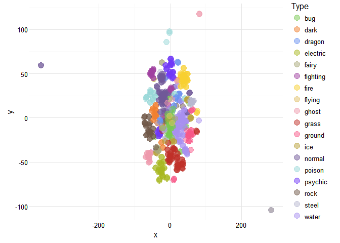

# pkmn visualize 'em all!
Joshua Kunst  


Time ago, when I was a younger man I know pokemon I konw the 150 pokemon then I 
And more than 10 year there are over 700 with new types new, new regions, etc. So
to know the status of all these monster I download the data and make some
chart to see 


## Data

There is a pokemon api http://pokeapi.co/. But we want all the pokemon data once so
we can go to the repository I found the raw data https://github.com/phalt/pokeapi/tree/master/data/v2/csv .
We'll need other type of data like type's colors, icon images. This data we founded here 
http://bulbapedia.bulbagarden.net/wiki/List_of_Pok%C3%A9mon_by_base_stats_(Generation_VI-present) and
http://pokemon-uranium.wikia.com/wiki/Template:fire_color.

Now to the script


```r
path <- function(x) paste0("https://raw.githubusercontent.com/phalt/pokeapi/master/data/v2/csv/", x)

dfpkmn <- read_csv(path("pokemon.csv")) %>% 
  select(-order, -is_default) %>% 
  rename(pokemon = identifier)

dfstat <- read_csv(path("stats.csv")) %>% 
  rename(stat_id = id) %>% 
  right_join(read_csv(path("pokemon_stats.csv")),
             by = "stat_id") %>% 
  mutate(identifier = str_replace(identifier, "-", "_")) %>% 
  select(pokemon_id, identifier, base_stat) %>% 
  spread(identifier, base_stat) %>% 
  rename(id = pokemon_id)

dftype <- read_csv(path("types.csv")) %>% 
  rename(type_id = id) %>% 
  right_join(read_csv(path("pokemon_types.csv")), by = "type_id") %>% 
  select(pokemon_id, identifier, slot) %>% 
  mutate(slot = paste0("type_", slot)) %>% 
  spread(slot, identifier) %>% 
  rename(id = pokemon_id)

dfegg <- read_csv(path("egg_groups.csv")) %>% 
  rename(egg_group_id = id) %>% 
  right_join(read_csv(path("pokemon_egg_groups.csv")), by = "egg_group_id") %>% 
  group_by(species_id) %>% 
  mutate(ranking = row_number(),
         ranking = paste0("egg_group_", ranking)) %>% 
  select(species_id, ranking, identifier) %>% 
  spread(ranking, identifier) 

dfimg <- "https://github.com/phalt/pokeapi/tree/master/data/Pokemon_XY_Sprites" %>% 
  read_html() %>% 
  html_nodes("tr.js-navigation-item > .content > .css-truncate a") %>% 
  map_df(function(x){
    url <- x %>% html_attr("href")
    data_frame(
      id = str_extract(basename(url), "\\d+"),
      url_image = basename(url)
    )
  }) %>%
  mutate(id = as.numeric(id))

url_bulbapedia_list <- "http://bulbapedia.bulbagarden.net/wiki/List_of_Pok%C3%A9mon_by_base_stats_(Generation_VI-present)" 

id <- url_bulbapedia_list %>% 
  read_html(encoding = "UTF-8") %>% 
  html_node("table.sortable") %>% 
  html_table() %>% 
  .[[1]] %>% 
  as.numeric()

url_icon <-  url_bulbapedia_list %>% 
  read_html() %>%
  html_nodes("table.sortable img") %>% 
  html_attr("src")

dficon <- data_frame(id, url_icon) %>% 
  filter(!is.na(id)) %>% 
  distinct(id)

dfcolor <- map_df(na.omit(unique(c(dftype$type_1, dftype$type_2))), function(t){
  # t <- "bug"
  col <- "http://pokemon-uranium.wikia.com/wiki/Template:%s_color" %>% 
    sprintf(t) %>%
    read_html() %>% 
    html_nodes("span > b") %>% 
    html_text()
  data_frame(type = t, color = paste0("#", col))
})

dfcolorf <- expand.grid(color_1 = dfcolor$color, color_2 = dfcolor$color,
                        stringsAsFactors = FALSE) %>% 
  tbl_df() %>% 
  group_by(color_1, color_2) %>% 
  do({
      n = 100;p = 0.25
      data_frame(color_f = colorRampPalette(c(.$color_1, .$color_2))(n)[round(n*p)])
    })

# THE join
df <- dfpkmn %>% 
  left_join(dftype, by = "id") %>% 
  left_join(dfstat, by = "id") %>% 
  left_join(dfcolor %>% rename(type_1 = type, color_1 = color), by = "type_1") %>% 
  left_join(dfcolor %>% rename(type_2 = type, color_2 = color), by = "type_2") %>% 
  left_join(dfcolorf, by =  c("color_1", "color_2")) %>% 
  left_join(dfegg, by = "species_id") %>% 
  left_join(dfimg, by = "id") %>% 
  left_join(dficon, by = "id")
```


Finally we remove the pokemon with no images (like the mega ones).


```r
df <- df %>% 
  mutate(color_f = ifelse(is.na(color_f), color_1, color_f)) %>% 
  filter(!is.na(url_image)) 

str(df)
```

```
## Classes 'tbl_df', 'tbl' and 'data.frame':	718 obs. of  21 variables:
##  $ id             : num  1 2 3 4 5 6 7 8 9 10 ...
##  $ pokemon        : chr  "bulbasaur" "ivysaur" "venusaur" "charmander" ...
##  $ species_id     : int  1 2 3 4 5 6 7 8 9 10 ...
##  $ height         : int  7 10 20 6 11 17 5 10 16 3 ...
##  $ weight         : int  69 130 1000 85 190 905 90 225 855 29 ...
##  $ base_experience: int  64 142 236 62 142 240 63 142 239 39 ...
##  $ type_1         : chr  "grass" "grass" "grass" "fire" ...
##  $ type_2         : chr  "poison" "poison" "poison" NA ...
##  $ attack         : int  49 62 82 52 64 84 48 63 83 30 ...
##  $ defense        : int  49 63 83 43 58 78 65 80 100 35 ...
##  $ hp             : int  45 60 80 39 58 78 44 59 79 45 ...
##  $ special_attack : int  65 80 100 60 80 109 50 65 85 20 ...
##  $ special_defense: int  65 80 100 50 65 85 64 80 105 20 ...
##  $ speed          : int  45 60 80 65 80 100 43 58 78 45 ...
##  $ color_1        : chr  "#78C850" "#78C850" "#78C850" "#F08030" ...
##  $ color_2        : chr  "#A040A0" "#A040A0" "#A040A0" NA ...
##  $ color_f        : chr  "#81A763" "#81A763" "#81A763" "#F08030" ...
##  $ egg_group_1    : chr  "monster" "monster" "monster" "monster" ...
##  $ egg_group_2    : chr  "plant" "plant" "plant" "dragon" ...
##  $ url_image      : chr  "1.png" "2.png" "3.png" "4.png" ...
##  $ url_icon       : chr  "http://cdn.bulbagarden.net/upload/e/ec/001MS.png" "http://cdn.bulbagarden.net/upload/6/6b/002MS.png" "http://cdn.bulbagarden.net/upload/d/df/003MS.png" "http://cdn.bulbagarden.net/upload/b/bb/004MS.png" ...
```

```r
head(df)
```

```
## Source: local data frame [6 x 21]
## 
##      id    pokemon species_id height weight base_experience type_1 type_2
##   (dbl)      (chr)      (int)  (int)  (int)           (int)  (chr)  (chr)
## 1     1  bulbasaur          1      7     69              64  grass poison
## 2     2    ivysaur          2     10    130             142  grass poison
## 3     3   venusaur          3     20   1000             236  grass poison
## 4     4 charmander          4      6     85              62   fire     NA
## 5     5 charmeleon          5     11    190             142   fire     NA
## 6     6  charizard          6     17    905             240   fire flying
## Variables not shown: attack (int), defense (int), hp (int), special_attack
##   (int), special_defense (int), speed (int), color_1 (chr), color_2 (chr),
##   color_f (chr), egg_group_1 (chr), egg_group_2 (chr), url_image (chr),
##   url_icon (chr)
```

## *bar chart* I choose you 


```r
dstype <- df %>% 
  count(type_1, color_1) %>% 
  ungroup() %>% 
  arrange(desc(n)) %>% 
  mutate(x = row_number()) %>% 
  rename(
    name = type_1,
    color = color_1,
    y = n
  ) %>% 
  select(y, name, color) %>% 
  list.parse3()
  
hcb <- highchart() %>% 
  hc_xAxis(categories = unlist(pluck(dstype, i = 2))) %>% 
  hc_yAxis(title = NULL) %>% 
  hc_add_series(data = dstype, type = "bar", showInLegend = FALSE,
                name = "Number of species")

hcb
```

<!--html_preserve--><div id="htmlwidget-9693" style="width:100%;height:500px;" class="highchart"></div>
<script type="application/json" data-for="htmlwidget-9693">{"x":{"hc_opts":{"title":{"text":null},"credits":{"enabled":false},"exporting":{"enabled":false},"plotOptions":{"series":{"turboThreshold":0}},"xAxis":{"categories":["water","normal","grass","bug","fire","psychic","rock","electric","ground","dark","poison","fighting","dragon","ghost","ice","steel","fairy","flying"]},"yAxis":{"title":null},"series":[{"data":[{"y":105,"name":"water","color":"#6890F0"},{"y":93,"name":"normal","color":"#A8A878"},{"y":66,"name":"grass","color":"#78C850"},{"y":63,"name":"bug","color":"#A8B820"},{"y":46,"name":"fire","color":"#F08030"},{"y":46,"name":"psychic","color":"#F85888"},{"y":40,"name":"rock","color":"#B8A038"},{"y":36,"name":"electric","color":"#F8D030"},{"y":30,"name":"ground","color":"#E0C068"},{"y":28,"name":"dark","color":"#705848"},{"y":28,"name":"poison","color":"#A040A0"},{"y":25,"name":"fighting","color":"#C03028"},{"y":24,"name":"dragon","color":"#7038F8"},{"y":23,"name":"ghost","color":"#705898"},{"y":23,"name":"ice","color":"#98D8D8"},{"y":22,"name":"steel","color":"#B8B8D0"},{"y":17,"name":"fairy","color":"#EE99AC"},{"y":3,"name":"flying","color":"#A890F0"}],"type":"bar","showInLegend":false,"name":"Number of species"}]},"theme":null,"conf_opts":{"global":{"Date":null,"VMLRadialGradientURL":"http =//code.highcharts.com/list(version)/gfx/vml-radial-gradient.png","canvasToolsURL":"http =//code.highcharts.com/list(version)/modules/canvas-tools.js","getTimezoneOffset":null,"timezoneOffset":0,"useUTC":true},"lang":{"contextButtonTitle":"Chart context menu","decimalPoint":".","downloadJPEG":"Download JPEG image","downloadPDF":"Download PDF document","downloadPNG":"Download PNG image","downloadSVG":"Download SVG vector image","drillUpText":"Back to {series.name}","invalidDate":null,"loading":"Loading...","months":["January","February","March","April","May","June","July","August","September","October","November","December"],"noData":"No data to display","numericSymbols":["k","M","G","T","P","E"],"printChart":"Print chart","resetZoom":"Reset zoom","resetZoomTitle":"Reset zoom level 1:1","shortMonths":["Jan","Feb","Mar","Apr","May","Jun","Jul","Aug","Sep","Oct","Nov","Dec"],"thousandsSep":" ","weekdays":["Sunday","Monday","Tuesday","Wednesday","Thursday","Friday","Saturday"]}},"type":"chart","fonts":[],"debug":false},"evals":[]}</script><!--/html_preserve-->


 ## Oh! The *bar chat* has evolved into a *treemap*
 


```r
dftm <- df %>% 
  mutate(type_2 = ifelse(is.na(type_2), paste("only", type_1), type_2),
         type_1 = type_1) %>% 
  group_by(type_1, type_2) %>%
  summarise(n = n()) %>% 
  ungroup()

set.seed(3514)

tm <- treemap::treemap(dftm, index = c("type_1", "type_2"), vSize = "n", vColor = "type_1")

tm$tm <- tm$tm %>%
  tbl_df() %>% 
  left_join(df %>% select(type_1, type_2, color_f) %>% distinct(), by = c("type_1", "type_2")) %>%
  left_join(df %>% select(type_1, color_1) %>% distinct(), by = c("type_1")) %>% 
  mutate(type_1 = paste0("Main ", type_1),
         color = ifelse(is.na(color_f), color_1, color_f))

hctm <- highchart() %>% 
  hc_add_series_treemap(tm, allowDrillToNode = TRUE,
                        layoutAlgorithm = "squarified")

hctm
```

<!--html_preserve--><div id="htmlwidget-3262" style="width:100%;height:500px;" class="highchart"></div>
<script type="application/json" data-for="htmlwidget-3262">{"x":{"hc_opts":{"title":{"text":null},"credits":{"enabled":false},"exporting":{"enabled":false},"plotOptions":{"series":{"turboThreshold":0}},"series":[{"data":[{"name":"Main bug","type_2":null,"value":63,"valuecolor":63,"level":1,"color":"#A8B820","color_f":"#A8B820","color_1":"#A8B820","id":"main_bug","type_1":null},{"name":"Main dark","type_2":null,"value":28,"valuecolor":28,"level":1,"color":"#705848","color_f":"#705848","color_1":"#705848","id":"main_dark","type_1":null},{"name":"Main dragon","type_2":null,"value":24,"valuecolor":24,"level":1,"color":"#7038F8","color_f":"#7038F8","color_1":"#7038F8","id":"main_dragon","type_1":null},{"name":"Main electric","type_2":null,"value":36,"valuecolor":36,"level":1,"color":"#F8D030","color_f":"#F8D030","color_1":"#F8D030","id":"main_electric","type_1":null},{"name":"Main fairy","type_2":null,"value":17,"valuecolor":17,"level":1,"color":"#EE99AC","color_f":"#EE99AC","color_1":"#EE99AC","id":"main_fairy","type_1":null},{"name":"Main fighting","type_2":null,"value":25,"valuecolor":25,"level":1,"color":"#C03028","color_f":"#C03028","color_1":"#C03028","id":"main_fighting","type_1":null},{"name":"Main fire","type_2":null,"value":46,"valuecolor":46,"level":1,"color":"#F08030","color_f":"#F08030","color_1":"#F08030","id":"main_fire","type_1":null},{"name":"Main flying","type_2":null,"value":3,"valuecolor":3,"level":1,"color":"#A890F0","color_f":"#A890F0","color_1":"#A890F0","id":"main_flying","type_1":null},{"name":"Main ghost","type_2":null,"value":23,"valuecolor":23,"level":1,"color":"#705898","color_f":"#705898","color_1":"#705898","id":"main_ghost","type_1":null},{"name":"Main grass","type_2":null,"value":66,"valuecolor":66,"level":1,"color":"#78C850","color_f":"#78C850","color_1":"#78C850","id":"main_grass","type_1":null},{"name":"Main ground","type_2":null,"value":30,"valuecolor":30,"level":1,"color":"#E0C068","color_f":"#E0C068","color_1":"#E0C068","id":"main_ground","type_1":null},{"name":"Main ice","type_2":null,"value":23,"valuecolor":23,"level":1,"color":"#98D8D8","color_f":"#98D8D8","color_1":"#98D8D8","id":"main_ice","type_1":null},{"name":"Main normal","type_2":null,"value":93,"valuecolor":93,"level":1,"color":"#A8A878","color_f":"#A8A878","color_1":"#A8A878","id":"main_normal","type_1":null},{"name":"Main poison","type_2":null,"value":28,"valuecolor":28,"level":1,"color":"#A040A0","color_f":"#A040A0","color_1":"#A040A0","id":"main_poison","type_1":null},{"name":"Main psychic","type_2":null,"value":46,"valuecolor":46,"level":1,"color":"#F85888","color_f":"#F85888","color_1":"#F85888","id":"main_psychic","type_1":null},{"name":"Main rock","type_2":null,"value":40,"valuecolor":40,"level":1,"color":"#B8A038","color_f":"#B8A038","color_1":"#B8A038","id":"main_rock","type_1":null},{"name":"Main steel","type_2":null,"value":22,"valuecolor":22,"level":1,"color":"#B8B8D0","color_f":"#B8B8D0","color_1":"#B8B8D0","id":"main_steel","type_1":null},{"name":"Main water","type_2":null,"value":105,"valuecolor":105,"level":1,"color":"#6890F0","color_f":"#6890F0","color_1":"#6890F0","id":"main_water","type_1":null},{"name":"electric","type_2":null,"value":2,"valuecolor":2,"level":2,"color":"#BBBD23","color_f":"#BBBD23","color_1":"#A8B820","id":"electric","parent":"main_bug","type_1":"Main bug"},{"name":"fighting","type_2":null,"value":1,"valuecolor":1,"level":2,"color":"#AD9721","color_f":"#AD9721","color_1":"#A8B820","id":"fighting","parent":"main_bug","type_1":"Main bug"},{"name":"fire","type_2":null,"value":2,"valuecolor":2,"level":2,"color":"#B9AA23","color_f":"#B9AA23","color_1":"#A8B820","id":"fire","parent":"main_bug","type_1":"Main bug"},{"name":"flying","type_2":null,"value":13,"valuecolor":13,"level":2,"color":"#A8AE52","color_f":"#A8AE52","color_1":"#A8B820","id":"flying","parent":"main_bug","type_1":"Main bug"},{"name":"ghost","type_2":null,"value":1,"valuecolor":1,"level":2,"color":"#9AA03D","color_f":"#9AA03D","color_1":"#A8B820","id":"ghost","parent":"main_bug","type_1":"Main bug"},{"name":"grass","type_2":null,"value":6,"valuecolor":6,"level":2,"color":"#9CBB2B","color_f":"#9CBB2B","color_1":"#A8B820","id":"grass","parent":"main_bug","type_1":"Main bug"},{"name":"ground","type_2":null,"value":1,"valuecolor":1,"level":2,"color":"#B5B931","color_f":"#B5B931","color_1":"#A8B820","id":"ground","parent":"main_bug","type_1":"Main bug"},{"name":"only bug","type_2":null,"value":17,"valuecolor":17,"level":2,"color":"#A8B820","color_f":null,"color_1":"#A8B820","id":"only_bug","parent":"main_bug","type_1":"Main bug"},{"name":"poison","type_2":null,"value":11,"valuecolor":11,"level":2,"color":"#A69A3F","color_f":"#A69A3F","color_1":"#A8B820","id":"poison","parent":"main_bug","type_1":"Main bug"},{"name":"rock","type_2":null,"value":3,"valuecolor":3,"level":2,"color":"#ABB225","color_f":"#ABB225","color_1":"#A8B820","id":"rock","parent":"main_bug","type_1":"Main bug"},{"name":"steel","type_2":null,"value":5,"valuecolor":5,"level":2,"color":"#ABB84A","color_f":"#ABB84A","color_1":"#A8B820","id":"steel","parent":"main_bug","type_1":"Main bug"},{"name":"water","type_2":null,"value":1,"valuecolor":1,"level":2,"color":"#98AE52","color_f":"#98AE52","color_1":"#A8B820","id":"water","parent":"main_bug","type_1":"Main bug"},{"name":"dragon","type_2":null,"value":3,"valuecolor":3,"level":2,"color":"#705072","color_f":"#705072","color_1":"#705848","id":"dragon","parent":"main_dark","type_1":"Main dark"},{"name":"fighting","type_2":null,"value":2,"valuecolor":2,"level":2,"color":"#834E40","color_f":"#834E40","color_1":"#705848","id":"fighting","parent":"main_dark","type_1":"Main dark"},{"name":"fire","type_2":null,"value":2,"valuecolor":2,"level":2,"color":"#8F6142","color_f":"#8F6142","color_1":"#705848","id":"fire","parent":"main_dark","type_1":"Main dark"},{"name":"flying","type_2":null,"value":5,"valuecolor":5,"level":2,"color":"#7D6570","color_f":"#7D6570","color_1":"#705848","id":"flying","parent":"main_dark","type_1":"Main dark"},{"name":"ghost","type_2":null,"value":1,"valuecolor":1,"level":2,"color":"#70585B","color_f":"#70585B","color_1":"#705848","id":"ghost","parent":"main_dark","type_1":"Main dark"},{"name":"ice","type_2":null,"value":2,"valuecolor":2,"level":2,"color":"#79776A","color_f":"#79776A","color_1":"#705848","id":"ice","parent":"main_dark","type_1":"Main dark"},{"name":"only dark","type_2":null,"value":9,"valuecolor":9,"level":2,"color":"#705848","color_f":null,"color_1":"#705848","id":"only_dark","parent":"main_dark","type_1":"Main dark"},{"name":"psychic","type_2":null,"value":2,"valuecolor":2,"level":2,"color":"#905857","color_f":"#905857","color_1":"#705848","id":"psychic","parent":"main_dark","type_1":"Main dark"},{"name":"steel","type_2":null,"value":2,"valuecolor":2,"level":2,"color":"#816F68","color_f":"#816F68","color_1":"#705848","id":"steel","parent":"main_dark","type_1":"Main dark"},{"name":"electric","type_2":null,"value":1,"valuecolor":1,"level":2,"color":"#905CC7","color_f":"#905CC7","color_1":"#7038F8","id":"electric","parent":"main_dragon","type_1":"Main dragon"},{"name":"fire","type_2":null,"value":1,"valuecolor":1,"level":2,"color":"#8F49C7","color_f":"#8F49C7","color_1":"#7038F8","id":"fire","parent":"main_dragon","type_1":"Main dragon"},{"name":"flying","type_2":null,"value":4,"valuecolor":4,"level":2,"color":"#7D4DF6","color_f":"#7D4DF6","color_1":"#7038F8","id":"flying","parent":"main_dragon","type_1":"Main dragon"},{"name":"ground","type_2":null,"value":4,"valuecolor":4,"level":2,"color":"#8B58D5","color_f":"#8B58D5","color_1":"#7038F8","id":"ground","parent":"main_dragon","type_1":"Main dragon"},{"name":"ice","type_2":null,"value":1,"valuecolor":1,"level":2,"color":"#795EF0","color_f":"#795EF0","color_1":"#7038F8","id":"ice","parent":"main_dragon","type_1":"Main dragon"},{"name":"only dragon","type_2":null,"value":11,"valuecolor":11,"level":2,"color":"#7038F8","color_f":null,"color_1":"#7038F8","id":"only_dragon","parent":"main_dragon","type_1":"Main dragon"},{"name":"psychic","type_2":null,"value":2,"valuecolor":2,"level":2,"color":"#903FDC","color_f":"#903FDC","color_1":"#7038F8","id":"psychic","parent":"main_dragon","type_1":"Main dragon"},{"name":"fairy","type_2":null,"value":1,"valuecolor":1,"level":2,"color":"#F5C24E","color_f":"#F5C24E","color_1":"#F8D030","id":"fairy","parent":"main_electric","type_1":"Main electric"},{"name":"flying","type_2":null,"value":3,"valuecolor":3,"level":2,"color":"#E4C05E","color_f":"#E4C05E","color_1":"#F8D030","id":"flying","parent":"main_electric","type_1":"Main electric"},{"name":"ghost","type_2":null,"value":1,"valuecolor":1,"level":2,"color":"#D7B249","color_f":"#D7B249","color_1":"#F8D030","id":"ghost","parent":"main_electric","type_1":"Main electric"},{"name":"normal","type_2":null,"value":2,"valuecolor":2,"level":2,"color":"#E4C641","color_f":"#E4C641","color_1":"#F8D030","id":"normal","parent":"main_electric","type_1":"Main electric"},{"name":"only electric","type_2":null,"value":26,"valuecolor":26,"level":2,"color":"#F8D030","color_f":null,"color_1":"#F8D030","id":"only_electric","parent":"main_electric","type_1":"Main electric"},{"name":"steel","type_2":null,"value":3,"valuecolor":3,"level":2,"color":"#E8CA56","color_f":"#E8CA56","color_1":"#F8D030","id":"steel","parent":"main_electric","type_1":"Main electric"},{"name":"flying","type_2":null,"value":2,"valuecolor":2,"level":2,"color":"#DD96BC","color_f":"#DD96BC","color_1":"#EE99AC","id":"flying","parent":"main_fairy","type_1":"Main fairy"},{"name":"only fairy","type_2":null,"value":15,"valuecolor":15,"level":2,"color":"#EE99AC","color_f":null,"color_1":"#EE99AC","id":"only_fairy","parent":"main_fairy","type_1":"Main fairy"},{"name":"dark","type_2":null,"value":1,"valuecolor":1,"level":2,"color":"#AC392F","color_f":"#AC392F","color_1":"#C03028","id":"dark","parent":"main_fighting","type_1":"Main fighting"},{"name":"flying","type_2":null,"value":1,"valuecolor":1,"level":2,"color":"#BA4758","color_f":"#BA4758","color_1":"#C03028","id":"flying","parent":"main_fighting","type_1":"Main fighting"},{"name":"only fighting","type_2":null,"value":20,"valuecolor":20,"level":2,"color":"#C03028","color_f":null,"color_1":"#C03028","id":"only_fighting","parent":"main_fighting","type_1":"Main fighting"},{"name":"psychic","type_2":null,"value":2,"valuecolor":2,"level":2,"color":"#CD393F","color_f":"#CD393F","color_1":"#C03028","id":"psychic","parent":"main_fighting","type_1":"Main fighting"},{"name":"steel","type_2":null,"value":1,"valuecolor":1,"level":2,"color":"#BE5050","color_f":"#BE5050","color_1":"#C03028","id":"steel","parent":"main_fighting","type_1":"Main fighting"},{"name":"fighting","type_2":null,"value":6,"valuecolor":6,"level":2,"color":"#E46C2E","color_f":"#E46C2E","color_1":"#F08030","id":"fighting","parent":"main_fire","type_1":"Main fire"},{"name":"flying","type_2":null,"value":5,"valuecolor":5,"level":2,"color":"#DE835E","color_f":"#DE835E","color_1":"#F08030","id":"flying","parent":"main_fire","type_1":"Main fire"},{"name":"ground","type_2":null,"value":2,"valuecolor":2,"level":2,"color":"#EC8F3D","color_f":"#EC8F3D","color_1":"#F08030","id":"ground","parent":"main_fire","type_1":"Main fire"},{"name":"normal","type_2":null,"value":2,"valuecolor":2,"level":2,"color":"#DE8941","color_f":"#DE8941","color_1":"#F08030","id":"normal","parent":"main_fire","type_1":"Main fire"},{"name":"only fire","type_2":null,"value":28,"valuecolor":28,"level":2,"color":"#F08030","color_f":null,"color_1":"#F08030","id":"only_fire","parent":"main_fire","type_1":"Main fire"},{"name":"psychic","type_2":null,"value":1,"valuecolor":1,"level":2,"color":"#F17645","color_f":"#F17645","color_1":"#F08030","id":"psychic","parent":"main_fire","type_1":"Main fire"},{"name":"rock","type_2":null,"value":1,"valuecolor":1,"level":2,"color":"#E28731","color_f":"#E28731","color_1":"#F08030","id":"rock","parent":"main_fire","type_1":"Main fire"},{"name":"steel","type_2":null,"value":1,"valuecolor":1,"level":2,"color":"#E28D56","color_f":"#E28D56","color_1":"#F08030","id":"steel","parent":"main_fire","type_1":"Main fire"},{"name":"dragon","type_2":null,"value":2,"valuecolor":2,"level":2,"color":"#9A7AF1","color_f":"#9A7AF1","color_1":"#A890F0","id":"dragon","parent":"main_flying","type_1":"Main flying"},{"name":"only flying","type_2":null,"value":1,"valuecolor":1,"level":2,"color":"#A890F0","color_f":null,"color_1":"#A890F0","id":"only_flying","parent":"main_flying","type_1":"Main flying"},{"name":"dark","type_2":null,"value":1,"valuecolor":1,"level":2,"color":"#705884","color_f":"#705884","color_1":"#705898","id":"dark","parent":"main_ghost","type_1":"Main ghost"},{"name":"dragon","type_2":null,"value":1,"valuecolor":1,"level":2,"color":"#7050AF","color_f":"#7050AF","color_1":"#705898","id":"dragon","parent":"main_ghost","type_1":"Main ghost"},{"name":"fire","type_2":null,"value":3,"valuecolor":3,"level":2,"color":"#8F617E","color_f":"#8F617E","color_1":"#705898","id":"fire","parent":"main_ghost","type_1":"Main ghost"},{"name":"flying","type_2":null,"value":2,"valuecolor":2,"level":2,"color":"#7D65AD","color_f":"#7D65AD","color_1":"#705898","id":"flying","parent":"main_ghost","type_1":"Main ghost"},{"name":"grass","type_2":null,"value":4,"valuecolor":4,"level":2,"color":"#717386","color_f":"#717386","color_1":"#705898","id":"grass","parent":"main_ghost","type_1":"Main ghost"},{"name":"only ghost","type_2":null,"value":9,"valuecolor":9,"level":2,"color":"#705898","color_f":null,"color_1":"#705898","id":"only_ghost","parent":"main_ghost","type_1":"Main ghost"},{"name":"poison","type_2":null,"value":3,"valuecolor":3,"level":2,"color":"#7B5299","color_f":"#7B5299","color_1":"#705898","id":"poison","parent":"main_ghost","type_1":"Main ghost"},{"name":"dark","type_2":null,"value":3,"valuecolor":3,"level":2,"color":"#76AC4E","color_f":"#76AC4E","color_1":"#78C850","id":"dark","parent":"main_grass","type_1":"Main grass"},{"name":"fairy","type_2":null,"value":2,"valuecolor":2,"level":2,"color":"#94BC66","color_f":"#94BC66","color_1":"#78C850","id":"fairy","parent":"main_grass","type_1":"Main grass"},{"name":"fighting","type_2":null,"value":3,"valuecolor":3,"level":2,"color":"#89A346","color_f":"#89A346","color_1":"#78C850","id":"fighting","parent":"main_grass","type_1":"Main grass"},{"name":"flying","type_2":null,"value":4,"valuecolor":4,"level":2,"color":"#83BA76","color_f":"#83BA76","color_1":"#78C850","id":"flying","parent":"main_grass","type_1":"Main grass"},{"name":"ground","type_2":null,"value":1,"valuecolor":1,"level":2,"color":"#91C655","color_f":"#91C655","color_1":"#78C850","id":"ground","parent":"main_grass","type_1":"Main grass"},{"name":"ice","type_2":null,"value":2,"valuecolor":2,"level":2,"color":"#7FCB70","color_f":"#7FCB70","color_1":"#78C850","id":"ice","parent":"main_grass","type_1":"Main grass"},{"name":"only grass","type_2":null,"value":33,"valuecolor":33,"level":2,"color":"#78C850","color_f":null,"color_1":"#78C850","id":"only_grass","parent":"main_grass","type_1":"Main grass"},{"name":"poison","type_2":null,"value":14,"valuecolor":14,"level":2,"color":"#81A763","color_f":"#81A763","color_1":"#78C850","id":"poison","parent":"main_grass","type_1":"Main grass"},{"name":"psychic","type_2":null,"value":2,"valuecolor":2,"level":2,"color":"#97AC5D","color_f":"#97AC5D","color_1":"#78C850","id":"psychic","parent":"main_grass","type_1":"Main grass"},{"name":"steel","type_2":null,"value":2,"valuecolor":2,"level":2,"color":"#87C46F","color_f":"#87C46F","color_1":"#78C850","id":"steel","parent":"main_grass","type_1":"Main grass"},{"name":"dark","type_2":null,"value":3,"valuecolor":3,"level":2,"color":"#C4A660","color_f":"#C4A660","color_1":"#E0C068","id":"dark","parent":"main_ground","type_1":"Main ground"},{"name":"dragon","type_2":null,"value":2,"valuecolor":2,"level":2,"color":"#C49F8A","color_f":"#C49F8A","color_1":"#E0C068","id":"dragon","parent":"main_ground","type_1":"Main ground"},{"name":"electric","type_2":null,"value":1,"valuecolor":1,"level":2,"color":"#E5C35A","color_f":"#E5C35A","color_1":"#E0C068","id":"electric","parent":"main_ground","type_1":"Main ground"},{"name":"flying","type_2":null,"value":3,"valuecolor":3,"level":2,"color":"#D2B488","color_f":"#D2B488","color_1":"#E0C068","id":"flying","parent":"main_ground","type_1":"Main ground"},{"name":"ghost","type_2":null,"value":2,"valuecolor":2,"level":2,"color":"#C4A673","color_f":"#C4A673","color_1":"#E0C068","id":"ghost","parent":"main_ground","type_1":"Main ground"},{"name":"only ground","type_2":null,"value":13,"valuecolor":13,"level":2,"color":"#E0C068","color_f":null,"color_1":"#E0C068","id":"only_ground","parent":"main_ground","type_1":"Main ground"},{"name":"psychic","type_2":null,"value":2,"valuecolor":2,"level":2,"color":"#E5A66F","color_f":"#E5A66F","color_1":"#E0C068","id":"psychic","parent":"main_ground","type_1":"Main ground"},{"name":"rock","type_2":null,"value":3,"valuecolor":3,"level":2,"color":"#D6B85C","color_f":"#D6B85C","color_1":"#E0C068","id":"rock","parent":"main_ground","type_1":"Main ground"},{"name":"steel","type_2":null,"value":1,"valuecolor":1,"level":2,"color":"#D6BE81","color_f":"#D6BE81","color_1":"#E0C068","id":"steel","parent":"main_ground","type_1":"Main ground"},{"name":"flying","type_2":null,"value":2,"valuecolor":2,"level":2,"color":"#9BC6DD","color_f":"#9BC6DD","color_1":"#98D8D8","id":"flying","parent":"main_ice","type_1":"Main ice"},{"name":"ghost","type_2":null,"value":1,"valuecolor":1,"level":2,"color":"#8EB8C8","color_f":"#8EB8C8","color_1":"#98D8D8","id":"ghost","parent":"main_ice","type_1":"Main ice"},{"name":"ground","type_2":null,"value":3,"valuecolor":3,"level":2,"color":"#A9D2BC","color_f":"#A9D2BC","color_1":"#98D8D8","id":"ground","parent":"main_ice","type_1":"Main ice"},{"name":"only ice","type_2":null,"value":12,"valuecolor":12,"level":2,"color":"#98D8D8","color_f":null,"color_1":"#98D8D8","id":"only_ice","parent":"main_ice","type_1":"Main ice"},{"name":"psychic","type_2":null,"value":2,"valuecolor":2,"level":2,"color":"#AFB8C4","color_f":"#AFB8C4","color_1":"#98D8D8","id":"psychic","parent":"main_ice","type_1":"Main ice"},{"name":"water","type_2":null,"value":3,"valuecolor":3,"level":2,"color":"#8CC6DD","color_f":"#8CC6DD","color_1":"#98D8D8","id":"water","parent":"main_ice","type_1":"Main ice"},{"name":"fairy","type_2":null,"value":4,"valuecolor":4,"level":2,"color":"#B8A484","color_f":"#B8A484","color_1":"#A8A878","id":"fairy","parent":"main_normal","type_1":"Main normal"},{"name":"flying","type_2":null,"value":23,"valuecolor":23,"level":2,"color":"#A8A295","color_f":"#A8A295","color_1":"#A8A878","id":"flying","parent":"main_normal","type_1":"Main normal"},{"name":"grass","type_2":null,"value":2,"valuecolor":2,"level":2,"color":"#9CAF6E","color_f":"#9CAF6E","color_1":"#A8A878","id":"grass","parent":"main_normal","type_1":"Main normal"},{"name":"ground","type_2":null,"value":1,"valuecolor":1,"level":2,"color":"#B5AD74","color_f":"#B5AD74","color_1":"#A8A878","id":"ground","parent":"main_normal","type_1":"Main normal"},{"name":"only normal","type_2":null,"value":60,"valuecolor":60,"level":2,"color":"#A8A878","color_f":null,"color_1":"#A8A878","id":"only_normal","parent":"main_normal","type_1":"Main normal"},{"name":"psychic","type_2":null,"value":2,"valuecolor":2,"level":2,"color":"#BB947B","color_f":"#BB947B","color_1":"#A8A878","id":"psychic","parent":"main_normal","type_1":"Main normal"},{"name":"water","type_2":null,"value":1,"valuecolor":1,"level":2,"color":"#98A295","color_f":"#98A295","color_1":"#A8A878","id":"water","parent":"main_normal","type_1":"Main normal"},{"name":"bug","type_2":null,"value":1,"valuecolor":1,"level":2,"color":"#A15D80","color_f":"#A15D80","color_1":"#A040A0","id":"bug","parent":"main_poison","type_1":"Main poison"},{"name":"dark","type_2":null,"value":3,"valuecolor":3,"level":2,"color":"#94458A","color_f":"#94458A","color_1":"#A040A0","id":"dark","parent":"main_poison","type_1":"Main poison"},{"name":"dragon","type_2":null,"value":1,"valuecolor":1,"level":2,"color":"#943EB5","color_f":"#943EB5","color_1":"#A040A0","id":"dragon","parent":"main_poison","type_1":"Main poison"},{"name":"fighting","type_2":null,"value":2,"valuecolor":2,"level":2,"color":"#A73C82","color_f":"#A73C82","color_1":"#A040A0","id":"fighting","parent":"main_poison","type_1":"Main poison"},{"name":"flying","type_2":null,"value":3,"valuecolor":3,"level":2,"color":"#A153B3","color_f":"#A153B3","color_1":"#A040A0","id":"flying","parent":"main_poison","type_1":"Main poison"},{"name":"ground","type_2":null,"value":2,"valuecolor":2,"level":2,"color":"#AF5F92","color_f":"#AF5F92","color_1":"#A040A0","id":"ground","parent":"main_poison","type_1":"Main poison"},{"name":"only poison","type_2":null,"value":15,"valuecolor":15,"level":2,"color":"#A040A0","color_f":null,"color_1":"#A040A0","id":"only_poison","parent":"main_poison","type_1":"Main poison"},{"name":"water","type_2":null,"value":1,"valuecolor":1,"level":2,"color":"#9253B3","color_f":"#9253B3","color_1":"#A040A0","id":"water","parent":"main_poison","type_1":"Main poison"},{"name":"fairy","type_2":null,"value":5,"valuecolor":5,"level":2,"color":"#F56790","color_f":"#F56790","color_1":"#F85888","id":"fairy","parent":"main_psychic","type_1":"Main psychic"},{"name":"fighting","type_2":null,"value":1,"valuecolor":1,"level":2,"color":"#EA4E70","color_f":"#EA4E70","color_1":"#F85888","id":"fighting","parent":"main_psychic","type_1":"Main psychic"},{"name":"fire","type_2":null,"value":1,"valuecolor":1,"level":2,"color":"#F66172","color_f":"#F66172","color_1":"#F85888","id":"fire","parent":"main_psychic","type_1":"Main psychic"},{"name":"flying","type_2":null,"value":6,"valuecolor":6,"level":2,"color":"#E465A1","color_f":"#E465A1","color_1":"#F85888","id":"flying","parent":"main_psychic","type_1":"Main psychic"},{"name":"grass","type_2":null,"value":1,"valuecolor":1,"level":2,"color":"#D8737A","color_f":"#D8737A","color_1":"#F85888","id":"grass","parent":"main_psychic","type_1":"Main psychic"},{"name":"only psychic","type_2":null,"value":32,"valuecolor":32,"level":2,"color":"#F85888","color_f":null,"color_1":"#F85888","id":"only_psychic","parent":"main_psychic","type_1":"Main psychic"},{"name":"bug","type_2":null,"value":2,"valuecolor":2,"level":2,"color":"#B4A532","color_f":"#B4A532","color_1":"#B8A038","id":"bug","parent":"main_rock","type_1":"Main rock"},{"name":"dark","type_2":null,"value":1,"valuecolor":1,"level":2,"color":"#A68E3B","color_f":"#A68E3B","color_1":"#B8A038","id":"dark","parent":"main_rock","type_1":"Main rock"},{"name":"dragon","type_2":null,"value":2,"valuecolor":2,"level":2,"color":"#A68666","color_f":"#A68666","color_1":"#B8A038","id":"dragon","parent":"main_rock","type_1":"Main rock"},{"name":"fairy","type_2":null,"value":1,"valuecolor":1,"level":2,"color":"#C59E54","color_f":"#C59E54","color_1":"#B8A038","id":"fairy","parent":"main_rock","type_1":"Main rock"},{"name":"fighting","type_2":null,"value":1,"valuecolor":1,"level":2,"color":"#B98434","color_f":"#B98434","color_1":"#B8A038","id":"fighting","parent":"main_rock","type_1":"Main rock"},{"name":"flying","type_2":null,"value":3,"valuecolor":3,"level":2,"color":"#B49C64","color_f":"#B49C64","color_1":"#B8A038","id":"flying","parent":"main_rock","type_1":"Main rock"},{"name":"grass","type_2":null,"value":2,"valuecolor":2,"level":2,"color":"#A8A93D","color_f":"#A8A93D","color_1":"#B8A038","id":"grass","parent":"main_rock","type_1":"Main rock"},{"name":"ground","type_2":null,"value":6,"valuecolor":6,"level":2,"color":"#C1A743","color_f":"#C1A743","color_1":"#B8A038","id":"ground","parent":"main_rock","type_1":"Main rock"},{"name":"ice","type_2":null,"value":2,"valuecolor":2,"level":2,"color":"#B0AD5E","color_f":"#B0AD5E","color_1":"#B8A038","id":"ice","parent":"main_rock","type_1":"Main rock"},{"name":"only rock","type_2":null,"value":9,"valuecolor":9,"level":2,"color":"#B8A038","color_f":null,"color_1":"#B8A038","id":"only_rock","parent":"main_rock","type_1":"Main rock"},{"name":"psychic","type_2":null,"value":2,"valuecolor":2,"level":2,"color":"#C78E4B","color_f":"#C78E4B","color_1":"#B8A038","id":"psychic","parent":"main_rock","type_1":"Main rock"},{"name":"steel","type_2":null,"value":3,"valuecolor":3,"level":2,"color":"#B8A55C","color_f":"#B8A55C","color_1":"#B8A038","id":"steel","parent":"main_rock","type_1":"Main rock"},{"name":"water","type_2":null,"value":6,"valuecolor":6,"level":2,"color":"#A49C64","color_f":"#A49C64","color_1":"#B8A038","id":"water","parent":"main_rock","type_1":"Main rock"},{"name":"dragon","type_2":null,"value":1,"valuecolor":1,"level":2,"color":"#A698D9","color_f":"#A698D9","color_1":"#B8B8D0","id":"dragon","parent":"main_steel","type_1":"Main steel"},{"name":"fairy","type_2":null,"value":2,"valuecolor":2,"level":2,"color":"#C5B0C7","color_f":"#C5B0C7","color_1":"#B8B8D0","id":"fairy","parent":"main_steel","type_1":"Main steel"},{"name":"fighting","type_2":null,"value":1,"valuecolor":1,"level":2,"color":"#B997A7","color_f":"#B997A7","color_1":"#B8B8D0","id":"fighting","parent":"main_steel","type_1":"Main steel"},{"name":"flying","type_2":null,"value":1,"valuecolor":1,"level":2,"color":"#B4AED7","color_f":"#B4AED7","color_1":"#B8B8D0","id":"flying","parent":"main_steel","type_1":"Main steel"},{"name":"ghost","type_2":null,"value":3,"valuecolor":3,"level":2,"color":"#A6A0C2","color_f":"#A6A0C2","color_1":"#B8B8D0","id":"ghost","parent":"main_steel","type_1":"Main steel"},{"name":"ground","type_2":null,"value":1,"valuecolor":1,"level":2,"color":"#C1B9B6","color_f":"#C1B9B6","color_1":"#B8B8D0","id":"ground","parent":"main_steel","type_1":"Main steel"},{"name":"only steel","type_2":null,"value":4,"valuecolor":4,"level":2,"color":"#B8B8D0","color_f":null,"color_1":"#B8B8D0","id":"only_steel","parent":"main_steel","type_1":"Main steel"},{"name":"psychic","type_2":null,"value":6,"valuecolor":6,"level":2,"color":"#C7A0BE","color_f":"#C7A0BE","color_1":"#B8B8D0","id":"psychic","parent":"main_steel","type_1":"Main steel"},{"name":"rock","type_2":null,"value":3,"valuecolor":3,"level":2,"color":"#B8B2AB","color_f":"#B8B2AB","color_1":"#B8B8D0","id":"rock","parent":"main_steel","type_1":"Main steel"},{"name":"dark","type_2":null,"value":4,"valuecolor":4,"level":2,"color":"#6982C7","color_f":"#6982C7","color_1":"#6890F0","id":"dark","parent":"main_water","type_1":"Main water"},{"name":"dragon","type_2":null,"value":2,"valuecolor":2,"level":2,"color":"#697AF1","color_f":"#697AF1","color_1":"#6890F0","id":"dragon","parent":"main_water","type_1":"Main water"},{"name":"electric","type_2":null,"value":2,"valuecolor":2,"level":2,"color":"#8A9FC1","color_f":"#8A9FC1","color_1":"#6890F0","id":"electric","parent":"main_water","type_1":"Main water"},{"name":"fairy","type_2":null,"value":2,"valuecolor":2,"level":2,"color":"#8892DF","color_f":"#8892DF","color_1":"#6890F0","id":"fairy","parent":"main_water","type_1":"Main water"},{"name":"fighting","type_2":null,"value":2,"valuecolor":2,"level":2,"color":"#7D78BF","color_f":"#7D78BF","color_1":"#6890F0","id":"fighting","parent":"main_water","type_1":"Main water"},{"name":"flying","type_2":null,"value":7,"valuecolor":7,"level":2,"color":"#7790F0","color_f":"#7790F0","color_1":"#6890F0","id":"flying","parent":"main_water","type_1":"Main water"},{"name":"ghost","type_2":null,"value":2,"valuecolor":2,"level":2,"color":"#6982DA","color_f":"#6982DA","color_1":"#6890F0","id":"ghost","parent":"main_water","type_1":"Main water"},{"name":"grass","type_2":null,"value":3,"valuecolor":3,"level":2,"color":"#6B9DC9","color_f":"#6B9DC9","color_1":"#6890F0","id":"grass","parent":"main_water","type_1":"Main water"},{"name":"ground","type_2":null,"value":9,"valuecolor":9,"level":2,"color":"#859BCF","color_f":"#859BCF","color_1":"#6890F0","id":"ground","parent":"main_water","type_1":"Main water"},{"name":"ice","type_2":null,"value":3,"valuecolor":3,"level":2,"color":"#73A1EA","color_f":"#73A1EA","color_1":"#6890F0","id":"ice","parent":"main_water","type_1":"Main water"},{"name":"only water","type_2":null,"value":57,"valuecolor":57,"level":2,"color":"#6890F0","color_f":null,"color_1":"#6890F0","id":"only_water","parent":"main_water","type_1":"Main water"},{"name":"poison","type_2":null,"value":3,"valuecolor":3,"level":2,"color":"#757CDC","color_f":"#757CDC","color_1":"#6890F0","id":"poison","parent":"main_water","type_1":"Main water"},{"name":"psychic","type_2":null,"value":4,"valuecolor":4,"level":2,"color":"#8A82D6","color_f":"#8A82D6","color_1":"#6890F0","id":"psychic","parent":"main_water","type_1":"Main water"},{"name":"rock","type_2":null,"value":4,"valuecolor":4,"level":2,"color":"#7B93C3","color_f":"#7B93C3","color_1":"#6890F0","id":"rock","parent":"main_water","type_1":"Main water"},{"name":"steel","type_2":null,"value":1,"valuecolor":1,"level":2,"color":"#7B99E8","color_f":"#7B99E8","color_1":"#6890F0","id":"steel","parent":"main_water","type_1":"Main water"}],"type":"treemap","allowDrillToNode":true,"layoutAlgorithm":"squarified"}]},"theme":null,"conf_opts":{"global":{"Date":null,"VMLRadialGradientURL":"http =//code.highcharts.com/list(version)/gfx/vml-radial-gradient.png","canvasToolsURL":"http =//code.highcharts.com/list(version)/modules/canvas-tools.js","getTimezoneOffset":null,"timezoneOffset":0,"useUTC":true},"lang":{"contextButtonTitle":"Chart context menu","decimalPoint":".","downloadJPEG":"Download JPEG image","downloadPDF":"Download PDF document","downloadPNG":"Download PNG image","downloadSVG":"Download SVG vector image","drillUpText":"Back to {series.name}","invalidDate":null,"loading":"Loading...","months":["January","February","March","April","May","June","July","August","September","October","November","December"],"noData":"No data to display","numericSymbols":["k","M","G","T","P","E"],"printChart":"Print chart","resetZoom":"Reset zoom","resetZoomTitle":"Reset zoom level 1:1","shortMonths":["Jan","Feb","Mar","Apr","May","Jun","Jul","Aug","Sep","Oct","Nov","Dec"],"thousandsSep":" ","weekdays":["Sunday","Monday","Tuesday","Wednesday","Thursday","Friday","Saturday"]}},"type":"chart","fonts":[],"debug":false},"evals":[]}</script><!--/html_preserve-->


## t-SNE


```r
dfnum <- df %>% 
  select(type_1, type_2, weight, height, base_experience, attack,
         defense, hp, special_attack, special_defense, speed,
         egg_group_1, egg_group_2) %>% 
  map(function(x){
    ifelse(is.na(x), "NA", x)
  }) %>% 
  as.data.frame() %>% 
  tbl_df() %>% 
  model.matrix(~., data = .) %>% 
  as.data.frame() %>% 
  tbl_df() %>% 
  .[-1]

set.seed(13242)

tsne_poke <- tsne(dfnum, max_iter = 2000)

df <- df %>% 
  mutate(x = tsne_poke[, 1],
         y = tsne_poke[, 2])

ggplot(df) + 
  geom_point(aes(x, y, color = type_1), size = 4, alpha = 0.5) +
  scale_color_manual("Type", values = unique(setNames(df$color_1, df$color_1))) + 
  theme_minimal() +
  theme(legend.position = "right")
```



```r
ds <- df %>% 
  select(pokemon, type_1, type_2, weight, height,
         attack, defense, special_attack, special_defense,
         url_image, url_icon, color = color_1, x, y) %>% 
  list.parse3() %>% 
  map(function(x){
    x$marker$symbol <- sprintf("url(%s)", x$url_icon)
    x$marker$radius <- 2
    x$url_icon  <- NULL
    x
  })

ds2 <- df %>% 
  select(color = color_1, x, y) %>%
  mutate(color = hex_to_rgba(color, 0.05)) %>% 
  list.parse3()


tooltip <- names(ds[[1]]) %>% 
  setdiff(c("marker", "url_image", "url_icon", "color", "x", "y",
            "color_1", "color_2", "color_f", "species_id")) %>%
  map(function(x){
    tags$tr(
      tags$th(str_replace_all(str_to_title(x), "_", " ")),
      tags$td(paste0("{point.", x, "}"))
    )
  }) %>% 
  do.call(tagList, .) %>% 
  tagList(
    tags$img(src = "https://raw.githubusercontent.com/phalt/pokeapi/master/data/Pokemon_XY_Sprites/{point.url_image}",
             width='125px', height='125px')
  ) %>% 
  as.character()


hctsne <- highchart() %>% 
  hc_chart(zoomType = "xy") %>% 
  hc_xAxis(minRange = diff(range(df$x))/5) %>% 
  hc_yAxis(minRange = diff(range(df$y))/5) %>% 
  hc_add_series(data = ds2, type = "scatter",
                marker = list(radius = 100),
                zIndex = -3,  enableMouseTracking = FALSE) %>%
  hc_add_series(data = ds,
                type = "scatter",
                states = list(hover = list(halo = list(
                  size  = 50,
                  attributes = list(
                    opacity = 1)
                )))) %>%
  hc_plotOptions(series = list()) %>%  
  hc_tooltip(
    useHTML = TRUE,
    borderRadius = 0,
    borderWidth = 5,
    headerFormat = "<table>",
    pointFormat = tooltip,
    footerFormat = "</table>"
  ) %>% 
  hc_add_theme(hc_theme_null())

hctsne
```

<!--html_preserve--><div id="htmlwidget-6125" style="width:100%;height:500px;" class="highchart"></div>
<script type="application/json" data-for="htmlwidget-6125">{"x":{"hc_opts":{"title":{"text":null},"credits":{"enabled":false},"exporting":{"enabled":false},"plotOptions":{"series":{"turboThreshold":0}},"chart":{"zoomType":"xy"},"xAxis":{"minRange":129.048436021724},"yAxis":{"minRange":44.4997860229066},"series":[{"data":[{"color":"rgba(120,200,80,0.05)","x":21.1204854663812,"y":-59.2626376649109},{"color":"rgba(120,200,80,0.05)","x":20.1141570297375,"y":-59.1933049815968},{"color":"rgba(120,200,80,0.05)","x":19.0096198002288,"y":-58.9960240790327},{"color":"rgba(240,128,48,0.05)","x":75.8278936504686,"y":5.44217041565485},{"color":"rgba(240,128,48,0.05)","x":76.050206029706,"y":6.01871795114874},{"color":"rgba(240,128,48,0.05)","x":76.5702190780421,"y":7.44172981273838},{"color":"rgba(104,144,240,0.05)","x":44.7137510670097,"y":-35.5204692266906},{"color":"rgba(104,144,240,0.05)","x":43.1136548655558,"y":-36.1249212316287},{"color":"rgba(104,144,240,0.05)","x":41.5304362446913,"y":-36.5603718908087},{"color":"rgba(168,184,32,0.05)","x":-4.82420655527123,"y":3.12353958132459},{"color":"rgba(168,184,32,0.05)","x":-8.04980423840557,"y":4.39749629733952},{"color":"rgba(168,184,32,0.05)","x":5.07438366606953,"y":8.46004446835274},{"color":"rgba(168,184,32,0.05)","x":-3.55500447645599,"y":-20.8851945085534},{"color":"rgba(168,184,32,0.05)","x":-3.92300603236026,"y":-22.0693386207313},{"color":"rgba(168,184,32,0.05)","x":-4.76957145274711,"y":-16.5536724358923},{"color":"rgba(168,168,120,0.05)","x":-18.823557435134,"y":45.1617350638028},{"color":"rgba(168,168,120,0.05)","x":-21.0528783982531,"y":47.1631834992951},{"color":"rgba(168,168,120,0.05)","x":-24.5157472409149,"y":48.4436702129268},{"color":"rgba(168,168,120,0.05)","x":-15.0099112846476,"y":19.6057258672428},{"color":"rgba(168,168,120,0.05)","x":-17.3442910028832,"y":23.3737576452384},{"color":"rgba(168,168,120,0.05)","x":-21.1933812987335,"y":43.2905742776864},{"color":"rgba(168,168,120,0.05)","x":-25.0040717272555,"y":44.911544497797},{"color":"rgba(160,64,160,0.05)","x":-1.1330724657292,"y":95.9216118718464},{"color":"rgba(160,64,160,0.05)","x":-8.69387752754698,"y":85.7133518274746},{"color":"rgba(248,208,48,0.05)","x":-20.2778014544928,"y":-65.3409398907287},{"color":"rgba(248,208,48,0.05)","x":-21.0574964757599,"y":-65.6769441004072},{"color":"rgba(224,192,104,0.05)","x":53.8144846503186,"y":-19.8594230368789},{"color":"rgba(224,192,104,0.05)","x":53.3379243587759,"y":-21.1483607259287},{"color":"rgba(160,64,160,0.05)","x":-65.1736822150856,"y":23.6483072964635},{"color":"rgba(160,64,160,0.05)","x":-18.7553833527491,"y":-3.1611174552178},{"color":"rgba(160,64,160,0.05)","x":-19.954067506723,"y":-3.7586028592475},{"color":"rgba(160,64,160,0.05)","x":-66.0229841788963,"y":23.2388927765701},{"color":"rgba(160,64,160,0.05)","x":-65.4771725467285,"y":22.4163811511186},{"color":"rgba(160,64,160,0.05)","x":-65.6978295079126,"y":20.6707542501835},{"color":"rgba(238,153,172,0.05)","x":-34.0982747404068,"y":-35.9347472575548},{"color":"rgba(238,153,172,0.05)","x":-33.264263008999,"y":-34.9464722870154},{"color":"rgba(240,128,48,0.05)","x":40.9983246841968,"y":41.5026203022457},{"color":"rgba(240,128,48,0.05)","x":37.7925553529772,"y":45.7269818814239},{"color":"rgba(168,168,120,0.05)","x":-361.097555232726,"y":59.1310839239457},{"color":"rgba(168,168,120,0.05)","x":-360.656468197639,"y":59.2236354591385},{"color":"rgba(160,64,160,0.05)","x":-47.1270129618753,"y":19.9283957933867},{"color":"rgba(160,64,160,0.05)","x":-47.4812934402642,"y":20.9179907254136},{"color":"rgba(120,200,80,0.05)","x":-2.40191943149516,"y":-47.1828693133285},{"color":"rgba(120,200,80,0.05)","x":-1.30588898471736,"y":-48.025076434777},{"color":"rgba(120,200,80,0.05)","x":0.00502261647854635,"y":-48.6711935807984},{"color":"rgba(168,184,32,0.05)","x":29.8039311464305,"y":-38.4230855818387},{"color":"rgba(168,184,32,0.05)","x":29.527102570051,"y":-37.9830461748788},{"color":"rgba(168,184,32,0.05)","x":-0.918814144580924,"y":-17.6974874724559},{"color":"rgba(168,184,32,0.05)","x":1.31449132932142,"y":-17.3077516392594},{"color":"rgba(224,192,104,0.05)","x":64.0907682588589,"y":-18.9917919879738},{"color":"rgba(224,192,104,0.05)","x":64.1522771314308,"y":-18.3165403423938},{"color":"rgba(168,168,120,0.05)","x":-17.08825187951,"y":18.1712890291328},{"color":"rgba(168,168,120,0.05)","x":-20.085487477773,"y":22.1141789597003},{"color":"rgba(104,144,240,0.05)","x":40.6550892254906,"y":6.23613718966394},{"color":"rgba(104,144,240,0.05)","x":41.7692218632782,"y":7.61491885438292},{"color":"rgba(192,48,40,0.05)","x":-4.49343762050692,"y":13.8651402361076},{"color":"rgba(192,48,40,0.05)","x":-4.18768530577086,"y":14.3942762045993},{"color":"rgba(240,128,48,0.05)","x":37.3730145821029,"y":43.2264332643105},{"color":"rgba(240,128,48,0.05)","x":37.8525138618012,"y":48.3472943924251},{"color":"rgba(104,144,240,0.05)","x":28.1454424643021,"y":-3.17316719163603},{"color":"rgba(104,144,240,0.05)","x":26.790739174453,"y":-2.65345908755863},{"color":"rgba(104,144,240,0.05)","x":25.0175853208573,"y":1.91155046514162},{"color":"rgba(248,88,136,0.05)","x":1.67075997648617,"y":66.1898645971022},{"color":"rgba(248,88,136,0.05)","x":2.55657073768842,"y":66.4271170458212},{"color":"rgba(248,88,136,0.05)","x":3.63237984142532,"y":66.5368932762416},{"color":"rgba(192,48,40,0.05)","x":-51.2739070250792,"y":49.3027071405931},{"color":"rgba(192,48,40,0.05)","x":-50.737796316474,"y":51.1452171856364},{"color":"rgba(192,48,40,0.05)","x":-50.6698203819732,"y":53.3823313817181},{"color":"rgba(120,200,80,0.05)","x":-3.21304301516109,"y":-49.6888906364025},{"color":"rgba(120,200,80,0.05)","x":-2.01383875736961,"y":-50.1510772249225},{"color":"rgba(120,200,80,0.05)","x":-0.574015811058162,"y":-50.4998353560914},{"color":"rgba(104,144,240,0.05)","x":15.7099795470205,"y":-22.1995688014624},{"color":"rgba(104,144,240,0.05)","x":16.1038924864589,"y":-21.6025797258418},{"color":"rgba(184,160,56,0.05)","x":-70.3236297285046,"y":1.65129679598942},{"color":"rgba(184,160,56,0.05)","x":-70.7359984723723,"y":1.11736200324496},{"color":"rgba(184,160,56,0.05)","x":-71.6451917881909,"y":0.015339405807126},{"color":"rgba(240,128,48,0.05)","x":35.6049756588818,"y":45.3223283918951},{"color":"rgba(240,128,48,0.05)","x":36.587315782442,"y":46.9630870975608},{"color":"rgba(104,144,240,0.05)","x":48.9350922493403,"y":-39.4688946840187},{"color":"rgba(104,144,240,0.05)","x":49.5847456868652,"y":-40.5792526152925},{"color":"rgba(248,208,48,0.05)","x":-29.7868441317337,"y":-69.5017137033511},{"color":"rgba(248,208,48,0.05)","x":-29.3631471234978,"y":-70.1178914236064},{"color":"rgba(168,168,120,0.05)","x":-18.2892609735145,"y":49.6527543893973},{"color":"rgba(168,168,120,0.05)","x":-23.5223866888073,"y":42.498943465828},{"color":"rgba(168,168,120,0.05)","x":-25.1645078118762,"y":43.1712700848674},{"color":"rgba(104,144,240,0.05)","x":43.0477289367664,"y":6.05432131832721},{"color":"rgba(104,144,240,0.05)","x":44.0592805684017,"y":4.59506806186329},{"color":"rgba(160,64,160,0.05)","x":-53.1805236120134,"y":30.2087219117229},{"color":"rgba(160,64,160,0.05)","x":-54.2250546540864,"y":30.9676011015832},{"color":"rgba(104,144,240,0.05)","x":11.9314707641263,"y":-16.3163838811358},{"color":"rgba(104,144,240,0.05)","x":10.0866992901777,"y":-16.5841629481715},{"color":"rgba(112,88,152,0.05)","x":-58.2708642583506,"y":-50.7409364951481},{"color":"rgba(112,88,152,0.05)","x":-57.5154146936562,"y":-50.2133798747053},{"color":"rgba(112,88,152,0.05)","x":-56.703290742735,"y":-49.5826687785076},{"color":"rgba(184,160,56,0.05)","x":283.768145782332,"y":-104.60102752259},{"color":"rgba(248,88,136,0.05)","x":6.2790244690288,"y":59.9852810016542},{"color":"rgba(248,88,136,0.05)","x":6.4865411232291,"y":60.8463785811796},{"color":"rgba(104,144,240,0.05)","x":13.5051918939316,"y":-15.7408903143256},{"color":"rgba(104,144,240,0.05)","x":13.9366762416487,"y":-15.1037875422587},{"color":"rgba(248,208,48,0.05)","x":-16.9350838955264,"y":-50.0799920251964},{"color":"rgba(248,208,48,0.05)","x":-16.4981455001665,"y":-49.7717498007983},{"color":"rgba(120,200,80,0.05)","x":5.44391566149926,"y":-47.1200930220517},{"color":"rgba(120,200,80,0.05)","x":4.54624847764468,"y":-46.5604156002123},{"color":"rgba(224,192,104,0.05)","x":58.9093695456815,"y":-36.2238779945924},{"color":"rgba(224,192,104,0.05)","x":44.4010127558826,"y":-24.8189185792192},{"color":"rgba(192,48,40,0.05)","x":-46.4418405056515,"y":55.515979164441},{"color":"rgba(192,48,40,0.05)","x":-46.3559363080075,"y":54.3086164676356},{"color":"rgba(168,168,120,0.05)","x":-29.9156494522691,"y":29.5426868472285},{"color":"rgba(160,64,160,0.05)","x":-55.0628798469315,"y":26.2892772859661},{"color":"rgba(160,64,160,0.05)","x":-55.7440827163218,"y":26.236203407283},{"color":"rgba(224,192,104,0.05)","x":11.3450875022347,"y":-69.0536467644215},{"color":"rgba(224,192,104,0.05)","x":11.6860344623976,"y":-69.7406859519859},{"color":"rgba(168,168,120,0.05)","x":12.5327858550814,"y":34.6606963467256},{"color":"rgba(120,200,80,0.05)","x":8.09123737153099,"y":-43.7086155951492},{"color":"rgba(168,168,120,0.05)","x":-27.911385445493,"y":28.2116468075756},{"color":"rgba(104,144,240,0.05)","x":28.8162693341476,"y":-10.4599284261342},{"color":"rgba(104,144,240,0.05)","x":29.3784141578589,"y":-10.5424602953929},{"color":"rgba(104,144,240,0.05)","x":19.5534667253584,"y":-14.6210718306045},{"color":"rgba(104,144,240,0.05)","x":17.8573710854571,"y":-14.3297209593561},{"color":"rgba(104,144,240,0.05)","x":20.3635215068317,"y":-11.2274576442487},{"color":"rgba(104,144,240,0.05)","x":19.2092836910707,"y":-9.45394007922267},{"color":"rgba(248,88,136,0.05)","x":5.44018845432933,"y":63.6565882838042},{"color":"rgba(168,184,32,0.05)","x":7.7778714818623,"y":0.463677235505017},{"color":"rgba(152,216,216,0.05)","x":-44.3256463651255,"y":43.7804399605023},{"color":"rgba(248,208,48,0.05)","x":-15.8900261093821,"y":-56.993271996396},{"color":"rgba(240,128,48,0.05)","x":38.5869333757045,"y":55.6590253485869},{"color":"rgba(168,184,32,0.05)","x":-3.84832705051435,"y":-8.02019657341621},{"color":"rgba(168,168,120,0.05)","x":-23.5587793314059,"y":25.1791207487227},{"color":"rgba(104,144,240,0.05)","x":24.864058635339,"y":-11.1846313721699},{"color":"rgba(104,144,240,0.05)","x":31.3249404382932,"y":17.9955243574211},{"color":"rgba(104,144,240,0.05)","x":46.2555875354867,"y":-39.9444358471238},{"color":"rgba(168,168,120,0.05)","x":-11.6079628520018,"y":16.4011714737745},{"color":"rgba(168,168,120,0.05)","x":-13.9464020194813,"y":22.9140890787044},{"color":"rgba(104,144,240,0.05)","x":16.6606388985795,"y":-1.08379873615812},{"color":"rgba(248,208,48,0.05)","x":-20.3757694947396,"y":-57.5305855857112},{"color":"rgba(240,128,48,0.05)","x":35.0769708519043,"y":49.5990670089324},{"color":"rgba(168,168,120,0.05)","x":56.5932541164502,"y":28.1707628202494},{"color":"rgba(184,160,56,0.05)","x":-55.7074217825805,"y":-6.28154523440493},{"color":"rgba(184,160,56,0.05)","x":-55.3583479282223,"y":-5.73169374108618},{"color":"rgba(184,160,56,0.05)","x":-56.9888065222142,"y":-8.26895507384019},{"color":"rgba(184,160,56,0.05)","x":-57.4104566326039,"y":-8.88745863407258},{"color":"rgba(184,160,56,0.05)","x":-62.7578274124478,"y":-18.5640140902039},{"color":"rgba(168,168,120,0.05)","x":-31.7646235323607,"y":27.9421005933191},{"color":"rgba(152,216,216,0.05)","x":-9.31564263733542,"y":-6.93002966201251},{"color":"rgba(248,208,48,0.05)","x":-28.9325460868795,"y":-51.4628351443053},{"color":"rgba(240,128,48,0.05)","x":30.2749616115274,"y":48.4934507549775},{"color":"rgba(112,56,248,0.05)","x":27.1404767153525,"y":19.6151285072871},{"color":"rgba(112,56,248,0.05)","x":27.8393898699496,"y":19.3899544196333},{"color":"rgba(112,56,248,0.05)","x":23.566378894644,"y":19.8802273108288},{"color":"rgba(248,88,136,0.05)","x":-27.5382384230699,"y":-20.0801440702207},{"color":"rgba(248,88,136,0.05)","x":-30.1666554275593,"y":-18.7732229031524},{"color":"rgba(120,200,80,0.05)","x":23.8575957749124,"y":-52.8085490139312},{"color":"rgba(120,200,80,0.05)","x":23.0657012273277,"y":-51.7263815280033},{"color":"rgba(120,200,80,0.05)","x":21.98988331142,"y":-50.9925065120984},{"color":"rgba(240,128,48,0.05)","x":40.1616014186724,"y":43.06834822805},{"color":"rgba(240,128,48,0.05)","x":40.6908849159065,"y":45.2550965843823},{"color":"rgba(240,128,48,0.05)","x":42.241986540494,"y":46.5864166040216},{"color":"rgba(104,144,240,0.05)","x":45.1861031229539,"y":-36.9222265771807},{"color":"rgba(104,144,240,0.05)","x":43.5458859572275,"y":-37.5283916201803},{"color":"rgba(104,144,240,0.05)","x":41.7731190093515,"y":-38.0028105099543},{"color":"rgba(168,168,120,0.05)","x":-10.3506660481315,"y":19.9294166600771},{"color":"rgba(168,168,120,0.05)","x":-23.774435128233,"y":21.1260652817632},{"color":"rgba(168,168,120,0.05)","x":-17.5707770270293,"y":43.1827499263684},{"color":"rgba(168,168,120,0.05)","x":-17.2825969395561,"y":41.341865750058},{"color":"rgba(168,184,32,0.05)","x":0.612211833119328,"y":7.8886824560257},{"color":"rgba(168,184,32,0.05)","x":0.967075209793687,"y":8.57741219450013},{"color":"rgba(168,184,32,0.05)","x":-2.62706499344295,"y":-17.6036751329719},{"color":"rgba(168,184,32,0.05)","x":-2.26140378494937,"y":-16.3848808797564},{"color":"rgba(160,64,160,0.05)","x":-47.8045013463209,"y":21.7926749576538},{"color":"rgba(104,144,240,0.05)","x":20.9601612741375,"y":-18.1412624802608},{"color":"rgba(104,144,240,0.05)","x":21.6921741659567,"y":-18.6929035093344},{"color":"rgba(248,208,48,0.05)","x":-23.5247970883905,"y":-51.3507721870951},{"color":"rgba(238,153,172,0.05)","x":-15.2668651389685,"y":-0.864955433081156},{"color":"rgba(168,168,120,0.05)","x":-16.1423506115402,"y":7.83142720784698},{"color":"rgba(238,153,172,0.05)","x":-15.3442820687001,"y":-1.51699661942948},{"color":"rgba(238,153,172,0.05)","x":-21.8967884705896,"y":62.1718896093935},{"color":"rgba(248,88,136,0.05)","x":-8.26519750969072,"y":56.1337734659559},{"color":"rgba(248,88,136,0.05)","x":-8.91633733597167,"y":55.0848146554142},{"color":"rgba(248,208,48,0.05)","x":-7.89150686499551,"y":-67.1526364336042},{"color":"rgba(248,208,48,0.05)","x":-7.7875372081938,"y":-67.915053858967},{"color":"rgba(248,208,48,0.05)","x":-7.63617337081991,"y":-68.9633154397738},{"color":"rgba(120,200,80,0.05)","x":0.370058730413227,"y":-41.7015576312415},{"color":"rgba(104,144,240,0.05)","x":35.0858491967834,"y":-12.6474534884876},{"color":"rgba(104,144,240,0.05)","x":35.2021930365634,"y":-12.0072976087861},{"color":"rgba(184,160,56,0.05)","x":-69.0897928788749,"y":-7.24021208272834},{"color":"rgba(104,144,240,0.05)","x":26.5985168517031,"y":1.26027218757923},{"color":"rgba(120,200,80,0.05)","x":34.0393838600712,"y":-56.2973627858025},{"color":"rgba(120,200,80,0.05)","x":34.9446325876129,"y":-56.7424372770161},{"color":"rgba(120,200,80,0.05)","x":35.8486900638778,"y":-57.3860659674668},{"color":"rgba(168,168,120,0.05)","x":-18.0987001747596,"y":21.4816895165359},{"color":"rgba(120,200,80,0.05)","x":2.73572466476836,"y":-39.3962852865662},{"color":"rgba(120,200,80,0.05)","x":0.591547973730076,"y":-43.4522469564734},{"color":"rgba(168,184,32,0.05)","x":5.3573870313861,"y":0.0417895020759324},{"color":"rgba(104,144,240,0.05)","x":30.5120760534583,"y":-26.5123298452345},{"color":"rgba(104,144,240,0.05)","x":29.7522174164097,"y":-26.451465288331},{"color":"rgba(248,88,136,0.05)","x":-1.40693548485375,"y":46.8547350305413},{"color":"rgba(112,88,72,0.05)","x":-44.3213994655865,"y":2.93043496344966},{"color":"rgba(112,88,72,0.05)","x":-49.4287801122035,"y":8.49165362299454},{"color":"rgba(104,144,240,0.05)","x":48.8945112481187,"y":-41.2868649408751},{"color":"rgba(112,88,152,0.05)","x":-63.2048996310945,"y":-40.408522485548},{"color":"rgba(248,88,136,0.05)","x":-28.494865062093,"y":-14.4618505500353},{"color":"rgba(248,88,136,0.05)","x":47.1649403427436,"y":-3.67750751605353},{"color":"rgba(168,168,120,0.05)","x":-20.156853259674,"y":14.9605215723868},{"color":"rgba(168,184,32,0.05)","x":-6.11542976805892,"y":-2.9344286588648},{"color":"rgba(168,184,32,0.05)","x":5.94649435601464,"y":-11.5092746581109},{"color":"rgba(168,168,120,0.05)","x":-9.72699604418661,"y":24.0406885705312},{"color":"rgba(224,192,104,0.05)","x":52.8981135783183,"y":-26.7137663717688},{"color":"rgba(184,184,208,0.05)","x":284.144624875892,"y":-104.766535986323},{"color":"rgba(238,153,172,0.05)","x":4.99545409490321,"y":25.4359279331646},{"color":"rgba(238,153,172,0.05)","x":5.52587197644611,"y":25.4221340292201},{"color":"rgba(104,144,240,0.05)","x":18.3157048672743,"y":-18.1598414940141},{"color":"rgba(168,184,32,0.05)","x":-2.77837227656832,"y":-12.039289674529},{"color":"rgba(168,184,32,0.05)","x":-43.9860075629764,"y":-22.0680540138737},{"color":"rgba(168,184,32,0.05)","x":-1.86944470854301,"y":-13.0568802292552},{"color":"rgba(112,88,72,0.05)","x":-46.1440084818345,"y":-2.49606286601297},{"color":"rgba(168,168,120,0.05)","x":-12.23099883193,"y":24.3599753590414},{"color":"rgba(168,168,120,0.05)","x":-12.1130181921758,"y":26.9100819944685},{"color":"rgba(240,128,48,0.05)","x":38.8939975743572,"y":38.0062057390365},{"color":"rgba(240,128,48,0.05)","x":39.5388897974332,"y":36.5992950859286},{"color":"rgba(152,216,216,0.05)","x":6.24659308087077,"y":-25.363962858954},{"color":"rgba(152,216,216,0.05)","x":6.28075567674739,"y":-26.1524962775545},{"color":"rgba(104,144,240,0.05)","x":38.4133792608333,"y":-4.83702560790008},{"color":"rgba(104,144,240,0.05)","x":33.6607143248895,"y":-2.39373386061154},{"color":"rgba(104,144,240,0.05)","x":36.7148162680021,"y":-0.384679892589045},{"color":"rgba(152,216,216,0.05)","x":57.3913851878728,"y":-1.38534131509996},{"color":"rgba(104,144,240,0.05)","x":1.28698422791894,"y":10.8363545426029},{"color":"rgba(184,184,208,0.05)","x":-25.9513294439717,"y":51.566818441812},{"color":"rgba(112,88,72,0.05)","x":-38.2621401765558,"y":4.6082464212706},{"color":"rgba(112,88,72,0.05)","x":-37.2178762560735,"y":4.56009164022039},{"color":"rgba(104,144,240,0.05)","x":30.7424307257621,"y":-8.72488793121956},{"color":"rgba(224,192,104,0.05)","x":52.1823475943123,"y":-17.7557964964979},{"color":"rgba(224,192,104,0.05)","x":51.8614091990981,"y":-20.7858759182841},{"color":"rgba(168,168,120,0.05)","x":55.8522949946168,"y":28.0685539113952},{"color":"rgba(168,168,120,0.05)","x":-16.8962897547424,"y":25.5940520403921},{"color":"rgba(168,168,120,0.05)","x":-15.198413356421,"y":15.3997756627804},{"color":"rgba(192,48,40,0.05)","x":-18.3876102117443,"y":1.27409676458009},{"color":"rgba(192,48,40,0.05)","x":-46.0198708395319,"y":53.4497406912961},{"color":"rgba(152,216,216,0.05)","x":-23.0465538953356,"y":3.70266606055303},{"color":"rgba(248,208,48,0.05)","x":-24.3189597519939,"y":-52.0565603563157},{"color":"rgba(240,128,48,0.05)","x":31.0970205668964,"y":45.5234393862346},{"color":"rgba(168,168,120,0.05)","x":-25.1095505903367,"y":23.9859149164958},{"color":"rgba(168,168,120,0.05)","x":12.0989235081625,"y":34.8205548872417},{"color":"rgba(248,208,48,0.05)","x":-25.3151069282544,"y":-52.9229941422666},{"color":"rgba(240,128,48,0.05)","x":29.9933873339143,"y":45.9121948357351},{"color":"rgba(104,144,240,0.05)","x":-13.9274035840822,"y":-11.2912288885401},{"color":"rgba(184,160,56,0.05)","x":-46.7145426245159,"y":-12.8565058976479},{"color":"rgba(184,160,56,0.05)","x":-47.091704956546,"y":-12.5777411620033},{"color":"rgba(184,160,56,0.05)","x":-55.5310712720441,"y":-19.1238229338513},{"color":"rgba(248,88,136,0.05)","x":-34.9332222588543,"y":-16.5289169195137},{"color":"rgba(240,128,48,0.05)","x":30.6851075062259,"y":50.0457246721257},{"color":"rgba(248,88,136,0.05)","x":-31.513013707399,"y":-21.0843356630405},{"color":"rgba(120,200,80,0.05)","x":75.0335766365593,"y":-14.5857834360056},{"color":"rgba(120,200,80,0.05)","x":75.4863068951421,"y":-15.3445073776123},{"color":"rgba(120,200,80,0.05)","x":75.9857660616656,"y":-16.211535250419},{"color":"rgba(240,128,48,0.05)","x":38.1084071249889,"y":41.201279253958},{"color":"rgba(240,128,48,0.05)","x":48.2305429028362,"y":43.286942693129},{"color":"rgba(240,128,48,0.05)","x":49.3338236182894,"y":43.9766368816562},{"color":"rgba(104,144,240,0.05)","x":46.1877396523746,"y":-36.2697122436257},{"color":"rgba(104,144,240,0.05)","x":37.0171568760107,"y":-31.5167913320051},{"color":"rgba(104,144,240,0.05)","x":36.8093333639639,"y":-31.9965239700219},{"color":"rgba(112,88,72,0.05)","x":-41.5584491655582,"y":0.454271889148117},{"color":"rgba(112,88,72,0.05)","x":-41.9880972481595,"y":2.57602519452853},{"color":"rgba(168,168,120,0.05)","x":-14.4374167343535,"y":17.3219339661844},{"color":"rgba(168,168,120,0.05)","x":-21.3590235172067,"y":20.8964312665411},{"color":"rgba(168,184,32,0.05)","x":-6.48690175236027,"y":-0.0606461894432057},{"color":"rgba(168,184,32,0.05)","x":-8.36772552188664,"y":2.77579745539038},{"color":"rgba(168,184,32,0.05)","x":6.25644873692968,"y":9.6712296546599},{"color":"rgba(168,184,32,0.05)","x":-7.6624273418817,"y":1.19147873139962},{"color":"rgba(168,184,32,0.05)","x":-0.0410657461848437,"y":-19.0940389310954},{"color":"rgba(104,144,240,0.05)","x":37.5372293140313,"y":-20.6283876656279},{"color":"rgba(104,144,240,0.05)","x":37.3921703613393,"y":-19.7525384429266},{"color":"rgba(104,144,240,0.05)","x":37.2043698703655,"y":-18.7168512190791},{"color":"rgba(120,200,80,0.05)","x":22.2648722119396,"y":-44.1758605356583},{"color":"rgba(120,200,80,0.05)","x":22.256471098917,"y":-41.1742653320027},{"color":"rgba(120,200,80,0.05)","x":22.203340033444,"y":-40.549831392262},{"color":"rgba(168,168,120,0.05)","x":-22.1721322438291,"y":44.3437304609687},{"color":"rgba(168,168,120,0.05)","x":-26.9503276259902,"y":44.3594755413166},{"color":"rgba(104,144,240,0.05)","x":40.4086059319573,"y":-12.0480636056656},{"color":"rgba(104,144,240,0.05)","x":40.0405032965089,"y":-9.72237569096619},{"color":"rgba(248,88,136,0.05)","x":8.10829719040934,"y":44.4191419590462},{"color":"rgba(248,88,136,0.05)","x":8.51245017397987,"y":44.8973143869741},{"color":"rgba(248,88,136,0.05)","x":9.50399877459017,"y":46.3552485193729},{"color":"rgba(168,184,32,0.05)","x":45.6770641930829,"y":-9.92444927387008},{"color":"rgba(168,184,32,0.05)","x":43.9091626872486,"y":-10.8622465751462},{"color":"rgba(120,200,80,0.05)","x":33.8850662264325,"y":-53.1380979286696},{"color":"rgba(120,200,80,0.05)","x":37.0606078339738,"y":-50.0357034915944},{"color":"rgba(168,168,120,0.05)","x":-11.0908015958712,"y":22.3830177263675},{"color":"rgba(168,168,120,0.05)","x":-23.1996866379824,"y":22.5112397079357},{"color":"rgba(168,168,120,0.05)","x":-21.4390275664774,"y":28.9448727371221},{"color":"rgba(168,184,32,0.05)","x":6.21059364150999,"y":-22.837816856695},{"color":"rgba(168,184,32,0.05)","x":5.57303793628825,"y":-2.40771835927915},{"color":"rgba(168,184,32,0.05)","x":54.8017889179225,"y":16.499810364583},{"color":"rgba(168,168,120,0.05)","x":-35.9998238433188,"y":35.8459535598453},{"color":"rgba(168,168,120,0.05)","x":-35.7664323111356,"y":35.0216089335315},{"color":"rgba(168,168,120,0.05)","x":-35.4974845327113,"y":34.0666074572139},{"color":"rgba(192,48,40,0.05)","x":-52.4710281640221,"y":47.8285512739799},{"color":"rgba(192,48,40,0.05)","x":-55.0247856260158,"y":48.9872448828585},{"color":"rgba(168,168,120,0.05)","x":-15.6269813272264,"y":7.37485849446553},{"color":"rgba(184,160,56,0.05)","x":-67.3799189515534,"y":-8.61924883628086},{"color":"rgba(168,168,120,0.05)","x":-2.74543815687355,"y":26.1859485659249},{"color":"rgba(168,168,120,0.05)","x":-3.49173485219782,"y":26.7331818577862},{"color":"rgba(112,88,72,0.05)","x":-39.0799332815737,"y":12.9744797960849},{"color":"rgba(184,184,208,0.05)","x":2.75894502392157,"y":25.2572398588709},{"color":"rgba(184,184,208,0.05)","x":-12.3616692053379,"y":-22.9635908925687},{"color":"rgba(184,184,208,0.05)","x":-12.5105631892316,"y":-23.6541896897659},{"color":"rgba(184,184,208,0.05)","x":-12.8738204386553,"y":-25.3429632825698},{"color":"rgba(192,48,40,0.05)","x":-46.3684590303367,"y":44.807478913122},{"color":"rgba(192,48,40,0.05)","x":-45.9405474752261,"y":45.1983056067449},{"color":"rgba(248,208,48,0.05)","x":-23.1429628279472,"y":-59.7586372343495},{"color":"rgba(248,208,48,0.05)","x":-21.4125840970998,"y":-58.5178221401671},{"color":"rgba(248,208,48,0.05)","x":-22.9697553686246,"y":-44.3445083154356},{"color":"rgba(248,208,48,0.05)","x":-22.4832348354774,"y":-44.3478396488103},{"color":"rgba(168,184,32,0.05)","x":-0.504361229721951,"y":20.9354856006774},{"color":"rgba(168,184,32,0.05)","x":-0.370402413179717,"y":21.4500269851308},{"color":"rgba(120,200,80,0.05)","x":34.3416643276932,"y":-47.7014337413077},{"color":"rgba(160,64,160,0.05)","x":-53.4365242028528,"y":28.7536555907357},{"color":"rgba(160,64,160,0.05)","x":-54.4451751794091,"y":29.0923876471648},{"color":"rgba(104,144,240,0.05)","x":13.2789586929206,"y":-10.4861272503879},{"color":"rgba(104,144,240,0.05)","x":13.8551048812375,"y":-10.2562738212732},{"color":"rgba(104,144,240,0.05)","x":17.7866107027242,"y":0.568932827697984},{"color":"rgba(104,144,240,0.05)","x":82.1717008143947,"y":-3.46427081984087},{"color":"rgba(240,128,48,0.05)","x":45.6924376327864,"y":35.4206078209669},{"color":"rgba(240,128,48,0.05)","x":45.9919673529976,"y":34.7534486800254},{"color":"rgba(240,128,48,0.05)","x":42.1558587626316,"y":50.1219641327385},{"color":"rgba(248,88,136,0.05)","x":0.293434093085144,"y":49.1302323197201},{"color":"rgba(248,88,136,0.05)","x":-0.120502477612351,"y":48.0409973421872},{"color":"rgba(168,168,120,0.05)","x":-3.00846483915223,"y":28.0145399821494},{"color":"rgba(224,192,104,0.05)","x":55.6109955468421,"y":-15.5478994322556},{"color":"rgba(224,192,104,0.05)","x":59.7570803549557,"y":-14.2176584766575},{"color":"rgba(224,192,104,0.05)","x":60.3928651568052,"y":-13.8610350968046},{"color":"rgba(120,200,80,0.05)","x":-4.94292424591663,"y":-41.556634779373},{"color":"rgba(120,200,80,0.05)","x":-5.63413110277351,"y":-41.7671614307599},{"color":"rgba(168,168,120,0.05)","x":-14.2045096507297,"y":44.7422043759185},{"color":"rgba(112,56,248,0.05)","x":-12.7262140760999,"y":44.6845338005151},{"color":"rgba(168,168,120,0.05)","x":-18.1025392653354,"y":27.0512661977808},{"color":"rgba(160,64,160,0.05)","x":-1.00632576496125,"y":97.681464666527},{"color":"rgba(184,160,56,0.05)","x":35.879242212712,"y":12.667001708769},{"color":"rgba(184,160,56,0.05)","x":17.9616251961505,"y":13.3452647567562},{"color":"rgba(104,144,240,0.05)","x":21.8313959024088,"y":-24.0953020507527},{"color":"rgba(104,144,240,0.05)","x":22.6692087951975,"y":-23.8937337666687},{"color":"rgba(104,144,240,0.05)","x":35.2300575798552,"y":-1.9670367600256},{"color":"rgba(104,144,240,0.05)","x":38.1035933542559,"y":-2.21010261964635},{"color":"rgba(224,192,104,0.05)","x":63.5022464958099,"y":9.00274130691468},{"color":"rgba(224,192,104,0.05)","x":64.1094803064034,"y":9.23697136628496},{"color":"rgba(184,160,56,0.05)","x":-54.0826879210085,"y":-15.6963877379393},{"color":"rgba(184,160,56,0.05)","x":-54.8061796445971,"y":-16.2757943372351},{"color":"rgba(184,160,56,0.05)","x":-58.659962070754,"y":-16.2143111017864},{"color":"rgba(184,160,56,0.05)","x":-56.5500154271409,"y":-17.432917554116},{"color":"rgba(104,144,240,0.05)","x":28.1909494127463,"y":-6.30147294345299},{"color":"rgba(104,144,240,0.05)","x":30.2966222030674,"y":18.5128058878541},{"color":"rgba(168,168,120,0.05)","x":-39.5561508843662,"y":-37.0347137456178},{"color":"rgba(168,168,120,0.05)","x":-11.7314883964494,"y":29.6368252013541},{"color":"rgba(112,88,152,0.05)","x":-59.379588325563,"y":-40.379342960244},{"color":"rgba(112,88,152,0.05)","x":-59.3678450380337,"y":-39.6405279560407},{"color":"rgba(112,88,152,0.05)","x":-54.9561930268598,"y":-39.6422649977905},{"color":"rgba(112,88,152,0.05)","x":-53.8876086503697,"y":-39.4935020940006},{"color":"rgba(120,200,80,0.05)","x":24.5948164904303,"y":-55.624178592586},{"color":"rgba(248,88,136,0.05)","x":8.33302040753867,"y":49.8377160903833},{"color":"rgba(112,88,72,0.05)","x":-41.5185525922738,"y":4.09050761090834},{"color":"rgba(248,88,136,0.05)","x":-30.8732453157981,"y":-13.2678365269044},{"color":"rgba(152,216,216,0.05)","x":-37.6014117622616,"y":-39.2269769491441},{"color":"rgba(152,216,216,0.05)","x":-36.7331500101757,"y":-40.4440904793167},{"color":"rgba(152,216,216,0.05)","x":58.0598202470642,"y":0.616503918305886},{"color":"rgba(152,216,216,0.05)","x":58.7190197963786,"y":0.128678110806636},{"color":"rgba(152,216,216,0.05)","x":59.7698756472699,"y":-0.148519356942116},{"color":"rgba(104,144,240,0.05)","x":30.1300713577373,"y":2.94104812570744},{"color":"rgba(104,144,240,0.05)","x":29.3196762034184,"y":4.86530763357789},{"color":"rgba(104,144,240,0.05)","x":29.8635743402287,"y":5.29620674331271},{"color":"rgba(104,144,240,0.05)","x":42.7375973386523,"y":-4.00590228956631},{"color":"rgba(104,144,240,0.05)","x":22.3741329128022,"y":-12.3581149601758},{"color":"rgba(112,56,248,0.05)","x":12.3581977888693,"y":13.8573759896326},{"color":"rgba(112,56,248,0.05)","x":11.7175410394083,"y":13.1734926099619},{"color":"rgba(112,56,248,0.05)","x":9.33596432300927,"y":8.46759850064792},{"color":"rgba(184,184,208,0.05)","x":64.0980040600943,"y":17.5439890244959},{"color":"rgba(184,184,208,0.05)","x":64.89186503215,"y":18.2895912218006},{"color":"rgba(184,184,208,0.05)","x":66.6854168786107,"y":18.9971885291861},{"color":"rgba(184,160,56,0.05)","x":-14.2324951502006,"y":-5.65886371417245},{"color":"rgba(152,216,216,0.05)","x":-10.7816129488027,"y":-9.1860213877209},{"color":"rgba(184,184,208,0.05)","x":-12.9137830233259,"y":-10.4665466380578},{"color":"rgba(112,56,248,0.05)","x":-25.364306730431,"y":4.76904525547081},{"color":"rgba(112,56,248,0.05)","x":-24.8424380050498,"y":4.59671828379217},{"color":"rgba(104,144,240,0.05)","x":20.4105984134202,"y":35.5857928178089},{"color":"rgba(224,192,104,0.05)","x":20.2132760810208,"y":42.4367246510687},{"color":"rgba(112,56,248,0.05)","x":-34.545865958531,"y":-6.25227154811298},{"color":"rgba(184,184,208,0.05)","x":-27.2130446102103,"y":5.43825720155224},{"color":"rgba(248,88,136,0.05)","x":-25.600433187838,"y":-18.4629701506597},{"color":"rgba(120,200,80,0.05)","x":22.8440123457323,"y":-53.7722621134654},{"color":"rgba(120,200,80,0.05)","x":21.622595883828,"y":-53.3276894587956},{"color":"rgba(120,200,80,0.05)","x":19.1788556246773,"y":-54.1443534822405},{"color":"rgba(240,128,48,0.05)","x":47.0609853772379,"y":49.3300045646094},{"color":"rgba(240,128,48,0.05)","x":49.291944567842,"y":49.4856983020246},{"color":"rgba(240,128,48,0.05)","x":50.0193901845304,"y":49.5684534836957},{"color":"rgba(104,144,240,0.05)","x":41.2907775413809,"y":5.40863680986035},{"color":"rgba(104,144,240,0.05)","x":41.0752280216107,"y":4.15015871812551},{"color":"rgba(104,144,240,0.05)","x":42.7100349078637,"y":2.64809903756555},{"color":"rgba(168,168,120,0.05)","x":-19.9484212910909,"y":43.7848288946805},{"color":"rgba(168,168,120,0.05)","x":-23.1461040077895,"y":45.8987462689993},{"color":"rgba(168,168,120,0.05)","x":-27.3975727115547,"y":46.8862667241906},{"color":"rgba(168,168,120,0.05)","x":49.155949926561,"y":5.96182848309157},{"color":"rgba(168,168,120,0.05)","x":49.9110404269367,"y":5.71987066042731},{"color":"rgba(168,184,32,0.05)","x":-4.97279534912044,"y":0.404045091415613},{"color":"rgba(168,184,32,0.05)","x":-3.88397415300612,"y":-5.86372687641892},{"color":"rgba(248,208,48,0.05)","x":-25.1207017574223,"y":-60.3067640652204},{"color":"rgba(248,208,48,0.05)","x":-24.9267271227117,"y":-61.3688871051152},{"color":"rgba(248,208,48,0.05)","x":-25.5029045994817,"y":-62.7261518302328},{"color":"rgba(120,200,80,0.05)","x":-3.96860703571233,"y":-28.392377998106},{"color":"rgba(120,200,80,0.05)","x":34.0989023062051,"y":-47.1786520814468},{"color":"rgba(184,160,56,0.05)","x":-56.2186555547209,"y":-23.6899818319161},{"color":"rgba(184,160,56,0.05)","x":-56.7467875173172,"y":-23.8061777680661},{"color":"rgba(184,160,56,0.05)","x":-46.7813793700443,"y":-20.6550435094607},{"color":"rgba(184,160,56,0.05)","x":-46.1717527203839,"y":-20.9979387010782},{"color":"rgba(168,184,32,0.05)","x":-3.95950926026829,"y":1.01325970244422},{"color":"rgba(168,184,32,0.05)","x":0.605115048128658,"y":-5.30089051254145},{"color":"rgba(168,184,32,0.05)","x":9.06184295083453,"y":9.80949493671525},{"color":"rgba(168,184,32,0.05)","x":1.24647019588342,"y":5.65505665114798},{"color":"rgba(168,184,32,0.05)","x":1.42544338002515,"y":-3.71038341342869},{"color":"rgba(248,208,48,0.05)","x":-18.8999734253124,"y":-65.567958741149},{"color":"rgba(104,144,240,0.05)","x":39.7344859710535,"y":8.0642509156997},{"color":"rgba(104,144,240,0.05)","x":40.228607360061,"y":9.30211130287537},{"color":"rgba(120,200,80,0.05)","x":33.1602571118172,"y":-52.6323933185826},{"color":"rgba(120,200,80,0.05)","x":34.6122072676995,"y":-51.8913523140456},{"color":"rgba(104,144,240,0.05)","x":33.8932247311124,"y":0.376410177575189},{"color":"rgba(104,144,240,0.05)","x":27.3587944810786,"y":-26.1941672360883},{"color":"rgba(168,168,120,0.05)","x":-20.6815166848571,"y":25.7606997441295},{"color":"rgba(112,88,152,0.05)","x":-66.0711995480394,"y":-44.3547951597319},{"color":"rgba(112,88,152,0.05)","x":-66.7230027330143,"y":-44.5684926721665},{"color":"rgba(168,168,120,0.05)","x":-5.45877674595676,"y":28.3399334580303},{"color":"rgba(168,168,120,0.05)","x":-5.71671180541961,"y":29.496710014256},{"color":"rgba(112,88,152,0.05)","x":-62.7700071453965,"y":-39.8005874036641},{"color":"rgba(112,88,72,0.05)","x":-50.0021684306414,"y":7.79411420817522},{"color":"rgba(168,168,120,0.05)","x":-17.6737723972259,"y":19.6936150512767},{"color":"rgba(168,168,120,0.05)","x":-21.1843366085067,"y":22.8378501702753},{"color":"rgba(248,88,136,0.05)","x":-29.0203023652274,"y":-13.6523903458468},{"color":"rgba(160,64,160,0.05)","x":-41.000538061514,"y":23.878485149253},{"color":"rgba(160,64,160,0.05)","x":-40.6902603171562,"y":23.4851479549855},{"color":"rgba(184,184,208,0.05)","x":62.9873224549399,"y":17.0033883828198},{"color":"rgba(184,184,208,0.05)","x":63.8104899069564,"y":19.3247492606284},{"color":"rgba(184,160,56,0.05)","x":-14.294592033866,"y":-4.19590365263182},{"color":"rgba(248,88,136,0.05)","x":-27.9318555871895,"y":-12.1657735327484},{"color":"rgba(168,168,120,0.05)","x":-14.2446605756139,"y":5.65830419448184},{"color":"rgba(168,168,120,0.05)","x":-21.6266841190551,"y":49.7878305501097},{"color":"rgba(112,88,152,0.05)","x":-56.1344086557751,"y":-42.1135483950132},{"color":"rgba(112,56,248,0.05)","x":22.1277089043242,"y":63.3805256736768},{"color":"rgba(112,56,248,0.05)","x":22.8093747463771,"y":62.7838498597748},{"color":"rgba(112,56,248,0.05)","x":23.5628555998529,"y":62.1426497631685},{"color":"rgba(168,168,120,0.05)","x":-17.6939019787191,"y":9.35801593531892},{"color":"rgba(192,48,40,0.05)","x":-17.5031522534981,"y":2.13337402394532},{"color":"rgba(192,48,40,0.05)","x":2.90490535262913,"y":34.0881264127898},{"color":"rgba(224,192,104,0.05)","x":52.8469056657187,"y":-18.8373591444641},{"color":"rgba(224,192,104,0.05)","x":50.2285392804241,"y":-20.4767134519618},{"color":"rgba(160,64,160,0.05)","x":-44.1164296787626,"y":28.1278079859514},{"color":"rgba(160,64,160,0.05)","x":-43.7624186069094,"y":27.7108403116303},{"color":"rgba(160,64,160,0.05)","x":-54.7131550273395,"y":16.821122007821},{"color":"rgba(160,64,160,0.05)","x":-54.8750957662068,"y":17.2910990762545},{"color":"rgba(120,200,80,0.05)","x":1.78463416565457,"y":-43.6421175609009},{"color":"rgba(104,144,240,0.05)","x":20.2551278347378,"y":-13.7202518433593},{"color":"rgba(104,144,240,0.05)","x":19.0515213571973,"y":-12.8557978219196},{"color":"rgba(104,144,240,0.05)","x":-1.48781237725982,"y":8.53204153882889},{"color":"rgba(120,200,80,0.05)","x":22.4473656971981,"y":-56.7371208749008},{"color":"rgba(120,200,80,0.05)","x":21.5477841308573,"y":-56.2378316182138},{"color":"rgba(112,88,72,0.05)","x":-46.1188704905615,"y":-1.91609452135145},{"color":"rgba(248,208,48,0.05)","x":-28.753737785313,"y":-71.0920678800884},{"color":"rgba(168,168,120,0.05)","x":-30.044093082903,"y":28.9011635536674},{"color":"rgba(224,192,104,0.05)","x":11.1120000100881,"y":-70.6949217347798},{"color":"rgba(120,200,80,0.05)","x":7.25402372855767,"y":-43.5405024064164},{"color":"rgba(248,208,48,0.05)","x":-15.2680348265318,"y":-57.2851549231517},{"color":"rgba(240,128,48,0.05)","x":39.033910485805,"y":56.0993974482298},{"color":"rgba(238,153,172,0.05)","x":-21.9861890724878,"y":62.659071629235},{"color":"rgba(168,184,32,0.05)","x":5.65949493797064,"y":1.22334286894295},{"color":"rgba(120,200,80,0.05)","x":13.6623429306068,"y":-37.7176880711326},{"color":"rgba(152,216,216,0.05)","x":12.4784120891232,"y":-2.58596217508991},{"color":"rgba(224,192,104,0.05)","x":53.5502353253306,"y":-26.5709122093002},{"color":"rgba(152,216,216,0.05)","x":6.27330331664064,"y":-27.5256353107033},{"color":"rgba(168,168,120,0.05)","x":54.4729416523668,"y":27.8933999350486},{"color":"rgba(248,88,136,0.05)","x":11.1354763810771,"y":45.3497457687531},{"color":"rgba(184,160,56,0.05)","x":-66.3825926806324,"y":-9.8803095989612},{"color":"rgba(112,88,152,0.05)","x":-53.0086616794209,"y":-39.249833486695},{"color":"rgba(152,216,216,0.05)","x":-38.876090705619,"y":-39.8612278783233},{"color":"rgba(248,208,48,0.05)","x":-30.1196583961297,"y":-58.0059336845304},{"color":"rgba(248,88,136,0.05)","x":-32.0728601539071,"y":-17.8492291583786},{"color":"rgba(248,88,136,0.05)","x":-29.404511644157,"y":-17.943532496997},{"color":"rgba(248,88,136,0.05)","x":-27.1024007954923,"y":-18.5486099038513},{"color":"rgba(184,184,208,0.05)","x":21.6904855625532,"y":40.4745848324037},{"color":"rgba(104,144,240,0.05)","x":20.5532422038503,"y":36.1559866332937},{"color":"rgba(240,128,48,0.05)","x":25.3874260756666,"y":42.6065576960042},{"color":"rgba(168,168,120,0.05)","x":-30.6595045002057,"y":19.8807369760819},{"color":"rgba(112,88,152,0.05)","x":21.1397844494073,"y":41.4417633485512},{"color":"rgba(248,88,136,0.05)","x":-33.2216390081215,"y":-17.1564030184611},{"color":"rgba(104,144,240,0.05)","x":34.3435656761558,"y":-6.58808090044089},{"color":"rgba(104,144,240,0.05)","x":34.7283908516674,"y":-7.15395721392794},{"color":"rgba(112,88,72,0.05)","x":-21.7495957141212,"y":-9.04639942010383},{"color":"rgba(120,200,80,0.05)","x":-20.613397038526,"y":-15.1218363005798},{"color":"rgba(168,168,120,0.05)","x":-29.9057644208059,"y":19.8191063697442},{"color":"rgba(248,88,136,0.05)","x":-30.8732609387175,"y":-20.8121949418973},{"color":"rgba(120,200,80,0.05)","x":21.1707644542981,"y":-45.0110109668257},{"color":"rgba(120,200,80,0.05)","x":20.4122299012865,"y":-45.4434515705129},{"color":"rgba(120,200,80,0.05)","x":19.0875859153987,"y":-46.4366267903954},{"color":"rgba(240,128,48,0.05)","x":36.206596920716,"y":41.9572366241046},{"color":"rgba(240,128,48,0.05)","x":48.6173824836328,"y":41.7063685362335},{"color":"rgba(240,128,48,0.05)","x":49.912801384082,"y":41.9235606853345},{"color":"rgba(104,144,240,0.05)","x":16.8966113166694,"y":-4.73518754573844},{"color":"rgba(104,144,240,0.05)","x":18.1213586333449,"y":-4.14155011334923},{"color":"rgba(104,144,240,0.05)","x":19.2494878535545,"y":-3.47685285873162},{"color":"rgba(168,168,120,0.05)","x":-12.0963030599117,"y":20.5494301373189},{"color":"rgba(168,168,120,0.05)","x":-15.6708609146683,"y":24.4828029173118},{"color":"rgba(168,168,120,0.05)","x":-13.8886870707763,"y":21.0852224857842},{"color":"rgba(168,168,120,0.05)","x":-14.5284978860709,"y":25.9237763306166},{"color":"rgba(168,168,120,0.05)","x":-15.6256946929914,"y":28.1025188077121},{"color":"rgba(112,88,72,0.05)","x":-40.583456073466,"y":1.50562024510511},{"color":"rgba(112,88,72,0.05)","x":-38.7713686143766,"y":1.1291774189497},{"color":"rgba(120,200,80,0.05)","x":11.0171509848964,"y":-35.4660939081247},{"color":"rgba(120,200,80,0.05)","x":9.6318980712446,"y":-36.4953150904763},{"color":"rgba(240,128,48,0.05)","x":38.8684064506271,"y":43.5787839974316},{"color":"rgba(240,128,48,0.05)","x":39.2284989300672,"y":47.0217922886433},{"color":"rgba(104,144,240,0.05)","x":16.8432056369119,"y":-5.79352696313733},{"color":"rgba(104,144,240,0.05)","x":19.0611069982082,"y":-5.6747764384604},{"color":"rgba(248,88,136,0.05)","x":0.542183804014086,"y":50.9812749772171},{"color":"rgba(248,88,136,0.05)","x":1.23896049858036,"y":51.9744687856284},{"color":"rgba(168,168,120,0.05)","x":-18.9442343195042,"y":46.8800321952368},{"color":"rgba(168,168,120,0.05)","x":-22.5425825758353,"y":47.496246311673},{"color":"rgba(168,168,120,0.05)","x":-26.1664263930834,"y":47.3494885217325},{"color":"rgba(248,208,48,0.05)","x":-23.9785128183435,"y":-58.9891249785002},{"color":"rgba(248,208,48,0.05)","x":-22.3261492828298,"y":-57.4927687262524},{"color":"rgba(184,160,56,0.05)","x":-68.6616187634638,"y":-6.11199702478997},{"color":"rgba(184,160,56,0.05)","x":-69.6079923907703,"y":-5.78335770947252},{"color":"rgba(184,160,56,0.05)","x":-70.9411466510458,"y":-5.27263374328831},{"color":"rgba(248,88,136,0.05)","x":-11.109201652013,"y":59.1377101650652},{"color":"rgba(248,88,136,0.05)","x":-11.6305959428595,"y":59.358759161522},{"color":"rgba(224,192,104,0.05)","x":56.1500552145821,"y":-18.1998324861857},{"color":"rgba(224,192,104,0.05)","x":57.6276489710025,"y":-20.2449683747689},{"color":"rgba(168,168,120,0.05)","x":-8.73804592485665,"y":7.07381418904883},{"color":"rgba(192,48,40,0.05)","x":-52.243769009931,"y":49.5978222371935},{"color":"rgba(192,48,40,0.05)","x":-52.0841568331448,"y":51.414453709843},{"color":"rgba(192,48,40,0.05)","x":-52.1587177785201,"y":53.1396301431516},{"color":"rgba(104,144,240,0.05)","x":28.8538374014515,"y":-1.73736816600937},{"color":"rgba(104,144,240,0.05)","x":25.0421557922909,"y":-27.2159638633873},{"color":"rgba(104,144,240,0.05)","x":25.5920265873593,"y":-27.4036796434837},{"color":"rgba(192,48,40,0.05)","x":-54.2218240172442,"y":50.9386292822468},{"color":"rgba(192,48,40,0.05)","x":-48.2089506724714,"y":52.8976903626759},{"color":"rgba(168,184,32,0.05)","x":1.36633889292609,"y":-8.15584975817584},{"color":"rgba(168,184,32,0.05)","x":0.105143806988784,"y":-7.49655544527442},{"color":"rgba(168,184,32,0.05)","x":-1.04758877735534,"y":-8.94239870175671},{"color":"rgba(168,184,32,0.05)","x":-2.64384580653436,"y":-19.713628189431},{"color":"rgba(168,184,32,0.05)","x":-0.699507268906131,"y":-20.4866342651511},{"color":"rgba(168,184,32,0.05)","x":-5.75090181183942,"y":-19.304850101653},{"color":"rgba(120,200,80,0.05)","x":37.1443798523687,"y":-52.9425636974835},{"color":"rgba(120,200,80,0.05)","x":37.7304837409683,"y":-52.2319621971405},{"color":"rgba(120,200,80,0.05)","x":2.8161214915338,"y":-40.9203561241012},{"color":"rgba(120,200,80,0.05)","x":4.44846412043226,"y":-42.8530781969601},{"color":"rgba(104,144,240,0.05)","x":17.5503975611472,"y":-12.52777579208},{"color":"rgba(224,192,104,0.05)","x":59.2821542797915,"y":-17.7113042021305},{"color":"rgba(224,192,104,0.05)","x":59.9308497074406,"y":-18.3274215809299},{"color":"rgba(224,192,104,0.05)","x":59.8168970776168,"y":-19.6921656721904},{"color":"rgba(240,128,48,0.05)","x":33.992951257526,"y":41.5550012837049},{"color":"rgba(240,128,48,0.05)","x":32.7356459302833,"y":41.1964245126308},{"color":"rgba(120,200,80,0.05)","x":2.7429237469104,"y":-43.01772225706},{"color":"rgba(168,184,32,0.05)","x":5.86843830533582,"y":-9.36602000640181},{"color":"rgba(168,184,32,0.05)","x":8.57201383615319,"y":-9.80535893899547},{"color":"rgba(112,88,72,0.05)","x":-18.871298732453,"y":-33.579605385726},{"color":"rgba(112,88,72,0.05)","x":-18.5465309633897,"y":-33.9666644015034},{"color":"rgba(248,88,136,0.05)","x":-8.87251496897596,"y":54.3873046593388},{"color":"rgba(112,88,152,0.05)","x":82.8898157518661,"y":117.265484865123},{"color":"rgba(112,88,152,0.05)","x":83.1562752353906,"y":117.73239412821},{"color":"rgba(104,144,240,0.05)","x":40.4124831894368,"y":-3.855968484264},{"color":"rgba(104,144,240,0.05)","x":40.3545446917466,"y":-3.08515000453101},{"color":"rgba(184,160,56,0.05)","x":-65.8963141242215,"y":-20.0444508083607},{"color":"rgba(184,160,56,0.05)","x":-65.4370191900186,"y":-19.8334145798882},{"color":"rgba(160,64,160,0.05)","x":42.2086171802309,"y":21.2536787719721},{"color":"rgba(160,64,160,0.05)","x":42.0168040764613,"y":21.7615336081939},{"color":"rgba(112,88,72,0.05)","x":-39.4289306702155,"y":2.63335177855695},{"color":"rgba(112,88,72,0.05)","x":-37.6582065896646,"y":1.86970478444842},{"color":"rgba(168,168,120,0.05)","x":-18.748831495211,"y":18.9669412436702},{"color":"rgba(168,168,120,0.05)","x":-21.3001890537123,"y":24.4756549189366},{"color":"rgba(248,88,136,0.05)","x":4.09904862133483,"y":60.2997000760157},{"color":"rgba(248,88,136,0.05)","x":3.5361757111224,"y":61.2836538718486},{"color":"rgba(248,88,136,0.05)","x":2.81698057036105,"y":62.2708201569469},{"color":"rgba(248,88,136,0.05)","x":9.79430163528835,"y":51.4520057154405},{"color":"rgba(248,88,136,0.05)","x":9.08190553740114,"y":51.6647777756259},{"color":"rgba(248,88,136,0.05)","x":7.68494588224574,"y":51.6985011969662},{"color":"rgba(104,144,240,0.05)","x":41.3553398252927,"y":-11.4567462990435},{"color":"rgba(104,144,240,0.05)","x":41.5331720875302,"y":-10.3101344311392},{"color":"rgba(152,216,216,0.05)","x":49.349446345803,"y":19.564559078723},{"color":"rgba(152,216,216,0.05)","x":49.6139594972737,"y":20.3511335226147},{"color":"rgba(152,216,216,0.05)","x":50.1919155752032,"y":21.3203363289933},{"color":"rgba(168,168,120,0.05)","x":-22.2280899731679,"y":16.4801212657127},{"color":"rgba(168,168,120,0.05)","x":-22.2099790511309,"y":17.6894763114879},{"color":"rgba(248,208,48,0.05)","x":-21.5978299201948,"y":-61.3305359693107},{"color":"rgba(168,184,32,0.05)","x":-3.06036267219937,"y":-6.01139690771723},{"color":"rgba(168,184,32,0.05)","x":-4.3609322490912,"y":-11.8551439159731},{"color":"rgba(120,200,80,0.05)","x":-3.88395790005803,"y":-47.6488451699433},{"color":"rgba(120,200,80,0.05)","x":-5.34998692047147,"y":-47.6510624613277},{"color":"rgba(104,144,240,0.05)","x":27.9786873747516,"y":-18.4255591931912},{"color":"rgba(104,144,240,0.05)","x":27.5424813991894,"y":-18.7346795157121},{"color":"rgba(104,144,240,0.05)","x":45.1398894563731,"y":-3.84109788555201},{"color":"rgba(168,184,32,0.05)","x":1.76452564250189,"y":-6.80882739654341},{"color":"rgba(168,184,32,0.05)","x":4.04183250894909,"y":-4.05209340354403},{"color":"rgba(120,200,80,0.05)","x":-6.36327309191443,"y":-35.9932939181397},{"color":"rgba(120,200,80,0.05)","x":-6.90687638890715,"y":-36.1275728048335},{"color":"rgba(184,184,208,0.05)","x":56.8053089201514,"y":18.4033654127867},{"color":"rgba(184,184,208,0.05)","x":57.3931171453547,"y":19.0674726371722},{"color":"rgba(184,184,208,0.05)","x":57.637229515463,"y":20.4499243819705},{"color":"rgba(248,208,48,0.05)","x":-30.6446106614359,"y":-59.4029312385137},{"color":"rgba(248,208,48,0.05)","x":-31.5277913439088,"y":-60.6714083094048},{"color":"rgba(248,208,48,0.05)","x":-31.9767821844836,"y":-61.3471271092899},{"color":"rgba(248,88,136,0.05)","x":2.35729438873692,"y":59.1426571598394},{"color":"rgba(248,88,136,0.05)","x":1.30574522539192,"y":59.3397288573017},{"color":"rgba(112,88,152,0.05)","x":-58.0692431712123,"y":-44.323684973651},{"color":"rgba(112,88,152,0.05)","x":-57.7655142663429,"y":-45.3283033764777},{"color":"rgba(112,88,152,0.05)","x":-57.0002788639968,"y":-46.6210960797347},{"color":"rgba(112,56,248,0.05)","x":24.9130995387946,"y":27.1537738251493},{"color":"rgba(112,56,248,0.05)","x":25.9092675178293,"y":27.1351495204196},{"color":"rgba(112,56,248,0.05)","x":27.0577923153525,"y":27.2711198204906},{"color":"rgba(152,216,216,0.05)","x":11.6308042809255,"y":-26.4347590225327},{"color":"rgba(152,216,216,0.05)","x":11.6923943696059,"y":-27.3903744177264},{"color":"rgba(152,216,216,0.05)","x":47.3404945042369,"y":20.192049083527},{"color":"rgba(168,184,32,0.05)","x":-4.87825371053002,"y":-2.68341891673509},{"color":"rgba(168,184,32,0.05)","x":6.57490119138765,"y":-4.05292336426492},{"color":"rgba(224,192,104,0.05)","x":49.5476393355201,"y":-14.7516570502982},{"color":"rgba(192,48,40,0.05)","x":2.53852981339825,"y":31.7355199341288},{"color":"rgba(192,48,40,0.05)","x":1.73571582749845,"y":32.7547214819636},{"color":"rgba(112,56,248,0.05)","x":25.5429834312981,"y":25.6342043845163},{"color":"rgba(224,192,104,0.05)","x":60.4953298693616,"y":8.02744257835531},{"color":"rgba(224,192,104,0.05)","x":59.7814178510114,"y":7.66069549964575},{"color":"rgba(112,88,72,0.05)","x":-39.3829180946162,"y":14.2072776128149},{"color":"rgba(112,88,72,0.05)","x":-38.6120971251896,"y":14.4649401361945},{"color":"rgba(168,168,120,0.05)","x":-13.7868631815274,"y":28.5979399049485},{"color":"rgba(168,168,120,0.05)","x":-21.5997282823699,"y":40.4600938299505},{"color":"rgba(168,168,120,0.05)","x":-23.1546682752772,"y":39.64664935652},{"color":"rgba(112,88,72,0.05)","x":-48.1342318823131,"y":10.203858760751},{"color":"rgba(112,88,72,0.05)","x":-47.6667594685879,"y":10.796447729191},{"color":"rgba(240,128,48,0.05)","x":40.327568424022,"y":48.5149539006356},{"color":"rgba(168,184,32,0.05)","x":3.5310886443566,"y":-12.3430597774195},{"color":"rgba(112,88,72,0.05)","x":-40.2804471823891,"y":8.73850324285251},{"color":"rgba(112,88,72,0.05)","x":-39.5637522855971,"y":8.54095991091878},{"color":"rgba(112,88,72,0.05)","x":-37.7961606488064,"y":7.8891236524433},{"color":"rgba(168,184,32,0.05)","x":1.28201615067621,"y":-9.79482797688518},{"color":"rgba(168,184,32,0.05)","x":9.18675662417245,"y":-4.01331252191971},{"color":"rgba(184,184,208,0.05)","x":-15.1652265533934,"y":-14.5139576677467},{"color":"rgba(184,160,56,0.05)","x":-60.1999220725048,"y":-14.6990590367411},{"color":"rgba(120,200,80,0.05)","x":-4.93307430077504,"y":-28.3566373832131},{"color":"rgba(168,144,240,0.05)","x":-20.2634338831104,"y":-11.6720791523083},{"color":"rgba(248,208,48,0.05)","x":-28.7446776918933,"y":-50.9526108954649},{"color":"rgba(112,56,248,0.05)","x":-27.6731533429074,"y":-2.22219923271432},{"color":"rgba(112,56,248,0.05)","x":-27.7751207423493,"y":-3.33825380037701},{"color":"rgba(224,192,104,0.05)","x":57.7338276888733,"y":-25.970830286179},{"color":"rgba(112,56,248,0.05)","x":-26.7913771331711,"y":-2.96270808006058},{"color":"rgba(104,144,240,0.05)","x":-15.6678482487169,"y":-12.6664325880645},{"color":"rgba(168,168,120,0.05)","x":-25.9752519508086,"y":6.83959813708869},{"color":"rgba(168,184,32,0.05)","x":-19.1272541702244,"y":-11.6656694957041},{"color":"rgba(120,200,80,0.05)","x":12.1711295031713,"y":-34.9424823201066},{"color":"rgba(120,200,80,0.05)","x":13.4489033834685,"y":-36.0979645778044},{"color":"rgba(120,200,80,0.05)","x":15.1712824212718,"y":-35.6686599257054},{"color":"rgba(240,128,48,0.05)","x":39.6498040013262,"y":41.7519244501442},{"color":"rgba(240,128,48,0.05)","x":41.8601023129922,"y":44.7874607061055},{"color":"rgba(240,128,48,0.05)","x":44.5275411573487,"y":45.6508565273397},{"color":"rgba(104,144,240,0.05)","x":28.8108996998315,"y":-0.760576614357528},{"color":"rgba(104,144,240,0.05)","x":26.8845011832834,"y":-0.970512463710005},{"color":"rgba(104,144,240,0.05)","x":24.6422770162252,"y":-1.0565019276717},{"color":"rgba(168,168,120,0.05)","x":-13.5341546928212,"y":18.1351162138659},{"color":"rgba(168,168,120,0.05)","x":-24.8262970306199,"y":15.9538527464557},{"color":"rgba(168,168,120,0.05)","x":-20.2326735183641,"y":45.5209035072635},{"color":"rgba(240,128,48,0.05)","x":31.3324431119936,"y":35.7380600706158},{"color":"rgba(240,128,48,0.05)","x":31.1557161774661,"y":35.1085157020828},{"color":"rgba(168,184,32,0.05)","x":-5.70263356502947,"y":1.85536916444728},{"color":"rgba(168,184,32,0.05)","x":-6.93938664733806,"y":4.16972364088819},{"color":"rgba(168,184,32,0.05)","x":6.10409166671588,"y":6.07321202620812},{"color":"rgba(240,128,48,0.05)","x":44.0442704079385,"y":41.0107399165086},{"color":"rgba(240,128,48,0.05)","x":44.5141396970875,"y":42.0736309657587},{"color":"rgba(238,153,172,0.05)","x":-33.700291232324,"y":-37.7535432363238},{"color":"rgba(238,153,172,0.05)","x":-32.6108740474264,"y":-37.3868885527356},{"color":"rgba(238,153,172,0.05)","x":-31.0098460425397,"y":-37.2604858907971},{"color":"rgba(120,200,80,0.05)","x":10.4419319496483,"y":-34.4495802588583},{"color":"rgba(120,200,80,0.05)","x":8.66878219726828,"y":-34.2103734184466},{"color":"rgba(192,48,40,0.05)","x":3.34114115248438,"y":31.2739482405472},{"color":"rgba(192,48,40,0.05)","x":4.24445656559279,"y":33.0994041388052},{"color":"rgba(168,168,120,0.05)","x":-18.949825248237,"y":24.3017584132912},{"color":"rgba(248,88,136,0.05)","x":-1.13588363014009,"y":49.5839781432402},{"color":"rgba(248,88,136,0.05)","x":-2.18197994949387,"y":48.4383295191347},{"color":"rgba(184,184,208,0.05)","x":58.384903931627,"y":15.4704083206305},{"color":"rgba(184,184,208,0.05)","x":58.4253977341889,"y":14.6122335390963},{"color":"rgba(184,184,208,0.05)","x":60.5490362044905,"y":19.8421017460628},{"color":"rgba(238,153,172,0.05)","x":-35.8332319528923,"y":-34.0536215328194},{"color":"rgba(238,153,172,0.05)","x":-34.5601992156757,"y":-33.4338678589762},{"color":"rgba(238,153,172,0.05)","x":-36.7709834210993,"y":-35.1481422948382},{"color":"rgba(238,153,172,0.05)","x":-36.3119403439354,"y":-36.2723574790136},{"color":"rgba(112,88,72,0.05)","x":-23.3074492903251,"y":-28.1093430969302},{"color":"rgba(112,88,72,0.05)","x":-23.6998669570299,"y":-27.7851261116415},{"color":"rgba(184,160,56,0.05)","x":-57.0285982085343,"y":-14.6944366766024},{"color":"rgba(184,160,56,0.05)","x":-57.0800110582404,"y":-15.8944331637086},{"color":"rgba(160,64,160,0.05)","x":12.7471389593282,"y":26.4925363832452},{"color":"rgba(160,64,160,0.05)","x":13.0571977336694,"y":26.9224130579201},{"color":"rgba(104,144,240,0.05)","x":34.5121106116908,"y":-0.647569342375408},{"color":"rgba(104,144,240,0.05)","x":35.4403917977402,"y":2.24863712189973},{"color":"rgba(248,208,48,0.05)","x":-39.4230309425962,"y":-56.5629741980721},{"color":"rgba(248,208,48,0.05)","x":-39.8305753596321,"y":-56.8346203947797},{"color":"rgba(184,160,56,0.05)","x":-58.9386876282252,"y":1.03689934551662},{"color":"rgba(184,160,56,0.05)","x":-59.0851986936766,"y":1.5623018285741},{"color":"rgba(184,160,56,0.05)","x":-51.7164322730339,"y":-17.0409104971715},{"color":"rgba(184,160,56,0.05)","x":-50.570372894131,"y":-17.2036368699813},{"color":"rgba(238,153,172,0.05)","x":14.3353182450859,"y":-0.839593765722342},{"color":"rgba(192,48,40,0.05)","x":-48.3640179429238,"y":48.2202741956819},{"color":"rgba(248,208,48,0.05)","x":-19.4790118427839,"y":-67.4213196111504},{"color":"rgba(184,160,56,0.05)","x":-39.5493371745317,"y":-33.6553114120505},{"color":"rgba(112,56,248,0.05)","x":16.3534183444081,"y":21.2638972420194},{"color":"rgba(112,56,248,0.05)","x":16.7335633960712,"y":22.1397293336891},{"color":"rgba(112,56,248,0.05)","x":17.2622319601847,"y":23.2277285151359},{"color":"rgba(184,184,208,0.05)","x":59.0471528254844,"y":17.4539401358611},{"color":"rgba(112,88,152,0.05)","x":5.84737337211193,"y":20.891410437324},{"color":"rgba(112,88,152,0.05)","x":-6.98450290117459,"y":16.9246873465383},{"color":"rgba(112,88,152,0.05)","x":-60.2202195169498,"y":-43.3567146660276},{"color":"rgba(112,88,152,0.05)","x":-61.2327363829753,"y":-43.8281510164427},{"color":"rgba(152,216,216,0.05)","x":-2.69003556493551,"y":-1.92620842553717},{"color":"rgba(152,216,216,0.05)","x":-13.1711678162095,"y":-26.9016191508115},{"color":"rgba(168,144,240,0.05)","x":-1.40684667631869,"y":1.99712149373778},{"color":"rgba(168,144,240,0.05)","x":6.33000677615285,"y":-6.21950234949317},{"color":"rgba(238,153,172,0.05)","x":-21.5057620877563,"y":-11.8200116997469},{"color":"rgba(112,88,72,0.05)","x":-35.0935524783183,"y":-5.82335780807116},{"color":"rgba(112,56,248,0.05)","x":-26.2562236170878,"y":-5.32971434907312}],"type":"scatter","marker":{"radius":100},"zIndex":-3,"enableMouseTracking":false},{"data":[{"pokemon":"bulbasaur","type_1":"grass","type_2":"poison","weight":69,"height":7,"attack":49,"defense":49,"special_attack":65,"special_defense":65,"url_image":"1.png","color":"#78C850","x":21.1204854663812,"y":-59.2626376649109,"marker":{"symbol":"url(http://cdn.bulbagarden.net/upload/e/ec/001MS.png)","radius":2}},{"pokemon":"ivysaur","type_1":"grass","type_2":"poison","weight":130,"height":10,"attack":62,"defense":63,"special_attack":80,"special_defense":80,"url_image":"2.png","color":"#78C850","x":20.1141570297375,"y":-59.1933049815968,"marker":{"symbol":"url(http://cdn.bulbagarden.net/upload/6/6b/002MS.png)","radius":2}},{"pokemon":"venusaur","type_1":"grass","type_2":"poison","weight":1000,"height":20,"attack":82,"defense":83,"special_attack":100,"special_defense":100,"url_image":"3.png","color":"#78C850","x":19.0096198002288,"y":-58.9960240790327,"marker":{"symbol":"url(http://cdn.bulbagarden.net/upload/d/df/003MS.png)","radius":2}},{"pokemon":"charmander","type_1":"fire","type_2":null,"weight":85,"height":6,"attack":52,"defense":43,"special_attack":60,"special_defense":50,"url_image":"4.png","color":"#F08030","x":75.8278936504686,"y":5.44217041565485,"marker":{"symbol":"url(http://cdn.bulbagarden.net/upload/b/bb/004MS.png)","radius":2}},{"pokemon":"charmeleon","type_1":"fire","type_2":null,"weight":190,"height":11,"attack":64,"defense":58,"special_attack":80,"special_defense":65,"url_image":"5.png","color":"#F08030","x":76.050206029706,"y":6.01871795114874,"marker":{"symbol":"url(http://cdn.bulbagarden.net/upload/d/dc/005MS.png)","radius":2}},{"pokemon":"charizard","type_1":"fire","type_2":"flying","weight":905,"height":17,"attack":84,"defense":78,"special_attack":109,"special_defense":85,"url_image":"6.png","color":"#F08030","x":76.5702190780421,"y":7.44172981273838,"marker":{"symbol":"url(http://cdn.bulbagarden.net/upload/0/01/006MS.png)","radius":2}},{"pokemon":"squirtle","type_1":"water","type_2":null,"weight":90,"height":5,"attack":48,"defense":65,"special_attack":50,"special_defense":64,"url_image":"7.png","color":"#6890F0","x":44.7137510670097,"y":-35.5204692266906,"marker":{"symbol":"url(http://cdn.bulbagarden.net/upload/9/92/007MS.png)","radius":2}},{"pokemon":"wartortle","type_1":"water","type_2":null,"weight":225,"height":10,"attack":63,"defense":80,"special_attack":65,"special_defense":80,"url_image":"8.png","color":"#6890F0","x":43.1136548655558,"y":-36.1249212316287,"marker":{"symbol":"url(http://cdn.bulbagarden.net/upload/f/f3/008MS.png)","radius":2}},{"pokemon":"blastoise","type_1":"water","type_2":null,"weight":855,"height":16,"attack":83,"defense":100,"special_attack":85,"special_defense":105,"url_image":"9.png","color":"#6890F0","x":41.5304362446913,"y":-36.5603718908087,"marker":{"symbol":"url(http://cdn.bulbagarden.net/upload/c/cb/009MS.png)","radius":2}},{"pokemon":"caterpie","type_1":"bug","type_2":null,"weight":29,"height":3,"attack":30,"defense":35,"special_attack":20,"special_defense":20,"url_image":"10.png","color":"#A8B820","x":-4.82420655527123,"y":3.12353958132459,"marker":{"symbol":"url(http://cdn.bulbagarden.net/upload/6/69/010MS.png)","radius":2}},{"pokemon":"metapod","type_1":"bug","type_2":null,"weight":99,"height":7,"attack":20,"defense":55,"special_attack":25,"special_defense":25,"url_image":"11.png","color":"#A8B820","x":-8.04980423840557,"y":4.39749629733952,"marker":{"symbol":"url(http://cdn.bulbagarden.net/upload/c/ce/011MS.png)","radius":2}},{"pokemon":"butterfree","type_1":"bug","type_2":"flying","weight":320,"height":11,"attack":45,"defense":50,"special_attack":90,"special_defense":80,"url_image":"12.png","color":"#A8B820","x":5.07438366606953,"y":8.46004446835274,"marker":{"symbol":"url(http://cdn.bulbagarden.net/upload/1/14/012MS.png)","radius":2}},{"pokemon":"weedle","type_1":"bug","type_2":"poison","weight":32,"height":3,"attack":35,"defense":30,"special_attack":20,"special_defense":20,"url_image":"13.png","color":"#A8B820","x":-3.55500447645599,"y":-20.8851945085534,"marker":{"symbol":"url(http://cdn.bulbagarden.net/upload/6/65/013MS.png)","radius":2}},{"pokemon":"kakuna","type_1":"bug","type_2":"poison","weight":100,"height":6,"attack":25,"defense":50,"special_attack":25,"special_defense":25,"url_image":"14.png","color":"#A8B820","x":-3.92300603236026,"y":-22.0693386207313,"marker":{"symbol":"url(http://cdn.bulbagarden.net/upload/8/81/014MS.png)","radius":2}},{"pokemon":"beedrill","type_1":"bug","type_2":"poison","weight":295,"height":10,"attack":90,"defense":40,"special_attack":45,"special_defense":80,"url_image":"15.png","color":"#A8B820","x":-4.76957145274711,"y":-16.5536724358923,"marker":{"symbol":"url(http://cdn.bulbagarden.net/upload/5/5a/015MS.png)","radius":2}},{"pokemon":"pidgey","type_1":"normal","type_2":"flying","weight":18,"height":3,"attack":45,"defense":40,"special_attack":35,"special_defense":35,"url_image":"16.png","color":"#A8A878","x":-18.823557435134,"y":45.1617350638028,"marker":{"symbol":"url(http://cdn.bulbagarden.net/upload/9/9c/016MS.png)","radius":2}},{"pokemon":"pidgeotto","type_1":"normal","type_2":"flying","weight":300,"height":11,"attack":60,"defense":55,"special_attack":50,"special_defense":50,"url_image":"17.png","color":"#A8A878","x":-21.0528783982531,"y":47.1631834992951,"marker":{"symbol":"url(http://cdn.bulbagarden.net/upload/a/a9/017MS.png)","radius":2}},{"pokemon":"pidgeot","type_1":"normal","type_2":"flying","weight":395,"height":15,"attack":80,"defense":75,"special_attack":70,"special_defense":70,"url_image":"18.png","color":"#A8A878","x":-24.5157472409149,"y":48.4436702129268,"marker":{"symbol":"url(http://cdn.bulbagarden.net/upload/6/68/018MS.png)","radius":2}},{"pokemon":"rattata","type_1":"normal","type_2":null,"weight":35,"height":3,"attack":56,"defense":35,"special_attack":25,"special_defense":35,"url_image":"19.png","color":"#A8A878","x":-15.0099112846476,"y":19.6057258672428,"marker":{"symbol":"url(http://cdn.bulbagarden.net/upload/4/4d/019MS.png)","radius":2}},{"pokemon":"raticate","type_1":"normal","type_2":null,"weight":185,"height":7,"attack":81,"defense":60,"special_attack":50,"special_defense":70,"url_image":"20.png","color":"#A8A878","x":-17.3442910028832,"y":23.3737576452384,"marker":{"symbol":"url(http://cdn.bulbagarden.net/upload/4/4d/020MS.png)","radius":2}},{"pokemon":"spearow","type_1":"normal","type_2":"flying","weight":20,"height":3,"attack":60,"defense":30,"special_attack":31,"special_defense":31,"url_image":"21.png","color":"#A8A878","x":-21.1933812987335,"y":43.2905742776864,"marker":{"symbol":"url(http://cdn.bulbagarden.net/upload/5/5b/021MS.png)","radius":2}},{"pokemon":"fearow","type_1":"normal","type_2":"flying","weight":380,"height":12,"attack":90,"defense":65,"special_attack":61,"special_defense":61,"url_image":"22.png","color":"#A8A878","x":-25.0040717272555,"y":44.911544497797,"marker":{"symbol":"url(http://cdn.bulbagarden.net/upload/3/35/022MS.png)","radius":2}},{"pokemon":"ekans","type_1":"poison","type_2":null,"weight":69,"height":20,"attack":60,"defense":44,"special_attack":40,"special_defense":54,"url_image":"23.png","color":"#A040A0","x":-1.1330724657292,"y":95.9216118718464,"marker":{"symbol":"url(http://cdn.bulbagarden.net/upload/0/0d/023MS.png)","radius":2}},{"pokemon":"arbok","type_1":"poison","type_2":null,"weight":650,"height":35,"attack":85,"defense":69,"special_attack":65,"special_defense":79,"url_image":"24.png","color":"#A040A0","x":-8.69387752754698,"y":85.7133518274746,"marker":{"symbol":"url(http://cdn.bulbagarden.net/upload/d/d3/024MS.png)","radius":2}},{"pokemon":"pikachu","type_1":"electric","type_2":null,"weight":60,"height":4,"attack":55,"defense":40,"special_attack":50,"special_defense":50,"url_image":"25.png","color":"#F8D030","x":-20.2778014544928,"y":-65.3409398907287,"marker":{"symbol":"url(http://cdn.bulbagarden.net/upload/0/0f/025MS.png)","radius":2}},{"pokemon":"raichu","type_1":"electric","type_2":null,"weight":300,"height":8,"attack":90,"defense":55,"special_attack":90,"special_defense":80,"url_image":"26.png","color":"#F8D030","x":-21.0574964757599,"y":-65.6769441004072,"marker":{"symbol":"url(http://cdn.bulbagarden.net/upload/d/da/026MS.png)","radius":2}},{"pokemon":"sandshrew","type_1":"ground","type_2":null,"weight":120,"height":6,"attack":75,"defense":85,"special_attack":20,"special_defense":30,"url_image":"27.png","color":"#E0C068","x":53.8144846503186,"y":-19.8594230368789,"marker":{"symbol":"url(http://cdn.bulbagarden.net/upload/c/c3/027MS.png)","radius":2}},{"pokemon":"sandslash","type_1":"ground","type_2":null,"weight":295,"height":10,"attack":100,"defense":110,"special_attack":45,"special_defense":55,"url_image":"28.png","color":"#E0C068","x":53.3379243587759,"y":-21.1483607259287,"marker":{"symbol":"url(http://cdn.bulbagarden.net/upload/e/e0/028MS.png)","radius":2}},{"pokemon":"nidoran-f","type_1":"poison","type_2":null,"weight":70,"height":4,"attack":47,"defense":52,"special_attack":40,"special_defense":40,"url_image":"29.png","color":"#A040A0","x":-65.1736822150856,"y":23.6483072964635,"marker":{"symbol":"url(http://cdn.bulbagarden.net/upload/a/ab/029MS.png)","radius":2}},{"pokemon":"nidorina","type_1":"poison","type_2":null,"weight":200,"height":8,"attack":62,"defense":67,"special_attack":55,"special_defense":55,"url_image":"30.png","color":"#A040A0","x":-18.7553833527491,"y":-3.1611174552178,"marker":{"symbol":"url(http://cdn.bulbagarden.net/upload/d/d0/030MS.png)","radius":2}},{"pokemon":"nidoqueen","type_1":"poison","type_2":"ground","weight":600,"height":13,"attack":92,"defense":87,"special_attack":75,"special_defense":85,"url_image":"31.png","color":"#A040A0","x":-19.954067506723,"y":-3.7586028592475,"marker":{"symbol":"url(http://cdn.bulbagarden.net/upload/3/31/031MS.png)","radius":2}},{"pokemon":"nidoran-m","type_1":"poison","type_2":null,"weight":90,"height":5,"attack":57,"defense":40,"special_attack":40,"special_defense":40,"url_image":"32.png","color":"#A040A0","x":-66.0229841788963,"y":23.2388927765701,"marker":{"symbol":"url(http://cdn.bulbagarden.net/upload/f/fb/032MS.png)","radius":2}},{"pokemon":"nidorino","type_1":"poison","type_2":null,"weight":195,"height":9,"attack":72,"defense":57,"special_attack":55,"special_defense":55,"url_image":"33.png","color":"#A040A0","x":-65.4771725467285,"y":22.4163811511186,"marker":{"symbol":"url(http://cdn.bulbagarden.net/upload/0/0e/033MS.png)","radius":2}},{"pokemon":"nidoking","type_1":"poison","type_2":"ground","weight":620,"height":14,"attack":102,"defense":77,"special_attack":85,"special_defense":75,"url_image":"34.png","color":"#A040A0","x":-65.6978295079126,"y":20.6707542501835,"marker":{"symbol":"url(http://cdn.bulbagarden.net/upload/1/18/034MS.png)","radius":2}},{"pokemon":"clefairy","type_1":"fairy","type_2":null,"weight":75,"height":6,"attack":45,"defense":48,"special_attack":60,"special_defense":65,"url_image":"35.png","color":"#EE99AC","x":-34.0982747404068,"y":-35.9347472575548,"marker":{"symbol":"url(http://cdn.bulbagarden.net/upload/f/f9/035MS.png)","radius":2}},{"pokemon":"clefable","type_1":"fairy","type_2":null,"weight":400,"height":13,"attack":70,"defense":73,"special_attack":95,"special_defense":90,"url_image":"36.png","color":"#EE99AC","x":-33.264263008999,"y":-34.9464722870154,"marker":{"symbol":"url(http://cdn.bulbagarden.net/upload/7/75/036MS.png)","radius":2}},{"pokemon":"vulpix","type_1":"fire","type_2":null,"weight":99,"height":6,"attack":41,"defense":40,"special_attack":50,"special_defense":65,"url_image":"37.png","color":"#F08030","x":40.9983246841968,"y":41.5026203022457,"marker":{"symbol":"url(http://cdn.bulbagarden.net/upload/8/85/037MS.png)","radius":2}},{"pokemon":"ninetales","type_1":"fire","type_2":null,"weight":199,"height":11,"attack":76,"defense":75,"special_attack":81,"special_defense":100,"url_image":"38.png","color":"#F08030","x":37.7925553529772,"y":45.7269818814239,"marker":{"symbol":"url(http://cdn.bulbagarden.net/upload/1/10/038MS.png)","radius":2}},{"pokemon":"jigglypuff","type_1":"normal","type_2":"fairy","weight":55,"height":5,"attack":45,"defense":20,"special_attack":45,"special_defense":25,"url_image":"39.png","color":"#A8A878","x":-361.097555232726,"y":59.1310839239457,"marker":{"symbol":"url(http://cdn.bulbagarden.net/upload/9/9c/039MS.png)","radius":2}},{"pokemon":"wigglytuff","type_1":"normal","type_2":"fairy","weight":120,"height":10,"attack":70,"defense":45,"special_attack":85,"special_defense":50,"url_image":"40.png","color":"#A8A878","x":-360.656468197639,"y":59.2236354591385,"marker":{"symbol":"url(http://cdn.bulbagarden.net/upload/f/f1/040MS.png)","radius":2}},{"pokemon":"zubat","type_1":"poison","type_2":"flying","weight":75,"height":8,"attack":45,"defense":35,"special_attack":30,"special_defense":40,"url_image":"41.png","color":"#A040A0","x":-47.1270129618753,"y":19.9283957933867,"marker":{"symbol":"url(http://cdn.bulbagarden.net/upload/9/96/041MS.png)","radius":2}},{"pokemon":"golbat","type_1":"poison","type_2":"flying","weight":550,"height":16,"attack":80,"defense":70,"special_attack":65,"special_defense":75,"url_image":"42.png","color":"#A040A0","x":-47.4812934402642,"y":20.9179907254136,"marker":{"symbol":"url(http://cdn.bulbagarden.net/upload/d/d0/042MS.png)","radius":2}},{"pokemon":"oddish","type_1":"grass","type_2":"poison","weight":54,"height":5,"attack":50,"defense":55,"special_attack":75,"special_defense":65,"url_image":"43.png","color":"#78C850","x":-2.40191943149516,"y":-47.1828693133285,"marker":{"symbol":"url(http://cdn.bulbagarden.net/upload/a/a5/043MS.png)","radius":2}},{"pokemon":"gloom","type_1":"grass","type_2":"poison","weight":86,"height":8,"attack":65,"defense":70,"special_attack":85,"special_defense":75,"url_image":"44.png","color":"#78C850","x":-1.30588898471736,"y":-48.025076434777,"marker":{"symbol":"url(http://cdn.bulbagarden.net/upload/d/d9/044MS.png)","radius":2}},{"pokemon":"vileplume","type_1":"grass","type_2":"poison","weight":186,"height":12,"attack":80,"defense":85,"special_attack":110,"special_defense":90,"url_image":"45.png","color":"#78C850","x":0.00502261647854635,"y":-48.6711935807984,"marker":{"symbol":"url(http://cdn.bulbagarden.net/upload/3/3e/045MS.png)","radius":2}},{"pokemon":"paras","type_1":"bug","type_2":"grass","weight":54,"height":3,"attack":70,"defense":55,"special_attack":45,"special_defense":55,"url_image":"46.png","color":"#A8B820","x":29.8039311464305,"y":-38.4230855818387,"marker":{"symbol":"url(http://cdn.bulbagarden.net/upload/7/7a/046MS.png)","radius":2}},{"pokemon":"parasect","type_1":"bug","type_2":"grass","weight":295,"height":10,"attack":95,"defense":80,"special_attack":60,"special_defense":80,"url_image":"47.png","color":"#A8B820","x":29.527102570051,"y":-37.9830461748788,"marker":{"symbol":"url(http://cdn.bulbagarden.net/upload/4/41/047MS.png)","radius":2}},{"pokemon":"venonat","type_1":"bug","type_2":"poison","weight":300,"height":10,"attack":55,"defense":50,"special_attack":40,"special_defense":55,"url_image":"48.png","color":"#A8B820","x":-0.918814144580924,"y":-17.6974874724559,"marker":{"symbol":"url(http://cdn.bulbagarden.net/upload/1/1e/048MS.png)","radius":2}},{"pokemon":"venomoth","type_1":"bug","type_2":"poison","weight":125,"height":15,"attack":65,"defense":60,"special_attack":90,"special_defense":75,"url_image":"49.png","color":"#A8B820","x":1.31449132932142,"y":-17.3077516392594,"marker":{"symbol":"url(http://cdn.bulbagarden.net/upload/3/31/049MS.png)","radius":2}},{"pokemon":"diglett","type_1":"ground","type_2":null,"weight":8,"height":2,"attack":55,"defense":25,"special_attack":35,"special_defense":45,"url_image":"50.png","color":"#E0C068","x":64.0907682588589,"y":-18.9917919879738,"marker":{"symbol":"url(http://cdn.bulbagarden.net/upload/8/8b/050MS.png)","radius":2}},{"pokemon":"dugtrio","type_1":"ground","type_2":null,"weight":333,"height":7,"attack":80,"defense":50,"special_attack":50,"special_defense":70,"url_image":"51.png","color":"#E0C068","x":64.1522771314308,"y":-18.3165403423938,"marker":{"symbol":"url(http://cdn.bulbagarden.net/upload/8/86/051MS.png)","radius":2}},{"pokemon":"meowth","type_1":"normal","type_2":null,"weight":42,"height":4,"attack":45,"defense":35,"special_attack":40,"special_defense":40,"url_image":"52.png","color":"#A8A878","x":-17.08825187951,"y":18.1712890291328,"marker":{"symbol":"url(http://cdn.bulbagarden.net/upload/5/50/052MS.png)","radius":2}},{"pokemon":"persian","type_1":"normal","type_2":null,"weight":320,"height":10,"attack":70,"defense":60,"special_attack":65,"special_defense":65,"url_image":"53.png","color":"#A8A878","x":-20.085487477773,"y":22.1141789597003,"marker":{"symbol":"url(http://cdn.bulbagarden.net/upload/a/a7/053MS.png)","radius":2}},{"pokemon":"psyduck","type_1":"water","type_2":null,"weight":196,"height":8,"attack":52,"defense":48,"special_attack":65,"special_defense":50,"url_image":"54.png","color":"#6890F0","x":40.6550892254906,"y":6.23613718966394,"marker":{"symbol":"url(http://cdn.bulbagarden.net/upload/6/6b/054MS.png)","radius":2}},{"pokemon":"golduck","type_1":"water","type_2":null,"weight":766,"height":17,"attack":82,"defense":78,"special_attack":95,"special_defense":80,"url_image":"55.png","color":"#6890F0","x":41.7692218632782,"y":7.61491885438292,"marker":{"symbol":"url(http://cdn.bulbagarden.net/upload/6/64/055MS.png)","radius":2}},{"pokemon":"mankey","type_1":"fighting","type_2":null,"weight":280,"height":5,"attack":80,"defense":35,"special_attack":35,"special_defense":45,"url_image":"56.png","color":"#C03028","x":-4.49343762050692,"y":13.8651402361076,"marker":{"symbol":"url(http://cdn.bulbagarden.net/upload/a/ad/056MS.png)","radius":2}},{"pokemon":"primeape","type_1":"fighting","type_2":null,"weight":320,"height":10,"attack":105,"defense":60,"special_attack":60,"special_defense":70,"url_image":"57.png","color":"#C03028","x":-4.18768530577086,"y":14.3942762045993,"marker":{"symbol":"url(http://cdn.bulbagarden.net/upload/f/f1/057MS.png)","radius":2}},{"pokemon":"growlithe","type_1":"fire","type_2":null,"weight":190,"height":7,"attack":70,"defense":45,"special_attack":70,"special_defense":50,"url_image":"58.png","color":"#F08030","x":37.3730145821029,"y":43.2264332643105,"marker":{"symbol":"url(http://cdn.bulbagarden.net/upload/6/69/058MS.png)","radius":2}},{"pokemon":"arcanine","type_1":"fire","type_2":null,"weight":1550,"height":19,"attack":110,"defense":80,"special_attack":100,"special_defense":80,"url_image":"59.png","color":"#F08030","x":37.8525138618012,"y":48.3472943924251,"marker":{"symbol":"url(http://cdn.bulbagarden.net/upload/3/35/059MS.png)","radius":2}},{"pokemon":"poliwag","type_1":"water","type_2":null,"weight":124,"height":6,"attack":50,"defense":40,"special_attack":40,"special_defense":40,"url_image":"60.png","color":"#6890F0","x":28.1454424643021,"y":-3.17316719163603,"marker":{"symbol":"url(http://cdn.bulbagarden.net/upload/1/17/060MS.png)","radius":2}},{"pokemon":"poliwhirl","type_1":"water","type_2":null,"weight":200,"height":10,"attack":65,"defense":65,"special_attack":50,"special_defense":50,"url_image":"61.png","color":"#6890F0","x":26.790739174453,"y":-2.65345908755863,"marker":{"symbol":"url(http://cdn.bulbagarden.net/upload/3/36/061MS.png)","radius":2}},{"pokemon":"poliwrath","type_1":"water","type_2":"fighting","weight":540,"height":13,"attack":95,"defense":95,"special_attack":70,"special_defense":90,"url_image":"62.png","color":"#6890F0","x":25.0175853208573,"y":1.91155046514162,"marker":{"symbol":"url(http://cdn.bulbagarden.net/upload/5/5e/062MS.png)","radius":2}},{"pokemon":"abra","type_1":"psychic","type_2":null,"weight":195,"height":9,"attack":20,"defense":15,"special_attack":105,"special_defense":55,"url_image":"63.png","color":"#F85888","x":1.67075997648617,"y":66.1898645971022,"marker":{"symbol":"url(http://cdn.bulbagarden.net/upload/c/cf/063MS.png)","radius":2}},{"pokemon":"kadabra","type_1":"psychic","type_2":null,"weight":565,"height":13,"attack":35,"defense":30,"special_attack":120,"special_defense":70,"url_image":"64.png","color":"#F85888","x":2.55657073768842,"y":66.4271170458212,"marker":{"symbol":"url(http://cdn.bulbagarden.net/upload/b/b6/064MS.png)","radius":2}},{"pokemon":"alakazam","type_1":"psychic","type_2":null,"weight":480,"height":15,"attack":50,"defense":45,"special_attack":135,"special_defense":95,"url_image":"65.png","color":"#F85888","x":3.63237984142532,"y":66.5368932762416,"marker":{"symbol":"url(http://cdn.bulbagarden.net/upload/c/ca/065MS.png)","radius":2}},{"pokemon":"machop","type_1":"fighting","type_2":null,"weight":195,"height":8,"attack":80,"defense":50,"special_attack":35,"special_defense":35,"url_image":"66.png","color":"#C03028","x":-51.2739070250792,"y":49.3027071405931,"marker":{"symbol":"url(http://cdn.bulbagarden.net/upload/6/6c/066MS.png)","radius":2}},{"pokemon":"machoke","type_1":"fighting","type_2":null,"weight":705,"height":15,"attack":100,"defense":70,"special_attack":50,"special_defense":60,"url_image":"67.png","color":"#C03028","x":-50.737796316474,"y":51.1452171856364,"marker":{"symbol":"url(http://cdn.bulbagarden.net/upload/0/0f/067MS.png)","radius":2}},{"pokemon":"machamp","type_1":"fighting","type_2":null,"weight":1300,"height":16,"attack":130,"defense":80,"special_attack":65,"special_defense":85,"url_image":"68.png","color":"#C03028","x":-50.6698203819732,"y":53.3823313817181,"marker":{"symbol":"url(http://cdn.bulbagarden.net/upload/1/1e/068MS.png)","radius":2}},{"pokemon":"bellsprout","type_1":"grass","type_2":"poison","weight":40,"height":7,"attack":75,"defense":35,"special_attack":70,"special_defense":30,"url_image":"69.png","color":"#78C850","x":-3.21304301516109,"y":-49.6888906364025,"marker":{"symbol":"url(http://cdn.bulbagarden.net/upload/7/7b/069MS.png)","radius":2}},{"pokemon":"weepinbell","type_1":"grass","type_2":"poison","weight":64,"height":10,"attack":90,"defense":50,"special_attack":85,"special_defense":45,"url_image":"70.png","color":"#78C850","x":-2.01383875736961,"y":-50.1510772249225,"marker":{"symbol":"url(http://cdn.bulbagarden.net/upload/d/d5/070MS.png)","radius":2}},{"pokemon":"victreebel","type_1":"grass","type_2":"poison","weight":155,"height":17,"attack":105,"defense":65,"special_attack":100,"special_defense":70,"url_image":"71.png","color":"#78C850","x":-0.574015811058162,"y":-50.4998353560914,"marker":{"symbol":"url(http://cdn.bulbagarden.net/upload/9/9b/071MS.png)","radius":2}},{"pokemon":"tentacool","type_1":"water","type_2":"poison","weight":455,"height":9,"attack":40,"defense":35,"special_attack":50,"special_defense":100,"url_image":"72.png","color":"#6890F0","x":15.7099795470205,"y":-22.1995688014624,"marker":{"symbol":"url(http://cdn.bulbagarden.net/upload/4/42/072MS.png)","radius":2}},{"pokemon":"tentacruel","type_1":"water","type_2":"poison","weight":550,"height":16,"attack":70,"defense":65,"special_attack":80,"special_defense":120,"url_image":"73.png","color":"#6890F0","x":16.1038924864589,"y":-21.6025797258418,"marker":{"symbol":"url(http://cdn.bulbagarden.net/upload/f/fc/073MS.png)","radius":2}},{"pokemon":"geodude","type_1":"rock","type_2":"ground","weight":200,"height":4,"attack":80,"defense":100,"special_attack":30,"special_defense":30,"url_image":"74.png","color":"#B8A038","x":-70.3236297285046,"y":1.65129679598942,"marker":{"symbol":"url(http://cdn.bulbagarden.net/upload/0/04/074MS.png)","radius":2}},{"pokemon":"graveler","type_1":"rock","type_2":"ground","weight":1050,"height":10,"attack":95,"defense":115,"special_attack":45,"special_defense":45,"url_image":"75.png","color":"#B8A038","x":-70.7359984723723,"y":1.11736200324496,"marker":{"symbol":"url(http://cdn.bulbagarden.net/upload/5/5c/075MS.png)","radius":2}},{"pokemon":"golem","type_1":"rock","type_2":"ground","weight":3000,"height":14,"attack":120,"defense":130,"special_attack":55,"special_defense":65,"url_image":"76.png","color":"#B8A038","x":-71.6451917881909,"y":0.015339405807126,"marker":{"symbol":"url(http://cdn.bulbagarden.net/upload/3/34/076MS.png)","radius":2}},{"pokemon":"ponyta","type_1":"fire","type_2":null,"weight":300,"height":10,"attack":85,"defense":55,"special_attack":65,"special_defense":65,"url_image":"77.png","color":"#F08030","x":35.6049756588818,"y":45.3223283918951,"marker":{"symbol":"url(http://cdn.bulbagarden.net/upload/5/55/077MS.png)","radius":2}},{"pokemon":"rapidash","type_1":"fire","type_2":null,"weight":950,"height":17,"attack":100,"defense":70,"special_attack":80,"special_defense":80,"url_image":"78.png","color":"#F08030","x":36.587315782442,"y":46.9630870975608,"marker":{"symbol":"url(http://cdn.bulbagarden.net/upload/6/66/078MS.png)","radius":2}},{"pokemon":"slowpoke","type_1":"water","type_2":"psychic","weight":360,"height":12,"attack":65,"defense":65,"special_attack":40,"special_defense":40,"url_image":"79.png","color":"#6890F0","x":48.9350922493403,"y":-39.4688946840187,"marker":{"symbol":"url(http://cdn.bulbagarden.net/upload/6/6a/079MS.png)","radius":2}},{"pokemon":"slowbro","type_1":"water","type_2":"psychic","weight":785,"height":16,"attack":75,"defense":110,"special_attack":100,"special_defense":80,"url_image":"80.png","color":"#6890F0","x":49.5847456868652,"y":-40.5792526152925,"marker":{"symbol":"url(http://cdn.bulbagarden.net/upload/b/b6/080MS.png)","radius":2}},{"pokemon":"magnemite","type_1":"electric","type_2":"steel","weight":60,"height":3,"attack":35,"defense":70,"special_attack":95,"special_defense":55,"url_image":"81.png","color":"#F8D030","x":-29.7868441317337,"y":-69.5017137033511,"marker":{"symbol":"url(http://cdn.bulbagarden.net/upload/0/0f/081MS.png)","radius":2}},{"pokemon":"magneton","type_1":"electric","type_2":"steel","weight":600,"height":10,"attack":60,"defense":95,"special_attack":120,"special_defense":70,"url_image":"82.png","color":"#F8D030","x":-29.3631471234978,"y":-70.1178914236064,"marker":{"symbol":"url(http://cdn.bulbagarden.net/upload/0/0c/082MS.png)","radius":2}},{"pokemon":"farfetchd","type_1":"normal","type_2":"flying","weight":150,"height":8,"attack":65,"defense":55,"special_attack":58,"special_defense":62,"url_image":"83.png","color":"#A8A878","x":-18.2892609735145,"y":49.6527543893973,"marker":{"symbol":"url(http://cdn.bulbagarden.net/upload/5/57/083MS.png)","radius":2}},{"pokemon":"doduo","type_1":"normal","type_2":"flying","weight":392,"height":14,"attack":85,"defense":45,"special_attack":35,"special_defense":35,"url_image":"84.png","color":"#A8A878","x":-23.5223866888073,"y":42.498943465828,"marker":{"symbol":"url(http://cdn.bulbagarden.net/upload/f/fc/084MS.png)","radius":2}},{"pokemon":"dodrio","type_1":"normal","type_2":"flying","weight":852,"height":18,"attack":110,"defense":70,"special_attack":60,"special_defense":60,"url_image":"85.png","color":"#A8A878","x":-25.1645078118762,"y":43.1712700848674,"marker":{"symbol":"url(http://cdn.bulbagarden.net/upload/1/19/085MS.png)","radius":2}},{"pokemon":"seel","type_1":"water","type_2":null,"weight":900,"height":11,"attack":45,"defense":55,"special_attack":45,"special_defense":70,"url_image":"86.png","color":"#6890F0","x":43.0477289367664,"y":6.05432131832721,"marker":{"symbol":"url(http://cdn.bulbagarden.net/upload/9/9b/086MS.png)","radius":2}},{"pokemon":"dewgong","type_1":"water","type_2":"ice","weight":1200,"height":17,"attack":70,"defense":80,"special_attack":70,"special_defense":95,"url_image":"87.png","color":"#6890F0","x":44.0592805684017,"y":4.59506806186329,"marker":{"symbol":"url(http://cdn.bulbagarden.net/upload/2/20/087MS.png)","radius":2}},{"pokemon":"grimer","type_1":"poison","type_2":null,"weight":300,"height":9,"attack":80,"defense":50,"special_attack":40,"special_defense":50,"url_image":"88.png","color":"#A040A0","x":-53.1805236120134,"y":30.2087219117229,"marker":{"symbol":"url(http://cdn.bulbagarden.net/upload/5/50/088MS.png)","radius":2}},{"pokemon":"muk","type_1":"poison","type_2":null,"weight":300,"height":12,"attack":105,"defense":75,"special_attack":65,"special_defense":100,"url_image":"89.png","color":"#A040A0","x":-54.2250546540864,"y":30.9676011015832,"marker":{"symbol":"url(http://cdn.bulbagarden.net/upload/b/b4/089MS.png)","radius":2}},{"pokemon":"shellder","type_1":"water","type_2":null,"weight":40,"height":3,"attack":65,"defense":100,"special_attack":45,"special_defense":25,"url_image":"90.png","color":"#6890F0","x":11.9314707641263,"y":-16.3163838811358,"marker":{"symbol":"url(http://cdn.bulbagarden.net/upload/4/41/090MS.png)","radius":2}},{"pokemon":"cloyster","type_1":"water","type_2":"ice","weight":1325,"height":15,"attack":95,"defense":180,"special_attack":85,"special_defense":45,"url_image":"91.png","color":"#6890F0","x":10.0866992901777,"y":-16.5841629481715,"marker":{"symbol":"url(http://cdn.bulbagarden.net/upload/b/bc/091MS.png)","radius":2}},{"pokemon":"gastly","type_1":"ghost","type_2":"poison","weight":1,"height":13,"attack":35,"defense":30,"special_attack":100,"special_defense":35,"url_image":"92.png","color":"#705898","x":-58.2708642583506,"y":-50.7409364951481,"marker":{"symbol":"url(http://cdn.bulbagarden.net/upload/c/cf/092MS.png)","radius":2}},{"pokemon":"haunter","type_1":"ghost","type_2":"poison","weight":1,"height":16,"attack":50,"defense":45,"special_attack":115,"special_defense":55,"url_image":"93.png","color":"#705898","x":-57.5154146936562,"y":-50.2133798747053,"marker":{"symbol":"url(http://cdn.bulbagarden.net/upload/7/71/093MS.png)","radius":2}},{"pokemon":"gengar","type_1":"ghost","type_2":"poison","weight":405,"height":15,"attack":65,"defense":60,"special_attack":130,"special_defense":75,"url_image":"94.png","color":"#705898","x":-56.703290742735,"y":-49.5826687785076,"marker":{"symbol":"url(http://cdn.bulbagarden.net/upload/a/a4/094MS.png)","radius":2}},{"pokemon":"onix","type_1":"rock","type_2":"ground","weight":2100,"height":88,"attack":45,"defense":160,"special_attack":30,"special_defense":45,"url_image":"95.png","color":"#B8A038","x":283.768145782332,"y":-104.60102752259,"marker":{"symbol":"url(http://cdn.bulbagarden.net/upload/c/cd/095MS.png)","radius":2}},{"pokemon":"drowzee","type_1":"psychic","type_2":null,"weight":324,"height":10,"attack":48,"defense":45,"special_attack":43,"special_defense":90,"url_image":"96.png","color":"#F85888","x":6.2790244690288,"y":59.9852810016542,"marker":{"symbol":"url(http://cdn.bulbagarden.net/upload/8/8e/096MS.png)","radius":2}},{"pokemon":"hypno","type_1":"psychic","type_2":null,"weight":756,"height":16,"attack":73,"defense":70,"special_attack":73,"special_defense":115,"url_image":"97.png","color":"#F85888","x":6.4865411232291,"y":60.8463785811796,"marker":{"symbol":"url(http://cdn.bulbagarden.net/upload/9/98/097MS.png)","radius":2}},{"pokemon":"krabby","type_1":"water","type_2":null,"weight":65,"height":4,"attack":105,"defense":90,"special_attack":25,"special_defense":25,"url_image":"98.png","color":"#6890F0","x":13.5051918939316,"y":-15.7408903143256,"marker":{"symbol":"url(http://cdn.bulbagarden.net/upload/4/40/098MS.png)","radius":2}},{"pokemon":"kingler","type_1":"water","type_2":null,"weight":600,"height":13,"attack":130,"defense":115,"special_attack":50,"special_defense":50,"url_image":"99.png","color":"#6890F0","x":13.9366762416487,"y":-15.1037875422587,"marker":{"symbol":"url(http://cdn.bulbagarden.net/upload/5/5c/099MS.png)","radius":2}},{"pokemon":"voltorb","type_1":"electric","type_2":null,"weight":104,"height":5,"attack":30,"defense":50,"special_attack":55,"special_defense":55,"url_image":"100.png","color":"#F8D030","x":-16.9350838955264,"y":-50.0799920251964,"marker":{"symbol":"url(http://cdn.bulbagarden.net/upload/c/c1/100MS.png)","radius":2}},{"pokemon":"electrode","type_1":"electric","type_2":null,"weight":666,"height":12,"attack":50,"defense":70,"special_attack":80,"special_defense":80,"url_image":"101.png","color":"#F8D030","x":-16.4981455001665,"y":-49.7717498007983,"marker":{"symbol":"url(http://cdn.bulbagarden.net/upload/6/69/101MS.png)","radius":2}},{"pokemon":"exeggcute","type_1":"grass","type_2":"psychic","weight":25,"height":4,"attack":40,"defense":80,"special_attack":60,"special_defense":45,"url_image":"102.png","color":"#78C850","x":5.44391566149926,"y":-47.1200930220517,"marker":{"symbol":"url(http://cdn.bulbagarden.net/upload/a/a6/102MS.png)","radius":2}},{"pokemon":"exeggutor","type_1":"grass","type_2":"psychic","weight":1200,"height":20,"attack":95,"defense":85,"special_attack":125,"special_defense":65,"url_image":"103.png","color":"#78C850","x":4.54624847764468,"y":-46.5604156002123,"marker":{"symbol":"url(http://cdn.bulbagarden.net/upload/d/db/103MS.png)","radius":2}},{"pokemon":"cubone","type_1":"ground","type_2":null,"weight":65,"height":4,"attack":50,"defense":95,"special_attack":40,"special_defense":50,"url_image":"104.png","color":"#E0C068","x":58.9093695456815,"y":-36.2238779945924,"marker":{"symbol":"url(http://cdn.bulbagarden.net/upload/2/2e/104MS.png)","radius":2}},{"pokemon":"marowak","type_1":"ground","type_2":null,"weight":450,"height":10,"attack":80,"defense":110,"special_attack":50,"special_defense":80,"url_image":"105.png","color":"#E0C068","x":44.4010127558826,"y":-24.8189185792192,"marker":{"symbol":"url(http://cdn.bulbagarden.net/upload/6/6f/105MS.png)","radius":2}},{"pokemon":"hitmonlee","type_1":"fighting","type_2":null,"weight":498,"height":15,"attack":120,"defense":53,"special_attack":35,"special_defense":110,"url_image":"106.png","color":"#C03028","x":-46.4418405056515,"y":55.515979164441,"marker":{"symbol":"url(http://cdn.bulbagarden.net/upload/6/60/106MS.png)","radius":2}},{"pokemon":"hitmonchan","type_1":"fighting","type_2":null,"weight":502,"height":14,"attack":105,"defense":79,"special_attack":35,"special_defense":110,"url_image":"107.png","color":"#C03028","x":-46.3559363080075,"y":54.3086164676356,"marker":{"symbol":"url(http://cdn.bulbagarden.net/upload/1/1a/107MS.png)","radius":2}},{"pokemon":"lickitung","type_1":"normal","type_2":null,"weight":655,"height":12,"attack":55,"defense":75,"special_attack":60,"special_defense":75,"url_image":"108.png","color":"#A8A878","x":-29.9156494522691,"y":29.5426868472285,"marker":{"symbol":"url(http://cdn.bulbagarden.net/upload/2/25/108MS.png)","radius":2}},{"pokemon":"koffing","type_1":"poison","type_2":null,"weight":10,"height":6,"attack":65,"defense":95,"special_attack":60,"special_defense":45,"url_image":"109.png","color":"#A040A0","x":-55.0628798469315,"y":26.2892772859661,"marker":{"symbol":"url(http://cdn.bulbagarden.net/upload/3/3f/109MS.png)","radius":2}},{"pokemon":"weezing","type_1":"poison","type_2":null,"weight":95,"height":12,"attack":90,"defense":120,"special_attack":85,"special_defense":70,"url_image":"110.png","color":"#A040A0","x":-55.7440827163218,"y":26.236203407283,"marker":{"symbol":"url(http://cdn.bulbagarden.net/upload/2/22/110MS.png)","radius":2}},{"pokemon":"rhyhorn","type_1":"ground","type_2":"rock","weight":1150,"height":10,"attack":85,"defense":95,"special_attack":30,"special_defense":30,"url_image":"111.png","color":"#E0C068","x":11.3450875022347,"y":-69.0536467644215,"marker":{"symbol":"url(http://cdn.bulbagarden.net/upload/6/67/111MS.png)","radius":2}},{"pokemon":"rhydon","type_1":"ground","type_2":"rock","weight":1200,"height":19,"attack":130,"defense":120,"special_attack":45,"special_defense":45,"url_image":"112.png","color":"#E0C068","x":11.6860344623976,"y":-69.7406859519859,"marker":{"symbol":"url(http://cdn.bulbagarden.net/upload/c/ce/112MS.png)","radius":2}},{"pokemon":"chansey","type_1":"normal","type_2":null,"weight":346,"height":11,"attack":5,"defense":5,"special_attack":35,"special_defense":105,"url_image":"113.png","color":"#A8A878","x":12.5327858550814,"y":34.6606963467256,"marker":{"symbol":"url(http://cdn.bulbagarden.net/upload/e/ea/113MS.png)","radius":2}},{"pokemon":"tangela","type_1":"grass","type_2":null,"weight":350,"height":10,"attack":55,"defense":115,"special_attack":100,"special_defense":40,"url_image":"114.png","color":"#78C850","x":8.09123737153099,"y":-43.7086155951492,"marker":{"symbol":"url(http://cdn.bulbagarden.net/upload/4/45/114MS.png)","radius":2}},{"pokemon":"kangaskhan","type_1":"normal","type_2":null,"weight":800,"height":22,"attack":95,"defense":80,"special_attack":40,"special_defense":80,"url_image":"115.png","color":"#A8A878","x":-27.911385445493,"y":28.2116468075756,"marker":{"symbol":"url(http://cdn.bulbagarden.net/upload/6/68/115MS.png)","radius":2}},{"pokemon":"horsea","type_1":"water","type_2":null,"weight":80,"height":4,"attack":40,"defense":70,"special_attack":70,"special_defense":25,"url_image":"116.png","color":"#6890F0","x":28.8162693341476,"y":-10.4599284261342,"marker":{"symbol":"url(http://cdn.bulbagarden.net/upload/2/23/116MS.png)","radius":2}},{"pokemon":"seadra","type_1":"water","type_2":null,"weight":250,"height":12,"attack":65,"defense":95,"special_attack":95,"special_defense":45,"url_image":"117.png","color":"#6890F0","x":29.3784141578589,"y":-10.5424602953929,"marker":{"symbol":"url(http://cdn.bulbagarden.net/upload/8/81/117MS.png)","radius":2}},{"pokemon":"goldeen","type_1":"water","type_2":null,"weight":150,"height":6,"attack":67,"defense":60,"special_attack":35,"special_defense":50,"url_image":"118.png","color":"#6890F0","x":19.5534667253584,"y":-14.6210718306045,"marker":{"symbol":"url(http://cdn.bulbagarden.net/upload/9/9b/118MS.png)","radius":2}},{"pokemon":"seaking","type_1":"water","type_2":null,"weight":390,"height":13,"attack":92,"defense":65,"special_attack":65,"special_defense":80,"url_image":"119.png","color":"#6890F0","x":17.8573710854571,"y":-14.3297209593561,"marker":{"symbol":"url(http://cdn.bulbagarden.net/upload/8/88/119MS.png)","radius":2}},{"pokemon":"staryu","type_1":"water","type_2":null,"weight":345,"height":8,"attack":45,"defense":55,"special_attack":70,"special_defense":55,"url_image":"120.png","color":"#6890F0","x":20.3635215068317,"y":-11.2274576442487,"marker":{"symbol":"url(http://cdn.bulbagarden.net/upload/6/60/120MS.png)","radius":2}},{"pokemon":"starmie","type_1":"water","type_2":"psychic","weight":800,"height":11,"attack":75,"defense":85,"special_attack":100,"special_defense":85,"url_image":"121.png","color":"#6890F0","x":19.2092836910707,"y":-9.45394007922267,"marker":{"symbol":"url(http://cdn.bulbagarden.net/upload/5/55/121MS.png)","radius":2}},{"pokemon":"mr-mime","type_1":"psychic","type_2":"fairy","weight":545,"height":13,"attack":45,"defense":65,"special_attack":100,"special_defense":120,"url_image":"122.png","color":"#F85888","x":5.44018845432933,"y":63.6565882838042,"marker":{"symbol":"url(http://cdn.bulbagarden.net/upload/5/58/122MS.png)","radius":2}},{"pokemon":"scyther","type_1":"bug","type_2":"flying","weight":560,"height":15,"attack":110,"defense":80,"special_attack":55,"special_defense":80,"url_image":"123.png","color":"#A8B820","x":7.7778714818623,"y":0.463677235505017,"marker":{"symbol":"url(http://cdn.bulbagarden.net/upload/5/54/123MS.png)","radius":2}},{"pokemon":"jynx","type_1":"ice","type_2":"psychic","weight":406,"height":14,"attack":50,"defense":35,"special_attack":115,"special_defense":95,"url_image":"124.png","color":"#98D8D8","x":-44.3256463651255,"y":43.7804399605023,"marker":{"symbol":"url(http://cdn.bulbagarden.net/upload/f/f5/124MS.png)","radius":2}},{"pokemon":"electabuzz","type_1":"electric","type_2":null,"weight":300,"height":11,"attack":83,"defense":57,"special_attack":95,"special_defense":85,"url_image":"125.png","color":"#F8D030","x":-15.8900261093821,"y":-56.993271996396,"marker":{"symbol":"url(http://cdn.bulbagarden.net/upload/7/72/125MS.png)","radius":2}},{"pokemon":"magmar","type_1":"fire","type_2":null,"weight":445,"height":13,"attack":95,"defense":57,"special_attack":100,"special_defense":85,"url_image":"126.png","color":"#F08030","x":38.5869333757045,"y":55.6590253485869,"marker":{"symbol":"url(http://cdn.bulbagarden.net/upload/e/e7/126MS.png)","radius":2}},{"pokemon":"pinsir","type_1":"bug","type_2":null,"weight":550,"height":15,"attack":125,"defense":100,"special_attack":55,"special_defense":70,"url_image":"127.png","color":"#A8B820","x":-3.84832705051435,"y":-8.02019657341621,"marker":{"symbol":"url(http://cdn.bulbagarden.net/upload/5/5c/127MS.png)","radius":2}},{"pokemon":"tauros","type_1":"normal","type_2":null,"weight":884,"height":14,"attack":100,"defense":95,"special_attack":40,"special_defense":70,"url_image":"128.png","color":"#A8A878","x":-23.5587793314059,"y":25.1791207487227,"marker":{"symbol":"url(http://cdn.bulbagarden.net/upload/9/95/128MS.png)","radius":2}},{"pokemon":"magikarp","type_1":"water","type_2":null,"weight":100,"height":9,"attack":10,"defense":55,"special_attack":15,"special_defense":20,"url_image":"129.png","color":"#6890F0","x":24.864058635339,"y":-11.1846313721699,"marker":{"symbol":"url(http://cdn.bulbagarden.net/upload/7/7c/129MS.png)","radius":2}},{"pokemon":"gyarados","type_1":"water","type_2":"flying","weight":2350,"height":65,"attack":125,"defense":79,"special_attack":60,"special_defense":100,"url_image":"130.png","color":"#6890F0","x":31.3249404382932,"y":17.9955243574211,"marker":{"symbol":"url(http://cdn.bulbagarden.net/upload/a/a0/130MS.png)","radius":2}},{"pokemon":"lapras","type_1":"water","type_2":"ice","weight":2200,"height":25,"attack":85,"defense":80,"special_attack":85,"special_defense":95,"url_image":"131.png","color":"#6890F0","x":46.2555875354867,"y":-39.9444358471238,"marker":{"symbol":"url(http://cdn.bulbagarden.net/upload/4/4b/131MS.png)","radius":2}},{"pokemon":"ditto","type_1":"normal","type_2":null,"weight":40,"height":3,"attack":48,"defense":48,"special_attack":48,"special_defense":48,"url_image":"132.png","color":"#A8A878","x":-11.6079628520018,"y":16.4011714737745,"marker":{"symbol":"url(http://cdn.bulbagarden.net/upload/5/53/132MS.png)","radius":2}},{"pokemon":"eevee","type_1":"normal","type_2":null,"weight":65,"height":3,"attack":55,"defense":50,"special_attack":45,"special_defense":65,"url_image":"133.png","color":"#A8A878","x":-13.9464020194813,"y":22.9140890787044,"marker":{"symbol":"url(http://cdn.bulbagarden.net/upload/d/de/133MS.png)","radius":2}},{"pokemon":"vaporeon","type_1":"water","type_2":null,"weight":290,"height":10,"attack":65,"defense":60,"special_attack":110,"special_defense":95,"url_image":"134.png","color":"#6890F0","x":16.6606388985795,"y":-1.08379873615812,"marker":{"symbol":"url(http://cdn.bulbagarden.net/upload/b/be/134MS.png)","radius":2}},{"pokemon":"jolteon","type_1":"electric","type_2":null,"weight":245,"height":8,"attack":65,"defense":60,"special_attack":110,"special_defense":95,"url_image":"135.png","color":"#F8D030","x":-20.3757694947396,"y":-57.5305855857112,"marker":{"symbol":"url(http://cdn.bulbagarden.net/upload/1/16/135MS.png)","radius":2}},{"pokemon":"flareon","type_1":"fire","type_2":null,"weight":250,"height":9,"attack":130,"defense":60,"special_attack":95,"special_defense":110,"url_image":"136.png","color":"#F08030","x":35.0769708519043,"y":49.5990670089324,"marker":{"symbol":"url(http://cdn.bulbagarden.net/upload/3/30/136MS.png)","radius":2}},{"pokemon":"porygon","type_1":"normal","type_2":null,"weight":365,"height":8,"attack":60,"defense":70,"special_attack":85,"special_defense":75,"url_image":"137.png","color":"#A8A878","x":56.5932541164502,"y":28.1707628202494,"marker":{"symbol":"url(http://cdn.bulbagarden.net/upload/f/f7/137MS.png)","radius":2}},{"pokemon":"omanyte","type_1":"rock","type_2":"water","weight":75,"height":4,"attack":40,"defense":100,"special_attack":90,"special_defense":55,"url_image":"138.png","color":"#B8A038","x":-55.7074217825805,"y":-6.28154523440493,"marker":{"symbol":"url(http://cdn.bulbagarden.net/upload/9/97/138MS.png)","radius":2}},{"pokemon":"omastar","type_1":"rock","type_2":"water","weight":350,"height":10,"attack":60,"defense":125,"special_attack":115,"special_defense":70,"url_image":"139.png","color":"#B8A038","x":-55.3583479282223,"y":-5.73169374108618,"marker":{"symbol":"url(http://cdn.bulbagarden.net/upload/2/2a/139MS.png)","radius":2}},{"pokemon":"kabuto","type_1":"rock","type_2":"water","weight":115,"height":5,"attack":80,"defense":90,"special_attack":55,"special_defense":45,"url_image":"140.png","color":"#B8A038","x":-56.9888065222142,"y":-8.26895507384019,"marker":{"symbol":"url(http://cdn.bulbagarden.net/upload/1/1e/140MS.png)","radius":2}},{"pokemon":"kabutops","type_1":"rock","type_2":"water","weight":405,"height":13,"attack":115,"defense":105,"special_attack":65,"special_defense":70,"url_image":"141.png","color":"#B8A038","x":-57.4104566326039,"y":-8.88745863407258,"marker":{"symbol":"url(http://cdn.bulbagarden.net/upload/0/08/141MS.png)","radius":2}},{"pokemon":"aerodactyl","type_1":"rock","type_2":"flying","weight":590,"height":18,"attack":105,"defense":65,"special_attack":60,"special_defense":75,"url_image":"142.png","color":"#B8A038","x":-62.7578274124478,"y":-18.5640140902039,"marker":{"symbol":"url(http://cdn.bulbagarden.net/upload/d/d1/142MS.png)","radius":2}},{"pokemon":"snorlax","type_1":"normal","type_2":null,"weight":4600,"height":21,"attack":110,"defense":65,"special_attack":65,"special_defense":110,"url_image":"143.png","color":"#A8A878","x":-31.7646235323607,"y":27.9421005933191,"marker":{"symbol":"url(http://cdn.bulbagarden.net/upload/d/d6/143MS.png)","radius":2}},{"pokemon":"articuno","type_1":"ice","type_2":"flying","weight":554,"height":17,"attack":85,"defense":100,"special_attack":95,"special_defense":125,"url_image":"144.png","color":"#98D8D8","x":-9.31564263733542,"y":-6.93002966201251,"marker":{"symbol":"url(http://cdn.bulbagarden.net/upload/0/04/144MS.png)","radius":2}},{"pokemon":"zapdos","type_1":"electric","type_2":"flying","weight":526,"height":16,"attack":90,"defense":85,"special_attack":125,"special_defense":90,"url_image":"145.png","color":"#F8D030","x":-28.9325460868795,"y":-51.4628351443053,"marker":{"symbol":"url(http://cdn.bulbagarden.net/upload/3/3f/145MS.png)","radius":2}},{"pokemon":"moltres","type_1":"fire","type_2":"flying","weight":600,"height":20,"attack":100,"defense":90,"special_attack":125,"special_defense":85,"url_image":"146.png","color":"#F08030","x":30.2749616115274,"y":48.4934507549775,"marker":{"symbol":"url(http://cdn.bulbagarden.net/upload/f/fe/146MS.png)","radius":2}},{"pokemon":"dratini","type_1":"dragon","type_2":null,"weight":33,"height":18,"attack":64,"defense":45,"special_attack":50,"special_defense":50,"url_image":"147.png","color":"#7038F8","x":27.1404767153525,"y":19.6151285072871,"marker":{"symbol":"url(http://cdn.bulbagarden.net/upload/2/26/147MS.png)","radius":2}},{"pokemon":"dragonair","type_1":"dragon","type_2":null,"weight":165,"height":40,"attack":84,"defense":65,"special_attack":70,"special_defense":70,"url_image":"148.png","color":"#7038F8","x":27.8393898699496,"y":19.3899544196333,"marker":{"symbol":"url(http://cdn.bulbagarden.net/upload/4/4e/148MS.png)","radius":2}},{"pokemon":"dragonite","type_1":"dragon","type_2":"flying","weight":2100,"height":22,"attack":134,"defense":95,"special_attack":100,"special_defense":100,"url_image":"149.png","color":"#7038F8","x":23.566378894644,"y":19.8802273108288,"marker":{"symbol":"url(http://cdn.bulbagarden.net/upload/c/cc/149MS.png)","radius":2}},{"pokemon":"mewtwo","type_1":"psychic","type_2":null,"weight":1220,"height":20,"attack":110,"defense":90,"special_attack":154,"special_defense":90,"url_image":"150.png","color":"#F85888","x":-27.5382384230699,"y":-20.0801440702207,"marker":{"symbol":"url(http://cdn.bulbagarden.net/upload/1/1a/150MS.png)","radius":2}},{"pokemon":"mew","type_1":"psychic","type_2":null,"weight":40,"height":4,"attack":100,"defense":100,"special_attack":100,"special_defense":100,"url_image":"151.png","color":"#F85888","x":-30.1666554275593,"y":-18.7732229031524,"marker":{"symbol":"url(http://cdn.bulbagarden.net/upload/a/a7/151MS.png)","radius":2}},{"pokemon":"chikorita","type_1":"grass","type_2":null,"weight":64,"height":9,"attack":49,"defense":65,"special_attack":49,"special_defense":65,"url_image":"152.png","color":"#78C850","x":23.8575957749124,"y":-52.8085490139312,"marker":{"symbol":"url(http://cdn.bulbagarden.net/upload/7/79/152MS.png)","radius":2}},{"pokemon":"bayleef","type_1":"grass","type_2":null,"weight":158,"height":12,"attack":62,"defense":80,"special_attack":63,"special_defense":80,"url_image":"153.png","color":"#78C850","x":23.0657012273277,"y":-51.7263815280033,"marker":{"symbol":"url(http://cdn.bulbagarden.net/upload/3/31/153MS.png)","radius":2}},{"pokemon":"meganium","type_1":"grass","type_2":null,"weight":1005,"height":18,"attack":82,"defense":100,"special_attack":83,"special_defense":100,"url_image":"154.png","color":"#78C850","x":21.98988331142,"y":-50.9925065120984,"marker":{"symbol":"url(http://cdn.bulbagarden.net/upload/8/89/154MS.png)","radius":2}},{"pokemon":"cyndaquil","type_1":"fire","type_2":null,"weight":79,"height":5,"attack":52,"defense":43,"special_attack":60,"special_defense":50,"url_image":"155.png","color":"#F08030","x":40.1616014186724,"y":43.06834822805,"marker":{"symbol":"url(http://cdn.bulbagarden.net/upload/3/39/155MS.png)","radius":2}},{"pokemon":"quilava","type_1":"fire","type_2":null,"weight":190,"height":9,"attack":64,"defense":58,"special_attack":80,"special_defense":65,"url_image":"156.png","color":"#F08030","x":40.6908849159065,"y":45.2550965843823,"marker":{"symbol":"url(http://cdn.bulbagarden.net/upload/3/36/156MS.png)","radius":2}},{"pokemon":"typhlosion","type_1":"fire","type_2":null,"weight":795,"height":17,"attack":84,"defense":78,"special_attack":109,"special_defense":85,"url_image":"157.png","color":"#F08030","x":42.241986540494,"y":46.5864166040216,"marker":{"symbol":"url(http://cdn.bulbagarden.net/upload/5/56/157MS.png)","radius":2}},{"pokemon":"totodile","type_1":"water","type_2":null,"weight":95,"height":6,"attack":65,"defense":64,"special_attack":44,"special_defense":48,"url_image":"158.png","color":"#6890F0","x":45.1861031229539,"y":-36.9222265771807,"marker":{"symbol":"url(http://cdn.bulbagarden.net/upload/f/f5/158MS.png)","radius":2}},{"pokemon":"croconaw","type_1":"water","type_2":null,"weight":250,"height":11,"attack":80,"defense":80,"special_attack":59,"special_defense":63,"url_image":"159.png","color":"#6890F0","x":43.5458859572275,"y":-37.5283916201803,"marker":{"symbol":"url(http://cdn.bulbagarden.net/upload/e/ea/159MS.png)","radius":2}},{"pokemon":"feraligatr","type_1":"water","type_2":null,"weight":888,"height":23,"attack":105,"defense":100,"special_attack":79,"special_defense":83,"url_image":"160.png","color":"#6890F0","x":41.7731190093515,"y":-38.0028105099543,"marker":{"symbol":"url(http://cdn.bulbagarden.net/upload/6/6d/160MS.png)","radius":2}},{"pokemon":"sentret","type_1":"normal","type_2":null,"weight":60,"height":8,"attack":46,"defense":34,"special_attack":35,"special_defense":45,"url_image":"161.png","color":"#A8A878","x":-10.3506660481315,"y":19.9294166600771,"marker":{"symbol":"url(http://cdn.bulbagarden.net/upload/5/5c/161MS.png)","radius":2}},{"pokemon":"furret","type_1":"normal","type_2":null,"weight":325,"height":18,"attack":76,"defense":64,"special_attack":45,"special_defense":55,"url_image":"162.png","color":"#A8A878","x":-23.774435128233,"y":21.1260652817632,"marker":{"symbol":"url(http://cdn.bulbagarden.net/upload/c/c1/162MS.png)","radius":2}},{"pokemon":"hoothoot","type_1":"normal","type_2":"flying","weight":212,"height":7,"attack":30,"defense":30,"special_attack":36,"special_defense":56,"url_image":"163.png","color":"#A8A878","x":-17.5707770270293,"y":43.1827499263684,"marker":{"symbol":"url(http://cdn.bulbagarden.net/upload/c/c0/163MS.png)","radius":2}},{"pokemon":"noctowl","type_1":"normal","type_2":"flying","weight":408,"height":16,"attack":50,"defense":50,"special_attack":76,"special_defense":96,"url_image":"164.png","color":"#A8A878","x":-17.2825969395561,"y":41.341865750058,"marker":{"symbol":"url(http://cdn.bulbagarden.net/upload/7/7a/164MS.png)","radius":2}},{"pokemon":"ledyba","type_1":"bug","type_2":"flying","weight":108,"height":10,"attack":20,"defense":30,"special_attack":40,"special_defense":80,"url_image":"165.png","color":"#A8B820","x":0.612211833119328,"y":7.8886824560257,"marker":{"symbol":"url(http://cdn.bulbagarden.net/upload/e/e1/165MS.png)","radius":2}},{"pokemon":"ledian","type_1":"bug","type_2":"flying","weight":356,"height":14,"attack":35,"defense":50,"special_attack":55,"special_defense":110,"url_image":"166.png","color":"#A8B820","x":0.967075209793687,"y":8.57741219450013,"marker":{"symbol":"url(http://cdn.bulbagarden.net/upload/4/44/166MS.png)","radius":2}},{"pokemon":"spinarak","type_1":"bug","type_2":"poison","weight":85,"height":5,"attack":60,"defense":40,"special_attack":40,"special_defense":40,"url_image":"167.png","color":"#A8B820","x":-2.62706499344295,"y":-17.6036751329719,"marker":{"symbol":"url(http://cdn.bulbagarden.net/upload/0/08/167MS.png)","radius":2}},{"pokemon":"ariados","type_1":"bug","type_2":"poison","weight":335,"height":11,"attack":90,"defense":70,"special_attack":60,"special_defense":60,"url_image":"168.png","color":"#A8B820","x":-2.26140378494937,"y":-16.3848808797564,"marker":{"symbol":"url(http://cdn.bulbagarden.net/upload/a/ae/168MS.png)","radius":2}},{"pokemon":"crobat","type_1":"poison","type_2":"flying","weight":750,"height":18,"attack":90,"defense":80,"special_attack":70,"special_defense":80,"url_image":"169.png","color":"#A040A0","x":-47.8045013463209,"y":21.7926749576538,"marker":{"symbol":"url(http://cdn.bulbagarden.net/upload/9/96/169MS.png)","radius":2}},{"pokemon":"chinchou","type_1":"water","type_2":"electric","weight":120,"height":5,"attack":38,"defense":38,"special_attack":56,"special_defense":56,"url_image":"170.png","color":"#6890F0","x":20.9601612741375,"y":-18.1412624802608,"marker":{"symbol":"url(http://cdn.bulbagarden.net/upload/2/22/170MS.png)","radius":2}},{"pokemon":"lanturn","type_1":"water","type_2":"electric","weight":225,"height":12,"attack":58,"defense":58,"special_attack":76,"special_defense":76,"url_image":"171.png","color":"#6890F0","x":21.6921741659567,"y":-18.6929035093344,"marker":{"symbol":"url(http://cdn.bulbagarden.net/upload/4/43/171MS.png)","radius":2}},{"pokemon":"pichu","type_1":"electric","type_2":null,"weight":20,"height":3,"attack":40,"defense":15,"special_attack":35,"special_defense":35,"url_image":"172.png","color":"#F8D030","x":-23.5247970883905,"y":-51.3507721870951,"marker":{"symbol":"url(http://cdn.bulbagarden.net/upload/5/50/172MS.png)","radius":2}},{"pokemon":"cleffa","type_1":"fairy","type_2":null,"weight":30,"height":3,"attack":25,"defense":28,"special_attack":45,"special_defense":55,"url_image":"173.png","color":"#EE99AC","x":-15.2668651389685,"y":-0.864955433081156,"marker":{"symbol":"url(http://cdn.bulbagarden.net/upload/9/90/173MS.png)","radius":2}},{"pokemon":"igglybuff","type_1":"normal","type_2":"fairy","weight":10,"height":3,"attack":30,"defense":15,"special_attack":40,"special_defense":20,"url_image":"174.png","color":"#A8A878","x":-16.1423506115402,"y":7.83142720784698,"marker":{"symbol":"url(http://cdn.bulbagarden.net/upload/4/44/174MS.png)","radius":2}},{"pokemon":"togepi","type_1":"fairy","type_2":null,"weight":15,"height":3,"attack":20,"defense":65,"special_attack":40,"special_defense":65,"url_image":"175.png","color":"#EE99AC","x":-15.3442820687001,"y":-1.51699661942948,"marker":{"symbol":"url(http://cdn.bulbagarden.net/upload/e/ef/175MS.png)","radius":2}},{"pokemon":"togetic","type_1":"fairy","type_2":"flying","weight":32,"height":6,"attack":40,"defense":85,"special_attack":80,"special_defense":105,"url_image":"176.png","color":"#EE99AC","x":-21.8967884705896,"y":62.1718896093935,"marker":{"symbol":"url(http://cdn.bulbagarden.net/upload/8/82/176MS.png)","radius":2}},{"pokemon":"natu","type_1":"psychic","type_2":"flying","weight":20,"height":2,"attack":50,"defense":45,"special_attack":70,"special_defense":45,"url_image":"177.png","color":"#F85888","x":-8.26519750969072,"y":56.1337734659559,"marker":{"symbol":"url(http://cdn.bulbagarden.net/upload/0/07/177MS.png)","radius":2}},{"pokemon":"xatu","type_1":"psychic","type_2":"flying","weight":150,"height":15,"attack":75,"defense":70,"special_attack":95,"special_defense":70,"url_image":"178.png","color":"#F85888","x":-8.91633733597167,"y":55.0848146554142,"marker":{"symbol":"url(http://cdn.bulbagarden.net/upload/1/12/178MS.png)","radius":2}},{"pokemon":"mareep","type_1":"electric","type_2":null,"weight":78,"height":6,"attack":40,"defense":40,"special_attack":65,"special_defense":45,"url_image":"179.png","color":"#F8D030","x":-7.89150686499551,"y":-67.1526364336042,"marker":{"symbol":"url(http://cdn.bulbagarden.net/upload/7/75/179MS.png)","radius":2}},{"pokemon":"flaaffy","type_1":"electric","type_2":null,"weight":133,"height":8,"attack":55,"defense":55,"special_attack":80,"special_defense":60,"url_image":"180.png","color":"#F8D030","x":-7.7875372081938,"y":-67.915053858967,"marker":{"symbol":"url(http://cdn.bulbagarden.net/upload/2/2a/180MS.png)","radius":2}},{"pokemon":"ampharos","type_1":"electric","type_2":null,"weight":615,"height":14,"attack":75,"defense":85,"special_attack":115,"special_defense":90,"url_image":"181.png","color":"#F8D030","x":-7.63617337081991,"y":-68.9633154397738,"marker":{"symbol":"url(http://cdn.bulbagarden.net/upload/9/91/181MS.png)","radius":2}},{"pokemon":"bellossom","type_1":"grass","type_2":null,"weight":58,"height":4,"attack":80,"defense":95,"special_attack":90,"special_defense":100,"url_image":"182.png","color":"#78C850","x":0.370058730413227,"y":-41.7015576312415,"marker":{"symbol":"url(http://cdn.bulbagarden.net/upload/8/85/182MS.png)","radius":2}},{"pokemon":"marill","type_1":"water","type_2":"fairy","weight":85,"height":4,"attack":20,"defense":50,"special_attack":20,"special_defense":50,"url_image":"183.png","color":"#6890F0","x":35.0858491967834,"y":-12.6474534884876,"marker":{"symbol":"url(http://cdn.bulbagarden.net/upload/3/36/183MS.png)","radius":2}},{"pokemon":"azumarill","type_1":"water","type_2":"fairy","weight":285,"height":8,"attack":50,"defense":80,"special_attack":60,"special_defense":80,"url_image":"184.png","color":"#6890F0","x":35.2021930365634,"y":-12.0072976087861,"marker":{"symbol":"url(http://cdn.bulbagarden.net/upload/8/89/184MS.png)","radius":2}},{"pokemon":"sudowoodo","type_1":"rock","type_2":null,"weight":380,"height":12,"attack":100,"defense":115,"special_attack":30,"special_defense":65,"url_image":"185.png","color":"#B8A038","x":-69.0897928788749,"y":-7.24021208272834,"marker":{"symbol":"url(http://cdn.bulbagarden.net/upload/3/3b/185MS.png)","radius":2}},{"pokemon":"politoed","type_1":"water","type_2":null,"weight":339,"height":11,"attack":75,"defense":75,"special_attack":90,"special_defense":100,"url_image":"186.png","color":"#6890F0","x":26.5985168517031,"y":1.26027218757923,"marker":{"symbol":"url(http://cdn.bulbagarden.net/upload/e/e9/186MS.png)","radius":2}},{"pokemon":"hoppip","type_1":"grass","type_2":"flying","weight":5,"height":4,"attack":35,"defense":40,"special_attack":35,"special_defense":55,"url_image":"187.png","color":"#78C850","x":34.0393838600712,"y":-56.2973627858025,"marker":{"symbol":"url(http://cdn.bulbagarden.net/upload/4/43/187MS.png)","radius":2}},{"pokemon":"skiploom","type_1":"grass","type_2":"flying","weight":10,"height":6,"attack":45,"defense":50,"special_attack":45,"special_defense":65,"url_image":"188.png","color":"#78C850","x":34.9446325876129,"y":-56.7424372770161,"marker":{"symbol":"url(http://cdn.bulbagarden.net/upload/8/88/188MS.png)","radius":2}},{"pokemon":"jumpluff","type_1":"grass","type_2":"flying","weight":30,"height":8,"attack":55,"defense":70,"special_attack":55,"special_defense":95,"url_image":"189.png","color":"#78C850","x":35.8486900638778,"y":-57.3860659674668,"marker":{"symbol":"url(http://cdn.bulbagarden.net/upload/b/ba/189MS.png)","radius":2}},{"pokemon":"aipom","type_1":"normal","type_2":null,"weight":115,"height":8,"attack":70,"defense":55,"special_attack":40,"special_defense":55,"url_image":"190.png","color":"#A8A878","x":-18.0987001747596,"y":21.4816895165359,"marker":{"symbol":"url(http://cdn.bulbagarden.net/upload/0/00/190MS.png)","radius":2}},{"pokemon":"sunkern","type_1":"grass","type_2":null,"weight":18,"height":3,"attack":30,"defense":30,"special_attack":30,"special_defense":30,"url_image":"191.png","color":"#78C850","x":2.73572466476836,"y":-39.3962852865662,"marker":{"symbol":"url(http://cdn.bulbagarden.net/upload/e/e5/191MS.png)","radius":2}},{"pokemon":"sunflora","type_1":"grass","type_2":null,"weight":85,"height":8,"attack":75,"defense":55,"special_attack":105,"special_defense":85,"url_image":"192.png","color":"#78C850","x":0.591547973730076,"y":-43.4522469564734,"marker":{"symbol":"url(http://cdn.bulbagarden.net/upload/5/5a/192MS.png)","radius":2}},{"pokemon":"yanma","type_1":"bug","type_2":"flying","weight":380,"height":12,"attack":65,"defense":45,"special_attack":75,"special_defense":45,"url_image":"193.png","color":"#A8B820","x":5.3573870313861,"y":0.0417895020759324,"marker":{"symbol":"url(http://cdn.bulbagarden.net/upload/9/97/193MS.png)","radius":2}},{"pokemon":"wooper","type_1":"water","type_2":"ground","weight":85,"height":4,"attack":45,"defense":45,"special_attack":25,"special_defense":25,"url_image":"194.png","color":"#6890F0","x":30.5120760534583,"y":-26.5123298452345,"marker":{"symbol":"url(http://cdn.bulbagarden.net/upload/0/0d/194MS.png)","radius":2}},{"pokemon":"quagsire","type_1":"water","type_2":"ground","weight":750,"height":14,"attack":85,"defense":85,"special_attack":65,"special_defense":65,"url_image":"195.png","color":"#6890F0","x":29.7522174164097,"y":-26.451465288331,"marker":{"symbol":"url(http://cdn.bulbagarden.net/upload/8/8b/195MS.png)","radius":2}},{"pokemon":"espeon","type_1":"psychic","type_2":null,"weight":265,"height":9,"attack":65,"defense":60,"special_attack":130,"special_defense":95,"url_image":"196.png","color":"#F85888","x":-1.40693548485375,"y":46.8547350305413,"marker":{"symbol":"url(http://cdn.bulbagarden.net/upload/a/a7/196MS.png)","radius":2}},{"pokemon":"umbreon","type_1":"dark","type_2":null,"weight":270,"height":10,"attack":65,"defense":110,"special_attack":60,"special_defense":130,"url_image":"197.png","color":"#705848","x":-44.3213994655865,"y":2.93043496344966,"marker":{"symbol":"url(http://cdn.bulbagarden.net/upload/7/76/197MS.png)","radius":2}},{"pokemon":"murkrow","type_1":"dark","type_2":"flying","weight":21,"height":5,"attack":85,"defense":42,"special_attack":85,"special_defense":42,"url_image":"198.png","color":"#705848","x":-49.4287801122035,"y":8.49165362299454,"marker":{"symbol":"url(http://cdn.bulbagarden.net/upload/7/71/198MS.png)","radius":2}},{"pokemon":"slowking","type_1":"water","type_2":"psychic","weight":795,"height":20,"attack":75,"defense":80,"special_attack":100,"special_defense":110,"url_image":"199.png","color":"#6890F0","x":48.8945112481187,"y":-41.2868649408751,"marker":{"symbol":"url(http://cdn.bulbagarden.net/upload/8/80/199MS.png)","radius":2}},{"pokemon":"misdreavus","type_1":"ghost","type_2":null,"weight":10,"height":7,"attack":60,"defense":60,"special_attack":85,"special_defense":85,"url_image":"200.png","color":"#705898","x":-63.2048996310945,"y":-40.408522485548,"marker":{"symbol":"url(http://cdn.bulbagarden.net/upload/8/89/200MS.png)","radius":2}},{"pokemon":"unown","type_1":"psychic","type_2":null,"weight":50,"height":5,"attack":72,"defense":48,"special_attack":72,"special_defense":48,"url_image":"201.png","color":"#F85888","x":-28.494865062093,"y":-14.4618505500353,"marker":{"symbol":"url(http://cdn.bulbagarden.net/upload/a/a4/201MS.png)","radius":2}},{"pokemon":"wobbuffet","type_1":"psychic","type_2":null,"weight":285,"height":13,"attack":33,"defense":58,"special_attack":33,"special_defense":58,"url_image":"202.png","color":"#F85888","x":47.1649403427436,"y":-3.67750751605353,"marker":{"symbol":"url(http://cdn.bulbagarden.net/upload/f/fa/202MS.png)","radius":2}},{"pokemon":"girafarig","type_1":"normal","type_2":"psychic","weight":415,"height":15,"attack":80,"defense":65,"special_attack":90,"special_defense":65,"url_image":"203.png","color":"#A8A878","x":-20.156853259674,"y":14.9605215723868,"marker":{"symbol":"url(http://cdn.bulbagarden.net/upload/6/6a/203MS.png)","radius":2}},{"pokemon":"pineco","type_1":"bug","type_2":null,"weight":72,"height":6,"attack":65,"defense":90,"special_attack":35,"special_defense":35,"url_image":"204.png","color":"#A8B820","x":-6.11542976805892,"y":-2.9344286588648,"marker":{"symbol":"url(http://cdn.bulbagarden.net/upload/5/52/204MS.png)","radius":2}},{"pokemon":"forretress","type_1":"bug","type_2":"steel","weight":1258,"height":12,"attack":90,"defense":140,"special_attack":60,"special_defense":60,"url_image":"205.png","color":"#A8B820","x":5.94649435601464,"y":-11.5092746581109,"marker":{"symbol":"url(http://cdn.bulbagarden.net/upload/5/5f/205MS.png)","radius":2}},{"pokemon":"dunsparce","type_1":"normal","type_2":null,"weight":140,"height":15,"attack":70,"defense":70,"special_attack":65,"special_defense":65,"url_image":"206.png","color":"#A8A878","x":-9.72699604418661,"y":24.0406885705312,"marker":{"symbol":"url(http://cdn.bulbagarden.net/upload/b/b0/206MS.png)","radius":2}},{"pokemon":"gligar","type_1":"ground","type_2":"flying","weight":648,"height":11,"attack":75,"defense":105,"special_attack":35,"special_defense":65,"url_image":"207.png","color":"#E0C068","x":52.8981135783183,"y":-26.7137663717688,"marker":{"symbol":"url(http://cdn.bulbagarden.net/upload/6/67/207MS.png)","radius":2}},{"pokemon":"steelix","type_1":"steel","type_2":"ground","weight":4000,"height":92,"attack":85,"defense":200,"special_attack":55,"special_defense":65,"url_image":"208.png","color":"#B8B8D0","x":284.144624875892,"y":-104.766535986323,"marker":{"symbol":"url(http://cdn.bulbagarden.net/upload/b/bf/208MS.png)","radius":2}},{"pokemon":"snubbull","type_1":"fairy","type_2":null,"weight":78,"height":6,"attack":80,"defense":50,"special_attack":40,"special_defense":40,"url_image":"209.png","color":"#EE99AC","x":4.99545409490321,"y":25.4359279331646,"marker":{"symbol":"url(http://cdn.bulbagarden.net/upload/6/6c/209MS.png)","radius":2}},{"pokemon":"granbull","type_1":"fairy","type_2":null,"weight":487,"height":14,"attack":120,"defense":75,"special_attack":60,"special_defense":60,"url_image":"210.png","color":"#EE99AC","x":5.52587197644611,"y":25.4221340292201,"marker":{"symbol":"url(http://cdn.bulbagarden.net/upload/c/cd/210MS.png)","radius":2}},{"pokemon":"qwilfish","type_1":"water","type_2":"poison","weight":39,"height":5,"attack":95,"defense":75,"special_attack":55,"special_defense":55,"url_image":"211.png","color":"#6890F0","x":18.3157048672743,"y":-18.1598414940141,"marker":{"symbol":"url(http://cdn.bulbagarden.net/upload/9/93/211MS.png)","radius":2}},{"pokemon":"scizor","type_1":"bug","type_2":"steel","weight":1180,"height":18,"attack":130,"defense":100,"special_attack":55,"special_defense":80,"url_image":"212.png","color":"#A8B820","x":-2.77837227656832,"y":-12.039289674529,"marker":{"symbol":"url(http://cdn.bulbagarden.net/upload/f/f2/212MS.png)","radius":2}},{"pokemon":"shuckle","type_1":"bug","type_2":"rock","weight":205,"height":6,"attack":10,"defense":230,"special_attack":10,"special_defense":230,"url_image":"213.png","color":"#A8B820","x":-43.9860075629764,"y":-22.0680540138737,"marker":{"symbol":"url(http://cdn.bulbagarden.net/upload/0/0a/213MS.png)","radius":2}},{"pokemon":"heracross","type_1":"bug","type_2":"fighting","weight":540,"height":15,"attack":125,"defense":75,"special_attack":40,"special_defense":95,"url_image":"214.png","color":"#A8B820","x":-1.86944470854301,"y":-13.0568802292552,"marker":{"symbol":"url(http://cdn.bulbagarden.net/upload/4/4c/214MS.png)","radius":2}},{"pokemon":"sneasel","type_1":"dark","type_2":"ice","weight":280,"height":9,"attack":95,"defense":55,"special_attack":35,"special_defense":75,"url_image":"215.png","color":"#705848","x":-46.1440084818345,"y":-2.49606286601297,"marker":{"symbol":"url(http://cdn.bulbagarden.net/upload/6/67/215MS.png)","radius":2}},{"pokemon":"teddiursa","type_1":"normal","type_2":null,"weight":88,"height":6,"attack":80,"defense":50,"special_attack":50,"special_defense":50,"url_image":"216.png","color":"#A8A878","x":-12.23099883193,"y":24.3599753590414,"marker":{"symbol":"url(http://cdn.bulbagarden.net/upload/5/5e/216MS.png)","radius":2}},{"pokemon":"ursaring","type_1":"normal","type_2":null,"weight":1258,"height":18,"attack":130,"defense":75,"special_attack":75,"special_defense":75,"url_image":"217.png","color":"#A8A878","x":-12.1130181921758,"y":26.9100819944685,"marker":{"symbol":"url(http://cdn.bulbagarden.net/upload/5/50/217MS.png)","radius":2}},{"pokemon":"slugma","type_1":"fire","type_2":null,"weight":350,"height":7,"attack":40,"defense":40,"special_attack":70,"special_defense":40,"url_image":"218.png","color":"#F08030","x":38.8939975743572,"y":38.0062057390365,"marker":{"symbol":"url(http://cdn.bulbagarden.net/upload/d/dc/218MS.png)","radius":2}},{"pokemon":"magcargo","type_1":"fire","type_2":"rock","weight":550,"height":8,"attack":50,"defense":120,"special_attack":80,"special_defense":80,"url_image":"219.png","color":"#F08030","x":39.5388897974332,"y":36.5992950859286,"marker":{"symbol":"url(http://cdn.bulbagarden.net/upload/6/6b/219MS.png)","radius":2}},{"pokemon":"swinub","type_1":"ice","type_2":"ground","weight":65,"height":4,"attack":50,"defense":40,"special_attack":30,"special_defense":30,"url_image":"220.png","color":"#98D8D8","x":6.24659308087077,"y":-25.363962858954,"marker":{"symbol":"url(http://cdn.bulbagarden.net/upload/1/10/220MS.png)","radius":2}},{"pokemon":"piloswine","type_1":"ice","type_2":"ground","weight":558,"height":11,"attack":100,"defense":80,"special_attack":60,"special_defense":60,"url_image":"221.png","color":"#98D8D8","x":6.28075567674739,"y":-26.1524962775545,"marker":{"symbol":"url(http://cdn.bulbagarden.net/upload/6/6d/221MS.png)","radius":2}},{"pokemon":"corsola","type_1":"water","type_2":"rock","weight":50,"height":6,"attack":55,"defense":85,"special_attack":65,"special_defense":85,"url_image":"222.png","color":"#6890F0","x":38.4133792608333,"y":-4.83702560790008,"marker":{"symbol":"url(http://cdn.bulbagarden.net/upload/9/97/222MS.png)","radius":2}},{"pokemon":"remoraid","type_1":"water","type_2":null,"weight":120,"height":6,"attack":65,"defense":35,"special_attack":65,"special_defense":35,"url_image":"223.png","color":"#6890F0","x":33.6607143248895,"y":-2.39373386061154,"marker":{"symbol":"url(http://cdn.bulbagarden.net/upload/4/4f/223MS.png)","radius":2}},{"pokemon":"octillery","type_1":"water","type_2":null,"weight":285,"height":9,"attack":105,"defense":75,"special_attack":105,"special_defense":75,"url_image":"224.png","color":"#6890F0","x":36.7148162680021,"y":-0.384679892589045,"marker":{"symbol":"url(http://cdn.bulbagarden.net/upload/b/b5/224MS.png)","radius":2}},{"pokemon":"delibird","type_1":"ice","type_2":"flying","weight":160,"height":9,"attack":55,"defense":45,"special_attack":65,"special_defense":45,"url_image":"225.png","color":"#98D8D8","x":57.3913851878728,"y":-1.38534131509996,"marker":{"symbol":"url(http://cdn.bulbagarden.net/upload/0/0b/225MS.png)","radius":2}},{"pokemon":"mantine","type_1":"water","type_2":"flying","weight":2200,"height":21,"attack":40,"defense":70,"special_attack":80,"special_defense":140,"url_image":"226.png","color":"#6890F0","x":1.28698422791894,"y":10.8363545426029,"marker":{"symbol":"url(http://cdn.bulbagarden.net/upload/1/11/226MS.png)","radius":2}},{"pokemon":"skarmory","type_1":"steel","type_2":"flying","weight":505,"height":17,"attack":80,"defense":140,"special_attack":40,"special_defense":70,"url_image":"227.png","color":"#B8B8D0","x":-25.9513294439717,"y":51.566818441812,"marker":{"symbol":"url(http://cdn.bulbagarden.net/upload/c/c9/227MS.png)","radius":2}},{"pokemon":"houndour","type_1":"dark","type_2":"fire","weight":108,"height":6,"attack":60,"defense":30,"special_attack":80,"special_defense":50,"url_image":"228.png","color":"#705848","x":-38.2621401765558,"y":4.6082464212706,"marker":{"symbol":"url(http://cdn.bulbagarden.net/upload/3/3b/228MS.png)","radius":2}},{"pokemon":"houndoom","type_1":"dark","type_2":"fire","weight":350,"height":14,"attack":90,"defense":50,"special_attack":110,"special_defense":80,"url_image":"229.png","color":"#705848","x":-37.2178762560735,"y":4.56009164022039,"marker":{"symbol":"url(http://cdn.bulbagarden.net/upload/6/6b/229MS.png)","radius":2}},{"pokemon":"kingdra","type_1":"water","type_2":"dragon","weight":1520,"height":18,"attack":95,"defense":95,"special_attack":95,"special_defense":95,"url_image":"230.png","color":"#6890F0","x":30.7424307257621,"y":-8.72488793121956,"marker":{"symbol":"url(http://cdn.bulbagarden.net/upload/8/8e/230MS.png)","radius":2}},{"pokemon":"phanpy","type_1":"ground","type_2":null,"weight":335,"height":5,"attack":60,"defense":60,"special_attack":40,"special_defense":40,"url_image":"231.png","color":"#E0C068","x":52.1823475943123,"y":-17.7557964964979,"marker":{"symbol":"url(http://cdn.bulbagarden.net/upload/9/90/231MS.png)","radius":2}},{"pokemon":"donphan","type_1":"ground","type_2":null,"weight":1200,"height":11,"attack":120,"defense":120,"special_attack":60,"special_defense":60,"url_image":"232.png","color":"#E0C068","x":51.8614091990981,"y":-20.7858759182841,"marker":{"symbol":"url(http://cdn.bulbagarden.net/upload/2/2c/232MS.png)","radius":2}},{"pokemon":"porygon2","type_1":"normal","type_2":null,"weight":325,"height":6,"attack":80,"defense":90,"special_attack":105,"special_defense":95,"url_image":"233.png","color":"#A8A878","x":55.8522949946168,"y":28.0685539113952,"marker":{"symbol":"url(http://cdn.bulbagarden.net/upload/7/78/233MS.png)","radius":2}},{"pokemon":"stantler","type_1":"normal","type_2":null,"weight":712,"height":14,"attack":95,"defense":62,"special_attack":85,"special_defense":65,"url_image":"234.png","color":"#A8A878","x":-16.8962897547424,"y":25.5940520403921,"marker":{"symbol":"url(http://cdn.bulbagarden.net/upload/4/40/234MS.png)","radius":2}},{"pokemon":"smeargle","type_1":"normal","type_2":null,"weight":580,"height":12,"attack":20,"defense":35,"special_attack":20,"special_defense":45,"url_image":"235.png","color":"#A8A878","x":-15.198413356421,"y":15.3997756627804,"marker":{"symbol":"url(http://cdn.bulbagarden.net/upload/7/7c/235MS.png)","radius":2}},{"pokemon":"tyrogue","type_1":"fighting","type_2":null,"weight":210,"height":7,"attack":35,"defense":35,"special_attack":35,"special_defense":35,"url_image":"236.png","color":"#C03028","x":-18.3876102117443,"y":1.27409676458009,"marker":{"symbol":"url(http://cdn.bulbagarden.net/upload/e/ed/236MS.png)","radius":2}},{"pokemon":"hitmontop","type_1":"fighting","type_2":null,"weight":480,"height":14,"attack":95,"defense":95,"special_attack":35,"special_defense":110,"url_image":"237.png","color":"#C03028","x":-46.0198708395319,"y":53.4497406912961,"marker":{"symbol":"url(http://cdn.bulbagarden.net/upload/e/ed/237MS.png)","radius":2}},{"pokemon":"smoochum","type_1":"ice","type_2":"psychic","weight":60,"height":4,"attack":30,"defense":15,"special_attack":85,"special_defense":65,"url_image":"238.png","color":"#98D8D8","x":-23.0465538953356,"y":3.70266606055303,"marker":{"symbol":"url(http://cdn.bulbagarden.net/upload/0/00/238MS.png)","radius":2}},{"pokemon":"elekid","type_1":"electric","type_2":null,"weight":235,"height":6,"attack":63,"defense":37,"special_attack":65,"special_defense":55,"url_image":"239.png","color":"#F8D030","x":-24.3189597519939,"y":-52.0565603563157,"marker":{"symbol":"url(http://cdn.bulbagarden.net/upload/b/b5/239MS.png)","radius":2}},{"pokemon":"magby","type_1":"fire","type_2":null,"weight":214,"height":7,"attack":75,"defense":37,"special_attack":70,"special_defense":55,"url_image":"240.png","color":"#F08030","x":31.0970205668964,"y":45.5234393862346,"marker":{"symbol":"url(http://cdn.bulbagarden.net/upload/e/e4/240MS.png)","radius":2}},{"pokemon":"miltank","type_1":"normal","type_2":null,"weight":755,"height":12,"attack":80,"defense":105,"special_attack":40,"special_defense":70,"url_image":"241.png","color":"#A8A878","x":-25.1095505903367,"y":23.9859149164958,"marker":{"symbol":"url(http://cdn.bulbagarden.net/upload/c/ce/241MS.png)","radius":2}},{"pokemon":"blissey","type_1":"normal","type_2":null,"weight":468,"height":15,"attack":10,"defense":10,"special_attack":75,"special_defense":135,"url_image":"242.png","color":"#A8A878","x":12.0989235081625,"y":34.8205548872417,"marker":{"symbol":"url(http://cdn.bulbagarden.net/upload/f/f8/242MS.png)","radius":2}},{"pokemon":"raikou","type_1":"electric","type_2":null,"weight":1780,"height":19,"attack":85,"defense":75,"special_attack":115,"special_defense":100,"url_image":"243.png","color":"#F8D030","x":-25.3151069282544,"y":-52.9229941422666,"marker":{"symbol":"url(http://cdn.bulbagarden.net/upload/8/80/243MS.png)","radius":2}},{"pokemon":"entei","type_1":"fire","type_2":null,"weight":1980,"height":21,"attack":115,"defense":85,"special_attack":90,"special_defense":75,"url_image":"244.png","color":"#F08030","x":29.9933873339143,"y":45.9121948357351,"marker":{"symbol":"url(http://cdn.bulbagarden.net/upload/4/4e/244MS.png)","radius":2}},{"pokemon":"suicune","type_1":"water","type_2":null,"weight":1870,"height":20,"attack":75,"defense":115,"special_attack":90,"special_defense":115,"url_image":"245.png","color":"#6890F0","x":-13.9274035840822,"y":-11.2912288885401,"marker":{"symbol":"url(http://cdn.bulbagarden.net/upload/e/ea/245MS.png)","radius":2}},{"pokemon":"larvitar","type_1":"rock","type_2":"ground","weight":720,"height":6,"attack":64,"defense":50,"special_attack":45,"special_defense":50,"url_image":"246.png","color":"#B8A038","x":-46.7145426245159,"y":-12.8565058976479,"marker":{"symbol":"url(http://cdn.bulbagarden.net/upload/8/85/246MS.png)","radius":2}},{"pokemon":"pupitar","type_1":"rock","type_2":"ground","weight":1520,"height":12,"attack":84,"defense":70,"special_attack":65,"special_defense":70,"url_image":"247.png","color":"#B8A038","x":-47.091704956546,"y":-12.5777411620033,"marker":{"symbol":"url(http://cdn.bulbagarden.net/upload/f/f9/247MS.png)","radius":2}},{"pokemon":"tyranitar","type_1":"rock","type_2":"dark","weight":2020,"height":20,"attack":134,"defense":110,"special_attack":95,"special_defense":100,"url_image":"248.png","color":"#B8A038","x":-55.5310712720441,"y":-19.1238229338513,"marker":{"symbol":"url(http://cdn.bulbagarden.net/upload/0/0f/248MS.png)","radius":2}},{"pokemon":"lugia","type_1":"psychic","type_2":"flying","weight":2160,"height":52,"attack":90,"defense":130,"special_attack":90,"special_defense":154,"url_image":"249.png","color":"#F85888","x":-34.9332222588543,"y":-16.5289169195137,"marker":{"symbol":"url(http://cdn.bulbagarden.net/upload/c/c8/249MS.png)","radius":2}},{"pokemon":"ho-oh","type_1":"fire","type_2":"flying","weight":1990,"height":38,"attack":130,"defense":90,"special_attack":110,"special_defense":154,"url_image":"250.png","color":"#F08030","x":30.6851075062259,"y":50.0457246721257,"marker":{"symbol":"url(http://cdn.bulbagarden.net/upload/e/ee/250MS.png)","radius":2}},{"pokemon":"celebi","type_1":"psychic","type_2":"grass","weight":50,"height":6,"attack":100,"defense":100,"special_attack":100,"special_defense":100,"url_image":"251.png","color":"#F85888","x":-31.513013707399,"y":-21.0843356630405,"marker":{"symbol":"url(http://cdn.bulbagarden.net/upload/5/5a/251MS.png)","radius":2}},{"pokemon":"treecko","type_1":"grass","type_2":null,"weight":50,"height":5,"attack":45,"defense":35,"special_attack":65,"special_defense":55,"url_image":"252.png","color":"#78C850","x":75.0335766365593,"y":-14.5857834360056,"marker":{"symbol":"url(http://cdn.bulbagarden.net/upload/c/cf/252MS.png)","radius":2}},{"pokemon":"grovyle","type_1":"grass","type_2":null,"weight":216,"height":9,"attack":65,"defense":45,"special_attack":85,"special_defense":65,"url_image":"253.png","color":"#78C850","x":75.4863068951421,"y":-15.3445073776123,"marker":{"symbol":"url(http://cdn.bulbagarden.net/upload/a/a5/253MS.png)","radius":2}},{"pokemon":"sceptile","type_1":"grass","type_2":null,"weight":522,"height":17,"attack":85,"defense":65,"special_attack":105,"special_defense":85,"url_image":"254.png","color":"#78C850","x":75.9857660616656,"y":-16.211535250419,"marker":{"symbol":"url(http://cdn.bulbagarden.net/upload/f/ff/254MS.png)","radius":2}},{"pokemon":"torchic","type_1":"fire","type_2":null,"weight":25,"height":4,"attack":60,"defense":40,"special_attack":70,"special_defense":50,"url_image":"255.png","color":"#F08030","x":38.1084071249889,"y":41.201279253958,"marker":{"symbol":"url(http://cdn.bulbagarden.net/upload/d/d5/255MS.png)","radius":2}},{"pokemon":"combusken","type_1":"fire","type_2":"fighting","weight":195,"height":9,"attack":85,"defense":60,"special_attack":85,"special_defense":60,"url_image":"256.png","color":"#F08030","x":48.2305429028362,"y":43.286942693129,"marker":{"symbol":"url(http://cdn.bulbagarden.net/upload/4/4d/256MS.png)","radius":2}},{"pokemon":"blaziken","type_1":"fire","type_2":"fighting","weight":520,"height":19,"attack":120,"defense":70,"special_attack":110,"special_defense":70,"url_image":"257.png","color":"#F08030","x":49.3338236182894,"y":43.9766368816562,"marker":{"symbol":"url(http://cdn.bulbagarden.net/upload/3/3e/257MS.png)","radius":2}},{"pokemon":"mudkip","type_1":"water","type_2":null,"weight":76,"height":4,"attack":70,"defense":50,"special_attack":50,"special_defense":50,"url_image":"258.png","color":"#6890F0","x":46.1877396523746,"y":-36.2697122436257,"marker":{"symbol":"url(http://cdn.bulbagarden.net/upload/1/19/258MS.png)","radius":2}},{"pokemon":"marshtomp","type_1":"water","type_2":"ground","weight":280,"height":7,"attack":85,"defense":70,"special_attack":60,"special_defense":70,"url_image":"259.png","color":"#6890F0","x":37.0171568760107,"y":-31.5167913320051,"marker":{"symbol":"url(http://cdn.bulbagarden.net/upload/2/21/259MS.png)","radius":2}},{"pokemon":"swampert","type_1":"water","type_2":"ground","weight":819,"height":15,"attack":110,"defense":90,"special_attack":85,"special_defense":90,"url_image":"260.png","color":"#6890F0","x":36.8093333639639,"y":-31.9965239700219,"marker":{"symbol":"url(http://cdn.bulbagarden.net/upload/a/a6/260MS.png)","radius":2}},{"pokemon":"poochyena","type_1":"dark","type_2":null,"weight":136,"height":5,"attack":55,"defense":35,"special_attack":30,"special_defense":30,"url_image":"261.png","color":"#705848","x":-41.5584491655582,"y":0.454271889148117,"marker":{"symbol":"url(http://cdn.bulbagarden.net/upload/5/5c/261MS.png)","radius":2}},{"pokemon":"mightyena","type_1":"dark","type_2":null,"weight":370,"height":10,"attack":90,"defense":70,"special_attack":60,"special_defense":60,"url_image":"262.png","color":"#705848","x":-41.9880972481595,"y":2.57602519452853,"marker":{"symbol":"url(http://cdn.bulbagarden.net/upload/4/4d/262MS.png)","radius":2}},{"pokemon":"zigzagoon","type_1":"normal","type_2":null,"weight":175,"height":4,"attack":30,"defense":41,"special_attack":30,"special_defense":41,"url_image":"263.png","color":"#A8A878","x":-14.4374167343535,"y":17.3219339661844,"marker":{"symbol":"url(http://cdn.bulbagarden.net/upload/a/a5/263MS.png)","radius":2}},{"pokemon":"linoone","type_1":"normal","type_2":null,"weight":325,"height":5,"attack":70,"defense":61,"special_attack":50,"special_defense":61,"url_image":"264.png","color":"#A8A878","x":-21.3590235172067,"y":20.8964312665411,"marker":{"symbol":"url(http://cdn.bulbagarden.net/upload/7/71/264MS.png)","radius":2}},{"pokemon":"wurmple","type_1":"bug","type_2":null,"weight":36,"height":3,"attack":45,"defense":35,"special_attack":20,"special_defense":30,"url_image":"265.png","color":"#A8B820","x":-6.48690175236027,"y":-0.0606461894432057,"marker":{"symbol":"url(http://cdn.bulbagarden.net/upload/7/78/265MS.png)","radius":2}},{"pokemon":"silcoon","type_1":"bug","type_2":null,"weight":100,"height":6,"attack":35,"defense":55,"special_attack":25,"special_defense":25,"url_image":"266.png","color":"#A8B820","x":-8.36772552188664,"y":2.77579745539038,"marker":{"symbol":"url(http://cdn.bulbagarden.net/upload/4/41/266MS.png)","radius":2}},{"pokemon":"beautifly","type_1":"bug","type_2":"flying","weight":284,"height":10,"attack":70,"defense":50,"special_attack":100,"special_defense":50,"url_image":"267.png","color":"#A8B820","x":6.25644873692968,"y":9.6712296546599,"marker":{"symbol":"url(http://cdn.bulbagarden.net/upload/e/e9/267MS.png)","radius":2}},{"pokemon":"cascoon","type_1":"bug","type_2":null,"weight":115,"height":7,"attack":35,"defense":55,"special_attack":25,"special_defense":25,"url_image":"268.png","color":"#A8B820","x":-7.6624273418817,"y":1.19147873139962,"marker":{"symbol":"url(http://cdn.bulbagarden.net/upload/6/64/268MS.png)","radius":2}},{"pokemon":"dustox","type_1":"bug","type_2":"poison","weight":316,"height":12,"attack":50,"defense":70,"special_attack":50,"special_defense":90,"url_image":"269.png","color":"#A8B820","x":-0.0410657461848437,"y":-19.0940389310954,"marker":{"symbol":"url(http://cdn.bulbagarden.net/upload/a/ad/269MS.png)","radius":2}},{"pokemon":"lotad","type_1":"water","type_2":"grass","weight":26,"height":5,"attack":30,"defense":30,"special_attack":40,"special_defense":50,"url_image":"270.png","color":"#6890F0","x":37.5372293140313,"y":-20.6283876656279,"marker":{"symbol":"url(http://cdn.bulbagarden.net/upload/1/12/270MS.png)","radius":2}},{"pokemon":"lombre","type_1":"water","type_2":"grass","weight":325,"height":12,"attack":50,"defense":50,"special_attack":60,"special_defense":70,"url_image":"271.png","color":"#6890F0","x":37.3921703613393,"y":-19.7525384429266,"marker":{"symbol":"url(http://cdn.bulbagarden.net/upload/e/e1/271MS.png)","radius":2}},{"pokemon":"ludicolo","type_1":"water","type_2":"grass","weight":550,"height":15,"attack":70,"defense":70,"special_attack":90,"special_defense":100,"url_image":"272.png","color":"#6890F0","x":37.2043698703655,"y":-18.7168512190791,"marker":{"symbol":"url(http://cdn.bulbagarden.net/upload/a/a0/272MS.png)","radius":2}},{"pokemon":"seedot","type_1":"grass","type_2":null,"weight":40,"height":5,"attack":40,"defense":50,"special_attack":30,"special_defense":30,"url_image":"273.png","color":"#78C850","x":22.2648722119396,"y":-44.1758605356583,"marker":{"symbol":"url(http://cdn.bulbagarden.net/upload/c/cb/273MS.png)","radius":2}},{"pokemon":"nuzleaf","type_1":"grass","type_2":"dark","weight":280,"height":10,"attack":70,"defense":40,"special_attack":60,"special_defense":40,"url_image":"274.png","color":"#78C850","x":22.256471098917,"y":-41.1742653320027,"marker":{"symbol":"url(http://cdn.bulbagarden.net/upload/c/c6/274MS.png)","radius":2}},{"pokemon":"shiftry","type_1":"grass","type_2":"dark","weight":596,"height":13,"attack":100,"defense":60,"special_attack":90,"special_defense":60,"url_image":"275.png","color":"#78C850","x":22.203340033444,"y":-40.549831392262,"marker":{"symbol":"url(http://cdn.bulbagarden.net/upload/3/34/275MS.png)","radius":2}},{"pokemon":"taillow","type_1":"normal","type_2":"flying","weight":23,"height":3,"attack":55,"defense":30,"special_attack":30,"special_defense":30,"url_image":"276.png","color":"#A8A878","x":-22.1721322438291,"y":44.3437304609687,"marker":{"symbol":"url(http://cdn.bulbagarden.net/upload/f/f3/276MS.png)","radius":2}},{"pokemon":"swellow","type_1":"normal","type_2":"flying","weight":198,"height":7,"attack":85,"defense":60,"special_attack":50,"special_defense":50,"url_image":"277.png","color":"#A8A878","x":-26.9503276259902,"y":44.3594755413166,"marker":{"symbol":"url(http://cdn.bulbagarden.net/upload/1/1a/277MS.png)","radius":2}},{"pokemon":"wingull","type_1":"water","type_2":"flying","weight":95,"height":6,"attack":30,"defense":30,"special_attack":55,"special_defense":30,"url_image":"278.png","color":"#6890F0","x":40.4086059319573,"y":-12.0480636056656,"marker":{"symbol":"url(http://cdn.bulbagarden.net/upload/b/b4/278MS.png)","radius":2}},{"pokemon":"pelipper","type_1":"water","type_2":"flying","weight":280,"height":12,"attack":50,"defense":100,"special_attack":85,"special_defense":70,"url_image":"279.png","color":"#6890F0","x":40.0405032965089,"y":-9.72237569096619,"marker":{"symbol":"url(http://cdn.bulbagarden.net/upload/9/96/279MS.png)","radius":2}},{"pokemon":"ralts","type_1":"psychic","type_2":"fairy","weight":66,"height":4,"attack":25,"defense":25,"special_attack":45,"special_defense":35,"url_image":"280.png","color":"#F85888","x":8.10829719040934,"y":44.4191419590462,"marker":{"symbol":"url(http://cdn.bulbagarden.net/upload/3/32/280MS.png)","radius":2}},{"pokemon":"kirlia","type_1":"psychic","type_2":"fairy","weight":202,"height":8,"attack":35,"defense":35,"special_attack":65,"special_defense":55,"url_image":"281.png","color":"#F85888","x":8.51245017397987,"y":44.8973143869741,"marker":{"symbol":"url(http://cdn.bulbagarden.net/upload/7/77/281MS.png)","radius":2}},{"pokemon":"gardevoir","type_1":"psychic","type_2":"fairy","weight":484,"height":16,"attack":65,"defense":65,"special_attack":125,"special_defense":115,"url_image":"282.png","color":"#F85888","x":9.50399877459017,"y":46.3552485193729,"marker":{"symbol":"url(http://cdn.bulbagarden.net/upload/4/4a/282MS.png)","radius":2}},{"pokemon":"surskit","type_1":"bug","type_2":"water","weight":17,"height":5,"attack":30,"defense":32,"special_attack":50,"special_defense":52,"url_image":"283.png","color":"#A8B820","x":45.6770641930829,"y":-9.92444927387008,"marker":{"symbol":"url(http://cdn.bulbagarden.net/upload/1/1f/283MS.png)","radius":2}},{"pokemon":"masquerain","type_1":"bug","type_2":"flying","weight":36,"height":8,"attack":60,"defense":62,"special_attack":80,"special_defense":82,"url_image":"284.png","color":"#A8B820","x":43.9091626872486,"y":-10.8622465751462,"marker":{"symbol":"url(http://cdn.bulbagarden.net/upload/a/af/284MS.png)","radius":2}},{"pokemon":"shroomish","type_1":"grass","type_2":null,"weight":45,"height":4,"attack":40,"defense":60,"special_attack":40,"special_defense":60,"url_image":"285.png","color":"#78C850","x":33.8850662264325,"y":-53.1380979286696,"marker":{"symbol":"url(http://cdn.bulbagarden.net/upload/8/8e/285MS.png)","radius":2}},{"pokemon":"breloom","type_1":"grass","type_2":"fighting","weight":392,"height":12,"attack":130,"defense":80,"special_attack":60,"special_defense":60,"url_image":"286.png","color":"#78C850","x":37.0606078339738,"y":-50.0357034915944,"marker":{"symbol":"url(http://cdn.bulbagarden.net/upload/e/ed/286MS.png)","radius":2}},{"pokemon":"slakoth","type_1":"normal","type_2":null,"weight":240,"height":8,"attack":60,"defense":60,"special_attack":35,"special_defense":35,"url_image":"287.png","color":"#A8A878","x":-11.0908015958712,"y":22.3830177263675,"marker":{"symbol":"url(http://cdn.bulbagarden.net/upload/6/62/287MS.png)","radius":2}},{"pokemon":"vigoroth","type_1":"normal","type_2":null,"weight":465,"height":14,"attack":80,"defense":80,"special_attack":55,"special_defense":55,"url_image":"288.png","color":"#A8A878","x":-23.1996866379824,"y":22.5112397079357,"marker":{"symbol":"url(http://cdn.bulbagarden.net/upload/3/38/288MS.png)","radius":2}},{"pokemon":"slaking","type_1":"normal","type_2":null,"weight":1305,"height":20,"attack":160,"defense":100,"special_attack":95,"special_defense":65,"url_image":"289.png","color":"#A8A878","x":-21.4390275664774,"y":28.9448727371221,"marker":{"symbol":"url(http://cdn.bulbagarden.net/upload/0/0d/289MS.png)","radius":2}},{"pokemon":"nincada","type_1":"bug","type_2":"ground","weight":55,"height":5,"attack":45,"defense":90,"special_attack":30,"special_defense":30,"url_image":"290.png","color":"#A8B820","x":6.21059364150999,"y":-22.837816856695,"marker":{"symbol":"url(http://cdn.bulbagarden.net/upload/9/9f/290MS.png)","radius":2}},{"pokemon":"ninjask","type_1":"bug","type_2":"flying","weight":120,"height":8,"attack":90,"defense":45,"special_attack":50,"special_defense":50,"url_image":"291.png","color":"#A8B820","x":5.57303793628825,"y":-2.40771835927915,"marker":{"symbol":"url(http://cdn.bulbagarden.net/upload/5/54/291MS.png)","radius":2}},{"pokemon":"shedinja","type_1":"bug","type_2":"ghost","weight":12,"height":8,"attack":90,"defense":45,"special_attack":30,"special_defense":30,"url_image":"292.png","color":"#A8B820","x":54.8017889179225,"y":16.499810364583,"marker":{"symbol":"url(http://cdn.bulbagarden.net/upload/3/30/292MS.png)","radius":2}},{"pokemon":"whismur","type_1":"normal","type_2":null,"weight":163,"height":6,"attack":51,"defense":23,"special_attack":51,"special_defense":23,"url_image":"293.png","color":"#A8A878","x":-35.9998238433188,"y":35.8459535598453,"marker":{"symbol":"url(http://cdn.bulbagarden.net/upload/5/54/293MS.png)","radius":2}},{"pokemon":"loudred","type_1":"normal","type_2":null,"weight":405,"height":10,"attack":71,"defense":43,"special_attack":71,"special_defense":43,"url_image":"294.png","color":"#A8A878","x":-35.7664323111356,"y":35.0216089335315,"marker":{"symbol":"url(http://cdn.bulbagarden.net/upload/7/73/294MS.png)","radius":2}},{"pokemon":"exploud","type_1":"normal","type_2":null,"weight":840,"height":15,"attack":91,"defense":63,"special_attack":91,"special_defense":73,"url_image":"295.png","color":"#A8A878","x":-35.4974845327113,"y":34.0666074572139,"marker":{"symbol":"url(http://cdn.bulbagarden.net/upload/c/c2/295MS.png)","radius":2}},{"pokemon":"makuhita","type_1":"fighting","type_2":null,"weight":864,"height":10,"attack":60,"defense":30,"special_attack":20,"special_defense":30,"url_image":"296.png","color":"#C03028","x":-52.4710281640221,"y":47.8285512739799,"marker":{"symbol":"url(http://cdn.bulbagarden.net/upload/7/7e/296MS.png)","radius":2}},{"pokemon":"hariyama","type_1":"fighting","type_2":null,"weight":2538,"height":23,"attack":120,"defense":60,"special_attack":40,"special_defense":60,"url_image":"297.png","color":"#C03028","x":-55.0247856260158,"y":48.9872448828585,"marker":{"symbol":"url(http://cdn.bulbagarden.net/upload/d/dd/297MS.png)","radius":2}},{"pokemon":"azurill","type_1":"normal","type_2":"fairy","weight":20,"height":2,"attack":20,"defense":40,"special_attack":20,"special_defense":40,"url_image":"298.png","color":"#A8A878","x":-15.6269813272264,"y":7.37485849446553,"marker":{"symbol":"url(http://cdn.bulbagarden.net/upload/5/52/298MS.png)","radius":2}},{"pokemon":"nosepass","type_1":"rock","type_2":null,"weight":970,"height":10,"attack":45,"defense":135,"special_attack":45,"special_defense":90,"url_image":"299.png","color":"#B8A038","x":-67.3799189515534,"y":-8.61924883628086,"marker":{"symbol":"url(http://cdn.bulbagarden.net/upload/a/a6/299MS.png)","radius":2}},{"pokemon":"skitty","type_1":"normal","type_2":null,"weight":110,"height":6,"attack":45,"defense":45,"special_attack":35,"special_defense":35,"url_image":"300.png","color":"#A8A878","x":-2.74543815687355,"y":26.1859485659249,"marker":{"symbol":"url(http://cdn.bulbagarden.net/upload/e/e4/300MS.png)","radius":2}},{"pokemon":"delcatty","type_1":"normal","type_2":null,"weight":326,"height":11,"attack":65,"defense":65,"special_attack":55,"special_defense":55,"url_image":"301.png","color":"#A8A878","x":-3.49173485219782,"y":26.7331818577862,"marker":{"symbol":"url(http://cdn.bulbagarden.net/upload/0/0a/301MS.png)","radius":2}},{"pokemon":"sableye","type_1":"dark","type_2":"ghost","weight":110,"height":5,"attack":75,"defense":75,"special_attack":65,"special_defense":65,"url_image":"302.png","color":"#705848","x":-39.0799332815737,"y":12.9744797960849,"marker":{"symbol":"url(http://cdn.bulbagarden.net/upload/6/60/302MS.png)","radius":2}},{"pokemon":"mawile","type_1":"steel","type_2":"fairy","weight":115,"height":6,"attack":85,"defense":85,"special_attack":55,"special_defense":55,"url_image":"303.png","color":"#B8B8D0","x":2.75894502392157,"y":25.2572398588709,"marker":{"symbol":"url(http://cdn.bulbagarden.net/upload/5/53/303MS.png)","radius":2}},{"pokemon":"aron","type_1":"steel","type_2":"rock","weight":600,"height":4,"attack":70,"defense":100,"special_attack":40,"special_defense":40,"url_image":"304.png","color":"#B8B8D0","x":-12.3616692053379,"y":-22.9635908925687,"marker":{"symbol":"url(http://cdn.bulbagarden.net/upload/c/c5/304MS.png)","radius":2}},{"pokemon":"lairon","type_1":"steel","type_2":"rock","weight":1200,"height":9,"attack":90,"defense":140,"special_attack":50,"special_defense":50,"url_image":"305.png","color":"#B8B8D0","x":-12.5105631892316,"y":-23.6541896897659,"marker":{"symbol":"url(http://cdn.bulbagarden.net/upload/3/3e/305MS.png)","radius":2}},{"pokemon":"aggron","type_1":"steel","type_2":"rock","weight":3600,"height":21,"attack":110,"defense":180,"special_attack":60,"special_defense":60,"url_image":"306.png","color":"#B8B8D0","x":-12.8738204386553,"y":-25.3429632825698,"marker":{"symbol":"url(http://cdn.bulbagarden.net/upload/d/d5/306MS.png)","radius":2}},{"pokemon":"meditite","type_1":"fighting","type_2":"psychic","weight":112,"height":6,"attack":40,"defense":55,"special_attack":40,"special_defense":55,"url_image":"307.png","color":"#C03028","x":-46.3684590303367,"y":44.807478913122,"marker":{"symbol":"url(http://cdn.bulbagarden.net/upload/6/67/307MS.png)","radius":2}},{"pokemon":"medicham","type_1":"fighting","type_2":"psychic","weight":315,"height":13,"attack":60,"defense":75,"special_attack":60,"special_defense":75,"url_image":"308.png","color":"#C03028","x":-45.9405474752261,"y":45.1983056067449,"marker":{"symbol":"url(http://cdn.bulbagarden.net/upload/0/0b/308MS.png)","radius":2}},{"pokemon":"electrike","type_1":"electric","type_2":null,"weight":152,"height":6,"attack":45,"defense":40,"special_attack":65,"special_defense":40,"url_image":"309.png","color":"#F8D030","x":-23.1429628279472,"y":-59.7586372343495,"marker":{"symbol":"url(http://cdn.bulbagarden.net/upload/6/62/309MS.png)","radius":2}},{"pokemon":"manectric","type_1":"electric","type_2":null,"weight":402,"height":15,"attack":75,"defense":60,"special_attack":105,"special_defense":60,"url_image":"310.png","color":"#F8D030","x":-21.4125840970998,"y":-58.5178221401671,"marker":{"symbol":"url(http://cdn.bulbagarden.net/upload/0/04/310MS.png)","radius":2}},{"pokemon":"plusle","type_1":"electric","type_2":null,"weight":42,"height":4,"attack":50,"defense":40,"special_attack":85,"special_defense":75,"url_image":"311.png","color":"#F8D030","x":-22.9697553686246,"y":-44.3445083154356,"marker":{"symbol":"url(http://cdn.bulbagarden.net/upload/e/e7/311MS.png)","radius":2}},{"pokemon":"minun","type_1":"electric","type_2":null,"weight":42,"height":4,"attack":40,"defense":50,"special_attack":75,"special_defense":85,"url_image":"312.png","color":"#F8D030","x":-22.4832348354774,"y":-44.3478396488103,"marker":{"symbol":"url(http://cdn.bulbagarden.net/upload/9/94/312MS.png)","radius":2}},{"pokemon":"volbeat","type_1":"bug","type_2":null,"weight":177,"height":7,"attack":73,"defense":55,"special_attack":47,"special_defense":75,"url_image":"313.png","color":"#A8B820","x":-0.504361229721951,"y":20.9354856006774,"marker":{"symbol":"url(http://cdn.bulbagarden.net/upload/b/bd/313MS.png)","radius":2}},{"pokemon":"illumise","type_1":"bug","type_2":null,"weight":177,"height":6,"attack":47,"defense":55,"special_attack":73,"special_defense":75,"url_image":"314.png","color":"#A8B820","x":-0.370402413179717,"y":21.4500269851308,"marker":{"symbol":"url(http://cdn.bulbagarden.net/upload/4/41/314MS.png)","radius":2}},{"pokemon":"roselia","type_1":"grass","type_2":"poison","weight":20,"height":3,"attack":60,"defense":45,"special_attack":100,"special_defense":80,"url_image":"315.png","color":"#78C850","x":34.3416643276932,"y":-47.7014337413077,"marker":{"symbol":"url(http://cdn.bulbagarden.net/upload/b/bf/315MS.png)","radius":2}},{"pokemon":"gulpin","type_1":"poison","type_2":null,"weight":103,"height":4,"attack":43,"defense":53,"special_attack":43,"special_defense":53,"url_image":"316.png","color":"#A040A0","x":-53.4365242028528,"y":28.7536555907357,"marker":{"symbol":"url(http://cdn.bulbagarden.net/upload/0/03/316MS.png)","radius":2}},{"pokemon":"swalot","type_1":"poison","type_2":null,"weight":800,"height":17,"attack":73,"defense":83,"special_attack":73,"special_defense":83,"url_image":"317.png","color":"#A040A0","x":-54.4451751794091,"y":29.0923876471648,"marker":{"symbol":"url(http://cdn.bulbagarden.net/upload/a/a3/317MS.png)","radius":2}},{"pokemon":"carvanha","type_1":"water","type_2":"dark","weight":208,"height":8,"attack":90,"defense":20,"special_attack":65,"special_defense":20,"url_image":"318.png","color":"#6890F0","x":13.2789586929206,"y":-10.4861272503879,"marker":{"symbol":"url(http://cdn.bulbagarden.net/upload/c/ca/318MS.png)","radius":2}},{"pokemon":"sharpedo","type_1":"water","type_2":"dark","weight":888,"height":18,"attack":120,"defense":40,"special_attack":95,"special_defense":40,"url_image":"319.png","color":"#6890F0","x":13.8551048812375,"y":-10.2562738212732,"marker":{"symbol":"url(http://cdn.bulbagarden.net/upload/e/e2/319MS.png)","radius":2}},{"pokemon":"wailmer","type_1":"water","type_2":null,"weight":1300,"height":20,"attack":70,"defense":35,"special_attack":70,"special_defense":35,"url_image":"320.png","color":"#6890F0","x":17.7866107027242,"y":0.568932827697984,"marker":{"symbol":"url(http://cdn.bulbagarden.net/upload/5/55/320MS.png)","radius":2}},{"pokemon":"wailord","type_1":"water","type_2":null,"weight":3980,"height":145,"attack":90,"defense":45,"special_attack":90,"special_defense":45,"url_image":"321.png","color":"#6890F0","x":82.1717008143947,"y":-3.46427081984087,"marker":{"symbol":"url(http://cdn.bulbagarden.net/upload/e/ec/321MS.png)","radius":2}},{"pokemon":"numel","type_1":"fire","type_2":"ground","weight":240,"height":7,"attack":60,"defense":40,"special_attack":65,"special_defense":45,"url_image":"322.png","color":"#F08030","x":45.6924376327864,"y":35.4206078209669,"marker":{"symbol":"url(http://cdn.bulbagarden.net/upload/5/5c/322MS.png)","radius":2}},{"pokemon":"camerupt","type_1":"fire","type_2":"ground","weight":2200,"height":19,"attack":100,"defense":70,"special_attack":105,"special_defense":75,"url_image":"323.png","color":"#F08030","x":45.9919673529976,"y":34.7534486800254,"marker":{"symbol":"url(http://cdn.bulbagarden.net/upload/6/6f/323MS.png)","radius":2}},{"pokemon":"torkoal","type_1":"fire","type_2":null,"weight":804,"height":5,"attack":85,"defense":140,"special_attack":85,"special_defense":70,"url_image":"324.png","color":"#F08030","x":42.1558587626316,"y":50.1219641327385,"marker":{"symbol":"url(http://cdn.bulbagarden.net/upload/3/39/324MS.png)","radius":2}},{"pokemon":"spoink","type_1":"psychic","type_2":null,"weight":306,"height":7,"attack":25,"defense":35,"special_attack":70,"special_defense":80,"url_image":"325.png","color":"#F85888","x":0.293434093085144,"y":49.1302323197201,"marker":{"symbol":"url(http://cdn.bulbagarden.net/upload/a/a7/325MS.png)","radius":2}},{"pokemon":"grumpig","type_1":"psychic","type_2":null,"weight":715,"height":9,"attack":45,"defense":65,"special_attack":90,"special_defense":110,"url_image":"326.png","color":"#F85888","x":-0.120502477612351,"y":48.0409973421872,"marker":{"symbol":"url(http://cdn.bulbagarden.net/upload/b/b8/326MS.png)","radius":2}},{"pokemon":"spinda","type_1":"normal","type_2":null,"weight":50,"height":11,"attack":60,"defense":60,"special_attack":60,"special_defense":60,"url_image":"327.png","color":"#A8A878","x":-3.00846483915223,"y":28.0145399821494,"marker":{"symbol":"url(http://cdn.bulbagarden.net/upload/c/c2/327MS.png)","radius":2}},{"pokemon":"trapinch","type_1":"ground","type_2":null,"weight":150,"height":7,"attack":100,"defense":45,"special_attack":45,"special_defense":45,"url_image":"328.png","color":"#E0C068","x":55.6109955468421,"y":-15.5478994322556,"marker":{"symbol":"url(http://cdn.bulbagarden.net/upload/f/f8/328MS.png)","radius":2}},{"pokemon":"vibrava","type_1":"ground","type_2":"dragon","weight":153,"height":11,"attack":70,"defense":50,"special_attack":50,"special_defense":50,"url_image":"329.png","color":"#E0C068","x":59.7570803549557,"y":-14.2176584766575,"marker":{"symbol":"url(http://cdn.bulbagarden.net/upload/6/6c/329MS.png)","radius":2}},{"pokemon":"flygon","type_1":"ground","type_2":"dragon","weight":820,"height":20,"attack":100,"defense":80,"special_attack":80,"special_defense":80,"url_image":"330.png","color":"#E0C068","x":60.3928651568052,"y":-13.8610350968046,"marker":{"symbol":"url(http://cdn.bulbagarden.net/upload/e/eb/330MS.png)","radius":2}},{"pokemon":"cacnea","type_1":"grass","type_2":null,"weight":513,"height":4,"attack":85,"defense":40,"special_attack":85,"special_defense":40,"url_image":"331.png","color":"#78C850","x":-4.94292424591663,"y":-41.556634779373,"marker":{"symbol":"url(http://cdn.bulbagarden.net/upload/3/3a/331MS.png)","radius":2}},{"pokemon":"cacturne","type_1":"grass","type_2":"dark","weight":774,"height":13,"attack":115,"defense":60,"special_attack":115,"special_defense":60,"url_image":"332.png","color":"#78C850","x":-5.63413110277351,"y":-41.7671614307599,"marker":{"symbol":"url(http://cdn.bulbagarden.net/upload/9/95/332MS.png)","radius":2}},{"pokemon":"swablu","type_1":"normal","type_2":"flying","weight":12,"height":4,"attack":40,"defense":60,"special_attack":40,"special_defense":75,"url_image":"333.png","color":"#A8A878","x":-14.2045096507297,"y":44.7422043759185,"marker":{"symbol":"url(http://cdn.bulbagarden.net/upload/6/61/333MS.png)","radius":2}},{"pokemon":"altaria","type_1":"dragon","type_2":"flying","weight":206,"height":11,"attack":70,"defense":90,"special_attack":70,"special_defense":105,"url_image":"334.png","color":"#7038F8","x":-12.7262140760999,"y":44.6845338005151,"marker":{"symbol":"url(http://cdn.bulbagarden.net/upload/a/a2/334MS.png)","radius":2}},{"pokemon":"zangoose","type_1":"normal","type_2":null,"weight":403,"height":13,"attack":115,"defense":60,"special_attack":60,"special_defense":60,"url_image":"335.png","color":"#A8A878","x":-18.1025392653354,"y":27.0512661977808,"marker":{"symbol":"url(http://cdn.bulbagarden.net/upload/2/2c/335MS.png)","radius":2}},{"pokemon":"seviper","type_1":"poison","type_2":null,"weight":525,"height":27,"attack":100,"defense":60,"special_attack":100,"special_defense":60,"url_image":"336.png","color":"#A040A0","x":-1.00632576496125,"y":97.681464666527,"marker":{"symbol":"url(http://cdn.bulbagarden.net/upload/b/b4/336MS.png)","radius":2}},{"pokemon":"lunatone","type_1":"rock","type_2":"psychic","weight":1680,"height":10,"attack":55,"defense":65,"special_attack":95,"special_defense":85,"url_image":"337.png","color":"#B8A038","x":35.879242212712,"y":12.667001708769,"marker":{"symbol":"url(http://cdn.bulbagarden.net/upload/d/d5/337MS.png)","radius":2}},{"pokemon":"solrock","type_1":"rock","type_2":"psychic","weight":1540,"height":12,"attack":95,"defense":85,"special_attack":55,"special_defense":65,"url_image":"338.png","color":"#B8A038","x":17.9616251961505,"y":13.3452647567562,"marker":{"symbol":"url(http://cdn.bulbagarden.net/upload/1/1e/338MS.png)","radius":2}},{"pokemon":"barboach","type_1":"water","type_2":"ground","weight":19,"height":4,"attack":48,"defense":43,"special_attack":46,"special_defense":41,"url_image":"339.png","color":"#6890F0","x":21.8313959024088,"y":-24.0953020507527,"marker":{"symbol":"url(http://cdn.bulbagarden.net/upload/9/9c/339MS.png)","radius":2}},{"pokemon":"whiscash","type_1":"water","type_2":"ground","weight":236,"height":9,"attack":78,"defense":73,"special_attack":76,"special_defense":71,"url_image":"340.png","color":"#6890F0","x":22.6692087951975,"y":-23.8937337666687,"marker":{"symbol":"url(http://cdn.bulbagarden.net/upload/7/76/340MS.png)","radius":2}},{"pokemon":"corphish","type_1":"water","type_2":null,"weight":115,"height":6,"attack":80,"defense":65,"special_attack":50,"special_defense":35,"url_image":"341.png","color":"#6890F0","x":35.2300575798552,"y":-1.9670367600256,"marker":{"symbol":"url(http://cdn.bulbagarden.net/upload/5/5a/341MS.png)","radius":2}},{"pokemon":"crawdaunt","type_1":"water","type_2":"dark","weight":328,"height":11,"attack":120,"defense":85,"special_attack":90,"special_defense":55,"url_image":"342.png","color":"#6890F0","x":38.1035933542559,"y":-2.21010261964635,"marker":{"symbol":"url(http://cdn.bulbagarden.net/upload/e/e4/342MS.png)","radius":2}},{"pokemon":"baltoy","type_1":"ground","type_2":"psychic","weight":215,"height":5,"attack":40,"defense":55,"special_attack":40,"special_defense":70,"url_image":"343.png","color":"#E0C068","x":63.5022464958099,"y":9.00274130691468,"marker":{"symbol":"url(http://cdn.bulbagarden.net/upload/6/6e/343MS.png)","radius":2}},{"pokemon":"claydol","type_1":"ground","type_2":"psychic","weight":1080,"height":15,"attack":70,"defense":105,"special_attack":70,"special_defense":120,"url_image":"344.png","color":"#E0C068","x":64.1094803064034,"y":9.23697136628496,"marker":{"symbol":"url(http://cdn.bulbagarden.net/upload/7/75/344MS.png)","radius":2}},{"pokemon":"lileep","type_1":"rock","type_2":"grass","weight":238,"height":10,"attack":41,"defense":77,"special_attack":61,"special_defense":87,"url_image":"345.png","color":"#B8A038","x":-54.0826879210085,"y":-15.6963877379393,"marker":{"symbol":"url(http://cdn.bulbagarden.net/upload/8/88/345MS.png)","radius":2}},{"pokemon":"cradily","type_1":"rock","type_2":"grass","weight":604,"height":15,"attack":81,"defense":97,"special_attack":81,"special_defense":107,"url_image":"346.png","color":"#B8A038","x":-54.8061796445971,"y":-16.2757943372351,"marker":{"symbol":"url(http://cdn.bulbagarden.net/upload/1/16/346MS.png)","radius":2}},{"pokemon":"anorith","type_1":"rock","type_2":"bug","weight":125,"height":7,"attack":95,"defense":50,"special_attack":40,"special_defense":50,"url_image":"347.png","color":"#B8A038","x":-58.659962070754,"y":-16.2143111017864,"marker":{"symbol":"url(http://cdn.bulbagarden.net/upload/b/b2/347MS.png)","radius":2}},{"pokemon":"armaldo","type_1":"rock","type_2":"bug","weight":682,"height":15,"attack":125,"defense":100,"special_attack":70,"special_defense":80,"url_image":"348.png","color":"#B8A038","x":-56.5500154271409,"y":-17.432917554116,"marker":{"symbol":"url(http://cdn.bulbagarden.net/upload/6/69/348MS.png)","radius":2}},{"pokemon":"feebas","type_1":"water","type_2":null,"weight":74,"height":6,"attack":15,"defense":20,"special_attack":10,"special_defense":55,"url_image":"349.png","color":"#6890F0","x":28.1909494127463,"y":-6.30147294345299,"marker":{"symbol":"url(http://cdn.bulbagarden.net/upload/7/7d/349MS.png)","radius":2}},{"pokemon":"milotic","type_1":"water","type_2":null,"weight":1620,"height":62,"attack":60,"defense":79,"special_attack":100,"special_defense":125,"url_image":"350.png","color":"#6890F0","x":30.2966222030674,"y":18.5128058878541,"marker":{"symbol":"url(http://cdn.bulbagarden.net/upload/5/5a/350MS.png)","radius":2}},{"pokemon":"castform","type_1":"normal","type_2":null,"weight":8,"height":3,"attack":70,"defense":70,"special_attack":70,"special_defense":70,"url_image":"351.png","color":"#A8A878","x":-39.5561508843662,"y":-37.0347137456178,"marker":{"symbol":"url(http://cdn.bulbagarden.net/upload/f/fc/351MS.png)","radius":2}},{"pokemon":"kecleon","type_1":"normal","type_2":null,"weight":220,"height":10,"attack":90,"defense":70,"special_attack":60,"special_defense":120,"url_image":"352.png","color":"#A8A878","x":-11.7314883964494,"y":29.6368252013541,"marker":{"symbol":"url(http://cdn.bulbagarden.net/upload/3/39/352MS.png)","radius":2}},{"pokemon":"shuppet","type_1":"ghost","type_2":null,"weight":23,"height":6,"attack":75,"defense":35,"special_attack":63,"special_defense":33,"url_image":"353.png","color":"#705898","x":-59.379588325563,"y":-40.379342960244,"marker":{"symbol":"url(http://cdn.bulbagarden.net/upload/f/fd/353MS.png)","radius":2}},{"pokemon":"banette","type_1":"ghost","type_2":null,"weight":125,"height":11,"attack":115,"defense":65,"special_attack":83,"special_defense":63,"url_image":"354.png","color":"#705898","x":-59.3678450380337,"y":-39.6405279560407,"marker":{"symbol":"url(http://cdn.bulbagarden.net/upload/c/c8/354MS.png)","radius":2}},{"pokemon":"duskull","type_1":"ghost","type_2":null,"weight":150,"height":8,"attack":40,"defense":90,"special_attack":30,"special_defense":90,"url_image":"355.png","color":"#705898","x":-54.9561930268598,"y":-39.6422649977905,"marker":{"symbol":"url(http://cdn.bulbagarden.net/upload/2/2d/355MS.png)","radius":2}},{"pokemon":"dusclops","type_1":"ghost","type_2":null,"weight":306,"height":16,"attack":70,"defense":130,"special_attack":60,"special_defense":130,"url_image":"356.png","color":"#705898","x":-53.8876086503697,"y":-39.4935020940006,"marker":{"symbol":"url(http://cdn.bulbagarden.net/upload/c/cd/356MS.png)","radius":2}},{"pokemon":"tropius","type_1":"grass","type_2":"flying","weight":1000,"height":20,"attack":68,"defense":83,"special_attack":72,"special_defense":87,"url_image":"357.png","color":"#78C850","x":24.5948164904303,"y":-55.624178592586,"marker":{"symbol":"url(http://cdn.bulbagarden.net/upload/0/0b/357MS.png)","radius":2}},{"pokemon":"chimecho","type_1":"psychic","type_2":null,"weight":10,"height":6,"attack":50,"defense":70,"special_attack":95,"special_defense":80,"url_image":"358.png","color":"#F85888","x":8.33302040753867,"y":49.8377160903833,"marker":{"symbol":"url(http://cdn.bulbagarden.net/upload/7/78/358MS.png)","radius":2}},{"pokemon":"absol","type_1":"dark","type_2":null,"weight":470,"height":12,"attack":130,"defense":60,"special_attack":75,"special_defense":60,"url_image":"359.png","color":"#705848","x":-41.5185525922738,"y":4.09050761090834,"marker":{"symbol":"url(http://cdn.bulbagarden.net/upload/7/7c/359MS.png)","radius":2}},{"pokemon":"wynaut","type_1":"psychic","type_2":null,"weight":140,"height":6,"attack":23,"defense":48,"special_attack":23,"special_defense":48,"url_image":"360.png","color":"#F85888","x":-30.8732453157981,"y":-13.2678365269044,"marker":{"symbol":"url(http://cdn.bulbagarden.net/upload/4/44/360MS.png)","radius":2}},{"pokemon":"snorunt","type_1":"ice","type_2":null,"weight":168,"height":7,"attack":50,"defense":50,"special_attack":50,"special_defense":50,"url_image":"361.png","color":"#98D8D8","x":-37.6014117622616,"y":-39.2269769491441,"marker":{"symbol":"url(http://cdn.bulbagarden.net/upload/6/66/361MS.png)","radius":2}},{"pokemon":"glalie","type_1":"ice","type_2":null,"weight":2565,"height":15,"attack":80,"defense":80,"special_attack":80,"special_defense":80,"url_image":"362.png","color":"#98D8D8","x":-36.7331500101757,"y":-40.4440904793167,"marker":{"symbol":"url(http://cdn.bulbagarden.net/upload/d/d0/362MS.png)","radius":2}},{"pokemon":"spheal","type_1":"ice","type_2":"water","weight":395,"height":8,"attack":40,"defense":50,"special_attack":55,"special_defense":50,"url_image":"363.png","color":"#98D8D8","x":58.0598202470642,"y":0.616503918305886,"marker":{"symbol":"url(http://cdn.bulbagarden.net/upload/4/43/363MS.png)","radius":2}},{"pokemon":"sealeo","type_1":"ice","type_2":"water","weight":876,"height":11,"attack":60,"defense":70,"special_attack":75,"special_defense":70,"url_image":"364.png","color":"#98D8D8","x":58.7190197963786,"y":0.128678110806636,"marker":{"symbol":"url(http://cdn.bulbagarden.net/upload/9/92/364MS.png)","radius":2}},{"pokemon":"walrein","type_1":"ice","type_2":"water","weight":1506,"height":14,"attack":80,"defense":90,"special_attack":95,"special_defense":90,"url_image":"365.png","color":"#98D8D8","x":59.7698756472699,"y":-0.148519356942116,"marker":{"symbol":"url(http://cdn.bulbagarden.net/upload/6/66/365MS.png)","radius":2}},{"pokemon":"clamperl","type_1":"water","type_2":null,"weight":525,"height":4,"attack":64,"defense":85,"special_attack":74,"special_defense":55,"url_image":"366.png","color":"#6890F0","x":30.1300713577373,"y":2.94104812570744,"marker":{"symbol":"url(http://cdn.bulbagarden.net/upload/b/bb/366MS.png)","radius":2}},{"pokemon":"huntail","type_1":"water","type_2":null,"weight":270,"height":17,"attack":104,"defense":105,"special_attack":94,"special_defense":75,"url_image":"367.png","color":"#6890F0","x":29.3196762034184,"y":4.86530763357789,"marker":{"symbol":"url(http://cdn.bulbagarden.net/upload/2/2e/367MS.png)","radius":2}},{"pokemon":"gorebyss","type_1":"water","type_2":null,"weight":226,"height":18,"attack":84,"defense":105,"special_attack":114,"special_defense":75,"url_image":"368.png","color":"#6890F0","x":29.8635743402287,"y":5.29620674331271,"marker":{"symbol":"url(http://cdn.bulbagarden.net/upload/d/dc/368MS.png)","radius":2}},{"pokemon":"relicanth","type_1":"water","type_2":"rock","weight":234,"height":10,"attack":90,"defense":130,"special_attack":45,"special_defense":65,"url_image":"369.png","color":"#6890F0","x":42.7375973386523,"y":-4.00590228956631,"marker":{"symbol":"url(http://cdn.bulbagarden.net/upload/6/6a/369MS.png)","radius":2}},{"pokemon":"luvdisc","type_1":"water","type_2":null,"weight":87,"height":6,"attack":30,"defense":55,"special_attack":40,"special_defense":65,"url_image":"370.png","color":"#6890F0","x":22.3741329128022,"y":-12.3581149601758,"marker":{"symbol":"url(http://cdn.bulbagarden.net/upload/d/d1/370MS.png)","radius":2}},{"pokemon":"bagon","type_1":"dragon","type_2":null,"weight":421,"height":6,"attack":75,"defense":60,"special_attack":40,"special_defense":30,"url_image":"371.png","color":"#7038F8","x":12.3581977888693,"y":13.8573759896326,"marker":{"symbol":"url(http://cdn.bulbagarden.net/upload/f/fe/371MS.png)","radius":2}},{"pokemon":"shelgon","type_1":"dragon","type_2":null,"weight":1105,"height":11,"attack":95,"defense":100,"special_attack":60,"special_defense":50,"url_image":"372.png","color":"#7038F8","x":11.7175410394083,"y":13.1734926099619,"marker":{"symbol":"url(http://cdn.bulbagarden.net/upload/2/25/372MS.png)","radius":2}},{"pokemon":"salamence","type_1":"dragon","type_2":"flying","weight":1026,"height":15,"attack":135,"defense":80,"special_attack":110,"special_defense":80,"url_image":"373.png","color":"#7038F8","x":9.33596432300927,"y":8.46759850064792,"marker":{"symbol":"url(http://cdn.bulbagarden.net/upload/8/8c/373MS.png)","radius":2}},{"pokemon":"beldum","type_1":"steel","type_2":"psychic","weight":952,"height":6,"attack":55,"defense":80,"special_attack":35,"special_defense":60,"url_image":"374.png","color":"#B8B8D0","x":64.0980040600943,"y":17.5439890244959,"marker":{"symbol":"url(http://cdn.bulbagarden.net/upload/c/c8/374MS.png)","radius":2}},{"pokemon":"metang","type_1":"steel","type_2":"psychic","weight":2025,"height":12,"attack":75,"defense":100,"special_attack":55,"special_defense":80,"url_image":"375.png","color":"#B8B8D0","x":64.89186503215,"y":18.2895912218006,"marker":{"symbol":"url(http://cdn.bulbagarden.net/upload/2/22/375MS.png)","radius":2}},{"pokemon":"metagross","type_1":"steel","type_2":"psychic","weight":5500,"height":16,"attack":135,"defense":130,"special_attack":95,"special_defense":90,"url_image":"376.png","color":"#B8B8D0","x":66.6854168786107,"y":18.9971885291861,"marker":{"symbol":"url(http://cdn.bulbagarden.net/upload/2/2d/376MS.png)","radius":2}},{"pokemon":"regirock","type_1":"rock","type_2":null,"weight":2300,"height":17,"attack":100,"defense":200,"special_attack":50,"special_defense":100,"url_image":"377.png","color":"#B8A038","x":-14.2324951502006,"y":-5.65886371417245,"marker":{"symbol":"url(http://cdn.bulbagarden.net/upload/6/6c/377MS.png)","radius":2}},{"pokemon":"regice","type_1":"ice","type_2":null,"weight":1750,"height":18,"attack":50,"defense":100,"special_attack":100,"special_defense":200,"url_image":"378.png","color":"#98D8D8","x":-10.7816129488027,"y":-9.1860213877209,"marker":{"symbol":"url(http://cdn.bulbagarden.net/upload/9/99/378MS.png)","radius":2}},{"pokemon":"registeel","type_1":"steel","type_2":null,"weight":2050,"height":19,"attack":75,"defense":150,"special_attack":75,"special_defense":150,"url_image":"379.png","color":"#B8B8D0","x":-12.9137830233259,"y":-10.4665466380578,"marker":{"symbol":"url(http://cdn.bulbagarden.net/upload/2/2e/379MS.png)","radius":2}},{"pokemon":"latias","type_1":"dragon","type_2":"psychic","weight":400,"height":14,"attack":80,"defense":90,"special_attack":110,"special_defense":130,"url_image":"380.png","color":"#7038F8","x":-25.364306730431,"y":4.76904525547081,"marker":{"symbol":"url(http://cdn.bulbagarden.net/upload/8/84/380MS.png)","radius":2}},{"pokemon":"latios","type_1":"dragon","type_2":"psychic","weight":600,"height":20,"attack":90,"defense":80,"special_attack":130,"special_defense":110,"url_image":"381.png","color":"#7038F8","x":-24.8424380050498,"y":4.59671828379217,"marker":{"symbol":"url(http://cdn.bulbagarden.net/upload/a/a4/381MS.png)","radius":2}},{"pokemon":"kyogre","type_1":"water","type_2":null,"weight":3520,"height":45,"attack":100,"defense":90,"special_attack":150,"special_defense":140,"url_image":"382.png","color":"#6890F0","x":20.4105984134202,"y":35.5857928178089,"marker":{"symbol":"url(http://cdn.bulbagarden.net/upload/1/11/382MS.png)","radius":2}},{"pokemon":"groudon","type_1":"ground","type_2":null,"weight":9500,"height":35,"attack":150,"defense":140,"special_attack":100,"special_defense":90,"url_image":"383.png","color":"#E0C068","x":20.2132760810208,"y":42.4367246510687,"marker":{"symbol":"url(http://cdn.bulbagarden.net/upload/b/bc/383MS.png)","radius":2}},{"pokemon":"rayquaza","type_1":"dragon","type_2":"flying","weight":2065,"height":70,"attack":150,"defense":90,"special_attack":150,"special_defense":90,"url_image":"384.png","color":"#7038F8","x":-34.545865958531,"y":-6.25227154811298,"marker":{"symbol":"url(http://cdn.bulbagarden.net/upload/9/90/384MS.png)","radius":2}},{"pokemon":"jirachi","type_1":"steel","type_2":"psychic","weight":11,"height":3,"attack":100,"defense":100,"special_attack":100,"special_defense":100,"url_image":"385.png","color":"#B8B8D0","x":-27.2130446102103,"y":5.43825720155224,"marker":{"symbol":"url(http://cdn.bulbagarden.net/upload/9/9e/385MS.png)","radius":2}},{"pokemon":"deoxys-normal","type_1":"psychic","type_2":null,"weight":608,"height":17,"attack":150,"defense":50,"special_attack":150,"special_defense":50,"url_image":"386.png","color":"#F85888","x":-25.600433187838,"y":-18.4629701506597,"marker":{"symbol":"url(http://cdn.bulbagarden.net/upload/8/86/386MS.png)","radius":2}},{"pokemon":"turtwig","type_1":"grass","type_2":null,"weight":102,"height":4,"attack":68,"defense":64,"special_attack":45,"special_defense":55,"url_image":"387.png","color":"#78C850","x":22.8440123457323,"y":-53.7722621134654,"marker":{"symbol":"url(http://cdn.bulbagarden.net/upload/2/27/387MS.png)","radius":2}},{"pokemon":"grotle","type_1":"grass","type_2":null,"weight":970,"height":11,"attack":89,"defense":85,"special_attack":55,"special_defense":65,"url_image":"388.png","color":"#78C850","x":21.622595883828,"y":-53.3276894587956,"marker":{"symbol":"url(http://cdn.bulbagarden.net/upload/4/40/388MS.png)","radius":2}},{"pokemon":"torterra","type_1":"grass","type_2":"ground","weight":3100,"height":22,"attack":109,"defense":105,"special_attack":75,"special_defense":85,"url_image":"389.png","color":"#78C850","x":19.1788556246773,"y":-54.1443534822405,"marker":{"symbol":"url(http://cdn.bulbagarden.net/upload/1/1f/389MS.png)","radius":2}},{"pokemon":"chimchar","type_1":"fire","type_2":null,"weight":62,"height":5,"attack":58,"defense":44,"special_attack":58,"special_defense":44,"url_image":"390.png","color":"#F08030","x":47.0609853772379,"y":49.3300045646094,"marker":{"symbol":"url(http://cdn.bulbagarden.net/upload/9/93/390MS.png)","radius":2}},{"pokemon":"monferno","type_1":"fire","type_2":"fighting","weight":220,"height":9,"attack":78,"defense":52,"special_attack":78,"special_defense":52,"url_image":"391.png","color":"#F08030","x":49.291944567842,"y":49.4856983020246,"marker":{"symbol":"url(http://cdn.bulbagarden.net/upload/7/70/391MS.png)","radius":2}},{"pokemon":"infernape","type_1":"fire","type_2":"fighting","weight":550,"height":12,"attack":104,"defense":71,"special_attack":104,"special_defense":71,"url_image":"392.png","color":"#F08030","x":50.0193901845304,"y":49.5684534836957,"marker":{"symbol":"url(http://cdn.bulbagarden.net/upload/f/f5/392MS.png)","radius":2}},{"pokemon":"piplup","type_1":"water","type_2":null,"weight":52,"height":4,"attack":51,"defense":53,"special_attack":61,"special_defense":56,"url_image":"393.png","color":"#6890F0","x":41.2907775413809,"y":5.40863680986035,"marker":{"symbol":"url(http://cdn.bulbagarden.net/upload/8/85/393MS.png)","radius":2}},{"pokemon":"prinplup","type_1":"water","type_2":null,"weight":230,"height":8,"attack":66,"defense":68,"special_attack":81,"special_defense":76,"url_image":"394.png","color":"#6890F0","x":41.0752280216107,"y":4.15015871812551,"marker":{"symbol":"url(http://cdn.bulbagarden.net/upload/a/a3/394MS.png)","radius":2}},{"pokemon":"empoleon","type_1":"water","type_2":"steel","weight":845,"height":17,"attack":86,"defense":88,"special_attack":111,"special_defense":101,"url_image":"395.png","color":"#6890F0","x":42.7100349078637,"y":2.64809903756555,"marker":{"symbol":"url(http://cdn.bulbagarden.net/upload/f/ff/395MS.png)","radius":2}},{"pokemon":"starly","type_1":"normal","type_2":"flying","weight":20,"height":3,"attack":55,"defense":30,"special_attack":30,"special_defense":30,"url_image":"396.png","color":"#A8A878","x":-19.9484212910909,"y":43.7848288946805,"marker":{"symbol":"url(http://cdn.bulbagarden.net/upload/1/16/396MS.png)","radius":2}},{"pokemon":"staravia","type_1":"normal","type_2":"flying","weight":155,"height":6,"attack":75,"defense":50,"special_attack":40,"special_defense":40,"url_image":"397.png","color":"#A8A878","x":-23.1461040077895,"y":45.8987462689993,"marker":{"symbol":"url(http://cdn.bulbagarden.net/upload/e/e2/397MS.png)","radius":2}},{"pokemon":"staraptor","type_1":"normal","type_2":"flying","weight":249,"height":12,"attack":120,"defense":70,"special_attack":50,"special_defense":60,"url_image":"398.png","color":"#A8A878","x":-27.3975727115547,"y":46.8862667241906,"marker":{"symbol":"url(http://cdn.bulbagarden.net/upload/5/5f/398MS.png)","radius":2}},{"pokemon":"bidoof","type_1":"normal","type_2":null,"weight":200,"height":5,"attack":45,"defense":40,"special_attack":35,"special_defense":40,"url_image":"399.png","color":"#A8A878","x":49.155949926561,"y":5.96182848309157,"marker":{"symbol":"url(http://cdn.bulbagarden.net/upload/b/bc/399MS.png)","radius":2}},{"pokemon":"bibarel","type_1":"normal","type_2":"water","weight":315,"height":10,"attack":85,"defense":60,"special_attack":55,"special_defense":60,"url_image":"400.png","color":"#A8A878","x":49.9110404269367,"y":5.71987066042731,"marker":{"symbol":"url(http://cdn.bulbagarden.net/upload/b/b1/400MS.png)","radius":2}},{"pokemon":"kricketot","type_1":"bug","type_2":null,"weight":22,"height":3,"attack":25,"defense":41,"special_attack":25,"special_defense":41,"url_image":"401.png","color":"#A8B820","x":-4.97279534912044,"y":0.404045091415613,"marker":{"symbol":"url(http://cdn.bulbagarden.net/upload/f/f9/401MS.png)","radius":2}},{"pokemon":"kricketune","type_1":"bug","type_2":null,"weight":255,"height":10,"attack":85,"defense":51,"special_attack":55,"special_defense":51,"url_image":"402.png","color":"#A8B820","x":-3.88397415300612,"y":-5.86372687641892,"marker":{"symbol":"url(http://cdn.bulbagarden.net/upload/1/18/402MS.png)","radius":2}},{"pokemon":"shinx","type_1":"electric","type_2":null,"weight":95,"height":5,"attack":65,"defense":34,"special_attack":40,"special_defense":34,"url_image":"403.png","color":"#F8D030","x":-25.1207017574223,"y":-60.3067640652204,"marker":{"symbol":"url(http://cdn.bulbagarden.net/upload/a/a0/403MS.png)","radius":2}},{"pokemon":"luxio","type_1":"electric","type_2":null,"weight":305,"height":9,"attack":85,"defense":49,"special_attack":60,"special_defense":49,"url_image":"404.png","color":"#F8D030","x":-24.9267271227117,"y":-61.3688871051152,"marker":{"symbol":"url(http://cdn.bulbagarden.net/upload/e/e3/404MS.png)","radius":2}},{"pokemon":"luxray","type_1":"electric","type_2":null,"weight":420,"height":14,"attack":120,"defense":79,"special_attack":95,"special_defense":79,"url_image":"405.png","color":"#F8D030","x":-25.5029045994817,"y":-62.7261518302328,"marker":{"symbol":"url(http://cdn.bulbagarden.net/upload/8/8a/405MS.png)","radius":2}},{"pokemon":"budew","type_1":"grass","type_2":"poison","weight":12,"height":2,"attack":30,"defense":35,"special_attack":50,"special_defense":70,"url_image":"406.png","color":"#78C850","x":-3.96860703571233,"y":-28.392377998106,"marker":{"symbol":"url(http://cdn.bulbagarden.net/upload/e/ef/406MS.png)","radius":2}},{"pokemon":"roserade","type_1":"grass","type_2":"poison","weight":145,"height":9,"attack":70,"defense":65,"special_attack":125,"special_defense":105,"url_image":"407.png","color":"#78C850","x":34.0989023062051,"y":-47.1786520814468,"marker":{"symbol":"url(http://cdn.bulbagarden.net/upload/f/fe/407MS.png)","radius":2}},{"pokemon":"cranidos","type_1":"rock","type_2":null,"weight":315,"height":9,"attack":125,"defense":40,"special_attack":30,"special_defense":30,"url_image":"408.png","color":"#B8A038","x":-56.2186555547209,"y":-23.6899818319161,"marker":{"symbol":"url(http://cdn.bulbagarden.net/upload/9/98/408MS.png)","radius":2}},{"pokemon":"rampardos","type_1":"rock","type_2":null,"weight":1025,"height":16,"attack":165,"defense":60,"special_attack":65,"special_defense":50,"url_image":"409.png","color":"#B8A038","x":-56.7467875173172,"y":-23.8061777680661,"marker":{"symbol":"url(http://cdn.bulbagarden.net/upload/9/91/409MS.png)","radius":2}},{"pokemon":"shieldon","type_1":"rock","type_2":"steel","weight":570,"height":5,"attack":42,"defense":118,"special_attack":42,"special_defense":88,"url_image":"410.png","color":"#B8A038","x":-46.7813793700443,"y":-20.6550435094607,"marker":{"symbol":"url(http://cdn.bulbagarden.net/upload/9/9e/410MS.png)","radius":2}},{"pokemon":"bastiodon","type_1":"rock","type_2":"steel","weight":1495,"height":13,"attack":52,"defense":168,"special_attack":47,"special_defense":138,"url_image":"411.png","color":"#B8A038","x":-46.1717527203839,"y":-20.9979387010782,"marker":{"symbol":"url(http://cdn.bulbagarden.net/upload/e/ef/411MS.png)","radius":2}},{"pokemon":"burmy","type_1":"bug","type_2":null,"weight":34,"height":2,"attack":29,"defense":45,"special_attack":29,"special_defense":45,"url_image":"412.png","color":"#A8B820","x":-3.95950926026829,"y":1.01325970244422,"marker":{"symbol":"url(http://cdn.bulbagarden.net/upload/8/87/412MS.png)","radius":2}},{"pokemon":"wormadam-plant","type_1":"bug","type_2":"grass","weight":65,"height":5,"attack":59,"defense":85,"special_attack":79,"special_defense":105,"url_image":"413.png","color":"#A8B820","x":0.605115048128658,"y":-5.30089051254145,"marker":{"symbol":"url(http://cdn.bulbagarden.net/upload/f/fa/413MS.png)","radius":2}},{"pokemon":"mothim","type_1":"bug","type_2":"flying","weight":233,"height":9,"attack":94,"defense":50,"special_attack":94,"special_defense":50,"url_image":"414.png","color":"#A8B820","x":9.06184295083453,"y":9.80949493671525,"marker":{"symbol":"url(http://cdn.bulbagarden.net/upload/8/8e/414MS.png)","radius":2}},{"pokemon":"combee","type_1":"bug","type_2":"flying","weight":55,"height":3,"attack":30,"defense":42,"special_attack":30,"special_defense":42,"url_image":"415.png","color":"#A8B820","x":1.24647019588342,"y":5.65505665114798,"marker":{"symbol":"url(http://cdn.bulbagarden.net/upload/e/ee/415MS.png)","radius":2}},{"pokemon":"vespiquen","type_1":"bug","type_2":"flying","weight":385,"height":12,"attack":80,"defense":102,"special_attack":80,"special_defense":102,"url_image":"416.png","color":"#A8B820","x":1.42544338002515,"y":-3.71038341342869,"marker":{"symbol":"url(http://cdn.bulbagarden.net/upload/d/dd/416MS.png)","radius":2}},{"pokemon":"pachirisu","type_1":"electric","type_2":null,"weight":39,"height":4,"attack":45,"defense":70,"special_attack":45,"special_defense":90,"url_image":"417.png","color":"#F8D030","x":-18.8999734253124,"y":-65.567958741149,"marker":{"symbol":"url(http://cdn.bulbagarden.net/upload/1/14/417MS.png)","radius":2}},{"pokemon":"buizel","type_1":"water","type_2":null,"weight":295,"height":7,"attack":65,"defense":35,"special_attack":60,"special_defense":30,"url_image":"418.png","color":"#6890F0","x":39.7344859710535,"y":8.0642509156997,"marker":{"symbol":"url(http://cdn.bulbagarden.net/upload/7/7c/418MS.png)","radius":2}},{"pokemon":"floatzel","type_1":"water","type_2":null,"weight":335,"height":11,"attack":105,"defense":55,"special_attack":85,"special_defense":50,"url_image":"419.png","color":"#6890F0","x":40.228607360061,"y":9.30211130287537,"marker":{"symbol":"url(http://cdn.bulbagarden.net/upload/6/6c/419MS.png)","radius":2}},{"pokemon":"cherubi","type_1":"grass","type_2":null,"weight":33,"height":4,"attack":35,"defense":45,"special_attack":62,"special_defense":53,"url_image":"420.png","color":"#78C850","x":33.1602571118172,"y":-52.6323933185826,"marker":{"symbol":"url(http://cdn.bulbagarden.net/upload/5/5d/420MS.png)","radius":2}},{"pokemon":"cherrim","type_1":"grass","type_2":null,"weight":93,"height":5,"attack":60,"defense":70,"special_attack":87,"special_defense":78,"url_image":"421.png","color":"#78C850","x":34.6122072676995,"y":-51.8913523140456,"marker":{"symbol":"url(http://cdn.bulbagarden.net/upload/6/65/421MS.png)","radius":2}},{"pokemon":"shellos","type_1":"water","type_2":null,"weight":63,"height":3,"attack":48,"defense":48,"special_attack":57,"special_defense":62,"url_image":"422.png","color":"#6890F0","x":33.8932247311124,"y":0.376410177575189,"marker":{"symbol":"url(http://cdn.bulbagarden.net/upload/f/f1/422MS.png)","radius":2}},{"pokemon":"gastrodon","type_1":"water","type_2":"ground","weight":299,"height":9,"attack":83,"defense":68,"special_attack":92,"special_defense":82,"url_image":"423.png","color":"#6890F0","x":27.3587944810786,"y":-26.1941672360883,"marker":{"symbol":"url(http://cdn.bulbagarden.net/upload/4/44/423MS.png)","radius":2}},{"pokemon":"ambipom","type_1":"normal","type_2":null,"weight":203,"height":12,"attack":100,"defense":66,"special_attack":60,"special_defense":66,"url_image":"424.png","color":"#A8A878","x":-20.6815166848571,"y":25.7606997441295,"marker":{"symbol":"url(http://cdn.bulbagarden.net/upload/5/5b/424MS.png)","radius":2}},{"pokemon":"drifloon","type_1":"ghost","type_2":"flying","weight":12,"height":4,"attack":50,"defense":34,"special_attack":60,"special_defense":44,"url_image":"425.png","color":"#705898","x":-66.0711995480394,"y":-44.3547951597319,"marker":{"symbol":"url(http://cdn.bulbagarden.net/upload/0/03/425MS.png)","radius":2}},{"pokemon":"drifblim","type_1":"ghost","type_2":"flying","weight":150,"height":12,"attack":80,"defense":44,"special_attack":90,"special_defense":54,"url_image":"426.png","color":"#705898","x":-66.7230027330143,"y":-44.5684926721665,"marker":{"symbol":"url(http://cdn.bulbagarden.net/upload/4/45/426MS.png)","radius":2}},{"pokemon":"buneary","type_1":"normal","type_2":null,"weight":55,"height":4,"attack":66,"defense":44,"special_attack":44,"special_defense":56,"url_image":"427.png","color":"#A8A878","x":-5.45877674595676,"y":28.3399334580303,"marker":{"symbol":"url(http://cdn.bulbagarden.net/upload/4/42/427MS.png)","radius":2}},{"pokemon":"lopunny","type_1":"normal","type_2":null,"weight":333,"height":12,"attack":76,"defense":84,"special_attack":54,"special_defense":96,"url_image":"428.png","color":"#A8A878","x":-5.71671180541961,"y":29.496710014256,"marker":{"symbol":"url(http://cdn.bulbagarden.net/upload/3/33/428MS.png)","radius":2}},{"pokemon":"mismagius","type_1":"ghost","type_2":null,"weight":44,"height":9,"attack":60,"defense":60,"special_attack":105,"special_defense":105,"url_image":"429.png","color":"#705898","x":-62.7700071453965,"y":-39.8005874036641,"marker":{"symbol":"url(http://cdn.bulbagarden.net/upload/4/47/429MS.png)","radius":2}},{"pokemon":"honchkrow","type_1":"dark","type_2":"flying","weight":273,"height":9,"attack":125,"defense":52,"special_attack":105,"special_defense":52,"url_image":"430.png","color":"#705848","x":-50.0021684306414,"y":7.79411420817522,"marker":{"symbol":"url(http://cdn.bulbagarden.net/upload/c/c0/430MS.png)","radius":2}},{"pokemon":"glameow","type_1":"normal","type_2":null,"weight":39,"height":5,"attack":55,"defense":42,"special_attack":42,"special_defense":37,"url_image":"431.png","color":"#A8A878","x":-17.6737723972259,"y":19.6936150512767,"marker":{"symbol":"url(http://cdn.bulbagarden.net/upload/f/f1/431MS.png)","radius":2}},{"pokemon":"purugly","type_1":"normal","type_2":null,"weight":438,"height":10,"attack":82,"defense":64,"special_attack":64,"special_defense":59,"url_image":"432.png","color":"#A8A878","x":-21.1843366085067,"y":22.8378501702753,"marker":{"symbol":"url(http://cdn.bulbagarden.net/upload/3/3f/432MS.png)","radius":2}},{"pokemon":"chingling","type_1":"psychic","type_2":null,"weight":6,"height":2,"attack":30,"defense":50,"special_attack":65,"special_defense":50,"url_image":"433.png","color":"#F85888","x":-29.0203023652274,"y":-13.6523903458468,"marker":{"symbol":"url(http://cdn.bulbagarden.net/upload/7/72/433MS.png)","radius":2}},{"pokemon":"stunky","type_1":"poison","type_2":"dark","weight":192,"height":4,"attack":63,"defense":47,"special_attack":41,"special_defense":41,"url_image":"434.png","color":"#A040A0","x":-41.000538061514,"y":23.878485149253,"marker":{"symbol":"url(http://cdn.bulbagarden.net/upload/f/f9/434MS.png)","radius":2}},{"pokemon":"skuntank","type_1":"poison","type_2":"dark","weight":380,"height":10,"attack":93,"defense":67,"special_attack":71,"special_defense":61,"url_image":"435.png","color":"#A040A0","x":-40.6902603171562,"y":23.4851479549855,"marker":{"symbol":"url(http://cdn.bulbagarden.net/upload/8/8a/435MS.png)","radius":2}},{"pokemon":"bronzor","type_1":"steel","type_2":"psychic","weight":605,"height":5,"attack":24,"defense":86,"special_attack":24,"special_defense":86,"url_image":"436.png","color":"#B8B8D0","x":62.9873224549399,"y":17.0033883828198,"marker":{"symbol":"url(http://cdn.bulbagarden.net/upload/6/63/436MS.png)","radius":2}},{"pokemon":"bronzong","type_1":"steel","type_2":"psychic","weight":1870,"height":13,"attack":89,"defense":116,"special_attack":79,"special_defense":116,"url_image":"437.png","color":"#B8B8D0","x":63.8104899069564,"y":19.3247492606284,"marker":{"symbol":"url(http://cdn.bulbagarden.net/upload/0/0c/437MS.png)","radius":2}},{"pokemon":"bonsly","type_1":"rock","type_2":null,"weight":150,"height":5,"attack":80,"defense":95,"special_attack":10,"special_defense":45,"url_image":"438.png","color":"#B8A038","x":-14.294592033866,"y":-4.19590365263182,"marker":{"symbol":"url(http://cdn.bulbagarden.net/upload/7/7a/438MS.png)","radius":2}},{"pokemon":"mime-jr","type_1":"psychic","type_2":"fairy","weight":130,"height":6,"attack":25,"defense":45,"special_attack":70,"special_defense":90,"url_image":"439.png","color":"#F85888","x":-27.9318555871895,"y":-12.1657735327484,"marker":{"symbol":"url(http://cdn.bulbagarden.net/upload/4/4d/439MS.png)","radius":2}},{"pokemon":"happiny","type_1":"normal","type_2":null,"weight":244,"height":6,"attack":5,"defense":5,"special_attack":15,"special_defense":65,"url_image":"440.png","color":"#A8A878","x":-14.2446605756139,"y":5.65830419448184,"marker":{"symbol":"url(http://cdn.bulbagarden.net/upload/8/8e/440MS.png)","radius":2}},{"pokemon":"chatot","type_1":"normal","type_2":"flying","weight":19,"height":5,"attack":65,"defense":45,"special_attack":92,"special_defense":42,"url_image":"441.png","color":"#A8A878","x":-21.6266841190551,"y":49.7878305501097,"marker":{"symbol":"url(http://cdn.bulbagarden.net/upload/d/db/441MS.png)","radius":2}},{"pokemon":"spiritomb","type_1":"ghost","type_2":"dark","weight":1080,"height":10,"attack":92,"defense":108,"special_attack":92,"special_defense":108,"url_image":"442.png","color":"#705898","x":-56.1344086557751,"y":-42.1135483950132,"marker":{"symbol":"url(http://cdn.bulbagarden.net/upload/e/e0/442MS.png)","radius":2}},{"pokemon":"gible","type_1":"dragon","type_2":"ground","weight":205,"height":7,"attack":70,"defense":45,"special_attack":40,"special_defense":45,"url_image":"443.png","color":"#7038F8","x":22.1277089043242,"y":63.3805256736768,"marker":{"symbol":"url(http://cdn.bulbagarden.net/upload/7/7c/443MS.png)","radius":2}},{"pokemon":"gabite","type_1":"dragon","type_2":"ground","weight":560,"height":14,"attack":90,"defense":65,"special_attack":50,"special_defense":55,"url_image":"444.png","color":"#7038F8","x":22.8093747463771,"y":62.7838498597748,"marker":{"symbol":"url(http://cdn.bulbagarden.net/upload/6/69/444MS.png)","radius":2}},{"pokemon":"garchomp","type_1":"dragon","type_2":"ground","weight":950,"height":19,"attack":130,"defense":95,"special_attack":80,"special_defense":85,"url_image":"445.png","color":"#7038F8","x":23.5628555998529,"y":62.1426497631685,"marker":{"symbol":"url(http://cdn.bulbagarden.net/upload/6/63/445MS.png)","radius":2}},{"pokemon":"munchlax","type_1":"normal","type_2":null,"weight":1050,"height":6,"attack":85,"defense":40,"special_attack":40,"special_defense":85,"url_image":"446.png","color":"#A8A878","x":-17.6939019787191,"y":9.35801593531892,"marker":{"symbol":"url(http://cdn.bulbagarden.net/upload/0/06/446MS.png)","radius":2}},{"pokemon":"riolu","type_1":"fighting","type_2":null,"weight":202,"height":7,"attack":70,"defense":40,"special_attack":35,"special_defense":40,"url_image":"447.png","color":"#C03028","x":-17.5031522534981,"y":2.13337402394532,"marker":{"symbol":"url(http://cdn.bulbagarden.net/upload/0/0a/447MS.png)","radius":2}},{"pokemon":"lucario","type_1":"fighting","type_2":"steel","weight":540,"height":12,"attack":110,"defense":70,"special_attack":115,"special_defense":70,"url_image":"448.png","color":"#C03028","x":2.90490535262913,"y":34.0881264127898,"marker":{"symbol":"url(http://cdn.bulbagarden.net/upload/b/be/448MS.png)","radius":2}},{"pokemon":"hippopotas","type_1":"ground","type_2":null,"weight":495,"height":8,"attack":72,"defense":78,"special_attack":38,"special_defense":42,"url_image":"449.png","color":"#E0C068","x":52.8469056657187,"y":-18.8373591444641,"marker":{"symbol":"url(http://cdn.bulbagarden.net/upload/5/58/449MS.png)","radius":2}},{"pokemon":"hippowdon","type_1":"ground","type_2":null,"weight":3000,"height":20,"attack":112,"defense":118,"special_attack":68,"special_defense":72,"url_image":"450.png","color":"#E0C068","x":50.2285392804241,"y":-20.4767134519618,"marker":{"symbol":"url(http://cdn.bulbagarden.net/upload/5/57/450MS.png)","radius":2}},{"pokemon":"skorupi","type_1":"poison","type_2":"bug","weight":120,"height":8,"attack":50,"defense":90,"special_attack":30,"special_defense":55,"url_image":"451.png","color":"#A040A0","x":-44.1164296787626,"y":28.1278079859514,"marker":{"symbol":"url(http://cdn.bulbagarden.net/upload/0/02/451MS.png)","radius":2}},{"pokemon":"drapion","type_1":"poison","type_2":"dark","weight":615,"height":13,"attack":90,"defense":110,"special_attack":60,"special_defense":75,"url_image":"452.png","color":"#A040A0","x":-43.7624186069094,"y":27.7108403116303,"marker":{"symbol":"url(http://cdn.bulbagarden.net/upload/9/96/452MS.png)","radius":2}},{"pokemon":"croagunk","type_1":"poison","type_2":"fighting","weight":230,"height":7,"attack":61,"defense":40,"special_attack":61,"special_defense":40,"url_image":"453.png","color":"#A040A0","x":-54.7131550273395,"y":16.821122007821,"marker":{"symbol":"url(http://cdn.bulbagarden.net/upload/2/2c/453MS.png)","radius":2}},{"pokemon":"toxicroak","type_1":"poison","type_2":"fighting","weight":444,"height":13,"attack":106,"defense":65,"special_attack":86,"special_defense":65,"url_image":"454.png","color":"#A040A0","x":-54.8750957662068,"y":17.2910990762545,"marker":{"symbol":"url(http://cdn.bulbagarden.net/upload/f/f9/454MS.png)","radius":2}},{"pokemon":"carnivine","type_1":"grass","type_2":null,"weight":270,"height":14,"attack":100,"defense":72,"special_attack":90,"special_defense":72,"url_image":"455.png","color":"#78C850","x":1.78463416565457,"y":-43.6421175609009,"marker":{"symbol":"url(http://cdn.bulbagarden.net/upload/d/d1/455MS.png)","radius":2}},{"pokemon":"finneon","type_1":"water","type_2":null,"weight":70,"height":4,"attack":49,"defense":56,"special_attack":49,"special_defense":61,"url_image":"456.png","color":"#6890F0","x":20.2551278347378,"y":-13.7202518433593,"marker":{"symbol":"url(http://cdn.bulbagarden.net/upload/7/73/456MS.png)","radius":2}},{"pokemon":"lumineon","type_1":"water","type_2":null,"weight":240,"height":12,"attack":69,"defense":76,"special_attack":69,"special_defense":86,"url_image":"457.png","color":"#6890F0","x":19.0515213571973,"y":-12.8557978219196,"marker":{"symbol":"url(http://cdn.bulbagarden.net/upload/2/2b/457MS.png)","radius":2}},{"pokemon":"mantyke","type_1":"water","type_2":"flying","weight":650,"height":10,"attack":20,"defense":50,"special_attack":60,"special_defense":120,"url_image":"458.png","color":"#6890F0","x":-1.48781237725982,"y":8.53204153882889,"marker":{"symbol":"url(http://cdn.bulbagarden.net/upload/8/80/458MS.png)","radius":2}},{"pokemon":"snover","type_1":"grass","type_2":"ice","weight":505,"height":10,"attack":62,"defense":50,"special_attack":62,"special_defense":60,"url_image":"459.png","color":"#78C850","x":22.4473656971981,"y":-56.7371208749008,"marker":{"symbol":"url(http://cdn.bulbagarden.net/upload/0/06/459MS.png)","radius":2}},{"pokemon":"abomasnow","type_1":"grass","type_2":"ice","weight":1355,"height":22,"attack":92,"defense":75,"special_attack":92,"special_defense":85,"url_image":"460.png","color":"#78C850","x":21.5477841308573,"y":-56.2378316182138,"marker":{"symbol":"url(http://cdn.bulbagarden.net/upload/f/fc/460MS.png)","radius":2}},{"pokemon":"weavile","type_1":"dark","type_2":"ice","weight":340,"height":11,"attack":120,"defense":65,"special_attack":45,"special_defense":85,"url_image":"461.png","color":"#705848","x":-46.1188704905615,"y":-1.91609452135145,"marker":{"symbol":"url(http://cdn.bulbagarden.net/upload/9/96/461MS.png)","radius":2}},{"pokemon":"magnezone","type_1":"electric","type_2":"steel","weight":1800,"height":12,"attack":70,"defense":115,"special_attack":130,"special_defense":90,"url_image":"462.png","color":"#F8D030","x":-28.753737785313,"y":-71.0920678800884,"marker":{"symbol":"url(http://cdn.bulbagarden.net/upload/2/26/462MS.png)","radius":2}},{"pokemon":"lickilicky","type_1":"normal","type_2":null,"weight":1400,"height":17,"attack":85,"defense":95,"special_attack":80,"special_defense":95,"url_image":"463.png","color":"#A8A878","x":-30.044093082903,"y":28.9011635536674,"marker":{"symbol":"url(http://cdn.bulbagarden.net/upload/9/9b/463MS.png)","radius":2}},{"pokemon":"rhyperior","type_1":"ground","type_2":"rock","weight":2828,"height":24,"attack":140,"defense":130,"special_attack":55,"special_defense":55,"url_image":"464.png","color":"#E0C068","x":11.1120000100881,"y":-70.6949217347798,"marker":{"symbol":"url(http://cdn.bulbagarden.net/upload/e/e9/464MS.png)","radius":2}},{"pokemon":"tangrowth","type_1":"grass","type_2":null,"weight":1286,"height":20,"attack":100,"defense":125,"special_attack":110,"special_defense":50,"url_image":"465.png","color":"#78C850","x":7.25402372855767,"y":-43.5405024064164,"marker":{"symbol":"url(http://cdn.bulbagarden.net/upload/a/aa/465MS.png)","radius":2}},{"pokemon":"electivire","type_1":"electric","type_2":null,"weight":1386,"height":18,"attack":123,"defense":67,"special_attack":95,"special_defense":85,"url_image":"466.png","color":"#F8D030","x":-15.2680348265318,"y":-57.2851549231517,"marker":{"symbol":"url(http://cdn.bulbagarden.net/upload/5/53/466MS.png)","radius":2}},{"pokemon":"magmortar","type_1":"fire","type_2":null,"weight":680,"height":16,"attack":95,"defense":67,"special_attack":125,"special_defense":95,"url_image":"467.png","color":"#F08030","x":39.033910485805,"y":56.0993974482298,"marker":{"symbol":"url(http://cdn.bulbagarden.net/upload/4/4e/467MS.png)","radius":2}},{"pokemon":"togekiss","type_1":"fairy","type_2":"flying","weight":380,"height":15,"attack":50,"defense":95,"special_attack":120,"special_defense":115,"url_image":"468.png","color":"#EE99AC","x":-21.9861890724878,"y":62.659071629235,"marker":{"symbol":"url(http://cdn.bulbagarden.net/upload/6/63/468MS.png)","radius":2}},{"pokemon":"yanmega","type_1":"bug","type_2":"flying","weight":515,"height":19,"attack":76,"defense":86,"special_attack":116,"special_defense":56,"url_image":"469.png","color":"#A8B820","x":5.65949493797064,"y":1.22334286894295,"marker":{"symbol":"url(http://cdn.bulbagarden.net/upload/a/aa/469MS.png)","radius":2}},{"pokemon":"leafeon","type_1":"grass","type_2":null,"weight":255,"height":10,"attack":110,"defense":130,"special_attack":60,"special_defense":65,"url_image":"470.png","color":"#78C850","x":13.6623429306068,"y":-37.7176880711326,"marker":{"symbol":"url(http://cdn.bulbagarden.net/upload/1/12/470MS.png)","radius":2}},{"pokemon":"glaceon","type_1":"ice","type_2":null,"weight":259,"height":8,"attack":60,"defense":110,"special_attack":130,"special_defense":95,"url_image":"471.png","color":"#98D8D8","x":12.4784120891232,"y":-2.58596217508991,"marker":{"symbol":"url(http://cdn.bulbagarden.net/upload/b/bb/471MS.png)","radius":2}},{"pokemon":"gliscor","type_1":"ground","type_2":"flying","weight":425,"height":20,"attack":95,"defense":125,"special_attack":45,"special_defense":75,"url_image":"472.png","color":"#E0C068","x":53.5502353253306,"y":-26.5709122093002,"marker":{"symbol":"url(http://cdn.bulbagarden.net/upload/a/ad/472MS.png)","radius":2}},{"pokemon":"mamoswine","type_1":"ice","type_2":"ground","weight":2910,"height":25,"attack":130,"defense":80,"special_attack":70,"special_defense":60,"url_image":"473.png","color":"#98D8D8","x":6.27330331664064,"y":-27.5256353107033,"marker":{"symbol":"url(http://cdn.bulbagarden.net/upload/1/12/473MS.png)","radius":2}},{"pokemon":"porygon-z","type_1":"normal","type_2":null,"weight":340,"height":9,"attack":80,"defense":70,"special_attack":135,"special_defense":75,"url_image":"474.png","color":"#A8A878","x":54.4729416523668,"y":27.8933999350486,"marker":{"symbol":"url(http://cdn.bulbagarden.net/upload/6/65/474MS.png)","radius":2}},{"pokemon":"gallade","type_1":"psychic","type_2":"fighting","weight":520,"height":16,"attack":125,"defense":65,"special_attack":65,"special_defense":115,"url_image":"475.png","color":"#F85888","x":11.1354763810771,"y":45.3497457687531,"marker":{"symbol":"url(http://cdn.bulbagarden.net/upload/8/85/475MS.png)","radius":2}},{"pokemon":"probopass","type_1":"rock","type_2":"steel","weight":3400,"height":14,"attack":55,"defense":145,"special_attack":75,"special_defense":150,"url_image":"476.png","color":"#B8A038","x":-66.3825926806324,"y":-9.8803095989612,"marker":{"symbol":"url(http://cdn.bulbagarden.net/upload/a/aa/476MS.png)","radius":2}},{"pokemon":"dusknoir","type_1":"ghost","type_2":null,"weight":1066,"height":22,"attack":100,"defense":135,"special_attack":65,"special_defense":135,"url_image":"477.png","color":"#705898","x":-53.0086616794209,"y":-39.249833486695,"marker":{"symbol":"url(http://cdn.bulbagarden.net/upload/7/71/477MS.png)","radius":2}},{"pokemon":"froslass","type_1":"ice","type_2":"ghost","weight":266,"height":13,"attack":80,"defense":70,"special_attack":80,"special_defense":70,"url_image":"478.png","color":"#98D8D8","x":-38.876090705619,"y":-39.8612278783233,"marker":{"symbol":"url(http://cdn.bulbagarden.net/upload/8/8f/478MS.png)","radius":2}},{"pokemon":"rotom","type_1":"electric","type_2":"ghost","weight":3,"height":3,"attack":50,"defense":77,"special_attack":95,"special_defense":77,"url_image":"479.png","color":"#F8D030","x":-30.1196583961297,"y":-58.0059336845304,"marker":{"symbol":"url(http://cdn.bulbagarden.net/upload/1/14/479MS.png)","radius":2}},{"pokemon":"uxie","type_1":"psychic","type_2":null,"weight":3,"height":3,"attack":75,"defense":130,"special_attack":75,"special_defense":130,"url_image":"480.png","color":"#F85888","x":-32.0728601539071,"y":-17.8492291583786,"marker":{"symbol":"url(http://cdn.bulbagarden.net/upload/0/0e/480MS.png)","radius":2}},{"pokemon":"mesprit","type_1":"psychic","type_2":null,"weight":3,"height":3,"attack":105,"defense":105,"special_attack":105,"special_defense":105,"url_image":"481.png","color":"#F85888","x":-29.404511644157,"y":-17.943532496997,"marker":{"symbol":"url(http://cdn.bulbagarden.net/upload/c/c7/481MS.png)","radius":2}},{"pokemon":"azelf","type_1":"psychic","type_2":null,"weight":3,"height":3,"attack":125,"defense":70,"special_attack":125,"special_defense":70,"url_image":"482.png","color":"#F85888","x":-27.1024007954923,"y":-18.5486099038513,"marker":{"symbol":"url(http://cdn.bulbagarden.net/upload/0/01/482MS.png)","radius":2}},{"pokemon":"dialga","type_1":"steel","type_2":"dragon","weight":6830,"height":54,"attack":120,"defense":120,"special_attack":150,"special_defense":100,"url_image":"483.png","color":"#B8B8D0","x":21.6904855625532,"y":40.4745848324037,"marker":{"symbol":"url(http://cdn.bulbagarden.net/upload/c/ca/483MS.png)","radius":2}},{"pokemon":"palkia","type_1":"water","type_2":"dragon","weight":3360,"height":42,"attack":120,"defense":100,"special_attack":150,"special_defense":120,"url_image":"484.png","color":"#6890F0","x":20.5532422038503,"y":36.1559866332937,"marker":{"symbol":"url(http://cdn.bulbagarden.net/upload/2/24/484MS.png)","radius":2}},{"pokemon":"heatran","type_1":"fire","type_2":"steel","weight":4300,"height":17,"attack":90,"defense":106,"special_attack":130,"special_defense":106,"url_image":"485.png","color":"#F08030","x":25.3874260756666,"y":42.6065576960042,"marker":{"symbol":"url(http://cdn.bulbagarden.net/upload/c/cf/485MS.png)","radius":2}},{"pokemon":"regigigas","type_1":"normal","type_2":null,"weight":4200,"height":37,"attack":160,"defense":110,"special_attack":80,"special_defense":110,"url_image":"486.png","color":"#A8A878","x":-30.6595045002057,"y":19.8807369760819,"marker":{"symbol":"url(http://cdn.bulbagarden.net/upload/8/8e/486MS.png)","radius":2}},{"pokemon":"giratina-altered","type_1":"ghost","type_2":"dragon","weight":7500,"height":45,"attack":100,"defense":120,"special_attack":100,"special_defense":120,"url_image":"487.png","color":"#705898","x":21.1397844494073,"y":41.4417633485512,"marker":{"symbol":"url(http://cdn.bulbagarden.net/upload/e/e8/487MS.png)","radius":2}},{"pokemon":"cresselia","type_1":"psychic","type_2":null,"weight":856,"height":15,"attack":70,"defense":120,"special_attack":75,"special_defense":130,"url_image":"488.png","color":"#F85888","x":-33.2216390081215,"y":-17.1564030184611,"marker":{"symbol":"url(http://cdn.bulbagarden.net/upload/5/51/488MS.png)","radius":2}},{"pokemon":"phione","type_1":"water","type_2":null,"weight":31,"height":4,"attack":80,"defense":80,"special_attack":80,"special_defense":80,"url_image":"489.png","color":"#6890F0","x":34.3435656761558,"y":-6.58808090044089,"marker":{"symbol":"url(http://cdn.bulbagarden.net/upload/c/ce/489MS.png)","radius":2}},{"pokemon":"manaphy","type_1":"water","type_2":null,"weight":14,"height":3,"attack":100,"defense":100,"special_attack":100,"special_defense":100,"url_image":"490.png","color":"#6890F0","x":34.7283908516674,"y":-7.15395721392794,"marker":{"symbol":"url(http://cdn.bulbagarden.net/upload/0/01/490MS.png)","radius":2}},{"pokemon":"darkrai","type_1":"dark","type_2":null,"weight":505,"height":15,"attack":90,"defense":90,"special_attack":135,"special_defense":90,"url_image":"491.png","color":"#705848","x":-21.7495957141212,"y":-9.04639942010383,"marker":{"symbol":"url(http://cdn.bulbagarden.net/upload/a/a7/491MS.png)","radius":2}},{"pokemon":"shaymin-land","type_1":"grass","type_2":null,"weight":21,"height":2,"attack":100,"defense":100,"special_attack":100,"special_defense":100,"url_image":"492.png","color":"#78C850","x":-20.613397038526,"y":-15.1218363005798,"marker":{"symbol":"url(http://cdn.bulbagarden.net/upload/a/a6/492MS.png)","radius":2}},{"pokemon":"arceus","type_1":"normal","type_2":null,"weight":3200,"height":32,"attack":120,"defense":120,"special_attack":120,"special_defense":120,"url_image":"493.png","color":"#A8A878","x":-29.9057644208059,"y":19.8191063697442,"marker":{"symbol":"url(http://cdn.bulbagarden.net/upload/9/94/493MS.png)","radius":2}},{"pokemon":"victini","type_1":"psychic","type_2":"fire","weight":40,"height":4,"attack":100,"defense":100,"special_attack":100,"special_defense":100,"url_image":"494.png","color":"#F85888","x":-30.8732609387175,"y":-20.8121949418973,"marker":{"symbol":"url(http://cdn.bulbagarden.net/upload/0/0c/494MS.png)","radius":2}},{"pokemon":"snivy","type_1":"grass","type_2":null,"weight":81,"height":6,"attack":45,"defense":55,"special_attack":45,"special_defense":55,"url_image":"495.png","color":"#78C850","x":21.1707644542981,"y":-45.0110109668257,"marker":{"symbol":"url(http://cdn.bulbagarden.net/upload/2/23/495MS.png)","radius":2}},{"pokemon":"servine","type_1":"grass","type_2":null,"weight":160,"height":8,"attack":60,"defense":75,"special_attack":60,"special_defense":75,"url_image":"496.png","color":"#78C850","x":20.4122299012865,"y":-45.4434515705129,"marker":{"symbol":"url(http://cdn.bulbagarden.net/upload/8/8f/496MS.png)","radius":2}},{"pokemon":"serperior","type_1":"grass","type_2":null,"weight":630,"height":33,"attack":75,"defense":95,"special_attack":75,"special_defense":95,"url_image":"497.png","color":"#78C850","x":19.0875859153987,"y":-46.4366267903954,"marker":{"symbol":"url(http://cdn.bulbagarden.net/upload/2/2e/497MS.png)","radius":2}},{"pokemon":"tepig","type_1":"fire","type_2":null,"weight":99,"height":5,"attack":63,"defense":45,"special_attack":45,"special_defense":45,"url_image":"498.png","color":"#F08030","x":36.206596920716,"y":41.9572366241046,"marker":{"symbol":"url(http://cdn.bulbagarden.net/upload/6/6f/498MS.png)","radius":2}},{"pokemon":"pignite","type_1":"fire","type_2":"fighting","weight":555,"height":10,"attack":93,"defense":55,"special_attack":70,"special_defense":55,"url_image":"499.png","color":"#F08030","x":48.6173824836328,"y":41.7063685362335,"marker":{"symbol":"url(http://cdn.bulbagarden.net/upload/2/29/499MS.png)","radius":2}},{"pokemon":"emboar","type_1":"fire","type_2":"fighting","weight":1500,"height":16,"attack":123,"defense":65,"special_attack":100,"special_defense":65,"url_image":"500.png","color":"#F08030","x":49.912801384082,"y":41.9235606853345,"marker":{"symbol":"url(http://cdn.bulbagarden.net/upload/b/be/500MS.png)","radius":2}},{"pokemon":"oshawott","type_1":"water","type_2":null,"weight":59,"height":5,"attack":55,"defense":45,"special_attack":63,"special_defense":45,"url_image":"501.png","color":"#6890F0","x":16.8966113166694,"y":-4.73518754573844,"marker":{"symbol":"url(http://cdn.bulbagarden.net/upload/c/cb/501MS.png)","radius":2}},{"pokemon":"dewott","type_1":"water","type_2":null,"weight":245,"height":8,"attack":75,"defense":60,"special_attack":83,"special_defense":60,"url_image":"502.png","color":"#6890F0","x":18.1213586333449,"y":-4.14155011334923,"marker":{"symbol":"url(http://cdn.bulbagarden.net/upload/e/ed/502MS.png)","radius":2}},{"pokemon":"samurott","type_1":"water","type_2":null,"weight":946,"height":15,"attack":100,"defense":85,"special_attack":108,"special_defense":70,"url_image":"503.png","color":"#6890F0","x":19.2494878535545,"y":-3.47685285873162,"marker":{"symbol":"url(http://cdn.bulbagarden.net/upload/9/99/503MS.png)","radius":2}},{"pokemon":"patrat","type_1":"normal","type_2":null,"weight":116,"height":5,"attack":55,"defense":39,"special_attack":35,"special_defense":39,"url_image":"504.png","color":"#A8A878","x":-12.0963030599117,"y":20.5494301373189,"marker":{"symbol":"url(http://cdn.bulbagarden.net/upload/7/73/504MS.png)","radius":2}},{"pokemon":"watchog","type_1":"normal","type_2":null,"weight":270,"height":11,"attack":85,"defense":69,"special_attack":60,"special_defense":69,"url_image":"505.png","color":"#A8A878","x":-15.6708609146683,"y":24.4828029173118,"marker":{"symbol":"url(http://cdn.bulbagarden.net/upload/9/9b/505MS.png)","radius":2}},{"pokemon":"lillipup","type_1":"normal","type_2":null,"weight":41,"height":4,"attack":60,"defense":45,"special_attack":25,"special_defense":45,"url_image":"506.png","color":"#A8A878","x":-13.8886870707763,"y":21.0852224857842,"marker":{"symbol":"url(http://cdn.bulbagarden.net/upload/c/cc/506MS.png)","radius":2}},{"pokemon":"herdier","type_1":"normal","type_2":null,"weight":147,"height":9,"attack":80,"defense":65,"special_attack":35,"special_defense":65,"url_image":"507.png","color":"#A8A878","x":-14.5284978860709,"y":25.9237763306166,"marker":{"symbol":"url(http://cdn.bulbagarden.net/upload/f/f2/507MS.png)","radius":2}},{"pokemon":"stoutland","type_1":"normal","type_2":null,"weight":610,"height":12,"attack":110,"defense":90,"special_attack":45,"special_defense":90,"url_image":"508.png","color":"#A8A878","x":-15.6256946929914,"y":28.1025188077121,"marker":{"symbol":"url(http://cdn.bulbagarden.net/upload/0/0f/508MS.png)","radius":2}},{"pokemon":"purrloin","type_1":"dark","type_2":null,"weight":101,"height":4,"attack":50,"defense":37,"special_attack":50,"special_defense":37,"url_image":"509.png","color":"#705848","x":-40.583456073466,"y":1.50562024510511,"marker":{"symbol":"url(http://cdn.bulbagarden.net/upload/b/b5/509MS.png)","radius":2}},{"pokemon":"liepard","type_1":"dark","type_2":null,"weight":375,"height":11,"attack":88,"defense":50,"special_attack":88,"special_defense":50,"url_image":"510.png","color":"#705848","x":-38.7713686143766,"y":1.1291774189497,"marker":{"symbol":"url(http://cdn.bulbagarden.net/upload/4/4e/510MS.png)","radius":2}},{"pokemon":"pansage","type_1":"grass","type_2":null,"weight":105,"height":6,"attack":53,"defense":48,"special_attack":53,"special_defense":48,"url_image":"511.png","color":"#78C850","x":11.0171509848964,"y":-35.4660939081247,"marker":{"symbol":"url(http://cdn.bulbagarden.net/upload/9/99/511MS.png)","radius":2}},{"pokemon":"simisage","type_1":"grass","type_2":null,"weight":305,"height":11,"attack":98,"defense":63,"special_attack":98,"special_defense":63,"url_image":"512.png","color":"#78C850","x":9.6318980712446,"y":-36.4953150904763,"marker":{"symbol":"url(http://cdn.bulbagarden.net/upload/6/6a/512MS.png)","radius":2}},{"pokemon":"pansear","type_1":"fire","type_2":null,"weight":110,"height":6,"attack":53,"defense":48,"special_attack":53,"special_defense":48,"url_image":"513.png","color":"#F08030","x":38.8684064506271,"y":43.5787839974316,"marker":{"symbol":"url(http://cdn.bulbagarden.net/upload/c/cb/513MS.png)","radius":2}},{"pokemon":"simisear","type_1":"fire","type_2":null,"weight":280,"height":10,"attack":98,"defense":63,"special_attack":98,"special_defense":63,"url_image":"514.png","color":"#F08030","x":39.2284989300672,"y":47.0217922886433,"marker":{"symbol":"url(http://cdn.bulbagarden.net/upload/0/00/514MS.png)","radius":2}},{"pokemon":"panpour","type_1":"water","type_2":null,"weight":135,"height":6,"attack":53,"defense":48,"special_attack":53,"special_defense":48,"url_image":"515.png","color":"#6890F0","x":16.8432056369119,"y":-5.79352696313733,"marker":{"symbol":"url(http://cdn.bulbagarden.net/upload/9/91/515MS.png)","radius":2}},{"pokemon":"simipour","type_1":"water","type_2":null,"weight":290,"height":10,"attack":98,"defense":63,"special_attack":98,"special_defense":63,"url_image":"516.png","color":"#6890F0","x":19.0611069982082,"y":-5.6747764384604,"marker":{"symbol":"url(http://cdn.bulbagarden.net/upload/1/19/516MS.png)","radius":2}},{"pokemon":"munna","type_1":"psychic","type_2":null,"weight":233,"height":6,"attack":25,"defense":45,"special_attack":67,"special_defense":55,"url_image":"517.png","color":"#F85888","x":0.542183804014086,"y":50.9812749772171,"marker":{"symbol":"url(http://cdn.bulbagarden.net/upload/f/f2/517MS.png)","radius":2}},{"pokemon":"musharna","type_1":"psychic","type_2":null,"weight":605,"height":11,"attack":55,"defense":85,"special_attack":107,"special_defense":95,"url_image":"518.png","color":"#F85888","x":1.23896049858036,"y":51.9744687856284,"marker":{"symbol":"url(http://cdn.bulbagarden.net/upload/3/3e/518MS.png)","radius":2}},{"pokemon":"pidove","type_1":"normal","type_2":"flying","weight":21,"height":3,"attack":55,"defense":50,"special_attack":36,"special_defense":30,"url_image":"519.png","color":"#A8A878","x":-18.9442343195042,"y":46.8800321952368,"marker":{"symbol":"url(http://cdn.bulbagarden.net/upload/a/a9/519MS.png)","radius":2}},{"pokemon":"tranquill","type_1":"normal","type_2":"flying","weight":150,"height":6,"attack":77,"defense":62,"special_attack":50,"special_defense":42,"url_image":"520.png","color":"#A8A878","x":-22.5425825758353,"y":47.496246311673,"marker":{"symbol":"url(http://cdn.bulbagarden.net/upload/9/90/520MS.png)","radius":2}},{"pokemon":"unfezant","type_1":"normal","type_2":"flying","weight":290,"height":12,"attack":115,"defense":80,"special_attack":65,"special_defense":55,"url_image":"521.png","color":"#A8A878","x":-26.1664263930834,"y":47.3494885217325,"marker":{"symbol":"url(http://cdn.bulbagarden.net/upload/a/a9/521MS.png)","radius":2}},{"pokemon":"blitzle","type_1":"electric","type_2":null,"weight":298,"height":8,"attack":60,"defense":32,"special_attack":50,"special_defense":32,"url_image":"522.png","color":"#F8D030","x":-23.9785128183435,"y":-58.9891249785002,"marker":{"symbol":"url(http://cdn.bulbagarden.net/upload/5/58/522MS.png)","radius":2}},{"pokemon":"zebstrika","type_1":"electric","type_2":null,"weight":795,"height":16,"attack":100,"defense":63,"special_attack":80,"special_defense":63,"url_image":"523.png","color":"#F8D030","x":-22.3261492828298,"y":-57.4927687262524,"marker":{"symbol":"url(http://cdn.bulbagarden.net/upload/d/d7/523MS.png)","radius":2}},{"pokemon":"roggenrola","type_1":"rock","type_2":null,"weight":180,"height":4,"attack":75,"defense":85,"special_attack":25,"special_defense":25,"url_image":"524.png","color":"#B8A038","x":-68.6616187634638,"y":-6.11199702478997,"marker":{"symbol":"url(http://cdn.bulbagarden.net/upload/6/62/524MS.png)","radius":2}},{"pokemon":"boldore","type_1":"rock","type_2":null,"weight":1020,"height":9,"attack":105,"defense":105,"special_attack":50,"special_defense":40,"url_image":"525.png","color":"#B8A038","x":-69.6079923907703,"y":-5.78335770947252,"marker":{"symbol":"url(http://cdn.bulbagarden.net/upload/2/25/525MS.png)","radius":2}},{"pokemon":"gigalith","type_1":"rock","type_2":null,"weight":2600,"height":17,"attack":135,"defense":130,"special_attack":60,"special_defense":80,"url_image":"526.png","color":"#B8A038","x":-70.9411466510458,"y":-5.27263374328831,"marker":{"symbol":"url(http://cdn.bulbagarden.net/upload/5/53/526MS.png)","radius":2}},{"pokemon":"woobat","type_1":"psychic","type_2":"flying","weight":21,"height":4,"attack":45,"defense":43,"special_attack":55,"special_defense":43,"url_image":"527.png","color":"#F85888","x":-11.109201652013,"y":59.1377101650652,"marker":{"symbol":"url(http://cdn.bulbagarden.net/upload/8/8d/527MS.png)","radius":2}},{"pokemon":"swoobat","type_1":"psychic","type_2":"flying","weight":105,"height":9,"attack":57,"defense":55,"special_attack":77,"special_defense":55,"url_image":"528.png","color":"#F85888","x":-11.6305959428595,"y":59.358759161522,"marker":{"symbol":"url(http://cdn.bulbagarden.net/upload/d/de/528MS.png)","radius":2}},{"pokemon":"drilbur","type_1":"ground","type_2":null,"weight":85,"height":3,"attack":85,"defense":40,"special_attack":30,"special_defense":45,"url_image":"529.png","color":"#E0C068","x":56.1500552145821,"y":-18.1998324861857,"marker":{"symbol":"url(http://cdn.bulbagarden.net/upload/0/0a/529MS.png)","radius":2}},{"pokemon":"excadrill","type_1":"ground","type_2":"steel","weight":404,"height":7,"attack":135,"defense":60,"special_attack":50,"special_defense":65,"url_image":"530.png","color":"#E0C068","x":57.6276489710025,"y":-20.2449683747689,"marker":{"symbol":"url(http://cdn.bulbagarden.net/upload/7/71/530MS.png)","radius":2}},{"pokemon":"audino","type_1":"normal","type_2":null,"weight":310,"height":11,"attack":60,"defense":86,"special_attack":60,"special_defense":86,"url_image":"531.png","color":"#A8A878","x":-8.73804592485665,"y":7.07381418904883,"marker":{"symbol":"url(http://cdn.bulbagarden.net/upload/a/a5/531MS.png)","radius":2}},{"pokemon":"timburr","type_1":"fighting","type_2":null,"weight":125,"height":6,"attack":80,"defense":55,"special_attack":25,"special_defense":35,"url_image":"532.png","color":"#C03028","x":-52.243769009931,"y":49.5978222371935,"marker":{"symbol":"url(http://cdn.bulbagarden.net/upload/8/80/532MS.png)","radius":2}},{"pokemon":"gurdurr","type_1":"fighting","type_2":null,"weight":400,"height":12,"attack":105,"defense":85,"special_attack":40,"special_defense":50,"url_image":"533.png","color":"#C03028","x":-52.0841568331448,"y":51.414453709843,"marker":{"symbol":"url(http://cdn.bulbagarden.net/upload/2/2d/533MS.png)","radius":2}},{"pokemon":"conkeldurr","type_1":"fighting","type_2":null,"weight":870,"height":14,"attack":140,"defense":95,"special_attack":55,"special_defense":65,"url_image":"534.png","color":"#C03028","x":-52.1587177785201,"y":53.1396301431516,"marker":{"symbol":"url(http://cdn.bulbagarden.net/upload/8/8b/534MS.png)","radius":2}},{"pokemon":"tympole","type_1":"water","type_2":null,"weight":45,"height":5,"attack":50,"defense":40,"special_attack":50,"special_defense":40,"url_image":"535.png","color":"#6890F0","x":28.8538374014515,"y":-1.73736816600937,"marker":{"symbol":"url(http://cdn.bulbagarden.net/upload/0/0e/535MS.png)","radius":2}},{"pokemon":"palpitoad","type_1":"water","type_2":"ground","weight":170,"height":8,"attack":65,"defense":55,"special_attack":65,"special_defense":55,"url_image":"536.png","color":"#6890F0","x":25.0421557922909,"y":-27.2159638633873,"marker":{"symbol":"url(http://cdn.bulbagarden.net/upload/2/2a/536MS.png)","radius":2}},{"pokemon":"seismitoad","type_1":"water","type_2":"ground","weight":620,"height":15,"attack":95,"defense":75,"special_attack":85,"special_defense":75,"url_image":"537.png","color":"#6890F0","x":25.5920265873593,"y":-27.4036796434837,"marker":{"symbol":"url(http://cdn.bulbagarden.net/upload/9/95/537MS.png)","radius":2}},{"pokemon":"throh","type_1":"fighting","type_2":null,"weight":555,"height":13,"attack":100,"defense":85,"special_attack":30,"special_defense":85,"url_image":"538.png","color":"#C03028","x":-54.2218240172442,"y":50.9386292822468,"marker":{"symbol":"url(http://cdn.bulbagarden.net/upload/7/73/538MS.png)","radius":2}},{"pokemon":"sawk","type_1":"fighting","type_2":null,"weight":510,"height":14,"attack":125,"defense":75,"special_attack":30,"special_defense":75,"url_image":"539.png","color":"#C03028","x":-48.2089506724714,"y":52.8976903626759,"marker":{"symbol":"url(http://cdn.bulbagarden.net/upload/8/82/539MS.png)","radius":2}},{"pokemon":"sewaddle","type_1":"bug","type_2":"grass","weight":25,"height":3,"attack":53,"defense":70,"special_attack":40,"special_defense":60,"url_image":"540.png","color":"#A8B820","x":1.36633889292609,"y":-8.15584975817584,"marker":{"symbol":"url(http://cdn.bulbagarden.net/upload/9/97/540MS.png)","radius":2}},{"pokemon":"swadloon","type_1":"bug","type_2":"grass","weight":73,"height":5,"attack":63,"defense":90,"special_attack":50,"special_defense":80,"url_image":"541.png","color":"#A8B820","x":0.105143806988784,"y":-7.49655544527442,"marker":{"symbol":"url(http://cdn.bulbagarden.net/upload/a/ab/541MS.png)","radius":2}},{"pokemon":"leavanny","type_1":"bug","type_2":"grass","weight":205,"height":12,"attack":103,"defense":80,"special_attack":70,"special_defense":80,"url_image":"542.png","color":"#A8B820","x":-1.04758877735534,"y":-8.94239870175671,"marker":{"symbol":"url(http://cdn.bulbagarden.net/upload/2/2d/542MS.png)","radius":2}},{"pokemon":"venipede","type_1":"bug","type_2":"poison","weight":53,"height":4,"attack":45,"defense":59,"special_attack":30,"special_defense":39,"url_image":"543.png","color":"#A8B820","x":-2.64384580653436,"y":-19.713628189431,"marker":{"symbol":"url(http://cdn.bulbagarden.net/upload/2/2c/543MS.png)","radius":2}},{"pokemon":"whirlipede","type_1":"bug","type_2":"poison","weight":585,"height":12,"attack":55,"defense":99,"special_attack":40,"special_defense":79,"url_image":"544.png","color":"#A8B820","x":-0.699507268906131,"y":-20.4866342651511,"marker":{"symbol":"url(http://cdn.bulbagarden.net/upload/b/ba/544MS.png)","radius":2}},{"pokemon":"scolipede","type_1":"bug","type_2":"poison","weight":2005,"height":25,"attack":100,"defense":89,"special_attack":55,"special_defense":69,"url_image":"545.png","color":"#A8B820","x":-5.75090181183942,"y":-19.304850101653,"marker":{"symbol":"url(http://cdn.bulbagarden.net/upload/d/d3/545MS.png)","radius":2}},{"pokemon":"cottonee","type_1":"grass","type_2":"fairy","weight":6,"height":3,"attack":27,"defense":60,"special_attack":37,"special_defense":50,"url_image":"546.png","color":"#78C850","x":37.1443798523687,"y":-52.9425636974835,"marker":{"symbol":"url(http://cdn.bulbagarden.net/upload/a/ac/546MS.png)","radius":2}},{"pokemon":"whimsicott","type_1":"grass","type_2":"fairy","weight":66,"height":7,"attack":67,"defense":85,"special_attack":77,"special_defense":75,"url_image":"547.png","color":"#78C850","x":37.7304837409683,"y":-52.2319621971405,"marker":{"symbol":"url(http://cdn.bulbagarden.net/upload/1/1c/547MS.png)","radius":2}},{"pokemon":"petilil","type_1":"grass","type_2":null,"weight":66,"height":5,"attack":35,"defense":50,"special_attack":70,"special_defense":50,"url_image":"548.png","color":"#78C850","x":2.8161214915338,"y":-40.9203561241012,"marker":{"symbol":"url(http://cdn.bulbagarden.net/upload/d/d4/548MS.png)","radius":2}},{"pokemon":"lilligant","type_1":"grass","type_2":null,"weight":163,"height":11,"attack":60,"defense":75,"special_attack":110,"special_defense":75,"url_image":"549.png","color":"#78C850","x":4.44846412043226,"y":-42.8530781969601,"marker":{"symbol":"url(http://cdn.bulbagarden.net/upload/d/d1/549MS.png)","radius":2}},{"pokemon":"basculin-red-striped","type_1":"water","type_2":null,"weight":180,"height":10,"attack":92,"defense":65,"special_attack":80,"special_defense":55,"url_image":"550.png","color":"#6890F0","x":17.5503975611472,"y":-12.52777579208,"marker":{"symbol":"url(http://cdn.bulbagarden.net/upload/a/a7/550MS.png)","radius":2}},{"pokemon":"sandile","type_1":"ground","type_2":"dark","weight":152,"height":7,"attack":72,"defense":35,"special_attack":35,"special_defense":35,"url_image":"551.png","color":"#E0C068","x":59.2821542797915,"y":-17.7113042021305,"marker":{"symbol":"url(http://cdn.bulbagarden.net/upload/1/1a/551MS.png)","radius":2}},{"pokemon":"krokorok","type_1":"ground","type_2":"dark","weight":334,"height":10,"attack":82,"defense":45,"special_attack":45,"special_defense":45,"url_image":"552.png","color":"#E0C068","x":59.9308497074406,"y":-18.3274215809299,"marker":{"symbol":"url(http://cdn.bulbagarden.net/upload/c/cd/552MS.png)","radius":2}},{"pokemon":"krookodile","type_1":"ground","type_2":"dark","weight":963,"height":15,"attack":117,"defense":80,"special_attack":65,"special_defense":70,"url_image":"553.png","color":"#E0C068","x":59.8168970776168,"y":-19.6921656721904,"marker":{"symbol":"url(http://cdn.bulbagarden.net/upload/f/fe/553MS.png)","radius":2}},{"pokemon":"darumaka","type_1":"fire","type_2":null,"weight":375,"height":6,"attack":90,"defense":45,"special_attack":15,"special_defense":45,"url_image":"554.png","color":"#F08030","x":33.992951257526,"y":41.5550012837049,"marker":{"symbol":"url(http://cdn.bulbagarden.net/upload/8/8f/554MS.png)","radius":2}},{"pokemon":"darmanitan-standard","type_1":"fire","type_2":null,"weight":929,"height":13,"attack":140,"defense":55,"special_attack":30,"special_defense":55,"url_image":"555.png","color":"#F08030","x":32.7356459302833,"y":41.1964245126308,"marker":{"symbol":"url(http://cdn.bulbagarden.net/upload/5/52/555MS.png)","radius":2}},{"pokemon":"maractus","type_1":"grass","type_2":null,"weight":280,"height":10,"attack":86,"defense":67,"special_attack":106,"special_defense":67,"url_image":"556.png","color":"#78C850","x":2.7429237469104,"y":-43.01772225706,"marker":{"symbol":"url(http://cdn.bulbagarden.net/upload/f/f2/556MS.png)","radius":2}},{"pokemon":"dwebble","type_1":"bug","type_2":"rock","weight":145,"height":3,"attack":65,"defense":85,"special_attack":35,"special_defense":35,"url_image":"557.png","color":"#A8B820","x":5.86843830533582,"y":-9.36602000640181,"marker":{"symbol":"url(http://cdn.bulbagarden.net/upload/9/9e/557MS.png)","radius":2}},{"pokemon":"crustle","type_1":"bug","type_2":"rock","weight":2000,"height":14,"attack":95,"defense":125,"special_attack":65,"special_defense":75,"url_image":"558.png","color":"#A8B820","x":8.57201383615319,"y":-9.80535893899547,"marker":{"symbol":"url(http://cdn.bulbagarden.net/upload/e/e3/558MS.png)","radius":2}},{"pokemon":"scraggy","type_1":"dark","type_2":"fighting","weight":118,"height":6,"attack":75,"defense":70,"special_attack":35,"special_defense":70,"url_image":"559.png","color":"#705848","x":-18.871298732453,"y":-33.579605385726,"marker":{"symbol":"url(http://cdn.bulbagarden.net/upload/0/09/559MS.png)","radius":2}},{"pokemon":"scrafty","type_1":"dark","type_2":"fighting","weight":300,"height":11,"attack":90,"defense":115,"special_attack":45,"special_defense":115,"url_image":"560.png","color":"#705848","x":-18.5465309633897,"y":-33.9666644015034,"marker":{"symbol":"url(http://cdn.bulbagarden.net/upload/a/a3/560MS.png)","radius":2}},{"pokemon":"sigilyph","type_1":"psychic","type_2":"flying","weight":140,"height":14,"attack":58,"defense":80,"special_attack":103,"special_defense":80,"url_image":"561.png","color":"#F85888","x":-8.87251496897596,"y":54.3873046593388,"marker":{"symbol":"url(http://cdn.bulbagarden.net/upload/7/76/561MS.png)","radius":2}},{"pokemon":"yamask","type_1":"ghost","type_2":null,"weight":15,"height":5,"attack":30,"defense":85,"special_attack":55,"special_defense":65,"url_image":"562.png","color":"#705898","x":82.8898157518661,"y":117.265484865123,"marker":{"symbol":"url(http://cdn.bulbagarden.net/upload/a/a9/562MS.png)","radius":2}},{"pokemon":"cofagrigus","type_1":"ghost","type_2":null,"weight":765,"height":17,"attack":50,"defense":145,"special_attack":95,"special_defense":105,"url_image":"563.png","color":"#705898","x":83.1562752353906,"y":117.73239412821,"marker":{"symbol":"url(http://cdn.bulbagarden.net/upload/9/9b/563MS.png)","radius":2}},{"pokemon":"tirtouga","type_1":"water","type_2":"rock","weight":165,"height":7,"attack":78,"defense":103,"special_attack":53,"special_defense":45,"url_image":"564.png","color":"#6890F0","x":40.4124831894368,"y":-3.855968484264,"marker":{"symbol":"url(http://cdn.bulbagarden.net/upload/f/f7/564MS.png)","radius":2}},{"pokemon":"carracosta","type_1":"water","type_2":"rock","weight":810,"height":12,"attack":108,"defense":133,"special_attack":83,"special_defense":65,"url_image":"565.png","color":"#6890F0","x":40.3545446917466,"y":-3.08515000453101,"marker":{"symbol":"url(http://cdn.bulbagarden.net/upload/a/a3/565MS.png)","radius":2}},{"pokemon":"archen","type_1":"rock","type_2":"flying","weight":95,"height":5,"attack":112,"defense":45,"special_attack":74,"special_defense":45,"url_image":"566.png","color":"#B8A038","x":-65.8963141242215,"y":-20.0444508083607,"marker":{"symbol":"url(http://cdn.bulbagarden.net/upload/8/8a/566MS.png)","radius":2}},{"pokemon":"archeops","type_1":"rock","type_2":"flying","weight":320,"height":14,"attack":140,"defense":65,"special_attack":112,"special_defense":65,"url_image":"567.png","color":"#B8A038","x":-65.4370191900186,"y":-19.8334145798882,"marker":{"symbol":"url(http://cdn.bulbagarden.net/upload/a/a9/567MS.png)","radius":2}},{"pokemon":"trubbish","type_1":"poison","type_2":null,"weight":310,"height":6,"attack":50,"defense":62,"special_attack":40,"special_defense":62,"url_image":"568.png","color":"#A040A0","x":42.2086171802309,"y":21.2536787719721,"marker":{"symbol":"url(http://cdn.bulbagarden.net/upload/d/d8/568MS.png)","radius":2}},{"pokemon":"garbodor","type_1":"poison","type_2":null,"weight":1073,"height":19,"attack":95,"defense":82,"special_attack":60,"special_defense":82,"url_image":"569.png","color":"#A040A0","x":42.0168040764613,"y":21.7615336081939,"marker":{"symbol":"url(http://cdn.bulbagarden.net/upload/2/2e/569MS.png)","radius":2}},{"pokemon":"zorua","type_1":"dark","type_2":null,"weight":125,"height":7,"attack":65,"defense":40,"special_attack":80,"special_defense":40,"url_image":"570.png","color":"#705848","x":-39.4289306702155,"y":2.63335177855695,"marker":{"symbol":"url(http://cdn.bulbagarden.net/upload/d/d5/570MS.png)","radius":2}},{"pokemon":"zoroark","type_1":"dark","type_2":null,"weight":811,"height":16,"attack":105,"defense":60,"special_attack":120,"special_defense":60,"url_image":"571.png","color":"#705848","x":-37.6582065896646,"y":1.86970478444842,"marker":{"symbol":"url(http://cdn.bulbagarden.net/upload/b/bd/571MS.png)","radius":2}},{"pokemon":"minccino","type_1":"normal","type_2":null,"weight":58,"height":4,"attack":50,"defense":40,"special_attack":40,"special_defense":40,"url_image":"572.png","color":"#A8A878","x":-18.748831495211,"y":18.9669412436702,"marker":{"symbol":"url(http://cdn.bulbagarden.net/upload/b/b7/572MS.png)","radius":2}},{"pokemon":"cinccino","type_1":"normal","type_2":null,"weight":75,"height":5,"attack":95,"defense":60,"special_attack":65,"special_defense":60,"url_image":"573.png","color":"#A8A878","x":-21.3001890537123,"y":24.4756549189366,"marker":{"symbol":"url(http://cdn.bulbagarden.net/upload/8/82/573MS.png)","radius":2}},{"pokemon":"gothita","type_1":"psychic","type_2":null,"weight":58,"height":4,"attack":30,"defense":50,"special_attack":55,"special_defense":65,"url_image":"574.png","color":"#F85888","x":4.09904862133483,"y":60.2997000760157,"marker":{"symbol":"url(http://cdn.bulbagarden.net/upload/5/57/574MS.png)","radius":2}},{"pokemon":"gothorita","type_1":"psychic","type_2":null,"weight":180,"height":7,"attack":45,"defense":70,"special_attack":75,"special_defense":85,"url_image":"575.png","color":"#F85888","x":3.5361757111224,"y":61.2836538718486,"marker":{"symbol":"url(http://cdn.bulbagarden.net/upload/7/75/575MS.png)","radius":2}},{"pokemon":"gothitelle","type_1":"psychic","type_2":null,"weight":440,"height":15,"attack":55,"defense":95,"special_attack":95,"special_defense":110,"url_image":"576.png","color":"#F85888","x":2.81698057036105,"y":62.2708201569469,"marker":{"symbol":"url(http://cdn.bulbagarden.net/upload/b/be/576MS.png)","radius":2}},{"pokemon":"solosis","type_1":"psychic","type_2":null,"weight":10,"height":3,"attack":30,"defense":40,"special_attack":105,"special_defense":50,"url_image":"577.png","color":"#F85888","x":9.79430163528835,"y":51.4520057154405,"marker":{"symbol":"url(http://cdn.bulbagarden.net/upload/7/7e/577MS.png)","radius":2}},{"pokemon":"duosion","type_1":"psychic","type_2":null,"weight":80,"height":6,"attack":40,"defense":50,"special_attack":125,"special_defense":60,"url_image":"578.png","color":"#F85888","x":9.08190553740114,"y":51.6647777756259,"marker":{"symbol":"url(http://cdn.bulbagarden.net/upload/6/64/578MS.png)","radius":2}},{"pokemon":"reuniclus","type_1":"psychic","type_2":null,"weight":201,"height":10,"attack":65,"defense":75,"special_attack":125,"special_defense":85,"url_image":"579.png","color":"#F85888","x":7.68494588224574,"y":51.6985011969662,"marker":{"symbol":"url(http://cdn.bulbagarden.net/upload/7/77/579MS.png)","radius":2}},{"pokemon":"ducklett","type_1":"water","type_2":"flying","weight":55,"height":5,"attack":44,"defense":50,"special_attack":44,"special_defense":50,"url_image":"580.png","color":"#6890F0","x":41.3553398252927,"y":-11.4567462990435,"marker":{"symbol":"url(http://cdn.bulbagarden.net/upload/e/e7/580MS.png)","radius":2}},{"pokemon":"swanna","type_1":"water","type_2":"flying","weight":242,"height":13,"attack":87,"defense":63,"special_attack":87,"special_defense":63,"url_image":"581.png","color":"#6890F0","x":41.5331720875302,"y":-10.3101344311392,"marker":{"symbol":"url(http://cdn.bulbagarden.net/upload/e/e8/581MS.png)","radius":2}},{"pokemon":"vanillite","type_1":"ice","type_2":null,"weight":57,"height":4,"attack":50,"defense":50,"special_attack":65,"special_defense":60,"url_image":"582.png","color":"#98D8D8","x":49.349446345803,"y":19.564559078723,"marker":{"symbol":"url(http://cdn.bulbagarden.net/upload/5/51/582MS.png)","radius":2}},{"pokemon":"vanillish","type_1":"ice","type_2":null,"weight":410,"height":11,"attack":65,"defense":65,"special_attack":80,"special_defense":75,"url_image":"583.png","color":"#98D8D8","x":49.6139594972737,"y":20.3511335226147,"marker":{"symbol":"url(http://cdn.bulbagarden.net/upload/7/70/583MS.png)","radius":2}},{"pokemon":"vanilluxe","type_1":"ice","type_2":null,"weight":575,"height":13,"attack":95,"defense":85,"special_attack":110,"special_defense":95,"url_image":"584.png","color":"#98D8D8","x":50.1919155752032,"y":21.3203363289933,"marker":{"symbol":"url(http://cdn.bulbagarden.net/upload/8/83/584MS.png)","radius":2}},{"pokemon":"deerling","type_1":"normal","type_2":"grass","weight":195,"height":6,"attack":60,"defense":50,"special_attack":40,"special_defense":50,"url_image":"585.png","color":"#A8A878","x":-22.2280899731679,"y":16.4801212657127,"marker":{"symbol":"url(http://cdn.bulbagarden.net/upload/d/d9/585MS.png)","radius":2}},{"pokemon":"sawsbuck","type_1":"normal","type_2":"grass","weight":925,"height":19,"attack":100,"defense":70,"special_attack":60,"special_defense":70,"url_image":"586.png","color":"#A8A878","x":-22.2099790511309,"y":17.6894763114879,"marker":{"symbol":"url(http://cdn.bulbagarden.net/upload/6/64/586MS.png)","radius":2}},{"pokemon":"emolga","type_1":"electric","type_2":"flying","weight":50,"height":4,"attack":75,"defense":60,"special_attack":75,"special_defense":60,"url_image":"587.png","color":"#F8D030","x":-21.5978299201948,"y":-61.3305359693107,"marker":{"symbol":"url(http://cdn.bulbagarden.net/upload/9/95/587MS.png)","radius":2}},{"pokemon":"karrablast","type_1":"bug","type_2":null,"weight":59,"height":5,"attack":75,"defense":45,"special_attack":40,"special_defense":45,"url_image":"588.png","color":"#A8B820","x":-3.06036267219937,"y":-6.01139690771723,"marker":{"symbol":"url(http://cdn.bulbagarden.net/upload/c/ca/588MS.png)","radius":2}},{"pokemon":"escavalier","type_1":"bug","type_2":"steel","weight":330,"height":10,"attack":135,"defense":105,"special_attack":60,"special_defense":105,"url_image":"589.png","color":"#A8B820","x":-4.3609322490912,"y":-11.8551439159731,"marker":{"symbol":"url(http://cdn.bulbagarden.net/upload/0/0e/589MS.png)","radius":2}},{"pokemon":"foongus","type_1":"grass","type_2":"poison","weight":10,"height":2,"attack":55,"defense":45,"special_attack":55,"special_defense":55,"url_image":"590.png","color":"#78C850","x":-3.88395790005803,"y":-47.6488451699433,"marker":{"symbol":"url(http://cdn.bulbagarden.net/upload/8/88/590MS.png)","radius":2}},{"pokemon":"amoonguss","type_1":"grass","type_2":"poison","weight":105,"height":6,"attack":85,"defense":70,"special_attack":85,"special_defense":80,"url_image":"591.png","color":"#78C850","x":-5.34998692047147,"y":-47.6510624613277,"marker":{"symbol":"url(http://cdn.bulbagarden.net/upload/2/23/591MS.png)","radius":2}},{"pokemon":"frillish","type_1":"water","type_2":"ghost","weight":330,"height":12,"attack":40,"defense":50,"special_attack":65,"special_defense":85,"url_image":"592.png","color":"#6890F0","x":27.9786873747516,"y":-18.4255591931912,"marker":{"symbol":"url(http://cdn.bulbagarden.net/upload/0/09/592MS.png)","radius":2}},{"pokemon":"jellicent","type_1":"water","type_2":"ghost","weight":1350,"height":22,"attack":60,"defense":70,"special_attack":85,"special_defense":105,"url_image":"593.png","color":"#6890F0","x":27.5424813991894,"y":-18.7346795157121,"marker":{"symbol":"url(http://cdn.bulbagarden.net/upload/7/71/593MS.png)","radius":2}},{"pokemon":"alomomola","type_1":"water","type_2":null,"weight":316,"height":12,"attack":75,"defense":80,"special_attack":40,"special_defense":45,"url_image":"594.png","color":"#6890F0","x":45.1398894563731,"y":-3.84109788555201,"marker":{"symbol":"url(http://cdn.bulbagarden.net/upload/5/5a/594MS.png)","radius":2}},{"pokemon":"joltik","type_1":"bug","type_2":"electric","weight":6,"height":1,"attack":47,"defense":50,"special_attack":57,"special_defense":50,"url_image":"595.png","color":"#A8B820","x":1.76452564250189,"y":-6.80882739654341,"marker":{"symbol":"url(http://cdn.bulbagarden.net/upload/f/f3/595MS.png)","radius":2}},{"pokemon":"galvantula","type_1":"bug","type_2":"electric","weight":143,"height":8,"attack":77,"defense":60,"special_attack":97,"special_defense":60,"url_image":"596.png","color":"#A8B820","x":4.04183250894909,"y":-4.05209340354403,"marker":{"symbol":"url(http://cdn.bulbagarden.net/upload/c/c4/596MS.png)","radius":2}},{"pokemon":"ferroseed","type_1":"grass","type_2":"steel","weight":188,"height":6,"attack":50,"defense":91,"special_attack":24,"special_defense":86,"url_image":"597.png","color":"#78C850","x":-6.36327309191443,"y":-35.9932939181397,"marker":{"symbol":"url(http://cdn.bulbagarden.net/upload/b/b2/597MS.png)","radius":2}},{"pokemon":"ferrothorn","type_1":"grass","type_2":"steel","weight":1100,"height":10,"attack":94,"defense":131,"special_attack":54,"special_defense":116,"url_image":"598.png","color":"#78C850","x":-6.90687638890715,"y":-36.1275728048335,"marker":{"symbol":"url(http://cdn.bulbagarden.net/upload/9/9e/598MS.png)","radius":2}},{"pokemon":"klink","type_1":"steel","type_2":null,"weight":210,"height":3,"attack":55,"defense":70,"special_attack":45,"special_defense":60,"url_image":"599.png","color":"#B8B8D0","x":56.8053089201514,"y":18.4033654127867,"marker":{"symbol":"url(http://cdn.bulbagarden.net/upload/6/61/599MS.png)","radius":2}},{"pokemon":"klang","type_1":"steel","type_2":null,"weight":510,"height":6,"attack":80,"defense":95,"special_attack":70,"special_defense":85,"url_image":"600.png","color":"#B8B8D0","x":57.3931171453547,"y":19.0674726371722,"marker":{"symbol":"url(http://cdn.bulbagarden.net/upload/3/3a/600MS.png)","radius":2}},{"pokemon":"klinklang","type_1":"steel","type_2":null,"weight":810,"height":6,"attack":100,"defense":115,"special_attack":70,"special_defense":85,"url_image":"601.png","color":"#B8B8D0","x":57.637229515463,"y":20.4499243819705,"marker":{"symbol":"url(http://cdn.bulbagarden.net/upload/2/25/601MS.png)","radius":2}},{"pokemon":"tynamo","type_1":"electric","type_2":null,"weight":3,"height":2,"attack":55,"defense":40,"special_attack":45,"special_defense":40,"url_image":"602.png","color":"#F8D030","x":-30.6446106614359,"y":-59.4029312385137,"marker":{"symbol":"url(http://cdn.bulbagarden.net/upload/e/e1/602MS.png)","radius":2}},{"pokemon":"eelektrik","type_1":"electric","type_2":null,"weight":220,"height":12,"attack":85,"defense":70,"special_attack":75,"special_defense":70,"url_image":"603.png","color":"#F8D030","x":-31.5277913439088,"y":-60.6714083094048,"marker":{"symbol":"url(http://cdn.bulbagarden.net/upload/c/cb/603MS.png)","radius":2}},{"pokemon":"eelektross","type_1":"electric","type_2":null,"weight":805,"height":21,"attack":115,"defense":80,"special_attack":105,"special_defense":80,"url_image":"604.png","color":"#F8D030","x":-31.9767821844836,"y":-61.3471271092899,"marker":{"symbol":"url(http://cdn.bulbagarden.net/upload/0/0f/604MS.png)","radius":2}},{"pokemon":"elgyem","type_1":"psychic","type_2":null,"weight":90,"height":5,"attack":55,"defense":55,"special_attack":85,"special_defense":55,"url_image":"605.png","color":"#F85888","x":2.35729438873692,"y":59.1426571598394,"marker":{"symbol":"url(http://cdn.bulbagarden.net/upload/6/6f/605MS.png)","radius":2}},{"pokemon":"beheeyem","type_1":"psychic","type_2":null,"weight":345,"height":10,"attack":75,"defense":75,"special_attack":125,"special_defense":95,"url_image":"606.png","color":"#F85888","x":1.30574522539192,"y":59.3397288573017,"marker":{"symbol":"url(http://cdn.bulbagarden.net/upload/5/53/606MS.png)","radius":2}},{"pokemon":"litwick","type_1":"ghost","type_2":"fire","weight":31,"height":3,"attack":30,"defense":55,"special_attack":65,"special_defense":55,"url_image":"607.png","color":"#705898","x":-58.0692431712123,"y":-44.323684973651,"marker":{"symbol":"url(http://cdn.bulbagarden.net/upload/7/7c/607MS.png)","radius":2}},{"pokemon":"lampent","type_1":"ghost","type_2":"fire","weight":130,"height":6,"attack":40,"defense":60,"special_attack":95,"special_defense":60,"url_image":"608.png","color":"#705898","x":-57.7655142663429,"y":-45.3283033764777,"marker":{"symbol":"url(http://cdn.bulbagarden.net/upload/0/04/608MS.png)","radius":2}},{"pokemon":"chandelure","type_1":"ghost","type_2":"fire","weight":343,"height":10,"attack":55,"defense":90,"special_attack":145,"special_defense":90,"url_image":"609.png","color":"#705898","x":-57.0002788639968,"y":-46.6210960797347,"marker":{"symbol":"url(http://cdn.bulbagarden.net/upload/3/39/609MS.png)","radius":2}},{"pokemon":"axew","type_1":"dragon","type_2":null,"weight":180,"height":6,"attack":87,"defense":60,"special_attack":30,"special_defense":40,"url_image":"610.png","color":"#7038F8","x":24.9130995387946,"y":27.1537738251493,"marker":{"symbol":"url(http://cdn.bulbagarden.net/upload/0/0c/610MS.png)","radius":2}},{"pokemon":"fraxure","type_1":"dragon","type_2":null,"weight":360,"height":10,"attack":117,"defense":70,"special_attack":40,"special_defense":50,"url_image":"611.png","color":"#7038F8","x":25.9092675178293,"y":27.1351495204196,"marker":{"symbol":"url(http://cdn.bulbagarden.net/upload/1/1d/611MS.png)","radius":2}},{"pokemon":"haxorus","type_1":"dragon","type_2":null,"weight":1055,"height":18,"attack":147,"defense":90,"special_attack":60,"special_defense":70,"url_image":"612.png","color":"#7038F8","x":27.0577923153525,"y":27.2711198204906,"marker":{"symbol":"url(http://cdn.bulbagarden.net/upload/5/5d/612MS.png)","radius":2}},{"pokemon":"cubchoo","type_1":"ice","type_2":null,"weight":85,"height":5,"attack":70,"defense":40,"special_attack":60,"special_defense":40,"url_image":"613.png","color":"#98D8D8","x":11.6308042809255,"y":-26.4347590225327,"marker":{"symbol":"url(http://cdn.bulbagarden.net/upload/f/fe/613MS.png)","radius":2}},{"pokemon":"beartic","type_1":"ice","type_2":null,"weight":2600,"height":26,"attack":110,"defense":80,"special_attack":70,"special_defense":80,"url_image":"614.png","color":"#98D8D8","x":11.6923943696059,"y":-27.3903744177264,"marker":{"symbol":"url(http://cdn.bulbagarden.net/upload/f/f9/614MS.png)","radius":2}},{"pokemon":"cryogonal","type_1":"ice","type_2":null,"weight":1480,"height":11,"attack":50,"defense":30,"special_attack":95,"special_defense":135,"url_image":"615.png","color":"#98D8D8","x":47.3404945042369,"y":20.192049083527,"marker":{"symbol":"url(http://cdn.bulbagarden.net/upload/d/d9/615MS.png)","radius":2}},{"pokemon":"shelmet","type_1":"bug","type_2":null,"weight":77,"height":4,"attack":40,"defense":85,"special_attack":40,"special_defense":65,"url_image":"616.png","color":"#A8B820","x":-4.87825371053002,"y":-2.68341891673509,"marker":{"symbol":"url(http://cdn.bulbagarden.net/upload/d/da/616MS.png)","radius":2}},{"pokemon":"accelgor","type_1":"bug","type_2":null,"weight":253,"height":8,"attack":70,"defense":40,"special_attack":100,"special_defense":60,"url_image":"617.png","color":"#A8B820","x":6.57490119138765,"y":-4.05292336426492,"marker":{"symbol":"url(http://cdn.bulbagarden.net/upload/3/33/617MS.png)","radius":2}},{"pokemon":"stunfisk","type_1":"ground","type_2":"electric","weight":110,"height":7,"attack":66,"defense":84,"special_attack":81,"special_defense":99,"url_image":"618.png","color":"#E0C068","x":49.5476393355201,"y":-14.7516570502982,"marker":{"symbol":"url(http://cdn.bulbagarden.net/upload/3/31/618MS.png)","radius":2}},{"pokemon":"mienfoo","type_1":"fighting","type_2":null,"weight":200,"height":9,"attack":85,"defense":50,"special_attack":55,"special_defense":50,"url_image":"619.png","color":"#C03028","x":2.53852981339825,"y":31.7355199341288,"marker":{"symbol":"url(http://cdn.bulbagarden.net/upload/a/a9/619MS.png)","radius":2}},{"pokemon":"mienshao","type_1":"fighting","type_2":null,"weight":355,"height":14,"attack":125,"defense":60,"special_attack":95,"special_defense":60,"url_image":"620.png","color":"#C03028","x":1.73571582749845,"y":32.7547214819636,"marker":{"symbol":"url(http://cdn.bulbagarden.net/upload/e/e4/620MS.png)","radius":2}},{"pokemon":"druddigon","type_1":"dragon","type_2":null,"weight":1390,"height":16,"attack":120,"defense":90,"special_attack":60,"special_defense":90,"url_image":"621.png","color":"#7038F8","x":25.5429834312981,"y":25.6342043845163,"marker":{"symbol":"url(http://cdn.bulbagarden.net/upload/5/53/621MS.png)","radius":2}},{"pokemon":"golett","type_1":"ground","type_2":"ghost","weight":920,"height":10,"attack":74,"defense":50,"special_attack":35,"special_defense":50,"url_image":"622.png","color":"#E0C068","x":60.4953298693616,"y":8.02744257835531,"marker":{"symbol":"url(http://cdn.bulbagarden.net/upload/3/3b/622MS.png)","radius":2}},{"pokemon":"golurk","type_1":"ground","type_2":"ghost","weight":3300,"height":28,"attack":124,"defense":80,"special_attack":55,"special_defense":80,"url_image":"623.png","color":"#E0C068","x":59.7814178510114,"y":7.66069549964575,"marker":{"symbol":"url(http://cdn.bulbagarden.net/upload/8/85/623MS.png)","radius":2}},{"pokemon":"pawniard","type_1":"dark","type_2":"steel","weight":102,"height":5,"attack":85,"defense":70,"special_attack":40,"special_defense":40,"url_image":"624.png","color":"#705848","x":-39.3829180946162,"y":14.2072776128149,"marker":{"symbol":"url(http://cdn.bulbagarden.net/upload/5/59/624MS.png)","radius":2}},{"pokemon":"bisharp","type_1":"dark","type_2":"steel","weight":700,"height":16,"attack":125,"defense":100,"special_attack":60,"special_defense":70,"url_image":"625.png","color":"#705848","x":-38.6120971251896,"y":14.4649401361945,"marker":{"symbol":"url(http://cdn.bulbagarden.net/upload/3/3e/625MS.png)","radius":2}},{"pokemon":"bouffalant","type_1":"normal","type_2":null,"weight":946,"height":16,"attack":110,"defense":95,"special_attack":40,"special_defense":95,"url_image":"626.png","color":"#A8A878","x":-13.7868631815274,"y":28.5979399049485,"marker":{"symbol":"url(http://cdn.bulbagarden.net/upload/0/01/626MS.png)","radius":2}},{"pokemon":"rufflet","type_1":"normal","type_2":"flying","weight":105,"height":5,"attack":83,"defense":50,"special_attack":37,"special_defense":50,"url_image":"627.png","color":"#A8A878","x":-21.5997282823699,"y":40.4600938299505,"marker":{"symbol":"url(http://cdn.bulbagarden.net/upload/e/e5/627MS.png)","radius":2}},{"pokemon":"braviary","type_1":"normal","type_2":"flying","weight":410,"height":15,"attack":123,"defense":75,"special_attack":57,"special_defense":75,"url_image":"628.png","color":"#A8A878","x":-23.1546682752772,"y":39.64664935652,"marker":{"symbol":"url(http://cdn.bulbagarden.net/upload/5/54/628MS.png)","radius":2}},{"pokemon":"vullaby","type_1":"dark","type_2":"flying","weight":90,"height":5,"attack":55,"defense":75,"special_attack":45,"special_defense":65,"url_image":"629.png","color":"#705848","x":-48.1342318823131,"y":10.203858760751,"marker":{"symbol":"url(http://cdn.bulbagarden.net/upload/2/2f/629MS.png)","radius":2}},{"pokemon":"mandibuzz","type_1":"dark","type_2":"flying","weight":395,"height":12,"attack":65,"defense":105,"special_attack":55,"special_defense":95,"url_image":"630.png","color":"#705848","x":-47.6667594685879,"y":10.796447729191,"marker":{"symbol":"url(http://cdn.bulbagarden.net/upload/f/f7/630MS.png)","radius":2}},{"pokemon":"heatmor","type_1":"fire","type_2":null,"weight":580,"height":14,"attack":97,"defense":66,"special_attack":105,"special_defense":66,"url_image":"631.png","color":"#F08030","x":40.327568424022,"y":48.5149539006356,"marker":{"symbol":"url(http://cdn.bulbagarden.net/upload/e/e2/631MS.png)","radius":2}},{"pokemon":"durant","type_1":"bug","type_2":"steel","weight":330,"height":3,"attack":109,"defense":112,"special_attack":48,"special_defense":48,"url_image":"632.png","color":"#A8B820","x":3.5310886443566,"y":-12.3430597774195,"marker":{"symbol":"url(http://cdn.bulbagarden.net/upload/a/a4/632MS.png)","radius":2}},{"pokemon":"deino","type_1":"dark","type_2":"dragon","weight":173,"height":8,"attack":65,"defense":50,"special_attack":45,"special_defense":50,"url_image":"633.png","color":"#705848","x":-40.2804471823891,"y":8.73850324285251,"marker":{"symbol":"url(http://cdn.bulbagarden.net/upload/3/39/633MS.png)","radius":2}},{"pokemon":"zweilous","type_1":"dark","type_2":"dragon","weight":500,"height":14,"attack":85,"defense":70,"special_attack":65,"special_defense":70,"url_image":"634.png","color":"#705848","x":-39.5637522855971,"y":8.54095991091878,"marker":{"symbol":"url(http://cdn.bulbagarden.net/upload/6/69/634MS.png)","radius":2}},{"pokemon":"hydreigon","type_1":"dark","type_2":"dragon","weight":1600,"height":18,"attack":105,"defense":90,"special_attack":125,"special_defense":90,"url_image":"635.png","color":"#705848","x":-37.7961606488064,"y":7.8891236524433,"marker":{"symbol":"url(http://cdn.bulbagarden.net/upload/8/83/635MS.png)","radius":2}},{"pokemon":"larvesta","type_1":"bug","type_2":"fire","weight":288,"height":11,"attack":85,"defense":55,"special_attack":50,"special_defense":55,"url_image":"636.png","color":"#A8B820","x":1.28201615067621,"y":-9.79482797688518,"marker":{"symbol":"url(http://cdn.bulbagarden.net/upload/0/09/636MS.png)","radius":2}},{"pokemon":"volcarona","type_1":"bug","type_2":"fire","weight":460,"height":16,"attack":60,"defense":65,"special_attack":135,"special_defense":105,"url_image":"637.png","color":"#A8B820","x":9.18675662417245,"y":-4.01331252191971,"marker":{"symbol":"url(http://cdn.bulbagarden.net/upload/7/78/637MS.png)","radius":2}},{"pokemon":"cobalion","type_1":"steel","type_2":"fighting","weight":2500,"height":21,"attack":90,"defense":129,"special_attack":90,"special_defense":72,"url_image":"638.png","color":"#B8B8D0","x":-15.1652265533934,"y":-14.5139576677467,"marker":{"symbol":"url(http://cdn.bulbagarden.net/upload/3/36/638MS.png)","radius":2}},{"pokemon":"terrakion","type_1":"rock","type_2":"fighting","weight":2600,"height":19,"attack":129,"defense":90,"special_attack":72,"special_defense":90,"url_image":"639.png","color":"#B8A038","x":-60.1999220725048,"y":-14.6990590367411,"marker":{"symbol":"url(http://cdn.bulbagarden.net/upload/5/5d/639MS.png)","radius":2}},{"pokemon":"virizion","type_1":"grass","type_2":"fighting","weight":2000,"height":20,"attack":90,"defense":72,"special_attack":90,"special_defense":129,"url_image":"640.png","color":"#78C850","x":-4.93307430077504,"y":-28.3566373832131,"marker":{"symbol":"url(http://cdn.bulbagarden.net/upload/6/60/640MS.png)","radius":2}},{"pokemon":"tornadus-incarnate","type_1":"flying","type_2":null,"weight":630,"height":15,"attack":115,"defense":70,"special_attack":125,"special_defense":80,"url_image":"641.png","color":"#A890F0","x":-20.2634338831104,"y":-11.6720791523083,"marker":{"symbol":"url(http://cdn.bulbagarden.net/upload/1/13/641MS.png)","radius":2}},{"pokemon":"thundurus-incarnate","type_1":"electric","type_2":"flying","weight":610,"height":15,"attack":115,"defense":70,"special_attack":125,"special_defense":80,"url_image":"642.png","color":"#F8D030","x":-28.7446776918933,"y":-50.9526108954649,"marker":{"symbol":"url(http://cdn.bulbagarden.net/upload/b/b4/642MS.png)","radius":2}},{"pokemon":"reshiram","type_1":"dragon","type_2":"fire","weight":3300,"height":32,"attack":120,"defense":100,"special_attack":150,"special_defense":120,"url_image":"643.png","color":"#7038F8","x":-27.6731533429074,"y":-2.22219923271432,"marker":{"symbol":"url(http://cdn.bulbagarden.net/upload/0/03/643MS.png)","radius":2}},{"pokemon":"zekrom","type_1":"dragon","type_2":"electric","weight":3450,"height":29,"attack":150,"defense":120,"special_attack":120,"special_defense":100,"url_image":"644.png","color":"#7038F8","x":-27.7751207423493,"y":-3.33825380037701,"marker":{"symbol":"url(http://cdn.bulbagarden.net/upload/b/b2/644MS.png)","radius":2}},{"pokemon":"landorus-incarnate","type_1":"ground","type_2":"flying","weight":680,"height":15,"attack":125,"defense":90,"special_attack":115,"special_defense":80,"url_image":"645.png","color":"#E0C068","x":57.7338276888733,"y":-25.970830286179,"marker":{"symbol":"url(http://cdn.bulbagarden.net/upload/a/a4/645MS.png)","radius":2}},{"pokemon":"kyurem","type_1":"dragon","type_2":"ice","weight":3250,"height":30,"attack":130,"defense":90,"special_attack":130,"special_defense":90,"url_image":"646.png","color":"#7038F8","x":-26.7913771331711,"y":-2.96270808006058,"marker":{"symbol":"url(http://cdn.bulbagarden.net/upload/1/12/646MS.png)","radius":2}},{"pokemon":"keldeo-ordinary","type_1":"water","type_2":"fighting","weight":485,"height":14,"attack":72,"defense":90,"special_attack":129,"special_defense":90,"url_image":"647.png","color":"#6890F0","x":-15.6678482487169,"y":-12.6664325880645,"marker":{"symbol":"url(http://cdn.bulbagarden.net/upload/7/78/647MS.png)","radius":2}},{"pokemon":"meloetta-aria","type_1":"normal","type_2":"psychic","weight":65,"height":6,"attack":77,"defense":77,"special_attack":128,"special_defense":128,"url_image":"648.png","color":"#A8A878","x":-25.9752519508086,"y":6.83959813708869,"marker":{"symbol":"url(http://cdn.bulbagarden.net/upload/1/1f/648MS.png)","radius":2}},{"pokemon":"genesect","type_1":"bug","type_2":"steel","weight":825,"height":15,"attack":120,"defense":95,"special_attack":120,"special_defense":95,"url_image":"649.png","color":"#A8B820","x":-19.1272541702244,"y":-11.6656694957041,"marker":{"symbol":"url(http://cdn.bulbagarden.net/upload/1/17/649MS.png)","radius":2}},{"pokemon":"chespin","type_1":"grass","type_2":null,"weight":90,"height":4,"attack":61,"defense":65,"special_attack":48,"special_defense":45,"url_image":"650.png","color":"#78C850","x":12.1711295031713,"y":-34.9424823201066,"marker":{"symbol":"url(http://cdn.bulbagarden.net/upload/6/67/650MS.png)","radius":2}},{"pokemon":"quilladin","type_1":"grass","type_2":null,"weight":290,"height":7,"attack":78,"defense":95,"special_attack":56,"special_defense":58,"url_image":"651.png","color":"#78C850","x":13.4489033834685,"y":-36.0979645778044,"marker":{"symbol":"url(http://cdn.bulbagarden.net/upload/b/bf/651MS.png)","radius":2}},{"pokemon":"chesnaught","type_1":"grass","type_2":"fighting","weight":900,"height":16,"attack":107,"defense":122,"special_attack":74,"special_defense":75,"url_image":"652.png","color":"#78C850","x":15.1712824212718,"y":-35.6686599257054,"marker":{"symbol":"url(http://cdn.bulbagarden.net/upload/1/1c/652MS.png)","radius":2}},{"pokemon":"fennekin","type_1":"fire","type_2":null,"weight":94,"height":4,"attack":45,"defense":40,"special_attack":62,"special_defense":60,"url_image":"653.png","color":"#F08030","x":39.6498040013262,"y":41.7519244501442,"marker":{"symbol":"url(http://cdn.bulbagarden.net/upload/f/f9/653MS.png)","radius":2}},{"pokemon":"braixen","type_1":"fire","type_2":null,"weight":145,"height":10,"attack":59,"defense":58,"special_attack":90,"special_defense":70,"url_image":"654.png","color":"#F08030","x":41.8601023129922,"y":44.7874607061055,"marker":{"symbol":"url(http://cdn.bulbagarden.net/upload/6/62/654MS.png)","radius":2}},{"pokemon":"delphox","type_1":"fire","type_2":"psychic","weight":390,"height":15,"attack":69,"defense":72,"special_attack":114,"special_defense":100,"url_image":"655.png","color":"#F08030","x":44.5275411573487,"y":45.6508565273397,"marker":{"symbol":"url(http://cdn.bulbagarden.net/upload/f/f8/655MS.png)","radius":2}},{"pokemon":"froakie","type_1":"water","type_2":null,"weight":70,"height":3,"attack":56,"defense":40,"special_attack":62,"special_defense":44,"url_image":"656.png","color":"#6890F0","x":28.8108996998315,"y":-0.760576614357528,"marker":{"symbol":"url(http://cdn.bulbagarden.net/upload/d/d4/656MS.png)","radius":2}},{"pokemon":"frogadier","type_1":"water","type_2":null,"weight":109,"height":6,"attack":63,"defense":52,"special_attack":83,"special_defense":56,"url_image":"657.png","color":"#6890F0","x":26.8845011832834,"y":-0.970512463710005,"marker":{"symbol":"url(http://cdn.bulbagarden.net/upload/1/15/657MS.png)","radius":2}},{"pokemon":"greninja","type_1":"water","type_2":"dark","weight":400,"height":15,"attack":95,"defense":67,"special_attack":103,"special_defense":71,"url_image":"658.png","color":"#6890F0","x":24.6422770162252,"y":-1.0565019276717,"marker":{"symbol":"url(http://cdn.bulbagarden.net/upload/8/87/658MS.png)","radius":2}},{"pokemon":"bunnelby","type_1":"normal","type_2":null,"weight":50,"height":4,"attack":36,"defense":38,"special_attack":32,"special_defense":36,"url_image":"659.png","color":"#A8A878","x":-13.5341546928212,"y":18.1351162138659,"marker":{"symbol":"url(http://cdn.bulbagarden.net/upload/e/e2/659MS.png)","radius":2}},{"pokemon":"diggersby","type_1":"normal","type_2":"ground","weight":424,"height":10,"attack":56,"defense":77,"special_attack":50,"special_defense":77,"url_image":"660.png","color":"#A8A878","x":-24.8262970306199,"y":15.9538527464557,"marker":{"symbol":"url(http://cdn.bulbagarden.net/upload/0/05/660MS.png)","radius":2}},{"pokemon":"fletchling","type_1":"normal","type_2":"flying","weight":17,"height":3,"attack":50,"defense":43,"special_attack":40,"special_defense":38,"url_image":"661.png","color":"#A8A878","x":-20.2326735183641,"y":45.5209035072635,"marker":{"symbol":"url(http://cdn.bulbagarden.net/upload/9/9c/661MS.png)","radius":2}},{"pokemon":"fletchinder","type_1":"fire","type_2":"flying","weight":160,"height":7,"attack":73,"defense":55,"special_attack":56,"special_defense":52,"url_image":"662.png","color":"#F08030","x":31.3324431119936,"y":35.7380600706158,"marker":{"symbol":"url(http://cdn.bulbagarden.net/upload/5/56/662MS.png)","radius":2}},{"pokemon":"talonflame","type_1":"fire","type_2":"flying","weight":245,"height":12,"attack":81,"defense":71,"special_attack":74,"special_defense":69,"url_image":"663.png","color":"#F08030","x":31.1557161774661,"y":35.1085157020828,"marker":{"symbol":"url(http://cdn.bulbagarden.net/upload/8/81/663MS.png)","radius":2}},{"pokemon":"scatterbug","type_1":"bug","type_2":null,"weight":25,"height":3,"attack":35,"defense":40,"special_attack":27,"special_defense":25,"url_image":"664.png","color":"#A8B820","x":-5.70263356502947,"y":1.85536916444728,"marker":{"symbol":"url(http://cdn.bulbagarden.net/upload/e/e0/664MS.png)","radius":2}},{"pokemon":"spewpa","type_1":"bug","type_2":null,"weight":84,"height":3,"attack":22,"defense":60,"special_attack":27,"special_defense":30,"url_image":"665.png","color":"#A8B820","x":-6.93938664733806,"y":4.16972364088819,"marker":{"symbol":"url(http://cdn.bulbagarden.net/upload/8/8e/665MS.png)","radius":2}},{"pokemon":"vivillon","type_1":"bug","type_2":"flying","weight":170,"height":12,"attack":52,"defense":50,"special_attack":90,"special_defense":50,"url_image":"666.png","color":"#A8B820","x":6.10409166671588,"y":6.07321202620812,"marker":{"symbol":"url(http://cdn.bulbagarden.net/upload/c/c5/666MS.png)","radius":2}},{"pokemon":"litleo","type_1":"fire","type_2":"normal","weight":135,"height":6,"attack":50,"defense":58,"special_attack":73,"special_defense":54,"url_image":"667.png","color":"#F08030","x":44.0442704079385,"y":41.0107399165086,"marker":{"symbol":"url(http://cdn.bulbagarden.net/upload/8/80/667MS.png)","radius":2}},{"pokemon":"pyroar","type_1":"fire","type_2":"normal","weight":815,"height":15,"attack":68,"defense":72,"special_attack":109,"special_defense":66,"url_image":"668.png","color":"#F08030","x":44.5141396970875,"y":42.0736309657587,"marker":{"symbol":"url(http://cdn.bulbagarden.net/upload/0/0c/668MS.png)","radius":2}},{"pokemon":"flabebe","type_1":"fairy","type_2":null,"weight":1,"height":1,"attack":38,"defense":39,"special_attack":61,"special_defense":79,"url_image":"669.png","color":"#EE99AC","x":-33.700291232324,"y":-37.7535432363238,"marker":{"symbol":"url(http://cdn.bulbagarden.net/upload/3/38/669MS.png)","radius":2}},{"pokemon":"floette","type_1":"fairy","type_2":null,"weight":9,"height":2,"attack":45,"defense":47,"special_attack":75,"special_defense":98,"url_image":"670.png","color":"#EE99AC","x":-32.6108740474264,"y":-37.3868885527356,"marker":{"symbol":"url(http://cdn.bulbagarden.net/upload/0/04/670MS.png)","radius":2}},{"pokemon":"florges","type_1":"fairy","type_2":null,"weight":100,"height":11,"attack":65,"defense":68,"special_attack":112,"special_defense":154,"url_image":"671.png","color":"#EE99AC","x":-31.0098460425397,"y":-37.2604858907971,"marker":{"symbol":"url(http://cdn.bulbagarden.net/upload/e/ea/671MS.png)","radius":2}},{"pokemon":"skiddo","type_1":"grass","type_2":null,"weight":310,"height":9,"attack":65,"defense":48,"special_attack":62,"special_defense":57,"url_image":"672.png","color":"#78C850","x":10.4419319496483,"y":-34.4495802588583,"marker":{"symbol":"url(http://cdn.bulbagarden.net/upload/0/04/672MS.png)","radius":2}},{"pokemon":"gogoat","type_1":"grass","type_2":null,"weight":910,"height":17,"attack":100,"defense":62,"special_attack":97,"special_defense":81,"url_image":"673.png","color":"#78C850","x":8.66878219726828,"y":-34.2103734184466,"marker":{"symbol":"url(http://cdn.bulbagarden.net/upload/7/71/673MS.png)","radius":2}},{"pokemon":"pancham","type_1":"fighting","type_2":null,"weight":80,"height":6,"attack":82,"defense":62,"special_attack":46,"special_defense":48,"url_image":"674.png","color":"#C03028","x":3.34114115248438,"y":31.2739482405472,"marker":{"symbol":"url(http://cdn.bulbagarden.net/upload/f/f8/674MS.png)","radius":2}},{"pokemon":"pangoro","type_1":"fighting","type_2":"dark","weight":1360,"height":21,"attack":124,"defense":78,"special_attack":69,"special_defense":71,"url_image":"675.png","color":"#C03028","x":4.24445656559279,"y":33.0994041388052,"marker":{"symbol":"url(http://cdn.bulbagarden.net/upload/3/39/675MS.png)","radius":2}},{"pokemon":"furfrou","type_1":"normal","type_2":null,"weight":280,"height":12,"attack":80,"defense":60,"special_attack":65,"special_defense":90,"url_image":"676.png","color":"#A8A878","x":-18.949825248237,"y":24.3017584132912,"marker":{"symbol":"url(http://cdn.bulbagarden.net/upload/c/c4/676MS.png)","radius":2}},{"pokemon":"espurr","type_1":"psychic","type_2":null,"weight":35,"height":3,"attack":48,"defense":54,"special_attack":63,"special_defense":60,"url_image":"677.png","color":"#F85888","x":-1.13588363014009,"y":49.5839781432402,"marker":{"symbol":"url(http://cdn.bulbagarden.net/upload/2/21/677MS.png)","radius":2}},{"pokemon":"meowstic-male","type_1":"psychic","type_2":null,"weight":85,"height":6,"attack":48,"defense":76,"special_attack":83,"special_defense":81,"url_image":"678.png","color":"#F85888","x":-2.18197994949387,"y":48.4383295191347,"marker":{"symbol":"url(http://cdn.bulbagarden.net/upload/7/70/678MS.png)","radius":2}},{"pokemon":"honedge","type_1":"steel","type_2":"ghost","weight":20,"height":8,"attack":80,"defense":100,"special_attack":35,"special_defense":37,"url_image":"679.png","color":"#B8B8D0","x":58.384903931627,"y":15.4704083206305,"marker":{"symbol":"url(http://cdn.bulbagarden.net/upload/0/04/679MS.png)","radius":2}},{"pokemon":"doublade","type_1":"steel","type_2":"ghost","weight":45,"height":8,"attack":110,"defense":150,"special_attack":45,"special_defense":49,"url_image":"680.png","color":"#B8B8D0","x":58.4253977341889,"y":14.6122335390963,"marker":{"symbol":"url(http://cdn.bulbagarden.net/upload/a/a0/680MS.png)","radius":2}},{"pokemon":"aegislash-shield","type_1":"steel","type_2":"ghost","weight":530,"height":17,"attack":50,"defense":150,"special_attack":50,"special_defense":150,"url_image":"681.png","color":"#B8B8D0","x":60.5490362044905,"y":19.8421017460628,"marker":{"symbol":"url(http://cdn.bulbagarden.net/upload/3/37/681MS.png)","radius":2}},{"pokemon":"spritzee","type_1":"fairy","type_2":null,"weight":5,"height":2,"attack":52,"defense":60,"special_attack":63,"special_defense":65,"url_image":"682.png","color":"#EE99AC","x":-35.8332319528923,"y":-34.0536215328194,"marker":{"symbol":"url(http://cdn.bulbagarden.net/upload/4/47/682MS.png)","radius":2}},{"pokemon":"aromatisse","type_1":"fairy","type_2":null,"weight":155,"height":8,"attack":72,"defense":72,"special_attack":99,"special_defense":89,"url_image":"683.png","color":"#EE99AC","x":-34.5601992156757,"y":-33.4338678589762,"marker":{"symbol":"url(http://cdn.bulbagarden.net/upload/b/b3/683MS.png)","radius":2}},{"pokemon":"swirlix","type_1":"fairy","type_2":null,"weight":35,"height":4,"attack":48,"defense":66,"special_attack":59,"special_defense":57,"url_image":"684.png","color":"#EE99AC","x":-36.7709834210993,"y":-35.1481422948382,"marker":{"symbol":"url(http://cdn.bulbagarden.net/upload/c/c0/684MS.png)","radius":2}},{"pokemon":"slurpuff","type_1":"fairy","type_2":null,"weight":50,"height":8,"attack":80,"defense":86,"special_attack":85,"special_defense":75,"url_image":"685.png","color":"#EE99AC","x":-36.3119403439354,"y":-36.2723574790136,"marker":{"symbol":"url(http://cdn.bulbagarden.net/upload/c/cd/685MS.png)","radius":2}},{"pokemon":"inkay","type_1":"dark","type_2":"psychic","weight":35,"height":4,"attack":54,"defense":53,"special_attack":37,"special_defense":46,"url_image":"686.png","color":"#705848","x":-23.3074492903251,"y":-28.1093430969302,"marker":{"symbol":"url(http://cdn.bulbagarden.net/upload/6/63/686MS.png)","radius":2}},{"pokemon":"malamar","type_1":"dark","type_2":"psychic","weight":470,"height":15,"attack":92,"defense":88,"special_attack":68,"special_defense":75,"url_image":"687.png","color":"#705848","x":-23.6998669570299,"y":-27.7851261116415,"marker":{"symbol":"url(http://cdn.bulbagarden.net/upload/8/89/687MS.png)","radius":2}},{"pokemon":"binacle","type_1":"rock","type_2":"water","weight":310,"height":5,"attack":52,"defense":67,"special_attack":39,"special_defense":56,"url_image":"688.png","color":"#B8A038","x":-57.0285982085343,"y":-14.6944366766024,"marker":{"symbol":"url(http://cdn.bulbagarden.net/upload/7/77/688MS.png)","radius":2}},{"pokemon":"barbaracle","type_1":"rock","type_2":"water","weight":960,"height":13,"attack":105,"defense":115,"special_attack":54,"special_defense":86,"url_image":"689.png","color":"#B8A038","x":-57.0800110582404,"y":-15.8944331637086,"marker":{"symbol":"url(http://cdn.bulbagarden.net/upload/a/aa/689MS.png)","radius":2}},{"pokemon":"skrelp","type_1":"poison","type_2":"water","weight":73,"height":5,"attack":60,"defense":60,"special_attack":60,"special_defense":60,"url_image":"690.png","color":"#A040A0","x":12.7471389593282,"y":26.4925363832452,"marker":{"symbol":"url(http://cdn.bulbagarden.net/upload/4/40/690MS.png)","radius":2}},{"pokemon":"dragalge","type_1":"poison","type_2":"dragon","weight":815,"height":18,"attack":75,"defense":90,"special_attack":97,"special_defense":123,"url_image":"691.png","color":"#A040A0","x":13.0571977336694,"y":26.9224130579201,"marker":{"symbol":"url(http://cdn.bulbagarden.net/upload/f/f0/691MS.png)","radius":2}},{"pokemon":"clauncher","type_1":"water","type_2":null,"weight":83,"height":5,"attack":53,"defense":62,"special_attack":58,"special_defense":63,"url_image":"692.png","color":"#6890F0","x":34.5121106116908,"y":-0.647569342375408,"marker":{"symbol":"url(http://cdn.bulbagarden.net/upload/6/68/692MS.png)","radius":2}},{"pokemon":"clawitzer","type_1":"water","type_2":null,"weight":353,"height":13,"attack":73,"defense":88,"special_attack":120,"special_defense":89,"url_image":"693.png","color":"#6890F0","x":35.4403917977402,"y":2.24863712189973,"marker":{"symbol":"url(http://cdn.bulbagarden.net/upload/d/d8/693MS.png)","radius":2}},{"pokemon":"helioptile","type_1":"electric","type_2":"normal","weight":60,"height":5,"attack":38,"defense":33,"special_attack":61,"special_defense":43,"url_image":"694.png","color":"#F8D030","x":-39.4230309425962,"y":-56.5629741980721,"marker":{"symbol":"url(http://cdn.bulbagarden.net/upload/f/f7/694MS.png)","radius":2}},{"pokemon":"heliolisk","type_1":"electric","type_2":"normal","weight":210,"height":10,"attack":55,"defense":52,"special_attack":109,"special_defense":94,"url_image":"695.png","color":"#F8D030","x":-39.8305753596321,"y":-56.8346203947797,"marker":{"symbol":"url(http://cdn.bulbagarden.net/upload/3/3f/695MS.png)","radius":2}},{"pokemon":"tyrunt","type_1":"rock","type_2":"dragon","weight":260,"height":8,"attack":89,"defense":77,"special_attack":45,"special_defense":45,"url_image":"696.png","color":"#B8A038","x":-58.9386876282252,"y":1.03689934551662,"marker":{"symbol":"url(http://cdn.bulbagarden.net/upload/c/c1/696MS.png)","radius":2}},{"pokemon":"tyrantrum","type_1":"rock","type_2":"dragon","weight":2700,"height":25,"attack":121,"defense":119,"special_attack":69,"special_defense":59,"url_image":"697.png","color":"#B8A038","x":-59.0851986936766,"y":1.5623018285741,"marker":{"symbol":"url(http://cdn.bulbagarden.net/upload/2/29/697MS.png)","radius":2}},{"pokemon":"amaura","type_1":"rock","type_2":"ice","weight":252,"height":13,"attack":59,"defense":50,"special_attack":67,"special_defense":63,"url_image":"698.png","color":"#B8A038","x":-51.7164322730339,"y":-17.0409104971715,"marker":{"symbol":"url(http://cdn.bulbagarden.net/upload/a/a4/698MS.png)","radius":2}},{"pokemon":"aurorus","type_1":"rock","type_2":"ice","weight":2250,"height":27,"attack":77,"defense":72,"special_attack":99,"special_defense":92,"url_image":"699.png","color":"#B8A038","x":-50.570372894131,"y":-17.2036368699813,"marker":{"symbol":"url(http://cdn.bulbagarden.net/upload/8/8e/699MS.png)","radius":2}},{"pokemon":"sylveon","type_1":"fairy","type_2":null,"weight":235,"height":10,"attack":65,"defense":65,"special_attack":110,"special_defense":130,"url_image":"700.png","color":"#EE99AC","x":14.3353182450859,"y":-0.839593765722342,"marker":{"symbol":"url(http://cdn.bulbagarden.net/upload/4/49/700MS.png)","radius":2}},{"pokemon":"hawlucha","type_1":"fighting","type_2":"flying","weight":215,"height":8,"attack":92,"defense":75,"special_attack":74,"special_defense":63,"url_image":"701.png","color":"#C03028","x":-48.3640179429238,"y":48.2202741956819,"marker":{"symbol":"url(http://cdn.bulbagarden.net/upload/0/04/701MS.png)","radius":2}},{"pokemon":"dedenne","type_1":"electric","type_2":"fairy","weight":22,"height":2,"attack":58,"defense":57,"special_attack":81,"special_defense":67,"url_image":"702.png","color":"#F8D030","x":-19.4790118427839,"y":-67.4213196111504,"marker":{"symbol":"url(http://cdn.bulbagarden.net/upload/4/43/702MS.png)","radius":2}},{"pokemon":"carbink","type_1":"rock","type_2":"fairy","weight":57,"height":3,"attack":50,"defense":150,"special_attack":50,"special_defense":150,"url_image":"703.png","color":"#B8A038","x":-39.5493371745317,"y":-33.6553114120505,"marker":{"symbol":"url(http://cdn.bulbagarden.net/upload/5/5b/703MS.png)","radius":2}},{"pokemon":"goomy","type_1":"dragon","type_2":null,"weight":28,"height":3,"attack":50,"defense":35,"special_attack":55,"special_defense":75,"url_image":"704.png","color":"#7038F8","x":16.3534183444081,"y":21.2638972420194,"marker":{"symbol":"url(http://cdn.bulbagarden.net/upload/5/5d/704MS.png)","radius":2}},{"pokemon":"sliggoo","type_1":"dragon","type_2":null,"weight":175,"height":8,"attack":75,"defense":53,"special_attack":83,"special_defense":113,"url_image":"705.png","color":"#7038F8","x":16.7335633960712,"y":22.1397293336891,"marker":{"symbol":"url(http://cdn.bulbagarden.net/upload/b/b9/705MS.png)","radius":2}},{"pokemon":"goodra","type_1":"dragon","type_2":null,"weight":1505,"height":20,"attack":100,"defense":70,"special_attack":110,"special_defense":150,"url_image":"706.png","color":"#7038F8","x":17.2622319601847,"y":23.2277285151359,"marker":{"symbol":"url(http://cdn.bulbagarden.net/upload/3/3c/706MS.png)","radius":2}},{"pokemon":"klefki","type_1":"steel","type_2":"fairy","weight":30,"height":2,"attack":80,"defense":91,"special_attack":80,"special_defense":87,"url_image":"707.png","color":"#B8B8D0","x":59.0471528254844,"y":17.4539401358611,"marker":{"symbol":"url(http://cdn.bulbagarden.net/upload/2/21/707MS.png)","radius":2}},{"pokemon":"phantump","type_1":"ghost","type_2":"grass","weight":70,"height":4,"attack":70,"defense":48,"special_attack":50,"special_defense":60,"url_image":"708.png","color":"#705898","x":5.84737337211193,"y":20.891410437324,"marker":{"symbol":"url(http://cdn.bulbagarden.net/upload/e/e2/708MS.png)","radius":2}},{"pokemon":"trevenant","type_1":"ghost","type_2":"grass","weight":710,"height":15,"attack":110,"defense":76,"special_attack":65,"special_defense":82,"url_image":"709.png","color":"#705898","x":-6.98450290117459,"y":16.9246873465383,"marker":{"symbol":"url(http://cdn.bulbagarden.net/upload/f/ff/709MS.png)","radius":2}},{"pokemon":"pumpkaboo-average","type_1":"ghost","type_2":"grass","weight":50,"height":4,"attack":66,"defense":70,"special_attack":44,"special_defense":55,"url_image":"710.png","color":"#705898","x":-60.2202195169498,"y":-43.3567146660276,"marker":{"symbol":"url(http://cdn.bulbagarden.net/upload/5/5e/710MS.png)","radius":2}},{"pokemon":"gourgeist-average","type_1":"ghost","type_2":"grass","weight":125,"height":9,"attack":90,"defense":122,"special_attack":58,"special_defense":75,"url_image":"711.png","color":"#705898","x":-61.2327363829753,"y":-43.8281510164427,"marker":{"symbol":"url(http://cdn.bulbagarden.net/upload/f/f9/711MS.png)","radius":2}},{"pokemon":"bergmite","type_1":"ice","type_2":null,"weight":995,"height":10,"attack":69,"defense":85,"special_attack":32,"special_defense":35,"url_image":"712.png","color":"#98D8D8","x":-2.69003556493551,"y":-1.92620842553717,"marker":{"symbol":"url(http://cdn.bulbagarden.net/upload/f/fc/712MS.png)","radius":2}},{"pokemon":"avalugg","type_1":"ice","type_2":null,"weight":5050,"height":20,"attack":117,"defense":184,"special_attack":44,"special_defense":46,"url_image":"713.png","color":"#98D8D8","x":-13.1711678162095,"y":-26.9016191508115,"marker":{"symbol":"url(http://cdn.bulbagarden.net/upload/5/53/713MS.png)","radius":2}},{"pokemon":"noibat","type_1":"flying","type_2":"dragon","weight":80,"height":5,"attack":30,"defense":35,"special_attack":45,"special_defense":40,"url_image":"714.png","color":"#A890F0","x":-1.40684667631869,"y":1.99712149373778,"marker":{"symbol":"url(http://cdn.bulbagarden.net/upload/d/d0/714MS.png)","radius":2}},{"pokemon":"noivern","type_1":"flying","type_2":"dragon","weight":850,"height":15,"attack":70,"defense":80,"special_attack":97,"special_defense":80,"url_image":"715.png","color":"#A890F0","x":6.33000677615285,"y":-6.21950234949317,"marker":{"symbol":"url(http://cdn.bulbagarden.net/upload/4/4f/715MS.png)","radius":2}},{"pokemon":"xerneas","type_1":"fairy","type_2":null,"weight":2150,"height":30,"attack":131,"defense":95,"special_attack":131,"special_defense":98,"url_image":"716.png","color":"#EE99AC","x":-21.5057620877563,"y":-11.8200116997469,"marker":{"symbol":"url(http://cdn.bulbagarden.net/upload/4/45/716MS.png)","radius":2}},{"pokemon":"yveltal","type_1":"dark","type_2":"flying","weight":2030,"height":58,"attack":131,"defense":95,"special_attack":131,"special_defense":98,"url_image":"717.png","color":"#705848","x":-35.0935524783183,"y":-5.82335780807116,"marker":{"symbol":"url(http://cdn.bulbagarden.net/upload/c/c1/717MS.png)","radius":2}},{"pokemon":"zygarde","type_1":"dragon","type_2":"ground","weight":3050,"height":50,"attack":100,"defense":121,"special_attack":81,"special_defense":95,"url_image":"718.png","color":"#7038F8","x":-26.2562236170878,"y":-5.32971434907312,"marker":{"symbol":"url(http://cdn.bulbagarden.net/upload/0/02/718MS.png)","radius":2}}],"type":"scatter","states":{"hover":{"halo":{"size":50,"attributes":{"opacity":1}}}}}],"tooltip":{"useHTML":true,"borderRadius":0,"borderWidth":5,"headerFormat":"<table>","pointFormat":"<tr>\n  <th>Pokemon</th>\n  <td>{point.pokemon}</td>\n</tr>\n<tr>\n  <th>Type 1</th>\n  <td>{point.type_1}</td>\n</tr>\n<tr>\n  <th>Type 2</th>\n  <td>{point.type_2}</td>\n</tr>\n<tr>\n  <th>Weight</th>\n  <td>{point.weight}</td>\n</tr>\n<tr>\n  <th>Height</th>\n  <td>{point.height}</td>\n</tr>\n<tr>\n  <th>Attack</th>\n  <td>{point.attack}</td>\n</tr>\n<tr>\n  <th>Defense</th>\n  <td>{point.defense}</td>\n</tr>\n<tr>\n  <th>Special attack</th>\n  <td>{point.special_attack}</td>\n</tr>\n<tr>\n  <th>Special defense</th>\n  <td>{point.special_defense}</td>\n</tr>\n","footerFormat":"</table>"}},"theme":{"chart":{"backgroundColor":"transparent"},"plotOptions":{"line":{"marker":{"enabled":false}}},"legend":{"enabled":false},"credits":{"enabled":false},"xAxis":{"visible":false},"yAxis":{"visible":false}},"conf_opts":{"global":{"Date":null,"VMLRadialGradientURL":"http =//code.highcharts.com/list(version)/gfx/vml-radial-gradient.png","canvasToolsURL":"http =//code.highcharts.com/list(version)/modules/canvas-tools.js","getTimezoneOffset":null,"timezoneOffset":0,"useUTC":true},"lang":{"contextButtonTitle":"Chart context menu","decimalPoint":".","downloadJPEG":"Download JPEG image","downloadPDF":"Download PDF document","downloadPNG":"Download PNG image","downloadSVG":"Download SVG vector image","drillUpText":"Back to {series.name}","invalidDate":null,"loading":"Loading...","months":["January","February","March","April","May","June","July","August","September","October","November","December"],"noData":"No data to display","numericSymbols":["k","M","G","T","P","E"],"printChart":"Print chart","resetZoom":"Reset zoom","resetZoomTitle":"Reset zoom level 1:1","shortMonths":["Jan","Feb","Mar","Apr","May","Jun","Jul","Aug","Sep","Oct","Nov","Dec"],"thousandsSep":" ","weekdays":["Sunday","Monday","Tuesday","Wednesday","Thursday","Friday","Saturday"]}},"type":"chart","fonts":[],"debug":false},"evals":[]}</script><!--/html_preserve-->


---
title: "readme.R"
author: "jkunst"
date: "Mon Mar 07 12:50:13 2016"
---
