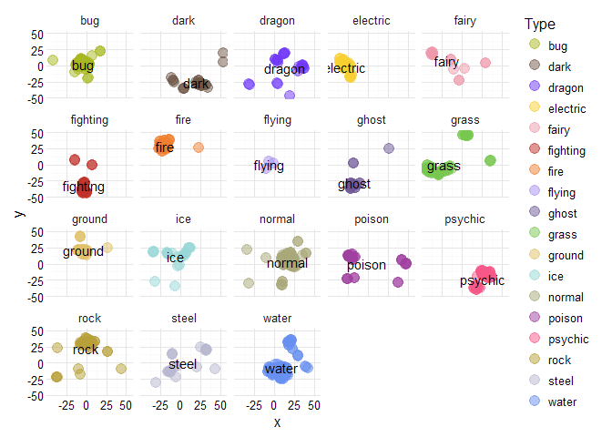

# pkmn visualize 'em all!
Joshua Kunst  


Time ago, when I was a younger man I know pokemon I konw the 150 pokemon then I 
And more than 10 year there are over 700 with new types new, new regions, etc. So
to know the status of all these monster I download the data and make some
chart to see 


## Data

There is a pokemon api http://pokeapi.co/. But we want all the pokemon data once so
we can go to the repository I found the raw data https://github.com/phalt/pokeapi/tree/master/data/v2/csv .
We'll need other type of data like type's colors, icon images. This data we founded here 
http://bulbapedia.bulbagarden.net/wiki/List_of_Pok%C3%A9mon_by_base_stats_(Generation_VI-present) and
http://pokemon-uranium.wikia.com/wiki/Template:fire_color.


```r
path <- function(x) paste0("https://raw.githubusercontent.com/phalt/pokeapi/master/data/v2/csv/", x)

dfpkmn <- read_csv(path("pokemon.csv")) %>% 
  select(-order, -is_default) %>% 
  rename(pokemon = identifier)

dfstat <- read_csv(path("stats.csv")) %>% 
  rename(stat_id = id) %>% 
  right_join(read_csv(path("pokemon_stats.csv")),
             by = "stat_id") %>% 
  mutate(identifier = str_replace(identifier, "-", "_")) %>% 
  select(pokemon_id, identifier, base_stat) %>% 
  spread(identifier, base_stat) %>% 
  rename(id = pokemon_id)

dftype <- read_csv(path("types.csv")) %>% 
  rename(type_id = id) %>% 
  right_join(read_csv(path("pokemon_types.csv")), by = "type_id") %>% 
  select(pokemon_id, identifier, slot) %>% 
  mutate(slot = paste0("type_", slot)) %>% 
  spread(slot, identifier) %>% 
  rename(id = pokemon_id)

dfegg <- read_csv(path("egg_groups.csv")) %>% 
  rename(egg_group_id = id) %>% 
  right_join(read_csv(path("pokemon_egg_groups.csv")), by = "egg_group_id") %>% 
  group_by(species_id) %>% 
  mutate(ranking = row_number(),
         ranking = paste0("egg_group_", ranking)) %>% 
  select(species_id, ranking, identifier) %>% 
  spread(ranking, identifier) 

dfimg <- "https://github.com/phalt/pokeapi/tree/master/data/Pokemon_XY_Sprites" %>% 
  read_html() %>% 
  html_nodes("tr.js-navigation-item > .content > .css-truncate a") %>% 
  map_df(function(x){
    url <- x %>% html_attr("href")
    data_frame(
      id = str_extract(basename(url), "\\d+"),
      url_image = basename(url)
    )
  }) %>%
  mutate(id = as.numeric(id))

url_bulbapedia_list <- "http://bulbapedia.bulbagarden.net/wiki/List_of_Pok%C3%A9mon_by_base_stats_(Generation_VI-present)" 

id <- url_bulbapedia_list %>% 
  read_html(encoding = "UTF-8") %>% 
  html_node("table.sortable") %>% 
  html_table() %>% 
  .[[1]] %>% 
  as.numeric()

url_icon <-  url_bulbapedia_list %>% 
  read_html() %>%
  html_nodes("table.sortable img") %>% 
  html_attr("src")

dficon <- data_frame(id, url_icon) %>% 
  filter(!is.na(id)) %>% 
  distinct(id)

dfcolor <- map_df(na.omit(unique(c(dftype$type_1, dftype$type_2))), function(t){
  # t <- "bug"
  col <- "http://pokemon-uranium.wikia.com/wiki/Template:%s_color" %>% 
    sprintf(t) %>%
    read_html() %>% 
    html_nodes("span > b") %>% 
    html_text()
  data_frame(type = t, color = paste0("#", col))
})

dfcolorf <- expand.grid(color_1 = dfcolor$color, color_2 = dfcolor$color,
                        stringsAsFactors = FALSE) %>% 
  tbl_df() %>% 
  group_by(color_1, color_2) %>% 
  do({
      n = 100;p = 0.25
      data_frame(color_f = colorRampPalette(c(.$color_1, .$color_2))(n)[round(n*p)])
    })

# THE join
df <- dfpkmn %>% 
  left_join(dftype, by = "id") %>% 
  left_join(dfstat, by = "id") %>% 
  left_join(dfcolor %>% rename(type_1 = type, color_1 = color), by = "type_1") %>% 
  left_join(dfcolor %>% rename(type_2 = type, color_2 = color), by = "type_2") %>% 
  left_join(dfcolorf, by =  c("color_1", "color_2")) %>% 
  left_join(dfegg, by = "species_id") %>% 
  left_join(dfimg, by = "id") %>% 
  left_join(dficon, by = "id")

rm(dftype, dfstat, dfcolor, dfcolorf, dfegg, dfimg, dficon)
rm(id, url_bulbapedia_list, url_icon)
```


Finally we remove the pokemon with no images (like the mega ones).


```r
df <- df %>% 
  mutate(color_f = ifelse(is.na(color_f), color_1, color_f)) %>% 
  filter(!is.na(url_image)) 

str(df)
```

```
## Classes 'tbl_df', 'tbl' and 'data.frame':	718 obs. of  21 variables:
##  $ id             : num  1 2 3 4 5 6 7 8 9 10 ...
##  $ pokemon        : chr  "bulbasaur" "ivysaur" "venusaur" "charmander" ...
##  $ species_id     : int  1 2 3 4 5 6 7 8 9 10 ...
##  $ height         : int  7 10 20 6 11 17 5 10 16 3 ...
##  $ weight         : int  69 130 1000 85 190 905 90 225 855 29 ...
##  $ base_experience: int  64 142 236 62 142 240 63 142 239 39 ...
##  $ type_1         : chr  "grass" "grass" "grass" "fire" ...
##  $ type_2         : chr  "poison" "poison" "poison" NA ...
##  $ attack         : int  49 62 82 52 64 84 48 63 83 30 ...
##  $ defense        : int  49 63 83 43 58 78 65 80 100 35 ...
##  $ hp             : int  45 60 80 39 58 78 44 59 79 45 ...
##  $ special_attack : int  65 80 100 60 80 109 50 65 85 20 ...
##  $ special_defense: int  65 80 100 50 65 85 64 80 105 20 ...
##  $ speed          : int  45 60 80 65 80 100 43 58 78 45 ...
##  $ color_1        : chr  "#78C850" "#78C850" "#78C850" "#F08030" ...
##  $ color_2        : chr  "#A040A0" "#A040A0" "#A040A0" NA ...
##  $ color_f        : chr  "#81A763" "#81A763" "#81A763" "#F08030" ...
##  $ egg_group_1    : chr  "monster" "monster" "monster" "monster" ...
##  $ egg_group_2    : chr  "plant" "plant" "plant" "dragon" ...
##  $ url_image      : chr  "1.png" "2.png" "3.png" "4.png" ...
##  $ url_icon       : chr  "http://cdn.bulbagarden.net/upload/e/ec/001MS.png" "http://cdn.bulbagarden.net/upload/6/6b/002MS.png" "http://cdn.bulbagarden.net/upload/d/df/003MS.png" "http://cdn.bulbagarden.net/upload/b/bb/004MS.png" ...
```

```r
head(df)
```

```
## Source: local data frame [6 x 21]
## 
##      id    pokemon species_id height weight base_experience type_1 type_2
##   (dbl)      (chr)      (int)  (int)  (int)           (int)  (chr)  (chr)
## 1     1  bulbasaur          1      7     69              64  grass poison
## 2     2    ivysaur          2     10    130             142  grass poison
## 3     3   venusaur          3     20   1000             236  grass poison
## 4     4 charmander          4      6     85              62   fire     NA
## 5     5 charmeleon          5     11    190             142   fire     NA
## 6     6  charizard          6     17    905             240   fire flying
## Variables not shown: attack (int), defense (int), hp (int), special_attack
##   (int), special_defense (int), speed (int), color_1 (chr), color_2 (chr),
##   color_f (chr), egg_group_1 (chr), egg_group_2 (chr), url_image (chr),
##   url_icon (chr)
```


## *bar chart* I choose you! 

We'll start with the most simple of chart. Let's count
the pkmns by its main type


```r
dstype <- df %>% 
  count(type_1, color_1) %>% 
  ungroup() %>% 
  arrange(desc(n)) %>% 
  mutate(x = row_number()) %>% 
  rename(name = type_1,
         color = color_1,
         y = n) %>% 
  select(y, name, color) %>% 
  list.parse3()
  
hcbar <- highchart() %>% 
  hc_xAxis(categories = unlist(pluck(dstype, i = 2))) %>% 
  hc_yAxis(title = NULL) %>% 
  hc_add_series(data = dstype, type = "bar", showInLegend = FALSE,
                name = "Number of species")

hcbar
```

<!--html_preserve--><div id="htmlwidget-3247" style="width:100%;height:500px;" class="highchart html-widget"></div>
<script type="application/json" data-for="htmlwidget-3247">{"x":{"hc_opts":{"title":{"text":null},"credits":{"enabled":false},"exporting":{"enabled":false},"plotOptions":{"series":{"turboThreshold":0}},"xAxis":{"categories":["water","normal","grass","bug","fire","psychic","rock","electric","ground","dark","poison","fighting","dragon","ghost","ice","steel","fairy","flying"]},"yAxis":{"title":null},"series":[{"data":[{"y":105,"name":"water","color":"#6890F0"},{"y":93,"name":"normal","color":"#A8A878"},{"y":66,"name":"grass","color":"#78C850"},{"y":63,"name":"bug","color":"#A8B820"},{"y":46,"name":"fire","color":"#F08030"},{"y":46,"name":"psychic","color":"#F85888"},{"y":40,"name":"rock","color":"#B8A038"},{"y":36,"name":"electric","color":"#F8D030"},{"y":30,"name":"ground","color":"#E0C068"},{"y":28,"name":"dark","color":"#705848"},{"y":28,"name":"poison","color":"#A040A0"},{"y":25,"name":"fighting","color":"#C03028"},{"y":24,"name":"dragon","color":"#7038F8"},{"y":23,"name":"ghost","color":"#705898"},{"y":23,"name":"ice","color":"#98D8D8"},{"y":22,"name":"steel","color":"#B8B8D0"},{"y":17,"name":"fairy","color":"#EE99AC"},{"y":3,"name":"flying","color":"#A890F0"}],"type":"bar","showInLegend":false,"name":"Number of species"}]},"theme":null,"conf_opts":{"global":{"Date":null,"VMLRadialGradientURL":"http =//code.highcharts.com/list(version)/gfx/vml-radial-gradient.png","canvasToolsURL":"http =//code.highcharts.com/list(version)/modules/canvas-tools.js","getTimezoneOffset":null,"timezoneOffset":0,"useUTC":true},"lang":{"contextButtonTitle":"Chart context menu","decimalPoint":".","downloadJPEG":"Download JPEG image","downloadPDF":"Download PDF document","downloadPNG":"Download PNG image","downloadSVG":"Download SVG vector image","drillUpText":"Back to {series.name}","invalidDate":null,"loading":"Loading...","months":["January","February","March","April","May","June","July","August","September","October","November","December"],"noData":"No data to display","numericSymbols":["k","M","G","T","P","E"],"printChart":"Print chart","resetZoom":"Reset zoom","resetZoomTitle":"Reset zoom level 1:1","shortMonths":["Jan","Feb","Mar","Apr","May","Jun","Jul","Aug","Sep","Oct","Nov","Dec"],"thousandsSep":" ","weekdays":["Sunday","Monday","Tuesday","Wednesday","Thursday","Friday","Saturday"]}},"type":"chart","fonts":[],"debug":false},"evals":[],"jsHooks":[]}</script><!--/html_preserve-->


Nothing new: A lot of water and normal pkmns and a few with 
fly as main type. 


## Oh! The *bar chat* has evolved into a *treemap*

 Now, lets include in some way the second type of each pkmn. An 
 alternative to do this is using a treemap. So here we'll 
 use the `treemap` package to get the information.
 


```r
set.seed(3514)

tm <- df %>% 
  mutate(type_2 = ifelse(is.na(type_2), paste("only", type_1), type_2),
         type_1 = type_1) %>% 
  group_by(type_1, type_2) %>%
  summarise(n = n()) %>% 
  ungroup() %>% 
  treemap::treemap(index = c("type_1", "type_2"),
                   vSize = "n", vColor = "type_1")
```


Now let's tweak the treemap result to include the respective color 
to each type so we have a more *fun* chart.


```r
tm$tm <- tm$tm %>%
  tbl_df() %>% 
  left_join(df %>% select(type_1, type_2, color_f) %>% distinct(), by = c("type_1", "type_2")) %>%
  left_join(df %>% select(type_1, color_1) %>% distinct(), by = c("type_1")) %>% 
  mutate(type_1 = paste0("Main ", type_1),
         color = ifelse(is.na(color_f), color_1, color_f))

hctm <- highchart() %>% 
  hc_add_series_treemap(tm, allowDrillToNode = TRUE,
                        layoutAlgorithm = "squarified")

hctm
```

<!--html_preserve--><div id="htmlwidget-3262" style="width:100%;height:500px;" class="highchart html-widget"></div>
<script type="application/json" data-for="htmlwidget-3262">{"x":{"hc_opts":{"title":{"text":null},"credits":{"enabled":false},"exporting":{"enabled":false},"plotOptions":{"series":{"turboThreshold":0}},"series":[{"data":[{"name":"Main bug","type_2":null,"value":63,"valuecolor":63,"level":1,"color":"#A8B820","color_f":"#A8B820","color_1":"#A8B820","id":"main_bug","type_1":null},{"name":"Main dark","type_2":null,"value":28,"valuecolor":28,"level":1,"color":"#705848","color_f":"#705848","color_1":"#705848","id":"main_dark","type_1":null},{"name":"Main dragon","type_2":null,"value":24,"valuecolor":24,"level":1,"color":"#7038F8","color_f":"#7038F8","color_1":"#7038F8","id":"main_dragon","type_1":null},{"name":"Main electric","type_2":null,"value":36,"valuecolor":36,"level":1,"color":"#F8D030","color_f":"#F8D030","color_1":"#F8D030","id":"main_electric","type_1":null},{"name":"Main fairy","type_2":null,"value":17,"valuecolor":17,"level":1,"color":"#EE99AC","color_f":"#EE99AC","color_1":"#EE99AC","id":"main_fairy","type_1":null},{"name":"Main fighting","type_2":null,"value":25,"valuecolor":25,"level":1,"color":"#C03028","color_f":"#C03028","color_1":"#C03028","id":"main_fighting","type_1":null},{"name":"Main fire","type_2":null,"value":46,"valuecolor":46,"level":1,"color":"#F08030","color_f":"#F08030","color_1":"#F08030","id":"main_fire","type_1":null},{"name":"Main flying","type_2":null,"value":3,"valuecolor":3,"level":1,"color":"#A890F0","color_f":"#A890F0","color_1":"#A890F0","id":"main_flying","type_1":null},{"name":"Main ghost","type_2":null,"value":23,"valuecolor":23,"level":1,"color":"#705898","color_f":"#705898","color_1":"#705898","id":"main_ghost","type_1":null},{"name":"Main grass","type_2":null,"value":66,"valuecolor":66,"level":1,"color":"#78C850","color_f":"#78C850","color_1":"#78C850","id":"main_grass","type_1":null},{"name":"Main ground","type_2":null,"value":30,"valuecolor":30,"level":1,"color":"#E0C068","color_f":"#E0C068","color_1":"#E0C068","id":"main_ground","type_1":null},{"name":"Main ice","type_2":null,"value":23,"valuecolor":23,"level":1,"color":"#98D8D8","color_f":"#98D8D8","color_1":"#98D8D8","id":"main_ice","type_1":null},{"name":"Main normal","type_2":null,"value":93,"valuecolor":93,"level":1,"color":"#A8A878","color_f":"#A8A878","color_1":"#A8A878","id":"main_normal","type_1":null},{"name":"Main poison","type_2":null,"value":28,"valuecolor":28,"level":1,"color":"#A040A0","color_f":"#A040A0","color_1":"#A040A0","id":"main_poison","type_1":null},{"name":"Main psychic","type_2":null,"value":46,"valuecolor":46,"level":1,"color":"#F85888","color_f":"#F85888","color_1":"#F85888","id":"main_psychic","type_1":null},{"name":"Main rock","type_2":null,"value":40,"valuecolor":40,"level":1,"color":"#B8A038","color_f":"#B8A038","color_1":"#B8A038","id":"main_rock","type_1":null},{"name":"Main steel","type_2":null,"value":22,"valuecolor":22,"level":1,"color":"#B8B8D0","color_f":"#B8B8D0","color_1":"#B8B8D0","id":"main_steel","type_1":null},{"name":"Main water","type_2":null,"value":105,"valuecolor":105,"level":1,"color":"#6890F0","color_f":"#6890F0","color_1":"#6890F0","id":"main_water","type_1":null},{"name":"electric","type_2":null,"value":2,"valuecolor":2,"level":2,"color":"#BBBD23","color_f":"#BBBD23","color_1":"#A8B820","id":"electric","parent":"main_bug","type_1":"Main bug"},{"name":"fighting","type_2":null,"value":1,"valuecolor":1,"level":2,"color":"#AD9721","color_f":"#AD9721","color_1":"#A8B820","id":"fighting","parent":"main_bug","type_1":"Main bug"},{"name":"fire","type_2":null,"value":2,"valuecolor":2,"level":2,"color":"#B9AA23","color_f":"#B9AA23","color_1":"#A8B820","id":"fire","parent":"main_bug","type_1":"Main bug"},{"name":"flying","type_2":null,"value":13,"valuecolor":13,"level":2,"color":"#A8AE52","color_f":"#A8AE52","color_1":"#A8B820","id":"flying","parent":"main_bug","type_1":"Main bug"},{"name":"ghost","type_2":null,"value":1,"valuecolor":1,"level":2,"color":"#9AA03D","color_f":"#9AA03D","color_1":"#A8B820","id":"ghost","parent":"main_bug","type_1":"Main bug"},{"name":"grass","type_2":null,"value":6,"valuecolor":6,"level":2,"color":"#9CBB2B","color_f":"#9CBB2B","color_1":"#A8B820","id":"grass","parent":"main_bug","type_1":"Main bug"},{"name":"ground","type_2":null,"value":1,"valuecolor":1,"level":2,"color":"#B5B931","color_f":"#B5B931","color_1":"#A8B820","id":"ground","parent":"main_bug","type_1":"Main bug"},{"name":"only bug","type_2":null,"value":17,"valuecolor":17,"level":2,"color":"#A8B820","color_f":null,"color_1":"#A8B820","id":"only_bug","parent":"main_bug","type_1":"Main bug"},{"name":"poison","type_2":null,"value":11,"valuecolor":11,"level":2,"color":"#A69A3F","color_f":"#A69A3F","color_1":"#A8B820","id":"poison","parent":"main_bug","type_1":"Main bug"},{"name":"rock","type_2":null,"value":3,"valuecolor":3,"level":2,"color":"#ABB225","color_f":"#ABB225","color_1":"#A8B820","id":"rock","parent":"main_bug","type_1":"Main bug"},{"name":"steel","type_2":null,"value":5,"valuecolor":5,"level":2,"color":"#ABB84A","color_f":"#ABB84A","color_1":"#A8B820","id":"steel","parent":"main_bug","type_1":"Main bug"},{"name":"water","type_2":null,"value":1,"valuecolor":1,"level":2,"color":"#98AE52","color_f":"#98AE52","color_1":"#A8B820","id":"water","parent":"main_bug","type_1":"Main bug"},{"name":"dragon","type_2":null,"value":3,"valuecolor":3,"level":2,"color":"#705072","color_f":"#705072","color_1":"#705848","id":"dragon","parent":"main_dark","type_1":"Main dark"},{"name":"fighting","type_2":null,"value":2,"valuecolor":2,"level":2,"color":"#834E40","color_f":"#834E40","color_1":"#705848","id":"fighting","parent":"main_dark","type_1":"Main dark"},{"name":"fire","type_2":null,"value":2,"valuecolor":2,"level":2,"color":"#8F6142","color_f":"#8F6142","color_1":"#705848","id":"fire","parent":"main_dark","type_1":"Main dark"},{"name":"flying","type_2":null,"value":5,"valuecolor":5,"level":2,"color":"#7D6570","color_f":"#7D6570","color_1":"#705848","id":"flying","parent":"main_dark","type_1":"Main dark"},{"name":"ghost","type_2":null,"value":1,"valuecolor":1,"level":2,"color":"#70585B","color_f":"#70585B","color_1":"#705848","id":"ghost","parent":"main_dark","type_1":"Main dark"},{"name":"ice","type_2":null,"value":2,"valuecolor":2,"level":2,"color":"#79776A","color_f":"#79776A","color_1":"#705848","id":"ice","parent":"main_dark","type_1":"Main dark"},{"name":"only dark","type_2":null,"value":9,"valuecolor":9,"level":2,"color":"#705848","color_f":null,"color_1":"#705848","id":"only_dark","parent":"main_dark","type_1":"Main dark"},{"name":"psychic","type_2":null,"value":2,"valuecolor":2,"level":2,"color":"#905857","color_f":"#905857","color_1":"#705848","id":"psychic","parent":"main_dark","type_1":"Main dark"},{"name":"steel","type_2":null,"value":2,"valuecolor":2,"level":2,"color":"#816F68","color_f":"#816F68","color_1":"#705848","id":"steel","parent":"main_dark","type_1":"Main dark"},{"name":"electric","type_2":null,"value":1,"valuecolor":1,"level":2,"color":"#905CC7","color_f":"#905CC7","color_1":"#7038F8","id":"electric","parent":"main_dragon","type_1":"Main dragon"},{"name":"fire","type_2":null,"value":1,"valuecolor":1,"level":2,"color":"#8F49C7","color_f":"#8F49C7","color_1":"#7038F8","id":"fire","parent":"main_dragon","type_1":"Main dragon"},{"name":"flying","type_2":null,"value":4,"valuecolor":4,"level":2,"color":"#7D4DF6","color_f":"#7D4DF6","color_1":"#7038F8","id":"flying","parent":"main_dragon","type_1":"Main dragon"},{"name":"ground","type_2":null,"value":4,"valuecolor":4,"level":2,"color":"#8B58D5","color_f":"#8B58D5","color_1":"#7038F8","id":"ground","parent":"main_dragon","type_1":"Main dragon"},{"name":"ice","type_2":null,"value":1,"valuecolor":1,"level":2,"color":"#795EF0","color_f":"#795EF0","color_1":"#7038F8","id":"ice","parent":"main_dragon","type_1":"Main dragon"},{"name":"only dragon","type_2":null,"value":11,"valuecolor":11,"level":2,"color":"#7038F8","color_f":null,"color_1":"#7038F8","id":"only_dragon","parent":"main_dragon","type_1":"Main dragon"},{"name":"psychic","type_2":null,"value":2,"valuecolor":2,"level":2,"color":"#903FDC","color_f":"#903FDC","color_1":"#7038F8","id":"psychic","parent":"main_dragon","type_1":"Main dragon"},{"name":"fairy","type_2":null,"value":1,"valuecolor":1,"level":2,"color":"#F5C24E","color_f":"#F5C24E","color_1":"#F8D030","id":"fairy","parent":"main_electric","type_1":"Main electric"},{"name":"flying","type_2":null,"value":3,"valuecolor":3,"level":2,"color":"#E4C05E","color_f":"#E4C05E","color_1":"#F8D030","id":"flying","parent":"main_electric","type_1":"Main electric"},{"name":"ghost","type_2":null,"value":1,"valuecolor":1,"level":2,"color":"#D7B249","color_f":"#D7B249","color_1":"#F8D030","id":"ghost","parent":"main_electric","type_1":"Main electric"},{"name":"normal","type_2":null,"value":2,"valuecolor":2,"level":2,"color":"#E4C641","color_f":"#E4C641","color_1":"#F8D030","id":"normal","parent":"main_electric","type_1":"Main electric"},{"name":"only electric","type_2":null,"value":26,"valuecolor":26,"level":2,"color":"#F8D030","color_f":null,"color_1":"#F8D030","id":"only_electric","parent":"main_electric","type_1":"Main electric"},{"name":"steel","type_2":null,"value":3,"valuecolor":3,"level":2,"color":"#E8CA56","color_f":"#E8CA56","color_1":"#F8D030","id":"steel","parent":"main_electric","type_1":"Main electric"},{"name":"flying","type_2":null,"value":2,"valuecolor":2,"level":2,"color":"#DD96BC","color_f":"#DD96BC","color_1":"#EE99AC","id":"flying","parent":"main_fairy","type_1":"Main fairy"},{"name":"only fairy","type_2":null,"value":15,"valuecolor":15,"level":2,"color":"#EE99AC","color_f":null,"color_1":"#EE99AC","id":"only_fairy","parent":"main_fairy","type_1":"Main fairy"},{"name":"dark","type_2":null,"value":1,"valuecolor":1,"level":2,"color":"#AC392F","color_f":"#AC392F","color_1":"#C03028","id":"dark","parent":"main_fighting","type_1":"Main fighting"},{"name":"flying","type_2":null,"value":1,"valuecolor":1,"level":2,"color":"#BA4758","color_f":"#BA4758","color_1":"#C03028","id":"flying","parent":"main_fighting","type_1":"Main fighting"},{"name":"only fighting","type_2":null,"value":20,"valuecolor":20,"level":2,"color":"#C03028","color_f":null,"color_1":"#C03028","id":"only_fighting","parent":"main_fighting","type_1":"Main fighting"},{"name":"psychic","type_2":null,"value":2,"valuecolor":2,"level":2,"color":"#CD393F","color_f":"#CD393F","color_1":"#C03028","id":"psychic","parent":"main_fighting","type_1":"Main fighting"},{"name":"steel","type_2":null,"value":1,"valuecolor":1,"level":2,"color":"#BE5050","color_f":"#BE5050","color_1":"#C03028","id":"steel","parent":"main_fighting","type_1":"Main fighting"},{"name":"fighting","type_2":null,"value":6,"valuecolor":6,"level":2,"color":"#E46C2E","color_f":"#E46C2E","color_1":"#F08030","id":"fighting","parent":"main_fire","type_1":"Main fire"},{"name":"flying","type_2":null,"value":5,"valuecolor":5,"level":2,"color":"#DE835E","color_f":"#DE835E","color_1":"#F08030","id":"flying","parent":"main_fire","type_1":"Main fire"},{"name":"ground","type_2":null,"value":2,"valuecolor":2,"level":2,"color":"#EC8F3D","color_f":"#EC8F3D","color_1":"#F08030","id":"ground","parent":"main_fire","type_1":"Main fire"},{"name":"normal","type_2":null,"value":2,"valuecolor":2,"level":2,"color":"#DE8941","color_f":"#DE8941","color_1":"#F08030","id":"normal","parent":"main_fire","type_1":"Main fire"},{"name":"only fire","type_2":null,"value":28,"valuecolor":28,"level":2,"color":"#F08030","color_f":null,"color_1":"#F08030","id":"only_fire","parent":"main_fire","type_1":"Main fire"},{"name":"psychic","type_2":null,"value":1,"valuecolor":1,"level":2,"color":"#F17645","color_f":"#F17645","color_1":"#F08030","id":"psychic","parent":"main_fire","type_1":"Main fire"},{"name":"rock","type_2":null,"value":1,"valuecolor":1,"level":2,"color":"#E28731","color_f":"#E28731","color_1":"#F08030","id":"rock","parent":"main_fire","type_1":"Main fire"},{"name":"steel","type_2":null,"value":1,"valuecolor":1,"level":2,"color":"#E28D56","color_f":"#E28D56","color_1":"#F08030","id":"steel","parent":"main_fire","type_1":"Main fire"},{"name":"dragon","type_2":null,"value":2,"valuecolor":2,"level":2,"color":"#9A7AF1","color_f":"#9A7AF1","color_1":"#A890F0","id":"dragon","parent":"main_flying","type_1":"Main flying"},{"name":"only flying","type_2":null,"value":1,"valuecolor":1,"level":2,"color":"#A890F0","color_f":null,"color_1":"#A890F0","id":"only_flying","parent":"main_flying","type_1":"Main flying"},{"name":"dark","type_2":null,"value":1,"valuecolor":1,"level":2,"color":"#705884","color_f":"#705884","color_1":"#705898","id":"dark","parent":"main_ghost","type_1":"Main ghost"},{"name":"dragon","type_2":null,"value":1,"valuecolor":1,"level":2,"color":"#7050AF","color_f":"#7050AF","color_1":"#705898","id":"dragon","parent":"main_ghost","type_1":"Main ghost"},{"name":"fire","type_2":null,"value":3,"valuecolor":3,"level":2,"color":"#8F617E","color_f":"#8F617E","color_1":"#705898","id":"fire","parent":"main_ghost","type_1":"Main ghost"},{"name":"flying","type_2":null,"value":2,"valuecolor":2,"level":2,"color":"#7D65AD","color_f":"#7D65AD","color_1":"#705898","id":"flying","parent":"main_ghost","type_1":"Main ghost"},{"name":"grass","type_2":null,"value":4,"valuecolor":4,"level":2,"color":"#717386","color_f":"#717386","color_1":"#705898","id":"grass","parent":"main_ghost","type_1":"Main ghost"},{"name":"only ghost","type_2":null,"value":9,"valuecolor":9,"level":2,"color":"#705898","color_f":null,"color_1":"#705898","id":"only_ghost","parent":"main_ghost","type_1":"Main ghost"},{"name":"poison","type_2":null,"value":3,"valuecolor":3,"level":2,"color":"#7B5299","color_f":"#7B5299","color_1":"#705898","id":"poison","parent":"main_ghost","type_1":"Main ghost"},{"name":"dark","type_2":null,"value":3,"valuecolor":3,"level":2,"color":"#76AC4E","color_f":"#76AC4E","color_1":"#78C850","id":"dark","parent":"main_grass","type_1":"Main grass"},{"name":"fairy","type_2":null,"value":2,"valuecolor":2,"level":2,"color":"#94BC66","color_f":"#94BC66","color_1":"#78C850","id":"fairy","parent":"main_grass","type_1":"Main grass"},{"name":"fighting","type_2":null,"value":3,"valuecolor":3,"level":2,"color":"#89A346","color_f":"#89A346","color_1":"#78C850","id":"fighting","parent":"main_grass","type_1":"Main grass"},{"name":"flying","type_2":null,"value":4,"valuecolor":4,"level":2,"color":"#83BA76","color_f":"#83BA76","color_1":"#78C850","id":"flying","parent":"main_grass","type_1":"Main grass"},{"name":"ground","type_2":null,"value":1,"valuecolor":1,"level":2,"color":"#91C655","color_f":"#91C655","color_1":"#78C850","id":"ground","parent":"main_grass","type_1":"Main grass"},{"name":"ice","type_2":null,"value":2,"valuecolor":2,"level":2,"color":"#7FCB70","color_f":"#7FCB70","color_1":"#78C850","id":"ice","parent":"main_grass","type_1":"Main grass"},{"name":"only grass","type_2":null,"value":33,"valuecolor":33,"level":2,"color":"#78C850","color_f":null,"color_1":"#78C850","id":"only_grass","parent":"main_grass","type_1":"Main grass"},{"name":"poison","type_2":null,"value":14,"valuecolor":14,"level":2,"color":"#81A763","color_f":"#81A763","color_1":"#78C850","id":"poison","parent":"main_grass","type_1":"Main grass"},{"name":"psychic","type_2":null,"value":2,"valuecolor":2,"level":2,"color":"#97AC5D","color_f":"#97AC5D","color_1":"#78C850","id":"psychic","parent":"main_grass","type_1":"Main grass"},{"name":"steel","type_2":null,"value":2,"valuecolor":2,"level":2,"color":"#87C46F","color_f":"#87C46F","color_1":"#78C850","id":"steel","parent":"main_grass","type_1":"Main grass"},{"name":"dark","type_2":null,"value":3,"valuecolor":3,"level":2,"color":"#C4A660","color_f":"#C4A660","color_1":"#E0C068","id":"dark","parent":"main_ground","type_1":"Main ground"},{"name":"dragon","type_2":null,"value":2,"valuecolor":2,"level":2,"color":"#C49F8A","color_f":"#C49F8A","color_1":"#E0C068","id":"dragon","parent":"main_ground","type_1":"Main ground"},{"name":"electric","type_2":null,"value":1,"valuecolor":1,"level":2,"color":"#E5C35A","color_f":"#E5C35A","color_1":"#E0C068","id":"electric","parent":"main_ground","type_1":"Main ground"},{"name":"flying","type_2":null,"value":3,"valuecolor":3,"level":2,"color":"#D2B488","color_f":"#D2B488","color_1":"#E0C068","id":"flying","parent":"main_ground","type_1":"Main ground"},{"name":"ghost","type_2":null,"value":2,"valuecolor":2,"level":2,"color":"#C4A673","color_f":"#C4A673","color_1":"#E0C068","id":"ghost","parent":"main_ground","type_1":"Main ground"},{"name":"only ground","type_2":null,"value":13,"valuecolor":13,"level":2,"color":"#E0C068","color_f":null,"color_1":"#E0C068","id":"only_ground","parent":"main_ground","type_1":"Main ground"},{"name":"psychic","type_2":null,"value":2,"valuecolor":2,"level":2,"color":"#E5A66F","color_f":"#E5A66F","color_1":"#E0C068","id":"psychic","parent":"main_ground","type_1":"Main ground"},{"name":"rock","type_2":null,"value":3,"valuecolor":3,"level":2,"color":"#D6B85C","color_f":"#D6B85C","color_1":"#E0C068","id":"rock","parent":"main_ground","type_1":"Main ground"},{"name":"steel","type_2":null,"value":1,"valuecolor":1,"level":2,"color":"#D6BE81","color_f":"#D6BE81","color_1":"#E0C068","id":"steel","parent":"main_ground","type_1":"Main ground"},{"name":"flying","type_2":null,"value":2,"valuecolor":2,"level":2,"color":"#9BC6DD","color_f":"#9BC6DD","color_1":"#98D8D8","id":"flying","parent":"main_ice","type_1":"Main ice"},{"name":"ghost","type_2":null,"value":1,"valuecolor":1,"level":2,"color":"#8EB8C8","color_f":"#8EB8C8","color_1":"#98D8D8","id":"ghost","parent":"main_ice","type_1":"Main ice"},{"name":"ground","type_2":null,"value":3,"valuecolor":3,"level":2,"color":"#A9D2BC","color_f":"#A9D2BC","color_1":"#98D8D8","id":"ground","parent":"main_ice","type_1":"Main ice"},{"name":"only ice","type_2":null,"value":12,"valuecolor":12,"level":2,"color":"#98D8D8","color_f":null,"color_1":"#98D8D8","id":"only_ice","parent":"main_ice","type_1":"Main ice"},{"name":"psychic","type_2":null,"value":2,"valuecolor":2,"level":2,"color":"#AFB8C4","color_f":"#AFB8C4","color_1":"#98D8D8","id":"psychic","parent":"main_ice","type_1":"Main ice"},{"name":"water","type_2":null,"value":3,"valuecolor":3,"level":2,"color":"#8CC6DD","color_f":"#8CC6DD","color_1":"#98D8D8","id":"water","parent":"main_ice","type_1":"Main ice"},{"name":"fairy","type_2":null,"value":4,"valuecolor":4,"level":2,"color":"#B8A484","color_f":"#B8A484","color_1":"#A8A878","id":"fairy","parent":"main_normal","type_1":"Main normal"},{"name":"flying","type_2":null,"value":23,"valuecolor":23,"level":2,"color":"#A8A295","color_f":"#A8A295","color_1":"#A8A878","id":"flying","parent":"main_normal","type_1":"Main normal"},{"name":"grass","type_2":null,"value":2,"valuecolor":2,"level":2,"color":"#9CAF6E","color_f":"#9CAF6E","color_1":"#A8A878","id":"grass","parent":"main_normal","type_1":"Main normal"},{"name":"ground","type_2":null,"value":1,"valuecolor":1,"level":2,"color":"#B5AD74","color_f":"#B5AD74","color_1":"#A8A878","id":"ground","parent":"main_normal","type_1":"Main normal"},{"name":"only normal","type_2":null,"value":60,"valuecolor":60,"level":2,"color":"#A8A878","color_f":null,"color_1":"#A8A878","id":"only_normal","parent":"main_normal","type_1":"Main normal"},{"name":"psychic","type_2":null,"value":2,"valuecolor":2,"level":2,"color":"#BB947B","color_f":"#BB947B","color_1":"#A8A878","id":"psychic","parent":"main_normal","type_1":"Main normal"},{"name":"water","type_2":null,"value":1,"valuecolor":1,"level":2,"color":"#98A295","color_f":"#98A295","color_1":"#A8A878","id":"water","parent":"main_normal","type_1":"Main normal"},{"name":"bug","type_2":null,"value":1,"valuecolor":1,"level":2,"color":"#A15D80","color_f":"#A15D80","color_1":"#A040A0","id":"bug","parent":"main_poison","type_1":"Main poison"},{"name":"dark","type_2":null,"value":3,"valuecolor":3,"level":2,"color":"#94458A","color_f":"#94458A","color_1":"#A040A0","id":"dark","parent":"main_poison","type_1":"Main poison"},{"name":"dragon","type_2":null,"value":1,"valuecolor":1,"level":2,"color":"#943EB5","color_f":"#943EB5","color_1":"#A040A0","id":"dragon","parent":"main_poison","type_1":"Main poison"},{"name":"fighting","type_2":null,"value":2,"valuecolor":2,"level":2,"color":"#A73C82","color_f":"#A73C82","color_1":"#A040A0","id":"fighting","parent":"main_poison","type_1":"Main poison"},{"name":"flying","type_2":null,"value":3,"valuecolor":3,"level":2,"color":"#A153B3","color_f":"#A153B3","color_1":"#A040A0","id":"flying","parent":"main_poison","type_1":"Main poison"},{"name":"ground","type_2":null,"value":2,"valuecolor":2,"level":2,"color":"#AF5F92","color_f":"#AF5F92","color_1":"#A040A0","id":"ground","parent":"main_poison","type_1":"Main poison"},{"name":"only poison","type_2":null,"value":15,"valuecolor":15,"level":2,"color":"#A040A0","color_f":null,"color_1":"#A040A0","id":"only_poison","parent":"main_poison","type_1":"Main poison"},{"name":"water","type_2":null,"value":1,"valuecolor":1,"level":2,"color":"#9253B3","color_f":"#9253B3","color_1":"#A040A0","id":"water","parent":"main_poison","type_1":"Main poison"},{"name":"fairy","type_2":null,"value":5,"valuecolor":5,"level":2,"color":"#F56790","color_f":"#F56790","color_1":"#F85888","id":"fairy","parent":"main_psychic","type_1":"Main psychic"},{"name":"fighting","type_2":null,"value":1,"valuecolor":1,"level":2,"color":"#EA4E70","color_f":"#EA4E70","color_1":"#F85888","id":"fighting","parent":"main_psychic","type_1":"Main psychic"},{"name":"fire","type_2":null,"value":1,"valuecolor":1,"level":2,"color":"#F66172","color_f":"#F66172","color_1":"#F85888","id":"fire","parent":"main_psychic","type_1":"Main psychic"},{"name":"flying","type_2":null,"value":6,"valuecolor":6,"level":2,"color":"#E465A1","color_f":"#E465A1","color_1":"#F85888","id":"flying","parent":"main_psychic","type_1":"Main psychic"},{"name":"grass","type_2":null,"value":1,"valuecolor":1,"level":2,"color":"#D8737A","color_f":"#D8737A","color_1":"#F85888","id":"grass","parent":"main_psychic","type_1":"Main psychic"},{"name":"only psychic","type_2":null,"value":32,"valuecolor":32,"level":2,"color":"#F85888","color_f":null,"color_1":"#F85888","id":"only_psychic","parent":"main_psychic","type_1":"Main psychic"},{"name":"bug","type_2":null,"value":2,"valuecolor":2,"level":2,"color":"#B4A532","color_f":"#B4A532","color_1":"#B8A038","id":"bug","parent":"main_rock","type_1":"Main rock"},{"name":"dark","type_2":null,"value":1,"valuecolor":1,"level":2,"color":"#A68E3B","color_f":"#A68E3B","color_1":"#B8A038","id":"dark","parent":"main_rock","type_1":"Main rock"},{"name":"dragon","type_2":null,"value":2,"valuecolor":2,"level":2,"color":"#A68666","color_f":"#A68666","color_1":"#B8A038","id":"dragon","parent":"main_rock","type_1":"Main rock"},{"name":"fairy","type_2":null,"value":1,"valuecolor":1,"level":2,"color":"#C59E54","color_f":"#C59E54","color_1":"#B8A038","id":"fairy","parent":"main_rock","type_1":"Main rock"},{"name":"fighting","type_2":null,"value":1,"valuecolor":1,"level":2,"color":"#B98434","color_f":"#B98434","color_1":"#B8A038","id":"fighting","parent":"main_rock","type_1":"Main rock"},{"name":"flying","type_2":null,"value":3,"valuecolor":3,"level":2,"color":"#B49C64","color_f":"#B49C64","color_1":"#B8A038","id":"flying","parent":"main_rock","type_1":"Main rock"},{"name":"grass","type_2":null,"value":2,"valuecolor":2,"level":2,"color":"#A8A93D","color_f":"#A8A93D","color_1":"#B8A038","id":"grass","parent":"main_rock","type_1":"Main rock"},{"name":"ground","type_2":null,"value":6,"valuecolor":6,"level":2,"color":"#C1A743","color_f":"#C1A743","color_1":"#B8A038","id":"ground","parent":"main_rock","type_1":"Main rock"},{"name":"ice","type_2":null,"value":2,"valuecolor":2,"level":2,"color":"#B0AD5E","color_f":"#B0AD5E","color_1":"#B8A038","id":"ice","parent":"main_rock","type_1":"Main rock"},{"name":"only rock","type_2":null,"value":9,"valuecolor":9,"level":2,"color":"#B8A038","color_f":null,"color_1":"#B8A038","id":"only_rock","parent":"main_rock","type_1":"Main rock"},{"name":"psychic","type_2":null,"value":2,"valuecolor":2,"level":2,"color":"#C78E4B","color_f":"#C78E4B","color_1":"#B8A038","id":"psychic","parent":"main_rock","type_1":"Main rock"},{"name":"steel","type_2":null,"value":3,"valuecolor":3,"level":2,"color":"#B8A55C","color_f":"#B8A55C","color_1":"#B8A038","id":"steel","parent":"main_rock","type_1":"Main rock"},{"name":"water","type_2":null,"value":6,"valuecolor":6,"level":2,"color":"#A49C64","color_f":"#A49C64","color_1":"#B8A038","id":"water","parent":"main_rock","type_1":"Main rock"},{"name":"dragon","type_2":null,"value":1,"valuecolor":1,"level":2,"color":"#A698D9","color_f":"#A698D9","color_1":"#B8B8D0","id":"dragon","parent":"main_steel","type_1":"Main steel"},{"name":"fairy","type_2":null,"value":2,"valuecolor":2,"level":2,"color":"#C5B0C7","color_f":"#C5B0C7","color_1":"#B8B8D0","id":"fairy","parent":"main_steel","type_1":"Main steel"},{"name":"fighting","type_2":null,"value":1,"valuecolor":1,"level":2,"color":"#B997A7","color_f":"#B997A7","color_1":"#B8B8D0","id":"fighting","parent":"main_steel","type_1":"Main steel"},{"name":"flying","type_2":null,"value":1,"valuecolor":1,"level":2,"color":"#B4AED7","color_f":"#B4AED7","color_1":"#B8B8D0","id":"flying","parent":"main_steel","type_1":"Main steel"},{"name":"ghost","type_2":null,"value":3,"valuecolor":3,"level":2,"color":"#A6A0C2","color_f":"#A6A0C2","color_1":"#B8B8D0","id":"ghost","parent":"main_steel","type_1":"Main steel"},{"name":"ground","type_2":null,"value":1,"valuecolor":1,"level":2,"color":"#C1B9B6","color_f":"#C1B9B6","color_1":"#B8B8D0","id":"ground","parent":"main_steel","type_1":"Main steel"},{"name":"only steel","type_2":null,"value":4,"valuecolor":4,"level":2,"color":"#B8B8D0","color_f":null,"color_1":"#B8B8D0","id":"only_steel","parent":"main_steel","type_1":"Main steel"},{"name":"psychic","type_2":null,"value":6,"valuecolor":6,"level":2,"color":"#C7A0BE","color_f":"#C7A0BE","color_1":"#B8B8D0","id":"psychic","parent":"main_steel","type_1":"Main steel"},{"name":"rock","type_2":null,"value":3,"valuecolor":3,"level":2,"color":"#B8B2AB","color_f":"#B8B2AB","color_1":"#B8B8D0","id":"rock","parent":"main_steel","type_1":"Main steel"},{"name":"dark","type_2":null,"value":4,"valuecolor":4,"level":2,"color":"#6982C7","color_f":"#6982C7","color_1":"#6890F0","id":"dark","parent":"main_water","type_1":"Main water"},{"name":"dragon","type_2":null,"value":2,"valuecolor":2,"level":2,"color":"#697AF1","color_f":"#697AF1","color_1":"#6890F0","id":"dragon","parent":"main_water","type_1":"Main water"},{"name":"electric","type_2":null,"value":2,"valuecolor":2,"level":2,"color":"#8A9FC1","color_f":"#8A9FC1","color_1":"#6890F0","id":"electric","parent":"main_water","type_1":"Main water"},{"name":"fairy","type_2":null,"value":2,"valuecolor":2,"level":2,"color":"#8892DF","color_f":"#8892DF","color_1":"#6890F0","id":"fairy","parent":"main_water","type_1":"Main water"},{"name":"fighting","type_2":null,"value":2,"valuecolor":2,"level":2,"color":"#7D78BF","color_f":"#7D78BF","color_1":"#6890F0","id":"fighting","parent":"main_water","type_1":"Main water"},{"name":"flying","type_2":null,"value":7,"valuecolor":7,"level":2,"color":"#7790F0","color_f":"#7790F0","color_1":"#6890F0","id":"flying","parent":"main_water","type_1":"Main water"},{"name":"ghost","type_2":null,"value":2,"valuecolor":2,"level":2,"color":"#6982DA","color_f":"#6982DA","color_1":"#6890F0","id":"ghost","parent":"main_water","type_1":"Main water"},{"name":"grass","type_2":null,"value":3,"valuecolor":3,"level":2,"color":"#6B9DC9","color_f":"#6B9DC9","color_1":"#6890F0","id":"grass","parent":"main_water","type_1":"Main water"},{"name":"ground","type_2":null,"value":9,"valuecolor":9,"level":2,"color":"#859BCF","color_f":"#859BCF","color_1":"#6890F0","id":"ground","parent":"main_water","type_1":"Main water"},{"name":"ice","type_2":null,"value":3,"valuecolor":3,"level":2,"color":"#73A1EA","color_f":"#73A1EA","color_1":"#6890F0","id":"ice","parent":"main_water","type_1":"Main water"},{"name":"only water","type_2":null,"value":57,"valuecolor":57,"level":2,"color":"#6890F0","color_f":null,"color_1":"#6890F0","id":"only_water","parent":"main_water","type_1":"Main water"},{"name":"poison","type_2":null,"value":3,"valuecolor":3,"level":2,"color":"#757CDC","color_f":"#757CDC","color_1":"#6890F0","id":"poison","parent":"main_water","type_1":"Main water"},{"name":"psychic","type_2":null,"value":4,"valuecolor":4,"level":2,"color":"#8A82D6","color_f":"#8A82D6","color_1":"#6890F0","id":"psychic","parent":"main_water","type_1":"Main water"},{"name":"rock","type_2":null,"value":4,"valuecolor":4,"level":2,"color":"#7B93C3","color_f":"#7B93C3","color_1":"#6890F0","id":"rock","parent":"main_water","type_1":"Main water"},{"name":"steel","type_2":null,"value":1,"valuecolor":1,"level":2,"color":"#7B99E8","color_f":"#7B99E8","color_1":"#6890F0","id":"steel","parent":"main_water","type_1":"Main water"}],"type":"treemap","allowDrillToNode":true,"layoutAlgorithm":"squarified"}]},"theme":null,"conf_opts":{"global":{"Date":null,"VMLRadialGradientURL":"http =//code.highcharts.com/list(version)/gfx/vml-radial-gradient.png","canvasToolsURL":"http =//code.highcharts.com/list(version)/modules/canvas-tools.js","getTimezoneOffset":null,"timezoneOffset":0,"useUTC":true},"lang":{"contextButtonTitle":"Chart context menu","decimalPoint":".","downloadJPEG":"Download JPEG image","downloadPDF":"Download PDF document","downloadPNG":"Download PNG image","downloadSVG":"Download SVG vector image","drillUpText":"Back to {series.name}","invalidDate":null,"loading":"Loading...","months":["January","February","March","April","May","June","July","August","September","October","November","December"],"noData":"No data to display","numericSymbols":["k","M","G","T","P","E"],"printChart":"Print chart","resetZoom":"Reset zoom","resetZoomTitle":"Reset zoom level 1:1","shortMonths":["Jan","Feb","Mar","Apr","May","Jun","Jul","Aug","Sep","Oct","Nov","Dec"],"thousandsSep":" ","weekdays":["Sunday","Monday","Tuesday","Wednesday","Thursday","Friday","Saturday"]}},"type":"chart","fonts":[],"debug":false},"evals":[],"jsHooks":[]}</script><!--/html_preserve-->


## A Wild t-SNE Appears! 

I met t-SNE (t-Distributed Stochastic Neighbor Embedding) algorithm in a Kaggle post.
It was developed by Laurens van der Maaten and according the official package 
(https://lvdmaaten.github.io/tsne/) it's a prize winning
algorithm. In the site the description mention:

> It is particularly well suited for the visualization of high-dimensional datasets

So, it's just use the algorithm and see what happend, right? We'll select some variables
and use the `model.matrix` to convert the strings variable into indicators for each level
and apply `tsne`


```r
set.seed(13242)

tsne_poke <- df %>% 
  select(type_1, type_2, weight, height, base_experience,
         attack, defense, special_attack, special_defense, speed, base_experience,
         hp, egg_group_1, egg_group_2) %>%
  map(function(x){
    ifelse(is.na(x), "NA", x)
  }) %>% 
  as.data.frame() %>% 
  tbl_df() %>% 
  model.matrix(~., data = .) %>% 
  as.data.frame() %>% 
  tbl_df() %>% 
  .[-1] %>% 
  tsne(perplexity = 60)

str(tsne_poke)
```

```
##  num [1:718, 1:2] -31.5 -31.3 -31.2 -13.9 -14.2 ...
```

```r
df <- df %>% 
  mutate(x = tsne_poke[, 1],
         y = tsne_poke[, 2])

dfcenters <- df %>% 
  group_by(type_1, color_1) %>% 
  summarise(cx = mean(x),
            cy = mean(y),
            sdcx = sd(x),
            sdcy = sd(y))
```


Now, we'll use ggplot to how the algorithm put every pokemon in this
new dimensions:


```r
cols <- df %>% select(type_1, color_1) %>% distinct() %>% {  setNames(.$color_1, .$type_1) }

gg <- ggplot(df) + 
  geom_point(aes(x, y, color = type_1), size = 4, alpha = 0.5) +
  scale_color_manual("Type", values = cols) +
  geom_text(data = dfcenters, aes(cx, cy, label = type_1)) +
  theme_minimal() +
  theme(legend.position = "right") +
  facet_wrap(~type_1)

gg
```




Clearly the algorithm grouped pokemon according to their main type. Every
group look relative concentrated except the *dragon*, *fairy*, *poison* and
*steel*. I think this can be beacuse this types of pokemon have a second and
variable so they dont are so similiar among them.

There will be more in this result? Now it's time to put all the 
download images in a chart and explore the output. 


```r
ds <- df %>% 
  select(pokemon, type_1, type_2, weight, height,
         attack, defense, special_attack, special_defense,
         url_image, url_icon, color = color_1, x, y) %>% 
  list.parse3() %>% 
  map(function(x){
    x$marker$symbol <- sprintf("url(%s)", x$url_icon)
    x$marker$radius <- 2
    x$url_icon  <- NULL
    x
  })

ds2 <- df %>% 
  select(color = color_1, x, y) %>%
  mutate(color = hex_to_rgba(color, 0.05)) %>% 
  list.parse3()

urlimage <- "https://raw.githubusercontent.com/phalt/pokeapi/master/data/Pokemon_XY_Sprites/"

tooltip <- c("pokemon", "type_1", "type_2",
             "weight", "height",
             "attack",  "defense",
             "special_attack", "special_defense") %>%
  map(function(x){
    tags$tr(
      tags$th(str_replace_all(str_to_title(x), "_", " ")),
      tags$td(paste0("{point.", x, "}"))
    )
  }) %>% 
  do.call(tagList, .) %>% 
  tagList(
    tags$img(src = paste0(urlimage, "{point.url_image}"),
             width = "125px", height = "125px")
  ) %>% 
  as.character()

hctsne <- highchart() %>% 
  hc_chart(zoomType = "xy") %>% 
  hc_xAxis(minRange = diff(range(df$x))/5) %>%
  hc_yAxis(minRange = diff(range(df$y))/5) %>%
  hc_add_series(data = ds,
                type = "scatter",
                name = "pokemons",
                states = list(hover = list(halo = list(
                  size  = 50,
                  attributes = list(
                    opacity = 1)
                )))) %>%
  hc_add_series(data = ds2, type = "scatter",
                marker = list(radius = 75, symbol = "circle"),
                zIndex = -3,  enableMouseTracking = FALSE,
                linkedTo = ":previous",
                showInLegend = FALSE) %>%
  hc_plotOptions(series = list()) %>%  
  hc_tooltip(
    useHTML = TRUE,
    borderRadius = 0,
    borderWidth = 5,
    headerFormat = "<table>",
    pointFormat = tooltip,
    footerFormat = "</table>"
  ) %>% 
  hc_add_theme(
    hc_theme_null(
      chart = list(
        backgroundColor = "transparent",
        style = list(
          fontFamily = "Roboto"
          )
        ),
      legend = list(
        enabled = TRUE,
        align = "right"
        )
      )
    )

hctsne
```

<!--html_preserve--><div id="htmlwidget-6125" style="width:100%;height:500px;" class="highchart html-widget"></div>
<script type="application/json" data-for="htmlwidget-6125">{"x":{"hc_opts":{"title":{"text":null},"credits":{"enabled":false},"exporting":{"enabled":false},"plotOptions":{"series":{"turboThreshold":0}},"chart":{"zoomType":"xy"},"xAxis":{"minRange":19.7949657938994},"yAxis":{"minRange":18.9081058507078},"series":[{"data":[{"pokemon":"bulbasaur","type_1":"grass","type_2":"poison","weight":69,"height":7,"attack":49,"defense":49,"special_attack":65,"special_defense":65,"url_image":"1.png","color":"#78C850","x":-31.4511242781505,"y":-12.7693623327932,"marker":{"symbol":"url(http://cdn.bulbagarden.net/upload/e/ec/001MS.png)","radius":2}},{"pokemon":"ivysaur","type_1":"grass","type_2":"poison","weight":130,"height":10,"attack":62,"defense":63,"special_attack":80,"special_defense":80,"url_image":"2.png","color":"#78C850","x":-31.3490984189086,"y":-12.1601493883741,"marker":{"symbol":"url(http://cdn.bulbagarden.net/upload/6/6b/002MS.png)","radius":2}},{"pokemon":"venusaur","type_1":"grass","type_2":"poison","weight":1000,"height":20,"attack":82,"defense":83,"special_attack":100,"special_defense":100,"url_image":"3.png","color":"#78C850","x":-31.1929405840847,"y":-11.4534444442422,"marker":{"symbol":"url(http://cdn.bulbagarden.net/upload/d/df/003MS.png)","radius":2}},{"pokemon":"charmander","type_1":"fire","type_2":null,"weight":85,"height":6,"attack":52,"defense":43,"special_attack":60,"special_defense":50,"url_image":"4.png","color":"#F08030","x":-13.9487633567902,"y":38.2388973528229,"marker":{"symbol":"url(http://cdn.bulbagarden.net/upload/b/bb/004MS.png)","radius":2}},{"pokemon":"charmeleon","type_1":"fire","type_2":null,"weight":190,"height":11,"attack":64,"defense":58,"special_attack":80,"special_defense":65,"url_image":"5.png","color":"#F08030","x":-14.1552761012437,"y":38.2849518236862,"marker":{"symbol":"url(http://cdn.bulbagarden.net/upload/d/dc/005MS.png)","radius":2}},{"pokemon":"charizard","type_1":"fire","type_2":"flying","weight":905,"height":17,"attack":84,"defense":78,"special_attack":109,"special_defense":85,"url_image":"6.png","color":"#F08030","x":-15.2843140637003,"y":38.4636976696141,"marker":{"symbol":"url(http://cdn.bulbagarden.net/upload/0/01/006MS.png)","radius":2}},{"pokemon":"squirtle","type_1":"water","type_2":null,"weight":90,"height":5,"attack":48,"defense":65,"special_attack":50,"special_defense":64,"url_image":"7.png","color":"#6890F0","x":19.7431590395993,"y":32.7831312975639,"marker":{"symbol":"url(http://cdn.bulbagarden.net/upload/9/92/007MS.png)","radius":2}},{"pokemon":"wartortle","type_1":"water","type_2":null,"weight":225,"height":10,"attack":63,"defense":80,"special_attack":65,"special_defense":80,"url_image":"8.png","color":"#6890F0","x":18.5619742273064,"y":32.8980292712349,"marker":{"symbol":"url(http://cdn.bulbagarden.net/upload/f/f3/008MS.png)","radius":2}},{"pokemon":"blastoise","type_1":"water","type_2":null,"weight":855,"height":16,"attack":83,"defense":100,"special_attack":85,"special_defense":105,"url_image":"9.png","color":"#6890F0","x":17.4062177817173,"y":32.9904065720643,"marker":{"symbol":"url(http://cdn.bulbagarden.net/upload/c/cb/009MS.png)","radius":2}},{"pokemon":"caterpie","type_1":"bug","type_2":null,"weight":29,"height":3,"attack":30,"defense":35,"special_attack":20,"special_defense":20,"url_image":"10.png","color":"#A8B820","x":-7.49927324171499,"y":8.38493959654818,"marker":{"symbol":"url(http://cdn.bulbagarden.net/upload/6/69/010MS.png)","radius":2}},{"pokemon":"metapod","type_1":"bug","type_2":null,"weight":99,"height":7,"attack":20,"defense":55,"special_attack":25,"special_defense":25,"url_image":"11.png","color":"#A8B820","x":-7.17596370442647,"y":10.7156721540777,"marker":{"symbol":"url(http://cdn.bulbagarden.net/upload/c/ce/011MS.png)","radius":2}},{"pokemon":"butterfree","type_1":"bug","type_2":"flying","weight":320,"height":11,"attack":45,"defense":50,"special_attack":90,"special_defense":80,"url_image":"12.png","color":"#A8B820","x":3.25494150988526,"y":1.34384818366359,"marker":{"symbol":"url(http://cdn.bulbagarden.net/upload/1/14/012MS.png)","radius":2}},{"pokemon":"weedle","type_1":"bug","type_2":"poison","weight":32,"height":3,"attack":35,"defense":30,"special_attack":20,"special_defense":20,"url_image":"13.png","color":"#A8B820","x":-12.1487019451751,"y":3.01720496971532,"marker":{"symbol":"url(http://cdn.bulbagarden.net/upload/6/65/013MS.png)","radius":2}},{"pokemon":"kakuna","type_1":"bug","type_2":"poison","weight":100,"height":6,"attack":25,"defense":50,"special_attack":25,"special_defense":25,"url_image":"14.png","color":"#A8B820","x":-12.6623760538805,"y":3.69081220288355,"marker":{"symbol":"url(http://cdn.bulbagarden.net/upload/8/81/014MS.png)","radius":2}},{"pokemon":"beedrill","type_1":"bug","type_2":"poison","weight":295,"height":10,"attack":90,"defense":40,"special_attack":45,"special_defense":80,"url_image":"15.png","color":"#A8B820","x":-11.5188548919822,"y":-1.34944745032992,"marker":{"symbol":"url(http://cdn.bulbagarden.net/upload/5/5a/015MS.png)","radius":2}},{"pokemon":"pidgey","type_1":"normal","type_2":"flying","weight":18,"height":3,"attack":45,"defense":40,"special_attack":35,"special_defense":35,"url_image":"16.png","color":"#A8A878","x":25.6039990732166,"y":-1.6326841348037,"marker":{"symbol":"url(http://cdn.bulbagarden.net/upload/9/9c/016MS.png)","radius":2}},{"pokemon":"pidgeotto","type_1":"normal","type_2":"flying","weight":300,"height":11,"attack":60,"defense":55,"special_attack":50,"special_defense":50,"url_image":"17.png","color":"#A8A878","x":24.04967072887,"y":-2.95288549904564,"marker":{"symbol":"url(http://cdn.bulbagarden.net/upload/a/a9/017MS.png)","radius":2}},{"pokemon":"pidgeot","type_1":"normal","type_2":"flying","weight":395,"height":15,"attack":80,"defense":75,"special_attack":70,"special_defense":70,"url_image":"18.png","color":"#A8A878","x":21.7480567081427,"y":-3.83584080937119,"marker":{"symbol":"url(http://cdn.bulbagarden.net/upload/6/68/018MS.png)","radius":2}},{"pokemon":"rattata","type_1":"normal","type_2":null,"weight":35,"height":3,"attack":56,"defense":35,"special_attack":25,"special_defense":35,"url_image":"19.png","color":"#A8A878","x":12.8584061554535,"y":4.29036651209285,"marker":{"symbol":"url(http://cdn.bulbagarden.net/upload/4/4d/019MS.png)","radius":2}},{"pokemon":"raticate","type_1":"normal","type_2":null,"weight":185,"height":7,"attack":81,"defense":60,"special_attack":50,"special_defense":70,"url_image":"20.png","color":"#A8A878","x":13.6280143551209,"y":7.6110902580387,"marker":{"symbol":"url(http://cdn.bulbagarden.net/upload/4/4d/020MS.png)","radius":2}},{"pokemon":"spearow","type_1":"normal","type_2":"flying","weight":20,"height":3,"attack":60,"defense":30,"special_attack":31,"special_defense":31,"url_image":"21.png","color":"#A8A878","x":24.0817061041596,"y":-0.390826561330695,"marker":{"symbol":"url(http://cdn.bulbagarden.net/upload/5/5b/021MS.png)","radius":2}},{"pokemon":"fearow","type_1":"normal","type_2":"flying","weight":380,"height":12,"attack":90,"defense":65,"special_attack":61,"special_defense":61,"url_image":"22.png","color":"#A8A878","x":21.5011401453117,"y":-1.22751437746398,"marker":{"symbol":"url(http://cdn.bulbagarden.net/upload/3/35/022MS.png)","radius":2}},{"pokemon":"ekans","type_1":"poison","type_2":null,"weight":69,"height":20,"attack":60,"defense":44,"special_attack":40,"special_defense":54,"url_image":"23.png","color":"#A040A0","x":42.6574065541386,"y":6.00641606720019,"marker":{"symbol":"url(http://cdn.bulbagarden.net/upload/0/0d/023MS.png)","radius":2}},{"pokemon":"arbok","type_1":"poison","type_2":null,"weight":650,"height":35,"attack":85,"defense":69,"special_attack":65,"special_defense":79,"url_image":"24.png","color":"#A040A0","x":42.6413463657718,"y":5.94749343270844,"marker":{"symbol":"url(http://cdn.bulbagarden.net/upload/d/d3/024MS.png)","radius":2}},{"pokemon":"pikachu","type_1":"electric","type_2":null,"weight":60,"height":4,"attack":55,"defense":40,"special_attack":50,"special_defense":50,"url_image":"25.png","color":"#F8D030","x":-30.6044819310762,"y":-3.71821518831303,"marker":{"symbol":"url(http://cdn.bulbagarden.net/upload/0/0f/025MS.png)","radius":2}},{"pokemon":"raichu","type_1":"electric","type_2":null,"weight":300,"height":8,"attack":90,"defense":55,"special_attack":90,"special_defense":80,"url_image":"26.png","color":"#F8D030","x":-30.2524140020417,"y":-3.85098505242379,"marker":{"symbol":"url(http://cdn.bulbagarden.net/upload/d/da/026MS.png)","radius":2}},{"pokemon":"sandshrew","type_1":"ground","type_2":null,"weight":120,"height":6,"attack":75,"defense":85,"special_attack":20,"special_defense":30,"url_image":"27.png","color":"#E0C068","x":-1.03316093313832,"y":17.7539367196212,"marker":{"symbol":"url(http://cdn.bulbagarden.net/upload/c/c3/027MS.png)","radius":2}},{"pokemon":"sandslash","type_1":"ground","type_2":null,"weight":295,"height":10,"attack":100,"defense":110,"special_attack":45,"special_defense":55,"url_image":"28.png","color":"#E0C068","x":-0.596958285564639,"y":16.9861715184039,"marker":{"symbol":"url(http://cdn.bulbagarden.net/upload/e/e0/028MS.png)","radius":2}},{"pokemon":"nidoran-f","type_1":"poison","type_2":null,"weight":70,"height":4,"attack":47,"defense":52,"special_attack":40,"special_defense":40,"url_image":"29.png","color":"#A040A0","x":47.2529220147734,"y":-0.167445997217995,"marker":{"symbol":"url(http://cdn.bulbagarden.net/upload/a/ab/029MS.png)","radius":2}},{"pokemon":"nidorina","type_1":"poison","type_2":null,"weight":200,"height":8,"attack":62,"defense":67,"special_attack":55,"special_defense":55,"url_image":"30.png","color":"#A040A0","x":-16.1423343990916,"y":10.1427689594048,"marker":{"symbol":"url(http://cdn.bulbagarden.net/upload/d/d0/030MS.png)","radius":2}},{"pokemon":"nidoqueen","type_1":"poison","type_2":"ground","weight":600,"height":13,"attack":92,"defense":87,"special_attack":75,"special_defense":85,"url_image":"31.png","color":"#A040A0","x":-16.9672823950376,"y":10.5790777935827,"marker":{"symbol":"url(http://cdn.bulbagarden.net/upload/3/31/031MS.png)","radius":2}},{"pokemon":"nidoran-m","type_1":"poison","type_2":null,"weight":90,"height":5,"attack":57,"defense":40,"special_attack":40,"special_defense":40,"url_image":"32.png","color":"#A040A0","x":47.6389088406286,"y":-0.133001960695757,"marker":{"symbol":"url(http://cdn.bulbagarden.net/upload/f/fb/032MS.png)","radius":2}},{"pokemon":"nidorino","type_1":"poison","type_2":null,"weight":195,"height":9,"attack":72,"defense":57,"special_attack":55,"special_defense":55,"url_image":"33.png","color":"#A040A0","x":47.8562449380116,"y":0.301739249861512,"marker":{"symbol":"url(http://cdn.bulbagarden.net/upload/0/0e/033MS.png)","radius":2}},{"pokemon":"nidoking","type_1":"poison","type_2":"ground","weight":620,"height":14,"attack":102,"defense":77,"special_attack":85,"special_defense":75,"url_image":"34.png","color":"#A040A0","x":48.6335654687563,"y":1.37132504386353,"marker":{"symbol":"url(http://cdn.bulbagarden.net/upload/1/18/034MS.png)","radius":2}},{"pokemon":"clefairy","type_1":"fairy","type_2":null,"weight":75,"height":6,"attack":45,"defense":48,"special_attack":60,"special_defense":65,"url_image":"35.png","color":"#EE99AC","x":-37.3719856274386,"y":18.7575636026358,"marker":{"symbol":"url(http://cdn.bulbagarden.net/upload/f/f9/035MS.png)","radius":2}},{"pokemon":"clefable","type_1":"fairy","type_2":null,"weight":400,"height":13,"attack":70,"defense":73,"special_attack":95,"special_defense":90,"url_image":"36.png","color":"#EE99AC","x":-38.2158601912521,"y":18.8353713653084,"marker":{"symbol":"url(http://cdn.bulbagarden.net/upload/7/75/036MS.png)","radius":2}},{"pokemon":"vulpix","type_1":"fire","type_2":null,"weight":99,"height":6,"attack":41,"defense":40,"special_attack":50,"special_defense":65,"url_image":"37.png","color":"#F08030","x":-17.4632939985339,"y":28.9744026877513,"marker":{"symbol":"url(http://cdn.bulbagarden.net/upload/8/85/037MS.png)","radius":2}},{"pokemon":"ninetales","type_1":"fire","type_2":null,"weight":199,"height":11,"attack":76,"defense":75,"special_attack":81,"special_defense":100,"url_image":"38.png","color":"#F08030","x":-21.9126997363615,"y":29.9709220020778,"marker":{"symbol":"url(http://cdn.bulbagarden.net/upload/1/10/038MS.png)","radius":2}},{"pokemon":"jigglypuff","type_1":"normal","type_2":"fairy","weight":55,"height":5,"attack":45,"defense":20,"special_attack":45,"special_defense":25,"url_image":"39.png","color":"#A8A878","x":29.8828357206207,"y":35.0796657202184,"marker":{"symbol":"url(http://cdn.bulbagarden.net/upload/9/9c/039MS.png)","radius":2}},{"pokemon":"wigglytuff","type_1":"normal","type_2":"fairy","weight":120,"height":10,"attack":70,"defense":45,"special_attack":85,"special_defense":50,"url_image":"40.png","color":"#A8A878","x":29.9030537213094,"y":35.0535902116619,"marker":{"symbol":"url(http://cdn.bulbagarden.net/upload/f/f1/040MS.png)","radius":2}},{"pokemon":"zubat","type_1":"poison","type_2":"flying","weight":75,"height":8,"attack":45,"defense":35,"special_attack":30,"special_defense":40,"url_image":"41.png","color":"#A040A0","x":-25.4905045088343,"y":-22.9750774403668,"marker":{"symbol":"url(http://cdn.bulbagarden.net/upload/9/96/041MS.png)","radius":2}},{"pokemon":"golbat","type_1":"poison","type_2":"flying","weight":550,"height":16,"attack":80,"defense":70,"special_attack":65,"special_defense":75,"url_image":"42.png","color":"#A040A0","x":-26.1575881452061,"y":-22.8312762370575,"marker":{"symbol":"url(http://cdn.bulbagarden.net/upload/d/d0/042MS.png)","radius":2}},{"pokemon":"oddish","type_1":"grass","type_2":"poison","weight":54,"height":5,"attack":50,"defense":55,"special_attack":75,"special_defense":65,"url_image":"43.png","color":"#78C850","x":-43.1309433367686,"y":-6.15166284119041,"marker":{"symbol":"url(http://cdn.bulbagarden.net/upload/a/a5/043MS.png)","radius":2}},{"pokemon":"gloom","type_1":"grass","type_2":"poison","weight":86,"height":8,"attack":65,"defense":70,"special_attack":85,"special_defense":75,"url_image":"44.png","color":"#78C850","x":-43.2380667620267,"y":-7.10249592550489,"marker":{"symbol":"url(http://cdn.bulbagarden.net/upload/d/d9/044MS.png)","radius":2}},{"pokemon":"vileplume","type_1":"grass","type_2":"poison","weight":186,"height":12,"attack":80,"defense":85,"special_attack":110,"special_defense":90,"url_image":"45.png","color":"#78C850","x":-43.1791520538607,"y":-8.13091401688695,"marker":{"symbol":"url(http://cdn.bulbagarden.net/upload/3/3e/045MS.png)","radius":2}},{"pokemon":"paras","type_1":"bug","type_2":"grass","weight":54,"height":3,"attack":70,"defense":55,"special_attack":45,"special_defense":55,"url_image":"46.png","color":"#A8B820","x":17.1045242036364,"y":21.9138842128673,"marker":{"symbol":"url(http://cdn.bulbagarden.net/upload/7/7a/046MS.png)","radius":2}},{"pokemon":"parasect","type_1":"bug","type_2":"grass","weight":295,"height":10,"attack":95,"defense":80,"special_attack":60,"special_defense":80,"url_image":"47.png","color":"#A8B820","x":17.0961839544161,"y":21.9216643591578,"marker":{"symbol":"url(http://cdn.bulbagarden.net/upload/4/41/047MS.png)","radius":2}},{"pokemon":"venonat","type_1":"bug","type_2":"poison","weight":300,"height":10,"attack":55,"defense":50,"special_attack":40,"special_defense":55,"url_image":"48.png","color":"#A8B820","x":-10.6452611286543,"y":0.948167607020138,"marker":{"symbol":"url(http://cdn.bulbagarden.net/upload/1/1e/048MS.png)","radius":2}},{"pokemon":"venomoth","type_1":"bug","type_2":"poison","weight":125,"height":15,"attack":65,"defense":60,"special_attack":90,"special_defense":75,"url_image":"49.png","color":"#A8B820","x":-9.50320184676751,"y":1.67326809415765,"marker":{"symbol":"url(http://cdn.bulbagarden.net/upload/3/31/049MS.png)","radius":2}},{"pokemon":"diglett","type_1":"ground","type_2":null,"weight":8,"height":2,"attack":55,"defense":25,"special_attack":35,"special_defense":45,"url_image":"50.png","color":"#E0C068","x":-5.72470090657443,"y":22.2815343123122,"marker":{"symbol":"url(http://cdn.bulbagarden.net/upload/8/8b/050MS.png)","radius":2}},{"pokemon":"dugtrio","type_1":"ground","type_2":null,"weight":333,"height":7,"attack":80,"defense":50,"special_attack":50,"special_defense":70,"url_image":"51.png","color":"#E0C068","x":-5.72169618896531,"y":22.2965961450377,"marker":{"symbol":"url(http://cdn.bulbagarden.net/upload/8/86/051MS.png)","radius":2}},{"pokemon":"meowth","type_1":"normal","type_2":null,"weight":42,"height":4,"attack":45,"defense":35,"special_attack":40,"special_defense":40,"url_image":"52.png","color":"#A8A878","x":10.7614569823547,"y":5.12359817581843,"marker":{"symbol":"url(http://cdn.bulbagarden.net/upload/5/50/052MS.png)","radius":2}},{"pokemon":"persian","type_1":"normal","type_2":null,"weight":320,"height":10,"attack":70,"defense":60,"special_attack":65,"special_defense":65,"url_image":"53.png","color":"#A8A878","x":11.4629066482539,"y":7.71799941585968,"marker":{"symbol":"url(http://cdn.bulbagarden.net/upload/a/a7/053MS.png)","radius":2}},{"pokemon":"psyduck","type_1":"water","type_2":null,"weight":196,"height":8,"attack":52,"defense":48,"special_attack":65,"special_defense":50,"url_image":"54.png","color":"#6890F0","x":8.79438940661172,"y":-23.085365401731,"marker":{"symbol":"url(http://cdn.bulbagarden.net/upload/6/6b/054MS.png)","radius":2}},{"pokemon":"golduck","type_1":"water","type_2":null,"weight":766,"height":17,"attack":82,"defense":78,"special_attack":95,"special_defense":80,"url_image":"55.png","color":"#6890F0","x":8.34017195571779,"y":-24.2422810156007,"marker":{"symbol":"url(http://cdn.bulbagarden.net/upload/6/64/055MS.png)","radius":2}},{"pokemon":"mankey","type_1":"fighting","type_2":null,"weight":280,"height":5,"attack":80,"defense":35,"special_attack":35,"special_defense":45,"url_image":"56.png","color":"#C03028","x":7.06240803624632,"y":-0.50310231270537,"marker":{"symbol":"url(http://cdn.bulbagarden.net/upload/a/ad/056MS.png)","radius":2}},{"pokemon":"primeape","type_1":"fighting","type_2":null,"weight":320,"height":10,"attack":105,"defense":60,"special_attack":60,"special_defense":70,"url_image":"57.png","color":"#C03028","x":7.05964087718728,"y":-0.527954541643749,"marker":{"symbol":"url(http://cdn.bulbagarden.net/upload/f/f1/057MS.png)","radius":2}},{"pokemon":"growlithe","type_1":"fire","type_2":null,"weight":190,"height":7,"attack":70,"defense":45,"special_attack":70,"special_defense":50,"url_image":"58.png","color":"#F08030","x":-19.9139992724425,"y":27.4013796549397,"marker":{"symbol":"url(http://cdn.bulbagarden.net/upload/6/69/058MS.png)","radius":2}},{"pokemon":"arcanine","type_1":"fire","type_2":null,"weight":1550,"height":19,"attack":110,"defense":80,"special_attack":100,"special_defense":80,"url_image":"59.png","color":"#F08030","x":-21.7214144158105,"y":27.7740106584881,"marker":{"symbol":"url(http://cdn.bulbagarden.net/upload/3/35/059MS.png)","radius":2}},{"pokemon":"poliwag","type_1":"water","type_2":null,"weight":124,"height":6,"attack":50,"defense":40,"special_attack":40,"special_defense":40,"url_image":"60.png","color":"#6890F0","x":6.51916069470359,"y":-13.2167605489229,"marker":{"symbol":"url(http://cdn.bulbagarden.net/upload/1/17/060MS.png)","radius":2}},{"pokemon":"poliwhirl","type_1":"water","type_2":null,"weight":200,"height":10,"attack":65,"defense":65,"special_attack":50,"special_defense":50,"url_image":"61.png","color":"#6890F0","x":7.12610828007547,"y":-13.8764433115947,"marker":{"symbol":"url(http://cdn.bulbagarden.net/upload/3/36/061MS.png)","radius":2}},{"pokemon":"poliwrath","type_1":"water","type_2":"fighting","weight":540,"height":13,"attack":95,"defense":95,"special_attack":70,"special_defense":90,"url_image":"62.png","color":"#6890F0","x":10.953319825755,"y":-14.9207118329635,"marker":{"symbol":"url(http://cdn.bulbagarden.net/upload/5/5e/062MS.png)","radius":2}},{"pokemon":"abra","type_1":"psychic","type_2":null,"weight":195,"height":9,"attack":20,"defense":15,"special_attack":105,"special_defense":55,"url_image":"63.png","color":"#F85888","x":37.3031936091718,"y":-21.0274853079007,"marker":{"symbol":"url(http://cdn.bulbagarden.net/upload/c/cf/063MS.png)","radius":2}},{"pokemon":"kadabra","type_1":"psychic","type_2":null,"weight":565,"height":13,"attack":35,"defense":30,"special_attack":120,"special_defense":70,"url_image":"64.png","color":"#F85888","x":37.1186108364352,"y":-20.5566936619251,"marker":{"symbol":"url(http://cdn.bulbagarden.net/upload/b/b6/064MS.png)","radius":2}},{"pokemon":"alakazam","type_1":"psychic","type_2":null,"weight":480,"height":15,"attack":50,"defense":45,"special_attack":135,"special_defense":95,"url_image":"65.png","color":"#F85888","x":36.8087341188212,"y":-19.9354239996622,"marker":{"symbol":"url(http://cdn.bulbagarden.net/upload/c/ca/065MS.png)","radius":2}},{"pokemon":"machop","type_1":"fighting","type_2":null,"weight":195,"height":8,"attack":80,"defense":50,"special_attack":35,"special_defense":35,"url_image":"66.png","color":"#C03028","x":-4.93563785293143,"y":-41.4187078786501,"marker":{"symbol":"url(http://cdn.bulbagarden.net/upload/6/6c/066MS.png)","radius":2}},{"pokemon":"machoke","type_1":"fighting","type_2":null,"weight":705,"height":15,"attack":100,"defense":70,"special_attack":50,"special_defense":60,"url_image":"67.png","color":"#C03028","x":-3.4003256941886,"y":-41.4992849844265,"marker":{"symbol":"url(http://cdn.bulbagarden.net/upload/0/0f/067MS.png)","radius":2}},{"pokemon":"machamp","type_1":"fighting","type_2":null,"weight":1300,"height":16,"attack":130,"defense":80,"special_attack":65,"special_defense":85,"url_image":"68.png","color":"#C03028","x":-1.98265615913374,"y":-40.9062350699637,"marker":{"symbol":"url(http://cdn.bulbagarden.net/upload/1/1e/068MS.png)","radius":2}},{"pokemon":"bellsprout","type_1":"grass","type_2":"poison","weight":40,"height":7,"attack":75,"defense":35,"special_attack":70,"special_defense":30,"url_image":"69.png","color":"#78C850","x":-44.9494799565637,"y":-6.65032315822828,"marker":{"symbol":"url(http://cdn.bulbagarden.net/upload/7/7b/069MS.png)","radius":2}},{"pokemon":"weepinbell","type_1":"grass","type_2":"poison","weight":64,"height":10,"attack":90,"defense":50,"special_attack":85,"special_defense":45,"url_image":"70.png","color":"#78C850","x":-44.7969991530628,"y":-7.49830492904317,"marker":{"symbol":"url(http://cdn.bulbagarden.net/upload/d/d5/070MS.png)","radius":2}},{"pokemon":"victreebel","type_1":"grass","type_2":"poison","weight":155,"height":17,"attack":105,"defense":65,"special_attack":100,"special_defense":70,"url_image":"71.png","color":"#78C850","x":-44.4970303014383,"y":-8.481725600098,"marker":{"symbol":"url(http://cdn.bulbagarden.net/upload/9/9b/071MS.png)","radius":2}},{"pokemon":"tentacool","type_1":"water","type_2":"poison","weight":455,"height":9,"attack":40,"defense":35,"special_attack":50,"special_defense":100,"url_image":"72.png","color":"#6890F0","x":-6.68222695560494,"y":-10.0419818609461,"marker":{"symbol":"url(http://cdn.bulbagarden.net/upload/4/42/072MS.png)","radius":2}},{"pokemon":"tentacruel","type_1":"water","type_2":"poison","weight":550,"height":16,"attack":70,"defense":65,"special_attack":80,"special_defense":120,"url_image":"73.png","color":"#6890F0","x":-6.49021615651777,"y":-10.1061412313611,"marker":{"symbol":"url(http://cdn.bulbagarden.net/upload/f/fc/073MS.png)","radius":2}},{"pokemon":"geodude","type_1":"rock","type_2":"ground","weight":200,"height":4,"attack":80,"defense":100,"special_attack":30,"special_defense":30,"url_image":"74.png","color":"#B8A038","x":-37.9534494336877,"y":-21.3843835499764,"marker":{"symbol":"url(http://cdn.bulbagarden.net/upload/0/04/074MS.png)","radius":2}},{"pokemon":"graveler","type_1":"rock","type_2":"ground","weight":1050,"height":10,"attack":95,"defense":115,"special_attack":45,"special_defense":45,"url_image":"75.png","color":"#B8A038","x":-37.6536764244515,"y":-21.4065216935547,"marker":{"symbol":"url(http://cdn.bulbagarden.net/upload/5/5c/075MS.png)","radius":2}},{"pokemon":"golem","type_1":"rock","type_2":"ground","weight":3000,"height":14,"attack":120,"defense":130,"special_attack":55,"special_defense":65,"url_image":"76.png","color":"#B8A038","x":-36.6401792451843,"y":-21.4872388072983,"marker":{"symbol":"url(http://cdn.bulbagarden.net/upload/3/34/076MS.png)","radius":2}},{"pokemon":"ponyta","type_1":"fire","type_2":null,"weight":300,"height":10,"attack":85,"defense":55,"special_attack":65,"special_defense":65,"url_image":"77.png","color":"#F08030","x":-22.8978184911904,"y":27.5511263823418,"marker":{"symbol":"url(http://cdn.bulbagarden.net/upload/5/55/077MS.png)","radius":2}},{"pokemon":"rapidash","type_1":"fire","type_2":null,"weight":950,"height":17,"attack":100,"defense":70,"special_attack":80,"special_defense":80,"url_image":"78.png","color":"#F08030","x":-22.5028173472218,"y":28.8468493753646,"marker":{"symbol":"url(http://cdn.bulbagarden.net/upload/6/66/078MS.png)","radius":2}},{"pokemon":"slowpoke","type_1":"water","type_2":"psychic","weight":360,"height":12,"attack":65,"defense":65,"special_attack":40,"special_defense":40,"url_image":"79.png","color":"#6890F0","x":21.5205080663236,"y":35.6733687600862,"marker":{"symbol":"url(http://cdn.bulbagarden.net/upload/6/6a/079MS.png)","radius":2}},{"pokemon":"slowbro","type_1":"water","type_2":"psychic","weight":785,"height":16,"attack":75,"defense":110,"special_attack":100,"special_defense":80,"url_image":"80.png","color":"#6890F0","x":20.8713134808083,"y":36.2246777286134,"marker":{"symbol":"url(http://cdn.bulbagarden.net/upload/b/b6/080MS.png)","radius":2}},{"pokemon":"magnemite","type_1":"electric","type_2":"steel","weight":60,"height":3,"attack":35,"defense":70,"special_attack":95,"special_defense":55,"url_image":"81.png","color":"#F8D030","x":-33.5170082453912,"y":2.30666735966512,"marker":{"symbol":"url(http://cdn.bulbagarden.net/upload/0/0f/081MS.png)","radius":2}},{"pokemon":"magneton","type_1":"electric","type_2":"steel","weight":600,"height":10,"attack":60,"defense":95,"special_attack":120,"special_defense":70,"url_image":"82.png","color":"#F8D030","x":-33.7527775332832,"y":2.03805270056638,"marker":{"symbol":"url(http://cdn.bulbagarden.net/upload/0/0c/082MS.png)","radius":2}},{"pokemon":"farfetchd","type_1":"normal","type_2":"flying","weight":150,"height":8,"attack":65,"defense":55,"special_attack":58,"special_defense":62,"url_image":"83.png","color":"#A8A878","x":26.29579563407,"y":-4.6170713632636,"marker":{"symbol":"url(http://cdn.bulbagarden.net/upload/5/57/083MS.png)","radius":2}},{"pokemon":"doduo","type_1":"normal","type_2":"flying","weight":392,"height":14,"attack":85,"defense":45,"special_attack":35,"special_defense":35,"url_image":"84.png","color":"#A8A878","x":22.5805177434216,"y":0.50731508715788,"marker":{"symbol":"url(http://cdn.bulbagarden.net/upload/f/fc/084MS.png)","radius":2}},{"pokemon":"dodrio","type_1":"normal","type_2":"flying","weight":852,"height":18,"attack":110,"defense":70,"special_attack":60,"special_defense":60,"url_image":"85.png","color":"#A8A878","x":21.4066285447128,"y":0.0461243987183292,"marker":{"symbol":"url(http://cdn.bulbagarden.net/upload/1/19/085MS.png)","radius":2}},{"pokemon":"seel","type_1":"water","type_2":null,"weight":900,"height":11,"attack":45,"defense":55,"special_attack":45,"special_defense":70,"url_image":"86.png","color":"#6890F0","x":9.76333991790217,"y":-24.1019923188216,"marker":{"symbol":"url(http://cdn.bulbagarden.net/upload/9/9b/086MS.png)","radius":2}},{"pokemon":"dewgong","type_1":"water","type_2":"ice","weight":1200,"height":17,"attack":70,"defense":80,"special_attack":70,"special_defense":95,"url_image":"87.png","color":"#6890F0","x":10.9776495196758,"y":-24.4260304448486,"marker":{"symbol":"url(http://cdn.bulbagarden.net/upload/2/20/087MS.png)","radius":2}},{"pokemon":"grimer","type_1":"poison","type_2":null,"weight":300,"height":9,"attack":80,"defense":50,"special_attack":40,"special_defense":50,"url_image":"88.png","color":"#A040A0","x":-25.0794901489935,"y":13.3561961393618,"marker":{"symbol":"url(http://cdn.bulbagarden.net/upload/5/50/088MS.png)","radius":2}},{"pokemon":"muk","type_1":"poison","type_2":null,"weight":300,"height":12,"attack":105,"defense":75,"special_attack":65,"special_defense":100,"url_image":"89.png","color":"#A040A0","x":-24.6152557469284,"y":14.0073583560589,"marker":{"symbol":"url(http://cdn.bulbagarden.net/upload/b/b4/089MS.png)","radius":2}},{"pokemon":"shellder","type_1":"water","type_2":null,"weight":40,"height":3,"attack":65,"defense":100,"special_attack":45,"special_defense":25,"url_image":"90.png","color":"#6890F0","x":-1.74397437736801,"y":-17.2858759757475,"marker":{"symbol":"url(http://cdn.bulbagarden.net/upload/4/41/090MS.png)","radius":2}},{"pokemon":"cloyster","type_1":"water","type_2":"ice","weight":1325,"height":15,"attack":95,"defense":180,"special_attack":85,"special_defense":45,"url_image":"91.png","color":"#6890F0","x":-2.04307684529053,"y":-18.8376840340309,"marker":{"symbol":"url(http://cdn.bulbagarden.net/upload/b/bc/091MS.png)","radius":2}},{"pokemon":"gastly","type_1":"ghost","type_2":"poison","weight":1,"height":13,"attack":35,"defense":30,"special_attack":100,"special_defense":35,"url_image":"92.png","color":"#705898","x":-21.6680438682337,"y":-37.0779138091509,"marker":{"symbol":"url(http://cdn.bulbagarden.net/upload/c/cf/092MS.png)","radius":2}},{"pokemon":"haunter","type_1":"ghost","type_2":"poison","weight":1,"height":16,"attack":50,"defense":45,"special_attack":115,"special_defense":55,"url_image":"93.png","color":"#705898","x":-22.035957533174,"y":-36.7084310978421,"marker":{"symbol":"url(http://cdn.bulbagarden.net/upload/7/71/093MS.png)","radius":2}},{"pokemon":"gengar","type_1":"ghost","type_2":"poison","weight":405,"height":15,"attack":65,"defense":60,"special_attack":130,"special_defense":75,"url_image":"94.png","color":"#705898","x":-22.4698477564952,"y":-36.213544658694,"marker":{"symbol":"url(http://cdn.bulbagarden.net/upload/a/a4/094MS.png)","radius":2}},{"pokemon":"onix","type_1":"rock","type_2":"ground","weight":2100,"height":88,"attack":45,"defense":160,"special_attack":30,"special_defense":45,"url_image":"95.png","color":"#B8A038","x":43.9809732171151,"y":-9.34667274405655,"marker":{"symbol":"url(http://cdn.bulbagarden.net/upload/c/cd/095MS.png)","radius":2}},{"pokemon":"drowzee","type_1":"psychic","type_2":null,"weight":324,"height":10,"attack":48,"defense":45,"special_attack":43,"special_defense":90,"url_image":"96.png","color":"#F85888","x":32.2309274903936,"y":-22.2679157749232,"marker":{"symbol":"url(http://cdn.bulbagarden.net/upload/8/8e/096MS.png)","radius":2}},{"pokemon":"hypno","type_1":"psychic","type_2":null,"weight":756,"height":16,"attack":73,"defense":70,"special_attack":73,"special_defense":115,"url_image":"97.png","color":"#F85888","x":32.6314997550928,"y":-22.4000775678169,"marker":{"symbol":"url(http://cdn.bulbagarden.net/upload/9/98/097MS.png)","radius":2}},{"pokemon":"krabby","type_1":"water","type_2":null,"weight":65,"height":4,"attack":105,"defense":90,"special_attack":25,"special_defense":25,"url_image":"98.png","color":"#6890F0","x":-1.81902176604114,"y":-16.010045139651,"marker":{"symbol":"url(http://cdn.bulbagarden.net/upload/4/40/098MS.png)","radius":2}},{"pokemon":"kingler","type_1":"water","type_2":null,"weight":600,"height":13,"attack":130,"defense":115,"special_attack":50,"special_defense":50,"url_image":"99.png","color":"#6890F0","x":-1.86328476645006,"y":-15.7339309865927,"marker":{"symbol":"url(http://cdn.bulbagarden.net/upload/5/5c/099MS.png)","radius":2}},{"pokemon":"voltorb","type_1":"electric","type_2":null,"weight":104,"height":5,"attack":30,"defense":50,"special_attack":55,"special_defense":55,"url_image":"100.png","color":"#F8D030","x":-35.8452653457052,"y":5.44605321593395,"marker":{"symbol":"url(http://cdn.bulbagarden.net/upload/c/c1/100MS.png)","radius":2}},{"pokemon":"electrode","type_1":"electric","type_2":null,"weight":666,"height":12,"attack":50,"defense":70,"special_attack":80,"special_defense":80,"url_image":"101.png","color":"#F8D030","x":-35.871906401288,"y":5.46503296644801,"marker":{"symbol":"url(http://cdn.bulbagarden.net/upload/6/69/101MS.png)","radius":2}},{"pokemon":"exeggcute","type_1":"grass","type_2":"psychic","weight":25,"height":4,"attack":40,"defense":80,"special_attack":60,"special_defense":45,"url_image":"102.png","color":"#78C850","x":-41.235527396819,"y":-11.6812078590588,"marker":{"symbol":"url(http://cdn.bulbagarden.net/upload/a/a6/102MS.png)","radius":2}},{"pokemon":"exeggutor","type_1":"grass","type_2":"psychic","weight":1200,"height":20,"attack":95,"defense":85,"special_attack":125,"special_defense":65,"url_image":"103.png","color":"#78C850","x":-41.1169255292826,"y":-11.0022310241191,"marker":{"symbol":"url(http://cdn.bulbagarden.net/upload/d/db/103MS.png)","radius":2}},{"pokemon":"cubone","type_1":"ground","type_2":null,"weight":65,"height":4,"attack":50,"defense":95,"special_attack":40,"special_defense":50,"url_image":"104.png","color":"#E0C068","x":-5.07086820239796,"y":15.0579332011879,"marker":{"symbol":"url(http://cdn.bulbagarden.net/upload/2/2e/104MS.png)","radius":2}},{"pokemon":"marowak","type_1":"ground","type_2":null,"weight":450,"height":10,"attack":80,"defense":110,"special_attack":50,"special_defense":80,"url_image":"105.png","color":"#E0C068","x":-5.06865963225021,"y":15.1200829444829,"marker":{"symbol":"url(http://cdn.bulbagarden.net/upload/6/6f/105MS.png)","radius":2}},{"pokemon":"hitmonlee","type_1":"fighting","type_2":null,"weight":498,"height":15,"attack":120,"defense":53,"special_attack":35,"special_defense":110,"url_image":"106.png","color":"#C03028","x":0.650677187063874,"y":-43.5172134881437,"marker":{"symbol":"url(http://cdn.bulbagarden.net/upload/6/60/106MS.png)","radius":2}},{"pokemon":"hitmonchan","type_1":"fighting","type_2":null,"weight":502,"height":14,"attack":105,"defense":79,"special_attack":35,"special_defense":110,"url_image":"107.png","color":"#C03028","x":0.34106491109808,"y":-42.7394549805431,"marker":{"symbol":"url(http://cdn.bulbagarden.net/upload/1/1a/107MS.png)","radius":2}},{"pokemon":"lickitung","type_1":"normal","type_2":null,"weight":655,"height":12,"attack":55,"defense":75,"special_attack":60,"special_defense":75,"url_image":"108.png","color":"#A8A878","x":21.6058596179343,"y":12.0901253543988,"marker":{"symbol":"url(http://cdn.bulbagarden.net/upload/2/25/108MS.png)","radius":2}},{"pokemon":"koffing","type_1":"poison","type_2":null,"weight":10,"height":6,"attack":65,"defense":95,"special_attack":60,"special_defense":45,"url_image":"109.png","color":"#A040A0","x":-24.4192909479069,"y":10.5270504962956,"marker":{"symbol":"url(http://cdn.bulbagarden.net/upload/3/3f/109MS.png)","radius":2}},{"pokemon":"weezing","type_1":"poison","type_2":null,"weight":95,"height":12,"attack":90,"defense":120,"special_attack":85,"special_defense":70,"url_image":"110.png","color":"#A040A0","x":-24.4015630396723,"y":10.3947731222617,"marker":{"symbol":"url(http://cdn.bulbagarden.net/upload/2/22/110MS.png)","radius":2}},{"pokemon":"rhyhorn","type_1":"ground","type_2":"rock","weight":1150,"height":10,"attack":85,"defense":95,"special_attack":30,"special_defense":30,"url_image":"111.png","color":"#E0C068","x":-7.63573997672567,"y":41.8754107596245,"marker":{"symbol":"url(http://cdn.bulbagarden.net/upload/6/67/111MS.png)","radius":2}},{"pokemon":"rhydon","type_1":"ground","type_2":"rock","weight":1200,"height":19,"attack":130,"defense":120,"special_attack":45,"special_defense":45,"url_image":"112.png","color":"#E0C068","x":-7.71746632105797,"y":42.1440285438985,"marker":{"symbol":"url(http://cdn.bulbagarden.net/upload/c/ce/112MS.png)","radius":2}},{"pokemon":"chansey","type_1":"normal","type_2":null,"weight":346,"height":11,"attack":5,"defense":5,"special_attack":35,"special_defense":105,"url_image":"113.png","color":"#A8A878","x":39.948325044737,"y":15.5913362585883,"marker":{"symbol":"url(http://cdn.bulbagarden.net/upload/e/ea/113MS.png)","radius":2}},{"pokemon":"tangela","type_1":"grass","type_2":null,"weight":350,"height":10,"attack":55,"defense":115,"special_attack":100,"special_defense":40,"url_image":"114.png","color":"#78C850","x":-38.2717975737952,"y":-12.5115637465072,"marker":{"symbol":"url(http://cdn.bulbagarden.net/upload/4/45/114MS.png)","radius":2}},{"pokemon":"kangaskhan","type_1":"normal","type_2":null,"weight":800,"height":22,"attack":95,"defense":80,"special_attack":40,"special_defense":80,"url_image":"115.png","color":"#A8A878","x":19.9445174792372,"y":11.6612562910774,"marker":{"symbol":"url(http://cdn.bulbagarden.net/upload/6/68/115MS.png)","radius":2}},{"pokemon":"horsea","type_1":"water","type_2":null,"weight":80,"height":4,"attack":40,"defense":70,"special_attack":70,"special_defense":25,"url_image":"116.png","color":"#6890F0","x":14.5099973987772,"y":-12.5764660925794,"marker":{"symbol":"url(http://cdn.bulbagarden.net/upload/2/23/116MS.png)","radius":2}},{"pokemon":"seadra","type_1":"water","type_2":null,"weight":250,"height":12,"attack":65,"defense":95,"special_attack":95,"special_defense":45,"url_image":"117.png","color":"#6890F0","x":14.5061051608645,"y":-12.6080542936988,"marker":{"symbol":"url(http://cdn.bulbagarden.net/upload/8/81/117MS.png)","radius":2}},{"pokemon":"goldeen","type_1":"water","type_2":null,"weight":150,"height":6,"attack":67,"defense":60,"special_attack":35,"special_defense":50,"url_image":"118.png","color":"#6890F0","x":-0.894185311152671,"y":-12.8093604437475,"marker":{"symbol":"url(http://cdn.bulbagarden.net/upload/9/9b/118MS.png)","radius":2}},{"pokemon":"seaking","type_1":"water","type_2":null,"weight":390,"height":13,"attack":92,"defense":65,"special_attack":65,"special_defense":80,"url_image":"119.png","color":"#6890F0","x":-2.32526982694024,"y":-12.1134349794103,"marker":{"symbol":"url(http://cdn.bulbagarden.net/upload/8/88/119MS.png)","radius":2}},{"pokemon":"staryu","type_1":"water","type_2":null,"weight":345,"height":8,"attack":45,"defense":55,"special_attack":70,"special_defense":55,"url_image":"120.png","color":"#6890F0","x":0.712500602703558,"y":-12.6501168400436,"marker":{"symbol":"url(http://cdn.bulbagarden.net/upload/6/60/120MS.png)","radius":2}},{"pokemon":"starmie","type_1":"water","type_2":"psychic","weight":800,"height":11,"attack":75,"defense":85,"special_attack":100,"special_defense":85,"url_image":"121.png","color":"#6890F0","x":0.905501113716787,"y":-10.7030365811776,"marker":{"symbol":"url(http://cdn.bulbagarden.net/upload/5/55/121MS.png)","radius":2}},{"pokemon":"mr-mime","type_1":"psychic","type_2":"fairy","weight":545,"height":13,"attack":45,"defense":65,"special_attack":100,"special_defense":120,"url_image":"122.png","color":"#F85888","x":34.9421139537612,"y":-22.0806576088994,"marker":{"symbol":"url(http://cdn.bulbagarden.net/upload/5/58/122MS.png)","radius":2}},{"pokemon":"scyther","type_1":"bug","type_2":"flying","weight":560,"height":15,"attack":110,"defense":80,"special_attack":55,"special_defense":80,"url_image":"123.png","color":"#A8B820","x":0.918765670191551,"y":5.82340851860315,"marker":{"symbol":"url(http://cdn.bulbagarden.net/upload/5/54/123MS.png)","radius":2}},{"pokemon":"jynx","type_1":"ice","type_2":"psychic","weight":406,"height":14,"attack":50,"defense":35,"special_attack":115,"special_defense":95,"url_image":"124.png","color":"#98D8D8","x":-6.53756670071795,"y":-35.1550097074304,"marker":{"symbol":"url(http://cdn.bulbagarden.net/upload/f/f5/124MS.png)","radius":2}},{"pokemon":"electabuzz","type_1":"electric","type_2":null,"weight":300,"height":11,"attack":83,"defense":57,"special_attack":95,"special_defense":85,"url_image":"125.png","color":"#F8D030","x":-20.271487227693,"y":-14.3930012508449,"marker":{"symbol":"url(http://cdn.bulbagarden.net/upload/7/72/125MS.png)","radius":2}},{"pokemon":"magmar","type_1":"fire","type_2":null,"weight":445,"height":13,"attack":95,"defense":57,"special_attack":100,"special_defense":85,"url_image":"126.png","color":"#F08030","x":-20.2296499555587,"y":36.8822677447637,"marker":{"symbol":"url(http://cdn.bulbagarden.net/upload/e/e7/126MS.png)","radius":2}},{"pokemon":"pinsir","type_1":"bug","type_2":null,"weight":550,"height":15,"attack":125,"defense":100,"special_attack":55,"special_defense":70,"url_image":"127.png","color":"#A8B820","x":-5.82763467650403,"y":3.47586936447166,"marker":{"symbol":"url(http://cdn.bulbagarden.net/upload/5/5c/127MS.png)","radius":2}},{"pokemon":"tauros","type_1":"normal","type_2":null,"weight":884,"height":14,"attack":100,"defense":95,"special_attack":40,"special_defense":70,"url_image":"128.png","color":"#A8A878","x":10.4317826204709,"y":10.3190727458063,"marker":{"symbol":"url(http://cdn.bulbagarden.net/upload/9/95/128MS.png)","radius":2}},{"pokemon":"magikarp","type_1":"water","type_2":null,"weight":100,"height":9,"attack":10,"defense":55,"special_attack":15,"special_defense":20,"url_image":"129.png","color":"#6890F0","x":3.51047141594059,"y":-11.9946286639916,"marker":{"symbol":"url(http://cdn.bulbagarden.net/upload/7/7c/129MS.png)","radius":2}},{"pokemon":"gyarados","type_1":"water","type_2":"flying","weight":2350,"height":65,"attack":125,"defense":79,"special_attack":60,"special_defense":100,"url_image":"130.png","color":"#6890F0","x":40.0880469078754,"y":-6.15261984645159,"marker":{"symbol":"url(http://cdn.bulbagarden.net/upload/a/a0/130MS.png)","radius":2}},{"pokemon":"lapras","type_1":"water","type_2":"ice","weight":2200,"height":25,"attack":85,"defense":80,"special_attack":85,"special_defense":95,"url_image":"131.png","color":"#6890F0","x":21.6996901796861,"y":33.8553984349265,"marker":{"symbol":"url(http://cdn.bulbagarden.net/upload/4/4b/131MS.png)","radius":2}},{"pokemon":"ditto","type_1":"normal","type_2":null,"weight":40,"height":3,"attack":48,"defense":48,"special_attack":48,"special_defense":48,"url_image":"132.png","color":"#A8A878","x":13.567050814037,"y":2.10990625901747,"marker":{"symbol":"url(http://cdn.bulbagarden.net/upload/5/53/132MS.png)","radius":2}},{"pokemon":"eevee","type_1":"normal","type_2":null,"weight":65,"height":3,"attack":55,"defense":50,"special_attack":45,"special_defense":65,"url_image":"133.png","color":"#A8A878","x":14.9816656776727,"y":5.46304983555249,"marker":{"symbol":"url(http://cdn.bulbagarden.net/upload/d/de/133MS.png)","radius":2}},{"pokemon":"vaporeon","type_1":"water","type_2":null,"weight":290,"height":10,"attack":65,"defense":60,"special_attack":110,"special_defense":95,"url_image":"134.png","color":"#6890F0","x":4.39843640124275,"y":-6.05474502339673,"marker":{"symbol":"url(http://cdn.bulbagarden.net/upload/b/be/134MS.png)","radius":2}},{"pokemon":"jolteon","type_1":"electric","type_2":null,"weight":245,"height":8,"attack":65,"defense":60,"special_attack":110,"special_defense":95,"url_image":"135.png","color":"#F8D030","x":-29.2368369482841,"y":0.615212569340591,"marker":{"symbol":"url(http://cdn.bulbagarden.net/upload/1/16/135MS.png)","radius":2}},{"pokemon":"flareon","type_1":"fire","type_2":null,"weight":250,"height":9,"attack":130,"defense":60,"special_attack":95,"special_defense":110,"url_image":"136.png","color":"#F08030","x":-24.9178188684265,"y":28.0597855357888,"marker":{"symbol":"url(http://cdn.bulbagarden.net/upload/3/30/136MS.png)","radius":2}},{"pokemon":"porygon","type_1":"normal","type_2":null,"weight":365,"height":8,"attack":60,"defense":70,"special_attack":85,"special_defense":75,"url_image":"137.png","color":"#A8A878","x":23.9860957088435,"y":8.39304605765727,"marker":{"symbol":"url(http://cdn.bulbagarden.net/upload/f/f7/137MS.png)","radius":2}},{"pokemon":"omanyte","type_1":"rock","type_2":"water","weight":75,"height":4,"attack":40,"defense":100,"special_attack":90,"special_defense":55,"url_image":"138.png","color":"#B8A038","x":-0.437130261166251,"y":37.9743824063997,"marker":{"symbol":"url(http://cdn.bulbagarden.net/upload/9/97/138MS.png)","radius":2}},{"pokemon":"omastar","type_1":"rock","type_2":"water","weight":350,"height":10,"attack":60,"defense":125,"special_attack":115,"special_defense":70,"url_image":"139.png","color":"#B8A038","x":-0.559543744580401,"y":38.0744009208886,"marker":{"symbol":"url(http://cdn.bulbagarden.net/upload/2/2a/139MS.png)","radius":2}},{"pokemon":"kabuto","type_1":"rock","type_2":"water","weight":115,"height":5,"attack":80,"defense":90,"special_attack":55,"special_defense":45,"url_image":"140.png","color":"#B8A038","x":1.01323604481107,"y":36.7634797715696,"marker":{"symbol":"url(http://cdn.bulbagarden.net/upload/1/1e/140MS.png)","radius":2}},{"pokemon":"kabutops","type_1":"rock","type_2":"water","weight":405,"height":13,"attack":115,"defense":105,"special_attack":65,"special_defense":70,"url_image":"141.png","color":"#B8A038","x":1.25734873084131,"y":36.5536387613525,"marker":{"symbol":"url(http://cdn.bulbagarden.net/upload/0/08/141MS.png)","radius":2}},{"pokemon":"aerodactyl","type_1":"rock","type_2":"flying","weight":590,"height":18,"attack":105,"defense":65,"special_attack":60,"special_defense":75,"url_image":"142.png","color":"#B8A038","x":4.17506793804253,"y":25.475699568894,"marker":{"symbol":"url(http://cdn.bulbagarden.net/upload/d/d1/142MS.png)","radius":2}},{"pokemon":"snorlax","type_1":"normal","type_2":null,"weight":4600,"height":21,"attack":110,"defense":65,"special_attack":65,"special_defense":110,"url_image":"143.png","color":"#A8A878","x":22.9371537149233,"y":13.1547800188437,"marker":{"symbol":"url(http://cdn.bulbagarden.net/upload/d/d6/143MS.png)","radius":2}},{"pokemon":"articuno","type_1":"ice","type_2":"flying","weight":554,"height":17,"attack":85,"defense":100,"special_attack":95,"special_defense":125,"url_image":"144.png","color":"#98D8D8","x":-1.32028727917034,"y":-2.67654376166496,"marker":{"symbol":"url(http://cdn.bulbagarden.net/upload/0/04/144MS.png)","radius":2}},{"pokemon":"zapdos","type_1":"electric","type_2":"flying","weight":526,"height":16,"attack":90,"defense":85,"special_attack":125,"special_defense":90,"url_image":"145.png","color":"#F8D030","x":-27.8903334856604,"y":4.72442090734928,"marker":{"symbol":"url(http://cdn.bulbagarden.net/upload/3/3f/145MS.png)","radius":2}},{"pokemon":"moltres","type_1":"fire","type_2":"flying","weight":600,"height":20,"attack":100,"defense":90,"special_attack":125,"special_defense":85,"url_image":"146.png","color":"#F08030","x":-25.864125644037,"y":24.7000650610074,"marker":{"symbol":"url(http://cdn.bulbagarden.net/upload/f/fe/146MS.png)","radius":2}},{"pokemon":"dratini","type_1":"dragon","type_2":null,"weight":33,"height":18,"attack":64,"defense":45,"special_attack":50,"special_defense":50,"url_image":"147.png","color":"#7038F8","x":37.0741823104831,"y":-4.60462478417309,"marker":{"symbol":"url(http://cdn.bulbagarden.net/upload/2/26/147MS.png)","radius":2}},{"pokemon":"dragonair","type_1":"dragon","type_2":null,"weight":165,"height":40,"attack":84,"defense":65,"special_attack":70,"special_defense":70,"url_image":"148.png","color":"#7038F8","x":37.3910037154734,"y":-4.78652208035447,"marker":{"symbol":"url(http://cdn.bulbagarden.net/upload/4/4e/148MS.png)","radius":2}},{"pokemon":"dragonite","type_1":"dragon","type_2":"flying","weight":2100,"height":22,"attack":134,"defense":95,"special_attack":100,"special_defense":100,"url_image":"149.png","color":"#7038F8","x":33.3485033624779,"y":-3.01851737175177,"marker":{"symbol":"url(http://cdn.bulbagarden.net/upload/c/cc/149MS.png)","radius":2}},{"pokemon":"mewtwo","type_1":"psychic","type_2":null,"weight":1220,"height":20,"attack":110,"defense":90,"special_attack":154,"special_defense":90,"url_image":"150.png","color":"#F85888","x":16.3839099249294,"y":-38.6176776735379,"marker":{"symbol":"url(http://cdn.bulbagarden.net/upload/1/1a/150MS.png)","radius":2}},{"pokemon":"mew","type_1":"psychic","type_2":null,"weight":40,"height":4,"attack":100,"defense":100,"special_attack":100,"special_defense":100,"url_image":"151.png","color":"#F85888","x":18.4995089968038,"y":-37.9518993048613,"marker":{"symbol":"url(http://cdn.bulbagarden.net/upload/a/a7/151MS.png)","radius":2}},{"pokemon":"chikorita","type_1":"grass","type_2":null,"weight":64,"height":9,"attack":49,"defense":65,"special_attack":49,"special_defense":65,"url_image":"152.png","color":"#78C850","x":-28.3678936842068,"y":-12.8225537214177,"marker":{"symbol":"url(http://cdn.bulbagarden.net/upload/7/79/152MS.png)","radius":2}},{"pokemon":"bayleef","type_1":"grass","type_2":null,"weight":158,"height":12,"attack":62,"defense":80,"special_attack":63,"special_defense":80,"url_image":"153.png","color":"#78C850","x":-27.8202866841529,"y":-12.1799329512519,"marker":{"symbol":"url(http://cdn.bulbagarden.net/upload/3/31/153MS.png)","radius":2}},{"pokemon":"meganium","type_1":"grass","type_2":null,"weight":1005,"height":18,"attack":82,"defense":100,"special_attack":83,"special_defense":100,"url_image":"154.png","color":"#78C850","x":-27.3350020563038,"y":-11.5790645201511,"marker":{"symbol":"url(http://cdn.bulbagarden.net/upload/8/89/154MS.png)","radius":2}},{"pokemon":"cyndaquil","type_1":"fire","type_2":null,"weight":79,"height":5,"attack":52,"defense":43,"special_attack":60,"special_defense":50,"url_image":"155.png","color":"#F08030","x":-19.132060444374,"y":28.4750654777198,"marker":{"symbol":"url(http://cdn.bulbagarden.net/upload/3/39/155MS.png)","radius":2}},{"pokemon":"quilava","type_1":"fire","type_2":null,"weight":190,"height":9,"attack":64,"defense":58,"special_attack":80,"special_defense":65,"url_image":"156.png","color":"#F08030","x":-19.9790273322563,"y":29.6784862119643,"marker":{"symbol":"url(http://cdn.bulbagarden.net/upload/3/36/156MS.png)","radius":2}},{"pokemon":"typhlosion","type_1":"fire","type_2":null,"weight":795,"height":17,"attack":84,"defense":78,"special_attack":109,"special_defense":85,"url_image":"157.png","color":"#F08030","x":-20.2602523925975,"y":30.9664266614574,"marker":{"symbol":"url(http://cdn.bulbagarden.net/upload/5/56/157MS.png)","radius":2}},{"pokemon":"totodile","type_1":"water","type_2":null,"weight":95,"height":6,"attack":65,"defense":64,"special_attack":44,"special_defense":48,"url_image":"158.png","color":"#6890F0","x":19.7274169960634,"y":31.8643292305867,"marker":{"symbol":"url(http://cdn.bulbagarden.net/upload/f/f5/158MS.png)","radius":2}},{"pokemon":"croconaw","type_1":"water","type_2":null,"weight":250,"height":11,"attack":80,"defense":80,"special_attack":59,"special_defense":63,"url_image":"159.png","color":"#6890F0","x":18.5132100405989,"y":31.8999082526877,"marker":{"symbol":"url(http://cdn.bulbagarden.net/upload/e/ea/159MS.png)","radius":2}},{"pokemon":"feraligatr","type_1":"water","type_2":null,"weight":888,"height":23,"attack":105,"defense":100,"special_attack":79,"special_defense":83,"url_image":"160.png","color":"#6890F0","x":17.2510186511502,"y":32.0184886067323,"marker":{"symbol":"url(http://cdn.bulbagarden.net/upload/6/6d/160MS.png)","radius":2}},{"pokemon":"sentret","type_1":"normal","type_2":null,"weight":60,"height":8,"attack":46,"defense":34,"special_attack":35,"special_defense":45,"url_image":"161.png","color":"#A8A878","x":15.5958941974939,"y":2.33026354281232,"marker":{"symbol":"url(http://cdn.bulbagarden.net/upload/5/5c/161MS.png)","radius":2}},{"pokemon":"furret","type_1":"normal","type_2":null,"weight":325,"height":18,"attack":76,"defense":64,"special_attack":45,"special_defense":55,"url_image":"162.png","color":"#A8A878","x":9.59644569858648,"y":7.07683905508267,"marker":{"symbol":"url(http://cdn.bulbagarden.net/upload/c/c1/162MS.png)","radius":2}},{"pokemon":"hoothoot","type_1":"normal","type_2":"flying","weight":212,"height":7,"attack":30,"defense":30,"special_attack":36,"special_defense":56,"url_image":"163.png","color":"#A8A878","x":26.615435079164,"y":-0.406133622530371,"marker":{"symbol":"url(http://cdn.bulbagarden.net/upload/c/c0/163MS.png)","radius":2}},{"pokemon":"noctowl","type_1":"normal","type_2":"flying","weight":408,"height":16,"attack":50,"defense":50,"special_attack":76,"special_defense":96,"url_image":"164.png","color":"#A8A878","x":26.8228594939311,"y":0.982770103995866,"marker":{"symbol":"url(http://cdn.bulbagarden.net/upload/7/7a/164MS.png)","radius":2}},{"pokemon":"ledyba","type_1":"bug","type_2":"flying","weight":108,"height":10,"attack":20,"defense":30,"special_attack":40,"special_defense":80,"url_image":"165.png","color":"#A8B820","x":2.44764860543193,"y":-1.45784031780381,"marker":{"symbol":"url(http://cdn.bulbagarden.net/upload/e/e1/165MS.png)","radius":2}},{"pokemon":"ledian","type_1":"bug","type_2":"flying","weight":356,"height":14,"attack":35,"defense":50,"special_attack":55,"special_defense":110,"url_image":"166.png","color":"#A8B820","x":2.67747550156312,"y":-1.60352464914407,"marker":{"symbol":"url(http://cdn.bulbagarden.net/upload/4/44/166MS.png)","radius":2}},{"pokemon":"spinarak","type_1":"bug","type_2":"poison","weight":85,"height":5,"attack":60,"defense":40,"special_attack":40,"special_defense":40,"url_image":"167.png","color":"#A8B820","x":-10.3894898606111,"y":-0.144186847066441,"marker":{"symbol":"url(http://cdn.bulbagarden.net/upload/0/08/167MS.png)","radius":2}},{"pokemon":"ariados","type_1":"bug","type_2":"poison","weight":335,"height":11,"attack":90,"defense":70,"special_attack":60,"special_defense":60,"url_image":"168.png","color":"#A8B820","x":-9.65801551983032,"y":-0.21544000559939,"marker":{"symbol":"url(http://cdn.bulbagarden.net/upload/a/ae/168MS.png)","radius":2}},{"pokemon":"crobat","type_1":"poison","type_2":"flying","weight":750,"height":18,"attack":90,"defense":80,"special_attack":70,"special_defense":80,"url_image":"169.png","color":"#A040A0","x":-26.7075331218004,"y":-22.6924315148242,"marker":{"symbol":"url(http://cdn.bulbagarden.net/upload/9/96/169MS.png)","radius":2}},{"pokemon":"chinchou","type_1":"water","type_2":"electric","weight":120,"height":5,"attack":38,"defense":38,"special_attack":56,"special_defense":56,"url_image":"170.png","color":"#6890F0","x":-3.04670060207928,"y":-9.56115789806443,"marker":{"symbol":"url(http://cdn.bulbagarden.net/upload/2/22/170MS.png)","radius":2}},{"pokemon":"lanturn","type_1":"water","type_2":"electric","weight":225,"height":12,"attack":58,"defense":58,"special_attack":76,"special_defense":76,"url_image":"171.png","color":"#6890F0","x":-3.04515699904129,"y":-9.02720194383424,"marker":{"symbol":"url(http://cdn.bulbagarden.net/upload/4/43/171MS.png)","radius":2}},{"pokemon":"pichu","type_1":"electric","type_2":null,"weight":20,"height":3,"attack":40,"defense":15,"special_attack":35,"special_defense":35,"url_image":"172.png","color":"#F8D030","x":-24.5110675974508,"y":3.35641313864578,"marker":{"symbol":"url(http://cdn.bulbagarden.net/upload/5/50/172MS.png)","radius":2}},{"pokemon":"cleffa","type_1":"fairy","type_2":null,"weight":30,"height":3,"attack":25,"defense":28,"special_attack":45,"special_defense":55,"url_image":"173.png","color":"#EE99AC","x":-13.3016510303181,"y":9.79327245576554,"marker":{"symbol":"url(http://cdn.bulbagarden.net/upload/9/90/173MS.png)","radius":2}},{"pokemon":"igglybuff","type_1":"normal","type_2":"fairy","weight":10,"height":3,"attack":30,"defense":15,"special_attack":40,"special_defense":20,"url_image":"174.png","color":"#A8A878","x":20.4381377737087,"y":17.439628472145,"marker":{"symbol":"url(http://cdn.bulbagarden.net/upload/4/44/174MS.png)","radius":2}},{"pokemon":"togepi","type_1":"fairy","type_2":null,"weight":15,"height":3,"attack":20,"defense":65,"special_attack":40,"special_defense":65,"url_image":"175.png","color":"#EE99AC","x":-13.4127394643892,"y":9.82136812959994,"marker":{"symbol":"url(http://cdn.bulbagarden.net/upload/e/ef/175MS.png)","radius":2}},{"pokemon":"togetic","type_1":"fairy","type_2":"flying","weight":32,"height":6,"attack":40,"defense":85,"special_attack":80,"special_defense":105,"url_image":"176.png","color":"#EE99AC","x":30.1120317353785,"y":4.66580962255247,"marker":{"symbol":"url(http://cdn.bulbagarden.net/upload/8/82/176MS.png)","radius":2}},{"pokemon":"natu","type_1":"psychic","type_2":"flying","weight":20,"height":2,"attack":50,"defense":45,"special_attack":70,"special_defense":45,"url_image":"177.png","color":"#F85888","x":23.6270835137142,"y":-10.6799359340446,"marker":{"symbol":"url(http://cdn.bulbagarden.net/upload/0/07/177MS.png)","radius":2}},{"pokemon":"xatu","type_1":"psychic","type_2":"flying","weight":150,"height":15,"attack":75,"defense":70,"special_attack":95,"special_defense":70,"url_image":"178.png","color":"#F85888","x":23.4985555605814,"y":-11.4917256209333,"marker":{"symbol":"url(http://cdn.bulbagarden.net/upload/1/12/178MS.png)","radius":2}},{"pokemon":"mareep","type_1":"electric","type_2":null,"weight":78,"height":6,"attack":40,"defense":40,"special_attack":65,"special_defense":45,"url_image":"179.png","color":"#F8D030","x":-30.8322129753536,"y":8.19292524993836,"marker":{"symbol":"url(http://cdn.bulbagarden.net/upload/7/75/179MS.png)","radius":2}},{"pokemon":"flaaffy","type_1":"electric","type_2":null,"weight":133,"height":8,"attack":55,"defense":55,"special_attack":80,"special_defense":60,"url_image":"180.png","color":"#F8D030","x":-30.7549589732094,"y":8.55580217634028,"marker":{"symbol":"url(http://cdn.bulbagarden.net/upload/2/2a/180MS.png)","radius":2}},{"pokemon":"ampharos","type_1":"electric","type_2":null,"weight":615,"height":14,"attack":75,"defense":85,"special_attack":115,"special_defense":90,"url_image":"181.png","color":"#F8D030","x":-30.6422054017667,"y":9.21354031724218,"marker":{"symbol":"url(http://cdn.bulbagarden.net/upload/9/91/181MS.png)","radius":2}},{"pokemon":"bellossom","type_1":"grass","type_2":null,"weight":58,"height":4,"attack":80,"defense":95,"special_attack":90,"special_defense":100,"url_image":"182.png","color":"#78C850","x":-38.8975995138455,"y":-6.98036099944883,"marker":{"symbol":"url(http://cdn.bulbagarden.net/upload/8/85/182MS.png)","radius":2}},{"pokemon":"marill","type_1":"water","type_2":"fairy","weight":85,"height":4,"attack":20,"defense":50,"special_attack":20,"special_defense":50,"url_image":"183.png","color":"#6890F0","x":15.9474744462509,"y":-16.210048896639,"marker":{"symbol":"url(http://cdn.bulbagarden.net/upload/3/36/183MS.png)","radius":2}},{"pokemon":"azumarill","type_1":"water","type_2":"fairy","weight":285,"height":8,"attack":50,"defense":80,"special_attack":60,"special_defense":80,"url_image":"184.png","color":"#6890F0","x":15.8108790888957,"y":-16.3445436686227,"marker":{"symbol":"url(http://cdn.bulbagarden.net/upload/8/89/184MS.png)","radius":2}},{"pokemon":"sudowoodo","type_1":"rock","type_2":null,"weight":380,"height":12,"attack":100,"defense":115,"special_attack":30,"special_defense":65,"url_image":"185.png","color":"#B8A038","x":-5.85685320691342,"y":30.3648071634597,"marker":{"symbol":"url(http://cdn.bulbagarden.net/upload/3/3b/185MS.png)","radius":2}},{"pokemon":"politoed","type_1":"water","type_2":null,"weight":339,"height":11,"attack":75,"defense":75,"special_attack":90,"special_defense":100,"url_image":"186.png","color":"#6890F0","x":9.56568776636934,"y":-13.7448056389255,"marker":{"symbol":"url(http://cdn.bulbagarden.net/upload/e/e9/186MS.png)","radius":2}},{"pokemon":"hoppip","type_1":"grass","type_2":"flying","weight":5,"height":4,"attack":35,"defense":40,"special_attack":35,"special_defense":55,"url_image":"187.png","color":"#78C850","x":7.52002795064913,"y":44.9676571365531,"marker":{"symbol":"url(http://cdn.bulbagarden.net/upload/4/43/187MS.png)","radius":2}},{"pokemon":"skiploom","type_1":"grass","type_2":"flying","weight":10,"height":6,"attack":45,"defense":50,"special_attack":45,"special_defense":65,"url_image":"188.png","color":"#78C850","x":7.91426846048518,"y":45.4699098363346,"marker":{"symbol":"url(http://cdn.bulbagarden.net/upload/8/88/188MS.png)","radius":2}},{"pokemon":"jumpluff","type_1":"grass","type_2":"flying","weight":30,"height":8,"attack":55,"defense":70,"special_attack":55,"special_defense":95,"url_image":"189.png","color":"#78C850","x":8.44946712117244,"y":45.9769057235884,"marker":{"symbol":"url(http://cdn.bulbagarden.net/upload/b/ba/189MS.png)","radius":2}},{"pokemon":"aipom","type_1":"normal","type_2":null,"weight":115,"height":8,"attack":70,"defense":55,"special_attack":40,"special_defense":55,"url_image":"190.png","color":"#A8A878","x":12.7338948896256,"y":6.779698962443,"marker":{"symbol":"url(http://cdn.bulbagarden.net/upload/0/00/190MS.png)","radius":2}},{"pokemon":"sunkern","type_1":"grass","type_2":null,"weight":18,"height":3,"attack":30,"defense":30,"special_attack":30,"special_defense":30,"url_image":"191.png","color":"#78C850","x":-36.6758305936169,"y":-7.99536274968618,"marker":{"symbol":"url(http://cdn.bulbagarden.net/upload/e/e5/191MS.png)","radius":2}},{"pokemon":"sunflora","type_1":"grass","type_2":null,"weight":85,"height":8,"attack":75,"defense":55,"special_attack":105,"special_defense":85,"url_image":"192.png","color":"#78C850","x":-39.9933474736239,"y":-7.58292481352129,"marker":{"symbol":"url(http://cdn.bulbagarden.net/upload/5/5a/192MS.png)","radius":2}},{"pokemon":"yanma","type_1":"bug","type_2":"flying","weight":380,"height":12,"attack":65,"defense":45,"special_attack":75,"special_defense":45,"url_image":"193.png","color":"#A8B820","x":0.900377201687998,"y":4.47714657105003,"marker":{"symbol":"url(http://cdn.bulbagarden.net/upload/9/97/193MS.png)","radius":2}},{"pokemon":"wooper","type_1":"water","type_2":"ground","weight":85,"height":4,"attack":45,"defense":45,"special_attack":25,"special_defense":25,"url_image":"194.png","color":"#6890F0","x":16.185667105704,"y":-8.33718363588457,"marker":{"symbol":"url(http://cdn.bulbagarden.net/upload/0/0d/194MS.png)","radius":2}},{"pokemon":"quagsire","type_1":"water","type_2":"ground","weight":750,"height":14,"attack":85,"defense":85,"special_attack":65,"special_defense":65,"url_image":"195.png","color":"#6890F0","x":15.8088989137901,"y":-8.24335371354751,"marker":{"symbol":"url(http://cdn.bulbagarden.net/upload/8/8b/195MS.png)","radius":2}},{"pokemon":"espeon","type_1":"psychic","type_2":null,"weight":265,"height":9,"attack":65,"defense":60,"special_attack":130,"special_defense":95,"url_image":"196.png","color":"#F85888","x":27.7370522435992,"y":-18.4786505617522,"marker":{"symbol":"url(http://cdn.bulbagarden.net/upload/a/a7/196MS.png)","radius":2}},{"pokemon":"umbreon","type_1":"dark","type_2":null,"weight":270,"height":10,"attack":65,"defense":110,"special_attack":60,"special_defense":130,"url_image":"197.png","color":"#705848","x":20.5107304086784,"y":-28.8543709294685,"marker":{"symbol":"url(http://cdn.bulbagarden.net/upload/7/76/197MS.png)","radius":2}},{"pokemon":"murkrow","type_1":"dark","type_2":"flying","weight":21,"height":5,"attack":85,"defense":42,"special_attack":85,"special_defense":42,"url_image":"198.png","color":"#705848","x":-7.44023992890595,"y":-25.6134667893064,"marker":{"symbol":"url(http://cdn.bulbagarden.net/upload/7/71/198MS.png)","radius":2}},{"pokemon":"slowking","type_1":"water","type_2":"psychic","weight":795,"height":20,"attack":75,"defense":80,"special_attack":100,"special_defense":110,"url_image":"199.png","color":"#6890F0","x":20.3762078506786,"y":36.0566872754502,"marker":{"symbol":"url(http://cdn.bulbagarden.net/upload/8/80/199MS.png)","radius":2}},{"pokemon":"misdreavus","type_1":"ghost","type_2":null,"weight":10,"height":7,"attack":60,"defense":60,"special_attack":85,"special_defense":85,"url_image":"200.png","color":"#705898","x":-16.1259400689326,"y":-31.9747318514289,"marker":{"symbol":"url(http://cdn.bulbagarden.net/upload/8/89/200MS.png)","radius":2}},{"pokemon":"unown","type_1":"psychic","type_2":null,"weight":50,"height":5,"attack":72,"defense":48,"special_attack":72,"special_defense":48,"url_image":"201.png","color":"#F85888","x":17.5801352500842,"y":-34.8184317086637,"marker":{"symbol":"url(http://cdn.bulbagarden.net/upload/a/a4/201MS.png)","radius":2}},{"pokemon":"wobbuffet","type_1":"psychic","type_2":null,"weight":285,"height":13,"attack":33,"defense":58,"special_attack":33,"special_defense":58,"url_image":"202.png","color":"#F85888","x":19.5300498834752,"y":-19.5717178873527,"marker":{"symbol":"url(http://cdn.bulbagarden.net/upload/f/fa/202MS.png)","radius":2}},{"pokemon":"girafarig","type_1":"normal","type_2":"psychic","weight":415,"height":15,"attack":80,"defense":65,"special_attack":90,"special_defense":65,"url_image":"203.png","color":"#A8A878","x":14.8616211801599,"y":11.9858765357764,"marker":{"symbol":"url(http://cdn.bulbagarden.net/upload/6/6a/203MS.png)","radius":2}},{"pokemon":"pineco","type_1":"bug","type_2":null,"weight":72,"height":6,"attack":65,"defense":90,"special_attack":35,"special_defense":35,"url_image":"204.png","color":"#A8B820","x":-3.35788521377447,"y":8.48198191421845,"marker":{"symbol":"url(http://cdn.bulbagarden.net/upload/5/52/204MS.png)","radius":2}},{"pokemon":"forretress","type_1":"bug","type_2":"steel","weight":1258,"height":12,"attack":90,"defense":140,"special_attack":60,"special_defense":60,"url_image":"205.png","color":"#A8B820","x":-8.82746027597152,"y":4.31085438415087,"marker":{"symbol":"url(http://cdn.bulbagarden.net/upload/5/5f/205MS.png)","radius":2}},{"pokemon":"dunsparce","type_1":"normal","type_2":null,"weight":140,"height":15,"attack":70,"defense":70,"special_attack":65,"special_defense":65,"url_image":"206.png","color":"#A8A878","x":17.7424375936929,"y":4.06572147524879,"marker":{"symbol":"url(http://cdn.bulbagarden.net/upload/b/b0/206MS.png)","radius":2}},{"pokemon":"gligar","type_1":"ground","type_2":"flying","weight":648,"height":11,"attack":75,"defense":105,"special_attack":35,"special_defense":65,"url_image":"207.png","color":"#E0C068","x":-1.81384969574294,"y":14.2848794113427,"marker":{"symbol":"url(http://cdn.bulbagarden.net/upload/6/67/207MS.png)","radius":2}},{"pokemon":"steelix","type_1":"steel","type_2":"ground","weight":4000,"height":92,"attack":85,"defense":200,"special_attack":55,"special_defense":65,"url_image":"208.png","color":"#B8B8D0","x":43.9765715479275,"y":-9.37111178027568,"marker":{"symbol":"url(http://cdn.bulbagarden.net/upload/b/bf/208MS.png)","radius":2}},{"pokemon":"snubbull","type_1":"fairy","type_2":null,"weight":78,"height":6,"attack":80,"defense":50,"special_attack":40,"special_defense":40,"url_image":"209.png","color":"#EE99AC","x":-4.0238304078883,"y":-22.915143399097,"marker":{"symbol":"url(http://cdn.bulbagarden.net/upload/6/6c/209MS.png)","radius":2}},{"pokemon":"granbull","type_1":"fairy","type_2":null,"weight":487,"height":14,"attack":120,"defense":75,"special_attack":60,"special_defense":60,"url_image":"210.png","color":"#EE99AC","x":-3.9929496644235,"y":-22.9350758590311,"marker":{"symbol":"url(http://cdn.bulbagarden.net/upload/c/cd/210MS.png)","radius":2}},{"pokemon":"qwilfish","type_1":"water","type_2":"poison","weight":39,"height":5,"attack":95,"defense":75,"special_attack":55,"special_defense":55,"url_image":"211.png","color":"#6890F0","x":-4.40840211544157,"y":-11.4820203416117,"marker":{"symbol":"url(http://cdn.bulbagarden.net/upload/9/93/211MS.png)","radius":2}},{"pokemon":"scizor","type_1":"bug","type_2":"steel","weight":1180,"height":18,"attack":130,"defense":100,"special_attack":55,"special_defense":80,"url_image":"212.png","color":"#A8B820","x":-7.24307562587201,"y":-0.650989179027717,"marker":{"symbol":"url(http://cdn.bulbagarden.net/upload/f/f2/212MS.png)","radius":2}},{"pokemon":"shuckle","type_1":"bug","type_2":"rock","weight":205,"height":6,"attack":10,"defense":230,"special_attack":10,"special_defense":230,"url_image":"213.png","color":"#A8B820","x":-42.0973719143509,"y":7.89872823159854,"marker":{"symbol":"url(http://cdn.bulbagarden.net/upload/0/0a/213MS.png)","radius":2}},{"pokemon":"heracross","type_1":"bug","type_2":"fighting","weight":540,"height":15,"attack":125,"defense":75,"special_attack":40,"special_defense":95,"url_image":"214.png","color":"#A8B820","x":-7.1658119473292,"y":0.167732223627937,"marker":{"symbol":"url(http://cdn.bulbagarden.net/upload/4/4c/214MS.png)","radius":2}},{"pokemon":"sneasel","type_1":"dark","type_2":"ice","weight":280,"height":9,"attack":95,"defense":55,"special_attack":35,"special_defense":75,"url_image":"215.png","color":"#705848","x":22.8274422171133,"y":-23.148129339298,"marker":{"symbol":"url(http://cdn.bulbagarden.net/upload/6/67/215MS.png)","radius":2}},{"pokemon":"teddiursa","type_1":"normal","type_2":null,"weight":88,"height":6,"attack":80,"defense":50,"special_attack":50,"special_defense":50,"url_image":"216.png","color":"#A8A878","x":16.6821000045272,"y":5.30078427752821,"marker":{"symbol":"url(http://cdn.bulbagarden.net/upload/5/5e/216MS.png)","radius":2}},{"pokemon":"ursaring","type_1":"normal","type_2":null,"weight":1258,"height":18,"attack":130,"defense":75,"special_attack":75,"special_defense":75,"url_image":"217.png","color":"#A8A878","x":17.9668155189195,"y":6.56375743564216,"marker":{"symbol":"url(http://cdn.bulbagarden.net/upload/5/50/217MS.png)","radius":2}},{"pokemon":"slugma","type_1":"fire","type_2":null,"weight":350,"height":7,"attack":40,"defense":40,"special_attack":70,"special_defense":40,"url_image":"218.png","color":"#F08030","x":-17.8315052526008,"y":24.1942508982811,"marker":{"symbol":"url(http://cdn.bulbagarden.net/upload/d/dc/218MS.png)","radius":2}},{"pokemon":"magcargo","type_1":"fire","type_2":"rock","weight":550,"height":8,"attack":50,"defense":120,"special_attack":80,"special_defense":80,"url_image":"219.png","color":"#F08030","x":-18.2089776206171,"y":23.0646559317089,"marker":{"symbol":"url(http://cdn.bulbagarden.net/upload/6/6b/219MS.png)","radius":2}},{"pokemon":"swinub","type_1":"ice","type_2":"ground","weight":65,"height":4,"attack":50,"defense":40,"special_attack":30,"special_defense":30,"url_image":"220.png","color":"#98D8D8","x":7.3544663096107,"y":16.4747636632303,"marker":{"symbol":"url(http://cdn.bulbagarden.net/upload/1/10/220MS.png)","radius":2}},{"pokemon":"piloswine","type_1":"ice","type_2":"ground","weight":558,"height":11,"attack":100,"defense":80,"special_attack":60,"special_defense":60,"url_image":"221.png","color":"#98D8D8","x":7.31659812447915,"y":16.8445699405733,"marker":{"symbol":"url(http://cdn.bulbagarden.net/upload/6/6d/221MS.png)","radius":2}},{"pokemon":"corsola","type_1":"water","type_2":"rock","weight":50,"height":6,"attack":55,"defense":85,"special_attack":65,"special_defense":85,"url_image":"222.png","color":"#6890F0","x":11.9430640965009,"y":-18.5221239709034,"marker":{"symbol":"url(http://cdn.bulbagarden.net/upload/9/97/222MS.png)","radius":2}},{"pokemon":"remoraid","type_1":"water","type_2":null,"weight":120,"height":6,"attack":65,"defense":35,"special_attack":65,"special_defense":35,"url_image":"223.png","color":"#6890F0","x":9.41873887782138,"y":-15.6283463379022,"marker":{"symbol":"url(http://cdn.bulbagarden.net/upload/4/4f/223MS.png)","radius":2}},{"pokemon":"octillery","type_1":"water","type_2":null,"weight":285,"height":9,"attack":105,"defense":75,"special_attack":105,"special_defense":75,"url_image":"224.png","color":"#6890F0","x":8.14781865904139,"y":-20.1427270755032,"marker":{"symbol":"url(http://cdn.bulbagarden.net/upload/b/b5/224MS.png)","radius":2}},{"pokemon":"delibird","type_1":"ice","type_2":"flying","weight":160,"height":9,"attack":55,"defense":45,"special_attack":65,"special_defense":45,"url_image":"225.png","color":"#98D8D8","x":12.3833048881373,"y":24.9956028738482,"marker":{"symbol":"url(http://cdn.bulbagarden.net/upload/0/0b/225MS.png)","radius":2}},{"pokemon":"mantine","type_1":"water","type_2":"flying","weight":2200,"height":21,"attack":40,"defense":70,"special_attack":80,"special_defense":140,"url_image":"226.png","color":"#6890F0","x":4.07977048425247,"y":-2.65232654385814,"marker":{"symbol":"url(http://cdn.bulbagarden.net/upload/1/11/226MS.png)","radius":2}},{"pokemon":"skarmory","type_1":"steel","type_2":"flying","weight":505,"height":17,"attack":80,"defense":140,"special_attack":40,"special_defense":70,"url_image":"227.png","color":"#B8B8D0","x":20.3549886592395,"y":-6.08944742389935,"marker":{"symbol":"url(http://cdn.bulbagarden.net/upload/c/c9/227MS.png)","radius":2}},{"pokemon":"houndour","type_1":"dark","type_2":"fire","weight":108,"height":6,"attack":60,"defense":30,"special_attack":80,"special_defense":50,"url_image":"228.png","color":"#705848","x":25.6359943403593,"y":-27.5156946438,"marker":{"symbol":"url(http://cdn.bulbagarden.net/upload/3/3b/228MS.png)","radius":2}},{"pokemon":"houndoom","type_1":"dark","type_2":"fire","weight":350,"height":14,"attack":90,"defense":50,"special_attack":110,"special_defense":80,"url_image":"229.png","color":"#705848","x":25.8451194269125,"y":-26.9209732164647,"marker":{"symbol":"url(http://cdn.bulbagarden.net/upload/6/6b/229MS.png)","radius":2}},{"pokemon":"kingdra","type_1":"water","type_2":"dragon","weight":1520,"height":18,"attack":95,"defense":95,"special_attack":95,"special_defense":95,"url_image":"230.png","color":"#6890F0","x":13.2676983362047,"y":-14.0701341274122,"marker":{"symbol":"url(http://cdn.bulbagarden.net/upload/8/8e/230MS.png)","radius":2}},{"pokemon":"phanpy","type_1":"ground","type_2":null,"weight":335,"height":5,"attack":60,"defense":60,"special_attack":40,"special_defense":40,"url_image":"231.png","color":"#E0C068","x":0.154376049395985,"y":19.1429730022639,"marker":{"symbol":"url(http://cdn.bulbagarden.net/upload/9/90/231MS.png)","radius":2}},{"pokemon":"donphan","type_1":"ground","type_2":null,"weight":1200,"height":11,"attack":120,"defense":120,"special_attack":60,"special_defense":60,"url_image":"232.png","color":"#E0C068","x":0.451469077339607,"y":17.2059171265741,"marker":{"symbol":"url(http://cdn.bulbagarden.net/upload/2/2c/232MS.png)","radius":2}},{"pokemon":"porygon2","type_1":"normal","type_2":null,"weight":325,"height":6,"attack":80,"defense":90,"special_attack":105,"special_defense":95,"url_image":"233.png","color":"#A8A878","x":24.3031193431412,"y":8.19229553056765,"marker":{"symbol":"url(http://cdn.bulbagarden.net/upload/7/78/233MS.png)","radius":2}},{"pokemon":"stantler","type_1":"normal","type_2":null,"weight":712,"height":14,"attack":95,"defense":62,"special_attack":85,"special_defense":65,"url_image":"234.png","color":"#A8A878","x":15.2229027546463,"y":8.08720003743819,"marker":{"symbol":"url(http://cdn.bulbagarden.net/upload/4/40/234MS.png)","radius":2}},{"pokemon":"smeargle","type_1":"normal","type_2":null,"weight":580,"height":12,"attack":20,"defense":35,"special_attack":20,"special_defense":45,"url_image":"235.png","color":"#A8A878","x":9.85651261662588,"y":3.24302914769497,"marker":{"symbol":"url(http://cdn.bulbagarden.net/upload/7/7c/235MS.png)","radius":2}},{"pokemon":"tyrogue","type_1":"fighting","type_2":null,"weight":210,"height":7,"attack":35,"defense":35,"special_attack":35,"special_defense":35,"url_image":"236.png","color":"#C03028","x":-14.5984676513051,"y":7.29720378170598,"marker":{"symbol":"url(http://cdn.bulbagarden.net/upload/e/ed/236MS.png)","radius":2}},{"pokemon":"hitmontop","type_1":"fighting","type_2":null,"weight":480,"height":14,"attack":95,"defense":95,"special_attack":35,"special_defense":110,"url_image":"237.png","color":"#C03028","x":0.230867479040352,"y":-42.2537281845398,"marker":{"symbol":"url(http://cdn.bulbagarden.net/upload/e/ed/237MS.png)","radius":2}},{"pokemon":"smoochum","type_1":"ice","type_2":"psychic","weight":60,"height":4,"attack":30,"defense":15,"special_attack":85,"special_defense":65,"url_image":"238.png","color":"#98D8D8","x":-31.4786581824164,"y":-27.2999925991931,"marker":{"symbol":"url(http://cdn.bulbagarden.net/upload/0/00/238MS.png)","radius":2}},{"pokemon":"elekid","type_1":"electric","type_2":null,"weight":235,"height":6,"attack":63,"defense":37,"special_attack":65,"special_defense":55,"url_image":"239.png","color":"#F8D030","x":-25.2172737121526,"y":3.2375889800913,"marker":{"symbol":"url(http://cdn.bulbagarden.net/upload/b/b5/239MS.png)","radius":2}},{"pokemon":"magby","type_1":"fire","type_2":null,"weight":214,"height":7,"attack":75,"defense":37,"special_attack":70,"special_defense":55,"url_image":"240.png","color":"#F08030","x":-23.4391372083621,"y":24.755496658258,"marker":{"symbol":"url(http://cdn.bulbagarden.net/upload/e/e4/240MS.png)","radius":2}},{"pokemon":"miltank","type_1":"normal","type_2":null,"weight":755,"height":12,"attack":80,"defense":105,"special_attack":40,"special_defense":70,"url_image":"241.png","color":"#A8A878","x":9.10551414024802,"y":9.74053558016488,"marker":{"symbol":"url(http://cdn.bulbagarden.net/upload/c/ce/241MS.png)","radius":2}},{"pokemon":"blissey","type_1":"normal","type_2":null,"weight":468,"height":15,"attack":10,"defense":10,"special_attack":75,"special_defense":135,"url_image":"242.png","color":"#A8A878","x":39.9371933339704,"y":15.5843388379043,"marker":{"symbol":"url(http://cdn.bulbagarden.net/upload/f/f8/242MS.png)","radius":2}},{"pokemon":"raikou","type_1":"electric","type_2":null,"weight":1780,"height":19,"attack":85,"defense":75,"special_attack":115,"special_defense":100,"url_image":"243.png","color":"#F8D030","x":-26.1957079523785,"y":3.01652943268195,"marker":{"symbol":"url(http://cdn.bulbagarden.net/upload/8/80/243MS.png)","radius":2}},{"pokemon":"entei","type_1":"fire","type_2":null,"weight":1980,"height":21,"attack":115,"defense":85,"special_attack":90,"special_defense":75,"url_image":"244.png","color":"#F08030","x":-24.103178485246,"y":24.3527170667231,"marker":{"symbol":"url(http://cdn.bulbagarden.net/upload/4/4e/244MS.png)","radius":2}},{"pokemon":"suicune","type_1":"water","type_2":null,"weight":1870,"height":20,"attack":75,"defense":115,"special_attack":90,"special_defense":115,"url_image":"245.png","color":"#6890F0","x":-5.10397737998951,"y":-5.93444092317783,"marker":{"symbol":"url(http://cdn.bulbagarden.net/upload/e/ea/245MS.png)","radius":2}},{"pokemon":"larvitar","type_1":"rock","type_2":"ground","weight":720,"height":6,"attack":64,"defense":50,"special_attack":45,"special_defense":50,"url_image":"246.png","color":"#B8A038","x":10.5615886404391,"y":32.859893537498,"marker":{"symbol":"url(http://cdn.bulbagarden.net/upload/8/85/246MS.png)","radius":2}},{"pokemon":"pupitar","type_1":"rock","type_2":"ground","weight":1520,"height":12,"attack":84,"defense":70,"special_attack":65,"special_defense":70,"url_image":"247.png","color":"#B8A038","x":10.5573763347038,"y":32.8658396131781,"marker":{"symbol":"url(http://cdn.bulbagarden.net/upload/f/f9/247MS.png)","radius":2}},{"pokemon":"tyranitar","type_1":"rock","type_2":"dark","weight":2020,"height":20,"attack":134,"defense":110,"special_attack":95,"special_defense":100,"url_image":"248.png","color":"#B8A038","x":4.21714739031153,"y":32.1634136917359,"marker":{"symbol":"url(http://cdn.bulbagarden.net/upload/0/0f/248MS.png)","radius":2}},{"pokemon":"lugia","type_1":"psychic","type_2":"flying","weight":2160,"height":52,"attack":90,"defense":130,"special_attack":90,"special_defense":154,"url_image":"249.png","color":"#F85888","x":22.3615465381016,"y":-37.6200372758091,"marker":{"symbol":"url(http://cdn.bulbagarden.net/upload/c/c8/249MS.png)","radius":2}},{"pokemon":"ho-oh","type_1":"fire","type_2":"flying","weight":1990,"height":38,"attack":130,"defense":90,"special_attack":110,"special_defense":154,"url_image":"250.png","color":"#F08030","x":-26.789789048446,"y":25.5358032391427,"marker":{"symbol":"url(http://cdn.bulbagarden.net/upload/e/ee/250MS.png)","radius":2}},{"pokemon":"celebi","type_1":"psychic","type_2":"grass","weight":50,"height":6,"attack":100,"defense":100,"special_attack":100,"special_defense":100,"url_image":"251.png","color":"#F85888","x":18.7698701399788,"y":-39.6435033821945,"marker":{"symbol":"url(http://cdn.bulbagarden.net/upload/5/5a/251MS.png)","radius":2}},{"pokemon":"treecko","type_1":"grass","type_2":null,"weight":50,"height":5,"attack":45,"defense":35,"special_attack":65,"special_defense":55,"url_image":"252.png","color":"#78C850","x":35.4176382956801,"y":5.7842191907285,"marker":{"symbol":"url(http://cdn.bulbagarden.net/upload/c/cf/252MS.png)","radius":2}},{"pokemon":"grovyle","type_1":"grass","type_2":null,"weight":216,"height":9,"attack":65,"defense":45,"special_attack":85,"special_defense":65,"url_image":"253.png","color":"#78C850","x":35.6893487035484,"y":6.23286646043266,"marker":{"symbol":"url(http://cdn.bulbagarden.net/upload/a/a5/253MS.png)","radius":2}},{"pokemon":"sceptile","type_1":"grass","type_2":null,"weight":522,"height":17,"attack":85,"defense":65,"special_attack":105,"special_defense":85,"url_image":"254.png","color":"#78C850","x":36.0007868835259,"y":6.75385033005465,"marker":{"symbol":"url(http://cdn.bulbagarden.net/upload/f/ff/254MS.png)","radius":2}},{"pokemon":"torchic","type_1":"fire","type_2":null,"weight":25,"height":4,"attack":60,"defense":40,"special_attack":70,"special_defense":50,"url_image":"255.png","color":"#F08030","x":-19.2779482018753,"y":26.5188966187376,"marker":{"symbol":"url(http://cdn.bulbagarden.net/upload/d/d5/255MS.png)","radius":2}},{"pokemon":"combusken","type_1":"fire","type_2":"fighting","weight":195,"height":9,"attack":85,"defense":60,"special_attack":85,"special_defense":60,"url_image":"256.png","color":"#F08030","x":-24.7777348741043,"y":31.2028945487377,"marker":{"symbol":"url(http://cdn.bulbagarden.net/upload/4/4d/256MS.png)","radius":2}},{"pokemon":"blaziken","type_1":"fire","type_2":"fighting","weight":520,"height":19,"attack":120,"defense":70,"special_attack":110,"special_defense":70,"url_image":"257.png","color":"#F08030","x":-25.6782915511909,"y":31.0587431957236,"marker":{"symbol":"url(http://cdn.bulbagarden.net/upload/3/3e/257MS.png)","radius":2}},{"pokemon":"mudkip","type_1":"water","type_2":null,"weight":76,"height":4,"attack":70,"defense":50,"special_attack":50,"special_defense":50,"url_image":"258.png","color":"#6890F0","x":20.3939656972209,"y":31.7719277287778,"marker":{"symbol":"url(http://cdn.bulbagarden.net/upload/1/19/258MS.png)","radius":2}},{"pokemon":"marshtomp","type_1":"water","type_2":"ground","weight":280,"height":7,"attack":85,"defense":70,"special_attack":60,"special_defense":70,"url_image":"259.png","color":"#6890F0","x":18.0648082258408,"y":27.6073192331086,"marker":{"symbol":"url(http://cdn.bulbagarden.net/upload/2/21/259MS.png)","radius":2}},{"pokemon":"swampert","type_1":"water","type_2":"ground","weight":819,"height":15,"attack":110,"defense":90,"special_attack":85,"special_defense":90,"url_image":"260.png","color":"#6890F0","x":18.0555275129764,"y":27.6096468224661,"marker":{"symbol":"url(http://cdn.bulbagarden.net/upload/a/a6/260MS.png)","radius":2}},{"pokemon":"poochyena","type_1":"dark","type_2":null,"weight":136,"height":5,"attack":55,"defense":35,"special_attack":30,"special_defense":30,"url_image":"261.png","color":"#705848","x":23.1267013821855,"y":-29.5334206156492,"marker":{"symbol":"url(http://cdn.bulbagarden.net/upload/5/5c/261MS.png)","radius":2}},{"pokemon":"mightyena","type_1":"dark","type_2":null,"weight":370,"height":10,"attack":90,"defense":70,"special_attack":60,"special_defense":60,"url_image":"262.png","color":"#705848","x":22.150018627435,"y":-28.0932217002635,"marker":{"symbol":"url(http://cdn.bulbagarden.net/upload/4/4d/262MS.png)","radius":2}},{"pokemon":"zigzagoon","type_1":"normal","type_2":null,"weight":175,"height":4,"attack":30,"defense":41,"special_attack":30,"special_defense":41,"url_image":"263.png","color":"#A8A878","x":11.4345707434677,"y":3.35207630876239,"marker":{"symbol":"url(http://cdn.bulbagarden.net/upload/a/a5/263MS.png)","radius":2}},{"pokemon":"linoone","type_1":"normal","type_2":null,"weight":325,"height":5,"attack":70,"defense":61,"special_attack":50,"special_defense":61,"url_image":"264.png","color":"#A8A878","x":10.818721688679,"y":8.83346549827214,"marker":{"symbol":"url(http://cdn.bulbagarden.net/upload/7/71/264MS.png)","radius":2}},{"pokemon":"wurmple","type_1":"bug","type_2":null,"weight":36,"height":3,"attack":45,"defense":35,"special_attack":20,"special_defense":30,"url_image":"265.png","color":"#A8B820","x":-5.30675041498739,"y":8.36953564814907,"marker":{"symbol":"url(http://cdn.bulbagarden.net/upload/7/78/265MS.png)","radius":2}},{"pokemon":"silcoon","type_1":"bug","type_2":null,"weight":100,"height":6,"attack":35,"defense":55,"special_attack":25,"special_defense":25,"url_image":"266.png","color":"#A8B820","x":-6.12206463216425,"y":10.3385664768557,"marker":{"symbol":"url(http://cdn.bulbagarden.net/upload/4/41/266MS.png)","radius":2}},{"pokemon":"beautifly","type_1":"bug","type_2":"flying","weight":284,"height":10,"attack":70,"defense":50,"special_attack":100,"special_defense":50,"url_image":"267.png","color":"#A8B820","x":3.60745251231565,"y":2.18191033686273,"marker":{"symbol":"url(http://cdn.bulbagarden.net/upload/e/e9/267MS.png)","radius":2}},{"pokemon":"cascoon","type_1":"bug","type_2":null,"weight":115,"height":7,"attack":35,"defense":55,"special_attack":25,"special_defense":25,"url_image":"268.png","color":"#A8B820","x":-5.27886271603651,"y":9.57265971021564,"marker":{"symbol":"url(http://cdn.bulbagarden.net/upload/6/64/268MS.png)","radius":2}},{"pokemon":"dustox","type_1":"bug","type_2":"poison","weight":316,"height":12,"attack":50,"defense":70,"special_attack":50,"special_defense":90,"url_image":"269.png","color":"#A8B820","x":-11.8326305107012,"y":0.477300442995062,"marker":{"symbol":"url(http://cdn.bulbagarden.net/upload/a/ad/269MS.png)","radius":2}},{"pokemon":"lotad","type_1":"water","type_2":"grass","weight":26,"height":5,"attack":30,"defense":30,"special_attack":40,"special_defense":50,"url_image":"270.png","color":"#6890F0","x":29.6250723136093,"y":11.8002309664382,"marker":{"symbol":"url(http://cdn.bulbagarden.net/upload/1/12/270MS.png)","radius":2}},{"pokemon":"lombre","type_1":"water","type_2":"grass","weight":325,"height":12,"attack":50,"defense":50,"special_attack":60,"special_defense":70,"url_image":"271.png","color":"#6890F0","x":29.6762374974545,"y":11.2963339870383,"marker":{"symbol":"url(http://cdn.bulbagarden.net/upload/e/e1/271MS.png)","radius":2}},{"pokemon":"ludicolo","type_1":"water","type_2":"grass","weight":550,"height":15,"attack":70,"defense":70,"special_attack":90,"special_defense":100,"url_image":"272.png","color":"#6890F0","x":29.7593069697018,"y":10.6291619928437,"marker":{"symbol":"url(http://cdn.bulbagarden.net/upload/a/a0/272MS.png)","radius":2}},{"pokemon":"seedot","type_1":"grass","type_2":null,"weight":40,"height":5,"attack":40,"defense":50,"special_attack":30,"special_defense":30,"url_image":"273.png","color":"#78C850","x":-22.8742053410173,"y":-8.61446934921562,"marker":{"symbol":"url(http://cdn.bulbagarden.net/upload/c/cb/273MS.png)","radius":2}},{"pokemon":"nuzleaf","type_1":"grass","type_2":"dark","weight":280,"height":10,"attack":70,"defense":40,"special_attack":60,"special_defense":40,"url_image":"274.png","color":"#78C850","x":-21.7921239558934,"y":-10.4684487455675,"marker":{"symbol":"url(http://cdn.bulbagarden.net/upload/c/c6/274MS.png)","radius":2}},{"pokemon":"shiftry","type_1":"grass","type_2":"dark","weight":596,"height":13,"attack":100,"defense":60,"special_attack":90,"special_defense":60,"url_image":"275.png","color":"#78C850","x":-21.7053865766975,"y":-10.5887021845516,"marker":{"symbol":"url(http://cdn.bulbagarden.net/upload/3/34/275MS.png)","radius":2}},{"pokemon":"taillow","type_1":"normal","type_2":"flying","weight":23,"height":3,"attack":55,"defense":30,"special_attack":30,"special_defense":30,"url_image":"276.png","color":"#A8A878","x":23.3005106113393,"y":-0.900854418461635,"marker":{"symbol":"url(http://cdn.bulbagarden.net/upload/f/f3/276MS.png)","radius":2}},{"pokemon":"swellow","type_1":"normal","type_2":"flying","weight":198,"height":7,"attack":85,"defense":60,"special_attack":50,"special_defense":50,"url_image":"277.png","color":"#A8A878","x":20.1405282567843,"y":-0.845641239788951,"marker":{"symbol":"url(http://cdn.bulbagarden.net/upload/1/1a/277MS.png)","radius":2}},{"pokemon":"wingull","type_1":"water","type_2":"flying","weight":95,"height":6,"attack":30,"defense":30,"special_attack":55,"special_defense":30,"url_image":"278.png","color":"#6890F0","x":3.8045322550716,"y":-15.7569197871927,"marker":{"symbol":"url(http://cdn.bulbagarden.net/upload/b/b4/278MS.png)","radius":2}},{"pokemon":"pelipper","type_1":"water","type_2":"flying","weight":280,"height":12,"attack":50,"defense":100,"special_attack":85,"special_defense":70,"url_image":"279.png","color":"#6890F0","x":3.52809032694881,"y":-17.8606530245167,"marker":{"symbol":"url(http://cdn.bulbagarden.net/upload/9/96/279MS.png)","radius":2}},{"pokemon":"ralts","type_1":"psychic","type_2":"fairy","weight":66,"height":4,"attack":25,"defense":25,"special_attack":45,"special_defense":35,"url_image":"280.png","color":"#F85888","x":35.9084509865168,"y":-13.9795501163175,"marker":{"symbol":"url(http://cdn.bulbagarden.net/upload/3/32/280MS.png)","radius":2}},{"pokemon":"kirlia","type_1":"psychic","type_2":"fairy","weight":202,"height":8,"attack":35,"defense":35,"special_attack":65,"special_defense":55,"url_image":"281.png","color":"#F85888","x":35.6903976704649,"y":-13.8407432165778,"marker":{"symbol":"url(http://cdn.bulbagarden.net/upload/7/77/281MS.png)","radius":2}},{"pokemon":"gardevoir","type_1":"psychic","type_2":"fairy","weight":484,"height":16,"attack":65,"defense":65,"special_attack":125,"special_defense":115,"url_image":"282.png","color":"#F85888","x":34.4962810310806,"y":-13.2331553388201,"marker":{"symbol":"url(http://cdn.bulbagarden.net/upload/4/4a/282MS.png)","radius":2}},{"pokemon":"surskit","type_1":"bug","type_2":"water","weight":17,"height":5,"attack":30,"defense":32,"special_attack":50,"special_defense":52,"url_image":"283.png","color":"#A8B820","x":1.5994598419438,"y":-20.1395731214734,"marker":{"symbol":"url(http://cdn.bulbagarden.net/upload/1/1f/283MS.png)","radius":2}},{"pokemon":"masquerain","type_1":"bug","type_2":"flying","weight":36,"height":8,"attack":60,"defense":62,"special_attack":80,"special_defense":82,"url_image":"284.png","color":"#A8B820","x":2.3643997349327,"y":-18.602778664539,"marker":{"symbol":"url(http://cdn.bulbagarden.net/upload/a/af/284MS.png)","radius":2}},{"pokemon":"shroomish","type_1":"grass","type_2":null,"weight":45,"height":4,"attack":40,"defense":60,"special_attack":40,"special_defense":60,"url_image":"285.png","color":"#78C850","x":5.21777251874719,"y":45.1059740660065,"marker":{"symbol":"url(http://cdn.bulbagarden.net/upload/8/8e/285MS.png)","radius":2}},{"pokemon":"breloom","type_1":"grass","type_2":"fighting","weight":392,"height":12,"attack":130,"defense":80,"special_attack":60,"special_defense":60,"url_image":"286.png","color":"#78C850","x":3.59972072104945,"y":47.9764870980431,"marker":{"symbol":"url(http://cdn.bulbagarden.net/upload/e/ed/286MS.png)","radius":2}},{"pokemon":"slakoth","type_1":"normal","type_2":null,"weight":240,"height":8,"attack":60,"defense":60,"special_attack":35,"special_defense":35,"url_image":"287.png","color":"#A8A878","x":16.0906351346181,"y":3.90896136909456,"marker":{"symbol":"url(http://cdn.bulbagarden.net/upload/6/62/287MS.png)","radius":2}},{"pokemon":"vigoroth","type_1":"normal","type_2":null,"weight":465,"height":14,"attack":80,"defense":80,"special_attack":55,"special_defense":55,"url_image":"288.png","color":"#A8A878","x":9.79915318505339,"y":8.10691624374247,"marker":{"symbol":"url(http://cdn.bulbagarden.net/upload/3/38/288MS.png)","radius":2}},{"pokemon":"slaking","type_1":"normal","type_2":null,"weight":1305,"height":20,"attack":160,"defense":100,"special_attack":95,"special_defense":65,"url_image":"289.png","color":"#A8A878","x":17.0504474747718,"y":11.0705412552921,"marker":{"symbol":"url(http://cdn.bulbagarden.net/upload/0/0d/289MS.png)","radius":2}},{"pokemon":"nincada","type_1":"bug","type_2":"ground","weight":55,"height":5,"attack":45,"defense":90,"special_attack":30,"special_defense":30,"url_image":"290.png","color":"#A8B820","x":7.56771554667429,"y":14.6399205769012,"marker":{"symbol":"url(http://cdn.bulbagarden.net/upload/9/9f/290MS.png)","radius":2}},{"pokemon":"ninjask","type_1":"bug","type_2":"flying","weight":120,"height":8,"attack":90,"defense":45,"special_attack":50,"special_defense":50,"url_image":"291.png","color":"#A8B820","x":-1.00490912099029,"y":5.56491725157398,"marker":{"symbol":"url(http://cdn.bulbagarden.net/upload/5/54/291MS.png)","radius":2}},{"pokemon":"shedinja","type_1":"bug","type_2":"ghost","weight":12,"height":8,"attack":90,"defense":45,"special_attack":30,"special_defense":30,"url_image":"292.png","color":"#A8B820","x":-14.1647911702125,"y":-10.6388598262563,"marker":{"symbol":"url(http://cdn.bulbagarden.net/upload/3/30/292MS.png)","radius":2}},{"pokemon":"whismur","type_1":"normal","type_2":null,"weight":163,"height":6,"attack":51,"defense":23,"special_attack":51,"special_defense":23,"url_image":"293.png","color":"#A8A878","x":9.10423707176187,"y":-32.025688331141,"marker":{"symbol":"url(http://cdn.bulbagarden.net/upload/5/54/293MS.png)","radius":2}},{"pokemon":"loudred","type_1":"normal","type_2":null,"weight":405,"height":10,"attack":71,"defense":43,"special_attack":71,"special_defense":43,"url_image":"294.png","color":"#A8A878","x":9.41901451118939,"y":-32.3607240196029,"marker":{"symbol":"url(http://cdn.bulbagarden.net/upload/7/73/294MS.png)","radius":2}},{"pokemon":"exploud","type_1":"normal","type_2":null,"weight":840,"height":15,"attack":91,"defense":63,"special_attack":91,"special_defense":73,"url_image":"295.png","color":"#A8A878","x":9.85438509411689,"y":-32.7998110435874,"marker":{"symbol":"url(http://cdn.bulbagarden.net/upload/c/c2/295MS.png)","radius":2}},{"pokemon":"makuhita","type_1":"fighting","type_2":null,"weight":864,"height":10,"attack":60,"defense":30,"special_attack":20,"special_defense":30,"url_image":"296.png","color":"#C03028","x":-5.85656058675723,"y":-42.307780976596,"marker":{"symbol":"url(http://cdn.bulbagarden.net/upload/7/7e/296MS.png)","radius":2}},{"pokemon":"hariyama","type_1":"fighting","type_2":null,"weight":2538,"height":23,"attack":120,"defense":60,"special_attack":40,"special_defense":60,"url_image":"297.png","color":"#C03028","x":-4.9301253018295,"y":-43.9943510654683,"marker":{"symbol":"url(http://cdn.bulbagarden.net/upload/d/dd/297MS.png)","radius":2}},{"pokemon":"azurill","type_1":"normal","type_2":"fairy","weight":20,"height":2,"attack":20,"defense":40,"special_attack":20,"special_defense":40,"url_image":"298.png","color":"#A8A878","x":20.3138081054174,"y":17.6278884132797,"marker":{"symbol":"url(http://cdn.bulbagarden.net/upload/5/52/298MS.png)","radius":2}},{"pokemon":"nosepass","type_1":"rock","type_2":null,"weight":970,"height":10,"attack":45,"defense":135,"special_attack":45,"special_defense":90,"url_image":"299.png","color":"#B8A038","x":-4.56131757707114,"y":31.3628450245892,"marker":{"symbol":"url(http://cdn.bulbagarden.net/upload/a/a6/299MS.png)","radius":2}},{"pokemon":"skitty","type_1":"normal","type_2":null,"weight":110,"height":6,"attack":45,"defense":45,"special_attack":35,"special_defense":35,"url_image":"300.png","color":"#A8A878","x":11.4123210511695,"y":-0.41785263121862,"marker":{"symbol":"url(http://cdn.bulbagarden.net/upload/e/e4/300MS.png)","radius":2}},{"pokemon":"delcatty","type_1":"normal","type_2":null,"weight":326,"height":11,"attack":65,"defense":65,"special_attack":55,"special_defense":55,"url_image":"301.png","color":"#A8A878","x":11.7734665647927,"y":-0.738010289958809,"marker":{"symbol":"url(http://cdn.bulbagarden.net/upload/0/0a/301MS.png)","radius":2}},{"pokemon":"sableye","type_1":"dark","type_2":"ghost","weight":110,"height":5,"attack":75,"defense":75,"special_attack":65,"special_defense":65,"url_image":"302.png","color":"#705848","x":5.09678819250787,"y":-35.7004815398438,"marker":{"symbol":"url(http://cdn.bulbagarden.net/upload/6/60/302MS.png)","radius":2}},{"pokemon":"mawile","type_1":"steel","type_2":"fairy","weight":115,"height":6,"attack":85,"defense":85,"special_attack":55,"special_defense":55,"url_image":"303.png","color":"#B8B8D0","x":-5.75202124185167,"y":-21.8037760237995,"marker":{"symbol":"url(http://cdn.bulbagarden.net/upload/5/53/303MS.png)","radius":2}},{"pokemon":"aron","type_1":"steel","type_2":"rock","weight":600,"height":4,"attack":70,"defense":100,"special_attack":40,"special_defense":40,"url_image":"304.png","color":"#B8B8D0","x":-10.2753145452584,"y":13.4219308004018,"marker":{"symbol":"url(http://cdn.bulbagarden.net/upload/c/c5/304MS.png)","radius":2}},{"pokemon":"lairon","type_1":"steel","type_2":"rock","weight":1200,"height":9,"attack":90,"defense":140,"special_attack":50,"special_defense":50,"url_image":"305.png","color":"#B8B8D0","x":-10.2442181286248,"y":13.7610754915645,"marker":{"symbol":"url(http://cdn.bulbagarden.net/upload/3/3e/305MS.png)","radius":2}},{"pokemon":"aggron","type_1":"steel","type_2":"rock","weight":3600,"height":21,"attack":110,"defense":180,"special_attack":60,"special_defense":60,"url_image":"306.png","color":"#B8B8D0","x":-10.0816326707651,"y":15.0293500790155,"marker":{"symbol":"url(http://cdn.bulbagarden.net/upload/d/d5/306MS.png)","radius":2}},{"pokemon":"meditite","type_1":"fighting","type_2":"psychic","weight":112,"height":6,"attack":40,"defense":55,"special_attack":40,"special_defense":55,"url_image":"307.png","color":"#C03028","x":-6.07031247757275,"y":-36.7299285502368,"marker":{"symbol":"url(http://cdn.bulbagarden.net/upload/6/67/307MS.png)","radius":2}},{"pokemon":"medicham","type_1":"fighting","type_2":"psychic","weight":315,"height":13,"attack":60,"defense":75,"special_attack":60,"special_defense":75,"url_image":"308.png","color":"#C03028","x":-6.06888326415292,"y":-36.7322640303958,"marker":{"symbol":"url(http://cdn.bulbagarden.net/upload/0/0b/308MS.png)","radius":2}},{"pokemon":"electrike","type_1":"electric","type_2":null,"weight":152,"height":6,"attack":45,"defense":40,"special_attack":65,"special_defense":40,"url_image":"309.png","color":"#F8D030","x":-26.7921923215929,"y":-0.456838320625751,"marker":{"symbol":"url(http://cdn.bulbagarden.net/upload/6/62/309MS.png)","radius":2}},{"pokemon":"manectric","type_1":"electric","type_2":null,"weight":402,"height":15,"attack":75,"defense":60,"special_attack":105,"special_defense":60,"url_image":"310.png","color":"#F8D030","x":-28.2492337826582,"y":0.297218172477529,"marker":{"symbol":"url(http://cdn.bulbagarden.net/upload/0/04/310MS.png)","radius":2}},{"pokemon":"plusle","type_1":"electric","type_2":null,"weight":42,"height":4,"attack":50,"defense":40,"special_attack":85,"special_defense":75,"url_image":"311.png","color":"#F8D030","x":-35.5169540145378,"y":10.4267482772228,"marker":{"symbol":"url(http://cdn.bulbagarden.net/upload/e/e7/311MS.png)","radius":2}},{"pokemon":"minun","type_1":"electric","type_2":null,"weight":42,"height":4,"attack":40,"defense":50,"special_attack":75,"special_defense":85,"url_image":"312.png","color":"#F8D030","x":-35.5295292990531,"y":10.4284722722788,"marker":{"symbol":"url(http://cdn.bulbagarden.net/upload/9/94/312MS.png)","radius":2}},{"pokemon":"volbeat","type_1":"bug","type_2":null,"weight":177,"height":7,"attack":73,"defense":55,"special_attack":47,"special_defense":75,"url_image":"313.png","color":"#A8B820","x":-0.732405667017607,"y":-6.06121297827339,"marker":{"symbol":"url(http://cdn.bulbagarden.net/upload/b/bd/313MS.png)","radius":2}},{"pokemon":"illumise","type_1":"bug","type_2":null,"weight":177,"height":6,"attack":47,"defense":55,"special_attack":73,"special_defense":75,"url_image":"314.png","color":"#A8B820","x":-0.718198470470399,"y":-6.05102883424517,"marker":{"symbol":"url(http://cdn.bulbagarden.net/upload/4/41/314MS.png)","radius":2}},{"pokemon":"roselia","type_1":"grass","type_2":"poison","weight":20,"height":3,"attack":60,"defense":45,"special_attack":100,"special_defense":80,"url_image":"315.png","color":"#78C850","x":1.47080074585259,"y":46.2771566233356,"marker":{"symbol":"url(http://cdn.bulbagarden.net/upload/b/bf/315MS.png)","radius":2}},{"pokemon":"gulpin","type_1":"poison","type_2":null,"weight":103,"height":4,"attack":43,"defense":53,"special_attack":43,"special_defense":53,"url_image":"316.png","color":"#A040A0","x":-24.6593561717614,"y":12.4686113515241,"marker":{"symbol":"url(http://cdn.bulbagarden.net/upload/0/03/316MS.png)","radius":2}},{"pokemon":"swalot","type_1":"poison","type_2":null,"weight":800,"height":17,"attack":73,"defense":83,"special_attack":73,"special_defense":83,"url_image":"317.png","color":"#A040A0","x":-24.1523418487498,"y":12.7065634831867,"marker":{"symbol":"url(http://cdn.bulbagarden.net/upload/a/a3/317MS.png)","radius":2}},{"pokemon":"carvanha","type_1":"water","type_2":"dark","weight":208,"height":8,"attack":90,"defense":20,"special_attack":65,"special_defense":20,"url_image":"318.png","color":"#6890F0","x":-4.89983363715172,"y":-15.3003943460514,"marker":{"symbol":"url(http://cdn.bulbagarden.net/upload/c/ca/318MS.png)","radius":2}},{"pokemon":"sharpedo","type_1":"water","type_2":"dark","weight":888,"height":18,"attack":120,"defense":40,"special_attack":95,"special_defense":40,"url_image":"319.png","color":"#6890F0","x":-4.88593721950542,"y":-15.2982277625497,"marker":{"symbol":"url(http://cdn.bulbagarden.net/upload/e/e2/319MS.png)","radius":2}},{"pokemon":"wailmer","type_1":"water","type_2":null,"weight":1300,"height":20,"attack":70,"defense":35,"special_attack":70,"special_defense":35,"url_image":"320.png","color":"#6890F0","x":5.87170044125503,"y":-6.15381953809935,"marker":{"symbol":"url(http://cdn.bulbagarden.net/upload/5/55/320MS.png)","radius":2}},{"pokemon":"wailord","type_1":"water","type_2":null,"weight":3980,"height":145,"attack":90,"defense":45,"special_attack":90,"special_defense":45,"url_image":"321.png","color":"#6890F0","x":42.3732757556741,"y":-8.12872259829073,"marker":{"symbol":"url(http://cdn.bulbagarden.net/upload/e/ec/321MS.png)","radius":2}},{"pokemon":"numel","type_1":"fire","type_2":"ground","weight":240,"height":7,"attack":60,"defense":40,"special_attack":65,"special_defense":45,"url_image":"322.png","color":"#F08030","x":-25.5470684008445,"y":36.1722082216499,"marker":{"symbol":"url(http://cdn.bulbagarden.net/upload/5/5c/322MS.png)","radius":2}},{"pokemon":"camerupt","type_1":"fire","type_2":"ground","weight":2200,"height":19,"attack":100,"defense":70,"special_attack":105,"special_defense":75,"url_image":"323.png","color":"#F08030","x":-25.7501057418835,"y":36.3816749877434,"marker":{"symbol":"url(http://cdn.bulbagarden.net/upload/6/6f/323MS.png)","radius":2}},{"pokemon":"torkoal","type_1":"fire","type_2":null,"weight":804,"height":5,"attack":85,"defense":140,"special_attack":85,"special_defense":70,"url_image":"324.png","color":"#F08030","x":-20.3303657837636,"y":24.4663433652124,"marker":{"symbol":"url(http://cdn.bulbagarden.net/upload/3/39/324MS.png)","radius":2}},{"pokemon":"spoink","type_1":"psychic","type_2":null,"weight":306,"height":7,"attack":25,"defense":35,"special_attack":70,"special_defense":80,"url_image":"325.png","color":"#F85888","x":26.4740834838794,"y":-16.9963011248969,"marker":{"symbol":"url(http://cdn.bulbagarden.net/upload/a/a7/325MS.png)","radius":2}},{"pokemon":"grumpig","type_1":"psychic","type_2":null,"weight":715,"height":9,"attack":45,"defense":65,"special_attack":90,"special_defense":110,"url_image":"326.png","color":"#F85888","x":27.0749893641275,"y":-17.4184411488205,"marker":{"symbol":"url(http://cdn.bulbagarden.net/upload/b/b8/326MS.png)","radius":2}},{"pokemon":"spinda","type_1":"normal","type_2":null,"weight":50,"height":11,"attack":60,"defense":60,"special_attack":60,"special_defense":60,"url_image":"327.png","color":"#A8A878","x":12.0448910577245,"y":-1.5647601733912,"marker":{"symbol":"url(http://cdn.bulbagarden.net/upload/c/c2/327MS.png)","radius":2}},{"pokemon":"trapinch","type_1":"ground","type_2":null,"weight":150,"height":7,"attack":100,"defense":45,"special_attack":45,"special_defense":45,"url_image":"328.png","color":"#E0C068","x":-3.47698893595252,"y":17.7357587608266,"marker":{"symbol":"url(http://cdn.bulbagarden.net/upload/f/f8/328MS.png)","radius":2}},{"pokemon":"vibrava","type_1":"ground","type_2":"dragon","weight":153,"height":11,"attack":70,"defense":50,"special_attack":50,"special_defense":50,"url_image":"329.png","color":"#E0C068","x":-5.74014884818309,"y":18.908168658211,"marker":{"symbol":"url(http://cdn.bulbagarden.net/upload/6/6c/329MS.png)","radius":2}},{"pokemon":"flygon","type_1":"ground","type_2":"dragon","weight":820,"height":20,"attack":100,"defense":80,"special_attack":80,"special_defense":80,"url_image":"330.png","color":"#E0C068","x":-5.95955804475766,"y":18.901785673061,"marker":{"symbol":"url(http://cdn.bulbagarden.net/upload/e/eb/330MS.png)","radius":2}},{"pokemon":"cacnea","type_1":"grass","type_2":null,"weight":513,"height":4,"attack":85,"defense":40,"special_attack":85,"special_defense":40,"url_image":"331.png","color":"#78C850","x":-39.3651716565255,"y":-3.61934606308749,"marker":{"symbol":"url(http://cdn.bulbagarden.net/upload/3/3a/331MS.png)","radius":2}},{"pokemon":"cacturne","type_1":"grass","type_2":"dark","weight":774,"height":13,"attack":115,"defense":60,"special_attack":115,"special_defense":60,"url_image":"332.png","color":"#78C850","x":-39.4712864625662,"y":-3.43756411153593,"marker":{"symbol":"url(http://cdn.bulbagarden.net/upload/9/95/332MS.png)","radius":2}},{"pokemon":"swablu","type_1":"normal","type_2":"flying","weight":12,"height":4,"attack":40,"defense":60,"special_attack":40,"special_defense":75,"url_image":"333.png","color":"#A8A878","x":29.4004843810429,"y":-1.62585491471953,"marker":{"symbol":"url(http://cdn.bulbagarden.net/upload/6/61/333MS.png)","radius":2}},{"pokemon":"altaria","type_1":"dragon","type_2":"flying","weight":206,"height":11,"attack":70,"defense":90,"special_attack":70,"special_defense":105,"url_image":"334.png","color":"#7038F8","x":30.6788405136697,"y":-1.82371208220563,"marker":{"symbol":"url(http://cdn.bulbagarden.net/upload/a/a2/334MS.png)","radius":2}},{"pokemon":"zangoose","type_1":"normal","type_2":null,"weight":403,"height":13,"attack":115,"defense":60,"special_attack":60,"special_defense":60,"url_image":"335.png","color":"#A8A878","x":15.4139523807943,"y":9.33834545686756,"marker":{"symbol":"url(http://cdn.bulbagarden.net/upload/2/2c/335MS.png)","radius":2}},{"pokemon":"seviper","type_1":"poison","type_2":null,"weight":525,"height":27,"attack":100,"defense":60,"special_attack":100,"special_defense":60,"url_image":"336.png","color":"#A040A0","x":42.3346622609776,"y":5.18958565553232,"marker":{"symbol":"url(http://cdn.bulbagarden.net/upload/b/b4/336MS.png)","radius":2}},{"pokemon":"lunatone","type_1":"rock","type_2":"psychic","weight":1680,"height":10,"attack":55,"defense":65,"special_attack":95,"special_defense":85,"url_image":"337.png","color":"#B8A038","x":-8.26482083738618,"y":-17.464592894745,"marker":{"symbol":"url(http://cdn.bulbagarden.net/upload/d/d5/337MS.png)","radius":2}},{"pokemon":"solrock","type_1":"rock","type_2":"psychic","weight":1540,"height":12,"attack":95,"defense":85,"special_attack":55,"special_defense":65,"url_image":"338.png","color":"#B8A038","x":-7.70186343439383,"y":27.0274524972314,"marker":{"symbol":"url(http://cdn.bulbagarden.net/upload/1/1e/338MS.png)","radius":2}},{"pokemon":"barboach","type_1":"water","type_2":"ground","weight":19,"height":4,"attack":48,"defense":43,"special_attack":46,"special_defense":41,"url_image":"339.png","color":"#6890F0","x":9.4351478895991,"y":-5.8059158825155,"marker":{"symbol":"url(http://cdn.bulbagarden.net/upload/9/9c/339MS.png)","radius":2}},{"pokemon":"whiscash","type_1":"water","type_2":"ground","weight":236,"height":9,"attack":78,"defense":73,"special_attack":76,"special_defense":71,"url_image":"340.png","color":"#6890F0","x":9.78454679464986,"y":-5.98754168734987,"marker":{"symbol":"url(http://cdn.bulbagarden.net/upload/7/76/340MS.png)","radius":2}},{"pokemon":"corphish","type_1":"water","type_2":null,"weight":115,"height":6,"attack":80,"defense":65,"special_attack":50,"special_defense":35,"url_image":"341.png","color":"#6890F0","x":10.0685476671495,"y":-17.8420171768595,"marker":{"symbol":"url(http://cdn.bulbagarden.net/upload/5/5a/341MS.png)","radius":2}},{"pokemon":"crawdaunt","type_1":"water","type_2":"dark","weight":328,"height":11,"attack":120,"defense":85,"special_attack":90,"special_defense":55,"url_image":"342.png","color":"#6890F0","x":11.0087777502433,"y":-18.6369164058405,"marker":{"symbol":"url(http://cdn.bulbagarden.net/upload/e/e4/342MS.png)","radius":2}},{"pokemon":"baltoy","type_1":"ground","type_2":"psychic","weight":215,"height":5,"attack":40,"defense":55,"special_attack":40,"special_defense":70,"url_image":"343.png","color":"#E0C068","x":-11.4844703104661,"y":20.5114292523692,"marker":{"symbol":"url(http://cdn.bulbagarden.net/upload/6/6e/343MS.png)","radius":2}},{"pokemon":"claydol","type_1":"ground","type_2":"psychic","weight":1080,"height":15,"attack":70,"defense":105,"special_attack":70,"special_defense":120,"url_image":"344.png","color":"#E0C068","x":-11.6046239958388,"y":20.3906637451247,"marker":{"symbol":"url(http://cdn.bulbagarden.net/upload/7/75/344MS.png)","radius":2}},{"pokemon":"lileep","type_1":"rock","type_2":"grass","weight":238,"height":10,"attack":41,"defense":77,"special_attack":61,"special_defense":87,"url_image":"345.png","color":"#B8A038","x":5.30601537532816,"y":29.9697698006434,"marker":{"symbol":"url(http://cdn.bulbagarden.net/upload/8/88/345MS.png)","radius":2}},{"pokemon":"cradily","type_1":"rock","type_2":"grass","weight":604,"height":15,"attack":81,"defense":97,"special_attack":81,"special_defense":107,"url_image":"346.png","color":"#B8A038","x":4.8492497683607,"y":30.2548016914945,"marker":{"symbol":"url(http://cdn.bulbagarden.net/upload/1/16/346MS.png)","radius":2}},{"pokemon":"anorith","type_1":"rock","type_2":"bug","weight":125,"height":7,"attack":95,"defense":50,"special_attack":40,"special_defense":50,"url_image":"347.png","color":"#B8A038","x":3.05524088248948,"y":28.4172395753964,"marker":{"symbol":"url(http://cdn.bulbagarden.net/upload/b/b2/347MS.png)","radius":2}},{"pokemon":"armaldo","type_1":"rock","type_2":"bug","weight":682,"height":15,"attack":125,"defense":100,"special_attack":70,"special_defense":80,"url_image":"348.png","color":"#B8A038","x":3.53818457336969,"y":30.7377327976194,"marker":{"symbol":"url(http://cdn.bulbagarden.net/upload/6/69/348MS.png)","radius":2}},{"pokemon":"feebas","type_1":"water","type_2":null,"weight":74,"height":6,"attack":15,"defense":20,"special_attack":10,"special_defense":55,"url_image":"349.png","color":"#6890F0","x":5.2263455443195,"y":-14.0429681130078,"marker":{"symbol":"url(http://cdn.bulbagarden.net/upload/7/7d/349MS.png)","radius":2}},{"pokemon":"milotic","type_1":"water","type_2":null,"weight":1620,"height":62,"attack":60,"defense":79,"special_attack":100,"special_defense":125,"url_image":"350.png","color":"#6890F0","x":39.4393628531888,"y":-5.86518307713435,"marker":{"symbol":"url(http://cdn.bulbagarden.net/upload/5/5a/350MS.png)","radius":2}},{"pokemon":"castform","type_1":"normal","type_2":null,"weight":8,"height":3,"attack":70,"defense":70,"special_attack":70,"special_defense":70,"url_image":"351.png","color":"#A8A878","x":-33.9720338551146,"y":21.5732254967754,"marker":{"symbol":"url(http://cdn.bulbagarden.net/upload/f/fc/351MS.png)","radius":2}},{"pokemon":"kecleon","type_1":"normal","type_2":null,"weight":220,"height":10,"attack":90,"defense":70,"special_attack":60,"special_defense":120,"url_image":"352.png","color":"#A8A878","x":19.6139517097809,"y":6.50298836524927,"marker":{"symbol":"url(http://cdn.bulbagarden.net/upload/3/39/352MS.png)","radius":2}},{"pokemon":"shuppet","type_1":"ghost","type_2":null,"weight":23,"height":6,"attack":75,"defense":35,"special_attack":63,"special_defense":33,"url_image":"353.png","color":"#705898","x":-18.27361909997,"y":-30.5985933382188,"marker":{"symbol":"url(http://cdn.bulbagarden.net/upload/f/fd/353MS.png)","radius":2}},{"pokemon":"banette","type_1":"ghost","type_2":null,"weight":125,"height":11,"attack":115,"defense":65,"special_attack":83,"special_defense":63,"url_image":"354.png","color":"#705898","x":-18.1644339870092,"y":-30.3714752188206,"marker":{"symbol":"url(http://cdn.bulbagarden.net/upload/c/c8/354MS.png)","radius":2}},{"pokemon":"duskull","type_1":"ghost","type_2":null,"weight":150,"height":8,"attack":40,"defense":90,"special_attack":30,"special_defense":90,"url_image":"355.png","color":"#705898","x":-20.8375344247362,"y":-29.062870991144,"marker":{"symbol":"url(http://cdn.bulbagarden.net/upload/2/2d/355MS.png)","radius":2}},{"pokemon":"dusclops","type_1":"ghost","type_2":null,"weight":306,"height":16,"attack":70,"defense":130,"special_attack":60,"special_defense":130,"url_image":"356.png","color":"#705898","x":-21.4300166677986,"y":-28.6338775238434,"marker":{"symbol":"url(http://cdn.bulbagarden.net/upload/c/cd/356MS.png)","radius":2}},{"pokemon":"tropius","type_1":"grass","type_2":"flying","weight":1000,"height":20,"attack":68,"defense":83,"special_attack":72,"special_defense":87,"url_image":"357.png","color":"#78C850","x":-28.2418848769108,"y":-15.3107787446088,"marker":{"symbol":"url(http://cdn.bulbagarden.net/upload/0/0b/357MS.png)","radius":2}},{"pokemon":"chimecho","type_1":"psychic","type_2":null,"weight":10,"height":6,"attack":50,"defense":70,"special_attack":95,"special_defense":80,"url_image":"358.png","color":"#F85888","x":32.0549800790928,"y":-13.9791791441278,"marker":{"symbol":"url(http://cdn.bulbagarden.net/upload/7/78/358MS.png)","radius":2}},{"pokemon":"absol","type_1":"dark","type_2":null,"weight":470,"height":12,"attack":130,"defense":60,"special_attack":75,"special_defense":60,"url_image":"359.png","color":"#705848","x":21.8170008371457,"y":-26.945149867181,"marker":{"symbol":"url(http://cdn.bulbagarden.net/upload/7/7c/359MS.png)","radius":2}},{"pokemon":"wynaut","type_1":"psychic","type_2":null,"weight":140,"height":6,"attack":23,"defense":48,"special_attack":23,"special_defense":48,"url_image":"360.png","color":"#F85888","x":17.1192218277218,"y":-33.0344665514069,"marker":{"symbol":"url(http://cdn.bulbagarden.net/upload/4/44/360MS.png)","radius":2}},{"pokemon":"snorunt","type_1":"ice","type_2":null,"weight":168,"height":7,"attack":50,"defense":50,"special_attack":50,"special_defense":50,"url_image":"361.png","color":"#98D8D8","x":-34.0830016618869,"y":19.0665906894045,"marker":{"symbol":"url(http://cdn.bulbagarden.net/upload/6/66/361MS.png)","radius":2}},{"pokemon":"glalie","type_1":"ice","type_2":null,"weight":2565,"height":15,"attack":80,"defense":80,"special_attack":80,"special_defense":80,"url_image":"362.png","color":"#98D8D8","x":-33.7072295193276,"y":18.0762554909618,"marker":{"symbol":"url(http://cdn.bulbagarden.net/upload/d/d0/362MS.png)","radius":2}},{"pokemon":"spheal","type_1":"ice","type_2":"water","weight":395,"height":8,"attack":40,"defense":50,"special_attack":55,"special_defense":50,"url_image":"363.png","color":"#98D8D8","x":11.29547568877,"y":23.9683125870097,"marker":{"symbol":"url(http://cdn.bulbagarden.net/upload/4/43/363MS.png)","radius":2}},{"pokemon":"sealeo","type_1":"ice","type_2":"water","weight":876,"height":11,"attack":60,"defense":70,"special_attack":75,"special_defense":70,"url_image":"364.png","color":"#98D8D8","x":10.9539956992914,"y":24.3492857198319,"marker":{"symbol":"url(http://cdn.bulbagarden.net/upload/9/92/364MS.png)","radius":2}},{"pokemon":"walrein","type_1":"ice","type_2":"water","weight":1506,"height":14,"attack":80,"defense":90,"special_attack":95,"special_defense":90,"url_image":"365.png","color":"#98D8D8","x":10.4921576411604,"y":24.7495131295406,"marker":{"symbol":"url(http://cdn.bulbagarden.net/upload/6/66/365MS.png)","radius":2}},{"pokemon":"clamperl","type_1":"water","type_2":null,"weight":525,"height":4,"attack":64,"defense":85,"special_attack":74,"special_defense":55,"url_image":"366.png","color":"#6890F0","x":9.48315744614167,"y":-11.3064585530772,"marker":{"symbol":"url(http://cdn.bulbagarden.net/upload/b/bb/366MS.png)","radius":2}},{"pokemon":"huntail","type_1":"water","type_2":null,"weight":270,"height":17,"attack":104,"defense":105,"special_attack":94,"special_defense":75,"url_image":"367.png","color":"#6890F0","x":10.8004086693008,"y":-11.0099564617419,"marker":{"symbol":"url(http://cdn.bulbagarden.net/upload/2/2e/367MS.png)","radius":2}},{"pokemon":"gorebyss","type_1":"water","type_2":null,"weight":226,"height":18,"attack":84,"defense":105,"special_attack":114,"special_defense":75,"url_image":"368.png","color":"#6890F0","x":10.8378157377147,"y":-10.7929901849604,"marker":{"symbol":"url(http://cdn.bulbagarden.net/upload/d/dc/368MS.png)","radius":2}},{"pokemon":"relicanth","type_1":"water","type_2":"rock","weight":234,"height":10,"attack":90,"defense":130,"special_attack":45,"special_defense":65,"url_image":"369.png","color":"#6890F0","x":15.0721808884365,"y":-18.9974557084396,"marker":{"symbol":"url(http://cdn.bulbagarden.net/upload/6/6a/369MS.png)","radius":2}},{"pokemon":"luvdisc","type_1":"water","type_2":null,"weight":87,"height":6,"attack":30,"defense":55,"special_attack":40,"special_defense":65,"url_image":"370.png","color":"#6890F0","x":-0.723174865126009,"y":-10.4612073965066,"marker":{"symbol":"url(http://cdn.bulbagarden.net/upload/d/d1/370MS.png)","radius":2}},{"pokemon":"bagon","type_1":"dragon","type_2":null,"weight":421,"height":6,"attack":75,"defense":60,"special_attack":40,"special_defense":30,"url_image":"371.png","color":"#7038F8","x":0.732655829278969,"y":9.2605139473249,"marker":{"symbol":"url(http://cdn.bulbagarden.net/upload/f/fe/371MS.png)","radius":2}},{"pokemon":"shelgon","type_1":"dragon","type_2":null,"weight":1105,"height":11,"attack":95,"defense":100,"special_attack":60,"special_defense":50,"url_image":"372.png","color":"#7038F8","x":0.639497075387757,"y":9.31836303329408,"marker":{"symbol":"url(http://cdn.bulbagarden.net/upload/2/25/372MS.png)","radius":2}},{"pokemon":"salamence","type_1":"dragon","type_2":"flying","weight":1026,"height":15,"attack":135,"defense":80,"special_attack":110,"special_defense":80,"url_image":"373.png","color":"#7038F8","x":4.38832024016894,"y":4.67822439067861,"marker":{"symbol":"url(http://cdn.bulbagarden.net/upload/8/8c/373MS.png)","radius":2}},{"pokemon":"beldum","type_1":"steel","type_2":"psychic","weight":952,"height":6,"attack":55,"defense":80,"special_attack":35,"special_defense":60,"url_image":"374.png","color":"#B8B8D0","x":32.3438828084748,"y":20.0339407253425,"marker":{"symbol":"url(http://cdn.bulbagarden.net/upload/c/c8/374MS.png)","radius":2}},{"pokemon":"metang","type_1":"steel","type_2":"psychic","weight":2025,"height":12,"attack":75,"defense":100,"special_attack":55,"special_defense":80,"url_image":"375.png","color":"#B8B8D0","x":32.329284920144,"y":20.7602254937662,"marker":{"symbol":"url(http://cdn.bulbagarden.net/upload/2/22/375MS.png)","radius":2}},{"pokemon":"metagross","type_1":"steel","type_2":"psychic","weight":5500,"height":16,"attack":135,"defense":130,"special_attack":95,"special_defense":90,"url_image":"376.png","color":"#B8B8D0","x":31.8675265984214,"y":22.1450408845299,"marker":{"symbol":"url(http://cdn.bulbagarden.net/upload/2/2d/376MS.png)","radius":2}},{"pokemon":"regirock","type_1":"rock","type_2":null,"weight":2300,"height":17,"attack":100,"defense":200,"special_attack":50,"special_defense":100,"url_image":"377.png","color":"#B8A038","x":-2.03073035548081,"y":27.3530128433951,"marker":{"symbol":"url(http://cdn.bulbagarden.net/upload/6/6c/377MS.png)","radius":2}},{"pokemon":"regice","type_1":"ice","type_2":null,"weight":1750,"height":18,"attack":50,"defense":100,"special_attack":100,"special_defense":200,"url_image":"378.png","color":"#98D8D8","x":-2.8180831922285,"y":-3.9889153572043,"marker":{"symbol":"url(http://cdn.bulbagarden.net/upload/9/99/378MS.png)","radius":2}},{"pokemon":"registeel","type_1":"steel","type_2":null,"weight":2050,"height":19,"attack":75,"defense":150,"special_attack":75,"special_defense":150,"url_image":"379.png","color":"#B8B8D0","x":-4.44460475776935,"y":-5.19729319286817,"marker":{"symbol":"url(http://cdn.bulbagarden.net/upload/2/2e/379MS.png)","radius":2}},{"pokemon":"latias","type_1":"dragon","type_2":"psychic","weight":400,"height":14,"attack":80,"defense":90,"special_attack":110,"special_defense":130,"url_image":"380.png","color":"#7038F8","x":-31.406247581841,"y":-29.0338514701158,"marker":{"symbol":"url(http://cdn.bulbagarden.net/upload/8/84/380MS.png)","radius":2}},{"pokemon":"latios","type_1":"dragon","type_2":"psychic","weight":600,"height":20,"attack":90,"defense":80,"special_attack":130,"special_defense":110,"url_image":"381.png","color":"#7038F8","x":-31.4293838931692,"y":-28.8795619458717,"marker":{"symbol":"url(http://cdn.bulbagarden.net/upload/a/a4/381MS.png)","radius":2}},{"pokemon":"kyogre","type_1":"water","type_2":null,"weight":3520,"height":45,"attack":100,"defense":90,"special_attack":150,"special_defense":140,"url_image":"382.png","color":"#6890F0","x":22.7410874772116,"y":21.8910453404883,"marker":{"symbol":"url(http://cdn.bulbagarden.net/upload/1/11/382MS.png)","radius":2}},{"pokemon":"groudon","type_1":"ground","type_2":null,"weight":9500,"height":35,"attack":150,"defense":140,"special_attack":100,"special_defense":90,"url_image":"383.png","color":"#E0C068","x":26.6818663572727,"y":24.9706874875196,"marker":{"symbol":"url(http://cdn.bulbagarden.net/upload/b/bc/383MS.png)","radius":2}},{"pokemon":"rayquaza","type_1":"dragon","type_2":"flying","weight":2065,"height":70,"attack":150,"defense":90,"special_attack":150,"special_defense":90,"url_image":"384.png","color":"#7038F8","x":19.8616279876985,"y":-46.5640421554959,"marker":{"symbol":"url(http://cdn.bulbagarden.net/upload/9/90/384MS.png)","radius":2}},{"pokemon":"jirachi","type_1":"steel","type_2":"psychic","weight":11,"height":3,"attack":100,"defense":100,"special_attack":100,"special_defense":100,"url_image":"385.png","color":"#B8B8D0","x":-31.0424850889946,"y":-30.5685460444952,"marker":{"symbol":"url(http://cdn.bulbagarden.net/upload/9/9e/385MS.png)","radius":2}},{"pokemon":"deoxys-normal","type_1":"psychic","type_2":null,"weight":608,"height":17,"attack":150,"defense":50,"special_attack":150,"special_defense":50,"url_image":"386.png","color":"#F85888","x":15.1017568735722,"y":-37.3535913738446,"marker":{"symbol":"url(http://cdn.bulbagarden.net/upload/8/86/386MS.png)","radius":2}},{"pokemon":"turtwig","type_1":"grass","type_2":null,"weight":102,"height":4,"attack":68,"defense":64,"special_attack":45,"special_defense":55,"url_image":"387.png","color":"#78C850","x":-27.9000030509984,"y":-13.6215791620779,"marker":{"symbol":"url(http://cdn.bulbagarden.net/upload/2/27/387MS.png)","radius":2}},{"pokemon":"grotle","type_1":"grass","type_2":null,"weight":970,"height":11,"attack":89,"defense":85,"special_attack":55,"special_defense":65,"url_image":"388.png","color":"#78C850","x":-27.1438111100216,"y":-13.6594226134511,"marker":{"symbol":"url(http://cdn.bulbagarden.net/upload/4/40/388MS.png)","radius":2}},{"pokemon":"torterra","type_1":"grass","type_2":"ground","weight":3100,"height":22,"attack":109,"defense":105,"special_attack":75,"special_defense":85,"url_image":"389.png","color":"#78C850","x":-29.9613675048805,"y":-16.5536877480038,"marker":{"symbol":"url(http://cdn.bulbagarden.net/upload/1/1f/389MS.png)","radius":2}},{"pokemon":"chimchar","type_1":"fire","type_2":null,"weight":62,"height":5,"attack":58,"defense":44,"special_attack":58,"special_defense":44,"url_image":"390.png","color":"#F08030","x":-16.0590727412245,"y":31.1881877672735,"marker":{"symbol":"url(http://cdn.bulbagarden.net/upload/9/93/390MS.png)","radius":2}},{"pokemon":"monferno","type_1":"fire","type_2":"fighting","weight":220,"height":9,"attack":78,"defense":52,"special_attack":78,"special_defense":52,"url_image":"391.png","color":"#F08030","x":-15.5312760523725,"y":32.9334998480446,"marker":{"symbol":"url(http://cdn.bulbagarden.net/upload/7/70/391MS.png)","radius":2}},{"pokemon":"infernape","type_1":"fire","type_2":"fighting","weight":550,"height":12,"attack":104,"defense":71,"special_attack":104,"special_defense":71,"url_image":"392.png","color":"#F08030","x":-15.4431385860323,"y":33.1829637231605,"marker":{"symbol":"url(http://cdn.bulbagarden.net/upload/f/f5/392MS.png)","radius":2}},{"pokemon":"piplup","type_1":"water","type_2":null,"weight":52,"height":4,"attack":51,"defense":53,"special_attack":61,"special_defense":56,"url_image":"393.png","color":"#6890F0","x":9.41475652331926,"y":-22.9206670211282,"marker":{"symbol":"url(http://cdn.bulbagarden.net/upload/8/85/393MS.png)","radius":2}},{"pokemon":"prinplup","type_1":"water","type_2":null,"weight":230,"height":8,"attack":66,"defense":68,"special_attack":81,"special_defense":76,"url_image":"394.png","color":"#6890F0","x":10.2112628544201,"y":-22.6542600206806,"marker":{"symbol":"url(http://cdn.bulbagarden.net/upload/a/a3/394MS.png)","radius":2}},{"pokemon":"empoleon","type_1":"water","type_2":"steel","weight":845,"height":17,"attack":86,"defense":88,"special_attack":111,"special_defense":101,"url_image":"395.png","color":"#6890F0","x":12.0335968653189,"y":-23.2533424817621,"marker":{"symbol":"url(http://cdn.bulbagarden.net/upload/f/ff/395MS.png)","radius":2}},{"pokemon":"starly","type_1":"normal","type_2":"flying","weight":20,"height":3,"attack":55,"defense":30,"special_attack":30,"special_defense":30,"url_image":"396.png","color":"#A8A878","x":24.8870722736151,"y":-0.665584325160265,"marker":{"symbol":"url(http://cdn.bulbagarden.net/upload/1/16/396MS.png)","radius":2}},{"pokemon":"staravia","type_1":"normal","type_2":"flying","weight":155,"height":6,"attack":75,"defense":50,"special_attack":40,"special_defense":40,"url_image":"397.png","color":"#A8A878","x":22.6818514146821,"y":-1.99647835342468,"marker":{"symbol":"url(http://cdn.bulbagarden.net/upload/e/e2/397MS.png)","radius":2}},{"pokemon":"staraptor","type_1":"normal","type_2":"flying","weight":249,"height":12,"attack":120,"defense":70,"special_attack":50,"special_defense":60,"url_image":"398.png","color":"#A8A878","x":19.945292542703,"y":-2.59217302396392,"marker":{"symbol":"url(http://cdn.bulbagarden.net/upload/5/5f/398MS.png)","radius":2}},{"pokemon":"bidoof","type_1":"normal","type_2":null,"weight":200,"height":5,"attack":45,"defense":40,"special_attack":35,"special_defense":40,"url_image":"399.png","color":"#A8A878","x":10.2489928189401,"y":-27.7703831403733,"marker":{"symbol":"url(http://cdn.bulbagarden.net/upload/b/bc/399MS.png)","radius":2}},{"pokemon":"bibarel","type_1":"normal","type_2":"water","weight":315,"height":10,"attack":85,"defense":60,"special_attack":55,"special_defense":60,"url_image":"400.png","color":"#A8A878","x":10.5562321534802,"y":-28.0223625352725,"marker":{"symbol":"url(http://cdn.bulbagarden.net/upload/b/b1/400MS.png)","radius":2}},{"pokemon":"kricketot","type_1":"bug","type_2":null,"weight":22,"height":3,"attack":25,"defense":41,"special_attack":25,"special_defense":41,"url_image":"401.png","color":"#A8B820","x":-6.2096664918667,"y":7.61785810731073,"marker":{"symbol":"url(http://cdn.bulbagarden.net/upload/f/f9/401MS.png)","radius":2}},{"pokemon":"kricketune","type_1":"bug","type_2":null,"weight":255,"height":10,"attack":85,"defense":51,"special_attack":55,"special_defense":51,"url_image":"402.png","color":"#A8B820","x":-4.71071601767405,"y":4.82960011869327,"marker":{"symbol":"url(http://cdn.bulbagarden.net/upload/1/18/402MS.png)","radius":2}},{"pokemon":"shinx","type_1":"electric","type_2":null,"weight":95,"height":5,"attack":65,"defense":34,"special_attack":40,"special_defense":34,"url_image":"403.png","color":"#F8D030","x":-26.1102142271331,"y":-1.81539190157365,"marker":{"symbol":"url(http://cdn.bulbagarden.net/upload/a/a0/403MS.png)","radius":2}},{"pokemon":"luxio","type_1":"electric","type_2":null,"weight":305,"height":9,"attack":85,"defense":49,"special_attack":60,"special_defense":49,"url_image":"404.png","color":"#F8D030","x":-26.3709032286407,"y":-2.45410908534296,"marker":{"symbol":"url(http://cdn.bulbagarden.net/upload/e/e3/404MS.png)","radius":2}},{"pokemon":"luxray","type_1":"electric","type_2":null,"weight":420,"height":14,"attack":120,"defense":79,"special_attack":95,"special_defense":79,"url_image":"405.png","color":"#F8D030","x":-26.3023841626698,"y":-3.52631798869623,"marker":{"symbol":"url(http://cdn.bulbagarden.net/upload/8/8a/405MS.png)","radius":2}},{"pokemon":"budew","type_1":"grass","type_2":"poison","weight":12,"height":2,"attack":30,"defense":35,"special_attack":50,"special_defense":70,"url_image":"406.png","color":"#78C850","x":-14.9739906316591,"y":-1.99942359461859,"marker":{"symbol":"url(http://cdn.bulbagarden.net/upload/e/ef/406MS.png)","radius":2}},{"pokemon":"roserade","type_1":"grass","type_2":"poison","weight":145,"height":9,"attack":70,"defense":65,"special_attack":125,"special_defense":105,"url_image":"407.png","color":"#78C850","x":1.3621206973937,"y":46.2694009835259,"marker":{"symbol":"url(http://cdn.bulbagarden.net/upload/f/fe/407MS.png)","radius":2}},{"pokemon":"cranidos","type_1":"rock","type_2":null,"weight":315,"height":9,"attack":125,"defense":40,"special_attack":30,"special_defense":30,"url_image":"408.png","color":"#B8A038","x":6.32921659433135,"y":34.7811478530143,"marker":{"symbol":"url(http://cdn.bulbagarden.net/upload/9/98/408MS.png)","radius":2}},{"pokemon":"rampardos","type_1":"rock","type_2":null,"weight":1025,"height":16,"attack":165,"defense":60,"special_attack":65,"special_defense":50,"url_image":"409.png","color":"#B8A038","x":6.30745259992744,"y":34.8120556649066,"marker":{"symbol":"url(http://cdn.bulbagarden.net/upload/9/91/409MS.png)","radius":2}},{"pokemon":"shieldon","type_1":"rock","type_2":"steel","weight":570,"height":5,"attack":42,"defense":118,"special_attack":42,"special_defense":88,"url_image":"410.png","color":"#B8A038","x":0.0327516680829318,"y":32.0676437924855,"marker":{"symbol":"url(http://cdn.bulbagarden.net/upload/9/9e/410MS.png)","radius":2}},{"pokemon":"bastiodon","type_1":"rock","type_2":"steel","weight":1495,"height":13,"attack":52,"defense":168,"special_attack":47,"special_defense":138,"url_image":"411.png","color":"#B8A038","x":-0.109891282699191,"y":32.0957002853528,"marker":{"symbol":"url(http://cdn.bulbagarden.net/upload/e/ef/411MS.png)","radius":2}},{"pokemon":"burmy","type_1":"bug","type_2":null,"weight":34,"height":2,"attack":29,"defense":45,"special_attack":29,"special_defense":45,"url_image":"412.png","color":"#A8B820","x":-5.60235044915338,"y":7.17773417154672,"marker":{"symbol":"url(http://cdn.bulbagarden.net/upload/8/87/412MS.png)","radius":2}},{"pokemon":"wormadam-plant","type_1":"bug","type_2":"grass","weight":65,"height":5,"attack":59,"defense":85,"special_attack":79,"special_defense":105,"url_image":"413.png","color":"#A8B820","x":-2.96498036063848,"y":-0.723062369605916,"marker":{"symbol":"url(http://cdn.bulbagarden.net/upload/f/fa/413MS.png)","radius":2}},{"pokemon":"mothim","type_1":"bug","type_2":"flying","weight":233,"height":9,"attack":94,"defense":50,"special_attack":94,"special_defense":50,"url_image":"414.png","color":"#A8B820","x":3.73124037117803,"y":3.22832487363581,"marker":{"symbol":"url(http://cdn.bulbagarden.net/upload/8/8e/414MS.png)","radius":2}},{"pokemon":"combee","type_1":"bug","type_2":"flying","weight":55,"height":3,"attack":30,"defense":42,"special_attack":30,"special_defense":42,"url_image":"415.png","color":"#A8B820","x":1.61536121171056,"y":0.113030954761335,"marker":{"symbol":"url(http://cdn.bulbagarden.net/upload/e/ee/415MS.png)","radius":2}},{"pokemon":"vespiquen","type_1":"bug","type_2":"flying","weight":385,"height":12,"attack":80,"defense":102,"special_attack":80,"special_defense":102,"url_image":"416.png","color":"#A8B820","x":-0.836083054708657,"y":-1.17768389249037,"marker":{"symbol":"url(http://cdn.bulbagarden.net/upload/d/dd/416MS.png)","radius":2}},{"pokemon":"pachirisu","type_1":"electric","type_2":null,"weight":39,"height":4,"attack":45,"defense":70,"special_attack":45,"special_defense":90,"url_image":"417.png","color":"#F8D030","x":-31.5690491073174,"y":-3.6253474158921,"marker":{"symbol":"url(http://cdn.bulbagarden.net/upload/1/14/417MS.png)","radius":2}},{"pokemon":"buizel","type_1":"water","type_2":null,"weight":295,"height":7,"attack":65,"defense":35,"special_attack":60,"special_defense":30,"url_image":"418.png","color":"#6890F0","x":7.29951492700502,"y":-23.3015232867886,"marker":{"symbol":"url(http://cdn.bulbagarden.net/upload/7/7c/418MS.png)","radius":2}},{"pokemon":"floatzel","type_1":"water","type_2":null,"weight":335,"height":11,"attack":105,"defense":55,"special_attack":85,"special_defense":50,"url_image":"419.png","color":"#6890F0","x":6.67215294621605,"y":-23.8184936772024,"marker":{"symbol":"url(http://cdn.bulbagarden.net/upload/6/6c/419MS.png)","radius":2}},{"pokemon":"cherubi","type_1":"grass","type_2":null,"weight":33,"height":4,"attack":35,"defense":45,"special_attack":62,"special_defense":53,"url_image":"420.png","color":"#78C850","x":4.94515981931985,"y":44.7939033374929,"marker":{"symbol":"url(http://cdn.bulbagarden.net/upload/5/5d/420MS.png)","radius":2}},{"pokemon":"cherrim","type_1":"grass","type_2":null,"weight":93,"height":5,"attack":60,"defense":70,"special_attack":87,"special_defense":78,"url_image":"421.png","color":"#78C850","x":4.57527378156055,"y":45.8327293355104,"marker":{"symbol":"url(http://cdn.bulbagarden.net/upload/6/65/421MS.png)","radius":2}},{"pokemon":"shellos","type_1":"water","type_2":null,"weight":63,"height":3,"attack":48,"defense":48,"special_attack":57,"special_defense":62,"url_image":"422.png","color":"#6890F0","x":8.00691131622566,"y":-19.7905601138325,"marker":{"symbol":"url(http://cdn.bulbagarden.net/upload/f/f1/422MS.png)","radius":2}},{"pokemon":"gastrodon","type_1":"water","type_2":"ground","weight":299,"height":9,"attack":83,"defense":68,"special_attack":92,"special_defense":82,"url_image":"423.png","color":"#6890F0","x":14.1697023778357,"y":-7.10641439422556,"marker":{"symbol":"url(http://cdn.bulbagarden.net/upload/4/44/423MS.png)","radius":2}},{"pokemon":"ambipom","type_1":"normal","type_2":null,"weight":203,"height":12,"attack":100,"defense":66,"special_attack":60,"special_defense":66,"url_image":"424.png","color":"#A8A878","x":13.0134961045161,"y":9.74459294353458,"marker":{"symbol":"url(http://cdn.bulbagarden.net/upload/5/5b/424MS.png)","radius":2}},{"pokemon":"drifloon","type_1":"ghost","type_2":"flying","weight":12,"height":4,"attack":50,"defense":34,"special_attack":60,"special_defense":44,"url_image":"425.png","color":"#705898","x":-15.8292766415495,"y":-35.599393347991,"marker":{"symbol":"url(http://cdn.bulbagarden.net/upload/0/03/425MS.png)","radius":2}},{"pokemon":"drifblim","type_1":"ghost","type_2":"flying","weight":150,"height":12,"attack":80,"defense":44,"special_attack":90,"special_defense":54,"url_image":"426.png","color":"#705898","x":-15.6768159640278,"y":-35.7871457846349,"marker":{"symbol":"url(http://cdn.bulbagarden.net/upload/4/45/426MS.png)","radius":2}},{"pokemon":"buneary","type_1":"normal","type_2":null,"weight":55,"height":4,"attack":66,"defense":44,"special_attack":44,"special_defense":56,"url_image":"427.png","color":"#A8A878","x":13.594328982303,"y":-0.801522208259278,"marker":{"symbol":"url(http://cdn.bulbagarden.net/upload/4/42/427MS.png)","radius":2}},{"pokemon":"lopunny","type_1":"normal","type_2":null,"weight":333,"height":12,"attack":76,"defense":84,"special_attack":54,"special_defense":96,"url_image":"428.png","color":"#A8A878","x":14.2217325245237,"y":-1.29102970526606,"marker":{"symbol":"url(http://cdn.bulbagarden.net/upload/3/33/428MS.png)","radius":2}},{"pokemon":"mismagius","type_1":"ghost","type_2":null,"weight":44,"height":9,"attack":60,"defense":60,"special_attack":105,"special_defense":105,"url_image":"429.png","color":"#705898","x":-16.215417343233,"y":-31.7610709757246,"marker":{"symbol":"url(http://cdn.bulbagarden.net/upload/4/47/429MS.png)","radius":2}},{"pokemon":"honchkrow","type_1":"dark","type_2":"flying","weight":273,"height":9,"attack":125,"defense":52,"special_attack":105,"special_defense":52,"url_image":"430.png","color":"#705848","x":-11.8142533117165,"y":-18.3817047907507,"marker":{"symbol":"url(http://cdn.bulbagarden.net/upload/c/c0/430MS.png)","radius":2}},{"pokemon":"glameow","type_1":"normal","type_2":null,"weight":39,"height":5,"attack":55,"defense":42,"special_attack":42,"special_defense":37,"url_image":"431.png","color":"#A8A878","x":11.282374074459,"y":6.09135961145724,"marker":{"symbol":"url(http://cdn.bulbagarden.net/upload/f/f1/431MS.png)","radius":2}},{"pokemon":"purugly","type_1":"normal","type_2":null,"weight":438,"height":10,"attack":82,"defense":64,"special_attack":64,"special_defense":59,"url_image":"432.png","color":"#A8A878","x":11.9301795541886,"y":8.48302624374009,"marker":{"symbol":"url(http://cdn.bulbagarden.net/upload/3/3f/432MS.png)","radius":2}},{"pokemon":"chingling","type_1":"psychic","type_2":null,"weight":6,"height":2,"attack":30,"defense":50,"special_attack":65,"special_defense":50,"url_image":"433.png","color":"#F85888","x":17.7520305853774,"y":-34.1984589020408,"marker":{"symbol":"url(http://cdn.bulbagarden.net/upload/7/72/433MS.png)","radius":2}},{"pokemon":"stunky","type_1":"poison","type_2":"dark","weight":192,"height":4,"attack":63,"defense":47,"special_attack":41,"special_defense":41,"url_image":"434.png","color":"#A040A0","x":-19.9772384555165,"y":9.84062046343405,"marker":{"symbol":"url(http://cdn.bulbagarden.net/upload/f/f9/434MS.png)","radius":2}},{"pokemon":"skuntank","type_1":"poison","type_2":"dark","weight":380,"height":10,"attack":93,"defense":67,"special_attack":71,"special_defense":61,"url_image":"435.png","color":"#A040A0","x":-19.9771942207917,"y":9.86359336125739,"marker":{"symbol":"url(http://cdn.bulbagarden.net/upload/8/8a/435MS.png)","radius":2}},{"pokemon":"bronzor","type_1":"steel","type_2":"psychic","weight":605,"height":5,"attack":24,"defense":86,"special_attack":24,"special_defense":86,"url_image":"436.png","color":"#B8B8D0","x":32.5572114942943,"y":19.1886233267312,"marker":{"symbol":"url(http://cdn.bulbagarden.net/upload/6/63/436MS.png)","radius":2}},{"pokemon":"bronzong","type_1":"steel","type_2":"psychic","weight":1870,"height":13,"attack":89,"defense":116,"special_attack":79,"special_defense":116,"url_image":"437.png","color":"#B8B8D0","x":33.3526230682771,"y":20.6989070288511,"marker":{"symbol":"url(http://cdn.bulbagarden.net/upload/0/0c/437MS.png)","radius":2}},{"pokemon":"bonsly","type_1":"rock","type_2":null,"weight":150,"height":5,"attack":80,"defense":95,"special_attack":10,"special_defense":45,"url_image":"438.png","color":"#B8A038","x":-2.86394782368484,"y":26.9136905331338,"marker":{"symbol":"url(http://cdn.bulbagarden.net/upload/7/7a/438MS.png)","radius":2}},{"pokemon":"mime-jr","type_1":"psychic","type_2":"fairy","weight":130,"height":6,"attack":25,"defense":45,"special_attack":70,"special_defense":90,"url_image":"439.png","color":"#F85888","x":19.1873891154764,"y":-33.8920900189623,"marker":{"symbol":"url(http://cdn.bulbagarden.net/upload/4/4d/439MS.png)","radius":2}},{"pokemon":"happiny","type_1":"normal","type_2":null,"weight":244,"height":6,"attack":5,"defense":5,"special_attack":15,"special_defense":65,"url_image":"440.png","color":"#A8A878","x":-10.6631917071623,"y":9.64047457540998,"marker":{"symbol":"url(http://cdn.bulbagarden.net/upload/8/8e/440MS.png)","radius":2}},{"pokemon":"chatot","type_1":"normal","type_2":"flying","weight":19,"height":5,"attack":65,"defense":45,"special_attack":92,"special_defense":42,"url_image":"441.png","color":"#A8A878","x":23.7072606378118,"y":-4.76406181977817,"marker":{"symbol":"url(http://cdn.bulbagarden.net/upload/d/db/441MS.png)","radius":2}},{"pokemon":"spiritomb","type_1":"ghost","type_2":"dark","weight":1080,"height":10,"attack":92,"defense":108,"special_attack":92,"special_defense":108,"url_image":"442.png","color":"#705898","x":-20.9276434466969,"y":-31.0021356916346,"marker":{"symbol":"url(http://cdn.bulbagarden.net/upload/e/e0/442MS.png)","radius":2}},{"pokemon":"gible","type_1":"dragon","type_2":"ground","weight":205,"height":7,"attack":70,"defense":45,"special_attack":40,"special_defense":45,"url_image":"443.png","color":"#7038F8","x":3.39683493089298,"y":-26.4454865180188,"marker":{"symbol":"url(http://cdn.bulbagarden.net/upload/7/7c/443MS.png)","radius":2}},{"pokemon":"gabite","type_1":"dragon","type_2":"ground","weight":560,"height":14,"attack":90,"defense":65,"special_attack":50,"special_defense":55,"url_image":"444.png","color":"#7038F8","x":29.8849520400106,"y":-8.04036408284686,"marker":{"symbol":"url(http://cdn.bulbagarden.net/upload/6/69/444MS.png)","radius":2}},{"pokemon":"garchomp","type_1":"dragon","type_2":"ground","weight":950,"height":19,"attack":130,"defense":95,"special_attack":80,"special_defense":85,"url_image":"445.png","color":"#7038F8","x":4.22417217344744,"y":-27.6953524667708,"marker":{"symbol":"url(http://cdn.bulbagarden.net/upload/6/63/445MS.png)","radius":2}},{"pokemon":"munchlax","type_1":"normal","type_2":null,"weight":1050,"height":6,"attack":85,"defense":40,"special_attack":40,"special_defense":85,"url_image":"446.png","color":"#A8A878","x":21.1600929935701,"y":15.6432302158057,"marker":{"symbol":"url(http://cdn.bulbagarden.net/upload/0/06/446MS.png)","radius":2}},{"pokemon":"riolu","type_1":"fighting","type_2":null,"weight":202,"height":7,"attack":70,"defense":40,"special_attack":35,"special_defense":40,"url_image":"447.png","color":"#C03028","x":-14.6910845274922,"y":7.19074039513238,"marker":{"symbol":"url(http://cdn.bulbagarden.net/upload/0/0a/447MS.png)","radius":2}},{"pokemon":"lucario","type_1":"fighting","type_2":"steel","weight":540,"height":12,"attack":110,"defense":70,"special_attack":115,"special_defense":70,"url_image":"448.png","color":"#C03028","x":-3.6190894251196,"y":-29.1515338678706,"marker":{"symbol":"url(http://cdn.bulbagarden.net/upload/b/be/448MS.png)","radius":2}},{"pokemon":"hippopotas","type_1":"ground","type_2":null,"weight":495,"height":8,"attack":72,"defense":78,"special_attack":38,"special_defense":42,"url_image":"449.png","color":"#E0C068","x":-0.321298525480119,"y":18.4286826185648,"marker":{"symbol":"url(http://cdn.bulbagarden.net/upload/5/58/449MS.png)","radius":2}},{"pokemon":"hippowdon","type_1":"ground","type_2":null,"weight":3000,"height":20,"attack":112,"defense":118,"special_attack":68,"special_defense":72,"url_image":"450.png","color":"#E0C068","x":1.6274005731151,"y":17.3590405289871,"marker":{"symbol":"url(http://cdn.bulbagarden.net/upload/5/57/450MS.png)","radius":2}},{"pokemon":"skorupi","type_1":"poison","type_2":"bug","weight":120,"height":8,"attack":50,"defense":90,"special_attack":30,"special_defense":55,"url_image":"451.png","color":"#A040A0","x":-20.0050846972669,"y":6.85349921099916,"marker":{"symbol":"url(http://cdn.bulbagarden.net/upload/0/02/451MS.png)","radius":2}},{"pokemon":"drapion","type_1":"poison","type_2":"dark","weight":615,"height":13,"attack":90,"defense":110,"special_attack":60,"special_defense":75,"url_image":"452.png","color":"#A040A0","x":-20.0432785712599,"y":6.85842535224555,"marker":{"symbol":"url(http://cdn.bulbagarden.net/upload/9/96/452MS.png)","radius":2}},{"pokemon":"croagunk","type_1":"poison","type_2":"fighting","weight":230,"height":7,"attack":61,"defense":40,"special_attack":61,"special_defense":40,"url_image":"453.png","color":"#A040A0","x":-17.004153414532,"y":-22.1663594048221,"marker":{"symbol":"url(http://cdn.bulbagarden.net/upload/2/2c/453MS.png)","radius":2}},{"pokemon":"toxicroak","type_1":"poison","type_2":"fighting","weight":444,"height":13,"attack":106,"defense":65,"special_attack":86,"special_defense":65,"url_image":"454.png","color":"#A040A0","x":-16.9806870161452,"y":-22.1717451842239,"marker":{"symbol":"url(http://cdn.bulbagarden.net/upload/f/f9/454MS.png)","radius":2}},{"pokemon":"carnivine","type_1":"grass","type_2":null,"weight":270,"height":14,"attack":100,"defense":72,"special_attack":90,"special_defense":72,"url_image":"455.png","color":"#78C850","x":-39.7699406030458,"y":-8.30305267673249,"marker":{"symbol":"url(http://cdn.bulbagarden.net/upload/d/d1/455MS.png)","radius":2}},{"pokemon":"finneon","type_1":"water","type_2":null,"weight":70,"height":4,"attack":49,"defense":56,"special_attack":49,"special_defense":61,"url_image":"456.png","color":"#6890F0","x":-0.712115039122419,"y":-12.1354610953036,"marker":{"symbol":"url(http://cdn.bulbagarden.net/upload/7/73/456MS.png)","radius":2}},{"pokemon":"lumineon","type_1":"water","type_2":null,"weight":240,"height":12,"attack":69,"defense":76,"special_attack":69,"special_defense":86,"url_image":"457.png","color":"#6890F0","x":-1.44664347790789,"y":-11.5078447614017,"marker":{"symbol":"url(http://cdn.bulbagarden.net/upload/2/2b/457MS.png)","radius":2}},{"pokemon":"mantyke","type_1":"water","type_2":"flying","weight":650,"height":10,"attack":20,"defense":50,"special_attack":60,"special_defense":120,"url_image":"458.png","color":"#6890F0","x":1.29213695319287,"y":-2.93009088262664,"marker":{"symbol":"url(http://cdn.bulbagarden.net/upload/8/80/458MS.png)","radius":2}},{"pokemon":"snover","type_1":"grass","type_2":"ice","weight":505,"height":10,"attack":62,"defense":50,"special_attack":62,"special_defense":60,"url_image":"459.png","color":"#78C850","x":-29.9524885138696,"y":-14.0081070975245,"marker":{"symbol":"url(http://cdn.bulbagarden.net/upload/0/06/459MS.png)","radius":2}},{"pokemon":"abomasnow","type_1":"grass","type_2":"ice","weight":1355,"height":22,"attack":92,"defense":75,"special_attack":92,"special_defense":85,"url_image":"460.png","color":"#78C850","x":-29.9622577434634,"y":-14.5766786513624,"marker":{"symbol":"url(http://cdn.bulbagarden.net/upload/f/fc/460MS.png)","radius":2}},{"pokemon":"weavile","type_1":"dark","type_2":"ice","weight":340,"height":11,"attack":120,"defense":65,"special_attack":45,"special_defense":85,"url_image":"461.png","color":"#705848","x":22.8206970430502,"y":-23.1833952046996,"marker":{"symbol":"url(http://cdn.bulbagarden.net/upload/9/96/461MS.png)","radius":2}},{"pokemon":"magnezone","type_1":"electric","type_2":"steel","weight":1800,"height":12,"attack":70,"defense":115,"special_attack":130,"special_defense":90,"url_image":"462.png","color":"#F8D030","x":-34.2674254522143,"y":1.48357816443977,"marker":{"symbol":"url(http://cdn.bulbagarden.net/upload/2/26/462MS.png)","radius":2}},{"pokemon":"lickilicky","type_1":"normal","type_2":null,"weight":1400,"height":17,"attack":85,"defense":95,"special_attack":80,"special_defense":95,"url_image":"463.png","color":"#A8A878","x":21.6452196458003,"y":12.1854661591254,"marker":{"symbol":"url(http://cdn.bulbagarden.net/upload/9/9b/463MS.png)","radius":2}},{"pokemon":"rhyperior","type_1":"ground","type_2":"rock","weight":2828,"height":24,"attack":140,"defense":130,"special_attack":55,"special_defense":55,"url_image":"464.png","color":"#E0C068","x":-7.92676374797528,"y":42.7963888017635,"marker":{"symbol":"url(http://cdn.bulbagarden.net/upload/e/e9/464MS.png)","radius":2}},{"pokemon":"tangrowth","type_1":"grass","type_2":null,"weight":1286,"height":20,"attack":100,"defense":125,"special_attack":110,"special_defense":50,"url_image":"465.png","color":"#78C850","x":-38.4345352654267,"y":-12.1382929592313,"marker":{"symbol":"url(http://cdn.bulbagarden.net/upload/a/aa/465MS.png)","radius":2}},{"pokemon":"electivire","type_1":"electric","type_2":null,"weight":1386,"height":18,"attack":123,"defense":67,"special_attack":95,"special_defense":85,"url_image":"466.png","color":"#F8D030","x":-20.2200192287682,"y":-14.4919757836096,"marker":{"symbol":"url(http://cdn.bulbagarden.net/upload/5/53/466MS.png)","radius":2}},{"pokemon":"magmortar","type_1":"fire","type_2":null,"weight":680,"height":16,"attack":95,"defense":67,"special_attack":125,"special_defense":95,"url_image":"467.png","color":"#F08030","x":-20.2234854448861,"y":36.9210415414669,"marker":{"symbol":"url(http://cdn.bulbagarden.net/upload/4/4e/467MS.png)","radius":2}},{"pokemon":"togekiss","type_1":"fairy","type_2":"flying","weight":380,"height":15,"attack":50,"defense":95,"special_attack":120,"special_defense":115,"url_image":"468.png","color":"#EE99AC","x":30.1103271300624,"y":4.67570158909997,"marker":{"symbol":"url(http://cdn.bulbagarden.net/upload/6/63/468MS.png)","radius":2}},{"pokemon":"yanmega","type_1":"bug","type_2":"flying","weight":515,"height":19,"attack":76,"defense":86,"special_attack":116,"special_defense":56,"url_image":"469.png","color":"#A8B820","x":1.48896137624921,"y":3.58518437409835,"marker":{"symbol":"url(http://cdn.bulbagarden.net/upload/a/aa/469MS.png)","radius":2}},{"pokemon":"leafeon","type_1":"grass","type_2":null,"weight":255,"height":10,"attack":110,"defense":130,"special_attack":60,"special_defense":65,"url_image":"470.png","color":"#78C850","x":-16.7511525738399,"y":-6.78116398428521,"marker":{"symbol":"url(http://cdn.bulbagarden.net/upload/1/12/470MS.png)","radius":2}},{"pokemon":"glaceon","type_1":"ice","type_2":null,"weight":259,"height":8,"attack":60,"defense":110,"special_attack":130,"special_defense":95,"url_image":"471.png","color":"#98D8D8","x":4.88505375336675,"y":11.434956861609,"marker":{"symbol":"url(http://cdn.bulbagarden.net/upload/b/bb/471MS.png)","radius":2}},{"pokemon":"gliscor","type_1":"ground","type_2":"flying","weight":425,"height":20,"attack":95,"defense":125,"special_attack":45,"special_defense":75,"url_image":"472.png","color":"#E0C068","x":-1.73990797942902,"y":14.3634552344244,"marker":{"symbol":"url(http://cdn.bulbagarden.net/upload/a/ad/472MS.png)","radius":2}},{"pokemon":"mamoswine","type_1":"ice","type_2":"ground","weight":2910,"height":25,"attack":130,"defense":80,"special_attack":70,"special_defense":60,"url_image":"473.png","color":"#98D8D8","x":6.96134385534918,"y":17.7414757487166,"marker":{"symbol":"url(http://cdn.bulbagarden.net/upload/1/12/473MS.png)","radius":2}},{"pokemon":"porygon-z","type_1":"normal","type_2":null,"weight":340,"height":9,"attack":80,"defense":70,"special_attack":135,"special_defense":75,"url_image":"474.png","color":"#A8A878","x":25.1556711773008,"y":7.66635208839466,"marker":{"symbol":"url(http://cdn.bulbagarden.net/upload/6/65/474MS.png)","radius":2}},{"pokemon":"gallade","type_1":"psychic","type_2":"fighting","weight":520,"height":16,"attack":125,"defense":65,"special_attack":65,"special_defense":115,"url_image":"475.png","color":"#F85888","x":35.1203614776749,"y":-11.9318486920886,"marker":{"symbol":"url(http://cdn.bulbagarden.net/upload/8/85/475MS.png)","radius":2}},{"pokemon":"probopass","type_1":"rock","type_2":"steel","weight":3400,"height":14,"attack":55,"defense":145,"special_attack":75,"special_defense":150,"url_image":"476.png","color":"#B8A038","x":-3.68876427725594,"y":32.1741755123075,"marker":{"symbol":"url(http://cdn.bulbagarden.net/upload/a/aa/476MS.png)","radius":2}},{"pokemon":"dusknoir","type_1":"ghost","type_2":null,"weight":1066,"height":22,"attack":100,"defense":135,"special_attack":65,"special_defense":135,"url_image":"477.png","color":"#705898","x":-21.8082687512566,"y":-28.3141091104355,"marker":{"symbol":"url(http://cdn.bulbagarden.net/upload/7/71/477MS.png)","radius":2}},{"pokemon":"froslass","type_1":"ice","type_2":"ghost","weight":266,"height":13,"attack":80,"defense":70,"special_attack":80,"special_defense":70,"url_image":"478.png","color":"#98D8D8","x":-33.2305006971057,"y":19.5660121484643,"marker":{"symbol":"url(http://cdn.bulbagarden.net/upload/8/8f/478MS.png)","radius":2}},{"pokemon":"rotom","type_1":"electric","type_2":"ghost","weight":3,"height":3,"attack":50,"defense":77,"special_attack":95,"special_defense":77,"url_image":"479.png","color":"#F8D030","x":-23.4586400244484,"y":-17.0826338463396,"marker":{"symbol":"url(http://cdn.bulbagarden.net/upload/1/14/479MS.png)","radius":2}},{"pokemon":"uxie","type_1":"psychic","type_2":null,"weight":3,"height":3,"attack":75,"defense":130,"special_attack":75,"special_defense":130,"url_image":"480.png","color":"#F85888","x":19.9478407263653,"y":-37.6112531109522,"marker":{"symbol":"url(http://cdn.bulbagarden.net/upload/0/0e/480MS.png)","radius":2}},{"pokemon":"mesprit","type_1":"psychic","type_2":null,"weight":3,"height":3,"attack":105,"defense":105,"special_attack":105,"special_defense":105,"url_image":"481.png","color":"#F85888","x":18.0117094065528,"y":-37.390826799786,"marker":{"symbol":"url(http://cdn.bulbagarden.net/upload/c/c7/481MS.png)","radius":2}},{"pokemon":"azelf","type_1":"psychic","type_2":null,"weight":3,"height":3,"attack":125,"defense":70,"special_attack":125,"special_defense":70,"url_image":"482.png","color":"#F85888","x":16.1900934615512,"y":-37.513708100615,"marker":{"symbol":"url(http://cdn.bulbagarden.net/upload/0/01/482MS.png)","radius":2}},{"pokemon":"dialga","type_1":"steel","type_2":"dragon","weight":6830,"height":54,"attack":120,"defense":120,"special_attack":150,"special_defense":100,"url_image":"483.png","color":"#B8B8D0","x":25.0275878072978,"y":24.4024238520177,"marker":{"symbol":"url(http://cdn.bulbagarden.net/upload/c/ca/483MS.png)","radius":2}},{"pokemon":"palkia","type_1":"water","type_2":"dragon","weight":3360,"height":42,"attack":120,"defense":100,"special_attack":150,"special_defense":120,"url_image":"484.png","color":"#6890F0","x":22.7933986400791,"y":21.9509821687594,"marker":{"symbol":"url(http://cdn.bulbagarden.net/upload/2/24/484MS.png)","radius":2}},{"pokemon":"heatran","type_1":"fire","type_2":"steel","weight":4300,"height":17,"attack":90,"defense":106,"special_attack":130,"special_defense":106,"url_image":"485.png","color":"#F08030","x":23.2057332281628,"y":25.7182917279875,"marker":{"symbol":"url(http://cdn.bulbagarden.net/upload/c/cf/485MS.png)","radius":2}},{"pokemon":"regigigas","type_1":"normal","type_2":null,"weight":4200,"height":37,"attack":160,"defense":110,"special_attack":80,"special_defense":110,"url_image":"486.png","color":"#A8A878","x":16.4255194324266,"y":15.6671642637401,"marker":{"symbol":"url(http://cdn.bulbagarden.net/upload/8/8e/486MS.png)","radius":2}},{"pokemon":"giratina-altered","type_1":"ghost","type_2":"dragon","weight":7500,"height":45,"attack":100,"defense":120,"special_attack":100,"special_defense":120,"url_image":"487.png","color":"#705898","x":25.7680313763783,"y":24.6669872693942,"marker":{"symbol":"url(http://cdn.bulbagarden.net/upload/e/e8/487MS.png)","radius":2}},{"pokemon":"cresselia","type_1":"psychic","type_2":null,"weight":856,"height":15,"attack":70,"defense":120,"special_attack":75,"special_defense":130,"url_image":"488.png","color":"#F85888","x":20.8463077198711,"y":-37.5888792786318,"marker":{"symbol":"url(http://cdn.bulbagarden.net/upload/5/51/488MS.png)","radius":2}},{"pokemon":"phione","type_1":"water","type_2":null,"weight":31,"height":4,"attack":80,"defense":80,"special_attack":80,"special_defense":80,"url_image":"489.png","color":"#6890F0","x":11.9882236003925,"y":-16.4538651833727,"marker":{"symbol":"url(http://cdn.bulbagarden.net/upload/c/ce/489MS.png)","radius":2}},{"pokemon":"manaphy","type_1":"water","type_2":null,"weight":14,"height":3,"attack":100,"defense":100,"special_attack":100,"special_defense":100,"url_image":"490.png","color":"#6890F0","x":11.9875043890999,"y":-16.5140983670711,"marker":{"symbol":"url(http://cdn.bulbagarden.net/upload/0/01/490MS.png)","radius":2}},{"pokemon":"darkrai","type_1":"dark","type_2":null,"weight":505,"height":15,"attack":90,"defense":90,"special_attack":135,"special_defense":90,"url_image":"491.png","color":"#705848","x":19.1674443591835,"y":-25.6269948331585,"marker":{"symbol":"url(http://cdn.bulbagarden.net/upload/a/a7/491MS.png)","radius":2}},{"pokemon":"shaymin-land","type_1":"grass","type_2":null,"weight":21,"height":2,"attack":100,"defense":100,"special_attack":100,"special_defense":100,"url_image":"492.png","color":"#78C850","x":-13.1474427615786,"y":-5.93161320936193,"marker":{"symbol":"url(http://cdn.bulbagarden.net/upload/a/a6/492MS.png)","radius":2}},{"pokemon":"arceus","type_1":"normal","type_2":null,"weight":3200,"height":32,"attack":120,"defense":120,"special_attack":120,"special_defense":120,"url_image":"493.png","color":"#A8A878","x":16.19319728021,"y":15.4178772531169,"marker":{"symbol":"url(http://cdn.bulbagarden.net/upload/9/94/493MS.png)","radius":2}},{"pokemon":"victini","type_1":"psychic","type_2":"fire","weight":40,"height":4,"attack":100,"defense":100,"special_attack":100,"special_defense":100,"url_image":"494.png","color":"#F85888","x":18.7330818366677,"y":-39.4994310018531,"marker":{"symbol":"url(http://cdn.bulbagarden.net/upload/0/0c/494MS.png)","radius":2}},{"pokemon":"snivy","type_1":"grass","type_2":null,"weight":81,"height":6,"attack":45,"defense":55,"special_attack":45,"special_defense":55,"url_image":"495.png","color":"#78C850","x":-23.8055637455765,"y":-8.8263384772625,"marker":{"symbol":"url(http://cdn.bulbagarden.net/upload/2/23/495MS.png)","radius":2}},{"pokemon":"servine","type_1":"grass","type_2":null,"weight":160,"height":8,"attack":60,"defense":75,"special_attack":60,"special_defense":75,"url_image":"496.png","color":"#78C850","x":-24.275862643207,"y":-8.98729355703094,"marker":{"symbol":"url(http://cdn.bulbagarden.net/upload/8/8f/496MS.png)","radius":2}},{"pokemon":"serperior","type_1":"grass","type_2":null,"weight":630,"height":33,"attack":75,"defense":95,"special_attack":75,"special_defense":95,"url_image":"497.png","color":"#78C850","x":-25.4754018229432,"y":-9.15626252119443,"marker":{"symbol":"url(http://cdn.bulbagarden.net/upload/2/2e/497MS.png)","radius":2}},{"pokemon":"tepig","type_1":"fire","type_2":null,"weight":99,"height":5,"attack":63,"defense":45,"special_attack":45,"special_defense":45,"url_image":"498.png","color":"#F08030","x":-17.7736450202288,"y":26.8155076311762,"marker":{"symbol":"url(http://cdn.bulbagarden.net/upload/6/6f/498MS.png)","radius":2}},{"pokemon":"pignite","type_1":"fire","type_2":"fighting","weight":555,"height":10,"attack":93,"defense":55,"special_attack":70,"special_defense":55,"url_image":"499.png","color":"#F08030","x":-24.6360365453148,"y":32.3431405410825,"marker":{"symbol":"url(http://cdn.bulbagarden.net/upload/2/29/499MS.png)","radius":2}},{"pokemon":"emboar","type_1":"fire","type_2":"fighting","weight":1500,"height":16,"attack":123,"defense":65,"special_attack":100,"special_defense":65,"url_image":"500.png","color":"#F08030","x":-25.5365720551335,"y":32.4974364551399,"marker":{"symbol":"url(http://cdn.bulbagarden.net/upload/b/be/500MS.png)","radius":2}},{"pokemon":"oshawott","type_1":"water","type_2":null,"weight":59,"height":5,"attack":55,"defense":45,"special_attack":63,"special_defense":45,"url_image":"501.png","color":"#6890F0","x":2.70491058524982,"y":-7.90235245062055,"marker":{"symbol":"url(http://cdn.bulbagarden.net/upload/c/cb/501MS.png)","radius":2}},{"pokemon":"dewott","type_1":"water","type_2":null,"weight":245,"height":8,"attack":75,"defense":60,"special_attack":83,"special_defense":60,"url_image":"502.png","color":"#6890F0","x":3.61931902657795,"y":-8.19667917878088,"marker":{"symbol":"url(http://cdn.bulbagarden.net/upload/e/ed/502MS.png)","radius":2}},{"pokemon":"samurott","type_1":"water","type_2":null,"weight":946,"height":15,"attack":100,"defense":85,"special_attack":108,"special_defense":70,"url_image":"503.png","color":"#6890F0","x":4.46734975624344,"y":-8.45131896595038,"marker":{"symbol":"url(http://cdn.bulbagarden.net/upload/9/99/503MS.png)","radius":2}},{"pokemon":"patrat","type_1":"normal","type_2":null,"weight":116,"height":5,"attack":55,"defense":39,"special_attack":35,"special_defense":39,"url_image":"504.png","color":"#A8A878","x":14.7177999868051,"y":3.54300124741531,"marker":{"symbol":"url(http://cdn.bulbagarden.net/upload/7/73/504MS.png)","radius":2}},{"pokemon":"watchog","type_1":"normal","type_2":null,"weight":270,"height":11,"attack":85,"defense":69,"special_attack":60,"special_defense":69,"url_image":"505.png","color":"#A8A878","x":14.8575819776629,"y":6.93533084629587,"marker":{"symbol":"url(http://cdn.bulbagarden.net/upload/9/9b/505MS.png)","radius":2}},{"pokemon":"lillipup","type_1":"normal","type_2":null,"weight":41,"height":4,"attack":60,"defense":45,"special_attack":25,"special_defense":45,"url_image":"506.png","color":"#A8A878","x":14.0304879321689,"y":4.72377816279657,"marker":{"symbol":"url(http://cdn.bulbagarden.net/upload/c/cc/506MS.png)","radius":2}},{"pokemon":"herdier","type_1":"normal","type_2":null,"weight":147,"height":9,"attack":80,"defense":65,"special_attack":35,"special_defense":65,"url_image":"507.png","color":"#A8A878","x":16.1423205764431,"y":6.79442818114746,"marker":{"symbol":"url(http://cdn.bulbagarden.net/upload/f/f2/507MS.png)","radius":2}},{"pokemon":"stoutland","type_1":"normal","type_2":null,"weight":610,"height":12,"attack":110,"defense":90,"special_attack":45,"special_defense":90,"url_image":"508.png","color":"#A8A878","x":16.953134325204,"y":8.33688411441409,"marker":{"symbol":"url(http://cdn.bulbagarden.net/upload/0/0f/508MS.png)","radius":2}},{"pokemon":"purrloin","type_1":"dark","type_2":null,"weight":101,"height":4,"attack":50,"defense":37,"special_attack":50,"special_defense":37,"url_image":"509.png","color":"#705848","x":23.3702196924259,"y":-28.5756319304674,"marker":{"symbol":"url(http://cdn.bulbagarden.net/upload/b/b5/509MS.png)","radius":2}},{"pokemon":"liepard","type_1":"dark","type_2":null,"weight":375,"height":11,"attack":88,"defense":50,"special_attack":88,"special_defense":50,"url_image":"510.png","color":"#705848","x":23.2205459931988,"y":-27.008410130794,"marker":{"symbol":"url(http://cdn.bulbagarden.net/upload/4/4e/510MS.png)","radius":2}},{"pokemon":"pansage","type_1":"grass","type_2":null,"weight":105,"height":6,"attack":53,"defense":48,"special_attack":53,"special_defense":48,"url_image":"511.png","color":"#78C850","x":-19.1299314261264,"y":-5.75475222737594,"marker":{"symbol":"url(http://cdn.bulbagarden.net/upload/9/99/511MS.png)","radius":2}},{"pokemon":"simisage","type_1":"grass","type_2":null,"weight":305,"height":11,"attack":98,"defense":63,"special_attack":98,"special_defense":63,"url_image":"512.png","color":"#78C850","x":-18.2281657481782,"y":-4.75610031737566,"marker":{"symbol":"url(http://cdn.bulbagarden.net/upload/6/6a/512MS.png)","radius":2}},{"pokemon":"pansear","type_1":"fire","type_2":null,"weight":110,"height":6,"attack":53,"defense":48,"special_attack":53,"special_defense":48,"url_image":"513.png","color":"#F08030","x":-18.497198047342,"y":27.7709567437557,"marker":{"symbol":"url(http://cdn.bulbagarden.net/upload/c/cb/513MS.png)","radius":2}},{"pokemon":"simisear","type_1":"fire","type_2":null,"weight":280,"height":10,"attack":98,"defense":63,"special_attack":98,"special_defense":63,"url_image":"514.png","color":"#F08030","x":-21.1041745452299,"y":28.7085631284725,"marker":{"symbol":"url(http://cdn.bulbagarden.net/upload/0/00/514MS.png)","radius":2}},{"pokemon":"panpour","type_1":"water","type_2":null,"weight":135,"height":6,"attack":53,"defense":48,"special_attack":53,"special_defense":48,"url_image":"515.png","color":"#6890F0","x":2.19427520009262,"y":-8.30748385533846,"marker":{"symbol":"url(http://cdn.bulbagarden.net/upload/9/91/515MS.png)","radius":2}},{"pokemon":"simipour","type_1":"water","type_2":null,"weight":290,"height":10,"attack":98,"defense":63,"special_attack":98,"special_defense":63,"url_image":"516.png","color":"#6890F0","x":3.241362585941,"y":-9.66971634889113,"marker":{"symbol":"url(http://cdn.bulbagarden.net/upload/1/19/516MS.png)","radius":2}},{"pokemon":"munna","type_1":"psychic","type_2":null,"weight":233,"height":6,"attack":25,"defense":45,"special_attack":67,"special_defense":55,"url_image":"517.png","color":"#F85888","x":25.225428196622,"y":-16.5243391489728,"marker":{"symbol":"url(http://cdn.bulbagarden.net/upload/f/f2/517MS.png)","radius":2}},{"pokemon":"musharna","type_1":"psychic","type_2":null,"weight":605,"height":11,"attack":55,"defense":85,"special_attack":107,"special_defense":95,"url_image":"518.png","color":"#F85888","x":24.6025667217862,"y":-16.0893957951119,"marker":{"symbol":"url(http://cdn.bulbagarden.net/upload/3/3e/518MS.png)","radius":2}},{"pokemon":"pidove","type_1":"normal","type_2":"flying","weight":21,"height":3,"attack":55,"defense":50,"special_attack":36,"special_defense":30,"url_image":"519.png","color":"#A8A878","x":25.5173365160695,"y":-2.80450186826468,"marker":{"symbol":"url(http://cdn.bulbagarden.net/upload/a/a9/519MS.png)","radius":2}},{"pokemon":"tranquill","type_1":"normal","type_2":"flying","weight":150,"height":6,"attack":77,"defense":62,"special_attack":50,"special_defense":42,"url_image":"520.png","color":"#A8A878","x":23.0622077362588,"y":-3.0819039391933,"marker":{"symbol":"url(http://cdn.bulbagarden.net/upload/9/90/520MS.png)","radius":2}},{"pokemon":"unfezant","type_1":"normal","type_2":"flying","weight":290,"height":12,"attack":115,"defense":80,"special_attack":65,"special_defense":55,"url_image":"521.png","color":"#A8A878","x":20.7366664210576,"y":-2.96309514023873,"marker":{"symbol":"url(http://cdn.bulbagarden.net/upload/a/a9/521MS.png)","radius":2}},{"pokemon":"blitzle","type_1":"electric","type_2":null,"weight":298,"height":8,"attack":60,"defense":32,"special_attack":50,"special_defense":32,"url_image":"522.png","color":"#F8D030","x":-27.0426338585635,"y":-1.0206972662588,"marker":{"symbol":"url(http://cdn.bulbagarden.net/upload/5/58/522MS.png)","radius":2}},{"pokemon":"zebstrika","type_1":"electric","type_2":null,"weight":795,"height":16,"attack":100,"defense":63,"special_attack":80,"special_defense":63,"url_image":"523.png","color":"#F8D030","x":-28.5795365036755,"y":-0.501022388142692,"marker":{"symbol":"url(http://cdn.bulbagarden.net/upload/d/d7/523MS.png)","radius":2}},{"pokemon":"roggenrola","type_1":"rock","type_2":null,"weight":180,"height":4,"attack":75,"defense":85,"special_attack":25,"special_defense":25,"url_image":"524.png","color":"#B8A038","x":-6.36463671331024,"y":29.9091318688937,"marker":{"symbol":"url(http://cdn.bulbagarden.net/upload/6/62/524MS.png)","radius":2}},{"pokemon":"boldore","type_1":"rock","type_2":null,"weight":1020,"height":9,"attack":105,"defense":105,"special_attack":50,"special_defense":40,"url_image":"525.png","color":"#B8A038","x":-6.8644852396872,"y":30.2570372016745,"marker":{"symbol":"url(http://cdn.bulbagarden.net/upload/2/25/525MS.png)","radius":2}},{"pokemon":"gigalith","type_1":"rock","type_2":null,"weight":2600,"height":17,"attack":135,"defense":130,"special_attack":60,"special_defense":80,"url_image":"526.png","color":"#B8A038","x":-7.68067518606023,"y":30.8634571104816,"marker":{"symbol":"url(http://cdn.bulbagarden.net/upload/5/53/526MS.png)","radius":2}},{"pokemon":"woobat","type_1":"psychic","type_2":"flying","weight":21,"height":4,"attack":45,"defense":43,"special_attack":55,"special_defense":43,"url_image":"527.png","color":"#F85888","x":26.3540022071134,"y":-10.2464611619799,"marker":{"symbol":"url(http://cdn.bulbagarden.net/upload/8/8d/527MS.png)","radius":2}},{"pokemon":"swoobat","type_1":"psychic","type_2":"flying","weight":105,"height":9,"attack":57,"defense":55,"special_attack":77,"special_defense":55,"url_image":"528.png","color":"#F85888","x":26.3848630013913,"y":-10.2465846365401,"marker":{"symbol":"url(http://cdn.bulbagarden.net/upload/d/de/528MS.png)","radius":2}},{"pokemon":"drilbur","type_1":"ground","type_2":null,"weight":85,"height":3,"attack":85,"defense":40,"special_attack":30,"special_defense":45,"url_image":"529.png","color":"#E0C068","x":-2.03453238808239,"y":19.5066598286135,"marker":{"symbol":"url(http://cdn.bulbagarden.net/upload/0/0a/529MS.png)","radius":2}},{"pokemon":"excadrill","type_1":"ground","type_2":"steel","weight":404,"height":7,"attack":135,"defense":60,"special_attack":50,"special_defense":65,"url_image":"530.png","color":"#E0C068","x":-1.31276364361781,"y":21.3955847374718,"marker":{"symbol":"url(http://cdn.bulbagarden.net/upload/7/71/530MS.png)","radius":2}},{"pokemon":"audino","type_1":"normal","type_2":null,"weight":310,"height":11,"attack":60,"defense":86,"special_attack":60,"special_defense":86,"url_image":"531.png","color":"#A8A878","x":35.2224607314267,"y":13.6642696016017,"marker":{"symbol":"url(http://cdn.bulbagarden.net/upload/a/a5/531MS.png)","radius":2}},{"pokemon":"timburr","type_1":"fighting","type_2":null,"weight":125,"height":6,"attack":80,"defense":55,"special_attack":25,"special_defense":35,"url_image":"532.png","color":"#C03028","x":-4.67846698526494,"y":-41.8755153470082,"marker":{"symbol":"url(http://cdn.bulbagarden.net/upload/8/80/532MS.png)","radius":2}},{"pokemon":"gurdurr","type_1":"fighting","type_2":null,"weight":400,"height":12,"attack":105,"defense":85,"special_attack":40,"special_defense":50,"url_image":"533.png","color":"#C03028","x":-3.80541655031238,"y":-40.7199353292643,"marker":{"symbol":"url(http://cdn.bulbagarden.net/upload/2/2d/533MS.png)","radius":2}},{"pokemon":"conkeldurr","type_1":"fighting","type_2":null,"weight":870,"height":14,"attack":140,"defense":95,"special_attack":55,"special_defense":65,"url_image":"534.png","color":"#C03028","x":-2.68719820773324,"y":-40.2127441611227,"marker":{"symbol":"url(http://cdn.bulbagarden.net/upload/8/8b/534MS.png)","radius":2}},{"pokemon":"tympole","type_1":"water","type_2":null,"weight":45,"height":5,"attack":50,"defense":40,"special_attack":50,"special_defense":40,"url_image":"535.png","color":"#6890F0","x":7.15760988517443,"y":-12.2542553261693,"marker":{"symbol":"url(http://cdn.bulbagarden.net/upload/0/0e/535MS.png)","radius":2}},{"pokemon":"palpitoad","type_1":"water","type_2":"ground","weight":170,"height":8,"attack":65,"defense":55,"special_attack":65,"special_defense":55,"url_image":"536.png","color":"#6890F0","x":12.4769219080426,"y":-6.82341427978523,"marker":{"symbol":"url(http://cdn.bulbagarden.net/upload/2/2a/536MS.png)","radius":2}},{"pokemon":"seismitoad","type_1":"water","type_2":"ground","weight":620,"height":15,"attack":95,"defense":75,"special_attack":85,"special_defense":75,"url_image":"537.png","color":"#6890F0","x":12.5802662022599,"y":-6.85395703365801,"marker":{"symbol":"url(http://cdn.bulbagarden.net/upload/9/95/537MS.png)","radius":2}},{"pokemon":"throh","type_1":"fighting","type_2":null,"weight":555,"height":13,"attack":100,"defense":85,"special_attack":30,"special_defense":85,"url_image":"538.png","color":"#C03028","x":-3.57552852558912,"y":-43.233215632633,"marker":{"symbol":"url(http://cdn.bulbagarden.net/upload/7/73/538MS.png)","radius":2}},{"pokemon":"sawk","type_1":"fighting","type_2":null,"weight":510,"height":14,"attack":125,"defense":75,"special_attack":30,"special_defense":75,"url_image":"539.png","color":"#C03028","x":-1.39488989707848,"y":-42.6916112521985,"marker":{"symbol":"url(http://cdn.bulbagarden.net/upload/8/82/539MS.png)","radius":2}},{"pokemon":"sewaddle","type_1":"bug","type_2":"grass","weight":25,"height":3,"attack":53,"defense":70,"special_attack":40,"special_defense":60,"url_image":"540.png","color":"#A8B820","x":-3.90651137473187,"y":0.834565199345155,"marker":{"symbol":"url(http://cdn.bulbagarden.net/upload/9/97/540MS.png)","radius":2}},{"pokemon":"swadloon","type_1":"bug","type_2":"grass","weight":73,"height":5,"attack":63,"defense":90,"special_attack":50,"special_defense":80,"url_image":"541.png","color":"#A8B820","x":-3.81504905787339,"y":-0.126666475629046,"marker":{"symbol":"url(http://cdn.bulbagarden.net/upload/a/ab/541MS.png)","radius":2}},{"pokemon":"leavanny","type_1":"bug","type_2":"grass","weight":205,"height":12,"attack":103,"defense":80,"special_attack":70,"special_defense":80,"url_image":"542.png","color":"#A8B820","x":-5.3168309002306,"y":-0.208601965417175,"marker":{"symbol":"url(http://cdn.bulbagarden.net/upload/2/2d/542MS.png)","radius":2}},{"pokemon":"venipede","type_1":"bug","type_2":"poison","weight":53,"height":4,"attack":45,"defense":59,"special_attack":30,"special_defense":39,"url_image":"543.png","color":"#A8B820","x":-11.8079510849607,"y":2.04270678384937,"marker":{"symbol":"url(http://cdn.bulbagarden.net/upload/2/2c/543MS.png)","radius":2}},{"pokemon":"whirlipede","type_1":"bug","type_2":"poison","weight":585,"height":12,"attack":55,"defense":99,"special_attack":40,"special_defense":79,"url_image":"544.png","color":"#A8B820","x":-12.6474309500258,"y":0.93305739239994,"marker":{"symbol":"url(http://cdn.bulbagarden.net/upload/b/ba/544MS.png)","radius":2}},{"pokemon":"scolipede","type_1":"bug","type_2":"poison","weight":2005,"height":25,"attack":100,"defense":89,"special_attack":55,"special_defense":69,"url_image":"545.png","color":"#A8B820","x":-14.0807077926032,"y":1.49103978140569,"marker":{"symbol":"url(http://cdn.bulbagarden.net/upload/d/d3/545MS.png)","radius":2}},{"pokemon":"cottonee","type_1":"grass","type_2":"fairy","weight":6,"height":3,"attack":27,"defense":60,"special_attack":37,"special_defense":50,"url_image":"546.png","color":"#78C850","x":5.57626706447464,"y":47.4741601906659,"marker":{"symbol":"url(http://cdn.bulbagarden.net/upload/a/ac/546MS.png)","radius":2}},{"pokemon":"whimsicott","type_1":"grass","type_2":"fairy","weight":66,"height":7,"attack":67,"defense":85,"special_attack":77,"special_defense":75,"url_image":"547.png","color":"#78C850","x":5.25615785173221,"y":47.8696754640459,"marker":{"symbol":"url(http://cdn.bulbagarden.net/upload/1/1c/547MS.png)","radius":2}},{"pokemon":"petilil","type_1":"grass","type_2":null,"weight":66,"height":5,"attack":35,"defense":50,"special_attack":70,"special_defense":50,"url_image":"548.png","color":"#78C850","x":-37.7827855949974,"y":-8.45282711201869,"marker":{"symbol":"url(http://cdn.bulbagarden.net/upload/d/d4/548MS.png)","radius":2}},{"pokemon":"lilligant","type_1":"grass","type_2":null,"weight":163,"height":11,"attack":60,"defense":75,"special_attack":110,"special_defense":75,"url_image":"549.png","color":"#78C850","x":-38.6958904130069,"y":-10.0246723365444,"marker":{"symbol":"url(http://cdn.bulbagarden.net/upload/d/d1/549MS.png)","radius":2}},{"pokemon":"basculin-red-striped","type_1":"water","type_2":null,"weight":180,"height":10,"attack":92,"defense":65,"special_attack":80,"special_defense":55,"url_image":"550.png","color":"#6890F0","x":-2.00153969833259,"y":-13.1387107489361,"marker":{"symbol":"url(http://cdn.bulbagarden.net/upload/a/a7/550MS.png)","radius":2}},{"pokemon":"sandile","type_1":"ground","type_2":"dark","weight":152,"height":7,"attack":72,"defense":35,"special_attack":35,"special_defense":35,"url_image":"551.png","color":"#E0C068","x":-3.57812314908252,"y":20.5913613658665,"marker":{"symbol":"url(http://cdn.bulbagarden.net/upload/1/1a/551MS.png)","radius":2}},{"pokemon":"krokorok","type_1":"ground","type_2":"dark","weight":334,"height":10,"attack":82,"defense":45,"special_attack":45,"special_defense":45,"url_image":"552.png","color":"#E0C068","x":-3.5202593477411,"y":21.0519668896346,"marker":{"symbol":"url(http://cdn.bulbagarden.net/upload/c/cd/552MS.png)","radius":2}},{"pokemon":"krookodile","type_1":"ground","type_2":"dark","weight":963,"height":15,"attack":117,"defense":80,"special_attack":65,"special_defense":70,"url_image":"553.png","color":"#E0C068","x":-2.85400259602725,"y":21.7207044097837,"marker":{"symbol":"url(http://cdn.bulbagarden.net/upload/f/fe/553MS.png)","radius":2}},{"pokemon":"darumaka","type_1":"fire","type_2":null,"weight":375,"height":6,"attack":90,"defense":45,"special_attack":15,"special_defense":45,"url_image":"554.png","color":"#F08030","x":-15.9378125359648,"y":26.7578072720787,"marker":{"symbol":"url(http://cdn.bulbagarden.net/upload/8/8f/554MS.png)","radius":2}},{"pokemon":"darmanitan-standard","type_1":"fire","type_2":null,"weight":929,"height":13,"attack":140,"defense":55,"special_attack":30,"special_defense":55,"url_image":"555.png","color":"#F08030","x":-15.0066810600913,"y":26.5808937580564,"marker":{"symbol":"url(http://cdn.bulbagarden.net/upload/5/52/555MS.png)","radius":2}},{"pokemon":"maractus","type_1":"grass","type_2":null,"weight":280,"height":10,"attack":86,"defense":67,"special_attack":106,"special_defense":67,"url_image":"556.png","color":"#78C850","x":-39.2763758483869,"y":-8.87635459557534,"marker":{"symbol":"url(http://cdn.bulbagarden.net/upload/f/f2/556MS.png)","radius":2}},{"pokemon":"dwebble","type_1":"bug","type_2":"rock","weight":145,"height":3,"attack":65,"defense":85,"special_attack":35,"special_defense":35,"url_image":"557.png","color":"#A8B820","x":-10.3253482542709,"y":5.39870570418083,"marker":{"symbol":"url(http://cdn.bulbagarden.net/upload/9/9e/557MS.png)","radius":2}},{"pokemon":"crustle","type_1":"bug","type_2":"rock","weight":2000,"height":14,"attack":95,"defense":125,"special_attack":65,"special_defense":75,"url_image":"558.png","color":"#A8B820","x":-10.2179321195359,"y":5.72410187319467,"marker":{"symbol":"url(http://cdn.bulbagarden.net/upload/e/e3/558MS.png)","radius":2}},{"pokemon":"scraggy","type_1":"dark","type_2":"fighting","weight":118,"height":6,"attack":75,"defense":70,"special_attack":35,"special_defense":70,"url_image":"559.png","color":"#705848","x":32.1691462974307,"y":-30.1140668540336,"marker":{"symbol":"url(http://cdn.bulbagarden.net/upload/0/09/559MS.png)","radius":2}},{"pokemon":"scrafty","type_1":"dark","type_2":"fighting","weight":300,"height":11,"attack":90,"defense":115,"special_attack":45,"special_defense":115,"url_image":"560.png","color":"#705848","x":32.170241365006,"y":-30.1264558996074,"marker":{"symbol":"url(http://cdn.bulbagarden.net/upload/a/a3/560MS.png)","radius":2}},{"pokemon":"sigilyph","type_1":"psychic","type_2":"flying","weight":140,"height":14,"attack":58,"defense":80,"special_attack":103,"special_defense":80,"url_image":"561.png","color":"#F85888","x":23.449938468067,"y":-11.7591874277679,"marker":{"symbol":"url(http://cdn.bulbagarden.net/upload/7/76/561MS.png)","radius":2}},{"pokemon":"yamask","type_1":"ghost","type_2":null,"weight":15,"height":5,"attack":30,"defense":85,"special_attack":55,"special_defense":65,"url_image":"562.png","color":"#705898","x":-18.2955769129115,"y":2.69732116824586,"marker":{"symbol":"url(http://cdn.bulbagarden.net/upload/a/a9/562MS.png)","radius":2}},{"pokemon":"cofagrigus","type_1":"ghost","type_2":null,"weight":765,"height":17,"attack":50,"defense":145,"special_attack":95,"special_defense":105,"url_image":"563.png","color":"#705898","x":-18.3108945843305,"y":2.69650778191405,"marker":{"symbol":"url(http://cdn.bulbagarden.net/upload/9/9b/563MS.png)","radius":2}},{"pokemon":"tirtouga","type_1":"water","type_2":"rock","weight":165,"height":7,"attack":78,"defense":103,"special_attack":53,"special_defense":45,"url_image":"564.png","color":"#6890F0","x":13.3399604223818,"y":-19.1189937271183,"marker":{"symbol":"url(http://cdn.bulbagarden.net/upload/f/f7/564MS.png)","radius":2}},{"pokemon":"carracosta","type_1":"water","type_2":"rock","weight":810,"height":12,"attack":108,"defense":133,"special_attack":83,"special_defense":65,"url_image":"565.png","color":"#6890F0","x":13.3649134317134,"y":-19.3408676106281,"marker":{"symbol":"url(http://cdn.bulbagarden.net/upload/a/a3/565MS.png)","radius":2}},{"pokemon":"archen","type_1":"rock","type_2":"flying","weight":95,"height":5,"attack":112,"defense":45,"special_attack":74,"special_defense":45,"url_image":"566.png","color":"#B8A038","x":5.05156311813782,"y":22.724548807953,"marker":{"symbol":"url(http://cdn.bulbagarden.net/upload/8/8a/566MS.png)","radius":2}},{"pokemon":"archeops","type_1":"rock","type_2":"flying","weight":320,"height":14,"attack":140,"defense":65,"special_attack":112,"special_defense":65,"url_image":"567.png","color":"#B8A038","x":-10.0920270471325,"y":-9.18510390351861,"marker":{"symbol":"url(http://cdn.bulbagarden.net/upload/a/a9/567MS.png)","radius":2}},{"pokemon":"trubbish","type_1":"poison","type_2":null,"weight":310,"height":6,"attack":50,"defense":62,"special_attack":40,"special_defense":62,"url_image":"568.png","color":"#A040A0","x":-20.0384998943584,"y":14.6796906267935,"marker":{"symbol":"url(http://cdn.bulbagarden.net/upload/d/d8/568MS.png)","radius":2}},{"pokemon":"garbodor","type_1":"poison","type_2":null,"weight":1073,"height":19,"attack":95,"defense":82,"special_attack":60,"special_defense":82,"url_image":"569.png","color":"#A040A0","x":-20.0592518880897,"y":14.6874776095334,"marker":{"symbol":"url(http://cdn.bulbagarden.net/upload/2/2e/569MS.png)","radius":2}},{"pokemon":"zorua","type_1":"dark","type_2":null,"weight":125,"height":7,"attack":65,"defense":40,"special_attack":80,"special_defense":40,"url_image":"570.png","color":"#705848","x":24.0873866271733,"y":-27.8415781323961,"marker":{"symbol":"url(http://cdn.bulbagarden.net/upload/d/d5/570MS.png)","radius":2}},{"pokemon":"zoroark","type_1":"dark","type_2":null,"weight":811,"height":16,"attack":105,"defense":60,"special_attack":120,"special_defense":60,"url_image":"571.png","color":"#705848","x":23.8792573432079,"y":-26.4409095525322,"marker":{"symbol":"url(http://cdn.bulbagarden.net/upload/b/bd/571MS.png)","radius":2}},{"pokemon":"minccino","type_1":"normal","type_2":null,"weight":58,"height":4,"attack":50,"defense":40,"special_attack":40,"special_defense":40,"url_image":"572.png","color":"#A8A878","x":12.0676364332635,"y":5.55740174871685,"marker":{"symbol":"url(http://cdn.bulbagarden.net/upload/b/b7/572MS.png)","radius":2}},{"pokemon":"cinccino","type_1":"normal","type_2":null,"weight":75,"height":5,"attack":95,"defense":60,"special_attack":65,"special_defense":60,"url_image":"573.png","color":"#A8A878","x":12.0406800713626,"y":9.69734359946534,"marker":{"symbol":"url(http://cdn.bulbagarden.net/upload/8/82/573MS.png)","radius":2}},{"pokemon":"gothita","type_1":"psychic","type_2":null,"weight":58,"height":4,"attack":30,"defense":50,"special_attack":55,"special_defense":65,"url_image":"574.png","color":"#F85888","x":32.8156031314322,"y":-20.7932790145395,"marker":{"symbol":"url(http://cdn.bulbagarden.net/upload/5/57/574MS.png)","radius":2}},{"pokemon":"gothorita","type_1":"psychic","type_2":null,"weight":180,"height":7,"attack":45,"defense":70,"special_attack":75,"special_defense":85,"url_image":"575.png","color":"#F85888","x":33.4783473001224,"y":-20.4970460692948,"marker":{"symbol":"url(http://cdn.bulbagarden.net/upload/7/75/575MS.png)","radius":2}},{"pokemon":"gothitelle","type_1":"psychic","type_2":null,"weight":440,"height":15,"attack":55,"defense":95,"special_attack":95,"special_defense":110,"url_image":"576.png","color":"#F85888","x":34.2172838056317,"y":-20.0656509948321,"marker":{"symbol":"url(http://cdn.bulbagarden.net/upload/b/be/576MS.png)","radius":2}},{"pokemon":"solosis","type_1":"psychic","type_2":null,"weight":10,"height":3,"attack":30,"defense":40,"special_attack":105,"special_defense":50,"url_image":"577.png","color":"#F85888","x":30.8381801061579,"y":-14.710442247153,"marker":{"symbol":"url(http://cdn.bulbagarden.net/upload/7/7e/577MS.png)","radius":2}},{"pokemon":"duosion","type_1":"psychic","type_2":null,"weight":80,"height":6,"attack":40,"defense":50,"special_attack":125,"special_defense":60,"url_image":"578.png","color":"#F85888","x":30.7808412336797,"y":-14.373075012904,"marker":{"symbol":"url(http://cdn.bulbagarden.net/upload/6/64/578MS.png)","radius":2}},{"pokemon":"reuniclus","type_1":"psychic","type_2":null,"weight":201,"height":10,"attack":65,"defense":75,"special_attack":125,"special_defense":85,"url_image":"579.png","color":"#F85888","x":30.7482003135147,"y":-13.3954094355419,"marker":{"symbol":"url(http://cdn.bulbagarden.net/upload/7/77/579MS.png)","radius":2}},{"pokemon":"ducklett","type_1":"water","type_2":"flying","weight":55,"height":5,"attack":44,"defense":50,"special_attack":44,"special_defense":50,"url_image":"580.png","color":"#6890F0","x":3.67114779127385,"y":-16.4587966151808,"marker":{"symbol":"url(http://cdn.bulbagarden.net/upload/e/e7/580MS.png)","radius":2}},{"pokemon":"swanna","type_1":"water","type_2":"flying","weight":242,"height":13,"attack":87,"defense":63,"special_attack":87,"special_defense":63,"url_image":"581.png","color":"#6890F0","x":4.53292035405897,"y":-17.2003492495354,"marker":{"symbol":"url(http://cdn.bulbagarden.net/upload/e/e8/581MS.png)","radius":2}},{"pokemon":"vanillite","type_1":"ice","type_2":null,"weight":57,"height":4,"attack":50,"defense":50,"special_attack":65,"special_defense":60,"url_image":"582.png","color":"#98D8D8","x":-15.3990663029887,"y":16.3567865813781,"marker":{"symbol":"url(http://cdn.bulbagarden.net/upload/5/51/582MS.png)","radius":2}},{"pokemon":"vanillish","type_1":"ice","type_2":null,"weight":410,"height":11,"attack":65,"defense":65,"special_attack":80,"special_defense":75,"url_image":"583.png","color":"#98D8D8","x":-15.5003533637272,"y":15.9419355323958,"marker":{"symbol":"url(http://cdn.bulbagarden.net/upload/7/70/583MS.png)","radius":2}},{"pokemon":"vanilluxe","type_1":"ice","type_2":null,"weight":575,"height":13,"attack":95,"defense":85,"special_attack":110,"special_defense":95,"url_image":"584.png","color":"#98D8D8","x":-15.5328051887934,"y":15.2131623589317,"marker":{"symbol":"url(http://cdn.bulbagarden.net/upload/8/83/584MS.png)","radius":2}},{"pokemon":"deerling","type_1":"normal","type_2":"grass","weight":195,"height":6,"attack":60,"defense":50,"special_attack":40,"special_defense":50,"url_image":"585.png","color":"#A8A878","x":12.2969775146836,"y":12.3400563809893,"marker":{"symbol":"url(http://cdn.bulbagarden.net/upload/d/d9/585MS.png)","radius":2}},{"pokemon":"sawsbuck","type_1":"normal","type_2":"grass","weight":925,"height":19,"attack":100,"defense":70,"special_attack":60,"special_defense":70,"url_image":"586.png","color":"#A8A878","x":13.1275927152362,"y":11.8370233449772,"marker":{"symbol":"url(http://cdn.bulbagarden.net/upload/6/64/586MS.png)","radius":2}},{"pokemon":"emolga","type_1":"electric","type_2":"flying","weight":50,"height":4,"attack":75,"defense":60,"special_attack":75,"special_defense":60,"url_image":"587.png","color":"#F8D030","x":-28.3856602371188,"y":-2.15809951485447,"marker":{"symbol":"url(http://cdn.bulbagarden.net/upload/9/95/587MS.png)","radius":2}},{"pokemon":"karrablast","type_1":"bug","type_2":null,"weight":59,"height":5,"attack":75,"defense":45,"special_attack":40,"special_defense":45,"url_image":"588.png","color":"#A8B820","x":-4.78451538335768,"y":4.44934941879045,"marker":{"symbol":"url(http://cdn.bulbagarden.net/upload/c/ca/588MS.png)","radius":2}},{"pokemon":"escavalier","type_1":"bug","type_2":"steel","weight":330,"height":10,"attack":135,"defense":105,"special_attack":60,"special_defense":105,"url_image":"589.png","color":"#A8B820","x":-7.26439954860156,"y":-1.8138986800582,"marker":{"symbol":"url(http://cdn.bulbagarden.net/upload/0/0e/589MS.png)","radius":2}},{"pokemon":"foongus","type_1":"grass","type_2":"poison","weight":10,"height":2,"attack":55,"defense":45,"special_attack":55,"special_defense":55,"url_image":"590.png","color":"#78C850","x":-43.9482003213178,"y":-5.43283894384938,"marker":{"symbol":"url(http://cdn.bulbagarden.net/upload/8/88/590MS.png)","radius":2}},{"pokemon":"amoonguss","type_1":"grass","type_2":"poison","weight":105,"height":6,"attack":85,"defense":70,"special_attack":85,"special_defense":80,"url_image":"591.png","color":"#78C850","x":-44.6298830440203,"y":-4.67710970577064,"marker":{"symbol":"url(http://cdn.bulbagarden.net/upload/2/23/591MS.png)","radius":2}},{"pokemon":"frillish","type_1":"water","type_2":"ghost","weight":330,"height":12,"attack":40,"defense":50,"special_attack":65,"special_defense":85,"url_image":"592.png","color":"#6890F0","x":-7.89092693415821,"y":-13.8235715702009,"marker":{"symbol":"url(http://cdn.bulbagarden.net/upload/0/09/592MS.png)","radius":2}},{"pokemon":"jellicent","type_1":"water","type_2":"ghost","weight":1350,"height":22,"attack":60,"defense":70,"special_attack":85,"special_defense":105,"url_image":"593.png","color":"#6890F0","x":-7.89232189225439,"y":-13.8224957807182,"marker":{"symbol":"url(http://cdn.bulbagarden.net/upload/7/71/593MS.png)","radius":2}},{"pokemon":"alomomola","type_1":"water","type_2":null,"weight":316,"height":12,"attack":75,"defense":80,"special_attack":40,"special_defense":45,"url_image":"594.png","color":"#6890F0","x":17.785800946911,"y":-19.2839651766338,"marker":{"symbol":"url(http://cdn.bulbagarden.net/upload/5/5a/594MS.png)","radius":2}},{"pokemon":"joltik","type_1":"bug","type_2":"electric","weight":6,"height":1,"attack":47,"defense":50,"special_attack":57,"special_defense":50,"url_image":"595.png","color":"#A8B820","x":-3.50020240754551,"y":2.13481393640011,"marker":{"symbol":"url(http://cdn.bulbagarden.net/upload/f/f3/595MS.png)","radius":2}},{"pokemon":"galvantula","type_1":"bug","type_2":"electric","weight":143,"height":8,"attack":77,"defense":60,"special_attack":97,"special_defense":60,"url_image":"596.png","color":"#A8B820","x":-2.12039334658681,"y":2.62789451881601,"marker":{"symbol":"url(http://cdn.bulbagarden.net/upload/c/c4/596MS.png)","radius":2}},{"pokemon":"ferroseed","type_1":"grass","type_2":"steel","weight":188,"height":6,"attack":50,"defense":91,"special_attack":24,"special_defense":86,"url_image":"597.png","color":"#78C850","x":-43.2325965484308,"y":-0.432006826563421,"marker":{"symbol":"url(http://cdn.bulbagarden.net/upload/b/b2/597MS.png)","radius":2}},{"pokemon":"ferrothorn","type_1":"grass","type_2":"steel","weight":1100,"height":10,"attack":94,"defense":131,"special_attack":54,"special_defense":116,"url_image":"598.png","color":"#78C850","x":-43.2363982564545,"y":-0.405664639829902,"marker":{"symbol":"url(http://cdn.bulbagarden.net/upload/9/9e/598MS.png)","radius":2}},{"pokemon":"klink","type_1":"steel","type_2":null,"weight":210,"height":3,"attack":55,"defense":70,"special_attack":45,"special_defense":60,"url_image":"599.png","color":"#B8B8D0","x":-13.1638725994555,"y":-12.3782601477689,"marker":{"symbol":"url(http://cdn.bulbagarden.net/upload/6/61/599MS.png)","radius":2}},{"pokemon":"klang","type_1":"steel","type_2":null,"weight":510,"height":6,"attack":80,"defense":95,"special_attack":70,"special_defense":85,"url_image":"600.png","color":"#B8B8D0","x":-12.830943526705,"y":-12.7747318464768,"marker":{"symbol":"url(http://cdn.bulbagarden.net/upload/3/3a/600MS.png)","radius":2}},{"pokemon":"klinklang","type_1":"steel","type_2":null,"weight":810,"height":6,"attack":100,"defense":115,"special_attack":70,"special_defense":85,"url_image":"601.png","color":"#B8B8D0","x":-12.0181413453025,"y":-13.2470404446706,"marker":{"symbol":"url(http://cdn.bulbagarden.net/upload/2/25/601MS.png)","radius":2}},{"pokemon":"tynamo","type_1":"electric","type_2":null,"weight":3,"height":2,"attack":55,"defense":40,"special_attack":45,"special_defense":40,"url_image":"602.png","color":"#F8D030","x":-22.5789697359618,"y":-17.7498617845001,"marker":{"symbol":"url(http://cdn.bulbagarden.net/upload/e/e1/602MS.png)","radius":2}},{"pokemon":"eelektrik","type_1":"electric","type_2":null,"weight":220,"height":12,"attack":85,"defense":70,"special_attack":75,"special_defense":70,"url_image":"603.png","color":"#F8D030","x":-21.7029954256281,"y":-18.4998876123323,"marker":{"symbol":"url(http://cdn.bulbagarden.net/upload/c/cb/603MS.png)","radius":2}},{"pokemon":"eelektross","type_1":"electric","type_2":null,"weight":805,"height":21,"attack":115,"defense":80,"special_attack":105,"special_defense":80,"url_image":"604.png","color":"#F8D030","x":-21.3721107319335,"y":-18.7785733086407,"marker":{"symbol":"url(http://cdn.bulbagarden.net/upload/0/0f/604MS.png)","radius":2}},{"pokemon":"elgyem","type_1":"psychic","type_2":null,"weight":90,"height":5,"attack":55,"defense":55,"special_attack":85,"special_defense":55,"url_image":"605.png","color":"#F85888","x":32.1390499861471,"y":-19.4638768272147,"marker":{"symbol":"url(http://cdn.bulbagarden.net/upload/6/6f/605MS.png)","radius":2}},{"pokemon":"beheeyem","type_1":"psychic","type_2":null,"weight":345,"height":10,"attack":75,"defense":75,"special_attack":125,"special_defense":95,"url_image":"606.png","color":"#F85888","x":32.3210090232483,"y":-18.8492801548963,"marker":{"symbol":"url(http://cdn.bulbagarden.net/upload/5/53/606MS.png)","radius":2}},{"pokemon":"litwick","type_1":"ghost","type_2":"fire","weight":31,"height":3,"attack":30,"defense":55,"special_attack":65,"special_defense":55,"url_image":"607.png","color":"#705898","x":-20.4770389624956,"y":-33.028134154271,"marker":{"symbol":"url(http://cdn.bulbagarden.net/upload/7/7c/607MS.png)","radius":2}},{"pokemon":"lampent","type_1":"ghost","type_2":"fire","weight":130,"height":6,"attack":40,"defense":60,"special_attack":95,"special_defense":60,"url_image":"608.png","color":"#705898","x":-20.9079746386074,"y":-33.5675916174341,"marker":{"symbol":"url(http://cdn.bulbagarden.net/upload/0/04/608MS.png)","radius":2}},{"pokemon":"chandelure","type_1":"ghost","type_2":"fire","weight":343,"height":10,"attack":55,"defense":90,"special_attack":145,"special_defense":90,"url_image":"609.png","color":"#705898","x":-21.8317789054646,"y":-34.1747588339938,"marker":{"symbol":"url(http://cdn.bulbagarden.net/upload/3/39/609MS.png)","radius":2}},{"pokemon":"axew","type_1":"dragon","type_2":null,"weight":180,"height":6,"attack":87,"defense":60,"special_attack":30,"special_defense":40,"url_image":"610.png","color":"#7038F8","x":36.1383286434011,"y":-0.278412137105497,"marker":{"symbol":"url(http://cdn.bulbagarden.net/upload/0/0c/610MS.png)","radius":2}},{"pokemon":"fraxure","type_1":"dragon","type_2":null,"weight":360,"height":10,"attack":117,"defense":70,"special_attack":40,"special_defense":50,"url_image":"611.png","color":"#7038F8","x":35.9774436842835,"y":0.307357711734347,"marker":{"symbol":"url(http://cdn.bulbagarden.net/upload/1/1d/611MS.png)","radius":2}},{"pokemon":"haxorus","type_1":"dragon","type_2":null,"weight":1055,"height":18,"attack":147,"defense":90,"special_attack":60,"special_defense":70,"url_image":"612.png","color":"#7038F8","x":35.9385167448901,"y":1.02581718502935,"marker":{"symbol":"url(http://cdn.bulbagarden.net/upload/5/5d/612MS.png)","radius":2}},{"pokemon":"cubchoo","type_1":"ice","type_2":null,"weight":85,"height":5,"attack":70,"defense":40,"special_attack":60,"special_defense":40,"url_image":"613.png","color":"#98D8D8","x":3.96218774308378,"y":12.6914495317792,"marker":{"symbol":"url(http://cdn.bulbagarden.net/upload/f/fe/613MS.png)","radius":2}},{"pokemon":"beartic","type_1":"ice","type_2":null,"weight":2600,"height":26,"attack":110,"defense":80,"special_attack":70,"special_defense":80,"url_image":"614.png","color":"#98D8D8","x":3.85235748087578,"y":13.45743731344,"marker":{"symbol":"url(http://cdn.bulbagarden.net/upload/f/f9/614MS.png)","radius":2}},{"pokemon":"cryogonal","type_1":"ice","type_2":null,"weight":1480,"height":11,"attack":50,"defense":30,"special_attack":95,"special_defense":135,"url_image":"615.png","color":"#98D8D8","x":-16.7302055708528,"y":17.1241975364574,"marker":{"symbol":"url(http://cdn.bulbagarden.net/upload/d/d9/615MS.png)","radius":2}},{"pokemon":"shelmet","type_1":"bug","type_2":null,"weight":77,"height":4,"attack":40,"defense":85,"special_attack":40,"special_defense":65,"url_image":"616.png","color":"#A8B820","x":-3.42220408021245,"y":7.50778593539514,"marker":{"symbol":"url(http://cdn.bulbagarden.net/upload/d/da/616MS.png)","radius":2}},{"pokemon":"accelgor","type_1":"bug","type_2":null,"weight":253,"height":8,"attack":70,"defense":40,"special_attack":100,"special_defense":60,"url_image":"617.png","color":"#A8B820","x":-1.91768462675091,"y":4.09926235892208,"marker":{"symbol":"url(http://cdn.bulbagarden.net/upload/3/33/617MS.png)","radius":2}},{"pokemon":"stunfisk","type_1":"ground","type_2":"electric","weight":110,"height":7,"attack":66,"defense":84,"special_attack":81,"special_defense":99,"url_image":"618.png","color":"#E0C068","x":1.86396210608477,"y":20.5449960921299,"marker":{"symbol":"url(http://cdn.bulbagarden.net/upload/3/31/618MS.png)","radius":2}},{"pokemon":"mienfoo","type_1":"fighting","type_2":null,"weight":200,"height":9,"attack":85,"defense":50,"special_attack":55,"special_defense":50,"url_image":"619.png","color":"#C03028","x":-3.0515356752462,"y":-27.5169220354234,"marker":{"symbol":"url(http://cdn.bulbagarden.net/upload/a/a9/619MS.png)","radius":2}},{"pokemon":"mienshao","type_1":"fighting","type_2":null,"weight":355,"height":14,"attack":125,"defense":60,"special_attack":95,"special_defense":60,"url_image":"620.png","color":"#C03028","x":-3.88200592836569,"y":-27.9781230722286,"marker":{"symbol":"url(http://cdn.bulbagarden.net/upload/e/e4/620MS.png)","radius":2}},{"pokemon":"druddigon","type_1":"dragon","type_2":null,"weight":1390,"height":16,"attack":120,"defense":90,"special_attack":60,"special_defense":90,"url_image":"621.png","color":"#7038F8","x":35.0341022033964,"y":-0.216910694327232,"marker":{"symbol":"url(http://cdn.bulbagarden.net/upload/5/53/621MS.png)","radius":2}},{"pokemon":"golett","type_1":"ground","type_2":"ghost","weight":920,"height":10,"attack":74,"defense":50,"special_attack":35,"special_defense":50,"url_image":"622.png","color":"#E0C068","x":-10.0143708042048,"y":22.1035973083506,"marker":{"symbol":"url(http://cdn.bulbagarden.net/upload/3/3b/622MS.png)","radius":2}},{"pokemon":"golurk","type_1":"ground","type_2":"ghost","weight":3300,"height":28,"attack":124,"defense":80,"special_attack":55,"special_defense":80,"url_image":"623.png","color":"#E0C068","x":-9.86025160077625,"y":22.4258679036245,"marker":{"symbol":"url(http://cdn.bulbagarden.net/upload/8/85/623MS.png)","radius":2}},{"pokemon":"pawniard","type_1":"dark","type_2":"steel","weight":102,"height":5,"attack":85,"defense":70,"special_attack":40,"special_defense":40,"url_image":"624.png","color":"#705848","x":4.30495698710466,"y":-35.645930206529,"marker":{"symbol":"url(http://cdn.bulbagarden.net/upload/5/59/624MS.png)","radius":2}},{"pokemon":"bisharp","type_1":"dark","type_2":"steel","weight":700,"height":16,"attack":125,"defense":100,"special_attack":60,"special_defense":70,"url_image":"625.png","color":"#705848","x":4.07298084376683,"y":-35.7219164388526,"marker":{"symbol":"url(http://cdn.bulbagarden.net/upload/3/3e/625MS.png)","radius":2}},{"pokemon":"bouffalant","type_1":"normal","type_2":null,"weight":946,"height":16,"attack":110,"defense":95,"special_attack":40,"special_defense":95,"url_image":"626.png","color":"#A8A878","x":18.3223147397013,"y":8.10452850126838,"marker":{"symbol":"url(http://cdn.bulbagarden.net/upload/0/01/626MS.png)","radius":2}},{"pokemon":"rufflet","type_1":"normal","type_2":"flying","weight":105,"height":5,"attack":83,"defense":50,"special_attack":37,"special_defense":50,"url_image":"627.png","color":"#A8A878","x":24.2416015289888,"y":1.61313605859071,"marker":{"symbol":"url(http://cdn.bulbagarden.net/upload/e/e5/627MS.png)","radius":2}},{"pokemon":"braviary","type_1":"normal","type_2":"flying","weight":410,"height":15,"attack":123,"defense":75,"special_attack":57,"special_defense":75,"url_image":"628.png","color":"#A8A878","x":23.1475945239165,"y":2.39219801495606,"marker":{"symbol":"url(http://cdn.bulbagarden.net/upload/5/54/628MS.png)","radius":2}},{"pokemon":"vullaby","type_1":"dark","type_2":"flying","weight":90,"height":5,"attack":55,"defense":75,"special_attack":45,"special_defense":65,"url_image":"629.png","color":"#705848","x":-9.34151776748326,"y":-22.7237641445637,"marker":{"symbol":"url(http://cdn.bulbagarden.net/upload/2/2f/629MS.png)","radius":2}},{"pokemon":"mandibuzz","type_1":"dark","type_2":"flying","weight":395,"height":12,"attack":65,"defense":105,"special_attack":55,"special_defense":95,"url_image":"630.png","color":"#705848","x":-9.44283967124376,"y":-22.6079464414034,"marker":{"symbol":"url(http://cdn.bulbagarden.net/upload/f/f7/630MS.png)","radius":2}},{"pokemon":"heatmor","type_1":"fire","type_2":null,"weight":580,"height":14,"attack":97,"defense":66,"special_attack":105,"special_defense":66,"url_image":"631.png","color":"#F08030","x":-21.0393209513582,"y":26.514014642007,"marker":{"symbol":"url(http://cdn.bulbagarden.net/upload/e/e2/631MS.png)","radius":2}},{"pokemon":"durant","type_1":"bug","type_2":"steel","weight":330,"height":3,"attack":109,"defense":112,"special_attack":48,"special_defense":48,"url_image":"632.png","color":"#A8B820","x":-7.56980793370519,"y":2.80337562816658,"marker":{"symbol":"url(http://cdn.bulbagarden.net/upload/a/a4/632MS.png)","radius":2}},{"pokemon":"deino","type_1":"dark","type_2":"dragon","weight":173,"height":8,"attack":65,"defense":50,"special_attack":45,"special_defense":50,"url_image":"633.png","color":"#705848","x":26.5357982805777,"y":-30.8335438442244,"marker":{"symbol":"url(http://cdn.bulbagarden.net/upload/3/39/633MS.png)","radius":2}},{"pokemon":"zweilous","type_1":"dark","type_2":"dragon","weight":500,"height":14,"attack":85,"defense":70,"special_attack":65,"special_defense":70,"url_image":"634.png","color":"#705848","x":26.6278919708255,"y":-30.5398413839017,"marker":{"symbol":"url(http://cdn.bulbagarden.net/upload/6/69/634MS.png)","radius":2}},{"pokemon":"hydreigon","type_1":"dark","type_2":"dragon","weight":1600,"height":18,"attack":105,"defense":90,"special_attack":125,"special_defense":90,"url_image":"635.png","color":"#705848","x":27.1324615341083,"y":-29.2114073666418,"marker":{"symbol":"url(http://cdn.bulbagarden.net/upload/8/83/635MS.png)","radius":2}},{"pokemon":"larvesta","type_1":"bug","type_2":"fire","weight":288,"height":11,"attack":85,"defense":55,"special_attack":50,"special_defense":55,"url_image":"636.png","color":"#A8B820","x":-5.1323792732458,"y":1.7018738108551,"marker":{"symbol":"url(http://cdn.bulbagarden.net/upload/0/09/636MS.png)","radius":2}},{"pokemon":"volcarona","type_1":"bug","type_2":"fire","weight":460,"height":16,"attack":60,"defense":65,"special_attack":135,"special_defense":105,"url_image":"637.png","color":"#A8B820","x":-1.13559861463867,"y":1.30780907828802,"marker":{"symbol":"url(http://cdn.bulbagarden.net/upload/7/78/637MS.png)","radius":2}},{"pokemon":"cobalion","type_1":"steel","type_2":"fighting","weight":2500,"height":21,"attack":90,"defense":129,"special_attack":90,"special_defense":72,"url_image":"638.png","color":"#B8B8D0","x":-7.24346237482656,"y":-4.75628255733202,"marker":{"symbol":"url(http://cdn.bulbagarden.net/upload/3/36/638MS.png)","radius":2}},{"pokemon":"terrakion","type_1":"rock","type_2":"fighting","weight":2600,"height":19,"attack":129,"defense":90,"special_attack":72,"special_defense":90,"url_image":"639.png","color":"#B8A038","x":1.54603824222885,"y":27.7011084586868,"marker":{"symbol":"url(http://cdn.bulbagarden.net/upload/5/5d/639MS.png)","radius":2}},{"pokemon":"virizion","type_1":"grass","type_2":"fighting","weight":2000,"height":20,"attack":90,"defense":72,"special_attack":90,"special_defense":129,"url_image":"640.png","color":"#78C850","x":-14.7759032774259,"y":-2.6344637887218,"marker":{"symbol":"url(http://cdn.bulbagarden.net/upload/6/60/640MS.png)","radius":2}},{"pokemon":"tornadus-incarnate","type_1":"flying","type_2":null,"weight":630,"height":15,"attack":115,"defense":70,"special_attack":125,"special_defense":80,"url_image":"641.png","color":"#A890F0","x":-10.2204198626915,"y":-5.57250473808853,"marker":{"symbol":"url(http://cdn.bulbagarden.net/upload/1/13/641MS.png)","radius":2}},{"pokemon":"thundurus-incarnate","type_1":"electric","type_2":"flying","weight":610,"height":15,"attack":115,"defense":70,"special_attack":125,"special_defense":80,"url_image":"642.png","color":"#F8D030","x":-27.8631375257577,"y":4.72979528943543,"marker":{"symbol":"url(http://cdn.bulbagarden.net/upload/b/b4/642MS.png)","radius":2}},{"pokemon":"reshiram","type_1":"dragon","type_2":"fire","weight":3300,"height":32,"attack":120,"defense":100,"special_attack":150,"special_defense":120,"url_image":"643.png","color":"#7038F8","x":13.4536322227283,"y":18.8997653955447,"marker":{"symbol":"url(http://cdn.bulbagarden.net/upload/0/03/643MS.png)","radius":2}},{"pokemon":"zekrom","type_1":"dragon","type_2":"electric","weight":3450,"height":29,"attack":150,"defense":120,"special_attack":120,"special_defense":100,"url_image":"644.png","color":"#7038F8","x":13.0894925837039,"y":18.4159489163264,"marker":{"symbol":"url(http://cdn.bulbagarden.net/upload/b/b2/644MS.png)","radius":2}},{"pokemon":"landorus-incarnate","type_1":"ground","type_2":"flying","weight":680,"height":15,"attack":125,"defense":90,"special_attack":115,"special_defense":80,"url_image":"645.png","color":"#E0C068","x":0.277006795675995,"y":13.0189103599813,"marker":{"symbol":"url(http://cdn.bulbagarden.net/upload/a/a4/645MS.png)","radius":2}},{"pokemon":"kyurem","type_1":"dragon","type_2":"ice","weight":3250,"height":30,"attack":130,"defense":90,"special_attack":130,"special_defense":90,"url_image":"646.png","color":"#7038F8","x":12.7950784611722,"y":18.8348341096191,"marker":{"symbol":"url(http://cdn.bulbagarden.net/upload/1/12/646MS.png)","radius":2}},{"pokemon":"keldeo-ordinary","type_1":"water","type_2":"fighting","weight":485,"height":14,"attack":72,"defense":90,"special_attack":129,"special_defense":90,"url_image":"647.png","color":"#6890F0","x":-6.87131975871288,"y":-6.08015772360964,"marker":{"symbol":"url(http://cdn.bulbagarden.net/upload/7/78/647MS.png)","radius":2}},{"pokemon":"meloetta-aria","type_1":"normal","type_2":"psychic","weight":65,"height":6,"attack":77,"defense":77,"special_attack":128,"special_defense":128,"url_image":"648.png","color":"#A8A878","x":-32.3292220296868,"y":-30.3752569321241,"marker":{"symbol":"url(http://cdn.bulbagarden.net/upload/1/1f/648MS.png)","radius":2}},{"pokemon":"genesect","type_1":"bug","type_2":"steel","weight":825,"height":15,"attack":120,"defense":95,"special_attack":120,"special_defense":95,"url_image":"649.png","color":"#A8B820","x":-9.55420912123706,"y":-5.17344466540868,"marker":{"symbol":"url(http://cdn.bulbagarden.net/upload/1/17/649MS.png)","radius":2}},{"pokemon":"chespin","type_1":"grass","type_2":null,"weight":90,"height":4,"attack":61,"defense":65,"special_attack":48,"special_defense":45,"url_image":"650.png","color":"#78C850","x":-19.0140922953065,"y":-6.51429034474955,"marker":{"symbol":"url(http://cdn.bulbagarden.net/upload/6/67/650MS.png)","radius":2}},{"pokemon":"quilladin","type_1":"grass","type_2":null,"weight":290,"height":7,"attack":78,"defense":95,"special_attack":56,"special_defense":58,"url_image":"651.png","color":"#78C850","x":-17.9222167719617,"y":-7.08289641429363,"marker":{"symbol":"url(http://cdn.bulbagarden.net/upload/b/bf/651MS.png)","radius":2}},{"pokemon":"chesnaught","type_1":"grass","type_2":"fighting","weight":900,"height":16,"attack":107,"defense":122,"special_attack":74,"special_defense":75,"url_image":"652.png","color":"#78C850","x":-17.6690146581911,"y":-8.32744060000392,"marker":{"symbol":"url(http://cdn.bulbagarden.net/upload/1/1c/652MS.png)","radius":2}},{"pokemon":"fennekin","type_1":"fire","type_2":null,"weight":94,"height":4,"attack":45,"defense":40,"special_attack":62,"special_defense":60,"url_image":"653.png","color":"#F08030","x":-18.3543016836145,"y":28.9792044172711,"marker":{"symbol":"url(http://cdn.bulbagarden.net/upload/f/f9/653MS.png)","radius":2}},{"pokemon":"braixen","type_1":"fire","type_2":null,"weight":145,"height":10,"attack":59,"defense":58,"special_attack":90,"special_defense":70,"url_image":"654.png","color":"#F08030","x":-19.3148404676267,"y":30.2203701332583,"marker":{"symbol":"url(http://cdn.bulbagarden.net/upload/6/62/654MS.png)","radius":2}},{"pokemon":"delphox","type_1":"fire","type_2":"psychic","weight":390,"height":15,"attack":69,"defense":72,"special_attack":114,"special_defense":100,"url_image":"655.png","color":"#F08030","x":-19.1428808134203,"y":32.5544071498113,"marker":{"symbol":"url(http://cdn.bulbagarden.net/upload/f/f8/655MS.png)","radius":2}},{"pokemon":"froakie","type_1":"water","type_2":null,"weight":70,"height":3,"attack":56,"defense":40,"special_attack":62,"special_defense":44,"url_image":"656.png","color":"#6890F0","x":7.70278279005312,"y":-12.2309262959899,"marker":{"symbol":"url(http://cdn.bulbagarden.net/upload/d/d4/656MS.png)","radius":2}},{"pokemon":"frogadier","type_1":"water","type_2":null,"weight":109,"height":6,"attack":63,"defense":52,"special_attack":83,"special_defense":56,"url_image":"657.png","color":"#6890F0","x":8.17499626704575,"y":-13.3272185494334,"marker":{"symbol":"url(http://cdn.bulbagarden.net/upload/1/15/657MS.png)","radius":2}},{"pokemon":"greninja","type_1":"water","type_2":"dark","weight":400,"height":15,"attack":95,"defense":67,"special_attack":103,"special_defense":71,"url_image":"658.png","color":"#6890F0","x":8.29677438721029,"y":-14.7829881999512,"marker":{"symbol":"url(http://cdn.bulbagarden.net/upload/8/87/658MS.png)","radius":2}},{"pokemon":"bunnelby","type_1":"normal","type_2":null,"weight":50,"height":4,"attack":36,"defense":38,"special_attack":32,"special_defense":36,"url_image":"659.png","color":"#A8A878","x":12.2288037397161,"y":3.19990397884396,"marker":{"symbol":"url(http://cdn.bulbagarden.net/upload/e/e2/659MS.png)","radius":2}},{"pokemon":"diggersby","type_1":"normal","type_2":"ground","weight":424,"height":10,"attack":56,"defense":77,"special_attack":50,"special_defense":77,"url_image":"660.png","color":"#A8A878","x":10.0882278222283,"y":13.3659388623262,"marker":{"symbol":"url(http://cdn.bulbagarden.net/upload/0/05/660MS.png)","radius":2}},{"pokemon":"fletchling","type_1":"normal","type_2":"flying","weight":17,"height":3,"attack":50,"defense":43,"special_attack":40,"special_defense":38,"url_image":"661.png","color":"#A8A878","x":24.6667553805445,"y":-1.85331614226448,"marker":{"symbol":"url(http://cdn.bulbagarden.net/upload/9/9c/661MS.png)","radius":2}},{"pokemon":"fletchinder","type_1":"fire","type_2":"flying","weight":160,"height":7,"attack":73,"defense":55,"special_attack":56,"special_defense":52,"url_image":"662.png","color":"#F08030","x":-23.2597852502321,"y":20.8677687195142,"marker":{"symbol":"url(http://cdn.bulbagarden.net/upload/5/56/662MS.png)","radius":2}},{"pokemon":"talonflame","type_1":"fire","type_2":"flying","weight":245,"height":12,"attack":81,"defense":71,"special_attack":74,"special_defense":69,"url_image":"663.png","color":"#F08030","x":-23.2568471867799,"y":20.7660704156231,"marker":{"symbol":"url(http://cdn.bulbagarden.net/upload/8/81/663MS.png)","radius":2}},{"pokemon":"scatterbug","type_1":"bug","type_2":null,"weight":25,"height":3,"attack":35,"defense":40,"special_attack":27,"special_defense":25,"url_image":"664.png","color":"#A8B820","x":-6.49369713640118,"y":8.5081051008211,"marker":{"symbol":"url(http://cdn.bulbagarden.net/upload/e/e0/664MS.png)","radius":2}},{"pokemon":"spewpa","type_1":"bug","type_2":null,"weight":84,"height":3,"attack":22,"defense":60,"special_attack":27,"special_defense":30,"url_image":"665.png","color":"#A8B820","x":-7.36864146066784,"y":10.0487490229603,"marker":{"symbol":"url(http://cdn.bulbagarden.net/upload/8/8e/665MS.png)","radius":2}},{"pokemon":"vivillon","type_1":"bug","type_2":"flying","weight":170,"height":12,"attack":52,"defense":50,"special_attack":90,"special_defense":50,"url_image":"666.png","color":"#A8B820","x":2.39739215334044,"y":2.11681757289463,"marker":{"symbol":"url(http://cdn.bulbagarden.net/upload/c/c5/666MS.png)","radius":2}},{"pokemon":"litleo","type_1":"fire","type_2":"normal","weight":135,"height":6,"attack":50,"defense":58,"special_attack":73,"special_defense":54,"url_image":"667.png","color":"#F08030","x":-21.9038607492393,"y":32.4357294364536,"marker":{"symbol":"url(http://cdn.bulbagarden.net/upload/8/80/667MS.png)","radius":2}},{"pokemon":"pyroar","type_1":"fire","type_2":"normal","weight":815,"height":15,"attack":68,"defense":72,"special_attack":109,"special_defense":66,"url_image":"668.png","color":"#F08030","x":-21.3339483858933,"y":32.9623395070074,"marker":{"symbol":"url(http://cdn.bulbagarden.net/upload/0/0c/668MS.png)","radius":2}},{"pokemon":"flabebe","type_1":"fairy","type_2":null,"weight":1,"height":1,"attack":38,"defense":39,"special_attack":61,"special_defense":79,"url_image":"669.png","color":"#EE99AC","x":-36.6091343445216,"y":17.7371327464731,"marker":{"symbol":"url(http://cdn.bulbagarden.net/upload/3/38/669MS.png)","radius":2}},{"pokemon":"floette","type_1":"fairy","type_2":null,"weight":9,"height":2,"attack":45,"defense":47,"special_attack":75,"special_defense":98,"url_image":"670.png","color":"#EE99AC","x":-37.252742585732,"y":17.3388643500045,"marker":{"symbol":"url(http://cdn.bulbagarden.net/upload/0/04/670MS.png)","radius":2}},{"pokemon":"florges","type_1":"fairy","type_2":null,"weight":100,"height":11,"attack":65,"defense":68,"special_attack":112,"special_defense":154,"url_image":"671.png","color":"#EE99AC","x":-38.1226079725824,"y":16.5672058996261,"marker":{"symbol":"url(http://cdn.bulbagarden.net/upload/e/ea/671MS.png)","radius":2}},{"pokemon":"skiddo","type_1":"grass","type_2":null,"weight":310,"height":9,"attack":65,"defense":48,"special_attack":62,"special_defense":57,"url_image":"672.png","color":"#78C850","x":-19.639225750112,"y":-5.33534471519989,"marker":{"symbol":"url(http://cdn.bulbagarden.net/upload/0/04/672MS.png)","radius":2}},{"pokemon":"gogoat","type_1":"grass","type_2":null,"weight":910,"height":17,"attack":100,"defense":62,"special_attack":97,"special_defense":81,"url_image":"673.png","color":"#78C850","x":-19.8543303171087,"y":-4.06884228070847,"marker":{"symbol":"url(http://cdn.bulbagarden.net/upload/7/71/673MS.png)","radius":2}},{"pokemon":"pancham","type_1":"fighting","type_2":null,"weight":80,"height":6,"attack":82,"defense":62,"special_attack":46,"special_defense":48,"url_image":"674.png","color":"#C03028","x":-2.52571319460564,"y":-27.4361936489101,"marker":{"symbol":"url(http://cdn.bulbagarden.net/upload/f/f8/674MS.png)","radius":2}},{"pokemon":"pangoro","type_1":"fighting","type_2":"dark","weight":1360,"height":21,"attack":124,"defense":78,"special_attack":69,"special_defense":71,"url_image":"675.png","color":"#C03028","x":-2.49636298980195,"y":-28.9291375747613,"marker":{"symbol":"url(http://cdn.bulbagarden.net/upload/3/39/675MS.png)","radius":2}},{"pokemon":"furfrou","type_1":"normal","type_2":null,"weight":280,"height":12,"attack":80,"defense":60,"special_attack":65,"special_defense":90,"url_image":"676.png","color":"#A8A878","x":13.7484032613876,"y":8.80538577963894,"marker":{"symbol":"url(http://cdn.bulbagarden.net/upload/c/c4/676MS.png)","radius":2}},{"pokemon":"espurr","type_1":"psychic","type_2":null,"weight":35,"height":3,"attack":48,"defense":54,"special_attack":63,"special_defense":60,"url_image":"677.png","color":"#F85888","x":25.9334833860199,"y":-17.8996015211005,"marker":{"symbol":"url(http://cdn.bulbagarden.net/upload/2/21/677MS.png)","radius":2}},{"pokemon":"meowstic-male","type_1":"psychic","type_2":null,"weight":85,"height":6,"attack":48,"defense":76,"special_attack":83,"special_defense":81,"url_image":"678.png","color":"#F85888","x":26.5085418763318,"y":-18.7831179551026,"marker":{"symbol":"url(http://cdn.bulbagarden.net/upload/7/70/678MS.png)","radius":2}},{"pokemon":"honedge","type_1":"steel","type_2":"ghost","weight":20,"height":8,"attack":80,"defense":100,"special_attack":35,"special_defense":37,"url_image":"679.png","color":"#B8B8D0","x":-15.3025993899362,"y":-13.9501925012179,"marker":{"symbol":"url(http://cdn.bulbagarden.net/upload/0/04/679MS.png)","radius":2}},{"pokemon":"doublade","type_1":"steel","type_2":"ghost","weight":45,"height":8,"attack":110,"defense":150,"special_attack":45,"special_defense":49,"url_image":"680.png","color":"#B8B8D0","x":-15.5950322566246,"y":-14.2594002140159,"marker":{"symbol":"url(http://cdn.bulbagarden.net/upload/a/a0/680MS.png)","radius":2}},{"pokemon":"aegislash-shield","type_1":"steel","type_2":"ghost","weight":530,"height":17,"attack":50,"defense":150,"special_attack":50,"special_defense":150,"url_image":"681.png","color":"#B8B8D0","x":-12.4760763987825,"y":-15.2958284488197,"marker":{"symbol":"url(http://cdn.bulbagarden.net/upload/3/37/681MS.png)","radius":2}},{"pokemon":"spritzee","type_1":"fairy","type_2":null,"weight":5,"height":2,"attack":52,"defense":60,"special_attack":63,"special_defense":65,"url_image":"682.png","color":"#EE99AC","x":-37.5657792381155,"y":20.5658978185449,"marker":{"symbol":"url(http://cdn.bulbagarden.net/upload/4/47/682MS.png)","radius":2}},{"pokemon":"aromatisse","type_1":"fairy","type_2":null,"weight":155,"height":8,"attack":72,"defense":72,"special_attack":99,"special_defense":89,"url_image":"683.png","color":"#EE99AC","x":-38.4701939322497,"y":20.1928568266722,"marker":{"symbol":"url(http://cdn.bulbagarden.net/upload/b/b3/683MS.png)","radius":2}},{"pokemon":"swirlix","type_1":"fairy","type_2":null,"weight":35,"height":4,"attack":48,"defense":66,"special_attack":59,"special_defense":57,"url_image":"684.png","color":"#EE99AC","x":-36.5537398551317,"y":20.4865889626081,"marker":{"symbol":"url(http://cdn.bulbagarden.net/upload/c/c0/684MS.png)","radius":2}},{"pokemon":"slurpuff","type_1":"fairy","type_2":null,"weight":50,"height":8,"attack":80,"defense":86,"special_attack":85,"special_defense":75,"url_image":"685.png","color":"#EE99AC","x":-36.2229123938217,"y":19.8445338488206,"marker":{"symbol":"url(http://cdn.bulbagarden.net/upload/c/cd/685MS.png)","radius":2}},{"pokemon":"inkay","type_1":"dark","type_2":"psychic","weight":35,"height":4,"attack":54,"defense":53,"special_attack":37,"special_defense":46,"url_image":"686.png","color":"#705848","x":54.0253490129333,"y":5.14695848559388,"marker":{"symbol":"url(http://cdn.bulbagarden.net/upload/6/63/686MS.png)","radius":2}},{"pokemon":"malamar","type_1":"dark","type_2":"psychic","weight":470,"height":15,"attack":92,"defense":88,"special_attack":68,"special_defense":75,"url_image":"687.png","color":"#705848","x":53.6635460114798,"y":18.9696480176542,"marker":{"symbol":"url(http://cdn.bulbagarden.net/upload/8/89/687MS.png)","radius":2}},{"pokemon":"binacle","type_1":"rock","type_2":"water","weight":310,"height":5,"attack":52,"defense":67,"special_attack":39,"special_defense":56,"url_image":"688.png","color":"#B8A038","x":3.78562168633653,"y":29.0593299718166,"marker":{"symbol":"url(http://cdn.bulbagarden.net/upload/7/77/688MS.png)","radius":2}},{"pokemon":"barbaracle","type_1":"rock","type_2":"water","weight":960,"height":13,"attack":105,"defense":115,"special_attack":54,"special_defense":86,"url_image":"689.png","color":"#B8A038","x":3.08682231708249,"y":29.6921776673856,"marker":{"symbol":"url(http://cdn.bulbagarden.net/upload/a/aa/689MS.png)","radius":2}},{"pokemon":"skrelp","type_1":"poison","type_2":"water","weight":73,"height":5,"attack":60,"defense":60,"special_attack":60,"special_defense":60,"url_image":"690.png","color":"#A040A0","x":38.0835173393585,"y":-28.4920056640842,"marker":{"symbol":"url(http://cdn.bulbagarden.net/upload/4/40/690MS.png)","radius":2}},{"pokemon":"dragalge","type_1":"poison","type_2":"dragon","weight":815,"height":18,"attack":75,"defense":90,"special_attack":97,"special_defense":123,"url_image":"691.png","color":"#A040A0","x":38.0750205852252,"y":-28.5006314411819,"marker":{"symbol":"url(http://cdn.bulbagarden.net/upload/f/f0/691MS.png)","radius":2}},{"pokemon":"clauncher","type_1":"water","type_2":null,"weight":83,"height":5,"attack":53,"defense":62,"special_attack":58,"special_defense":63,"url_image":"692.png","color":"#6890F0","x":8.8087267651271,"y":-17.9465299716229,"marker":{"symbol":"url(http://cdn.bulbagarden.net/upload/6/68/692MS.png)","radius":2}},{"pokemon":"clawitzer","type_1":"water","type_2":null,"weight":353,"height":13,"attack":73,"defense":88,"special_attack":120,"special_defense":89,"url_image":"693.png","color":"#6890F0","x":9.69163686577257,"y":-19.9455589848097,"marker":{"symbol":"url(http://cdn.bulbagarden.net/upload/d/d8/693MS.png)","radius":2}},{"pokemon":"helioptile","type_1":"electric","type_2":"normal","weight":60,"height":5,"attack":38,"defense":33,"special_attack":61,"special_defense":43,"url_image":"694.png","color":"#F8D030","x":-21.8619004829688,"y":0.100289065037058,"marker":{"symbol":"url(http://cdn.bulbagarden.net/upload/f/f7/694MS.png)","radius":2}},{"pokemon":"heliolisk","type_1":"electric","type_2":"normal","weight":210,"height":10,"attack":55,"defense":52,"special_attack":109,"special_defense":94,"url_image":"695.png","color":"#F8D030","x":-21.8512631437181,"y":0.0999760058957165,"marker":{"symbol":"url(http://cdn.bulbagarden.net/upload/3/3f/695MS.png)","radius":2}},{"pokemon":"tyrunt","type_1":"rock","type_2":"dragon","weight":260,"height":8,"attack":89,"defense":77,"special_attack":45,"special_defense":45,"url_image":"696.png","color":"#B8A038","x":26.8472657217972,"y":17.5098599525449,"marker":{"symbol":"url(http://cdn.bulbagarden.net/upload/c/c1/696MS.png)","radius":2}},{"pokemon":"tyrantrum","type_1":"rock","type_2":"dragon","weight":2700,"height":25,"attack":121,"defense":119,"special_attack":69,"special_defense":59,"url_image":"697.png","color":"#B8A038","x":26.8314363539178,"y":17.5088092471754,"marker":{"symbol":"url(http://cdn.bulbagarden.net/upload/2/29/697MS.png)","radius":2}},{"pokemon":"amaura","type_1":"rock","type_2":"ice","weight":252,"height":13,"attack":59,"defense":50,"special_attack":67,"special_defense":63,"url_image":"698.png","color":"#B8A038","x":7.19681392702815,"y":30.594794965708,"marker":{"symbol":"url(http://cdn.bulbagarden.net/upload/a/a4/698MS.png)","radius":2}},{"pokemon":"aurorus","type_1":"rock","type_2":"ice","weight":2250,"height":27,"attack":77,"defense":72,"special_attack":99,"special_defense":92,"url_image":"699.png","color":"#B8A038","x":7.93651106957448,"y":30.3378875186586,"marker":{"symbol":"url(http://cdn.bulbagarden.net/upload/8/8e/699MS.png)","radius":2}},{"pokemon":"sylveon","type_1":"fairy","type_2":null,"weight":235,"height":10,"attack":65,"defense":65,"special_attack":110,"special_defense":130,"url_image":"700.png","color":"#EE99AC","x":2.89569763206649,"y":-4.93786817182495,"marker":{"symbol":"url(http://cdn.bulbagarden.net/upload/4/49/700MS.png)","radius":2}},{"pokemon":"hawlucha","type_1":"fighting","type_2":"flying","weight":215,"height":8,"attack":92,"defense":75,"special_attack":74,"special_defense":63,"url_image":"701.png","color":"#C03028","x":-5.55609098354468,"y":-39.1845556265327,"marker":{"symbol":"url(http://cdn.bulbagarden.net/upload/0/04/701MS.png)","radius":2}},{"pokemon":"dedenne","type_1":"electric","type_2":"fairy","weight":22,"height":2,"attack":58,"defense":57,"special_attack":81,"special_defense":67,"url_image":"702.png","color":"#F8D030","x":-31.5216772082148,"y":-2.34343249522138,"marker":{"symbol":"url(http://cdn.bulbagarden.net/upload/4/43/702MS.png)","radius":2}},{"pokemon":"carbink","type_1":"rock","type_2":"fairy","weight":57,"height":3,"attack":50,"defense":150,"special_attack":50,"special_defense":150,"url_image":"703.png","color":"#B8A038","x":-36.1917898690038,"y":23.0575286323363,"marker":{"symbol":"url(http://cdn.bulbagarden.net/upload/5/5b/703MS.png)","radius":2}},{"pokemon":"goomy","type_1":"dragon","type_2":null,"weight":28,"height":3,"attack":50,"defense":35,"special_attack":55,"special_defense":75,"url_image":"704.png","color":"#7038F8","x":3.39045457155386,"y":8.32859390306731,"marker":{"symbol":"url(http://cdn.bulbagarden.net/upload/5/5d/704MS.png)","radius":2}},{"pokemon":"sliggoo","type_1":"dragon","type_2":null,"weight":175,"height":8,"attack":75,"defense":53,"special_attack":83,"special_defense":113,"url_image":"705.png","color":"#7038F8","x":3.96383158823474,"y":8.05221976881267,"marker":{"symbol":"url(http://cdn.bulbagarden.net/upload/b/b9/705MS.png)","radius":2}},{"pokemon":"goodra","type_1":"dragon","type_2":null,"weight":1505,"height":20,"attack":100,"defense":70,"special_attack":110,"special_defense":150,"url_image":"706.png","color":"#7038F8","x":4.6483300601219,"y":7.78352044238678,"marker":{"symbol":"url(http://cdn.bulbagarden.net/upload/3/3c/706MS.png)","radius":2}},{"pokemon":"klefki","type_1":"steel","type_2":"fairy","weight":30,"height":2,"attack":80,"defense":91,"special_attack":80,"special_defense":87,"url_image":"707.png","color":"#B8B8D0","x":-13.9114309263994,"y":-13.9869438731073,"marker":{"symbol":"url(http://cdn.bulbagarden.net/upload/2/21/707MS.png)","radius":2}},{"pokemon":"phantump","type_1":"ghost","type_2":"grass","weight":70,"height":4,"attack":70,"defense":48,"special_attack":50,"special_defense":60,"url_image":"708.png","color":"#705898","x":-10.2649141600938,"y":-29.0989235199702,"marker":{"symbol":"url(http://cdn.bulbagarden.net/upload/e/e2/708MS.png)","radius":2}},{"pokemon":"trevenant","type_1":"ghost","type_2":"grass","weight":710,"height":15,"attack":110,"defense":76,"special_attack":65,"special_defense":82,"url_image":"709.png","color":"#705898","x":-10.2536392300904,"y":-29.1091431431772,"marker":{"symbol":"url(http://cdn.bulbagarden.net/upload/f/ff/709MS.png)","radius":2}},{"pokemon":"pumpkaboo-average","type_1":"ghost","type_2":"grass","weight":50,"height":4,"attack":66,"defense":70,"special_attack":44,"special_defense":55,"url_image":"710.png","color":"#705898","x":-18.7992172381503,"y":-32.8642638094353,"marker":{"symbol":"url(http://cdn.bulbagarden.net/upload/5/5e/710MS.png)","radius":2}},{"pokemon":"gourgeist-average","type_1":"ghost","type_2":"grass","weight":125,"height":9,"attack":90,"defense":122,"special_attack":58,"special_defense":75,"url_image":"711.png","color":"#705898","x":-18.3567385409864,"y":-33.4269620828089,"marker":{"symbol":"url(http://cdn.bulbagarden.net/upload/f/f9/711MS.png)","radius":2}},{"pokemon":"bergmite","type_1":"ice","type_2":null,"weight":995,"height":10,"attack":69,"defense":85,"special_attack":32,"special_defense":35,"url_image":"712.png","color":"#98D8D8","x":-2.99834898075136,"y":10.4263315507703,"marker":{"symbol":"url(http://cdn.bulbagarden.net/upload/f/fc/712MS.png)","radius":2}},{"pokemon":"avalugg","type_1":"ice","type_2":null,"weight":5050,"height":20,"attack":117,"defense":184,"special_attack":44,"special_defense":46,"url_image":"713.png","color":"#98D8D8","x":-9.7267095271809,"y":16.0808999860406,"marker":{"symbol":"url(http://cdn.bulbagarden.net/upload/5/53/713MS.png)","radius":2}},{"pokemon":"noibat","type_1":"flying","type_2":"dragon","weight":80,"height":5,"attack":30,"defense":35,"special_attack":45,"special_defense":40,"url_image":"714.png","color":"#A890F0","x":-7.2568573208743,"y":5.846939599484,"marker":{"symbol":"url(http://cdn.bulbagarden.net/upload/d/d0/714MS.png)","radius":2}},{"pokemon":"noivern","type_1":"flying","type_2":"dragon","weight":850,"height":15,"attack":70,"defense":80,"special_attack":97,"special_defense":80,"url_image":"715.png","color":"#A890F0","x":-0.934888634240275,"y":3.04933999371218,"marker":{"symbol":"url(http://cdn.bulbagarden.net/upload/4/4f/715MS.png)","radius":2}},{"pokemon":"xerneas","type_1":"fairy","type_2":null,"weight":2150,"height":30,"attack":131,"defense":95,"special_attack":131,"special_defense":98,"url_image":"716.png","color":"#EE99AC","x":-10.6597766292496,"y":-6.23571323449195,"marker":{"symbol":"url(http://cdn.bulbagarden.net/upload/4/45/716MS.png)","radius":2}},{"pokemon":"yveltal","type_1":"dark","type_2":"flying","weight":2030,"height":58,"attack":131,"defense":95,"special_attack":131,"special_defense":98,"url_image":"717.png","color":"#705848","x":34.9644042144679,"y":-34.5716481498416,"marker":{"symbol":"url(http://cdn.bulbagarden.net/upload/c/c1/717MS.png)","radius":2}},{"pokemon":"zygarde","type_1":"dragon","type_2":"ground","weight":3050,"height":50,"attack":100,"defense":121,"special_attack":81,"special_defense":95,"url_image":"718.png","color":"#7038F8","x":11.0281847206331,"y":17.727033397626,"marker":{"symbol":"url(http://cdn.bulbagarden.net/upload/0/02/718MS.png)","radius":2}}],"type":"scatter","name":"pokemons","states":{"hover":{"halo":{"size":50,"attributes":{"opacity":1}}}}},{"data":[{"color":"rgba(120,200,80,0.05)","x":-31.4511242781505,"y":-12.7693623327932},{"color":"rgba(120,200,80,0.05)","x":-31.3490984189086,"y":-12.1601493883741},{"color":"rgba(120,200,80,0.05)","x":-31.1929405840847,"y":-11.4534444442422},{"color":"rgba(240,128,48,0.05)","x":-13.9487633567902,"y":38.2388973528229},{"color":"rgba(240,128,48,0.05)","x":-14.1552761012437,"y":38.2849518236862},{"color":"rgba(240,128,48,0.05)","x":-15.2843140637003,"y":38.4636976696141},{"color":"rgba(104,144,240,0.05)","x":19.7431590395993,"y":32.7831312975639},{"color":"rgba(104,144,240,0.05)","x":18.5619742273064,"y":32.8980292712349},{"color":"rgba(104,144,240,0.05)","x":17.4062177817173,"y":32.9904065720643},{"color":"rgba(168,184,32,0.05)","x":-7.49927324171499,"y":8.38493959654818},{"color":"rgba(168,184,32,0.05)","x":-7.17596370442647,"y":10.7156721540777},{"color":"rgba(168,184,32,0.05)","x":3.25494150988526,"y":1.34384818366359},{"color":"rgba(168,184,32,0.05)","x":-12.1487019451751,"y":3.01720496971532},{"color":"rgba(168,184,32,0.05)","x":-12.6623760538805,"y":3.69081220288355},{"color":"rgba(168,184,32,0.05)","x":-11.5188548919822,"y":-1.34944745032992},{"color":"rgba(168,168,120,0.05)","x":25.6039990732166,"y":-1.6326841348037},{"color":"rgba(168,168,120,0.05)","x":24.04967072887,"y":-2.95288549904564},{"color":"rgba(168,168,120,0.05)","x":21.7480567081427,"y":-3.83584080937119},{"color":"rgba(168,168,120,0.05)","x":12.8584061554535,"y":4.29036651209285},{"color":"rgba(168,168,120,0.05)","x":13.6280143551209,"y":7.6110902580387},{"color":"rgba(168,168,120,0.05)","x":24.0817061041596,"y":-0.390826561330695},{"color":"rgba(168,168,120,0.05)","x":21.5011401453117,"y":-1.22751437746398},{"color":"rgba(160,64,160,0.05)","x":42.6574065541386,"y":6.00641606720019},{"color":"rgba(160,64,160,0.05)","x":42.6413463657718,"y":5.94749343270844},{"color":"rgba(248,208,48,0.05)","x":-30.6044819310762,"y":-3.71821518831303},{"color":"rgba(248,208,48,0.05)","x":-30.2524140020417,"y":-3.85098505242379},{"color":"rgba(224,192,104,0.05)","x":-1.03316093313832,"y":17.7539367196212},{"color":"rgba(224,192,104,0.05)","x":-0.596958285564639,"y":16.9861715184039},{"color":"rgba(160,64,160,0.05)","x":47.2529220147734,"y":-0.167445997217995},{"color":"rgba(160,64,160,0.05)","x":-16.1423343990916,"y":10.1427689594048},{"color":"rgba(160,64,160,0.05)","x":-16.9672823950376,"y":10.5790777935827},{"color":"rgba(160,64,160,0.05)","x":47.6389088406286,"y":-0.133001960695757},{"color":"rgba(160,64,160,0.05)","x":47.8562449380116,"y":0.301739249861512},{"color":"rgba(160,64,160,0.05)","x":48.6335654687563,"y":1.37132504386353},{"color":"rgba(238,153,172,0.05)","x":-37.3719856274386,"y":18.7575636026358},{"color":"rgba(238,153,172,0.05)","x":-38.2158601912521,"y":18.8353713653084},{"color":"rgba(240,128,48,0.05)","x":-17.4632939985339,"y":28.9744026877513},{"color":"rgba(240,128,48,0.05)","x":-21.9126997363615,"y":29.9709220020778},{"color":"rgba(168,168,120,0.05)","x":29.8828357206207,"y":35.0796657202184},{"color":"rgba(168,168,120,0.05)","x":29.9030537213094,"y":35.0535902116619},{"color":"rgba(160,64,160,0.05)","x":-25.4905045088343,"y":-22.9750774403668},{"color":"rgba(160,64,160,0.05)","x":-26.1575881452061,"y":-22.8312762370575},{"color":"rgba(120,200,80,0.05)","x":-43.1309433367686,"y":-6.15166284119041},{"color":"rgba(120,200,80,0.05)","x":-43.2380667620267,"y":-7.10249592550489},{"color":"rgba(120,200,80,0.05)","x":-43.1791520538607,"y":-8.13091401688695},{"color":"rgba(168,184,32,0.05)","x":17.1045242036364,"y":21.9138842128673},{"color":"rgba(168,184,32,0.05)","x":17.0961839544161,"y":21.9216643591578},{"color":"rgba(168,184,32,0.05)","x":-10.6452611286543,"y":0.948167607020138},{"color":"rgba(168,184,32,0.05)","x":-9.50320184676751,"y":1.67326809415765},{"color":"rgba(224,192,104,0.05)","x":-5.72470090657443,"y":22.2815343123122},{"color":"rgba(224,192,104,0.05)","x":-5.72169618896531,"y":22.2965961450377},{"color":"rgba(168,168,120,0.05)","x":10.7614569823547,"y":5.12359817581843},{"color":"rgba(168,168,120,0.05)","x":11.4629066482539,"y":7.71799941585968},{"color":"rgba(104,144,240,0.05)","x":8.79438940661172,"y":-23.085365401731},{"color":"rgba(104,144,240,0.05)","x":8.34017195571779,"y":-24.2422810156007},{"color":"rgba(192,48,40,0.05)","x":7.06240803624632,"y":-0.50310231270537},{"color":"rgba(192,48,40,0.05)","x":7.05964087718728,"y":-0.527954541643749},{"color":"rgba(240,128,48,0.05)","x":-19.9139992724425,"y":27.4013796549397},{"color":"rgba(240,128,48,0.05)","x":-21.7214144158105,"y":27.7740106584881},{"color":"rgba(104,144,240,0.05)","x":6.51916069470359,"y":-13.2167605489229},{"color":"rgba(104,144,240,0.05)","x":7.12610828007547,"y":-13.8764433115947},{"color":"rgba(104,144,240,0.05)","x":10.953319825755,"y":-14.9207118329635},{"color":"rgba(248,88,136,0.05)","x":37.3031936091718,"y":-21.0274853079007},{"color":"rgba(248,88,136,0.05)","x":37.1186108364352,"y":-20.5566936619251},{"color":"rgba(248,88,136,0.05)","x":36.8087341188212,"y":-19.9354239996622},{"color":"rgba(192,48,40,0.05)","x":-4.93563785293143,"y":-41.4187078786501},{"color":"rgba(192,48,40,0.05)","x":-3.4003256941886,"y":-41.4992849844265},{"color":"rgba(192,48,40,0.05)","x":-1.98265615913374,"y":-40.9062350699637},{"color":"rgba(120,200,80,0.05)","x":-44.9494799565637,"y":-6.65032315822828},{"color":"rgba(120,200,80,0.05)","x":-44.7969991530628,"y":-7.49830492904317},{"color":"rgba(120,200,80,0.05)","x":-44.4970303014383,"y":-8.481725600098},{"color":"rgba(104,144,240,0.05)","x":-6.68222695560494,"y":-10.0419818609461},{"color":"rgba(104,144,240,0.05)","x":-6.49021615651777,"y":-10.1061412313611},{"color":"rgba(184,160,56,0.05)","x":-37.9534494336877,"y":-21.3843835499764},{"color":"rgba(184,160,56,0.05)","x":-37.6536764244515,"y":-21.4065216935547},{"color":"rgba(184,160,56,0.05)","x":-36.6401792451843,"y":-21.4872388072983},{"color":"rgba(240,128,48,0.05)","x":-22.8978184911904,"y":27.5511263823418},{"color":"rgba(240,128,48,0.05)","x":-22.5028173472218,"y":28.8468493753646},{"color":"rgba(104,144,240,0.05)","x":21.5205080663236,"y":35.6733687600862},{"color":"rgba(104,144,240,0.05)","x":20.8713134808083,"y":36.2246777286134},{"color":"rgba(248,208,48,0.05)","x":-33.5170082453912,"y":2.30666735966512},{"color":"rgba(248,208,48,0.05)","x":-33.7527775332832,"y":2.03805270056638},{"color":"rgba(168,168,120,0.05)","x":26.29579563407,"y":-4.6170713632636},{"color":"rgba(168,168,120,0.05)","x":22.5805177434216,"y":0.50731508715788},{"color":"rgba(168,168,120,0.05)","x":21.4066285447128,"y":0.0461243987183292},{"color":"rgba(104,144,240,0.05)","x":9.76333991790217,"y":-24.1019923188216},{"color":"rgba(104,144,240,0.05)","x":10.9776495196758,"y":-24.4260304448486},{"color":"rgba(160,64,160,0.05)","x":-25.0794901489935,"y":13.3561961393618},{"color":"rgba(160,64,160,0.05)","x":-24.6152557469284,"y":14.0073583560589},{"color":"rgba(104,144,240,0.05)","x":-1.74397437736801,"y":-17.2858759757475},{"color":"rgba(104,144,240,0.05)","x":-2.04307684529053,"y":-18.8376840340309},{"color":"rgba(112,88,152,0.05)","x":-21.6680438682337,"y":-37.0779138091509},{"color":"rgba(112,88,152,0.05)","x":-22.035957533174,"y":-36.7084310978421},{"color":"rgba(112,88,152,0.05)","x":-22.4698477564952,"y":-36.213544658694},{"color":"rgba(184,160,56,0.05)","x":43.9809732171151,"y":-9.34667274405655},{"color":"rgba(248,88,136,0.05)","x":32.2309274903936,"y":-22.2679157749232},{"color":"rgba(248,88,136,0.05)","x":32.6314997550928,"y":-22.4000775678169},{"color":"rgba(104,144,240,0.05)","x":-1.81902176604114,"y":-16.010045139651},{"color":"rgba(104,144,240,0.05)","x":-1.86328476645006,"y":-15.7339309865927},{"color":"rgba(248,208,48,0.05)","x":-35.8452653457052,"y":5.44605321593395},{"color":"rgba(248,208,48,0.05)","x":-35.871906401288,"y":5.46503296644801},{"color":"rgba(120,200,80,0.05)","x":-41.235527396819,"y":-11.6812078590588},{"color":"rgba(120,200,80,0.05)","x":-41.1169255292826,"y":-11.0022310241191},{"color":"rgba(224,192,104,0.05)","x":-5.07086820239796,"y":15.0579332011879},{"color":"rgba(224,192,104,0.05)","x":-5.06865963225021,"y":15.1200829444829},{"color":"rgba(192,48,40,0.05)","x":0.650677187063874,"y":-43.5172134881437},{"color":"rgba(192,48,40,0.05)","x":0.34106491109808,"y":-42.7394549805431},{"color":"rgba(168,168,120,0.05)","x":21.6058596179343,"y":12.0901253543988},{"color":"rgba(160,64,160,0.05)","x":-24.4192909479069,"y":10.5270504962956},{"color":"rgba(160,64,160,0.05)","x":-24.4015630396723,"y":10.3947731222617},{"color":"rgba(224,192,104,0.05)","x":-7.63573997672567,"y":41.8754107596245},{"color":"rgba(224,192,104,0.05)","x":-7.71746632105797,"y":42.1440285438985},{"color":"rgba(168,168,120,0.05)","x":39.948325044737,"y":15.5913362585883},{"color":"rgba(120,200,80,0.05)","x":-38.2717975737952,"y":-12.5115637465072},{"color":"rgba(168,168,120,0.05)","x":19.9445174792372,"y":11.6612562910774},{"color":"rgba(104,144,240,0.05)","x":14.5099973987772,"y":-12.5764660925794},{"color":"rgba(104,144,240,0.05)","x":14.5061051608645,"y":-12.6080542936988},{"color":"rgba(104,144,240,0.05)","x":-0.894185311152671,"y":-12.8093604437475},{"color":"rgba(104,144,240,0.05)","x":-2.32526982694024,"y":-12.1134349794103},{"color":"rgba(104,144,240,0.05)","x":0.712500602703558,"y":-12.6501168400436},{"color":"rgba(104,144,240,0.05)","x":0.905501113716787,"y":-10.7030365811776},{"color":"rgba(248,88,136,0.05)","x":34.9421139537612,"y":-22.0806576088994},{"color":"rgba(168,184,32,0.05)","x":0.918765670191551,"y":5.82340851860315},{"color":"rgba(152,216,216,0.05)","x":-6.53756670071795,"y":-35.1550097074304},{"color":"rgba(248,208,48,0.05)","x":-20.271487227693,"y":-14.3930012508449},{"color":"rgba(240,128,48,0.05)","x":-20.2296499555587,"y":36.8822677447637},{"color":"rgba(168,184,32,0.05)","x":-5.82763467650403,"y":3.47586936447166},{"color":"rgba(168,168,120,0.05)","x":10.4317826204709,"y":10.3190727458063},{"color":"rgba(104,144,240,0.05)","x":3.51047141594059,"y":-11.9946286639916},{"color":"rgba(104,144,240,0.05)","x":40.0880469078754,"y":-6.15261984645159},{"color":"rgba(104,144,240,0.05)","x":21.6996901796861,"y":33.8553984349265},{"color":"rgba(168,168,120,0.05)","x":13.567050814037,"y":2.10990625901747},{"color":"rgba(168,168,120,0.05)","x":14.9816656776727,"y":5.46304983555249},{"color":"rgba(104,144,240,0.05)","x":4.39843640124275,"y":-6.05474502339673},{"color":"rgba(248,208,48,0.05)","x":-29.2368369482841,"y":0.615212569340591},{"color":"rgba(240,128,48,0.05)","x":-24.9178188684265,"y":28.0597855357888},{"color":"rgba(168,168,120,0.05)","x":23.9860957088435,"y":8.39304605765727},{"color":"rgba(184,160,56,0.05)","x":-0.437130261166251,"y":37.9743824063997},{"color":"rgba(184,160,56,0.05)","x":-0.559543744580401,"y":38.0744009208886},{"color":"rgba(184,160,56,0.05)","x":1.01323604481107,"y":36.7634797715696},{"color":"rgba(184,160,56,0.05)","x":1.25734873084131,"y":36.5536387613525},{"color":"rgba(184,160,56,0.05)","x":4.17506793804253,"y":25.475699568894},{"color":"rgba(168,168,120,0.05)","x":22.9371537149233,"y":13.1547800188437},{"color":"rgba(152,216,216,0.05)","x":-1.32028727917034,"y":-2.67654376166496},{"color":"rgba(248,208,48,0.05)","x":-27.8903334856604,"y":4.72442090734928},{"color":"rgba(240,128,48,0.05)","x":-25.864125644037,"y":24.7000650610074},{"color":"rgba(112,56,248,0.05)","x":37.0741823104831,"y":-4.60462478417309},{"color":"rgba(112,56,248,0.05)","x":37.3910037154734,"y":-4.78652208035447},{"color":"rgba(112,56,248,0.05)","x":33.3485033624779,"y":-3.01851737175177},{"color":"rgba(248,88,136,0.05)","x":16.3839099249294,"y":-38.6176776735379},{"color":"rgba(248,88,136,0.05)","x":18.4995089968038,"y":-37.9518993048613},{"color":"rgba(120,200,80,0.05)","x":-28.3678936842068,"y":-12.8225537214177},{"color":"rgba(120,200,80,0.05)","x":-27.8202866841529,"y":-12.1799329512519},{"color":"rgba(120,200,80,0.05)","x":-27.3350020563038,"y":-11.5790645201511},{"color":"rgba(240,128,48,0.05)","x":-19.132060444374,"y":28.4750654777198},{"color":"rgba(240,128,48,0.05)","x":-19.9790273322563,"y":29.6784862119643},{"color":"rgba(240,128,48,0.05)","x":-20.2602523925975,"y":30.9664266614574},{"color":"rgba(104,144,240,0.05)","x":19.7274169960634,"y":31.8643292305867},{"color":"rgba(104,144,240,0.05)","x":18.5132100405989,"y":31.8999082526877},{"color":"rgba(104,144,240,0.05)","x":17.2510186511502,"y":32.0184886067323},{"color":"rgba(168,168,120,0.05)","x":15.5958941974939,"y":2.33026354281232},{"color":"rgba(168,168,120,0.05)","x":9.59644569858648,"y":7.07683905508267},{"color":"rgba(168,168,120,0.05)","x":26.615435079164,"y":-0.406133622530371},{"color":"rgba(168,168,120,0.05)","x":26.8228594939311,"y":0.982770103995866},{"color":"rgba(168,184,32,0.05)","x":2.44764860543193,"y":-1.45784031780381},{"color":"rgba(168,184,32,0.05)","x":2.67747550156312,"y":-1.60352464914407},{"color":"rgba(168,184,32,0.05)","x":-10.3894898606111,"y":-0.144186847066441},{"color":"rgba(168,184,32,0.05)","x":-9.65801551983032,"y":-0.21544000559939},{"color":"rgba(160,64,160,0.05)","x":-26.7075331218004,"y":-22.6924315148242},{"color":"rgba(104,144,240,0.05)","x":-3.04670060207928,"y":-9.56115789806443},{"color":"rgba(104,144,240,0.05)","x":-3.04515699904129,"y":-9.02720194383424},{"color":"rgba(248,208,48,0.05)","x":-24.5110675974508,"y":3.35641313864578},{"color":"rgba(238,153,172,0.05)","x":-13.3016510303181,"y":9.79327245576554},{"color":"rgba(168,168,120,0.05)","x":20.4381377737087,"y":17.439628472145},{"color":"rgba(238,153,172,0.05)","x":-13.4127394643892,"y":9.82136812959994},{"color":"rgba(238,153,172,0.05)","x":30.1120317353785,"y":4.66580962255247},{"color":"rgba(248,88,136,0.05)","x":23.6270835137142,"y":-10.6799359340446},{"color":"rgba(248,88,136,0.05)","x":23.4985555605814,"y":-11.4917256209333},{"color":"rgba(248,208,48,0.05)","x":-30.8322129753536,"y":8.19292524993836},{"color":"rgba(248,208,48,0.05)","x":-30.7549589732094,"y":8.55580217634028},{"color":"rgba(248,208,48,0.05)","x":-30.6422054017667,"y":9.21354031724218},{"color":"rgba(120,200,80,0.05)","x":-38.8975995138455,"y":-6.98036099944883},{"color":"rgba(104,144,240,0.05)","x":15.9474744462509,"y":-16.210048896639},{"color":"rgba(104,144,240,0.05)","x":15.8108790888957,"y":-16.3445436686227},{"color":"rgba(184,160,56,0.05)","x":-5.85685320691342,"y":30.3648071634597},{"color":"rgba(104,144,240,0.05)","x":9.56568776636934,"y":-13.7448056389255},{"color":"rgba(120,200,80,0.05)","x":7.52002795064913,"y":44.9676571365531},{"color":"rgba(120,200,80,0.05)","x":7.91426846048518,"y":45.4699098363346},{"color":"rgba(120,200,80,0.05)","x":8.44946712117244,"y":45.9769057235884},{"color":"rgba(168,168,120,0.05)","x":12.7338948896256,"y":6.779698962443},{"color":"rgba(120,200,80,0.05)","x":-36.6758305936169,"y":-7.99536274968618},{"color":"rgba(120,200,80,0.05)","x":-39.9933474736239,"y":-7.58292481352129},{"color":"rgba(168,184,32,0.05)","x":0.900377201687998,"y":4.47714657105003},{"color":"rgba(104,144,240,0.05)","x":16.185667105704,"y":-8.33718363588457},{"color":"rgba(104,144,240,0.05)","x":15.8088989137901,"y":-8.24335371354751},{"color":"rgba(248,88,136,0.05)","x":27.7370522435992,"y":-18.4786505617522},{"color":"rgba(112,88,72,0.05)","x":20.5107304086784,"y":-28.8543709294685},{"color":"rgba(112,88,72,0.05)","x":-7.44023992890595,"y":-25.6134667893064},{"color":"rgba(104,144,240,0.05)","x":20.3762078506786,"y":36.0566872754502},{"color":"rgba(112,88,152,0.05)","x":-16.1259400689326,"y":-31.9747318514289},{"color":"rgba(248,88,136,0.05)","x":17.5801352500842,"y":-34.8184317086637},{"color":"rgba(248,88,136,0.05)","x":19.5300498834752,"y":-19.5717178873527},{"color":"rgba(168,168,120,0.05)","x":14.8616211801599,"y":11.9858765357764},{"color":"rgba(168,184,32,0.05)","x":-3.35788521377447,"y":8.48198191421845},{"color":"rgba(168,184,32,0.05)","x":-8.82746027597152,"y":4.31085438415087},{"color":"rgba(168,168,120,0.05)","x":17.7424375936929,"y":4.06572147524879},{"color":"rgba(224,192,104,0.05)","x":-1.81384969574294,"y":14.2848794113427},{"color":"rgba(184,184,208,0.05)","x":43.9765715479275,"y":-9.37111178027568},{"color":"rgba(238,153,172,0.05)","x":-4.0238304078883,"y":-22.915143399097},{"color":"rgba(238,153,172,0.05)","x":-3.9929496644235,"y":-22.9350758590311},{"color":"rgba(104,144,240,0.05)","x":-4.40840211544157,"y":-11.4820203416117},{"color":"rgba(168,184,32,0.05)","x":-7.24307562587201,"y":-0.650989179027717},{"color":"rgba(168,184,32,0.05)","x":-42.0973719143509,"y":7.89872823159854},{"color":"rgba(168,184,32,0.05)","x":-7.1658119473292,"y":0.167732223627937},{"color":"rgba(112,88,72,0.05)","x":22.8274422171133,"y":-23.148129339298},{"color":"rgba(168,168,120,0.05)","x":16.6821000045272,"y":5.30078427752821},{"color":"rgba(168,168,120,0.05)","x":17.9668155189195,"y":6.56375743564216},{"color":"rgba(240,128,48,0.05)","x":-17.8315052526008,"y":24.1942508982811},{"color":"rgba(240,128,48,0.05)","x":-18.2089776206171,"y":23.0646559317089},{"color":"rgba(152,216,216,0.05)","x":7.3544663096107,"y":16.4747636632303},{"color":"rgba(152,216,216,0.05)","x":7.31659812447915,"y":16.8445699405733},{"color":"rgba(104,144,240,0.05)","x":11.9430640965009,"y":-18.5221239709034},{"color":"rgba(104,144,240,0.05)","x":9.41873887782138,"y":-15.6283463379022},{"color":"rgba(104,144,240,0.05)","x":8.14781865904139,"y":-20.1427270755032},{"color":"rgba(152,216,216,0.05)","x":12.3833048881373,"y":24.9956028738482},{"color":"rgba(104,144,240,0.05)","x":4.07977048425247,"y":-2.65232654385814},{"color":"rgba(184,184,208,0.05)","x":20.3549886592395,"y":-6.08944742389935},{"color":"rgba(112,88,72,0.05)","x":25.6359943403593,"y":-27.5156946438},{"color":"rgba(112,88,72,0.05)","x":25.8451194269125,"y":-26.9209732164647},{"color":"rgba(104,144,240,0.05)","x":13.2676983362047,"y":-14.0701341274122},{"color":"rgba(224,192,104,0.05)","x":0.154376049395985,"y":19.1429730022639},{"color":"rgba(224,192,104,0.05)","x":0.451469077339607,"y":17.2059171265741},{"color":"rgba(168,168,120,0.05)","x":24.3031193431412,"y":8.19229553056765},{"color":"rgba(168,168,120,0.05)","x":15.2229027546463,"y":8.08720003743819},{"color":"rgba(168,168,120,0.05)","x":9.85651261662588,"y":3.24302914769497},{"color":"rgba(192,48,40,0.05)","x":-14.5984676513051,"y":7.29720378170598},{"color":"rgba(192,48,40,0.05)","x":0.230867479040352,"y":-42.2537281845398},{"color":"rgba(152,216,216,0.05)","x":-31.4786581824164,"y":-27.2999925991931},{"color":"rgba(248,208,48,0.05)","x":-25.2172737121526,"y":3.2375889800913},{"color":"rgba(240,128,48,0.05)","x":-23.4391372083621,"y":24.755496658258},{"color":"rgba(168,168,120,0.05)","x":9.10551414024802,"y":9.74053558016488},{"color":"rgba(168,168,120,0.05)","x":39.9371933339704,"y":15.5843388379043},{"color":"rgba(248,208,48,0.05)","x":-26.1957079523785,"y":3.01652943268195},{"color":"rgba(240,128,48,0.05)","x":-24.103178485246,"y":24.3527170667231},{"color":"rgba(104,144,240,0.05)","x":-5.10397737998951,"y":-5.93444092317783},{"color":"rgba(184,160,56,0.05)","x":10.5615886404391,"y":32.859893537498},{"color":"rgba(184,160,56,0.05)","x":10.5573763347038,"y":32.8658396131781},{"color":"rgba(184,160,56,0.05)","x":4.21714739031153,"y":32.1634136917359},{"color":"rgba(248,88,136,0.05)","x":22.3615465381016,"y":-37.6200372758091},{"color":"rgba(240,128,48,0.05)","x":-26.789789048446,"y":25.5358032391427},{"color":"rgba(248,88,136,0.05)","x":18.7698701399788,"y":-39.6435033821945},{"color":"rgba(120,200,80,0.05)","x":35.4176382956801,"y":5.7842191907285},{"color":"rgba(120,200,80,0.05)","x":35.6893487035484,"y":6.23286646043266},{"color":"rgba(120,200,80,0.05)","x":36.0007868835259,"y":6.75385033005465},{"color":"rgba(240,128,48,0.05)","x":-19.2779482018753,"y":26.5188966187376},{"color":"rgba(240,128,48,0.05)","x":-24.7777348741043,"y":31.2028945487377},{"color":"rgba(240,128,48,0.05)","x":-25.6782915511909,"y":31.0587431957236},{"color":"rgba(104,144,240,0.05)","x":20.3939656972209,"y":31.7719277287778},{"color":"rgba(104,144,240,0.05)","x":18.0648082258408,"y":27.6073192331086},{"color":"rgba(104,144,240,0.05)","x":18.0555275129764,"y":27.6096468224661},{"color":"rgba(112,88,72,0.05)","x":23.1267013821855,"y":-29.5334206156492},{"color":"rgba(112,88,72,0.05)","x":22.150018627435,"y":-28.0932217002635},{"color":"rgba(168,168,120,0.05)","x":11.4345707434677,"y":3.35207630876239},{"color":"rgba(168,168,120,0.05)","x":10.818721688679,"y":8.83346549827214},{"color":"rgba(168,184,32,0.05)","x":-5.30675041498739,"y":8.36953564814907},{"color":"rgba(168,184,32,0.05)","x":-6.12206463216425,"y":10.3385664768557},{"color":"rgba(168,184,32,0.05)","x":3.60745251231565,"y":2.18191033686273},{"color":"rgba(168,184,32,0.05)","x":-5.27886271603651,"y":9.57265971021564},{"color":"rgba(168,184,32,0.05)","x":-11.8326305107012,"y":0.477300442995062},{"color":"rgba(104,144,240,0.05)","x":29.6250723136093,"y":11.8002309664382},{"color":"rgba(104,144,240,0.05)","x":29.6762374974545,"y":11.2963339870383},{"color":"rgba(104,144,240,0.05)","x":29.7593069697018,"y":10.6291619928437},{"color":"rgba(120,200,80,0.05)","x":-22.8742053410173,"y":-8.61446934921562},{"color":"rgba(120,200,80,0.05)","x":-21.7921239558934,"y":-10.4684487455675},{"color":"rgba(120,200,80,0.05)","x":-21.7053865766975,"y":-10.5887021845516},{"color":"rgba(168,168,120,0.05)","x":23.3005106113393,"y":-0.900854418461635},{"color":"rgba(168,168,120,0.05)","x":20.1405282567843,"y":-0.845641239788951},{"color":"rgba(104,144,240,0.05)","x":3.8045322550716,"y":-15.7569197871927},{"color":"rgba(104,144,240,0.05)","x":3.52809032694881,"y":-17.8606530245167},{"color":"rgba(248,88,136,0.05)","x":35.9084509865168,"y":-13.9795501163175},{"color":"rgba(248,88,136,0.05)","x":35.6903976704649,"y":-13.8407432165778},{"color":"rgba(248,88,136,0.05)","x":34.4962810310806,"y":-13.2331553388201},{"color":"rgba(168,184,32,0.05)","x":1.5994598419438,"y":-20.1395731214734},{"color":"rgba(168,184,32,0.05)","x":2.3643997349327,"y":-18.602778664539},{"color":"rgba(120,200,80,0.05)","x":5.21777251874719,"y":45.1059740660065},{"color":"rgba(120,200,80,0.05)","x":3.59972072104945,"y":47.9764870980431},{"color":"rgba(168,168,120,0.05)","x":16.0906351346181,"y":3.90896136909456},{"color":"rgba(168,168,120,0.05)","x":9.79915318505339,"y":8.10691624374247},{"color":"rgba(168,168,120,0.05)","x":17.0504474747718,"y":11.0705412552921},{"color":"rgba(168,184,32,0.05)","x":7.56771554667429,"y":14.6399205769012},{"color":"rgba(168,184,32,0.05)","x":-1.00490912099029,"y":5.56491725157398},{"color":"rgba(168,184,32,0.05)","x":-14.1647911702125,"y":-10.6388598262563},{"color":"rgba(168,168,120,0.05)","x":9.10423707176187,"y":-32.025688331141},{"color":"rgba(168,168,120,0.05)","x":9.41901451118939,"y":-32.3607240196029},{"color":"rgba(168,168,120,0.05)","x":9.85438509411689,"y":-32.7998110435874},{"color":"rgba(192,48,40,0.05)","x":-5.85656058675723,"y":-42.307780976596},{"color":"rgba(192,48,40,0.05)","x":-4.9301253018295,"y":-43.9943510654683},{"color":"rgba(168,168,120,0.05)","x":20.3138081054174,"y":17.6278884132797},{"color":"rgba(184,160,56,0.05)","x":-4.56131757707114,"y":31.3628450245892},{"color":"rgba(168,168,120,0.05)","x":11.4123210511695,"y":-0.41785263121862},{"color":"rgba(168,168,120,0.05)","x":11.7734665647927,"y":-0.738010289958809},{"color":"rgba(112,88,72,0.05)","x":5.09678819250787,"y":-35.7004815398438},{"color":"rgba(184,184,208,0.05)","x":-5.75202124185167,"y":-21.8037760237995},{"color":"rgba(184,184,208,0.05)","x":-10.2753145452584,"y":13.4219308004018},{"color":"rgba(184,184,208,0.05)","x":-10.2442181286248,"y":13.7610754915645},{"color":"rgba(184,184,208,0.05)","x":-10.0816326707651,"y":15.0293500790155},{"color":"rgba(192,48,40,0.05)","x":-6.07031247757275,"y":-36.7299285502368},{"color":"rgba(192,48,40,0.05)","x":-6.06888326415292,"y":-36.7322640303958},{"color":"rgba(248,208,48,0.05)","x":-26.7921923215929,"y":-0.456838320625751},{"color":"rgba(248,208,48,0.05)","x":-28.2492337826582,"y":0.297218172477529},{"color":"rgba(248,208,48,0.05)","x":-35.5169540145378,"y":10.4267482772228},{"color":"rgba(248,208,48,0.05)","x":-35.5295292990531,"y":10.4284722722788},{"color":"rgba(168,184,32,0.05)","x":-0.732405667017607,"y":-6.06121297827339},{"color":"rgba(168,184,32,0.05)","x":-0.718198470470399,"y":-6.05102883424517},{"color":"rgba(120,200,80,0.05)","x":1.47080074585259,"y":46.2771566233356},{"color":"rgba(160,64,160,0.05)","x":-24.6593561717614,"y":12.4686113515241},{"color":"rgba(160,64,160,0.05)","x":-24.1523418487498,"y":12.7065634831867},{"color":"rgba(104,144,240,0.05)","x":-4.89983363715172,"y":-15.3003943460514},{"color":"rgba(104,144,240,0.05)","x":-4.88593721950542,"y":-15.2982277625497},{"color":"rgba(104,144,240,0.05)","x":5.87170044125503,"y":-6.15381953809935},{"color":"rgba(104,144,240,0.05)","x":42.3732757556741,"y":-8.12872259829073},{"color":"rgba(240,128,48,0.05)","x":-25.5470684008445,"y":36.1722082216499},{"color":"rgba(240,128,48,0.05)","x":-25.7501057418835,"y":36.3816749877434},{"color":"rgba(240,128,48,0.05)","x":-20.3303657837636,"y":24.4663433652124},{"color":"rgba(248,88,136,0.05)","x":26.4740834838794,"y":-16.9963011248969},{"color":"rgba(248,88,136,0.05)","x":27.0749893641275,"y":-17.4184411488205},{"color":"rgba(168,168,120,0.05)","x":12.0448910577245,"y":-1.5647601733912},{"color":"rgba(224,192,104,0.05)","x":-3.47698893595252,"y":17.7357587608266},{"color":"rgba(224,192,104,0.05)","x":-5.74014884818309,"y":18.908168658211},{"color":"rgba(224,192,104,0.05)","x":-5.95955804475766,"y":18.901785673061},{"color":"rgba(120,200,80,0.05)","x":-39.3651716565255,"y":-3.61934606308749},{"color":"rgba(120,200,80,0.05)","x":-39.4712864625662,"y":-3.43756411153593},{"color":"rgba(168,168,120,0.05)","x":29.4004843810429,"y":-1.62585491471953},{"color":"rgba(112,56,248,0.05)","x":30.6788405136697,"y":-1.82371208220563},{"color":"rgba(168,168,120,0.05)","x":15.4139523807943,"y":9.33834545686756},{"color":"rgba(160,64,160,0.05)","x":42.3346622609776,"y":5.18958565553232},{"color":"rgba(184,160,56,0.05)","x":-8.26482083738618,"y":-17.464592894745},{"color":"rgba(184,160,56,0.05)","x":-7.70186343439383,"y":27.0274524972314},{"color":"rgba(104,144,240,0.05)","x":9.4351478895991,"y":-5.8059158825155},{"color":"rgba(104,144,240,0.05)","x":9.78454679464986,"y":-5.98754168734987},{"color":"rgba(104,144,240,0.05)","x":10.0685476671495,"y":-17.8420171768595},{"color":"rgba(104,144,240,0.05)","x":11.0087777502433,"y":-18.6369164058405},{"color":"rgba(224,192,104,0.05)","x":-11.4844703104661,"y":20.5114292523692},{"color":"rgba(224,192,104,0.05)","x":-11.6046239958388,"y":20.3906637451247},{"color":"rgba(184,160,56,0.05)","x":5.30601537532816,"y":29.9697698006434},{"color":"rgba(184,160,56,0.05)","x":4.8492497683607,"y":30.2548016914945},{"color":"rgba(184,160,56,0.05)","x":3.05524088248948,"y":28.4172395753964},{"color":"rgba(184,160,56,0.05)","x":3.53818457336969,"y":30.7377327976194},{"color":"rgba(104,144,240,0.05)","x":5.2263455443195,"y":-14.0429681130078},{"color":"rgba(104,144,240,0.05)","x":39.4393628531888,"y":-5.86518307713435},{"color":"rgba(168,168,120,0.05)","x":-33.9720338551146,"y":21.5732254967754},{"color":"rgba(168,168,120,0.05)","x":19.6139517097809,"y":6.50298836524927},{"color":"rgba(112,88,152,0.05)","x":-18.27361909997,"y":-30.5985933382188},{"color":"rgba(112,88,152,0.05)","x":-18.1644339870092,"y":-30.3714752188206},{"color":"rgba(112,88,152,0.05)","x":-20.8375344247362,"y":-29.062870991144},{"color":"rgba(112,88,152,0.05)","x":-21.4300166677986,"y":-28.6338775238434},{"color":"rgba(120,200,80,0.05)","x":-28.2418848769108,"y":-15.3107787446088},{"color":"rgba(248,88,136,0.05)","x":32.0549800790928,"y":-13.9791791441278},{"color":"rgba(112,88,72,0.05)","x":21.8170008371457,"y":-26.945149867181},{"color":"rgba(248,88,136,0.05)","x":17.1192218277218,"y":-33.0344665514069},{"color":"rgba(152,216,216,0.05)","x":-34.0830016618869,"y":19.0665906894045},{"color":"rgba(152,216,216,0.05)","x":-33.7072295193276,"y":18.0762554909618},{"color":"rgba(152,216,216,0.05)","x":11.29547568877,"y":23.9683125870097},{"color":"rgba(152,216,216,0.05)","x":10.9539956992914,"y":24.3492857198319},{"color":"rgba(152,216,216,0.05)","x":10.4921576411604,"y":24.7495131295406},{"color":"rgba(104,144,240,0.05)","x":9.48315744614167,"y":-11.3064585530772},{"color":"rgba(104,144,240,0.05)","x":10.8004086693008,"y":-11.0099564617419},{"color":"rgba(104,144,240,0.05)","x":10.8378157377147,"y":-10.7929901849604},{"color":"rgba(104,144,240,0.05)","x":15.0721808884365,"y":-18.9974557084396},{"color":"rgba(104,144,240,0.05)","x":-0.723174865126009,"y":-10.4612073965066},{"color":"rgba(112,56,248,0.05)","x":0.732655829278969,"y":9.2605139473249},{"color":"rgba(112,56,248,0.05)","x":0.639497075387757,"y":9.31836303329408},{"color":"rgba(112,56,248,0.05)","x":4.38832024016894,"y":4.67822439067861},{"color":"rgba(184,184,208,0.05)","x":32.3438828084748,"y":20.0339407253425},{"color":"rgba(184,184,208,0.05)","x":32.329284920144,"y":20.7602254937662},{"color":"rgba(184,184,208,0.05)","x":31.8675265984214,"y":22.1450408845299},{"color":"rgba(184,160,56,0.05)","x":-2.03073035548081,"y":27.3530128433951},{"color":"rgba(152,216,216,0.05)","x":-2.8180831922285,"y":-3.9889153572043},{"color":"rgba(184,184,208,0.05)","x":-4.44460475776935,"y":-5.19729319286817},{"color":"rgba(112,56,248,0.05)","x":-31.406247581841,"y":-29.0338514701158},{"color":"rgba(112,56,248,0.05)","x":-31.4293838931692,"y":-28.8795619458717},{"color":"rgba(104,144,240,0.05)","x":22.7410874772116,"y":21.8910453404883},{"color":"rgba(224,192,104,0.05)","x":26.6818663572727,"y":24.9706874875196},{"color":"rgba(112,56,248,0.05)","x":19.8616279876985,"y":-46.5640421554959},{"color":"rgba(184,184,208,0.05)","x":-31.0424850889946,"y":-30.5685460444952},{"color":"rgba(248,88,136,0.05)","x":15.1017568735722,"y":-37.3535913738446},{"color":"rgba(120,200,80,0.05)","x":-27.9000030509984,"y":-13.6215791620779},{"color":"rgba(120,200,80,0.05)","x":-27.1438111100216,"y":-13.6594226134511},{"color":"rgba(120,200,80,0.05)","x":-29.9613675048805,"y":-16.5536877480038},{"color":"rgba(240,128,48,0.05)","x":-16.0590727412245,"y":31.1881877672735},{"color":"rgba(240,128,48,0.05)","x":-15.5312760523725,"y":32.9334998480446},{"color":"rgba(240,128,48,0.05)","x":-15.4431385860323,"y":33.1829637231605},{"color":"rgba(104,144,240,0.05)","x":9.41475652331926,"y":-22.9206670211282},{"color":"rgba(104,144,240,0.05)","x":10.2112628544201,"y":-22.6542600206806},{"color":"rgba(104,144,240,0.05)","x":12.0335968653189,"y":-23.2533424817621},{"color":"rgba(168,168,120,0.05)","x":24.8870722736151,"y":-0.665584325160265},{"color":"rgba(168,168,120,0.05)","x":22.6818514146821,"y":-1.99647835342468},{"color":"rgba(168,168,120,0.05)","x":19.945292542703,"y":-2.59217302396392},{"color":"rgba(168,168,120,0.05)","x":10.2489928189401,"y":-27.7703831403733},{"color":"rgba(168,168,120,0.05)","x":10.5562321534802,"y":-28.0223625352725},{"color":"rgba(168,184,32,0.05)","x":-6.2096664918667,"y":7.61785810731073},{"color":"rgba(168,184,32,0.05)","x":-4.71071601767405,"y":4.82960011869327},{"color":"rgba(248,208,48,0.05)","x":-26.1102142271331,"y":-1.81539190157365},{"color":"rgba(248,208,48,0.05)","x":-26.3709032286407,"y":-2.45410908534296},{"color":"rgba(248,208,48,0.05)","x":-26.3023841626698,"y":-3.52631798869623},{"color":"rgba(120,200,80,0.05)","x":-14.9739906316591,"y":-1.99942359461859},{"color":"rgba(120,200,80,0.05)","x":1.3621206973937,"y":46.2694009835259},{"color":"rgba(184,160,56,0.05)","x":6.32921659433135,"y":34.7811478530143},{"color":"rgba(184,160,56,0.05)","x":6.30745259992744,"y":34.8120556649066},{"color":"rgba(184,160,56,0.05)","x":0.0327516680829318,"y":32.0676437924855},{"color":"rgba(184,160,56,0.05)","x":-0.109891282699191,"y":32.0957002853528},{"color":"rgba(168,184,32,0.05)","x":-5.60235044915338,"y":7.17773417154672},{"color":"rgba(168,184,32,0.05)","x":-2.96498036063848,"y":-0.723062369605916},{"color":"rgba(168,184,32,0.05)","x":3.73124037117803,"y":3.22832487363581},{"color":"rgba(168,184,32,0.05)","x":1.61536121171056,"y":0.113030954761335},{"color":"rgba(168,184,32,0.05)","x":-0.836083054708657,"y":-1.17768389249037},{"color":"rgba(248,208,48,0.05)","x":-31.5690491073174,"y":-3.6253474158921},{"color":"rgba(104,144,240,0.05)","x":7.29951492700502,"y":-23.3015232867886},{"color":"rgba(104,144,240,0.05)","x":6.67215294621605,"y":-23.8184936772024},{"color":"rgba(120,200,80,0.05)","x":4.94515981931985,"y":44.7939033374929},{"color":"rgba(120,200,80,0.05)","x":4.57527378156055,"y":45.8327293355104},{"color":"rgba(104,144,240,0.05)","x":8.00691131622566,"y":-19.7905601138325},{"color":"rgba(104,144,240,0.05)","x":14.1697023778357,"y":-7.10641439422556},{"color":"rgba(168,168,120,0.05)","x":13.0134961045161,"y":9.74459294353458},{"color":"rgba(112,88,152,0.05)","x":-15.8292766415495,"y":-35.599393347991},{"color":"rgba(112,88,152,0.05)","x":-15.6768159640278,"y":-35.7871457846349},{"color":"rgba(168,168,120,0.05)","x":13.594328982303,"y":-0.801522208259278},{"color":"rgba(168,168,120,0.05)","x":14.2217325245237,"y":-1.29102970526606},{"color":"rgba(112,88,152,0.05)","x":-16.215417343233,"y":-31.7610709757246},{"color":"rgba(112,88,72,0.05)","x":-11.8142533117165,"y":-18.3817047907507},{"color":"rgba(168,168,120,0.05)","x":11.282374074459,"y":6.09135961145724},{"color":"rgba(168,168,120,0.05)","x":11.9301795541886,"y":8.48302624374009},{"color":"rgba(248,88,136,0.05)","x":17.7520305853774,"y":-34.1984589020408},{"color":"rgba(160,64,160,0.05)","x":-19.9772384555165,"y":9.84062046343405},{"color":"rgba(160,64,160,0.05)","x":-19.9771942207917,"y":9.86359336125739},{"color":"rgba(184,184,208,0.05)","x":32.5572114942943,"y":19.1886233267312},{"color":"rgba(184,184,208,0.05)","x":33.3526230682771,"y":20.6989070288511},{"color":"rgba(184,160,56,0.05)","x":-2.86394782368484,"y":26.9136905331338},{"color":"rgba(248,88,136,0.05)","x":19.1873891154764,"y":-33.8920900189623},{"color":"rgba(168,168,120,0.05)","x":-10.6631917071623,"y":9.64047457540998},{"color":"rgba(168,168,120,0.05)","x":23.7072606378118,"y":-4.76406181977817},{"color":"rgba(112,88,152,0.05)","x":-20.9276434466969,"y":-31.0021356916346},{"color":"rgba(112,56,248,0.05)","x":3.39683493089298,"y":-26.4454865180188},{"color":"rgba(112,56,248,0.05)","x":29.8849520400106,"y":-8.04036408284686},{"color":"rgba(112,56,248,0.05)","x":4.22417217344744,"y":-27.6953524667708},{"color":"rgba(168,168,120,0.05)","x":21.1600929935701,"y":15.6432302158057},{"color":"rgba(192,48,40,0.05)","x":-14.6910845274922,"y":7.19074039513238},{"color":"rgba(192,48,40,0.05)","x":-3.6190894251196,"y":-29.1515338678706},{"color":"rgba(224,192,104,0.05)","x":-0.321298525480119,"y":18.4286826185648},{"color":"rgba(224,192,104,0.05)","x":1.6274005731151,"y":17.3590405289871},{"color":"rgba(160,64,160,0.05)","x":-20.0050846972669,"y":6.85349921099916},{"color":"rgba(160,64,160,0.05)","x":-20.0432785712599,"y":6.85842535224555},{"color":"rgba(160,64,160,0.05)","x":-17.004153414532,"y":-22.1663594048221},{"color":"rgba(160,64,160,0.05)","x":-16.9806870161452,"y":-22.1717451842239},{"color":"rgba(120,200,80,0.05)","x":-39.7699406030458,"y":-8.30305267673249},{"color":"rgba(104,144,240,0.05)","x":-0.712115039122419,"y":-12.1354610953036},{"color":"rgba(104,144,240,0.05)","x":-1.44664347790789,"y":-11.5078447614017},{"color":"rgba(104,144,240,0.05)","x":1.29213695319287,"y":-2.93009088262664},{"color":"rgba(120,200,80,0.05)","x":-29.9524885138696,"y":-14.0081070975245},{"color":"rgba(120,200,80,0.05)","x":-29.9622577434634,"y":-14.5766786513624},{"color":"rgba(112,88,72,0.05)","x":22.8206970430502,"y":-23.1833952046996},{"color":"rgba(248,208,48,0.05)","x":-34.2674254522143,"y":1.48357816443977},{"color":"rgba(168,168,120,0.05)","x":21.6452196458003,"y":12.1854661591254},{"color":"rgba(224,192,104,0.05)","x":-7.92676374797528,"y":42.7963888017635},{"color":"rgba(120,200,80,0.05)","x":-38.4345352654267,"y":-12.1382929592313},{"color":"rgba(248,208,48,0.05)","x":-20.2200192287682,"y":-14.4919757836096},{"color":"rgba(240,128,48,0.05)","x":-20.2234854448861,"y":36.9210415414669},{"color":"rgba(238,153,172,0.05)","x":30.1103271300624,"y":4.67570158909997},{"color":"rgba(168,184,32,0.05)","x":1.48896137624921,"y":3.58518437409835},{"color":"rgba(120,200,80,0.05)","x":-16.7511525738399,"y":-6.78116398428521},{"color":"rgba(152,216,216,0.05)","x":4.88505375336675,"y":11.434956861609},{"color":"rgba(224,192,104,0.05)","x":-1.73990797942902,"y":14.3634552344244},{"color":"rgba(152,216,216,0.05)","x":6.96134385534918,"y":17.7414757487166},{"color":"rgba(168,168,120,0.05)","x":25.1556711773008,"y":7.66635208839466},{"color":"rgba(248,88,136,0.05)","x":35.1203614776749,"y":-11.9318486920886},{"color":"rgba(184,160,56,0.05)","x":-3.68876427725594,"y":32.1741755123075},{"color":"rgba(112,88,152,0.05)","x":-21.8082687512566,"y":-28.3141091104355},{"color":"rgba(152,216,216,0.05)","x":-33.2305006971057,"y":19.5660121484643},{"color":"rgba(248,208,48,0.05)","x":-23.4586400244484,"y":-17.0826338463396},{"color":"rgba(248,88,136,0.05)","x":19.9478407263653,"y":-37.6112531109522},{"color":"rgba(248,88,136,0.05)","x":18.0117094065528,"y":-37.390826799786},{"color":"rgba(248,88,136,0.05)","x":16.1900934615512,"y":-37.513708100615},{"color":"rgba(184,184,208,0.05)","x":25.0275878072978,"y":24.4024238520177},{"color":"rgba(104,144,240,0.05)","x":22.7933986400791,"y":21.9509821687594},{"color":"rgba(240,128,48,0.05)","x":23.2057332281628,"y":25.7182917279875},{"color":"rgba(168,168,120,0.05)","x":16.4255194324266,"y":15.6671642637401},{"color":"rgba(112,88,152,0.05)","x":25.7680313763783,"y":24.6669872693942},{"color":"rgba(248,88,136,0.05)","x":20.8463077198711,"y":-37.5888792786318},{"color":"rgba(104,144,240,0.05)","x":11.9882236003925,"y":-16.4538651833727},{"color":"rgba(104,144,240,0.05)","x":11.9875043890999,"y":-16.5140983670711},{"color":"rgba(112,88,72,0.05)","x":19.1674443591835,"y":-25.6269948331585},{"color":"rgba(120,200,80,0.05)","x":-13.1474427615786,"y":-5.93161320936193},{"color":"rgba(168,168,120,0.05)","x":16.19319728021,"y":15.4178772531169},{"color":"rgba(248,88,136,0.05)","x":18.7330818366677,"y":-39.4994310018531},{"color":"rgba(120,200,80,0.05)","x":-23.8055637455765,"y":-8.8263384772625},{"color":"rgba(120,200,80,0.05)","x":-24.275862643207,"y":-8.98729355703094},{"color":"rgba(120,200,80,0.05)","x":-25.4754018229432,"y":-9.15626252119443},{"color":"rgba(240,128,48,0.05)","x":-17.7736450202288,"y":26.8155076311762},{"color":"rgba(240,128,48,0.05)","x":-24.6360365453148,"y":32.3431405410825},{"color":"rgba(240,128,48,0.05)","x":-25.5365720551335,"y":32.4974364551399},{"color":"rgba(104,144,240,0.05)","x":2.70491058524982,"y":-7.90235245062055},{"color":"rgba(104,144,240,0.05)","x":3.61931902657795,"y":-8.19667917878088},{"color":"rgba(104,144,240,0.05)","x":4.46734975624344,"y":-8.45131896595038},{"color":"rgba(168,168,120,0.05)","x":14.7177999868051,"y":3.54300124741531},{"color":"rgba(168,168,120,0.05)","x":14.8575819776629,"y":6.93533084629587},{"color":"rgba(168,168,120,0.05)","x":14.0304879321689,"y":4.72377816279657},{"color":"rgba(168,168,120,0.05)","x":16.1423205764431,"y":6.79442818114746},{"color":"rgba(168,168,120,0.05)","x":16.953134325204,"y":8.33688411441409},{"color":"rgba(112,88,72,0.05)","x":23.3702196924259,"y":-28.5756319304674},{"color":"rgba(112,88,72,0.05)","x":23.2205459931988,"y":-27.008410130794},{"color":"rgba(120,200,80,0.05)","x":-19.1299314261264,"y":-5.75475222737594},{"color":"rgba(120,200,80,0.05)","x":-18.2281657481782,"y":-4.75610031737566},{"color":"rgba(240,128,48,0.05)","x":-18.497198047342,"y":27.7709567437557},{"color":"rgba(240,128,48,0.05)","x":-21.1041745452299,"y":28.7085631284725},{"color":"rgba(104,144,240,0.05)","x":2.19427520009262,"y":-8.30748385533846},{"color":"rgba(104,144,240,0.05)","x":3.241362585941,"y":-9.66971634889113},{"color":"rgba(248,88,136,0.05)","x":25.225428196622,"y":-16.5243391489728},{"color":"rgba(248,88,136,0.05)","x":24.6025667217862,"y":-16.0893957951119},{"color":"rgba(168,168,120,0.05)","x":25.5173365160695,"y":-2.80450186826468},{"color":"rgba(168,168,120,0.05)","x":23.0622077362588,"y":-3.0819039391933},{"color":"rgba(168,168,120,0.05)","x":20.7366664210576,"y":-2.96309514023873},{"color":"rgba(248,208,48,0.05)","x":-27.0426338585635,"y":-1.0206972662588},{"color":"rgba(248,208,48,0.05)","x":-28.5795365036755,"y":-0.501022388142692},{"color":"rgba(184,160,56,0.05)","x":-6.36463671331024,"y":29.9091318688937},{"color":"rgba(184,160,56,0.05)","x":-6.8644852396872,"y":30.2570372016745},{"color":"rgba(184,160,56,0.05)","x":-7.68067518606023,"y":30.8634571104816},{"color":"rgba(248,88,136,0.05)","x":26.3540022071134,"y":-10.2464611619799},{"color":"rgba(248,88,136,0.05)","x":26.3848630013913,"y":-10.2465846365401},{"color":"rgba(224,192,104,0.05)","x":-2.03453238808239,"y":19.5066598286135},{"color":"rgba(224,192,104,0.05)","x":-1.31276364361781,"y":21.3955847374718},{"color":"rgba(168,168,120,0.05)","x":35.2224607314267,"y":13.6642696016017},{"color":"rgba(192,48,40,0.05)","x":-4.67846698526494,"y":-41.8755153470082},{"color":"rgba(192,48,40,0.05)","x":-3.80541655031238,"y":-40.7199353292643},{"color":"rgba(192,48,40,0.05)","x":-2.68719820773324,"y":-40.2127441611227},{"color":"rgba(104,144,240,0.05)","x":7.15760988517443,"y":-12.2542553261693},{"color":"rgba(104,144,240,0.05)","x":12.4769219080426,"y":-6.82341427978523},{"color":"rgba(104,144,240,0.05)","x":12.5802662022599,"y":-6.85395703365801},{"color":"rgba(192,48,40,0.05)","x":-3.57552852558912,"y":-43.233215632633},{"color":"rgba(192,48,40,0.05)","x":-1.39488989707848,"y":-42.6916112521985},{"color":"rgba(168,184,32,0.05)","x":-3.90651137473187,"y":0.834565199345155},{"color":"rgba(168,184,32,0.05)","x":-3.81504905787339,"y":-0.126666475629046},{"color":"rgba(168,184,32,0.05)","x":-5.3168309002306,"y":-0.208601965417175},{"color":"rgba(168,184,32,0.05)","x":-11.8079510849607,"y":2.04270678384937},{"color":"rgba(168,184,32,0.05)","x":-12.6474309500258,"y":0.93305739239994},{"color":"rgba(168,184,32,0.05)","x":-14.0807077926032,"y":1.49103978140569},{"color":"rgba(120,200,80,0.05)","x":5.57626706447464,"y":47.4741601906659},{"color":"rgba(120,200,80,0.05)","x":5.25615785173221,"y":47.8696754640459},{"color":"rgba(120,200,80,0.05)","x":-37.7827855949974,"y":-8.45282711201869},{"color":"rgba(120,200,80,0.05)","x":-38.6958904130069,"y":-10.0246723365444},{"color":"rgba(104,144,240,0.05)","x":-2.00153969833259,"y":-13.1387107489361},{"color":"rgba(224,192,104,0.05)","x":-3.57812314908252,"y":20.5913613658665},{"color":"rgba(224,192,104,0.05)","x":-3.5202593477411,"y":21.0519668896346},{"color":"rgba(224,192,104,0.05)","x":-2.85400259602725,"y":21.7207044097837},{"color":"rgba(240,128,48,0.05)","x":-15.9378125359648,"y":26.7578072720787},{"color":"rgba(240,128,48,0.05)","x":-15.0066810600913,"y":26.5808937580564},{"color":"rgba(120,200,80,0.05)","x":-39.2763758483869,"y":-8.87635459557534},{"color":"rgba(168,184,32,0.05)","x":-10.3253482542709,"y":5.39870570418083},{"color":"rgba(168,184,32,0.05)","x":-10.2179321195359,"y":5.72410187319467},{"color":"rgba(112,88,72,0.05)","x":32.1691462974307,"y":-30.1140668540336},{"color":"rgba(112,88,72,0.05)","x":32.170241365006,"y":-30.1264558996074},{"color":"rgba(248,88,136,0.05)","x":23.449938468067,"y":-11.7591874277679},{"color":"rgba(112,88,152,0.05)","x":-18.2955769129115,"y":2.69732116824586},{"color":"rgba(112,88,152,0.05)","x":-18.3108945843305,"y":2.69650778191405},{"color":"rgba(104,144,240,0.05)","x":13.3399604223818,"y":-19.1189937271183},{"color":"rgba(104,144,240,0.05)","x":13.3649134317134,"y":-19.3408676106281},{"color":"rgba(184,160,56,0.05)","x":5.05156311813782,"y":22.724548807953},{"color":"rgba(184,160,56,0.05)","x":-10.0920270471325,"y":-9.18510390351861},{"color":"rgba(160,64,160,0.05)","x":-20.0384998943584,"y":14.6796906267935},{"color":"rgba(160,64,160,0.05)","x":-20.0592518880897,"y":14.6874776095334},{"color":"rgba(112,88,72,0.05)","x":24.0873866271733,"y":-27.8415781323961},{"color":"rgba(112,88,72,0.05)","x":23.8792573432079,"y":-26.4409095525322},{"color":"rgba(168,168,120,0.05)","x":12.0676364332635,"y":5.55740174871685},{"color":"rgba(168,168,120,0.05)","x":12.0406800713626,"y":9.69734359946534},{"color":"rgba(248,88,136,0.05)","x":32.8156031314322,"y":-20.7932790145395},{"color":"rgba(248,88,136,0.05)","x":33.4783473001224,"y":-20.4970460692948},{"color":"rgba(248,88,136,0.05)","x":34.2172838056317,"y":-20.0656509948321},{"color":"rgba(248,88,136,0.05)","x":30.8381801061579,"y":-14.710442247153},{"color":"rgba(248,88,136,0.05)","x":30.7808412336797,"y":-14.373075012904},{"color":"rgba(248,88,136,0.05)","x":30.7482003135147,"y":-13.3954094355419},{"color":"rgba(104,144,240,0.05)","x":3.67114779127385,"y":-16.4587966151808},{"color":"rgba(104,144,240,0.05)","x":4.53292035405897,"y":-17.2003492495354},{"color":"rgba(152,216,216,0.05)","x":-15.3990663029887,"y":16.3567865813781},{"color":"rgba(152,216,216,0.05)","x":-15.5003533637272,"y":15.9419355323958},{"color":"rgba(152,216,216,0.05)","x":-15.5328051887934,"y":15.2131623589317},{"color":"rgba(168,168,120,0.05)","x":12.2969775146836,"y":12.3400563809893},{"color":"rgba(168,168,120,0.05)","x":13.1275927152362,"y":11.8370233449772},{"color":"rgba(248,208,48,0.05)","x":-28.3856602371188,"y":-2.15809951485447},{"color":"rgba(168,184,32,0.05)","x":-4.78451538335768,"y":4.44934941879045},{"color":"rgba(168,184,32,0.05)","x":-7.26439954860156,"y":-1.8138986800582},{"color":"rgba(120,200,80,0.05)","x":-43.9482003213178,"y":-5.43283894384938},{"color":"rgba(120,200,80,0.05)","x":-44.6298830440203,"y":-4.67710970577064},{"color":"rgba(104,144,240,0.05)","x":-7.89092693415821,"y":-13.8235715702009},{"color":"rgba(104,144,240,0.05)","x":-7.89232189225439,"y":-13.8224957807182},{"color":"rgba(104,144,240,0.05)","x":17.785800946911,"y":-19.2839651766338},{"color":"rgba(168,184,32,0.05)","x":-3.50020240754551,"y":2.13481393640011},{"color":"rgba(168,184,32,0.05)","x":-2.12039334658681,"y":2.62789451881601},{"color":"rgba(120,200,80,0.05)","x":-43.2325965484308,"y":-0.432006826563421},{"color":"rgba(120,200,80,0.05)","x":-43.2363982564545,"y":-0.405664639829902},{"color":"rgba(184,184,208,0.05)","x":-13.1638725994555,"y":-12.3782601477689},{"color":"rgba(184,184,208,0.05)","x":-12.830943526705,"y":-12.7747318464768},{"color":"rgba(184,184,208,0.05)","x":-12.0181413453025,"y":-13.2470404446706},{"color":"rgba(248,208,48,0.05)","x":-22.5789697359618,"y":-17.7498617845001},{"color":"rgba(248,208,48,0.05)","x":-21.7029954256281,"y":-18.4998876123323},{"color":"rgba(248,208,48,0.05)","x":-21.3721107319335,"y":-18.7785733086407},{"color":"rgba(248,88,136,0.05)","x":32.1390499861471,"y":-19.4638768272147},{"color":"rgba(248,88,136,0.05)","x":32.3210090232483,"y":-18.8492801548963},{"color":"rgba(112,88,152,0.05)","x":-20.4770389624956,"y":-33.028134154271},{"color":"rgba(112,88,152,0.05)","x":-20.9079746386074,"y":-33.5675916174341},{"color":"rgba(112,88,152,0.05)","x":-21.8317789054646,"y":-34.1747588339938},{"color":"rgba(112,56,248,0.05)","x":36.1383286434011,"y":-0.278412137105497},{"color":"rgba(112,56,248,0.05)","x":35.9774436842835,"y":0.307357711734347},{"color":"rgba(112,56,248,0.05)","x":35.9385167448901,"y":1.02581718502935},{"color":"rgba(152,216,216,0.05)","x":3.96218774308378,"y":12.6914495317792},{"color":"rgba(152,216,216,0.05)","x":3.85235748087578,"y":13.45743731344},{"color":"rgba(152,216,216,0.05)","x":-16.7302055708528,"y":17.1241975364574},{"color":"rgba(168,184,32,0.05)","x":-3.42220408021245,"y":7.50778593539514},{"color":"rgba(168,184,32,0.05)","x":-1.91768462675091,"y":4.09926235892208},{"color":"rgba(224,192,104,0.05)","x":1.86396210608477,"y":20.5449960921299},{"color":"rgba(192,48,40,0.05)","x":-3.0515356752462,"y":-27.5169220354234},{"color":"rgba(192,48,40,0.05)","x":-3.88200592836569,"y":-27.9781230722286},{"color":"rgba(112,56,248,0.05)","x":35.0341022033964,"y":-0.216910694327232},{"color":"rgba(224,192,104,0.05)","x":-10.0143708042048,"y":22.1035973083506},{"color":"rgba(224,192,104,0.05)","x":-9.86025160077625,"y":22.4258679036245},{"color":"rgba(112,88,72,0.05)","x":4.30495698710466,"y":-35.645930206529},{"color":"rgba(112,88,72,0.05)","x":4.07298084376683,"y":-35.7219164388526},{"color":"rgba(168,168,120,0.05)","x":18.3223147397013,"y":8.10452850126838},{"color":"rgba(168,168,120,0.05)","x":24.2416015289888,"y":1.61313605859071},{"color":"rgba(168,168,120,0.05)","x":23.1475945239165,"y":2.39219801495606},{"color":"rgba(112,88,72,0.05)","x":-9.34151776748326,"y":-22.7237641445637},{"color":"rgba(112,88,72,0.05)","x":-9.44283967124376,"y":-22.6079464414034},{"color":"rgba(240,128,48,0.05)","x":-21.0393209513582,"y":26.514014642007},{"color":"rgba(168,184,32,0.05)","x":-7.56980793370519,"y":2.80337562816658},{"color":"rgba(112,88,72,0.05)","x":26.5357982805777,"y":-30.8335438442244},{"color":"rgba(112,88,72,0.05)","x":26.6278919708255,"y":-30.5398413839017},{"color":"rgba(112,88,72,0.05)","x":27.1324615341083,"y":-29.2114073666418},{"color":"rgba(168,184,32,0.05)","x":-5.1323792732458,"y":1.7018738108551},{"color":"rgba(168,184,32,0.05)","x":-1.13559861463867,"y":1.30780907828802},{"color":"rgba(184,184,208,0.05)","x":-7.24346237482656,"y":-4.75628255733202},{"color":"rgba(184,160,56,0.05)","x":1.54603824222885,"y":27.7011084586868},{"color":"rgba(120,200,80,0.05)","x":-14.7759032774259,"y":-2.6344637887218},{"color":"rgba(168,144,240,0.05)","x":-10.2204198626915,"y":-5.57250473808853},{"color":"rgba(248,208,48,0.05)","x":-27.8631375257577,"y":4.72979528943543},{"color":"rgba(112,56,248,0.05)","x":13.4536322227283,"y":18.8997653955447},{"color":"rgba(112,56,248,0.05)","x":13.0894925837039,"y":18.4159489163264},{"color":"rgba(224,192,104,0.05)","x":0.277006795675995,"y":13.0189103599813},{"color":"rgba(112,56,248,0.05)","x":12.7950784611722,"y":18.8348341096191},{"color":"rgba(104,144,240,0.05)","x":-6.87131975871288,"y":-6.08015772360964},{"color":"rgba(168,168,120,0.05)","x":-32.3292220296868,"y":-30.3752569321241},{"color":"rgba(168,184,32,0.05)","x":-9.55420912123706,"y":-5.17344466540868},{"color":"rgba(120,200,80,0.05)","x":-19.0140922953065,"y":-6.51429034474955},{"color":"rgba(120,200,80,0.05)","x":-17.9222167719617,"y":-7.08289641429363},{"color":"rgba(120,200,80,0.05)","x":-17.6690146581911,"y":-8.32744060000392},{"color":"rgba(240,128,48,0.05)","x":-18.3543016836145,"y":28.9792044172711},{"color":"rgba(240,128,48,0.05)","x":-19.3148404676267,"y":30.2203701332583},{"color":"rgba(240,128,48,0.05)","x":-19.1428808134203,"y":32.5544071498113},{"color":"rgba(104,144,240,0.05)","x":7.70278279005312,"y":-12.2309262959899},{"color":"rgba(104,144,240,0.05)","x":8.17499626704575,"y":-13.3272185494334},{"color":"rgba(104,144,240,0.05)","x":8.29677438721029,"y":-14.7829881999512},{"color":"rgba(168,168,120,0.05)","x":12.2288037397161,"y":3.19990397884396},{"color":"rgba(168,168,120,0.05)","x":10.0882278222283,"y":13.3659388623262},{"color":"rgba(168,168,120,0.05)","x":24.6667553805445,"y":-1.85331614226448},{"color":"rgba(240,128,48,0.05)","x":-23.2597852502321,"y":20.8677687195142},{"color":"rgba(240,128,48,0.05)","x":-23.2568471867799,"y":20.7660704156231},{"color":"rgba(168,184,32,0.05)","x":-6.49369713640118,"y":8.5081051008211},{"color":"rgba(168,184,32,0.05)","x":-7.36864146066784,"y":10.0487490229603},{"color":"rgba(168,184,32,0.05)","x":2.39739215334044,"y":2.11681757289463},{"color":"rgba(240,128,48,0.05)","x":-21.9038607492393,"y":32.4357294364536},{"color":"rgba(240,128,48,0.05)","x":-21.3339483858933,"y":32.9623395070074},{"color":"rgba(238,153,172,0.05)","x":-36.6091343445216,"y":17.7371327464731},{"color":"rgba(238,153,172,0.05)","x":-37.252742585732,"y":17.3388643500045},{"color":"rgba(238,153,172,0.05)","x":-38.1226079725824,"y":16.5672058996261},{"color":"rgba(120,200,80,0.05)","x":-19.639225750112,"y":-5.33534471519989},{"color":"rgba(120,200,80,0.05)","x":-19.8543303171087,"y":-4.06884228070847},{"color":"rgba(192,48,40,0.05)","x":-2.52571319460564,"y":-27.4361936489101},{"color":"rgba(192,48,40,0.05)","x":-2.49636298980195,"y":-28.9291375747613},{"color":"rgba(168,168,120,0.05)","x":13.7484032613876,"y":8.80538577963894},{"color":"rgba(248,88,136,0.05)","x":25.9334833860199,"y":-17.8996015211005},{"color":"rgba(248,88,136,0.05)","x":26.5085418763318,"y":-18.7831179551026},{"color":"rgba(184,184,208,0.05)","x":-15.3025993899362,"y":-13.9501925012179},{"color":"rgba(184,184,208,0.05)","x":-15.5950322566246,"y":-14.2594002140159},{"color":"rgba(184,184,208,0.05)","x":-12.4760763987825,"y":-15.2958284488197},{"color":"rgba(238,153,172,0.05)","x":-37.5657792381155,"y":20.5658978185449},{"color":"rgba(238,153,172,0.05)","x":-38.4701939322497,"y":20.1928568266722},{"color":"rgba(238,153,172,0.05)","x":-36.5537398551317,"y":20.4865889626081},{"color":"rgba(238,153,172,0.05)","x":-36.2229123938217,"y":19.8445338488206},{"color":"rgba(112,88,72,0.05)","x":54.0253490129333,"y":5.14695848559388},{"color":"rgba(112,88,72,0.05)","x":53.6635460114798,"y":18.9696480176542},{"color":"rgba(184,160,56,0.05)","x":3.78562168633653,"y":29.0593299718166},{"color":"rgba(184,160,56,0.05)","x":3.08682231708249,"y":29.6921776673856},{"color":"rgba(160,64,160,0.05)","x":38.0835173393585,"y":-28.4920056640842},{"color":"rgba(160,64,160,0.05)","x":38.0750205852252,"y":-28.5006314411819},{"color":"rgba(104,144,240,0.05)","x":8.8087267651271,"y":-17.9465299716229},{"color":"rgba(104,144,240,0.05)","x":9.69163686577257,"y":-19.9455589848097},{"color":"rgba(248,208,48,0.05)","x":-21.8619004829688,"y":0.100289065037058},{"color":"rgba(248,208,48,0.05)","x":-21.8512631437181,"y":0.0999760058957165},{"color":"rgba(184,160,56,0.05)","x":26.8472657217972,"y":17.5098599525449},{"color":"rgba(184,160,56,0.05)","x":26.8314363539178,"y":17.5088092471754},{"color":"rgba(184,160,56,0.05)","x":7.19681392702815,"y":30.594794965708},{"color":"rgba(184,160,56,0.05)","x":7.93651106957448,"y":30.3378875186586},{"color":"rgba(238,153,172,0.05)","x":2.89569763206649,"y":-4.93786817182495},{"color":"rgba(192,48,40,0.05)","x":-5.55609098354468,"y":-39.1845556265327},{"color":"rgba(248,208,48,0.05)","x":-31.5216772082148,"y":-2.34343249522138},{"color":"rgba(184,160,56,0.05)","x":-36.1917898690038,"y":23.0575286323363},{"color":"rgba(112,56,248,0.05)","x":3.39045457155386,"y":8.32859390306731},{"color":"rgba(112,56,248,0.05)","x":3.96383158823474,"y":8.05221976881267},{"color":"rgba(112,56,248,0.05)","x":4.6483300601219,"y":7.78352044238678},{"color":"rgba(184,184,208,0.05)","x":-13.9114309263994,"y":-13.9869438731073},{"color":"rgba(112,88,152,0.05)","x":-10.2649141600938,"y":-29.0989235199702},{"color":"rgba(112,88,152,0.05)","x":-10.2536392300904,"y":-29.1091431431772},{"color":"rgba(112,88,152,0.05)","x":-18.7992172381503,"y":-32.8642638094353},{"color":"rgba(112,88,152,0.05)","x":-18.3567385409864,"y":-33.4269620828089},{"color":"rgba(152,216,216,0.05)","x":-2.99834898075136,"y":10.4263315507703},{"color":"rgba(152,216,216,0.05)","x":-9.7267095271809,"y":16.0808999860406},{"color":"rgba(168,144,240,0.05)","x":-7.2568573208743,"y":5.846939599484},{"color":"rgba(168,144,240,0.05)","x":-0.934888634240275,"y":3.04933999371218},{"color":"rgba(238,153,172,0.05)","x":-10.6597766292496,"y":-6.23571323449195},{"color":"rgba(112,88,72,0.05)","x":34.9644042144679,"y":-34.5716481498416},{"color":"rgba(112,56,248,0.05)","x":11.0281847206331,"y":17.727033397626}],"type":"scatter","marker":{"radius":75,"symbol":"circle"},"zIndex":-3,"enableMouseTracking":false,"linkedTo":":previous","showInLegend":false}],"tooltip":{"useHTML":true,"borderRadius":0,"borderWidth":5,"headerFormat":"<table>","pointFormat":"<tr>\n  <th>Pokemon\u003c/th>\n  <td>{point.pokemon}\u003c/td>\n\u003c/tr>\n<tr>\n  <th>Type 1\u003c/th>\n  <td>{point.type_1}\u003c/td>\n\u003c/tr>\n<tr>\n  <th>Type 2\u003c/th>\n  <td>{point.type_2}\u003c/td>\n\u003c/tr>\n<tr>\n  <th>Weight\u003c/th>\n  <td>{point.weight}\u003c/td>\n\u003c/tr>\n<tr>\n  <th>Height\u003c/th>\n  <td>{point.height}\u003c/td>\n\u003c/tr>\n<tr>\n  <th>Attack\u003c/th>\n  <td>{point.attack}\u003c/td>\n\u003c/tr>\n<tr>\n  <th>Defense\u003c/th>\n  <td>{point.defense}\u003c/td>\n\u003c/tr>\n<tr>\n  <th>Special attack\u003c/th>\n  <td>{point.special_attack}\u003c/td>\n\u003c/tr>\n<tr>\n  <th>Special defense\u003c/th>\n  <td>{point.special_defense}\u003c/td>\n\u003c/tr>\n","footerFormat":"\u003c/table>"}},"theme":{"chart":{"backgroundColor":"transparent","style":{"fontFamily":"Roboto"}},"plotOptions":{"line":{"marker":{"enabled":false}}},"legend":{"enabled":true,"align":"right"},"credits":{"enabled":false},"xAxis":{"visible":false},"yAxis":{"visible":false}},"conf_opts":{"global":{"Date":null,"VMLRadialGradientURL":"http =//code.highcharts.com/list(version)/gfx/vml-radial-gradient.png","canvasToolsURL":"http =//code.highcharts.com/list(version)/modules/canvas-tools.js","getTimezoneOffset":null,"timezoneOffset":0,"useUTC":true},"lang":{"contextButtonTitle":"Chart context menu","decimalPoint":".","downloadJPEG":"Download JPEG image","downloadPDF":"Download PDF document","downloadPNG":"Download PNG image","downloadSVG":"Download SVG vector image","drillUpText":"Back to {series.name}","invalidDate":null,"loading":"Loading...","months":["January","February","March","April","May","June","July","August","September","October","November","December"],"noData":"No data to display","numericSymbols":["k","M","G","T","P","E"],"printChart":"Print chart","resetZoom":"Reset zoom","resetZoomTitle":"Reset zoom level 1:1","shortMonths":["Jan","Feb","Mar","Apr","May","Jun","Jul","Aug","Sep","Oct","Nov","Dec"],"thousandsSep":" ","weekdays":["Sunday","Monday","Tuesday","Wednesday","Thursday","Friday","Saturday"]}},"type":"chart","fonts":"Roboto","debug":false},"evals":[],"jsHooks":[]}</script><!--/html_preserve-->


I see nice things here:

- The cluster are detrmined by the type of pokemon.
- The algorithm keep the chain evolution side by side. You can see
charmander, charmeleon, charizard together.
- Put steelix, onix and wailord (the most heavy pokemons) together.

Nice algorithm to keep testing in other data!


---
title: "readme.R"
author: "Joshua K"
date: "Tue Mar 08 23:05:12 2016"
---
