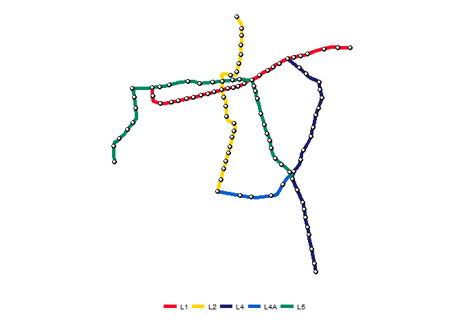

# 
Joshua Kunst  


Read data


```r
# http://www.dtpm.gob.cl/index.php/2013-04-29-20-33-57/matrices-de-viaje
zipfile <- "gtfs.zip"

if (!file.exists(zipfile)) {
  
  download.file("http://datos.gob.cl/dataset/8583ae05-d62f-42d7-a56d-4f865711b65a/resource/dc31a5c7-e717-4b9d-a9a6-93b4d4d2aaca/download/gtfsv17.zip",
                zipfile, mode = "wb")
}
  
fls <- unzip(zipfile, list = TRUE)

for (fl in fls$Name) {
  
  dfname <- str_c("df", str_replace(fl, "\\.txt", ""))
  assign(dfname, read_csv(unz(zipfile, fl)))
  
}

rm(fls, fl, dfname, zipfile)
# fix
names(dfroutes)[1] <- "route_id"
names(dfstops)[1] <- "stop_id"

routesMetro <- dfroutes %>%
  filter(agency_id == "M") %>% 
  mutate(route_id = str_replace(route_id, "_.*", ""),
         route_color = str_c("#", route_color),
         route_text_color = str_c("#", route_text_color)) %>% 
  select(route_id, route_long_name, route_color, route_text_color, route_url)

metrocols <- setNames(routesMetro$route_color, routesMetro$route_id)

shapesMetro <- dfshapes %>% 
  filter(str_detect(shape_id, "^L"), str_detect(shape_id, "-R_")) %>% 
  mutate(shape_id = str_replace(shape_id, "-R.*", "")) %>%
  arrange(shape_id, shape_pt_sequence)

stropsMetro <- dfstops %>% 
  filter(!is.na(stop_url))

ggplot() + 
  geom_path(data = shapesMetro, aes(shape_pt_lon, shape_pt_lat, group = shape_id, color = shape_id), size = 2) + 
  geom_point(data = stropsMetro, aes(stop_lon, stop_lat), color = "black", size = 2) + 
  geom_point(data = stropsMetro, aes(stop_lon, stop_lat), color = "white", size = 1) +
  scale_color_manual(NULL, values = metrocols) + 
  coord_equal() + 
  ggthemes::theme_map() + theme(legend.position = "bottom",  legend.key = element_blank())
```



```r
hc <- highchart(width = 400, height = 500) %>%
  hc_chart(type = "scatter") %>% 
  hc_colors(as.vector(metrocols)) %>% 
  hc_plotOptions(
    scatter = list(
      marker = list(enabled = FALSE),
      enableMouseTracking = FALSE
      )
  ) %>% 
  hc_add_theme(hc_theme_null())

for (route in unique(routesMetro$route_id)) {
  ds <- shapesMetro %>% 
    filter(shape_id == route) %>%
    select(shape_pt_lon, shape_pt_lat) %>% 
    list.parse2()
  hc <- hc %>%
    hc_add_serie(data = ds, type = "scatter", lineWidth = 3, name = route)
}

dsstops <- stropsMetro %>% 
  select(x = stop_lon, y = stop_lat, url = stop_url, name = stop_name) %>% 
  list.parse3()

hc <- hc %>% 
  hc_add_serie(data = dsstops, name = "Stations",
               enableMouseTracking = TRUE,
               marker = list(
                 enabled = TRUE,
                 fillColor = "white",
                 lineWidth = 1,
                 radius = 3,
                 lineColor = "#545454",
                 states = list(
                   hover = list(
                     fillColor = "white",
                     lineColor = "#545454"
                     )
                   )
                 )
               )
               
hc
```

<!--html_preserve--><div id="htmlwidget-2934" style="width:400px;height:500px;" class="highchart html-widget"></div>
<script type="application/json" data-for="htmlwidget-2934">{"x":{"hc_opts":{"title":{"text":null},"credits":{"enabled":false},"exporting":{"enabled":false},"plotOptions":{"series":{"turboThreshold":0},"scatter":{"marker":{"enabled":false},"enableMouseTracking":false}},"chart":{"type":"scatter"},"colors":["#FA0727","#FFD400","#1A1D6A","#0A5FCA","#008A63"],"series":[{"data":[[-70.545172,-33.407905],[-70.550184,-33.408306],[-70.553292,-33.408406],[-70.556149,-33.407855],[-70.558905,-33.407554],[-70.561662,-33.407454],[-70.56522,-33.408306],[-70.568729,-33.409208],[-70.570333,-33.409609],[-70.574543,-33.410912],[-70.578703,-33.412115],[-70.581058,-33.412867],[-70.583264,-33.413769],[-70.584366,-33.41432],[-70.586371,-33.414771],[-70.589479,-33.415323],[-70.591584,-33.415874],[-70.595694,-33.416576],[-70.598651,-33.417327],[-70.601407,-33.418179],[-70.605818,-33.419884],[-70.608574,-33.422139],[-70.610579,-33.422891],[-70.612484,-33.423592],[-70.614288,-33.425447],[-70.616293,-33.427151],[-70.6192,-33.428304],[-70.621957,-33.429757],[-70.624112,-33.431311],[-70.626518,-33.433165],[-70.62742,-33.434018],[-70.629575,-33.435321],[-70.633534,-33.436975],[-70.635188,-33.437175],[-70.636642,-33.437626],[-70.638496,-33.438829],[-70.640551,-33.440232],[-70.641754,-33.441135],[-70.643208,-33.442087],[-70.645714,-33.442638],[-70.647318,-33.443139],[-70.650425,-33.443791],[-70.654836,-33.444844],[-70.656289,-33.445245],[-70.660299,-33.446097],[-70.663757,-33.446999],[-70.667566,-33.447951],[-70.668669,-33.448101],[-70.670523,-33.448703],[-70.67318,-33.449404],[-70.674433,-33.449655],[-70.676588,-33.450257],[-70.679144,-33.450908],[-70.680698,-33.45156],[-70.682552,-33.452011],[-70.686161,-33.452913],[-70.687965,-33.453264],[-70.692476,-33.454066],[-70.695784,-33.455018],[-70.699693,-33.45602],[-70.701147,-33.456271],[-70.705958,-33.457173],[-70.711021,-33.458426],[-70.715782,-33.457975],[-70.721646,-33.456221],[-70.722448,-33.454567],[-70.722749,-33.45156],[-70.72315,-33.448402],[-70.7233,-33.444192]],"type":"scatter","lineWidth":3,"name":"L1"},{"data":[[-70.664305,-33.537459],[-70.662434,-33.530153],[-70.661543,-33.526499],[-70.65985,-33.520975],[-70.65887,-33.517143],[-70.657444,-33.512421],[-70.656999,-33.510104],[-70.655662,-33.505917],[-70.654771,-33.502441],[-70.653702,-33.499323],[-70.653167,-33.497274],[-70.65192,-33.492997],[-70.651029,-33.488809],[-70.649514,-33.482661],[-70.648267,-33.479988],[-70.649603,-33.476156],[-70.652811,-33.474909],[-70.654593,-33.47375],[-70.656108,-33.471434],[-70.656464,-33.469919],[-70.656553,-33.46386],[-70.65691,-33.460385],[-70.656732,-33.457623],[-70.657177,-33.455841],[-70.658157,-33.454237],[-70.658603,-33.4529],[-70.659583,-33.450138],[-70.660207,-33.447732],[-70.660474,-33.446128],[-70.66083,-33.44399],[-70.660117,-33.441673],[-70.65985,-33.439624],[-70.65985,-33.438109],[-70.660296,-33.435347],[-70.660652,-33.432852],[-70.659583,-33.431516],[-70.656732,-33.431516],[-70.652633,-33.432674],[-70.64996,-33.432941],[-70.64791,-33.43205],[-70.647108,-33.429644],[-70.646128,-33.426259],[-70.645415,-33.424209],[-70.64497,-33.422427],[-70.644435,-33.420823],[-70.643812,-33.418507],[-70.643791,-33.417228],[-70.643603,-33.41407],[-70.643377,-33.409409],[-70.643227,-33.405688],[-70.642926,-33.401741],[-70.642738,-33.396816],[-70.642588,-33.392907],[-70.642475,-33.390952],[-70.642325,-33.388847],[-70.64255,-33.387546],[-70.643142,-33.385882],[-70.646911,-33.380389]],"type":"scatter","lineWidth":3,"name":"L2"},{"data":[[-70.575997,-33.609465],[-70.57671,-33.605188],[-70.577155,-33.602069],[-70.579026,-33.592981],[-70.579828,-33.589239],[-70.581878,-33.579081],[-70.582412,-33.576497],[-70.583571,-33.569369],[-70.584996,-33.562686],[-70.585264,-33.560637],[-70.586155,-33.556181],[-70.5866,-33.55333],[-70.587135,-33.549944],[-70.587313,-33.548429],[-70.587669,-33.546915],[-70.592748,-33.535777],[-70.596758,-33.526154],[-70.596134,-33.519471],[-70.593907,-33.516798],[-70.591055,-33.513501],[-70.590164,-33.510828],[-70.589541,-33.50869],[-70.588917,-33.503967],[-70.587046,-33.500047],[-70.584105,-33.495324],[-70.58063,-33.4898],[-70.580274,-33.487929],[-70.579472,-33.484186],[-70.578937,-33.481335],[-70.57867,-33.479731],[-70.577512,-33.47492],[-70.576175,-33.468771],[-70.57475,-33.464762],[-70.573858,-33.462445],[-70.572255,-33.458792],[-70.571274,-33.455406],[-70.57074,-33.453268],[-70.571274,-33.449614],[-70.572076,-33.445961],[-70.572878,-33.440437],[-70.573324,-33.438209],[-70.577779,-33.436427],[-70.581343,-33.434734],[-70.583482,-33.433309],[-70.58464,-33.431437],[-70.591144,-33.426091],[-70.596936,-33.421903],[-70.60148,-33.418161]],"type":"scatter","lineWidth":3,"name":"L4"},{"data":[[-70.664368,-33.537381],[-70.654744,-33.539431],[-70.643696,-33.541213],[-70.636835,-33.542193],[-70.634162,-33.542549],[-70.629083,-33.543084],[-70.619994,-33.541926],[-70.616074,-33.541124],[-70.612866,-33.540767],[-70.610817,-33.539609],[-70.605471,-33.531055],[-70.602085,-33.525709],[-70.600124,-33.523927],[-70.598075,-33.522501],[-70.596026,-33.519561]],"type":"scatter","lineWidth":3,"name":"L4A"},{"data":[[-70.596703,-33.526387],[-70.598373,-33.522644],[-70.59971,-33.519704],[-70.60118,-33.517833],[-70.602584,-33.516095],[-70.606593,-33.512888],[-70.61067,-33.509613],[-70.612674,-33.507809],[-70.614479,-33.505269],[-70.616016,-33.498252],[-70.617018,-33.493842],[-70.61762,-33.49157],[-70.618555,-33.487092],[-70.619624,-33.485555],[-70.620694,-33.483484],[-70.621696,-33.479674],[-70.622298,-33.477469],[-70.623567,-33.472591],[-70.625171,-33.467111],[-70.62751,-33.458691],[-70.628847,-33.453679],[-70.629849,-33.449669],[-70.63045,-33.447063],[-70.631386,-33.443788],[-70.63172,-33.442786],[-70.632589,-33.43891],[-70.633742,-33.437097],[-70.644518,-33.436596],[-70.680404,-33.440355],[-70.685316,-33.438751],[-70.690879,-33.43825],[-70.697996,-33.439052],[-70.707318,-33.441458],[-70.71203,-33.442661],[-70.723357,-33.444214],[-70.726615,-33.444465],[-70.740799,-33.444715],[-70.740649,-33.445718],[-70.739596,-33.44647],[-70.739496,-33.447121],[-70.738995,-33.452634],[-70.737942,-33.462759],[-70.73729,-33.467921],[-70.73729,-33.470628],[-70.73699,-33.47168],[-70.745109,-33.481855],[-70.747916,-33.485614],[-70.752878,-33.489974],[-70.754682,-33.491929],[-70.757038,-33.493683],[-70.757639,-33.49654],[-70.757339,-33.504008],[-70.757288,-33.510473]],"type":"scatter","lineWidth":3,"name":"L5"},{"data":[{"x":-70.617531,"y":-33.491585,"url":"http://www.metro.cl/estacion/camino-agricola","name":"Camino Agrícola"},{"x":-70.692436,"y":-33.454113,"url":"http://www.metro.cl/estacion/san-alberto-hurtado","name":"San Alberto Hurtado"},{"x":-70.589453,"y":-33.415325,"url":"http://www.metro.cl/estacion/alcantara","name":"Alcántara"},{"x":-70.659823,"y":-33.438254,"url":"http://www.metro.cl/estacion/santa-ana-l2","name":"Santa Ana"},{"x":-70.646821,"y":-33.380429,"url":"http://www.metro.cl/estacion/vespucio-norte","name":"Vespucio Norte"},{"x":-70.633527,"y":-33.437036,"url":"http://www.metro.cl/estacion/baquedano-l1","name":"Baquedano"},{"x":-70.644524,"y":-33.436611,"url":"http://www.metro.cl/estacion/bellas-artes","name":"Bellas Artes"},{"x":-70.584641,"y":-33.431484,"url":"http://www.metro.cl/estacion/francisco-bilbao","name":"Francisco Bilbao"},{"x":-70.707321,"y":-33.441505,"url":"http://www.metro.cl/estacion/blanqueado","name":"Blanqueado"},{"x":-70.739017,"y":-33.452669,"url":"http://www.metro.cl/estacion/barrancas","name":"Barrancas"},{"x":-70.757567,"y":-33.496645,"url":"http://www.metro.cl/estacion/santiago-bueras","name":"Santiago Bueras"},{"x":-70.6525,"y":-33.432716,"url":"http://www.metro.cl/estacion/cal-y-canto","name":"Cal y Canto"},{"x":-70.644974,"y":-33.422554,"url":"http://www.metro.cl/estacion/cerro-blanco","name":"Cerro Blanco"},{"x":-70.643562,"y":-33.414074,"url":"http://www.metro.cl/estacion/cementerios","name":"Cementerios"},{"x":-70.650391,"y":-33.443809,"url":"http://www.metro.cl/estacion/universidad-de-chile","name":"Universidad de Chile"},{"x":-70.65686,"y":-33.510162,"url":"http://www.metro.cl/estacion/ciudad-del-nino","name":"Ciudad del Niño"},{"x":-70.590973,"y":-33.426224,"url":"http://www.metro.cl/estacion/cristobal-colon","name":"Cristóbal Colón"},{"x":-70.619652,"y":-33.485641,"url":"http://www.metro.cl/estacion/carlos-valdovinos","name":"Carlos Valdovinos"},{"x":-70.65464,"y":-33.502556,"url":"http://www.metro.cl/estacion/departamental","name":"Departamental"},{"x":-70.642677,"y":-33.396801,"url":"http://www.metro.cl/estacion/dorsal","name":"Dorsal"},{"x":-70.752848,"y":-33.489991,"url":"http://www.metro.cl/estacion/del-sol","name":"Del Sol"},{"x":-70.583611,"y":-33.569405,"url":"http://www.metro.cl/estacion/el-parron","name":"Elisa Correa"},{"x":-70.699669,"y":-33.456047,"url":"http://www.metro.cl/estacion/ecuador","name":"Ecuador"},{"x":-70.570732,"y":-33.453278,"url":"http://www.metro.cl/estacion/plaza-egana","name":"Plaza Egaña"},{"x":-70.643135,"y":-33.405731,"url":"http://www.metro.cl/estacion/einstein","name":"Einstein"},{"x":-70.679169,"y":-33.45097,"url":"http://www.metro.cl/estacion/estacion-central","name":"Estación Central"},{"x":-70.58325,"y":-33.413752,"url":"http://www.metro.cl/estacion/escuela-militar","name":"Escuela Militar"},{"x":-70.661423,"y":-33.526531,"url":"http://www.metro.cl/estacion/el-llano","name":"El Parrón"},{"x":-70.649632,"y":-33.476217,"url":"http://www.metro.cl/estacion/franklin","name":"Franklin"},{"x":-70.57309,"y":-33.439163,"url":"http://www.metro.cl/estacion/principe-de-gales","name":"Príncipe de Gales"},{"x":-70.690838,"y":-33.438262,"url":"http://www.metro.cl/estacion/gruta-de-lourdes","name":"Gruta de Lourdes"},{"x":-70.595688,"y":-33.416611,"url":"http://www.metro.cl/estacion/el-golf","name":"El Golf"},{"x":-70.556213,"y":-33.407904,"url":"http://www.metro.cl/estacion/hernando-magallanes","name":"Hernando de Magallanes"},{"x":-70.582375,"y":-33.576462,"url":"http://www.metro.cl/estacion/hospital-sotero-del-rio","name":"Hospital Sótero del Río"},{"x":-70.628773,"y":-33.453766,"url":"http://www.metro.cl/estacion/irarrazaval","name":"Irarrázaval"},{"x":-70.586562,"y":-33.553356,"url":"http://www.metro.cl/estacion/san-jose-de-la-estrella","name":"San José de la Estrella"},{"x":-70.605499,"y":-33.531105,"url":"http://www.metro.cl/estacion/santa-julia","name":"Santa Julia"},{"x":-70.673203,"y":-33.449467,"url":"http://www.metro.cl/estacion/union-latinoamericana","name":"Unión Latino Americana"},{"x":-70.664251,"y":-33.537443,"url":"http://www.metro.cl/estacion/la-cisterna-l2","name":"La Cisterna"},{"x":-70.545109,"y":-33.407895,"url":"http://www.metro.cl/estacion/los-dominicos","name":"Los Dominicos"},{"x":-70.60859,"y":-33.422164,"url":"http://www.metro.cl/estacion/los-leones","name":"Los Leones"},{"x":-70.599652,"y":-33.519822,"url":"http://www.metro.cl/estacion/bellavista-de-la-florida","name":"Bellavista de la Florida"},{"x":-70.615967,"y":-33.541138,"url":"http://www.metro.cl/estacion/la-granja","name":"La Granja"},{"x":-70.66036,"y":-33.446108,"url":"http://www.metro.cl/estacion/los-heroes-l1","name":"Los Héroes"},{"x":-70.649445,"y":-33.482703,"url":"http://www.metro.cl/estacion/elisa-correa","name":"El Llano"},{"x":-70.654811,"y":-33.444857,"url":"http://www.metro.cl/estacion/la-moneda","name":"La Moneda"},{"x":-70.658707,"y":-33.5172,"url":"http://www.metro.cl/estacion/lo-ovalle","name":"Lo Ovalle"},{"x":-70.578712,"y":-33.479797,"url":"http://www.metro.cl/estacion/los-presidentes","name":"Los Presidentes"},{"x":-70.585289,"y":-33.560627,"url":"http://www.metro.cl/estacion/los-quillayes","name":"Los Quillayes"},{"x":-70.705963,"y":-33.457157,"url":"http://www.metro.cl/estacion/las-rejas","name":"Las Rejas"},{"x":-70.738066,"y":-33.462563,"url":"http://www.metro.cl/estacion/laguna-sur","name":"Laguna Sur"},{"x":-70.587074,"y":-33.500034,"url":"http://www.metro.cl/estacion/las-torres","name":"Las Torres"},{"x":-70.653107,"y":-33.497272,"url":"http://www.metro.cl/estacion/lo-vial","name":"Lo Vial"},{"x":-70.606583,"y":-33.512936,"url":"http://www.metro.cl/estacion/mirador","name":"Mirador"},{"x":-70.589485,"y":-33.508785,"url":"http://www.metro.cl/estacion/macul","name":"Macul"},{"x":-70.577194,"y":-33.602119,"url":"http://www.metro.cl/estacion/las-mercedes","name":"Las Mercedes"},{"x":-70.619209,"y":-33.428341,"url":"http://www.metro.cl/estacion/manuel-montt","name":"Manuel Montt"},{"x":-70.568734,"y":-33.409251,"url":"http://www.metro.cl/estacion/manquehue","name":"Manquehue"},{"x":-70.745165,"y":-33.481816,"url":"http://www.metro.cl/estacion/monte-tabor","name":"Monte Tabor"},{"x":-70.722687,"y":-33.451546,"url":"http://www.metro.cl/estacion/neptuno","name":"Neptuno"},{"x":-70.625186,"y":-33.46719,"url":"http://www.metro.cl/estacion/nuble","name":"Ñuble"},{"x":-70.573792,"y":-33.462456,"url":"http://www.metro.cl/estacion/los-orientales","name":"Los Orientales"},{"x":-70.740043,"y":-33.475394,"url":"http://www.metro.cl/estacion/las-parcelas","name":"Las Parcelas"},{"x":-70.63163,"y":-33.442787,"url":"http://www.metro.cl/estacion/parque-bustamante","name":"Parque Bustamante"},{"x":-70.612663,"y":-33.507812,"url":"http://www.metro.cl/estacion/pedrero","name":"Pedrero"},{"x":-70.579704,"y":-33.589287,"url":"http://www.metro.cl/estacion/protectora-de-la-infancia","name":"Protectora de la Infancia"},{"x":-70.715775,"y":-33.457981,"url":"http://www.metro.cl/estacion/pajaritos","name":"Pajaritos"},{"x":-70.75723,"y":-33.510522,"url":"http://www.metro.cl/estacion/plaza-maipu","name":"Plaza de Maipú"},{"x":-70.575905,"y":-33.609547,"url":"http://www.metro.cl/estacion/plaza-puente-alto","name":"Plaza de Puente Alto"},{"x":-70.656868,"y":-33.460464,"url":"http://www.metro.cl/estacion/parque-ohiggins","name":"Parque O`higgins"},{"x":-70.716412,"y":-33.443298,"url":"http://www.metro.cl/estacion/lo-prado","name":"Lo Prado"},{"x":-70.647064,"y":-33.42963,"url":"http://www.metro.cl/estacion/patronato","name":"Patronato"},{"x":-70.740722,"y":-33.44483,"url":"http://www.metro.cl/estacion/pudahuel","name":"Pudahuel"},{"x":-70.614273,"y":-33.425465,"url":"http://www.metro.cl/estacion/pedro-de-valdivia","name":"Pedro de Valdivia"},{"x":-70.650551,"y":-33.43726,"url":"http://www.metro.cl/estacion/plaza-de-armas","name":"Plaza de Armas"},{"x":-70.680357,"y":-33.440282,"url":"http://www.metro.cl/estacion/quinta-normal","name":"Quinta Normal"},{"x":-70.622314,"y":-33.477516,"url":"http://www.metro.cl/estacion/rodrigo-de-araya","name":"Rodrigo de Araya"},{"x":-70.668427,"y":-33.439098,"url":"http://www.metro.cl/estacion/cumming","name":"Cumming"},{"x":-70.576202,"y":-33.468819,"url":"http://www.metro.cl/estacion/grecia","name":"Grecia"},{"x":-70.592773,"y":-33.535854,"url":"http://www.metro.cl/estacion/rojas-magallanes","name":"Rojas Magallanes"},{"x":-70.643671,"y":-33.541194,"url":"http://www.metro.cl/estacion/san-ramon","name":"San Ramón"},{"x":-70.656331,"y":-33.470043,"url":"http://www.metro.cl/estacion/rondizzoni","name":"Rondizzoni"},{"x":-70.667564,"y":-33.447952,"url":"http://www.metro.cl/estacion/republica","name":"República"},{"x":-70.580231,"y":-33.487999,"url":"http://www.metro.cl/estacion/quilin","name":"Quilín"},{"x":-70.626585,"y":-33.433107,"url":"http://www.metro.cl/estacion/salvador","name":"Salvador"},{"x":-70.572037,"y":-33.445904,"url":"http://www.metro.cl/estacion/simon-bolivar","name":"Simón Bolivar"},{"x":-70.630402,"y":-33.447102,"url":"http://www.metro.cl/estacion/santa-isabel","name":"Santa Isabel"},{"x":-70.61602,"y":-33.498318,"url":"http://www.metro.cl/estacion/san-joaquin","name":"San Joaquín"},{"x":-70.64572,"y":-33.442691,"url":"http://www.metro.cl/estacion/santa-lucia","name":"Santa Lucía"},{"x":-70.651178,"y":-33.488798,"url":"http://www.metro.cl/estacion/san-miguel","name":"San Miguel"},{"x":-70.723315,"y":-33.444226,"url":"http://www.metro.cl/estacion/san-pablo-l1","name":"San Pablo"},{"x":-70.634125,"y":-33.542511,"url":"http://www.metro.cl/estacion/santa-rosa","name":"Santa Rosa"},{"x":-70.601353,"y":-33.418145,"url":"http://www.metro.cl/estacion/tobalaba-l1","name":"Tobalaba"},{"x":-70.658577,"y":-33.452965,"url":"http://www.metro.cl/estacion/toesca","name":"Toesca"},{"x":-70.587654,"y":-33.54702,"url":"http://www.metro.cl/estacion/trinidad","name":"Trinidad"},{"x":-70.640549,"y":-33.440216,"url":"http://www.metro.cl/estacion/universidad-catolica","name":"Universidad Católica"},{"x":-70.68615,"y":-33.452896,"url":"http://www.metro.cl/estacion/universidad-de-santiago","name":"Universidad de Santiago"},{"x":-70.596756,"y":-33.526337,"url":"http://www.metro.cl/estacion/vicente-valdes-l4","name":"Vicente Valdés"},{"x":-70.596069,"y":-33.519642,"url":"http://www.metro.cl/estacion/vicuna-mackenna-l4","name":"Vicuña Mackenna"},{"x":-70.642441,"y":-33.390938,"url":"http://www.metro.cl/estacion/zapadores","name":"Zapadores"}],"name":"Stations","enableMouseTracking":true,"marker":{"enabled":true,"fillColor":"white","lineWidth":1,"radius":3,"lineColor":"#545454","states":{"hover":{"fillColor":"white","lineColor":"#545454"}}}}]},"theme":{"chart":{"backgroundColor":"transparent"},"plotOptions":{"line":{"marker":{"enabled":false}}},"legend":{"enabled":true,"align":"right","verticalAlign":"bottom"},"credits":{"enabled":false},"xAxis":{"visible":false},"yAxis":{"visible":false}},"conf_opts":{"global":{"Date":null,"VMLRadialGradientURL":"http =//code.highcharts.com/list(version)/gfx/vml-radial-gradient.png","canvasToolsURL":"http =//code.highcharts.com/list(version)/modules/canvas-tools.js","getTimezoneOffset":null,"timezoneOffset":0,"useUTC":true},"lang":{"contextButtonTitle":"Chart context menu","decimalPoint":".","downloadJPEG":"Download JPEG image","downloadPDF":"Download PDF document","downloadPNG":"Download PNG image","downloadSVG":"Download SVG vector image","drillUpText":"Back to {series.name}","invalidDate":null,"loading":"Loading...","months":["January","February","March","April","May","June","July","August","September","October","November","December"],"noData":"No data to display","numericSymbols":["k","M","G","T","P","E"],"printChart":"Print chart","resetZoom":"Reset zoom","resetZoomTitle":"Reset zoom level 1:1","shortMonths":["Jan","Feb","Mar","Apr","May","Jun","Jul","Aug","Sep","Oct","Nov","Dec"],"thousandsSep":" ","weekdays":["Sunday","Monday","Tuesday","Wednesday","Thursday","Friday","Saturday"]}},"type":"chart","fonts":[],"debug":false},"evals":[],"jsHooks":[]}</script><!--/html_preserve-->


---
title: "readme.R"
author: "jkunst"
date: "Wed Apr 06 15:25:25 2016"
---
