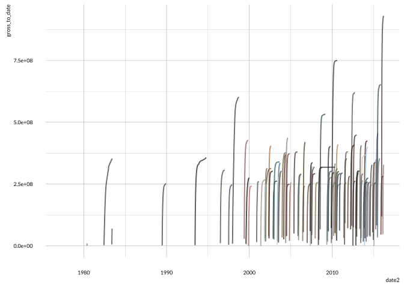
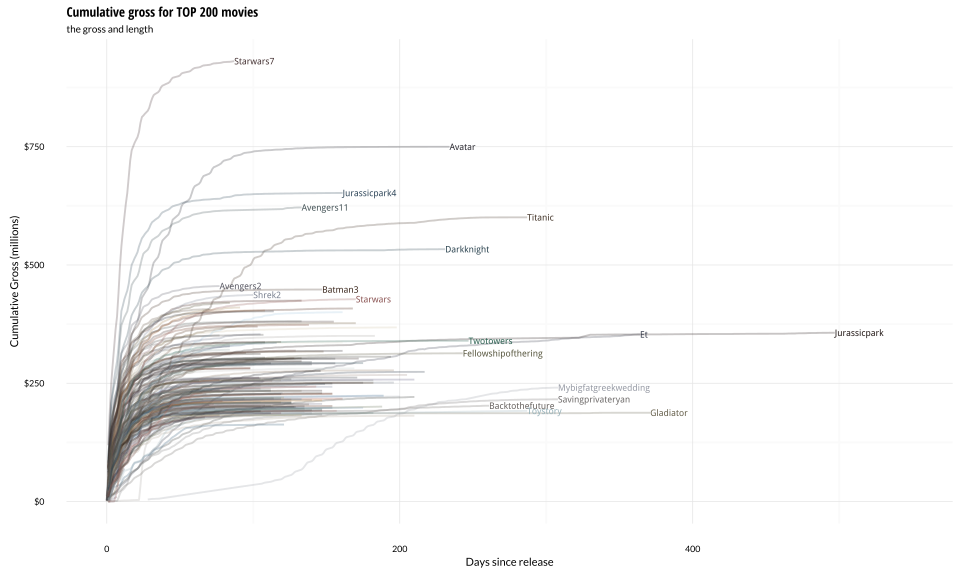
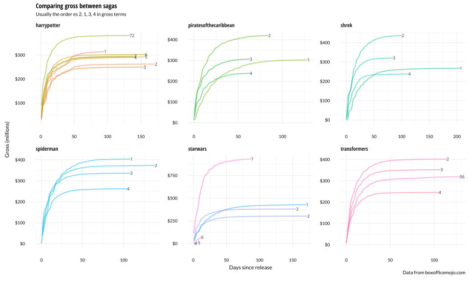
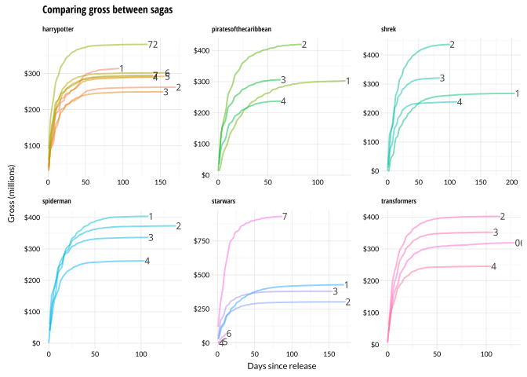

# 
Joshua Kunst  


```r
url <- "http://www.boxofficemojo.com/alltime/domestic.htm"

urls <- paste0(url, sprintf("?page=%s&p=.htm", 1:1))

dfmovie <- map_df(urls, function(x){
  # x <- sample(size = 1, urls)
  urlmovie <- read_html(x) %>% 
    html_nodes("table table tr a") %>%
    html_attr("href") %>% 
    .[str_detect(., "movies")]
  
  read_html(x) %>% 
    html_nodes("table table") %>% 
    html_table(fill = TRUE) %>% 
    .[[4]] %>% 
    tbl_df() %>% 
    .[-1, ] %>% 
    setNames(c("rank", "title", "studio", "gross", "year")) %>% 
    mutate(url_movie = urlmovie)
  
}) 

dfmovie <- dfmovie %>% 
  mutate(year = str_extract(year, "\\d+"),
         year = as.numeric(year),
         have_release = str_detect(url_movie, "releases"),
         box_id = str_extract(url_movie, "id=.*"),
         box_id = str_replace_all(box_id, "^id=|\\.htm$", ""))


datatable(dfmovie)
```

<!--html_preserve--><div id="htmlwidget-4266" style="width:100%;height:auto;" class="datatables"></div>
<script type="application/json" data-for="htmlwidget-4266">{"x":{"data":[["1","2","3","4","5","6","7","8","9","10","11","12","13","14","15","16","17","18","19","20","21","22","23","24","25","26","27","28","29","30","31","32","33","34","35","36","37","38","39","40","41","42","43","44","45","46","47","48","49","50","51","52","53","54","55","56","57","58","59","60","61","62","63","64","65","66","67","68","69","70","71","72","73","74","75","76","77","78","79","80","81","82","83","84","85","86","87","88","89","90","91","92","93","94","95","96","97","98","99","100"],["1","2","3","4","5","6","7","8","9","10","11","12","13","14","15","16","17","18","19","20","21","22","23","24","25","26","27","28","29","30","31","32","33","34","35","36","37","38","39","40","41","42","43","44","45","46","47","48","49","50","51","52","53","54","55","56","57","58","59","60","61","62","63","64","65","66","67","68","69","70","71","72","73","74","75","76","77","78","79","80","81","82","83","84","85","86","87","88","89","90","91","92","93","94","95","96","97","98","99","100"],["Star Wars: The Force Awakens","Avatar","Titanic","Jurassic World","Marvel's The Avengers","The Dark Knight","Star Wars: Episode I - The Phantom Menace","Star Wars","Avengers: Age of Ultron","The Dark Knight Rises","Shrek 2","E.T.: The Extra-Terrestrial","The Hunger Games: Catching Fire","Pirates of the Caribbean: Dead Man's Chest","The Lion King","Toy Story 3","Iron Man 3","The Hunger Games","Spider-Man","Jurassic Park","Transformers: Revenge of the Fallen","Frozen","Harry Potter and the Deathly Hallows Part 2","Finding Nemo","Star Wars: Episode III - Revenge of the Sith","The Lord of the Rings: The Return of the King","Spider-Man 2","The Passion of the Christ","Despicable Me 2","Inside Out","Furious 7","Transformers: Dark of the Moon","American Sniper","The Lord of the Rings: The Two Towers","The Hunger Games: Mockingjay - Part 1","Spider-Man 3","Minions","Alice in Wonderland (2010)","Guardians of the Galaxy","Forrest Gump","Deadpool","Shrek the Third","Transformers","Iron Man","Harry Potter and the Sorcerer's Stone","Indiana Jones and the Kingdom of the Crystal Skull","The Lord of the Rings: The Fellowship of the Ring","Iron Man 2","Star Wars: Episode II - Attack of the Clones","Pirates of the Caribbean: At World's End","Return of the Jedi","Independence Day","Pirates of the Caribbean: The Curse of the Black Pearl","Skyfall","The Hobbit: An Unexpected Journey","Harry Potter and the Half-Blood Prince","The Twilight Saga: Eclipse","The Twilight Saga: New Moon","Harry Potter and the Deathly Hallows Part 1","The Sixth Sense","Up","Inception","The Twilight Saga: Breaking Dawn Part 2","Harry Potter and the Order of the Phoenix","The Chronicles of Narnia: The Lion, the Witch and the Wardrobe","Man of Steel","The Empire Strikes Back","Harry Potter and the Goblet of Fire","Monsters, Inc.","Home Alone","The Hunger Games: Mockingjay - Part 2","The Matrix Reloaded","The Twilight Saga: Breaking Dawn Part 1","Meet the Fockers","The Hangover","Gravity","Monsters University","Shrek","The Amazing Spider-Man","Harry Potter and the Chamber of Secrets","The Incredibles","How the Grinch Stole Christmas","Jaws","Captain America: The Winter Soldier","The Hobbit: The Desolation of Smaug","The LEGO Movie","Star Trek","I Am Legend","The Blind Side","The Hobbit: The Battle of the Five Armies","The Hangover Part II","Despicable Me","Batman","Night at the Museum","Men in Black","Harry Potter and the Prisoner of Azkaban","Raiders of the Lost Ark","Toy Story 2","Transformers: Age of Extinction","Cars"],["BV","Fox","Par.","Uni.","BV","WB","Fox","Fox","BV","WB","DW","Uni.","LGF","BV","BV","BV","BV","LGF","Sony","Uni.","P/DW","BV","WB","BV","Fox","NL","Sony","NM","Uni.","BV","Uni.","P/DW","WB","NL","LGF","Sony","Uni.","BV","BV","Par.","Fox","P/DW","P/DW","Par.","WB","Par.","NL","Par.","Fox","BV","Fox","Fox","BV","Sony","WB (NL)","WB","Sum.","Sum.","WB","BV","BV","WB","LG/S","WB","BV","WB","Fox","WB","BV","Fox","LGF","WB","Sum.","Uni.","WB","WB","BV","DW","Sony","WB","BV","Uni.","Uni.","BV","WB (NL)","WB","Par.","WB","WB","WB (NL)","WB","Uni.","WB","Fox","Sony","WB","Par.","BV","Par.","BV"],["$930,757,012","$760,507,625","$658,672,302","$652,270,625","$623,357,910","$534,858,444","$474,544,677","$460,998,007","$459,005,868","$448,139,099","$441,226,247","$435,110,554","$424,668,047","$423,315,812","$422,783,777","$415,004,880","$409,013,994","$408,010,692","$403,706,375","$402,453,882","$402,111,870","$400,738,009","$381,011,219","$380,843,261","$380,270,577","$377,845,905","$373,585,825","$370,782,930","$368,061,265","$356,461,711","$353,007,020","$352,390,543","$350,126,372","$342,551,365","$337,135,885","$336,530,303","$336,045,770","$334,191,110","$333,176,600","$330,252,182","$328,219,729","$322,719,944","$319,246,193","$318,412,101","$317,575,550","$317,101,119","$315,544,750","$312,433,331","$310,676,740","$309,420,425","$309,306,177","$306,169,268","$305,413,918","$304,360,277","$303,003,568","$301,959,197","$300,531,751","$296,623,634","$295,983,305","$293,506,292","$293,004,164","$292,576,195","$292,324,737","$292,004,738","$291,710,957","$291,045,518","$290,475,067","$290,013,036","$289,916,256","$285,761,243","$281,723,902","$281,576,461","$281,287,133","$279,261,160","$277,322,503","$274,092,705","$268,492,764","$267,665,011","$262,030,663","$261,988,482","$261,441,092","$260,044,825","$260,000,000","$259,766,572","$258,366,855","$257,760,692","$257,730,019","$256,393,010","$255,959,475","$255,119,788","$254,464,305","$251,513,985","$251,188,924","$250,863,268","$250,690,539","$249,541,069","$248,159,971","$245,852,179","$245,439,076","$244,082,982"],[2015,2009,1997,2015,2012,2008,1999,1977,2015,2012,2004,1982,2013,2006,1994,2010,2013,2012,2002,1993,2009,2013,2011,2003,2005,2003,2004,2004,2013,2015,2015,2011,2014,2002,2014,2007,2015,2010,2014,1994,2016,2007,2007,2008,2001,2008,2001,2010,2002,2007,1983,1996,2003,2012,2012,2009,2010,2009,2010,1999,2009,2010,2012,2007,2005,2013,1980,2005,2001,1990,2015,2003,2011,2004,2009,2013,2013,2001,2012,2002,2004,2000,1975,2014,2013,2014,2009,2007,2009,2014,2011,2010,1989,2006,1997,2004,1981,1999,2014,2006],["/movies/?id=starwars7.htm","/movies/?page=releases&amp;id=avatar.htm","/movies/?page=releases&amp;id=titanic.htm","/movies/?id=jurassicpark4.htm","/movies/?id=avengers11.htm","/movies/?page=releases&amp;id=darkknight.htm","/movies/?page=releases&amp;id=starwars.htm","/movies/?page=releases&amp;id=starwars4.htm","/movies/?id=avengers2.htm","/movies/?id=batman3.htm","/movies/?id=shrek2.htm","/movies/?page=releases&amp;id=et.htm","/movies/?id=catchingfire.htm","/movies/?id=piratesofthecaribbean2.htm","/movies/?page=releases&amp;id=lionking.htm","/movies/?id=toystory3.htm","/movies/?id=ironman3.htm","/movies/?id=hungergames.htm","/movies/?id=spiderman.htm","/movies/?page=releases&amp;id=jurassicpark.htm","/movies/?id=transformers2.htm","/movies/?id=frozen2013.htm","/movies/?id=harrypotter72.htm","/movies/?page=releases&amp;id=findingnemo.htm","/movies/?page=releases&amp;id=starwars3.htm","/movies/?page=releases&amp;id=returnoftheking.htm","/movies/?id=spiderman2.htm","/movies/?page=releases&amp;id=passionofthechrist.htm","/movies/?id=despicableme2.htm","/movies/?id=pixar2014.htm","/movies/?id=fast7.htm","/movies/?id=transformers3.htm","/movies/?id=americansniper.htm","/movies/?page=releases&amp;id=twotowers.htm","/movies/?id=hungergames3.htm","/movies/?id=spiderman3.htm","/movies/?id=minions.htm","/movies/?id=aliceinwonderland10.htm","/movies/?id=marvel2014a.htm","/movies/?page=releases&amp;id=forrestgump.htm","/movies/?id=deadpool2016.htm","/movies/?id=shrek3.htm","/movies/?id=transformers06.htm","/movies/?id=ironman.htm","/movies/?id=harrypotter.htm","/movies/?id=indianajones4.htm","/movies/?page=releases&amp;id=fellowshipofthering.htm","/movies/?id=ironman2.htm","/movies/?page=releases&amp;id=starwars2.htm","/movies/?id=piratesofthecaribbean3.htm","/movies/?page=releases&amp;id=starwars6.htm","/movies/?page=releases&amp;id=independenceday.htm","/movies/?id=piratesofthecaribbean.htm","/movies/?id=bond23.htm","/movies/?id=hobbit.htm","/movies/?id=harrypotter6.htm","/movies/?id=eclipse.htm","/movies/?id=newmoon.htm","/movies/?id=harrypotter7.htm","/movies/?id=sixthsense.htm","/movies/?id=up.htm","/movies/?id=inception.htm","/movies/?id=breakingdawn2.htm","/movies/?id=harrypotter5.htm","/movies/?id=narnia.htm","/movies/?id=superman2012.htm","/movies/?page=releases&amp;id=starwars5.htm","/movies/?id=harrypotter4.htm","/movies/?page=releases&amp;id=monstersinc.htm","/movies/?id=homealone.htm","/movies/?id=hungergames4.htm","/movies/?id=matrixreloaded.htm","/movies/?id=breakingdawn.htm","/movies/?id=meetthefockers.htm","/movies/?id=hangover.htm","/movies/?id=gravity.htm","/movies/?id=monstersinc2.htm","/movies/?id=shrek.htm","/movies/?id=spiderman4.htm","/movies/?id=harrypotter2.htm","/movies/?id=incredibles.htm","/movies/?id=grinch.htm","/movies/?id=jaws.htm","/movies/?id=marvel14b.htm","/movies/?id=hobbit2.htm","/movies/?id=lego.htm","/movies/?id=startrek11.htm","/movies/?id=iamlegend.htm","/movies/?id=blindside.htm","/movies/?id=hobbit3.htm","/movies/?id=hangover2.htm","/movies/?id=despicableme.htm","/movies/?id=batman.htm","/movies/?id=nightatthemuseum.htm","/movies/?id=meninblack.htm","/movies/?id=harrypotter3.htm","/movies/?page=releases&amp;id=raidersofthelostark.htm","/movies/?page=releases&amp;id=toystory2.htm","/movies/?id=transformers4.htm","/movies/?id=cars.htm"],[false,true,true,false,false,true,true,true,false,false,false,true,false,false,true,false,false,false,false,true,false,false,false,true,true,true,false,true,false,false,false,false,false,true,false,false,false,false,false,true,false,false,false,false,false,false,true,false,true,false,true,true,false,false,false,false,false,false,false,false,false,false,false,false,false,false,true,false,true,false,false,false,false,false,false,false,false,false,false,false,false,false,false,false,false,false,false,false,false,false,false,false,false,false,false,false,true,true,false,false],["starwars7","avatar","titanic","jurassicpark4","avengers11","darkknight","starwars","starwars4","avengers2","batman3","shrek2","et","catchingfire","piratesofthecaribbean2","lionking","toystory3","ironman3","hungergames","spiderman","jurassicpark","transformers2","frozen2013","harrypotter72","findingnemo","starwars3","returnoftheking","spiderman2","passionofthechrist","despicableme2","pixar2014","fast7","transformers3","americansniper","twotowers","hungergames3","spiderman3","minions","aliceinwonderland10","marvel2014a","forrestgump","deadpool2016","shrek3","transformers06","ironman","harrypotter","indianajones4","fellowshipofthering","ironman2","starwars2","piratesofthecaribbean3","starwars6","independenceday","piratesofthecaribbean","bond23","hobbit","harrypotter6","eclipse","newmoon","harrypotter7","sixthsense","up","inception","breakingdawn2","harrypotter5","narnia","superman2012","starwars5","harrypotter4","monstersinc","homealone","hungergames4","matrixreloaded","breakingdawn","meetthefockers","hangover","gravity","monstersinc2","shrek","spiderman4","harrypotter2","incredibles","grinch","jaws","marvel14b","hobbit2","lego","startrek11","iamlegend","blindside","hobbit3","hangover2","despicableme","batman","nightatthemuseum","meninblack","harrypotter3","raidersofthelostark","toystory2","transformers4","cars"]],"container":"<table class=\"display\">\n  <thead>\n    <tr>\n      <th> </th>\n      <th>rank</th>\n      <th>title</th>\n      <th>studio</th>\n      <th>gross</th>\n      <th>year</th>\n      <th>url_movie</th>\n      <th>have_release</th>\n      <th>box_id</th>\n    </tr>\n  </thead>\n</table>","options":{"columnDefs":[{"className":"dt-right","targets":5},{"orderable":false,"targets":0}],"order":[],"autoWidth":false,"orderClasses":false},"callback":null,"filter":"none"},"evals":[]}</script><!--/html_preserve-->

```r
dfmovie2 <- map_df(dfmovie$box_id, function(x){
  # x <- "starwars2"
  # x <- sample(dfmovie$box_id, size =1); 
  message(x)
  
  if (file.exists(sprintf("data/%s-p2.rds", x))) {
    dfm <- readRDS(sprintf("data/%s-p2.rds", x))
    return(dfm)
  }
  
  html <- sprintf("http://www.boxofficemojo.com/movies/?page=main&id=%s.htm", x) %>% 
    read_html()
  
  img_url <- html %>% 
    html_nodes("table table table img") %>% 
    .[[1]] %>% 
    html_attr("src")
  
  tmp <- tempfile(fileext = ".jpg")
  download.file(img_url, tmp, mode = "wb", quiet = TRUE)
  img <- jpeg::readJPEG(tmp)
  imgpltt <- image_palette(img, n = 1, choice = median)
  
  # par(mfrow = c(1, 2))
  # display_image(img)
  # scales::show_col(imgpltt)
  
  dfaux <- html %>% 
    html_nodes("table  table  table") %>% 
    .[[2]] %>% 
    html_table(fill = TRUE) %>% 
    .[-1, 1:2] %>% 
    tbl_df()

  dfm <- data_frame(
    box_id = x,
    distributor = str_replace(dfaux[2, 1], "Distributor: ", ""),
    genre = str_replace(dfaux[3, 1], "Genre: ", ""),
    mpaa_rating = str_replace(dfaux[4, 1], " MPAA Rating: ", ""),
    runtime = str_replace(dfaux[3, 2], " Runtime: ", ""),
    production_budget = str_extract(dfaux[4, 2], "\\d+"),
    img_url = img_url,
    img_main_color = imgpltt
  )
  
  saveRDS(dfm, file = sprintf("data/%s-p2.rds", x))
  
  dfm
    
})

dfmovie <- left_join(dfmovie, dfmovie2, by = "box_id")


dfgross <- map_df(dfmovie$box_id, function(x){
  # x <- sample(dfmovie$box_id, size =1)
  message(x)
  
  if (file.exists(sprintf("data/%s.rds", x))) {
    dfgr <- readRDS(sprintf("data/%s.rds", x))
    return(dfgr)
  }
    
  dfgr <- sprintf("http://www.boxofficemojo.com/movies/?page=daily&view=chart&id=%s.htm", x)  %>% 
    read_html() %>% 
    html_nodes("table table table") %>% 
    html_table(fill = TRUE) %>% 
    last() %>% 
    tbl_df()
  
  if (nrow(dfgr) == 1) {
    dfgr <- data_frame(box_id = x)
  } else {
    dfgr <- dfgr %>% 
      .[-1, ] %>% 
      setNames(c("day", "date", "rank", "gross", "pd", "na", "theaters_avg", "na2", "gross_to_date", "day_number")) %>% 
      mutate(box_id = x) %>% 
      filter(!is.na(day_number))
  }
  
  saveRDS(dfgr, file = sprintf("data/%s.rds", x))
  
  dfgr
  
})

try(Sys.setlocale("LC_TIME", "en_US.UTF-8"))
```

```
## [1] ""
```

```r
try(Sys.setlocale("LC_TIME", "English"))
```

```
## [1] "English_United States.1252"
```

```r
dfgross <- dfgross %>% 
  mutate(gross = as.numeric(str_replace_all(gross, "\\$|\\,", "")),
         gross_to_date = as.numeric(str_replace_all(gross_to_date, "\\$|\\,", "")),
         day_number = as.numeric(day_number),
         date2 = str_replace_all(date, "\\t|\\.", ""),
         date2 = as.Date(date2, "%b %d, %Y"),
         decade = year(date2)/100,
         movieserie = str_extract(box_id, "^[A-Za-z]+|\\d{2,3}"),
         serienumber = str_extract(box_id, "\\d$"),
         serienumber = ifelse(is.na(serienumber), 1, serienumber)) %>% 
  filter(!is.na(date))


save(dfgross, dfmovie, file = "data/data.RData")
```

## Plot


```r
cols <- setNames(dfmovie$img_main_color, dfmovie$box_id)

gg <- ggplot(dfgross) + 
  geom_line(aes(date2, gross_to_date, color = box_id),
            alpha = 0.75) + 
  scale_color_manual(values = cols) + 
  theme(legend.position = "none")

gg
```



```r
gg + xlim(as.Date(ymd(20100101)),
          as.Date(ymd(20160101)))
```



```r
movies <- dfgross %>% 
  distinct(movieserie, serienumber) %>% 
  count(movieserie) %>% 
  arrange(desc(n)) %>% 
  filter(n >= 4) %>% 
  .$movieserie


ggplot(dfgross %>% filter(str_detect(box_id, "harrypotter")),
       aes(date2, gross_to_date)) + 
  geom_line(aes(color = box_id)) +
  geom_dl(aes(label = box_id), method = "last.points") 
```



```r
ggplot(dfgross %>% filter(str_detect(box_id, "harrypotter")),
       aes(day_number, gross_to_date)) + 
  geom_line(aes(color = box_id)) +
  geom_dl(aes(label = box_id), method = "last.points") + 
  theme_minimal() + 
  theme(legend.position = "none")
```




---
title: "readme.R"
author: "Joshua K"
date: "Mon Mar 14 22:59:42 2016"
---
