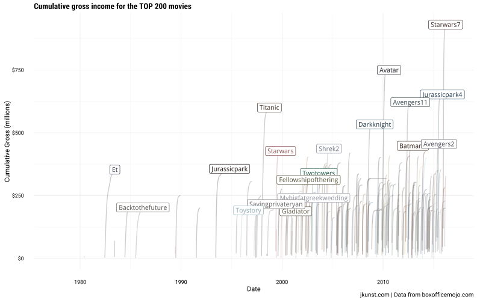
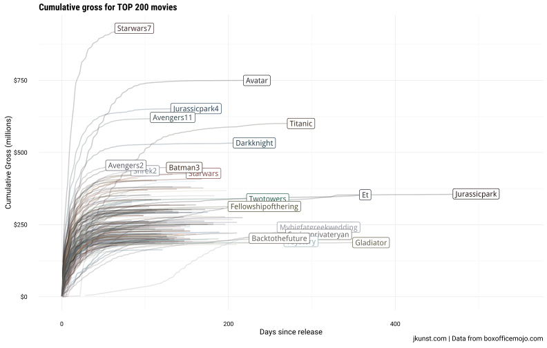
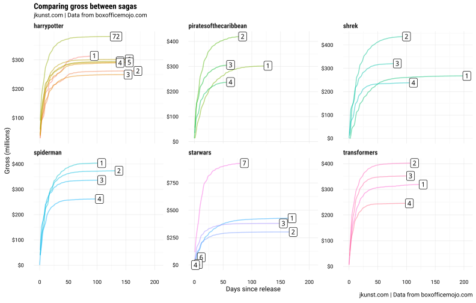

# Visualizing Gross Income on Movies
Joshua Kunst  


The recently (I remeber this movie like it was yesterday) SW7 ($930,901,726 gross income) 
and the non standar Deadpool ($329,397,732) are top 1 and top 7 in 
terms of gross income according to  <http://www.boxofficemojo.com/> site.
Have you ask yourself how much gross income the movies produces? Uff a lot! What movies are the most
succesfull in a particular saga? I dont know so lets discover it because 
<http://www.boxofficemojo.com/> have all these data and we're here to scrap it a 
visualize it (shh.. and this is an excellent excuses to
test the brand new subtitles and captions in #ggplot2! powered by @hrbrmstr)

<blockquote class="twitter-tweet" data-lang="en"><p lang="en" dir="ltr">&quot;And there 
came a day unlike any other,when earth&#39;s mightiest data sci vis tool added subtitles 
&amp; captions&quot; <a href="https://t.co/eRVPxz52iL">https://t.co/eRVPxz52iL</a> 
<a href="https://twitter.com/hashtag/rstats?src=hash">#rstats</a></p>&mdash; boB Rudis 
(@hrbrmstr) <a href="https://twitter.com/hrbrmstr/status/709824064190337027">March 15, 
2016</a></blockquote>
<script async src="http://platform.twitter.com/widgets.js" charset="utf-8"></script>


## Data

We'll extract the (only US) gross income for the top 200 movies (you can get more if
you want to test the visualizations with 1000 movies) and then, for each movie extract
the *daily* chart section which containts for every day since the release date the gross
income per day! This is just fantastic. So here we go.


```r
#### scrap ####
url <- "http://www.boxofficemojo.com/alltime/domestic.htm"

urls <- paste0(url, sprintf("?page=%s&p=.htm", 1:2))

dfmovie <- map_df(urls, function(x){
  # x <- sample(size = 1, urls)
  urlmovie <- read_html(x) %>% 
    html_nodes("table table tr a") %>%
    html_attr("href") %>% 
    .[str_detect(., "movies")]
  
  read_html(x) %>% 
    html_nodes("table table") %>% 
    html_table(fill = TRUE) %>% 
    .[[4]] %>% 
    tbl_df() %>% 
    .[-1, ] %>% 
    setNames(c("rank", "title", "studio", "gross", "year")) %>% 
    mutate(url_movie = urlmovie)
  
}) 

dfmovie <- dfmovie %>% 
  mutate(year = str_extract(year, "\\d+"),
         year = as.numeric(year),
         have_release = str_detect(url_movie, "releases"),
         box_id = str_extract(url_movie, "id=.*"),
         box_id = str_replace_all(box_id, "^id=|\\.htm$", ""))

dfmovie2 <- map_df(dfmovie$box_id, function(x){
  # x <- "starwars2"
  # x <- sample(dfmovie$box_id, size =1); 
  message(x)
  
  if (file.exists(sprintf("data/%s-p2.rds", x))) {
    # I'm always have conecction issues so for avoid 
    # loose data I save the data.
    dfm <- readRDS(sprintf("data/%s-p2.rds", x))
    return(dfm)
  }
  
  html <- sprintf("http://www.boxofficemojo.com/movies/?page=main&id=%s.htm", x) %>% 
    read_html()
  
  img_url <- html %>% 
    html_nodes("table table table img") %>% 
    .[[1]] %>% 
    html_attr("src")
  
  tmp <- tempfile(fileext = ".jpg")
  download.file(img_url, tmp, mode = "wb", quiet = TRUE)
  img <- jpeg::readJPEG(tmp)
  imgpltt <- image_palette(img, n = 1, choice = median)
  
  # par(mfrow = c(1, 2))
  # display_image(img)
  # scales::show_col(imgpltt)
  
  dfaux <- html %>% 
    html_nodes("table  table  table") %>% 
    .[[2]] %>% 
    html_table(fill = TRUE) %>% 
    .[-1, 1:2] %>% 
    tbl_df()

  dfm <- data_frame(
    box_id = x,
    distributor = str_replace(dfaux[2, 1], "Distributor: ", ""),
    genre = str_replace(dfaux[3, 1], "Genre: ", ""),
    mpaa_rating = str_replace(dfaux[4, 1], "MPAA Rating: ", ""),
    runtime = str_replace(dfaux[3, 2], "Runtime: ", ""),
    production_budget = str_extract(dfaux[4, 2], "\\d+"),
    img_url = img_url,
    img_main_color = imgpltt
  )
  
  saveRDS(dfm, file = sprintf("data/%s-p2.rds", x))
  
  dfm
    
})

dfgross <- map_df(dfmovie$box_id, function(x){
  # x <- sample(dfmovie$box_id, size =1)
  message(x)
  
  if (file.exists(sprintf("data/%s.rds", x))) {
    dfgr <- readRDS(sprintf("data/%s.rds", x))
    return(dfgr)
  }
    
  dfgr <- sprintf("http://www.boxofficemojo.com/movies/?page=daily&view=chart&id=%s.htm", x)  %>% 
    read_html() %>% 
    html_nodes("table table table") %>% 
    html_table(fill = TRUE) %>% 
    last() %>% 
    tbl_df()
  
  if (nrow(dfgr) == 1) {
    dfgr <- data_frame(box_id = x)
  } else {
    dfgr <- dfgr %>% 
      .[-1, ] %>% 
      setNames(c("day", "date", "rank", "gross", "pd", "na", "theaters_avg", "na2", "gross_to_date", "day_number")) %>% 
      mutate(box_id = x) %>% 
      filter(!is.na(day_number))
  }
  
  saveRDS(dfgr, file = sprintf("data/%s.rds", x))
  
  dfgr
  
})

try(x <- Sys.setlocale("LC_TIME", "en_US.UTF-8"))
try(x <- Sys.setlocale("LC_TIME", "English"))

dfgross <- dfgross %>% 
  mutate(gross = as.numeric(str_replace_all(gross, "\\$|\\,", "")),
         gross_to_date = as.numeric(str_replace_all(gross_to_date, "\\$|\\,", "")),
         day_number = as.numeric(day_number),
         date2 = str_replace_all(date, "\\t|\\.", ""),
         date2 = as.Date(date2, "%b %d, %Y"),
         decade = year(date2)/100,
         movieserie = str_extract(box_id, "^[A-Za-z]+|\\d{2,3}"),
         serienumber = str_extract(box_id, "\\d{1,2}$"),
         serienumber = ifelse(is.na(serienumber), 1, serienumber)) %>% 
  filter(!is.na(date)) 


dfmovie <- dfmovie %>% 
  left_join(dfmovie2, by = "box_id") %>% 
  left_join(dfgross %>% 
              group_by(box_id) %>% 
              summarise(max_day = max(day_number)),
            by = "box_id")

dfmovie <- dfmovie %>% 
  mutate(rank = as.numeric(rank),
         gross = as.numeric(str_replace_all(gross, "\\$|\\,", "")),
         studio = str_replace_all(studio, "\\.", ""),
         production_budget = 10e6 * as.numeric(production_budget)
  )

head(dfmovie)
```


 rank  title                          studio        gross   year  url_movie                                  have_release   box_id          distributor    genre                mpaa_rating   runtime           production_budget  img_url                                                                                                             img_main_color    max_day
-----  -----------------------------  -------  ----------  -----  -----------------------------------------  -------------  --------------  -------------  -------------------  ------------  ---------------  ------------------  ------------------------------------------------------------------------------------------------------------------  ---------------  --------
    1  Star Wars: The Force Awakens   BV        930901726   2015  /movies/?id=starwars7.htm                  FALSE          starwars7       Buena Vista    Sci-Fi Fantasy       PG-13         2 hrs. 16 min.             2.00e+09  http://ia.media-imdb.com/images/M/MV5BOTAzODEzNDAzMl5BMl5BanBnXkFtZTgwMDU1MTgzNzE@._V1_UY222_CR0,0,150,222_AL.jpg   #463334                87
    2  Avatar                         Fox       760507625   2009  /movies/?page=releases&id=avatar.htm       TRUE           avatar          Fox            Sci-Fi Adventure     PG-13         2 hrs. 40 min.                   NA  http://ia.media-imdb.com/images/M/MV5BMTYwOTEwNjAzMl5BMl5BanBnXkFtZTcwODc5MTUwMw@@._V1_UY222_CR0,0,150,222_AL.jpg   #2F2E36               234
    3  Titanic                        Par       658672302   1997  /movies/?page=releases&id=titanic.htm      TRUE           titanic         Paramount      Romance              PG-13         3 hrs. 14 min.             2.00e+09  http://ia.media-imdb.com/images/M/MV5BMjExNzM0NDM0N15BMl5BanBnXkFtZTcwMzkxOTUwNw@@._V1_UY222_CR0,0,150,222_AL.jpg   #443529               287
    4  Jurassic World                 Uni       652270625   2015  /movies/?id=jurassicpark4.htm              FALSE          jurassicpark4   Universal      Sci-Fi Horror        PG-13         2 hrs. 4 min.              1.50e+09  http://ia.media-imdb.com/images/M/MV5BMTQ5MTE0MTk3Nl5BMl5BanBnXkFtZTgwMjczMzk2NTE@._V1_UY222_CR0,0,150,222_AL.jpg   #31485B               161
    5  Marvel's The Avengers          BV        623357910   2012  /movies/?id=avengers11.htm                 FALSE          avengers11      Buena Vista    Action / Adventure   PG-13         2 hrs. 22 min.             2.20e+09  http://ia.media-imdb.com/images/M/MV5BMTk2NTI1MTU4N15BMl5BanBnXkFtZTcwODg0OTY0Nw@@._V1_UY222_CR0,0,150,222_AL.jpg   #435256               133
    6  The Dark Knight                WB        534858444   2008  /movies/?page=releases&id=darkknight.htm   TRUE           darkknight      Warner Bros.   Action / Adventure   PG-13         2 hrs. 30 min.             1.85e+09  http://ia.media-imdb.com/images/M/MV5BMTMxNTMwODM0NF5BMl5BanBnXkFtZTcwODAyMTk2Mw@@._V1_UY222_CR0,0,150,222_AL.jpg   #2D4551               231

```r
rm(dfmovie2)
```


Finally  we have the movies data with some interesting colums like 
`production_budet`, total life time gross income `gross` and the
`max_day` column which count the days in theaters. Here ara
the top 10 movies


```r
dfmovie %>%
  select(rank, title, gross, genre) %>% 
  mutate(gross = scales::dollar(gross)) %>% 
  head(10)
```


 rank  title                                       gross          genre              
-----  ------------------------------------------  -------------  -------------------
    1  Star Wars: The Force Awakens                $930,901,726   Sci-Fi Fantasy     
    2  Avatar                                      $760,507,625   Sci-Fi Adventure   
    3  Titanic                                     $658,672,302   Romance            
    4  Jurassic World                              $652,270,625   Sci-Fi Horror      
    5  Marvel's The Avengers                       $623,357,910   Action / Adventure 
    6  The Dark Knight                             $534,858,444   Action / Adventure 
    7  Star Wars: Episode I - The Phantom Menace   $474,544,677   Sci-Fi Fantasy     
    8  Star Wars                                   $460,998,007   Sci-Fi Fantasy     
    9  Avengers: Age of Ultron                     $459,005,868   Action / Adventure 
   10  The Dark Knight Rises                       $448,139,099   Action Thriller    

Phantom Menace ad Jurassic World top 10? 
  
We have too the incomes by day for every movie so, we can plot time
series and compare! The data is just telling us what to do.


```r
datatable(dfgross %>% filter(box_id == "starwars7"))
```

<!--html_preserve--><div id="htmlwidget-7578" style="width:100%;height:auto;" class="datatables"></div>
<script type="application/json" data-for="htmlwidget-7578">{"x":{"data":[["1","2","3","4","5","6","7","8","9","10","11","12","13","14","15","16","17","18","19","20","21","22","23","24","25","26","27","28","29","30","31","32","33","34","35","36","37","38","39","40","41","42","43","44","45","46","47","48","49","50","51","52","53","54","55","56","57","58","59","60","61","62","63","64","65","66","67","68","69","70","71","72","73","74","75","76","77","78","79","80","81","82","83","84","85","86","87"],["Fri","Sat","Sun","Mon","Tue","Wed","Thu","Fri","Sat","Sun","Mon","Tue","Wed","Thu","Fri","Sat","Sun","Mon","Tue","Wed","Thu","Fri","Sat","Sun","Mon","Tue","Wed","Thu","Fri","Sat","Sun","Mon","Tue","Wed","Thu","Fri","Sat","Sun","Mon","Tue","Wed","Thu","Fri","Sat","Sun","Mon","Tue","Wed","Thu","Fri","Sat","Sun","Mon","Tue","Wed","Thu","Fri","Sat","Sun","Mon","Tue","Wed","Thu","Fri","Sat","Sun","Mon","Tue","Wed","Thu","Fri","Sat","Sun","Mon","Tue","Wed","Thu","Fri","Sat","Sun","Mon","Tue","Wed","Thu","Fri","Sat","Sun"],["Dec. 18, 2015","Dec. 19, 2015","Dec. 20, 2015","Dec. 21, 2015","Dec. 22, 2015","Dec. 23, 2015","Dec. 24, 2015","Dec. 25, 2015","Dec. 26, 2015","Dec. 27, 2015","Dec. 28, 2015","Dec. 29, 2015","Dec. 30, 2015","Dec. 31, 2015","Jan. 1, 2016","Jan. 2, 2016","Jan. 3, 2016","Jan. 4, 2016","Jan. 5, 2016","Jan. 6, 2016","Jan. 7, 2016","Jan. 8, 2016","Jan. 9, 2016","Jan. 10, 2016","Jan. 11, 2016","Jan. 12, 2016","Jan. 13, 2016","Jan. 14, 2016","Jan. 15, 2016","Jan. 16, 2016","Jan. 17, 2016","Jan. 18, 2016","Jan. 19, 2016","Jan. 20, 2016","Jan. 21, 2016","Jan. 22, 2016","Jan. 23, 2016","Jan. 24, 2016","Jan. 25, 2016","Jan. 26, 2016","Jan. 27, 2016","Jan. 28, 2016","Jan. 29, 2016","Jan. 30, 2016","Jan. 31, 2016","Feb. 1, 2016","Feb. 2, 2016","Feb. 3, 2016","Feb. 4, 2016","Feb. 5, 2016","Feb. 6, 2016","Feb. 7, 2016","Feb. 8, 2016","Feb. 9, 2016","Feb. 10, 2016","Feb. 11, 2016","Feb. 12, 2016","Feb. 13, 2016","Feb. 14, 2016","Feb. 15, 2016","Feb. 16, 2016","Feb. 17, 2016","Feb. 18, 2016","Feb. 19, 2016","Feb. 20, 2016","Feb. 21, 2016","Feb. 22, 2016","Feb. 23, 2016","Feb. 24, 2016","Feb. 25, 2016","Feb. 26, 2016","Feb. 27, 2016","Feb. 28, 2016","Feb. 29, 2016","Mar. 1, 2016","Mar. 2, 2016","Mar. 3, 2016","Mar. 4, 2016","Mar. 5, 2016","Mar. 6, 2016","Mar. 7, 2016","Mar. 8, 2016","Mar. 9, 2016","Mar. 10, 2016","Mar. 11, 2016","Mar. 12, 2016","Mar. 13, 2016"],["1","1","1","1","1","1","1","1","1","1","1","1","1","1","1","1","1","1","1","1","1","2","1","1","2","2","2","2","3","3","3","1","2","2","2","5","2","1","2","2","2","2","4","3","3","3","4","3","3","6","4","3","4","4","4","3","7","7","6","5","5","5","5","9","8","8","9","9","9","9","11","11","11","11","11","11","11","-","-","12","-","-","-","-","-","-","-"],[119119282,68294204,60553189,40109742,37361729,38022183,27395725,49325663,56731532,43145665,31362029,29528583,28085057,22932686,34394152,34368250,21479271,8021882,7967428,6210432,5972359,10744380,19204072,12405333,3108701,3844408,3114937,3129967,6328954,11028514,8984649,6678148,2380910,1814233,1884097,3535257,6814652,3728739,1295742,1574483,1324479,1338464,2468701,5089962,3558021,780785,927503,798790,803545,1772763,3769739,1430814,678633,708043,628195,585308,1188588,2461903,2508785,1481415,575323,465786,479531,917914,1777894,1211487,296878,365327,316654,309435,671519,1445740,869180,237419,282460,237754,231559,423072,864129,577503,153120,163629,146770,153522,309461,581919,406372],["-","-42.7%","-11.3%","-33.8%","-6.9%","+1.8%","-27.9%","+80.0%","+15.0%","-23.9%","-27.3%","-5.8%","-4.9%","-18.3%","+50.0%","-0.1%","-37.5%","-62.7%","-0.7%","-22.1%","-3.8%","+79.9%","+78.7%","-35.4%","-74.9%","+23.7%","-19.0%","+0.5%","+102.2%","+74.3%","-18.5%","-25.7%","-64.3%","-23.8%","+3.9%","+87.6%","+92.8%","-45.3%","-65.2%","+21.5%","-15.9%","+1.1%","+84.4%","+106.2%","-30.1%","-78.1%","+18.8%","-13.9%","+0.6%","+120.6%","+112.6%","-62.0%","-52.6%","+4.3%","-11.3%","-6.8%","+103.1%","+107.1%","+1.9%","-41.0%","-61.2%","-19.0%","+3.0%","+91.4%","+93.7%","-31.9%","-75.5%","+23.1%","-13.3%","-2.3%","+117.0%","+115.3%","-39.9%","-72.7%","+19.0%","-15.8%","-2.6%","+82.7%","+104.3%","-33.2%","-73.5%","+6.9%","-10.3%","+4.6%","+101.6%","+88.0%","-30.2%"],["-","-","-","-","-","-","-","-58.6%","-16.9%","-28.7%","-21.8%","-21.0%","-26.1%","-16.3%","-30.3%","-39.4%","-50.2%","-74.4%","-73.0%","-77.9%","-74.0%","-68.8%","-44.1%","-42.2%","-61.2%","-51.7%","-49.8%","-47.6%","-41.1%","-42.6%","-27.6%","+114.8%","-38.1%","-41.8%","-39.8%","-44.1%","-38.2%","-58.5%","-80.6%","-33.9%","-27.0%","-29.0%","-30.2%","-25.3%","-4.6%","-39.7%","-41.1%","-39.7%","-40.0%","-28.2%","-25.9%","-59.8%","-13.1%","-23.7%","-21.4%","-27.2%","-33.0%","-34.7%","+75.3%","+118.3%","-18.7%","-25.9%","-18.1%","-22.8%","-27.8%","-51.7%","-80.0%","-36.5%","-32.0%","-35.5%","-26.8%","-18.7%","-28.3%","-20.0%","-22.7%","-24.9%","-25.2%","-37.0%","-40.2%","-33.6%","-35.5%","-42.1%","-38.3%","-33.7%","-26.9%","-32.7%","-29.6%"],["4,134","4,134","4,134","4,134","4,134","4,134","4,134","4,134","4,134","4,134","4,134","4,134","4,134","4,134","4,134","4,134","4,134","4,134","4,134","4,134","4,134","4,134","4,134","4,134","4,134","4,134","4,134","4,134","3,822","3,822","3,822","3,822","3,822","3,822","3,822","3,365","3,365","3,365","3,365","3,365","3,365","3,365","2,556","2,556","2,556","2,556","2,556","2,556","2,556","2,262","2,262","2,262","2,262","2,262","2,262","2,262","1,810","1,810","1,810","1,810","1,810","1,810","1,810","1,618","1,618","1,618","1,618","1,618","1,618","1,618","1,433","1,433","1,433","1,433","1,433","1,433","1,433","1,021","1,021","1,021","1,021","1,021","1,021","1,021","760","760","760"],["$28,815","$16,520","$14,648","$9,702","$9,038","$9,197","$6,627","$11,932","$13,723","$10,437","$7,586","$7,143","$6,794","$5,547","$8,320","$8,314","$5,196","$1,940","$1,927","$1,502","$1,445","$2,599","$4,645","$3,001","$752","$930","$753","$757","$1,656","$2,886","$2,351","$1,747","$623","$475","$493","$1,051","$2,025","$1,108","$385","$468","$394","$398","$966","$1,991","$1,392","$305","$363","$313","$314","$784","$1,667","$633","$300","$313","$278","$259","$657","$1,360","$1,386","$818","$318","$257","$265","$567","$1,099","$749","$183","$226","$196","$191","$469","$1,009","$607","$166","$197","$166","$162","$414","$846","$566","$150","$160","$144","$150","$407","$766","$535"],[119119282,187413486,247966675,288076417,325438146,363460329,390856054,440181717,496913249,540058914,571420943,600949526,629034583,651967269,686361421,720729671,742208942,750230824,758198252,764408684,770381043,781125423,800329495,812734828,815843529,819687937,822802874,825932841,832261795,843290309,852274958,858953106,861334016,863148249,865032346,868567603,875382255,879110994,880406736,881981219,883305698,884644162,887112863,892202825,895760846,896541631,897469134,898267924,899071469,900844232,904613971,906044785,906723418,907431461,908059656,908644964,909833552,912295455,914804240,916285655,916860978,917326764,917806295,918724209,920502103,921713590,922010468,922375795,922692449,923001884,923673403,925119143,925988323,926225742,926508202,926745956,926977515,927400587,928264716,928842219,928995339,929158968,929305738,929459260,929768721,930350640,930757012],[1,2,3,4,5,6,7,8,9,10,11,12,13,14,15,16,17,18,19,20,21,22,23,24,25,26,27,28,29,30,31,32,33,34,35,36,37,38,39,40,41,42,43,44,45,46,47,48,49,50,51,52,53,54,55,56,57,58,59,60,61,62,63,64,65,66,67,68,69,70,71,72,73,74,75,76,77,78,79,80,81,82,83,84,85,86,87],["starwars7","starwars7","starwars7","starwars7","starwars7","starwars7","starwars7","starwars7","starwars7","starwars7","starwars7","starwars7","starwars7","starwars7","starwars7","starwars7","starwars7","starwars7","starwars7","starwars7","starwars7","starwars7","starwars7","starwars7","starwars7","starwars7","starwars7","starwars7","starwars7","starwars7","starwars7","starwars7","starwars7","starwars7","starwars7","starwars7","starwars7","starwars7","starwars7","starwars7","starwars7","starwars7","starwars7","starwars7","starwars7","starwars7","starwars7","starwars7","starwars7","starwars7","starwars7","starwars7","starwars7","starwars7","starwars7","starwars7","starwars7","starwars7","starwars7","starwars7","starwars7","starwars7","starwars7","starwars7","starwars7","starwars7","starwars7","starwars7","starwars7","starwars7","starwars7","starwars7","starwars7","starwars7","starwars7","starwars7","starwars7","starwars7","starwars7","starwars7","starwars7","starwars7","starwars7","starwars7","starwars7","starwars7","starwars7"],["2015-12-18","2015-12-19","2015-12-20","2015-12-21","2015-12-22","2015-12-23","2015-12-24","2015-12-25","2015-12-26","2015-12-27","2015-12-28","2015-12-29","2015-12-30","2015-12-31","2016-01-01","2016-01-02","2016-01-03","2016-01-04","2016-01-05","2016-01-06","2016-01-07","2016-01-08","2016-01-09","2016-01-10","2016-01-11","2016-01-12","2016-01-13","2016-01-14","2016-01-15","2016-01-16","2016-01-17","2016-01-18","2016-01-19","2016-01-20","2016-01-21","2016-01-22","2016-01-23","2016-01-24","2016-01-25","2016-01-26","2016-01-27","2016-01-28","2016-01-29","2016-01-30","2016-01-31","2016-02-01","2016-02-02","2016-02-03","2016-02-04","2016-02-05","2016-02-06","2016-02-07","2016-02-08","2016-02-09","2016-02-10","2016-02-11","2016-02-12","2016-02-13","2016-02-14","2016-02-15","2016-02-16","2016-02-17","2016-02-18","2016-02-19","2016-02-20","2016-02-21","2016-02-22","2016-02-23","2016-02-24","2016-02-25","2016-02-26","2016-02-27","2016-02-28","2016-02-29","2016-03-01","2016-03-02","2016-03-03","2016-03-04","2016-03-05","2016-03-06","2016-03-07","2016-03-08","2016-03-09","2016-03-10","2016-03-11","2016-03-12","2016-03-13"],[20.15,20.15,20.15,20.15,20.15,20.15,20.15,20.15,20.15,20.15,20.15,20.15,20.15,20.15,20.16,20.16,20.16,20.16,20.16,20.16,20.16,20.16,20.16,20.16,20.16,20.16,20.16,20.16,20.16,20.16,20.16,20.16,20.16,20.16,20.16,20.16,20.16,20.16,20.16,20.16,20.16,20.16,20.16,20.16,20.16,20.16,20.16,20.16,20.16,20.16,20.16,20.16,20.16,20.16,20.16,20.16,20.16,20.16,20.16,20.16,20.16,20.16,20.16,20.16,20.16,20.16,20.16,20.16,20.16,20.16,20.16,20.16,20.16,20.16,20.16,20.16,20.16,20.16,20.16,20.16,20.16,20.16,20.16,20.16,20.16,20.16,20.16],["starwars","starwars","starwars","starwars","starwars","starwars","starwars","starwars","starwars","starwars","starwars","starwars","starwars","starwars","starwars","starwars","starwars","starwars","starwars","starwars","starwars","starwars","starwars","starwars","starwars","starwars","starwars","starwars","starwars","starwars","starwars","starwars","starwars","starwars","starwars","starwars","starwars","starwars","starwars","starwars","starwars","starwars","starwars","starwars","starwars","starwars","starwars","starwars","starwars","starwars","starwars","starwars","starwars","starwars","starwars","starwars","starwars","starwars","starwars","starwars","starwars","starwars","starwars","starwars","starwars","starwars","starwars","starwars","starwars","starwars","starwars","starwars","starwars","starwars","starwars","starwars","starwars","starwars","starwars","starwars","starwars","starwars","starwars","starwars","starwars","starwars","starwars"],["7","7","7","7","7","7","7","7","7","7","7","7","7","7","7","7","7","7","7","7","7","7","7","7","7","7","7","7","7","7","7","7","7","7","7","7","7","7","7","7","7","7","7","7","7","7","7","7","7","7","7","7","7","7","7","7","7","7","7","7","7","7","7","7","7","7","7","7","7","7","7","7","7","7","7","7","7","7","7","7","7","7","7","7","7","7","7"]],"container":"<table class=\"display\">\n  <thead>\n    <tr>\n      <th> </th>\n      <th>day</th>\n      <th>date</th>\n      <th>rank</th>\n      <th>gross</th>\n      <th>pd</th>\n      <th>na</th>\n      <th>theaters_avg</th>\n      <th>na2</th>\n      <th>gross_to_date</th>\n      <th>day_number</th>\n      <th>box_id</th>\n      <th>date2</th>\n      <th>decade</th>\n      <th>movieserie</th>\n      <th>serienumber</th>\n    </tr>\n  </thead>\n</table>","options":{"columnDefs":[{"className":"dt-right","targets":[4,9,10,13]},{"orderable":false,"targets":0}],"order":[],"autoWidth":false,"orderClasses":false},"callback":null,"filter":"none"},"evals":[]}</script><!--/html_preserve-->


## Plot

Okey, here we take a breath. A lot of ideas and only one order 
to code all of them. Just start considering the release date for every
movie and its gross income evolution. 

 First well use the color for every movie extracted using the 
 nice `RImagePalette` package and the select the top movies and 
 the movies with more day in theater to annotate them in the plot. 


```r
#### plot ####
cols <- setNames(dfmovie$img_main_color, dfmovie$box_id)

ntoplabel <- 10 + 1 # rm starwars
nmostlong <- 10

moviestop <- dfmovie %>%
  arrange(rank) %>% 
  head(ntoplabel) %>%
  .$box_id

movieslng <- dfmovie %>%
  arrange(desc(max_day)) %>% 
  head(ntoplabel) %>%
  .$box_id

movieslbl <- unique(c(moviestop, movieslng))
movieslbl <- setdiff(movieslbl, c("starwars4"))

fmt_dllr_mm <- function(x) {
  x %>% 
    {./1000000} %>% 
    scales::dollar()
}

ggplot(dfgross,
             aes(date2, gross_to_date, color = box_id, label = str_to_title(box_id))) + 
  geom_line(alpha = 0.25) + 
  scale_color_manual(values = cols) + 
  geom_dl(data = dfgross %>% filter(box_id %in% movieslbl),
          method = list("last.points", cex = 0.75)) + 
  theme(legend.position = "none") +
  xlim(as.Date(min(dfgross$date2)), as.Date(ymd(20180101))) + 
  scale_y_continuous(labels = fmt_dllr_mm) +
  labs(title = "Cumulative gross income for the TOP 200 movies",
       subtitle = "asd",
       caption = "Jbkunst || Data from boxofficemojo.com",
       x = "Time",
       y = "Cumulative Gross (millions)")
```



Mmm the first conclusion I get from this:

> You don't need only network data to get a *spaghetti-like* plot. 

Mmm I think this is a nice result for the first try^[this is a lie, I did more tries
before this plot XD]. Clearly we can observe the date of release and compare the
gross income between the movies. Nice to see and remeber old classics like ET and
Back to the Future. Well the time scale is so big we can't differentiate how long
each movie had been in theaters. To get a more fair comparision we plot every movie
considering `x` the day since release:


```r
ggplot(dfgross,
             aes(day_number, gross_to_date, color = box_id, label = str_to_title(box_id))) + 
  geom_line(alpha = 0.25) + 
  geom_dl(data = dfgross %>% filter(box_id %in% movieslbl),
          method = list("last.points", cex = 0.75)) + 
  scale_color_manual(values = cols) + 
  theme(legend.position = "none") +
  xlim(NA, 550) + 
  scale_y_continuous(labels = fmt_dllr_mm) +
  labs(title = "Cumulative gross for TOP 200 movies",
       subtitle = "the gross and length",
       caption = "Data from boxofficemojo.com",
       x = "Days since release",
       y = "Cumulative Gross (millions)")
```




Now it's clearly see Jurassic Park and ET were more than a year It's still
like spaghetti but a tasty spagehtti.

Now, we can compare movies between other movies in their saga.


```r
moviessaga <- dfgross %>% 
  distinct(movieserie, serienumber) %>% 
  count(movieserie) %>% 
  arrange(desc(n)) %>% 
  filter(n >= 4) %>% 
  .$movieserie

dfgross %>%
  filter(movieserie %in% moviessaga) %>%
  mutate(serienumber = ifelse(box_id == "transformers06", 1, serienumber)) %>% 
ggplot(aes(day_number, gross_to_date)) + 
  geom_line(aes(color = box_id), alpha = 0.5) +
  geom_dl(aes(label = serienumber), method = list("last.points", cex = 0.75), alpha = 0.75) + 
  facet_wrap(~movieserie, scales = "free_y") + 
  scale_y_continuous(labels = fmt_dllr_mm) +
  labs(title = "Comparing gross between sagas",
       subtitle = "In 3 of the 6 sagas with more movies the 1st movie have the longest time 
in theater but they are not the most popular than the 2nd and 3rd movie (in order)",
       caption = "Data from boxofficemojo.com",
       x = "Days since release",
       y = "Gross (millions)") + 
  theme(legend.position = "none")
```



Aha! Nice pattern 2-3-1-4 in the Pirates of the caribbean, Shrek and Transformers
we got: The first movie have a long time in theaters but they arent more popular
than the second one (and the 3rd) in the saga and the 4th is the movie with 
*less* gross imcome.

Now well try to implement the scatter version of `gross` vs `production_budget`. 


```r
#### chart ####
dsmovie <- dfmovie %>% 
  filter(!is.na(production_budget)) %>% 
  mutate(x = gross,
         y = production_budget,
         z = max_day,
         name = title,
         color = img_main_color) %>% 
  list.parse3() 

str(dsmovie[[1]])
```

```
## List of 21
##  $ rank             : num 1
##  $ title            : chr "Star Wars: The Force Awakens"
##  $ studio           : chr "BV"
##  $ gross            : num 9.31e+08
##  $ year             : num 2015
##  $ url_movie        : chr "/movies/?id=starwars7.htm"
##  $ have_release     : logi FALSE
##  $ box_id           : chr "starwars7"
##  $ distributor      : chr "Buena Vista"
##  $ genre            : chr "Sci-Fi Fantasy"
##  $ mpaa_rating      : chr "PG-13"
##  $ runtime          : chr "2 hrs. 16 min."
##  $ production_budget: num 2e+09
##  $ img_url          : chr "http://ia.media-imdb.com/images/M/MV5BOTAzODEzNDAzMl5BMl5BanBnXkFtZTgwMDU1MTgzNzE@._V1_UY222_CR0,0,150,222_AL.jpg"
##  $ img_main_color   : chr "#463334"
##  $ max_day          : num 87
##  $ x                : num 9.31e+08
##  $ y                : num 2e+09
##  $ z                : num 87
##  $ name             : chr "Star Wars: The Force Awakens"
##  $ color            : chr "#463334"
```

```r
thmhc <- hc_theme(
  chart = list(
    style = list(
      fontFamily = "Roboto"
    )
  ),
  title = list(
    align = "left",
    style = list(
      fontFamily = "PT Sans Narrow"
    )
  ),
  subtitle = list(
    align = "left",
    style = list(
      fontFamily = "PT Sans Narrow"
    )
  ),
  xAxis = list(
    gridLineWidth = 1
  )
)


highchart() %>% 
  hc_title(text = "SasdasAs asdA asd") %>%
  hc_subtitle(text = "SasdasAs asdA asd") %>% 
  hc_add_series(data = dsmovie, type = "scatter",
                showInLegend = FALSE) %>%
  hc_add_theme(thmhc)
```

<!--html_preserve--><div id="htmlwidget-3267" style="width:100%;height:500px;" class="highchart"></div>
<script type="application/json" data-for="htmlwidget-3267">{"x":{"hc_opts":{"title":{"text":"SasdasAs asdA asd"},"credits":{"enabled":false},"exporting":{"enabled":false},"plotOptions":{"series":{"turboThreshold":0}},"subtitle":{"text":"SasdasAs asdA asd"},"series":[{"data":[{"rank":1,"title":"Star Wars: The Force Awakens","studio":"BV","gross":930901726,"year":2015,"url_movie":"/movies/?id=starwars7.htm","have_release":false,"box_id":"starwars7","distributor":"Buena Vista","genre":"Sci-Fi Fantasy","mpaa_rating":"PG-13","runtime":"2 hrs. 16 min.","production_budget":2000000000,"img_url":"http://ia.media-imdb.com/images/M/MV5BOTAzODEzNDAzMl5BMl5BanBnXkFtZTgwMDU1MTgzNzE@._V1_UY222_CR0,0,150,222_AL.jpg","img_main_color":"#463334","max_day":87,"x":930901726,"y":2000000000,"z":87,"name":"Star Wars: The Force Awakens","color":"#463334"},{"rank":3,"title":"Titanic","studio":"Par","gross":658672302,"year":1997,"url_movie":"/movies/?page=releases&id=titanic.htm","have_release":true,"box_id":"titanic","distributor":"Paramount","genre":"Romance","mpaa_rating":"PG-13","runtime":"3 hrs. 14 min.","production_budget":2000000000,"img_url":"http://ia.media-imdb.com/images/M/MV5BMjExNzM0NDM0N15BMl5BanBnXkFtZTcwMzkxOTUwNw@@._V1_UY222_CR0,0,150,222_AL.jpg","img_main_color":"#443529","max_day":287,"x":658672302,"y":2000000000,"z":287,"name":"Titanic","color":"#443529"},{"rank":4,"title":"Jurassic World","studio":"Uni","gross":652270625,"year":2015,"url_movie":"/movies/?id=jurassicpark4.htm","have_release":false,"box_id":"jurassicpark4","distributor":"Universal","genre":"Sci-Fi Horror","mpaa_rating":"PG-13","runtime":"2 hrs. 4 min.","production_budget":1500000000,"img_url":"http://ia.media-imdb.com/images/M/MV5BMTQ5MTE0MTk3Nl5BMl5BanBnXkFtZTgwMjczMzk2NTE@._V1_UY222_CR0,0,150,222_AL.jpg","img_main_color":"#31485B","max_day":161,"x":652270625,"y":1500000000,"z":161,"name":"Jurassic World","color":"#31485B"},{"rank":5,"title":"Marvel's The Avengers","studio":"BV","gross":623357910,"year":2012,"url_movie":"/movies/?id=avengers11.htm","have_release":false,"box_id":"avengers11","distributor":"Buena Vista","genre":"Action / Adventure","mpaa_rating":"PG-13","runtime":"2 hrs. 22 min.","production_budget":2200000000,"img_url":"http://ia.media-imdb.com/images/M/MV5BMTk2NTI1MTU4N15BMl5BanBnXkFtZTcwODg0OTY0Nw@@._V1_UY222_CR0,0,150,222_AL.jpg","img_main_color":"#435256","max_day":133,"x":623357910,"y":2200000000,"z":133,"name":"Marvel's The Avengers","color":"#435256"},{"rank":6,"title":"The Dark Knight","studio":"WB","gross":534858444,"year":2008,"url_movie":"/movies/?page=releases&id=darkknight.htm","have_release":true,"box_id":"darkknight","distributor":"Warner Bros.","genre":"Action / Adventure","mpaa_rating":"PG-13","runtime":"2 hrs. 30 min.","production_budget":1850000000,"img_url":"http://ia.media-imdb.com/images/M/MV5BMTMxNTMwODM0NF5BMl5BanBnXkFtZTcwODAyMTk2Mw@@._V1_UY222_CR0,0,150,222_AL.jpg","img_main_color":"#2D4551","max_day":231,"x":534858444,"y":1850000000,"z":231,"name":"The Dark Knight","color":"#2D4551"},{"rank":7,"title":"Star Wars: Episode I - The Phantom Menace","studio":"Fox","gross":474544677,"year":1999,"url_movie":"/movies/?page=releases&id=starwars.htm","have_release":true,"box_id":"starwars","distributor":"Fox","genre":"Sci-Fi Fantasy","mpaa_rating":"PG","runtime":"2 hrs. 13 min.","production_budget":1150000000,"img_url":"http://ia.media-imdb.com/images/M/MV5BYzg3Y2ViYTMtNmUzMS00MDI0LTlhMDEtYmM4YWY5OGZkNTM5XkEyXkFqcGdeQXVyNTIzOTk5ODM@._V1_UY222_CR0,0,150,222_AL.jpg","img_main_color":"#8B5453","max_day":170,"x":474544677,"y":1150000000,"z":170,"name":"Star Wars: Episode I - The Phantom Menace","color":"#8B5453"},{"rank":8,"title":"Star Wars","studio":"Fox","gross":460998007,"year":1977,"url_movie":"/movies/?page=releases&id=starwars4.htm","have_release":true,"box_id":"starwars4","distributor":"Fox","genre":"Sci-Fi Fantasy","mpaa_rating":"PG","runtime":"2 hrs. 1 min.","production_budget":110000000,"img_url":"http://ia.media-imdb.com/images/M/MV5BYzBhYjM3ODQtZTkzYS00ZTA2LTgzODUtOGJmYzNlMTdjZmM1XkEyXkFqcGdeQXVyMTE5Mzg3OTc@._V1_UY222_CR0,0,150,222_AL.jpg","img_main_color":"#775E55","max_day":2,"x":460998007,"y":110000000,"z":2,"name":"Star Wars","color":"#775E55"},{"rank":9,"title":"Avengers: Age of Ultron","studio":"BV","gross":459005868,"year":2015,"url_movie":"/movies/?id=avengers2.htm","have_release":false,"box_id":"avengers2","distributor":"Buena Vista","genre":"Action / Adventure","mpaa_rating":"PG-13","runtime":"2 hrs. 21 min.","production_budget":2500000000,"img_url":"http://ia.media-imdb.com/images/M/MV5BMTM4OGJmNWMtOTM4Ni00NTE3LTg3MDItZmQxYjc4N2JhNmUxXkEyXkFqcGdeQXVyNTgzMDMzMTg@._V1_UY222_CR0,0,150,222_AL.jpg","img_main_color":"#5A5A65","max_day":77,"x":459005868,"y":2500000000,"z":77,"name":"Avengers: Age of Ultron","color":"#5A5A65"},{"rank":10,"title":"The Dark Knight Rises","studio":"WB","gross":448139099,"year":2012,"url_movie":"/movies/?id=batman3.htm","have_release":false,"box_id":"batman3","distributor":"Warner Bros.","genre":"Action Thriller","mpaa_rating":"PG-13","runtime":"2 hrs. 45 min.","production_budget":2500000000,"img_url":"http://ia.media-imdb.com/images/M/MV5BMTk4ODQzNDY3Ml5BMl5BanBnXkFtZTcwODA0NTM4Nw@@._V1_UY222_CR0,0,150,222_AL.jpg","img_main_color":"#402D23","max_day":147,"x":448139099,"y":2500000000,"z":147,"name":"The Dark Knight Rises","color":"#402D23"},{"rank":11,"title":"Shrek 2","studio":"DW","gross":441226247,"year":2004,"url_movie":"/movies/?id=shrek2.htm","have_release":false,"box_id":"shrek2","distributor":"DreamWorks","genre":"Animation","mpaa_rating":"PG","runtime":"1 hrs. 33 min.","production_budget":1500000000,"img_url":"http://ia.media-imdb.com/images/M/MV5BMTk4MTMwNjI4M15BMl5BanBnXkFtZTcwMjExMzUyMQ@@._V1_UY222_CR0,0,150,222_AL.jpg","img_main_color":"#7B8291","max_day":100,"x":441226247,"y":1500000000,"z":100,"name":"Shrek 2","color":"#7B8291"},{"rank":12,"title":"E.T.: The Extra-Terrestrial","studio":"Uni","gross":435110554,"year":1982,"url_movie":"/movies/?page=releases&id=et.htm","have_release":true,"box_id":"et","distributor":"Universal","genre":"Family Adventure","mpaa_rating":"PG","runtime":"1 hrs. 57 min.","production_budget":100000000,"img_url":"http://ia.media-imdb.com/images/M/MV5BMWE0OTVmY2EtNTFjNC00YzNjLWI3ZWUtMmQ1NGY2OGQ1YmQ2XkEyXkFqcGdeQXVyNTIzOTk5ODM@._V1_UY222_CR0,0,150,222_AL.jpg","img_main_color":"#353A4A","max_day":364,"x":435110554,"y":100000000,"z":364,"name":"E.T.: The Extra-Terrestrial","color":"#353A4A"},{"rank":13,"title":"The Hunger Games: Catching Fire","studio":"LGF","gross":424668047,"year":2013,"url_movie":"/movies/?id=catchingfire.htm","have_release":false,"box_id":"catchingfire","distributor":"Lionsgate","genre":"Action / Adventure","mpaa_rating":"PG-13","runtime":"2 hrs. 26 min.","production_budget":1300000000,"img_url":"http://ia.media-imdb.com/images/M/MV5BMTAyMjQ3OTAxMzNeQTJeQWpwZ15BbWU4MDU0NzA1MzAx._V1_UY222_CR0,0,150,222_AL.jpg","img_main_color":"#3F1911","max_day":133,"x":424668047,"y":1300000000,"z":133,"name":"The Hunger Games: Catching Fire","color":"#3F1911"},{"rank":14,"title":"Pirates of the Caribbean: Dead Man's Chest","studio":"BV","gross":423315812,"year":2006,"url_movie":"/movies/?id=piratesofthecaribbean2.htm","have_release":false,"box_id":"piratesofthecaribbean2","distributor":"Buena Vista","genre":"Period Adventure","mpaa_rating":"PG-13","runtime":"2 hrs. 31 min.","production_budget":2250000000,"img_url":"http://ia.media-imdb.com/images/M/MV5BMTcwODc1MTMxM15BMl5BanBnXkFtZTYwMDg1NzY3._V1_UY222_CR0,0,150,222_AL.jpg","img_main_color":"#463D20","max_day":84,"x":423315812,"y":2250000000,"z":84,"name":"Pirates of the Caribbean: Dead Man's Chest","color":"#463D20"},{"rank":15,"title":"The Lion King","studio":"BV","gross":422783777,"year":1994,"url_movie":"/movies/?page=releases&id=lionking.htm","have_release":true,"box_id":"lionking","distributor":"Buena Vista","genre":"Animation","mpaa_rating":"G","runtime":"1 hrs. 29 min.","production_budget":450000000,"img_url":"http://ia.media-imdb.com/images/M/MV5BMjEyMzgwNTUzMl5BMl5BanBnXkFtZTcwNTMxMzM3Ng@@._V1_UY222_CR0,0,150,222_AL.jpg","img_main_color":"#77615F","max_day":null,"x":422783777,"y":450000000,"z":null,"name":"The Lion King","color":"#77615F"},{"rank":16,"title":"Toy Story 3","studio":"BV","gross":415004880,"year":2010,"url_movie":"/movies/?id=toystory3.htm","have_release":false,"box_id":"toystory3","distributor":"Buena Vista","genre":"Animation","mpaa_rating":"G","runtime":"1 hrs. 43 min.","production_budget":2000000000,"img_url":"http://ia.media-imdb.com/images/M/MV5BMTgxOTY4Mjc0MF5BMl5BanBnXkFtZTcwNTA4MDQyMw@@._V1_UY222_CR0,0,150,222_AL.jpg","img_main_color":"#A48555","max_day":91,"x":415004880,"y":2000000000,"z":91,"name":"Toy Story 3","color":"#A48555"},{"rank":17,"title":"Iron Man 3","studio":"BV","gross":409013994,"year":2013,"url_movie":"/movies/?id=ironman3.htm","have_release":false,"box_id":"ironman3","distributor":"Buena Vista","genre":"Action / Adventure","mpaa_rating":"PG-13","runtime":"2 hrs. 9 min.","production_budget":2000000000,"img_url":"http://ia.media-imdb.com/images/M/MV5BMjIzMzAzMjQyM15BMl5BanBnXkFtZTcwNzM2NjcyOQ@@._V1_UY222_CR0,0,150,222_AL.jpg","img_main_color":"#625140","max_day":70,"x":409013994,"y":2000000000,"z":70,"name":"Iron Man 3","color":"#625140"},{"rank":18,"title":"The Hunger Games","studio":"LGF","gross":408010692,"year":2012,"url_movie":"/movies/?id=hungergames.htm","have_release":false,"box_id":"hungergames","distributor":"Lionsgate","genre":"Action / Adventure","mpaa_rating":"PG-13","runtime":"2 hrs. 22 min.","production_budget":780000000,"img_url":"http://ia.media-imdb.com/images/M/MV5BMjA4NDg3NzYxMF5BMl5BanBnXkFtZTcwNTgyNzkyNw@@._V1_UY222_CR0,0,150,222_AL.jpg","img_main_color":"#441F0F","max_day":168,"x":408010692,"y":780000000,"z":168,"name":"The Hunger Games","color":"#441F0F"},{"rank":19,"title":"Spider-Man","studio":"Sony","gross":403706375,"year":2002,"url_movie":"/movies/?id=spiderman.htm","have_release":false,"box_id":"spiderman","distributor":"Sony / Columbia","genre":"Action / Adventure","mpaa_rating":"PG-13","runtime":"2 hrs. 1 min.","production_budget":1390000000,"img_url":"http://ia.media-imdb.com/images/M/MV5BMzk3MTE5MDU5NV5BMl5BanBnXkFtZTYwMjY3NTY3._V1_UY222_CR0,0,150,222_AL.jpg","img_main_color":"#A66B38","max_day":108,"x":403706375,"y":1390000000,"z":108,"name":"Spider-Man","color":"#A66B38"},{"rank":20,"title":"Jurassic Park","studio":"Uni","gross":402453882,"year":1993,"url_movie":"/movies/?page=releases&id=jurassicpark.htm","have_release":true,"box_id":"jurassicpark","distributor":"Universal","genre":"Sci-Fi Horror","mpaa_rating":"PG-13","runtime":"2 hrs. 7 min.","production_budget":630000000,"img_url":"http://ia.media-imdb.com/images/M/MV5BMjM2MDgxMDg0Nl5BMl5BanBnXkFtZTgwNTM2OTM5NDE@._V1_UY222_CR0,0,150,222_AL.jpg","img_main_color":"#241A18","max_day":497,"x":402453882,"y":630000000,"z":497,"name":"Jurassic Park","color":"#241A18"},{"rank":21,"title":"Transformers: Revenge of the Fallen","studio":"P/DW","gross":402111870,"year":2009,"url_movie":"/movies/?id=transformers2.htm","have_release":false,"box_id":"transformers2","distributor":"Paramount (DreamWorks)","genre":"Sci-Fi Action","mpaa_rating":"PG-13","runtime":"2 hrs. 24 min.","production_budget":2000000000,"img_url":"http://ia.media-imdb.com/images/M/MV5BNjk4OTczOTk0NF5BMl5BanBnXkFtZTcwNjQ0NzMzMw@@._V1_UY222_CR0,0,150,222_AL.jpg","img_main_color":"#21252C","max_day":114,"x":402111870,"y":2000000000,"z":114,"name":"Transformers: Revenge of the Fallen","color":"#21252C"},{"rank":22,"title":"Frozen","studio":"BV","gross":400738009,"year":2013,"url_movie":"/movies/?id=frozen2013.htm","have_release":false,"box_id":"frozen2013","distributor":"Buena Vista","genre":"Animation","mpaa_rating":"PG","runtime":"1 hrs. 48 min.","production_budget":1500000000,"img_url":"http://ia.media-imdb.com/images/M/MV5BMTQ1MjQwMTE5OF5BMl5BanBnXkFtZTgwNjk3MTcyMDE@._V1_UY222_CR0,0,150,222_AL.jpg","img_main_color":"#A6CAE2","max_day":161,"x":400738009,"y":1500000000,"z":161,"name":"Frozen","color":"#A6CAE2"},{"rank":24,"title":"Finding Nemo","studio":"BV","gross":380843261,"year":2003,"url_movie":"/movies/?page=releases&id=findingnemo.htm","have_release":true,"box_id":"findingnemo","distributor":"Buena Vista","genre":"Animation","mpaa_rating":"G","runtime":"1 hrs. 44 min.","production_budget":940000000,"img_url":"http://ia.media-imdb.com/images/M/MV5BMTY1MTg1NDAxOV5BMl5BanBnXkFtZTcwMjg1MDI5Nw@@._V1_UY222_CR0,0,150,222_AL.jpg","img_main_color":"#3D6382","max_day":116,"x":380843261,"y":940000000,"z":116,"name":"Finding Nemo","color":"#3D6382"},{"rank":25,"title":"Star Wars: Episode III - Revenge of the Sith","studio":"Fox","gross":380270577,"year":2005,"url_movie":"/movies/?page=releases&id=starwars3.htm","have_release":true,"box_id":"starwars3","distributor":"Fox","genre":"Sci-Fi Fantasy","mpaa_rating":"PG-13","runtime":"2 hrs. 26 min.","production_budget":1130000000,"img_url":"http://ia.media-imdb.com/images/M/MV5BNTc4MTc3NTQ5OF5BMl5BanBnXkFtZTcwOTg0NjI4NA@@._V1_UY222_CR0,0,150,222_AL.jpg","img_main_color":"#402F2B","max_day":155,"x":380270577,"y":1130000000,"z":155,"name":"Star Wars: Episode III - Revenge of the Sith","color":"#402F2B"},{"rank":26,"title":"The Lord of the Rings: The Return of the King","studio":"NL","gross":377845905,"year":2003,"url_movie":"/movies/?page=releases&id=returnoftheking.htm","have_release":true,"box_id":"returnoftheking","distributor":"New Line","genre":"Fantasy","mpaa_rating":"PG-13","runtime":"3 hrs. 20 min.","production_budget":940000000,"img_url":"http://ia.media-imdb.com/images/M/MV5BMjE4MjA1NTAyMV5BMl5BanBnXkFtZTcwNzM1NDQyMQ@@._V1_UY222_CR0,0,150,222_AL.jpg","img_main_color":"#6F5838","max_day":170,"x":377845905,"y":940000000,"z":170,"name":"The Lord of the Rings: The Return of the King","color":"#6F5838"},{"rank":27,"title":"Spider-Man 2","studio":"Sony","gross":373585825,"year":2004,"url_movie":"/movies/?id=spiderman2.htm","have_release":false,"box_id":"spiderman2","distributor":"Sony / Columbia","genre":"Action / Adventure","mpaa_rating":"PG-13","runtime":"2 hrs. 7 min.","production_budget":2000000000,"img_url":"http://ia.media-imdb.com/images/M/MV5BMjE0Njc1NDYzN15BMl5BanBnXkFtZTcwNjAxMzYyMQ@@._V1_UY222_CR0,0,150,222_AL.jpg","img_main_color":"#723925","max_day":138,"x":373585825,"y":2000000000,"z":138,"name":"Spider-Man 2","color":"#723925"},{"rank":28,"title":"The Passion of the Christ","studio":"NM","gross":370782930,"year":2004,"url_movie":"/movies/?page=releases&id=passionofthechrist.htm","have_release":true,"box_id":"passionofthechrist","distributor":"Newmarket","genre":"Historical Drama","mpaa_rating":"R","runtime":"2 hrs. 6 min.","production_budget":300000000,"img_url":"http://ia.media-imdb.com/images/M/MV5BMTY2NDY5NDAwMV5BMl5BanBnXkFtZTcwMTcwMDUyMQ@@._V1_UY222_CR0,0,150,222_AL.jpg","img_main_color":"#4E2810","max_day":103,"x":370782930,"y":300000000,"z":103,"name":"The Passion of the Christ","color":"#4E2810"},{"rank":29,"title":"Despicable Me 2","studio":"Uni","gross":368061265,"year":2013,"url_movie":"/movies/?id=despicableme2.htm","have_release":false,"box_id":"despicableme2","distributor":"Universal","genre":"Animation","mpaa_rating":"PG","runtime":"1 hrs. 38 min.","production_budget":760000000,"img_url":"http://ia.media-imdb.com/images/M/MV5BMjExNjAyNTcyMF5BMl5BanBnXkFtZTgwODQzMjQ3MDE@._V1_UY222_CR0,0,150,222_AL.jpg","img_main_color":"#D0C6A9","max_day":198,"x":368061265,"y":760000000,"z":198,"name":"Despicable Me 2","color":"#D0C6A9"},{"rank":30,"title":"Inside Out","studio":"BV","gross":356461711,"year":2015,"url_movie":"/movies/?id=pixar2014.htm","have_release":false,"box_id":"pixar2014","distributor":"Buena Vista","genre":"Animation","mpaa_rating":"PG","runtime":"1 hrs. 34 min.","production_budget":1750000000,"img_url":"http://ia.media-imdb.com/images/M/MV5BOTgxMDQwMDk0OF5BMl5BanBnXkFtZTgwNjU5OTg2NDE@._V1_UY222_CR0,0,150,222_AL.jpg","img_main_color":"#6A7183","max_day":105,"x":356461711,"y":1750000000,"z":105,"name":"Inside Out","color":"#6A7183"},{"rank":31,"title":"Furious 7","studio":"Uni","gross":353007020,"year":2015,"url_movie":"/movies/?id=fast7.htm","have_release":false,"box_id":"fast7","distributor":"Universal","genre":"Action","mpaa_rating":"PG-13","runtime":"2 hrs. 17 min.","production_budget":1900000000,"img_url":"http://ia.media-imdb.com/images/M/MV5BMTQxOTA2NDUzOV5BMl5BanBnXkFtZTgwNzY2MTMxMzE@._V1_UY222_CR0,0,150,222_AL.jpg","img_main_color":"#6A6A69","max_day":77,"x":353007020,"y":1900000000,"z":77,"name":"Furious 7","color":"#6A6A69"},{"rank":32,"title":"Transformers: Dark of the Moon","studio":"P/DW","gross":352390543,"year":2011,"url_movie":"/movies/?id=transformers3.htm","have_release":false,"box_id":"transformers3","distributor":"Paramount (DreamWorks)","genre":"Sci-Fi Action","mpaa_rating":"PG-13","runtime":"2 hrs. 34 min.","production_budget":1950000000,"img_url":"http://ia.media-imdb.com/images/M/MV5BMTkwOTY0MTc1NV5BMl5BanBnXkFtZTcwMDQwNjA2NQ@@._V1_UY222_CR0,0,150,222_AL.jpg","img_main_color":"#4B4440","max_day":107,"x":352390543,"y":1950000000,"z":107,"name":"Transformers: Dark of the Moon","color":"#4B4440"},{"rank":33,"title":"American Sniper","studio":"WB","gross":350126372,"year":2014,"url_movie":"/movies/?id=americansniper.htm","have_release":false,"box_id":"americansniper","distributor":"Warner Bros.","genre":"Drama","mpaa_rating":"R","runtime":"2 hrs. 12 min.","production_budget":580000000,"img_url":"http://ia.media-imdb.com/images/M/MV5BMTkxNzI3ODI4Nl5BMl5BanBnXkFtZTgwMjkwMjY4MjE@._V1_UY222_CR0,0,150,222_AL.jpg","img_main_color":"#A7A3A1","max_day":183,"x":350126372,"y":580000000,"z":183,"name":"American Sniper","color":"#A7A3A1"},{"rank":34,"title":"The Lord of the Rings: The Two Towers","studio":"NL","gross":342551365,"year":2002,"url_movie":"/movies/?page=releases&id=twotowers.htm","have_release":true,"box_id":"twotowers","distributor":"New Line","genre":"Fantasy","mpaa_rating":"PG-13","runtime":"2 hrs. 59 min.","production_budget":940000000,"img_url":"http://ia.media-imdb.com/images/M/MV5BMTAyNDU0NjY4NTheQTJeQWpwZ15BbWU2MDk4MTY2Nw@@._V1_UY222_CR0,0,150,222_AL.jpg","img_main_color":"#2D6252","max_day":247,"x":342551365,"y":940000000,"z":247,"name":"The Lord of the Rings: The Two Towers","color":"#2D6252"},{"rank":35,"title":"The Hunger Games: Mockingjay - Part 1","studio":"LGF","gross":337135885,"year":2014,"url_movie":"/movies/?id=hungergames3.htm","have_release":false,"box_id":"hungergames3","distributor":"Lionsgate","genre":"Action / Adventure","mpaa_rating":"PG-13","runtime":"2 hrs. 3 min.","production_budget":1250000000,"img_url":"http://ia.media-imdb.com/images/M/MV5BMTcxNDI2NDAzNl5BMl5BanBnXkFtZTgwODM3MTc2MjE@._V1_UY222_CR0,0,150,222_AL.jpg","img_main_color":"#532C1B","max_day":119,"x":337135885,"y":1250000000,"z":119,"name":"The Hunger Games: Mockingjay - Part 1","color":"#532C1B"},{"rank":36,"title":"Spider-Man 3","studio":"Sony","gross":336530303,"year":2007,"url_movie":"/movies/?id=spiderman3.htm","have_release":false,"box_id":"spiderman3","distributor":"Sony / Columbia","genre":"Action / Adventure","mpaa_rating":"PG-13","runtime":"2 hrs. 20 min.","production_budget":2580000000,"img_url":"http://ia.media-imdb.com/images/M/MV5BMDZkYzhlNjctNTFlNi00ZjJjLTlmODItZThkNTFkYzJiYzNmXkEyXkFqcGdeQXVyNTIzOTk5ODM@._V1_UY222_CR0,0,150,222_AL.jpg","img_main_color":"#1C1A1C","max_day":108,"x":336530303,"y":2580000000,"z":108,"name":"Spider-Man 3","color":"#1C1A1C"},{"rank":37,"title":"Minions","studio":"Uni","gross":336045770,"year":2015,"url_movie":"/movies/?id=minions.htm","have_release":false,"box_id":"minions","distributor":"Universal","genre":"Animation","mpaa_rating":"PG","runtime":"1 hrs. 31 min.","production_budget":740000000,"img_url":"http://ia.media-imdb.com/images/M/MV5BMTg2MTMyMzU0M15BMl5BanBnXkFtZTgwOTU3ODk4NTE@._V1_UY222_CR0,0,150,222_AL.jpg","img_main_color":"#EDEADD","max_day":161,"x":336045770,"y":740000000,"z":161,"name":"Minions","color":"#EDEADD"},{"rank":38,"title":"Alice in Wonderland (2010)","studio":"BV","gross":334191110,"year":2010,"url_movie":"/movies/?id=aliceinwonderland10.htm","have_release":false,"box_id":"aliceinwonderland10","distributor":"Buena Vista","genre":"Family Adventure","mpaa_rating":"PG","runtime":"1 hrs. 49 min.","production_budget":2000000000,"img_url":"http://ia.media-imdb.com/images/M/MV5BMTMwNjAxMTc0Nl5BMl5BanBnXkFtZTcwODc3ODk5Mg@@._V1_UY222_CR0,0,150,222_AL.jpg","img_main_color":"#7A7769","max_day":84,"x":334191110,"y":2000000000,"z":84,"name":"Alice in Wonderland (2010)","color":"#7A7769"},{"rank":39,"title":"Guardians of the Galaxy","studio":"BV","gross":333176600,"year":2014,"url_movie":"/movies/?id=marvel2014a.htm","have_release":false,"box_id":"marvel2014a","distributor":"Buena Vista","genre":"Action / Adventure","mpaa_rating":"PG-13","runtime":"2 hrs. 1 min.","production_budget":1700000000,"img_url":"http://ia.media-imdb.com/images/M/MV5BMTAwMjU5OTgxNjZeQTJeQWpwZ15BbWU4MDUxNDYxODEx._V1_UY222_CR0,0,150,222_AL.jpg","img_main_color":"#454451","max_day":84,"x":333176600,"y":1700000000,"z":84,"name":"Guardians of the Galaxy","color":"#454451"},{"rank":40,"title":"Forrest Gump","studio":"Par","gross":330252182,"year":1994,"url_movie":"/movies/?page=releases&id=forrestgump.htm","have_release":true,"box_id":"forrestgump","distributor":"Paramount","genre":"Comedy / Drama","mpaa_rating":"PG-13","runtime":"2 hrs. 21 min.","production_budget":550000000,"img_url":"http://ia.media-imdb.com/images/M/MV5BMTI1Nzk1MzQwMV5BMl5BanBnXkFtZTYwODkxOTA5._V1_UY222_CR0,0,150,222_AL.jpg","img_main_color":"#E4DFE0","max_day":null,"x":330252182,"y":550000000,"z":null,"name":"Forrest Gump","color":"#E4DFE0"},{"rank":41,"title":"Deadpool","studio":"Fox","gross":329397732,"year":2016,"url_movie":"/movies/?id=deadpool2016.htm","have_release":false,"box_id":"deadpool2016","distributor":"Fox","genre":"Action","mpaa_rating":"R","runtime":"1 hrs. 46 min.","production_budget":580000000,"img_url":"http://ia.media-imdb.com/images/M/MV5BMjQyODg5Njc4N15BMl5BanBnXkFtZTgwMzExMjE3NzE@._V1_UY222_CR0,0,150,222_AL.jpg","img_main_color":"#91717B","max_day":31,"x":329397732,"y":580000000,"z":31,"name":"Deadpool","color":"#91717B"},{"rank":42,"title":"Shrek the Third","studio":"P/DW","gross":322719944,"year":2007,"url_movie":"/movies/?id=shrek3.htm","have_release":false,"box_id":"shrek3","distributor":"Paramount (DreamWorks)","genre":"Animation","mpaa_rating":"PG","runtime":"1 hrs. 32 min.","production_budget":1600000000,"img_url":"http://ia.media-imdb.com/images/M/MV5BMTMyMjE1Mjc1NF5BMl5BanBnXkFtZTcwMzY0MjEzMw@@._V1_UY222_CR0,0,150,222_AL.jpg","img_main_color":"#93A9A4","max_day":84,"x":322719944,"y":1600000000,"z":84,"name":"Shrek the Third","color":"#93A9A4"},{"rank":43,"title":"Transformers","studio":"P/DW","gross":319246193,"year":2007,"url_movie":"/movies/?id=transformers06.htm","have_release":false,"box_id":"transformers06","distributor":"Paramount (DreamWorks)","genre":"Sci-Fi Action","mpaa_rating":"PG-13","runtime":"2 hrs. 23 min.","production_budget":1500000000,"img_url":"http://ia.media-imdb.com/images/M/MV5BMTQwNjU5MzUzNl5BMl5BanBnXkFtZTYwMzc1MTI3._V1_UY222_CR0,0,150,222_AL.jpg","img_main_color":"#644036","max_day":129,"x":319246193,"y":1500000000,"z":129,"name":"Transformers","color":"#644036"},{"rank":44,"title":"Iron Man","studio":"Par","gross":318412101,"year":2008,"url_movie":"/movies/?id=ironman.htm","have_release":false,"box_id":"ironman","distributor":"Paramount","genre":"Action / Adventure","mpaa_rating":"PG-13","runtime":"2 hrs. 6 min.","production_budget":1400000000,"img_url":"http://ia.media-imdb.com/images/M/MV5BMTczNTI2ODUwOF5BMl5BanBnXkFtZTcwMTU0NTIzMw@@._V1_UY222_CR0,0,150,222_AL.jpg","img_main_color":"#28242B","max_day":161,"x":318412101,"y":1400000000,"z":161,"name":"Iron Man","color":"#28242B"},{"rank":45,"title":"Harry Potter and the Sorcerer's Stone","studio":"WB","gross":317575550,"year":2001,"url_movie":"/movies/?id=harrypotter.htm","have_release":false,"box_id":"harrypotter","distributor":"Warner Bros.","genre":"Fantasy","mpaa_rating":"PG","runtime":"2 hrs. 33 min.","production_budget":1250000000,"img_url":"http://ia.media-imdb.com/images/M/MV5BMTYwNTM5NDkzNV5BMl5BanBnXkFtZTYwODQ4MzY5._V1_UY222_CR0,0,150,222_AL.jpg","img_main_color":"#735F4E","max_day":95,"x":317575550,"y":1250000000,"z":95,"name":"Harry Potter and the Sorcerer's Stone","color":"#735F4E"},{"rank":46,"title":"Indiana Jones and the Kingdom of the Crystal Skull","studio":"Par","gross":317101119,"year":2008,"url_movie":"/movies/?id=indianajones4.htm","have_release":false,"box_id":"indianajones4","distributor":"Paramount","genre":"Period Adventure","mpaa_rating":"PG-13","runtime":"2 hrs. 0 min.","production_budget":1850000000,"img_url":"http://ia.media-imdb.com/images/M/MV5BMTIxNDUxNzcyMl5BMl5BanBnXkFtZTcwNTgwOTI3MQ@@._V1_UY222_CR0,0,150,222_AL.jpg","img_main_color":"#66482A","max_day":148,"x":317101119,"y":1850000000,"z":148,"name":"Indiana Jones and the Kingdom of the Crystal Skull","color":"#66482A"},{"rank":47,"title":"The Lord of the Rings: The Fellowship of the Ring","studio":"NL","gross":315544750,"year":2001,"url_movie":"/movies/?page=releases&id=fellowshipofthering.htm","have_release":true,"box_id":"fellowshipofthering","distributor":"New Line","genre":"Fantasy","mpaa_rating":"PG-13","runtime":"2 hrs. 58 min.","production_budget":930000000,"img_url":"http://ia.media-imdb.com/images/M/MV5BNTEyMjAwMDU1OV5BMl5BanBnXkFtZTcwNDQyNTkxMw@@._V1_UY222_CR0,0,150,222_AL.jpg","img_main_color":"#58573F","max_day":243,"x":315544750,"y":930000000,"z":243,"name":"The Lord of the Rings: The Fellowship of the Ring","color":"#58573F"},{"rank":48,"title":"Iron Man 2","studio":"Par","gross":312433331,"year":2010,"url_movie":"/movies/?id=ironman2.htm","have_release":false,"box_id":"ironman2","distributor":"Paramount","genre":"Action / Adventure","mpaa_rating":"PG-13","runtime":"2 hrs. 5 min.","production_budget":2000000000,"img_url":"http://ia.media-imdb.com/images/M/MV5BMTM0MDgwNjMyMl5BMl5BanBnXkFtZTcwNTg3NzAzMw@@._V1_UY222_CR0,0,150,222_AL.jpg","img_main_color":"#241D1B","max_day":105,"x":312433331,"y":2000000000,"z":105,"name":"Iron Man 2","color":"#241D1B"},{"rank":49,"title":"Star Wars: Episode II - Attack of the Clones","studio":"Fox","gross":310676740,"year":2002,"url_movie":"/movies/?page=releases&id=starwars2.htm","have_release":true,"box_id":"starwars2","distributor":"Fox","genre":"Sci-Fi Fantasy","mpaa_rating":"PG","runtime":"2 hrs. 12 min.","production_budget":1150000000,"img_url":"http://ia.media-imdb.com/images/M/MV5BMTY5MjI5NTIwNl5BMl5BanBnXkFtZTYwMTM1Njg2._V1_UY222_CR0,0,150,222_AL.jpg","img_main_color":"#2B1A14","max_day":172,"x":310676740,"y":1150000000,"z":172,"name":"Star Wars: Episode II - Attack of the Clones","color":"#2B1A14"},{"rank":50,"title":"Pirates of the Caribbean: At World's End","studio":"BV","gross":309420425,"year":2007,"url_movie":"/movies/?id=piratesofthecaribbean3.htm","have_release":false,"box_id":"piratesofthecaribbean3","distributor":"Buena Vista","genre":"Period Adventure","mpaa_rating":"PG-13","runtime":"2 hrs. 48 min.","production_budget":3000000000,"img_url":"http://ia.media-imdb.com/images/M/MV5BMjIyNjkxNzEyMl5BMl5BanBnXkFtZTYwMjc3MDE3._V1_UY222_CR0,0,150,222_AL.jpg","img_main_color":"#A5A9B1","max_day":63,"x":309420425,"y":3000000000,"z":63,"name":"Pirates of the Caribbean: At World's End","color":"#A5A9B1"},{"rank":51,"title":"Return of the Jedi","studio":"Fox","gross":309306177,"year":1983,"url_movie":"/movies/?page=releases&id=starwars6.htm","have_release":true,"box_id":"starwars6","distributor":"Fox","genre":"Sci-Fi Fantasy","mpaa_rating":"PG","runtime":"2 hrs. 14 min.","production_budget":320000000,"img_url":"http://ia.media-imdb.com/images/M/MV5BMTQ0MzI1NjYwOF5BMl5BanBnXkFtZTgwODU3NDU2MTE@._V1_UY222_CR0,0,150,222_AL.jpg","img_main_color":"#454952","max_day":12,"x":309306177,"y":320000000,"z":12,"name":"Return of the Jedi","color":"#454952"},{"rank":52,"title":"Independence Day","studio":"Fox","gross":306169268,"year":1996,"url_movie":"/movies/?page=releases&id=independenceday.htm","have_release":true,"box_id":"independenceday","distributor":"Fox","genre":"Sci-Fi Action","mpaa_rating":"PG-13","runtime":"2 hrs. 33 min.","production_budget":750000000,"img_url":"http://ia.media-imdb.com/images/M/MV5BMTMwODY3NzQzNF5BMl5BanBnXkFtZTcwNzUxNjc0MQ@@._V1_UY222_CR0,0,150,222_AL.jpg","img_main_color":"#494941","max_day":194,"x":306169268,"y":750000000,"z":194,"name":"Independence Day","color":"#494941"},{"rank":53,"title":"Pirates of the Caribbean: The Curse of the Black Pearl","studio":"BV","gross":305413918,"year":2003,"url_movie":"/movies/?id=piratesofthecaribbean.htm","have_release":false,"box_id":"piratesofthecaribbean","distributor":"Buena Vista","genre":"Period Adventure","mpaa_rating":"PG-13","runtime":"2 hrs. 15 min.","production_budget":1400000000,"img_url":"http://ia.media-imdb.com/images/M/MV5BMjAyNDM4MTc2N15BMl5BanBnXkFtZTYwNDk0Mjc3._V1_UY222_CR0,0,150,222_AL.jpg","img_main_color":"#493427","max_day":128,"x":305413918,"y":1400000000,"z":128,"name":"Pirates of the Caribbean: The Curse of the Black Pearl","color":"#493427"},{"rank":54,"title":"Skyfall","studio":"Sony","gross":304360277,"year":2012,"url_movie":"/movies/?id=bond23.htm","have_release":false,"box_id":"bond23","distributor":"Sony / Columbia","genre":"Action","mpaa_rating":"PG-13","runtime":"2 hrs. 23 min.","production_budget":2000000000,"img_url":"http://ia.media-imdb.com/images/M/MV5BMjAyODkzNDgzMF5BMl5BanBnXkFtZTcwMDMxMDI4Nw@@._V1_UY222_CR0,0,150,222_AL.jpg","img_main_color":"#262525","max_day":108,"x":304360277,"y":2000000000,"z":108,"name":"Skyfall","color":"#262525"},{"rank":56,"title":"Harry Potter and the Half-Blood Prince","studio":"WB","gross":301959197,"year":2009,"url_movie":"/movies/?id=harrypotter6.htm","have_release":false,"box_id":"harrypotter6","distributor":"Warner Bros.","genre":"Fantasy","mpaa_rating":"PG","runtime":"2 hrs. 33 min.","production_budget":2500000000,"img_url":"http://ia.media-imdb.com/images/M/MV5BNzU3NDg4NTAyNV5BMl5BanBnXkFtZTcwOTg2ODg1Mg@@._V1_UY222_CR0,0,150,222_AL.jpg","img_main_color":"#405055","max_day":156,"x":301959197,"y":2500000000,"z":156,"name":"Harry Potter and the Half-Blood Prince","color":"#405055"},{"rank":57,"title":"The Twilight Saga: Eclipse","studio":"Sum","gross":300531751,"year":2010,"url_movie":"/movies/?id=eclipse.htm","have_release":false,"box_id":"eclipse","distributor":"Summit Entertainment","genre":"Romance","mpaa_rating":"PG-13","runtime":"2 hrs. 4 min.","production_budget":680000000,"img_url":"http://ia.media-imdb.com/images/M/MV5BNDMwNjAzNzYwOF5BMl5BanBnXkFtZTcwMDY5NzcyMw@@._V1_UY222_CR0,0,150,222_AL.jpg","img_main_color":"#20262C","max_day":114,"x":300531751,"y":680000000,"z":114,"name":"The Twilight Saga: Eclipse","color":"#20262C"},{"rank":58,"title":"The Twilight Saga: New Moon","studio":"Sum","gross":296623634,"year":2009,"url_movie":"/movies/?id=newmoon.htm","have_release":false,"box_id":"newmoon","distributor":"Summit Entertainment","genre":"Romance","mpaa_rating":"PG-13","runtime":"2 hrs. 10 min.","production_budget":500000000,"img_url":"http://ia.media-imdb.com/images/M/MV5BMTI3MjE3NDIxNF5BMl5BanBnXkFtZTcwODM3NTY5Mg@@._V1_UY222_CR0,0,150,222_AL.jpg","img_main_color":"#2C1F14","max_day":133,"x":296623634,"y":500000000,"z":133,"name":"The Twilight Saga: New Moon","color":"#2C1F14"},{"rank":60,"title":"The Sixth Sense","studio":"BV","gross":293506292,"year":1999,"url_movie":"/movies/?id=sixthsense.htm","have_release":false,"box_id":"sixthsense","distributor":"Buena Vista","genre":"Horror","mpaa_rating":"PG-13","runtime":"1 hrs. 47 min.","production_budget":400000000,"img_url":"http://ia.media-imdb.com/images/M/MV5BMWM4NTFhYjctNzUyNi00NGMwLTk3NTYtMDIyNTZmMzRlYmQyXkEyXkFqcGdeQXVyMTAwMzUyOTc@._V1_UY222_CR0,0,150,222_AL.jpg","img_main_color":"#090B0E","max_day":146,"x":293506292,"y":400000000,"z":146,"name":"The Sixth Sense","color":"#090B0E"},{"rank":61,"title":"Up","studio":"BV","gross":293004164,"year":2009,"url_movie":"/movies/?id=up.htm","have_release":false,"box_id":"up","distributor":"Buena Vista","genre":"Animation","mpaa_rating":"PG","runtime":"1 hrs. 36 min.","production_budget":1750000000,"img_url":"http://ia.media-imdb.com/images/M/MV5BMTk3NDE2NzI4NF5BMl5BanBnXkFtZTgwNzE1MzEyMTE@._V1_UY222_CR0,0,150,222_AL.jpg","img_main_color":"#6C8186","max_day":102,"x":293004164,"y":1750000000,"z":102,"name":"Up","color":"#6C8186"},{"rank":62,"title":"Inception","studio":"WB","gross":292576195,"year":2010,"url_movie":"/movies/?id=inception.htm","have_release":false,"box_id":"inception","distributor":"Warner Bros.","genre":"Sci-Fi Action","mpaa_rating":"PG-13","runtime":"2 hrs. 28 min.","production_budget":1600000000,"img_url":"http://ia.media-imdb.com/images/M/MV5BMjAxMzY3NjcxNF5BMl5BanBnXkFtZTcwNTI5OTM0Mw@@._V1_UY222_CR0,0,150,222_AL.jpg","img_main_color":"#2A4452","max_day":175,"x":292576195,"y":1600000000,"z":175,"name":"Inception","color":"#2A4452"},{"rank":63,"title":"The Twilight Saga: Breaking Dawn Part 2","studio":"LG/S","gross":292324737,"year":2012,"url_movie":"/movies/?id=breakingdawn2.htm","have_release":false,"box_id":"breakingdawn2","distributor":"Lionsgate/Summit","genre":"Romance","mpaa_rating":"PG-13","runtime":"1 hrs. 56 min.","production_budget":1200000000,"img_url":"http://ia.media-imdb.com/images/M/MV5BMTcyMzUyMzY1OF5BMl5BanBnXkFtZTcwNDQ4ODk1OA@@._V1_UY222_CR0,0,150,222_AL.jpg","img_main_color":"#282324","max_day":112,"x":292324737,"y":1200000000,"z":112,"name":"The Twilight Saga: Breaking Dawn Part 2","color":"#282324"},{"rank":64,"title":"Harry Potter and the Order of the Phoenix","studio":"WB","gross":292004738,"year":2007,"url_movie":"/movies/?id=harrypotter5.htm","have_release":false,"box_id":"harrypotter5","distributor":"Warner Bros.","genre":"Fantasy","mpaa_rating":"PG-13","runtime":"2 hrs. 19 min.","production_budget":1500000000,"img_url":"http://ia.media-imdb.com/images/M/MV5BMTM0NTczMTUzOV5BMl5BanBnXkFtZTYwMzIxNTg3._V1_UY222_CR0,0,150,222_AL.jpg","img_main_color":"#292228","max_day":156,"x":292004738,"y":1500000000,"z":156,"name":"Harry Potter and the Order of the Phoenix","color":"#292228"},{"rank":65,"title":"The Chronicles of Narnia: The Lion, the Witch and the Wardrobe","studio":"BV","gross":291710957,"year":2005,"url_movie":"/movies/?id=narnia.htm","have_release":false,"box_id":"narnia","distributor":"Buena Vista","genre":"Fantasy","mpaa_rating":"PG","runtime":"2 hrs. 12 min.","production_budget":1800000000,"img_url":"http://ia.media-imdb.com/images/M/MV5BMTc0NTUwMTU5OV5BMl5BanBnXkFtZTcwNjAwNzQzMw@@._V1_UY222_CR0,0,150,222_AL.jpg","img_main_color":"#7B8473","max_day":77,"x":291710957,"y":1800000000,"z":77,"name":"The Chronicles of Narnia: The Lion, the Witch and the Wardrobe","color":"#7B8473"},{"rank":66,"title":"Man of Steel","studio":"WB","gross":291045518,"year":2013,"url_movie":"/movies/?id=superman2012.htm","have_release":false,"box_id":"superman2012","distributor":"Warner Bros.","genre":"Action / Adventure","mpaa_rating":"PG-13","runtime":"2 hrs. 23 min.","production_budget":2250000000,"img_url":"http://ia.media-imdb.com/images/M/MV5BMjI5OTYzNjI0Ml5BMl5BanBnXkFtZTcwMzM1NDA1OQ@@._V1_UY222_CR0,0,150,222_AL.jpg","img_main_color":"#54555E","max_day":98,"x":291045518,"y":2250000000,"z":98,"name":"Man of Steel","color":"#54555E"},{"rank":67,"title":"The Empire Strikes Back","studio":"Fox","gross":290475067,"year":1980,"url_movie":"/movies/?page=releases&id=starwars5.htm","have_release":true,"box_id":"starwars5","distributor":"Fox","genre":"Sci-Fi Fantasy","mpaa_rating":"PG","runtime":"2 hrs. 9 min.","production_budget":180000000,"img_url":"http://ia.media-imdb.com/images/M/MV5BMjE2MzQwMTgxN15BMl5BanBnXkFtZTcwMDQzNjk2OQ@@._V1_UY222_CR0,0,150,222_AL.jpg","img_main_color":"#6F6776","max_day":7,"x":290475067,"y":180000000,"z":7,"name":"The Empire Strikes Back","color":"#6F6776"},{"rank":68,"title":"Harry Potter and the Goblet of Fire","studio":"WB","gross":290013036,"year":2005,"url_movie":"/movies/?id=harrypotter4.htm","have_release":false,"box_id":"harrypotter4","distributor":"Warner Bros.","genre":"Fantasy","mpaa_rating":"PG-13","runtime":"2 hrs. 33 min.","production_budget":1500000000,"img_url":"http://ia.media-imdb.com/images/M/MV5BMTI1NDMyMjExOF5BMl5BanBnXkFtZTcwOTc4MjQzMQ@@._V1_UY222_CR0,0,150,222_AL.jpg","img_main_color":"#1C262B","max_day":140,"x":290013036,"y":1500000000,"z":140,"name":"Harry Potter and the Goblet of Fire","color":"#1C262B"},{"rank":69,"title":"Monsters, Inc.","studio":"BV","gross":289916256,"year":2001,"url_movie":"/movies/?page=releases&id=monstersinc.htm","have_release":true,"box_id":"monstersinc","distributor":"Buena Vista","genre":"Animation","mpaa_rating":"G","runtime":"1 hrs. 30 min.","production_budget":1150000000,"img_url":"http://ia.media-imdb.com/images/M/MV5BMTY1NTI0ODUyOF5BMl5BanBnXkFtZTgwNTEyNjQ0MDE@._V1_UY222_CR0,0,150,222_AL.jpg","img_main_color":"#B2C8C7","max_day":91,"x":289916256,"y":1150000000,"z":91,"name":"Monsters, Inc.","color":"#B2C8C7"},{"rank":70,"title":"Home Alone","studio":"Fox","gross":285761243,"year":1990,"url_movie":"/movies/?id=homealone.htm","have_release":false,"box_id":"homealone","distributor":"Fox","genre":"Family Comedy","mpaa_rating":"PG","runtime":"1 hrs. 45 min.","production_budget":180000000,"img_url":"http://ia.media-imdb.com/images/M/MV5BMjA5NjA5NzE4OF5BMl5BanBnXkFtZTgwNzUxNDg4NjE@._V1_UY222_CR0,0,150,222_AL.jpg","img_main_color":"#AE867C","max_day":null,"x":285761243,"y":180000000,"z":null,"name":"Home Alone","color":"#AE867C"},{"rank":71,"title":"The Hunger Games: Mockingjay - Part 2","studio":"LGF","gross":281723902,"year":2015,"url_movie":"/movies/?id=hungergames4.htm","have_release":false,"box_id":"hungergames4","distributor":"Lionsgate","genre":"Action / Adventure","mpaa_rating":"PG-13","runtime":"2 hrs. 17 min.","production_budget":1600000000,"img_url":"http://ia.media-imdb.com/images/M/MV5BNjQzNDI2NTU1Ml5BMl5BanBnXkFtZTgwNTAyMDQ5NjE@._V1_UY222_CR0,0,150,222_AL.jpg","img_main_color":"#692C18","max_day":98,"x":281723902,"y":1600000000,"z":98,"name":"The Hunger Games: Mockingjay - Part 2","color":"#692C18"},{"rank":72,"title":"The Matrix Reloaded","studio":"WB","gross":281576461,"year":2003,"url_movie":"/movies/?id=matrixreloaded.htm","have_release":false,"box_id":"matrixreloaded","distributor":"Warner Bros.","genre":"Sci-Fi Action","mpaa_rating":"R","runtime":"2 hrs. 18 min.","production_budget":1500000000,"img_url":"http://ia.media-imdb.com/images/M/MV5BMTIyMzA5NDMyOV5BMl5BanBnXkFtZTYwNTU2NTY3._V1_UY222_CR0,0,150,222_AL.jpg","img_main_color":"#BFCEC9","max_day":169,"x":281576461,"y":1500000000,"z":169,"name":"The Matrix Reloaded","color":"#BFCEC9"},{"rank":73,"title":"The Twilight Saga: Breaking Dawn Part 1","studio":"Sum","gross":281287133,"year":2011,"url_movie":"/movies/?id=breakingdawn.htm","have_release":false,"box_id":"breakingdawn","distributor":"Summit Entertainment","genre":"Romance","mpaa_rating":"PG-13","runtime":"1 hrs. 48 min.","production_budget":1100000000,"img_url":"http://ia.media-imdb.com/images/M/MV5BODgxNDE0OTAzOF5BMl5BanBnXkFtZTcwNzcwODE2Ng@@._V1_UY222_CR0,0,150,222_AL.jpg","img_main_color":"#4E2E23","max_day":98,"x":281287133,"y":1100000000,"z":98,"name":"The Twilight Saga: Breaking Dawn Part 1","color":"#4E2E23"},{"rank":74,"title":"Meet the Fockers","studio":"Uni","gross":279261160,"year":2004,"url_movie":"/movies/?id=meetthefockers.htm","have_release":false,"box_id":"meetthefockers","distributor":"Universal","genre":"Comedy","mpaa_rating":"PG-13","runtime":"1 hrs. 54 min.","production_budget":800000000,"img_url":"http://ia.media-imdb.com/images/M/MV5BNjcyNTIxMTM4NV5BMl5BanBnXkFtZTcwMzIyNjcyMQ@@._V1_UY222_CR0,0,150,222_AL.jpg","img_main_color":"#EFE9EA","max_day":135,"x":279261160,"y":800000000,"z":135,"name":"Meet the Fockers","color":"#EFE9EA"},{"rank":75,"title":"The Hangover","studio":"WB","gross":277322503,"year":2009,"url_movie":"/movies/?id=hangover.htm","have_release":false,"box_id":"hangover","distributor":"Warner Bros.","genre":"Comedy","mpaa_rating":"R","runtime":"1 hrs. 36 min.","production_budget":350000000,"img_url":"http://ia.media-imdb.com/images/M/MV5BMTU1MDA1MTYwMF5BMl5BanBnXkFtZTcwMDcxMzA1Mg@@._V1_UY222_CR0,0,150,222_AL.jpg","img_main_color":"#907A63","max_day":196,"x":277322503,"y":350000000,"z":196,"name":"The Hangover","color":"#907A63"},{"rank":76,"title":"Gravity","studio":"WB","gross":274092705,"year":2013,"url_movie":"/movies/?id=gravity.htm","have_release":false,"box_id":"gravity","distributor":"Warner Bros.","genre":"Sci-Fi Thriller","mpaa_rating":"PG-13","runtime":"1 hrs. 31 min.","production_budget":1000000000,"img_url":"http://ia.media-imdb.com/images/M/MV5BNjE5MzYwMzYxMF5BMl5BanBnXkFtZTcwOTk4MTk0OQ@@._V1_UY222_CR0,0,150,222_AL.jpg","img_main_color":"#273340","max_day":217,"x":274092705,"y":1000000000,"z":217,"name":"Gravity","color":"#273340"},{"rank":78,"title":"Shrek","studio":"DW","gross":267665011,"year":2001,"url_movie":"/movies/?id=shrek.htm","have_release":false,"box_id":"shrek","distributor":"DreamWorks","genre":"Animation","mpaa_rating":"PG","runtime":"1 hrs. 30 min.","production_budget":600000000,"img_url":"http://ia.media-imdb.com/images/M/MV5BMTk2NTE1NTE0M15BMl5BanBnXkFtZTgwNjY4NTYxMTE@._V1_UY222_CR0,0,150,222_AL.jpg","img_main_color":"#A28E84","max_day":205,"x":267665011,"y":600000000,"z":205,"name":"Shrek","color":"#A28E84"},{"rank":79,"title":"The Amazing Spider-Man","studio":"Sony","gross":262030663,"year":2012,"url_movie":"/movies/?id=spiderman4.htm","have_release":false,"box_id":"spiderman4","distributor":"Sony / Columbia","genre":"Action / Adventure","mpaa_rating":"PG-13","runtime":"2 hrs. 16 min.","production_budget":2300000000,"img_url":"http://ia.media-imdb.com/images/M/MV5BMjMyOTM4MDMxNV5BMl5BanBnXkFtZTcwNjIyNzExOA@@._V1_UY222_CR0,0,150,222_AL.jpg","img_main_color":"#403240","max_day":104,"x":262030663,"y":2300000000,"z":104,"name":"The Amazing Spider-Man","color":"#403240"},{"rank":80,"title":"Harry Potter and the Chamber of Secrets","studio":"WB","gross":261988482,"year":2002,"url_movie":"/movies/?id=harrypotter2.htm","have_release":false,"box_id":"harrypotter2","distributor":"Warner Bros.","genre":"Fantasy","mpaa_rating":"PG","runtime":"2 hrs. 41 min.","production_budget":1000000000,"img_url":"http://ia.media-imdb.com/images/M/MV5BMTcxODgwMDkxNV5BMl5BanBnXkFtZTYwMDk2MDg3._V1_UY222_CR0,0,150,222_AL.jpg","img_main_color":"#292F37","max_day":171,"x":261988482,"y":1000000000,"z":171,"name":"Harry Potter and the Chamber of Secrets","color":"#292F37"},{"rank":81,"title":"The Incredibles","studio":"BV","gross":261441092,"year":2004,"url_movie":"/movies/?id=incredibles.htm","have_release":false,"box_id":"incredibles","distributor":"Buena Vista","genre":"Animation","mpaa_rating":"PG","runtime":"1 hrs. 55 min.","production_budget":920000000,"img_url":"http://ia.media-imdb.com/images/M/MV5BMTY5OTU0OTc2NV5BMl5BanBnXkFtZTcwMzU4MDcyMQ@@._V1_UY222_CR0,0,150,222_AL.jpg","img_main_color":"#7F3E2C","max_day":77,"x":261441092,"y":920000000,"z":77,"name":"The Incredibles","color":"#7F3E2C"},{"rank":82,"title":"How the Grinch Stole Christmas","studio":"Uni","gross":260044825,"year":2000,"url_movie":"/movies/?id=grinch.htm","have_release":false,"box_id":"grinch","distributor":"Universal","genre":"Family Comedy","mpaa_rating":"PG","runtime":"1 hrs. 44 min.","production_budget":1230000000,"img_url":"http://ia.media-imdb.com/images/M/MV5BMTM2NzgzNTk2Nl5BMl5BanBnXkFtZTcwMjUxNjUyMQ@@._V1_UY222_CR0,0,150,222_AL.jpg","img_main_color":"#444E50","max_day":105,"x":260044825,"y":1230000000,"z":105,"name":"How the Grinch Stole Christmas","color":"#444E50"},{"rank":83,"title":"Jaws","studio":"Uni","gross":260000000,"year":1975,"url_movie":"/movies/?id=jaws.htm","have_release":false,"box_id":"jaws","distributor":"Universal","genre":"Horror Thriller","mpaa_rating":"PG","runtime":"2 hrs. 5 min.","production_budget":70000000,"img_url":"http://ia.media-imdb.com/images/M/MV5BNDcxODkyMjY4MF5BMl5BanBnXkFtZTgwOTk5NTc5MDE@._V1_UY222_CR0,0,150,222_AL.jpg","img_main_color":"#5D616C","max_day":null,"x":260000000,"y":70000000,"z":null,"name":"Jaws","color":"#5D616C"},{"rank":84,"title":"Captain America: The Winter Soldier","studio":"BV","gross":259766572,"year":2014,"url_movie":"/movies/?id=marvel14b.htm","have_release":false,"box_id":"marvel14b","distributor":"Buena Vista","genre":"Action / Adventure","mpaa_rating":"PG-13","runtime":"2 hrs. 16 min.","production_budget":1700000000,"img_url":"http://ia.media-imdb.com/images/M/MV5BMzA2NDkwODAwM15BMl5BanBnXkFtZTgwODk5MTgzMTE@._V1_UY222_CR0,0,150,222_AL.jpg","img_main_color":"#5B5E5C","max_day":63,"x":259766572,"y":1700000000,"z":63,"name":"Captain America: The Winter Soldier","color":"#5B5E5C"},{"rank":86,"title":"The LEGO Movie","studio":"WB","gross":257760692,"year":2014,"url_movie":"/movies/?id=lego.htm","have_release":false,"box_id":"lego","distributor":"Warner Bros.","genre":"Animation","mpaa_rating":"PG","runtime":"1 hrs. 40 min.","production_budget":600000000,"img_url":"http://ia.media-imdb.com/images/M/MV5BMTg4MDk1ODExN15BMl5BanBnXkFtZTgwNzIyNjg3MDE@._V1_UY222_CR0,0,150,222_AL.jpg","img_main_color":"#5F597D","max_day":210,"x":257760692,"y":600000000,"z":210,"name":"The LEGO Movie","color":"#5F597D"},{"rank":87,"title":"Star Trek","studio":"Par","gross":257730019,"year":2009,"url_movie":"/movies/?id=startrek11.htm","have_release":false,"box_id":"startrek11","distributor":"Paramount","genre":"Sci-Fi Adventure","mpaa_rating":"PG-13","runtime":"2 hrs. 6 min.","production_budget":1500000000,"img_url":"http://ia.media-imdb.com/images/M/MV5BMjE5NDQ5OTE4Ml5BMl5BanBnXkFtZTcwOTE3NDIzMw@@._V1_UY222_CR0,0,150,222_AL.jpg","img_main_color":"#8E979B","max_day":147,"x":257730019,"y":1500000000,"z":147,"name":"Star Trek","color":"#8E979B"},{"rank":88,"title":"I Am Legend","studio":"WB","gross":256393010,"year":2007,"url_movie":"/movies/?id=iamlegend.htm","have_release":false,"box_id":"iamlegend","distributor":"Warner Bros.","genre":"Sci-Fi Horror","mpaa_rating":"PG-13","runtime":"1 hrs. 40 min.","production_budget":1500000000,"img_url":"http://ia.media-imdb.com/images/M/MV5BMTU4NzMyNDk1OV5BMl5BanBnXkFtZTcwOTEwMzU1MQ@@._V1_UY222_CR0,0,150,222_AL.jpg","img_main_color":"#837044","max_day":119,"x":256393010,"y":1500000000,"z":119,"name":"I Am Legend","color":"#837044"},{"rank":89,"title":"The Blind Side","studio":"WB","gross":255959475,"year":2009,"url_movie":"/movies/?id=blindside.htm","have_release":false,"box_id":"blindside","distributor":"Warner Bros.","genre":"Sports Drama","mpaa_rating":"PG-13","runtime":"2 hrs. 6 min.","production_budget":290000000,"img_url":"http://ia.media-imdb.com/images/M/MV5BMjEzOTE3ODM3OF5BMl5BanBnXkFtZTcwMzYyODI4Mg@@._V1_UY222_CR0,0,150,222_AL.jpg","img_main_color":"#74766F","max_day":182,"x":255959475,"y":290000000,"z":182,"name":"The Blind Side","color":"#74766F"},{"rank":91,"title":"The Hangover Part II","studio":"WB","gross":254464305,"year":2011,"url_movie":"/movies/?id=hangover2.htm","have_release":false,"box_id":"hangover2","distributor":"Warner Bros.","genre":"Comedy","mpaa_rating":"R","runtime":"1 hrs. 42 min.","production_budget":800000000,"img_url":"http://ia.media-imdb.com/images/M/MV5BMTM2MTM4MzY2OV5BMl5BanBnXkFtZTcwNjQ3NzI4NA@@._V1_UY222_CR0,0,150,222_AL.jpg","img_main_color":"#8A6B4C","max_day":113,"x":254464305,"y":800000000,"z":113,"name":"The Hangover Part II","color":"#8A6B4C"},{"rank":92,"title":"Despicable Me","studio":"Uni","gross":251513985,"year":2010,"url_movie":"/movies/?id=despicableme.htm","have_release":false,"box_id":"despicableme","distributor":"Universal","genre":"Animation","mpaa_rating":"PG","runtime":"1 hrs. 35 min.","production_budget":690000000,"img_url":"http://ia.media-imdb.com/images/M/MV5BMTY3NjY0MTQ0Nl5BMl5BanBnXkFtZTcwMzQ2MTc0Mw@@._V1_UY222_CR0,0,150,222_AL.jpg","img_main_color":"#717B86","max_day":196,"x":251513985,"y":690000000,"z":196,"name":"Despicable Me","color":"#717B86"},{"rank":93,"title":"Batman","studio":"WB","gross":251188924,"year":1989,"url_movie":"/movies/?id=batman.htm","have_release":false,"box_id":"batman","distributor":"Warner Bros.","genre":"Action / Adventure","mpaa_rating":"PG-13","runtime":"2 hrs. 6 min.","production_budget":350000000,"img_url":"http://ia.media-imdb.com/images/M/MV5BMTYwNjAyODIyMF5BMl5BanBnXkFtZTYwNDMwMDk2._V1_UY222_CR0,0,150,222_AL.jpg","img_main_color":"#443230","max_day":175,"x":251188924,"y":350000000,"z":175,"name":"Batman","color":"#443230"},{"rank":95,"title":"Men in Black","studio":"Sony","gross":250690539,"year":1997,"url_movie":"/movies/?id=meninblack.htm","have_release":false,"box_id":"meninblack","distributor":"Sony / Columbia","genre":"Sci-Fi Comedy","mpaa_rating":"PG-13","runtime":"1 hrs. 37 min.","production_budget":900000000,"img_url":"http://ia.media-imdb.com/images/M/MV5BMDYzNjNmZWYtM2M1Ny00MTgzLTlkMWMtOTBlZmNhNTg5ZmY3XkEyXkFqcGdeQXVyNTIzOTk5ODM@._V1_UY222_CR0,0,150,222_AL.jpg","img_main_color":"#394450","max_day":149,"x":250690539,"y":900000000,"z":149,"name":"Men in Black","color":"#394450"},{"rank":96,"title":"Harry Potter and the Prisoner of Azkaban","studio":"WB","gross":249541069,"year":2004,"url_movie":"/movies/?id=harrypotter3.htm","have_release":false,"box_id":"harrypotter3","distributor":"Warner Bros.","genre":"Fantasy","mpaa_rating":"PG","runtime":"2 hrs. 22 min.","production_budget":1300000000,"img_url":"http://ia.media-imdb.com/images/M/MV5BMTY4NTIwODg0N15BMl5BanBnXkFtZTcwOTc0MjEzMw@@._V1_UY222_CR0,0,150,222_AL.jpg","img_main_color":"#2D3135","max_day":154,"x":249541069,"y":1300000000,"z":154,"name":"Harry Potter and the Prisoner of Azkaban","color":"#2D3135"},{"rank":97,"title":"Raiders of the Lost Ark","studio":"Par","gross":248159971,"year":1981,"url_movie":"/movies/?page=releases&id=raidersofthelostark.htm","have_release":true,"box_id":"raidersofthelostark","distributor":"Paramount","genre":"Period Adventure","mpaa_rating":"PG","runtime":"1 hrs. 55 min.","production_budget":180000000,"img_url":"http://ia.media-imdb.com/images/M/MV5BMjA0ODEzMTc1Nl5BMl5BanBnXkFtZTcwODM2MjAxNA@@._V1_UY222_CR0,0,150,222_AL.jpg","img_main_color":"#B0785A","max_day":null,"x":248159971,"y":180000000,"z":null,"name":"Raiders of the Lost Ark","color":"#B0785A"},{"rank":98,"title":"Toy Story 2","studio":"BV","gross":245852179,"year":1999,"url_movie":"/movies/?page=releases&id=toystory2.htm","have_release":true,"box_id":"toystory2","distributor":"Buena Vista","genre":"Animation","mpaa_rating":"G","runtime":"1 hrs. 32 min.","production_budget":900000000,"img_url":"http://ia.media-imdb.com/images/M/MV5BMTQ0OTU0NTcyNl5BMl5BanBnXkFtZTcwOTk5Mjc4OA@@._V1_UY222_CR0,0,150,222_AL.jpg","img_main_color":"#B3695E","max_day":143,"x":245852179,"y":900000000,"z":143,"name":"Toy Story 2","color":"#B3695E"},{"rank":99,"title":"Transformers: Age of Extinction","studio":"Par","gross":245439076,"year":2014,"url_movie":"/movies/?id=transformers4.htm","have_release":false,"box_id":"transformers4","distributor":"Paramount","genre":"Sci-Fi Action","mpaa_rating":"PG-13","runtime":"2 hrs. 45 min.","production_budget":2100000000,"img_url":"http://ia.media-imdb.com/images/M/MV5BMjEwNTg1MTA5Nl5BMl5BanBnXkFtZTgwOTg2OTM4MTE@._V1_UY222_CR0,0,150,222_AL.jpg","img_main_color":"#67645E","max_day":105,"x":245439076,"y":2100000000,"z":105,"name":"Transformers: Age of Extinction","color":"#67645E"},{"rank":100,"title":"Cars","studio":"BV","gross":244082982,"year":2006,"url_movie":"/movies/?id=cars.htm","have_release":false,"box_id":"cars","distributor":"Buena Vista","genre":"Animation","mpaa_rating":"G","runtime":"1 hrs. 56 min.","production_budget":1200000000,"img_url":"http://ia.media-imdb.com/images/M/MV5BMTg5NzY0MzA2MV5BMl5BanBnXkFtZTYwNDc3NTc2._V1_UY222_CR0,0,150,222_AL.jpg","img_main_color":"#835C4F","max_day":91,"x":244082982,"y":1200000000,"z":91,"name":"Cars","color":"#835C4F"},{"rank":101,"title":"Bruce Almighty","studio":"Uni","gross":242829261,"year":2003,"url_movie":"/movies/?id=brucealmighty.htm","have_release":false,"box_id":"brucealmighty","distributor":"Universal","genre":"Fantasy Comedy","mpaa_rating":"PG-13","runtime":"1 hrs. 41 min.","production_budget":810000000,"img_url":"http://ia.media-imdb.com/images/M/MV5BMTYwMTUyNzAxMF5BMl5BanBnXkFtZTYwMDYwOTY3._V1_UY222_CR0,0,150,222_AL.jpg","img_main_color":"#717890","max_day":154,"x":242829261,"y":810000000,"z":154,"name":"Bruce Almighty","color":"#717890"},{"rank":102,"title":"Ghostbusters","studio":"Col","gross":242212467,"year":1984,"url_movie":"/movies/?page=releases&id=ghostbusters.htm","have_release":true,"box_id":"ghostbusters","distributor":"Columbia","genre":"Horror Comedy","mpaa_rating":"PG","runtime":"1 hrs. 47 min.","production_budget":300000000,"img_url":"http://ia.media-imdb.com/images/M/MV5BMTkxMjYyNzgwMl5BMl5BanBnXkFtZTgwMTE3MjYyMTE@._V1_UY222_CR0,0,150,222_AL.jpg","img_main_color":"#343836","max_day":210,"x":242212467,"y":300000000,"z":210,"name":"Ghostbusters","color":"#343836"},{"rank":103,"title":"Twister","studio":"WB","gross":241721524,"year":1996,"url_movie":"/movies/?id=twister.htm","have_release":false,"box_id":"twister","distributor":"Warner Bros.","genre":"Action Drama","mpaa_rating":"PG-13","runtime":"1 hrs. 53 min.","production_budget":920000000,"img_url":"http://ia.media-imdb.com/images/M/MV5BMjE3NDMzODA2M15BMl5BanBnXkFtZTcwMDA5MDkxMQ@@._V1_UY222_CR0,0,150,222_AL.jpg","img_main_color":"#564A33","max_day":18,"x":241721524,"y":920000000,"z":18,"name":"Twister","color":"#564A33"},{"rank":104,"title":"My Big Fat Greek Wedding","studio":"IFC","gross":241438208,"year":2002,"url_movie":"/movies/?id=mybigfatgreekwedding.htm","have_release":false,"box_id":"mybigfatgreekwedding","distributor":"IFC","genre":"Romantic Comedy","mpaa_rating":"PG","runtime":"1 hrs. 35 min.","production_budget":50000000,"img_url":"http://ia.media-imdb.com/images/M/MV5BMTg2MzY0NDM1Ml5BMl5BanBnXkFtZTYwNzUzNDg5._V1_UY222_CR0,0,150,222_AL.jpg","img_main_color":"#979BA5","max_day":308,"x":241438208,"y":50000000,"z":308,"name":"My Big Fat Greek Wedding","color":"#979BA5"},{"rank":105,"title":"Maleficent","studio":"BV","gross":241410378,"year":2014,"url_movie":"/movies/?id=maleficient.htm","have_release":false,"box_id":"maleficient","distributor":"Buena Vista","genre":"Fantasy","mpaa_rating":"PG","runtime":"1 hrs. 37 min.","production_budget":1800000000,"img_url":"http://ia.media-imdb.com/images/M/MV5BMTQ1NDk3NTk0MV5BMl5BanBnXkFtZTgwMTk3MDcxMzE@._V1_UY222_CR0,0,150,222_AL.jpg","img_main_color":"#314F5C","max_day":77,"x":241410378,"y":1800000000,"z":77,"name":"Maleficent","color":"#314F5C"},{"rank":106,"title":"Pirates of the Caribbean: On Stranger Tides","studio":"BV","gross":241071802,"year":2011,"url_movie":"/movies/?id=piratesofthecaribbean4.htm","have_release":false,"box_id":"piratesofthecaribbean4","distributor":"Buena Vista","genre":"Period Adventure","mpaa_rating":"PG-13","runtime":"2 hrs. 17 min.","production_budget":2500000000,"img_url":"http://ia.media-imdb.com/images/M/MV5BMjE5MjkwODI3Nl5BMl5BanBnXkFtZTcwNjcwMDk4NA@@._V1_UY222_CR0,0,150,222_AL.jpg","img_main_color":"#4F4835","max_day":63,"x":241071802,"y":2500000000,"z":63,"name":"Pirates of the Caribbean: On Stranger Tides","color":"#4F4835"},{"rank":107,"title":"Shrek Forever After","studio":"P/DW","gross":238736787,"year":2010,"url_movie":"/movies/?id=shrek4.htm","have_release":false,"box_id":"shrek4","distributor":"Paramount (DreamWorks)","genre":"Animation","mpaa_rating":"PG","runtime":"1 hrs. 33 min.","production_budget":1650000000,"img_url":"http://ia.media-imdb.com/images/M/MV5BMTY0OTU1NzkxMl5BMl5BanBnXkFtZTcwMzI2NDUzMw@@._V1_UY222_CR0,0,150,222_AL.jpg","img_main_color":"#8F918A","max_day":112,"x":238736787,"y":1650000000,"z":112,"name":"Shrek Forever After","color":"#8F918A"},{"rank":108,"title":"Fast & Furious 6","studio":"Uni","gross":238679850,"year":2013,"url_movie":"/movies/?id=fast6.htm","have_release":false,"box_id":"fast6","distributor":"Universal","genre":"Action","mpaa_rating":"PG-13","runtime":"2 hrs. 10 min.","production_budget":1600000000,"img_url":"http://ia.media-imdb.com/images/M/MV5BMTM3NTg2NDQzOF5BMl5BanBnXkFtZTcwNjc2NzQzOQ@@._V1_UY222_CR0,0,150,222_AL.jpg","img_main_color":"#677A84","max_day":105,"x":238679850,"y":1600000000,"z":105,"name":"Fast & Furious 6","color":"#677A84"},{"rank":109,"title":"Brave","studio":"BV","gross":237283207,"year":2012,"url_movie":"/movies/?id=bearandthebow.htm","have_release":false,"box_id":"bearandthebow","distributor":"Buena Vista","genre":"Animation","mpaa_rating":"PG","runtime":"1 hrs. 40 min.","production_budget":1850000000,"img_url":"http://ia.media-imdb.com/images/M/MV5BMzgwODk3ODA1NF5BMl5BanBnXkFtZTcwNjU3NjQ0Nw@@._V1_UY222_CR0,0,150,222_AL.jpg","img_main_color":"#455C63","max_day":84,"x":237283207,"y":1850000000,"z":84,"name":"Brave","color":"#455C63"},{"rank":110,"title":"Oz The Great and Powerful","studio":"BV","gross":234911825,"year":2013,"url_movie":"/movies/?id=oz.htm","have_release":false,"box_id":"oz","distributor":"Buena Vista","genre":"Adventure","mpaa_rating":"PG","runtime":"2 hrs. 7 min.","production_budget":2150000000,"img_url":"http://ia.media-imdb.com/images/M/MV5BMjMyMzQ1ODM1MF5BMl5BanBnXkFtZTcwMjE2MTQxOQ@@._V1_UY222_CR0,0,150,222_AL.jpg","img_main_color":"#716E57","max_day":84,"x":234911825,"y":2150000000,"z":84,"name":"Oz The Great and Powerful","color":"#716E57"},{"rank":112,"title":"X-Men: The Last Stand","studio":"Fox","gross":234362462,"year":2006,"url_movie":"/movies/?id=x3.htm","have_release":false,"box_id":"x3","distributor":"Fox","genre":"Action / Adventure","mpaa_rating":"PG-13","runtime":"1 hrs. 44 min.","production_budget":2100000000,"img_url":"http://ia.media-imdb.com/images/M/MV5BMjI1NTg2ODA2Nl5BMl5BanBnXkFtZTcwMDc2MjEzMw@@._V1_UY222_CR0,0,150,222_AL.jpg","img_main_color":"#233234","max_day":112,"x":234362462,"y":2100000000,"z":112,"name":"X-Men: The Last Stand","color":"#233234"},{"rank":113,"title":"War of the Worlds","studio":"Par","gross":234280354,"year":2005,"url_movie":"/movies/?id=waroftheworlds.htm","have_release":false,"box_id":"waroftheworlds","distributor":"Paramount","genre":"Sci-Fi Horror","mpaa_rating":"PG-13","runtime":"1 hrs. 57 min.","production_budget":1320000000,"img_url":"http://ia.media-imdb.com/images/M/MV5BNDUyODAzNDI1Nl5BMl5BanBnXkFtZTcwMDA2NDAzMw@@._V1_UY222_CR0,0,150,222_AL.jpg","img_main_color":"#261918","max_day":147,"x":234280354,"y":1320000000,"z":147,"name":"War of the Worlds","color":"#261918"},{"rank":114,"title":"X-Men: Days of Future Past","studio":"Fox","gross":233921534,"year":2014,"url_movie":"/movies/?id=xmen2014.htm","have_release":false,"box_id":"xmen2014","distributor":"Fox","genre":"Action / Adventure","mpaa_rating":"PG-13","runtime":"2 hrs. 11 min.","production_budget":2000000000,"img_url":"http://ia.media-imdb.com/images/M/MV5BNjk3MGZhMjEtOTM4NC00NzE2LTk2NzctZDc4YTUwN2E3NDhhXkEyXkFqcGdeQXVyNDc2NjEyMw@@._V1_UY222_CR0,0,150,222_AL.jpg","img_main_color":"#7C7461","max_day":133,"x":233921534,"y":2000000000,"z":133,"name":"X-Men: Days of Future Past","color":"#7C7461"},{"rank":115,"title":"Cast Away","studio":"Fox","gross":233632142,"year":2000,"url_movie":"/movies/?id=castaway.htm","have_release":false,"box_id":"castaway","distributor":"Fox","genre":"Drama","mpaa_rating":"PG-13","runtime":"2 hrs. 23 min.","production_budget":900000000,"img_url":"http://ia.media-imdb.com/images/M/MV5BMTI2MDY0ODEwNF5BMl5BanBnXkFtZTYwMDI2NTk4._V1_UY222_CR0,0,150,222_AL.jpg","img_main_color":"#98857E","max_day":11,"x":233632142,"y":900000000,"z":11,"name":"Cast Away","color":"#98857E"},{"rank":117,"title":"The Lost World: Jurassic Park","studio":"Uni","gross":229086679,"year":1997,"url_movie":"/movies/?id=jurassicpark2.htm","have_release":false,"box_id":"jurassicpark2","distributor":"Universal","genre":"Sci-Fi Horror","mpaa_rating":"PG-13","runtime":"2 hrs. 9 min.","production_budget":730000000,"img_url":"http://ia.media-imdb.com/images/M/MV5BMTYxNjY1NjE2OV5BMl5BanBnXkFtZTYwNzE0MDc4._V1_UY222_CR0,0,150,222_AL.jpg","img_main_color":"#37352D","max_day":147,"x":229086679,"y":730000000,"z":147,"name":"The Lost World: Jurassic Park","color":"#37352D"},{"rank":118,"title":"Star Trek Into Darkness","studio":"Par","gross":228778661,"year":2013,"url_movie":"/movies/?id=startrek12.htm","have_release":false,"box_id":"startrek12","distributor":"Paramount","genre":"Sci-Fi Adventure","mpaa_rating":"PG-13","runtime":"2 hrs. 3 min.","production_budget":1900000000,"img_url":"http://ia.media-imdb.com/images/M/MV5BMTk2NzczOTgxNF5BMl5BanBnXkFtZTcwODQ5ODczOQ@@._V1_UY222_CR0,0,150,222_AL.jpg","img_main_color":"#68727B","max_day":120,"x":228778661,"y":1900000000,"z":120,"name":"Star Trek Into Darkness","color":"#68727B"},{"rank":119,"title":"The Martian","studio":"Fox","gross":228430993,"year":2015,"url_movie":"/movies/?id=scott2016.htm","have_release":false,"box_id":"scott2016","distributor":"Fox","genre":"Sci-Fi","mpaa_rating":"PG-13","runtime":"2 hrs. 21 min.","production_budget":1080000000,"img_url":"http://ia.media-imdb.com/images/M/MV5BMTc2MTQ3MDA1Nl5BMl5BanBnXkFtZTgwODA3OTI4NjE@._V1_UY222_CR0,0,150,222_AL.jpg","img_main_color":"#76645C","max_day":154,"x":228430993,"y":1080000000,"z":154,"name":"The Martian","color":"#76645C"},{"rank":120,"title":"Signs","studio":"BV","gross":227966634,"year":2002,"url_movie":"/movies/?id=signs.htm","have_release":false,"box_id":"signs","distributor":"Buena Vista","genre":"Sci-Fi Horror","mpaa_rating":"PG-13","runtime":"1 hrs. 47 min.","production_budget":720000000,"img_url":"http://ia.media-imdb.com/images/M/MV5BNDUwMDUyMDAyNF5BMl5BanBnXkFtZTYwMDQ3NzM3._V1_UY222_CR0,0,150,222_AL.jpg","img_main_color":"#6A250E","max_day":154,"x":227966634,"y":720000000,"z":154,"name":"Signs","color":"#6A250E"},{"rank":121,"title":"Hancock","studio":"Sony","gross":227946274,"year":2008,"url_movie":"/movies/?id=hancock.htm","have_release":false,"box_id":"hancock","distributor":"Sony / Columbia","genre":"Fantasy Drama","mpaa_rating":"PG-13","runtime":"1 hrs. 32 min.","production_budget":1500000000,"img_url":"http://ia.media-imdb.com/images/M/MV5BMTgyMzc4ODU3NV5BMl5BanBnXkFtZTcwNjk5Mzc1MQ@@._V1_UY222_CR0,0,150,222_AL.jpg","img_main_color":"#6E5651","max_day":68,"x":227946274,"y":1500000000,"z":68,"name":"Hancock","color":"#6E5651"},{"rank":122,"title":"The Bourne Ultimatum","studio":"Uni","gross":227471070,"year":2007,"url_movie":"/movies/?id=bourneultimatum.htm","have_release":false,"box_id":"bourneultimatum","distributor":"Universal","genre":"Action Thriller","mpaa_rating":"PG-13","runtime":"1 hrs. 51 min.","production_budget":1100000000,"img_url":"http://ia.media-imdb.com/images/M/MV5BYWFiZjQyNTctZjQyYS00NWNjLTg2NTMtY2MyZDg4ZTY4OTNjXkEyXkFqcGdeQXVyNTIzOTk5ODM@._V1_UY222_CR0,0,150,222_AL.jpg","img_main_color":"#363637","max_day":119,"x":227471070,"y":1100000000,"z":119,"name":"The Bourne Ultimatum","color":"#363637"},{"rank":123,"title":"Rush Hour 2","studio":"NL","gross":226164286,"year":2001,"url_movie":"/movies/?id=rushhour2.htm","have_release":false,"box_id":"rushhour2","distributor":"New Line","genre":"Action Comedy","mpaa_rating":"PG-13","runtime":"1 hrs. 30 min.","production_budget":900000000,"img_url":"http://ia.media-imdb.com/images/M/MV5BMjExMzc0Nzk2M15BMl5BanBnXkFtZTcwMTQ1MzkxMQ@@._V1_UY222_CR0,0,150,222_AL.jpg","img_main_color":"#A396A6","max_day":19,"x":226164286,"y":900000000,"z":19,"name":"Rush Hour 2","color":"#A396A6"},{"rank":124,"title":"WALL-E","studio":"BV","gross":223808164,"year":2008,"url_movie":"/movies/?id=wall-e.htm","have_release":false,"box_id":"wall-e","distributor":"Buena Vista","genre":"Animation","mpaa_rating":"G","runtime":"1 hrs. 37 min.","production_budget":1800000000,"img_url":"http://ia.media-imdb.com/images/M/MV5BMTczOTA3MzY2N15BMl5BanBnXkFtZTcwOTYwNjE2MQ@@._V1_UY222_CR0,0,150,222_AL.jpg","img_main_color":"#316289","max_day":189,"x":223808164,"y":1800000000,"z":189,"name":"WALL-E","color":"#316289"},{"rank":125,"title":"Big Hero 6","studio":"BV","gross":222527828,"year":2014,"url_movie":"/movies/?id=disney2014.htm","have_release":false,"box_id":"disney2014","distributor":"Buena Vista","genre":"Animation","mpaa_rating":"PG","runtime":"1 hrs. 48 min.","production_budget":1650000000,"img_url":"http://ia.media-imdb.com/images/M/MV5BMDliOTIzNmUtOTllOC00NDU3LWFiNjYtMGM0NDc1YTMxNjYxXkEyXkFqcGdeQXVyNTM3NzExMDQ@._V1_UY222_CR0,0,150,222_AL.jpg","img_main_color":"#C1C3CC","max_day":200,"x":222527828,"y":1650000000,"z":200,"name":"Big Hero 6","color":"#C1C3CC"},{"rank":127,"title":"Alvin and the Chipmunks: The Squeakquel","studio":"Fox","gross":219614612,"year":2009,"url_movie":"/movies/?id=alvinandthechipmunksii.htm","have_release":false,"box_id":"alvinandthechipmunksii","distributor":"Fox","genre":"Family Comedy","mpaa_rating":"PG","runtime":"1 hrs. 28 min.","production_budget":750000000,"img_url":"http://ia.media-imdb.com/images/M/MV5BMjI0NTc3MjU5M15BMl5BanBnXkFtZTcwODM4Nzg2Mg@@._V1_UY222_CR0,0,150,222_AL.jpg","img_main_color":"#C19D43","max_day":121,"x":219614612,"y":750000000,"z":121,"name":"Alvin and the Chipmunks: The Squeakquel","color":"#C19D43"},{"rank":128,"title":"Mrs. Doubtfire","studio":"Fox","gross":219195243,"year":1993,"url_movie":"/movies/?id=mrsdoubtfire.htm","have_release":false,"box_id":"mrsdoubtfire","distributor":"Fox","genre":"Family Comedy","mpaa_rating":"PG-13","runtime":"2 hrs. 5 min.","production_budget":250000000,"img_url":"http://ia.media-imdb.com/images/M/MV5BMjExMDUzODE1N15BMl5BanBnXkFtZTgwNTU5NTYxMTE@._V1_UY222_CR0,0,150,222_AL.jpg","img_main_color":"#7B635E","max_day":null,"x":219195243,"y":250000000,"z":null,"name":"Mrs. Doubtfire","color":"#7B635E"},{"rank":129,"title":"Beauty and the Beast","studio":"BV","gross":218967620,"year":1991,"url_movie":"/movies/?page=releases&id=beautyandthebeast.htm","have_release":true,"box_id":"beautyandthebeast","distributor":"Buena Vista","genre":"Animation","mpaa_rating":"G","runtime":"1 hrs. 24 min.","production_budget":250000000,"img_url":"http://ia.media-imdb.com/images/M/MV5BMTkyMDgwODY0OV5BMl5BanBnXkFtZTgwODI5NTQ5MTE@._V1_UY222_CR0,0,150,222_AL.jpg","img_main_color":"#4E2130","max_day":null,"x":218967620,"y":250000000,"z":null,"name":"Beauty and the Beast","color":"#4E2130"},{"rank":130,"title":"Ted","studio":"Uni","gross":218815487,"year":2012,"url_movie":"/movies/?id=ted.htm","have_release":false,"box_id":"ted","distributor":"Universal","genre":"Comedy","mpaa_rating":"R","runtime":"1 hrs. 46 min.","production_budget":500000000,"img_url":"http://ia.media-imdb.com/images/M/MV5BMTQ1OTU0ODcxMV5BMl5BanBnXkFtZTcwOTMxNTUwOA@@._V1_UY222_CR0,0,150,222_AL.jpg","img_main_color":"#B8B7AE","max_day":119,"x":218815487,"y":500000000,"z":119,"name":"Ted","color":"#B8B7AE"},{"rank":131,"title":"King Kong","studio":"Uni","gross":218080025,"year":2005,"url_movie":"/movies/?id=kingkong05.htm","have_release":false,"box_id":"kingkong05","distributor":"Universal","genre":"Period Adventure","mpaa_rating":"PG-13","runtime":"3 hrs. 7 min.","production_budget":2070000000,"img_url":"http://ia.media-imdb.com/images/M/MV5BMTgzODQwNjAwOV5BMl5BanBnXkFtZTcwMDA4MDA0MQ@@._V1_UY222_CR0,0,150,222_AL.jpg","img_main_color":"#2C2520","max_day":114,"x":218080025,"y":2070000000,"z":114,"name":"King Kong","color":"#2C2520"},{"rank":132,"title":"Ghost","studio":"Par","gross":217631306,"year":1990,"url_movie":"/movies/?id=ghost.htm","have_release":false,"box_id":"ghost","distributor":"Paramount","genre":"Romance","mpaa_rating":"PG-13","runtime":"2 hrs. 8 min.","production_budget":220000000,"img_url":"http://ia.media-imdb.com/images/M/MV5BMTU0NzQzODUzNl5BMl5BanBnXkFtZTgwMjc5NTYxMTE@._V1_UY222_CR0,0,150,222_AL.jpg","img_main_color":"#8697A7","max_day":null,"x":217631306,"y":220000000,"z":null,"name":"Ghost","color":"#8697A7"},{"rank":133,"title":"How to Train Your Dragon","studio":"P/DW","gross":217581231,"year":2010,"url_movie":"/movies/?id=howtotrainyourdragon.htm","have_release":false,"box_id":"howtotrainyourdragon","distributor":"Paramount (DreamWorks)","genre":"Animation","mpaa_rating":"PG","runtime":"1 hrs. 38 min.","production_budget":1650000000,"img_url":"http://ia.media-imdb.com/images/M/MV5BMjA5NDQyMjc2NF5BMl5BanBnXkFtZTcwMjg5ODcyMw@@._V1_UY222_CR0,0,150,222_AL.jpg","img_main_color":"#23406D","max_day":119,"x":217581231,"y":1650000000,"z":119,"name":"How to Train Your Dragon","color":"#23406D"},{"rank":134,"title":"The Da Vinci Code","studio":"Sony","gross":217536138,"year":2006,"url_movie":"/movies/?id=davincicode.htm","have_release":false,"box_id":"davincicode","distributor":"Sony / Columbia","genre":"Thriller","mpaa_rating":"PG-13","runtime":"2 hrs. 29 min.","production_budget":1250000000,"img_url":"http://ia.media-imdb.com/images/M/MV5BMjIxMjQyMTc3Nl5BMl5BanBnXkFtZTcwMTA1MDUzMw@@._V1_UY222_CR0,0,150,222_AL.jpg","img_main_color":"#514948","max_day":94,"x":217536138,"y":1250000000,"z":94,"name":"The Da Vinci Code","color":"#514948"},{"rank":135,"title":"Aladdin","studio":"BV","gross":217350219,"year":1992,"url_movie":"/movies/?id=aladdin.htm","have_release":false,"box_id":"aladdin","distributor":"Buena Vista","genre":"Animation","mpaa_rating":"G","runtime":"1 hrs. 30 min.","production_budget":280000000,"img_url":"http://ia.media-imdb.com/images/M/MV5BNTI4ODQ1MzAzNV5BMl5BanBnXkFtZTgwMzU4NzMxMDE@._V1_UY222_CR0,0,150,222_AL.jpg","img_main_color":"#6C6281","max_day":null,"x":217350219,"y":280000000,"z":null,"name":"Aladdin","color":"#6C6281"},{"rank":136,"title":"Alvin and the Chipmunks","studio":"Fox","gross":217326974,"year":2007,"url_movie":"/movies/?id=alvinandthechipmunks.htm","have_release":false,"box_id":"alvinandthechipmunks","distributor":"Fox","genre":"Family Comedy","mpaa_rating":"PG","runtime":"1 hrs. 32 min.","production_budget":600000000,"img_url":"http://ia.media-imdb.com/images/M/MV5BMTIwOTE4MTU4MV5BMl5BanBnXkFtZTcwMDk1MDU1MQ@@._V1_UY222_CR0,0,150,222_AL.jpg","img_main_color":"#AC5945","max_day":161,"x":217326974,"y":600000000,"z":161,"name":"Alvin and the Chipmunks","color":"#AC5945"},{"rank":137,"title":"Saving Private Ryan","studio":"DW","gross":216540909,"year":1998,"url_movie":"/movies/?id=savingprivateryan.htm","have_release":false,"box_id":"savingprivateryan","distributor":"DreamWorks","genre":"War","mpaa_rating":"R","runtime":"2 hrs. 50 min.","production_budget":700000000,"img_url":"http://ia.media-imdb.com/images/M/MV5BNjczODkxNTAxN15BMl5BanBnXkFtZTcwMTcwNjUxMw@@._V1_UY222_CR0,0,150,222_AL.jpg","img_main_color":"#6E6B6A","max_day":308,"x":216540909,"y":700000000,"z":308,"name":"Saving Private Ryan","color":"#6E6B6A"},{"rank":138,"title":"Madagascar 3: Europe's Most Wanted","studio":"P/DW","gross":216391482,"year":2012,"url_movie":"/movies/?id=madagascar3.htm","have_release":false,"box_id":"madagascar3","distributor":"Paramount (DreamWorks)","genre":"Animation","mpaa_rating":"PG","runtime":"1 hrs. 33 min.","production_budget":1450000000,"img_url":"http://ia.media-imdb.com/images/M/MV5BMTM2MTIzNzk2MF5BMl5BanBnXkFtZTcwMDcwMzQxNw@@._V1_UY222_CR0,0,150,222_AL.jpg","img_main_color":"#3E83A2","max_day":133,"x":216391482,"y":1450000000,"z":133,"name":"Madagascar 3: Europe's Most Wanted","color":"#3E83A2"},{"rank":139,"title":"Kung Fu Panda","studio":"P/DW","gross":215434591,"year":2008,"url_movie":"/movies/?id=kungfupanda.htm","have_release":false,"box_id":"kungfupanda","distributor":"Paramount (DreamWorks)","genre":"Animation","mpaa_rating":"PG","runtime":"1 hrs. 31 min.","production_budget":1300000000,"img_url":"http://ia.media-imdb.com/images/M/MV5BMTIxOTY1NjUyN15BMl5BanBnXkFtZTcwMjMxMDk1MQ@@._V1_UY222_CR0,0,150,222_AL.jpg","img_main_color":"#954D2B","max_day":126,"x":215434591,"y":1300000000,"z":126,"name":"Kung Fu Panda","color":"#954D2B"},{"rank":140,"title":"Mission: Impossible II","studio":"Par","gross":215409889,"year":2000,"url_movie":"/movies/?id=mi2.htm","have_release":false,"box_id":"mi2","distributor":"Paramount","genre":"Action","mpaa_rating":"PG-13","runtime":"2 hrs. 3 min.","production_budget":1250000000,"img_url":"http://ia.media-imdb.com/images/M/MV5BODI4Mzk0NDU0NF5BMl5BanBnXkFtZTcwNTczODQwNA@@._V1_UY222_CR0,0,150,222_AL.jpg","img_main_color":"#884D28","max_day":79,"x":215409889,"y":1250000000,"z":79,"name":"Mission: Impossible II","color":"#884D28"},{"rank":141,"title":"X2: X-Men United","studio":"Fox","gross":214949694,"year":2003,"url_movie":"/movies/?id=x2.htm","have_release":false,"box_id":"x2","distributor":"Fox","genre":"Action / Adventure","mpaa_rating":"PG-13","runtime":"2 hrs. 14 min.","production_budget":1100000000,"img_url":"http://ia.media-imdb.com/images/M/MV5BNDk0NjYxMzIzOF5BMl5BanBnXkFtZTYwMTc1MjU3._V1_UY222_CR0,0,150,222_AL.jpg","img_main_color":"#766F73","max_day":140,"x":214949694,"y":1100000000,"z":140,"name":"X2: X-Men United","color":"#766F73"},{"rank":142,"title":"Dr. Seuss' The Lorax","studio":"Uni","gross":214030500,"year":2012,"url_movie":"/movies/?id=lorax.htm","have_release":false,"box_id":"lorax","distributor":"Universal","genre":"Animation","mpaa_rating":"PG","runtime":"1 hrs. 35 min.","production_budget":700000000,"img_url":"http://ia.media-imdb.com/images/M/MV5BMTU1MTAwMjk1NF5BMl5BanBnXkFtZTcwMDI5NDc4Ng@@._V1_UY222_CR0,0,150,222_AL.jpg","img_main_color":"#DC913B","max_day":147,"x":214030500,"y":700000000,"z":147,"name":"Dr. Seuss' The Lorax","color":"#DC913B"},{"rank":143,"title":"Austin Powers in Goldmember","studio":"NL","gross":213307889,"year":2002,"url_movie":"/movies/?id=austinpowers3.htm","have_release":false,"box_id":"austinpowers3","distributor":"New Line","genre":"Comedy","mpaa_rating":"PG-13","runtime":"1 hrs. 34 min.","production_budget":630000000,"img_url":"http://ia.media-imdb.com/images/M/MV5BMTkzNTk3Mzk1MF5BMl5BanBnXkFtZTYwMzM5NDA5._V1_UY222_CR0,0,150,222_AL.jpg","img_main_color":"#6B7575","max_day":56,"x":213307889,"y":630000000,"z":56,"name":"Austin Powers in Goldmember","color":"#6B7575"},{"rank":144,"title":"300","studio":"WB","gross":210614939,"year":2007,"url_movie":"/movies/?id=300.htm","have_release":false,"box_id":"300","distributor":"Warner Bros.","genre":"Period Action","mpaa_rating":"R","runtime":"1 hrs. 57 min.","production_budget":650000000,"img_url":"http://ia.media-imdb.com/images/M/MV5BMjAzNTkzNjcxNl5BMl5BanBnXkFtZTYwNDA4NjE3._V1_UY222_CR0,0,150,222_AL.jpg","img_main_color":"#5C4538","max_day":126,"x":210614939,"y":650000000,"z":126,"name":"300","color":"#5C4538"},{"rank":145,"title":"Back to the Future","studio":"Uni","gross":210609762,"year":1985,"url_movie":"/movies/?id=backtothefuture.htm","have_release":false,"box_id":"backtothefuture","distributor":"Universal","genre":"Sci-Fi Adventure","mpaa_rating":"PG","runtime":"1 hrs. 51 min.","production_budget":190000000,"img_url":"http://ia.media-imdb.com/images/M/MV5BMjA5NTYzMDMyM15BMl5BanBnXkFtZTgwNjU3NDU2MTE@._V1_UY222_CR0,0,150,222_AL.jpg","img_main_color":"#6A6562","max_day":261,"x":210609762,"y":190000000,"z":261,"name":"Back to the Future","color":"#6A6562"},{"rank":146,"title":"Fast Five","studio":"Uni","gross":209837675,"year":2011,"url_movie":"/movies/?id=fastfive.htm","have_release":false,"box_id":"fastfive","distributor":"Universal","genre":"Action","mpaa_rating":"PG-13","runtime":"2 hrs. 10 min.","production_budget":1250000000,"img_url":"http://ia.media-imdb.com/images/M/MV5BMTUxNTk5MTE0OF5BMl5BanBnXkFtZTcwMjA2NzY3NA@@._V1_UY222_CR0,0,150,222_AL.jpg","img_main_color":"#628198","max_day":105,"x":209837675,"y":1250000000,"z":105,"name":"Fast Five","color":"#628198"},{"rank":147,"title":"Mission: Impossible - Ghost Protocol","studio":"Par","gross":209397903,"year":2011,"url_movie":"/movies/?id=mi4.htm","have_release":false,"box_id":"mi4","distributor":"Paramount","genre":"Action","mpaa_rating":"PG-13","runtime":"2 hrs. 12 min.","production_budget":1450000000,"img_url":"http://ia.media-imdb.com/images/M/MV5BMTY4MTUxMjQ5OV5BMl5BanBnXkFtZTcwNTUyMzg5Ng@@._V1_UY222_CR0,0,150,222_AL.jpg","img_main_color":"#725536","max_day":119,"x":209397903,"y":1450000000,"z":119,"name":"Mission: Impossible - Ghost Protocol","color":"#725536"},{"rank":148,"title":"Wedding Crashers","studio":"NL","gross":209255921,"year":2005,"url_movie":"/movies/?id=weddingcrashers.htm","have_release":false,"box_id":"weddingcrashers","distributor":"New Line","genre":"Comedy","mpaa_rating":"R","runtime":"1 hrs. 53 min.","production_budget":400000000,"img_url":"http://ia.media-imdb.com/images/M/MV5BYjUxMDk1MjUtYTE3YS00NzYwLTlkMDAtY2ZiYjhiN2ZjNWIxXkEyXkFqcGdeQXVyNTIzOTk5ODM@._V1_UY222_CR0,0,150,222_AL.jpg","img_main_color":"#855A54","max_day":73,"x":209255921,"y":400000000,"z":73,"name":"Wedding Crashers","color":"#855A54"},{"rank":149,"title":"Sherlock Holmes","studio":"WB","gross":209028679,"year":2009,"url_movie":"/movies/?id=sherlockholmes.htm","have_release":false,"box_id":"sherlockholmes","distributor":"Warner Bros.","genre":"Adventure","mpaa_rating":"PG-13","runtime":"2 hrs. 14 min.","production_budget":900000000,"img_url":"http://ia.media-imdb.com/images/M/MV5BMTg0NjEwNjUxM15BMl5BanBnXkFtZTcwMzk0MjQ5Mg@@._V1_UY222_CR0,0,150,222_AL.jpg","img_main_color":"#4B6A6E","max_day":126,"x":209028679,"y":900000000,"z":126,"name":"Sherlock Holmes","color":"#4B6A6E"},{"rank":150,"title":"Dawn of the Planet of the Apes","studio":"Fox","gross":208545589,"year":2014,"url_movie":"/movies/?id=dawnoftheapes.htm","have_release":false,"box_id":"dawnoftheapes","distributor":"Fox","genre":"Sci-Fi Action","mpaa_rating":"PG-13","runtime":"2 hrs. 10 min.","production_budget":1700000000,"img_url":"http://ia.media-imdb.com/images/M/MV5BMjE3NzM1OTU0Nl5BMl5BanBnXkFtZTgwMzk5ODIxMjE@._V1_UY222_CR0,0,150,222_AL.jpg","img_main_color":"#2D1E1C","max_day":126,"x":208545589,"y":1700000000,"z":126,"name":"Dawn of the Planet of the Apes","color":"#2D1E1C"},{"rank":151,"title":"Batman Begins","studio":"WB","gross":206852432,"year":2005,"url_movie":"/movies/?page=releases&id=batmanbegins.htm","have_release":true,"box_id":"batmanbegins","distributor":"Warner Bros.","genre":"Action / Adventure","mpaa_rating":"PG-13","runtime":"2 hrs. 20 min.","production_budget":1500000000,"img_url":"http://ia.media-imdb.com/images/M/MV5BNTM3OTc0MzM2OV5BMl5BanBnXkFtZTYwNzUwMTI3._V1_UY222_CR0,0,150,222_AL.jpg","img_main_color":"#5B3C25","max_day":138,"x":206852432,"y":1500000000,"z":138,"name":"Batman Begins","color":"#5B3C25"},{"rank":152,"title":"Charlie and the Chocolate Factory","studio":"WB","gross":206459076,"year":2005,"url_movie":"/movies/?id=charliechocolate.htm","have_release":false,"box_id":"charliechocolate","distributor":"Warner Bros.","genre":"Family Adventure","mpaa_rating":"PG","runtime":"1 hrs. 46 min.","production_budget":1500000000,"img_url":"http://ia.media-imdb.com/images/M/MV5BNjcxMjg1Njg2NF5BMl5BanBnXkFtZTcwMjQ4NzMzMw@@._V1_UY222_CR0,0,150,222_AL.jpg","img_main_color":"#6F6D80","max_day":147,"x":206459076,"y":1500000000,"z":147,"name":"Charlie and the Chocolate Factory","color":"#6F6D80"},{"rank":153,"title":"Ratatouille","studio":"BV","gross":206445654,"year":2007,"url_movie":"/movies/?id=ratatouille.htm","have_release":false,"box_id":"ratatouille","distributor":"Buena Vista","genre":"Animation","mpaa_rating":"G","runtime":"1 hrs. 51 min.","production_budget":1500000000,"img_url":"http://ia.media-imdb.com/images/M/MV5BMTMzODU0NTkxMF5BMl5BanBnXkFtZTcwMjQ4MzMzMw@@._V1_UY222_CR0,0,150,222_AL.jpg","img_main_color":"#A29895","max_day":70,"x":206445654,"y":1500000000,"z":70,"name":"Ratatouille","color":"#A29895"},{"rank":154,"title":"Thor: The Dark World","studio":"BV","gross":206362140,"year":2013,"url_movie":"/movies/?id=thor2.htm","have_release":false,"box_id":"thor2","distributor":"Buena Vista","genre":"Action / Adventure","mpaa_rating":"PG-13","runtime":"2 hrs. 0 min.","production_budget":1700000000,"img_url":"http://ia.media-imdb.com/images/M/MV5BMTQyNzAwOTUxOF5BMl5BanBnXkFtZTcwMTE0OTc5OQ@@._V1_UY222_CR0,0,150,222_AL.jpg","img_main_color":"#4B5E63","max_day":70,"x":206362140,"y":1700000000,"z":70,"name":"Thor: The Dark World","color":"#4B5E63"},{"rank":155,"title":"Austin Powers: The Spy Who Shagged Me","studio":"NL","gross":206040086,"year":1999,"url_movie":"/movies/?id=austinpowers2.htm","have_release":false,"box_id":"austinpowers2","distributor":"New Line","genre":"Comedy","mpaa_rating":"PG-13","runtime":"1 hrs. 35 min.","production_budget":330000000,"img_url":"http://ia.media-imdb.com/images/M/MV5BMjEwMDk0MzgxNV5BMl5BanBnXkFtZTYwNjMzMDc3._V1_UY222_CR0,0,150,222_AL.jpg","img_main_color":"#CA8C81","max_day":10,"x":206040086,"y":330000000,"z":10,"name":"Austin Powers: The Spy Who Shagged Me","color":"#CA8C81"},{"rank":156,"title":"Terminator 2: Judgment Day","studio":"TriS","gross":204843345,"year":1991,"url_movie":"/movies/?id=terminator2.htm","have_release":false,"box_id":"terminator2","distributor":"TriStar","genre":"Sci-Fi Action","mpaa_rating":"R","runtime":"2 hrs. 17 min.","production_budget":1020000000,"img_url":"http://ia.media-imdb.com/images/M/MV5BZDM2YjYwYWMtMWZlNi00ZDQxLWExMDctMDAzNzQ0OTkzZjljXkEyXkFqcGdeQXVyMTQxNzMzNDI@._V1_UY222_CR0,0,150,222_AL.jpg","img_main_color":"#2A2F38","max_day":135,"x":204843345,"y":1020000000,"z":135,"name":"Terminator 2: Judgment Day","color":"#2A2F38"},{"rank":158,"title":"World War Z","studio":"Par","gross":202359711,"year":2013,"url_movie":"/movies/?id=worldwarz.htm","have_release":false,"box_id":"worldwarz","distributor":"Paramount","genre":"Action Horror","mpaa_rating":"PG-13","runtime":"1 hrs. 56 min.","production_budget":1900000000,"img_url":"http://ia.media-imdb.com/images/M/MV5BMTg0NTgxMjIxOF5BMl5BanBnXkFtZTcwMDM0MDY1OQ@@._V1_UY222_CR0,0,150,222_AL.jpg","img_main_color":"#4F5052","max_day":112,"x":202359711,"y":1900000000,"z":112,"name":"World War Z","color":"#4F5052"},{"rank":159,"title":"The Mummy Returns","studio":"Uni","gross":202019785,"year":2001,"url_movie":"/movies/?id=mummyreturns.htm","have_release":false,"box_id":"mummyreturns","distributor":"Universal","genre":"Period Adventure","mpaa_rating":"PG-13","runtime":"2 hrs. 10 min.","production_budget":980000000,"img_url":"http://ia.media-imdb.com/images/M/MV5BMjE2NzU1NTk2MV5BMl5BanBnXkFtZTgwMjIwMzcxMTE@._V1_UY222_CR0,0,150,222_AL.jpg","img_main_color":"#5B301F","max_day":154,"x":202019785,"y":980000000,"z":154,"name":"The Mummy Returns","color":"#5B301F"},{"rank":160,"title":"Armageddon","studio":"BV","gross":201578182,"year":1998,"url_movie":"/movies/?id=armageddon.htm","have_release":false,"box_id":"armageddon","distributor":"Buena Vista","genre":"Sci-Fi Action","mpaa_rating":"PG-13","runtime":"2 hrs. 24 min.","production_budget":1400000000,"img_url":"http://ia.media-imdb.com/images/M/MV5BMTc3NzA4MDIyNV5BMl5BanBnXkFtZTcwMzc1OTM2MQ@@._V1_UY222_CR0,0,150,222_AL.jpg","img_main_color":"#3F1C1A","max_day":2,"x":201578182,"y":1400000000,"z":2,"name":"Armageddon","color":"#3F1C1A"},{"rank":161,"title":"Cinderella (2015)","studio":"BV","gross":201151353,"year":2015,"url_movie":"/movies/?id=cinderella2015.htm","have_release":false,"box_id":"cinderella2015","distributor":"Buena Vista","genre":"Fantasy","mpaa_rating":"PG","runtime":"1 hrs. 52 min.","production_budget":950000000,"img_url":"http://ia.media-imdb.com/images/M/MV5BMjMxODYyODEzN15BMl5BanBnXkFtZTgwMDk4OTU0MzE@._V1_UY222_CR0,0,150,222_AL.jpg","img_main_color":"#46546C","max_day":74,"x":201151353,"y":950000000,"z":74,"name":"Cinderella (2015)","color":"#46546C"},{"rank":162,"title":"Tangled","studio":"BV","gross":200821936,"year":2010,"url_movie":"/movies/?id=rapunzel.htm","have_release":false,"box_id":"rapunzel","distributor":"Buena Vista","genre":"Animation","mpaa_rating":"PG","runtime":"1 hrs. 40 min.","production_budget":2600000000,"img_url":"http://ia.media-imdb.com/images/M/MV5BMTAxNDYxMjg0MjNeQTJeQWpwZ15BbWU3MDcyNTk2OTM@._V1_UY222_CR0,0,150,222_AL.jpg","img_main_color":"#647057","max_day":188,"x":200821936,"y":2600000000,"z":188,"name":"Tangled","color":"#647057"},{"rank":163,"title":"Godzilla (2014)","studio":"WB","gross":200676069,"year":2014,"url_movie":"/movies/?id=godzilla2012.htm","have_release":false,"box_id":"godzilla2012","distributor":"Warner Bros.","genre":"Sci-Fi Action","mpaa_rating":"PG-13","runtime":"2 hrs. 3 min.","production_budget":1600000000,"img_url":"http://ia.media-imdb.com/images/M/MV5BMTQ0ODgzNjg2MV5BMl5BanBnXkFtZTgwNDkxMzc3MDE@._V1_UY222_CR0,0,150,222_AL.jpg","img_main_color":"#644C46","max_day":105,"x":200676069,"y":1600000000,"z":105,"name":"Godzilla (2014)","color":"#644C46"},{"rank":164,"title":"Superman Returns","studio":"WB","gross":200081192,"year":2006,"url_movie":"/movies/?id=superman06.htm","have_release":false,"box_id":"superman06","distributor":"Warner Bros.","genre":"Action / Adventure","mpaa_rating":"PG-13","runtime":"2 hrs. 34 min.","production_budget":2700000000,"img_url":"http://ia.media-imdb.com/images/M/MV5BNWIwNGZiY2UtNmIxMS00NzQ1LWI4NTctMGRmN2FkMjZiOGQ3XkEyXkFqcGdeQXVyNTIzOTk5ODM@._V1_UY222_CR0,0,150,222_AL.jpg","img_main_color":"#4B4A44","max_day":128,"x":200081192,"y":2700000000,"z":128,"name":"Superman Returns","color":"#4B4A44"},{"rank":165,"title":"Spectre","studio":"Sony","gross":199953277,"year":2015,"url_movie":"/movies/?id=bond24.htm","have_release":false,"box_id":"bond24","distributor":"Sony / Columbia","genre":"Action","mpaa_rating":"PG-13","runtime":"2 hrs. 28 min.","production_budget":2450000000,"img_url":"http://ia.media-imdb.com/images/M/MV5BMjM2Nzg4MzkwOF5BMl5BanBnXkFtZTgwNzA0OTE3NjE@._V1_UY222_CR0,0,150,222_AL.jpg","img_main_color":"#47505A","max_day":129,"x":199953277,"y":2450000000,"z":129,"name":"Spectre","color":"#47505A"},{"rank":167,"title":"Pearl Harbor","studio":"BV","gross":198542554,"year":2001,"url_movie":"/movies/?id=pearlharbor.htm","have_release":false,"box_id":"pearlharbor","distributor":"Buena Vista","genre":"War","mpaa_rating":"PG-13","runtime":"3 hrs. 3 min.","production_budget":1400000000,"img_url":"http://ia.media-imdb.com/images/M/MV5BMTQ3MDc0MDc1NF5BMl5BanBnXkFtZTYwODI1ODY2._V1_UY222_CR0,0,150,222_AL.jpg","img_main_color":"#3F4035","max_day":49,"x":198542554,"y":1400000000,"z":49,"name":"Pearl Harbor","color":"#3F4035"},{"rank":168,"title":"Monsters Vs. Aliens","studio":"P/DW","gross":198351526,"year":2009,"url_movie":"/movies/?id=monstersvsaliens.htm","have_release":false,"box_id":"monstersvsaliens","distributor":"Paramount (DreamWorks)","genre":"Animation","mpaa_rating":"PG","runtime":"1 hrs. 34 min.","production_budget":1750000000,"img_url":"http://ia.media-imdb.com/images/M/MV5BMTY0OTQ3MzE3MV5BMl5BanBnXkFtZTcwMDQyMzMzMg@@._V1_UY222_CR0,0,150,222_AL.jpg","img_main_color":"#5E7B9B","max_day":154,"x":198351526,"y":1750000000,"z":154,"name":"Monsters Vs. Aliens","color":"#5E7B9B"},{"rank":169,"title":"Happy Feet","studio":"WB","gross":198000317,"year":2006,"url_movie":"/movies/?id=happyfeet.htm","have_release":false,"box_id":"happyfeet","distributor":"Warner Bros.","genre":"Animation","mpaa_rating":"PG","runtime":"1 hrs. 48 min.","production_budget":1000000000,"img_url":"http://ia.media-imdb.com/images/M/MV5BMTQyNTkxMjUwMV5BMl5BanBnXkFtZTcwMDQ2NTU0MQ@@._V1_UY222_CR0,0,150,222_AL.jpg","img_main_color":"#90ADC9","max_day":175,"x":198000317,"y":1000000000,"z":175,"name":"Happy Feet","color":"#90ADC9"},{"rank":170,"title":"Indiana Jones and the Last Crusade","studio":"Par","gross":197171806,"year":1989,"url_movie":"/movies/?id=indianajonesandthelastcrusade.htm","have_release":false,"box_id":"indianajonesandthelastcrusade","distributor":"Paramount","genre":"Period Adventure","mpaa_rating":"PG-13","runtime":"2 hrs. 7 min.","production_budget":480000000,"img_url":"http://ia.media-imdb.com/images/M/MV5BMTQxMTUyODg2OF5BMl5BanBnXkFtZTcwNDM2MjAxNA@@._V1_UY222_CR0,0,150,222_AL.jpg","img_main_color":"#C29E98","max_day":6,"x":197171806,"y":480000000,"z":6,"name":"Indiana Jones and the Last Crusade","color":"#C29E98"},{"rank":171,"title":"Ice Age: Dawn of the Dinosaurs","studio":"Fox","gross":196573705,"year":2009,"url_movie":"/movies/?id=iceage3.htm","have_release":false,"box_id":"iceage3","distributor":"Fox","genre":"Animation","mpaa_rating":"PG","runtime":"1 hrs. 27 min.","production_budget":900000000,"img_url":"http://ia.media-imdb.com/images/M/MV5BMjA4NDI0Mjg4NV5BMl5BanBnXkFtZTcwOTM1NTY0Mg@@._V1_UY222_CR0,0,150,222_AL.jpg","img_main_color":"#4F5B52","max_day":135,"x":196573705,"y":900000000,"z":135,"name":"Ice Age: Dawn of the Dinosaurs","color":"#4F5B52"},{"rank":172,"title":"Ice Age: The Meltdown","studio":"Fox","gross":195330621,"year":2006,"url_movie":"/movies/?id=iceage2.htm","have_release":false,"box_id":"iceage2","distributor":"Fox","genre":"Animation","mpaa_rating":"PG","runtime":"1 hrs. 30 min.","production_budget":800000000,"img_url":"http://ia.media-imdb.com/images/M/MV5BMjAwODg3OTAxMl5BMl5BanBnXkFtZTcwMjg2NjYyMw@@._V1_UY222_CR0,0,150,222_AL.jpg","img_main_color":"#477C86","max_day":147,"x":195330621,"y":800000000,"z":147,"name":"Ice Age: The Meltdown","color":"#477C86"},{"rank":173,"title":"Mission: Impossible - Rogue Nation","studio":"Par","gross":195042377,"year":2015,"url_movie":"/movies/?id=mi5.htm","have_release":false,"box_id":"mi5","distributor":"Paramount","genre":"Action","mpaa_rating":"PG-13","runtime":"2 hrs. 10 min.","production_budget":1500000000,"img_url":"http://ia.media-imdb.com/images/M/MV5BMTQ1NDI2MzU2MF5BMl5BanBnXkFtZTgwNTExNTU5NDE@._V1_UY222_CR0,0,150,222_AL.jpg","img_main_color":"#A6B4B2","max_day":91,"x":195042377,"y":1500000000,"z":91,"name":"Mission: Impossible - Rogue Nation","color":"#A6B4B2"},{"rank":175,"title":"Twilight","studio":"Sum","gross":192769854,"year":2008,"url_movie":"/movies/?id=twilight08.htm","have_release":false,"box_id":"twilight08","distributor":"Summit Entertainment","genre":"Romance","mpaa_rating":"PG-13","runtime":"2 hrs. 0 min.","production_budget":370000000,"img_url":"http://ia.media-imdb.com/images/M/MV5BMTQ2NzUxMTAxN15BMl5BanBnXkFtZTcwMzEyMTIwMg@@._V1_UY222_CR0,0,150,222_AL.jpg","img_main_color":"#291E1A","max_day":147,"x":192769854,"y":370000000,"z":147,"name":"Twilight","color":"#291E1A"},{"rank":177,"title":"22 Jump Street","studio":"Sony","gross":191719337,"year":2014,"url_movie":"/movies/?id=21jumpstreet2.htm","have_release":false,"box_id":"21jumpstreet2","distributor":"Sony / Columbia","genre":"Action Comedy","mpaa_rating":"R","runtime":"1 hrs. 52 min.","production_budget":500000000,"img_url":"http://ia.media-imdb.com/images/M/MV5BMTcwNzAxMDU1M15BMl5BanBnXkFtZTgwNDE2NTU1MTE@._V1_UY222_CR0,0,150,222_AL.jpg","img_main_color":"#B1776A","max_day":157,"x":191719337,"y":500000000,"z":157,"name":"22 Jump Street","color":"#B1776A"},{"rank":178,"title":"Cars 2","studio":"BV","gross":191452396,"year":2011,"url_movie":"/movies/?id=cars2.htm","have_release":false,"box_id":"cars2","distributor":"Buena Vista","genre":"Animation","mpaa_rating":"G","runtime":"1 hrs. 53 min.","production_budget":2000000000,"img_url":"http://ia.media-imdb.com/images/M/MV5BMTUzNTc3MTU3M15BMl5BanBnXkFtZTcwMzIxNTc3NA@@._V1_UY222_CR0,0,150,222_AL.jpg","img_main_color":"#495267","max_day":77,"x":191452396,"y":2000000000,"z":77,"name":"Cars 2","color":"#495267"},{"rank":179,"title":"Teenage Mutant Ninja Turtles (2014)","studio":"Par","gross":191204754,"year":2014,"url_movie":"/movies/?id=tmnt2013.htm","have_release":false,"box_id":"tmnt2013","distributor":"Paramount","genre":"Action / Adventure","mpaa_rating":"PG-13","runtime":"1 hrs. 41 min.","production_budget":1250000000,"img_url":"http://ia.media-imdb.com/images/M/MV5BNjUzODQ5MDY5NV5BMl5BanBnXkFtZTgwOTc1NzcyMjE@._V1_UY222_CR0,0,150,222_AL.jpg","img_main_color":"#1E1E16","max_day":105,"x":191204754,"y":1250000000,"z":105,"name":"Teenage Mutant Ninja Turtles (2014)","color":"#1E1E16"},{"rank":180,"title":"Men in Black II","studio":"Sony","gross":190418803,"year":2002,"url_movie":"/movies/?id=meninblack2.htm","have_release":false,"box_id":"meninblack2","distributor":"Sony / Columbia","genre":"Sci-Fi Comedy","mpaa_rating":"PG-13","runtime":"1 hrs. 28 min.","production_budget":1400000000,"img_url":"http://ia.media-imdb.com/images/M/MV5BMTMxNDA0NTMxMV5BMl5BanBnXkFtZTYwMDE2NzY2._V1_UY222_CR0,0,150,222_AL.jpg","img_main_color":"#A5A4A5","max_day":62,"x":190418803,"y":1400000000,"z":62,"name":"Men in Black II","color":"#A5A4A5"},{"rank":181,"title":"Wreck-It Ralph","studio":"BV","gross":189422889,"year":2012,"url_movie":"/movies/?id=rebootralph.htm","have_release":false,"box_id":"rebootralph","distributor":"Buena Vista","genre":"Animation","mpaa_rating":"PG","runtime":"1 hrs. 48 min.","production_budget":1650000000,"img_url":"http://ia.media-imdb.com/images/M/MV5BNzMxNTExOTkyMF5BMl5BanBnXkFtZTcwMzEyNDc0OA@@._V1_UY222_CR0,0,150,222_AL.jpg","img_main_color":"#6C3E47","max_day":119,"x":189422889,"y":1650000000,"z":119,"name":"Wreck-It Ralph","color":"#6C3E47"},{"rank":182,"title":"Grease","studio":"Par","gross":188755690,"year":1978,"url_movie":"/movies/?page=releases&id=grease.htm","have_release":true,"box_id":"grease","distributor":"Paramount","genre":"Musical","mpaa_rating":"PG","runtime":"1 hrs. 50 min.","production_budget":60000000,"img_url":"http://ia.media-imdb.com/images/M/MV5BMTcyMTA5MTY3MF5BMl5BanBnXkFtZTgwMTMwNzAxMDE@._V1_UY222_CR0,0,150,222_AL.jpg","img_main_color":"#A5A0A8","max_day":null,"x":188755690,"y":60000000,"z":null,"name":"Grease","color":"#A5A0A8"},{"rank":183,"title":"Interstellar","studio":"Par","gross":188020017,"year":2014,"url_movie":"/movies/?id=interstellar.htm","have_release":false,"box_id":"interstellar","distributor":"Paramount","genre":"Sci-Fi Adventure","mpaa_rating":"PG-13","runtime":"2 hrs. 49 min.","production_budget":1650000000,"img_url":"http://ia.media-imdb.com/images/M/MV5BMjIxNTU4MzY4MF5BMl5BanBnXkFtZTgwMzM4ODI3MjE@._V1_UY222_CR0,0,150,222_AL.jpg","img_main_color":"#98A6A9","max_day":135,"x":188020017,"y":1650000000,"z":135,"name":"Interstellar","color":"#98A6A9"},{"rank":184,"title":"Gladiator","studio":"DW","gross":187705427,"year":2000,"url_movie":"/movies/?id=gladiator.htm","have_release":false,"box_id":"gladiator","distributor":"DreamWorks","genre":"Historical Epic","mpaa_rating":"R","runtime":"2 hrs. 35 min.","production_budget":1030000000,"img_url":"http://ia.media-imdb.com/images/M/MV5BMTgwMzQzNTQ1Ml5BMl5BanBnXkFtZTgwMDY2NTYxMTE@._V1_UY222_CR0,0,150,222_AL.jpg","img_main_color":"#67614D","max_day":371,"x":187705427,"y":1030000000,"z":371,"name":"Gladiator","color":"#67614D"},{"rank":185,"title":"The Croods","studio":"Fox","gross":187168425,"year":2013,"url_movie":"/movies/?id=croods.htm","have_release":false,"box_id":"croods","distributor":"Fox","genre":"Animation","mpaa_rating":"PG","runtime":"1 hrs. 38 min.","production_budget":1350000000,"img_url":"http://ia.media-imdb.com/images/M/MV5BMTcyOTc2OTA1Ml5BMl5BanBnXkFtZTcwOTI1MjkzOQ@@._V1_UY222_CR0,0,150,222_AL.jpg","img_main_color":"#6A827C","max_day":182,"x":187168425,"y":1350000000,"z":182,"name":"The Croods","color":"#6A827C"},{"rank":187,"title":"The Day After Tomorrow","studio":"Fox","gross":186740799,"year":2004,"url_movie":"/movies/?id=dayaftertomorrow.htm","have_release":false,"box_id":"dayaftertomorrow","distributor":"Fox","genre":"Action Drama","mpaa_rating":"PG-13","runtime":"2 hrs. 4 min.","production_budget":1250000000,"img_url":"http://ia.media-imdb.com/images/M/MV5BMTU1NTA3NzMwOV5BMl5BanBnXkFtZTcwNzEzMTEzMw@@._V1_UY222_CR0,0,150,222_AL.jpg","img_main_color":"#6F7E93","max_day":140,"x":186740799,"y":1250000000,"z":140,"name":"The Day After Tomorrow","color":"#6F7E93"},{"rank":188,"title":"Mr. & Mrs. Smith","studio":"Fox","gross":186336279,"year":2005,"url_movie":"/movies/?id=mrandmrssmith.htm","have_release":false,"box_id":"mrandmrssmith","distributor":"Fox","genre":"Action Comedy","mpaa_rating":"PG-13","runtime":"1 hrs. 55 min.","production_budget":1100000000,"img_url":"http://ia.media-imdb.com/images/M/MV5BMTUxMzcxNzQzOF5BMl5BanBnXkFtZTcwMzQxNjUyMw@@._V1_UY222_CR0,0,150,222_AL.jpg","img_main_color":"#C1BDBC","max_day":154,"x":186336279,"y":1100000000,"z":154,"name":"Mr. & Mrs. Smith","color":"#C1BDBC"},{"rank":189,"title":"Snow White and the Seven Dwarfs","studio":"Dis","gross":184925486,"year":1937,"url_movie":"/movies/?page=releases&id=snowwhite.htm","have_release":true,"box_id":"snowwhite","distributor":"Disney","genre":"Animation","mpaa_rating":"G","runtime":"1 hrs. 23 min.","production_budget":10000000,"img_url":"http://ia.media-imdb.com/images/M/MV5BMTQwMzE2Mzc4M15BMl5BanBnXkFtZTcwMTE4NTc1Nw@@._V1_UY222_CR0,0,150,222_AL.jpg","img_main_color":"#C0C4B9","max_day":null,"x":184925486,"y":10000000,"z":null,"name":"Snow White and the Seven Dwarfs","color":"#C0C4B9"},{"rank":190,"title":"Pitch Perfect 2","studio":"Uni","gross":184296230,"year":2015,"url_movie":"/movies/?id=pitchperfect2.htm","have_release":false,"box_id":"pitchperfect2","distributor":"Universal","genre":"Comedy","mpaa_rating":"PG-13","runtime":"1 hrs. 55 min.","production_budget":290000000,"img_url":"http://ia.media-imdb.com/images/M/MV5BMTk0Mzg4NDYyOF5BMl5BanBnXkFtZTgwOTM2ODg2NTE@._V1_UY222_CR0,0,150,222_AL.jpg","img_main_color":"#6D6853","max_day":77,"x":184296230,"y":290000000,"z":77,"name":"Pitch Perfect 2","color":"#6D6853"},{"rank":191,"title":"Dances with Wolves","studio":"Orion","gross":184208848,"year":1990,"url_movie":"/movies/?id=danceswithwolves.htm","have_release":false,"box_id":"danceswithwolves","distributor":"Orion Pictures","genre":"Western","mpaa_rating":"PG-13","runtime":"3 hrs. 3 min.","production_budget":220000000,"img_url":"http://ia.media-imdb.com/images/M/MV5BNTVjZmMxOTctMjU0Mi00MjM4LWJkNTctZjQ2Nzg1Nzk4OTVmXkEyXkFqcGdeQXVyNDUzNzIxMzk@._V1_UY222_CR0,0,150,222_AL.jpg","img_main_color":"#818689","max_day":null,"x":184208848,"y":220000000,"z":null,"name":"Dances with Wolves","color":"#818689"},{"rank":192,"title":"Batman Forever","studio":"WB","gross":184031112,"year":1995,"url_movie":"/movies/?id=batmanforever.htm","have_release":false,"box_id":"batmanforever","distributor":"Warner Bros.","genre":"Action / Adventure","mpaa_rating":"PG-13","runtime":"2 hrs. 2 min.","production_budget":1000000000,"img_url":"http://ia.media-imdb.com/images/M/MV5BMjAwOTEyNjg0M15BMl5BanBnXkFtZTYwODQyMTI5._V1_UY222_CR0,0,150,222_AL.jpg","img_main_color":"#545854","max_day":147,"x":184031112,"y":1000000000,"z":147,"name":"Batman Forever","color":"#545854"},{"rank":194,"title":"Ocean's Eleven","studio":"WB","gross":183417150,"year":2001,"url_movie":"/movies/?id=oceanseleven.htm","have_release":false,"box_id":"oceanseleven","distributor":"Warner Bros.","genre":"Crime Comedy","mpaa_rating":"PG-13","runtime":"1 hrs. 56 min.","production_budget":850000000,"img_url":"http://ia.media-imdb.com/images/M/MV5BMTY0Mzg4MzgwN15BMl5BanBnXkFtZTgwNDk0MzkxMDE@._V1_UY222_CR0,0,150,222_AL.jpg","img_main_color":"#64382F","max_day":77,"x":183417150,"y":850000000,"z":77,"name":"Ocean's Eleven","color":"#64382F"},{"rank":195,"title":"The Polar Express","studio":"WB","gross":183373735,"year":2004,"url_movie":"/movies/?page=releases&id=polarexpress.htm","have_release":true,"box_id":"polarexpress","distributor":"Warner Bros.","genre":"Animation","mpaa_rating":"G","runtime":"1 hrs. 40 min.","production_budget":1650000000,"img_url":"http://ia.media-imdb.com/images/M/MV5BMTM1NTU0NTE4MV5BMl5BanBnXkFtZTcwMTQ0MjEzMw@@._V1_UY222_CR0,0,150,222_AL.jpg","img_main_color":"#335976","max_day":121,"x":183373735,"y":1650000000,"z":121,"name":"The Polar Express","color":"#335976"},{"rank":196,"title":"The Simpsons Movie","studio":"Fox","gross":183135014,"year":2007,"url_movie":"/movies/?id=simpsons.htm","have_release":false,"box_id":"simpsons","distributor":"Fox","genre":"Animation","mpaa_rating":"PG-13","runtime":"1 hrs. 27 min.","production_budget":750000000,"img_url":"http://ia.media-imdb.com/images/M/MV5BMTgxMDczMTA5N15BMl5BanBnXkFtZTcwMzk1MzMzMw@@._V1_UY222_CR0,0,150,222_AL.jpg","img_main_color":"#E1D2A0","max_day":133,"x":183135014,"y":750000000,"z":133,"name":"The Simpsons Movie","color":"#E1D2A0"},{"rank":197,"title":"What Women Want","studio":"Par","gross":182811707,"year":2000,"url_movie":"/movies/?id=whatwomenwant.htm","have_release":false,"box_id":"whatwomenwant","distributor":"Paramount","genre":"Fantasy Comedy","mpaa_rating":"PG-13","runtime":"2 hrs. 7 min.","production_budget":700000000,"img_url":"http://ia.media-imdb.com/images/M/MV5BMjA2MzM0MTUwMF5BMl5BanBnXkFtZTgwMTgzOTgzMTE@._V1_UY222_CR0,0,150,222_AL.jpg","img_main_color":"#8B6660","max_day":40,"x":182811707,"y":700000000,"z":40,"name":"What Women Want","color":"#8B6660"},{"rank":198,"title":"The Perfect Storm","studio":"WB","gross":182618434,"year":2000,"url_movie":"/movies/?id=perfectstorm.htm","have_release":false,"box_id":"perfectstorm","distributor":"Warner Bros.","genre":"Action Drama","mpaa_rating":"PG-13","runtime":"2 hrs. 9 min.","production_budget":1400000000,"img_url":"http://ia.media-imdb.com/images/M/MV5BNzIwMTc0NTI0Nl5BMl5BanBnXkFtZTcwNTk4Mzc3Mw@@._V1_UY222_CR0,0,150,222_AL.jpg","img_main_color":"#252526","max_day":67,"x":182618434,"y":1400000000,"z":67,"name":"The Perfect Storm","color":"#252526"},{"rank":199,"title":"Lincoln","studio":"BV","gross":182207973,"year":2012,"url_movie":"/movies/?id=lincoln.htm","have_release":false,"box_id":"lincoln","distributor":"Buena Vista","genre":"Historical Drama","mpaa_rating":"PG-13","runtime":"2 hrs. 25 min.","production_budget":650000000,"img_url":"http://ia.media-imdb.com/images/M/MV5BMTQzNzczMDUyNV5BMl5BanBnXkFtZTcwNjM2ODEzOA@@._V1_UY222_CR0,0,150,222_AL.jpg","img_main_color":"#7C7C7C","max_day":133,"x":182207973,"y":650000000,"z":133,"name":"Lincoln","color":"#7C7C7C"}],"type":"scatter","showInLegend":false}]},"theme":{"chart":{"style":{"fontFamily":"Roboto"}},"title":{"align":"left","style":{"fontFamily":"PT Sans Narrow"}},"subtitle":{"align":"left","style":{"fontFamily":"PT Sans Narrow"}},"xAxis":{"gridLineWidth":1}},"conf_opts":{"global":{"Date":null,"VMLRadialGradientURL":"http =//code.highcharts.com/list(version)/gfx/vml-radial-gradient.png","canvasToolsURL":"http =//code.highcharts.com/list(version)/modules/canvas-tools.js","getTimezoneOffset":null,"timezoneOffset":0,"useUTC":true},"lang":{"contextButtonTitle":"Chart context menu","decimalPoint":".","downloadJPEG":"Download JPEG image","downloadPDF":"Download PDF document","downloadPNG":"Download PNG image","downloadSVG":"Download SVG vector image","drillUpText":"Back to {series.name}","invalidDate":null,"loading":"Loading...","months":["January","February","March","April","May","June","July","August","September","October","November","December"],"noData":"No data to display","numericSymbols":["k","M","G","T","P","E"],"printChart":"Print chart","resetZoom":"Reset zoom","resetZoomTitle":"Reset zoom level 1:1","shortMonths":["Jan","Feb","Mar","Apr","May","Jun","Jul","Aug","Sep","Oct","Nov","Dec"],"thousandsSep":" ","weekdays":["Sunday","Monday","Tuesday","Wednesday","Thursday","Friday","Saturday"]}},"type":"chart","fonts":["Roboto","PT+Sans Narrow"],"debug":false},"evals":[]}</script><!--/html_preserve-->


---
title: "readme.R"
author: "Joshua K"
date: "Wed Mar 16 00:42:30 2016"
---
