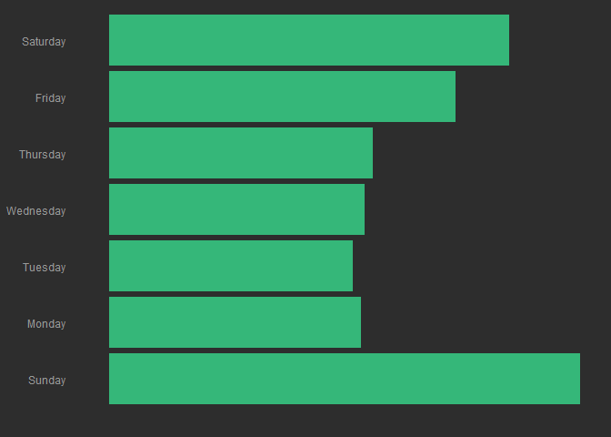
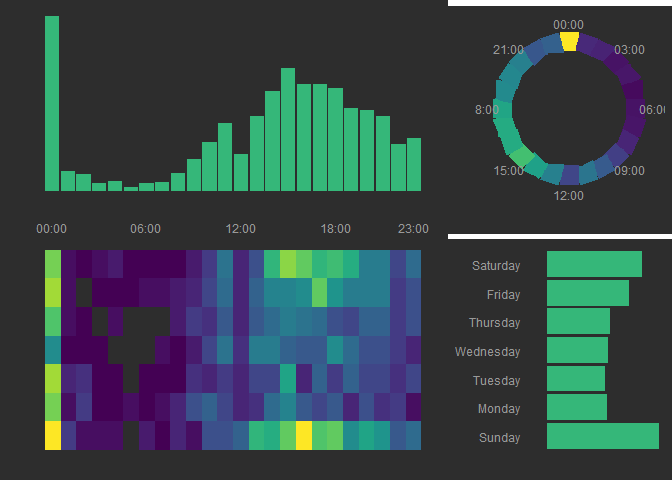
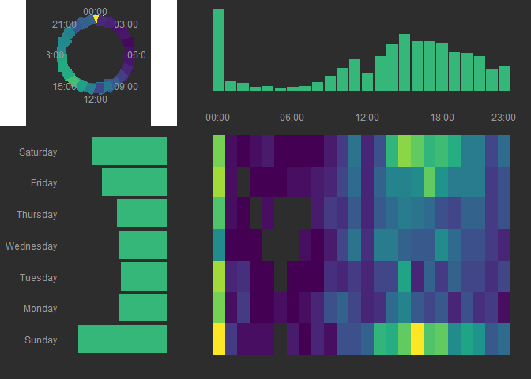

# 
Joshua Kunst  


```
## DEFINEDNAME: 00 00 00 06 0b 00 00 00 01 00 00 00 00 00 00 6f 77 73 73 76 72 3b 00 00 00 00 fc 02 00 00 05 00 
## DEFINEDNAME: 00 00 00 06 0b 00 00 00 01 00 00 00 00 00 00 6f 77 73 73 76 72 3b 00 00 00 00 fc 02 00 00 05 00 
## DEFINEDNAME: 00 00 00 06 0b 00 00 00 01 00 00 00 00 00 00 6f 77 73 73 76 72 3b 00 00 00 00 fc 02 00 00 05 00 
## DEFINEDNAME: 00 00 00 06 0b 00 00 00 01 00 00 00 00 00 00 6f 77 73 73 76 72 3b 00 00 00 00 fc 02 00 00 05 00
```

```
## Source: local data frame [1,347 x 3]
## 
##                     ts            city         state
##                 (time)           (chr)         (chr)
## 1  2014-11-13 15:33:59     Viginia Key       Florida
## 2  2014-11-13 16:44:00       Las Vegas        Nevada
## 3  2014-11-14 13:54:59     Los Angeles    California
## 4  2014-11-14 16:09:00         Norfolk      Virginia
## 5  2014-11-14 18:58:00      Scottsdale       Arizona
## 6  2014-11-15 14:29:59      Tuscaloosa       Alabama
## 7  2014-11-15 19:09:59 Fort Lauderdale       Florida
## 8  2014-11-18 17:10:00        New York      New York
## 9  2014-11-19 13:57:00        New York      New York
## 10 2014-11-19 16:17:00          Boston Massachusetts
## ..                 ...             ...           ...
```

```
## Source: local data frame [1,346 x 10]
## 
##                     ts            city         state  year year_mon
##                 (time)           (chr)         (chr) (chr)    (chr)
## 1  2014-11-13 15:33:59     Viginia Key       Florida  2014   201411
## 2  2014-11-13 16:44:00       Las Vegas        Nevada  2014   201411
## 3  2014-11-14 13:54:59     Los Angeles    California  2014   201411
## 4  2014-11-14 16:09:00         Norfolk      Virginia  2014   201411
## 5  2014-11-14 18:58:00      Scottsdale       Arizona  2014   201411
## 6  2014-11-15 14:29:59      Tuscaloosa       Alabama  2014   201411
## 7  2014-11-15 19:09:59 Fort Lauderdale       Florida  2014   201411
## 8  2014-11-18 17:10:00        New York      New York  2014   201411
## 9  2014-11-19 13:57:00        New York      New York  2014   201411
## 10 2014-11-19 16:17:00          Boston Massachusetts  2014   201411
## ..                 ...             ...           ...   ...      ...
## Variables not shown: ymd (date), yw (chr), hour (dbl), day (fctr), hr2
##   (dbl)
```

```
##  [1] "#440154FF" "#482878FF" "#3E4A89FF" "#31688EFF" "#26828EFF"
##  [6] "#1F9E89FF" "#35B779FF" "#6DCD59FF" "#B4DE2CFF" "#FDE725FF"
```




---
title: "readme.R"
author: "Joshua K"
date: "Tue Apr 05 04:00:37 2016"
---
