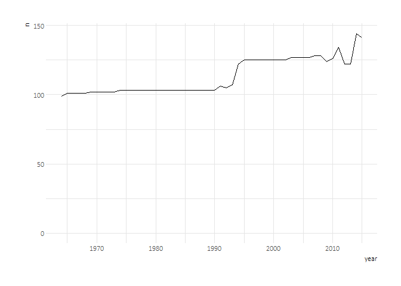
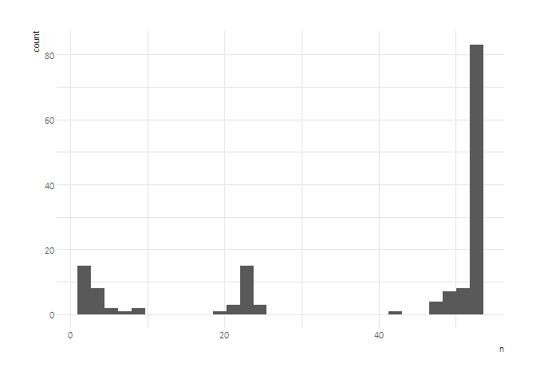
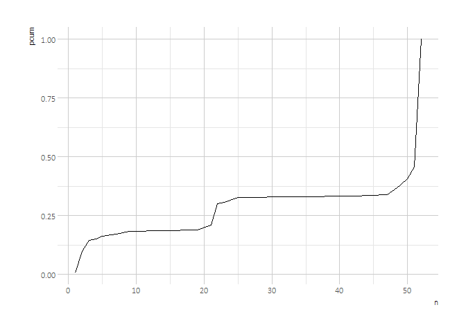
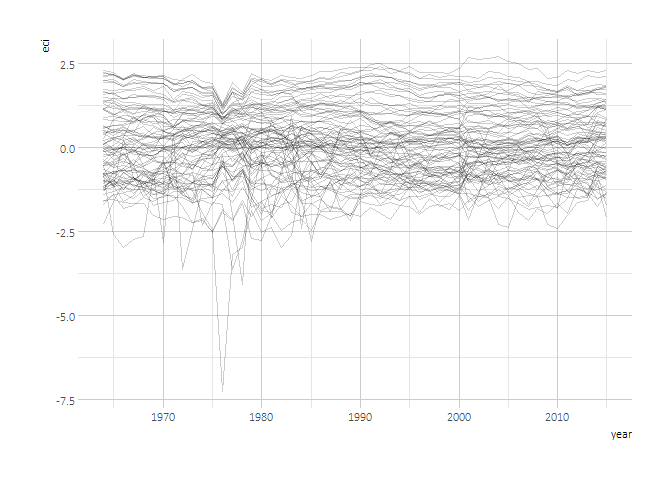
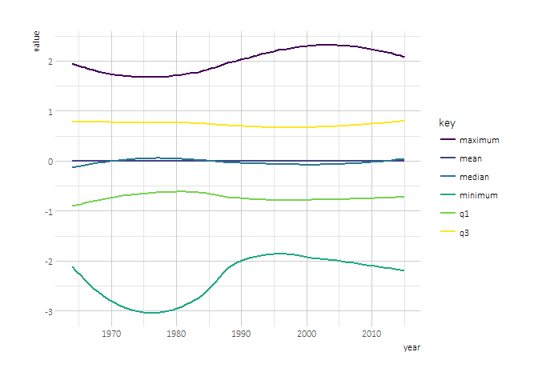

# 
Joshua Kunst  


```r
# packages ----------------------------------------------------------------
rm(list = ls())
library(tidyverse)
library(jbkmisc)
library(tidyr)
library(broom)
library(viridis)
theme_set(theme_jbk())

# data --------------------------------------------------------------------
# dprod <- read_csv("http://atlas.media.mit.edu/en/rankings/hs92/?download=true")
# names(dprod) <- tolower(names(dprod))
# dprod

data <- read_csv("http://atlas.media.mit.edu/en/rankings/country/?download=true")
names(data) <- tolower(names(data))
data
```

```
## # A tibble: 5,881 × 5
##     year  rank    id        country     eci
##    <int> <int> <chr>          <chr>   <dbl>
## 1   1964     1   che    Switzerland 2.30660
## 2   1964     2   swe         Sweden 2.25070
## 3   1964     3   aut        Austria 2.20926
## 4   1964     4   gbr United Kingdom 2.16646
## 5   1964     5   jpn          Japan 2.11512
## 6   1964     6   fra         France 2.01915
## 7   1964     7   usa  United States 2.01312
## 8   1964     8   ita          Italy 1.94026
## 9   1964     9   bel        Belgium 1.88107
## 10  1964    10   nor         Norway 1.73035
## # ... with 5,871 more rows
```

```r
# explore -----------------------------------------------------------------
data %>% 
  count(year) %>% 
  ggplot() +
  geom_line(aes(year, n)) + 
  scale_y_continuous(limits = c(0, NA))
```

<!-- -->

```r
countries_to_study <- data %>% 
  group_by(country) %>% 
  summarise(
    n = n(),
    year_min = min(year)
    ) %>% 
  arrange(n) %>% 
  mutate(pcum = ecdf(n)(n))

ggplot(countries_to_study) + 
  geom_histogram(aes(n))
```

<!-- -->

```r
ggplot(countries_to_study) + 
  geom_line(aes(n, pcum))
```

<!-- -->

```r
countries_to_study <- filter(countries_to_study, pcum > .5)

data <- semi_join(data, countries_to_study)

data %>% 
  count(country) %>% 
  count(n)
```

```
## # A tibble: 1 × 2
##       n    nn
##   <int> <int>
## 1    52    83
```

```r
ggplot(data) + 
  geom_line(aes(year, eci, group = country), alpha = 0.2)
```

<!-- -->

```r
filter(data, eci == min(eci))
```

```
## # A tibble: 1 × 5
##    year  rank    id      country      eci
##   <int> <int> <chr>        <chr>    <dbl>
## 1  1976   103   sau Saudi Arabia -7.24883
```

```r
ggplot(data) + 
  geom_density(aes(eci), fill = "gray90") + 
  facet_wrap(~  year) + 
  theme(
    panel.grid.major = element_line(colour = "transparent"),
    panel.grid.minor = element_line(colour = "transparent")
  )
```

<!-- -->

```r
data %>% 
  group_by(year) %>% 
  mutate(ecis = scale(eci)) %>%
  ungroup() %>% 
  group_by(year) %>% 
  do(tidy(summary(.$ecis))) %>%
  ungroup() %>% 
  gather(key, value, -year) %>% 
  ggplot() + 
  geom_smooth(aes(year, value, group = key, color = key), se = FALSE) + 
  scale_color_viridis(discrete = TRUE)
```

<!-- -->


---
title: "readme.R"
author: "Joshua"
date: "Sat Mar 18 01:34:24 2017"
---
