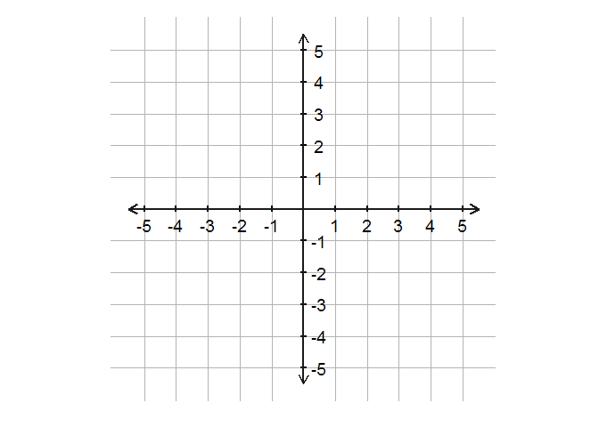
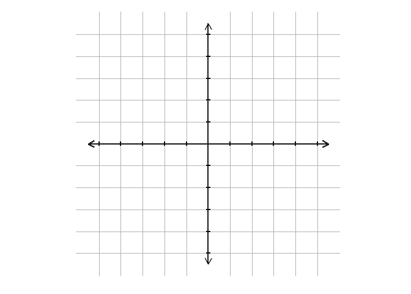

```r
library("ggplot2")
library("ggthemes")
library("stringr")
library("dplyr")
```

```
## 
## Attaching package: 'dplyr'
## 
## The following objects are masked from 'package:stats':
## 
##     filter, lag
## 
## The following objects are masked from 'package:base':
## 
##     intersect, setdiff, setequal, union
```

```r
library("grid")

rm(list = ls())
size <- 5
by <- 1
tick.size <- 0.1

gg_null <- function(){
 
  ggplot() +
    theme_map() +
    coord_equal()
  
}

df_cart_axis <- function(size = 5){
  
  offset <- 0.5
  
  size <- size + offset
  
  data_frame(x = c(-size, 0),
             y = c(0, -size),
             xend = c(size, 0),
             yend = c(0, size))
  
}

df_cart_labels <- function(size = 5, by = 1){
  
  axis <- seq(0, size, by = by)
  axis <- setdiff(axis, 0)
  axis <- c(-rev(axis), axis)
  
  axis0 <- rep(0, length(axis))
  
  df_labels <- data_frame(x = c(axis, axis0),
                          y = c(axis0, axis),
                          label = ifelse(x != 0, x, y))
  
  df_labels 
  
}

df_cart_ticks <- function(size = 5, by = 1, tick.size = 0.1){
 
  df_labels <- df_cart_labels(size, by)
  
  df_tcks_x <- df_labels %>% 
    filter(y == 0) %>% 
    select(x, y) %>% 
    mutate(xend = x, yend = y - tick.size, y = y + tick.size)
    
  df_tcks_y <- df_labels %>% 
    filter(x == 0) %>% 
    select(x, y) %>% 
    mutate(yend = y, xend = x - tick.size, x = x + tick.size)
  
  rbind(df_tcks_x, df_tcks_y)
  
}

df_cart_grid <- function(size = 5, by = 1){
  
  df_lines <- data_frame(x = seq(-size, size, by),
                         y = x) %>% 
    filter(x != 0)
  
}

gg_cartesian <- function(size = 5, by = 1, tick.size = 0.1,
                         axis = TRUE, labels = TRUE, ticks = TRUE, grid = TRUE){
  
  p <- gg_null()
  
  if(grid){
    df_grid <- df_cart_grid(size, by)
    p <- p + 
      geom_hline(data = df_grid, aes(yintercept = x), color = "gray70", size = 0.3) +
      geom_vline(data = df_grid, aes(xintercept = y), color = "gray70", size = 0.3)
    
  }
  
  if(ticks) {
    
    df_tcks <- df_cart_ticks(size, by, tick.size)
    
    p <- p + geom_segment(data = df_tcks, aes(x, y, xend = xend, yend = yend), size = 1.01) 
      
  }
  
  if(axis){
    
    df_cart <- df_cart_axis(size)
    
    p <- p +
      geom_segment(data = df_cart,
                   aes(x, y, xend = xend, yend = yend),
                   arrow = arrow(length = unit(0.30, "cm"), ends = "both"),
                   color = "gray10", size = 1.01) 
    
  }
  
  if(labels){
    
    df_lbls <- df_cart_labels(size, by)
    
    p <- p + 
      geom_text(data = df_lbls %>% filter(x == 0), aes(x + 0.5, y, label = label)) + 
      geom_text(data = df_lbls %>% filter(y == 0), aes(x, y - 0.5, label = label))
  
  }
 
  p
  
}


gg_cartesian()
```

 

```r
gg_cartesian(size = 10, by = 2)
```

 

```r
gg_cartesian(labels = FALSE)
```

 


---
title: "readme.R"
author: "Joshua K"
date: "Mon Aug 10 23:43:35 2015"
---
