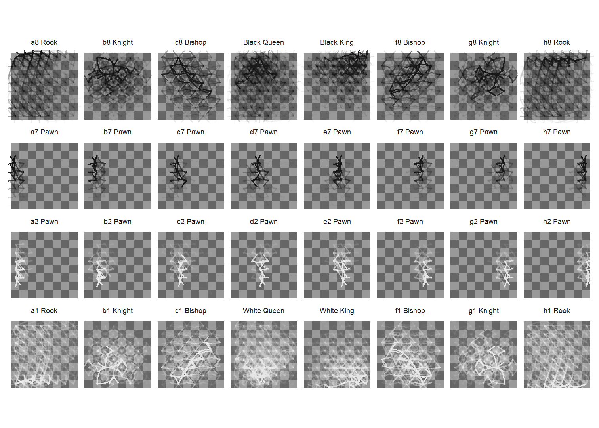
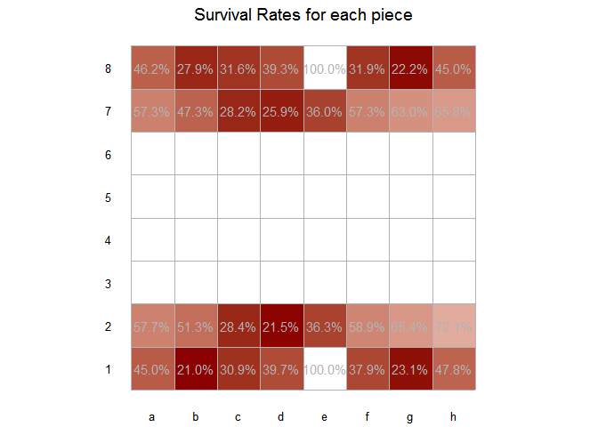
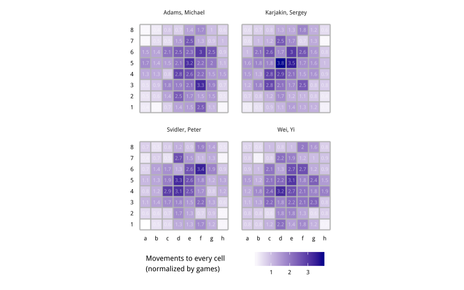

# Chess movements
Joshua Kunst  


# Intro
Some parameters


```r
url_base  <- "http://www.bakuworldcup2015.com/files/pgn/Round%s.pgn"
url_pgns <- laply(seq(6), function(round){ sprintf(url_base, round)})
url_pgns <- c(url_pgns, "http://www.bakuworldcup2015.com/files/pgn/baku-world-cup-2015.pgn")
url_pgns
```

```
## [1] "http://www.bakuworldcup2015.com/files/pgn/Round1.pgn"             
## [2] "http://www.bakuworldcup2015.com/files/pgn/Round2.pgn"             
## [3] "http://www.bakuworldcup2015.com/files/pgn/Round3.pgn"             
## [4] "http://www.bakuworldcup2015.com/files/pgn/Round4.pgn"             
## [5] "http://www.bakuworldcup2015.com/files/pgn/Round5.pgn"             
## [6] "http://www.bakuworldcup2015.com/files/pgn/Round6.pgn"             
## [7] "http://www.bakuworldcup2015.com/files/pgn/baku-world-cup-2015.pgn"
```

```r
set.seed(1)
prop_frac <- 10/100
```

# The magic parese function


```r
dfgames <- ldply(url_pgns, function(url_pgn) {
  # url_pgn <- sample(url_pgns, size = 1)
  # url_pgn <- "http://www.bakuworldcup2015.com/files/pgn/Round1.pgn"
  pgn_lines <- readLines(url_pgn, warn = FALSE)
  
  idx <- which(pgn_lines == "[Event \"FIDE World Chess Cup\"]")
  idxp1 <- idx + 1
  idxm1 <- idx - 1
  
  pgn_lines[pgn_lines == "[Event \"FIDE World Chess Cup\"]"] <- ""
  idxm1 <- idxm1[idxm1 >= 1]
  idxp1 <- idxp1[idxp1 <= length(pgn_lines)]
  pgn_lines <- pgn_lines[-c(idxp1, idxm1)]
  pgn_lines <- c("", pgn_lines)
  
  where_is_no_info <- which(str_length(pgn_lines) == 0)
  where_is_no_info <- where_is_no_info[seq(length(where_is_no_info)) %% 2 == 0]
  where_is_no_info <- c(0, where_is_no_info)
  
  df_cuts <- data_frame(from = head(where_is_no_info, -1) + 1,
                        to = tail(where_is_no_info, -1) - 1)
  
  df_cuts <- df_cuts %>% filter(!from == to)
  
  df_games <- ldply(seq(nrow(df_cuts)), function(row){ # row <- 3
    
    pgn <- pgn_lines[seq(df_cuts[row, ]$from, df_cuts[row, ]$to)]
    
    headers <- pgn[1:(which(pgn == "") - 1)]
    
    data_keys <- str_extract(headers, "\\w+")
    data_vals <- str_extract(headers, "\".*\"") %>% str_replace_all("\"", "")
    
    pgn2 <- pgn[(which(pgn == "") + 1):length(pgn)]
    pgn2 <- paste0(pgn2, collapse = "")
    pgn2 <- str_replace_all(pgn2, "\\{\\[%clk( |)\\d+:\\d+:\\d+\\]\\}", "")
    
    df_game <- t(data_vals) %>%
      data.frame(stringsAsFactors = FALSE) %>%
      setNames(data_keys) %>% 
      mutate(pgn = pgn2)
    
    df_game
    
  }, .progress = "win")
  
  df_games <- tbl_df(df_games)
  
  df_games
  
}, .progress = "win")

dfgames <- tbl_df(dfgames)

dfgames <- dfgames %>% mutate(game_id = seq(nrow(.)))

tail(dfgames)
```

```
## Source: local data frame [6 x 18]
## 
##         Date Round            White            Black Result Board
##        (chr) (chr)            (chr)            (chr)  (chr) (chr)
## 1 2015.10.03    57   Svidler, Peter Karjakin, Sergey    0-1     1
## 2 2015.10.04    58 Karjakin, Sergey   Svidler, Peter    1-0     1
## 3 2015.10.05    59 Karjakin, Sergey   Svidler, Peter    1-0     1
## 4 2015.10.05    60   Svidler, Peter Karjakin, Sergey    1-0     1
## 5 2015.10.05    61 Karjakin, Sergey   Svidler, Peter    0-1     1
## 6 2015.10.05    62   Svidler, Peter Karjakin, Sergey    0-1     1
## Variables not shown: WhiteTitle (chr), WhiteElo (chr), WhiteCountry (chr),
##   WhiteFideId (chr), WhiteEloChange (chr), BlackTitle (chr), BlackElo
##   (chr), BlackCountry (chr), BlackFideId (chr), BlackEloChange (chr), pgn
##   (chr), game_id (int)
```

```r
system.time({
  pgn <- sample(dfgames$pgn, size = 1)
  chss <- Chess$new()
  chss$load_pgn(pgn)
  chss$history_detail()  
})
```

# This took some time 


```r
library("foreach")
library("doParallel")
```

```
## Loading required package: iterators
## Loading required package: parallel
```

```r
workers <- makeCluster(parallel::detectCores())
registerDoParallel(workers)

system.time({
 dfmoves <- adply(dfgames %>% sample_frac(prop_frac) %>% select(pgn, game_id), .margins = 1, function(x){
   chss <- Chess$new()
   chss$load_pgn(x$pgn)
   chss$history_detail()
 }, .parallel = TRUE, .paropts = list(.packages = c("rchess")))
})
```

```
##    user  system elapsed 
##    0.13    0.02   25.10
```

# the beautiful result    


```r
dfmoves <- tbl_df(dfmoves) %>% select(-pgn)
head(dfmoves)
```

```
## Source: local data frame [6 x 9]
## 
##   game_id     piece  from    to number_move piece_number_move   status
##     (int)     (chr) (chr) (chr)       (int)             (int)    (chr)
## 1     226   a1 Rook    a1    c1          21                 1       NA
## 2     226   a1 Rook    c1    d1          33                 2       NA
## 3     226   a1 Rook    d1    d2          51                 3       NA
## 4     226   a1 Rook    d2    d4          69                 4 captured
## 5     226 b1 Knight    b1    d2           7                 1       NA
## 6     226 b1 Knight    d2    e4          25                 2 captured
## Variables not shown: number_move_capture (int), captured_by (chr)
```

# A nice data frame 


```r
dfboard <- rchess:::.chessboarddata() %>%
  select(cell, col, row, x, y, cc)
dfboard
```

```
## Source: local data frame [64 x 6]
## 
##     cell   col   row     x     y    cc
##    (chr) (chr) (int) (int) (int) (chr)
## 1     a1     a     1     1     1     b
## 2     b1     b     1     2     1     w
## 3     c1     c     1     3     1     b
## 4     d1     d     1     4     1     w
## 5     e1     e     1     5     1     b
## 6     f1     f     1     6     1     w
## 7     g1     g     1     7     1     b
## 8     h1     h     1     8     1     w
## 9     a2     a     2     1     2     w
## 10    b2     b     2     2     2     b
## ..   ...   ...   ...   ...   ...   ...
```

# Join


```r
dfmoves <- dfmoves %>% 
  left_join(dfboard %>% rename(from = cell, x.from = x, y.from = y), by = "from") %>% 
  left_join(dfboard %>% rename(to = cell, x.to = x, y.to = y) %>% select(-cc, -col, -row), by = "to") %>% 
  mutate(x_gt_y = abs(x.to - x.from) > abs(y.to - y.from),
         xy_sign = sign((x.to - x.from)*(y.to - y.from)) == 1,
         x_gt_y_equal_xy_sign = x_gt_y == xy_sign)
```

# Details


```r
piece_lvls <- dfmoves %>%
  filter(piece_number_move == 1) %>%
  select(piece, col, row) %>%
  distinct() %>% 
  arrange(desc(row), col) %>% 
  .$piece

dfmoves <- dfmoves %>% 
  mutate(piece = factor(piece, levels = piece_lvls),
         piece_color = ifelse(str_extract(piece, "\\d") %in% c("1", "2"), "white", "black"),
         piece_color = ifelse(str_detect(piece, "White"), "white", piece_color))
```

# The g1 Knight


```r
ggplot() + 
  geom_tile(data = dfboard, aes(x, y, fill = cc)) +
  geom_curve(data = dfmoves %>% filter(piece == "g1 Knight", x_gt_y_equal_xy_sign),
             aes(x = x.from, y = y.from, xend = x.to, yend = y.to),
             curvature = 0.50, angle = -45, alpha = 0.01, color = "white", size = 1.05,
             arrow = arrow(length = unit(0.25,"cm"))) + 
  geom_curve(data = dfmoves %>% filter(piece == "g1 Knight", !x_gt_y_equal_xy_sign),
             aes(x = x.from, y = y.from, xend = x.to, yend = y.to),
             curvature = -0.50, angle = 45, alpha = 0.01, color = "white", size = 1.05,
             arrow = arrow(length = unit(0.25,"cm"))) +
  scale_fill_manual(values =  c("gray40", "gray60")) +
  coord_equal() +
  ggthemes::theme_map() +
  theme(legend.position = "none",
        strip.background = element_blank(),
        strip.text = element_text(size = 10))
```

 

# The f8 Bishop


```r
ggplot() + 
  geom_tile(data = dfboard, aes(x, y, fill = cc)) +
  geom_curve(data = dfmoves %>% filter(piece == "f8 Bishop", x_gt_y_equal_xy_sign),
             aes(x = x.from, y = y.from, xend = x.to, yend = y.to),
             curvature = 0.50, angle = -45, alpha = 0.01, color = "black", size = 1.05,
             arrow = arrow(length = unit(0.25,"cm"))) + 
  geom_curve(data = dfmoves %>% filter(piece == "f8 Bishop", !x_gt_y_equal_xy_sign),
             aes(x = x.from, y = y.from, xend = x.to, yend = y.to),
             curvature = -0.50, angle = 45, alpha = 0.01, color = "black", size = 1.05,
             arrow = arrow(length = unit(0.25,"cm"))) +
  scale_fill_manual(values =  c("gray40", "gray60")) +
  coord_equal() +
  ggthemes::theme_map() +
  theme(legend.position = "none",
        strip.background = element_blank(),
        strip.text = element_text(size = 10))
```

 

# All pieces just because we can


```r
dfmoves2 <- dfmoves %>% sample_frac(prop_frac)
```

```r
ggplot() +
  geom_tile(data = dfboard, aes(x, y, fill = cc)) +
  geom_curve(data = dfmoves2 %>% filter(x_gt_y_equal_xy_sign),
             aes(x = x.from, y = y.from, xend = x.to, yend = y.to, color = piece_color),
             curvature = 0.50, angle = -45, alpha = 0.05,
             arrow = arrow(length = unit(0.25,"cm"))) + 
  geom_curve(data = dfmoves2 %>% filter(!x_gt_y_equal_xy_sign),
             aes(x = x.from, y = y.from, xend = x.to, yend = y.to, color = piece_color),
             curvature = -0.50, angle = 45, alpha = 0.05,
             arrow = arrow(length = unit(0.25,"cm"))) +
  scale_fill_manual(values =  c("gray40", "gray60")) +
  scale_color_manual(values =  c("black", "white")) +
  facet_wrap(~piece, nrow = 4, ncol = 8) + 
  coord_equal() +
  ggthemes::theme_map() +
  theme(legend.position = "none",
        strip.background = element_blank(),
        strip.text = element_text(size = 10))
```

 

```r
# ggsave("~/../Desktop/Rplot.pdf", width = 16, height = 9, scale = 2)
```


---
title: "readme.R"
author: "jkunst"
date: "Fri Oct 23 16:59:59 2015"
---
