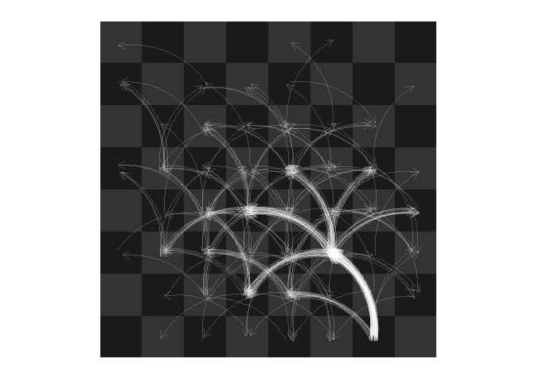

# Chess movements
Joshua Kunst  


Plots a chess data


```r
chessboardjs()
```

<!--html_preserve--><div id="htmlwidget-1128" style="width:300px;height:300px;" class="chessboardjs"></div>
<script type="application/json" data-for="htmlwidget-1128">{"x":{"fen":"rnbqkbnr/pppppppp/8/8/8/8/PPPPPPPP/RNBQKBNR w KQkq - 0 1"},"evals":[]}</script><!--/html_preserve-->

Example Game


```r
dfmvex <- dfmoves %>% filter(game_id == 1)
dfmvex
```

```
## Source: local data frame [85 x 10]
## 
##    game_id color  from    to flags piece   san captured number_move
##      (int) (chr) (chr) (chr) (chr) (chr) (chr)    (chr)       (int)
## 1        1     w    g1    f3     n     n   Nf3       NA           1
## 2        1     b    g8    f6     n     n   Nf6       NA           2
## 3        1     w    c2    c4     b     p    c4       NA           3
## 4        1     b    g7    g6     n     p    g6       NA           4
## 5        1     w    g2    g3     n     p    g3       NA           5
## 6        1     b    f8    g7     n     b   Bg7       NA           6
## 7        1     w    f1    g2     n     b   Bg2       NA           7
## 8        1     b    c7    c5     b     p    c5       NA           8
## 9        1     w    d2    d4     b     p    d4       NA           9
## 10       1     b    c5    d4     c     p  cxd4        p          10
## ..     ...   ...   ...   ...   ...   ...   ...      ...         ...
## Variables not shown: promotion (chr)
```

Lets check king knigth. This pices start in 


```r
chss <- Chess$new()
chss$clear()
chss$put("n", "w", "g1")
```

```
## [1] TRUE
```

```r
plot(chss)
```

<!--html_preserve--><div id="htmlwidget-9037" style="width:300px;height:300px;" class="chessboardjs"></div>
<script type="application/json" data-for="htmlwidget-9037">{"x":{"fen":"8/8/8/8/8/8/8/6N1 w - - 0 1"},"evals":[]}</script><!--/html_preserve-->

Some details of parameters


```r
pos_start <- "g1"
pos_current <- pos_start
pos_nummove <- 0
piece_was_captured <- FALSE
path <- NULL
path <- c(path, pos_current)

while (!piece_was_captured) {
  message(pos_current, " ", pos_nummove)
  # Maybe the piece was capture and have no movements :(,
  # thats why check from and to variable.
  dfmvex_aux <- dfmvex %>%
    filter(from == pos_current | to == pos_current,
           number_move > pos_nummove) %>% 
    head(1)
  
  # The game is over?
  if (nrow(dfmvex_aux) == 0) break
  
  # Check if the piece was captured :(
  if (dfmvex_aux$to == pos_current) break
  
  pos_current <- dfmvex_aux$to
  pos_nummove <- dfmvex_aux$number_move
  
  path <- c(path, pos_current)
  
}
```

```
## g1 0
## f3 1
## d4 11
## c2 25
## e3 27
## d5 29
## f4 41
```

Creating data to plot


```r
dfboard <- rchess:::.chessboarddata() %>% select(cell, col, row, x, y, cc)

dfpaths <- data_frame(from = head(path, -1),
                      to = tail(path, -1))

dfpaths <- dfpaths %>% 
  left_join(dfboard %>% rename(from = cell), by = "from") %>% 
  left_join(dfboard %>% rename(to = cell) %>% select(-cc), by = "to") %>% 
  mutate(curve = ifelse((x.x - x.y) < 0, TRUE, FALSE))


ggplot() +
  geom_tile(data = dfboard, aes(x, y, fill = cc)) +
  geom_curve(data = dfpaths %>% filter(curve),
             aes(x = x.x, y = y.x, xend = x.y, yend = y.y), color = "white", alpha = 0.5, curvature = -.3,
             arrow = arrow(length = unit(0.25,"cm")), position =  position_jitter(w = 0.25, h = 0.25)) +
  geom_curve(data = dfpaths %>% filter(!curve),
             aes(x = x.x, y = y.x, xend = x.y, yend = y.y), color = "white", alpha = 0.25, curvature = .3,
             arrow = arrow(length = unit(0.25,"cm")), position =  position_jitter(w = 0.25, h = 0.25)) +
  scale_fill_manual(values =  c("gray10", "gray20")) +
  coord_equal() + 
  ggthemes::theme_map() +
  theme(legend.position = "none")
```

```
## Warning: replacing previous import by 'grid::arrow' when loading 'ggthemes'
```

```
## Warning: replacing previous import by 'grid::unit' when loading 'ggthemes'
```

```
## Warning: replacing previous import by 'scales::alpha' when loading
## 'ggthemes'
```

 

```r
dfpaths <- dfmoves %>% 
  group_by(game_id) %>% 
  do({
    dfmvex <- .
    #' Some details of parameters
    pos_start <- "g1"
    pos_current <- pos_start
    pos_nummove <- 0
    piece_was_captured <- FALSE
    path <- NULL
    path <- c(path, pos_current)
    
    while (!piece_was_captured) {
      dfmvex_aux <- dfmvex %>%
        filter(from == pos_current | to == pos_current,
               number_move > pos_nummove) %>% 
        head(1)
      
      if (nrow(dfmvex_aux) == 0) break
      if (dfmvex_aux$to == pos_current) break
      
      pos_current <- dfmvex_aux$to
      pos_nummove <- dfmvex_aux$number_move
      
      path <- c(path, pos_current)
    }
    
    dfpaths <- data_frame(from = head(path, -1),
                          to = tail(path, -1))
    
    dfpaths
    
  })


dfpaths <- dfpaths %>% 
  left_join(dfboard %>% rename(from = cell), by = "from") %>% 
  left_join(dfboard %>% rename(to = cell) %>% select(-cc), by = "to") %>% 
  mutate(curve = ifelse((x.x - x.y) < 0, TRUE, FALSE))


ggplot() +
  geom_tile(data = dfboard, aes(x, y, fill = cc)) +
  geom_curve(data = dfpaths %>% filter(curve),
             aes(x = x.x, y = y.x, xend = x.y, yend = y.y), color = "white", alpha = 0.2, curvature = -.3,
             arrow = arrow(length = unit(0.25,"cm")), position =  position_jitter(w = 0.25, h = 0.25)) +
  geom_curve(data = dfpaths %>% filter(!curve),
             aes(x = x.x, y = y.x, xend = x.y, yend = y.y), color = "white", alpha = 0.2, curvature = .3,
             arrow = arrow(length = unit(0.25,"cm")), position =  position_jitter(w = 0.25, h = 0.25)) +
  scale_fill_manual(values =  c("gray10", "gray20")) +
  coord_equal() + 
  ggthemes::theme_map() +
  theme(legend.position = "none")
```

 

```r
ggplot() +
  geom_tile(data = dfboard, aes(x, y, fill = cc)) +
  geom_point(data = dfpaths, aes(x.x, y.x), position =  position_jitter(w = 0.25, h = 0.25),
             color = "white", alpha = 0.1) +
  geom_curve(data = dfpaths %>% filter(curve),
             aes(x = x.x, y = y.x, xend = x.y, yend = y.y), color = "white", alpha = 0.2, curvature = -.3,
             position =  position_jitter(w = 0.25, h = 0.25)) +
  geom_curve(data = dfpaths %>% filter(!curve),
             aes(x = x.x, y = y.x, xend = x.y, yend = y.y), color = "white", alpha = 0.2, curvature = .3,
             position =  position_jitter(w = 0.25, h = 0.25)) +
  scale_fill_manual(values =  c("gray10", "gray20")) +
  coord_equal() + 
  ggthemes::theme_map() +
  theme(legend.position = "none")
```

 


---
title: "readme.R"
author: "Joshua K"
date: "Fri Oct 16 01:03:28 2015"
---
