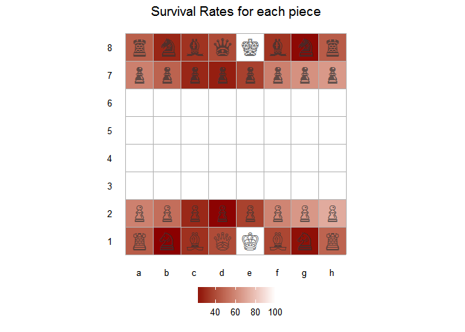
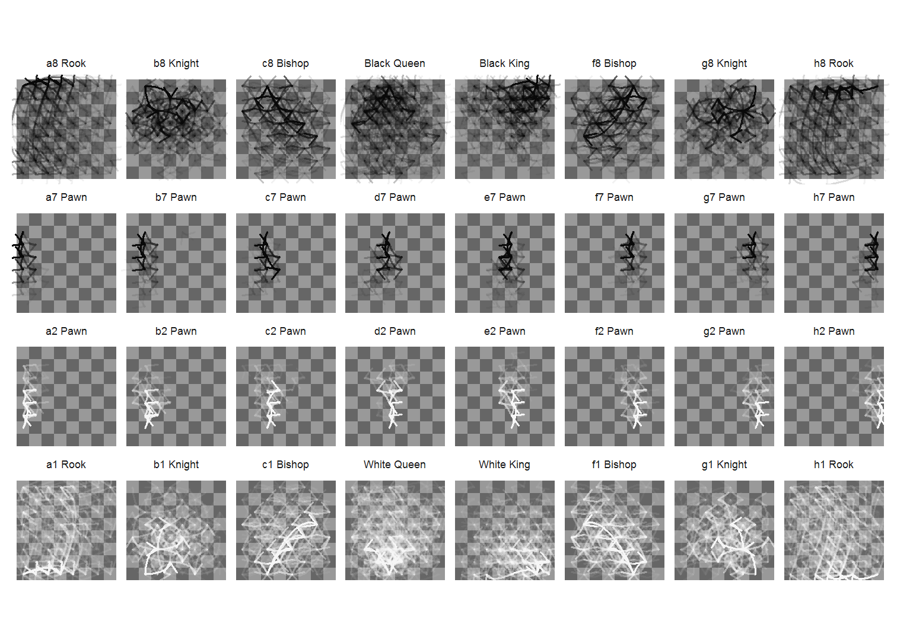
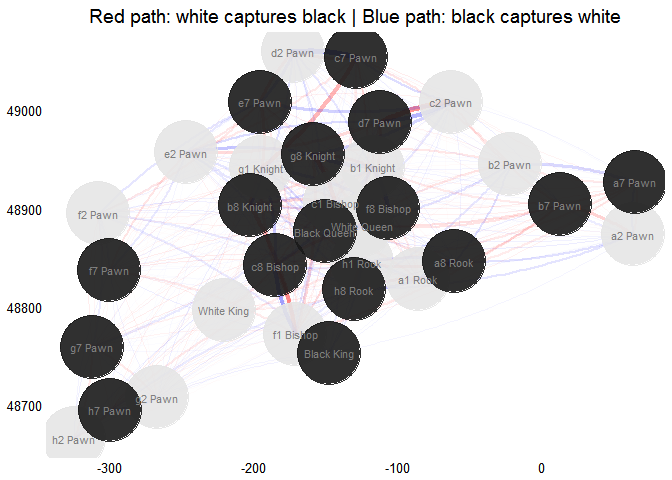
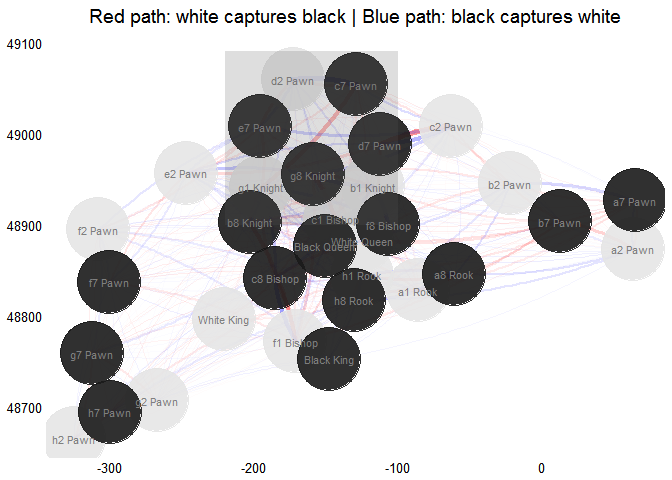

# Chess Vizs
Joshua Kunst  


### Intro
- Pieces movements
- Piece survavility
- Square usage by player
- tree movements
### The Data


```r
data(chesswc)
head(chesswc)
```

```
## Source: local data frame [6 x 11]
## 
##                 event                site       date round
##                 (chr)               (chr)     (date) (dbl)
## 1 FIDE World Cup 2011 Khanty-Mansiysk RUS 2011-08-28   1.1
## 2 FIDE World Cup 2011 Khanty-Mansiysk RUS 2011-08-28   1.1
## 3 FIDE World Cup 2011 Khanty-Mansiysk RUS 2011-08-28   1.1
## 4 FIDE World Cup 2011 Khanty-Mansiysk RUS 2011-08-28   1.1
## 5 FIDE World Cup 2011 Khanty-Mansiysk RUS 2011-08-28   1.1
## 6 FIDE World Cup 2011 Khanty-Mansiysk RUS 2011-08-28   1.1
## Variables not shown: white (chr), black (chr), result (chr), whiteelo
##   (int), blackelo (int), eco (chr), pgn (chr)
```

```r
chesswc %>% count(event)
```

```
## Source: local data frame [3 x 2]
## 
##                 event     n
##                 (chr) (int)
## 1 FIDE World Cup 2011   398
## 2 FIDE World Cup 2013   435
## 3 FIDE World Cup 2015   433
```

```r
chesswc %>% count(white) %>% arrange(desc(n))
```

```
## Source: local data frame [240 x 2]
## 
##                       white     n
##                       (chr) (int)
## 1            Svidler, Peter    35
## 2          Karjakin, Sergey    31
## 3       Grischuk, Alexander    25
## 4       Tomashevsky, Evgeny    25
## 5         Andreikin, Dmitry    22
## 6  Dominguez Perez, Leinier    21
## 7         Ivanchuk, Vassily    21
## 8    Bruzon Batista, Lazaro    19
## 9    Mamedyarov, Shakhriyar    19
## 10       Ponomariov, Ruslan    19
## ..                      ...   ...
```

```r
chesswc <- chesswc %>% filter(event == "FIDE World Cup 2015")
```

### Problem format


```r
system.time({
  pgn <- sample(chesswc$pgn, size = 1)
  chss <- Chess$new()
  chss$load_pgn(pgn)
  chss$history_detail()
})
```

### Parallel process


```r
library("foreach")
library("doParallel")
```

```
## Loading required package: iterators
## Loading required package: parallel
```

```r
workers <- makeCluster(parallel::detectCores())
registerDoParallel(workers)

chesswc <- chesswc %>% mutate(game_id = seq(nrow(.)))

dfmoves <- adply(chesswc %>% select(pgn, game_id), .margins = 1, function(x){
  chss <- Chess$new()
  chss$load_pgn(x$pgn)
  chss$history_detail()
  }, .parallel = TRUE, .paropts = list(.packages = c("rchess")))
```

### The beautiful result    


```r
dfmoves <- tbl_df(dfmoves) %>% select(-pgn)
head(dfmoves)
```

```
## Source: local data frame [6 x 9]
## 
##   game_id     piece  from    to number_move piece_number_move   status
##     (int)     (chr) (chr) (chr)       (int)             (int)    (chr)
## 1       1   a1 Rook    a1    c1          57                 1       NA
## 2       1   a1 Rook    c1    h1          65                 2       NA
## 3       1   a1 Rook    h1    h5          73                 3       NA
## 4       1   a1 Rook    h5    h7          89                 4       NA
## 5       1   a1 Rook    h7    e7          95                 5 captured
## 6       1 b1 Knight    b1    d2          13                 1       NA
## Variables not shown: number_move_capture (int), captured_by (chr)
```

### Auxiliar dataframe


```r
dfboard <- rchess:::.chessboarddata() %>%
  select(cell, col, row, x, y, cc)
dfboard
```

```
## Source: local data frame [64 x 6]
## 
##     cell   col   row     x     y    cc
##    (chr) (chr) (int) (int) (int) (chr)
## 1     a1     a     1     1     1     b
## 2     b1     b     1     2     1     w
## 3     c1     c     1     3     1     b
## 4     d1     d     1     4     1     w
## 5     e1     e     1     5     1     b
## 6     f1     f     1     6     1     w
## 7     g1     g     1     7     1     b
## 8     h1     h     1     8     1     w
## 9     a2     a     2     1     2     w
## 10    b2     b     2     2     2     b
## ..   ...   ...   ...   ...   ...   ...
```

### Join


```r
dfpaths <- dfmoves %>% 
  left_join(dfboard %>% rename(from = cell, x.from = x, y.from = y), by = "from") %>% 
  left_join(dfboard %>% rename(to = cell, x.to = x, y.to = y) %>% select(-cc, -col, -row), by = "to") %>% 
  mutate(x_gt_y = abs(x.to - x.from) > abs(y.to - y.from),
         xy_sign = sign((x.to - x.from)*(y.to - y.from)) == 1,
         x_gt_y_equal_xy_sign = x_gt_y == xy_sign)
```

# Details


```r
piece_lvls <- dfpaths %>%
  filter(piece_number_move == 1) %>%
  select(piece, col, row) %>%
  distinct() %>% 
  arrange(desc(row), col) %>% 
  .$piece

dfpaths <- dfpaths %>% 
  mutate(piece = factor(piece, levels = piece_lvls),
         piece_color = ifelse(str_extract(piece, "\\d") %in% c("1", "2"), "white", "black"),
         piece_color = ifelse(str_detect(piece, "White"), "white", piece_color))
```

### Paths
The f1 Bishop


```r
ggplot() + 
  geom_tile(data = dfboard, aes(x, y, fill = cc)) +
  geom_curve(data = dfpaths %>% filter(piece == "f1 Bishop", x_gt_y_equal_xy_sign),
             aes(x = x.from, y = y.from, xend = x.to, yend = y.to),
             position = position_jitter(width = 0.2, height = 0.2),
             curvature = 0.50, angle = -45, alpha = 0.02, color = "white", size = 1.05) + 
  geom_curve(data = dfpaths %>% filter(piece == "f1 Bishop", !x_gt_y_equal_xy_sign),
             aes(x = x.from, y = y.from, xend = x.to, yend = y.to),
             position = position_jitter(width = 0.2, height = 0.2),
             curvature = -0.50, angle = 45, alpha = 0.02, color = "white", size = 1.05) +
  scale_fill_manual(values =  c("gray10", "gray20")) +
  coord_equal() +
  ggthemes::theme_map() +
  ggtitle("f1 Bishop") + 
  theme(legend.position = "none", title = element_text(size = 12))
```

 

# The g8 Knight


```r
ggplot() + 
  geom_tile(data = dfboard, aes(x, y, fill = cc)) +
  geom_curve(data = dfpaths %>% filter(piece == "g8 Knight", x_gt_y_equal_xy_sign),
             aes(x = x.from, y = y.from, xend = x.to, yend = y.to),
             position = position_jitter(width = 0.2, height = 0.2),
             curvature = 0.50, angle = -45, alpha = 0.02, color = "black", size = 1.05) + 
  geom_curve(data = dfpaths %>% filter(piece == "g8 Knight", !x_gt_y_equal_xy_sign),
             aes(x = x.from, y = y.from, xend = x.to, yend = y.to),
             position = position_jitter(width = 0.2, height = 0.2),
             curvature = -0.50, angle = 45, alpha = 0.02, color = "black", size = 1.05) +
  scale_fill_manual(values =  c("gray80", "gray90")) +
  coord_equal() +
  ggthemes::theme_map() +
  ggtitle("g8 Knight") + 
  theme(legend.position = "none", title = element_text(size = 12))
```

 

# All pieces just because we can


```r
ggplot() +
  geom_tile(data = dfboard, aes(x, y, fill = cc)) +
  geom_curve(data = dfpaths %>% filter(x_gt_y_equal_xy_sign),
             aes(x = x.from, y = y.from, xend = x.to, yend = y.to, color = piece_color),
             position = position_jitter(width = 0.2, height = 0.2),
             curvature = 0.50, angle = -45, alpha = 0.02) + 
  geom_curve(data = dfpaths %>% filter(!x_gt_y_equal_xy_sign),
             aes(x = x.from, y = y.from, xend = x.to, yend = y.to, color = piece_color),
             position = position_jitter(width = 0.2, height = 0.2),
             curvature = -0.50, angle = 45, alpha = 0.02) +
  scale_fill_manual(values =  c("gray40", "gray60")) +
  scale_color_manual(values =  c("black", "white")) +
  facet_wrap(~piece, nrow = 4, ncol = 8) + 
  coord_equal() +
  ggthemes::theme_map() +
  theme(legend.position = "none",
        strip.background = element_blank(),
        strip.text = element_text(size = 6))
```

 

```r
# ggsave("~/../Desktop/Rplot.pdf", width = 16, height = 9, scale = 2)
```

### Suvival rates


```r
dfsurvrates <- dfmoves %>%
  filter(!is.na(status)) %>% 
  group_by(piece) %>% 
  summarize(games = n(),
            was_captured = sum(status == "captured")) %>% 
  mutate(surv_rate = 1 - was_captured/games)

dfsurvrates <- dfsurvrates %>%
  left_join(rchess:::.chesspiecedata() %>% select(start_position, piece = name, color, unicode),
            by = "piece") %>% 
  full_join(dfboard %>% rename(start_position = cell),
            by = "start_position")

dfboard2 <- data_frame(x = 0:8 + 0.5, y = 0 + 0.5, xend = 0:8 + 0.5, yend = 8 + 0.5)

ggplot(dfsurvrates) + 
  geom_tile(data = dfsurvrates %>% filter(!is.na(surv_rate)),
            aes(x, y, fill = surv_rate)) + 
  scale_fill_gradient(low = "darkred",  high = "white") + 
  geom_text(data = dfsurvrates %>% filter(!is.na(surv_rate)),
            aes(x, y, label = scales::percent(surv_rate)),
            color = "gray70", size = 4) +
  theme_minimal() + 
  scale_x_continuous(breaks = 1:8, labels = letters[1:8]) +
  scale_y_continuous(breaks = 1:8, labels = 1:8)  + 
  geom_segment(data = dfboard2, aes(x, y, xend = xend, yend = yend), color = "gray70") + 
  geom_segment(data = dfboard2, aes(y, x, xend = yend, yend = xend), color = "gray70") + 
  theme(legend.position = "none",
        panel.grid = element_blank(),
        axis.title = element_blank()) +
  coord_equal() + 
  ggtitle("Survival Rates for each piece")
```

 

```r
ggplot(dfsurvrates) + 
  geom_tile(data = dfsurvrates %>% filter(!is.na(surv_rate)),
            aes(x, y, fill = 100*surv_rate)) + 
  scale_fill_gradient(NULL, low = "darkred",  high = "white") + 
  geom_text(data = dfsurvrates %>% filter(!is.na(surv_rate)),
            aes(x, y, label = unicode), size = 8, color = "gray20", alpha = 0.7) +
  theme_minimal() + 
  scale_x_continuous(breaks = 1:8, labels = letters[1:8]) +
  scale_y_continuous(breaks = 1:8, labels = 1:8)  + 
  geom_segment(data = dfboard2, aes(x, y, xend = xend, yend = yend), color = "gray70") + 
  geom_segment(data = dfboard2, aes(y, x, xend = yend, yend = xend), color = "gray70") + 
  theme(legend.position = "bottom",
        panel.grid = element_blank(),
        axis.title = element_blank()) +
  coord_equal() + 
  ggtitle("Survival Rates for each piece")
```

 

### Square usage by player


```r
count(chesswc, white) %>% arrange(desc(n))
```

```
## Source: local data frame [128 x 2]
## 
##                  white     n
##                  (chr) (int)
## 1     Karjakin, Sergey    18
## 2       Svidler, Peter    15
## 3              Wei, Yi    12
## 4       Adams, Michael    11
## 5  Nepomniachtchi, Ian    11
## 6       Eljanov, Pavel     9
## 7    Jakovenko, Dmitry     9
## 8     Nakamura, Hikaru     9
## 9          Giri, Anish     8
## 10 Grischuk, Alexander     8
## ..                 ...   ...
```

```r
players <- count(chesswc, white) %>% arrange(desc(n)) %>% .$white %>% head(4)

dfmov_players <- ldply(players, function(p){ # p <- sample(players, size = 1)
  games <- chesswc %>% filter(white == p) %>% .$game_id
  dfres <- dfmoves %>%
    filter(game_id %in% games, !is.na(to)) %>%
    count(to) %>%
    mutate(player = p,
           p = n/length(games))
  dfres
})

dfmov_players <- dfmov_players %>%
  rename(cell = to) %>%
  left_join(dfboard, by = "cell")

ggplot(dfmov_players) + 
  geom_tile(aes(x, row, fill = p)) +
  scale_fill_gradient("Movements to every cell\n(normalized by games)") + 
  geom_text(aes(x, row, label = round(p, 2)), color = "white", alpha = 0.5) +
  facet_wrap(~player) + 
  coord_equal() +
  theme_minimal() + 
  scale_x_continuous(breaks = 1:8, labels = letters[1:8]) +
  scale_y_continuous(breaks = 1:8, labels = 1:8)  + 
  geom_segment(data = dfboard2, aes(x, y, xend = xend, yend = yend), color = "gray70") + 
  geom_segment(data = dfboard2, aes(y, x, xend = yend, yend = xend), color = "gray70") + 
  theme(legend.position = "bottom",
        panel.grid = element_blank(),
        axis.title = element_blank())
```

 

### Distributions of the pieces first movement and when pieces are captured


```r
dfmoves_first_mvm <- dfmoves %>% 
  mutate(piece = factor(piece, levels = piece_lvls)) %>% 
  filter(piece_number_move == 1)

ggplot(dfmoves_first_mvm) + 
  geom_density(aes(number_move), fill = "darkblue", alpha = 0.8, color = NA) + 
  theme_minimal() + 
  scale_y_continuous(breaks = NULL) +
  facet_wrap(~piece, nrow = 4, ncol = 8)  +
  xlim(0, 75)
```

 

### Captured by


```r
library("igraph")
```

```
## 
## Attaching package: 'igraph'
## 
## The following object is masked from 'package:stringr':
## 
##     %>%
## 
## The following objects are masked from 'package:dplyr':
## 
##     %>%, as_data_frame, groups, union
## 
## The following objects are masked from 'package:stats':
## 
##     decompose, spectrum
## 
## The following object is masked from 'package:base':
## 
##     union
```

```r
library("ForceAtlas2")

dfcaputures <- dfmoves %>% 
  filter(status == "captured") %>% 
  count(piece, captured_by) %>% 
  arrange(desc(n))

dfvertices <- rchess:::.chesspiecedata() %>%
  select(-fen, -start_position) %>% 
  mutate(color = ifelse(color == "w", "gray20", "gray80"))

g <- graph.data.frame(dfcaputures %>% select(captured_by, piece, weight = n),
                      directed = TRUE,
                      vertices = dfvertices)

set.seed(123)
lout <- layout.forceatlas2(g, iterations = 5000, plotstep = 0)

dfvertices <- dfvertices %>% 
  mutate(x = lout[, 1],
         y = lout[, 2])
  
dfedges <- as_data_frame(g, "edges") %>% 
  tbl_df() %>% 
  left_join(dfvertices %>% select(from = name, x, y), by = "from") %>% 
  left_join(dfvertices %>% select(to = name, xend = x, yend = y), by = "to")


p <- ggplot() + 
  geom_curve(data = dfedges %>% filter((str_extract(from, "\\d+") %in% c(1, 2) | str_detect(from, "White"))),
             aes(x, y, xend = xend, yend = yend, alpha = weight, size = weight),
             curvature = 0.1, color = "red") +
  geom_curve(data = dfedges %>% filter(!(str_extract(from, "\\d+") %in% c(1, 2) | str_detect(from, "White"))),
             aes(x, y, xend = xend, yend = yend, alpha = weight, size = weight),
             curvature = 0.1, color = "blue") +
  scale_alpha(range = c(0.01, 0.5)) + 
  scale_size(range = c(0.01, 2)) + 
  geom_point(data = dfvertices, aes(x, y, color = color), size = 22, alpha = 0.9) + 
  scale_color_manual(values = c("gray90", "gray10")) +
  geom_text(data = dfvertices, aes(x, y, label = name), size = 3, color = "gray50") +
  theme_minimal() +
  theme(legend.position = "none",
        panel.background = element_blank(),
        panel.grid = element_blank(),
        axis.title = element_blank()) +
  ggtitle("Red path: white captures black | Blue path: black captures white")

p
```

 

```r
p + geom_rect(aes(xmin = -220, xmax = -100, ymin = 48900, ymax = 49090), alpha = 0.2)
```

 

```r
dfmoves %>% filter(captured_by == "g1 Knight", piece == "c7 Pawn")
```

```
## Source: local data frame [75 x 9]
## 
##    game_id   piece  from    to number_move piece_number_move   status
##      (int)   (chr) (chr) (chr)       (int)             (int)    (chr)
## 1        4 c7 Pawn    c5    d4           6                 2 captured
## 2       18 c7 Pawn    c5    d4           6                 2 captured
## 3       21 c7 Pawn    c5    d4           6                 2 captured
## 4       22 c7 Pawn    c5    d4           8                 2 captured
## 5       27 c7 Pawn    c5    d4           6                 2 captured
## 6       34 c7 Pawn    c5    d4           6                 2 captured
## 7       36 c7 Pawn    c5    d4          12                 2 captured
## 8       41 c7 Pawn    c5    d4          14                 2 captured
## 9       42 c7 Pawn    c5    d4           8                 2 captured
## 10      51 c7 Pawn    c5    d4          38                 3 captured
## ..     ...     ...   ...   ...         ...               ...      ...
## Variables not shown: number_move_capture (int), captured_by (chr)
```

```r
dfmoves %>% filter(captured_by == "c7 Pawn", piece == "d2 Pawn")
```

```
## Source: local data frame [134 x 9]
## 
##    game_id   piece  from    to number_move piece_number_move   status
##      (int)   (chr) (chr) (chr)       (int)             (int)    (chr)
## 1        4 d2 Pawn    d2    d4           5                 1 captured
## 2        5 d2 Pawn    d2    d4           9                 1 captured
## 3       12 d2 Pawn    d2    d4           1                 1 captured
## 4       14 d2 Pawn    d2    d4          13                 1 captured
## 5       18 d2 Pawn    d2    d4           5                 1 captured
## 6       20 d2 Pawn    d2    d4           1                 1 captured
## 7       21 d2 Pawn    d2    d4           5                 1 captured
## 8       22 d2 Pawn    d2    d4           7                 1 captured
## 9       24 d2 Pawn    d3    d4          27                 2 captured
## 10      25 d2 Pawn    d2    d4           1                 1 captured
## ..     ...     ...   ...   ...         ...               ...      ...
## Variables not shown: number_move_capture (int), captured_by (chr)
```


---
title: "readme.R"
author: "jkunst"
date: "Tue Oct 27 17:39:02 2015"
---
