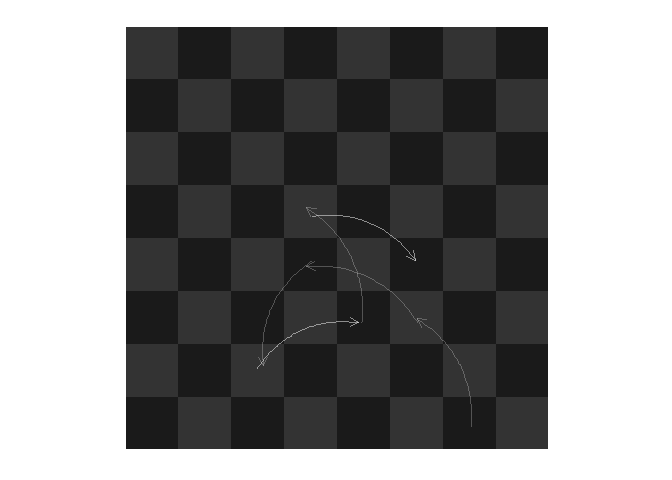
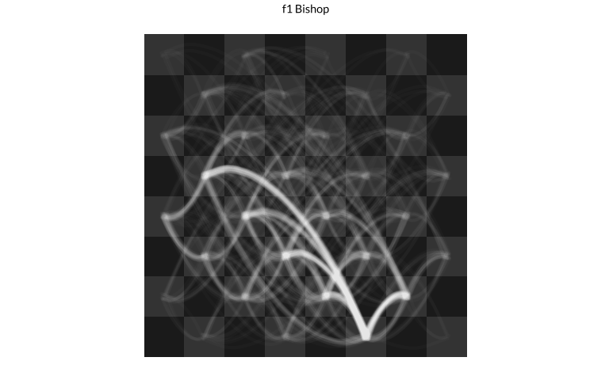
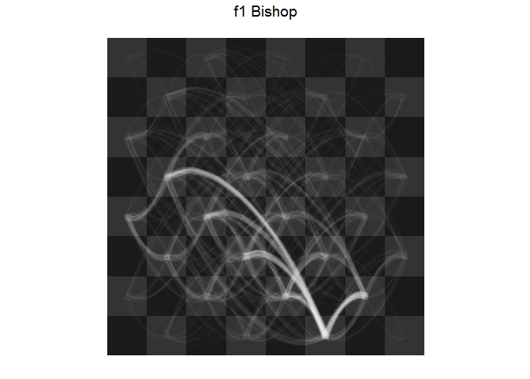
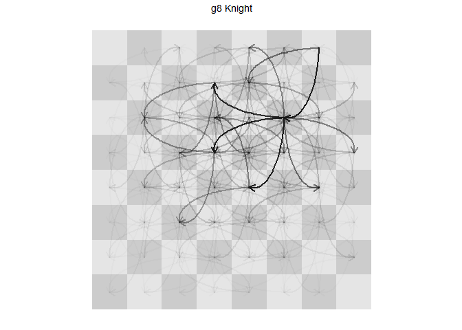

# Chess Vizs
Joshua Kunst  
There are nice visualizations from chess data: [piece movement](),
[piece survaviliy](), [square usage by player]().
Sadly not always the authors shows the code/data for replicate the final result.
So I write some code to show how to do some this great visualizations entirely in
R. Just for fun.

1. [The Data](#the-data)
1. [Piece Movements](#piece-movements)
1. [Suvival rates](#suvival-rates)
1. [Square usage by player](#square-usage-by-player)


### The Data ####
The original data data come from [here](http://www.theweekinchess.com/chessnews/events/fide-world-cup-2015)
which was parsed for example data in the [rchess]() package.


```r
library("rchess")
data(chesswc)
str(chesswc)
```

```
## Classes 'tbl_df', 'tbl' and 'data.frame':	1266 obs. of  11 variables:
##  $ event   : chr  "FIDE World Cup 2011" "FIDE World Cup 2011" "FIDE World Cup 2011" "FIDE World Cup 2011" ...
##  $ site    : chr  "Khanty-Mansiysk RUS" "Khanty-Mansiysk RUS" "Khanty-Mansiysk RUS" "Khanty-Mansiysk RUS" ...
##  $ date    : Date, format: "2011-08-28" "2011-08-28" ...
##  $ round   : num  1.1 1.1 1.1 1.1 1.1 1.1 1.1 1.1 1.1 1.1 ...
##  $ white   : chr  "Kaabi, Mejdi" "Ivanchuk, Vassily" "Ibrahim, Hatim" "Ponomariov, Ruslan" ...
##  $ black   : chr  "Karjakin, Sergey" "Steel, Henry Robert" "Mamedyarov, Shakhriyar" "Gwaze, Robert" ...
##  $ result  : chr  "0-1" "1-0" "0-1" "1-0" ...
##  $ whiteelo: int  2344 2768 2402 2764 2449 2746 2477 2741 2493 2736 ...
##  $ blackelo: int  2788 2362 2765 2434 2760 2452 2744 2480 2739 2493 ...
##  $ eco     : chr  "D15" "E68" "E67" "B40" ...
##  $ pgn     : chr  "1. d4 d5 2. Nf3 Nf6 3. c4 c6 4. Nc3 dxc4 5. e3 b5 6. a4 b4 7. Nb1 Ba6 8. Ne5 e6 9. Nxc4 c5 10. b3 cxd4 11. exd4 Nc6 12. Be3 Be7"| __truncated__ "1. c4 Nf6 2. Nc3 g6 3. g3 Bg7 4. Bg2 O-O 5. d4 d6 6. Nf3 Nbd7 7. O-O e5 8. e4 c6 9. Rb1 exd4 10. Nxd4 Re8 11. h3 Nc5 12. Re1 a5"| __truncated__ "1. Nf3 Nf6 2. c4 g6 3. Nc3 Bg7 4. g3 O-O 5. Bg2 d6 6. O-O Nbd7 7. d4 e5 8. b3 exd4 9. Nxd4 Re8 10. Bb2 Nc5 11. Qc2 h5 12. Rad1 "| __truncated__ "1. e4 c5 2. Nf3 e6 3. d3 Nc6 4. g3 e5 5. Bg2 d6 6. O-O Be7 7. c3 Nf6 8. Nbd2 O-O 9. a3 b5 10. Re1 Kh8 11. d4 Bd7 12. b4 cxd4 13"| __truncated__ ...
```

```r
chesswc %>% count(event)
```


event                    n
--------------------  ----
FIDE World Cup 2011    398
FIDE World Cup 2013    435
FIDE World Cup 2015    433

```r
chesswc <- chesswc %>% filter(event == "FIDE World Cup 2015")
```

The most important variable here is the [pgn](https://en.wikipedia.org/wiki/Portable_Game_Notation) game.
However the way to represent the game is not computer/visualization frienly (imo). That's is why
I implemented the `history_detail()` method for a `Chess` object.


```r
pgn <- sample(chesswc$pgn, size = 1)
str_sub(pgn, 0, 50)
```

```
## [1] "1. e4 e5 2. Nf3 Nc6 3. Bb5 Nf6 4. d3 Bc5 5. Bxc6 d"
```

```r
chss <- Chess$new()
chss$load_pgn(pgn)
```

```
## [1] TRUE
```

```r
chss$history_detail() %>%
  filter(piece == "White Queen")
```


piece         from   to    number_move   piece_number_move  status       number_move_capture  captured_by 
------------  -----  ---  ------------  ------------------  ----------  --------------------  ------------
White Queen   d1     e2             29                   1  NA                            NA  NA          
White Queen   e2     f2             31                   2  NA                            NA  NA          
White Queen   f2     g3             35                   3  NA                            NA  NA          
White Queen   g3     f2             37                   4  NA                            NA  NA          
White Queen   f2     e2             41                   5  NA                            NA  NA          
White Queen   e2     g2             45                   6  NA                            NA  NA          
White Queen   g2     f2             57                   7  NA                            NA  NA          
White Queen   f2     f1             81                   8  NA                            NA  NA          
White Queen   f1     d3             93                   9  NA                            NA  NA          
White Queen   d3     f1             95                  10  NA                            NA  NA          
White Queen   f1     h3             99                  11  NA                            NA  NA          
White Queen   h3     f1            103                  12  NA                            NA  NA          
White Queen   f1     f2            107                  13  NA                            NA  NA          
White Queen   f2     a7            113                  14  game over                     NA  NA          

The result is a dataframe where each row is a piece's movement showing explicitly the cells
where the travel in a particular number move. Now we apply this function over the 433
games in the last FIDE World cup.


```r
# library("foreach")
# library("doParallel")
# workers <- makeCluster(parallel::detectCores())
# registerDoParallel(workers)

chesswc <- chesswc %>% mutate(game_id = seq(nrow(.)))

dfmoves <- adply(chesswc %>% select(pgn, game_id), .margins = 1, function(x){
  chss <- Chess$new()
  chss$load_pgn(x$pgn)
  chss$history_detail()
  }, .parallel = FALSE, .paropts = list(.packages = c("rchess")))

dfmoves <- tbl_df(dfmoves) %>% select(-pgn)
dfmoves %>% filter(game_id == 1, piece == "g1 Knight")
```


 game_id  piece       from   to    number_move   piece_number_move  status       number_move_capture  captured_by 
--------  ----------  -----  ---  ------------  ------------------  ----------  --------------------  ------------
       1  g1 Knight   g1     f3              5                   1  NA                            NA  NA          
       1  g1 Knight   f3     h2             37                   2  NA                            NA  NA          
       1  g1 Knight   h2     g4             39                   3  NA                            NA  NA          
       1  g1 Knight   g4     f2             85                   4  game over                     NA  NA          

### Piece Movements #####
To try replicate the result it's necessary a data to represent (and then plot) the
board.


```r
dfboard <- rchess:::.chessboarddata() %>%
  select(cell, col, row, x, y, cc)

head(dfboard)
```


cell   col    row    x    y  cc 
-----  ----  ----  ---  ---  ---
a1     a        1    1    1  b  
b1     b        1    2    1  w  
c1     c        1    3    1  b  
d1     d        1    4    1  w  
e1     e        1    5    1  b  
f1     f        1    6    1  w  

```r
dfpaths <- dfmoves %>%
  left_join(dfboard %>% rename(from = cell, x.from = x, y.from = y), by = "from") %>%
  left_join(dfboard %>% rename(to = cell, x.to = x, y.to = y) %>% select(-cc, -col, -row), by = "to") %>%
  mutate(x_gt_y = abs(x.to - x.from) > abs(y.to - y.from),
         xy_sign = sign((x.to - x.from)*(y.to - y.from)) == 1,
         x_gt_y_equal_xy_sign = x_gt_y == xy_sign)
```

The data is ready! So we need now some `ggplot`, `geom_tile` for the board, the new `geom_curve`
to represent the piece's path and some `jitter` to make this more artistic`. Let's
start with the f1 Bishop.


```r
ggplot() +
  geom_tile(data = dfboard, aes(x, y, fill = cc)) +
  geom_curve(data = dfpaths %>% filter(piece == "f1 Bishop", x_gt_y_equal_xy_sign),
             aes(x = x.from, y = y.from, xend = x.to, yend = y.to),
             position = position_jitter(width = 0.2, height = 0.2),
             curvature = 0.50, angle = -45, alpha = 0.02, color = "white", size = 1.05) +
  geom_curve(data = dfpaths %>% filter(piece == "f1 Bishop", !x_gt_y_equal_xy_sign),
             aes(x = x.from, y = y.from, xend = x.to, yend = y.to),
             position = position_jitter(width = 0.2, height = 0.2),
             curvature = -0.50, angle = 45, alpha = 0.02, color = "white", size = 1.05) +
  scale_fill_manual(values =  c("gray10", "gray20")) +
  ggtitle("f1 Bishop") +
  coord_equal()
```

 

The same way we can plot the rest of the pieces.

 

I think it's look very similar to the original source.

### Suvival rates #####
The `dfmoves` is the heart from all these plots beacuse have a lot of information. For example,
if we filter for `!is.na(status)` we can know what happend with every piece in every game, if
a piece was caputered of never was captured in the game.


```r
dfsurvrates <- dfmoves %>%
  filter(!is.na(status)) %>%
  group_by(piece) %>%
  summarize(games = n(),
            was_captured = sum(status == "captured")) %>%
  mutate(surv_rate = 1 - was_captured/games)

dfsurvrates %>% arrange(desc(surv_rate)) %>% head()
```


piece         games   was_captured   surv_rate
-----------  ------  -------------  ----------
Black King      433              0   1.0000000
White King      433              0   1.0000000
h2 Pawn         433            121   0.7205543
h7 Pawn         433            148   0.6581986
g2 Pawn         433            150   0.6535797
g7 Pawn         433            160   0.6304850

This helps as validation because the kings are never caputred. Now we use a helper function in the
rchess package `rchess:::.chesspiecedata()` to get the start position for every piece and thne plot
the survival rates in the cell where the piece start in the game.


```r
dfsurvrates <- dfsurvrates %>%
  left_join(rchess:::.chesspiecedata() %>% select(start_position, piece = name, color, unicode),
            by = "piece") %>%
  full_join(dfboard %>% rename(start_position = cell),
            by = "start_position")

# Auxiliar data to plot the board
dfboard2 <- data_frame(x = 0:8 + 0.5, y = 0 + 0.5, xend = 0:8 + 0.5, yend = 8 + 0.5)

ggplot(dfsurvrates) +
  geom_tile(data = dfsurvrates %>% filter(!is.na(surv_rate)),
            aes(x, y, fill = surv_rate)) +
  scale_fill_gradient(low = "darkred",  high = "white") +
  geom_text(data = dfsurvrates %>% filter(!is.na(surv_rate)),
            aes(x, y, label = scales::percent(surv_rate)),
            color = "gray70", size = 3) +
  scale_x_continuous(breaks = 1:8, labels = letters[1:8]) +
  scale_y_continuous(breaks = 1:8, labels = 1:8)  +
  geom_segment(data = dfboard2, aes(x, y, xend = xend, yend = yend), color = "gray70") +
  geom_segment(data = dfboard2, aes(y, x, xend = yend, yend = xend), color = "gray70") +
  ggtitle("Survival Rates for each piece") + 
  coord_equal() + 
  theme_minimal() +
  theme(legend.position = "none")
```

 

Obviously the plot show same data in text and color, and there a lot of space without
information but the idea is use the chess board in fun(?) way. We can replace the
texts with the piece's icons:


```r
ggplot(dfsurvrates) +
  geom_tile(data = dfsurvrates %>% filter(!is.na(surv_rate)),
            aes(x, y, fill = 100*surv_rate)) +
  scale_fill_gradient(NULL, low = "darkred",  high = "white") +
  geom_text(data = dfsurvrates %>% filter(!is.na(surv_rate)),
            aes(x, y, label = unicode), size = 8, color = "gray20", alpha = 0.7) +
  scale_x_continuous(breaks = 1:8, labels = letters[1:8]) +
  scale_y_continuous(breaks = 1:8, labels = 1:8)  +
  geom_segment(data = dfboard2, aes(x, y, xend = xend, yend = yend), color = "gray70") +
  geom_segment(data = dfboard2, aes(y, x, xend = yend, yend = xend), color = "gray70") +
  ggtitle("Survival Rates for each piece") + 
  coord_equal() +
  theme_minimal() +
  theme(legend.position = "bottom")
```

 

### Square usage by player #####
For this visualization we will use the `to` variable. We select the player who have more
games in the table `chesswc`.


```r
count(chesswc, white) %>% arrange(desc(n)) %>% head(4)
```


white                n
-----------------  ---
Karjakin, Sergey    18
Svidler, Peter      15
Wei, Yi             12
Adams, Michael      11

```r
players <- count(chesswc, white) %>% arrange(desc(n)) %>% .$white %>% head(4)

dfmov_players <- ldply(players, function(p){ # p <- sample(players, size = 1)
  games <- chesswc %>% filter(white == p) %>% .$game_id
  dfres <- dfmoves %>%
    filter(game_id %in% games, !is.na(to)) %>%
    count(to) %>%
    mutate(player = p,
           p = n/length(games))
  dfres
})

dfmov_players <- dfmov_players %>%
  rename(cell = to) %>%
  left_join(dfboard, by = "cell")

ggplot(dfmov_players) +
  geom_tile(aes(x, row, fill = p)) +
  scale_fill_gradient("Movements to every cell\n(normalized by games)") +
  geom_text(aes(x, row, label = round(p, 2)), size = 2, color = "white", alpha = 0.5) +
  facet_wrap(~player) +
  scale_x_continuous(breaks = 1:8, labels = letters[1:8]) +
  scale_y_continuous(breaks = 1:8, labels = 1:8)  +
  geom_segment(data = dfboard2, aes(x, y, xend = xend, yend = yend), color = "gray70") +
  geom_segment(data = dfboard2, aes(y, x, xend = yend, yend = xend), color = "gray70") +
  coord_equal() +
  theme_minimal() +
  theme(legend.position = "bottom")
```

 

### Distributions for the first movement #####
Now, with the same data and using the `piece_number_move` and `number_move` we can obtain
the distribution for the first movement for each piece.


```r
piece_lvls <- rchess:::.chesspiecedata() %>%
  mutate(col = str_extract(start_position, "\\w{1}"),
         row = str_extract(start_position, "\\d{1}")) %>%
  arrange(desc(row), col) %>%
  .$name

dfmoves_first_mvm <- dfmoves %>%
  mutate(piece = factor(piece, levels = piece_lvls),
         number_move_2 = ifelse(number_move %% 2 == 0, number_move/2, (number_move + 1)/2 )) %>%
  filter(piece_number_move == 1)

ggplot(dfmoves_first_mvm) +
  geom_density(aes(number_move_2), fill = "#B71C1C", alpha = 0.8, color = NA) +
  scale_y_continuous(breaks = NULL) +
  facet_wrap(~piece, nrow = 4, ncol = 8, scales = "free_y")  +
  xlab("Density") + ylab("Number Move") + 
  xlim(0, 40) +
  theme_gray() +
  theme(text = element_text(size = 8), panel.background = element_rect(fill = "gray90"))
```

 

Notice the similarities between the White King and h1 Rook due the castling, the same
effect is present between the Black King and the h8 Rook.

### Who captures whom #####


```r
library("igraph")
library("ForceAtlas2")

dfcaputures <- dfmoves %>%
  filter(status == "captured") %>%
  count(piece, captured_by) %>%
  arrange(desc(n))

dfvertices <- rchess:::.chesspiecedata() %>%
  select(-fen, -start_position) %>%
  mutate(color = ifelse(color == "w", "gray20", "gray80"),
         name2 = str_replace(name, " \\w+$", unicode),
         name2 = str_replace(name2, "White|Black", ""),
         size = ifelse(str_length(name2) == 1, 7, 5))

g <- graph.data.frame(dfcaputures %>% select(captured_by, piece, weight = n),
                      directed = TRUE,
                      vertices = dfvertices)

set.seed(123)
lout <- layout.forceatlas2(g, iterations = 10000, plotstep = 0)

dfvertices <- dfvertices %>%
  mutate(x = lout[, 1],
         y = lout[, 2])

dfedges <- as_data_frame(g, "edges") %>%
  tbl_df() %>%
  left_join(dfvertices %>% select(from = name, x, y), by = "from") %>%
  left_join(dfvertices %>% select(to = name, xend = x, yend = y), by = "to")
```

```r
ggplot() +
  geom_curve(data = dfedges %>% filter((str_extract(from, "\\d+") %in% c(1, 2) | str_detect(from, "White"))),
             aes(x, y, xend = xend, yend = yend, alpha = weight, size = weight),
             curvature = 0.1, color = "red") +
  geom_curve(data = dfedges %>% filter(!(str_extract(from, "\\d+") %in% c(1, 2) | str_detect(from, "White"))),
             aes(x, y, xend = xend, yend = yend, alpha = weight, size = weight),
             curvature = 0.1, color = "blue") +
  scale_alpha(range = c(0.01, 0.5)) +
  scale_size(range = c(0.01, 2)) +
  geom_point(data = dfvertices, aes(x, y, color = color), size = 15, alpha = 0.9) +
  scale_color_manual(values = c("gray90", "gray10")) +
  geom_text(data = dfvertices, aes(x, y, label = name2, size), color = "gray50") +
  ggtitle("Red: white captures black | Blue: black captures white")
```

 


---
title: "readme.R"
author: "Joshua K"
date: "Thu Oct 29 23:34:30 2015"
---
