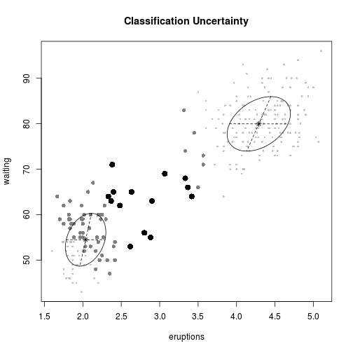

# mclust 


```r
# http://joelcadwell.blogspot.com/2014/03/warning-clusters-may-appear-more_23.html
# Warning: Clusters May Appear More Separated in Textbooks than in Practice
# attach faithful data set
data(faithful)
plot(faithful, pch = "+")
```

 

```r

# run mclust on faithful data
require(mclust)
```

```
## Loading required package: mclust
## Package 'mclust' version 4.2
```

```r
faithfulMclust <- Mclust(faithful, G = 2)
summary(faithfulMclust, parameters = TRUE)
```

```
## ----------------------------------------------------
## Gaussian finite mixture model fitted by EM algorithm 
## ----------------------------------------------------
## 
## Mclust VVV (ellipsoidal, varying volume, shape, and orientation) model with 2 components:
## 
##  log.likelihood   n df   BIC   ICL
##           -1130 272 11 -2322 -2323
## 
## Clustering table:
##   1   2 
## 175  97 
## 
## Mixing probabilities:
##      1      2 
## 0.6441 0.3559 
## 
## Means:
##            [,1]   [,2]
## eruptions  4.29  2.037
## waiting   79.97 54.480
## 
## Variances:
## [,,1]
##           eruptions waiting
## eruptions    0.1698   0.938
## waiting      0.9380  36.017
## [,,2]
##           eruptions waiting
## eruptions   0.06931  0.4367
## waiting     0.43669 33.7078
```

```r
plot(faithfulMclust)
```

    

```r

# create 3 segment data set
require(MASS)
```

```
## Loading required package: MASS
```

```r
sigma <- matrix(c(1, 0.6, 0.6, 1), 2, 2)
mean1 <- c(-1, -1)
mean2 <- c(0, 0)
mean3 <- c(2, 2)

set.seed(3202014)

mydata1 <- mvrnorm(n = 100, mean1, sigma)
mydata2 <- mvrnorm(n = 100, mean2, sigma)
mydata3 <- mvrnorm(n = 100, mean3, sigma)
mydata <- rbind(mydata1, mydata2, mydata3)
colnames(mydata) <- c("Desired Level of Quality", "Willingness to Pay")
plot(mydata, pch = "+")
```

 

```r

# run Mclust with 3 segments
mydataClust <- Mclust(mydata, G = 3)
summary(mydataClust, parameters = TRUE)
```

```
## ----------------------------------------------------
## Gaussian finite mixture model fitted by EM algorithm 
## ----------------------------------------------------
## 
## Mclust EEE (elliposidal, equal volume, shape and orientation) model with 3 components:
## 
##  log.likelihood   n df   BIC   ICL
##          -917.2 300 11 -1897 -2031
## 
## Clustering table:
##   1   2   3 
## 123  94  83 
## 
## Mixing probabilities:
##      1      2      3 
## 0.3998 0.3166 0.2836 
## 
## Means:
##                            [,1]   [,2]  [,3]
## Desired Level of Quality -1.112 0.3338 2.305
## Willingness to Pay       -1.082 0.2801 2.200
## 
## Variances:
## [,,1]
##                          Desired Level of Quality Willingness to Pay
## Desired Level of Quality                   0.7963             0.3765
## Willingness to Pay                         0.3765             0.6839
## [,,2]
##                          Desired Level of Quality Willingness to Pay
## Desired Level of Quality                   0.7963             0.3765
## Willingness to Pay                         0.3765             0.6839
## [,,3]
##                          Desired Level of Quality Willingness to Pay
## Desired Level of Quality                   0.7963             0.3765
## Willingness to Pay                         0.3765             0.6839
```

```r
plot(mydataClust)
```

    

```r

# let Mclust decide on number of segments
mydataClust <- Mclust(mydata)
summary(mydataClust, parameters = TRUE)
```

```
## ----------------------------------------------------
## Gaussian finite mixture model fitted by EM algorithm 
## ----------------------------------------------------
## 
## Mclust EEE (elliposidal, equal volume, shape and orientation) model with 2 components:
## 
##  log.likelihood   n df   BIC   ICL
##          -918.7 300  8 -1883 -1939
## 
## Clustering table:
##   1   2 
## 191 109 
## 
## Mixing probabilities:
##      1      2 
## 0.6303 0.3697 
## 
## Means:
##                             [,1]  [,2]
## Desired Level of Quality -0.6562 1.970
## Willingness to Pay       -0.6682 1.897
## 
## Variances:
## [,,1]
##                          Desired Level of Quality Willingness to Pay
## Desired Level of Quality                   1.1263             0.6669
## Willingness to Pay                         0.6669             0.9371
## [,,2]
##                          Desired Level of Quality Willingness to Pay
## Desired Level of Quality                   1.1263             0.6669
## Willingness to Pay                         0.6669             0.9371
```

